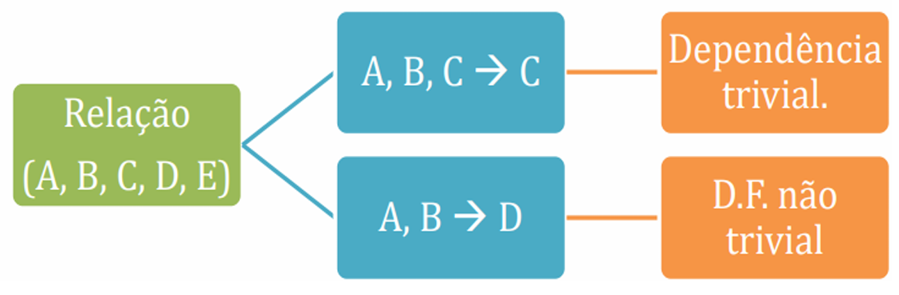
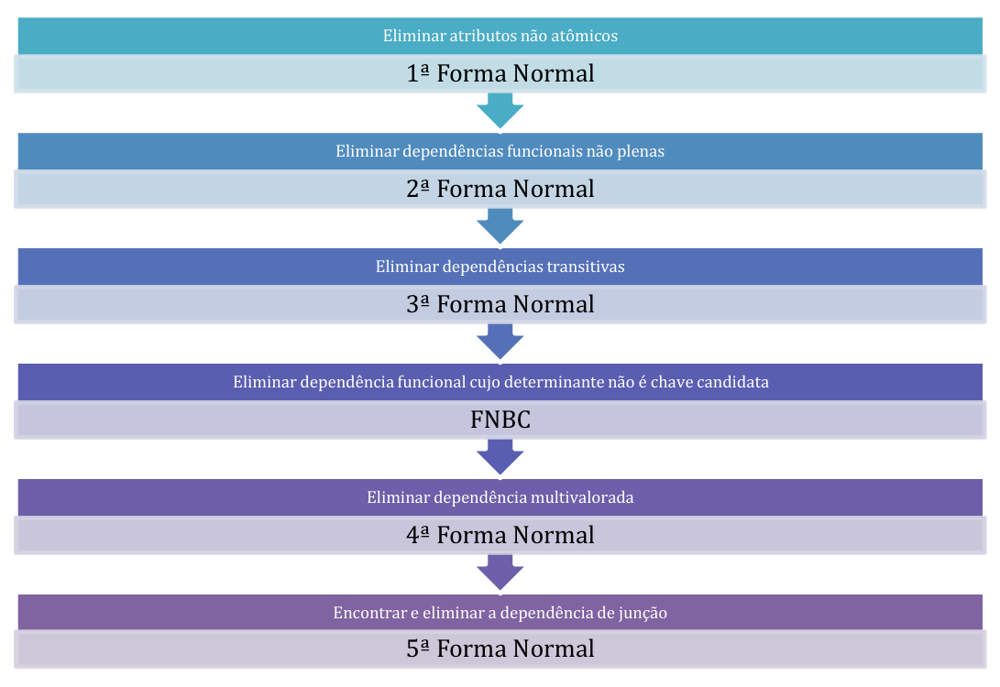

# Capítulo 13 – Modelo Relacional: Normalização

## Introdução à Normalização

No contexto de bancos de dados, o termo **normalização** refere-se a um processo sistemático cujo objetivo é organizar os dados de forma que se eliminem **redundâncias** e **anomalias de modificação**. Mas o que exatamente significa “organizar” os dados?

Imagine que um banco de dados represente informações sobre compras realizadas por clientes. Naturalmente, uma má organização desses dados pode fazer com que informações como nome, endereço ou CPF de um mesmo cliente sejam repetidas diversas vezes em diferentes registros. Essa repetição não apenas ocupa espaço, como também se torna um risco à integridade dos dados.

Tomemos como exemplo a seguinte **tabela VENDAS**, que representa compras feitas por um mesmo cliente:

|Cod_Compra|Nome|Endereço|CPF|Produto|
|---|---|---|---|---|
|1|Thiago|SQSW 302|99999999999|Caneta|
|2|Thiago|SQSW 302|99999999999|Livro|
|3|Thiago|SQSW 302|99999999999|Borracha|

Neste cenário, o cliente “Thiago” aparece diversas vezes, com as mesmas informações de endereço e CPF. Agora, suponha que esse cliente tenha mudado de endereço e essa atualização tenha sido feita **apenas na primeira linha** da tabela. Observe o que ocorre:

|Cod_Compra|Nome|Endereço|CPF|Produto|
|---|---|---|---|---|
|1|Thiago|SQSW 304|99999999999|Caneta|
|2|Thiago|SQSW 302|99999999999|Livro|
|3|Thiago|SQSW 302|99999999999|Borracha|

O resultado é uma **anomalia de atualização**: o mesmo cliente agora possui dois endereços diferentes registrados. Isso compromete a confiabilidade dos dados, gerando confusão e potencial inconsistência nas análises futuras.

A normalização atua diretamente sobre esse problema. Ao reorganizar os dados, podemos separar as informações do cliente em uma tabela própria, ficando a tabela de VENDAS apenas com os dados da compra:

**Tabela VENDAS:**

|Cod_Compra|CPF|Produto|
|---|---|---|
|1|99999999999|Caneta|
|2|99999999999|Livro|
|3|99999999999|Borracha|

**Tabela CLIENTE:**

|Nome|Endereço|CPF|
|---|---|---|
|Thiago|SQSW 304|99999999999|

Agora, qualquer alteração no endereço de Thiago será feita **em um único local**, evitando anomalias de atualização e diminuindo a redundância. Essa reorganização é o cerne do processo de normalização.

## Fundamentos e Objetivos da Normalização

O conceito de normalização foi formalmente proposto por **E. F. Codd**, o mesmo cientista que definiu o modelo relacional. Em 1972, Codd apresentou as **formas normais**, que são critérios progressivos de qualidade para a estrutura de uma tabela (ou relação). O processo de normalização submete os esquemas de relação a uma sequência de testes e transformações, assegurando que os dados estejam dispostos de forma **coerente, lógica e sem redundância indevida**.

A **finalidade da normalização** é garantir que os dados armazenados estejam livres de:

- **Redundância desnecessária**: a repetição de informações em várias partes do banco.
- **Anomalias de inserção**: dificuldade para adicionar um novo registro devido a dependências indesejadas.
- **Anomalias de atualização**: inconsistências causadas por modificações parciais em registros redundantes.
- **Anomalias de exclusão**: perda acidental de informações importantes ao se excluir um dado aparentemente irrelevante.

### Definição Formal de Normalização

Formalmente, a normalização pode ser definida da seguinte forma:

> A normalização é uma técnica de **decomposição de relações**, cujo objetivo é **organizar os dados** em estruturas **menores e mais consistentes**, minimizando a redundância e eliminando anomalias de modificação.

A decomposição ocorre quando uma tabela é dividida em duas ou mais tabelas menores, preservando a integridade dos dados e os relacionamentos lógicos entre as entidades representadas.

É importante observar que a normalização não é um fim em si mesma, mas um **meio para alcançar um modelo lógico limpo, coerente e de fácil manutenção**. Como consequência, ela também favorece a eficiência da consulta, a integridade referencial e a escalabilidade do banco de dados.

### Aplicação Incremental: as Formas Normais

As transformações que conduzem à normalização são baseadas em **formas normais**, que são como "níveis" de organização lógica dos dados. Quanto maior a forma normal atingida por uma tabela, mais refinada será sua estrutura.

Originalmente, Codd definiu as **três primeiras formas normais (1FN, 2FN e 3FN)**, todas baseadas na ideia de **dependência funcional** entre os atributos da relação. Posteriormente, foi introduzida a **Forma Normal de Boyce-Codd (FNBC)**, uma variação mais rigorosa da 3FN. Além dessas, outras formas normais mais avançadas também existem, como a 4FN e a 5FN, voltadas para cenários com dependências multivaloradas e junções complexas.

Antes de seguir para o estudo específico de cada forma normal, é essencial compreender alguns conceitos fundamentais, como:

- **Dependência funcional**
- **Chave primária, chave candidata e superchave**
- **Atributos primários e não primários**

Esses conceitos serão abordados nos próximos tópicos, pois são a base para o correto entendimento da teoria da normalização e sua aplicação prática no projeto lógico de bancos de dados.

## Dependência Funcional: Fundamento da Estrutura Lógica

No coração da teoria da normalização de dados está um conceito essencial: a **dependência funcional**. Essa ideia define, de forma precisa, como os atributos (ou colunas) de uma tabela se relacionam entre si. Para que possamos compreender as formas normais e aplicá-las corretamente em projetos de banco de dados, é imprescindível entender o que significa afirmar que um atributo “depende funcionalmente” de outro.

### O que é Dependência Funcional?

Dizemos que existe uma **dependência funcional** entre dois conjuntos de atributos X e Y de uma relação R, representada pela notação **X → Y**, quando, para **cada valor de X**, existe **no máximo um valor de Y**. Em outras palavras, se conhecemos o valor de X, podemos saber exatamente o valor correspondente de Y.

Essa definição parece teórica, mas é fácil visualizá-la com um exemplo. Considere a seguinte tabela de alunos de uma universidade:

|CPFAluno|CidadeAluno|Turma|
|---|---|---|
|00000000000|Recife|A|
|11111111111|Brasília|B|
|22222222222|Fortaleza|C|
|33333333333|Ceilândia|D|
|44444444444|João Pessoa|E|

Se observarmos com atenção, percebemos que **o mesmo CPF nunca aparece mais de uma vez**. Isso significa que o CPF identifica de forma única o aluno. Assim, podemos afirmar que:

**CPFAluno → CidadeAluno**  
**CPFAluno → Turma**

Essas expressões indicam que, para cada valor único de **CPFAluno**, existe um único valor correspondente para **CidadeAluno** e para **Turma**. O **atributo à esquerda da seta (→)** é chamado de **determinante**, pois determina o valor do atributo à direita, conhecido como **determinado**.

### Visualizando a Dependência na Prática

Retomando nosso exemplo, suponha agora que examinamos a seguinte tabela:

|Cod_Compra|Nome|Endereço|CPF|Produto|
|---|---|---|---|---|
|1|Thiago|SQSW 302|99999999999|Caneta|
|2|Thiago|SQSW 302|99999999999|Livro|
|3|Thiago|SQSW 302|99999999999|Borracha|

Perceba que o nome “Thiago” está associado a um único endereço. Isso sugere a dependência funcional:  
**Nome → Endereço**

Formalmente, a definição nos diz que **se duas tuplas têm o mesmo valor para o atributo Nome, então também terão o mesmo valor para o atributo Endereço**. Em termos matemáticos:

Se t₁[Nome] = t₂[Nome], então t₁[Endereço] = t₂[Endereço]

Esse tipo de análise é fundamental no projeto de esquemas, pois identifica quais atributos **dependem diretamente de outros** e, por consequência, orienta a decomposição correta de tabelas.

### Dependências Triviais e Não Triviais

Nem toda dependência funcional é útil para fins de normalização. Algumas são chamadas de **triviais**, e outras, **não triviais**.

- **Dependência funcional trivial** ocorre quando o atributo determinado já está contido no conjunto determinante.  
    Exemplo: A, B, C → C  
    Como C já está no lado esquerdo, a dependência é evidente e, por isso, trivial.
- **Dependência funcional não trivial** ocorre quando o atributo do lado direito **não** está presente no lado esquerdo.  
    Exemplo: A, B → D  
    Essa dependência é significativa e pode indicar a necessidade de reestruturação da relação.

A figura a seguir ilustra esses dois tipos:

  

### Axiomas de Armstrong

A análise e inferência de dependências funcionais em um conjunto de atributos são baseadas em um conjunto de regras chamadas **Axiomas de Armstrong**, que fornecem um sistema formal de dedução. Essas regras são fundamentais para identificar todas as dependências funcionais implicadas por um conjunto inicial conhecido.

As três **regras básicas** são:

1. **Reflexividade**  
    Se Y ⊆ X, então X → Y  
    Exemplo: Se temos o conjunto de atributos (A, B, C), então (A, B) → A é uma dependência válida.
2. **Aumentação (Augmentação)**  
    Se X → Y, então XZ → YZ  
    Isso significa que podemos adicionar atributos iguais aos dois lados da dependência sem invalidá-la.
3. **Transitividade**  
    Se X → Y e Y → Z, então X → Z  
    Um conceito semelhante ao encadeamento lógico: se A determina B e B determina C, então A determina C.

Além dos axiomas principais, há outras regras que podem ser derivadas deles. Estas são amplamente utilizadas no contexto prático de modelagem e normalização:

- **Decomposição** (Analysis):  
    Se X → YZ, então X → Y e X → Z  
    Se um conjunto de atributos determina um conjunto de outros atributos, então ele também determina cada um dos atributos individualmente.
- **União** (Synthesis):  
    Se X → Y e X → Z, então X → YZ  
    Se um conjunto de atributos determina dois outros conjuntos de atributos separadamente, então ele também determina a união desses conjuntos.
- **Pseudotransitividade**:  
    Se X → Y e YW → Z, então XW → Z  
    Permite a dedução de novas dependências funcionais quando há uma dependência em cadeia, mesmo que não seja uma relação direta entre os atributos em questão.
- **Reflexividade ou Autodeterminação** (forma trivial):  
    Se Y ⊆ X, então X → Y  
    Um conjunto de atributos determina subconjuntos de si mesmo.
- **Junção**:  
    Se X → Y e X → Z, então X → YZ  
    Similar à regra da União, mas é mais restritiva, pois requer que a dependência funcional seja a mesma em ambas as relações.
- **Acumulação**:  
    Se X → Y, então XZ → Y  
    Adiciona atributos ao lado esquerdo mantendo a DF válida.

A tabela a seguir resume essas regras e os próprios axiomas:

|Axiomas / Regras|Descrição|
|---|---|
|**Reflexividade**|X ⊆ Y ⇒ Y → X|
|**Augmentação/Aumentação**|X → Y ⇒ XZ → YZ|
|**Transitividade**|(X → Y) ∧ (Y → Z) ⇒ X → Z|
|**Decomposição (Analysis)**|Se X → YZ, então X → Y e X → Z|
|**União (Synthesis)**|Se X → Y e X → Z, então X → YZ|
|**Pseudotransitividade**|Se X → Y e YW → Z, então XW → Z|
|**Reflexividade/Autodeterminação (Trivial)**|Se Y ⊆ X, então X → Y|
|**Junção**|Se X → Y e X → Z, então X → YZ|
|**Acumulação**|Se X → Y, então XZ → Y|

Essas regras permitem deduzir, a partir de um conjunto inicial de dependências, todas as outras que devem ser verdadeiras para manter a **coerência lógica** do modelo relacional.

## Superchave, Chave Candidata e Chave Primária: A Base da Identificação Única

Em um banco de dados relacional, o conceito de **chave** é essencial. É a chave que garante a **unicidade de cada tupla** (linha) em uma relação, permitindo que cada registro seja individualmente identificado. Sem ela, perderíamos o controle sobre os dados e comprometeríamos a integridade da informação.

### Superchave: Um Conjunto Identificador

Vamos começar pelo conceito mais abrangente: a **superchave**. Uma **superchave** é **qualquer conjunto de atributos** de uma relação R = {A₁, A₂, ..., Aₙ} que consiga **identificar unicamente** cada tupla dentro daquela relação. Ou seja, em uma superchave S ⊆ R, **não podem existir duas tuplas t₁ e t₂ que possuam os mesmos valores para todos os atributos em S**.

Formalmente, dizemos que S é uma superchave de R se, para quaisquer tuplas t₁ e t₂ pertencentes ao conjunto de tuplas da relação, **t₁[S] ≠ t₂[S]**.

Pense em uma tabela de funcionários:

|CPF|Nome|Matrícula|Cargo|
|---|---|---|---|
|12345678900|Ana Beatriz|0001|Analista|
|98765432100|Paulo Souza|0002|Gerente|

Nesse exemplo, tanto o **CPF** quanto a **Matrícula** são únicos por funcionário. Portanto, os conjuntos {CPF}, {Matrícula}, e até mesmo {CPF, Nome}, {CPF, Matrícula, Cargo} são **superchaves**, pois todos identificam de forma única uma tupla. Repare, no entanto, que algumas dessas superchaves possuem **atributos redundantes**, o que nos leva ao próximo conceito.

### Chave Candidata: A Superchave Irredutível

Uma **chave candidata** é uma **superchave mínima**. Isso significa que **nenhum dos atributos da chave pode ser retirado sem que a unicidade seja perdida**. Em termos simples: é a superchave **sem sobras**.

No nosso exemplo anterior, tanto {CPF} quanto {Matrícula} são **chaves candidatas**, pois ambas identificam unicamente um funcionário e **não há atributo redundante**. Por outro lado, {CPF, Nome} não é uma chave candidata, pois o atributo Nome é redundante — ele pode ser retirado sem prejudicar a unicidade proporcionada por CPF.

Uma tabela pode ter **várias chaves candidatas**. E isso é bastante comum. Quando isso ocorre, uma dessas chaves candidatas deve ser **escolhida pelo projetista do banco de dados** para atuar como a **chave primária**. As demais chaves candidatas, embora não utilizadas como primária, continuam válidas e são chamadas de **chaves alternativas** ou **chaves secundárias**.

### Chave Primária: A Escolhida do Conjunto

A **chave primária** (ou **primary key**) é a **chave candidata escolhida** para **representar a identidade da tupla**. É com ela que o sistema de banco de dados irá estruturar internamente os dados, definir relacionamentos com outras tabelas (por meio das chamadas **chaves estrangeiras**) e aplicar restrições como a **proibição de valores nulos** e **duplicatas**.

No nosso exemplo dos funcionários, se o projetista optar por usar o CPF como chave primária, temos:

- **Chave Primária**: {CPF}  
- **Chave Alternativa**: {Matrícula}

Além disso, ao definir uma chave primária, todos os atributos que compõem essa chave são chamados de **atributos primários**. Por consequência, qualquer outro atributo da relação que **não participe de nenhuma chave candidata** é classificado como **atributo não primário**.

### A Importância das Chaves para a Normalização

Compreender a diferença entre **superchave**, **chave candidata**, **chave primária** e **atributo primário** é essencial, pois as formas normais — que veremos a seguir — se baseiam na identificação e no tratamento das **dependências funcionais** relacionadas às chaves.

Na **Primeira Forma Normal**, o foco está na atomicidade dos atributos e na ausência de repetições. Já a **Segunda** e a **Terceira Formas Normais**, assim como a **Forma Normal de Boyce-Codd**, são construídas com base em dependências funcionais **relacionadas a chaves**: a depender se um atributo está funcionalmente dependente de **toda** a chave primária ou apenas de **parte dela**; ou ainda, se está dependente de **outra chave candidata** que não a primária.

Portanto, saber identificar corretamente as chaves de uma relação não é apenas uma tarefa técnica: é a base teórica indispensável para garantir **modelos corretos, sem redundância e livres de anomalias de modificação**.

## Primeira Forma Normal (1FN): Atomicidade dos Dados como Fundamento do Modelo Relacional

A **Primeira Forma Normal (1FN)** representa o primeiro passo no processo de normalização de um banco de dados. Apesar de parecer simples à primeira vista, ela desempenha um papel essencial ao garantir que os dados estejam organizados de forma que possam ser tratados corretamente pelo modelo relacional.

Para compreendê-la com profundidade, é importante reconhecer que **a 1FN está intrinsecamente associada à própria definição de relação** no contexto do modelo relacional proposto por E. F. Codd. De fato, **nenhuma relação que viole a 1FN pode ser considerada válida dentro do modelo relacional puro**.

### A Definição Essencial da 1FN

A 1FN estabelece que, para que uma relação seja considerada válida, **todos os atributos devem possuir domínios atômicos**. Isso significa que os **valores armazenados em cada célula da tabela devem ser indivisíveis**: cada campo deve conter apenas um valor simples, e não múltiplos valores ou estruturas compostas.

Em outras palavras, uma tabela não deve conter:

- **Atributos compostos**, que agrupam informações de tipos distintos (como um campo "Endereço" contendo rua, número, bairro e CEP).
- **Atributos multivalorados**, que armazenam mais de um valor para um mesmo campo em uma única tupla (como uma coluna "Telefones" com dois ou mais números separados por vírgula).

Essas situações violam diretamente a 1FN, pois **quebram o princípio da atomicidade**, prejudicando a legibilidade, manutenção e integridade do banco de dados.

### Exemplo Prático

Vamos analisar um exemplo prático, em que temos uma relação `ALUNO` que armazena os dados de três estudantes. Note como a estrutura original da tabela possui problemas evidentes de atomicidade:

|Código_Aluno|Nome|Telefones|Endereço|
|---|---|---|---|
|A001|Fabrício Ribeiro|99564-9453, 98432-1234|Rua 17 de julho, 98, Morumbi, 12635-965|
|B001|Carlos Normando|–|Rua Águas de Março, 16, Rio de Janeiro, 54532-098|
|C001|Emerson Pimentel|92834-5697, 91283-4309|Praça Ramos 15, Liberdade, 66858-633|

Nesta tabela, a coluna **Telefones** armazena múltiplos valores, e a coluna **Endereço** agrupa diferentes informações (logradouro, número, bairro, CEP) em um único campo. Ambas as situações violam a 1FN.

Para corrigir essa violação, devemos tomar **duas atitudes distintas**:

1. **Separar os atributos compostos** em colunas distintas.
2. **Criar uma nova relação para os atributos multivalorados**, com base na repetição controlada por chaves.

Vamos começar com a decomposição da coluna multivalorada **Telefones**. Isso requer a criação de uma nova tabela que relaciona cada aluno a seus respectivos números de telefone:

**Relação TELEFONE_ALUNO:**

|Código_Aluno|Telefone|
|---|---|
|A001|99564-9453|
|A001|98432-1234|
|C001|92834-5697|
|C001|91283-4309|

A chave primária dessa nova relação é composta por **Código_Aluno** e **Telefone**, garantindo a unicidade dos registros e preservando a integridade dos dados.

Agora, voltemos à relação principal e tratemos a coluna **Endereço**, que deve ser desmembrada em múltiplas colunas, cada uma correspondendo a um componente atômico:

**Relação ALUNO (agora conforme a 1FN):**

|Código_Aluno|Nome|Logradouro|Número|Bairro|CEP|
|---|---|---|---|---|---|
|A001|Fabrício Ribeiro|Rua 17 de julho|98|Morumbi|12635-965|
|B001|Carlos Normando|Rua Águas de Março|16|Rio de Janeiro|54532-098|
|C001|Emerson Pimentel|Praça Ramos|15|Liberdade|66858-633|

Agora sim, todas as colunas possuem **valores simples e indivisíveis**, ou seja, **atômicos**, e a tabela satisfaz completamente os requisitos da Primeira Forma Normal.

### Definições Acadêmicas

Diversos autores apresentam definições equivalentes sobre a 1FN, cada uma reforçando um aspecto importante:

- "Uma relação R está na Primeira Forma Normal se, e somente se, todos os seus domínios subjacentes contiverem apenas valores atômicos."
- "No modelo relacional, um domínio é atômico se os elementos desse domínio forem considerados unidades indivisíveis."
- "Um esquema de relação R está em 1FN se todos os seus atributos forem atômicos."
- "A 1FN impede a presença de relações aninhadas ou atributos multivalorados, situações que não são aceitas no modelo relacional puro."

Essas definições reforçam o mesmo princípio: **garantir que cada célula da tabela contenha apenas um valor simples**, viabilizando o uso eficiente de operações relacionais, como projeção, seleção e junção, e evitando as anomalias de repetição e ambiguidade.

A **Primeira Forma Normal** é frequentemente ignorada por projetistas iniciantes, justamente por parecer “óbvia”. Porém, é comum encontrar bancos de dados que armazenam telefones, e-mails, endereços e até listas de códigos em um único campo de uma tabela. Isso não apenas compromete o funcionamento do banco, como impede a aplicação correta das formas normais seguintes.

A 1FN representa **a base de um projeto relacional bem estruturado**. Sem ela, não se pode falar em normalização nem em consistência lógica dos dados. A partir da 1FN, podemos avançar para identificar as dependências entre os atributos e, então, aplicar as demais formas normais que discutiremos a seguir.

## Segunda Forma Normal (2FN): Eliminando Dependências Parciais para Maior Coesão

A **Segunda Forma Normal (2FN)** é o passo seguinte ao atingimento da 1FN no processo de normalização de um esquema relacional. Enquanto a 1FN assegura a atomicidade dos dados, a 2FN foca na eliminação das chamadas **dependências funcionais parciais**, que afetam relações com **chaves compostas**. Esse tipo de anomalia, embora mais sutil do que atributos multivalorados ou compostos, pode comprometer significativamente a integridade lógica e a eficiência do banco de dados.

### Entendendo a Dependência Parcial

Chamamos de **dependência funcional parcial** a situação em que **um atributo não primário depende de apenas parte da chave primária composta**. Para que uma tabela esteja de fato em 2FN, é necessário que **todos os atributos não primários dependam funcionalmente da totalidade da chave primária** — e não apenas de uma parte dela.

Isso significa que, se uma relação possui uma chave composta (por exemplo, formada pelos atributos A e B), então **nenhum outro atributo pode depender apenas de A ou apenas de B**. Todos os atributos não pertencentes à chave devem depender **conjuntamente** de A e B.

Se essa regra não for obedecida, a tabela poderá conter **redundância desnecessária** e estará suscetível a anomalias de inserção, atualização e exclusão.

### Exemplo Prático

Considere a seguinte tabela:

|Cod_Compra|CPF|Nome|Endereço|Produto|
|---|---|---|---|---|
|1|99999999999|Thiago|SQSW 302|Caneta|
|2|99999999999|Thiago|SQSW 302|Livro|
|3|88888888888|Flávia|SQSW 304|Borracha|

A chave primária composta desta tabela é formada pelos atributos **Cod_Compra** e **CPF**, pois juntos eles identificam unicamente cada linha da relação. No entanto, podemos observar que o atributo **CPF**, sozinho, já determina os valores dos atributos **Nome** e **Endereço**.

Ou seja, temos aqui:

- **CPF → Nome**
- **CPF → Endereço**

Esse comportamento caracteriza uma **dependência parcial**, pois os atributos Nome e Endereço **dependem de apenas uma parte da chave primária composta**. Como consequência, há **redundância** e **risco de inconsistência**, já que uma alteração no nome ou endereço de um cliente exigiria que todas as linhas associadas ao seu CPF fossem atualizadas — o que nem sempre acontece, como vimos no exemplo da 1FN.

Para eliminar essa dependência parcial, devemos **separar os atributos que dependem apenas de parte da chave em uma nova relação**. Dessa forma, mantemos a integridade e eliminamos a repetição de dados.

**Relação VENDAS:**

|Cod_Compra|CPF|Produto|
|---|---|---|
|1|99999999999|Caneta|
|2|99999999999|Livro|
|3|88888888888|Borracha|

**Relação CLIENTE:**

|CPF|Nome|Endereço|
|---|---|---|
|99999999999|Thiago|SQSW 302|
|88888888888|Flávia|SQSW 304|

Após a decomposição, os atributos Nome e Endereço são movidos para uma nova relação onde são **totalmente dependentes da chave primária (CPF)**. Já na tabela original, todos os atributos não chave (neste caso, Produto) permanecem **totalmente dependentes da chave composta**, eliminando assim a dependência parcial.

### Definições Acadêmicas

Podemos encontrar na literatura diversas definições equivalentes da 2FN, todas voltadas para o mesmo princípio da eliminação das dependências parciais. Entre as principais:

- “Um esquema de relação R está na Segunda Forma Normal se cada atributo não primário A de R for totalmente funcionalmente dependente de toda a chave primária.”
- “Uma tabela está na 2FN se estiver na 1FN e não contiver nenhuma dependência funcional parcial entre os atributos não chave e a chave composta.”
- “A 2FN busca assegurar que cada coluna não chave dependa da totalidade da chave e não de parte dela.”

Um detalhe importante: **a Segunda Forma Normal é irrelevante para tabelas cuja chave primária seja simples (isto é, composta por apenas um atributo)**. Nesse caso, não há “parte da chave” para causar dependência parcial, então tais tabelas já satisfazem a 2FN se estiverem em 1FN.

O principal ganho ao atingir a Segunda Forma Normal é a **eliminação de redundância que não depende diretamente da estrutura das transações**. Isso ajuda a evitar atualizações incorretas e minimiza os efeitos colaterais quando um dado precisa ser alterado em múltiplas linhas da mesma tabela.

Dessa forma, a 2FN fortalece a **coesão semântica** entre os atributos de uma relação, estabelecendo a base necessária para o avanço à Terceira Forma Normal (3FN), que trata das **dependências transitivas**, tema do próximo tópico.

## Terceira Forma Normal (3FN): Evitando Dependências Transitivas

A **Terceira Forma Normal (3FN)** é uma das etapas mais importantes no processo de normalização. Ela complementa e fortalece os objetivos da 1FN e da 2FN ao **eliminar um tipo mais sutil de redundância**: a **dependência funcional transitiva** entre atributos.

Como já vimos, a **Primeira Forma Normal** assegura que todos os atributos sejam atômicos, e a **Segunda Forma Normal** remove dependências parciais de chaves compostas. A 3FN, por sua vez, exige que **os atributos não primários dependam diretamente das chaves** — e não de outros atributos que, por sua vez, dependem da chave.

### Definição Formal

Um esquema de relação R está na **Terceira Forma Normal (3FN)** se, e somente se:

- R está na Segunda Forma Normal (2FN); **e**
- Não existe nenhuma **dependência funcional transitiva** entre atributos não chave.

Mais precisamente, uma dependência funcional não trivial do tipo **X → A** é permitida apenas se:

- **X for uma superchave** da relação, **ou**
- **A for um atributo primário**, ou seja, faz parte de alguma chave candidata.

Essa definição foi formalizada e amplamente divulgada por autores como **Ramez Elmasri** e **Navathe**, e pode ser resumida da seguinte maneira:

> Em uma relação em 3FN, todo atributo não chave deve depender direta e exclusivamente de uma chave candidata, e não de outro atributo não chave.

### Entendendo a Dependência Transitiva

Antes de prosseguir com a aplicação da 3FN, é essencial compreender o que significa uma **dependência funcional transitiva**. Podemos dizer que uma dependência é transitiva quando:

- Existe um atributo **A** (chave primária ou candidata),
- Que determina um atributo **B** (não chave),
- E este atributo **B**, por sua vez, determina outro atributo **C** (também não chave).

Formalmente: Se **A → B** e **B → C**, então temos uma dependência transitiva **A → C**, e isso **viola a Terceira Forma Normal**.

### Exemplo Prático

Considere a seguinte tabela, que lista pessoas com seu CPF, nome, telefone residencial e endereço:

|CPF|Nome|telResidencial|Endereço|
|---|---|---|---|
|001|Thiago|61 555-1255|SQSW 302 BL G|
|002|Flávia|61 555-1255|SQSW 302 BL G|
|003|Lucas|61 555-1555|SQSW 302 BL G|
|004|Vinicius|61 555-1555|SQSW 302 BL G|
|005|Ladjane|81 555-9299|Av. Portugal|

Neste exemplo, temos:

- **CPF → telResidencial**
- **telResidencial → Endereço**

Logo, por transitividade, temos **CPF → Endereço**, uma dependência funcional que **passa por um atributo intermediário não chave**. Isso configura uma **violação da 3FN**, pois o atributo **Endereço** não depende diretamente da chave primária (**CPF**), mas sim de outro atributo não chave (**telResidencial**).

Além disso, essa estrutura resulta em **redundância de dados**: se precisarmos atualizar o endereço associado ao telefone 61 555-1255, teremos que modificar múltiplas linhas — o que pode causar **anomalias de atualização**.

Para eliminar a dependência transitiva, basta **separar os atributos que não dependem diretamente da chave em uma nova tabela**.

**Relação PESSOA:**

|CPF|Nome|telResidencial|
|---|---|---|
|001|Thiago|61 555-1255|
|002|Flávia|61 555-1255|
|003|Lucas|61 555-1555|
|004|Vinicius|61 555-1555|
|005|Ladjane|81 555-9299|

**Relação TELEFONE:**

|telResidencial|Endereço|
|---|---|
|61 555-1255|SQSW 302 BL G|
|61 555-1555|SQSW 302 BL G|
|81 555-9299|Av. Portugal|

Agora, a relação **PESSOA** não possui mais dependências transitivas: todos os atributos não chave (Nome e telResidencial) dependem diretamente de **CPF**, que é a chave primária. E na relação **TELEFONE**, o endereço depende diretamente do número de telefone — que é sua chave primária.

Esse modelo evita redundâncias, preserva a integridade e simplifica futuras atualizações.

### Resumo da 3FN com Exemplo Teórico

Considere os atributos A, B e C, onde:

- **A é chave primária**,
- **B e C são atributos não chave**,
- E existe uma dependência **A → B** e **B → C**.

A dependência **A → C** é transitiva, e para eliminar esse tipo de relação, deve-se decompor a tabela de forma que:

- B fique com A na tabela principal,
- E C seja movido para uma nova relação associada a B.

Este processo **quebra o encadeamento de dependência indireta**, satisfazendo os requisitos da 3FN.

### Definições Acadêmicas

Vamos fechar o estudo da 3FN com três definições tradicionais:

- Um esquema de relação R está na 3FN se, para cada dependência funcional não trivial X → A, pelo menos uma das seguintes condições for verdadeira: 
    (a) X é superchave;  
    (b) A é atributo primário;
- Uma relação está na Terceira Forma Normal se estiver na Segunda Forma Normal e não possuir dependências transitivas entre atributos não chave.
- A 3FN visa garantir que os atributos não chave estejam diretamente ligados às chaves candidatas e não indiretamente por meio de outros atributos não chave.

## Forma Normal de Boyce-Codd (FNBC): A Superterceira Forma Normal

Ao chegarmos na **Forma Normal de Boyce-Codd (FNBC)**, estamos lidando com um nível ainda mais rigoroso de normalização, criado justamente para cobrir **casos específicos que a Terceira Forma Normal (3FN) não resolve de maneira satisfatória**. Apesar de a 3FN eliminar dependências transitivas, ainda existem situações — especialmente aquelas envolvendo **múltiplas chaves candidatas compostas** — em que ela não é suficiente para evitar **anomalias de atualização** ou **relações mal estruturadas**.

Foi com esse objetivo que **Raymond F. Boyce** e **E. F. Codd** propuseram, em conjunto, uma forma normal mais estrita, que recebeu o nome de **Forma Normal de Boyce-Codd (ou BCNF, na sigla em inglês)**.

### Definição Formal da FNBC

Embora tenha sido proposta como uma forma normal "mais simples", a FNBC é **conceitualmente mais restritiva** que a 3FN. Isso acontece porque ela exige que **toda dependência funcional não trivial tenha como determinante uma chave candidata**, sem exceções. Na prática, a FNBC **impede completamente que qualquer atributo determine outro sem ser uma chave** — mesmo que o atributo determinado seja primário, como é permitido pela 3FN.

Formalmente a FNBC pode ser definida como:

> Uma **relação R está na Forma Normal de Boyce-Codd** se, **para toda dependência funcional não trivial X → Y**, **X for uma chave candidata** da relação R.

Essa definição nos mostra o quanto a FNBC é exigente: não basta que o atributo do lado direito da dependência seja primário — como aceita a 3FN —, é necessário que **o lado esquerdo (o determinante) seja sempre uma chave candidata inteira**. Caso contrário, a relação precisa ser **decomposta**.

### Exemplo Prático

Para compreender melhor a necessidade da FNBC, vejamos um caso que está de acordo com a 3FN, mas **não cumpre os requisitos da FNBC**.

Suponha a seguinte relação:

|Propriedade_num|Num_lote|Nome_cidade|Area|
|---|---|---|---|
|P001|L10|Recife|400|
|P002|L20|Recife|400|
|P003|L30|Recife|400|
|P004|L10|Salvador|600|

Nessa relação, temos duas **chaves candidatas**:

- {Propriedade_num}
- {Num_lote, Nome_cidade}

Ou seja, **cada propriedade possui um código único**, e **o número do lote junto com o nome da cidade** também identificam de forma única uma propriedade.

Agora veja que temos uma dependência funcional:

- **Area → Nome_cidade**

Neste caso, **Area** não é chave candidata, mas determina o valor de **Nome_cidade**. Como **Nome_cidade** é um atributo primário (pois faz parte da chave {Num_lote, Nome_cidade}), a 3FN **aceita** essa dependência. Porém, isso **viola a FNBC**, pois **Area não é chave candidata** e, portanto, **não pode determinar nada** — nem mesmo atributos primários.

Essa é justamente a **situação clássica** onde a 3FN falha, mas a FNBC intervém para evitar estruturas ambíguas e redundantes.

Para satisfazer a FNBC, precisamos **decompor a relação original** em duas novas relações, de forma que todas as dependências funcionais obedeçam à regra de que o determinante deve ser chave candidata.

Fazemos, então, a seguinte separação:

**Relação CIDADE_AREA:**

|Area|Nome_cidade|
|---|---|
|400|Recife|
|600|Salvador|

**Relação PROPRIEDADE:**

|Propriedade_num|Num_lote|Area|
|---|---|---|
|P001|L10|400|
|P002|L20|400|
|P003|L30|400|
|P004|L10|600|

Agora, as dependências funcionais presentes respeitam a exigência da FNBC. **Area** é chave primária na relação **CIDADE_AREA**, portanto pode determinar Nome_cidade. E, na relação **PROPRIEDADE**, temos como chave {Propriedade_num}, e todas as dependências estão centradas nessa chave.

### Considerações Práticas sobre a FNBC

A FNBC é especialmente útil quando estamos diante de:

- Relações com **múltiplas chaves candidatas**;
- **Chaves compostas** que compartilham **atributos em comum**;
- Dependências onde **um atributo não chave determina parte de uma chave** ou outro atributo não chave.

Mesmo sendo mais restrita que a 3FN, a FNBC ainda **não trata de todos os tipos de anomalias possíveis**, como aquelas associadas a dependências multivaloradas — que serão tratadas em formas normais posteriores, como a **Quarta Forma Normal (4FN)**.

Por isso, é importante compreender que a FNBC é **essencial quando o modelo de dados apresenta estruturas complexas**, especialmente com **chaves compostas múltiplas**. Ela garante que **nenhuma dependência funcional viole a integridade conceitual do banco de dados**, mesmo quando a 3FN não detecta problemas.

## Quarta e Quinta Formas Normais: Além das Dependências Funcionais

Até aqui, estudamos as formas normais que lidam exclusivamente com **dependências funcionais (DFs)**. A Segunda Forma Normal (2FN), a Terceira Forma Normal (3FN) e a Forma Normal de Boyce-Codd (FNBC) trabalham sobre a premissa de que **alguns atributos determinam outros**, e que isso pode gerar **redundâncias e anomalias** se não for tratado corretamente. Quando todas as relações de um banco de dados estão em uma dessas formas, dizemos que a base está **normalizada sob DFs**.

Contudo, como dissemos ao longo do capítulo, normalização é um processo que vai além da eliminação de dependências funcionais. É preciso garantir que **a decomposição das relações preserve a integridade dos dados**, sem que haja **perdas de informações** durante a junção das tabelas separadas. É nesse ponto que entram as formas normais mais avançadas: a **Quarta Forma Normal (4FN)** e a **Quinta Forma Normal (5FN)**.

Ambas tratam **anomalias mais sutis**, associadas a tipos de dependência **que vão além das funcionais**, como as **dependências multivaloradas** e as **dependências de junção**. São essas dependências que, mesmo quando a relação já está na FNBC, ainda podem provocar **redundâncias, inconsistências e anomalias de atualização**.

### Decomposição sem Perdas: a Base para as Formas Superiores

Antes de entrarmos nos detalhes técnicos dessas formas normais, é essencial compreender um conceito-chave: **a decomposição sem perdas (lossless decomposition)**.

Decompor uma tabela significa quebrá-la em partes menores — ou seja, em duas ou mais tabelas menores — com o objetivo de **organizar melhor os dados, eliminar redundâncias e prevenir inconsistências**. No entanto, essa decomposição só é útil se for possível **recompor a relação original** com precisão total, sem gerar linhas a mais nem a menos. Isso é o que chamamos de **recomposição sem perda de informação**.

Todas as formas normais baseadas em dependência funcional (2FN, 3FN, FNBC) **preservam a propriedade de recomposição sem perdas**. Porém, há outras situações em que **nem mesmo essas formas garantem integridade total**, especialmente quando estamos diante de **atributos multivalorados ou relações complexas entre subconjuntos de atributos**.

### Dependência Multivalorada: o Desafio da 4FN

Para entendermos a Quarta Forma Normal (4FN), precisamos compreender um novo tipo de restrição: a **dependência multivalorada (DMV)**, também chamada de **multi-dependência funcional**. A DMV ocorre quando **um único valor de um atributo está relacionado a um conjunto de valores de outro atributo**, de forma **independente de outros atributos da relação**.

Vamos a um exemplo para tornar isso mais concreto. Imagine a seguinte tabela:

|Funcionário|Projeto|Dependente|
|---|---|---|
|Thiago|Proj 01|Vinicius|
|Thiago|Proj 01|Maria Clara|
|Thiago|Proj 02|Vinicius|
|Thiago|Proj 02|Maria Clara|

O funcionário Thiago participa de dois projetos e possui dois dependentes. Embora não possamos dizer que **Projeto determina Dependente**, ou que **Dependente determina Projeto**, sabemos que **o funcionário Thiago está relacionado independentemente com ambos**. Isso caracteriza uma **dependência multivalorada**. Formalmente, podemos dizer que:

- Thiago →→ Projeto  
- Thiago →→ Dependente

Esse tipo de dependência cria uma **redundância combinatória**: para cada projeto, listamos todos os dependentes, e vice-versa. Quando um terceiro projeto é atribuído a Thiago, teremos que criar duas novas linhas — uma para cada dependente — mesmo que a informação sobre os dependentes não tenha mudado. Esse tipo de anomalia indica que a tabela **não está adequadamente normalizada** — mesmo que esteja na FNBC.

### Anomalias Provocadas por Multivalor

As dependências multivaloradas costumam surgir como **consequência direta da Primeira Forma Normal (1FN)**, que exige que todos os campos tenham **valores atômicos**. Para representar listas (como vários telefones, projetos ou dependentes), acabamos criando **múltiplas linhas** que combinam os mesmos valores de atributos independentes — e isso gera redundância.

Por isso, sempre que tivermos **mais de um atributo multivalorado em uma mesma relação**, e esses atributos forem **independentes entre si**, o modelo estará sujeito a anomalias — e a 4FN será necessária.

### A Lógica da Decomposição em DMV

Em uma relação R com os atributos {A, B, C}, se existir uma dependência multivalorada A →→ B, isso implica também A →→ C. Isso quer dizer que os valores de B e de C estão associados a A **de forma independente**, e a relação correta exige que todas as **combinações possíveis** entre os valores de B e de C apareçam — o que gera redundância.

A solução é simples: **separar a relação original em duas**, uma contendo A e B, e outra contendo A e C. Essa decomposição elimina a redundância, **mantém a consistência** e evita que novas combinações indesejadas sejam necessárias.

### O Próximo Nível: a Quinta Forma Normal (5FN)

A **Quinta Forma Normal (5FN)**, também chamada de **Forma Normal de Projeção de Junção (PJ/NF)**, lida com situações ainda mais sofisticadas, onde **a recomposição sem perdas não pode ser garantida apenas por dependências funcionais ou multivaloradas**.

Ela surge quando temos **relações complexas entre múltiplos subconjuntos de atributos**, que só podem ser resolvidas com uma **análise detalhada das dependências de junção**. São situações raras, mas extremamente importantes em **sistemas grandes e com estruturas de dados inter-relacionadas de forma complexa**.

A 5FN garante que **toda decomposição de uma relação em sub-relações menores** possa ser **recomposta com precisão** usando apenas operações de junção natural — sem gerar dados espúrios nem perder informações.

## Quarta Forma Normal (4FN)

Conforme avançamos no processo de normalização, percebemos que a eliminação de dependências funcionais já não é suficiente para garantir a ausência de anomalias e redundâncias em nossos esquemas relacionais. Mesmo relações que atendem rigorosamente à FNBC ainda podem apresentar **replicações desnecessárias de dados**, especialmente quando lidam com **atributos multivalorados** que não estão funcionalmente relacionados entre si. É exatamente nesse ponto que entra a **Quarta Forma Normal (4FN)**.

### Definição e Propósito da 4FN

De forma informal, podemos dizer que **uma relação está na Quarta Forma Normal se, para qualquer dependência multivalorada X →→ Y, a relação não possui outros atributos além daqueles que fazem parte de X e de Y**. Em outras palavras, a relação só poderá permanecer como está se essa dependência multivalorada for **trivial**.

A 4FN foi desenvolvida para eliminar **anomalias provocadas por dependências multivaloradas não triviais**, que ocorrem quando **dois ou mais atributos multivalorados aparecem de forma independente em uma mesma relação**. Quando isso acontece, surgem combinações redundantes entre os valores desses atributos, que não possuem entre si qualquer relação direta.

### A Visão Formal de Navathe

Segundo a definição formal apresentada por Navathe, temos:

> “Um esquema de relação R está na 4FN com relação a um conjunto de dependências funcionais ou multivaloradas F se, para toda dependência multivalorada não trivial X →→ Y em F⁺, X for uma superchave de R.”

Aqui, **F⁺** representa a **clausura de F**, ou seja, o conjunto de todas as dependências (funcionais ou multivaloradas) que podem ser inferidas a partir de um conjunto inicial F. Em resumo, a cláusula central da definição é simples e poderosa: **se existe uma dependência multivalorada não trivial X →→ Y em uma relação, X deve obrigatoriamente ser uma superchave para que a relação esteja na 4FN.**

### Dependência Multivalorada Trivial e Não Trivial

Assim como as dependências funcionais, as **dependências multivaloradas (DMVs)** também podem ser classificadas como **triviais** ou **não triviais**:

- Uma DMV X →→ Y é **trivial** se:
    - (a) Y ⊆ X (isto é, Y é subconjunto de X), ou
    - (b) X ∪ Y = R (isto é, X unido a Y cobre todos os atributos da relação).
- Qualquer DMV que **não satisfaça** nenhuma das duas condições acima é considerada **não trivial**.

É justamente a presença de **DMVs não triviais** em relações que **não possuem X como superchave** que configura a violação da 4FN. Quando isso acontece, a decomposição da relação é necessária.

### Exemplo Prático

Vamos agora analisar um exemplo clássico que ilustra de forma concreta os efeitos de uma dependência multivalorada não trivial. Observe a seguinte relação:

|Funcionário|Projeto|Dependente|
|---|---|---|
|Thiago|Proj 01|Vinicius|
|Thiago|Proj 01|Maria Clara|
|Thiago|Proj 01|Gustavo|
|Thiago|Proj 02|Vinicius|
|Thiago|Proj 02|Maria Clara|
|Thiago|Proj 02|Gustavo|

Nessa tabela, o funcionário Thiago participa de dois projetos distintos e possui três dependentes. Esses dois conjuntos — **Projetos** e **Dependentes** — são **independentes entre si**. Ou seja, **o projeto ao qual Thiago está vinculado não tem qualquer relação direta com seus dependentes** e vice-versa.

Isso caracteriza **duas DMVs independentes**:

- Funcionário →→ Projeto
- Funcionário →→ Dependente

Como ambas ocorrem sobre o mesmo determinante (Funcionário) e são independentes entre si, temos uma **relação sujeita a redundância combinatória**, pois todas as combinações possíveis entre os projetos e os dependentes de Thiago foram listadas. A solução para esse tipo de redundância é a decomposição da tabela em duas partes:

**Tabela Funcionário–Projeto:**

|Funcionário|Projeto|
|---|---|
|Thiago|Proj 01|
|Thiago|Proj 02|

**Tabela Funcionário–Dependente:**

|Funcionário|Dependente|
|---|---|
|Thiago|Vinicius|
|Thiago|Maria Clara|
|Thiago|Gustavo|

Essas duas relações agora representam **DMVs triviais** (já que não há outros atributos além dos que compõem o determinante e os determinados), e cada uma está **livre de redundâncias**. Além disso, **a junção natural entre as duas tabelas** permite a recomposição exata da relação original — ou seja, a **decomposição foi sem perdas**.

### A 4FN e a Decomposição sem Perda

Como vimos anteriormente, uma das grandes virtudes do processo de normalização é garantir que, mesmo com a fragmentação dos dados em múltiplas relações, **nenhuma informação original seja perdida**. A 4FN preserva essa característica, ao assegurar que qualquer decomposição baseada em dependências multivaloradas seja feita de forma que os dados **possam ser recombinados perfeitamente**.

É importante destacar, porém, que a 4FN **não pode ser aplicada por simples análise de DFs**. O projetista deve ser capaz de **identificar padrões de atributos multivalorados independentes**, o que requer sensibilidade sobre a semântica dos dados e sobre como eles serão utilizados na prática.

## Quinta Forma Normal (5FN)

Chegamos à última etapa do processo de normalização: a **Quinta Forma Normal**, também conhecida como **Forma Normal de Projeção e Junção (PJ/NF)**. Embora raramente aplicada em projetos práticos do dia a dia, a 5FN é fundamental para **garantir a eliminação completa de redundâncias sem comprometer a capacidade de recompor as informações corretamente**.

A 5FN se baseia em um novo tipo de restrição relacional: a **dependência de junção**, ou **DJ**. Vamos entender este conceito com calma.

### A Dependência de Junção (DJ)

Uma **dependência de junção** ocorre quando uma **relação pode ser decomposta em três ou mais relações**, de tal maneira que seja possível recuperar a relação original por meio de uma sequência de **junções naturais** entre essas partes. Essa recomposição deve ser **exata**, sem perda nem geração de tuplas espúrias.

Formalmente, uma dependência de junção sobre um esquema de relação R é denotada por:

**DJ * (R₁, R₂, ..., Rₙ)**

E implica que, para qualquer instância válida de r em R, a seguinte igualdade deve ser verdadeira:

* (πR1(r), πR2(r), ..., πRn(r)) = r (π é uma projeção sobre a relação R)

Ou seja, a instância r pode ser obtida com exatidão pela junção das projeções de r sobre os subconjuntos de atributos R1, R2, ..., Rn.

Essa restrição garante que a decomposição de uma tabela em múltiplas partes não acarretará **perda de dados** ou **geração de combinações incorretas** de tuplas ao tentar recompor a tabela original.

### A Motivação da Quinta Forma Normal

A motivação da 5FN surge de casos **não resolvidos pelas formas normais anteriores**, especialmente pela 4FN, que lida apenas com **dependências multivaloradas**. Em situações mais complexas — onde três ou mais atributos estão relacionados de forma **interdependente**, mas **sem que existam dependências funcionais ou multivaloradas diretas** — a 5FN entra como a única solução viável para eliminar redundâncias e garantir integridade sem perdas na recomposição dos dados.

A **5ª FN se aplica exclusivamente a relações que envolvem pelo menos três atributos**, geralmente componentes da chave, e nas quais existe a possibilidade de decomposição com base em dependências de junção.

### Definição Formal

A definição formal da 5FN, segundo Navathe e outros estudiosos do modelo relacional, é:

> Um esquema de relação RR está na **Quinta Forma Normal (5FN)** com relação a um conjunto F de dependências funcionais, multivaloradas e de junção, se **para toda dependência de junção não trivial DJ (R₁, R₂, ..., Rₙ) ∈ F+**, **cada Ri for uma superchave de R**.

Assim, a presença de uma **DJ não trivial** — ou seja, que **não pode ser deduzida apenas com base em dependências funcionais ou multivaloradas** — exige que a decomposição seja feita, desde que isso não comprometa a propriedade de recomposição sem perda.

### Exemplo Prático

Para ilustrar a aplicação da 5FN, vamos analisar um exemplo clássico. Considere a seguinte tabela **FORNECE**, que armazena dados sobre quais fornecedores fornecem quais peças para quais projetos:

|Nome_fornece|Nome_peca|Nome_proj|
|---|---|---|
|Silva|Peneira|ProjX|
|Silva|Porca|ProjY|
|Adam|Peneira|ProjY|
|Walter|Porca|ProjZ|
|Adam|Prego|ProjX|
|Adam|Peneira|ProjX|
|Silva|Peneira|ProjY|

Suponha que essa tabela foi construída a partir da seguinte lógica:

- Um fornecedor fornece várias peças.
- Um fornecedor participa de vários projetos.
- Cada peça pode estar envolvida em vários projetos.

**Não há dependência funcional direta** entre os atributos. Tampouco existem **dependências multivaloradas suficientes para justificar a decomposição** pela 4FN. No entanto, **as combinações entre os três atributos geram redundâncias**, pois as mesmas combinações aparecem diversas vezes.

Dessa forma, identificamos uma dependência de junção não trivial: a tabela FORNECE pode ser decomposta em **três relações binárias** sem perdas:

**R1: Nome_fornece × Nome_peca**

|Nome_fornece|Nome_peca|
|---|---|
|Silva|Peneira|
|Silva|Porca|
|Adam|Peneira|
|Walter|Porca|
|Adam|Prego|

**R2: Nome_fornece × Nome_proj**

|Nome_fornece|Nome_proj|
|---|---|
|Silva|ProjX|
|Silva|ProjY|
|Adam|ProjY|
|Walter|ProjZ|
|Adam|ProjX|

**R3: Nome_peca × Nome_proj**

|Nome_peca|Nome_proj|
|---|---|
|Peneira|ProjX|
|Porca|ProjY|
|Peneira|ProjY|
|Porca|ProjZ|
|Prego|ProjX|

Essas três relações são suficientes para **recompor a relação original** através de junções naturais — sem perdas e sem gerar tuplas espúrias — o que comprova que a decomposição é válida.

### Considerações sobre a 5FN

A **5ª Forma Normal** é o estágio final da normalização. Ela entra em cena **somente quando detectamos dependências de junção não triviais** em relações com três ou mais atributos interdependentes. Em termos práticos, seu uso é raro e restrito a contextos com **grande complexidade relacional**, como sistemas de engenharia, logística e produção, onde múltiplas entidades se cruzam em relações N:N:N.

Apesar de sua aplicação ser pouco frequente, a 5FN é essencial em termos **teóricos** e para garantir a **máxima eliminação de redundâncias sem comprometimento da recomposição dos dados**. Sua definição clara e rigorosa completa o processo de normalização relacional, assegurando que a estrutura do banco de dados está sólida, otimizada e livre de anomalias.

## Considerações Finais

O processo de **normalização** é essencial para garantir a **consistência**, **eficiência** e **qualidade estrutural** de um banco de dados relacional. Ao longo deste capítulo, vimos como as **formas normais** ajudam a eliminar **redundâncias** e **anomalias de atualização**, por meio da aplicação de **dependências funcionais**, **multivaloradas** e **de junção**.

A compreensão e aplicação correta das **formas normais**, da **1FN até a 5FN**, fornecem as bases para um projeto de banco de dados **robusto, organizado e flexível**. A normalização não apenas melhora a integridade dos dados, como também facilita a manutenção e evolução dos sistemas ao longo do tempo.

A seguinte imagem esquematiza resumidamente as formas normais estudadas:

  

Agora que você domina os princípios teóricos e práticos da normalização, está preparado para tomar decisões conscientes sobre **como modelar dados de forma eficiente**, conforme as necessidades de cada projeto.