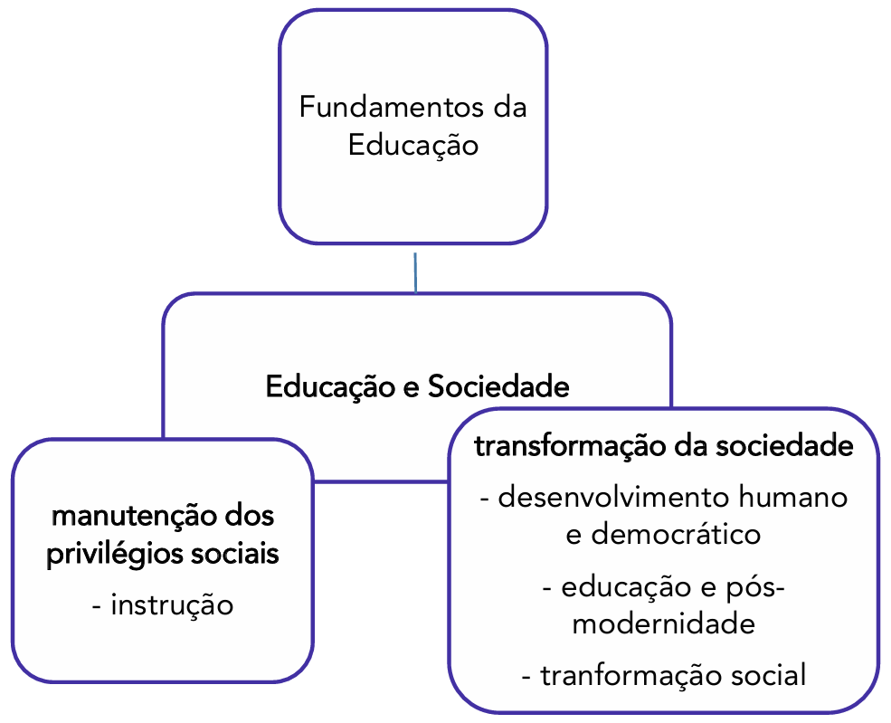

# Capítulo 1 – Fundamentos da Relação entre Educação e Sociedade

A palavra "educação" permeia nosso cotidiano de formas tão diversas que seus múltiplos significados podem, por vezes, passar despercebidos. Referimo-nos à educação que recebemos no seio familiar, que molda nossos valores iniciais; à educação como sinônimo de civilidade e "bons modos", que orienta nossa convivência em comunidade; e, de maneira mais formal, à educação que se desenvolve nos bancos escolares, dos jardins de infância às universidades. Seja dentro ou fora dos muros institucionais, a educação se revela como um fenômeno intrinsecamente ligado aos mais variados aspectos da vida social. Ela não é uma ilha, mas um continente vasto e dinâmico, cujas fronteiras se tocam com a política, a economia, a cultura e a história.

É justamente a natureza dessa profunda e inevitável conexão que constitui um dos debates mais centrais das Ciências Humanas e da Pedagogia: a relação entre Educação e Sociedade. Longe de ser uma discussão recente, a análise sobre o papel que a educação desempenha no corpo social tem gerado, ao longo da história, debates acalorados e perspectivas profundamente distintas. Compreender essas diferentes visões não é um mero exercício acadêmico; é um passo fundamental para que o profissional da educação possa refletir sobre sua própria prática e o impacto que ela exerce no mundo.

## As Grandes Correntes de Pensamento: Manutenção ou Transformação?

Toda e qualquer prática educativa, mesmo que de forma implícita, está ancorada em uma visão particular de ser humano, de sociedade e em um projeto de futuro. Não existe educação neutra. Por trás de cada currículo, de cada método de ensino e de cada sistema de avaliação, há um conjunto de crenças e valores que orientam seus objetivos. Ao analisarmos as inúmeras teorias pedagógicas que surgiram ao longo do tempo, podemos organizá-las em duas grandes e opostas correntes de pensamento, que respondem de maneiras distintas à pergunta fundamental: **qual é o papel da escola na sociedade?**

De um lado, encontramos as teorias que enxergam a educação como um mecanismo de **manutenção e reprodução** da ordem social vigente. De outro, estão as correntes que a veem como uma poderosa ferramenta de **progresso e transformação social**.

Essas duas concepções não são apenas ideias abstratas; elas se materializam em projetos educacionais concretos e influenciam diretamente o que acontece dentro de uma sala de aula. A seguir, exploraremos cada uma delas com base nas teorias que as fundamentam.

