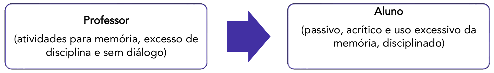
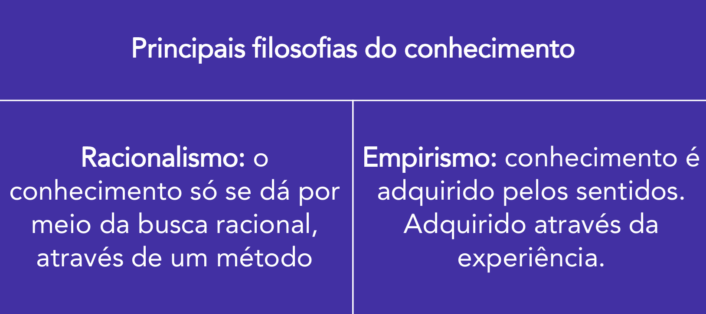
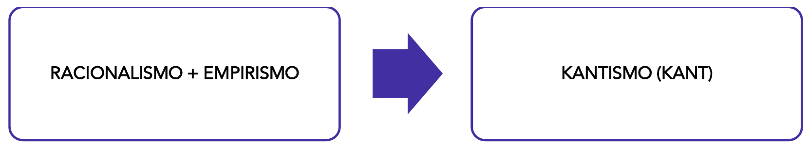

# Capítulo 1 – Fundamentos da Relação entre Educação e Sociedade

A palavra "educação" permeia nosso cotidiano de formas tão diversas que seus múltiplos significados podem, por vezes, passar despercebidos. Referimo-nos à educação que recebemos no seio familiar, que molda nossos valores iniciais; à educação como sinônimo de civilidade e "bons modos", que orienta nossa convivência em comunidade; e, de maneira mais formal, à educação que se desenvolve nos bancos escolares, dos jardins de infância às universidades. Seja dentro ou fora dos muros institucionais, a educação se revela como um fenômeno intrinsecamente ligado aos mais variados aspectos da vida social. Ela não é uma ilha, mas um continente vasto e dinâmico, cujas fronteiras se tocam com a política, a economia, a cultura e a história.

É justamente a natureza dessa profunda e inevitável conexão que constitui um dos debates mais centrais das Ciências Humanas e da Pedagogia: a relação entre Educação e Sociedade. Longe de ser uma discussão recente, a análise sobre o papel que a educação desempenha no corpo social tem gerado, ao longo da história, debates acalorados e perspectivas profundamente distintas. Compreender essas diferentes visões não é um mero exercício acadêmico; é um passo fundamental para que o profissional da educação possa refletir sobre sua própria prática e o impacto que ela exerce no mundo.

## As Grandes Correntes de Pensamento: Manutenção ou Transformação?

Toda e qualquer prática educativa, mesmo que de forma implícita, está ancorada em uma visão particular de ser humano, de sociedade e em um projeto de futuro. Não existe educação neutra. Por trás de cada currículo, de cada método de ensino e de cada sistema de avaliação, há um conjunto de crenças e valores que orientam seus objetivos. Ao analisarmos as inúmeras teorias pedagógicas que surgiram ao longo do tempo, podemos organizá-las em duas grandes e opostas correntes de pensamento, que respondem de maneiras distintas à pergunta fundamental: **qual é o papel da escola na sociedade?**

De um lado, encontramos as teorias que enxergam a educação como um mecanismo de **manutenção e reprodução** da ordem social vigente. De outro, estão as correntes que a veem como uma poderosa ferramenta de **progresso e transformação social**.

Essas duas concepções não são apenas ideias abstratas; elas se materializam em projetos educacionais concretos e influenciam diretamente o que acontece dentro de uma sala de aula. A seguir, exploraremos cada uma delas com base nas teorias que as fundamentam.

### A Educação como Manutenção dos Privilégios Sociais

Conforme estabelecido, uma das grandes correntes de pensamento enxerga o sistema educacional como uma instituição que, de forma consciente ou não, atua para perpetuar a estrutura social existente. Essa função reprodutora não acontece de maneira abstrata; ela se manifesta por meio de modelos pedagógicos específicos que, ao priorizarem certos métodos e objetivos em detrimento de outros, acabam por reforçar hierarquias e desigualdades. Um dos exemplos mais claros e historicamente presentes desse tipo de abordagem é o modelo de **educação como instrução**.

#### O Modelo da Instrução: Transmitir e Memorizar

O termo "instrução" está frequentemente associado à figura do "instrutor", um profissional que, em geral, é procurado para ensinar a execução de uma atividade específica ou o manejo de um equipamento. Exemplos são abundantes no dia a dia: o instrutor de paraquedismo, que ensina os procedimentos exatos para um salto seguro; o instrutor de um software, que mostra os passos para operar um programa; ou o exemplo mais clássico de todos, o instrutor de autoescola.

A experiência de aprender a dirigir um veículo é particularmente ilustrativa. O foco inicial do processo está na aquisição de tarefas automatizadas, que são dominadas por meio de intensa repetição e memorização. Aprender a trocar de marcha no tempo correto, a coordenar o uso dos pedais de embreagem, freio e acelerador, ou a sinalizar com as setas são atividades essencialmente mecanizadas. Elas não demandam, a princípio, uma reflexão profunda sobre a física do movimento do carro ou as complexas dinâmicas do tráfego urbano. O objetivo primário é que o aprendiz seja capaz de replicar procedimentos.

Claro, um grau mínimo de reflexão sempre existe, e bons instrutores certamente estimulam seus alunos a pensar sobre suas ações para se tornarem motoristas mais conscientes e defensivos. Contudo, a base fundamental do processo, em sua maior parte, permanece no campo da instrução.

A partir disso, podemos delinear com mais clareza as características centrais do ensino baseado na instrução:

- **Objetivo Principal:** O foco é a aquisição de conteúdos específicos, informações pontuais e procedimentos que possam ser memorizados e, posteriormente, replicados.
- **Interação:** O diálogo entre professor e aluno é reduzido ou, em casos extremos, inexistente. A comunicação é predominantemente unilateral.
- **Método:** A ênfase recai sobre a repetição e o treino mecanizado de exercícios e procedimentos.
- **Avaliação:** O processo avaliativo se concentra em medir, por meio de testes e exames, a capacidade do aluno de reproduzir fielmente as informações que lhe foram transmitidas.

Nesse modelo, o papel do educador se assemelha ao de um treinador: ele demonstra, dita as regras, corrige a execução e prepara o estudante para realizar tarefas predeterminadas. Há pouco ou nenhum espaço para a troca de opiniões, para o debate de ideias ou para a construção conjunta do conhecimento. O exemplo mais evidente na educação formal é o ensino de História que se resume à memorização de nomes, datas e eventos, desprovidos de seu contexto, de suas causas e consequências, e de qualquer conexão com o presente.

#### Características e Mecanismos do Ensino Instrucional

A educação como instrução se apoia em uma estrutura muito bem definida. Um de seus pilares é a **verticalização** do processo de ensino. Isso significa que a informação flui em um único sentido: de cima para baixo, do professor (detentor do saber) para o aluno (receptor passivo). O conhecimento é tratado como um produto a ser entregue, e não como algo a ser construído na interação. A participação do aluno se restringe a ouvir, anotar e memorizar.

Como consequência lógica dessa verticalização e da ênfase na repetição, a **disciplina** assume um papel de instrumento de controle comportamental. Um ambiente silencioso, ordenado e onde os corpos são mantidos imóveis é visto como ideal e necessário para favorecer a concentração e a memorização. Questionamentos, conversas paralelas ou qualquer desvio da norma são interpretados não como manifestações de curiosidade ou engajamento, mas como perturbações que atrapalham o processo de transmissão.

Outra característica indissociável é a necessidade de **certificação** por meio de provas e exames que, em sua maioria, verificam a capacidade de memorização. Retornando ao exemplo da autoescola, além da prova prática, há um exame teórico focado em decorar regras de trânsito, sinalizações e normas de conduta. O sucesso na avaliação depende diretamente da capacidade de recordar e aplicar a informação transmitida pelo instrutor e pelo material didático.

#### A Instrução como Ferramenta de Reprodução Social

Neste ponto, a conexão entre o modelo instrucional e a manutenção dos privilégios sociais se torna mais nítida. Ao focar na transmissão de informações e na repetição de procedimentos sem um aprofundamento crítico, a educação instrucional tende a formar indivíduos tecnicamente competentes, mas social e politicamente passivos. Ela ensina "o quê" fazer e "como" fazer, mas raramente incentiva o questionamento sobre "por que" as coisas são feitas de determinada maneira ou "para quem" aquele conhecimento serve.

Essa abordagem é criticada por pesquisadores da pedagogia e da psicologia, que demonstram que o processo educativo é essencialmente dialógico, baseado na troca de experiências, na construção de sentidos e na resolução de problemas. Um modelo que silencia o aluno e o trata como um "depósito" de informações (uma ideia criticada por Paulo Freire como "educação bancária") limita seu potencial de se tornar um cidadão crítico e autônomo.

É por essa razão que a educação puramente instrucional dialoga muito pouco com a formulação de Políticas Públicas transformadoras. A elaboração de boas políticas sociais e educacionais exige intenso debate, análise crítica da realidade e a capacidade de imaginar novos futuros. Se os próprios formuladores dessas políticas — e a sociedade como um todo — forem educados em um sistema que valoriza apenas a repetição de fórmulas que já fracassaram, o progresso social se torna inviável. Repetir o mais do mesmo é, por definição, improdutivo e conservador.

Historicamente, no Brasil, a abordagem tecnicista, que vigorou especialmente durante o regime militar nas décadas de 1960 e 1970, utilizou largamente os princípios da instrução. O objetivo era formar mão de obra qualificada para as necessidades do mercado de trabalho da época, moldando técnicos e operários eficientes, mas sem estimular uma reflexão crítica sobre o modelo de desenvolvimento e a estrutura social do país.

### A Educação como Ferramenta de Transformação Social

Em oposição direta ao modelo que vê a escola como uma mera reprodutora da ordem social, a corrente transformadora a concebe como um espaço de emancipação, crítica e construção de novas realidades. Para que a educação cumpra essa função, ela não pode se limitar a transmitir informações. Ela precisa, antes de tudo, empoderar o indivíduo, fornecendo-lhe as ferramentas para pensar de forma autônoma, para construir seu próprio conhecimento e para intervir no mundo de maneira consciente.

Essa visão de um sujeito ativo, que constrói o saber em vez de apenas recebê-lo, não é uma ideia recente. Suas raízes estão profundamente fincadas na filosofia moderna, em um longo e fascinante debate sobre a origem e a natureza do conhecimento humano. Para entender como a educação pode ser um motor para o desenvolvimento humano e, consequentemente, para a transformação social, é preciso revisitar as ideias de pensadores que moldaram nossa forma de entender a própria aprendizagem: René Descartes, John Locke e Immanuel Kant.

#### As Bases Filosóficas do Conhecimento: Razão, Experiência e a Síntese Kantiana

Nos séculos XVI e XVII, uma pergunta fundamental mobilizou o pensamento europeu: afinal, como nós, seres humanos, conhecemos o mundo? De onde vêm nossas ideias e como podemos ter certeza de que elas são verdadeiras? Duas grandes correntes filosóficas surgiram para responder a essa questão, oferecendo caminhos radicalmente opostos: o racionalismo e o empirismo.

O **racionalismo**, cujo principal expoente foi o filósofo e matemático francês René Descartes (1596-1650), defendia que o verdadeiro conhecimento só poderia ser alcançado por meio da razão pura, seguindo um método rigoroso. Para Descartes, os nossos sentidos (visão, audição, tato) eram fontes pouco confiáveis, pois poderiam nos enganar. A única certeza inabalável residia na capacidade de pensar. A partir dessa premissa, o conhecimento deveria ser construído de forma lógica e dedutiva. O método cartesiano, proposto por ele, consiste em dividir um problema complexo em suas partes mais simples para analisá-las separadamente e, depois, reconstruir o todo de forma organizada.

Essa abordagem deixou marcas profundas na educação. Quando um professor de biologia apresenta o corpo humano dividido em sistemas — circulatório, nervoso, digestório, etc. — para que os alunos entendam cada parte antes de compreender o funcionamento integrado do organismo, ele está, em essência, aplicando o método cartesiano.

Do outro lado do debate, o **empirismo** afirmava o exato oposto. Para essa corrente, cujo nome mais proeminente é o do filósofo inglês John Locke (1632-1704), todo o conhecimento humano se origina da experiência sensorial. Locke defendia que a mente humana nasce como uma "tábula rasa", uma folha em branco, que vai sendo preenchida pelas impressões e sensações que captamos do mundo ao longo da vida. Não haveria ideias inatas; tudo seria aprendido.

A pedagogia também absorveu fortemente essa concepção. Uma atividade comum na educação infantil, por vezes chamada de "caixa das sensações" ou "exploração sensorial", é um exemplo claro de aplicação do empirismo. Nela, as crianças são convidadas a interagir com materiais de diferentes texturas, temperaturas e formas (como macarrão cozido, gelo, lixas ou massa de modelar) sem necessariamente nomeá-los de imediato. O objetivo é que elas construam um conhecimento primário sobre aqueles objetos por meio da experiência tátil, utilizando os sentidos para explorar o desconhecido.

A tensão entre essas duas visões pode ser observada em muitas situações práticas, como na pesquisa educacional. Um pesquisador de viés puramente racionalista poderia analisar dados e estatísticas e formular teorias que, embora logicamente coerentes, não encontram respaldo na realidade complexa das escolas. Por outro lado, um pesquisador de base empirista reconhece que a teoria precisa ser constantemente confrontada com a prática.

Um caso que ilustra isso foi a suspeita de matrículas irregulares na Educação de Jovens e Adultos (EJA) em diversas cidades brasileiras em 2023. Enquanto os dados oficiais (a "razão" dos números) mostravam um aumento, uma análise empírica — a visita de repórteres e pesquisadores às escolas — revelava salas de aula vazias. A experiência concreta expôs uma realidade que os dados brutos mascaravam, demonstrando a importância do contato direto com o fenômeno estudado.

Foi para solucionar essa aparente contradição que, no século XVIII, o filósofo alemão Immanuel Kant (1724-1804) propôs uma das mais importantes revoluções da história do pensamento. Kant argumentou que racionalismo e empirismo não eram excludentes, mas sim complementares. Para ele, o conhecimento humano é, de fato, fruto da **junção entre a experiência e a razão**.

Segundo Kant, os nossos sentidos nos fornecem o "material bruto" do conhecimento, as sensações do mundo. No entanto, essa matéria-prima seria caótica e sem sentido se não fosse organizada pelas estruturas inatas da nossa própria razão (como as noções de espaço, tempo e causalidade). Assim, a experiência dá conteúdo ao pensamento, e a razão dá forma à experiência. Era a síntese perfeita entre as duas tradições.

Essa síntese kantiana teve um impacto imenso na psicologia e na pedagogia do século XX, principalmente através da obra do biólogo e psicólogo suíço Jean Piaget (1896-1980). Fortemente influenciado por Kant, Piaget dedicou sua vida a compreender como a inteligência se desenvolve na interação da criança com o mundo. Ele observou, por exemplo, que para aprender os princípios da matemática, uma criança precisa manipular objetos concretos. Ao usar palitos para fazer uma conta de adição, ela está unindo a experiência sensorial (tocar nos palitos, movê-los) com a atividade racional (o conceito abstrato de somar).

#### Da Filosofia à Pedagogia: A Educação como Desenvolvimento Humano

A concepção de **Educação como Desenvolvimento Humano** nasce diretamente dessa herança filosófica kantiana e psicológica piagetiana. Ela entende o ato de educar não como um processo de transmissão de informações de fora para dentro, mas como a criação de condições para que o próprio indivíduo construa seu conhecimento na interação com o meio.

Nesta perspectiva, a ênfase se desloca radicalmente. Sai de cena a memorização e entra em seu lugar a **construção do conhecimento**. Não há espaço para a verticalização do ensino, pois o saber não é posse exclusiva do professor. Pelo contrário, o que se valoriza é o diálogo, a troca, a investigação e a busca por um entendimento recíproco entre professor e aluno, ambos vistos como sujeitos ativos no processo de aprendizagem.

Ao promover um indivíduo que aprende a aprender, que investiga, que questiona e que constrói ativamente seus próprios saberes, este modelo educacional o capacita a ser um agente de transformação. Alguém que não apenas se adapta ao mundo, mas que é capaz de analisá-lo criticamente e de atuar para modificá-lo, concretizando, assim, o potencial da educação como uma verdadeira força de progresso social.

#### A Revolução Copernicana na Pedagogia: Rousseau e a Centralidade da Criança

Enquanto pensadores como Kant e Piaget se debruçaram sobre a questão de _como_ a mente constrói o conhecimento, outro gigante do pensamento moderno, Jean-Jacques Rousseau (1712-1778), deslocou o foco para o _propósito_ moral e social da educação. Figura central do Iluminismo — movimento intelectual do século XVIII que defendia a razão e o conhecimento como vias para a liberdade e a superação da tirania —, Rousseau introduziu uma perspectiva revolucionária sobre a natureza humana e o papel da educação na formação do cidadão.

O ponto de partida do filósofo era um diagnóstico pessimista da sociedade de sua época. Ele argumentava que o avanço das ciências, das artes e da vida urbana, ao contrário do que se poderia esperar, não conduzia ao aprimoramento moral do ser humano. Pelo contrário, a civilização, com sua ênfase na propriedade privada, na competição e na vaidade, seria a grande responsável por corromper a bondade inata do homem. Esta ideia, muitas vezes associada ao conceito do "bom selvagem", postula que o ser humano em seu estado de natureza é bom, mas é pervertido e aprisionado pelas injustiças e vícios da vida social.

Diante do dilema — como conciliar a vida em sociedade com a bondade natural do ser humano? —, Rousseau apresenta uma única e poderosa solução: a educação. No entanto, não se tratava da educação tradicional, que ele via como mais uma ferramenta de corrupção social. Seria necessária uma nova forma de educar, um método capaz de resgatar o indivíduo, protegê-lo das más influências e guiá-lo na busca por uma vida justa e autônoma. Para Rousseau, a educação não era um mero verniz de erudição, mas a "tábua de salvação" para a edificação humana e para a formação de cidadãos capazes de construir uma república virtuosa.

Essa proposta pedagógica é detalhada em sua obra mais influente no campo, _Emílio, ou da Educação_. No livro, Rousseau descreve a educação ideal de um menino, Emílio, desde o nascimento até a vida adulta. A premissa é radical: para formar um homem livre, sua educação deve ser, em um primeiro momento, "negativa". Isso não significa uma educação ausente, mas sim uma educação que se concentra em proteger a criança dos vícios e dos conhecimentos artificiais da sociedade, permitindo que suas faculdades naturais — curiosidade, sentidos e razão — desabrochem em seu próprio ritmo.

É nesse contexto que Rousseau promove uma verdadeira revolução ao se debruçar sobre a infância. Ele critica duramente os costumes de sua época, que tratavam a criança como um "adulto em miniatura". As crianças eram vestidas como adultos, submetidas a rotinas de adultos e forçadas a memorizar conteúdos de adultos, sendo privadas do direito de viver as características próprias de sua idade. Rousseau foi um dos primeiros a afirmar categoricamente que a infância tem um valor em si mesma e que a criança deve ser o centro de todas as preocupações educacionais.

Essa centralidade se baseia em alguns princípios fundamentais que ele elucidou:

- **A criança não é uma cópia imperfeita do adulto.** Ela possui uma maneira própria de sentir, pensar e desejar. A educação deve respeitar essa natureza infantil, valorizando suas atividades essenciais: o brincar, o correr, o pular e o fantasiar. Essas não são perdas de tempo, mas as formas mais autênticas de aprendizado e desenvolvimento na primeira fase da vida.
- **O desenvolvimento moral e intelectual deve ser guiado pela razão, mas de forma natural.** Isso significa que, em vez de impor regras morais e conhecimentos de forma autoritária e vertical, o educador (ou preceptor) deve criar situações e experiências a partir das quais a própria criança possa, gradualmente, tirar suas conclusões e construir seu entendimento do mundo. A razão não é um conjunto de fórmulas a serem decoradas, mas uma capacidade que se desenvolve na interação com a realidade, quando guiada por um mestre que sabe esperar o momento certo de intervir.

Ao defender uma educação que parte dos interesses e das fases de desenvolvimento do indivíduo, Rousseau lança as bases para muitas das pedagogias progressistas que surgiriam nos séculos seguintes, como o movimento da Escola Nova. Sua insistência em formar um ser humano autônomo, capaz de pensar por si mesmo e de resistir às pressões corruptoras da sociedade, reforça de maneira definitiva o papel da educação como uma ferramenta indispensável para o progresso social e para a transformação de súditos em cidadãos verdadeiramente livres.

Entendido. Continuaremos a desenvolver a seção sobre a educação como ferramenta de transformação, utilizando suas anotações para construir o argumento sobre a formação para a democracia e a cidadania. O foco será estruturar as ideias de forma coesa, aprofundar os conceitos e ilustrar com exemplos claros, mantendo o estilo didático e impessoal que estabelecemos.

#### A Finalidade da Educação Transformadora: Construindo a Democracia e a Cidadania

A educação, em sua essência, é o mecanismo pelo qual uma sociedade transmite seus saberes acumulados e seus valores mais caros às novas gerações. Conhecimentos e princípios são, portanto, a matéria-prima com a qual se constrói o futuro. Contudo, esse processo de transmissão não é uniforme. As sociedades se organizam de maneiras distintas para educar seus membros. Em alguns contextos, como no Brasil, essa estrutura é altamente formalizada, com um aparato legal (leis educacionais), espaços físicos próprios (escolas, universidades) e sistemas de regulação e fiscalização.

Em outros, no entanto, a educação pode e deve ocorrer de modos menos formais, provando que o processo educativo transcende os muros da escola. Um exemplo histórico dramático ilustra esse ponto. Durante a longa Guerra Civil que assolou Angola (1975-2002), grande parte da infraestrutura escolar do país foi destruída. Diante desse cenário de devastação, educadores e pensadores chegaram a propor que a reconstrução do sistema educativo nacional se desse, em um primeiro momento, de maneira não formal. A ideia era que os processos de aprendizagem fossem garantidos fora das instituições tradicionais, ocorrendo em associações de bairro, movimentos sociais, igrejas e ONGs. A prioridade era garantir a continuidade da educação, a transmissão de saberes e valores para as novas gerações, mesmo que por outros meios. Este exemplo demonstra que, embora a instituição escolar seja fundamental, a educação é um fenômeno social mais amplo e resiliente.

Em qualquer um desses contextos, formal ou não formal, um princípio permanece central para uma visão transformadora: a indissociabilidade entre "saberes" e "valores". Os educadores que buscam a transformação social compreendem que não é possível separar os conteúdos ensinados dos princípios humanos que devem nortear as práticas pedagógicas. Educar, nesta perspectiva, é unir o que se ensina com valores inegociáveis de justiça, dignidade e respeito.

##### A Intencionalidade Inerente ao Ato Educativo

A partir dessa premissa, chega-se a uma conclusão inevitável: **todo ato educativo é intencional**. A ideia de uma educação neutra, que apenas transmite fatos isentos de qualquer visão de mundo, é um argumento falacioso. Educar pressupõe fazer escolhas — o que incluir no currículo e o que deixar de fora, qual metodologia utilizar, como avaliar — e toda escolha é um ato político que aponta para um determinado projeto de sociedade.

A defesa da neutralidade na educação, portanto, é frequentemente utilizada para dissimular interesses na manutenção dos privilégios e da ordem social vigente. Ao se omitir sobre suas reais intenções, um projeto educacional que se diz "neutro" pode, na verdade, estar servindo à vontade das classes dominantes de evitar o desenvolvimento da consciência crítica na população. Quando a intenção não é clara e democraticamente debatida, uma outra intenção, oculta, está em jogo.

##### A Práxis da Educação em Direitos Humanos

A articulação explícita entre conhecimentos e valores é a espinha dorsal de qualquer proposta educativa comprometida com a transformação. Um exemplo formalizado dessa visão no Brasil é o **Plano Nacional de Educação em Direitos Humanos (PNEDH)**. O documento, em suas diretrizes, deixa claro que a formação de um cidadão consciente e atuante depende da articulação de múltiplas dimensões.

> A educação em direitos humanos é compreendida como um processo sistemático e multidimensional que orienta a formação do sujeito de direitos, articulando as seguintes dimensões:
> 
> - apreensão de conhecimentos historicamente construídos sobre direitos humanos e a sua relação com os contextos internacional, nacional e local;
> - afirmação de valores, atitudes e práticas sociais que expressem a cultura dos direitos humanos em todos os espaços da sociedade;
> - formação de uma consciência cidadã capaz de se fazer presente em níveis cognitivo, social, ético e político;
> - desenvolvimento de processos metodológicos participativos e de construção coletiva, utilizando linguagens e materiais didáticos contextualizados;
> - fortalecimento de práticas individuais e sociais que gerem ações e instrumentos em favor da promoção, da proteção e da defesa dos direitos humanos, bem como da reparação das violações.

A estrutura do texto é reveladora. A "apreensão de conhecimentos" e a "afirmação de valores" são apresentadas como pilares sequenciais e complementares da mesma estrutura. Não é coincidência. O documento reconhece que para formar um "sujeito de direitos", é preciso tanto dominar os saberes históricos e conceituais sobre o tema quanto cultivar os valores e as atitudes que dão vida a esses direitos na prática social.

##### O Objetivo Final: Formando para a Democracia e a Cidadania

A finalidade última de uma educação que une intencionalmente saberes e valores é a construção de uma sociedade mais democrática e de uma cidadania mais plena e ativa. Essa concepção se opõe frontalmente a discursos que tentam segmentar a formação humana, como o velho ditado "a escola ensina, a família educa". Tal separação é artificial e prejudicial, pois ignora que o ser humano é um ser integral, que aprende conteúdos e assimila valores de forma simultânea e em todos os espaços em que vive e interage.

Neste projeto de educação transformadora:

- A **democracia** é fortalecida pela socialização dos conhecimentos historicamente acumulados pela humanidade. Quando a escola se propõe a ensinar ciência, história, arte e filosofia para todos, ela está democratizando o acesso a ferramentas que permitem ler e interpretar o mundo. O conhecimento deixa de ser um privilégio de poucos e se torna um bem público, essencial para a participação consciente na vida coletiva.
- A **cidadania** é construída no aprendizado e, sobretudo, na vivência de valores republicanos, humanos, empáticos e solidários. Não se trata apenas de "saber sobre" cidadania, mas de "aprender a ser" um cidadão. Isso acontece quando a prática pedagógica promove a colaboração em vez da competição exacerbada, o diálogo em vez da imposição, e o respeito às diferenças em vez da busca por uma homogeneidade forçada.

Na Educação Profissional e Tecnológica, por exemplo, um curso de Segurança do Trabalho não ensina apenas as normas técnicas (o saber). Ele deve, simultaneamente, cultivar o valor da vida e da responsabilidade coletiva, formando um profissional que não apenas aplica regras, mas que compreende eticamente a importância de proteger a si mesmo e aos seus colegas. É nessa fusão inseparável que a educação cumpre sua mais nobre função: formar não apenas trabalhadores, mas cidadãos.

#### A Resposta ao Mundo Complexo: A Pedagogia da Incerteza em Edgar Morin

As visões de uma educação para o desenvolvimento humano e para a cidadania nos preparam para o próximo passo fundamental de uma pedagogia transformadora: como lidar com a própria natureza do conhecimento no mundo atual? O filósofo e sociólogo francês Edgar Morin oferece uma perspectiva poderosa para essa questão, a partir do que ele denomina **pensamento complexo**.

O diagnóstico de Morin parte de uma constatação crítica: o conhecimento humano, especialmente a partir do desenvolvimento da ciência moderna, tornou-se progressivamente fragmentado e hiperespecializado. As universidades e escolas organizam o saber em disciplinas isoladas, como se a Biologia, a História, a Matemática e a Arte fossem territórios estanques, sem fronteiras. Para Morin, essa divisão em "gavetas" nos tornou cegos para o essencial: a maioria dos grandes desafios do mundo — sejam eles ambientais, sociais, econômicos ou políticos — são, por natureza, multidimensionais e interconectados. Nenhum deles pode ser compreendido ou solucionado a partir de uma única disciplina.

Como resposta, o autor propõe a superação dessa lógica compartimentada em favor da **complexidade** e da **transdisciplinaridade**. Pensar de forma complexa é reconhecer a teia de relações que constitui a realidade, é entender que o todo é maior que a soma das partes e que as certezas absolutas são raras. A transdisciplinaridade, por sua vez, é a prática de construir um saber que atravessa as diferentes áreas do conhecimento, unindo-as em uma compreensão mais rica e integrada.

Neste caminho, a **incerteza** deixa de ser vista como uma falha e passa a ser reconhecida como uma característica inerente ao próprio conhecimento. Se o mundo é complexo e está em constante mudança, o saber sobre ele também será dinâmico e provisório. A ciência que temos hoje, excessivamente dividida, já não responde adequadamente aos desafios atuais. É preciso, segundo Morin, redescobrir uma ciência mais humilde e integrada, uma "ciência com consciência".

##### Educar na Incerteza: A "Ciência com Consciência"

A instituição escolar, dentro dessa perspectiva, não pode ser um lugar que oferece apenas certezas disciplinares e respostas prontas. Ela deve se tornar um espaço que dialoga com as incertezas próprias do campo científico e ensina os estudantes a navegá-las. O que se conhece hoje pode ser refutado ou aprofundado amanhã. Portanto, mais importante do que memorizar uma grande quantidade de informações, é preciso desenvolver uma **consciência crítica** frente ao caráter provisório do conhecimento.

A educação se torna, assim, um motor para o desenvolvimento de novas mentalidades, mais preparadas para os desafios da complexidade. Para Morin, é crucial evitar um ensino que apenas acumula informações muitas vezes desconexas e com pouca aplicabilidade real. Em vez disso, é necessário que os alunos compreendam a própria forma como os saberes são organizados. Ao entenderem as relações, os conflitos e as complementaridades entre as diferentes disciplinas, eles desenvolvem uma visão crítica muito mais potente.

É fundamental, nesse processo, a distinção entre **informação** e **saber**. A informação é avulsa, um dado pontual e descontextualizado. O saber, por outro lado, é articulado, é a informação conectada a outras, inserida em um contexto e transformada em compreensão. Uma educação transformadora é aquela que ajuda o estudante a converter o oceano de informações disponíveis hoje em um saber significativo e estruturado. Isso implica compreender a ciência como um campo de atuação humana, com seus alcances, seus limites e suas controvérsias, e não como um conjunto de verdades intocáveis, dignas apenas de especialistas.

Essa reforma do pensamento já encontra ecos em diversas instituições. Em algumas universidades, a discussão sobre a não fragmentação dos saberes conseguiu romper a visão rígida e disciplinar. Um exemplo notável no Brasil é o Programa de Pós-Graduação em Direitos Humanos e Cidadania da Universidade de Brasília (UnB), vinculado ao Centro de Estudos Avançados Multidisciplinares (CEAM). O próprio desenho do programa, ao promover estudos institucionais interdisciplinares, representa uma decisão da universidade de apostar na conexão entre os saberes para compreender um tema tão complexo como os direitos humanos. Não se trata de uma iniciativa isolada, mas de uma estrutura que reflete a crescente tomada de consciência sobre os limites da ciência dividida em "gavetas", tornando o pensamento de Edgar Morin cada vez mais atual e necessário no século XXI.

