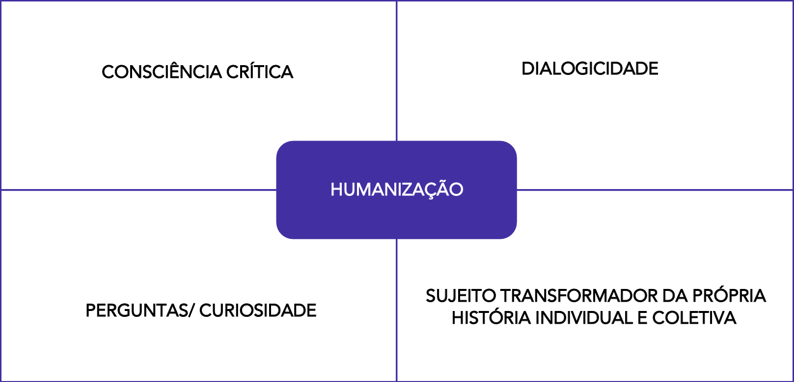
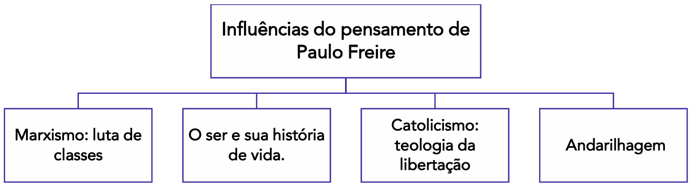
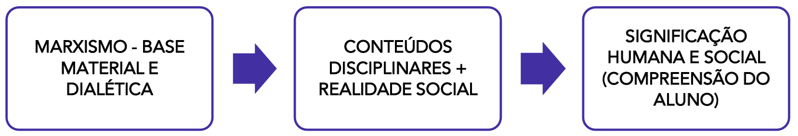
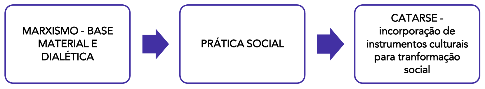

# Capítulo 2 – Concepções Educacionais e Teorias Pedagógicas

No capítulo anterior, navegamos pelas grandes correntes filosóficas que fundamentam a relação entre educação e sociedade, explorando o debate entre a manutenção e a transformação social. Agora, avançaremos do campo das ideias fundamentais para a sua manifestação concreta no chão da escola. Este capítulo se dedica a analisar as principais concepções educacionais e teorias pedagógicas que, ao longo da história, traduziram essas filosofias em métodos, currículos e práticas de ensino. Iniciaremos nossa jornada pela mais duradoura e influente de todas: a Pedagogia Tradicional.

## Pedagogia Tradicional: A Herança e a Permanência

A Pedagogia Tradicional, com sua estrutura rígida e foco no professor, exerceu uma influência monumental sobre as instituições de ensino por séculos, e muitos de seus traços ainda se fazem presentes nas escolas contemporâneas. Para compreendê-la em sua essência, é preciso revisitar sua origem histórica, que se divide em duas grandes vertentes: uma de matriz religiosa e outra de matriz leiga, que floresceu com os ideais do Iluminismo.

### Pedagogia Tradicional Religiosa: A Escolástica e a Ordem Jesuítica

A origem mais remota da Pedagogia Tradicional se encontra na **Escolástica**, o método de pensamento e ensino que dominou as universidades medievais da Europa entre os séculos IX e XVI. É importante contextualizar que o conceito de "educação" e "universidade" daquela época era muito distinto do atual. Os chamados estudos universitários medievais eram restritos a uma elite ínfima, majoritariamente clerical, e abordavam como temas avançados conteúdos que hoje consideramos básicos. O aprendizado de operações matemáticas como a multiplicação, por exemplo, era um feito intelectual complexo e objeto de estudo aprofundado.

O objetivo central da Escolástica era utilizar as ferramentas da filosofia clássica grega, em especial a lógica de Aristóteles, para compreender, sistematizar e justificar a fé e os dogmas do cristianismo. O que nos interessa pedagogicamente é o _método_ empregado. O ensino escolástico era essencialmente **verbalista, autoritário e centrado na figura do professor**. O mestre detinha o conhecimento e sua função era transmiti-lo de forma expositiva. A máxima que regia o ambiente era a do _magister dixit_ ("o mestre disse"), indicando que a palavra do professor era inquestionável.

Nesse contexto, o aluno era visto como um ser passivo. A própria etimologia da palavra "aluno", do latim _alumnus_, remete a "aquele que é alimentado", mas popularmente se consolidou a interpretação, derivada de _a-lumen_, de "sem luz". O professor, portanto, teria a nobre função de "iluminar" essa mente vazia e ignorante. O estudante não era percebido como um portador de saberes, voz ou capacidade de diálogo; seu papel era o de ouvir em silêncio, memorizar as proposições e decorar as lições baseadas nos textos clássicos e sagrados.

A organização do ensino já apresentava um esboço de separação por disciplinas, como o estudo de línguas (latim), a retórica, a aritmética e a leitura dos clássicos. Contudo, essa separação não implicava em interação ou construção coletiva. A estrutura era marcada por uma forte **hierarquia** entre mestre e discípulo, um reflexo direto da própria organização hierárquica da Igreja Católica, baseada na obediência e na autoridade.

A justificativa filosófica para essa prática era uma visão **essencialista divina**. Acreditava-se que todo ser humano nascia com uma essência divina, uma alma imutável criada por Deus. O propósito da educação era, então, aprimorar essa essência, moldando-a de acordo com os preceitos da fé. Essa crença gerava uma consequência pedagógica direta e muito significativa: se todos os alunos possuíam, em sua base, a mesma essência, eles eram considerados fundamentalmente iguais. As diferenças individuais de ritmo, interesse ou origem eram desconsideradas. O ensino era ministrado de forma uniforme para todos, e a falha em aprender não era vista como uma inadequação do método, mas como uma falha moral ou espiritual do aluno — preguiça, desatenção ou fraqueza de espírito.

#### A Prática no Brasil: O _Ratio Studiorum_ dos Jesuítas

No Brasil, a principal disseminadora dessa concepção tradicional religiosa foi a **Companhia de Jesus**. Os jesuítas chegaram com a missão de catequizar os povos indígenas e de formar a elite colonial, exercendo um virtual monopólio sobre a educação formal por mais de 200 anos. O método utilizado por eles estava detalhadamente organizado em um manual chamado **_Ratio Studiorum_**, um plano de estudos que sistematizava o currículo, os métodos de ensino e as normas disciplinares.

Seguindo a matriz escolástica, o método jesuítico era centrado na memorização, na repetição, na disciplina rígida e na autoridade do mestre, com forte ênfase nos estudos humanísticos (latim, grego, retórica) e na teologia. A Companhia de Jesus se tornou extremamente poderosa, construindo colégios por todo o território e acumulando grande poder político e econômico.

Essa hegemonia teve um fim abrupto em 1759, quando a ordem foi expulsa de Portugal e de suas colônias por Sebastião José de Carvalho e Melo, o **Marquês de Pombal**. Secretário de Estado do rei D. José I e influenciado pelos ideais do Iluminismo, Pombal via o poder da Igreja como um obstáculo à modernização e centralização do Estado português. A expulsão dos jesuítas representou, assim, um ponto de virada, marcando o início da transição de uma educação de controle religioso para uma educação de interesse do Estado, o que daria origem à vertente leiga da Pedagogia Tradicional.

### Pedagogia Tradicional Leiga: O Iluminismo, o Estado e as Reformas Pombalinas

Como vimos, a expulsão da Companhia de Jesus do Brasil em 1759, por ordem do Marquês de Pombal, encerrou um ciclo de mais de duzentos anos de hegemonia religiosa na educação. Este ato não foi uma medida isolada, mas parte de um projeto político mais amplo, influenciado pelos ideais do Iluminismo, que buscava modernizar a administração portuguesa, centralizar o poder nas mãos do Estado e diminuir a influência da Igreja nos assuntos seculares. A educação, nesse contexto, passou a ser vista como uma ferramenta estratégica para formar uma elite letrada e uma burocracia leal à Coroa Portuguesa, e não mais à Igreja.

Contudo, a consequência imediata da expulsão dos jesuítas foi a desorganização e a precarização do ensino na colônia. A Coroa Portuguesa desmantelou a única estrutura educacional existente sem possuir um sistema estatal pronto para substituí-la. Os prestigiosos colégios jesuíticos foram fechados, e o território se viu diante de um vácuo imenso, sem prédios, sem organização curricular e, principalmente, sem um corpo docente leigo preparado para assumir as salas de aula.

A solução encontrada pelo Estado português foi a criação das chamadas **aulas régias**, autorizadas por meio de documentos conhecidos como Cartas Régias. Essas aulas funcionavam de maneira avulsa e desarticulada, muitas vezes na casa do próprio professor, que era pago diretamente pela Coroa. O ensino era superficial, focado em humanidades (como Latim, Grego e Retórica), e funcionava como um preparatório para os filhos da elite econômica que pretendiam complementar seus estudos na Universidade de Coimbra, em Portugal.

Este modelo frágil e insuficiente fez com que, por várias décadas, as duas vertentes da pedagogia tradicional, a religiosa (agora enfraquecida e dispersa em outras ordens) e a nova vertente leiga estatal, coexistissem de forma precária.

Apesar da mudança de controle da Igreja para o Estado, a pedagogia tradicional leiga manteve e reforçou muitas das características de sua predecessora, especialmente o seu caráter elitista. Acreditava-se que a educação não era um direito de todos, mas um privilégio destinado a uma pequena parcela da população, aquela que iria ocupar os postos de comando na administração colonial e, posteriormente, no Império. A vasta maioria da população, composta por pessoas escravizadas, indígenas e homens livres pobres, permanecia completamente excluída de qualquer forma de instrução formal.

Embora ambas as vertentes, religiosa e leiga, fossem elitistas, seus públicos-alvo e propósitos imediatos apresentavam diferenças. A pedagogia tradicional religiosa era primariamente voltada para a formação de novos membros do clero e de uma nobreza devota, fiel aos princípios da Igreja. Já a pedagogia tradicional leiga tinha como alvo a formação da nobreza e, principalmente, da ascendente burguesia mercantil, cujos filhos deveriam se tornar os futuros administradores, juízes e funcionários do Estado Absolutista Português. A mudança fundamental, portanto, não foi no método ou no acesso, mas no destinatário final do poder que a educação conferia: da Igreja para o Estado.

### Comenius: O Pioneiro da Didática Moderna

No século XVII, um período de intensos conflitos religiosos na Europa e de florescimento do pensamento científico, surge a figura de Iohannes Amos Comenius, ou João Amós Comênio (1592-1670). A obra de Comênio é tão rica e complexa que sua classificação gera debates. Por um lado, ele pode ser considerado um autor da Pedagogia Tradicional, pois mantém a figura do professor como o centro e o organizador do processo educativo. Por outro, suas propostas foram tão inovadoras que ele é universalmente reconhecido como o "pai da Didática Moderna", rompendo de forma contundente com os métodos de seus predecessores.

A principal crítica de Comênio era direcionada ao método escolástico, que ele considerava excessivamente verbalista, abstrato e dependente da memorização. Ele observava que as crianças de sua época eram forçadas a decorar palavras e textos em latim sem qualquer referência ao mundo concreto, um processo que considerava árduo, ineficaz e contrário à natureza humana.

Para Comênio, o aprendizado deveria seguir a ordem da própria natureza, partindo dos sentidos e da experiência concreta para só então chegar aos conceitos abstratos. Ele acreditava que o conhecimento deveria ser acessado de forma direta, com clareza e sem os floreios da retórica vazia. Para que isso fosse possível, o método de ensino precisava mudar radicalmente. Sua grande inovação foi, portanto, a defesa de uma **educação pelos sentidos**.

Essa proposta se materializou em sua célebre obra **_Orbis Sensualium Pictus_** ("O Mundo das Coisas Sensíveis em Imagens"), considerado por muitos o primeiro livro ilustrado para crianças da história. Neste livro, cada palavra ou conceito era associado a uma imagem correspondente, permitindo que a criança conectasse o termo abstrato a uma representação visual concreta. Ao ver a imagem de uma árvore ao lado da palavra "árvore", o aprendizado ganhava sentido e se tornava mais intuitivo. É nesta obra revolucionária que encontramos a origem da **cartilha de alfabetização** moderna, que até hoje se baseia neste princípio fundamental de associar sílabas, palavras e frases a ilustrações que lhes deem significado. Foi um avanço imenso em relação ao método puramente mnemônico que vigorava até então.

#### O Ideal Pansófico: Ensinar Tudo a Todos

A visão educacional de Comênio, contudo, ia muito além do método. Em sua obra-prima, a **_Didática Magna_**, ele estabelece um dos princípios mais democráticos e visionários de toda a história da educação, resumido em seu lema: **_Omnes omnia docere_**, ou **"ensinar tudo a todos"**.

Numa época em que a educação era um privilégio de uma minúscula elite masculina, Comênio defendia o direito universal à instrução, independentemente da classe social, da religião ou do gênero. Para ele, todos os seres humanos nasciam com as "sementes" da ciência, da moral e da virtude. O papel da educação, e do professor, seria como o de um jardineiro: criar as condições ideais para cultivar essas sementes e permitir que cada indivíduo desabrochasse em sua plenitude.

A _Didática Magna_ é o primeiro grande esforço para sistematizar todo o processo educativo, desde a organização do cotidiano escolar até a estruturação de um sistema de ensino completo, dividido por faixas etárias — uma proposta que influenciou a forma como as escolas se organizam até os dias de hoje.

A motivação por trás desse grandioso projeto era profundamente religiosa. Como bispo protestante, Comênio acreditava que o acesso universal ao conhecimento era o caminho para que todas as pessoas pudessem ler e interpretar as escrituras sagradas por si mesmas, alcançando uma fé mais pura e verdadeira. Além disso, tendo vivido os horrores da Guerra dos Trinta Anos, ele via na pansofia (o saber universal) a única esperança para a união da humanidade e a conquista da paz perpétua. Sua pedagogia, portanto, estava a serviço de um projeto de salvação da alma e de harmonia para o mundo.

### A Permanência da Pedagogia Tradicional nos Dias Atuais

Apesar de séculos de críticas e do surgimento de inúmeras teorias pedagógicas que propõem alternativas, a Pedagogia Tradicional demonstra uma notável resiliência. Seus ecos e práticas fundamentais ainda são amplamente encontrados nas escolas hoje, muitas vezes de forma tão naturalizada que passam despercebidos. As suas características centrais persistem: um ensino essencialmente verbalista, uma forte centralidade na figura do professor e uma concepção, ainda que secularizada, de que existe uma essência ou um padrão ideal de aluno a ser seguido.

Essa abordagem se manifesta em diversas práticas do cotidiano escolar, que podem ser vistas como as "novas roupagens" do método tradicional. Termos como **aula expositiva**, **palestra** ou **apresentação** são comuns no vocabulário educacional e, em sua essência, derivam da mesma lógica: um especialista (o professor) expondo oralmente um conteúdo para uma audiência (os alunos).

É importante notar que uma aula expositiva, em si, não é um método inerentemente negativo. Ela pode ser uma ferramenta útil e eficaz para apresentar um novo tópico, sintetizar ideias complexas ou compartilhar uma narrativa envolvente. O problema surge quando a exposição unilateral se torna o único ou o principal método utilizado, transformando a sala de aula em um auditório e os alunos em meros espectadores, com pouca ou nenhuma interação.

#### O Professor como Epicentro do Processo Educativo

A característica mais marcante e duradoura da Pedagogia Tradicional é, sem dúvida, a posição de centralidade absoluta ocupada pelo professor. Nesta concepção, todo o processo educativo orbita em torno de sua figura. É o professor quem define o que será ensinado e o que será ignorado. É o professor quem determina o ritmo da aula e o tempo de cada atividade. É o professor quem valida o que é certo e o que é errado, muitas vezes sem espaço para ambiguidades ou interpretações diversas. É o professor quem detém e transmite os saberes, posicionando-se como a grande figura de autoridade intelectual e moral da sala de aula. Em suma, o professor está no centro de todas as preocupações e de todas as ações.

#### Fatores da Persistência do Modelo Tradicional

Mas por que este modelo, tão criticado por seu autoritarismo e por sua passividade imposta ao aluno, ainda persiste com tanta força? Diversos fatores contribuem para essa resiliência:

1. **A Cultura Escolar:** Existe uma imagem culturalmente arraigada do que é uma "aula de verdade", compartilhada por muitos pais, alunos e até mesmo gestores. Essa imagem frequentemente corresponde ao modelo tradicional: alunos em silêncio, em fileiras, copiando a matéria do quadro e ouvindo a explicação do professor. Práticas inovadoras, que envolvem mais diálogo, movimento ou aparente "desordem", podem ser vistas com desconfiança.
2. **A Arquitetura e Organização da Escola:** A própria estrutura física da maioria das escolas — com salas de aula compostas por fileiras de carteiras voltadas para um quadro-negro na frente — foi projetada para o modelo expositivo e dificulta a implementação de trabalhos em grupo e outras metodologias ativas.
3. **A Pressão dos Sistemas de Avaliação:** A existência de avaliações externas em larga escala, como o Exame Nacional do Ensino Médio (ENEM) e os vestibulares, exerce uma enorme pressão por "vencer o conteúdo". Diante de um currículo extenso e pouco tempo, muitos professores recorrem à aula expositiva como a forma mais rápida e direta de transmitir a grande quantidade de informações exigida nessas provas.
4. **A Formação dos Professores:** Muitos educadores foram, eles próprios, formados dentro do modelo tradicional. É natural que, especialmente no início da carreira ou em situações de sobrecarga, eles tendam a replicar o modelo pelo qual aprenderam, que lhes é mais familiar e seguro.

Reconhecer esses traços da tradição na prática cotidiana não é um exercício de pura crítica, mas uma necessidade para o educador que deseja agir de forma intencional. Apenas ao identificar os porquês da permanência desse modelo é possível, de forma consciente, buscar alternativas para construir uma prática pedagógica mais dialógica, participativa e verdadeiramente centrada no aprendizado e no desenvolvimento integral do aluno.

### A Base Filosófica: O Positivismo e a Objetividade do Saber

A metodologia da Pedagogia Tradicional, como vimos, opera a partir de uma lógica clara: o conhecimento é um corpo de saberes prontos e acabados que são transmitidos de fora para dentro. O professor, como detentor desse saber, o repassa ao estudante, cuja tarefa é absorvê-lo por meio de atividades de memória e repetição. Aprender, nesse modelo, é sinônimo de memorizar e reproduzir fielmente o que foi ensinado.

Essa didática, contudo, não é arbitrária. Ela está profundamente fundamentada em uma influente corrente filosófica que marcou os séculos XIX e XX: o **Positivismo**. Inaugurado pelo filósofo francês Auguste Comte (1798-1857), o Positivismo buscava aplicar ao estudo da sociedade a mesma objetividade e o mesmo rigor que eram atribuídos às ciências naturais, como a Física e a Biologia.

Para a filosofia positivista, o conhecimento verdadeiro só pode ser aquele que se baseia em fatos observáveis, mensuráveis e comprováveis. A realidade é vista como algo objetivo, externo ao indivíduo, que pode ser captada de forma neutra. Nesta visão, não há espaço para interpretação, subjetividade ou crítica, pois estas são consideradas fontes de erro, meras opiniões do "senso comum" sem validade científica. O que importa são os dados, os números, as estatísticas e os postulados objetivos. A máxima que resume essa perspectiva é a de que "os números falam por si!".

A relação entre quem conhece (o sujeito) e o que é conhecido (o objeto) é, portanto, passiva. O sujeito é um espectador que deve se limitar a registrar a realidade tal como ela é.

A influência do Positivismo foi imensa em todo o mundo, e no Brasil ela se manifesta de forma explícita até hoje no lema da bandeira nacional, "Ordem e Progresso", um dos conceitos centrais do pensamento comtiano.

#### A Sala de Aula como Reflexo da Filosofia Positivista

A semelhança entre a lógica positivista e a estrutura da Pedagogia Tradicional é notável, pois uma é o alicerce da outra. A sala de aula tradicional opera exatamente sob os mesmos princípios. Nesta analogia, o **Professor** assume o lugar do Objeto (O): ele é a própria encarnação da realidade objetiva, o detentor dos saberes validados, dos fatos e das verdades a serem conhecidas. O **Aluno**, por sua vez, é colocado no lugar do Sujeito (S): um receptor passivo, cuja função é absorver e registrar fielmente o conhecimento que lhe é transmitido pelo professor, sem questionar, interpretar ou modificar.

Essa base filosófica explica muitas das práticas da escola tradicional:

- **O Currículo:** É visto como um conjunto de fatos e verdades científicas a serem ensinados, com grande valorização das ciências exatas e naturais em detrimento das humanidades, consideradas mais "subjetivas".
- **O Erro:** Não é encarado como uma etapa natural do processo de aprendizagem, mas como uma falha do aluno em captar corretamente a "verdade" ensinada pelo professor.
- **A Avaliação:** Privilegiam-se os instrumentos considerados "objetivos", como provas de múltipla escolha ou questões de resposta única (certo/errado, complete a lacuna), pois eles permitem uma correção que minimiza a interferência e a interpretação do avaliador.

Portanto, entender a base positivista da Pedagogia Tradicional é crucial para compreender por que esse modelo valoriza tanto a autoridade do mestre, a disciplina, a ordem e a certeza, em detrimento do pensamento crítico, da criatividade e do diálogo. O método tradicional não é apenas um "jeito de ensinar", mas um sistema coerente, com profundas raízes filosóficas que moldaram a cultura escolar de forma duradoura.

## Escola Nova (Pedagogia Nova): A Revolução do Paidocentrismo

Após um longo período de domínio da Pedagogia Tradicional — primeiro em sua vertente religiosa (aproximadamente de 1549 a 1759) e depois na leiga (1759 até as primeiras décadas do século XX) —, o Brasil viu emergir um vigoroso movimento de renovação pedagógica. A **Escola Nova**, também conhecida como Pedagogia Nova, surge no cenário nacional de forma organizada a partir da década de 1920, tendo como seu marco mais importante o lançamento do **Manifesto dos Pioneiros da Educação Nova**, em 1932.

Este movimento, liderado por intelectuais de peso como Anísio Teixeira, Fernando de Azevedo e Lourenço Filho, nasceu de um duplo diagnóstico: o fracasso do modelo tradicional, evidenciado pelas altíssimas taxas de analfabetismo e evasão escolar no país, e a necessidade de um novo projeto de educação que respondesse às demandas de um Brasil que se urbanizava e se industrializava sob o governo de Getúlio Vargas. A velha escola, elitista e focada na memorização, já não parecia capaz de formar o cidadão para esta nova era.

#### As Duas Grandes Bandeiras do Movimento Escolanovista

O ideário da Escola Nova se sustentava sobre duas grandes bandeiras, ou pilares, que se complementavam: uma de caráter político-social e outra de caráter estritamente pedagógico.

1. **A Luta pela Expansão da Escola Pública:** A primeira grande meta do movimento era combater o caráter excludente da educação brasileira, defendendo a ampliação de uma rede de ensino pública, gratuita, laica e obrigatória para todos. Contudo, é importante analisar o contexto dessa defesa. A ampliação da oferta educacional não era, para muitos de seus defensores, um projeto de transformação social radical. Ela estava fortemente atrelada aos interesses da burguesia industrial emergente, que necessitava de uma mão de obra mais qualificada e de um mercado consumidor mais amplo, o que exigia uma população minimamente letrada. O objetivo era, em grande medida, alinhar o Brasil aos trilhos da modernidade capitalista, e não necessariamente subverter a estrutura de classes.
2. **A Revolução Pedagógica: A Centralidade na Criança (Paidocentrismo):** Se a primeira bandeira era política, a segunda era uma verdadeira revolução dentro da sala de aula. A Escola Nova propunha uma mudança de eixo radical em relação à Pedagogia Tradicional: o centro do processo educativo não seria mais o professor, nem o conteúdo, mas sim a **criança**. Este princípio, conhecido como **paidocentrismo**, defendia que a educação deveria partir das necessidades, dos interesses e das fases do desenvolvimento psicológico do aluno. O foco saía da lógica do conteúdo para a lógica do aprendiz. Em vez de um aluno passivo que se adapta a um currículo rígido, teríamos um aluno ativo, que constrói seu conhecimento através da pesquisa, da descoberta e da ação. O lema mudava de "ensinar" para "aprender a aprender".

#### As Influências Teóricas Europeias e Norte-Americanas

O movimento escolanovista brasileiro foi fortemente influenciado por correntes de pensamento que já floresciam na Europa e nos Estados Unidos. Uma das primeiras obras de impacto foi "A Escola Ativa", do educador suíço **Adolphe Ferrière**. Ele foi um dos pioneiros na defesa de uma escola centrada nos interesses e na atividade da criança. Contudo, suas proposições ainda eram vistas por alguns como carregadas de um certo "essencialismo", carecendo de uma fundamentação científica mais robusta para comprovar suas teses.

A influência mais decisiva, no entanto, veio do filósofo e pedagogo norte-americano **John Dewey**. Como vimos no capítulo anterior, Dewey, influenciado pelo pragmatismo, propôs que a educação deveria estar intimamente ligada à **experiência**. Ele defendia um ambiente pedagógico mais democrático, onde a rígida hierarquia entre professor e aluno fosse substituída pela cooperação. Em uma escola Deweyana, os alunos trabalham com pesquisas, investigam problemas reais e aprendem através da prática. Apesar de seu viés democrático, é importante notar que o foco de Dewey era, primordialmente, a transformação das relações dentro da sala de aula e da escola, e não um questionamento direto das estruturas de classe da sociedade mais ampla.

#### Síntese da Proposta Escolanovista

Em resumo, a Pedagogia da Escola Nova representa uma ruptura fundamental com o modelo tradicional. Nela, o papel do **professor** se transforma: ele deixa de ser o transmissor de verdades prontas para se tornar um **facilitador** da aprendizagem, um organizador de experiências, um orientador da pesquisa dos alunos. O **aluno**, por sua vez, assume uma postura **ativa e investigativa**. A psicologia infantil passa a ser uma ciência fundamental para a pedagogia, e os métodos de ensino priorizam a resolução de problemas e a descoberta, em detrimento da memorização e da repetição.

Compreendido. Dando sequência ao capítulo, vamos agora dedicar uma seção especial a Anísio Teixeira, detalhando seu papel central na Escola Nova e, principalmente, a originalidade e o alcance de suas propostas para a educação brasileira.

### Anísio Teixeira: O Pensador e Construtor da Escola Pública no Brasil

Dentro do movimento da Escola Nova, a figura de Anísio Teixeira (1900-1971) se destaca não apenas como um de seus principais teóricos, mas como um grande pensador e gestor da educação brasileira, cujas ideias continuam a influenciar os debates contemporâneos. Sua importância é tamanha que o principal órgão de pesquisas educacionais do país, o INEP, leva seu nome: Instituto Nacional de Estudos e Pesquisas Educacionais Anísio Teixeira.

Como um dos signatários do Manifesto dos Pioneiros da Educação Nova em 1932, Anísio foi uma voz contundente na denúncia do elitismo educacional e dos alarmantes índices de analfabetismo que marcavam o país. Fortemente influenciado pelo filósofo norte-americano John Dewey, de quem foi aluno direto na Universidade de Columbia, Anísio Teixeira trouxe para o Brasil a filosofia pragmatista, buscando adaptá-la à nossa realidade para construir um sistema educacional verdadeiramente democrático.

#### A Ampliação do Ideal Democrático

Enquanto muitas das discussões da Escola Nova se concentravam na democratização das relações dentro da sala de aula, o pensamento de Anísio Teixeira foi além. Para ele, a democracia não deveria estar restrita aos muros da escola; ela deveria ser o princípio organizador de todo o sistema público de ensino, desde a educação infantil até a universidade. Ele entendia que a construção de um Brasil mais justo e com melhores condições de vida para todos passava, necessariamente, pela garantia de uma escola pública, gratuita, laica e de alta qualidade para cada cidadão brasileiro. A educação era, em sua visão, a ferramenta mais poderosa para a manutenção e o aprimoramento da própria democracia.

#### A Revolução da Educação Integral: Escolas Classe e Escolas Parque

A proposta mais visionária e célebre de Anísio Teixeira foi, sem dúvida, seu projeto de **educação integral**. Ele compreendia que, para combater a desigualdade social, não bastava oferecer o ensino formal. Era preciso garantir que as crianças das classes populares tivessem acesso a todos os bens culturais que, historicamente, eram privilégio da elite.

Para isso, ele concebeu um modelo de escola de tempo integral dividido em duas estruturas complementares:

- As **Escolas Classe**, onde os alunos, em um turno (pela manhã, por exemplo), teriam acesso ao ensino dos conteúdos formais do currículo, com foco no desenvolvimento intelectual e cognitivo.
- As **Escolas Parque**, espaços para o contraturno, onde os estudantes se dedicariam a atividades de artes plásticas, teatro, dança, música, esportes, estudos em biblioteca e iniciação ao trabalho. Seriam locais para o desenvolvimento da criatividade, da sensibilidade, do corpo e da sociabilidade.

Este modelo, notavelmente avançado para a sua época, foi a inspiração direta para importantes projetos educacionais no Brasil. A experiência pioneira foi o Centro Educacional Carneiro Ribeiro, em Salvador (BA), na década de 1950. Posteriormente, as escolas do Plano Piloto de Brasília foram concebidas sob essa mesma inspiração. E, mais tarde, na década de 1980, no Rio de Janeiro, o antropólogo e educador Darcy Ribeiro, um grande admirador de Anísio, implementou os Centros Integrados de Educação Pública (CIEPs), os famosos "Brizolões", que levavam educação integral de alta qualidade para as periferias da cidade.

#### Pesquisa e Formação Docente como Pilares da Mudança

Anísio Teixeira entendia que nenhuma reforma educacional seria bem-sucedida sem dados confiáveis para orientar as políticas públicas e sem professores bem formados para executá-las. Em 1952, ele fundou o Centro Brasileiro de Pesquisas Educacionais (CBPE), um embrião do que viria a ser o INEP.

Sua visão para o CBPE era duplamente inovadora. O centro deveria ter uma atuação "macro", realizando pesquisas para diagnosticar os grandes problemas educacionais do país e subsidiar o planejamento em nível nacional. Ao mesmo tempo, deveria ter uma atuação "micro", estabelecendo um diálogo direto com o chão da escola, promovendo a formação continuada dos professores primários. Anísio acreditava que a pesquisa só tinha sentido se servisse para ajudar o educador em sua prática cotidiana.

Nessa concepção, o professor era visto como um intelectual, um profissional que deveria dominar tanto os conteúdos que ensina quanto os métodos pedagógicos mais inovadores. Essa visão democrática valorizava tanto o grande pesquisador quanto o humilde professor primário como agentes fundamentais da transformação educacional.

Em síntese, o pensamento de Anísio Teixeira pode ser resumido em alguns pontos essenciais: a ênfase na escola pública de qualidade e em tempo integral como motor para o desenvolvimento do país; a educação como pilar para a construção da democracia e da cidadania; a valorização da formação docente, tratando o educador como um intelectual; e a compreensão de que a aprendizagem deve ir além da simples absorção de informações, focando no desenvolvimento de atitudes, do pensamento crítico e da capacidade de intervir no mundo.

## Pedagogia Tecnicista: A Escola como Linha de Montagem

Após o período de ascensão da Escola Nova, que vigorou com mais força entre as décadas de 1930 e 1960, o cenário educacional brasileiro passou por uma nova e drástica mudança. Entre os anos 1960 e o final da década de 1970, emergiu a **Pedagogia Tecnicista**, uma concepção que refletia tanto as transformações econômicas do país quanto o novo regime político que se instaurava.

#### O Contexto Histórico: Industrialização, Regime Militar e a Teoria do Capital Humano

A origem do Tecnicismo está ligada a dois processos simultâneos. O primeiro foi a **aceleração da industrialização** no Brasil, especialmente durante o período do "milagre econômico". O crescimento da demanda por produtos manufaturados e a expansão da indústria criaram uma necessidade urgente de formar mão de obra técnica e especializada em larga escala e em curto espaço de tempo. A Escola Nova, com seu foco nos processos psicológicos da criança e em uma formação mais ampla e, por vezes, mais lenta, passou a ser vista pelo setor empresarial como "ineficiente" e "desconectada" das necessidades do mercado de trabalho.

O segundo processo foi a instauração da **Ditadura Militar (1964-1985)**. O regime autoritário via com desconfiança as pedagogias que estimulavam o pensamento crítico, o debate e a autonomia, considerando-as potencialmente "subversivas". O Tecnicismo, com sua proposta de uma educação supostamente neutra, objetiva e focada em resultados práticos, alinhava-se perfeitamente aos ideais de ordem, controle e desenvolvimento econômico do governo militar.

Essa abordagem era justificada pela **Teoria do Capital Humano**, uma visão econômica que enxerga a educação não como um direito social, mas como um investimento que um país faz para aumentar a sua produtividade. A escola, nessa lógica, passa a ser vista como uma empresa, cujo objetivo é "produzir" profissionais qualificados (o "capital humano") da forma mais eficiente e racional possível.

#### Os Princípios do Tecnicismo: A Centralidade do Método

A grande mudança de paradigma proposta pelo Tecnicismo foi o deslocamento do centro do processo educativo. Se na Pedagogia Tradicional o centro era o professor e na Escola Nova era o aluno, na Pedagogia Tecnicista o centro passa a ser o **método, a técnica e os meios de ensino**. A preocupação principal não é mais com o desenvolvimento integral do aluno, mas com a máxima produtividade e eficiência do processo de ensino-aprendizagem.

Nesta concepção, a educação é planejada por especialistas (psicólogos, engenheiros de ensino, designers instrucionais) que, longe da sala de aula, elaboram um "pacote" instrucional otimizado. O professor e os alunos tornam-se secundários nesta proposta. O que realmente importa são os materiais didáticos bem estruturados, os livros, as apostilas, os recursos audiovisuais e a tecnologia educacional. Em suma, o método é mais importante do que o professor e o aluno.

Essa ênfase nos meios transforma-os nos próprios fins do objetivo pedagógico. A discussão sobre os propósitos mais amplos da educação — como a formação para a cidadania, para a crítica ou para a sensibilidade — é deixada de lado em favor da busca pela eficiência produtiva.

#### Os Novos Papéis: O Professor-Técnico e o Aluno-Receptor

Dentro dessa lógica de linha de montagem, os papéis do professor e do aluno são redefinidos:

- **O Professor** deixa de ser o mestre detentor do saber (como na tradição) ou o facilitador da aprendizagem (como na Escola Nova) para se tornar um **técnico**, um especialista na aplicação de métodos. Sua função é executar, de forma precisa e fiel, o plano de ensino que foi elaborado por outros. A autonomia e a criatividade docente são minimizadas, e o bom professor é aquele que domina a técnica de aplicação do material didático.
- **O Aluno** é visto como um receptor passivo, cujo comportamento pode ser moldado e programado através de estímulos e reforços. O objetivo é que ele aprenda os conteúdos e as habilidades de forma rápida e padronizada, gerando os "resultados" esperados pelo sistema.

Essa abordagem foi fortemente influenciada pelo **Behaviorismo (Psicologia Comportamental)**, especialmente pelas ideias de B. F. Skinner. A instrução programada, que divide o conhecimento em pequenas etapas sequenciais com verificação e reforço imediatos, é um exemplo clássico da aplicação da psicologia behaviorista ao método tecnicista.

#### A Herança Tecnicista na Educação Atual

Embora o auge do Tecnicismo como política oficial tenha passado, sua herança é extremamente presente na educação brasileira atual. Os **sistemas de ensino apostilados**, adotados por muitas escolas particulares, são um exemplo direto dessa lógica. Nesses sistemas, uma empresa central produz todo o material didático e o planejamento de aulas, e as escolas e professores conveniados atuam primariamente como executores desse pacote.

Da mesma forma, alguns modelos de **Educação a Distância (EAD)**, especialmente aqueles baseados em videoaulas padronizadas, testes automatizados e pouca interação, também podem refletir uma lógica tecnicista de racionalização de recursos e otimização da entrega de conteúdo, colocando a tecnologia e o material no centro do processo, em detrimento da interação pedagógica e da formação integral do aluno.

## Pedagogia Libertadora de Paulo Freire

No contexto da redemocratização do Brasil, a partir do final da década de 1970 e início dos anos 80, as ideias do educador pernambucano Paulo Freire (1921-1997) ganharam imensa projeção. Sua proposta, conhecida como **Pedagogia Libertadora**, surgiu como uma contundente crítica ao autoritarismo pedagógico herdado tanto da tradição quanto do tecnicismo, e como uma alternativa radicalmente comprometida com a transformação social.

A gênese de seu pensamento, no entanto, é anterior, remontando às suas experiências com a alfabetização de jovens e adultos no início dos anos 1960. O projeto mais emblemático ocorreu em 1963, em Angicos (RN), onde Freire e sua equipe alfabetizaram 300 trabalhadores rurais em apenas 40 horas. O sucesso do método não estava em sua velocidade, mas em sua filosofia: o ato de aprender a ler e a escrever era inseparável do ato de ler o mundo e tomar consciência da própria realidade.

#### Opressão, Conscientização e a Práxis Libertadora

O pensamento de Freire é estruturado a partir da análise da sociedade como um campo de luta entre dois polos: os **opressores**, que buscam manter seus privilégios e a estrutura social que os favorece, e os **oprimidos**, que vivem em uma condição de exploração e silenciamento.

Para Freire, a educação tradicional e a tecnicista cumprem um papel de manutenção dessa opressão, pois ensinam os oprimidos a se adaptarem passivamente à sua realidade, como se ela fosse imutável. A Pedagogia Libertadora, ao contrário, tem como objetivo central promover a **conscientização**. Este não é um simples processo de "tomar conhecimento", mas um aprofundamento crítico que leva os oprimidos a perceberem as causas estruturais de sua condição, a desnaturalizarem a injustiça e a se reconhecerem como sujeitos capazes de transformar essa realidade.

Essa consciência é o motor para a **práxis libertadora**, a ação transformadora no mundo. Para Paulo Freire, essa luta pela libertação é, em sua essência, um "ato de amor", pois busca restaurar a humanidade tanto dos oprimidos (que foram desumanizados pela exploração) quanto dos próprios opressores (que se desumanizam ao oprimir). A educação, portanto, não é sobre transferir conhecimento, mas sobre acender a chama da consciência crítica para que os educandos se tornem agentes de sua própria história.

#### A Crítica à "Educação Bancária" e a Proposta do Diálogo

A crítica mais famosa de Freire ao ensino tradicional é a metáfora da **"educação bancária"**. Ele descreve o modelo tradicional como um ato de "depositar" informações na cabeça dos alunos, que são vistos como "recipientes" vazios e dóceis. O professor é o detentor do saber, que faz os depósitos de conteúdo. Posteriormente, na prova (o "extrato bancário"), ele verifica o quanto o aluno foi capaz de reter e memorizar. Nessa concepção, o conhecimento é um pacote de informações a ser transferido, e não algo a ser construído.

Como alternativa, Freire propõe uma **pedagogia problematizadora**, baseada no **diálogo**. Para ele, o diálogo é a essência do verdadeiro ato educativo. Não se trata de uma simples conversa, mas de uma relação horizontal, pautada pela humildade, pelo amor, pela fé nos seres humanos e pela esperança. Em um processo dialógico, o professor não se coloca como superior ao aluno. Ambos se posicionam como sujeitos que buscam desvendar o mundo juntos. Freire rompe com a hierarquia rígida ao afirmar que, no diálogo, todos ensinam e todos aprendem. Surge, assim, a figura do **educador-educando** (o educador que aprende ao ensinar) e do **educando-educador** (o educando que ensina ao aprender).

#### O Processo de Humanização e a Curiosidade Epistemológica

Um conceito central em Freire é o de **humanização**. Para ele, os seres humanos não nascem prontos; eles se fazem no mundo, na história. A célebre frase "O mundo não é. O mundo está sendo" sintetiza essa ideia de que a realidade e a própria humanidade estão em constante construção. Ser mais, tornar-se mais plenamente humano, é a vocação de todos. A opressão é o processo que nega essa vocação, enquanto a libertação é o caminho para realizá-la.

O motor que impulsiona esse processo de busca por "ser mais" é a **curiosidade epistemológica**. Trata-se do desejo inerente ao ser humano de conhecer, de questionar, de ir além do saber aparente para compreender as causas e as relações que constituem a realidade. Uma educação libertadora não reprime essa curiosidade, mas a estimula, transformando-a em uma ferramenta para a leitura crítica do mundo.

#### As Fontes do Pensamento Freiriano

Paulo Freire é um autor singular, cuja obra é um rico mosaico de influências de diferentes correntes do conhecimento. Ele não se prende a uma única fonte, mas dialoga com diversas tradições para construir sua própria teoria e prática pedagógica.

As fontes que nutrem o pensamento freiriano são diversas e complexas, criando uma proposta pedagógica singular. Entre as principais influências, destacam-se:

- **Marxismo e a Luta de Classes:** A teoria marxista oferece a Freire as ferramentas de análise social para compreender a sociedade não como um todo harmônico, mas como uma estrutura marcada pelo conflito entre classes com interesses antagônicos. É a partir desse referencial que ele desenvolve sua dialética central entre **opressores e oprimidos**, entendendo a opressão não como um destino ou um problema individual, mas como o resultado de uma estrutura social, histórica e econômica que precisa ser criticamente desvelada e transformada.
- **O Ser e sua História de Vida:** Esta influência, de base **existencialista e fenomenológica**, coloca o ser humano no centro de sua própria existência. Freire compreende o indivíduo como um "ser-no-mundo" inacabado, que não é predeterminado, mas que se constrói através de suas escolhas, sua liberdade e sua ação. Por isso, a **história de vida** e a experiência concreta do educando não são meros detalhes, mas o ponto de partida indispensável de todo o processo educativo. A educação só é autêntica quando dialoga com a realidade vivida pelo sujeito.
- **Catolicismo e a Teologia da Libertação:** O humanismo cristão fornece a profunda base ética e espiritual da pedagogia de Freire. Conceitos como o **amor** (como força motriz da libertação e do diálogo), a **esperança** (na possibilidade de um mundo novo e mais justo), a **humildade** (como condição para a troca de saberes) e a fé na capacidade de humanização dos homens são centrais em sua obra. Essa perspectiva alinha-se diretamente com a **Teologia da Libertação** e sua "opção preferencial pelos oprimidos", fazendo da educação um ato de engajamento e solidariedade.
- **Andarilhagem:** Este conceito reflete tanto a biografia de Freire, marcada por um longo exílio imposto pela ditadura militar, quanto uma postura filosófica e pedagógica. A "andarilhagem" representa a recusa a um pensamento fixo, dogmático e enraizado em um único lugar. É a postura do educador que caminha pelo mundo, sempre aberto a aprender com novas culturas e realidades, que entende que a educação não pode ser um "pacote" exportado, mas algo que se reinventa constantemente no diálogo com cada contexto específico. É uma pedagogia do movimento, da curiosidade e da escuta permanente.

Essa combinação de influências faz da Pedagogia Libertadora uma proposta complexa e profundamente humanista, que transcende a dimensão puramente técnica da educação para afirmá-la como um ato político e um caminho para a emancipação.

##### Paulo Freire e a Fenomenologia: O Ser e sua História de Vida

Para compreender a profundidade da Pedagogia Libertadora, é essencial explorar as fontes filosóficas que a inspiraram. Uma das mais significativas é a vertente do pensamento francês que une a **Fenomenologia** e o **Existencialismo**, cujo expoente mais célebre é o filósofo Jean-Paul Sartre (1905-1980). Embora sejam campos filosóficos com suas especificidades, para fins didáticos, é útil analisá-los em conjunto, pois foi a sua ênfase combinada no sujeito, na liberdade e na experiência vivida que influenciou consideravelmente o educador brasileiro.

O pensamento de Sartre representa uma virada radical ao colocar toda a atenção no ser humano, em sua liberdade e em sua condição de ser inacabado. A máxima que resume sua filosofia é a de que **"a existência precede a essência"**. Isso significa que, diferentemente dos objetos que são fabricados com um propósito (uma faca tem a essência de "cortar" antes mesmo de existir), o ser humano primeiro existe, surge no mundo, e só depois, através de suas ações e escolhas, ele define a si mesmo. Não há uma natureza humana pré-definida ou um destino traçado no nascimento.

A partir dessa premissa, emergem três conceitos interligados que são fundamentais:

1. **Liberdade Radical:** Para Sartre, o ser humano é "condenado a ser livre". Não se trata de uma liberdade fácil ou agradável, mas de uma condição inescapável. Não temos a opção de não escolher. Mesmo a recusa em fazer uma escolha já é, em si, uma escolha.
2. **A Responsabilidade da Escolha:** Como somos radicalmente livres, somos inteiramente responsáveis por aquilo que nos tornamos. Nossa vida é o somatório de nossas escolhas. A cada momento, com cada ato, estamos forjando nossa própria identidade.
3. **O Inacabamento:** Se nós nos construímos através de nossas escolhas, segue-se que nunca estamos "prontos" ou "acabados". O ser humano é um projeto contínuo, um "vir a ser" constante, sempre aberto a novas possibilidades e a se reinventar.

Paulo Freire traduz este poderoso trio filosófico — liberdade, escolha e inacabamento — para o coração de sua pedagogia. Ele aplica essa visão à condição concreta dos oprimidos e à possibilidade de sua libertação.

- O **inacabamento** do ser humano é o que fundamenta a própria esperança na mudança. Se a realidade e as pessoas não estão prontas, mas "estão sendo", então a situação de opressão não é um destino final, mas uma condição histórica que pode ser superada.
- A **liberdade** é a vocação ontológica do ser humano para "ser mais". É a busca por superar a condição de objeto da história, manipulado pelos opressores, para se tornar sujeito de sua própria narrativa.
- A **escolha** é o ato decisivo da práxis libertadora. É a decisão consciente de não mais aceitar a opressão, de romper com o silêncio e de lutar por uma nova realidade.

Nesse sentido, a **conscientização** freiriana é o processo pedagógico que ilumina essa condição existencial. É através do diálogo e da reflexão sobre sua própria história de vida que o oprimido se descobre como um ser inacabado, livre e responsável. Ele percebe que sua condição não é dada, mas construída, e que, portanto, ele tem a liberdade e a capacidade de fazer novas escolhas que o conduzam de uma situação de opressão para uma busca contínua por humanização e libertação.

##### Paulo Freire e a Luta de Classes

O conceito marxista de **luta de classes** é uma ferramenta de análise central na obra de Paulo Freire. Para ele, no entanto, esta não foi uma mera apropriação teórica ou um jargão acadêmico. A própria história de vida do educador o levou a encontrar nas leituras de Karl Marx uma estrutura que dava sentido à realidade que ele observava e sentia de perto.

Ao trabalhar com comunidades de camponeses no sertão nordestino e, de forma marcante, com os moradores das frágeis palafitas erguidas sobre os mangues do Recife, em Pernambuco, Freire testemunhou a opressão em sua forma mais concreta. A miséria, a fome, a falta de acesso à terra e à educação não eram problemas abstratos; eram a condição de vida imposta a uma classe de pessoas por uma estrutura social profundamente desigual. Ele sentia, como descreveria, a opressão "pairando no ar", materializada nas relações de poder entre os donos de terra e os trabalhadores, entre os que viviam no centro da cidade e os que eram marginalizados em suas bordas.

Foi durante seu exílio no Chile, na década de 1960, que essas experiências e leituras se cristalizaram em sua obra mais famosa, a _Pedagogia do Oprimido_. Nela, Freire utiliza o referencial da luta de classes para analisar a sociedade, mas o faz de uma maneira única, infundindo-o com uma profunda dimensão ética e humanista.

Ele reinterpreta a luta de classes como uma **"luta de amor"**. A primeira vista, a junção das palavras "luta" e "amor" pode parecer contraditória, mas no pensamento freiriano ela é perfeitamente coerente. A luta dos oprimidos não é um ato de vingança ou um desejo de inverter os papéis para se tornarem os novos opressores. Pelo contrário, o objetivo final é a superação da própria lógica da opressão, é a instauração de um mundo onde ninguém oprima ninguém.

Nesse sentido, a luta é amorosa porque busca a libertação de todos. Ela liberta os **oprimidos** de sua condição de objetos, devolvendo-lhes a voz, a agência e o direito de serem sujeitos de sua própria história. E, ao mesmo tempo, ela também possibilita a libertação dos **opressores**, que, ao oprimir, também se desumanizam e se aprisionam em um ciclo de violência e privilégio. A luta de classes, para Freire, é um ato de amor porque é um movimento de restauração da humanidade em sua plenitude, tanto para quem oprime quanto para quem é oprimido. É somente nesta busca pela libertação que se torna possível tomar consciência da própria situação de vida e agir para transformá-la.

##### Paulo Freire e a Teologia da Libertação

Para compreender a totalidade do pensamento freiriano, é impossível ignorar a dimensão de sua fé. Paulo Freire foi um homem de profunda religiosidade cristã, e sua pedagogia dialoga intensamente com a **Teologia da Libertação**, uma corrente de pensamento que emergiu com força na América Latina nas décadas de 1960 e 1970, propondo uma nova forma de a Igreja Católica vivenciar a evangelização: não apenas como um anúncio para o "outro mundo", mas como um compromisso ativo com a **busca por justiça social neste mundo**.

A Teologia da Libertação reinterpreta a mensagem do Evangelho a partir da perspectiva e da realidade dos pobres e oprimidos. Ela defende a "opção preferencial pelos pobres" e entende que a fé cristã exige uma práxis, uma ação concreta para superar as estruturas de pecado que geram a miséria e a injustiça. Freire encontrou nesta corrente teológica o elo que unia sua fé pessoal à sua análise crítica da sociedade.

Ele próprio expressou essa síntese de forma brilhante em diversas ocasiões. Suas falas revelam como ele articulava o pensamento marxista, que lhe fornecia as ferramentas para analisar a realidade material, com a sua fé cristã, que lhe dava o alicerce ético e a esperança para transformá-la. Ele afirmava:

> “Na ‘mundaneidade’ penso na leitura de Marx.”

Aqui, Freire indica que, para compreender as estruturas concretas da opressão, as relações de produção e a luta de classes — ou seja, a dimensão "mundana" da vida —, o materialismo histórico de Marx era um instrumento analítico poderoso. Contudo, diante do sofrimento e da necessidade de um fundamento ético para a luta, ele completava:

> “Na hora das injustiças sociais que presenciei, recorro à Cristo.”

Nesta frase, ele revela que a sua motivação última, sua esperança e seu compromisso com a dignidade humana vinham de sua fé. Não havia, para ele, contradição entre essas duas fontes, mas uma complementaridade. Marx ajudava a ler o mundo, e Cristo dava o sentido amoroso para a luta de transformação desse mundo.

Essa fusão se traduz em um princípio ético-político claro, expresso em outra de suas célebres afirmações:

> “Espero que a justiça social venha antes da caridade.”

Com esta frase, Freire distingue a assistência paliativa da transformação estrutural. A "caridade" tradicional, embora bem-intencionada, pode por vezes atuar apenas sobre os sintomas da pobreza, sem questionar as causas que a produzem. A luta por **justiça social**, impulsionada por um amor cristão autêntico, busca modificar as próprias estruturas que geram a necessidade da caridade. Para Freire, o verdadeiro ato de amor não é apenas dar o peixe, mas lutar para que todos tenham autonomia e condições de pescar. Essa visão confere à Pedagogia Libertadora não apenas um caráter político, mas também uma profunda dimensão espiritual e ética.

##### A "Andarilhagem" pelo Mundo: A Práxis no Exílio

A perseguição política e o consequente exílio impostos a Paulo Freire pela Ditadura Militar no Brasil (1964-1985), embora representem um capítulo doloroso de sua biografia, foram paradoxalmente transformados por ele em um dos períodos mais férteis de sua produção intelectual e de sua prática pedagógica. Essa longa jornada por diferentes continentes e culturas foi poeticamente definida pelo próprio Freire como sua **"andarilhagem"**.

Este termo, no entanto, significa muito mais do que a simples andança de um exilado. A "andarilhagem" tornou-se uma postura filosófica e pedagógica. Representa a atitude do educador que não se fixa em dogmas, que não carrega um "método" pronto para ser aplicado em qualquer lugar, mas que, ao contrário, caminha pelo mundo com a humildade de quem está sempre aprendendo. O educador "andarilho" é aquele que escuta a realidade do outro, que busca compreender sua cultura e seus desafios, e que se propõe a construir soluções _com_ as pessoas daquele lugar, e não _para_ elas. É a materialização máxima de sua aposta no diálogo.

Durante esse período, Paulo Freire atuou como consultor e assessor de governos progressistas e de movimentos de educação popular em diversos países que buscavam construir sistemas educacionais mais justos, especialmente nações recém-libertas do jugo colonial. Sua jornada o levou a países da África, como **Guiné-Bissau, Moçambique e São Tomé e Príncipe**, e da América Latina, como **Nicarágua e México**.

A experiência no continente africano foi particularmente marcante. Em países como Guiné-Bissau, que lutavam para construir uma identidade nacional após séculos de colonização portuguesa, a pedagogia de Freire ressoou com imensa força. O desafio ali era superar um modelo educacional colonial, que era alienante e servia aos interesses da metrópole, e criar uma escola que valorizasse a cultura local e que fosse uma ferramenta para a libertação e a reconstrução do país. O trabalho de Freire nesse contexto, documentado em obras como _Cartas à Guiné-Bissau_, é um poderoso testemunho de sua práxis, mostrando como sua teoria era testada, adaptada e enriquecida no calor da luta concreta de um povo.

Essa intensa "andarilhagem" foi, portanto, o laboratório que permitiu a Paulo Freire amadurecer e universalizar sua teoria pedagógica, provando que, embora nascida da realidade nordestina, sua essência dialógica e libertadora poderia ser reinventada nos mais diversos contextos. Sua utopia de dias melhores e de uma sociedade mais humana não era um sonho abstrato, mas uma possibilidade concreta a ser construída, um "inédito viável" que ele ajudou a semear em suas andanças pelo mundo.

#### Síntese da Pedagogia Libertadora

Em resumo, a Pedagogia Libertadora de Paulo Freire se constitui como um projeto político-pedagógico coerente e radical, cujos pilares podem ser sintetizados nos seguintes pontos interligados:

- A obra freiriana parte de uma contundente **crítica à "educação bancária"**, rejeitando qualquer prática educacional que se baseie na transmissão vertical de conhecimentos e que posicione o aluno como um receptor passivo. Para Freire, este modelo é um instrumento de opressão, pois domestica e inibe a capacidade crítica dos indivíduos.
- Em oposição, a finalidade última da educação é promover o **processo de humanização**. Este é o conceito que define a vocação do ser humano de "ser mais", de intervir no mundo e de fazer sua própria história, tanto individual quanto coletivamente, superando a condição de mero objeto para se tornar sujeito de seu destino.
- A condição indispensável para que este ato educativo ocorra é a **dialogicidade**. O diálogo, para Freire, não é uma técnica, mas a essência de uma educação libertadora. É no encontro horizontal, amoroso e humilde entre educador e educando que ambos se transformam e constroem novos saberes sobre o mundo.
- Este processo dialógico é o veículo para a **busca da conscientização**. Através dele, os educandos são desafiados a decodificar sua realidade, a compreender as estruturas sociais e a tomar consciência da relação opressor-oprimido que os constitui, sendo este o primeiro e decisivo passo para a práxis transformadora.

## Pedagogia Crítico-Social dos Conteúdos

No cenário das pedagogias críticas que emergiram no Brasil, a **Pedagogia Crítico-Social dos Conteúdos**, desenvolvida principalmente pelo educador José Carlos Libâneo, apresenta uma proposta de síntese e, ao mesmo tempo, de crítica a outras correntes. Assim como a Pedagogia Libertadora, esta é uma teoria que considera a realidade sociopolítica do aluno como um elemento central do processo educativo. Contudo, ela se diferencia ao colocar uma ênfase particular na importância dos **conteúdos escolares** como o principal instrumento para a compreensão crítica dessa mesma realidade.

Libâneo desenvolveu sua teoria em um diálogo crítico com as tendências pedagógicas de sua época. Por um lado, ele se opunha à Pedagogia Tradicional e ao Tecnicismo, que tratavam o conteúdo de forma abstrata, desconectada da vida dos alunos e de forma supostamente "neutra". Por outro, ele também expressava uma preocupação com o que via como um possível "esvaziamento" dos conteúdos em algumas práticas da Escola Nova ou em interpretações equivocadas da pedagogia de Freire, que poderiam supervalorizar o método ou a experiência espontânea do aluno em detrimento do acesso ao saber historicamente acumulado.

#### O Princípio Central: O Conteúdo como Ferramenta de Leitura da Realidade

O princípio fundamental desta pedagogia é que a escola tem o dever de garantir aos alunos, especialmente aos das classes trabalhadoras, o acesso ao conhecimento mais rico e significativo produzido pela humanidade ao longo da história — o que se pode chamar de "conteúdos clássicos" da ciência, da arte e da filosofia. Negar esse acesso seria perpetuar a desigualdade social, pois o domínio desse saber é uma ferramenta de poder.

No entanto, o objetivo não é aprender esse conteúdo por si só, como na escola tradicional. A meta é que os alunos se apropriem desses saberes para que possam utilizá-los como instrumentos para analisar, compreender e, em última instância, transformar a sua realidade social. A teoria, de forte influência marxista, compreende que a vida dos estudantes é determinada por condições materiais e históricas, e que o conteúdo escolar deve servir como uma lente para que eles possam enxergar e decifrar criticamente essas condições.

#### O Papel do Professor como Mediador

Nesta concepção, o papel do professor é de suma importância e complexidade. Ele não é o mero transmissor de informações (como na tradição), nem apenas um facilitador de atividades (como na Escola Nova). O professor atua como um **mediador** entre o saber historicamente acumulado (o conteúdo) e a prática social concreta do aluno.

Para cumprir essa função, o educador precisa ter um duplo domínio: um profundo conhecimento dos conteúdos de sua disciplina e uma sensibilidade aguçada para compreender a realidade social, cultural e política de seus estudantes. Seu trabalho é construir pontes, confrontando constantemente o saber escolar com a experiência de vida dos alunos, para que o aprendizado se torne significativo e potente.

Por exemplo, em uma aula de Geografia sobre urbanização, o professor não se limitaria a ensinar os conceitos teóricos. Ele utilizaria esses conceitos para, junto com os alunos, analisar a realidade do bairro onde vivem: por que certas áreas têm mais infraestrutura que outras? Como se deu o processo de ocupação da região? Quais são os conflitos sociais presentes naquele território? Dessa forma, o conteúdo formal da Geografia se torna uma ferramenta poderosa para a leitura crítica do mundo vivido.

#### Características Essenciais

Em síntese, a Pedagogia Crítico-Social dos Conteúdos pode ser caracterizada pelos seguintes pontos:

- **É uma Teoria Crítica:** Considera a realidade sociopolítica do aluno e os determinantes de classe como elementos centrais do processo educativo.
- **Valoriza o Saber Escolar:** Defende a importância dos conteúdos científicos e culturais como instrumentos indispensáveis para que o aluno possa compreender sua realidade social de forma crítica.
- **Une Conteúdo e Realidade:** O trabalho pedagógico consiste em uma confrontação permanente entre o conteúdo e a prática social concreta dos estudantes.
- **Possui Base Marxista:** Fundamenta-se em uma compreensão materialista e histórica da sociedade e da educação.

## Pedagogia Histórico-Crítica: A Síntese Dialética de Dermeval Saviani

No campo das pedagogias críticas brasileiras, a **Pedagogia Histórico-Crítica (PHC)**, desenvolvida pelo filósofo e educador Dermeval Saviani, representa um esforço monumental de análise e superação das teorias educacionais que a precederam. Com uma forte base no materialismo histórico-dialético de inspiração marxista, Saviani propõe uma teoria pedagógica que busca responder diretamente aos interesses da classe trabalhadora, visando à transformação social através do acesso ao saber mais elaborado.

#### A Proposta de Superação Dialética

A PHC nasce de uma análise crítica da **Pedagogia Tradicional** e da **Escola Nova**. Saviani utiliza o método dialético para incorporar os pontos positivos e superar as limitações de cada uma.

- Da **Pedagogia Tradicional**, ele "incorpora" a valorização do conteúdo, do conhecimento historicamente sistematizado pela humanidade. Saviani faz uma análise provocadora, argumentando que, paradoxalmente, a escola tradicional — ao pretender ensinar o mesmo conteúdo canônico para todos — era, em sua prática, mais democrática do que a Escola Nova, pois oferecia a todos (em tese) acesso às mesmas ferramentas culturais poderosas.
- Da **Escola Nova**, ele busca "superar" a centralidade na criança e em seus interesses espontâneos. A crítica de Saviani é que, sob um discurso democrático, essa abordagem poderia acabar por justificar e perpetuar as desigualdades sociais. Ao focar apenas na realidade imediata e nos interesses do aluno da classe trabalhadora, a escola correria o risco de mantê-lo aprisionado a essa mesma realidade, enquanto os filhos da elite continuariam a ter acesso, em outros espaços, ao conhecimento sistematizado que abre as portas do poder.

A proposta da PHC não é, portanto, voltar à tradição nem simplesmente continuar o escolanovismo. É criar uma nova síntese, que não se centre nem no professor, nem no aluno, mas na **prática social**.

#### O Método: Dos 5 Passos à Catarse Transformadora

O ponto de partida e de chegada do processo educativo na PHC é a prática social, ou seja, a realidade concreta e as relações sociais em que os alunos estão inseridos. O método proposto por Saviani para trabalhar a partir dessa prática se desenvolve em cinco passos articulados:

1. **Prática Social Inicial:** O processo começa com a realidade do aluno. Neste ponto, o conhecimento que o estudante possui sobre sua vida e o mundo é uma **visão sincrética**: uma compreensão fragmentada, caótica, baseada no senso comum e nas aparências.
2. **Problematização:** O papel do professor é identificar, na prática social dos alunos, quais são os problemas e as questões centrais que precisam ser compreendidos. A partir desses problemas, são definidos os conteúdos que serão necessários para analisá-los em profundidade.
3. **Instrumentalização:** Este é o momento do trabalho com o conhecimento historicamente acumulado. O professor "instrumentaliza" o aluno, oferecendo-lhe as ferramentas teóricas, científicas, artísticas e filosóficas que a humanidade produziu e que são essenciais para compreender os problemas levantados. É o momento do estudo sistemático do conteúdo escolar.
4. **Catarse:** Este é o ponto culminante do processo. A "catarse", no sentido que Saviani emprega, é o momento em que o aluno, agora de posse dos instrumentos teóricos, olha para a sua própria prática social inicial e a compreende de uma forma nova, mais profunda e crítica. É a transição da visão sincrética para uma **visão sintética**, organizada e estruturada da realidade. É o momento em que o saber se torna consciência.
5. **Prática Social (Ponto de Chegada):** A catarse não é o fim do processo. A educação só se completa quando o aluno, agora com uma nova consciência, retorna à sua prática social para atuar sobre ela de forma transformada, como um agente consciente e engajado na mudança de sua realidade.

Por exemplo, numa aula sobre o trabalho, a **prática social inicial** seria a vivência dos alunos com o trabalho de seus pais ou com suas próprias experiências. A **problematização** poderia envolver questões como: "Por que algumas profissões são mais valorizadas que outras?". A **instrumentalização** seria o estudo de conceitos da sociologia e da história sobre a divisão social do trabalho. A **catarse** ocorreria quando o aluno compreendesse que a desvalorização do trabalho manual não é "natural", mas uma construção histórica. A **prática social final** seria a capacidade desse aluno de participar de discussões sindicais, de lutar por seus direitos trabalhistas ou de escolher sua profissão com maior consciência crítica.

#### Características Essenciais

Em resumo, a Pedagogia Histórico-Crítica pode ser caracterizada pelos seguintes pontos:

- **Base Marxista:** Fundamenta-se no materialismo histórico-dialético para analisar a educação e a sociedade.
- **Síntese Superadora:** Busca incorporar a valorização do conteúdo da Pedagogia Tradicional e superar o psicologismo da Escola Nova.
- **Centralidade na Prática Social:** O eixo do processo educativo é a realidade social concreta dos estudantes.
- **Visão de Conhecimento:** O objetivo é levar o aluno de uma visão fragmentada e de senso comum (sincrética) para uma visão organizada e científica (sintética) da realidade, através da apropriação dos conteúdos clássicos.

## Considerações Finais

Neste capítulo, navegamos pelo complexo e fascinante território das principais concepções pedagógicas que moldaram a educação brasileira. Partimos da longevidade da **Pedagogia Tradicional**, compreendendo suas raízes na Escolástica religiosa e sua transição para uma vertente leiga e estatal com as Reformas Pombalinas, mas sempre mantendo uma estrutura hierárquica, elitista e centrada na figura do professor, com forte sustentação na filosofia positivista. Vimos também como a obra de **Comenius**, embora ainda tradicional em sua estrutura, plantou as sementes da didática moderna com seu ideal de "ensinar tudo a todos" e seu inovador uso dos sentidos no aprendizado.

Em seguida, analisamos a primeira grande ruptura com este modelo: a **Escola Nova**. Este movimento representou uma verdadeira revolução ao deslocar o eixo do processo educativo para a criança, inaugurando a era do **paidocentrismo**. Impulsionada por pensadores como John Dewey e Adolphe Ferrière, e liderada no Brasil por figuras como **Anísio Teixeira**, a Escola Nova trouxe para o centro do debate a importância da psicologia, dos métodos ativos, da experiência e da construção de um ambiente escolar mais democrático, culminando em projetos visionários como a educação integral.

Posteriormente, observamos como as demandas de um Brasil em rápida industrialização e sob um regime militar deram origem à **Pedagogia Tecnicista**. Nela, o foco se deslocou mais uma vez: nem o professor, nem o aluno, mas o método, a técnica e a eficiência se tornaram o centro de um modelo que via a escola como uma linha de montagem, cujo objetivo era a produção de "capital humano" para o mercado de trabalho.

Por fim, exploramos o campo fértil das **pedagogias críticas**, que emergiram como uma contundente resposta tanto ao autoritarismo da tradição e do tecnicismo quanto ao que percebiam como limitações políticas da Escola Nova. Analisamos a **Pedagogia Libertadora** de Paulo Freire, um projeto de emancipação dos oprimidos através da conscientização, do diálogo e da práxis. Vimos também como, no ambiente acadêmico, surgiram propostas de base marxista que buscaram revalorizar o papel do conhecimento sistematizado como ferramenta de luta, como a **Pedagogia Crítico-Social dos Conteúdos** de Libâneo e a **Pedagogia Histórico-Crítica** de Saviani.

O percurso por estas diferentes teorias revela que não existem métodos ou práticas pedagógicas neutras. Cada concepção carrega consigo um projeto de ser humano e de sociedade. Elas não são apenas capítulos da história da educação, mas visões de mundo em constante disputa, cujos ecos, heranças e conflitos se manifestam diariamente nas políticas públicas, nos projetos escolares e nas salas de aula de todo o país. Compreender os fundamentos, as críticas e as propostas de cada uma delas é a ferramenta mais essencial para que o profissional da educação possa analisar sua própria prática e fazer escolhas conscientes, fundamentadas e verdadeiramente comprometidas com o tipo de educação que deseja construir.