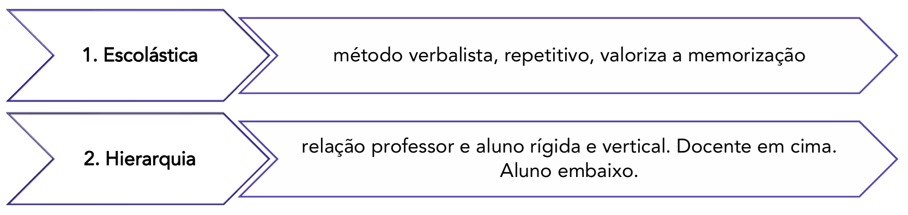
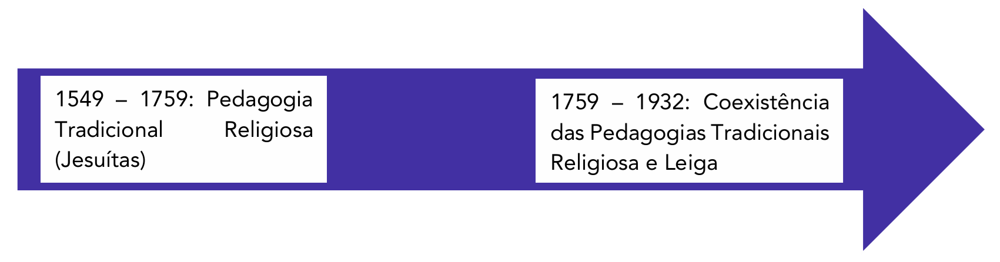
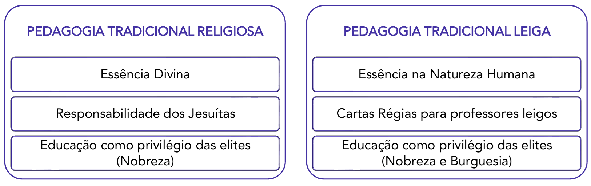
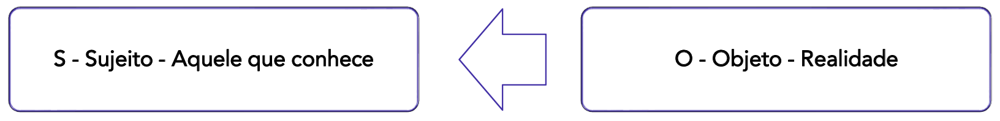
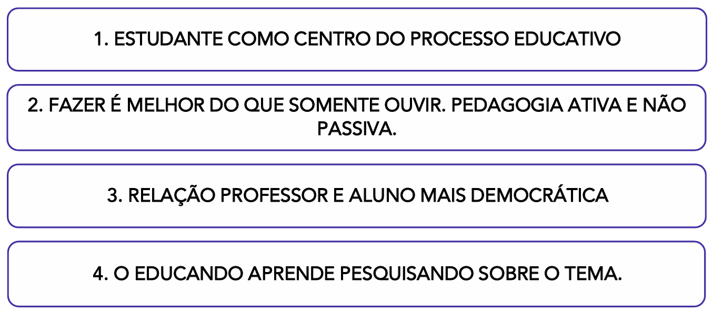
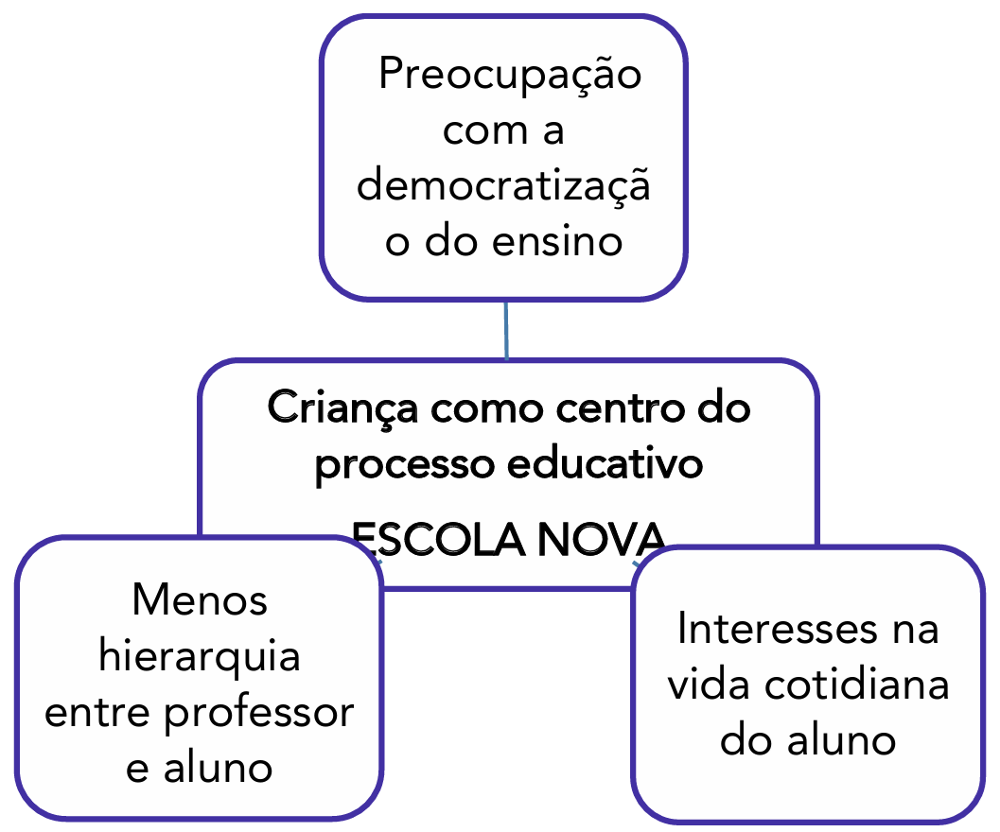
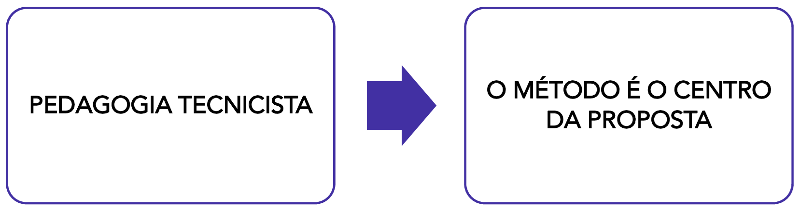

# Capítulo 2 – Concepções Educacionais e Teorias Pedagógicas

No capítulo anterior, navegamos pelas grandes correntes filosóficas que fundamentam a relação entre educação e sociedade, explorando o debate entre a manutenção e a transformação social. Agora, avançaremos do campo das ideias fundamentais para a sua manifestação concreta no chão da escola. Este capítulo se dedica a analisar as principais concepções educacionais e teorias pedagógicas que, ao longo da história, traduziram essas filosofias em métodos, currículos e práticas de ensino. Iniciaremos nossa jornada pela mais duradoura e influente de todas: a Pedagogia Tradicional.

## Pedagogia Tradicional: A Herança e a Permanência

A Pedagogia Tradicional, com sua estrutura rígida e foco no professor, exerceu uma influência monumental sobre as instituições de ensino por séculos, e muitos de seus traços ainda se fazem presentes nas escolas contemporâneas. Para compreendê-la em sua essência, é preciso revisitar sua origem histórica, que se divide em duas grandes vertentes: uma de matriz religiosa e outra de matriz leiga, que floresceu com os ideais do Iluminismo.

### Pedagogia Tradicional Religiosa: A Escolástica e a Ordem Jesuítica

A origem mais remota da Pedagogia Tradicional se encontra na **Escolástica**, o método de pensamento e ensino que dominou as universidades medievais da Europa entre os séculos IX e XVI. É importante contextualizar que o conceito de "educação" e "universidade" daquela época era muito distinto do atual. Os chamados estudos universitários medievais eram restritos a uma elite ínfima, majoritariamente clerical, e abordavam como temas avançados conteúdos que hoje consideramos básicos. O aprendizado de operações matemáticas como a multiplicação, por exemplo, era um feito intelectual complexo e objeto de estudo aprofundado.

O objetivo central da Escolástica era utilizar as ferramentas da filosofia clássica grega, em especial a lógica de Aristóteles, para compreender, sistematizar e justificar a fé e os dogmas do cristianismo. O que nos interessa pedagogicamente é o _método_ empregado. O ensino escolástico era essencialmente **verbalista, autoritário e centrado na figura do professor**. O mestre detinha o conhecimento e sua função era transmiti-lo de forma expositiva. A máxima que regia o ambiente era a do _magister dixit_ ("o mestre disse"), indicando que a palavra do professor era inquestionável.

Nesse contexto, o aluno era visto como um ser passivo. A própria etimologia da palavra "aluno", do latim _alumnus_, remete a "aquele que é alimentado", mas popularmente se consolidou a interpretação, derivada de _a-lumen_, de "sem luz". O professor, portanto, teria a nobre função de "iluminar" essa mente vazia e ignorante. O estudante não era percebido como um portador de saberes, voz ou capacidade de diálogo; seu papel era o de ouvir em silêncio, memorizar as proposições e decorar as lições baseadas nos textos clássicos e sagrados.

A organização do ensino já apresentava um esboço de separação por disciplinas, como o estudo de línguas (latim), a retórica, a aritmética e a leitura dos clássicos. Contudo, essa separação não implicava em interação ou construção coletiva. A estrutura era marcada por uma forte **hierarquia** entre mestre e discípulo, um reflexo direto da própria organização hierárquica da Igreja Católica, baseada na obediência e na autoridade.

A justificativa filosófica para essa prática era uma visão **essencialista divina**. Acreditava-se que todo ser humano nascia com uma essência divina, uma alma imutável criada por Deus. O propósito da educação era, então, aprimorar essa essência, moldando-a de acordo com os preceitos da fé. Essa crença gerava uma consequência pedagógica direta e muito significativa: se todos os alunos possuíam, em sua base, a mesma essência, eles eram considerados fundamentalmente iguais. As diferenças individuais de ritmo, interesse ou origem eram desconsideradas. O ensino era ministrado de forma uniforme para todos, e a falha em aprender não era vista como uma inadequação do método, mas como uma falha moral ou espiritual do aluno — preguiça, desatenção ou fraqueza de espírito.

#### A Prática no Brasil: O _Ratio Studiorum_ dos Jesuítas

No Brasil, a principal disseminadora dessa concepção tradicional religiosa foi a **Companhia de Jesus**. Os jesuítas chegaram com a missão de catequizar os povos indígenas e de formar a elite colonial, exercendo um virtual monopólio sobre a educação formal por mais de 200 anos. O método utilizado por eles estava detalhadamente organizado em um manual chamado **_Ratio Studiorum_**, um plano de estudos que sistematizava o currículo, os métodos de ensino e as normas disciplinares.

Seguindo a matriz escolástica, o método jesuítico era centrado na memorização, na repetição, na disciplina rígida e na autoridade do mestre, com forte ênfase nos estudos humanísticos (latim, grego, retórica) e na teologia. A Companhia de Jesus se tornou extremamente poderosa, construindo colégios por todo o território e acumulando grande poder político e econômico.

Essa hegemonia teve um fim abrupto em 1759, quando a ordem foi expulsa de Portugal e de suas colônias por Sebastião José de Carvalho e Melo, o **Marquês de Pombal**. Secretário de Estado do rei D. José I e influenciado pelos ideais do Iluminismo, Pombal via o poder da Igreja como um obstáculo à modernização e centralização do Estado português. A expulsão dos jesuítas representou, assim, um ponto de virada, marcando o início da transição de uma educação de controle religioso para uma educação de interesse do Estado, o que daria origem à vertente leiga da Pedagogia Tradicional.

### Pedagogia Tradicional Leiga: O Iluminismo, o Estado e as Reformas Pombalinas

Como vimos, a expulsão da Companhia de Jesus do Brasil em 1759, por ordem do Marquês de Pombal, encerrou um ciclo de mais de duzentos anos de hegemonia religiosa na educação. Este ato não foi uma medida isolada, mas parte de um projeto político mais amplo, influenciado pelos ideais do Iluminismo, que buscava modernizar a administração portuguesa, centralizar o poder nas mãos do Estado e diminuir a influência da Igreja nos assuntos seculares. A educação, nesse contexto, passou a ser vista como uma ferramenta estratégica para formar uma elite letrada e uma burocracia leal à Coroa Portuguesa, e não mais à Igreja.

Contudo, a consequência imediata da expulsão dos jesuítas foi a desorganização e a precarização do ensino na colônia. A Coroa Portuguesa desmantelou a única estrutura educacional existente sem possuir um sistema estatal pronto para substituí-la. Os prestigiosos colégios jesuíticos foram fechados, e o território se viu diante de um vácuo imenso, sem prédios, sem organização curricular e, principalmente, sem um corpo docente leigo preparado para assumir as salas de aula.

A solução encontrada pelo Estado português foi a criação das chamadas **aulas régias**, autorizadas por meio de documentos conhecidos como Cartas Régias. Essas aulas funcionavam de maneira avulsa e desarticulada, muitas vezes na casa do próprio professor, que era pago diretamente pela Coroa. O ensino era superficial, focado em humanidades (como Latim, Grego e Retórica), e funcionava como um preparatório para os filhos da elite econômica que pretendiam complementar seus estudos na Universidade de Coimbra, em Portugal.

Este modelo frágil e insuficiente fez com que, por várias décadas, as duas vertentes da pedagogia tradicional, a religiosa (agora enfraquecida e dispersa em outras ordens) e a nova vertente leiga estatal, coexistissem de forma precária.

Apesar da mudança de controle da Igreja para o Estado, a pedagogia tradicional leiga manteve e reforçou muitas das características de sua predecessora, especialmente o seu caráter elitista. Acreditava-se que a educação não era um direito de todos, mas um privilégio destinado a uma pequena parcela da população, aquela que iria ocupar os postos de comando na administração colonial e, posteriormente, no Império. A vasta maioria da população, composta por pessoas escravizadas, indígenas e homens livres pobres, permanecia completamente excluída de qualquer forma de instrução formal.

Embora ambas as vertentes, religiosa e leiga, fossem elitistas, seus públicos-alvo e propósitos imediatos apresentavam diferenças. A pedagogia tradicional religiosa era primariamente voltada para a formação de novos membros do clero e de uma nobreza devota, fiel aos princípios da Igreja. Já a pedagogia tradicional leiga tinha como alvo a formação da nobreza e, principalmente, da ascendente burguesia mercantil, cujos filhos deveriam se tornar os futuros administradores, juízes e funcionários do Estado Absolutista Português. A mudança fundamental, portanto, não foi no método ou no acesso, mas no destinatário final do poder que a educação conferia: da Igreja para o Estado.

### Comenius: O Pioneiro da Didática Moderna

No século XVII, um período de intensos conflitos religiosos na Europa e de florescimento do pensamento científico, surge a figura de Iohannes Amos Comenius, ou João Amós Comênio (1592-1670). A obra de Comênio é tão rica e complexa que sua classificação gera debates. Por um lado, ele pode ser considerado um autor da Pedagogia Tradicional, pois mantém a figura do professor como o centro e o organizador do processo educativo. Por outro, suas propostas foram tão inovadoras que ele é universalmente reconhecido como o "pai da Didática Moderna", rompendo de forma contundente com os métodos de seus predecessores.

A principal crítica de Comênio era direcionada ao método escolástico, que ele considerava excessivamente verbalista, abstrato e dependente da memorização. Ele observava que as crianças de sua época eram forçadas a decorar palavras e textos em latim sem qualquer referência ao mundo concreto, um processo que considerava árduo, ineficaz e contrário à natureza humana.

Para Comênio, o aprendizado deveria seguir a ordem da própria natureza, partindo dos sentidos e da experiência concreta para só então chegar aos conceitos abstratos. Ele acreditava que o conhecimento deveria ser acessado de forma direta, com clareza e sem os floreios da retórica vazia. Para que isso fosse possível, o método de ensino precisava mudar radicalmente. Sua grande inovação foi, portanto, a defesa de uma **educação pelos sentidos**.

Essa proposta se materializou em sua célebre obra **_Orbis Sensualium Pictus_** ("O Mundo das Coisas Sensíveis em Imagens"), considerado por muitos o primeiro livro ilustrado para crianças da história. Neste livro, cada palavra ou conceito era associado a uma imagem correspondente, permitindo que a criança conectasse o termo abstrato a uma representação visual concreta. Ao ver a imagem de uma árvore ao lado da palavra "árvore", o aprendizado ganhava sentido e se tornava mais intuitivo. É nesta obra revolucionária que encontramos a origem da **cartilha de alfabetização** moderna, que até hoje se baseia neste princípio fundamental de associar sílabas, palavras e frases a ilustrações que lhes deem significado. Foi um avanço imenso em relação ao método puramente mnemônico que vigorava até então.

#### O Ideal Pansófico: Ensinar Tudo a Todos

A visão educacional de Comênio, contudo, ia muito além do método. Em sua obra-prima, a **_Didática Magna_**, ele estabelece um dos princípios mais democráticos e visionários de toda a história da educação, resumido em seu lema: **_Omnes omnia docere_**, ou **"ensinar tudo a todos"**.

Numa época em que a educação era um privilégio de uma minúscula elite masculina, Comênio defendia o direito universal à instrução, independentemente da classe social, da religião ou do gênero. Para ele, todos os seres humanos nasciam com as "sementes" da ciência, da moral e da virtude. O papel da educação, e do professor, seria como o de um jardineiro: criar as condições ideais para cultivar essas sementes e permitir que cada indivíduo desabrochasse em sua plenitude.

A _Didática Magna_ é o primeiro grande esforço para sistematizar todo o processo educativo, desde a organização do cotidiano escolar até a estruturação de um sistema de ensino completo, dividido por faixas etárias — uma proposta que influenciou a forma como as escolas se organizam até os dias de hoje.

A motivação por trás desse grandioso projeto era profundamente religiosa. Como bispo protestante, Comênio acreditava que o acesso universal ao conhecimento era o caminho para que todas as pessoas pudessem ler e interpretar as escrituras sagradas por si mesmas, alcançando uma fé mais pura e verdadeira. Além disso, tendo vivido os horrores da Guerra dos Trinta Anos, ele via na pansofia (o saber universal) a única esperança para a união da humanidade e a conquista da paz perpétua. Sua pedagogia, portanto, estava a serviço de um projeto de salvação da alma e de harmonia para o mundo.

### A Permanência da Pedagogia Tradicional nos Dias Atuais

Apesar de séculos de críticas e do surgimento de inúmeras teorias pedagógicas que propõem alternativas, a Pedagogia Tradicional demonstra uma notável resiliência. Seus ecos e práticas fundamentais ainda são amplamente encontrados nas escolas hoje, muitas vezes de forma tão naturalizada que passam despercebidos. As suas características centrais persistem: um ensino essencialmente verbalista, uma forte centralidade na figura do professor e uma concepção, ainda que secularizada, de que existe uma essência ou um padrão ideal de aluno a ser seguido.

Essa abordagem se manifesta em diversas práticas do cotidiano escolar, que podem ser vistas como as "novas roupagens" do método tradicional. Termos como **aula expositiva**, **palestra** ou **apresentação** são comuns no vocabulário educacional e, em sua essência, derivam da mesma lógica: um especialista (o professor) expondo oralmente um conteúdo para uma audiência (os alunos).

É importante notar que uma aula expositiva, em si, não é um método inerentemente negativo. Ela pode ser uma ferramenta útil e eficaz para apresentar um novo tópico, sintetizar ideias complexas ou compartilhar uma narrativa envolvente. O problema surge quando a exposição unilateral se torna o único ou o principal método utilizado, transformando a sala de aula em um auditório e os alunos em meros espectadores, com pouca ou nenhuma interação.

#### O Professor como Epicentro do Processo Educativo

A característica mais marcante e duradoura da Pedagogia Tradicional é, sem dúvida, a posição de centralidade absoluta ocupada pelo professor. Nesta concepção, todo o processo educativo orbita em torno de sua figura. É o professor quem define o que será ensinado e o que será ignorado. É o professor quem determina o ritmo da aula e o tempo de cada atividade. É o professor quem valida o que é certo e o que é errado, muitas vezes sem espaço para ambiguidades ou interpretações diversas. É o professor quem detém e transmite os saberes, posicionando-se como a grande figura de autoridade intelectual e moral da sala de aula. Em suma, o professor está no centro de todas as preocupações e de todas as ações.

#### Fatores da Persistência do Modelo Tradicional

Mas por que este modelo, tão criticado por seu autoritarismo e por sua passividade imposta ao aluno, ainda persiste com tanta força? Diversos fatores contribuem para essa resiliência:

1. **A Cultura Escolar:** Existe uma imagem culturalmente arraigada do que é uma "aula de verdade", compartilhada por muitos pais, alunos e até mesmo gestores. Essa imagem frequentemente corresponde ao modelo tradicional: alunos em silêncio, em fileiras, copiando a matéria do quadro e ouvindo a explicação do professor. Práticas inovadoras, que envolvem mais diálogo, movimento ou aparente "desordem", podem ser vistas com desconfiança.
2. **A Arquitetura e Organização da Escola:** A própria estrutura física da maioria das escolas — com salas de aula compostas por fileiras de carteiras voltadas para um quadro-negro na frente — foi projetada para o modelo expositivo e dificulta a implementação de trabalhos em grupo e outras metodologias ativas.
3. **A Pressão dos Sistemas de Avaliação:** A existência de avaliações externas em larga escala, como o Exame Nacional do Ensino Médio (ENEM) e os vestibulares, exerce uma enorme pressão por "vencer o conteúdo". Diante de um currículo extenso e pouco tempo, muitos professores recorrem à aula expositiva como a forma mais rápida e direta de transmitir a grande quantidade de informações exigida nessas provas.
4. **A Formação dos Professores:** Muitos educadores foram, eles próprios, formados dentro do modelo tradicional. É natural que, especialmente no início da carreira ou em situações de sobrecarga, eles tendam a replicar o modelo pelo qual aprenderam, que lhes é mais familiar e seguro.

Reconhecer esses traços da tradição na prática cotidiana não é um exercício de pura crítica, mas uma necessidade para o educador que deseja agir de forma intencional. Apenas ao identificar os porquês da permanência desse modelo é possível, de forma consciente, buscar alternativas para construir uma prática pedagógica mais dialógica, participativa e verdadeiramente centrada no aprendizado e no desenvolvimento integral do aluno.

### A Base Filosófica: O Positivismo e a Objetividade do Saber

A metodologia da Pedagogia Tradicional, como vimos, opera a partir de uma lógica clara: o conhecimento é um corpo de saberes prontos e acabados que são transmitidos de fora para dentro. O professor, como detentor desse saber, o repassa ao estudante, cuja tarefa é absorvê-lo por meio de atividades de memória e repetição. Aprender, nesse modelo, é sinônimo de memorizar e reproduzir fielmente o que foi ensinado.

Essa didática, contudo, não é arbitrária. Ela está profundamente fundamentada em uma influente corrente filosófica que marcou os séculos XIX e XX: o **Positivismo**. Inaugurado pelo filósofo francês Auguste Comte (1798-1857), o Positivismo buscava aplicar ao estudo da sociedade a mesma objetividade e o mesmo rigor que eram atribuídos às ciências naturais, como a Física e a Biologia.

Para a filosofia positivista, o conhecimento verdadeiro só pode ser aquele que se baseia em fatos observáveis, mensuráveis e comprováveis. A realidade é vista como algo objetivo, externo ao indivíduo, que pode ser captada de forma neutra. Nesta visão, não há espaço para interpretação, subjetividade ou crítica, pois estas são consideradas fontes de erro, meras opiniões do "senso comum" sem validade científica. O que importa são os dados, os números, as estatísticas e os postulados objetivos. A máxima que resume essa perspectiva é a de que "os números falam por si!".

A relação entre quem conhece (o sujeito) e o que é conhecido (o objeto) é, portanto, passiva. O sujeito é um espectador que deve se limitar a registrar a realidade tal como ela é.

A influência do Positivismo foi imensa em todo o mundo, e no Brasil ela se manifesta de forma explícita até hoje no lema da bandeira nacional, "Ordem e Progresso", um dos conceitos centrais do pensamento comtiano.

#### A Sala de Aula como Reflexo da Filosofia Positivista

A semelhança entre a lógica positivista e a estrutura da Pedagogia Tradicional é notável, pois uma é o alicerce da outra. A sala de aula tradicional opera exatamente sob os mesmos princípios. Nesta analogia, o **Professor** assume o lugar do Objeto (O): ele é a própria encarnação da realidade objetiva, o detentor dos saberes validados, dos fatos e das verdades a serem conhecidas. O **Aluno**, por sua vez, é colocado no lugar do Sujeito (S): um receptor passivo, cuja função é absorver e registrar fielmente o conhecimento que lhe é transmitido pelo professor, sem questionar, interpretar ou modificar.

Essa base filosófica explica muitas das práticas da escola tradicional:

- **O Currículo:** É visto como um conjunto de fatos e verdades científicas a serem ensinados, com grande valorização das ciências exatas e naturais em detrimento das humanidades, consideradas mais "subjetivas".
- **O Erro:** Não é encarado como uma etapa natural do processo de aprendizagem, mas como uma falha do aluno em captar corretamente a "verdade" ensinada pelo professor.
- **A Avaliação:** Privilegiam-se os instrumentos considerados "objetivos", como provas de múltipla escolha ou questões de resposta única (certo/errado, complete a lacuna), pois eles permitem uma correção que minimiza a interferência e a interpretação do avaliador.

Portanto, entender a base positivista da Pedagogia Tradicional é crucial para compreender por que esse modelo valoriza tanto a autoridade do mestre, a disciplina, a ordem e a certeza, em detrimento do pensamento crítico, da criatividade e do diálogo. O método tradicional não é apenas um "jeito de ensinar", mas um sistema coerente, com profundas raízes filosóficas que moldaram a cultura escolar de forma duradoura.

## Escola Nova (Pedagogia Nova): A Revolução do Paidocentrismo

Após um longo período de domínio da Pedagogia Tradicional — primeiro em sua vertente religiosa (aproximadamente de 1549 a 1759) e depois na leiga (1759 até as primeiras décadas do século XX) —, o Brasil viu emergir um vigoroso movimento de renovação pedagógica. A **Escola Nova**, também conhecida como Pedagogia Nova, surge no cenário nacional de forma organizada a partir da década de 1920, tendo como seu marco mais importante o lançamento do **Manifesto dos Pioneiros da Educação Nova**, em 1932.

Este movimento, liderado por intelectuais de peso como Anísio Teixeira, Fernando de Azevedo e Lourenço Filho, nasceu de um duplo diagnóstico: o fracasso do modelo tradicional, evidenciado pelas altíssimas taxas de analfabetismo e evasão escolar no país, e a necessidade de um novo projeto de educação que respondesse às demandas de um Brasil que se urbanizava e se industrializava sob o governo de Getúlio Vargas. A velha escola, elitista e focada na memorização, já não parecia capaz de formar o cidadão para esta nova era.

#### As Duas Grandes Bandeiras do Movimento Escolanovista

O ideário da Escola Nova se sustentava sobre duas grandes bandeiras, ou pilares, que se complementavam: uma de caráter político-social e outra de caráter estritamente pedagógico.

1. **A Luta pela Expansão da Escola Pública:** A primeira grande meta do movimento era combater o caráter excludente da educação brasileira, defendendo a ampliação de uma rede de ensino pública, gratuita, laica e obrigatória para todos. Contudo, é importante analisar o contexto dessa defesa. A ampliação da oferta educacional não era, para muitos de seus defensores, um projeto de transformação social radical. Ela estava fortemente atrelada aos interesses da burguesia industrial emergente, que necessitava de uma mão de obra mais qualificada e de um mercado consumidor mais amplo, o que exigia uma população minimamente letrada. O objetivo era, em grande medida, alinhar o Brasil aos trilhos da modernidade capitalista, e não necessariamente subverter a estrutura de classes.
2. **A Revolução Pedagógica: A Centralidade na Criança (Paidocentrismo):** Se a primeira bandeira era política, a segunda era uma verdadeira revolução dentro da sala de aula. A Escola Nova propunha uma mudança de eixo radical em relação à Pedagogia Tradicional: o centro do processo educativo não seria mais o professor, nem o conteúdo, mas sim a **criança**. Este princípio, conhecido como **paidocentrismo**, defendia que a educação deveria partir das necessidades, dos interesses e das fases do desenvolvimento psicológico do aluno. O foco saía da lógica do conteúdo para a lógica do aprendiz. Em vez de um aluno passivo que se adapta a um currículo rígido, teríamos um aluno ativo, que constrói seu conhecimento através da pesquisa, da descoberta e da ação. O lema mudava de "ensinar" para "aprender a aprender".

#### As Influências Teóricas Europeias e Norte-Americanas

O movimento escolanovista brasileiro foi fortemente influenciado por correntes de pensamento que já floresciam na Europa e nos Estados Unidos. Uma das primeiras obras de impacto foi "A Escola Ativa", do educador suíço **Adolphe Ferrière**. Ele foi um dos pioneiros na defesa de uma escola centrada nos interesses e na atividade da criança. Contudo, suas proposições ainda eram vistas por alguns como carregadas de um certo "essencialismo", carecendo de uma fundamentação científica mais robusta para comprovar suas teses.

A influência mais decisiva, no entanto, veio do filósofo e pedagogo norte-americano **John Dewey**. Como vimos no capítulo anterior, Dewey, influenciado pelo pragmatismo, propôs que a educação deveria estar intimamente ligada à **experiência**. Ele defendia um ambiente pedagógico mais democrático, onde a rígida hierarquia entre professor e aluno fosse substituída pela cooperação. Em uma escola Deweyana, os alunos trabalham com pesquisas, investigam problemas reais e aprendem através da prática. Apesar de seu viés democrático, é importante notar que o foco de Dewey era, primordialmente, a transformação das relações dentro da sala de aula e da escola, e não um questionamento direto das estruturas de classe da sociedade mais ampla.

#### Síntese da Proposta Escolanovista

Em resumo, a Pedagogia da Escola Nova representa uma ruptura fundamental com o modelo tradicional. Nela, o papel do **professor** se transforma: ele deixa de ser o transmissor de verdades prontas para se tornar um **facilitador** da aprendizagem, um organizador de experiências, um orientador da pesquisa dos alunos. O **aluno**, por sua vez, assume uma postura **ativa e investigativa**. A psicologia infantil passa a ser uma ciência fundamental para a pedagogia, e os métodos de ensino priorizam a resolução de problemas e a descoberta, em detrimento da memorização e da repetição.

Compreendido. Dando sequência ao capítulo, vamos agora dedicar uma seção especial a Anísio Teixeira, detalhando seu papel central na Escola Nova e, principalmente, a originalidade e o alcance de suas propostas para a educação brasileira.

### Anísio Teixeira: O Pensador e Construtor da Escola Pública no Brasil

Dentro do movimento da Escola Nova, a figura de Anísio Teixeira (1900-1971) se destaca não apenas como um de seus principais teóricos, mas como um grande pensador e gestor da educação brasileira, cujas ideias continuam a influenciar os debates contemporâneos. Sua importância é tamanha que o principal órgão de pesquisas educacionais do país, o INEP, leva seu nome: Instituto Nacional de Estudos e Pesquisas Educacionais Anísio Teixeira.

Como um dos signatários do Manifesto dos Pioneiros da Educação Nova em 1932, Anísio foi uma voz contundente na denúncia do elitismo educacional e dos alarmantes índices de analfabetismo que marcavam o país. Fortemente influenciado pelo filósofo norte-americano John Dewey, de quem foi aluno direto na Universidade de Columbia, Anísio Teixeira trouxe para o Brasil a filosofia pragmatista, buscando adaptá-la à nossa realidade para construir um sistema educacional verdadeiramente democrático.

#### A Ampliação do Ideal Democrático

Enquanto muitas das discussões da Escola Nova se concentravam na democratização das relações dentro da sala de aula, o pensamento de Anísio Teixeira foi além. Para ele, a democracia não deveria estar restrita aos muros da escola; ela deveria ser o princípio organizador de todo o sistema público de ensino, desde a educação infantil até a universidade. Ele entendia que a construção de um Brasil mais justo e com melhores condições de vida para todos passava, necessariamente, pela garantia de uma escola pública, gratuita, laica e de alta qualidade para cada cidadão brasileiro. A educação era, em sua visão, a ferramenta mais poderosa para a manutenção e o aprimoramento da própria democracia.

#### A Revolução da Educação Integral: Escolas Classe e Escolas Parque

A proposta mais visionária e célebre de Anísio Teixeira foi, sem dúvida, seu projeto de **educação integral**. Ele compreendia que, para combater a desigualdade social, não bastava oferecer o ensino formal. Era preciso garantir que as crianças das classes populares tivessem acesso a todos os bens culturais que, historicamente, eram privilégio da elite.

Para isso, ele concebeu um modelo de escola de tempo integral dividido em duas estruturas complementares:

- As **Escolas Classe**, onde os alunos, em um turno (pela manhã, por exemplo), teriam acesso ao ensino dos conteúdos formais do currículo, com foco no desenvolvimento intelectual e cognitivo.
- As **Escolas Parque**, espaços para o contraturno, onde os estudantes se dedicariam a atividades de artes plásticas, teatro, dança, música, esportes, estudos em biblioteca e iniciação ao trabalho. Seriam locais para o desenvolvimento da criatividade, da sensibilidade, do corpo e da sociabilidade.

Este modelo, notavelmente avançado para a sua época, foi a inspiração direta para importantes projetos educacionais no Brasil. A experiência pioneira foi o Centro Educacional Carneiro Ribeiro, em Salvador (BA), na década de 1950. Posteriormente, as escolas do Plano Piloto de Brasília foram concebidas sob essa mesma inspiração. E, mais tarde, na década de 1980, no Rio de Janeiro, o antropólogo e educador Darcy Ribeiro, um grande admirador de Anísio, implementou os Centros Integrados de Educação Pública (CIEPs), os famosos "Brizolões", que levavam educação integral de alta qualidade para as periferias da cidade.

#### Pesquisa e Formação Docente como Pilares da Mudança

Anísio Teixeira entendia que nenhuma reforma educacional seria bem-sucedida sem dados confiáveis para orientar as políticas públicas e sem professores bem formados para executá-las. Em 1952, ele fundou o Centro Brasileiro de Pesquisas Educacionais (CBPE), um embrião do que viria a ser o INEP.

Sua visão para o CBPE era duplamente inovadora. O centro deveria ter uma atuação "macro", realizando pesquisas para diagnosticar os grandes problemas educacionais do país e subsidiar o planejamento em nível nacional. Ao mesmo tempo, deveria ter uma atuação "micro", estabelecendo um diálogo direto com o chão da escola, promovendo a formação continuada dos professores primários. Anísio acreditava que a pesquisa só tinha sentido se servisse para ajudar o educador em sua prática cotidiana.

Nessa concepção, o professor era visto como um intelectual, um profissional que deveria dominar tanto os conteúdos que ensina quanto os métodos pedagógicos mais inovadores. Essa visão democrática valorizava tanto o grande pesquisador quanto o humilde professor primário como agentes fundamentais da transformação educacional.

Em síntese, o pensamento de Anísio Teixeira pode ser resumido em alguns pontos essenciais: a ênfase na escola pública de qualidade e em tempo integral como motor para o desenvolvimento do país; a educação como pilar para a construção da democracia e da cidadania; a valorização da formação docente, tratando o educador como um intelectual; e a compreensão de que a aprendizagem deve ir além da simples absorção de informações, focando no desenvolvimento de atitudes, do pensamento crítico e da capacidade de intervir no mundo.

## Pedagogia Tecnicista: A Escola como Linha de Montagem

Após o período de ascensão da Escola Nova, que vigorou com mais força entre as décadas de 1930 e 1960, o cenário educacional brasileiro passou por uma nova e drástica mudança. Entre os anos 1960 e o final da década de 1970, emergiu a **Pedagogia Tecnicista**, uma concepção que refletia tanto as transformações econômicas do país quanto o novo regime político que se instaurava.

#### O Contexto Histórico: Industrialização, Regime Militar e a Teoria do Capital Humano

A origem do Tecnicismo está ligada a dois processos simultâneos. O primeiro foi a **aceleração da industrialização** no Brasil, especialmente durante o período do "milagre econômico". O crescimento da demanda por produtos manufaturados e a expansão da indústria criaram uma necessidade urgente de formar mão de obra técnica e especializada em larga escala e em curto espaço de tempo. A Escola Nova, com seu foco nos processos psicológicos da criança e em uma formação mais ampla e, por vezes, mais lenta, passou a ser vista pelo setor empresarial como "ineficiente" e "desconectada" das necessidades do mercado de trabalho.

O segundo processo foi a instauração da **Ditadura Militar (1964-1985)**. O regime autoritário via com desconfiança as pedagogias que estimulavam o pensamento crítico, o debate e a autonomia, considerando-as potencialmente "subversivas". O Tecnicismo, com sua proposta de uma educação supostamente neutra, objetiva e focada em resultados práticos, alinhava-se perfeitamente aos ideais de ordem, controle e desenvolvimento econômico do governo militar.

Essa abordagem era justificada pela **Teoria do Capital Humano**, uma visão econômica que enxerga a educação não como um direito social, mas como um investimento que um país faz para aumentar a sua produtividade. A escola, nessa lógica, passa a ser vista como uma empresa, cujo objetivo é "produzir" profissionais qualificados (o "capital humano") da forma mais eficiente e racional possível.

#### Os Princípios do Tecnicismo: A Centralidade do Método

A grande mudança de paradigma proposta pelo Tecnicismo foi o deslocamento do centro do processo educativo. Se na Pedagogia Tradicional o centro era o professor e na Escola Nova era o aluno, na Pedagogia Tecnicista o centro passa a ser o **método, a técnica e os meios de ensino**. A preocupação principal não é mais com o desenvolvimento integral do aluno, mas com a máxima produtividade e eficiência do processo de ensino-aprendizagem.

Nesta concepção, a educação é planejada por especialistas (psicólogos, engenheiros de ensino, designers instrucionais) que, longe da sala de aula, elaboram um "pacote" instrucional otimizado. O professor e os alunos tornam-se secundários nesta proposta. O que realmente importa são os materiais didáticos bem estruturados, os livros, as apostilas, os recursos audiovisuais e a tecnologia educacional. Em suma, o método é mais importante do que o professor e o aluno.

Essa ênfase nos meios transforma-os nos próprios fins do objetivo pedagógico. A discussão sobre os propósitos mais amplos da educação — como a formação para a cidadania, para a crítica ou para a sensibilidade — é deixada de lado em favor da busca pela eficiência produtiva.

#### Os Novos Papéis: O Professor-Técnico e o Aluno-Receptor

Dentro dessa lógica de linha de montagem, os papéis do professor e do aluno são redefinidos:

- **O Professor** deixa de ser o mestre detentor do saber (como na tradição) ou o facilitador da aprendizagem (como na Escola Nova) para se tornar um **técnico**, um especialista na aplicação de métodos. Sua função é executar, de forma precisa e fiel, o plano de ensino que foi elaborado por outros. A autonomia e a criatividade docente são minimizadas, e o bom professor é aquele que domina a técnica de aplicação do material didático.
- **O Aluno** é visto como um receptor passivo, cujo comportamento pode ser moldado e programado através de estímulos e reforços. O objetivo é que ele aprenda os conteúdos e as habilidades de forma rápida e padronizada, gerando os "resultados" esperados pelo sistema.

Essa abordagem foi fortemente influenciada pelo **Behaviorismo (Psicologia Comportamental)**, especialmente pelas ideias de B. F. Skinner. A instrução programada, que divide o conhecimento em pequenas etapas sequenciais com verificação e reforço imediatos, é um exemplo clássico da aplicação da psicologia behaviorista ao método tecnicista.

#### A Herança Tecnicista na Educação Atual

Embora o auge do Tecnicismo como política oficial tenha passado, sua herança é extremamente presente na educação brasileira atual. Os **sistemas de ensino apostilados**, adotados por muitas escolas particulares, são um exemplo direto dessa lógica. Nesses sistemas, uma empresa central produz todo o material didático e o planejamento de aulas, e as escolas e professores conveniados atuam primariamente como executores desse pacote.

Da mesma forma, alguns modelos de **Educação a Distância (EAD)**, especialmente aqueles baseados em videoaulas padronizadas, testes automatizados e pouca interação, também podem refletir uma lógica tecnicista de racionalização de recursos e otimização da entrega de conteúdo, colocando a tecnologia e o material no centro do processo, em detrimento da interação pedagógica e da formação integral do aluno.

