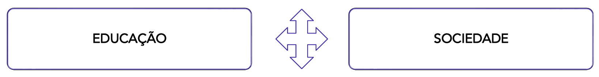
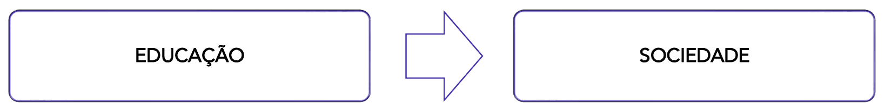
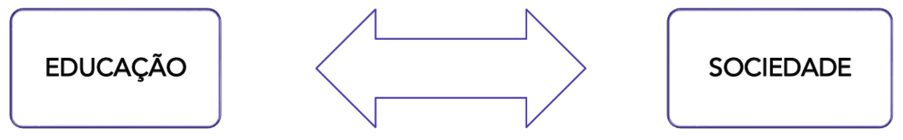
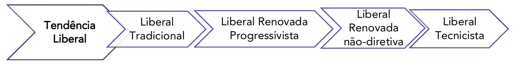
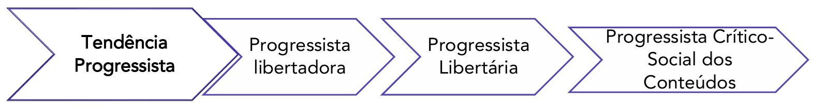
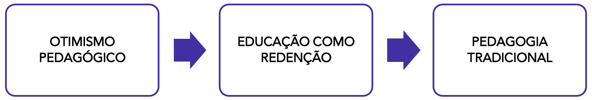
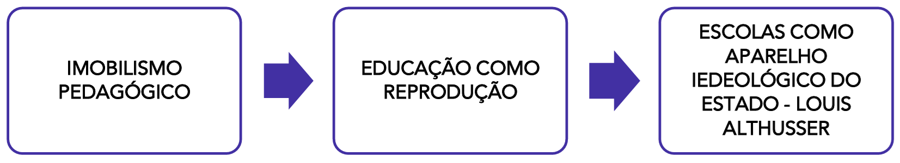
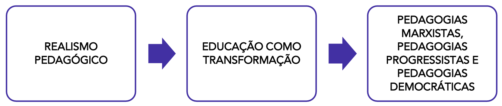

# Capítulo 3 – Classificação das Tendências Pedagógicas Brasileiras

Após termos percorrido a história e os fundamentos das principais concepções que marcaram a educação no Brasil no capítulo anterior, torna-se necessário agora organizar esse panorama. Diferentes estudiosos propuseram formas de classificar as teorias pedagógicas, utilizando termos como "concepções", "tendências" ou "pensamentos", que, para os fins deste estudo, podem ser entendidos como sinônimos. A classificação nos ajuda a compreender as semelhanças, as diferenças e, principalmente, os pressupostos políticos e filosóficos que sustentam cada projeto de educação.

## A Classificação de Dermeval Saviani: Educação e Sociedade

Uma das mais importantes e rigorosas classificações das teorias da educação com repercussão no Brasil foi proposta pelo filósofo e educador Dermeval Saviani. Para compreender sua análise, é preciso entrar na lógica de seu raciocínio, que se baseia em um critério fundamental: a forma como cada teoria concebe a **relação entre educação e sociedade**.

Saviani argumenta que toda teoria pedagógica se posiciona, implícita ou explicitamente, em relação à capacidade da educação de interferir na sociedade e, inversamente, em relação à capacidade da sociedade de determinar a educação. É a natureza dessa interação que define o caráter "crítico" ou "não-crítico" de uma tendência.

A partir desse critério, Saviani divide as teorias em dois grandes grupos: as não-críticas e as crítico-reprodutivistas.

### As Teorias Não-Críticas ou "Teorias da Redenção"

O primeiro grupo é o das **teorias não-críticas**, que Saviani também denomina "teorias da redenção". A característica central deste grupo é a crença de que a educação é uma força autônoma, externa à sociedade, com o poder de transformá-la e redimi-la de seus males, sejam eles a ignorância, a marginalidade ou a ineficiência. Essas teorias atribuem uma força desmedida à educação, vendo-a como a principal causa das estruturas sociais, e não como uma consequência delas.

Saviani classifica este grupo como "não-crítico" justamente porque, em sua visão, essas teorias falham em fazer uma crítica radical da própria educação, pois não percebem como ela é, em grande medida, determinada pelas condições sociais, políticas e econômicas. As teorias não-críticas que tiveram maior impacto no Brasil são a Pedagogia Tradicional, a Escola Nova e a Pedagogia Tecnicista.

#### Análise das Tendências Não-Críticas

Embora a Pedagogia Tradicional, a Escola Nova e a Pedagogia Tecnicista apresentem, em suas superfícies, métodos e preocupações muito distintas, Dermeval Saviani as agrupa sob a mesma categoria de "não-críticas". A razão para isso é que, segundo o autor, todas elas partilham de uma mesma falha fundamental em sua análise: compreendem a educação como uma força externa e autônoma, com poder para consertar, salvar ou "redimir" a sociedade de seus problemas. Cada uma delas elege um "mal" social a ser combatido pela ação escolar, mas nenhuma delas compreende em profundidade como a própria estrutura da sociedade determina os limites e as possibilidades da educação.

##### A Redenção pela Instrução: A Pedagogia Tradicional

A Pedagogia Tradicional se apresenta como a grande redentora da sociedade através do combate ao "mal da ignorância". Sua promessa consiste em universalizar o acesso ao conhecimento sistematizado, garantindo, através da instrução, a coesão social e o progresso. No entanto, para Saviani, esta é uma visão não-crítica porque ela ignora que os obstáculos a essa universalização não estão na escola, mas na própria sociedade. A teoria falha ao não perceber que são as condições sociais — como a necessidade do trabalho infantil ou a falta de recursos das famílias — que impedem que todos possam frequentar a escola e ser bem-sucedidos nela. O perfil de muitos estudantes da Educação de Jovens e Adultos (EJA), que abandonaram a escola para trabalhar, é um exemplo concreto de como os determinantes sociais se sobrepõem à missão redentora da escola. Ao não conseguir se adaptar a essas diferentes realidades e, por vezes, culpar o indivíduo pelo fracasso, a Pedagogia Tradicional revela sua incapacidade de fazer uma crítica profunda da relação entre educação e sociedade.

##### A Redenção pela Inclusão: A Escola Nova

A Escola Nova, por sua vez, propõe-se a redimir a sociedade do "mal da marginalidade". Diferentemente do modelo tradicional, sua estratégia não é a imposição de um padrão único, mas a adaptação da escola às necessidades e diferenças individuais de cada aluno. O problema, na análise de Saviani, é que, ao fazer isso de forma ingênua, a Escola Nova acaba por legitimar a desigualdade social. As diferenças de repertório, de ritmo e de interesse entre os alunos não são fenômenos puramente psicológicos ou naturais; são, em grande medida, o produto de uma sociedade dividida em classes. Ao tratar as diferenças sociais como se fossem meras diferenças individuais a serem "respeitadas", a escola corre o risco de acentuar a divisão social. Por exemplo, ao justificar a utilização de um repertório cultural limitado na escola com o argumento de que "corresponde à realidade do aluno", pode-se estar, na prática, negando a esse mesmo aluno o acesso a um conhecimento mais amplo e universal, que é uma ferramenta essencial para a superação das desigualdades. Desta forma, sob um discurso democrático, a Escola Nova pode acabar por justificar as diferenças sociais em vez de fornecer os instrumentos para superá-las.

##### A Redenção pela Técnica: A Pedagogia Tecnicista

Por fim, a Pedagogia Tecnicista se apresenta como a redentora da sociedade contra o "mal da ineficiência e da improdutividade". Sua promessa é a modernização do ensino através da aplicação de um método científico, neutro e supostamente infalível. A não-criticidade desta abordagem reside em sua crença de que a educação pode ser reduzida a um problema puramente técnico, ignorando suas dimensões humanas, sociais e políticas. Ao colocar toda a ênfase no método, nos materiais padronizados e nos sistemas apostilados, a subjetividade do estudante e a autonomia intelectual do professor são deixadas em segundo plano. O professor se torna um mero aplicador, e o aluno, uma peça que deve se encaixar na engrenagem produtiva. Como resultado, o estudante que não demonstra os resultados esperados ou que não se adapta ao ritmo padronizado é considerado "improdutivo" e acaba excluído do processo, o que demonstra a incapacidade desta teoria de lidar com a complexidade da realidade educacional.

### As Teorias Crítico-Reprodutivistas: A Escola como Reprodutora das Desigualdades

O segundo grande grupo na classificação de Dermeval Saviani é o das **teorias crítico-reprodutivistas**. O nome é composto e revela a lógica deste conjunto de pensamentos:

- Elas são **críticas** porque, diferentemente das teorias não-críticas, elas fazem uma análise rigorosa da sociedade e compreendem que a educação não é autônoma, mas sim determinada pela estrutura social, política e econômica. Elas percebem que a sociedade se sobrepõe e condiciona a educação.
- Elas são **reprodutivistas** porque, a partir dessa análise crítica, chegam a uma conclusão pessimista: a determinação da sociedade sobre a escola é tão absoluta que a única função desta é a de **reproduzir** as desigualdades e a ideologia da classe dominante.

Para estas teorias, a escola não falha em seu propósito; pelo contrário, ela é extremamente eficiente em cumprir sua função social oculta, que é a de manter a ordem vigente e garantir que cada classe social permaneça em seu devido lugar.

Dentro deste grupo, destacam-se três teorias principais que tiveram grande repercussão no Brasil.

#### A Teoria do Sistema de Ensino como Violência Simbólica

Desenvolvida pelos sociólogos franceses **Pierre Bourdieu** e **Jean-Claude Passeron**, esta teoria argumenta que a dominação de classe não ocorre apenas pela força econômica, mas também por mecanismos mais sutis. A escola, embora pareça um espaço neutro de promoção do mérito, atua como um poderoso instrumento de **violência simbólica**.

Isso ocorre porque a cultura escolar (a linguagem utilizada, os conhecimentos valorizados, os modos de se comportar) não é neutra, mas sim a cultura da classe dominante imposta como se fosse a única cultura legítima e universal. Os alunos que vêm das classes dominantes já possuem o **capital cultural** e o **habitus** (um conjunto de disposições e posturas) que a escola valoriza, sentindo-se "em casa". Já os alunos das classes populares, portadores de outra cultura, são levados a ver seu próprio repertório como inferior e inadequado. Essa imposição cultural é uma forma de violência (simbólica) que leva à autoexclusão e ao fracasso escolar, que é então falsamente justificado como "falta de dom" ou "incapacidade" individual. Desta forma, a escola reproduz as desigualdades sociais, mas de um jeito que as legitima, culpando a vítima por seu próprio fracasso.

#### A Teoria da Escola como Aparelho Ideológico do Estado (AIE)

Proposta pelo filósofo francês **Louis Althusser**, esta teoria marxista afirma que o Estado capitalista mantém seu poder através de duas estruturas: os Aparelhos Repressivos de Estado (ARE), que funcionam pela violência física (exército, polícia), e os **Aparelhos Ideológicos de Estado (AIE)**, que funcionam pela ideologia (igreja, família, mídia e, principalmente, a escola).

Para Althusser, a escola se tornou o AIE dominante nas sociedades capitalistas modernas. Sua função primordial é a de inculcar a ideologia da classe dominante em todas as as classes sociais. Para os filhos da classe trabalhadora, a escola ensina as "regras" da submissão, do respeito à hierarquia e as habilidades técnicas básicas para que se tornem uma força de trabalho dócil e eficiente. Para os filhos da burguesia, ela ensina as técnicas de comando e a retórica do poder. Ao fazer isso, a escola garante a reprodução contínua das relações de produção e da ideologia que as sustenta, desmobilizando a luta de classes.

#### A Teoria da Escola Dualista

Desenvolvida pelos sociólogos franceses **Christian Baudelot** e **Roger Establet**, esta teoria argumenta que a ideia de uma escola "única" e "unificadora" para todos é uma farsa. Na realidade, o sistema escolar capitalista é dividido em **duas grandes redes**, que são distintas e quase impermeáveis:

- A **rede primária-profissional (PP)**, destinada aos filhos da classe trabalhadora. Caracteriza-se por um caminho mais curto, com repetência, evasão e direcionamento para o trabalho manual e subalterno.
- A **rede secundária-superior (SS)**, destinada aos filhos da burguesia. Caracteriza-se por uma trajetória escolar mais longa e linear, que conduz ao ensino superior e aos postos de comando na sociedade.

Essas duas redes, embora coexistam sob o mesmo sistema, funcionam com lógicas e objetivos diferentes, contribuindo para reproduzir de forma quase perfeita a divisão da sociedade em classes: uma classe que trabalha e outra que dirige.

A conclusão comum a todas essas teorias é profundamente pessimista em relação ao papel da escola. Se a instituição escolar é um instrumento tão eficiente de reprodução social, qualquer tentativa de promover a mudança a partir de seu interior está fadada ao fracasso. Para os teóricos crítico-reprodutivistas, a superação do quadro de desigualdades só pode ocorrer através da luta política e da organização da classe trabalhadora **fora dos muros da escola**, tornando a instituição escolar, em si, um "palco inútil" para a transformação social.

### As Teorias Críticas: A Práxis Educativa para a Transformação

Após analisar as teorias que ou viam a educação como redentora da sociedade (não-críticas) ou a viam como mera reprodutora (crítico-reprodutivistas), Dermeval Saviani avança para apresentar um terceiro grupo: o das **teorias críticas**. Estas teorias, incluindo sua própria Pedagogia Histórico-Crítica, buscam uma superação dialética das anteriores, evitando tanto a ingenuidade das primeiras quanto o pessimismo imobilizador das segundas.

A característica fundamental das teorias críticas é a sua compreensão equilibrada e dialética da relação entre educação e sociedade. Elas reconhecem que a sociedade, com suas estruturas de classe e suas relações de poder, exerce uma forte influência sobre o ambiente educacional. No entanto, essa influência não é vista como uma determinação absoluta e intransponível. A escola, para estas teorias, não é apenas um reflexo da sociedade; ela também é um espaço de contradições. É nessas contradições, nessas brechas do sistema, que a ação educativa pode atuar como uma força para a mudança.

Portanto, a educação não pode mudar tudo, como acreditavam as teorias não-críticas, mas também não é impotente, como concluíam as teorias crítico-reprodutivistas. Ela tem um papel crucial a desempenhar na transformação social.

Para que a educação cumpra essa função transformadora, as teorias críticas pressupõem que a prática pedagógica seja desenvolvida a partir da perspectiva da **classe dominada**. Isso implica em um compromisso explícito de lutar contra os mecanismos que perpetuam a desigualdade dentro da escola, como a seletividade social e, principalmente, o **rebaixamento do conteúdo** oferecido às classes populares. A meta é garantir que todos os alunos tenham acesso ao conhecimento mais rico e elaborado produzido pela humanidade, pois este saber é uma ferramenta indispensável para a luta por emancipação.

O ponto de partida do ato pedagógico, nesta visão, não é o conteúdo em si mesmo, de forma abstrata e desconectada, como na Pedagogia Tradicional. A tarefa da teoria crítica de educação é tomar a **prática social** — a experiência empírica e a realidade vivida pelos alunos — como o início do processo. No entanto, diferentemente de algumas interpretações da Escola Nova, o objetivo não é permanecer nessa realidade imediata. O propósito é justamente utilizar os saberes escolares historicamente acumulados como instrumentos para que os alunos possam analisar, compreender em profundidade e, finalmente, atuar sobre a sua própria prática social de uma forma mais consciente e crítica.

É nesta categoria que Dermeval Saviani insere sua própria **Pedagogia Histórico-Crítica** como o exemplo mais bem acabado de uma teoria educacional crítica, que busca armar os estudantes com as ferramentas culturais necessárias para a compreensão e transformação do mundo.

### Síntese da Classificação de Saviani

Após a análise detalhada de cada um dos grandes grupos teóricos, é possível consolidar as informações em um quadro comparativo. A tabela a seguir sintetiza a classificação de Dermeval Saviani, organizando as principais tendências pedagógicas com repercussão no Brasil de acordo com sua criticidade, os papéis que atribuem ao professor e ao aluno, e o projeto histórico que cada uma delas, implícita ou explicitamente, busca realizar.

Esta visualização permite contrastar de forma clara as diferentes lógicas que orientam cada projeto de educação, evidenciando como as escolhas pedagógicas estão sempre atreladas a uma determinada visão de mundo e de sociedade.

| Teoria                                                  | Tipo de teoria         | Papel do professor                                              | Papel do aluno                       | Projeto histórico                                                                                         |
| ------------------------------------------------------- | ---------------------- | --------------------------------------------------------------- | ------------------------------------ | --------------------------------------------------------------------------------------------------------- |
| **Pedagogia Tradicional**                               | Não-crítica            | Professor é o centro                                            | Passivo                              | Educação para a elite e manter a sociedade como está                                                      |
| **Escola Nova**                                         | Não-crítica            | Professor é um coadjuvante                                      | Ativo                                | Democracia apenas na sala de aula sem uma visão profunda do fenômeno educativo enquanto sistema de ensino |
| **Pedagogia Tecnicista**                                | Não-crítica            | Professor é neutro                                              | Dependente do método                 | Formar o aluno para o mercado de trabalho                                                                 |
| **Teoria da Violência Simbólica**                       | Crítico-reprodutivista | Não se aplica, pois a sociedade é imposta ao ambiente educativo | Refém da sociedade                   | Não se aplica, pois a sociedade é imposta ao ambiente educativo                                           |
| **Teoria da Escola como Aparelho Ideológico do Estado** | Crítico-reprodutivista | Não se aplica, pois a sociedade é imposta ao ambiente educativo | Refém da sociedade                   | Não se aplica, pois a sociedade é imposta ao ambiente educativo                                           |
| **Teoria da Escola Dualista**                           | Crítico-reprodutivista | Não se aplica, pois a sociedade é imposta ao ambiente educativo | Refém da sociedade                   | Não se aplica, pois a sociedade é imposta ao ambiente educativo                                           |
| **Pedagogia Histórico-Crítica**                         | Crítica                | Professor auxilia na compreensão da prática social              | Ancorado na prática social           | Superação da sociedade capitalista                                                                        |
| **Pedagogia Libertadora**                               | Crítica                | Professor auxilia no processo de conscientização                | Diálogo com o professor e os colegas | Conscientização da relação opressor-oprimido                                                              |

A análise comparativa da tabela revela um nítido movimento do pensamento pedagógico. As **teorias não-críticas**, embora diferentes entre si, concentram sua atenção nos elementos internos da escola — ora no professor, ora no aluno, ora no método. As **teorias crítico-reprodutivistas** representam uma virada radical, ao desconsiderarem os agentes internos e focarem sua análise exclusivamente nos determinantes externos, concluindo que a sociedade se impõe de forma absoluta sobre a escola e torna o aluno um "refém".

Por fim, as **teorias críticas**, representadas pela Pedagogia Libertadora e pela Pedagogia Histórico-Crítica, emergem como uma proposta de **síntese dialética**. Elas compreendem a força dos determinantes sociais, mas, ao contrário das reprodutivistas, não veem a escola como um espaço de impotência. Pelo contrário, afirmam que é precisamente na articulação entre a prática social do aluno e o trabalho pedagógico consciente do professor que residem as possibilidades de superação e transformação.

## A Classificação de José Carlos Libâneo: O Posicionamento Sociopolítico da Pedagogia

Contemporâneo a Dermeval Saviani, o educador José Carlos Libâneo também se dedicou, na década de 1980, a organizar o complexo panorama das teorias pedagógicas brasileiras. Embora ambos os autores desenvolvam análises críticas, seus critérios de classificação são distintos. Enquanto Saviani foca sua análise na relação mais filosófica entre as esferas da "educação" e da "sociedade", Libâneo adota um critério que ele denomina de **posicionamento sociopolítico**.

A pergunta central que orienta a classificação de Libâneo é: qual é a finalidade última de cada pedagogia em relação à sociedade em que se insere? Ela serve para manter a estrutura social existente ou para transformá-la? A partir dessa questão, ele agrupa as tendências em duas grandes categorias: a Pedagogia Liberal e a Pedagogia Progressista.

### A Pedagogia Liberal: A Manutenção da Ordem Social

É crucial, de início, esclarecer o sentido do termo "liberal" nesta classificação. Ele não tem relação com o uso coloquial de "mente aberta" ou "progressista". O termo "liberal" aqui se refere à sua raiz histórica, ligada à tradição de pensamento e aos interesses da **classe social burguesa**. Essa tradição, que teve seu auge em eventos como a Revolução Francesa, consolidou uma visão de mundo que valoriza o indivíduo, a propriedade e a adaptação à sociedade de classes.

Portanto, as tendências da Pedagogia Liberal, segundo Libâneo, são aquelas que, intencionalmente ou não, têm como principal interesse a **manutenção do _status quo_**. Elas atuam para que a escola prepare os indivíduos para se adaptarem e desempenharem papéis na sociedade tal como ela está organizada. Embora muitas vezes utilizem um discurso que enfatiza a democratização do ensino e a igualdade de oportunidades, essa democratização é vista, por uma ótica crítica, como meramente retórica, pois não questiona as causas estruturais das desigualdades sociais. O foco está na formação do indivíduo para que ele se ajuste à ordem social vigente.

### A Pedagogia Progressista: O Questionamento e a Transformação

Em oposição direta à vertente liberal, a **Pedagogia Progressista** agrupa as tendências que partem de uma análise crítica das realidades sociais e que estão deliberadamente comprometidas com a **transformação social**. O enfoque destas pedagogias não é a adaptação do indivíduo, mas a mudança das próprias relações sociais, da escola e da sociedade como um todo.

Por essa razão, são propostas educativas fundamentalmente críticas às estruturas da sociedade capitalista e ao papel que a escola tradicionalmente desempenha nela. Elas não buscam apenas que o aluno aprenda conteúdos, mas que, através da educação, ele se torne um agente de mudança. O objetivo é transformar "corações e mentes", como afirmam as notas, para que os estudantes desenvolvam uma consciência crítica e se engajem na construção de uma sociedade mais justa e igualitária.

### As Subdivisões da Pedagogia Liberal

Como vimos, a Pedagogia Liberal agrupa as tendências que, segundo Libâneo, visam à manutenção da sociedade de classes, preparando o indivíduo para se adaptar e se ajustar à ordem social vigente. Embora partam de pressupostos e métodos distintos, o resultado final de sua prática converge para a conservação das estruturas sociais. Libâneo subdivide este grande grupo em quatro tendências principais.

#### Tendência Liberal Tradicional

Esta é a vertente mais antiga, correspondente à Pedagogia Tradicional que detalhamos no Capítulo 2. Seu foco está na **preparação intelectual e moral** dos alunos através da transmissão de um vasto repertório de conteúdos e valores universais. A escola, nesta visão, tem uma missão redentora: ela oferece o conhecimento a todos, e o sucesso depende primariamente do esforço individual de cada aluno. A responsabilidade pelo fracasso é, portanto, atribuída ao estudante, e não ao sistema ou às desigualdades sociais, o que na prática a torna um modelo excludente.

#### Tendência Liberal Renovada Progressivista

Esta tendência corresponde à **Escola Nova ou Pedagogia Nova**, também já analisada. O termo "progressivista" aqui é utilizado dentro do referencial liberal, significando uma aposta no progresso da sociedade através do desenvolvimento das capacidades individuais. O foco se desloca do conteúdo para a criança, e o ponto de partida do ensino são os interesses e as necessidades do aluno. A escola busca retratar a vida, e o aluno aprende através da pesquisa, da descoberta e da experiência. Apesar de seu discurso democrático, sua crítica se concentra mais nos métodos da escola tradicional do que nas estruturas da sociedade.

#### Tendência Liberal Renovada Não-diretiva

Com base nas teorias do psicólogo norte-americano **Carl Rogers**, esta tendência valoriza acima de tudo a formação de atitudes e o desenvolvimento pessoal do aluno. A ênfase não está nos conteúdos nem nos métodos, mas na qualidade das relações interpessoais dentro da sala de aula. O papel do professor é o de um facilitador que cria um clima favorável de acolhimento e respeito, para que o aluno possa se auto-realizar e desenvolver sua personalidade de forma autônoma. Os conteúdos curriculares são secundários, e a aprendizagem é vista como um processo interno, que não pode ser direcionado de fora para dentro.

#### Tendência Liberal Tecnicista

Esta vertente corresponde à **Pedagogia Tecnicista**, já abordada anteriormente. Sua base é a busca pela máxima racionalização e produtividade do processo educativo, visando formar mão de obra qualificada para o mercado de trabalho. O foco está nos objetivos específicos, nos resultados mensuráveis e nos materiais instrucionais pré-formatados. Como vimos, nesta abordagem, tanto o professor quanto o aluno são colocados em segundo plano, tornando-se executores e receptores de um método que é o verdadeiro centro do processo.

### As Subdivisões da Pedagogia Progressista

Em oposição ao grupo liberal, a Pedagogia Progressista reúne as tendências que partem de uma análise crítica da sociedade e propõem a educação como uma ferramenta para a sua transformação.

#### Tendência Progressista Libertadora

Esta tendência é a **Pedagogia de Paulo Freire**, também conhecida como Pedagogia Libertadora ou Freiriana, cujos fundamentos foram detalhados no capítulo anterior. Seu método é o diálogo, e seu objetivo é a conscientização dos alunos para que, como sujeitos de sua própria história, atuem para a superação das relações de opressão.

#### Tendência Progressista Libertária

Inspirada no pensamento **Anarquista**, esta corrente valoriza a experiência de grupo e a autogestão. É uma pedagogia radicalmente antiautoritária, que busca transformar a instituição escolar em um espaço de vivência democrática direta, onde as decisões são tomadas coletivamente por alunos e professores. A meta é que, ao vivenciar a autogestão na escola, os alunos se preparem para a participação em estruturas sociais não hierárquicas e não coercitivas.

#### Tendência Progressista Crítico-Social dos Conteúdos

Esta é a tendência proposta pelo próprio **José Carlos Libâneo**, também já analisada. Ela busca uma síntese entre a valorização dos conteúdos historicamente produzidos e a sua utilização como ferramentas para a análise crítica da realidade social. O papel da escola é garantir que as classes populares se apropriem do saber sistematizado como um instrumento para a luta por seus interesses e pela transformação da sociedade.

### Correspondência da Classificação de Libâneo

Para consolidar a classificação de Libâneo e sua correspondência com os nomes mais conhecidos de cada pedagogia, a tabela a seguir oferece um resumo prático.

| Tendência Pedagógica                          | Exemplos                                      |
| --------------------------------------------- | --------------------------------------------- |
| **Liberal Tradicional**                       | Pedagogia Tradicional Religiosa e Leiga       |
| **Liberal Renovada Progressivista**           | Escola Nova ou Pedagogia Nova                 |
| **Liberal Renovada Não-diretiva**             | Pedagogia Humanista de Carl Rogers            |
| **Liberal Tecnicista**                        | Pedagogia Tecnicista ou Tecnicismo Pedagógico |
| **Progressista Libertadora**                  | Pedagogia do Oprimido (Paulo Freire)          |
| **Progressista Libertária**                   | Pedagogia Anarquista                          |
| **Progressista Crítico-Social dos Conteúdos** | Pedagogia Crítico-Social dos Conteúdos        |

### Síntese da Classificação de Libâneo

Após a descrição de cada uma das tendências que compõem os grandes grupos da Pedagogia Liberal e da Pedagogia Progressista, a tabela a seguir oferece um resumo comparativo. Este quadro permite visualizar de forma clara e direta as características centrais de cada abordagem, contrastando o tipo de teoria, os papéis atribuídos ao professor e ao aluno, e, de forma mais reveladora, o "projeto histórico" que cada pedagogia busca, implícita ou explicitamente, realizar.

| Teoria                                        | Tipo de teoria | Papel do professor                                   | Papel do aluno                                      | Projeto histórico                                                                                         |
| --------------------------------------------- | -------------- | ---------------------------------------------------- | --------------------------------------------------- | --------------------------------------------------------------------------------------------------------- |
| **Liberal Tradicional**                       | Liberal        | Professor é o centro                                 | Passivo                                             | Educação para a elite e manter a sociedade como está                                                      |
| **Liberal Renovada Progressivista**           | Liberal        | Professor é um coadjuvante                           | Ativo                                               | Democracia apenas na sala de aula sem uma visão profunda do fenômeno educativo enquanto sistema de ensino |
| **Liberal Renovada Não-diretiva**             | Liberal        | Pouca autoridade                                     | Ativo com pouca autoridade docente                  | Formar-se pessoa                                                                                          |
| **Liberal Tecnicista**                        | Liberal        | Professor é neutro                                   | Dependente do método                                | Mercado de Trabalho                                                                                       |
| **Progressista Libertadora**                  | Progressista   | Professor é mediador                                 | Crítico                                             | Conscientização                                                                                           |
| **Progressista Libertária**                   | Progressista   | Professor auxilia na autogestão dos alunos           | Crítico                                             | Autogestão                                                                                                |
| **Progressista Crítico-Social dos Conteúdos** | Progressista   | Professor auxilia na compreensão da realidade social | Ancorada na realidade social com ajuda de conteúdos | Superação da sociedade capitalista                                                                        |

A análise da tabela evidencia a lógica da classificação de Libâneo. O conjunto das **Tendências Liberais**, apesar das enormes diferenças em seus métodos e na dinâmica da sala de aula, converge para um "projeto histórico" que não questiona fundamentalmente a estrutura social vigente. Seus objetivos se concentram na adaptação do indivíduo a essa estrutura, seja através da formação de elites (Tradicional), do desenvolvimento de habilidades individuais para a resolução de problemas (Renovada Progressivista), da busca pela autorrealização pessoal (Renovada Não-diretiva) ou da qualificação para o mercado de trabalho (Tecnicista).

Em contrapartida, o conjunto das **Tendências Progressistas** se define justamente por seu posicionamento crítico e por seu "projeto histórico" explicitamente transformador. Todas elas partem de um questionamento da ordem social e veem a educação como uma ferramenta para a mudança coletiva, seja através da conscientização (Libertadora), da vivência da autogestão (Libertária) ou da apropriação crítica dos conteúdos para a superação da sociedade capitalista (Crítico-Social dos Conteúdos). Fica claro, portanto, que o critério de Libâneo busca revelar o compromisso político que subjaz a toda e qualquer prática pedagógica.

## A Classificação de Cipriano Luckesi: Posturas Pedagógicas

Para concluir nossa jornada pelas classificações das tendências pedagógicas, apresentamos a análise de Cipriano Luckesi. Embora talvez menos cobrado em certames que Saviani e Libâneo, seu esquema é extremamente útil por sua clareza e por focar não na teoria em si, mas na **postura** que o educador assume diante do poder e dos limites da educação.

A classificação de Luckesi, em essência, dialoga com as mesmas questões das anteriores, mas utiliza uma nomenclatura diferente e mais direta para descrever as três atitudes fundamentais que um educador pode ter em relação à capacidade da educação de transformar a sociedade. São elas: o otimismo pedagógico, o imobilismo pedagógico e o realismo pedagógico.

#### Otimismo Pedagógico: A Educação como Redenção

Esta postura é caracterizada por uma crença, por vezes ingênua, no poder absoluto da educação. O educador com uma postura de **otimismo pedagógico** acredita que a escola, por si só, tem a força para resolver todos os problemas sociais, como a pobreza, a violência e a desigualdade. É a visão da educação como a "redentora da sociedade". Esta atitude corresponde diretamente ao que Saviani classificou como **teorias não-críticas** (Tradicional, Escola Nova, Tecnicista) e ao que Libâneo agrupou como **Pedagogia Liberal**.

#### Imobilismo Pedagógico: A Educação como Reprodução

No extremo oposto, encontramos a postura do **imobilismo pedagógico**. O educador imobilista, após compreender a imensa força que as estruturas sociais exercem sobre a escola, chega a uma conclusão pessimista e paralisante: a educação não pode nada. Ele acredita que o meio social é tão determinante que qualquer tentativa de mudança a partir da escola é inútil. Ele se resigna à condição de mero espectador de uma realidade impossível de ser modificada. Esta postura corresponde exatamente às **teorias crítico-reprodutivistas** de Saviani e à sua conclusão de que a escola é um mero aparelho de reprodução.

#### Realismo Pedagógico: A Educação como Transformação

Buscando superar os dois extremos, Luckesi propõe o **realismo pedagógico** como a postura crítica e engajada. O educador realista compreende que o trabalho pedagógico pode, sim, transformar a sociedade. No entanto, ele tem plena consciência dos limites e dos condicionantes impostos pelo meio social. Ele não é nem ingênuo para achar que a educação pode tudo, nem pessimista a ponto de acreditar que ela não pode nada. Ele atua nas brechas e contradições do sistema, utilizando a educação como uma ferramenta para a transformação possível. Esta postura corresponde às **teorias críticas** de Saviani e à **Pedagogia Progressista** de Libâneo.

### Síntese da Classificação de Luckesi

Como se pode observar, a classificação de Luckesi utiliza nomes diferentes, mas descreve o mesmo panorama teórico de Saviani e Libâneo. A tabela abaixo consolida essa correspondência, mostrando como as posturas pedagógicas se traduzem em teorias educacionais.

| Relação Educação e Sociedade | Explicação                                                                            | Teoria Educacional Correspondente | Exemplos                                                                      |
| ---------------------------- | ------------------------------------------------------------------------------------- | --------------------------------- | ----------------------------------------------------------------------------- |
| **Otimismo Pedagógico**      | A educação como redentora da sociedade. A crença ingênua de que a educação pode tudo. | Educação como **Redenção**        | Pedagogia Tradicional, Escola Nova, Tecnicismo, Didática Magna de Comenius    |
| **Imobilismo Pedagógico**    | A educação não pode nada. A sociedade é mais forte do que a educação.                 | Educação como **Reprodução**      | Teorias Crítico-Reprodutivistas (Bourdieu, Althusser, etc.)                   |
| **Realismo Pedagógico**      | A educação transforma a sociedade, consciente dos limites colocados pelo meio social. | Educação como **Transformação**   | Pedagogias Progressistas, Marxistas e Democráticas (Freire, Saviani, Libâneo) |

A grande contribuição de Luckesi é deslocar o foco da análise da teoria para a **práxis do educador**. Sua classificação nos convida a uma reflexão sobre nossa própria postura: diante da complexa realidade social, agimos com um otimismo que ignora os determinantes sociais, com um pessimismo que nos imobiliza, ou com um realismo crítico que nos impulsiona a lutar pela transformação possível? A resposta a essa pergunta define o sentido e o alcance de nosso trabalho pedagógico.

