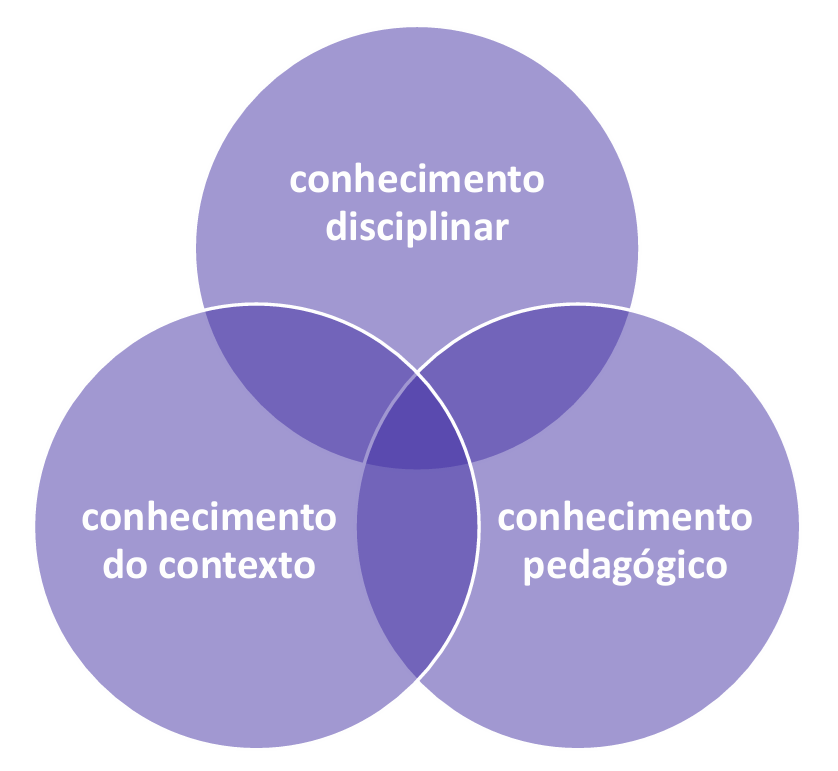

# Capítulo 5 – Didática: A Arte e a Ciência do Ensino

O termo "didática" permeia o vocabulário da educação de forma tão constante que, por vezes, seu significado preciso se torna difuso. Comentários como "aquele professor é muito didático" ou "falta didática para ensinar este conteúdo" são comuns, e expressam uma noção intuitiva de que existe uma maneira mais ou menos eficaz de ensinar algo. Contudo, para o profissional da educação, é fundamental ir além da intuição. Este capítulo se dedica a desvendar o que é a Didática, explorando seu conceito, seu lugar no campo das ciências da educação e seus componentes essenciais.

## Didática Geral e Didáticas Específicas

Inicialmente, é preciso compreender que o campo da Didática se desdobra em dois grandes ramos. De um lado, temos as **Didáticas Específicas**, que se ocupam das questões metodológicas particulares de cada disciplina ou área do saber. Ensinar a História do Brasil, com sua necessidade de análise de fontes, interpretação de processos e compreensão do tempo, exige métodos e abordagens muito distintas de ensinar a multiplicação na matemática, que demanda raciocínio lógico, abstração e exercícios de aplicação. Cada componente curricular possui uma natureza própria, que requer uma reflexão didática específica.

Por outro lado, existe um **grande fio que une** todas essas práticas de ensino, independentemente da matéria. Questões como o planejamento da aula, a definição de objetivos de aprendizagem, a gestão da turma, a escolha de recursos e as formas de avaliação são comuns a todos os professores. O estudo desses princípios e elementos universais do processo de ensino-aprendizagem é o campo da **Didática Geral**, que será o foco principal de nosso estudo.

## A Didática no Campo das Ciências da Educação

Para definir a Didática de forma precisa, é necessário situá-la em seu devido lugar, compreendendo sua relação com dois outros conceitos mais amplos que a englobam: a Educação e a Pedagogia. Esses três campos se relacionam de forma concêntrica, indo do mais geral ao mais específico.

#### Educação: O Fenômeno Social Amplo

A **Educação** é o conceito mais abrangente. Como já discutido em capítulos anteriores, ela se refere ao amplo e permanente processo social de transmissão e assimilação de saberes, valores, costumes e tradições que caracterizam uma cultura. A educação acontece em todos os lugares: na família, na igreja, na mídia, nos movimentos sociais e, claro, na escola. Ela pode ser formal e institucionalizada, como no sistema de ensino brasileiro, ou pode ocorrer de maneira difusa e não formal, como no exemplo da sociedade angolana, que precisou reorganizar seus processos educativos em associações de bairro e ONGs após a devastação causada pela Guerra Civil. A educação é, portanto, o próprio tecido formador da sociedade.

#### Pedagogia: A Ciência da Educação

A **Pedagogia** é o campo de estudo que toma a Educação como seu objeto de investigação. Se a educação é o fenômeno, a pedagogia é a ciência que reflete criticamente sobre ele. Ela não é uma "arte" baseada apenas na intuição ou no talento, mas um campo científico robusto, que se fundamenta em diversas outras áreas do conhecimento, como a Filosofia, a Sociologia e a Psicologia, para compreender as finalidades, os contextos e as práticas educativas. O papel da Pedagogia é construir um olhar teórico e investigativo sobre o fenômeno educacional em todas as suas manifestações, buscando melhorá-lo de forma intencional.

#### Didática: O Núcleo do Ato Pedagógico

Finalmente, chegamos à **Didática**. Ela é um ramo específico da Pedagogia, sendo seu núcleo mais operacional. Se a Pedagogia se pergunta "por que" e "para quem" educar, a Didática se concentra na pergunta "como" ensinar. Ela é a teoria que investiga o **processo de ensino-aprendizagem**, buscando articular de forma coerente os objetivos educacionais, os conteúdos a serem ensinados, as estratégias e métodos de ensino e os processos de avaliação. A Didática é, portanto, a ponte que liga a teoria pedagógica à prática docente, o campo de estudo que se dedica a tornar o ato de ensinar uma ação planejada, intencional, metódica e mais eficaz.

Em suma, esses três conceitos se organizam de forma integrada: a Didática é a disciplina central da Pedagogia, que por sua vez é a ciência que estuda o amplo fenômeno da Educação.

### A Natureza da Didática: Para Além da Técnica

Com base na discussão anterior, que situou a Didática como o núcleo da Pedagogia, podemos agora estabelecer uma definição mais formal e completa:

> A didática é o campo de estudo que investiga os fundamentos, as condições e os modos de realização da instrução e do ensino. Ela se ocupa da articulação entre o "o quê" se ensina (os conteúdos e valores) e "para quem" se ensina (os alunos em seus contextos), com o objetivo de formular metodologias para o processo de ensino-aprendizagem.

Em suma, a didática busca responder à pergunta fundamental de todo educador: "como ensinar?". Ela é a reflexão sobre os caminhos, as maneiras e as estratégias para mediar o encontro entre os estudantes e os saberes, que incluem tanto os conteúdos curriculares quanto os valores.

#### A Coerência Indispensável: O Exemplo de Paulo Freire

A constatação de que a Didática está contida na Pedagogia, que por sua vez está imersa na Educação, nos leva a uma conclusão lógica e fundamental: é impossível separar essas três esferas. Uma prática didática só tem sentido e fundamento quando está alinhada a uma teoria pedagógica e a uma visão de educação e de mundo.

O trabalho de Paulo Freire é um exemplo paradigmático dessa coerência. Sua obra pode ser compreendida nesses três níveis articulados:

- **A Visão de Educação:** É uma educação humanista e crítica, que entende o ser humano como um sujeito histórico e tem como finalidade a sua "humanização" e libertação.
- **A Teoria Pedagógica:** É a **Pedagogia do Oprimido**, que teoriza sobre as relações de opressão e propõe a conscientização como caminho para a superação.
- **A Didática/Método:** É o **Método Paulo Freire**, com os Círculos de Cultura e as palavras geradoras, que materializa na prática de alfabetização os princípios da pedagogia e a visão de educação.

 

Neste exemplo, a didática não é um conjunto de técnicas neutras. Cada passo do método — a investigação do universo vocabular dos alunos, a problematização da realidade, o diálogo — está impregnado da concepção pedagógica e da finalidade educacional que o sustentam.

#### O Risco da Fragmentação: A Didática como "Técnica Infalível"

Quando essa coerência se quebra e a didática é separada da pedagogia e da educação, ela corre o risco de se transformar em um "conjunto de técnicas sem pé nem cabeça". Essa é uma **visão instrumentalista ou tecnicista da didática**, que a reduz a um amontoado de procedimentos e receitas de ensino, desprovidos de diálogo com a realidade, com o estudante e com um propósito educativo mais amplo.

Essa visão se manifesta nas frequentes promessas de "técnicas infalíveis" que encontramos no mercado educacional: o melhor método de alfabetização, a melhor forma de ensinar matemática, a didática definitiva para a leitura. Tais propostas partem do pressuposto equivocado de que a técnica, por si só, é capaz de garantir a aprendizagem.

#### O Objetivo Final: A Aprendizagem Significativa

Isso não é verdade porque o objetivo final da didática não é apenas "ensinar", mas sim promover a "aprendizagem". E a aprendizagem genuína não ocorre pela simples aplicação de uma técnica, mas pela combinação entre o conteúdo ensinado e a realidade de cada estudante. É o que o teórico David Ausubel denominou **aprendizagem significativa**.

A aprendizagem significativa acontece quando um novo conhecimento se conecta de forma substantiva (e não arbitrária) com aquilo que o aluno já sabe, com suas experiências, com seu mundo. É o oposto da "decoreba", da memorização mecânica que é esquecida logo após a prova. O verdadeiro objetivo da Didática deve ser este: criar pontes entre os diferentes saberes e a vida do estudante, tornando a aprendizagem uma experiência com sentido, relevância e potencial transformador.

## Conceitos Específicos da Didática

Embora exista um consenso sobre a Didática como o campo que estuda o processo de ensino-aprendizagem, diferentes autores trazem olhares e ênfases particulares que enriquecem nossa compreensão. Iniciaremos esta análise com a contribuição de José Carlos Libâneo, um dos pioneiros na sistematização do pensamento pedagógico contemporâneo no Brasil.

### A Perspectiva de José Carlos Libâneo

Libâneo define a Didática de maneira ampla, buscando sempre conectá-la a um contexto teórico, político e social mais vasto. Para ele, não é possível compreender a Didática (o específico) sem antes entender seu lugar dentro da Pedagogia (o geral) e da Educação (o fenômeno mais amplo).

Essa relação de aninhamento pode ser compreendida como uma pirâmide invertida, onde as decisões mais amplas, de nível social e político, vão se afunilando e condicionando as práticas mais específicas que ocorrem na sala de aula, como a instrução e o ensino.

#### A Distinção entre Pedagogia e Didática

A chave para entender a proposta de Libâneo está na clara distinção que ele estabelece entre os papéis da Pedagogia e da Didática.

A **Pedagogia**, para o autor, é o campo mais amplo, que se ocupa das finalidades da educação. É a ciência que elabora um conjunto de propostas educativas e de organização escolar, orientadas por objetivos sociais e políticos. A pedagogia de uma escola se materializa em seu **Projeto Político Pedagógico (PPP)**, o documento que define sua missão, seus valores e suas linhas gerais de trabalho.

A **Didática**, por sua vez, é a disciplina que opera dentro desse quadro geral. Ela é o desdobramento da visão pedagógica em ações concretas na sala de aula. Isso explica a "autonomia relativa" do professor: ele tem liberdade para escolher seus métodos e recursos didáticos, mas espera-se que suas escolhas sejam coerentes com a linha pedagógica geral da instituição.

Um exemplo prático pode ser encontrado na alfabetização. A **pedagogia** de uma escola pode definir que a alfabetização deve ocorrer a partir do trabalho com textos significativos, e não apenas com a memorização de letras e sílabas. Essa é a diretriz geral. A **didática** entra em cena quando o professor, em sua sala de aula, decide _quais_ textos irá utilizar (uma parlenda, uma notícia de jornal, uma receita), _como_ irá explorá-los com os alunos e _que_ atividades específicas irá propor. O professor não poderia, neste caso, abandonar o trabalho com textos e focar apenas na repetição mecânica de sílabas, pois isso iria contra a proposta pedagógica mais ampla da escola.

#### As Definições Formais de Libâneo

O próprio autor formaliza essa distinção. Para ele, a **Pedagogia** é a ciência que busca intervir no processo de assimilação dos saberes humanos, "orientando-o para finalidades sociais e políticas e criando um conjunto de condições metodológicas e organizativas para viabilizá-lo no âmbito da escola".

Já a **Didática** é definida como:

> (...) uma das disciplinas da Pedagogia que estuda o processo de ensino por meio dos seus componentes — os conteúdos escolares, o ensino e a aprendizagem. (...) É, ao mesmo tempo, uma matéria de estudo fundamental na formação profissional dos professores e um meio de trabalho do qual os professores se servem para dirigir a atividade de ensino, cujo resultado é a aprendizagem dos conteúdos escolares pelos alunos.

Em síntese, a distinção se dá no nível de abrangência. A Pedagogia trabalha com os **objetivos educativos** da escola como um todo, estabelecendo seus princípios e finalidades. A Didática, por sua vez, trabalha com os **objetivos de ensino** dentro da sala de aula, traduzindo os princípios pedagógicos em ações e procedimentos concretos para garantir a aprendizagem dos alunos.

#### A Didática em Ação: Ensino e Instrução

Ainda dentro da concepção de José Carlos Libâneo, a Didática se desdobra em dois conceitos fundamentais que, embora distintos, são inseparáveis na prática pedagógica: o **ensino** e a **instrução**. Compreender a diferença e a relação entre eles é essencial para uma análise mais precisa do ato didático.

O **ensino** refere-se ao conjunto de ações deliberadas do professor para organizar e dirigir o processo de aprendizagem dos alunos. É a dimensão do trabalho docente. O foco está na atividade do professor e nas condições que ele cria para que a aprendizagem ocorra.

A **instrução**, por sua vez, refere-se ao processo e ao resultado da assimilação dos conteúdos por parte do aluno. É a dimensão da aprendizagem do estudante. O foco está no processo de construção e apropriação do saber pelo aluno.

Embora sejam conceitualmente diferentes, ensino e instrução são faces da mesma moeda. Não existe ensino que não tenha como objetivo final a instrução, e a instrução, no contexto escolar, é o resultado esperado do processo de ensino. Um leva ao outro e ambos estão contidos no campo mais amplo da Didática.

Libâneo define o processo de ensino como um "recorte" da Didática, ou seja, seu objeto de estudo central. Este processo, por sua vez, engloba tanto a ação de ensinar quanto o processo de aprender (a instrução).

Para tornar essa relação mais concreta, podemos pensar em uma aula expositiva. O ato do professor de planejar a aula, organizar os tópicos em uma sequência lógica, preparar os exemplos e apresentar o conteúdo de forma clara é a dimensão do **ensino**. O processo que ocorre no aluno de ouvir, relacionar as novas informações com seus conhecimentos prévios, tirar dúvidas e, finalmente, assimilar e compreender o conteúdo, é a dimensão da **instrução**. Ambos acontecem de forma articulada dentro de um único ato didático.

Portanto, quando falamos em **planejamento de aulas**, **definição de objetivos**, **seleção de métodos** e **avaliação**, estamos nos referindo primariamente à dimensão do **ensino**. Quando falamos na **capacidade do estudante de aprender**, na **assimilação de conteúdos** e nos **resultados da aprendizagem**, estamos nos referindo à dimensão da **instrução**. A Didática, como campo de estudo, se ocupa de investigar como a primeira dimensão (ensino) pode ser otimizada para garantir a efetividade da segunda (instrução), tendo sempre como objetivo final a aprendizagem do estudante.

### A Perspectiva de Vera Maria Candau

Assim como Libâneo, Vera Maria Candau é uma das pioneiras na renovação do pensamento didático no Brasil. Sua obra surge da necessidade de superar uma visão antiga e empobrecida da didática, que a reduzia a um mero conjunto de técnicas e "receitas prontas" sobre o que fazer em sala de aula. Candau propõe uma revisão crítica do campo, buscando resgatar sua complexidade e sua importância fundamental para uma prática pedagógica transformadora.

O ponto-chave de sua teoria está na distinção entre duas dimensões da didática: a **Instrumental** e a **Fundamental**. Para compreender sua proposta, é preciso primeiro analisar a dimensão instrumental, que é o objeto de sua crítica.

#### Didática Instrumental

A **Didática Instrumental** é a concepção que reduz a didática à sua dimensão puramente técnica, ao "como fazer" em sala de aula. Ela é compreendida como um conjunto de métodos, técnicas e procedimentos de ensino que, se aplicados corretamente pelo professor, garantiriam a aprendizagem do aluno. Essa abordagem é frequentemente comparada a uma **"receita de bolo"**: basta seguir todas as instruções passo a passo para que, ao final, o resultado seja sempre o mesmo, independentemente dos ingredientes (os alunos) ou do contexto (a realidade social).

Essa forma de pensar a Didática, que esteve muito associada à Pedagogia Tecnicista, gerou profundos problemas na educação brasileira. A crença em uma "receita infalível" ignorava que os diferentes contextos sociais, culturais e individuais dos alunos impossibilitavam a obtenção de resultados uniformes.

A principal consequência dessa abordagem é a **desvinculação entre a prática em sala de aula e o meio social**. O método é visto como um instrumento universal, que não precisa de qualquer vínculo com a realidade da comunidade local ou com as experiências de vida dos estudantes. A experiência pedagógica, no entanto, demonstrou o fracasso dessa premissa. A aplicação de métodos padronizados e descontextualizados resultou em altos índices de fracasso escolar, especialmente entre as crianças das classes populares, que não se viam representadas ou motivadas por aquele ensino. Além disso, gerou uma profunda frustração nos professores, que se sentiam "amarrados" a um roteiro, sem a possibilidade de criar, de adaptar sua prática e de exercer sua autonomia intelectual.

A razão fundamental deste fracasso, segundo a análise crítica, é a **desvinculação dos objetivos educacionais com o fazer pedagógico**. A Didática Instrumental, focada na receita, retira a importância das finalidades, dos "porquês" da educação. Ela destaca apenas os meios, o "como fazer", e se esquece do sentido e do propósito educacional das ações. O resultado é um amontoado de técnicas e passo a passos sem alma, sem direção e sem conexão com o projeto maior de formação humana.

#### Didática Fundamental

Em contraposição à visão reducionista da Didática Instrumental, Vera Candau propõe uma reconstrução do campo, que ela denomina **Didática Fundamental**. Esta nova abordagem não nega a importância da técnica, mas a resgata de seu isolamento, inserindo-a em um quadro de análise mais amplo e complexo. A premissa central da Didática Fundamental é a de que o processo de ensino-aprendizagem é, por natureza, **multidimensional**.

Ignorar essa multidimensionalidade é a falha primária do modelo puramente técnico. A Didática Fundamental, portanto, busca superar as "receitas prontas" ao propor uma reflexão constante sobre as diferentes dimensões que constituem o ato de ensinar. Nas palavras da própria autora:

> A perspectiva fundamental da Didática assume a multidimensionalidade do processo de ensino-aprendizagem e coloca a articulação das três dimensões, técnica, humana e política, no centro de sua temática.

Dessa forma, a proposta de reconstrução da didática se assenta sobre a articulação consciente destes três pilares indispensáveis. A técnica deixa de ser um fim em si mesma para se tornar um dos elementos de uma práxis pedagógica complexa e integrada.

Tratando de cada uma das três dimensões em detalhes:

1. **A Dimensão Técnica:** Esta dimensão se refere ao "como fazer" pedagógico, à competência instrumental do professor. Ela engloba a **organização e a sistematização** do processo de ensino, incluindo o planejamento, a seleção de conteúdos, a definição clara dos objetivos de aprendizagem, a escolha de métodos e recursos, e a construção de instrumentos avaliativos. Um plano de ensino para o bimestre ou o roteiro de uma aula são exemplos de materializações da dimensão técnica. Na Didática Fundamental, a técnica não é descartada, mas vista como um conjunto de ferramentas que o professor precisa dominar para poder fazer escolhas conscientes e fundamentadas.
2. **A Dimensão Humana:** Esta dimensão foca no "quem com quem" do processo educativo, ou seja, nas relações interpessoais que constituem o ato de ensinar e aprender. Ela leva em consideração os **aspectos afetivos, emocionais e relacionais**, tanto individuais quanto do grupo. O crescimento pessoal dos envolvidos, a criação de um clima de confiança e acolhimento, a mediação de conflitos e a construção de um vínculo positivo entre professor e alunos e dos alunos entre si são o cerne desta dimensão. Um exemplo prático é a preocupação do professor em criar dinâmicas para acolher alunos novos, garantindo sua integração e bem-estar no grupo.
3. **A Dimensão Política:** Esta dimensão se refere ao "para quê" do ato educativo. Ela reconhece que toda prática pedagógica está situada em um **contexto social, político e cultural** específico e que, portanto, não existe educação neutra. A dimensão política envolve a intencionalidade da ação docente, a consciência de seu compromisso com um determinado projeto de sociedade e a articulação entre o trabalho em sala de aula e os objetivos educacionais mais amplos da escola e da comunidade. Diferentemente da Didática Instrumental, que busca uma técnica universal, a Didática Fundamental reitera que os procedimentos de ensino devem sempre ser escolhidos e orientados em função de um propósito e de um contexto.

É fundamental observar que, na proposta da Didática Fundamental, estas três dimensões não são separadas ou sequenciais. Elas formam uma unidade articulada e indissociável. Toda ação didática em sala de aula pressupõe, ao mesmo tempo, uma escolha técnica, uma interação humana e um posicionamento político. Ignorar qualquer uma delas é empobrecer e mutilar o ato pedagógico.

#### A Superação da Didática Instrumental pela Didática Fundamental

A análise crítica da Didática Instrumental nos leva à conclusão de que uma visão de ensino reduzida a um conjunto de técnicas é insustentável e inadequada para os desafios do mundo atual. A proposta de Vera Candau é, portanto, a de **superar** essa visão fragmentada, assumindo a **Didática Fundamental** como o paradigma para a prática pedagógica. Isso significa reconhecer que toda ação educativa em sala de aula deve ser, de forma consciente e intencional, contextualizada nas esferas técnica, humana e política.

Nesta abordagem integrada, nenhuma dimensão pode ser privilegiada em detrimento das outras, pois todas constituem uma única e indissociável totalidade. Privilegiar apenas a **dimensão técnica** é recair no erro do tecnicismo, reduzindo a prática a uma "receita de bolo" desprovida de sentido. Por outro lado, privilegiar apenas a **dimensão humana** pode levar a um psicologismo, transformando a sala de aula em um espaço de bem-estar afetivo, mas com pouco avanço na apropriação do conhecimento sistematizado. Da mesma forma, privilegiar exclusivamente a **dimensão política** pode descambar para a doutrinação, onde o debate e a construção crítica do saber são substituídos pela imposição de uma única visão de mundo.

A força da Didática Fundamental está, portanto, no equilíbrio e na articulação permanente dessas três esferas. Ela é constituída pelo diálogo com as inúmeras ciências (Psicologia, Sociologia, etc.) que nos ajudam a compreender o complexo ato de ensinar e aprender, sempre conectando:

- O **saber fazer** (a competência da dimensão técnica);
- O **porquê fazer** (a intencionalidade da dimensão política);
- O **com quem se faz** (a sensibilidade da dimensão humana).

Em síntese, a multidimensionalidade da Didática Fundamental se materializa em uma prática docente que compreende que, para o bom andamento da sala de aula, é preciso articular um sólido domínio das técnicas de ensino, a construção de boas relações afetivas e cognitivas com os alunos, e um vínculo permanente com a comunidade local e com um projeto de sociedade mais justo.

### A Perspectiva de Cipriano Luckesi

Cipriano Luckesi, embora não se defina como um autor da Didática Geral, mas sim como um especialista em áreas como avaliação e planejamento, contribui para o campo com uma análise profunda sobre o papel da Didática na **formação do educador**. Sua perspectiva nos convida a pensar sobre o compromisso ético e político que sustenta a prática docente.

#### O Educador como Sujeito da História

A reflexão de Luckesi parte de uma premissa fundamental: o educador, como todo ser humano, pode se posicionar na história de duas formas distintas. Ele pode ser **objeto da história**, sofrendo passivamente a ação dos acontecimentos e das forças sociais, tornando-se um mero reprodutor das práticas e ideologias vigentes. Ou ele pode se constituir como **sujeito da história**, agindo de forma consciente e intencional para intervir na realidade e construir um futuro diferente.

Essa segunda possibilidade é a que interessa a uma educação transformadora. O educador que se assume como sujeito da história é aquele que compreende sua prática como uma oportunidade de construir pontes entre o passado e o futuro, engajando-se em um **projeto histórico**.

Para Luckesi, um "projeto histórico" pode ser definido como o desenvolvimento de um povo em direção a melhores condições de vida. Não é um conceito abstrato, mas um plano concreto para a melhoria das condições de moradia, de trabalho e, principalmente, de educação das futuras gerações. Inúmeros profissionais, como médicos e agricultores, estão engajados neste projeto, mas os professores possuem um papel especial, pois sua função é justamente a de formar os cidadãos do futuro, transmitindo os saberes e valores que possibilitarão a construção de uma nação mais justa.

#### A Didática e a Formação Sólida do Educador

Para que o educador possa atuar como sujeito e contribuir para esse projeto histórico, não basta que ele domine técnicas de ensino ou o conteúdo de sua disciplina. É indispensável, segundo Luckesi, que ele possua uma **formação sólida**, que articule conhecimento profissional, competência técnica e valores éticos.

Essa formação sólida não é algo que se adquire apenas na universidade, mas que se constrói no dia a dia da prática docente, especialmente no ato de **planejar as aulas**. O planejamento, nesta visão, não é um mero preenchimento de formulários, mas o momento privilegiado da práxis do professor. É ao planejar que o educador estuda, reflete sobre a melhor maneira de ensinar determinado assunto a seus alunos específicos, toma decisões, antecipa desafios e, assim, exerce sua autonomia intelectual. É um ato diário de estudo e de comprometimento que consolida sua formação profissional.

A Didática, portanto, transcende a dimensão instrumental. Ela é a expressão do compromisso do educador. Uma prática didática bem fundamentada, que nasce de uma formação sólida e de um planejamento reflexivo, é o que possibilita que os estudantes tenham a melhor aprendizagem possível. O resultado é a formação de cidadãos mais conscientes e a contribuição efetiva do educador para um futuro mais digno para as novas gerações, consolidando seu papel como sujeito da história.

#### A Construção do Sujeito: A Importância da Formação Continuada

A constituição do educador como um "sujeito da história", comprometido com um projeto de transformação, não é um processo solitário. Pelo contrário, essa "formação sólida" que Luckesi defende é construída de forma contínua e, idealmente, **coletiva**, no dia a dia da profissão. O caminho mais potente para isso é a **formação permanente ou continuada**, realizada no contexto da própria comunidade escolar.

Nesse processo, cria-se uma cultura de colaboração, na qual todos os profissionais aprendem juntos a desenvolver novas formas de trabalho com os alunos. Professores mais experientes auxiliam os novatos, desafios são compartilhados e soluções são construídas em conjunto, transformando a escola em uma verdadeira comunidade de aprendizagem.

É crucial, neste ponto, diferenciar a formação continuada da formação inicial.

- **A Formação Inicial** é aquela realizada nos cursos de graduação (licenciaturas, pedagogia), que habilita o profissional para o exercício da docência. Seus parâmetros gerais estão previstos na Lei de Diretrizes e Bases da Educação Nacional (LDB 9.394/96), em seu Título VI, "Dos Profissionais da Educação". Contudo, essa formação, por mais qualificada que seja, tem se mostrado **insuficiente** para dar conta de todos os desafios da complexa realidade escolar. Muitas vezes, há uma lacuna entre a teoria estudada na universidade e a prática vivida na sala de aula, e os conhecimentos se desatualizam rapidamente diante das novas demandas sociais e tecnológicas.
- **A Formação Continuada** é todo o processo de aperfeiçoamento que ocorre ao longo da trajetória profissional do educador. Ela pode se dar de diferentes formas: através de cursos de curta ou longa duração (como especializações e mestrados) ou, de maneira muito significativa, dentro da própria escola. As **reuniões pedagógicas**, por exemplo, quando bem planejadas, deixam de ser meros encontros para informes burocráticos e se tornam espaços potentes de formação, nos quais os educadores podem estudar e debater coletivamente os temas em que sentem maiores dificuldades, como os desafios da alfabetização, novas metodologias para o ensino de matemática ou estratégias para lidar com a indisciplina dos alunos.

Portanto, enquanto a formação inicial apenas habilita o docente para o início do trabalho, a formação continuada é o que verdadeiramente consolida sua prática e o amadurece como profissional. Ela exige motivação e um compromisso pessoal com o estudo constante, mas também depende de um ambiente de trabalho que valorize e promova esses espaços de capacitação coletiva. É neste movimento contínuo de reflexão e aprimoramento que o educador constrói a "formação sólida" necessária para refinar sua didática e atuar como um sujeito consciente de sua história.

### A Perspectiva de Philippe Perrenoud

O sociólogo Philippe Perrenoud, professor da Universidade de Genebra, oferece uma perspectiva que amplia o conceito de Didática, sustentando que ela não pode ser reduzida apenas ao trabalho técnico em sala de aula. Para ele, uma reflexão sobre a didática é inseparável de uma reflexão sobre a **formação docente**, tanto a inicial quanto a continuada. Sua análise se volta para a complexidade da ação do professor e para as competências que lhe permitem ser um profissional eficaz e reflexivo.

#### O Contexto: A Resistência à Precarização Docente

A proposta de Perrenoud surge de um diagnóstico da difícil situação vivida por muitos professores, marcada por políticas públicas insuficientes, baixos salários e uma crescente desvalorização profissional. Este cenário de "penúria" muitas vezes leva à desilusão, ao abandono da profissão ou a uma prática burocrática e sem engajamento.

No entanto, Perrenoud observa que muitos professores resistem a essa precarização e se mantêm comprometidos com a nobre missão de ensinar. É a partir da análise da prática desses "professores desafiadores" que ele busca identificar o que constitui um profissional de excelência. Em suas palavras, são aqueles que aceitam o desafio:

> (...) por recusarem a sociedade dual e o fracasso escolar que a prepara, por desejarem ensinar e levar a aprender a despeito de tudo, ou, então, por temerem morrer de pé, com o giz na mão, no quadro-negro (...)

A questão central de Perrenoud é, portanto: quais são as competências profissionais que permitem a esses educadores realinhar suas práticas e se manterem como agentes eficazes da aprendizagem, mesmo diante das adversidades?

#### As Dez Competências para Ensinar

A resposta de Perrenoud a essa questão foi a elaboração de um referencial de **dez grandes famílias de competências**. É importante entender que, para o autor, uma "competência" não é um simples conhecimento ou habilidade, mas a capacidade de **mobilizar** um conjunto de recursos (saberes, técnicas, atitudes) para solucionar de forma eficaz as situações complexas e imprevisíveis da prática profissional.

Seu inventário de competências não é uma lista de intenções, mas um mapa das ações concretas e imprescindíveis para uma Didática de qualidade em sala de aula:

1. **Organizar e dirigir situações de aprendizagem.**
2. **Administrar a progressão das aprendizagens.**
3. **Conceber e fazer evoluir os dispositivos de diferenciação.**
4. **Envolver os alunos em suas aprendizagens e em seu trabalho.**
5. **Trabalhar em equipe.**
6. **Participar da administração da escola.**
7. **Informar e envolver os pais.**
8. **Utilizar novas tecnologias.**
9. **Enfrentar os deveres e os dilemas éticos da profissão.**
10. **Administrar sua própria formação contínua.**

#### A Síntese: As Três Grandes Áreas da Ação Docente

Embora a lista seja extensa, a lógica por trás dela pode ser sintetizada em três grandes áreas pedagógicas que definem a atuação de um professor competente. Um excelente professor não atua apenas na sala de aula, mas se entende como um profissional que interage em diferentes esferas:

1. **A Ação com os Alunos:** É o núcleo do trabalho didático, que envolve o planejamento e a gestão da aprendizagem em sala de aula (competências 1, 2, 3 e 4).
2. **A Ação na Escola:** Refere-se à colaboração com os pares e à participação na vida da instituição (competências 5 e 6), entendendo que a educação é um projeto coletivo.
3. **A Ação com a Comunidade e a Sociedade:** Diz respeito à interação com as famílias e à inserção no mundo contemporâneo (competências 7 e 8), além da reflexão sobre a própria prática e seu aprimoramento constante (competências 9 e 10).

A proposta de Perrenoud dialoga diretamente com as reflexões dos outros autores. Sua décima competência, "Administrar sua própria formação contínua", ecoa a visão de **Luckesi** sobre o educador como "sujeito" de sua própria formação. Da mesma forma, seu referencial de competências complexas oferece um caminho prático para a superação da "Didática Instrumental", alinhando-se à busca por uma "Didática Fundamental" e multidimensional, como propõe **Vera Candau**.

#### A Competência Chave: Organizar e Dirigir Situações de Aprendizagem

A primeira das dez competências listadas por Perrenoud — **organizar e dirigir situações de aprendizagem** — pode parecer óbvia, afinal, não é isso que os professores sempre fizeram? No entanto, o autor utiliza esses termos para propor uma ruptura radical com o modelo da Pedagogia Tradicional.

Na visão tradicional, "organizar o aprendizado" frequentemente se resume a aglutinar pessoas em um ambiente fechado e garantir que elas permaneçam em silêncio enquanto o professor fala. Ensinar é sinônimo de "falatório", e aprender é sinônimo de "silêncio". O exemplo máximo desse modelo é a **aula magistral**, comum em muitas universidades, onde um docente expõe um conteúdo por horas para uma centena de alunos em um anfiteatro. Nessa estrutura, o professor não tem como saber quem está compreendendo e quem não está. Os estudantes que não conseguem acompanhar se perdem, mas o formato homogêneo da aula não permite intervenções. A premissa é que, se todos estão escutando, a obrigação do professor foi cumprida.

Perrenoud contrapõe a esse modelo uma prática alinhada à **Pedagogia Ativa**, na qual o aluno é o protagonista do seu próprio aprendizado. "Organizar e dirigir situações de aprendizagem", nesta nova perspectiva, significa que o professor precisa ser um arquiteto de experiências educativas, e não um mero expositor de conteúdo. Isso implica duas práticas essenciais:

1. **Ensino baseado na Problematização:** A aprendizagem se torna mais significativa quando parte de situações-problema, de preferência abertas e conectadas ao cotidiano. O professor, em vez de entregar o conhecimento pronto, cria um desafio que exige que os alunos investiguem, formulem hipóteses e busquem soluções. Nas palavras do próprio autor, trata-se de criar:
    
    > (...) situações de aprendizagem, que as didáticas contemporâneas encaram como situações amplas, abertas, carregadas de sentido e de regulação, as quais requerem um método de pesquisa, de identificação e de resolução de problemas.
    
2. **Diferenciação Pedagógica:** Para que todos os alunos possam ser protagonistas, o professor precisa ser capaz de diferenciar sua prática. Isso significa reconhecer que os estudantes aprendem de maneiras e em ritmos diferentes, e que é preciso criar múltiplos caminhos dentro da sala de aula. Ficar atento a cada um, saber quem está indo bem e quem precisa de mais ajuda, e propor atividades diversificadas são o cerne da diferenciação.

A tabela a seguir sintetiza as diferenças radicais entre a aula tradicional e a situação de aprendizagem proposta por Perrenoud.

|Pedagogia Tradicional|Pedagogia Ativa (segundo Perrenoud)|
|---|---|
|O professor fala durante horas. Os alunos apenas escutam e anotam.|O professor fala pouco e orienta. Os alunos são os protagonistas.|
|Não há participação e nem diálogo.|Há muita participação e debate.|
|Cada estudante se senta individualmente.|Os estudantes podem trabalhar em grupos.|
|Alguns aprendem, muitos não conseguem acompanhar.|O professor acompanha o desenvolvimento de cada aluno e diferencia as atividades, permitindo que a maioria consiga aprender.|

## A Didática e a Formação de Professores

Uma reflexão sobre a Didática estaria incompleta sem analisar seu papel central na **formação de professores**. Embora a legislação educacional, como a LDB 9.394/96, estabeleça os parâmetros legais para a formação, a Didática se aprofunda na dimensão da **prática docente**, buscando preparar o professor para os desafios concretos da sala de aula, seja durante sua formação inicial na universidade ou em sua formação continuada na escola.

A constituição de um professor competente e reflexivo se assenta sobre três áreas de formação distintas, porém, inseparáveis no dia a dia da sala de aula.

#### A Formação Teórico-Científica

Este pilar refere-se ao **domínio profundo dos saberes específicos** da disciplina que o professor irá ensinar. É o "o quê" do ensino. Não basta ter um conhecimento superficial do conteúdo; é preciso ter uma formação sólida na área. Um professor de matemática, por exemplo, ao ensinar sobre funções de 1º grau, precisa não apenas saber aplicar a fórmula, mas compreender profundamente o conceito de função, suas origens históricas e suas múltiplas aplicações na sociedade. Este saber robusto é a base que dá segurança ao professor e permite que ele vá além do livro didático, respondendo às dúvidas dos alunos com clareza e criando novas abordagens para o conteúdo.

#### A Formação Didática

De nada adianta um vasto conhecimento teórico-científico se o professor não souber como torná-lo compreensível e significativo para seus alunos. A **formação didática** é o pilar do "como" ensinar. Ela está ligada ao domínio de metodologias, tanto gerais quanto específicas, para a transposição do saber acadêmico em saber escolar. Um professor de história, por exemplo, necessita de uma formação didática que o capacite a organizar o ensino de temas complexos e "espinhosos", como a Revolução Francesa ou a Independência do Brasil, de uma maneira que estimule a análise crítica dos alunos, em vez da simples memorização de fatos. É a busca constante pela maneira mais adequada de mediar o encontro entre o aluno e o conhecimento.

#### A Formação Prática

A **formação prática** é o saber que emerge da **experiência**, da vivência cotidiana na sala de aula. É um conhecimento insubstituível, pois lida com a imprevisibilidade e a complexidade das interações humanas. Por mais que um professor estude teorias sobre gestão de sala de aula, é somente a prática que desenvolve a sensibilidade, o "tato" para tomar decisões rápidas e adequadas em situações difíceis, como em turmas com casos de indisciplina ou ao lidar com as necessidades específicas de alunos com deficiência. A experiência, aliada à reflexão, desenvolve as competências para "saber fazer, saber agir e saber atuar" nos momentos concretos do dia a dia escolar, transformando o professor em um profissional reflexivo.

### A Indissociabilidade dos Saberes e a Práxis Docente

É fundamental compreender que estas três formações não são etapas ou caixas separadas; elas são **indissociáveis** e se alimentam mutuamente na constituição da práxis docente. Um profissional completo é aquele que consegue articular de forma dinâmica estes três saberes:

- **Sem a formação teórico-científica**, o professor pode até ter uma boa didática, mas seu ensino será superficial e propenso a erros conceituais.
- **Sem a formação didática**, o professor pode ser um grande especialista em sua área, mas incapaz de comunicar seu saber de forma eficaz, tornando-se um "sábio que não sabe ensinar".
- **Sem a formação prática e a reflexão sobre ela**, tanto o saber teórico quanto o didático se tornam rígidos e desconectados da realidade viva e pulsante da sala de aula.

Essa visão integrada da formação docente dialoga diretamente com os autores que estudamos neste capítulo. A articulação desses três saberes é o que constitui a **"formação sólida"** de que fala Luckesi; é o que permite ao professor superar a **"Didática Instrumental"** e praticar uma **"Didática Fundamental"**, como propõe Candau; e é o que se materializa nas **"competências"** para ensinar, descritas por Perrenoud.

|Formação Teórico-Científica|Formação Didática|Formação Prática|
|---|---|---|
|Saber o conteúdo que se está ensinando.|Saber transmitir o conteúdo de maneira compreensível.|O dia a dia da sala de aula como espaço formativo.|

## Didática na Prática: Conceitos Fundamentais

Após a jornada pelas teorias e conceitos que fundamentam a Didática, este é o momento de nos aproximarmos de sua dimensão mais concreta: a sala de aula. As discussões a seguir abordam termos e situações vividas no cotidiano do professor. O foco passa da teoria mais ampla para a aplicação prática dos princípios didáticos.

### O Conceito de Método de Ensino

O **método de ensino** pode ser compreendido como um "recorte" da Didática, ou seja, a sua aplicação a uma situação de aprendizagem específica. É o caminho, o conjunto de procedimentos e ações planejadas pelo professor para que os alunos atinjam determinados objetivos de aprendizagem em relação a um conteúdo específico.

Um método pode ser específico de uma **disciplina** (um método para ensinar análise sintática em Língua Portuguesa, por exemplo) ou pode se referir a uma **forma de organização da aula** (como o trabalho em grupo ou a aula expositiva), que pode ser aplicada a diferentes conteúdos. Em todos os casos, a ideia de um percurso para a aprendizagem permanece, mas agora com um foco bem delimitado. A escolha de um método de ensino adequado é uma das decisões mais importantes do professor e deve levar em consideração múltiplos fatores:

> A escolha do método de ensino deve considerar o objetivo de aprendizagem, o conteúdo a ser trabalhado, as características dos alunos, o espaço físico e o tempo disponível.

A natureza do conteúdo e os objetivos alteram profundamente o método. Na **matemática**, por exemplo, o método frequentemente envolve a apresentação de problemas e a demonstração de procedimentos para que os alunos desenvolvam a capacidade de encontrar soluções. Já em **história**, o método pode se concentrar na análise de diferentes fontes e interpretações de um mesmo fato, para que os alunos desenvolvam uma visão crítica dos acontecimentos do passado.

#### A Diferença Crucial: Método e Técnica

É fundamental não confundir método de ensino com **técnica de ensino**. A técnica é um componente _dentro_ do método; é um procedimento específico, um recurso ou uma ferramenta utilizada em um determinado momento da aula. O método é a estratégia mais ampla que organiza e dá sentido ao uso das diferentes técnicas.

O **Método Paulo Freire** é um exemplo perfeito para ilustrar essa diferença. Dentro de seu método de alfabetização, utiliza-se a **técnica** da silabação (a decomposição de uma palavra em sílabas como TI-JO-LO). Se essa técnica fosse usada de forma isolada e mecânica, como em uma cartilha tradicional, ela seria apenas um exercício de decodificação. No entanto, dentro do **método** freiriano, essa mesma técnica é ressignificada. A palavra "TIJOLO" não é aleatória; ela é uma "palavra geradora", escolhida a partir da realidade de trabalhadores da construção civil. A técnica de separá-la em sílabas serve como ponto de partida para a formação de novas palavras e, principalmente, para um debate sobre o significado daquela palavra na vida dos alunos (trabalho, moradia, direitos).

Percebe-se, assim, que a técnica (silabação) só ganha seu sentido pedagógico transformador porque está inserida em um método (palavras geradoras) que, por sua vez, é coerente com uma teoria maior (a Pedagogia do Oprimido).

Por fim, é importante notar que, em muitos textos e contextos, os termos "método" e "metodologia" são utilizados como sinônimos para se referir a essa organização da prática de ensino.

### A Classificação dos Métodos de Ensino

A Didática se materializa na sala de aula através dos **métodos de ensino**. Segundo a classificação de José Carlos Libâneo, podemos organizar as principais metodologias em grupos, de acordo com a natureza da atividade e da interação entre professor e alunos. É importante compreender que estes métodos não são excludentes; um professor competente raramente utiliza um único método, mas os combina e articula de acordo com os objetivos da aula, o conteúdo a ser trabalhado e as características da turma.

#### Método de Exposição pelo Professor

Neste método, o papel central é do professor, que apresenta de forma oral um conteúdo novo ou sistematiza um tema de maneira organizada. A aula expositiva, com começo, meio e fim, é a principal manifestação deste método. Seu objetivo é fornecer aos alunos um panorama geral e claro sobre um assunto que eles desconhecem. O uso de exemplos, analogias e recursos visuais é fundamental para favorecer a compreensão.

Este método é muito comum no ensino superior, onde os estudantes, recém-chegados do ensino médio, têm o primeiro contato com disciplinas complexas, como Cálculo I nas engenharias ou as teorias introdutórias em um curso de Psicologia. A exposição bem-feita pelo professor é crucial para construir a base de conhecimento necessária para atividades futuras.

#### Método de Trabalho Independente

Aqui, o protagonismo se desloca para o estudante. O professor propõe uma tarefa e o aluno, de forma individual ou em duplas, deve buscar a solução com autonomia, sem a orientação direta do educador. Este método visa desenvolver a criatividade, a iniciativa e a capacidade de pesquisa.

Um exemplo comum é o **estudo dirigido**, no qual, após uma exposição inicial do professor, os alunos recebem um roteiro de exercícios ou questões para resolverem por conta própria, aplicando o conhecimento que acabaram de adquirir.

#### Método de Elaboração Conjunta

Este método se baseia na **interação e no diálogo** constante entre professores e alunos para a construção do conhecimento. O objetivo é ir além da simples exposição, promovendo uma conversa sobre o assunto estudado, na qual se pode debater as consequências de um fato, explorar diferentes definições, analisar polêmicas e sanar dificuldades de assimilação.

A **conversação didática** é um exemplo prático: um debate aberto e mediado pelo professor, no qual os alunos são incentivados a relacionar o conteúdo com suas próprias experiências e a construir coletivamente uma compreensão mais profunda do tema.

#### Método de Trabalho em Grupo

O trabalho em grupo é um método que visa, principalmente, ao desenvolvimento da **cooperação**, da socialização e da aprendizagem entre pares. Geralmente, é empregado de forma articulada com os outros métodos. Grupos de três a cinco alunos se reúnem para realizar uma tarefa específica, que pode ser a resolução de um problema, a preparação de um seminário ou a criação de um produto.

Uma aula de Arte na educação básica, por exemplo, pode utilizar o trabalho em grupo para a realização de um projeto artístico coletivo, o que favorece a troca de ideias e a colaboração na busca por um resultado comum.

#### Atividades Especiais

As atividades especiais são aquelas que complementam o trabalho regular em sala de aula, buscando enriquecer a aprendizagem e conectar o conteúdo escolar com o mundo exterior. A função delas é aprimorar a assimilação dos saberes e a visão de mundo dos educandos.

O **estudo do meio** é o exemplo mais clássico: uma visita a um espaço fora da escola que tenha relação com o conteúdo estudado, como um museu, um mercado público, uma estação de tratamento de água ou uma área de preservação ambiental no bairro. Essas visitas geram discussões ricas e tornam a aprendizagem mais concreta e significativa.

#### Síntese dos Métodos e a Distinção com o Procedimento Didático

É importante ressaltar, por fim, a diferença entre **método** e **procedimento didático**. O método, como vimos, é a concepção geral do trabalho a ser realizado. O procedimento didático, por sua vez, refere-se à sequência de ações e detalhes, o "passo a passo" do que acontece na sala de aula para que o método se concretize.

| Exposição pelo Professor          | Trabalho Independente                                      | Elaboração Conjunta                 | Trabalho em Grupo                              | Atividades Especiais                                                   |
| --------------------------------- | ---------------------------------------------------------- | ----------------------------------- | ---------------------------------------------- | ---------------------------------------------------------------------- |
| Aula explicativa e sistematizada. | Resolução de atividade sem orientação direta do professor. | Bate-papo e debate sobre a matéria. | Grupos de 3 a 5 alunos. Atividade cooperativa. | Complementares aos outros métodos. Ajudam no entendimento do conteúdo. |

### A Ação Didática: A Síntese da Prática Docente

A expressão **"ação didática"** é utilizada para se referir à manifestação concreta da prática do professor em sala de aula. É o momento em que as escolhas, os saberes e os valores do educador se transformam em uma atitude, um gesto, uma intervenção ou um procedimento visível no processo de ensino-aprendizagem.

Pode-se definir a ação didática da seguinte forma:

> Ação didática é a unidade elementar da prática docente, na qual o professor mobiliza seus conhecimentos e competências para conduzir o processo de ensino e facilitar a aprendizagem dos alunos em uma situação específica.

É fundamental compreender que a ação didática não é um ato isolado ou puramente técnico. Ela está sempre conectada às escolhas mais amplas do professor e, portanto, reflete a sua concepção de didática. Retomando a perspectiva de Vera Candau, toda ação didática é multidimensional, articulando simultaneamente as três esferas:

- **A Dimensão Técnica:** Refere-se à escolha do procedimento, à organização do tempo, ao uso de um recurso. É o "como fazer".
- **A Dimensão Humana:** Refere-se à qualidade da interação, ao tom de voz, à sensibilidade para perceber as necessidades dos alunos. É o "com quem se faz".
- **A Dimensão Política:** Refere-se à intencionalidade da ação, ao objetivo maior que se busca alcançar, ao compromisso com a aprendizagem de todos. É o "para quê se faz".

Para ilustrar, imagine a seguinte situação: durante a correção de um exercício no quadro, um professor percebe que, embora a maioria da turma esteja acompanhando, um pequeno grupo de alunos no fundo da sala parece confuso e disperso. Diante disso, ele pode tomar diferentes ações didáticas.

Uma **ação didática instrumental** seria ignorar o grupo e continuar a aula, priorizando o cumprimento do conteúdo programado (foco exclusivo na técnica).

Uma **ação didática fundamental**, por sua vez, seria diferente. O professor poderia, por exemplo, pausar a correção geral e propor: "Pessoal, vamos fazer uma pausa de cinco minutos. Quero que vocês, em suas duplas, tentem explicar um para o outro como chegaram a esse resultado. Eu vou passar nesses grupos aqui atrás para tirar umas dúvidas".

Nesta única e simples ação, as três dimensões estão presentes:

1. **Técnica:** O professor utilizou uma estratégia de diferenciação pedagógica (atendimento focado em um grupo) e uma técnica de aprendizagem entre pares.
2. **Humana:** Ele demonstrou empatia ao perceber a dificuldade dos alunos, agiu de forma acolhedora e evitou expô-los na frente da turma, preservando um clima de confiança.
3. **Política:** Sua ação foi guiada por um compromisso com a equidade, com o princípio de que ninguém deve ser deixado para trás, refletindo um projeto de educação mais inclusivo.

Compreender o conceito de "ação didática" nos ajuda, portanto, a enxergar a prática docente não como uma sequência de tarefas, mas como uma teia de decisões complexas, onde cada gesto carrega consigo uma visão de mundo e um compromisso com a aprendizagem.

### A Organização Didática do Trabalho Pedagógico

A expressão **"organização didática"** (ou didático-pedagógica) refere-se ao conjunto de ações realizadas pelo professor para preparar, arranjar e estruturar o ambiente, os materiais, o tempo e as interações, a fim de viabilizar a execução de seu planejamento de aula e facilitar a aprendizagem dos alunos. É o momento em que a intenção pedagógica se transforma em um cenário concreto para a aprendizagem.

É uma ação que parte do docente, que, como um arquiteto da situação de aprendizagem, estabelece cada elemento em seu lugar, tanto no espaço físico quanto nas regras de convivência, para que os objetivos educacionais possam ser alcançados.

#### O Espaço que Ensina

A organização didática mais visível é a do espaço físico. A forma como as carteiras e o mobiliário são dispostos na sala de aula não é neutra; ela comunica uma mensagem sobre a metodologia que será utilizada e sobre o tipo de interação que é esperada.

- Uma sala organizada em **fileiras**, com todos os alunos voltados para o professor, favorece o método de exposição e o trabalho individual, mas dificulta a interação e a colaboração entre os pares.
- Uma sala organizada em **grupos** ou **estações de trabalho** convida ao método de trabalho em grupo, estimulando a cooperação e a troca de saberes.
- Uma sala organizada em **círculo** ou **semicírculo** é ideal para o método de elaboração conjunta, pois coloca todos os participantes em contato visual e em posição de igualdade para o diálogo.

#### Componentes da Organização Didática

A organização didática vai além da simples arrumação das carteiras. Ela envolve a preparação de todos os elementos que darão suporte à ação pedagógica. Tomemos como exemplo a preparação de uma aula com trabalho em grupo:

1. **A Organização do Espaço e dos Materiais:** O professor precisa, de fato, arrumar as carteiras em grupos, pensar em critérios justos para a formação desses grupos e garantir que todos os materiais necessários (textos, canetas, cartolinas, etc.) estejam disponíveis e acessíveis a cada equipe.
2. **A Organização do Tempo:** É preciso prever e comunicar à turma a duração de cada etapa da atividade: o tempo para a leitura e discussão interna, o tempo para a produção do material de síntese e o tempo para a socialização dos resultados.
3. **A Organização das Interações (os "Combinados"):** Para que o trabalho seja produtivo, o professor precisa estabelecer "combinados" claros com a turma. São as regras de convivência e de trabalho para aquela atividade específica, como: definir papéis dentro do grupo (um relator, um escriba), estabelecer como se dará a participação de todos e como será feita a apresentação para a turma.

Portanto, a organização didática é um componente central da **dimensão técnica** da Didática Fundamental de Candau e uma aplicação direta da competência de "organizar e dirigir situações de aprendizagem" de Perrenoud. É a etapa que cria a estrutura e as condições para que o ato de ensinar e aprender possa acontecer de forma fluida e intencional.

### A Sequência Didática: Planejando o Percurso da Aprendizagem

O termo **sequência didática** é amplamente utilizado no vocabulário educacional contemporâneo e, embora existam definições com nuances diferentes entre os autores, há um consenso sobre seus princípios fundamentais. Em geral, a concepção de sequência didática está alinhada a uma visão **construtivista** ou **socio-construtivista** do processo de ensino-aprendizagem.

Esta visão entende que a aprendizagem é um processo ativo, que se dá através da reflexão e da interação, e não da simples recepção passiva de informações. Por essa razão, para que o estudante aprenda de forma significativa, ele deve ser imerso em situações de ensino que sejam **prolongadas, articuladas, ordenadas e coerentes**. A sequência didática é, portanto, o planejamento deste percurso. Podemos defini-la da seguinte forma:

> A sequência didática é um conjunto de atividades ordenadas, estruturadas e articuladas para a realização de certos objetivos educacionais, que têm um princípio e um fim conhecidos tanto pelos professores como pelos alunos.

Nesse processo, o papel do professor é essencial. É ele quem planeja e propõe a sequência, mas essa não é uma estrutura inflexível. Ela deve ser aberta às contribuições dos estudantes, que podem sugerir temas de interesse ou problemas sociais que gostariam de investigar. O professor atua como um mediador, que ajuda a delimitar os temas, a adequar as atividades ao currículo e a garantir que o percurso da aprendizagem seja coerente e desafiador.

#### Um Exemplo Prático de Sequência Didática

Para que o conceito fique menos abstrato, a tabela a seguir descreve um exemplo de sequência didática na área de leitura e escrita para uma turma de 4º ano do ensino fundamental, organizada em torno de um tema central.

**TEMA: A MÁQUINA DE COSTURA**

| Fase                                     | Descrição                                                                                                                                                                                                                                                                                                                                                                               |
| ---------------------------------------- | --------------------------------------------------------------------------------------------------------------------------------------------------------------------------------------------------------------------------------------------------------------------------------------------------------------------------------------------------------------------------------------- |
| **Fase I: Apresentação da Situação**     | Apresenta-se aos alunos uma fotografia de uma senhora costurando. O objetivo é ativar os conhecimentos prévios e a curiosidade. O professor estimula a conversa com perguntas: _Quem está costurando? Qual a possível idade desta pessoa? A máquina é elétrica ou manual? O que será que a senhora está costurando? Vocês já viram uma máquina de costura? Alguém na sua casa usa uma?_ |
| **Fase II: Problematização e Ampliação** | Discute-se com os estudantes o ato de costurar. Para enriquecer o debate, realiza-se a leitura do livro infantil "A Costura", de Isol, que introduz elementos da cultura palestina sobre o bordado, ampliando o repertório cultural da turma.                                                                                                                                           |
| **Fase III: Relações e Comparações**     | Retoma-se a fotografia inicial e introduzem-se novas informações culturais, por exemplo, sobre a importância dos tecidos e da costura na Índia. O professor estimula a comparação: _Onde fica a Palestina? E a Índia? O que nesses lugares é diferente daqui? Como as pessoas se vestem?_                                                                                               |
| **Fase IV: Sistematização**              | Nesta fase, os alunos, com a ajuda do professor, sistematizam o que aprenderam. Realizam-se anotações escritas, pesquisas sobre os hábitos de vida das crianças nesses outros lugares (moradia, alimentação, roupas) e a organização das informações coletadas.                                                                                                                         |
| **Fase V: Produção Final**               | Ao final, os alunos utilizam o conhecimento construído para elaborar um produto final com um propósito comunicativo real, como por exemplo: - Um folheto ou livro para outros alunos interessados no tema. - Um pequeno guia para ensinar outras crianças alguns pontos básicos de costura. - Uma exposição de fotos e textos sobre diferentes modos de se vestir no mundo.    |

#### Análise da Estrutura da Sequência

O exemplo acima revela as características essenciais de uma boa sequência didática. Primeiramente, ela possui um **eixo temático** claro ("A máquina de costura"), que dá sentido e coerência a todas as atividades. Da fotografia inicial à produção final, tudo está conectado.

Em segundo lugar, ela possui um **encadeamento lógico e progressivo**. As atividades não são aleatórias; elas se sucedem de forma a construir o conhecimento passo a passo, indo da sensibilização à sistematização e, por fim, à aplicação.

Essa forma de trabalho se contrapõe diretamente à rotina de muitas salas de aula, que infelizmente se baseiam em "atividades soltas" — folhas de exercícios de treino de leitura e escrita sem nenhuma conexão temática entre si. Tal prática fragmentada dificulta o envolvimento do aluno e empobrece o sentido da aprendizagem. A sequência didática, ao contrário, chega para ajudar o professor a organizar atividades com mais significado, transformando o aprendizado em uma jornada investigativa, coerente e engajadora.

### A Transposição Didática: Transformando o Saber Sábio em Saber Escolar

A expressão **"transposição didática"** é um conceito cada vez mais presente nos debates educacionais. O interesse por essa ideia surge de uma necessidade fundamental da prática docente: a busca por ensinar de forma clara e eficaz para todos os alunos, superando a antiga noção de que "professor bom é aquele que ensina difícil". É neste ponto que a reflexão sobre a transposição didática se torna indispensável.

O conceito, originalmente desenvolvido pelo pesquisador francês Yves Chevallard, descreve o processo de transformação pelo qual um determinado conhecimento passa para poder ser ensinado na escola. Em sua essência, a definição é a seguinte:

> A transposição didática é o processo de adaptação, transformação e simplificação de um conhecimento complexo, produzido no campo científico (o "saber sábio"), para que ele se torne um objeto de ensino e aprendizagem no contexto escolar (o "saber escolar").

#### O Percurso do Saber

Esse processo não é um ato único, mas uma cadeia de transformações. Podemos identificar, de forma simplificada, três estágios principais do saber:

1. **O Saber Sábio:** É o conhecimento em seu estado "bruto", tal como é produzido por pesquisadores, cientistas e especialistas em suas respectivas áreas. É um saber denso, complexo, muitas vezes hermético e publicado em artigos científicos, teses e livros especializados.
2. **O Saber a Ensinar:** É a primeira grande transformação. O saber sábio é selecionado, recortado, reorganizado e simplificado por autores de livros didáticos e por especialistas que elaboram os currículos oficiais. Ele se torna um conteúdo programático, um objeto a ser ensinado.
3. **O Saber Ensinado:** É a transformação final, realizada pelo professor em sua sala de aula. É o saber que efetivamente é trabalhado com os alunos, mediado pela didática do professor, pelos exemplos que ele usa e pelas interações que ocorrem.

#### A Prática da Transposição e seus Desafios

A necessidade dessa transformação é evidente. Um professor de Sociologia no ensino médio que precisa ensinar o conceito marxista de **"mais-valia"**, por exemplo, não pode simplesmente entregar aos seus alunos um capítulo da obra "O Capital", de Karl Marx. O "saber sábio", em sua forma original, seria inacessível para a maioria dos estudantes.

O trabalho do professor é, portanto, realizar a transposição didática final. Ele buscará materiais didáticos mais adequados, criará seus próprios textos de apoio, usará analogias, vídeos ou exemplos do cotidiano para "traduzir" aquele conceito complexo em algo compreensível. Em vez da definição sisuda dos livros, ele pode explicar que a "mais-valia" é o valor que o trabalhador produz depois de já ter produzido o equivalente ao seu próprio salário, sendo este tempo de trabalho extra e não pago a fonte do lucro do patrão.

Contudo, a transposição didática, embora necessária, envolve riscos. Ao transformar um saber, corre-se sempre o risco de descaracterizá-lo. Os principais perigos são a **simplificação excessiva**, que pode banalizar o conceito ou torná-lo incorreto, e a **distorção ideológica**. O grande desafio do professor é exercer uma **"vigilância epistemológica"**, garantindo que sua "tradução" torne o conhecimento acessível sem trair a essência e a complexidade do saber original. A transposição didática, portanto, evidencia a natureza do trabalho docente como uma atividade intelectual complexa, que exige do professor não apenas o domínio do conteúdo, mas a sabedoria para reconstruí-lo para o ensino.

### Materiais Curriculares ou Materiais Didáticos

Os **materiais curriculares ou materiais didáticos** são todos os instrumentos, físicos ou digitais, que servem como suporte e auxílio ao processo de ensino-aprendizagem. Eles são as ferramentas concretas através das quais a **transposição didática** se materializa. Ou seja, é por meio desses materiais que os saberes científicos são transformados, adaptados e apresentados aos alunos como saberes escolares.

A diversidade desses materiais é imensa e está em constante expansão, podendo incluir recursos audiovisuais, textos, imagens, vídeos e ferramentas interativas, disponíveis tanto em formato físico quanto digital.

> Materiais curriculares ou materiais didáticos são instrumentos físicos ou digitais que auxiliam na mediação do conhecimento, facilitando a transformação dos saberes científicos em saberes escolares e a aprendizagem dos alunos.

#### As Múltiplas Funções do Material Didático

Um bom material didático vai muito além de ser um simples repositório de informações. Ele cumpre múltiplas funções no processo educativo:

- **Mediar a Aprendizagem:** Atua como uma ponte entre o aluno, o professor e o conteúdo, facilitando a comunicação e a compreensão.
- **Organizar o Ensino:** Estrutura o percurso da aprendizagem, como no caso de um livro didático que organiza os conteúdos em capítulos e unidades lógicas.
- **Motivar e Engajar:** Recursos como vídeos, jogos ou infográficos podem despertar a curiosidade e o interesse dos alunos de uma forma que um texto puro talvez não consiga.
- **Concretizar o Abstrato:** Um mapa, um modelo 3D, um gráfico ou uma simulação computacional podem tornar conceitos complexos e abstratos muito mais concretos e compreensíveis.

#### A Perspectiva Crítica sobre os Materiais

É fundamental compreender que os materiais didáticos **não são neutros**. Todo material carrega consigo uma visão de mundo, valores e uma seleção de conteúdos que privilegia certas perspectivas em detrimento de outras. A escolha de um livro didático, por exemplo, é uma decisão com profundas implicações pedagógicas e políticas.

Portanto, o papel do educador crítico não é o de ser um mero "aplicador" de materiais, mas sim o de um **analista e mediador**. Isso implica em utilizar os recursos disponíveis, mas também em questioná-los junto com os alunos: Quem produziu este material? Com qual intenção? Quais vozes estão representadas e quais foram silenciadas? Essa postura transforma o próprio material didático em um objeto de estudo, desenvolvendo a capacidade crítica dos estudantes e enriquecendo o processo de aprendizagem.

## O Marco Fundador da Didática: A "Didática Magna" de Comenius

Como já abordamos anteriormente, ao discutir a evolução das tendências pedagógicas, a figura de Jean Amós Comenius (1592-1670), ou Comênio, é absolutamente central. Ele é amplamente considerado o primeiro pensador a sistematizar um grande tratado sobre a arte e a ciência do ensino, sendo por isso aclamado como o "pai da Didática". Sua obra mais famosa, a **"Didática Magna"**, é um esforço monumental para descrever, do aspecto mais geral aos detalhes do cotidiano, um método universal para a educação.

### O Ideal Pansófico: "Ensinar Tudo a Todos"

A pedra fundamental de todo o pensamento didático de Comenius é seu ideal pansófico, resumido no lema **"ensinar tudo a todos"** (_omnes omnia docere_). Numa época em que a educação era um privilégio restrito, ele defendia um método que pudesse garantir a todos os seres humanos, sem distinção, o acesso ao conhecimento. Para ele, como um cristão protestante, essa universalização do ensino era um imperativo da fé, pois permitiria que todas as pessoas tivessem acesso direto às escrituras sagradas e, assim, se aproximassem de Deus. A Didática, portanto, nasce com um propósito profundamente humanista e democrático.

O argumento central que sustenta essa possibilidade é a sua famosa metáfora da natureza: todo ser humano nasce com as "sementes" do saber, da virtude e da religião. O papel do professor, como um jardineiro, não é o de forçar o crescimento, mas o de cultivar e criar as condições adequadas para que o conhecimento do aluno possa germinar e desabrochar.

### O Método: A Ruptura com a Escolástica e a Educação pelos Sentidos

Para alcançar seu ambicioso objetivo, Comenius precisava de um método que fosse eficaz e universal. Ele o encontrou em sua crítica ao ensino escolástico, que dominava sua época. Ele via o método escolástico como essencialmente **verbalista, abstrato e excessivamente mnemônico**, ou seja, um ensino baseado em palavras vazias, desconectado da realidade e focado na pura memorização, o que o tornava difícil e ineficiente.

Em oposição, a abordagem didática de Comenius defendia o **acesso direto aos saberes** através dos sentidos. Ele acreditava que a aprendizagem deveria seguir a ordem da natureza: partir do concreto para o abstrato, do simples para o complexo, dos exemplos para as regras. Por essa razão, Comenius foi um grande defensor do uso de **figuras e imagens** para ensinar os mais variados saberes.

Essa inovação metodológica deu origem à ideia da **cartilha** moderna. Sua outra grande obra, **"_Orbis Sensualium Pictus_"** (O Mundo das Coisas Sensíveis em Imagens), é considerada o primeiro livro didático ilustrado da história. Antes dele, as crianças aprendiam a ler e a escrever arduamente, decorando lições e palavras sem nenhuma referência concreta ao seu significado. O _Orbis Pictus_ foi um avanço revolucionário ao associar cada palavra a uma imagem correspondente, permitindo que a criança estabelecesse uma conexão direta entre o símbolo escrito e a coisa representada no mundo. Este princípio didático fundamental — o de ancorar a aprendizagem em referências concretas e sensoriais — perdura até os dias de hoje e continua sendo a base de inúmeros materiais educativos.

## A Didática e a Democratização do Ensino

É comum, no debate educacional, que as causas do **fracasso escolar** — a repetência, a desmotivação, a defasagem de aprendizagem e a evasão — sejam atribuídas a fatores externos à escola. Frequentemente, a responsabilidade é depositada nos alunos ("não se esforçam"), em suas famílias ("não dão apoio") ou na precária infraestrutura das escolas. Embora estes sejam, sem dúvida, aspectos relevantes que condicionam o trabalho pedagógico, uma análise crítica da Didática nos convida a olhar também para dentro dos processos da sala de aula.

A verdade é que existe uma relação íntima e inegável entre a prática didática e o sucesso ou o fracasso dos estudantes. Muitas vezes, a desistência ou a desmotivação de um aluno não é fruto de uma incapacidade sua, mas sim a resposta a um processo de ensino que não dialoga com sua realidade, que não respeita seu ritmo e que não lhe oferece caminhos para uma aprendizagem significativa. Nesta perspectiva, podemos afirmar que **a didática e o fracasso escolar são, muitas vezes, duas faces da mesma moeda**.

#### O Fracasso Escolar como Obstáculo à Democracia

O fracasso escolar não é apenas um problema pedagógico; é um problema político. A verdadeira **democratização do ensino** não se resume a garantir a matrícula e o acesso de todos à escola. A dimensão mais profunda da democratização é garantir a **permanência com sucesso**, ou seja, o direito de todos os alunos de se apropriarem efetivamente dos saberes elementares e do conhecimento científico e cultural que são essenciais para a formação do cidadão.

Quando um aluno é levado a abandonar a escola, ele está sendo privado do acesso a essas ferramentas culturais, o que limita sua capacidade de participar plenamente da vida social, de compreender o mundo de forma crítica e de lutar por seus direitos. Portanto, uma prática didática que produz exclusão e fracasso é, em sua essência, uma prática antidemocrática.

#### A Didática como Fator de Inclusão ou Exclusão

As escolhas didáticas do professor em sala de aula são, portanto, profundamente consequentes. Elas podem atuar como poderosos mecanismos de inclusão ou de exclusão.

- Uma didática que se baseia em um **método único e padronizado**, que desconsidera os conhecimentos prévios e a realidade cultural dos alunos, e que não oferece caminhos alternativos para aqueles que apresentam dificuldades, tende a ser excludente. Ela seleciona os que já estão "preparados" para seu modelo e marginaliza os demais, muitas vezes culpando-os por seu próprio insucesso.
- Por outro lado, uma **didática fundamentada na diversidade**, que utiliza múltiplos métodos, que parte da realidade dos estudantes para conectá-la aos conteúdos, que pratica a diferenciação pedagógica e que enxerga o erro como parte do processo, torna-se uma potente ferramenta de inclusão. Ela trabalha ativamente para garantir que todos, cada um a seu modo e em seu tempo, possam aprender.

Imagine uma aula sobre leitura e interpretação de texto. Um professor que simplesmente entrega o mesmo texto complexo para todos e pede um resumo (uma didática homogênea) provavelmente verá os alunos com maior repertório familiar se saindo bem, enquanto outros, com menos experiência de leitura, ficarão para trás. Já um professor que, diante do mesmo objetivo, organiza a turma em grupos, oferece textos diferentes com níveis de complexidade variados, propõe um debate antes da escrita e circula pela sala para dar apoio individualizado (uma didática diferenciada), aumenta exponencialmente a chance de que todos os alunos consigam avançar.

Conclui-se, portanto, que o trabalho didático do professor é uma ação de grande responsabilidade política. A busca por uma didática comprometida com a aprendizagem de todos é um dos caminhos mais concretos e eficazes para a construção de uma escola mais justa e, consequentemente, de uma sociedade mais democrática.

## A Taxonomia de Bloom

A **Taxonomia de Bloom** é um sistema de classificação de objetivos educacionais criado na década de 1950 por uma comissão de psicólogos e pesquisadores liderada por Benjamin Bloom. Sua origem se deu a partir da necessidade de criar uma linguagem comum e uma hierarquia clara para os objetivos de aprendizagem, superando as formulações vagas que muitas vezes orientavam o planejamento e a avaliação educacional.

Esta teoria possui uma dupla finalidade, que a torna uma ferramenta poderosa tanto para a Didática quanto para a Avaliação:

1. **Apoio ao Planejamento Didático:** Ela serve como um guia para que os professores possam planejar e desenvolver atividades em sala de aula de forma intencional, garantindo que os alunos sejam desafiados a desenvolver não apenas a memorização, mas também competências e habilidades de pensamento mais complexas.
2. **Base para a Avaliação:** Oferece uma estrutura clara para a elaboração de instrumentos de avaliação (provas, trabalhos, projetos) que estejam diretamente alinhados com os objetivos de aprendizagem propostos, permitindo verificar o que e como os alunos aprenderam.

#### Os Três Grandes Domínios da Aprendizagem

Para organizar os processos educacionais, a Taxonomia de Bloom os divide em três grandes **domínios**, que representam diferentes áreas do desenvolvimento humano e da aprendizagem. Esses domínios servem como um guia para que os professores possam pensar e atuar sobre as diferentes facetas da formação de seus alunos.

|Domínio Cognitivo|Domínio Afetivo|Domínio Psicomotor|
|---|---|---|
|Ênfase nos processos de conhecimento, no saber e nas habilidades intelectuais.|Ênfase na construção dos afetos, nos sentimentos, valores e atitudes.|Ênfase nas competências e habilidades físicas e psicomotoras.|

Ao longo dos anos, o desenvolvimento teórico e a aplicação prática desses domínios não foram uniformes. O **domínio cognitivo** foi o que recebeu maior destaque e foi mais detalhadamente elaborado, tornando-se a parte mais conhecida e utilizada da taxonomia. Por essa razão, focaremos nossa análise mais aprofundada neste domínio, abordando em seguida os aspectos fundamentais dos domínios afetivo e psicomotor.

### O Domínio Cognitivo: Dos Processos Simples aos Complexos

O uso do termo "taxonomia" é aqui sinônimo de "classificação". A grande contribuição de Benjamin Bloom e seus colaboradores foi criar uma forma de organizar e hierarquizar os objetivos de aprendizagem, alinhando as competências cognitivas que se desejava desenvolver nos alunos com as atividades propostas.

A lógica fundamental da taxonomia do domínio cognitivo é a **hierarquia de complexidade**. Ela parte do princípio de que existem diferentes níveis de processamento mental, e que os mais simples são pré-requisitos para os mais complexos. Dito de outra forma, um aluno precisa primeiro conhecer um fato para depois poder compreendê-lo; precisa compreendê-lo para poder aplicá-lo; e assim sucessivamente.

#### A Taxonomia Original (1956)

A primeira versão da taxonomia organizava o domínio cognitivo em seis grandes categorias, que iam do mais simples ao mais complexo.

1. **Conhecimento:** Habilidade de lembrar e reproduzir informações, fatos e conceitos. (Verbos: _definir, listar, nomear_).
2. **Compreensão:** Capacidade de explicar ideias ou conceitos. (Verbos: _descrever, discutir, explicar_).
3. **Aplicação:** Habilidade de usar a informação em novas situações. (Verbos: _aplicar, usar, demonstrar_).
4. **Análise:** Capacidade de decompor a informação em suas partes para explorar relações. (Verbos: _comparar, organizar, analisar_).
5. **Síntese:** Habilidade de juntar partes para criar um novo todo. (Verbos: _criar, inventar, compor_).
6. **Avaliação:** Capacidade de justificar uma decisão ou posicionamento. (Verbos: _avaliar, julgar, defender_).

#### A Taxonomia Revisada (2001)

No início do século XXI, um grupo de pesquisadores liderado por Lorin Anderson e David Krathwohl (ex-alunos de Bloom) publicou uma atualização da taxonomia para adequá-la aos novos tempos. As principais mudanças foram:

- A troca das categorias de substantivos para **verbos**, para enfatizar a natureza ativa do pensamento.
- A reorganização do topo da pirâmide: "Avaliação" passou a ser o penúltimo nível e "Síntese" foi renomeada como **"Criar"**, tornando-se o nível mais elevado do processo cognitivo.

#### As Dimensões do Conhecimento e do Processo Cognitivo

A mudança mais significativa da versão revisada foi a introdução de um **quadro bidimensional**. A pirâmide representa apenas uma das dimensões: a **Dimensão do Processo Cognitivo** (Lembrar, Entender, etc.). A nova versão adiciona a **Dimensão do Conhecimento**, que se refere ao _tipo_ de conhecimento que está sendo trabalhado (Factual, Conceitual, Procedimental ou Metacognitivo).

Um objetivo de aprendizagem bem formulado, portanto, articula as duas dimensões. É o que se tenta ilustrar no exemplo de plano de aula a seguir:

**Plano de Aula - UNIDADE DIDÁTICA: HISTÓRIA DO DESCOBRIMENTO DO BRASIL**

|OBJETIVOS ESPECÍFICOS|CONTEÚDOS|AULAS|DESENVOLVIMENTO METODOLÓGICO|
|---|---|---|---|
|Compreender as razões da Coroa Portuguesa para a expansão comercial.|Mercantilismo.|120 minutos|Verificar o conhecimento prévio dos alunos sobre a história de Portugal no século XV. Analisar com os alunos documentos da internet sobre mercantilismo.|

Neste exemplo, o conteúdo "Mercantilismo" pertence à **Dimensão do Conhecimento** (é um conhecimento do tipo conceitual). As ações propostas no desenvolvimento metodológico, como "Verificar o conhecimento prévio" e "Analisar documentos", mobilizam diferentes níveis da **Dimensão do Processo Cognitivo** (respectivamente, os níveis de "Lembrar/Entender" e o de "Analisar"). A taxonomia, portanto, serve como uma ferramenta poderosa para o professor planejar de forma consciente não apenas "o que" ensinar, mas também "que tipo de pensamento" ele deseja desenvolver em seus alunos.

### O Domínio Afetivo: A Dimensão dos Valores e Atitudes

Além do domínio cognitivo, a equipe de Bloom propôs uma taxonomia para o **domínio afetivo**. Esta classificação busca organizar os objetivos de aprendizagem que estão relacionados a sentimentos, emoções, atitudes, valores e interesses dos estudantes. Sua criação parte do reconhecimento de que a aprendizagem não é um processo puramente intelectual; o engajamento afetivo do aluno é uma condição fundamental para um aprendizado profundo e duradouro.

Assim como no domínio cognitivo, as categorias são organizadas em uma hierarquia de complexidade crescente, que neste caso se refere ao nível de internalização e comprometimento do indivíduo com um determinado valor ou atitude. São elas:

1. **Receptividade:** É o nível mais básico, no qual o aluno está disposto a receber ou a prestar atenção a determinados estímulos. É a atitude de escutar e ser receptivo a uma situação pedagógica.
    - **Exemplo:** Um aluno ouve em silêncio e com atenção a exposição de um colega, mesmo que o tema não seja de seu interesse imediato.
2. **Resposta:** Neste nível, o aluno não apenas recebe o estímulo, mas reage a ele de forma ativa. Ele participa, responde, demonstra algum nível de envolvimento ou satisfação com a atividade.
    - **Exemplo:** Após a exposição do colega, o aluno faz uma pergunta pertinente ou se voluntaria para participar da atividade seguinte.
3. **Valorização:** Ocorre quando o aluno começa a atribuir valor ou importância a um objeto, fenômeno ou comportamento. A atitude não é mais motivada por uma obrigação externa, mas por uma crença interna que começa a se formar.
    - **Exemplo:** Um estudante, após participar de um projeto de coleta seletiva na escola, começa a separar o lixo em sua própria casa, por acreditar na importância daquela atitude.
4. **Organização:** Neste nível, o indivíduo começa a lidar com diferentes valores, a compará-los e a organizá-los em um sistema próprio e coerente. Ele constrói uma hierarquia de valores que passa a guiar suas escolhas.
    - **Exemplo:** O estudante precisa decidir entre terminar um trabalho escolar importante (valor: responsabilidade) ou ajudar um colega que está com uma grande dificuldade pessoal (valor: solidariedade), buscando uma solução que equilibre os dois valores.
5. **Caracterização por um Valor:** É o nível mais elevado de internalização. O sistema de valores do indivíduo se torna consistente, estável e passa a caracterizar sua personalidade e seu estilo de vida. A pessoa age de forma coerente com seus valores em todas as situações.
    - **Exemplo:** O estudante do projeto de coleta seletiva se torna um líder ambiental na escola, organizando campanhas e demonstrando um compromisso consistente e duradouro com a causa.

#### Críticas e Limitações do Domínio Afetivo

Apesar da importância de se pensar a dimensão afetiva, esta é a parte mais controversa e criticada da Taxonomia de Bloom. Muitos autores apontam que a tentativa de criar uma hierarquia linear para o desenvolvimento de sentimentos e valores é **artificial e pouco condizente com a complexa realidade psicológica humana**. A subjetividade não se desenvolve em etapas tão previsíveis, e as categorias podem ocorrer de forma simultânea e não sequencial.

A crítica mais contundente, no entanto, é de ordem ética e política. Ao propor uma taxonomia de valores, abre-se um perigoso precedente para que a educação se torne um instrumento de modelagem e controle de atitudes. Um exemplo histórico do uso desta taxonomia é o **Ensino Militar**, que a utiliza para avaliar a adequação dos recrutas a um conjunto de valores e comportamentos predeterminados (como disciplina, obediência e patriotismo).

Nesse uso, a subjetividade é reduzida a um inventário de comportamentos esperados que podem ser medidos e avaliados numericamente. Essa abordagem revela uma forte **influência positivista**, na qual se tenta aplicar uma lógica objetiva e mensurável a um fenômeno profundamente subjetivo. Em uma educação democrática, o objetivo não é formatar os afetos dos alunos segundo um padrão ideal, mas criar condições para que eles desenvolvam seus próprios valores de forma autônoma e crítica.

### O Domínio Psicomotor: A Dimensão da Ação Física

O terceiro grande domínio da aprendizagem é o **psicomotor**, que se refere ao desenvolvimento de habilidades físicas, à manipulação de objetos e à coordenação neuromuscular. É o domínio do "saber fazer" no sentido corporal e prático.

É crucial ressaltar que Benjamin Bloom e sua equipe original **não desenvolveram** uma taxonomia para este domínio. As classificações existentes foram propostas décadas mais tarde por outros pesquisadores que buscaram completar o trabalho inicial. Uma das mais conhecidas e utilizadas é a desenvolvida por R. H. Dave, que organiza as habilidades psicomotoras em cinco níveis de proficiência. Portanto, as categorias a seguir servem como uma referência útil para se pensar o desenvolvimento de habilidades físicas, mas não podem ser atribuídas diretamente a Bloom.

A hierarquia deste domínio descreve o percurso de uma pessoa ao aprender uma nova habilidade física, desde a simples observação até a maestria automática. Para ilustrar, podemos usar o exemplo de um estudante aprendendo a tocar um acorde no violão.

1. **Imitação:** É o nível inicial, no qual o aprendiz simplesmente observa e tenta **copiar a ação** de outra pessoa (o professor ou um colega). A ação é puramente reprodutiva e ainda não há compreensão real da habilidade.
    - **Exemplo:** O aluno observa atentamente o professor posicionar os dedos no braço do violão para formar um acorde de Dó Maior e tenta imitar a mesma posição.
2. **Manipulação:** Neste nível, o aprendiz já consegue executar a ação a partir de instruções ou da memória, sem a necessidade de observar o modelo em tempo real. A ação ainda é hesitante e requer grande esforço consciente.
    - **Exemplo:** O aluno, olhando para um diagrama do acorde, consegue posicionar seus dedos um a um, manipulando-os até chegar à forma correta.
3. **Precisão:** A habilidade já é executada de forma mais fluida e **sem a necessidade de ajuda**. O movimento é realizado com acerto e de forma confiável, embora ainda exija concentração.
    - **Exemplo:** O professor pede para o aluno fazer o acorde de Dó Maior, e ele o faz de forma rápida e correta, sem precisar consultar o diagrama.
4. **Articulação:** Neste nível, o aprendiz consegue **combinar e adaptar** diferentes habilidades de forma coordenada para atingir um objetivo novo. A execução se torna fluida e eficiente.
    - **Exemplo:** O aluno agora consegue trocar do acorde de Dó Maior para o de Sol Maior de forma suave e no ritmo da música, articulando os dois movimentos distintos em uma sequência lógica.
5. **Naturalização:** É o nível mais elevado de domínio. A habilidade se tornou tão internalizada que é executada de forma **automática e inconsciente**, como uma segunda natureza. A ação é realizada com o mínimo de esforço mental, permitindo que o indivíduo se concentre em aspectos mais estratégicos ou expressivos da tarefa.
    - **Exemplo:** Um músico experiente não pensa mais em "como" formar cada acorde; seus dedos se movem naturalmente, permitindo que ele se concentre inteiramente na interpretação, na emoção e na comunicação com o público.

Este domínio, embora menos discutido na pedagogia geral, é de fundamental importância em áreas como a Educação Física, as Artes (dança, música, artes plásticas), a Educação Infantil (no desenvolvimento da coordenação motora fina) e, de forma central, na Educação Profissional e Tecnológica (EPT), que se baseia no aprendizado de habilidades práticas e manuais.

## O Conhecimento Pedagógico do Conteúdo (PCK)

O conceito de **Conhecimento Pedagógico do Conteúdo**, mais conhecido pela sigla em inglês **PCK (Pedagogical Content Knowledge)**, foi desenvolvido pelo pesquisador norte-americano Lee Shulman em meados da década de 1980. Ele surge para nomear e descrever um tipo de saber que é exclusivo dos professores: o conhecimento de como ensinar um determinado conteúdo de forma compreensível para um grupo específico de alunos.

A premissa central de Shulman é a de que saber um conteúdo e saber ensinar esse mesmo conteúdo são duas coisas radicalmente diferentes. Ser um excelente biólogo, por exemplo, não garante que se será um excelente professor de biologia. Para lecionar, não basta dominar os saberes da disciplina (genética, ecologia, botânica); é preciso saber como transformar esses saberes em algo aprendível pelos estudantes.

### As Ações do PCK: Transformar e Representar

Esse conhecimento específico do professor se manifesta em duas ações didáticas fundamentais:

1. **Transformar o Conhecimento do Conteúdo:** O professor precisa realizar um processo de adaptação didática, muito semelhante ao que chamamos de **transposição didática**. Ele deve pegar um conteúdo "sisudo" e complexo e transformá-lo em formas pedagógicas que sejam acessíveis e poderosas para os alunos, sempre levando em consideração a bagagem cultural e os conhecimentos prévios que eles trazem.
2. **Organizar e Formular o Conteúdo:** Além de transformar, o professor precisa saber como organizar, formular e representar os tópicos da disciplina. A maneira como ele estrutura uma explicação, como escreve no quadro, as analogias e ilustrações que escolhe, os pontos que decide enfatizar e os que seleciona como essenciais são todas decisões que determinam consideravelmente a possibilidade de aprendizagem dos alunos.

### Os Componentes do PCK

O PCK não é um tipo de saber simples, mas sim um "amálgama", uma fusão complexa que ocorre na mente do professor a partir da intersecção de três grandes corpos de conhecimento:

- **O Saber Disciplinar (Conhecimento do Conteúdo):** É o domínio profundo da matéria que se ensina.
- **O Saber Pedagógico (Conhecimento Pedagógico Geral):** É o conhecimento sobre as teorias de aprendizagem, métodos de ensino, gestão de sala de aula e avaliação, que são comuns a todas as disciplinas.
- **O Saber de Contexto (Conhecimento do Contexto):** É o conhecimento sobre a realidade específica dos alunos, da escola e da comunidade.

Um professor que demonstra um PCK apurado é aquele que consegue, por exemplo, ao ensinar sobre a Revolução Francesa (**saber disciplinar**), utilizar uma estratégia de debate em grupo (**saber pedagógico**) para discutir os conceitos de "liberdade" e "igualdade" a partir de um problema concreto do bairro dos alunos (**saber de contexto**). É nesta fusão que reside a essência do saber docente.

Existem diferentes modelos que detalham essa intersecção de saberes. A seguir, abordaremos duas variações que, embora muito semelhantes, apresentam sutis diferenças, a fim de consolidar a compreensão sobre o conhecimento pedagógico do conteúdo.

### Modelos de PCK: Integrativo e Transformativo

Embora haja um consenso de que o PCK nasce da articulação entre o saber disciplinar, o saber pedagógico e o saber de contexto, existem diferentes modelos teóricos para explicar _como_ essa articulação acontece. Abordaremos aqui dois modelos principais: o integrativo e o transformativo.

#### O Modelo Integrativo

O modelo integrativo é a forma mais comum e didática de se representar o PCK. Ele compreende o Conhecimento Pedagógico do Conteúdo como a **área de intersecção** entre os três grandes corpos de conhecimento do professor. Neste modelo, cada saber (disciplinar, pedagógico e de contexto) é visto como um conjunto distinto que, ao se sobrepor, cria uma nova área central, que é o próprio PCK.

Podemos pensar neste modelo como uma receita com três ingredientes principais. Embora eles se misturem para criar o resultado final, ainda podemos identificar e analisar cada ingrediente separadamente. Da mesma forma, o modelo integrativo é muito útil para a **análise e a formação de professores**, pois nos permite diagnosticar se um docente precisa desenvolver mais seu conhecimento de conteúdo, suas estratégias pedagógicas ou sua compreensão do contexto dos alunos.

#### O Modelo Transformativo

O modelo transformativo oferece uma visão mais complexa e que talvez descreva melhor a natureza da expertise docente. Nesta perspectiva, o PCK não é apenas a intersecção, mas sim uma **síntese**, uma **transformação** dos saberes originais em um tipo de conhecimento completamente novo e específico da profissão.

Aqui, a união entre o conhecimento disciplinar, o de contexto e o pedagógico é uma **junção indissociável**. Não é mais possível pensar cada saber separadamente, porque eles se fundiram em uma **mistura indivisível** que constitui a sabedoria prática do professor.

Usando a mesma analogia, se o modelo integrativo são os ingredientes da receita, o modelo transformativo é o **bolo já assado**. Uma vez que os ingredientes foram combinados e transformados pelo calor, não é mais possível separá-los em sua forma original. Da mesma forma, um professor experiente não pensa de forma separada: "Agora vou usar meu conhecimento de conteúdo, agora meu conhecimento pedagógico". Seu conhecimento de "como ensinar fotossíntese para esta turma do 7º ano" já é uma coisa só, um amálgama que funde o que ele sabe sobre biologia, sobre as dificuldades comuns dos alunos com esse tema e sobre as melhores analogias e atividades para usá-las.

Ambos os modelos são úteis. O modelo integrativo nos ajuda a entender os _componentes_ que formam o PCK, enquanto o modelo transformativo nos ajuda a compreender a _natureza_ do conhecimento de um professor que atingiu a excelência em sua prática.

### As Consequências do PCK na Formação e na Prática Docente

A teoria do Conhecimento Pedagógico do Conteúdo (PCK), como vimos, oferece uma poderosa estrutura para se pensar sobre o que faz um professor ser um bom professor. A partir dos estudos seminais de Lee Shulman, uma série de pesquisadores se dedicou a aprofundar e detalhar este conceito. Entre eles, destaca-se **Pamela Grossman**, que propôs um modelo que desdobra a base de conhecimento para o ensino em quatro componentes centrais e interligados.

Este modelo nos ajuda a compreender de forma mais clara como diferentes tipos de saberes se articulam na prática docente para produzir uma Didática de qualidade.

A seguir, detalhamos cada um desses componentes, que, embora apresentados separadamente para fins de análise, na prática docente, estão em constante e dinâmica interação.

#### Conhecimento de Conteúdo

Este é o pilar do saber disciplinar. Refere-se ao domínio profundo que o professor possui sobre a matéria que leciona, incluindo seus conceitos específicos, nomenclaturas, teorias e a forma como o conhecimento se estrutura dentro daquela área.

- **Exemplo:** Um professor de Biologia demonstra um sólido conhecimento de conteúdo quando é capaz de explicar com precisão a diferença entre os processos de divisão celular da mitose e da meiose, seus estágios e suas finalidades biológicas.

#### Conhecimento Pedagógico Geral

Este componente abrange os saberes gerais sobre o processo de ensino-aprendizagem, que são transversais a todas as disciplinas. Inclui o conhecimento sobre teorias da aprendizagem, estratégias de gestão de sala de aula, técnicas de avaliação e princípios curriculares gerais.

- **Exemplo:** Um professor demonstra seu conhecimento pedagógico geral quando organiza sua aula com base no princípio de que os estudantes aprendem melhor de modo ativo, propondo atividades que exigem engajamento e reflexão, em vez de uma mera escuta passiva.

#### Conhecimento do Contexto

Refere-se ao conhecimento que o professor tem sobre a realidade específica em que atua. Isso inclui o conhecimento sobre seus alunos (suas origens sociais, seus conhecimentos prévios, suas dificuldades), sobre a cultura da escola, sobre a comunidade e o bairro onde a instituição está inserida.

- **Exemplo:** Um professor de Língua Portuguesa, ao selecionar textos para trabalhar com a turma, leva em consideração os interesses e a realidade cultural de seus alunos para escolher obras que dialoguem com suas experiências de vida.

#### Conhecimento Pedagógico do Conteúdo (PCK)

Este é o componente central e sintetizador, que distingue o professor do mero especialista. É o conhecimento de como ensinar um **conteúdo específico** para **alunos específicos** em um **contexto específico**. É aqui que os outros três conhecimentos se fundem. O PCK inclui o conhecimento das estratégias didáticas mais eficazes para determinados assuntos, a capacidade de usar analogias e exemplos poderosos, e a compreensão das dificuldades e concepções alternativas que os alunos costumam ter sobre aquele conteúdo.

- **Exemplo:** Uma professora de Física (Conhecimento de Conteúdo) sabe que a Lei da Inércia é um conceito difícil. Ela também sabe que a aprendizagem ativa é eficaz (Conhecimento Pedagógico Geral) e que seus alunos são fascinados por esportes (Conhecimento de Contexto). Seu **PCK** se manifesta quando ela, em vez de apenas enunciar a lei, propõe um experimento prático utilizando uma bola de futebol para que os alunos vivenciem e discutam o conceito de inércia em um contexto significativo para eles. Essa escolha didática específica, que articula os três saberes, é a essência do Conhecimento Pedagógico do Conteúdo.

### Instrumentos para o Desenvolvimento do PCK: CoRe e PaPeRs

A teoria do PCK, como vimos, oferece um modelo poderoso para se pensar sobre o que constitui o saber de um bom professor. Para traduzir essa teoria em uma ferramenta prática para o planejamento e a formação docente, pesquisadores como John Loughran e seus colaboradores desenvolveram instrumentos específicos, sendo os mais conhecidos o **CoRe** e os **PaPeRs**.

#### O CoRe como Ferramenta de Planejamento Reflexivo

O **CoRe (Content Representation ou Representação do Conteúdo)** é um dispositivo de reflexão estruturada, projetado para auxiliar o professor no planejamento do ensino de um tópico ou de uma "grande ideia" de sua disciplina. Em vez de ser um simples roteiro de aula, o CoRe funciona como um conjunto de perguntas-guia que provocam o professor a articular seus diferentes saberes (de conteúdo, pedagógico e de contexto), ou seja, a mobilizar e a organizar seu PCK.

As oito questões que estruturam o CoRe são:

1. O que você pretende que os alunos aprendam sobre esta ideia? (Objetivos)
2. Por que é importante para os alunos aprender esta ideia? (Justificativa/Relevância)
3. O que mais você sabe sobre esta ideia (e o que ela não é)? (Aprofundamento do Conhecimento de Conteúdo)
4. Quais são as dificuldades e limitações ligadas ao ensino desta ideia? (Antecipação de Obstáculos)
5. Que conhecimento sobre o pensamento dos alunos tem influência no seu ensino sobre esta ideia? (Conhecimento do Contexto/Concepções Prévias)
6. Que outros fatores influem no ensino dessa ideia? (Conhecimento do Contexto Curricular/Escolar)
7. Que procedimentos/estratégias você emprega para que os alunos se comprometam com essa ideia? (Estratégias Didáticas Específicas)
8. Que maneiras específicas você utiliza para avaliar a compreensão ou a confusão dos alunos sobre esta ideia? (Avaliação da Aprendizagem)

Como se pode perceber, as perguntas do CoRe forçam o professor a ir além do "o quê" ensinar, levando-o a refletir sobre o "porquê", o "para quem" e o "como" ensinar e avaliar, tornando o planejamento um ato muito mais profundo e intencional.

#### Os PaPeRs como Repertórios da Prática Docente

Enquanto o CoRe é uma ferramenta para o planejamento _antes_ da ação, os **PaPeRs (Pedagogical and Professional-experience Repertoires ou Repertórios de Experiência Pedagógica e Profissional)** são um instrumento para **documentar e refletir _sobre_ a ação**.

Um PaPeR é uma narrativa rica e detalhada da prática pedagógica do professor ao ensinar um determinado conteúdo. Ele geralmente inclui o CoRe que orientou o planejamento, uma descrição das atividades realizadas, exemplos dos materiais utilizados, amostras de trabalhos dos alunos e, o mais importante, a reflexão do professor sobre o que funcionou, o que não funcionou e o que ele aprendeu com aquela experiência.

Esses dois instrumentos funcionam em um ciclo virtuoso: o CoRe ajuda a planejar a prática, e o PaPeR ajuda a registrar e a aprender com essa prática. Além de servir para a reflexão individual, o compartilhamento de PaPeRs entre os docentes de uma escola é uma forma extremamente poderosa de **formação continuada**, pois permite a criação de um repertório coletivo de saberes práticos, ampliando o Conhecimento Pedagógico do Conteúdo de toda a equipe.

## Considerações Finais

Neste capítulo, mergulhamos no coração da prática pedagógica ao explorar o vasto e complexo universo da **Didática**. Partimos de uma definição fundamental, situando-a como o núcleo da Pedagogia que se ocupa da arte e da ciência do ensino, para então desdobrá-la em suas múltiplas facetas. Vimos que uma Didática autêntica é indissociável de uma teoria pedagógica e de uma visão de educação, sob o risco de se tornar um mero conjunto de técnicas instrumentais e sem propósito.

Analisamos as contribuições de pensadores-chave que enriqueceram o campo. Com **José Carlos Libâneo**, distinguimos a Didática da Pedagogia e aprofundamos a análise do ato didático em seus componentes de Ensino e Instrução. Com **Vera Maria Candau**, superamos a visão puramente instrumental para abraçar uma **Didática Fundamental**, que articula de forma inseparável as dimensões técnica, humana e política do fazer docente. A reflexão de **Cipriano Luckesi** nos conectou à dimensão ética, mostrando como a Didática é a expressão da **formação sólida** do educador como sujeito da história. E com **Philippe Perrenoud**, compreendemos a prática didática como a mobilização de um complexo repertório de **competências profissionais**.

Exploramos também como essas visões teóricas se materializam em ferramentas e conceitos práticos. Discutimos a importância do **Conhecimento Pedagógico do Conteúdo (PCK)** como o saber específico que define a expertise do professor, e vimos como ferramentas como a **Taxonomia de Bloom** auxiliam na organização dos objetivos de aprendizagem. Analisamos, ainda, os conceitos práticos que estruturam o dia a dia da sala de aula, como a escolha de **métodos de ensino**, o planejamento de **sequências didáticas**, o desafio da **transposição didática** e o uso crítico de **materiais curriculares**.

O percurso por este capítulo revela que a Didática é muito mais do que um conjunto de "dicas" ou "receitas" de como ensinar. Ela é um campo de estudo rigoroso, uma práxis reflexiva e o espaço onde se manifestam as escolhas mais decisivas do educador. Cada **ação didática**, por menor que seja, carrega consigo um universo de saberes, valores e intenções. Estudar Didática é, portanto, buscar as ferramentas para que essas escolhas sejam cada vez mais conscientes, fundamentadas e comprometidas com o objetivo maior de toda a educação: a aprendizagem significativa e a formação integral de todos os estudantes.