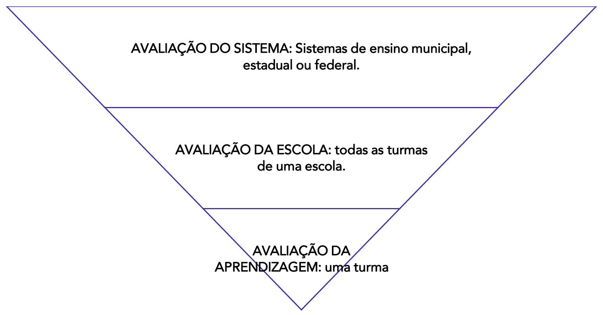
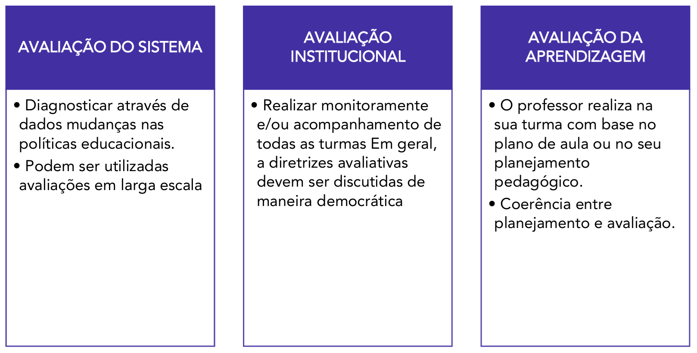
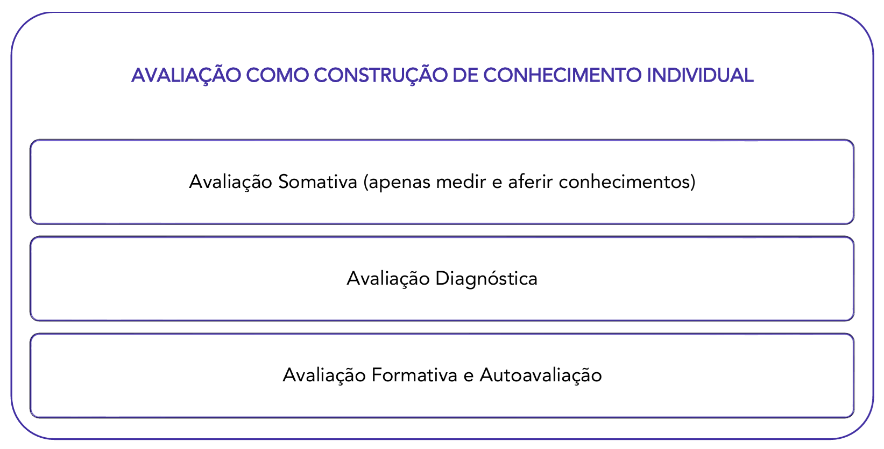
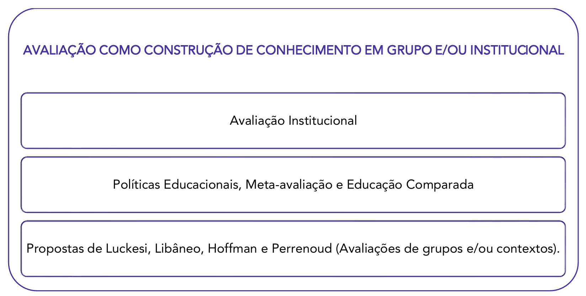
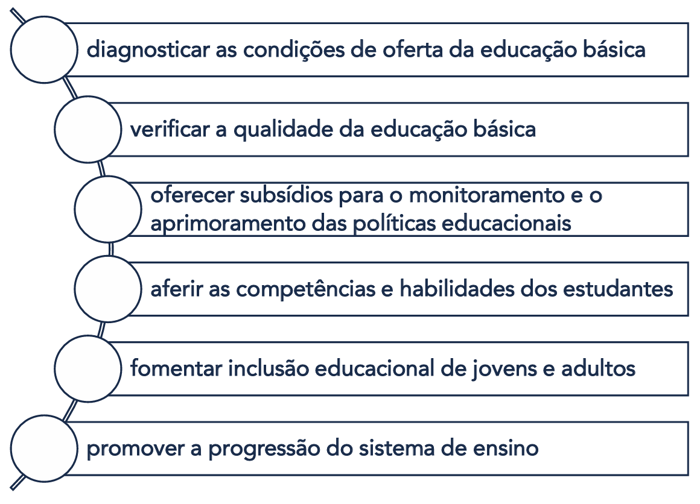
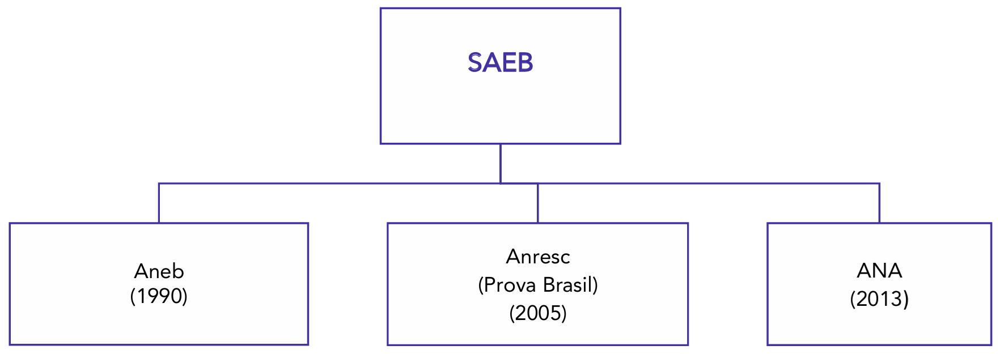

# Capítulo 6 – Avaliação no Processo de Ensino-Aprendizagem

## Considerações Iniciais

O tema da avaliação é, sem dúvida, um dos mais discutidos e, por vezes, controversos no campo educacional. Sua importância é inegável e se manifesta em múltiplas esferas: os sistemas de ensino baseiam suas políticas públicas nos dados coletados por exames em larga escala; as escolas que alcançam bons índices de desenvolvimento, como o IDEB, são aquelas que realizam um monitoramento constante da aprendizagem; e os professores que obtêm os melhores resultados são aqueles que alinham seu planejamento a boas práticas avaliativas.

Dada a sua centralidade, é fundamental compreender que não existe apenas "uma" avaliação. O termo abrange práticas distintas que variam de acordo com dois critérios principais: a **abrangência** (o escopo que ela cobre) e a **finalidade** (o objetivo que ela busca alcançar). É a partir da articulação desses dois critérios que podemos classificar os três grandes tipos de avaliação presentes na educação.

### Os Três Níveis da Avaliação Educacional

A avaliação educacional se divide em três níveis:

1. **Avaliação de Sistemas:** Este é o nível mais amplo. Sua **abrangência** é macro, podendo cobrir todo um sistema de ensino (municipal, estadual ou federal). Sua **finalidade** principal é diagnóstica: levantar dados sobre a qualidade da educação oferecida em larga escala para subsidiar a formulação e a reformulação de políticas públicas. Um exemplo paradigmático no Brasil é o **SAEB (Sistema de Avaliação da Educação Básica)**, que avalia periodicamente os alunos da educação básica para fornecer ao Governo Federal um panorama da aprendizagem em todo o país.
2. **Avaliação da Escola ou Institucional:** Neste nível intermediário, a **abrangência** se restringe a uma única instituição de ensino. Sua **finalidade** é avaliar a escola como um todo, verificando se seu Projeto Político Pedagógico (PPP) está sendo efetivamente aplicado e se seus objetivos estão sendo alcançados. Uma avaliação institucional verdadeiramente democrática deve envolver todos os segmentos da comunidade escolar: pais, alunos, professores, funcionários e a equipe gestora. As decisões e os encaminhamentos resultantes dessa avaliação são, idealmente, discutidos e deliberados no **Conselho Escolar**, o órgão colegiado que representa a instância máxima de participação da comunidade na gestão da escola.
3. **Avaliação da Aprendizagem:** Este é o nível mais específico, ocorrendo no interior da sala de aula. Sua **abrangência** é a turma. Sua **finalidade** é o acompanhamento do processo de ensino-aprendizagem, realizado pelo professor para verificar o que e como seus alunos estão aprendendo. O mais importante é que os resultados dessa avaliação sirvam para **reorientar a prática pedagógica**: ao identificar as dificuldades e os avanços dos estudantes, o professor pode replanejar suas aulas, mudar suas estratégias e buscar novos caminhos para garantir a aprendizagem de todos. Para isso, ele pode utilizar uma variedade de instrumentos, como observações, avaliações escritas, verificação de cadernos e o acompanhamento contínuo.

Os esquemas a seguir ajudam a visualizar a relação entre esses três níveis de avaliação. O primeiro ilustra a hierarquia de abrangência, indo do sistema mais amplo até o foco na sala de aula.

O segundo esquema demonstra como a finalidade de cada avaliação está diretamente relacionada à sua abrangência, desde a formulação de políticas públicas até a reorientação da prática em sala de aula.

### Avaliação Interna e Avaliação Externa: Diferentes Olhares e Funções

Além da classificação por abrangência e finalidade, a avaliação educacional também pode ser categorizada de acordo com a origem de sua proposição e execução. Nesta perspectiva, temos dois grandes tipos: a avaliação externa e a avaliação interna.

#### Avaliação Externa

A **avaliação externa** é aquela concebida e implementada por agentes que não pertencem à rotina da escola, como as secretarias municipais, estaduais ou o Ministério da Educação. Sua principal característica é o uso de **avaliações em larga escala**, que consistem em testes padronizados aplicados a um grande número de estudantes para verificar o desempenho em determinados conteúdos do currículo oficial.

O objetivo primário dessas avaliações é levantar dados que permitam diagnosticar a qualidade dos sistemas de ensino e orientar a formulação de políticas públicas. Exemplos conhecidos são o SAEB e o ENEM, em nível federal, e avaliações específicas de estados e municípios, como o SAERE (Sistema de Avaliação da Educação Básica de Recife). Frequentemente, os resultados dessas avaliações são utilizados em políticas de responsabilização (_accountability_), vinculando o desempenho das escolas a bônus ou rankings.

#### Avaliação Interna

A **avaliação interna**, por sua vez, é aquela planejada e executada pela própria comunidade escolar. Ela pode ter dois focos principais, que correspondem aos níveis institucional e da aprendizagem que já discutimos:

1. **Avaliação Institucional Interna:** É o processo de autoavaliação da escola. Tendo como referência o seu **Projeto Político Pedagógico (PPP)**, a comunidade escolar (gestão, professores, funcionários, pais e alunos) se organiza para refletir sobre suas práticas, identificar seus pontos fortes e suas fragilidades, e traçar planos de melhoria. Idealmente, é um processo democrático, cujas diretrizes e resultados são discutidos e deliberados no Conselho Escolar.
2. **Avaliação da Aprendizagem:** É a avaliação interna por excelência, realizada pelo professor em sua sala de aula. É o acompanhamento contínuo do processo de ensino-aprendizagem, utilizando múltiplos instrumentos para diagnosticar as necessidades dos alunos e reorientar a prática pedagógica.

A principal diferença entre as duas reside no fato de que a avaliação externa busca a padronização para permitir a comparação entre diferentes realidades, enquanto a avaliação interna valoriza a contextualização para compreender e aprimorar uma realidade específica.

Embora possam ser complementares — os dados de uma avaliação externa podem, por exemplo, desencadear um processo de avaliação interna para investigar as causas de um baixo desempenho —, é comum que exista uma tensão entre os dois modelos. A pressão por bons resultados em testes padronizados externos pode levar as escolas a um estreitamento curricular (o chamado "ensinar para o teste"), ofuscando os objetivos mais amplos e humanistas definidos no PPP e trabalhados na avaliação interna.

## A Avaliação na Perspectiva da Construção do Conhecimento

Para aprofundar a compreensão sobre as diversas práticas avaliativas, é útil organizá-las em dois grandes grupos, que se distinguem pelo foco do processo: a **avaliação como construção do conhecimento individual** e a **avaliação como construção do conhecimento em grupo e/ou institucional**. Esta classificação nos ajuda a diferenciar as avaliações que incidem diretamente sobre a trajetória de aprendizagem de cada estudante daquelas que analisam os processos de coletividades, como uma escola ou um sistema de ensino.

### A Avaliação como Construção de Conhecimento Individual

O primeiro grupo abrange as modalidades de avaliação centradas no acompanhamento individual das aprendizagens. São as ferramentas mais diretas do trabalho pedagógico do professor em sala de aula, cujo objetivo é diagnosticar, monitorar e fomentar o processo de construção do saber de cada aluno. As principais propostas dentro deste grupo são:

- Avaliação Somativa (com o objetivo de apenas medir e aferir conhecimentos)
- Avaliação Diagnóstica
- Avaliação Formativa e Autoavaliação

### A Avaliação como Construção de Conhecimento em Grupo e/ou Institucional

O segundo grupo de avaliações expande o foco do indivíduo para o coletivo. Trata-se do acompanhamento em grupo e/ou institucional das aprendizagens e dos processos educativos. Estas avaliações se preocupam em analisar o funcionamento de uma instituição, a eficácia de políticas públicas ou as dinâmicas de avaliação em contextos sociais mais amplos. As principais propostas que se inserem nesta categoria são:

- Avaliação Institucional
- Políticas Educacionais, Meta-avaliação e Educação Comparada
- Propostas de Luckesi, Libâneo, Hoffmann e Perrenoud (Avaliações de grupos e/ou contextos)

A seguir, cada uma dessas propostas será analisada em profundidade, começando pelas avaliações focadas na construção do conhecimento individual.

## Concepções e Críticas

O tema da avaliação, como vimos, se desdobra em múltiplos níveis e funções. Nesta seção, nosso foco se volta para sua dimensão mais ampla: a **avaliação como instrumento de política educacional**. A compreensão deste tema é crucial, pois as avaliações em larga escala têm um impacto direto na formulação de políticas, na alocação de recursos e na própria organização dos sistemas de ensino.

### Concepções das Avaliações em Larga Escala

A partir da década de 1990, alinhado a um movimento global de busca por maior eficiência e accountability na gestão pública, o Brasil passou a adotar de forma sistemática o uso de **testes padronizados** como a principal ferramenta para diagnosticar a educação nacional. Estas avaliações, que correspondem ao que já definimos como **Avaliação de Sistemas** e **Avaliação Externa**, são elaboradas com o objetivo central de levantar dados sobre a qualidade do ensino e a aprendizagem dos alunos em todo o país.

A concepção fundamental que orienta estas políticas é a de que, para melhorar o sistema, é preciso primeiro ter um diagnóstico preciso de seus problemas. A avaliação em larga escala, portanto, é definida da seguinte forma:

> Avaliação em larga escala é o termo utilizado para designar testes padronizados com a finalidade de subsidiar políticas educacionais pelo poder executivo. Dessa forma, a avaliação tem como intuito a melhoria da educação pública no país.

Na prática, isso se traduz em um ciclo de gestão. Por exemplo, se os resultados de avaliações como o SAEB revelam uma queda acentuada no desempenho dos alunos em matemática no 9º ano, esses dados servem de base para que o Ministério da Educação ou as Secretarias Estaduais proponham ações específicas, como a criação de programas de formação continuada para professores dessa disciplina ou a revisão dos materiais didáticos utilizados.

#### Outras Finalidades e Aplicações

Apesar de sua finalidade primária ser o diagnóstico para políticas públicas, alguns desses testes em larga escala assumiram outras funções importantes no sistema educacional brasileiro:

- **Certificação:** O **Encceja** (Exame Nacional para Certificação de Competências de Jovens e Adultos) é utilizado para certificar a conclusão do Ensino Fundamental ou Médio para pessoas que não o fizeram na idade apropriada.
- **Acesso ao Ensino Superior:** O **Enem** (Exame Nacional do Ensino Médio) tornou-se a principal porta de entrada para as universidades públicas e privadas do país.

#### O IDEB e o Uso de Indicadores

Um dos exemplos mais conhecidos da aplicação desses dados é o **Índice de Desenvolvimento da Educação Básica (IDEB)**. O IDEB não é a avaliação em si, mas um indicador de qualidade que combina duas informações: o desempenho dos alunos nas avaliações em larga escala (como o SAEB) e as taxas de fluxo escolar (aprovação e evasão). Embora a criação de um índice numérico para medir algo tão complexo como a qualidade da educação tenha sido alvo de críticas, sua existência se justifica pela necessidade de se ter parâmetros objetivos para monitorar o sistema e referendar o uso de políticas públicas em todo o território nacional.

#### O Uso Indevido dos Dados e a Cultura do Ranqueamento

Apesar da finalidade diagnóstica ser o objetivo oficial, um dos maiores problemas que cercam as avaliações em larga escala é o uso indevido de seus resultados. A mídia tradicional, em particular, frequentemente utiliza os dados públicos de desempenho para criar **ranqueamentos** de escolas, comparando instituições públicas e privadas e gerando listas das "melhores" e "piores" de cada região.

Ressaltamos que esta prática é uma distorção do propósito original da avaliação. A cultura do ranqueamento fomenta uma competição prejudicial entre as escolas, estigmatiza aquelas localizadas em contextos de maior vulnerabilidade social e pode levar à adoção de práticas pedagógicas empobrecidas, como o "ensino para o teste", no qual o currículo é reduzido apenas aos conteúdos que serão cobrados no exame. O objetivo da avaliação de sistemas é subsidiar políticas para a melhoria da equidade e da qualidade do conjunto da rede, e não criar um pódio para poucas escolas.

#### A Base Legal e as Políticas de Responsabilização

A implementação de políticas de avaliação em larga escala pelo governo federal não é uma ação arbitrária, mas encontra amparo e justificativa na **Constituição Federal de 1988**. A Carta Magna estabelece, em seu artigo 206, os princípios sobre os quais o ensino deve ser ministrado, incluindo:

> **Art. 206.** O ensino será ministrado com base nos seguintes princípios:
> 
> I - igualdade de condições para o acesso e permanência na escola;
> II - liberdade de aprender, ensinar, pesquisar e divulgar o pensamento, a arte e o saber;
> III - pluralismo de ideias e de concepções pedagógicas, e coexistência de instituições públicas e privadas de ensino;
> IV - gratuidade do ensino público em estabelecimentos oficiais;
> V - valorização dos profissionais da educação escolar, garantidos, na forma da lei, planos de carreira, com ingresso exclusivamente por concurso público de provas e títulos, aos das redes públicas;
> VI - gestão democrática do ensino público, na forma da lei;
> **VII - garantia de padrão de qualidade.**
> VIII - piso salarial profissional nacional para os profissionais da educação escolar pública, nos termos de lei federal.

Este inciso VII estabelece a **garantia de um padrão de qualidade** como um direito e um dever. Para verificar e promover este padrão em um país de dimensões continentais, a própria Constituição prevê o papel do governo federal. O parágrafo primeiro do artigo 210 afirma que a União exercerá, em matéria educacional, uma função redistributiva e supletiva para garantir a equalização de oportunidades e o padrão mínimo de qualidade, e fará isso mediante **assistência técnica e financeira** aos estados e municípios.

É precisamente o termo **"assistência técnica"** que serve como justificativa legal para a criação e aplicação de sistemas de avaliação nacionais. A lógica é que, para poder prestar assistência e garantir um padrão de qualidade, o governo federal precisa primeiro diagnosticar a situação da educação no país. As avaliações em larga escala são, portanto, concebidas como o principal instrumento para realizar este diagnóstico.

#### A Diversidade de Aplicações nos Sistemas de Ensino

Embora exista um sistema nacional de avaliação, a forma como as políticas avaliativas são utilizadas pode variar, refletindo as diferentes perspectivas políticas de cada governo. Os estados e municípios têm autonomia para criar seus próprios sistemas complementares. O Estado de São Paulo, por exemplo, criou o **IDESP (Índice de Desenvolvimento da Educação do Estado de São Paulo)**, um indicador próprio que dialoga com as escolas de sua rede. Outras unidades da federação podem não ter um índice próprio ou podem desenvolver outros modelos de avaliação, de acordo com suas prioridades políticas e educacionais.

#### A Tendência da Responsabilização (_Accountability_)

Nos últimos anos, uma tendência que tem ganhado força é a implementação de políticas de **responsabilização**, termo traduzido do inglês _accountability_. Esta abordagem representa um passo além do simples diagnóstico, pois busca vincular diretamente os resultados das avaliações em larga escala a consequências para as escolas e seus profissionais.

A premissa é a de que, ao responsabilizar os diretores e professores pelos resultados de aprendizagem dos alunos, cria-se um incentivo para a melhoria da qualidade do ensino. Essa política, que foi amplamente utilizada em contextos como o dos Estados Unidos, se manifesta de duas formas principais:

- **Em caso de resultado negativo:** A escola como um todo pode ser responsabilizada pelo baixo desempenho em testes padronizados, podendo sofrer intervenções administrativas ou ser publicamente estigmatizada. As consequências pedagógicas e administrativas desta abordagem ainda são objeto de intenso debate.
- **Em caso de resultado positivo:** Os agentes públicos podem receber uma bonificação financeira pelos bons resultados alcançados. Diversos municípios e alguns estados no Brasil já tiveram ou têm experiências com essa **política de bonificação**, na qual os professores recebem uma quantia adicional ao seu salário, atrelada ao desempenho dos estudantes em provas específicas.

A implementação de políticas de responsabilização é um dos temas mais polêmicos da educação atual. Se por um lado seus defensores argumentam que ela aumenta a eficiência e o foco nos resultados, por outro, seus críticos alertam para os riscos do estreitamento curricular (ensinar para o teste) e da punição injusta de escolas que atendem populações em maior vulnerabilidade social.

### Críticas às Políticas de Avaliação

As críticas direcionadas às políticas educacionais de avaliação, especialmente ao uso de testes padronizados, geralmente não questionam a necessidade de se ter um diagnóstico do sistema, mas sim **o uso que se faz desses dados** e as concepções que orientam sua aplicação. A discussão se desloca do campo puramente técnico para o campo **filosófico e político**, fazendo perguntas fundamentais sobre as finalidades e as consequências reais dessas avaliações.

As principais críticas podem ser organizadas nos seguintes pontos:

#### A Lacuna entre o Discurso e a Prática

No discurso oficial, a finalidade das avaliações em larga escala é nobre: coletar dados para subsidiar a melhoria da educação através de ações como a formação de professores, o assessoramento técnico às escolas e a formulação de políticas públicas mais eficazes e diferenciadas. No entanto, na prática, muitas vezes se observa uma lacuna entre esses objetivos ideais e sua real efetivação. Com frequência, os dados são utilizados muito mais para cobrar resultados e pressionar as redes de ensino do que para, de fato, garantir o suporte técnico e financeiro necessário para que as escolas, especialmente as mais vulneráveis, possam superar suas dificuldades.

#### A Perversão pelo Ranqueamento

Como já mencionado, um dos efeitos colaterais mais prejudiciais da divulgação pública dos resultados é a **criação de rankings** de escolas pela mídia e pela sociedade em geral. Essa prática distorce completamente a finalidade diagnóstica da avaliação, fomentando uma cultura de competição em vez de colaboração entre as escolas. A preocupação excessiva com os dados quantitativos e a posição no ranking pode levar a consequências pedagógicas negativas, como o estreitamento do currículo (focando apenas no que "cai na prova") e a estigmatização de instituições que atendem alunos em contextos de maior complexidade social.

#### A Redução dos Objetivos Educacionais

Uma crítica fundamental refere-se aos **limites do próprio instrumento avaliativo**. Um teste padronizado, por sua natureza, consegue medir apenas uma parcela restrita do que se entende por uma formação educacional de qualidade. Habilidades e valores essenciais para a formação de cidadãos, como a criatividade, o pensamento crítico, a colaboração, a empatia, a resiliência e a sensibilidade artística, não são contemplados por esses exames. O perigo, portanto, é a redução de todo o complexo processo educativo àquilo que pode ser medido por uma prova. A pontuação em um teste não pode e não deve ser confundida com os objetivos gerais e mais amplos da educação.

#### A Hierarquia Implícita do Currículo

A pergunta "o que se avalia e para que se avalia?" revela uma dimensão de poder na escolha dos conteúdos. As avaliações em larga escala no Brasil, historicamente, concentram-se quase que exclusivamente nas disciplinas de **Língua Portuguesa e Matemática**. A ausência de avaliações com o mesmo peso para áreas como Artes, Educação Física, História ou Filosofia, por exemplo, envia uma mensagem poderosa para o sistema: a de que alguns saberes são mais importantes do que outros. Essa escolha não é neutra; ela estabelece uma hierarquia de valor entre as disciplinas, o que pode levar à precarização e à redução da carga horária das áreas não avaliadas, empobrecendo a formação integral e humanista dos estudantes.

### Meta-avaliação e Educação Comparada

Diante dos intensos debates sobre os benefícios e os problemas das avaliações em larga escala, surge a necessidade de se ter instrumentos para analisar criticamente as próprias políticas avaliativas. Duas ferramentas importantes para essa reflexão são a meta-avaliação e a educação comparada.

A **meta-avaliação** é, de forma simples, **a avaliação da avaliação**. É um processo de segundo nível que não se debruça sobre a aprendizagem dos alunos, mas sobre a qualidade, a validade, a utilidade e as consequências do próprio instrumento avaliativo. Uma meta-avaliação de uma política de avaliação em larga escala faria perguntas como:

- Os objetivos desta avaliação são claros e estão sendo cumpridos?
- O teste mede de fato o que ele se propõe a medir (validade)?
- Os resultados são consistentes e confiáveis (fidedignidade)?
- O uso dos dados está gerando as melhorias pretendidas ou está causando consequências negativas não previstas (como o estreitamento curricular)?

Pensar sobre a avaliação é, portanto, uma necessidade para que se possa verificar os alcances e os limites das políticas em vigor e aprimorá-las constantemente.

Um dos instrumentos mais poderosos para se realizar uma meta-avaliação é a **educação comparada**. Este campo de estudo se dedica a analisar e comparar diferentes sistemas educacionais (entre países, estados ou municípios) para compreender como diferentes contextos e políticas geram resultados distintos. Ao comparar os instrumentos avaliativos utilizados no Brasil com os de outros países, por exemplo, é possível fazer uma análise crítica sobre os alcances e as limitações do modelo nacional e vislumbrar possíveis alternativas.

Tanto a avaliação em larga escala quanto a meta-avaliação e a educação comparada dependem de uma rigorosa **análise de dados e estatísticas educacionais**. Este é o trabalho técnico realizado por órgãos como o INEP, que utiliza métodos estatísticos para tratar as informações coletadas e transformá-las em indicadores que possam subsidiar o debate e a formulação de políticas de forma fundamentada.

## A Política Nacional de Avaliação e Exames

A **Política Nacional de Avaliação e Exames** é o principal instrumento do Poder Executivo Federal para cumprir sua função de zelar pela qualidade da educação no país. Conforme estabelecido pela Constituição Federal de 1988, esta política permite ao governo monitorar e acompanhar o desempenho dos diferentes sistemas de ensino (municipal, estadual e federal).

Suas avaliações e exames são aplicados em diversas etapas e modalidades, cobrindo a Educação Básica e o Ensino Superior. Além do diagnóstico dos sistemas, também servem a finalidades específicas, como a certificação de jovens e adultos que não concluíram os estudos na idade apropriada, por meio da modalidade de Educação de Jovens e Adultos (EJA).

### O Decreto nº 9.432/2018: A Estrutura da Política

A regulamentação oficial desta política se dá, principalmente, através do **Decreto nº 9.432, de 20 de junho de 2018**, que instituiu a Política Nacional de Avaliação e Exames da Educação Básica. Este decreto elenca os princípios e objetivos que norteiam as ações avaliativas em âmbito nacional.

Os **princípios** que balizam a política são três, reforçando o compromisso do Estado com a garantia de direitos educacionais:

Já os **objetivos** detalham as finalidades práticas da política, mostrando sua abrangência desde o diagnóstico da oferta até o fomento à inclusão:

#### Os Instrumentos da Política Nacional

O decreto estabelece que a Política Nacional de Avaliação e Exames da Educação Básica é integrada por um sistema de avaliação e dois exames nacionais, cada um com uma função específica.

|SAEB|ENCCEJA|ENEM|
|---|---|---|
|**Sistema de Avaliação da Educação Básica**|**Exame Nacional para Certificação de Competências de Jovens e Adultos**|**Exame Nacional do Ensino Médio**|
|É um conjunto de instrumentos que permite a produção e a disseminação de evidências, estatísticas e estudos sobre a qualidade da Educação Infantil, do Ensino Fundamental e do Ensino Médio.|Tem como objetivo aferir as competências e as habilidades de jovens e adultos que não concluíram o EF ou EM na idade própria, de pessoas privadas de liberdade e de pessoas que residem no exterior.|Tem como objetivo aferir o domínio das competências e das habilidades esperadas ao final da educação básica.|
|É realizado pela União, em regime de colaboração com os Estados, o DF e os Municípios, com coleta de dados em escolas públicas e privadas.|Pode ser utilizado para fins de certificação de níveis de ensino.|Pode ser utilizado como mecanismo de acesso à educação superior e a programas governamentais de financiamento ou apoio ao estudante.|

#### A Implementação pelo INEP

Para a implementação desta política, o **Ministério da Educação**, por meio do **Instituto Nacional de Estudos e Pesquisas Educacionais Anísio Teixeira (Inep)**, é o órgão responsável. Suas atribuições incluem:

- Implementar os procedimentos estabelecidos no Decreto;
- Definir a concepção pedagógica das avaliações e dos exames;
- Definir a metodologia de aplicação e aferição dos resultados; e
- Editar as normas complementares necessárias.

As despesas decorrentes da execução da política correm à conta das dotações orçamentárias do próprio Inep. A seguir, vamos detalhar melhor algumas dessas políticas de avaliação.

### Sistema de Avaliação da Educação Básica (SAEB)

O **Sistema de Avaliação da Educação Básica (SAEB)** é o pilar da política de avaliação do governo federal. Trata-se de um conjunto complexo de avaliações externas em larga escala, cujo objetivo principal é realizar um diagnóstico da educação básica brasileira e dos fatores que podem interferir no desempenho dos estudantes.

A **finalidade** do SAEB é eminentemente diagnóstica. Por meio de testes de proficiência e questionários contextuais, aplicados periodicamente, o sistema levanta dados e informações sobre o perfil dos alunos, os níveis de aprendizagem, a formação dos professores e as condições físicas e estruturais das escolas. Essas informações são consideradas essenciais para que as diferentes esferas de governo (municipal, estadual e federal) possam tomar decisões e formular políticas públicas baseadas em evidências.

Realizado desde 1990 pelo Inep (Instituto Nacional de Estudos e Pesquisas Educacionais Anísio Teixeira), o SAEB passou por diversas reestruturações ao longo de sua história, ampliando seu alcance e aprimorando seus instrumentos.

#### A Evolução Histórica do Sistema

A complexidade do SAEB atual é fruto de uma evolução que buscou ampliar progressivamente a capacidade de diagnóstico do sistema educacional.

- **O Início (1990) - Aneb:** Em seu formato original, o SAEB era composto pela **Avaliação Nacional da Educação Básica (Aneb)**. A Aneb era uma avaliação amostral, ou seja, aplicada a um grupo representativo de estudantes do 5º e 9º anos do Ensino Fundamental e do 3º ano do Ensino Médio. Por ser amostral, ela fornecia um panorama da qualidade da educação no Brasil e em cada estado, mas não permitia ter resultados de cada escola ou município.
- **A Virada de 2005 - Anresc (Prova Brasil):** A grande mudança veio em 2005 com a criação da **Avaliação Nacional do Rendimento Escolar (Anresc)**, que ficou mais conhecida como **Prova Brasil**. Diferentemente da Aneb, a Prova Brasil passou a ser censitária para as escolas públicas, ou seja, aplicada a praticamente todos os alunos do 5º e 9º anos do Ensino Fundamental da rede pública. Essa mudança foi revolucionária, pois, pela primeira vez, tornou-se possível ter dados de desempenho de cada escola individualmente. Foi a criação da Prova Brasil que permitiu a composição do **Índice de Desenvolvimento da Educação Básica (Ideb)**, que cruza esses dados de desempenho com as taxas de aprovação, reprovação e abandono de cada escola, apuradas no Censo Escolar.
- **O Foco na Alfabetização (2013) - ANA:** Em 2013, o sistema foi ampliado com a criação da **Avaliação Nacional da Alfabetização (ANA)**. Com foco nos estudantes do 3º ano do Ensino Fundamental, a ANA tinha como objetivo avaliar os níveis de alfabetização e letramento em Língua Portuguesa e em Matemática, em resposta à prioridade nacional de garantir a alfabetização na idade certa. A ANA também foi pioneira no uso mais aprofundado de questionários contextuais para investigar fatores como a infraestrutura escolar, a formação de professores e a gestão pedagógica.

#### A Configuração Atual do "Novo Saeb" (Pós-2019)

Em 2019, buscando unificar e simplificar o sistema, os nomes Aneb, Anresc (Prova Brasil) e ANA foram integrados sob a única nomenclatura **SAEB**. Atualmente, o SAEB é aplicado a cada dois anos e tem como público-alvo obrigatório os estudantes do 5º e 9º ano do Ensino Fundamental e da 3ª série do Ensino Médio das escolas públicas. As escolas da rede privada podem participar de forma voluntária.

Além disso, o "Novo Saeb" expandiu seu escopo, passando a contemplar também, de forma amostral, a **Educação Infantil**, com o objetivo de avaliar as condições de oferta desta primeira etapa da educação básica.

Apesar de sua rica função diagnóstica, que vai além da proficiência dos alunos ao avaliar também as condições do sistema, o SAEB continua a enfrentar o desafio do uso indevido de seus dados. Como já discutido, a utilização de seus resultados pela mídia para a criação de rankings de melhores e piores escolas é uma distorção de seu objetivo principal, que é o de fornecer subsídios para o aprimoramento do conjunto da educação brasileira.

### Índice de Desenvolvimento da Educação Básica (IDEB)

O **Índice de Desenvolvimento da Educação Básica (IDEB)** foi criado pelo Inep em 2007 com o objetivo de estabelecer um parâmetro nacional para a qualidade da educação. Antes de sua criação, não havia uma "linguagem comum" para medir e comparar o avanço dos diferentes sistemas de ensino, o que dificultava o monitoramento e a formulação de políticas públicas eficazes. O IDEB surgiu, portanto, como uma proposta para unificar essa medição.

#### A Composição do Índice: Equilibrando Fluxo e Desempenho

A grande inovação do IDEB foi reunir, em um único indicador, dois conceitos igualmente importantes para a qualidade da educação: o **fluxo escolar** e as **médias de desempenho** nas avaliações. Conforme a definição oficial do Inep, o índice é calculado da seguinte forma:

> O Ideb é calculado a partir dos dados sobre aprovação escolar, obtidos no Censo Escolar, e das médias de desempenho no Sistema de Avaliação da Educação Básica (Saeb).

Isso significa que o IDEB é o resultado da multiplicação de duas notas, que vão de 0 a 10:

1. **Nota de Desempenho:** A média das notas dos alunos da escola nas provas de Língua Portuguesa e Matemática do SAEB.
2. **Nota de Fluxo:** A taxa de aprovação da escola, calculada a partir dos dados do Censo Escolar.

A combinação entre fluxo e aprendizagem tem o mérito de equilibrar as duas dimensões. Se uma escola, para melhorar suas notas no SAEB, decidir reprovar muitos alunos (prejudicando o fluxo), seu IDEB cairá. Se, ao contrário, ela aprovar todos os alunos sem que eles tenham aprendido o suficiente (o que prejudicará o desempenho), seu IDEB também cairá. O índice, portanto, busca incentivar a melhoria da aprendizagem com a garantia da progressão escolar.

#### O IDEB como Ferramenta de Gestão e Política Pública

O IDEB não é apenas um indicador diagnóstico; ele se tornou a principal ferramenta para o acompanhamento das metas de qualidade da educação básica no Brasil. A partir do resultado inicial de cada escola, rede municipal e estadual, o governo federal projetou metas bienais de melhoria. Essa estipulação de metas a serem alcançadas engajou muitas instituições escolares em um esforço contínuo para aprimorar a qualidade de seu ensino.

O índice também estabeleceu uma meta nacional ambiciosa, a de que o Brasil alcançasse, até 2022, um IDEB médio de 6,0 nos anos iniciais do ensino fundamental — um valor que, na época de sua criação, foi considerado comparável ao de um sistema educacional de qualidade de países desenvolvidos.

Apesar de sua importância como condutor de políticas públicas, o IDEB também é alvo de críticas. Especialistas apontam que a redução de um conceito tão complexo como "qualidade da educação" a um único número pode ser simplista e desconsiderar outros aspectos fundamentais da formação humana. Além disso, critica-se o fato de que o índice, ao não ponderar adequadamente as desigualdades socioeconômicas entre as escolas, pode gerar comparações injustas e estigmatizar instituições que atuam em contextos de maior vulnerabilidade.

### Exame Nacional do Ensino Médio (ENEM)

O **Exame Nacional do Ensino Médio (ENEM)** é, sem dúvida, a avaliação de maior repercussão e impacto social no Brasil, principalmente por seu papel central no acesso à educação superior. No entanto, sua função é mais ampla, atuando como um eixo que articula diversas políticas federais de fomento à educação.

#### A Evolução Histórica: De Diagnóstico a Mecanismo de Acesso

É importante compreender que o ENEM passou por uma profunda transformação desde sua criação.

- **O ENEM Original (1998):** Quando foi criado, o ENEM tinha como objetivo principal ser uma **avaliação diagnóstica** da qualidade do Ensino Médio no país, de forma semelhante ao SAEB. A participação era voluntária, e seu uso para o ingresso em universidades era incipiente, servindo como um componente complementar em alguns poucos processos seletivos.
- **O "Novo ENEM" (a partir de 2009):** Em 2009, o exame foi completamente reformulado, tornando-se o principal mecanismo de acesso à educação superior no Brasil. Essa mudança foi consolidada com a criação do **SiSU (Sistema de Seleção Unificada)**, uma plataforma centralizada na qual as universidades públicas federais passaram a oferecer suas vagas, utilizando a nota do ENEM como único critério de seleção.

#### As Três Principais Finalidades Atuais

Hoje, o ENEM cumpre três funções centrais, que o tornam a espinha dorsal das políticas de acesso ao ensino superior:

1. **Acesso à Educação Superior:** A nota do ENEM é utilizada para o ingresso em praticamente todas as universidades federais e institutos federais (através do SiSU), além de ser aceita por inúmeras universidades estaduais e privadas em seus próprios processos seletivos.
2. **Acesso a Programas de Bolsa de Estudos:** O desempenho no exame é o critério de seleção para o **ProUni (Programa Universidade para Todos)**, que concede bolsas de estudo integrais e parciais em instituições de ensino superior privadas para estudantes de baixa renda.
3. **Acesso ao Financiamento Estudantil:** A obtenção de uma nota mínima no ENEM é pré-requisito para que o estudante possa se candidatar ao **FIES (Fundo de Financiamento Estudantil)**, o programa do governo federal que oferece financiamento a juros baixos para cursos em faculdades privadas.

Antes da consolidação do ENEM, não havia um mecanismo que vinculasse o desempenho dos estudantes aos programas de apoio do governo federal. O exame, portanto, não apenas unificou o acesso a diversas universidades, mas também possibilitou a integração de diferentes políticas de acesso, bolsas e financiamento, criando um sistema mais coeso e de alcance nacional.

### Programa Internacional de Avaliação dos Estudantes (PISA)

Além das avaliações de âmbito nacional, o Brasil também participa de avaliações internacionais, sendo a mais influente delas o **Programa Internacional de Avaliação dos Estudantes (PISA)**, sigla em inglês para _Programme for International Student Assessment_. Coordenado pela **OCDE (Organização para a Cooperação e o Desenvolvimento Econômico)**, o PISA é uma avaliação em larga escala aplicada a cada três anos em dezenas de países ao redor do mundo.

#### Objetivos e Características

O objetivo central do PISA é produzir dados internacionalmente comparáveis sobre o desempenho dos estudantes, permitindo que cada país avalie seu sistema educacional em relação a outros, aprenda com as políticas e práticas aplicadas em diferentes contextos e, a partir daí, formule políticas para a melhoria da qualidade e da equidade de sua própria educação.

Diferentemente de avaliações como o SAEB, que focam no currículo nacional, o PISA possui uma característica distintiva: ele não busca avaliar o domínio de um conteúdo curricular específico, mas sim a **literacia** (ou letramento). O foco é verificar se os estudantes de **15 anos de idade** — faixa etária escolhida por representar, na maioria dos países, o final da escolaridade obrigatória — conseguem aplicar seus conhecimentos e habilidades para a resolução de problemas e desafios da vida real.

O PISA avalia três domínios do conhecimento: **leitura, matemática e ciências**. A cada edição trienal, um desses domínios é escolhido como o foco principal, o que significa que um maior número de questões é dedicado a ele, permitindo uma análise mais aprofundada daquela área.

#### O PISA no Brasil

No Brasil, o **Inep** é o órgão responsável por todo o planejamento e a operacionalização do PISA. Suas atribuições incluem representar o país junto à OCDE, coordenar a tradução e adaptação dos instrumentos de avaliação, gerenciar a aplicação dos testes em uma amostra representativa de escolas brasileiras e, por fim, analisar e divulgar os resultados em um relatório nacional.

Além dos testes de proficiência, o PISA aplica extensos **questionários contextuais** aos alunos e diretores de escola. Esses questionários são fundamentais, pois coletam informações sobre o perfil socioeconômico dos estudantes, suas atitudes em relação à aprendizagem, o clima escolar e as práticas pedagógicas. São esses dados que permitem análises mais complexas, que vão além do simples desempenho e buscam explicar os fatores associados ao sucesso educacional.

#### O Uso dos Resultados: Estudo Comparativo versus Ranqueamento

É fundamental ressaltar que a finalidade proposta pelo PISA é a do **estudo comparativo** para a aprendizagem mútua entre os países. No entanto, a repercussão de seus resultados na mídia frequentemente simplifica essa complexidade, transformando a avaliação em uma espécie de "copa do mundo da educação", com um foco excessivo no **ranqueamento** dos países. Essa abordagem competitiva é uma distorção do objetivo original do programa e pode gerar pressões indevidas sobre os sistemas educacionais, sem um debate qualificado sobre as razões e os contextos que explicam os diferentes resultados.

### Exame Nacional para Certificação de Competências de Jovens e Adultos (Encceja)

O **Exame Nacional para Certificação de Competências de Jovens e Adultos (Encceja)** é uma avaliação de aplicação voluntária e gratuita, que cumpre uma função social de extrema importância: oferecer um caminho para que jovens e adultos que não concluíram seus estudos na idade apropriada possam obter a certificação de conclusão do Ensino Fundamental ou do Ensino Médio.

#### A Função Social e a Base Legal

O Encceja é a principal política pública de **inclusão educacional e reparação de trajetórias escolares**. Ele representa uma segunda chance para milhões de brasileiros que, por diversas razões (como a necessidade de trabalhar precocemente), tiveram seus estudos interrompidos. A obtenção do certificado através do exame possibilita a essas pessoas o prosseguimento dos estudos em níveis mais elevados (como cursos técnicos ou o ensino superior) e o acesso a melhores oportunidades no mercado de trabalho.

Esta política está fundamentada na **Lei de Diretrizes e Bases da Educação Nacional (LDB 9.394/96)**, que, em seu artigo 38, determina que os sistemas de ensino devem manter exames supletivos. O parágrafo primeiro especifica os requisitos de idade para a certificação:

> **Art. 38.** Os sistemas de ensino manterão cursos e exames supletivos, que compreenderão a base nacional comum do currículo, habilitando ao prosseguimento de estudos em caráter regular.
> 
> § 1º Os exames a que se refere este artigo realizar-se-ão:
> 
> I - no nível de conclusão do ensino fundamental, para os maiores de quinze anos;
> II - no nível de conclusão do ensino médio, para os maiores de dezoito anos.

O Encceja é, portanto, a principal via pela qual o governo federal cumpre essa determinação legal, garantindo essa oportunidade em escala nacional.

#### Estrutura da Avaliação

O exame não avalia apenas a memorização de conteúdos, mas busca aferir se o participante desenvolveu as **competências e habilidades** essenciais esperadas ao final de cada etapa da educação básica. A avaliação é composta por quatro provas objetivas, que correspondem às grandes áreas do conhecimento da Base Nacional Comum Curricular (BNCC), e uma prova de Redação.

Uma característica importante do Encceja é a sua flexibilidade. Para obter o certificado, o participante precisa atingir a pontuação mínima em cada uma das quatro áreas e na redação. Caso ele seja aprovado em algumas áreas, mas não em outras, ele pode solicitar uma "Declaração Parcial de Proficiência" e, na edição seguinte do exame, se inscrever para realizar apenas as provas nas quais não obteve a nota necessária.

### Sistema Nacional de Avaliação da Educação Superior (SINAES)

O **Sistema Nacional de Avaliação da Educação Superior (SINAES)**, instituído pela Lei nº 10.861, de 14 de abril de 2004, é o principal instrumento do governo federal para zelar pela qualidade dos cursos e instituições de ensino superior (IES) no país. É fundamental compreender que o SINAES não se resume a uma única prova aplicada aos estudantes, mas sim a um sistema integrado que analisa múltiplos aspectos da vida acadêmica.

Sua criação, no início dos anos 2000, foi uma resposta à necessidade de superar o modelo anterior (o "Provão"), que era focado apenas no desempenho dos concluintes, e de criar um sistema mais completo para regular a grande expansão da educação superior, especialmente no setor privado.

#### Objetivos e Princípios do Sistema

O SINAES tem como objetivos centrais melhorar a qualidade da educação superior, orientar a expansão da oferta de cursos e promover a responsabilidade social das IES. Para garantir um processo justo e formativo, o sistema é balizado por princípios importantes, como:

- A necessidade de uma **avaliação institucional interna e externa**, que contemple análise global e integrada das dimensões, estruturas, relações, compromisso social, atividades, finalidades e responsabilidades sociais das instituições de educação superior (IES) e de seus cursos;
- O **caráter público** de todos os seus procedimentos e resultados;
- O **respeito à identidade e à diversidade** de cada instituição e curso;
- A **participação** do corpo discente, docente e técnico-administrativo das instituições de educação superior, e da sociedade civil, por meio de suas representações.

#### O Tripé da Avaliação

O SINAES se apoia sobre um tripé de componentes avaliativos que, juntos, buscam oferecer um diagnóstico completo da qualidade do ensino superior.

1. **A Avaliação das Instituições (AVALIES):** Este componente analisa a IES como um todo. Ele possui duas fases. A primeira é a **autoavaliação**, coordenada pela Comissão Própria de Avaliação (CPA) de cada instituição. A segunda é a **avaliação externa**, realizada por comissões de especialistas designados pelo Inep, que visitam a instituição para verificar _in loco_ suas condições de ensino, pesquisa, extensão e gestão.
2. **A Avaliação dos Cursos de Graduação (ACG):** Com foco específico nos cursos, este componente também é realizado por comissões de especialistas externos, que analisam as condições de ensino oferecidas, englobando o projeto pedagógico do curso, o perfil do corpo docente, as instalações físicas e os laboratórios.
3. **A Avaliação do Desempenho dos Estudantes (ENADE):** Este é o componente mais conhecido. O **Exame Nacional de Desempenho dos Estudantes (ENADE)** é uma prova aplicada periodicamente aos estudantes concluintes dos cursos de graduação. Seu objetivo é aferir o desempenho dos estudantes em relação aos conteúdos programáticos, às suas habilidades e competências. É importante notar que, ao contrário do que se pensa, o ENADE é apenas _um_ dos três pilares do SINAES, e seus resultados são utilizados para compor a avaliação do curso, junto com as outras informações.

#### Dos Dados à Regulação

O **Inep** é o órgão responsável por toda a operacionalização do SINAES, desde a aplicação do ENADE até a coordenação das visitas de comissões. Os resultados consolidados dessas avaliações (que geram indicadores como o Conceito Preliminar de Curso - CPC e o Índice Geral de Cursos - IGC) são publicados e servem como **referencial básico para os processos de regulação e supervisão** realizados pelo Ministério da Educação (MEC).

Na prática, um bom ou mau desempenho no SINAES tem consequências diretas para as IES e seus cursos, influenciando decisões sobre:

- **Credenciamento e Recredenciamento** de instituições;
- **Autorização** para a abertura de novos cursos;
- **Reconhecimento e Renovação de Reconhecimento** de cursos já existentes.

## Avaliação Institucional

A **avaliação institucional**, também conhecida como avaliação da escola, é um processo amplo e coletivo de reflexão sobre a qualidade da educação oferecida por uma determinada instituição de ensino. Diferentemente da avaliação da aprendizagem, seu foco não está no desempenho individual dos alunos em uma sala de aula, mas sim na **escola como um todo**: nas condições de ensino que ela oferece, na coerência e execução de seu Projeto Político Pedagógico (PPP), no planejamento geral dos docentes e na gestão pedagógica e administrativa.

É um momento em que a comunidade escolar "se olha no espelho" para analisar suas práticas, identificar seus pontos fortes e suas fragilidades, e traçar caminhos para a melhoria. Trata-se de uma regulação interna, na qual se verifica se as diferentes ações pedagógicas estão alinhadas com os objetivos e valores que a própria instituição traçou para si.

Um exemplo prático seria uma escola que decide avaliar seu projeto de leitura. A avaliação institucional não se limitaria a aplicar uma prova para ver se os alunos estão lendo mais. Em vez disso, ela promoveria uma ampla discussão com professores, alunos e famílias, buscando coletar opiniões e relatos sobre a qualidade do acervo da biblioteca, a motivação dos estudantes para as atividades, a eficácia das estratégias de mediação de leitura utilizadas pelos professores, entre outras inúmeras possibilidades.

### Pilares da Avaliação Institucional

Para que cumpra seu papel formativo e transformador, a avaliação institucional se apoia em alguns pilares essenciais:

1. **Foco na Escola, Não na Culpabilização do Aluno:** O objeto da análise é a instituição. Diante de um quadro de baixo rendimento, por exemplo, a avaliação institucional evita a postura de culpar os alunos ou suas famílias. A pergunta central não é "Por que este aluno não aprende?", mas sim "O que nós, enquanto instituição, estamos fazendo ou deixando de fazer que contribui para este resultado?". O foco está nas atitudes que podem ser tomadas pela escola para melhorar a qualidade da educação que ela oferece.
2. **Construção Coletiva em Equipe:** A avaliação institucional não é uma tarefa isolada da equipe gestora, mas um processo que deve envolver toda a equipe da escola: professores, coordenadores, supervisores e direção. Essa construção coletiva quebra o isolamento da prática docente e promove um sentimento de corresponsabilidade pelos rumos da instituição.
3. **Exercício de Gestão Democrática:** O processo deve ser fundamentalmente democrático, abrindo espaço para a participação de todos os segmentos da comunidade escolar, incluindo pais e alunos, muitas vezes através de instâncias como o Conselho Escolar. A discussão sobre os valores, os objetivos educacionais e os problemas da escola se torna, assim, um exercício prático de cidadania e de gestão democrática.

## Avaliação da Aprendizagem

Após analisarmos a avaliação em suas dimensões mais amplas — sistêmica e institucional —, voltamos nosso olhar para o núcleo do processo pedagógico: a **avaliação da aprendizagem**, aquela que ocorre na interação diária entre professor e alunos. O consenso entre os principais teóricos da educação hoje aponta para uma profunda mudança de paradigma: a superação de um modelo tradicional de avaliação em favor de um **modelo de avaliação formativa**.

### Do Modelo Tradicional ao Formativo

A **avaliação tradicional** era frequentemente vista como um evento isolado, que ocorria apenas ao final de um período (mês, bimestre ou semestre). Seu objetivo era unicamente **medir e classificar** o desempenho dos alunos através de notas ou conceitos. Nessa perspectiva, a avaliação funcionava como um termômetro que, ao final do processo, apenas aferia a "temperatura" do conhecimento do aluno, sem se preocupar em intervir para melhorá-lo. A responsabilidade pelo resultado era depositada exclusivamente no estudante, e não havia uma reflexão crítica sobre os métodos de ensino utilizados ou sobre a adequação dos próprios instrumentos avaliativos.

Em oposição a essa visão, a concepção contemporânea entende a avaliação em seu **caráter formativo**. Ela deixa de ser o ponto final do percurso para se tornar parte integrante e contínua do próprio processo de ensinar e aprender. Diz-se que é "formativa" porque sua principal finalidade é **orientar a formação** dos alunos. Os resultados obtidos não servem para rotular ou classificar, mas sim como um diagnóstico que permite ao professor **replanejar suas aulas**, adaptar suas estratégias e intervir de forma mais eficaz nas dificuldades da turma ou de alunos específicos. A responsabilidade pelo processo é compartilhada, e a avaliação se torna uma ferramenta para a melhoria do ensino e da aprendizagem.

### Esclarecendo Conceitos-Chave na Avaliação da Aprendizagem

Dentro dessa discussão, alguns termos e conceitos são fundamentais para a compreensão das diferentes práticas avaliativas.

- **Avaliação Formal e Informal:** A **avaliação formal** é aquela planejada pelo professor e realizada por meio de um instrumento próprio (como um trabalho escrito, um seminário ou um teste). Já a **avaliação informal** ocorre através da observação cotidiana do professor sobre a participação dos alunos, suas atividades no caderno, seu engajamento em grupo e seu comportamento em sala. Em uma perspectiva formativa, ambos os tipos de avaliação são importantes, pois fornecem informações complementares sobre o processo de aprendizagem.
- **A Prova como Instrumento:** A **prova** é o instrumento mais característico da avaliação tradicional, especialmente quando sua única finalidade é a de medir o conhecimento para a atribuição de uma nota. Quando desvinculada de uma intenção pedagógica de reorientação do trabalho docente, ela tende a reforçar a lógica de que o aluno é o único responsável por seu resultado.
- **Avaliação para Intervenção Pedagógica:** Esta expressão define a essência da avaliação formativa. Trata-se de toda e qualquer avaliação — formal ou informal — cujos resultados são utilizados pelo professor para realizar uma **intervenção pedagógica**, ou seja, para agir de forma a superar as dificuldades de aprendizagem identificadas. O sucesso da avaliação, nesta ótica, não está na nota que ela gera, mas na qualidade da ação pedagógica que ela possibilita.

## As Funções da Avaliação: Somativa, Diagnóstica e Formativa

A avaliação da aprendizagem, na prática da sala de aula, pode assumir diferentes formas e, principalmente, cumprir diferentes funções. A depender do momento em que é realizada e de seu objetivo principal, podemos classificá-la em três grandes modalidades: somativa, diagnóstica e formativa.

Se pensarmos no processo de ensino-aprendizagem como uma jornada, as três funções da avaliação podem ser compreendidas da seguinte forma: a **avaliação diagnóstica** é o mapa que nos mostra o ponto de partida de cada viajante; a **avaliação formativa** é a bússola que nos ajuda a ajustar a rota durante todo o percurso; e a **avaliação somativa** é a fotografia que tiramos no ponto de chegada para registrar a viagem.

### Avaliação Diagnóstica: O Ponto de Partida

A **Avaliação Diagnóstica** é aquela realizada **no início** de um processo de ensino, seja no começo do ano letivo, seja no começo de uma nova unidade didática. Seu objetivo principal é investigar e identificar os **conhecimentos prévios** que os alunos já possuem sobre determinado assunto, bem como suas facilidades e dificuldades.

Esta modalidade é fundamental para um planejamento pedagógico eficaz. Ao realizar um bom diagnóstico, o professor evita ensinar o que os alunos já sabem e pode concentrar seus esforços nos pontos que realmente representam um desafio para a turma. A avaliação diagnóstica é, portanto, a base para uma prática de **diferenciação pedagógica**, permitindo ao professor adequar o ensino às necessidades reais de seus estudantes.

Um exemplo clássico, e de grande importância, é a **sondagem da psicogênese da língua escrita** na alfabetização. Ao propor que as crianças escrevam palavras e frases, o professor não está interessado no "certo" ou "errado", mas sim em diagnosticar em qual hipótese de escrita cada criança se encontra (pré-silábica, silábica, alfabética, etc.). Este diagnóstico revela o que a criança já sabe sobre o sistema de escrita e é a informação mais valiosa para o professor planejar as próximas intervenções. A ascensão da avaliação diagnóstica no Brasil está diretamente ligada à influência do construtivismo nas escolas.

### Avaliação Formativa: A Bússola do Percurso

A **Avaliação Formativa** é aquela que acontece **durante** todo o processo de ensino-aprendizagem. Sua principal característica e objetivo é o de **regular** o processo, fornecendo informações contínuas tanto para o professor quanto para o aluno. Ela é a essência da **avaliação _para_ a aprendizagem** (_assessment for learning_).

Diferentemente da avaliação somativa, que é pontual e classificatória, a avaliação formativa é um **acompanhamento contínuo** do cotidiano da sala de aula. O professor utiliza a observação, a análise das atividades e o diálogo para coletar evidências sobre a aprendizagem dos alunos. Com base nessas evidências, ele pode oferecer um retorno (feedback) ao aluno, orientando-o sobre como avançar, e, crucialmente, pode **replanejar sua própria prática pedagógica**, ajustando suas estratégias para atender às necessidades que foram identificadas.

Um dos instrumentos mais elucidativos da avaliação formativa é o **portfólio**, uma coleção organizada dos trabalhos de um aluno ao longo de um período. O portfólio permite visualizar o percurso, os avanços e as dificuldades, tornando-se uma poderosa ferramenta de acompanhamento para o professor e de **autoavaliação** para o próprio aluno.

Apesar de seu imenso potencial pedagógico, a avaliação formativa ainda é uma prática de crescimento vagaroso em muitas escolas brasileiras. Sua implementação exige um rompimento cultural com a forte tradição da avaliação somativa, centrada na prova e na nota, que ainda predomina no imaginário de muitos educadores, famílias e estudantes.

### Avaliação Somativa: A Função Classificatória

A **Avaliação Somativa** é a modalidade mais tradicional e amplamente conhecida de avaliação. Sua principal característica é a de ser uma avaliação **pontual**, realizada ao **final** de um processo de ensino (uma unidade didática, um bimestre, um semestre ou o ano letivo).

O objetivo central desta forma de avaliação é **medir, classificar e certificar** o desempenho dos alunos, verificando o quanto eles aprenderam sobre os conteúdos trabalhados naquele período. É a modalidade que busca fornecer uma **soma** do que foi aprendido, sendo o exemplo clássico da **avaliação _da_ aprendizagem** (_assessment of learning_).

Por seu foco estar nos resultados finais, ela é comumente expressa através de **notas ou conceitos**, que são registrados em boletins. Os instrumentos mais comuns da avaliação somativa são as **provas mensais e bimestrais**, os exames finais e os trabalhos de conclusão de unidade.

É importante ter em mente que, neste modelo, os resultados são frequentemente atribuídos quase que exclusivamente ao desempenho do aluno, com pouca reflexão sobre a influência do método de ensino ou de outros fatores do processo. Embora possa haver algum acompanhamento pedagógico a partir de seus resultados, sua função primordial não é a de orientar o replanejamento imediato da prática do professor, mas sim a de fechar um ciclo de ensino com um balanço final.

Apesar das críticas que recebe por seu caráter muitas vezes classificatório e excludente, a avaliação somativa ainda persiste com muita força em muitas escolas pelo Brasil, em grande parte por ser um modelo culturalmente arraigado e de fácil compreensão pela sociedade de maneira geral, que se habituou à lógica das provas e das notas para aferir o mérito escolar.

