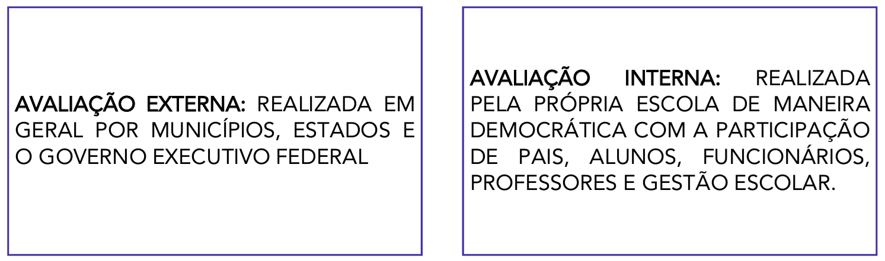

# Capítulo 6 – Avaliação no Processo de Ensino-Aprendizagem

## Considerações Iniciais

O tema da avaliação é, sem dúvida, um dos mais discutidos e, por vezes, controversos no campo educacional. Sua importância é inegável e se manifesta em múltiplas esferas: os sistemas de ensino baseiam suas políticas públicas nos dados coletados por exames em larga escala; as escolas que alcançam bons índices de desenvolvimento, como o IDEB, são aquelas que realizam um monitoramento constante da aprendizagem; e os professores que obtêm os melhores resultados são aqueles que alinham seu planejamento a boas práticas avaliativas.

Dada a sua centralidade, é fundamental compreender que não existe apenas "uma" avaliação. O termo abrange práticas distintas que variam de acordo com dois critérios principais: a **abrangência** (o escopo que ela cobre) e a **finalidade** (o objetivo que ela busca alcançar). É a partir da articulação desses dois critérios que podemos classificar os três grandes tipos de avaliação presentes na educação.

### Os Três Níveis da Avaliação Educacional

A avaliação educacional se divide em três níveis:

1. **Avaliação de Sistemas:** Este é o nível mais amplo. Sua **abrangência** é macro, podendo cobrir todo um sistema de ensino (municipal, estadual ou federal). Sua **finalidade** principal é diagnóstica: levantar dados sobre a qualidade da educação oferecida em larga escala para subsidiar a formulação e a reformulação de políticas públicas. Um exemplo paradigmático no Brasil é o **SAEB (Sistema de Avaliação da Educação Básica)**, que avalia periodicamente os alunos da educação básica para fornecer ao Governo Federal um panorama da aprendizagem em todo o país.
2. **Avaliação da Escola ou Institucional:** Neste nível intermediário, a **abrangência** se restringe a uma única instituição de ensino. Sua **finalidade** é avaliar a escola como um todo, verificando se seu Projeto Político Pedagógico (PPP) está sendo efetivamente aplicado e se seus objetivos estão sendo alcançados. Uma avaliação institucional verdadeiramente democrática deve envolver todos os segmentos da comunidade escolar: pais, alunos, professores, funcionários e a equipe gestora. As decisões e os encaminhamentos resultantes dessa avaliação são, idealmente, discutidos e deliberados no **Conselho Escolar**, o órgão colegiado que representa a instância máxima de participação da comunidade na gestão da escola.
3. **Avaliação da Aprendizagem:** Este é o nível mais específico, ocorrendo no interior da sala de aula. Sua **abrangência** é a turma. Sua **finalidade** é o acompanhamento do processo de ensino-aprendizagem, realizado pelo professor para verificar o que e como seus alunos estão aprendendo. O mais importante é que os resultados dessa avaliação sirvam para **reorientar a prática pedagógica**: ao identificar as dificuldades e os avanços dos estudantes, o professor pode replanejar suas aulas, mudar suas estratégias e buscar novos caminhos para garantir a aprendizagem de todos. Para isso, ele pode utilizar uma variedade de instrumentos, como observações, avaliações escritas, verificação de cadernos e o acompanhamento contínuo.

Os esquemas a seguir ajudam a visualizar a relação entre esses três níveis de avaliação. O primeiro ilustra a hierarquia de abrangência, indo do sistema mais amplo até o foco na sala de aula.

O segundo esquema demonstra como a finalidade de cada avaliação está diretamente relacionada à sua abrangência, desde a formulação de políticas públicas até a reorientação da prática em sala de aula.

### Avaliação Interna e Avaliação Externa: Diferentes Olhares e Funções

Além da classificação por abrangência e finalidade, a avaliação educacional também pode ser categorizada de acordo com a origem de sua proposição e execução. Nesta perspectiva, temos dois grandes tipos: a avaliação externa e a avaliação interna.

#### Avaliação Externa

A **avaliação externa** é aquela concebida e implementada por agentes que não pertencem à rotina da escola, como as secretarias municipais, estaduais ou o Ministério da Educação. Sua principal característica é o uso de **avaliações em larga escala**, que consistem em testes padronizados aplicados a um grande número de estudantes para verificar o desempenho em determinados conteúdos do currículo oficial.

O objetivo primário dessas avaliações é levantar dados que permitam diagnosticar a qualidade dos sistemas de ensino e orientar a formulação de políticas públicas. Exemplos conhecidos são o SAEB e o ENEM, em nível federal, e avaliações específicas de estados e municípios, como o SAERE (Sistema de Avaliação da Educação Básica de Recife). Frequentemente, os resultados dessas avaliações são utilizados em políticas de responsabilização (_accountability_), vinculando o desempenho das escolas a bônus ou rankings.

#### Avaliação Interna

A **avaliação interna**, por sua vez, é aquela planejada e executada pela própria comunidade escolar. Ela pode ter dois focos principais, que correspondem aos níveis institucional e da aprendizagem que já discutimos:

1. **Avaliação Institucional Interna:** É o processo de autoavaliação da escola. Tendo como referência o seu **Projeto Político Pedagógico (PPP)**, a comunidade escolar (gestão, professores, funcionários, pais e alunos) se organiza para refletir sobre suas práticas, identificar seus pontos fortes e suas fragilidades, e traçar planos de melhoria. Idealmente, é um processo democrático, cujas diretrizes e resultados são discutidos e deliberados no Conselho Escolar.
2. **Avaliação da Aprendizagem:** É a avaliação interna por excelência, realizada pelo professor em sua sala de aula. É o acompanhamento contínuo do processo de ensino-aprendizagem, utilizando múltiplos instrumentos para diagnosticar as necessidades dos alunos e reorientar a prática pedagógica.

A principal diferença entre as duas reside no fato de que a avaliação externa busca a padronização para permitir a comparação entre diferentes realidades, enquanto a avaliação interna valoriza a contextualização para compreender e aprimorar uma realidade específica.

Embora possam ser complementares — os dados de uma avaliação externa podem, por exemplo, desencadear um processo de avaliação interna para investigar as causas de um baixo desempenho —, é comum que exista uma tensão entre os dois modelos. A pressão por bons resultados em testes padronizados externos pode levar as escolas a um estreitamento curricular (o chamado "ensinar para o teste"), ofuscando os objetivos mais amplos e humanistas definidos no PPP e trabalhados na avaliação interna.

## A Avaliação na Perspectiva da Construção do Conhecimento

Para aprofundar a compreensão sobre as diversas práticas avaliativas, é útil organizá-las em dois grandes grupos, que se distinguem pelo foco do processo: a **avaliação como construção do conhecimento individual** e a **avaliação como construção do conhecimento em grupo e/ou institucional**. Esta classificação nos ajuda a diferenciar as avaliações que incidem diretamente sobre a trajetória de aprendizagem de cada estudante daquelas que analisam os processos de coletividades, como uma escola ou um sistema de ensino.

### A Avaliação como Construção de Conhecimento Individual

O primeiro grupo abrange as modalidades de avaliação centradas no acompanhamento individual das aprendizagens. São as ferramentas mais diretas do trabalho pedagógico do professor em sala de aula, cujo objetivo é diagnosticar, monitorar e fomentar o processo de construção do saber de cada aluno. As principais propostas dentro deste grupo são:

- Avaliação Somativa (com o objetivo de apenas medir e aferir conhecimentos)
- Avaliação Diagnóstica
- Avaliação Formativa e Autoavaliação

### A Avaliação como Construção de Conhecimento em Grupo e/ou Institucional

O segundo grupo de avaliações expande o foco do indivíduo para o coletivo. Trata-se do acompanhamento em grupo e/ou institucional das aprendizagens e dos processos educativos. Estas avaliações se preocupam em analisar o funcionamento de uma instituição, a eficácia de políticas públicas ou as dinâmicas de avaliação em contextos sociais mais amplos. As principais propostas que se inserem nesta categoria são:

- Avaliação Institucional
- Políticas Educacionais, Meta-avaliação e Educação Comparada
- Propostas de Luckesi, Libâneo, Hoffmann e Perrenoud (Avaliações de grupos e/ou contextos)

A seguir, cada uma dessas propostas será analisada em profundidade, começando pelas avaliações focadas na construção do conhecimento individual.

## Concepções e Críticas

O tema da avaliação, como vimos, se desdobra em múltiplos níveis e funções. Nesta seção, nosso foco se volta para sua dimensão mais ampla: a **avaliação como instrumento de política educacional**. A compreensão deste tema é crucial, pois as avaliações em larga escala têm um impacto direto na formulação de políticas, na alocação de recursos e na própria organização dos sistemas de ensino.

### Concepções das Avaliações em Larga Escala

A partir da década de 1990, alinhado a um movimento global de busca por maior eficiência e accountability na gestão pública, o Brasil passou a adotar de forma sistemática o uso de **testes padronizados** como a principal ferramenta para diagnosticar a educação nacional. Estas avaliações, que correspondem ao que já definimos como **Avaliação de Sistemas** e **Avaliação Externa**, são elaboradas com o objetivo central de levantar dados sobre a qualidade do ensino e a aprendizagem dos alunos em todo o país.

A concepção fundamental que orienta estas políticas é a de que, para melhorar o sistema, é preciso primeiro ter um diagnóstico preciso de seus problemas. A avaliação em larga escala, portanto, é definida da seguinte forma:

> Avaliação em larga escala é o termo utilizado para designar testes padronizados com a finalidade de subsidiar políticas educacionais pelo poder executivo. Dessa forma, a avaliação tem como intuito a melhoria da educação pública no país.

Na prática, isso se traduz em um ciclo de gestão. Por exemplo, se os resultados de avaliações como o SAEB revelam uma queda acentuada no desempenho dos alunos em matemática no 9º ano, esses dados servem de base para que o Ministério da Educação ou as Secretarias Estaduais proponham ações específicas, como a criação de programas de formação continuada para professores dessa disciplina ou a revisão dos materiais didáticos utilizados.

#### Outras Finalidades e Aplicações

Apesar de sua finalidade primária ser o diagnóstico para políticas públicas, alguns desses testes em larga escala assumiram outras funções importantes no sistema educacional brasileiro:

- **Certificação:** O **Encceja** (Exame Nacional para Certificação de Competências de Jovens e Adultos) é utilizado para certificar a conclusão do Ensino Fundamental ou Médio para pessoas que não o fizeram na idade apropriada.
- **Acesso ao Ensino Superior:** O **Enem** (Exame Nacional do Ensino Médio) tornou-se a principal porta de entrada para as universidades públicas e privadas do país.

#### O IDEB e o Uso de Indicadores

Um dos exemplos mais conhecidos da aplicação desses dados é o **Índice de Desenvolvimento da Educação Básica (IDEB)**. O IDEB não é a avaliação em si, mas um indicador de qualidade que combina duas informações: o desempenho dos alunos nas avaliações em larga escala (como o SAEB) e as taxas de fluxo escolar (aprovação e evasão). Embora a criação de um índice numérico para medir algo tão complexo como a qualidade da educação tenha sido alvo de críticas, sua existência se justifica pela necessidade de se ter parâmetros objetivos para monitorar o sistema e referendar o uso de políticas públicas em todo o território nacional.

#### O Uso Indevido dos Dados e a Cultura do Ranqueamento

Apesar da finalidade diagnóstica ser o objetivo oficial, um dos maiores problemas que cercam as avaliações em larga escala é o uso indevido de seus resultados. A mídia tradicional, em particular, frequentemente utiliza os dados públicos de desempenho para criar **ranqueamentos** de escolas, comparando instituições públicas e privadas e gerando listas das "melhores" e "piores" de cada região.

Ressaltamos que esta prática é uma distorção do propósito original da avaliação. A cultura do ranqueamento fomenta uma competição prejudicial entre as escolas, estigmatiza aquelas localizadas em contextos de maior vulnerabilidade social e pode levar à adoção de práticas pedagógicas empobrecidas, como o "ensino para o teste", no qual o currículo é reduzido apenas aos conteúdos que serão cobrados no exame. O objetivo da avaliação de sistemas é subsidiar políticas para a melhoria da equidade e da qualidade do conjunto da rede, e não criar um pódio para poucas escolas.

#### A Base Legal e as Políticas de Responsabilização

A implementação de políticas de avaliação em larga escala pelo governo federal não é uma ação arbitrária, mas encontra amparo e justificativa na **Constituição Federal de 1988**. A Carta Magna estabelece, em seu artigo 206, os princípios sobre os quais o ensino deve ser ministrado, incluindo:

> **Art. 206.** O ensino será ministrado com base nos seguintes princípios:
> 
> I - igualdade de condições para o acesso e permanência na escola;
> II - liberdade de aprender, ensinar, pesquisar e divulgar o pensamento, a arte e o saber;
> III - pluralismo de ideias e de concepções pedagógicas, e coexistência de instituições públicas e privadas de ensino;
> IV - gratuidade do ensino público em estabelecimentos oficiais;
> V - valorização dos profissionais da educação escolar, garantidos, na forma da lei, planos de carreira, com ingresso exclusivamente por concurso público de provas e títulos, aos das redes públicas;
> VI - gestão democrática do ensino público, na forma da lei;
> **VII - garantia de padrão de qualidade.**
> VIII - piso salarial profissional nacional para os profissionais da educação escolar pública, nos termos de lei federal.

Este inciso VII estabelece a **garantia de um padrão de qualidade** como um direito e um dever. Para verificar e promover este padrão em um país de dimensões continentais, a própria Constituição prevê o papel do governo federal. O parágrafo primeiro do artigo 210 afirma que a União exercerá, em matéria educacional, uma função redistributiva e supletiva para garantir a equalização de oportunidades e o padrão mínimo de qualidade, e fará isso mediante **assistência técnica e financeira** aos estados e municípios.

É precisamente o termo **"assistência técnica"** que serve como justificativa legal para a criação e aplicação de sistemas de avaliação nacionais. A lógica é que, para poder prestar assistência e garantir um padrão de qualidade, o governo federal precisa primeiro diagnosticar a situação da educação no país. As avaliações em larga escala são, portanto, concebidas como o principal instrumento para realizar este diagnóstico.

#### A Diversidade de Aplicações nos Sistemas de Ensino

Embora exista um sistema nacional de avaliação, a forma como as políticas avaliativas são utilizadas pode variar, refletindo as diferentes perspectivas políticas de cada governo. Os estados e municípios têm autonomia para criar seus próprios sistemas complementares. O Estado de São Paulo, por exemplo, criou o **IDESP (Índice de Desenvolvimento da Educação do Estado de São Paulo)**, um indicador próprio que dialoga com as escolas de sua rede. Outras unidades da federação podem não ter um índice próprio ou podem desenvolver outros modelos de avaliação, de acordo com suas prioridades políticas e educacionais.

#### A Tendência da Responsabilização (_Accountability_)

Nos últimos anos, uma tendência que tem ganhado força é a implementação de políticas de **responsabilização**, termo traduzido do inglês _accountability_. Esta abordagem representa um passo além do simples diagnóstico, pois busca vincular diretamente os resultados das avaliações em larga escala a consequências para as escolas e seus profissionais.

A premissa é a de que, ao responsabilizar os diretores e professores pelos resultados de aprendizagem dos alunos, cria-se um incentivo para a melhoria da qualidade do ensino. Essa política, que foi amplamente utilizada em contextos como o dos Estados Unidos, se manifesta de duas formas principais:

- **Em caso de resultado negativo:** A escola como um todo pode ser responsabilizada pelo baixo desempenho em testes padronizados, podendo sofrer intervenções administrativas ou ser publicamente estigmatizada. As consequências pedagógicas e administrativas desta abordagem ainda são objeto de intenso debate.
- **Em caso de resultado positivo:** Os agentes públicos podem receber uma bonificação financeira pelos bons resultados alcançados. Diversos municípios e alguns estados no Brasil já tiveram ou têm experiências com essa **política de bonificação**, na qual os professores recebem uma quantia adicional ao seu salário, atrelada ao desempenho dos estudantes em provas específicas.

A implementação de políticas de responsabilização é um dos temas mais polêmicos da educação atual. Se por um lado seus defensores argumentam que ela aumenta a eficiência e o foco nos resultados, por outro, seus críticos alertam para os riscos do estreitamento curricular (ensinar para o teste) e da punição injusta de escolas que atendem populações em maior vulnerabilidade social.

### Críticas às Políticas de Avaliação

As críticas direcionadas às políticas educacionais de avaliação, especialmente ao uso de testes padronizados, geralmente não questionam a necessidade de se ter um diagnóstico do sistema, mas sim **o uso que se faz desses dados** e as concepções que orientam sua aplicação. A discussão se desloca do campo puramente técnico para o campo **filosófico e político**, fazendo perguntas fundamentais sobre as finalidades e as consequências reais dessas avaliações.

As principais críticas podem ser organizadas nos seguintes pontos:

#### A Lacuna entre o Discurso e a Prática

No discurso oficial, a finalidade das avaliações em larga escala é nobre: coletar dados para subsidiar a melhoria da educação através de ações como a formação de professores, o assessoramento técnico às escolas e a formulação de políticas públicas mais eficazes e diferenciadas. No entanto, na prática, muitas vezes se observa uma lacuna entre esses objetivos ideais e sua real efetivação. Com frequência, os dados são utilizados muito mais para cobrar resultados e pressionar as redes de ensino do que para, de fato, garantir o suporte técnico e financeiro necessário para que as escolas, especialmente as mais vulneráveis, possam superar suas dificuldades.

#### A Perversão pelo Ranqueamento

Como já mencionado, um dos efeitos colaterais mais prejudiciais da divulgação pública dos resultados é a **criação de rankings** de escolas pela mídia e pela sociedade em geral. Essa prática distorce completamente a finalidade diagnóstica da avaliação, fomentando uma cultura de competição em vez de colaboração entre as escolas. A preocupação excessiva com os dados quantitativos e a posição no ranking pode levar a consequências pedagógicas negativas, como o estreitamento do currículo (focando apenas no que "cai na prova") e a estigmatização de instituições que atendem alunos em contextos de maior complexidade social.

#### A Redução dos Objetivos Educacionais

Uma crítica fundamental refere-se aos **limites do próprio instrumento avaliativo**. Um teste padronizado, por sua natureza, consegue medir apenas uma parcela restrita do que se entende por uma formação educacional de qualidade. Habilidades e valores essenciais para a formação de cidadãos, como a criatividade, o pensamento crítico, a colaboração, a empatia, a resiliência e a sensibilidade artística, não são contemplados por esses exames. O perigo, portanto, é a redução de todo o complexo processo educativo àquilo que pode ser medido por uma prova. A pontuação em um teste não pode e não deve ser confundida com os objetivos gerais e mais amplos da educação.

#### A Hierarquia Implícita do Currículo

A pergunta "o que se avalia e para que se avalia?" revela uma dimensão de poder na escolha dos conteúdos. As avaliações em larga escala no Brasil, historicamente, concentram-se quase que exclusivamente nas disciplinas de **Língua Portuguesa e Matemática**. A ausência de avaliações com o mesmo peso para áreas como Artes, Educação Física, História ou Filosofia, por exemplo, envia uma mensagem poderosa para o sistema: a de que alguns saberes são mais importantes do que outros. Essa escolha não é neutra; ela estabelece uma hierarquia de valor entre as disciplinas, o que pode levar à precarização e à redução da carga horária das áreas não avaliadas, empobrecendo a formação integral e humanista dos estudantes.

### Meta-avaliação e Educação Comparada

Diante dos intensos debates sobre os benefícios e os problemas das avaliações em larga escala, surge a necessidade de se ter instrumentos para analisar criticamente as próprias políticas avaliativas. Duas ferramentas importantes para essa reflexão são a meta-avaliação e a educação comparada.

A **meta-avaliação** é, de forma simples, **a avaliação da avaliação**. É um processo de segundo nível que não se debruça sobre a aprendizagem dos alunos, mas sobre a qualidade, a validade, a utilidade e as consequências do próprio instrumento avaliativo. Uma meta-avaliação de uma política de avaliação em larga escala faria perguntas como:

- Os objetivos desta avaliação são claros e estão sendo cumpridos?
- O teste mede de fato o que ele se propõe a medir (validade)?
- Os resultados são consistentes e confiáveis (fidedignidade)?
- O uso dos dados está gerando as melhorias pretendidas ou está causando consequências negativas não previstas (como o estreitamento curricular)?

Pensar sobre a avaliação é, portanto, uma necessidade para que se possa verificar os alcances e os limites das políticas em vigor e aprimorá-las constantemente.

Um dos instrumentos mais poderosos para se realizar uma meta-avaliação é a **educação comparada**. Este campo de estudo se dedica a analisar e comparar diferentes sistemas educacionais (entre países, estados ou municípios) para compreender como diferentes contextos e políticas geram resultados distintos. Ao comparar os instrumentos avaliativos utilizados no Brasil com os de outros países, por exemplo, é possível fazer uma análise crítica sobre os alcances e as limitações do modelo nacional e vislumbrar possíveis alternativas.

Tanto a avaliação em larga escala quanto a meta-avaliação e a educação comparada dependem de uma rigorosa **análise de dados e estatísticas educacionais**. Este é o trabalho técnico realizado por órgãos como o INEP, que utiliza métodos estatísticos para tratar as informações coletadas e transformá-las em indicadores que possam subsidiar o debate e a formulação de políticas de forma fundamentada.

