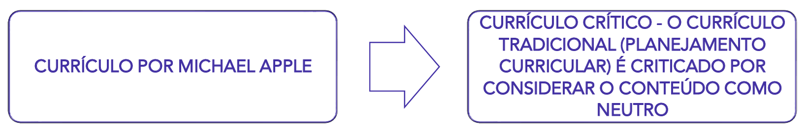

# Capítulo 8 - Currículo: Território de Saberes e Disputas

O conceito de currículo é diretamente influenciado pelas diferentes tendências e concepções pedagógicas que estudamos nos capítulos anteriores. Não é possível discutir "o que" se ensina sem ter como pano de fundo uma ideia de "como", "para quem" e "por que" se ensina. Por essa razão, para compreendermos o debate curricular atual, é útil revisitar brevemente o legado de três grandes correntes:

- A **Pedagogia Tradicional Leiga**, com seu foco no professor e na transmissão de um corpo de conhecimentos tidos como universais, nos mostra que o currículo é uma construção histórica, e não algo natural ou imutável.
- A **Pedagogia Nova**, ao deslocar o centro para o aluno, fomenta a necessidade de um currículo construído a partir da experiência e organizado por projetos de interesse dos estudantes.
- O **Tecnicismo Pedagógico**, por sua vez, introduz no campo curricular uma lógica de eficiência, planejamento e foco em objetivos e resultados mensuráveis.

Essas diferentes visões, que já detalhamos anteriormente, moldaram as diferentes formas de se pensar e organizar o currículo ao longo do tempo.

|Pedagogia Tradicional Leiga|Pedagogia Nova|Tecnicismo Pedagógico|
|---|---|---|
|Memorização de informações. Ambiente disciplinador e controlador. Pouco diálogo entre professor e aluno.|Interesse do estudante. Ensino ativo e não passivo.|O método é imposto de cima para baixo. Só é educação aquilo que está definido nos objetivos e pode ser avaliado. Ênfase em certificação e exames.|

## O que é Currículo?

Afinal, o que é currículo? A resposta a essa pergunta varia enormemente de acordo com a concepção pedagógica que se adota.

Do ponto de vista da pedagogia tradicional, o currículo é frequentemente visto como sinônimo do **conjunto de conteúdos** a serem ensinados pelos professores. Essa herança se manifesta em nossa experiência comum com a educação formal e em termos como **grade curricular**, **ementas de disciplinas**, **planos de ensino**, boletins e exames. Nesta visão, o currículo é, essencialmente, a lista de matérias a serem vencidas. Contudo, embora esses elementos façam parte do currículo, a teoria curricular contemporânea entende que esta é uma definição incompleta e reducionista.

O campo de estudo do currículo hoje é muito mais amplo. Uma definição atual e abrangente o entende como:

> O currículo é definido como as experiências de aprendizagem planejadas e guiadas e os resultados de aprendizagem não planejados, formulados através da reconstrução sistemática do conhecimento e da experiência, sob os auspícios da escola, para o crescimento contínuo e deliberado da competência pessoal e social do aluno.

Vamos analisar as partes desta densa definição. Ela nos diz que o currículo envolve:

1. **Experiências planejadas e guiadas:** Esta é a parte mais óbvia, o que chamamos de **currículo formal ou prescrito**. É o que está nos documentos oficiais, nos planos de aula, nos livros didáticos.
2. **Resultados de aprendizagem não planejados:** Esta é uma parte crucial. Ela reconhece que os alunos não aprendem apenas o que o professor planejou ensinar. Todas as experiências vividas no ambiente escolar educam. Isso nos leva ao conceito de **currículo oculto**.

O **currículo oculto** refere-se a tudo aquilo que a escola ensina de forma implícita, através de suas rotinas, regras, rituais, da organização do espaço e do tempo e, principalmente, das relações interpessoais. Os alunos aprendem sobre hierarquia na forma como o diretor trata o professor; aprendem sobre competição através do sistema de notas; aprendem normas sociais no recreio. Esses aprendizados, embora não estejam em nenhum plano de ensino, têm um impacto profundo na formação dos estudantes.

Portanto, a concepção contemporânea de currículo é muito mais vasta: ela abrange a totalidade das experiências educativas que os alunos vivenciam sob a responsabilidade da escola.

## A Influência das Tendências Pedagógicas no Currículo

O tema do currículo, como o conhecemos hoje, é diretamente influenciado pelas concepções pedagógicas que o definem. A forma como uma sociedade organiza os saberes a serem ensinados na escola revela suas prioridades, seus valores e seu projeto de futuro.

Na **Pedagogia Tradicional Leiga**, por exemplo, o currículo era visto como um conjunto de disciplinas a serem transmitidas, sem um grande planejamento ou uma discussão sobre a utilidade social daquele conhecimento. A justificativa para ensinar determinados conteúdos era, muitas vezes, a vaga recomendação de que eram "bons" para o desenvolvimento da memória e do raciocínio.

Foi somente com a **Escola Nova** e o pensamento de teóricos como John Dewey que o currículo passou a ser um objeto de estudo e de questionamento. A proposta progressivista inverteu a lógica tradicional: em vez de partir dos conteúdos, o currículo deveria partir dos problemas e interesses dos alunos. O conhecimento das disciplinas passaria a ser uma ferramenta para que os estudantes pudessem compreender e resolver questões de sua vida cotidiana, tornando a aprendizagem uma experiência direta com a realidade.

### O Modelo Tecnicista de Ralph Tyler

Como uma reação à percebida falta de sistematização da Escola Nova e impulsionado pela aceleração da industrialização nos Estados Unidos a partir de 1930, surgiu o **tecnicismo pedagógico** no campo curricular. Sob a influência do "eficientismo" e do taylorismo, a escola passou a ser vista como uma organização que deveria formar trabalhadores produtivos de forma rápida e eficiente.

O maior expoente desta corrente foi **Ralph Tyler**, que em sua obra "Princípios Básicos de Currículo e Ensino" (1949) desenvolveu um modelo linear e prescritivo que se tornou extremamente influente, inclusive no Brasil. O "modelo tyleriano" propunha que o currículo deveria ser planejado detalhadamente por especialistas e aplicado de forma uniforme pelos professores. Essa concepção deu origem ao que hoje chamamos de **Currículo Formal ou Prescrito**, e sua implementação se dava em quatro etapas sequenciais:

1. **Definição de Objetivos:** Quais os objetivos educacionais que a escola deve atingir?
2. **Seleção das Experiências Escolares:** Que experiências de aprendizagem devem ser oferecidas para alcançar esses objetivos?
3. **Organização das Experiências Escolares:** Como organizar essas experiências de forma eficaz?
4. **Avaliação:** Como podemos verificar se os objetivos foram alcançados?

Nesta lógica, a avaliação ocupa um lugar central e determinante. O sucesso do currículo é medido unicamente através da avaliação do desempenho dos alunos. Se os estudantes atingem os objetivos previamente definidos, o currículo é considerado eficaz. Como consequência, só é considerado currículo aquilo que pode ser objetivamente medido e avaliado.

### As Críticas ao Modelo Tecnicista

O modelo de Tyler, apesar de sua aparente lógica e organização, é alvo de severas críticas. Ao colocar o foco exclusivo na avaliação do desempenho do aluno para validar um currículo prescrito por especialistas, ele gera uma série de consequências negativas:

- **Culpabilização do aluno:** Se o estudante não atinge os objetivos, a falha é atribuída a ele, e não ao currículo ou ao método. Em nenhum momento o processo em si é colocado em discussão.
- **Cultura da competitividade:** O foco em notas e resultados promove o ranqueamento dos alunos e um clima escolar de competição, em detrimento da cooperação.
- **Exclusão:** O modelo, por sua natureza padronizada, é incapaz de ensinar a todos, pois não considera a diversidade de saberes, ritmos e contextos dos estudantes. O foco se desloca da aquisição do conhecimento para o desempenho nas avaliações.

### O Desafio Contemporâneo: Articulando o Comum e o Local

A principal crítica a essa forma de pensar o currículo é a sua **verticalização**. A ideia de que um conjunto de especialistas pode definir, de cima para baixo, as experiências escolares para um país tão diverso e desigual como o Brasil acarreta imensos problemas sociais e educacionais, pois desconsidera as ricas características culturais das diferentes comunidades.

É neste contexto que se insere o debate atual sobre a **Base Nacional Comum Curricular (BNCC)**. A BNCC busca superar o modelo puramente prescritivo ao definir um conjunto de **aprendizagens essenciais** que todos os alunos têm o direito de desenvolver. No entanto, ela não é o currículo em si. A Base não anula a autonomia da escola, expressa em seu **Projeto Político Pedagógico (PPP)**.

O desafio contemporâneo da Didática e do Currículo é justamente este: articular a base nacional comum com a realidade local. Cabe a cada escola, a partir de seu PPP e em diálogo com sua comunidade, definir os caminhos, os projetos e as metodologias para trabalhar as aprendizagens essenciais de forma que elas se conectem com a cultura, os saberes e as identidades locais, construindo um currículo que seja, ao mesmo tempo, comum a todos e relevante para cada um.

## As Principais Definições de Currículo

As diferentes formas de se definir o que é currículo estão diretamente relacionadas às diferentes visões de mundo e concepções pedagógicas. Não existe "uma" definição de currículo, mas sim um campo de disputas teóricas. Para organizar este debate, apresentaremos quatro grandes abordagens que marcaram a história do pensamento curricular: o planejamento curricular (ou currículo tradicional), a visão crítica de Michael Apple (conhecimento e poder), a visão crítica de Michael Young (conhecimento e contexto social) e o multiculturalismo (ou currículo pós-crítico).

### O Planejamento Curricular e a Racionalidade Tyleriana

Por um longo período, especialmente durante o auge da influência tecnicista, o conceito de **planejamento curricular** se confundiu com a própria noção de currículo. Essa fusão se deve, em grande parte, à enorme influência do modelo proposto por Ralph Tyler, que colocava a ênfase na planificação racional e em etapas sequenciais. A "racionalidade tyleriana" se tornou tão dominante que, de uma forma ou de outra, quase todas as propostas curriculares oficiais no Brasil, sejam elas estaduais ou do próprio Ministério da Educação, foram marcadas por sua lógica.

Por essa razão, é fundamental compreender bem a forma de pensar de Tyler, pois sua estrutura, ainda que com outros nomes, continua presente em muitos documentos e práticas atuais. O modelo consiste em um processo linear, de cima para baixo, no qual especialistas definem o que deve ser ensinado e como o sucesso do ensino será medido.

Em detalhes, cada uma das etapas:

1. **Definição de Objetivos:** O ponto de partida é a definição de metas e objetivos claros, específicos e, principalmente, mensuráveis. Os objetivos são definidos em termos da mudança de comportamento esperada no estudante. A preferência por objetivos específicos em detrimento de objetivos gerais se justifica por facilitar a avaliação. Por exemplo, em vez de um objetivo geral como "Desenvolver o raciocínio lógico", o modelo tyleriano prefere um objetivo específico como "Analisar problemas que envolvam proposições lógicas", pois este último pode ser verificado de forma mais direta em um teste.
2. **Seleção das Experiências Escolares:** Uma vez definidos os objetivos, selecionam-se as experiências de aprendizagem que devem ser proporcionadas aos alunos para que eles os alcancem. Embora o planejamento seja centralizado, esta etapa prevê uma certa margem de atuação para o professor na escolha de atividades específicas, desde que elas estejam alinhadas aos objetivos.
3. **Organização das Experiências Escolares:** Nesta fase, as experiências selecionadas são organizadas de forma a garantir a integração entre as áreas, a sequência lógica dos conteúdos e a continuidade da aprendizagem ao longo do tempo. Aqui, Tyler demonstra uma certa influência da Escola Nova, ao se preocupar com a psicologia do estudante e com a necessidade de uma organização que faça sentido para o aprendiz.
4. **Avaliação do Currículo:** A etapa final é a avaliação, que está estritamente condicionada aos objetivos específicos propostos no início. Através de instrumentos de medição, busca-se verificar se as metas foram atingidas e se as mudanças de comportamento esperadas ocorreram.

#### O Legado e a Terminologia Atual

Essa sequência lógica ainda é muito visível em diversas redes de ensino no Brasil. As secretarias de educação propõem um currículo com objetivos e habilidades a serem desenvolvidos, e, ao final de um ciclo, aplicam uma **avaliação em larga escala** (como a antiga Prova Brasil) para verificar se os objetivos foram alcançados.

A terminologia utilizada nos documentos curriculares atuais, embora mais moderna, muitas vezes reflete a mesma estrutura tyleriana.

Essa abordagem, como já discutimos, é criticada por sua verticalidade e por desconsiderar a diversidade cultural e as desigualdades sociais. No entanto, compreender sua lógica é essencial para analisar criticamente grande parte dos currículos oficiais ainda em vigor.

#### A Relação Cíclica entre Objetivos e Avaliação

Dentro da Racionalidade Tyleriana, a definição de objetivos e a avaliação do currículo não são apenas etapas de um processo, mas mantêm uma relação cíclica e de mútua dependência. O autor define que um currículo só pode ser considerado útil e eficaz se ele produzir **mudanças de comportamento** observáveis nos alunos. Sendo assim, a avaliação se torna o instrumento indispensável para verificar se essas mudanças, previamente estabelecidas nos objetivos, de fato ocorreram.

Em termos atuais, essa lógica se mantém: a definição dos objetivos do currículo (as aprendizagens esperadas) só se valida através da verificação do que os alunos de fato aprenderam. Portanto, a relação entre os objetivos curriculares e a avaliação do currículo é circular. Os objetivos, especialmente os específicos, criam a necessidade de serem avaliados. A avaliação, por sua vez, gera os dados que informam sobre o nível de alcance desses objetivos em determinada área do conhecimento, conteúdo ou competência.

#### As Consequências Críticas: A Culpabilização pelo Fracasso

A questão crítica fundamental deste modelo não está no ciclo em si, mas naquilo que ele deixa de fora da análise. No modelo de Tyler, quando os resultados da avaliação são negativos, a responsabilidade recai invariavelmente sobre os pontos finais do processo: os alunos e a escola. Em nenhum momento o próprio currículo prescrito é seriamente questionado. A pergunta sobre como seria possível aplicar um mesmo currículo padronizado a escolas inseridas em comunidades tão diversas raramente é feita dentro desta lógica.

Essa tendência à **culpabilização** dos alunos e das escolas pelo desempenho insatisfatório em avaliações ainda é observada na atualidade. Muitas políticas educacionais de **"responsabilização"** (_accountability_) utilizam os resultados de avaliações em larga escala para pressionar e, por vezes, punir os profissionais da educação, sem um questionamento proporcional sobre a adequação do currículo imposto a uma enorme diversidade de contextos e realidades de ensino.

Esta falha em questionar a suposta neutralidade do currículo nos leva ao próximo ponto de análise. O caminho para superar o modelo de Tyler exige compreender como o poder, tanto político quanto econômico, influencia de forma decisiva na determinação do que é considerado um conhecimento escolar válido.

#### Definição de Planejamento Curricular

Diante dos aspectos do modelo de Tyler, é possível estabelecer uma definição concisa do que se entende por planejamento curricular em sua perspectiva mais tradicional:

> (...) poderíamos definir o planejamento curricular como a criação e aplicação de critérios para a formulação de um plano eficaz de ensino, constituído de objetivos e conteúdos, assim como de orientações didáticas e critérios de avaliação. Planejar seria definir metas e estabelecer formas de atingi-las de maneira eficaz com economia de tempo e recursos.

Analisando esta definição, percebe-se que o planejamento curricular é concebido como uma proposta da gestão educacional, na qual as administrações centrais dos sistemas de ensino buscam organizar a finalidade educativa através de um **conteúdo programático** a ser seguido pelos docentes.

A inclusão de **orientações didáticas e critérios de avaliação** predefinidos evidencia a **verticalidade** deste modelo. Na grande maioria das vezes, o plano é aplicado "de cima para baixo", com os professores em uma posição de subordinação às prescrições de objetivos e conteúdos que devem ser executados em sala de aula.

Um exemplo hipotético seria um município que, após reuniões com especialistas e diretores, redige um documento curricular com os objetivos e conteúdos para cada ano do ensino fundamental. Os professores da rede, então, recebem este documento junto com um caderno de orientações didáticas e são instruídos a executar a proposta.

#### Os Níveis de Planejamento no Contexto Educacional

É fundamental não confundir o Planejamento Curricular com outros níveis de planejamento. Cada um possui uma abrangência e um foco específico.

- **Planejamento Educacional:** É o nível mais amplo (macro), referindo-se ao plano executado por todo um sistema de ensino. É a proposta de um país, estado ou município que estabelece a visão e as diretrizes gerais para a educação em seu território. O Plano Nacional de Educação (PNE) é o principal exemplo.
- **Planejamento Escolar (ou da Escola):** É o plano de nível meso, executado por toda a comunidade de uma escola. É a organização das ações da instituição para um determinado período, traduzindo as diretrizes mais amplas do sistema para a sua realidade específica. O Projeto Político Pedagógico (PPP) é o principal instrumento do planejamento escolar.
- **Planejamento Curricular:** Situa-se também no nível meso e se refere à organização das experiências educativas planejadas que serão oferecidas aos estudantes. Pode ser definido pela rede de ensino ou pela própria escola, detalhando os conteúdos, competências e vivências a serem trabalhados. A Base Nacional Comum Curricular (BNCC) é um documento de referência para este planejamento.
- **Planejamento de Ensino:** É o nível micro, sendo a ação de planejamento executada diretamente pelos professores no cotidiano escolar. É a organização do trabalho docente para uma turma ou um conjunto de turmas ao longo de um período (bimestre, semestre, ano).
- **Plano de Aula:** É o nível mais específico (micro), detalhando o planejamento de uma única aula ou de uma sequência curta de aulas.

A tabela a seguir resume as cinco definições para facilitar a diferenciação.

| Planejamento  Educacional              | Planejamento Escolar                          | Planejamento Curricular                                          | Planejamento de Ensino                             | Plano de Aula                           |
| -------------------------------------- | --------------------------------------------- | ---------------------------------------------------------------- | -------------------------------------------------- | --------------------------------------- |
| Plano executado pelo sistema de ensino | É a aplicação da proposta educativa da escola | Organização das experiências escolares oferecidas aos estudantes | Ação executada pelos docentes no cotidiano escolar | É o planejamento de 1 (uma) aula apenas |

### Conhecimento e Poder: O Currículo Crítico de Michael Apple

No final da década de 1970, em um cenário de intensa efervescência das teorias críticas, o sociólogo norte-americano **Michael Apple** surge como uma das vozes mais influentes da chamada "Nova Sociologia da Educação". Seu trabalho representa uma ruptura radical com a perspectiva técnica e supostamente neutra do currículo, encarnada no modelo de Ralph Tyler. Se a pergunta de Tyler era _como_ organizar o currículo de forma eficiente, a pergunta de Apple é eminentemente política: **de quem é o conhecimento que está no currículo e que interesses sociais, econômicos e políticos ele serve?**

A premissa central de sua teoria é a de que a relação entre **conhecimento e poder** é indissociável. O currículo escolar nunca é um conjunto neutro, universal e inquestionável de saberes. Pelo contrário, o processo de selecionar, organizar e avaliar o que é considerado um conhecimento legítimo é um ato político, profundamente implicado na manutenção das estruturas de poder da sociedade.

#### O Currículo como Instrumento de Hegemonia

Apoiando-se em conceitos do pensamento neo-marxista, Apple argumenta que o currículo é um dos mais eficientes instrumentos para a construção da **hegemonia**. A hegemonia não é apenas a dominação pela força, mas a capacidade da classe dominante de fazer com que sua visão de mundo, seus valores e seus interesses sejam vistos por toda a sociedade como "senso comum", como a forma natural e única de se ver a realidade.

O currículo escolar desempenha um papel crucial nesse processo ao apresentar o conhecimento da classe dominante como o **"conhecimento oficial"**. A história dos grandes generais e presidentes, a literatura dos cânones europeus, a ciência focada na aplicação tecnológica para o mercado — tudo isso é selecionado e organizado como o saber universal que todos devem aprender. Em contrapartida, outros saberes são sistematicamente omitidos, silenciados ou considerados de menor valor.

Os saberes de povos indígenas sobre a natureza, o conhecimento histórico e cultural das comunidades quilombolas, as tradições dos povos ciganos ou mesmo as práticas culturais das periferias urbanas são exemplos de conhecimentos que, por não pertencerem ao universo da ideologia dominante, são invalidados ou folclorizados pelo currículo escolar.

#### As Múltiplas Faces do Currículo

Para analisar como essa hegemonia opera, a teoria crítica desdobra o currículo em três dimensões:

- **Currículo Formal (ou Prescrito):** É o currículo oficial, o "discurso" do Estado e dos especialistas, expresso em documentos como a LDB, a BNCC e as propostas curriculares das redes de ensino. É a arena da disputa política explícita sobre o que deve ser ensinado.
- **Currículo Real (ou em Ação):** É o que de fato acontece na sala de aula, o "currículo vivido". Ele nunca é uma simples aplicação do currículo formal. É um espaço de negociação, de reinterpretação e, por vezes, de resistência, onde professores e alunos interagem e dão novos significados ao conhecimento oficial.
- **Currículo Oculto:** É talvez a dimensão mais poderosa. Refere-se a tudo aquilo que a escola "ensina" sem parecer estar ensinando. São os valores, as normas e as atitudes transmitidos de forma implícita através das rotinas (o sinal que rege o tempo), da arquitetura (a sala do diretor em posição de destaque), das regras (o que é considerado um comportamento "adequado") e das relações sociais. É no currículo oculto que os alunos aprendem sobre competição (pelo sistema de notas), sobre hierarquia e, muitas vezes, sobre o seu "lugar" na sociedade.

#### A Influência dos Múltiplos Contextos

A análise curricular crítica proposta por Apple exige que se compreenda que o que acontece na escola não é determinado apenas por fatores internos. O currículo é o resultado da influência de uma série de contextos aninhados, que se determinam mutuamente.

O exemplo de uma escola de periferia ilustra perfeitamente essa teia de determinações. O **currículo real** dessa escola pode ser artificial e desvinculado da vida dos alunos. Isso não acontece por acaso, mas pela confluência de múltiplos contextos:

- **O contexto da escola:** Professores com baixos salários e pouca formação, reflexo de **políticas nacionais e estaduais** de desvalorização da carreira docente.
- **O contexto do bairro:** Uma realidade de violência e falta de oportunidades que molda as expectativas e os interesses dos alunos.
- **O contexto da cidade:** Uma política educacional municipal elitista, que concentra os melhores recursos nas áreas centrais e negligencia as escolas periféricas.

Todas essas determinações contextuais se somam para produzir um currículo que, na prática, pode acabar por reforçar o ciclo de exclusão. A análise de Apple, portanto, nos fornece as ferramentas para desnaturalizar o currículo e questionar criticamente as relações de poder que definem o que é ensinado – e o que é deixado de fora – nas escolas.

### Conhecimento e Contexto Social: A Crítica de Michael Young

Contemporâneo ao movimento de Michael Apple nos Estados Unidos, o sociólogo britânico Michael Young (1926-2022) foi uma figura central na inauguração dos estudos de currículo dentro da chamada **Nova Sociologia da Educação** na Europa. Assim como Apple, Young foi um crítico contundente do modelo de currículo prescrito e técnico de Ralph Tyler. Ele argumentava que a racionalidade tyleriana, com sua aparência de objetividade e neutralidade, na verdade servia para referendar os saberes da classe dominante em detrimento de outras formas de conhecimento.

Sua contraposição ao modelo de "conhecimento como objetivo" o levou a propor uma nova concepção sobre a natureza do saber escolar.

#### O Conhecimento como Construção Social

Para Michael Young, o conhecimento nunca é objetivo ou neutro. Pelo contrário, ele é sempre **condicionado e restrito segundo os determinantes sociais**. Isso significa que o que uma sociedade considera como "conhecimento válido" não é um reflexo de uma verdade absoluta, mas sim o resultado de um processo social no qual alguns saberes são legitimados e elevados a um status superior, enquanto outros são rejeitados, ignorados ou considerados inferiores.

O conhecimento, portanto, é construído na interação entre os sujeitos. A partir dessa premissa, Young argumenta que, em princípio, toda forma de conhecer é legítima, especialmente se ela se propõe à libertação humana. Esta visão rejeita qualquer hierarquia _a priori_ que coloque o conhecimento acadêmico como inerentemente superior a outras formas de conhecimento humano, como os saberes práticos, os saberes da experiência ou os saberes das culturas populares.

#### As Críticas à Prática Curricular Tradicional

A partir dessa concepção de conhecimento, Young enumera uma série de críticas à forma como o currículo é tradicionalmente formulado e praticado nas escolas, todas alinhadas à desconsideração de outras formas de saber:

- **Valorização da linguagem escrita sobre a linguagem oral:** O currículo escolar historicamente privilegia a cultura letrada, desvalorizando a riqueza e a complexidade das culturas orais, que são a principal forma de transmissão de conhecimento em muitas comunidades.
- **Desconsideração dos conhecimentos prévios dos alunos:** A escola frequentemente ignora os saberes que os alunos trazem de seu meio social, tratando-os como uma "folha em branco" a ser preenchida pelo conhecimento acadêmico, o que gera um sentimento de alienação.
- **Disciplinas desvinculadas da vida cotidiana:** Os conteúdos são apresentados de forma abstrata e fragmentada, sem conexão com a realidade e os problemas concretos vividos pelos estudantes.
- **Ênfase no ensino e na avaliação individual:** A prática escolar, ao focar quase que exclusivamente no desempenho individual, reforça os valores capitalistas de individualismo e competição, em detrimento da colaboração e da construção coletiva do saber.

#### Ações para um Currículo Contextualizado

Como contraponto a essas críticas, a teoria de Young aponta para a necessidade de se construir um currículo que leve em consideração o contexto escolar e social do aluno. Isso se traduz em um conjunto de ações positivas que buscam reconectar a escola com a vida.

Isso implica em:

- **Valorizar a cultura oral** como um elemento importante na construção das identidades e como um ponto de partida para a aprendizagem da cultura escrita.
- **Considerar os conhecimentos que os alunos trazem** de seu meio social para estabelecer um diálogo produtivo com o conhecimento acadêmico.
- Garantir que as **disciplinas tenham conexão com a vida social** e o cotidiano do aluno, tornando a aprendizagem mais significativa.
- **Possibilitar outras formas de ensino e avaliação** que sejam em grupo ou coletivas, a fim de favorecer valores de cooperação e solidariedade.

A proposta de Michael Young, portanto, nos convida a repensar radicalmente o que consideramos como conhecimento escolar, defendendo um currículo que seja menos um instrumento de imposição cultural e mais um espaço de diálogo entre os diferentes saberes que constituem a rica e diversa experiência humana.

### Multiculturalismo: O Currículo das Identidades e da Diferença

O **multiculturalismo** é, em sua origem, um movimento político e social de grupos desprestigiados que reivindicam o reconhecimento de suas culturas singulares. Ganhando força especialmente nos Estados Unidos a partir dos movimentos por direitos civis, como o movimento negro e o movimento feminista, e posteriormente com o movimento LGBTQIA+, ele se constituiu como um contundente questionamento à ideia de uma cultura nacional homogênea — em geral, branca, masculina, heterossexual e europeia — que se apresentava como universal.

Esta corrente política trouxe para o debate público discussões que antes ficavam, em grande parte, restritas ao campo da **Antropologia**. Foi a Antropologia que consolidou os princípios de que não existe cultura superior ou inferior e de que não há hierarquia entre as diferentes formas de viver, pensar e construir a vida no mundo. O multiculturalismo transformou esses princípios acadêmicos em uma bandeira de luta política, levantando questões incômodas sobre a padronização cultural: _Por que a cultura europeia é dominante? Por que há um privilégio da representação branca na política institucional?_.

#### O Impacto no Currículo: Para Além da Questão de Classe

Inevitavelmente, todos esses questionamentos adentraram o campo da educação e exigiram um novo paradigma para se pensar a organização curricular. A grande contribuição do multiculturalismo para a teoria curricular foi a de mostrar que o problema do currículo não era apenas uma questão de _acesso_ ou de _classe social_, como apontavam as teorias críticas anteriores.

As questões de **gênero, raça e sexualidade**, levantadas pelos movimentos feminista, negro e LGBTQIA+, não poderiam ser respondidas apenas com a ampliação do acesso à escola ou com uma análise puramente econômica. O movimento multiculturalista passou a questionar a própria **forma e o conteúdo** do que era ensinado. Não bastava, por exemplo, garantir o acesso das mulheres à universidade; era preciso questionar como as crenças machistas e a história contada pela perspectiva masculina perpassavam todo o currículo, e lutar para que as experiências e os saberes das mulheres fossem incluídos.

#### As Teorias Pós-Críticas do Currículo

Dentro da teoria curricular, esta abordagem influenciada pelo multiculturalismo ficou conhecida como **teoria pós-crítica**.

O uso do prefixo "pós" é significativo. Ele indica que esta vertente veio **"depois"** das teorias críticas de autores como Michael Apple e Michael Young. O "pós" sinaliza uma crítica às próprias teorias críticas, que, apesar de seu avanço ao politizar o currículo, ainda se concentravam excessivamente na categoria de classe social, por vezes deixando em segundo plano outras formas de poder e opressão.

As teorias pós-críticas, inseridas em uma visão de mundo **pós-moderna** e pós-estruturalista, deslocam o foco da análise. Em vez de se concentrarem nas grandes estruturas econômicas, elas se voltam para as questões de **identidade, diferença, subjetividade e discurso**. O currículo passa a ser visto como um campo de luta pela representação, onde diferentes identidades buscam o direito de se verem representadas e de terem suas culturas e saberes legitimados. A afirmação da **diferença** como algo a ser celebrado, e não tolerado ou assimilado, torna-se a base do movimento.

## Classificação das Teorias do Currículo

Após explorarmos as definições de currículo a partir de diferentes autores e movimentos, é útil agora sistematizar essas visões em uma estrutura de classificação. Uma das mais utilizadas em concursos e no debate acadêmico é a proposta por **Tomaz Tadeu da Silva**. É importante notar que esta classificação não apresenta teorias inteiramente novas, mas sim uma nova forma de organizar e analisar criticamente as correntes que já estudamos, revelando suas razões e seus pressupostos fundamentais.

### As Teorias Tradicionais ou Acríticas

A primeira grande categoria na classificação de Tomaz Tadeu da Silva é a das **Teorias Tradicionais ou Acríticas**. Este grupo reúne um conjunto de abordagens que, apesar de suas diferenças, partilham de uma característica central: elas não questionam o currículo, mas buscam desenvolver formas de torná-lo mais eficiente. A pergunta que as move não é "por que _este_ conhecimento?", mas sim "como podemos ensinar _este_ conhecimento da melhor forma?".

#### Características Gerais

Essas teorias são influenciadas principalmente pelo modelo técnico de Ralph Tyler e podem ser descritas como propostas curriculares **tecnocráticas e prescritas "de cima para baixo"**. Nelas, especialistas em educação definem o que deve ser ensinado, e cabe às escolas e aos professores aplicar esse plano. A preocupação central está na organização da aprendizagem e na assimilação dos conteúdos pelos alunos.

Fundamentalmente, o **conhecimento é tratado como neutro, verdadeiro e inquestionável**, pois é visto como científico e objetivo. Por não considerarem a influência da cultura e da ideologia na composição de suas propostas, são classificadas como **acríticas**. Frequentemente, a seleção dos conteúdos a serem aplicados tem como finalidade a adaptação dos estudantes ao **mercado de trabalho**.

Dentro desta categoria, podemos identificar diferentes ênfases:

- **O Foco em Objetivos e Avaliações:** O **planejamento curricular**, nesta perspectiva, é classificado como uma teoria tradicional. Isso se deve ao fato de que a maior parte destes planejamentos se concentra na definição de objetivos de aprendizagem e na posterior avaliação para verificar se foram alcançados. A preocupação maior está na eficiência da aplicação dos conteúdos, e não na pertinência da escolha desses conteúdos para os estudantes.
- **A Visão das Disciplinas Acadêmicas (incluindo Dewey):** De forma mais surpreendente, Tomaz Tadeu da Silva argumenta que mesmo teorias progressistas, como as de John Dewey, podem ser consideradas tradicionais _no que tange ao currículo_. A razão para isso é que, ao centrar sua preocupação na psicologia do estudante e em seus interesses, a proposta de Dewey não avança para uma problematização mais profunda da cultura e da ideologia que determinam por que certas experiências e conhecimentos são considerados mais válidos que outros na sociedade.

Em suma, o que une todas essas abordagens sob o rótulo de "tradicionais" ou "acríticas" é a sua incapacidade de questionar o status do conhecimento e de analisar as relações de poder que estão por trás de toda e qualquer seleção curricular.

### As Teorias Críticas

Em oposição direta ao grupo anterior, as **Teorias Críticas** do currículo representam uma ruptura radical com a ideia de neutralidade. Elas não estão preocupadas em encontrar a forma mais eficiente de transmitir um currículo já existente, mas sim em questionar profundamente esse mesmo currículo. A pergunta central que as move é: **por que este conhecimento é considerado importante e quais relações de poder estão por trás dessa escolha?**

As teorias críticas, portanto, trazem para o centro do debate curricular as questões da **cultura e da ideologia**. Elas partem do princípio de que a cultura e o contexto social são elementos fundamentais na composição e organização dos saberes escolares. O estudo dos componentes ideológicos na seleção, organização e avaliação dos conteúdos é um fator central para esses autores. O conhecimento curricular nunca é visto como neutro, mas sim como uma **construção cultural, política, ideológica e econômica**.

#### Os Pilares do Pensamento Crítico

A partir do esquema acima, podemos detalhar os pilares que sustentam esta abordagem:

- **Cultura e Ideologia como Foco Central:** As teorias críticas analisam o currículo como um campo de luta cultural. Elas entendem que o currículo é sempre uma seleção de um universo muito mais amplo de saberes, e que essa seleção é orientada por uma ideologia dominante. Como consequência, todo conhecimento presente no currículo é visto como **parcial**, representando os interesses e a visão de mundo de determinados grupos sociais em detrimento de outros.
- **Influência Marxista e a Luta por Igualdade:** Muitas dessas teorias se baseiam em um referencial marxista para analisar como o currículo atua na reprodução das desigualdades de classe. No entanto, elas vão além de uma visão puramente reprodutivista, ao considerarem a escola também como um espaço de contradição e de **resistência**, onde a luta por **igualdade** pode e deve acontecer.
- **Os Principais Expoentes:** Como vimos detalhadamente nas seções anteriores, os principais representantes desta corrente são justamente os teóricos críticos como **Michael Apple e Michael Young**. Suas análises sobre a relação entre "conhecimento e poder" e sobre o "conhecimento e o contexto social" são exemplos paradigmáticos de uma abordagem crítica, que busca desnaturalizar o currículo e revelar as forças sociais que o produzem.

### As Teorias Pós-Críticas

As **Teorias Pós-críticas** do currículo representam uma virada no pensamento crítico, sendo profundamente influenciadas pela tradição filosófica conhecida como **pós-moderna** e pós-estruturalista. O prefixo "pós" é fundamental aqui: ele indica um movimento que vem "depois" das teorias críticas (de Apple e Young, por exemplo), e que, em certa medida, critica as próprias teorias críticas. A crítica é que, ao se concentrarem excessivamente na categoria de classe social, as teorias críticas teriam, por vezes, negligenciado outras formas de poder e opressão.

As teorias pós-críticas, portanto, expandem o campo de análise. Elas argumentam que o poder na sociedade não se manifesta apenas através da economia, mas também através da cultura, do discurso e da linguagem. O currículo, nessa visão, é um campo de luta onde diferentes identidades são produzidas, legitimadas ou silenciadas.

#### Os Pilares do Pensamento Pós-Crítico

A partir do esquema acima, podemos detalhar os pilares que sustentam esta abordagem:

- **Centralidade no Multiculturalismo:** As teorias pós-críticas dialogam diretamente com o **multiculturalismo**. Elas questionam a existência de uma cultura única e hegemônica e defendem que o currículo deve ser um espaço para a convivência e o reconhecimento das diferentes culturas que compõem uma sociedade.
- **Foco em Identidade, Alteridade e Diferença:** O eixo da análise se desloca do conhecimento "em si" para os efeitos que o conhecimento produz nos sujeitos. Os conceitos-chave são:
    - **Identidade:** O currículo é visto como um artefato que participa ativamente da construção das identidades dos estudantes.
    - **Alteridade:** A preocupação com a forma como o currículo representa o "outro", aquele que é diferente da norma (étnica, sexual, de gênero).
    - **Diferença:** A diferença não é vista como um problema a ser tolerado, mas como uma potência a ser afirmada.
- **Teorias de Base:** A força das teorias pós-críticas vem de sua articulação com movimentos sociais e teóricos que lutam pelo reconhecimento de grupos com pouca visibilidade na sociedade. Os principais são os **feminismos, a educação para as relações étnico-raciais e os estudos sobre gênero e sexualidade (LGBTQIA+)**.

#### Implicações para a Prática Curricular

A perspectiva pós-crítica implica em uma mudança radical na forma de se pensar e fazer o currículo. Não se trata mais apenas de garantir o acesso de todos ao mesmo conhecimento, mas de questionar o próprio conhecimento que está sendo oferecido.

- Uma **análise feminista do currículo**, por exemplo, não se contenta em adicionar nomes de mulheres importantes à lista de autores de literatura. Ela questiona por que os critérios de "excelência literária" historicamente privilegiaram temas e estilos associados ao universo masculino e busca valorizar outras formas de escrita e de experiência.
- Uma **abordagem de educação para as relações étnico-raciais** não se limita a comemorar o Dia da Consciência Negra. Ela exige a aplicação efetiva de leis como a 10.639/03 e a 11.645/08, que determinam a inclusão da história e cultura afro-brasileira e indígena em todo o currículo, e promove uma análise crítica do racismo presente em diferentes áreas do saber.

Em suma, as teorias pós-críticas defendem que o currículo é um dos espaços mais importantes onde se definem quem somos e quem podemos ser. Uma educação democrática, nesta visão, exige um currículo que desconstrua as relações de poder e que celebre a multiplicidade de identidades e diferenças que constituem o mundo.

### Síntese da Classificação das Teorias do Currículo

Após a análise detalhada de cada vertente teórica, é possível agora apresentar um resumo comparativo das três grandes correntes do pensamento curricular. Esta síntese organiza as principais teorias que fazem parte deste campo, evidenciando o que cada grupo critica, qual o seu foco principal e quais os seus pressupostos.

Em perspectiva:

- **Teorias Tradicionais ou Acríticas:** Este grupo se caracteriza por não questionar o currículo em si, mas por buscar formas de organizá-lo e transmiti-lo de maneira mais eficaz. São propostas, em geral, prescritivas e elaboradas "de cima para baixo", onde o conhecimento é tratado como neutro e inquestionável. Sua preocupação central está na definição de objetivos e na avaliação de resultados, seja com foco na adaptação ao mercado de trabalho (modelo tecnocrático de Tyler) ou no desenvolvimento psicológico do aluno (modelo progressista de Dewey). O ponto em comum que as define como "acríticas" é a ausência de um questionamento sobre a influência da cultura e da ideologia na seleção do conhecimento escolar.
- **Teorias Críticas:** Representando uma ruptura com o modelo anterior, as teorias críticas trazem para o centro do debate as questões de poder, ideologia, classe social e cultura. Elas criticam o modelo prescritivo e a suposta neutralidade do conhecimento, argumentando que o currículo é uma construção social que reproduz as desigualdades. O foco de análise passa a ser o contexto escolar e social e a influência da ideologia na seleção e organização dos saberes. Autores como Michael Young, Michael Apple, Henry Giroux e Paulo Freire são os grandes expoentes desta corrente, que se dedica a desvendar os mecanismos do "currículo oculto" e a lutar por uma educação mais igualitária.
- **Teorias Pós-Críticas:** Esta vertente representa o desenvolvimento mais contemporâneo do pensamento curricular. Com forte inspiração em filosofias pós-modernas e pós-estruturalistas, as teorias pós-críticas não apenas questionam o currículo, mas também criticam as próprias teorias críticas por, segundo elas, se concentrarem excessivamente em modelos estruturais marxistas (classe social, ideologia) e não aprofundarem as questões ligadas ao multiculturalismo e à diversidade. O foco de análise se desloca para os conceitos de **identidade, alteridade e diferença**. O currículo é visto como um campo de luta pela representação, e a teoria se alinha a movimentos como os feminismos, a educação para as relações étnico-raciais e as lutas da população LGBTQIA+.

O quadro a seguir resume e compara as três correntes teóricas.

|Tradicionais ou Acríticas|Críticas|Pós-Críticas|
|---|---|---|
|Crítica ao modelo curricular humanista (Clássico e Idade Média)|Crítica ao modelo curricular prescrito: objetivos/avaliação|Inspiração pós-moderna e pós-estruturalista|
|Prescrição curricular - de cima para baixo|Crítica ao modelo curricular prescrito: objetivos/avaliação|Crítica à ausência de aprofundamento nas questões: multicultural e diversidade|
|Currículo prescrito. Foco na avaliação/objetivos|Crítica ao modelo curricular prescrito: objetivos/avaliação|Crítica aos modelos estruturais marxistas (classes sociais, ideologia)|
|Não questionamento da influência da cultura e da ideologia no currículo. Conhecimento como neutro.|Importância do contexto escolar e social. Estudo sobre a influência da ideologia no currículo. Não há hierarquia entre os diferentes tipos de conhecimento.|Foco em identidade, alteridade e diferença.|
|Modelo tecnocrático: mercado de trabalho. Modelo progressista de Dewey: centralidade na criança.|Michael Young, Michael Apple, Henry Giroux, Paulo Freire, Basil Bernstein e definição de currículo oculto.|Feminismo, estudos multiculturais, relações étnico-raciais, teoria Queer, homofobia, público LGBTQIA+.|

## As Múltiplas Dimensões: Currículo Formal, Real e Oculto

Como vimos, a concepção de currículo vai muito além dos planos e documentos oficiais. Para analisar a complexidade do que é ensinado e aprendido na escola, os teóricos do currículo desenvolveram uma distinção fundamental entre três dimensões: o currículo formal, o currículo real e o currículo oculto.

### O Currículo Formal (ou Prescrito)

O **currículo formal** é o currículo oficial, a "carta de boas intenções no papel". Ele é o resultado do planejamento curricular, frequentemente baseado na lógica de Ralph Tyler, e se materializa nos documentos oficiais, nas leis (como a LDB 9394/96), nas propostas curriculares das secretarias de educação e no Projeto Político Pedagógico da escola. Sua influência tecnicista se manifesta na ideia de que a técnica de planejar é mais importante do que uma reflexão profunda sobre os porquês da escolha dos conteúdos.

O grande problema do currículo formal é sua potencial **artificialidade**. O fato de um conteúdo estar prescrito em um documento oficial não garante sua aplicação efetiva no cotidiano da escola. Um exemplo emblemático no Brasil é a legislação que determina o ensino da História e Cultura Afro-Brasileira e Indígena (Leis 10.639/03 e 11.645/08). Embora esta seja uma determinação do currículo formal, muitas escolas não a cumprem adequadamente. Continuam a ensinar a história do Brasil sob uma perspectiva eurocêntrica, tratando os colonizadores portugueses e os bandeirantes como heróis nacionais, enquanto as ricas contribuições e as perspectivas dos povos indígenas e africanos são silenciadas. Neste caso, o currículo formal existe, mas não se efetiva na prática, permanecendo apenas no papel.

### O Currículo Real (ou em Ação)

O **currículo real** é aquele que efetivamente acontece na sala de aula. É o currículo formal interpretado, negociado, modificado e, por vezes, resistido por professores e alunos em seu contexto específico. O autor José Carlos Libâneo, uma referência na área, o define da seguinte forma:

> Currículo Real – é o currículo que de fato, acontece na sala de aula em decorrência de um projeto pedagógico e dos planos de ensino. É a execução de um plano, é a efetivação do que foi planejado, mesmo que nesse caminho do planejar e do executar aconteçam mudanças, intervenção da própria experiência dos professores, decorrentes de seus valores, crenças, significados. É o currículo que sai da prática dos professores, da percepção e do uso que os professores fazem do currículo formal assim como o que fica na percepção dos alunos.

O currículo real, portanto, é o resultado da **autonomia docente**. Dois professores de matemática, por exemplo, podem estar seguindo o mesmo currículo formal ao ensinar equações de segundo grau. Um pode fazê-lo de forma puramente procedimental, com foco na memorização da fórmula de Bhaskara. O outro pode abordar o mesmo conteúdo a partir da resolução de problemas práticos, explicando os porquês da fórmula. Ambos ministram o mesmo conteúdo oficial, mas o currículo real de suas salas de aula é completamente diferente, refletindo suas distintas formações e concepções pedagógicas.

### O Currículo Oculto

O **currículo oculto** é a dimensão mais sutil e, muitas vezes, a mais poderosa do currículo. Ele não está descrito em nenhum documento oficial, mas é ensinado através das rotinas, das relações de poder, da organização do espaço e do tempo, e dos valores que permeiam o ambiente escolar. É o conjunto de lições implícitas que moldam atitudes, comportamentos e identidades.

A própria estrutura tecnocrática de um currículo prescrito, como o de Tyler, já contém um currículo oculto: a ideia de que o conhecimento é algo a ser recebido passivamente de especialistas, e não construído de forma crítica. Um exemplo contemporâneo pode ser encontrado na análise da **BNCC (Base Nacional Comum Curricular)**. Ao enfatizar um conjunto de habilidades e competências ditas universais, com pouco espaço para os saberes locais e regionais, o documento, em seu silêncio, revela uma escolha ideológica pela padronização em detrimento da diversidade cultural, o que pode ser interpretado como um currículo oculto.

Outros exemplos de currículo oculto se manifestam em aspectos metodológicos, como a disposição das carteiras em fileiras (que ensina sobre hierarquia e individualismo) ou a forma como os professores lidam com a indisciplina (que ensina sobre normas e poder).

### Síntese das Dimensões Curriculares

A tabela a seguir resume as três definições para facilitar a compreensão.

| Tipo                 | Conceito                                                                                                                                                                                                                                                                                    |
| -------------------- | ------------------------------------------------------------------------------------------------------------------------------------------------------------------------------------------------------------------------------------------------------------------------------------------- |
| **Currículo Formal** | É o currículo oficial proposto pelos documentos oficiais. Pode ser baseado na legislação em vigor e em documentos específicos de cada Secretaria de Educação. É o currículo prescrito para os professores e alunos.                                                                         |
| **Currículo Real**   | É a nomenclatura dada ao currículo prescrito aos professores e transformado por eles conforme a interpretação que fazem sobre os conteúdos, habilidades ou competências descritas. Além disso, é o nome dado ao currículo que se transforma devido ao contexto escolar e social dos alunos. |
| **Currículo Oculto** | São os valores, identidades e ideologias que permeiam as atividades advindas do currículo formal. Também está presente em aspectos metodológicos como a disposição das cadeiras em sala de aula ou a forma como os professores lidam com a indisciplina dos alunos.                         |

## As Teorias Curriculares Principais

A seguir, veremos em detalhe as principais teorias que estruturam o debate curricular contemporâneo.

### O Currículo como Apropriação Crítica dos Conteúdos

A teoria curricular da **Apropriação Crítica dos Conteúdos** emerge das vertentes críticas da pedagogia brasileira, especialmente da **Pedagogia Crítico-Social dos Conteúdos** de Libâneo e da **Pedagogia Histórico-Crítica** de Saviani. Esta abordagem se posiciona em oposição direta à racionalidade tyleriana, pois sua preocupação não é com a formação de comportamentos adaptados ao mercado de trabalho. Pelo contrário, nesta concepção, o currículo é entendido como o processo de **apropriação dos conteúdos de forma crítica**, para que o aluno tenha as ferramentas intelectuais necessárias para **questionar sua própria realidade social**.

Diferentemente de algumas tendências que podem sugerir uma adaptação ou redução dos conteúdos para facilitar a aprendizagem, esta teoria defende o oposto. Ela incentiva e luta para que os alunos, especialmente os das classes trabalhadoras, tenham acesso a uma grande e rica variedade de conteúdos sistematizados, pois entende que este conhecimento é um instrumento indispensável para a análise e a transformação do mundo.

Esta visão curricular é complementada pela perspectiva avaliativa de autores como **Cipriano Luckesi**. A forma de avaliar, nesta abordagem, é radicalmente diferente daquela preconizada por Tyler.

#### A Crítica à Avaliação Classificatória

O pensamento avaliativo de Luckesi, que se integra a esta teoria, parte da **crítica ao ranqueamento e à pontuação** como finalidades da avaliação. Para ele, a avaliação não pode ser um mero instrumento para classificar alunos, para o ingresso no vestibular ou para a obtenção de notas no boletim. Ao contrário, a avaliação deve ser um **momento privilegiado de reflexão** do aluno sobre o seu próprio processo de aprendizagem.

Dessa forma, o processo de construção do currículo se dá na apropriação dos conteúdos para que o aluno possa refletir criticamente sobre o conhecimento e a realidade, e a avaliação serve como uma ferramenta de diagnóstico e acompanhamento deste processo, e não como um veredito final.

Para ilustrar: em uma aula de literatura para o Ensino Médio, o currículo como apropriação crítica não se contentaria em fazer os alunos memorizarem as características do Romantismo para uma prova (abordagem tradicional). Em vez disso, o professor os levaria a ler e a se apropriar criticamente de um romance como "Senhora", de José de Alencar. A avaliação não seria uma prova de múltipla escolha sobre o enredo, mas talvez um debate ou um ensaio sobre como as relações de gênero e classe social, presentes no livro do século XIX, ainda se manifestam na sociedade atual. O conteúdo (a obra literária) torna-se, assim, uma ferramenta para a leitura crítica da realidade.

