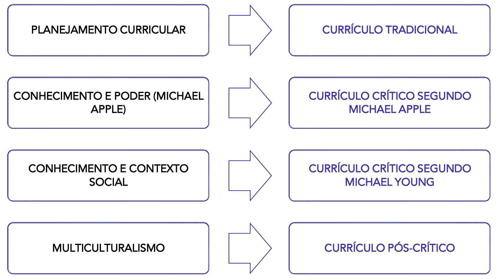

# Capítulo 8 - Currículo: Território de Saberes e Disputas

O conceito de currículo é diretamente influenciado pelas diferentes tendências e concepções pedagógicas que estudamos nos capítulos anteriores. Não é possível discutir "o que" se ensina sem ter como pano de fundo uma ideia de "como", "para quem" e "por que" se ensina. Por essa razão, para compreendermos o debate curricular atual, é útil revisitar brevemente o legado de três grandes correntes:

- A **Pedagogia Tradicional Leiga**, com seu foco no professor e na transmissão de um corpo de conhecimentos tidos como universais, nos mostra que o currículo é uma construção histórica, e não algo natural ou imutável.
- A **Pedagogia Nova**, ao deslocar o centro para o aluno, fomenta a necessidade de um currículo construído a partir da experiência e organizado por projetos de interesse dos estudantes.
- O **Tecnicismo Pedagógico**, por sua vez, introduz no campo curricular uma lógica de eficiência, planejamento e foco em objetivos e resultados mensuráveis.

Essas diferentes visões, que já detalhamos anteriormente, moldaram as diferentes formas de se pensar e organizar o currículo ao longo do tempo.

|Pedagogia Tradicional Leiga|Pedagogia Nova|Tecnicismo Pedagógico|
|---|---|---|
|Memorização de informações. Ambiente disciplinador e controlador. Pouco diálogo entre professor e aluno.|Interesse do estudante. Ensino ativo e não passivo.|O método é imposto de cima para baixo. Só é educação aquilo que está definido nos objetivos e pode ser avaliado. Ênfase em certificação e exames.|

## O que é Currículo?

Afinal, o que é currículo? A resposta a essa pergunta varia enormemente de acordo com a concepção pedagógica que se adota.

Do ponto de vista da pedagogia tradicional, o currículo é frequentemente visto como sinônimo do **conjunto de conteúdos** a serem ensinados pelos professores. Essa herança se manifesta em nossa experiência comum com a educação formal e em termos como **grade curricular**, **ementas de disciplinas**, **planos de ensino**, boletins e exames. Nesta visão, o currículo é, essencialmente, a lista de matérias a serem vencidas. Contudo, embora esses elementos façam parte do currículo, a teoria curricular contemporânea entende que esta é uma definição incompleta e reducionista.

O campo de estudo do currículo hoje é muito mais amplo. Uma definição atual e abrangente o entende como:

> O currículo é definido como as experiências de aprendizagem planejadas e guiadas e os resultados de aprendizagem não planejados, formulados através da reconstrução sistemática do conhecimento e da experiência, sob os auspícios da escola, para o crescimento contínuo e deliberado da competência pessoal e social do aluno.

Vamos analisar as partes desta densa definição. Ela nos diz que o currículo envolve:

1. **Experiências planejadas e guiadas:** Esta é a parte mais óbvia, o que chamamos de **currículo formal ou prescrito**. É o que está nos documentos oficiais, nos planos de aula, nos livros didáticos.
2. **Resultados de aprendizagem não planejados:** Esta é uma parte crucial. Ela reconhece que os alunos não aprendem apenas o que o professor planejou ensinar. Todas as experiências vividas no ambiente escolar educam. Isso nos leva ao conceito de **currículo oculto**.

O **currículo oculto** refere-se a tudo aquilo que a escola ensina de forma implícita, através de suas rotinas, regras, rituais, da organização do espaço e do tempo e, principalmente, das relações interpessoais. Os alunos aprendem sobre hierarquia na forma como o diretor trata o professor; aprendem sobre competição através do sistema de notas; aprendem normas sociais no recreio. Esses aprendizados, embora não estejam em nenhum plano de ensino, têm um impacto profundo na formação dos estudantes.

Portanto, a concepção contemporânea de currículo é muito mais vasta: ela abrange a totalidade das experiências educativas que os alunos vivenciam sob a responsabilidade da escola.

## A Influência das Tendências Pedagógicas no Currículo

O tema do currículo, como o conhecemos hoje, é diretamente influenciado pelas concepções pedagógicas que o definem. A forma como uma sociedade organiza os saberes a serem ensinados na escola revela suas prioridades, seus valores e seu projeto de futuro.

Na **Pedagogia Tradicional Leiga**, por exemplo, o currículo era visto como um conjunto de disciplinas a serem transmitidas, sem um grande planejamento ou uma discussão sobre a utilidade social daquele conhecimento. A justificativa para ensinar determinados conteúdos era, muitas vezes, a vaga recomendação de que eram "bons" para o desenvolvimento da memória e do raciocínio.

Foi somente com a **Escola Nova** e o pensamento de teóricos como John Dewey que o currículo passou a ser um objeto de estudo e de questionamento. A proposta progressivista inverteu a lógica tradicional: em vez de partir dos conteúdos, o currículo deveria partir dos problemas e interesses dos alunos. O conhecimento das disciplinas passaria a ser uma ferramenta para que os estudantes pudessem compreender e resolver questões de sua vida cotidiana, tornando a aprendizagem uma experiência direta com a realidade.

### O Modelo Tecnicista de Ralph Tyler

Como uma reação à percebida falta de sistematização da Escola Nova e impulsionado pela aceleração da industrialização nos Estados Unidos a partir de 1930, surgiu o **tecnicismo pedagógico** no campo curricular. Sob a influência do "eficientismo" e do taylorismo, a escola passou a ser vista como uma organização que deveria formar trabalhadores produtivos de forma rápida e eficiente.

O maior expoente desta corrente foi **Ralph Tyler**, que em sua obra "Princípios Básicos de Currículo e Ensino" (1949) desenvolveu um modelo linear e prescritivo que se tornou extremamente influente, inclusive no Brasil. O "modelo tyleriano" propunha que o currículo deveria ser planejado detalhadamente por especialistas e aplicado de forma uniforme pelos professores. Essa concepção deu origem ao que hoje chamamos de **Currículo Formal ou Prescrito**, e sua implementação se dava em quatro etapas sequenciais:

1. **Definição de Objetivos:** Quais os objetivos educacionais que a escola deve atingir?
2. **Seleção das Experiências Escolares:** Que experiências de aprendizagem devem ser oferecidas para alcançar esses objetivos?
3. **Organização das Experiências Escolares:** Como organizar essas experiências de forma eficaz?
4. **Avaliação:** Como podemos verificar se os objetivos foram alcançados?

Nesta lógica, a avaliação ocupa um lugar central e determinante. O sucesso do currículo é medido unicamente através da avaliação do desempenho dos alunos. Se os estudantes atingem os objetivos previamente definidos, o currículo é considerado eficaz. Como consequência, só é considerado currículo aquilo que pode ser objetivamente medido e avaliado.

### As Críticas ao Modelo Tecnicista

O modelo de Tyler, apesar de sua aparente lógica e organização, é alvo de severas críticas. Ao colocar o foco exclusivo na avaliação do desempenho do aluno para validar um currículo prescrito por especialistas, ele gera uma série de consequências negativas:

- **Culpabilização do aluno:** Se o estudante não atinge os objetivos, a falha é atribuída a ele, e não ao currículo ou ao método. Em nenhum momento o processo em si é colocado em discussão.
- **Cultura da competitividade:** O foco em notas e resultados promove o ranqueamento dos alunos e um clima escolar de competição, em detrimento da cooperação.
- **Exclusão:** O modelo, por sua natureza padronizada, é incapaz de ensinar a todos, pois não considera a diversidade de saberes, ritmos e contextos dos estudantes. O foco se desloca da aquisição do conhecimento para o desempenho nas avaliações.

### O Desafio Contemporâneo: Articulando o Comum e o Local

A principal crítica a essa forma de pensar o currículo é a sua **verticalização**. A ideia de que um conjunto de especialistas pode definir, de cima para baixo, as experiências escolares para um país tão diverso e desigual como o Brasil acarreta imensos problemas sociais e educacionais, pois desconsidera as ricas características culturais das diferentes comunidades.

É neste contexto que se insere o debate atual sobre a **Base Nacional Comum Curricular (BNCC)**. A BNCC busca superar o modelo puramente prescritivo ao definir um conjunto de **aprendizagens essenciais** que todos os alunos têm o direito de desenvolver. No entanto, ela não é o currículo em si. A Base não anula a autonomia da escola, expressa em seu **Projeto Político Pedagógico (PPP)**.

O desafio contemporâneo da Didática e do Currículo é justamente este: articular a base nacional comum com a realidade local. Cabe a cada escola, a partir de seu PPP e em diálogo com sua comunidade, definir os caminhos, os projetos e as metodologias para trabalhar as aprendizagens essenciais de forma que elas se conectem com a cultura, os saberes e as identidades locais, construindo um currículo que seja, ao mesmo tempo, comum a todos e relevante para cada um.

## As Principais Definições de Currículo

As diferentes formas de se definir o que é currículo estão diretamente relacionadas às diferentes visões de mundo e concepções pedagógicas. Não existe "uma" definição de currículo, mas sim um campo de disputas teóricas. Para organizar este debate, apresentaremos quatro grandes abordagens que marcaram a história do pensamento curricular: o planejamento curricular (ou currículo tradicional), a visão crítica de Michael Apple (conhecimento e poder), a visão crítica de Michael Young (conhecimento e contexto social) e o multiculturalismo (ou currículo pós-crítico).

### O Planejamento Curricular e a Racionalidade Tyleriana

Por um longo período, especialmente durante o auge da influência tecnicista, o conceito de **planejamento curricular** se confundiu com a própria noção de currículo. Essa fusão se deve, em grande parte, à enorme influência do modelo proposto por Ralph Tyler, que colocava a ênfase na planificação racional e em etapas sequenciais. A "racionalidade tyleriana" se tornou tão dominante que, de uma forma ou de outra, quase todas as propostas curriculares oficiais no Brasil, sejam elas estaduais ou do próprio Ministério da Educação, foram marcadas por sua lógica.

Por essa razão, é fundamental compreender bem a forma de pensar de Tyler, pois sua estrutura, ainda que com outros nomes, continua presente em muitos documentos e práticas atuais. O modelo consiste em um processo linear, de cima para baixo, no qual especialistas definem o que deve ser ensinado e como o sucesso do ensino será medido.

Em detalhes, cada uma das etapas:

1. **Definição de Objetivos:** O ponto de partida é a definição de metas e objetivos claros, específicos e, principalmente, mensuráveis. Os objetivos são definidos em termos da mudança de comportamento esperada no estudante. A preferência por objetivos específicos em detrimento de objetivos gerais se justifica por facilitar a avaliação. Por exemplo, em vez de um objetivo geral como "Desenvolver o raciocínio lógico", o modelo tyleriano prefere um objetivo específico como "Analisar problemas que envolvam proposições lógicas", pois este último pode ser verificado de forma mais direta em um teste.
2. **Seleção das Experiências Escolares:** Uma vez definidos os objetivos, selecionam-se as experiências de aprendizagem que devem ser proporcionadas aos alunos para que eles os alcancem. Embora o planejamento seja centralizado, esta etapa prevê uma certa margem de atuação para o professor na escolha de atividades específicas, desde que elas estejam alinhadas aos objetivos.
3. **Organização das Experiências Escolares:** Nesta fase, as experiências selecionadas são organizadas de forma a garantir a integração entre as áreas, a sequência lógica dos conteúdos e a continuidade da aprendizagem ao longo do tempo. Aqui, Tyler demonstra uma certa influência da Escola Nova, ao se preocupar com a psicologia do estudante e com a necessidade de uma organização que faça sentido para o aprendiz.
4. **Avaliação do Currículo:** A etapa final é a avaliação, que está estritamente condicionada aos objetivos específicos propostos no início. Através de instrumentos de medição, busca-se verificar se as metas foram atingidas e se as mudanças de comportamento esperadas ocorreram.

#### O Legado e a Terminologia Atual

Essa sequência lógica ainda é muito visível em diversas redes de ensino no Brasil. As secretarias de educação propõem um currículo com objetivos e habilidades a serem desenvolvidos, e, ao final de um ciclo, aplicam uma **avaliação em larga escala** (como a antiga Prova Brasil) para verificar se os objetivos foram alcançados.

A terminologia utilizada nos documentos curriculares atuais, embora mais moderna, muitas vezes reflete a mesma estrutura tyleriana.

Essa abordagem, como já discutimos, é criticada por sua verticalidade e por desconsiderar a diversidade cultural e as desigualdades sociais. No entanto, compreender sua lógica é essencial para analisar criticamente grande parte dos currículos oficiais ainda em vigor.

