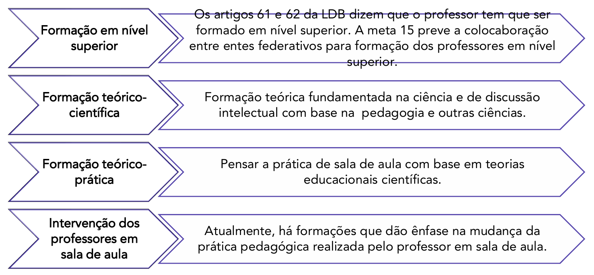

# Capítulo 9 - Formação de Professores

A **formação de professores** é um tema central e recorrente no debate educacional brasileiro. Trata-se de uma questão antiga, que permeia as políticas do Ministério da Educação (MEC) e as pesquisas acadêmicas há décadas, e cuja importância é fundamental para se pensar qualquer projeto de melhoria para a educação no país.

## A Centralidade da Formação Docente

A relevância do tema se apoia em um dos poucos consensos existentes no campo da pesquisa educacional: a convicção de que a melhoria da qualidade da educação e da didática em sala de aula passa, necessariamente, pela qualificação da formação dos professores. O raciocínio é direto: para transformar a aprendizagem do aluno, é preciso, antes, transformar as concepções e as práticas do educador.

Um exemplo claro disso está no campo da alfabetização. Se os alunos de uma determinada escola não estão conseguindo se alfabetizar por meio de métodos tradicionais, baseados na mera repetição e memorização, a solução mais eficaz não é insistir nos mesmos métodos, mas sim oferecer ao professor uma nova formação, que lhe apresente outras concepções de aprendizagem, como as que entendem a criança como um sujeito ativo que constrói seu conhecimento sobre a escrita.

### A Origem do Debate Contemporâneo

Essa preocupação com a formação docente, embora antiga, ganhou contornos mais nítidos a partir do **processo de redemocratização do Brasil, na década de 1980**. Com a emergência de novas demandas por uma escola mais democrática, crítica e inclusiva, tornou-se evidente que os modelos tradicionais e tecnicistas de formação de professores já não eram suficientes. Desde então, o discurso sobre a necessidade de se repensar e melhorar a formação docente se tornou uma constante.

Um marco nesse percurso foi o **PROFA (Programa de Formação de Professores Alfabetizadores)**, no início do século XXI. O programa foi um grande sucesso, não apenas por sua escala, que atingiu milhares de professores em todo o Brasil através do uso de teleaulas, mas principalmente pela qualidade de seu conteúdo. Baseado em uma concepção construtivista da aprendizagem, o PROFA promoveu uma mudança considerável na forma como os professores trabalhavam a alfabetização, incentivando a reflexão sobre a prática e o respeito aos processos de aprendizagem das crianças.

Diante desses aspectos, nota-se que a formação de professores é um tema sempre presente nas discussões sobre os rumos da educação no Brasil. Por ser o ponto de articulação de toda e qualquer proposta de mudança pedagógica, sua relevância é permanente, o que justifica sua constante presença nos debates públicos e nas avaliações para o ingresso na carreira docente.

## Conceitos, Princípios e Definições Gerais

A formação de professores é um processo complexo que envolve diferentes etapas e dimensões, desde os requisitos legais até as práticas de desenvolvimento profissional contínuo. A seguir, detalharemos os principais pilares que caracterizam a concepção de formação docente no país.

### Os Pilares da Formação Docente

Os princípios gerais da formação de professores no Brasil podem ser organizados em quatro grandes eixos, que se complementam para constituir um profissional completo.

1. **Formação em Nível Superior:** A Lei de Diretrizes e Bases da Educação Nacional (LDB/96), em seus artigos 61 e 62, estabeleceu a formação em nível superior como requisito para a atuação na educação básica, em um esforço de valorização e profissionalização da carreira docente. Anteriormente, a formação em nível médio (o antigo curso Magistério ou Normal) era suficiente para lecionar nos anos iniciais. Essa exigência foi reforçada pelo Plano Nacional de Educação (PNE), que em sua Meta 15 prevê a garantia de que todos os professores da educação básica possuam formação específica de nível superior, incentivando a colaboração entre os entes federativos para que essa meta seja alcançada.
2. **Formação Teórico-Científica:** A formação do professor deve ser solidamente fundamentada na ciência. Isso garante que os educadores tenham os instrumentos intelectuais necessários para compreender a complexidade do fenômeno educativo e para planejar suas aulas de forma crítica e reflexiva. Dentro desta perspectiva, disciplinas como a Filosofia da Educação, a Sociologia da Educação e a História da Educação são essenciais para o desenvolvimento do pensamento crítico do futuro professor.
3. **Formação Teórico-Prática:** Esta dimensão busca construir a ponte entre a teoria e a prática da sala de aula. Há uma atenção especial para as disciplinas de Didática e Metodologias de Ensino, que equipam o professor com o saber sobre "como ensinar", sempre de forma articulada com os fundamentos teóricos.
4. **A Intervenção na Sala de Aula como Foco:** Muitas propostas de formação, especialmente na formação continuada, têm como foco a mudança concreta da prática pedagógica do professor. São programas que buscam articular o estudo teórico com a intervenção direta na sala de aula do professor cursista. Exemplos de grande sucesso no Brasil foram o **PROFA (Programa de Formação de Professores Alfabetizadores)** e o **PNAIC (Pacto Nacional pela Alfabetização na Idade Certa)**, que aliaram a teoria à reflexão sobre a prática e promoveram mudanças significativas na didática dos professores alfabetizadores.

### Diretrizes da Formação na Prática

Além dos pilares da formação inicial, há duas diretrizes que são fundamentais na constituição do saber docente e que ocorrem "em serviço", ou seja, na vivência prática da profissão.

- **O Estágio Docente Supervisionado:** O estágio é uma oportunidade crucial para o estudante de pedagogia ou de licenciaturas refletir sobre a prática a partir da observação e da colaboração com um professor mais experiente. É o momento em que a teoria estudada na universidade é confrontada com a realidade complexa da sala de aula. Um estudante que, por exemplo, acredita que a alfabetização só é possível através de métodos silábicos tradicionais, ao estagiar em uma turma na qual a professora utiliza textos significativos e parte das hipóteses das crianças, tem a oportunidade de rever suas concepções e transformar sua própria visão sobre a educação.
- **O Professor como Pesquisador:** Esta é uma ideia central na concepção contemporânea de formação. Ela propõe que o professor não seja um mero aplicador de técnicas, mas um intelectual que investiga a própria prática. Isso implica que, ao se deparar com um problema didático (por exemplo, a dificuldade dos alunos em compreender o Sistema de Numeração Decimal), o professor buscará e pesquisará possíveis saídas na literatura pedagógica-científica, testará novas abordagens e refletirá sobre seus resultados, produzindo conhecimento a partir de sua própria sala de aula.

### As Mudanças Pedagógicas e a Nova Postura Docente

A sala de aula do século XXI não pode mais operar com a mesma lógica do século anterior, na qual o livro didático ou a cartilha eram as fontes quase exclusivas do saber. A ascensão da internet e das redes sociais provocou uma revolução no acesso à informação, o que exige uma profunda **mudança na postura pedagógica e didática** do professor.

Essa transformação ocorre porque o fluxo de informações hoje é tão intenso e descentralizado que os estudantes possuem inúmeras fontes para acessá-las. Diante deste novo cenário, é preciso reinventar o currículo e as formas de aprendizagem. A tecnologia não é apenas uma nova ferramenta, mas um elemento que possibilita novas formas de interação do aluno com o conhecimento.

A consequência mais profunda dessa mudança é que o professor **deixa de ter a centralidade** no processo de transmissão da informação. A formação de professores, portanto, deve trabalhar a consciência de que o aluno não tem mais no docente sua única fonte de saber. O papel do professor se desloca: de um transmissor de conteúdo para um **curador, um mediador e um orientador**, que ajuda o aluno a navegar de forma crítica e segura por esse oceano de informações, a distinguir o que é relevante do que é falso e a transformar a informação em conhecimento significativo.

Além disso, é preciso reconhecer que a aprendizagem não se esgota na educação escolar. O estudante aprende **ao longo de toda a vida**, em múltiplos espaços de educação não-formal, como clubes, ONGs, movimentos sociais e, principalmente, em suas interações online. O professor não pode mais ter a pretensão de pensar que somente ele ensina saberes relevantes ao aluno. A formação docente deve preparar o profissional para dialogar com esses outros saberes e para valorizar as múltiplas experiências de aprendizagem que os estudantes trazem para a escola.

### A Ética na Prática Docente

O outro pilar que sustenta a formação do professor é a **ética**. A ética, como campo da filosofia, discute os princípios que orientam as relações entre os seres humanos. No campo da educação, ela se manifesta na complexa relação entre **professor, aluno e conhecimento**.

A ética docente não é um código de regras a ser seguido, mas uma postura que se revela na coerência das ações do professor. O ponto fundamental é a **coerência entre o que se fala e o que se faz**. O professor que defende valores como o respeito e a colaboração, mas age de forma autoritária e individualista em sua sala de aula, quebra o vínculo de confiança com seus alunos. A ética se materializa no exemplo, na atitude do professor que serve como referência para os estudantes.

No contexto atual, a ética na prática docente ganha uma nova e crucial dimensão: o **domínio do conteúdo**. Com o acesso facilitado à informação, não é mais possível que o professor "finja" saber determinado conteúdo. Um aluno pode, com uma rápida busca na internet, verificar a veracidade de uma informação e expor a fragilidade do conhecimento do professor. Portanto, o domínio rigoroso e atualizado do conteúdo que se está ensinando deixou de ser apenas uma questão de competência técnica para se tornar também uma questão de **honestidade intelectual e de respeito** para com os alunos. A ética profissional exige que o professor se comprometa com um estudo constante, garantindo a qualidade e a veracidade do conhecimento que ele media em sala de aula.

