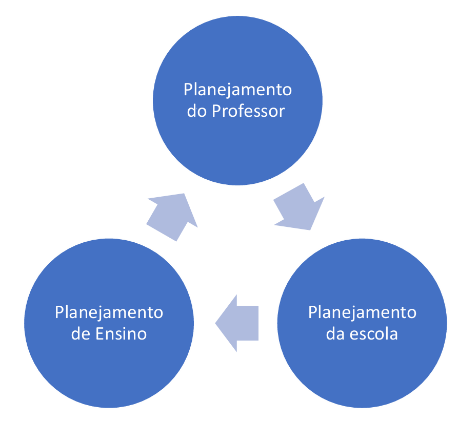

# Capítulo 10 – Planejamento no Processo Educativo

Planejar é uma atividade intrinsecamente humana e rotineira. Planejamos o nosso dia, a lista de compras do mercado, as próximas férias. Grande parte de nossas ações é orientada por uma antecipação do futuro, por um esforço de organizar os meios para se atingir determinados fins. Na educação, esse processo se torna um ato profissional, consciente e sistematizado, que se articula em torno de dois princípios indissociáveis na prática docente: **o planejamento e a avaliação**.

No campo da Didática no Brasil, um dos autores de referência mais utilizados para discutir o tema é **José Carlos Libâneo**. Seus conceitos nos servirão de base para aprofundar os estudos sobre o planejamento.

Para Libâneo, o planejamento é uma tarefa docente que vai além da simples elaboração de um documento. Ele inclui tanto a **definição das atividades didáticas** a serem desenvolvidas para que se alcancem os objetivos de aprendizagem, quanto o processo constante de **revisão e adequação** dessas atividades no decorrer do processo de ensino. Isso significa que o planejamento docente nunca é um ato único e finalizado, mas opera sempre em uma tríade dinâmica: **planejamento – reflexão/avaliação – replanejamento**.

## A Natureza e a Importância do Planejamento

Segundo Libâneo, o planejamento é **"um processo de racionalização, organização e coordenação do trabalho docente"**, e sua função essencial é **articular a atividade escolar com o contexto social** em que ela se insere. A ação de planejar, portanto, não deveria ser encarada como o mero cumprimento de uma tarefa burocrática exigida pela escola, mas sim como um momento fundamental de reflexão, tomada de decisões e definição dos rumos que o professor pretende seguir em sua prática.

O planejamento deve ter um caráter **reflexivo**: o professor determina onde deseja chegar com seus alunos, pensa nas ações e estratégias necessárias para alcançar esses objetivos e, periodicamente, retorna ao seu plano para avaliar se ele ainda faz sentido e se o caminho traçado ainda é o melhor, replanejando suas ações sempre que necessário.

#### Características de um Bom Planejamento

Quando bem construído, o planejamento serve como um guia de orientação seguro para a ação do professor. Para isso, ele precisa ter algumas características específicas:

- **Sequencial:** As ações docentes devem seguir um caminho lógico e ordenado para que os objetivos de aprendizagem possam ser alcançados de forma progressiva.
- **Objetivo:** A objetividade, aqui, é entendida como a correspondência do plano com a realidade concreta da escola, da turma e dos alunos. Um plano precisa ser realista e exequível.
- **Coerente:** É preciso que haja harmonia e alinhamento entre todas as partes do planejamento: os objetivos gerais, os objetivos específicos, os conteúdos, os métodos de ensino e os critérios de avaliação.
- **Flexível:** O planejamento não pode ser uma camisa de força. Ele deve permitir que o professor reflita sobre os rumos tomados e o redefina sempre que a realidade da sala de aula assim o exigir.

#### A Crítica à "Pedagogia do Improviso"

A educação é uma prática que sempre terá um "quê" de imprevisível; há sempre algo que escapa ao controle durante o ato pedagógico. No entanto, essa constatação não pode servir como desculpa para a chamada **"pedagogia do improviso"**, na qual nada é planejado e tudo acontece de forma aleatória. É impossível alcançar objetivos de aprendizagem consistentes sem estabelecer um plano minucioso para se chegar até eles.

A flexibilidade, portanto, não é o oposto do planejamento; ela é uma característica de um bom planejamento. Rever e replanejar não é um sinal de fracasso, mas sim de uma ação profissional e reflexiva sobre o próprio trabalho docente.

### Como Construir o Planejamento: Requisitos Fundamentais

Após compreendermos o que é o planejamento e qual a sua importância, a questão que se impõe é: na prática, o que devemos considerar ao elaborar um plano? A construção de um planejamento eficaz não é um ato espontâneo; ela exige que o educador ou a equipe escolar se debrucem sobre uma série de requisitos prévios. Segundo Libâneo, para planejar de forma consistente, é preciso considerar: **(i) os objetivos e tarefas da escola democrática; (ii) as exigências dos documentos oficiais; (iii) as condições prévias dos alunos; e (iv) os princípios do processo de ensino e de aprendizagem.**

Vamos detalhar os três primeiros requisitos.

#### Os Objetivos e Tarefas da Escola Democrática

O primeiro passo para qualquer planejamento é de natureza **filosófico-política**. Antes de definir "o que" ou "como" ensinar, é preciso ter clareza sobre "para quê" se ensina. É necessário responder a perguntas fundamentais: que concepção de educação orienta nossa prática? Que ideal de cidadão queremos ajudar a formar? Qual o papel de nossa escola na sociedade?

A escola não é uma ilha; ela está inserida em um contexto econômico, político e cultural. Portanto, seu projeto educativo está sempre em consonância com uma visão de mundo. A famosa passagem de Lewis Carroll em "Alice no País das Maravilhas" ilustra perfeitamente essa necessidade: ao ser questionada pelo gato para onde desejava ir, Alice responde que não sabe. O gato, então, retruca sabiamente: "se você não sabe para onde vai, qualquer caminho serve". No planejamento, saber onde se deseja chegar é sempre o primeiro passo para que o caminho traçado faça sentido.

No contexto brasileiro, a democratização do acesso à escola pública trouxe para dentro de seus muros as camadas populares da população. Isso exigiu que os educadores repensassem os objetivos e os conteúdos de ensino. Uma escola efetivamente democrática, nesta perspectiva, é aquela que não apenas acolhe a todos, mas que também garante a todos as condições para a **assimilação do conhecimento científico e cultural**, entendendo-o como uma ferramenta indispensável para a participação crítica e ativa na sociedade — a tão falada formação para a cidadania.

#### O Conhecimento das Exigências Oficiais

O segundo requisito é o **domínio do arcabouço legal e curricular** que rege a educação. A autonomia conferida às escolas e aos professores não é absoluta; ela é exercida dentro de um quadro de orientações e exigências definido nos âmbitos federal, estadual e municipal.

Portanto, para planejar de forma profissional e inteligente, o professor precisa conhecer os documentos que orientam o seu trabalho, como a **Lei de Diretrizes e Bases da Educação Nacional (LDB)** e, principalmente, a **Base Nacional Comum Curricular (BNCC)**, além das propostas curriculares de sua rede de ensino. O desafio não é apenas seguir essas determinações, mas saber interpretá-las e, o mais importante, adequá-las à sua realidade local, transformando o currículo formal em um currículo real e significativo.

#### A Análise das Condições Prévias dos Alunos

O terceiro requisito é o **ponto de partida pedagógico** de todo planejamento eficaz. Ao definir os objetivos e os conteúdos que serão trabalhados, é fundamental que o professor conheça o que seus alunos já sabem, quais são suas experiências, suas dificuldades e seus interesses. É a partir desses conhecimentos prévios que a nova aprendizagem será construída.

Este princípio, central nas teorias construtivistas e diretamente ligado à prática da **avaliação diagnóstica**, evidencia por que cada planejamento deve ser único. A prática de copiar o planejamento de um colega ou de utilizar o mesmo plano por anos seguidos não faz sentido pedagógico, pois ignora o elemento mais importante do processo: as condições reais e específicas dos alunos com os quais se irá trabalhar.

#### Os Princípios e Condições do Processo de Ensino

O quarto requisito para um bom planejamento diz respeito à descrição das situações docentes específicas e às condições que garantem sua qualidade. Não basta definir objetivos e conteúdos; o plano precisa prever os caminhos e os princípios que nortearão a prática pedagógica, sempre de forma coerente com os objetivos delimitados. Vários princípios são fundamentais neste processo.

##### A Coerência entre os Níveis de Planejamento

O planejamento não se limita à ação individual do professor em sua sala de aula. Ele deve ser entendido em seus diferentes níveis de abrangência, que precisam estar articulados de forma coerente. O **Planejamento da Escola** (expresso no PPP) deve orientar o **Planejamento de Ensino** (a organização do trabalho do professor ao longo do ano), que por sua vez se materializa no **Planejamento de Aula** (ou do professor). Os resultados e as reflexões que emergem da aula devem, retroativamente, alimentar e, se necessário, reorientar os planejamentos mais amplos.

##### A Gestão Democrática e a Centralidade do PPP

Um ponto crucial do planejamento na escola pública é sua dimensão **coletiva e participativa**. Conforme previsto na Lei de Diretrizes e Bases da Educação Nacional (LDB), a **gestão democrática** é um princípio norteador, o que significa que a elaboração das propostas e ações da escola deve contar com a participação dos diversos atores da comunidade escolar (professores, gestores, alunos, famílias).

Essa participação coletiva tem como principal instrumento e resultado o **Projeto Político-Pedagógico (PPP)**, o documento que define a identidade e os rumos da escola. Portanto, todo e qualquer planejamento escolar deve estar integrado e ser coerente com o PPP, que foi construído de forma democrática.

##### As Qualidades de um Planejamento Vivo

Por fim, para que o planejamento seja um instrumento eficaz e não apenas um documento burocrático, ele precisa incorporar outras qualidades essenciais:

- **Flexibilidade:** O planejamento deve prever a possibilidade de revisões e adaptações constantes, pois a prática pedagógica é dinâmica e repleta de imprevistos. O replanejamento não é um sinal de fracasso, mas o resultado de um processo reflexivo fundamental para o aprimoramento do trabalho docente.
- **Contextualização:** O planejamento deve ser adequado à realidade local da escola e dos alunos, levando em conta os aspectos sociais, culturais e econômicos que influenciam o processo educativo. Conhecer o perfil dos estudantes é indispensável para construir um plano que seja significativo e eficaz.
- **Consonância com a Base Legal:** O planejamento precisa respeitar as bases legais e normativas que orientam a educação no país, como a LDB, a Base Nacional Comum Curricular (BNCC) e as diretrizes dos sistemas de ensino estaduais e municipais. Esses documentos garantem a consonância com as políticas públicas e com os direitos de aprendizagem dos estudantes.

