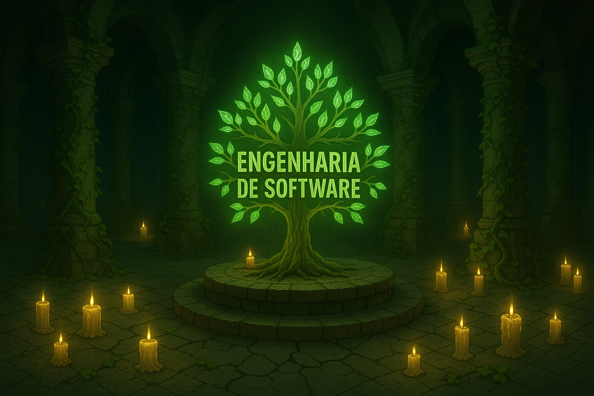

  

 

# Engenharia de Software

A **Engenharia de Software** é a disciplina que transforma necessidades humanas em sistemas digitais robustos, seguros e eficientes, por meio de processos estruturados, técnicas de planejamento e ferramentas especializadas. Seu cerne está em equilibrar **qualidade técnica**, **gestão de recursos** e **alinhamento com as expectativas do cliente**, garantindo que softwares sejam entregues dentro de prazos, custos e com funcionalidades que agreguem valor real.

Nesse contexto, as **metodologias de desenvolvimento** funcionam como guias estratégicos, definindo _como_ as equipes devem organizar tarefas, gerenciar riscos e responder a mudanças. Elas são categorizadas em três abordagens principais, cada uma adaptada a diferentes cenários de projeto:

- **Modelos Sequenciais**: Indicados para projetos com requisitos imutáveis e escopo bem definido, seguem uma estrutura linear e previsível, priorizando documentação e etapas faseadas.
- **Modelos Incrementais**: Combinam planejamento inicial com entregas parciais, permitindo ajustes progressivos e validação contínua, ideal para projetos que exigem flexibilidade sem abrir mão de um escopo base.
- **Modelos Evolutivos**: Abraçam a incerteza e a mudança, usando ciclos iterativos rápidos para evoluir o produto com base em feedbacks constantes, adequados para ambientes dinâmicos ou inovadores.

A escolha da metodologia certa depende de fatores como **complexidade do projeto**, **maturidade da equipe**, **nível de clareza dos requisitos** e **pressão por resultados rápidos**. Enquanto modelos sequenciais oferecem controle rígido para sistemas críticos (como softwares médicos ou aeroespaciais), abordagens evolutivas são a espinha dorsal de startups e produtos disruptivos, onde a adaptação é tão importante quanto a execução.

Além disso, metodologias modernas frequentemente incorporam práticas como **integração contínua (CI/CD)**, **colaboração cross-functional** e **automação de testes**, independentemente do modelo adotado. O objetivo final é sempre o mesmo: entregar software funcional, escalável e alinhado às demandas do mercado, mitigando riscos e maximizando eficiência.

Em um mundo onde a tecnologia avança em ritmo exponencial, dominar essas metodologias não é apenas uma questão técnica, mas **estratégica** — pois define como organizações transformam ideias em soluções tangíveis, sustentáveis e capazes de enfrentar os desafios de um cenário digital em constante mutação.

## Índice de Conteúdos

Abaixo segue o índice com os conteúdos sobre Engenharia de Software e Metodologias de Desenvolvimento de Software.

- [Capítulo 1 – Fundamentos da Engenharia de Software](contents/01-fundamentos.md)
- [Capítulo 2 – Ciclo de Vida e Processos de Software](contents/02-ciclo-de-vida.md)
- [Capítulo 3 – Modelos Sequenciais: Modelo em Cascata e Modelo em V](contents/03-modelos-cascata-e-v.md)
- [Capítulo 4 – Modelo Iterativo e Incremental](contents/04-modelo-iterativo-e-incremental.md)
- [Capítulo 5 – Modelo Incremental e Iterativo: Rapid Application Development (RAD)](contents/05-modelo-rad.md)
