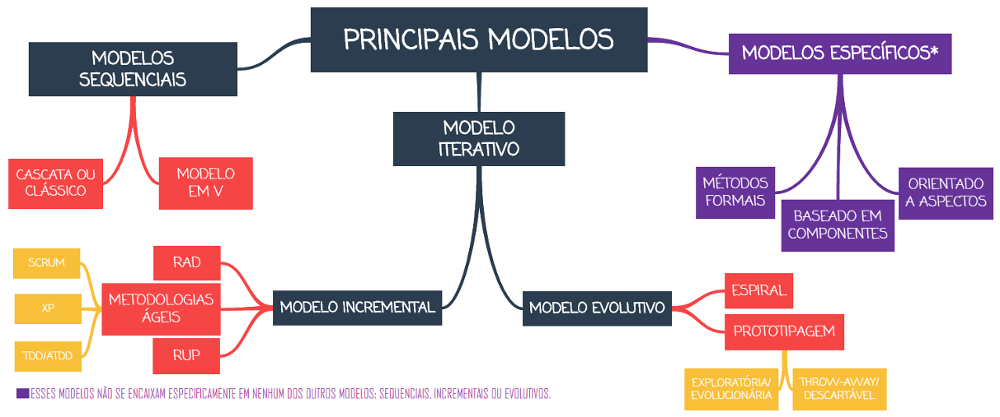

# Capítulo 1 – Fundamentos da Engenharia de Software

A Engenharia de Software emergiu como uma disciplina fundamental na era digital, abordando a crescente complexidade e a importância crítica dos sistemas de software em quase todos os aspectos da vida moderna. Longe de ser apenas a arte de escrever código, ela representa uma abordagem sistemática e disciplinada para o desenvolvimento, operação e manutenção de software, aplicando princípios de engenharia para garantir que os produtos finais sejam confiáveis, eficientes e atendam às necessidades para as quais foram concebidos. Em um mundo onde falhas de software podem ter consequências que vão desde inconveniências menores até perdas financeiras massivas ou riscos à segurança, a aplicação rigorosa desses princípios tornou-se indispensável. Este capítulo introdutório estabelecerá as bases, definindo o que é software em seu sentido mais amplo, explorando o conceito de processo e como ele se aplica ao desenvolvimento de sistemas, e finalmente, mergulhando na estrutura do ciclo de vida do software e nos modelos que o organizam.

## O que é Software?

Ao abordar o conceito de **software**, é comum que, em uma visão leiga ou simplificada, pensemos apenas nos programas executados em computadores — como editores de texto, navegadores web ou sistemas operacionais. No entanto, essa é uma definição bastante restrita. Em termos técnicos e de engenharia, o software é um conjunto abrangente que inclui não apenas os programas (o código executável que instrui o hardware), mas também todos os artefatos necessários ao seu funcionamento correto, sua manutenção e sua evolução. Isso inclui, crucialmente, a **documentação técnica** (como manuais de instalação, guias de usuário, especificações de requisitos, diagramas de arquitetura) e os **dados de configuração** (arquivos que ajustam o comportamento do programa para diferentes ambientes ou usuários).

Portanto, podemos entender software como um produto lógico e imaterial, mas que exige um processo sistemático e organizado para sua criação e gestão. Sua função primordial é operar sobre o hardware para realizar tarefas específicas, automatizar processos complexos, gerenciar informações ou viabilizar novas formas de comunicação e interação.

Como exemplo prático, considere um sistema de gestão para uma loja online (e-commerce). O código que processa um pagamento, atualiza o estoque ou exibe um produto na tela é apenas uma parte do software. Há também a documentação que explica como instalar o sistema no servidor, como configurar as opções de frete, como os funcionários devem cadastrar novos produtos, e como realizar backups diários para evitar perda de dados. Além disso, existem arquivos de configuração que definem a aparência do site, as integrações com meios de pagamento e as credenciais de acesso ao banco de dados. Todos esses componentes – código, documentação e dados de configuração – reunidos, constituem o software completo do sistema de e-commerce.

## O que é um Processo?

O conceito de **processo** está intrinsecamente ligado à ideia de organização, estrutura e transformação. Em termos gerais, um processo é um conjunto de atividades inter-relacionadas, executadas em uma sequência lógica, que visam transformar insumos (entradas) em produtos ou resultados (saídas). Todo processo bem definido possui objetivos claros, utiliza recursos específicos (tempo, pessoas, ferramentas), segue regras ou diretrizes estabelecidas e, idealmente, inclui critérios de qualidade para avaliar a eficácia de seus resultados.

Podemos encontrar exemplos de processos em praticamente qualquer atividade humana organizada. O processo de fabricação de um automóvel, por exemplo, envolve uma cadeia complexa de etapas — desde o design e a prototipagem, passando pelo corte de chapas, soldagem da carroceria, pintura, montagem de componentes (motor, interior, eletrônicos) até os rigorosos testes de qualidade — que transformam matérias-primas e componentes em um veículo funcional e pronto para o consumidor. De forma análoga, no contexto da engenharia de software, o processo é o framework que guia a criação de sistemas computacionais: desde a concepção inicial e o entendimento das necessidades do cliente até a entrega final do produto, sua operação e a manutenção contínua ao longo do tempo.

## Processo de Software

Um **processo de software** é, portanto, a aplicação direta do conceito geral de processo ao domínio específico do desenvolvimento de sistemas de software. Trata-se de uma sequência estruturada e organizada de atividades, métodos, práticas e transformações que guiam as equipes na produção de software de alta qualidade. Seu objetivo principal é garantir que o software seja construído de forma eficiente, previsível, controlada, dentro do prazo e do orçamento estipulados, e que, acima de tudo, atenda às necessidades e expectativas dos usuários e stakeholders.

A necessidade de processos bem definidos na área de software tornou-se evidente com a chamada **crise do software**, um termo cunhado nas décadas de 1960 e 1970 para descrever os crescentes desafios enfrentados pela indústria. À medida que os sistemas se tornavam maiores e mais complexos, as práticas de desenvolvimento ad hoc e informais da época começaram a falhar espetacularmente, resultando em projetos que frequentemente excediam prazos e orçamentos, entregavam produtos repletos de erros (bugs) ou, em casos extremos, eram completamente cancelados por não atenderem aos requisitos. A Engenharia de Software surgiu, em grande parte, como uma resposta a essa crise, buscando trazer disciplina, rigor e métodos de engenharia para o "caos" do desenvolvimento de software.

Ian Sommerville, um renomado autor da área, define um processo de software de forma concisa como "um conjunto de atividades relacionadas que levam à produção de um produto de software". Essas atividades fundamentais, embora possam variar em nome ou detalhamento dependendo do autor ou do modelo adotado, geralmente englobam:

1. **Especificação de Software:** Entender e definir detalhadamente o que o sistema deve fazer e quais restrições ele deve obedecer. Isso envolve coletar, analisar e documentar os requisitos dos usuários e do negócio.    
2. **Desenvolvimento de Software (Projeto e Implementação):** Projetar a arquitetura e a estrutura interna do software para atender aos requisitos especificados e, em seguida, traduzir esse projeto em código funcional (implementação ou codificação).
3. **Validação de Software:** Verificar se o software construído realmente faz o que foi especificado e se atende às necessidades do cliente. Isso é feito principalmente através de diversas formas de testes.
4. **Evolução de Software:** Modificar o software após sua entrega inicial para corrigir defeitos encontrados em operação, adaptá-lo a mudanças no ambiente (como um novo sistema operacional) ou adicionar novas funcionalidades solicitadas pelos usuários.

Seguir um processo de software bem definido é, portanto, essencial para mitigar os riscos inerentes ao desenvolvimento, garantir a previsibilidade do projeto, facilitar a comunicação entre a equipe e os stakeholders, e, fundamentalmente, aumentar a probabilidade de entregar um produto final bem-sucedido e de alta qualidade.

## Engenharia de Software: Definição e Objetivos

A **Engenharia de Software** é a disciplina que aplica de forma sistemática os princípios e práticas da engenharia ao desenvolvimento, operação e manutenção de sistemas de software. A definição formal do IEEE (Institute of Electrical and Electronics Engineers), uma das mais respeitadas na área, a descreve como a “aplicação de uma abordagem sistemática, disciplinada e quantificável ao desenvolvimento, operação e manutenção de software; isto é, a aplicação da engenharia ao software”.

Friedrich Bauer, um pioneiro da área, ofereceu uma definição complementar e focada nos objetivos práticos: a Engenharia de Software envolve "a criação e a utilização de sólidos princípios de engenharia com o objetivo de obter software de maneira econômica, que seja confiável e funcione eficientemente em máquinas reais".

Em essência, a Engenharia de Software é um campo multidisciplinar que combina conhecimentos profundos de ciência da computação (algoritmos, estruturas de dados, linguagens de programação) com princípios de engenharia de sistemas (análise de requisitos, design, gerenciamento de complexidade), gerenciamento de projetos (planejamento, estimativas, controle de riscos) e garantia de qualidade (testes, métricas, processos de melhoria). Seu foco principal está na produção de software que não apenas funcione corretamente, mas que também seja entregue com uma boa relação custo-benefício, atenda plenamente aos requisitos funcionais e não funcionais dos usuários, e seja projetado de forma a facilitar sua manutenção e evolução futura.

Como destaca Ian Sommerville, "A Engenharia de Software não está relacionada apenas com os processos técnicos de desenvolvimento de software, mas também com atividades como o gerenciamento de projeto de software e o desenvolvimento de ferramentas, métodos e teorias que apoiem a produção de software”. Isso significa que a disciplina se preocupa com todos os aspectos da produção de software, desde os estágios iniciais de especificação até a manutenção após a entrada em produção, considerando também aspectos humanos, de hardware e de contexto organizacional.

A figura anterior ilustra essa visão abrangente. A Engenharia de Software se ocupa de todos os aspectos da produção, guiada por princípios fundamentais e estruturada em camadas que vão desde o foco na qualidade até as ferramentas específicas utilizadas no dia a dia.

## Relação com a Engenharia de Sistemas

É importante contextualizar a Engenharia de Software dentro de um campo mais amplo: a **Engenharia de Sistemas**. A Engenharia de Sistemas adota uma visão holística, preocupando-se com todos os aspectos do desenvolvimento de sistemas complexos baseados em computadores, o que inclui não apenas o software, mas também o hardware, os processos de negócio, a interação humana e o ambiente operacional onde o sistema será implantado.

Roger Pressman, outro autor influente na área, afirma que “a Engenharia de Software ocorre como consequência de um processo chamado Engenharia de Sistemas”. Isso significa que o desenvolvimento de um software específico geralmente é apenas uma parte de um esforço maior de concepção, especificação e validação de um sistema completo. O engenheiro de software, portanto, não pode trabalhar isolado; ele precisa entender o contexto maior onde seu produto será inserido. Ele deve considerar, por exemplo, a compatibilidade com diferentes dispositivos de hardware, a infraestrutura de rede necessária, a usabilidade da interface para os usuários finais, a integração com outros sistemas existentes e até mesmo a viabilidade econômica e o retorno sobre o investimento do projeto.

## Ciclo de Vida do Software

O **ciclo de vida de um software** refere-se às distintas etapas ou fases sequenciais e interdependentes que compõem sua existência, desde a concepção inicial até sua eventual descontinuação ou retirada de operação. Trata-se de um conceito fundamental para entender o software não como um produto estático, mas como uma entidade dinâmica que nasce, cresce, amadurece e, eventualmente, é substituída. O ciclo de vida começa com a identificação de uma necessidade, um problema a ser resolvido ou uma oportunidade a ser explorada, e se estende por todo o processo de desenvolvimento, implantação, uso e manutenção, terminando apenas quando o sistema é definitivamente desativado.

Ao longo da história da engenharia de software, diversos autores e organizações propuseram diferentes formas de visualizar e dividir essas etapas, refletindo variações nas metodologias, nos tipos de projeto e nas práticas de desenvolvimento. Algumas fases, no entanto, são amplamente reconhecidas como elementos comuns à maioria dos ciclos de vida, independentemente do modelo específico adotado.

De maneira geral, podemos entender que um software passa por momentos distintos: a **definição** de suas funcionalidades e objetivos; o **planejamento** de seu desenvolvimento (estimativas de custo, prazo e recursos); a **construção** propriamente dita (projeto e codificação); os **testes** para assegurar sua qualidade e conformidade; a **entrega** e **implantação** no ambiente do usuário final; a **operação** diária; e, finalmente, a **manutenção** contínua para corrigir erros, adaptar-se a mudanças e incorporar melhorias, até que o sistema seja considerado obsoleto e retirado de uso. Essa visão cíclica (como ilustrado em alguns modelos) ressalta a natureza interativa do software, que está em constante diálogo com as mudanças nos requisitos dos usuários, nas tecnologias subjacentes e no ambiente de negócios.

### Variações nos Modelos de Ciclo de Vida

Contudo, é crucial reconhecer que **não existe um consenso universal** entre os estudiosos da área sobre quais fases exatas compõem o ciclo de vida de software, nem sobre como elas devem ser nomeadas ou agrupadas. Alguns autores preferem uma abordagem mais genérica e abstrata, com poucas fases amplas e abrangentes, enquanto outros optam por uma visão mais granular e detalhada, desdobrando o processo em múltiplas etapas específicas. As imagens a seguir ilustram algumas dessas diferentes perspectivas encontradas na literatura.

Uma versão bastante sintética, mostrada à esquerda, compreende apenas quatro fases principais: Definição, Desenvolvimento, Operação e Retirada. Essa representação minimalista é útil para uma compreensão conceitual de alto nível, embora não capture as diversas atividades e nuances envolvidas no desenvolvimento prático de software. À direita, vemos uma representação mais detalhada, que propõe oito fases: Planejamento, Análise e Especificação de Requisitos, Projeto, Implementação, Testes, Entrega e Implantação, Operação e Manutenção. Esse modelo é considerado por muitos como mais fiel ao cotidiano dos projetos de software, pois desdobra o processo de desenvolvimento em etapas distintas, permitindo maior controle, rastreabilidade e gerenciamento.

Autores de referência como Ian Sommerville e Roger Pressman também oferecem suas próprias interpretações. Para Sommerville, o ciclo é composto por quatro grandes atividades interligadas: Especificação, Desenvolvimento (que engloba projeto e implementação), Validação e Evolução. Este é um modelo conceitual frequentemente citado na literatura acadêmica e em provas de concurso. Já Pressman propõe um modelo com cinco fases principais, que enfatiza a comunicação inicial e o planejamento: Comunicação (com stakeholders), Planejamento, Modelagem (análise e projeto), Construção (codificação e teste) e Implantação (entrega e feedback).

Esses quatro modelos ilustram claramente a diversidade de abordagens para estruturar o ciclo de vida do software. É importante entender que nenhum modelo é intrinsecamente "melhor" ou "pior" que outro; a adequação de um modelo depende fundamentalmente do contexto do projeto, da cultura da organização, da natureza do software a ser desenvolvido e das ferramentas e técnicas disponíveis.

### Ciclo de Vida vs. Modelo de Ciclo de Vida vs. Processo de Software

Apesar das variações, todas essas abordagens buscam responder a uma mesma questão fundamental: como construir software de maneira sistemática, previsível, controlada e com qualidade? É nesse ponto que a distinção entre alguns termos-chave se torna importante:

1. **Ciclo de Vida:** Refere-se ao conceito geral das fases pelas quais qualquer entidade (biológica, produto, sistema) passa desde seu início até seu fim.
2. **Ciclo de Vida de Software:** É a aplicação específica desse conceito ao software, representando as fases desde a concepção até a desativação. Descreve o "quê" acontece ao longo do tempo.
3. **Modelo de Ciclo de Vida de Software:** É uma representação abstrata e estruturada do ciclo de vida de software. Ele não apenas define as fases, mas também, e crucialmente, explicita **como essas fases se relacionam entre si** (sequência, iteração, paralelismo). Funciona como um guia ou um _framework_ para organizar o trabalho. Exemplos incluem o Modelo Cascata, Modelo Espiral, etc.
4. **Processo de Software:** É a implementação concreta e detalhada de um modelo de ciclo de vida, adaptada às especificidades de um projeto ou organização. Define o conjunto de atividades, métodos, técnicas, ferramentas e transformações que guiam as pessoas na produção do software. Descreve o "como fazer" em cada fase. Para fins práticos, muitos autores e profissionais usam "Modelo de Processo" como sinônimo de "Modelo de Ciclo de Vida".

Portanto, a escolha de um **Modelo de Ciclo de Vida** é o ponto de partida para a definição de um **Processo de Software** específico. O modelo fornece a estrutura geral, enquanto o processo detalha as atividades, responsabilidades, artefatos e ferramentas a serem utilizados em cada etapa, levando em conta fatores como o tipo de aplicação, o tamanho da equipe, as tecnologias empregadas e os requisitos de qualidade.

### Fases Detalhadas de um Ciclo de Vida Genérico

Para aprofundar a compreensão, vamos detalhar as fases do modelo de ciclo de vida de 8 etapas apresentado anteriormente, que é comumente aceito como uma representação abrangente.

| **Fase**                                  | **Descrição**                                                                                                                                                                                                                                                                                            | **Exemplo Prático (Sistema de E-commerce)**                                                                                                                                                   |
| ----------------------------------------- | -------------------------------------------------------------------------------------------------------------------------------------------------------------------------------------------------------------------------------------------------------------------------------------------------------- | --------------------------------------------------------------------------------------------------------------------------------------------------------------------------------------------- |
| **Planejamento**                          | Estabelece o escopo inicial do projeto, define metas, identifica riscos e realiza estimativas preliminares de recursos (equipe, tempo, custo). Um plano de projeto é elaborado e servirá como guia, sendo atualizado conforme o projeto avança. Essencial para a gestão e o acompanhamento.              | Definir se o sistema venderá apenas produtos físicos ou digitais, estimar o tempo para lançar a primeira versão, calcular o orçamento para desenvolvimento e marketing.                       |
| **Análise e Especificação de Requisitos** | Investigação aprofundada das necessidades dos usuários e do negócio. Envolve técnicas como entrevistas, workshops, observação e análise de documentos. O resultado é a documentação formal dos requisitos (o que o software deve fazer), validada com os stakeholders.                                   | Levantar requisitos como: "O usuário deve poder buscar produtos por nome", "O sistema deve aceitar pagamentos via cartão de crédito e PIX", "O administrador deve poder gerenciar o estoque". |
| **Projeto (Design)**                      | Transforma os requisitos (o "quê") em uma solução técnica concreta (o "como"). Envolve o **Projeto da Arquitetura** (visão macro, componentes principais, tecnologias) e o **Projeto Detalhado** (estrutura interna de cada componente, algoritmos, interfaces). Gera um blueprint para a implementação. | Definir a arquitetura (ex: microserviços), escolher o banco de dados (ex: PostgreSQL), projetar a interface das telas de produto e carrinho, modelar as tabelas do banco.                     |
| **Implementação (Codificação)**           | Tradução do projeto detalhado em código-fonte funcional, utilizando a(s) linguagem(ns) de programação escolhida(s). Os desenvolvedores escrevem e integram os módulos do sistema de acordo com as especificações do projeto.                                                                             | Escrever o código em Java ou Python para as funcionalidades de busca, carrinho de compras, checkout, utilizando frameworks como Spring ou Django.                                             |
| **Testes**                                | Verificação e validação do software para detectar e corrigir defeitos (bugs). Engloba diferentes níveis: **Testes de Unidade** (componentes isolados), **Testes de Integração** (interação entre componentes) e **Testes de Sistema** (sistema como um todo, validando os requisitos).                   | Testar se a busca retorna os produtos corretos, se o cálculo do frete está certo, se o pagamento é processado sem erros, se o sistema suporta 100 usuários simultâneos.                       |
| **Entrega e Implantação**                 | Disponibilização do software para os usuários finais no ambiente de produção. Envolve a instalação nos servidores, configuração do ambiente, migração de dados (se necessário), treinamento dos usuários e, frequentemente, **Testes de Aceitação** pelo cliente.                                        | Instalar o sistema nos servidores da hospedagem, configurar o domínio, treinar a equipe da loja a usar o painel administrativo, realizar uma compra de teste em produção.                     |
| **Operação**                              | Corresponde ao uso efetivo e rotineiro do software em seu ambiente real pelos usuários finais. Esta fase pode durar muitos anos e envolve o monitoramento contínuo do desempenho e da estabilidade do sistema.                                                                                           | Clientes acessando o site, comprando produtos, administradores atualizando estoque e processando pedidos no dia a dia.                                                                        |
| **Manutenção**                            | Modificações realizadas no software após a entrega. Pode ser **Corretiva** (corrigir bugs encontrados em operação), **Adaptativa** (ajustar o sistema a mudanças no ambiente, como nova legislação fiscal) ou **Evolutiva/Perfectiva** (adicionar novas funcionalidades ou melhorar o desempenho).       | Corrigir um bug no cálculo de desconto, adaptar o sistema para emitir um novo tipo de nota fiscal, adicionar a opção de pagamento via boleto bancário.                                        |

É importante notar que alguns modelos ou processos podem incluir outras fases ou atividades específicas, como:

- **Análise (como atividade distinta do projeto):** Focada exclusivamente na modelagem do problema e do domínio de negócio, enquanto o projeto modela a solução.
- **Homologação:** Uma fase formal de aceitação do sistema pelo cliente ou por um órgão regulador.
- **Gerência de Configuração:** Um conjunto de atividades transversais que controlam as versões do código, dos documentos e de outros artefatos do projeto ao longo de todo o ciclo de vida.

## Modelos de Processo de Software

Como mencionado, um **Modelo de Processo de Software** (ou Modelo de Ciclo de Vida) é uma representação abstrata que descreve a arquitetura geral do processo de desenvolvimento, definindo as principais fases e a ordem em que elas são executadas. A escolha do modelo adequado é uma das decisões mais importantes no início de um projeto, pois influencia diretamente como o trabalho será organizado, gerenciado e entregue.

Embora Ian Sommerville destaque três modelos principais (Modelo em Cascata, Desenvolvimento Iterativo e Engenharia de Software Baseada em Componentes), uma classificação mais abrangente, e frequentemente encontrada na literatura e em provas, agrupa os principais modelos em três categorias gerais, com base na forma como as fases do ciclo de vida são sequenciadas e repetidas:

1. **Modelos Sequenciais (ou Lineares):** Caracterizam-se por uma progressão linear e sequencial através das fases. Cada fase deve ser completada antes que a próxima possa começar.
2. **Modelos Evolutivos:** Focam na entrega de versões operacionais do software que evoluem ao longo do tempo, incorporando feedback do usuário.
3. **Modelos Incrementais:** Dividem o software em partes menores (incrementos) que são desenvolvidas e entregues sequencialmente, adicionando funcionalidade a cada entrega.

A figura a seguir ilustra essa classificação e alguns dos modelos específicos dentro de cada categoria, além de modelos que não se encaixam perfeitamente nessas classificações.

- **Modelos Sequenciais:**
    - **Cascata (ou Clássico):** O modelo mais antigo e tradicional, onde as fases (Requisitos, Projeto, Implementação, Testes, Manutenção) fluem estritamente uma após a outra, como uma cachoeira. É adequado para projetos com requisitos muito estáveis e bem definidos.
    - **Modelo em V:** Uma variação do cascata que enfatiza a relação entre cada fase de desenvolvimento e sua correspondente fase de teste, formando uma estrutura em "V".
- **Modelos Evolutivos:**
    - **Prototipagem:** Foca na construção rápida de um protótipo (uma versão inicial e simplificada) para obter feedback do usuário e refinar os requisitos antes do desenvolvimento completo. Pode ser **Exploratória/Evolucionária** (o protótipo evolui para o produto final) ou **Descartável/_Throw-away_** (o protótipo é usado apenas para aprendizado e depois descartado).
    - **Espiral:** Combina a natureza iterativa da prototipagem com os aspectos controlados do modelo cascata, adicionando explicitamente a análise de riscos a cada ciclo (espiral). Adequado para projetos grandes e complexos com altos riscos.
- **Modelos Incrementais:**
    - **Desenvolvimento Incremental:** O software é construído e entregue em pedaços (incrementos). Cada incremento adiciona uma nova funcionalidade ao sistema existente.
    - **RAD (_Rapid Application Development_):** Enfatiza ciclos de desenvolvimento muito curtos (60-90 dias) usando ferramentas CASE e prototipagem para entregar rapidamente sistemas funcionais.
    - **Metodologias Ágeis:** Uma família de abordagens (como **Scrum**, **XP**, **TDD/ATDD**) que priorizam a colaboração, a entrega frequente de software funcional, a adaptação a mudanças e a satisfação do cliente. São inerentemente incrementais e iterativas.
    - **RUP (_Rational Unified Process_):** Um _framework_ de processo iterativo e incremental, organizado em fases (Concepção, Elaboração, Construção, Transição) e disciplinas (Requisitos, Análise & Design, etc.).
- **Modelos Específicos:** Alguns modelos não se encaixam perfeitamente nas categorias anteriores:
    - **Métodos Formais:** Baseiam-se em especificações matemáticas rigorosas para provar a corretude do software. Usados em sistemas de altíssima criticidade (ex: aviação, nuclear).
    - **Baseado em Componentes:** Foca na construção de software a partir de componentes pré-existentes e reutilizáveis.
    - **Orientado a Aspectos:** Aborda "preocupações transversais" (como segurança, logging) que afetam múltiplos módulos do sistema.

A escolha entre esses modelos depende de fatores como a clareza e estabilidade dos requisitos, a complexidade do sistema, os riscos envolvidos, a necessidade de entrega rápida e a cultura da equipe e da organização.

## Metodologias de Desenvolvimento de Software

Enquanto um modelo de processo oferece uma estrutura de alto nível, uma **Metodologia de Desenvolvimento de Software** (ou processo de desenvolvimento de software, como sinônimo no sentido prático) fornece um conjunto mais detalhado e prescritivo de diretrizes, técnicas, ferramentas e práticas sobre como o software deve ser desenvolvido. Ela define o "quê", o "como" e o "quando" das atividades, oferecendo um roteiro sistemático para planejar, executar e controlar o projeto, visando a construção de produtos de alta qualidade.

Historicamente, as **metodologias prescritivas (ou tradicionais)** dominaram o cenário. Baseadas em modelos sequenciais como o Cascata, elas enfatizavam um planejamento detalhado e antecipado, uma documentação extensiva em cada fase e um controle rigoroso de mudanças. A ideia era definir tudo upfront e seguir o plano rigidamente. Embora úteis em projetos com requisitos estáveis, essas abordagens se mostraram inflexíveis e lentas para lidar com a incerteza e a velocidade das mudanças no mundo dos negócios moderno.

Como resposta a essa rigidez, surgiram no final dos anos 90 e início dos anos 2000 as **Metodologias Ágeis**. Incorporadas principalmente sob os modelos incremental e evolutivo, as abordagens ágeis representam uma mudança de filosofia. Elas valorizam:

- **Indivíduos e interações** mais que processos e ferramentas.
- **Software em funcionamento** mais que documentação abrangente.
- **Colaboração com o cliente** mais que negociação de contratos.
- **Responder a mudanças** mais que seguir um plano.

Metodologias como **Scrum**, **Extreme Programming (XP)** e **Kanban** são exemplos proeminentes dessa abordagem. Elas propõem ciclos curtos de desenvolvimento (iterações ou _sprints_), entrega frequente de incrementos funcionais do software, comunicação constante dentro da equipe e com o cliente, e uma capacidade intrínseca de adaptar o plano à medida que novos requisitos ou prioridades emergem. As metodologias ágeis tornaram-se particularmente valiosas em contextos de inovação e em projetos onde os requisitos não são totalmente conhecidos no início ou tendem a evoluir rapidamente.

## Princípios Fundamentais da Engenharia de Software

Ao longo de sua consolidação como disciplina, a Engenharia de Software passou a se apoiar em uma série de **princípios** fundamentais que orientam suas práticas, métodos e a tomada de decisões em todas as fases do ciclo de vida. Esses princípios não são regras rígidas, mas sim diretrizes e valores que ajudam a garantir a construção de software robusto, manutenível e de alta qualidade. Dentre os mais importantes, destacam-se:

1. **Formalidade:** O desenvolvimento de software não deve ser uma atividade ad hoc ou improvisada. Ele deve seguir um processo definido, documentado e gerenciado, com etapas bem estruturadas, papéis e responsabilidades claros, e padrões de qualidade estabelecidos. A formalidade busca trazer disciplina e previsibilidade ao processo.
2. **Abstração:** Dada a complexidade inerente aos sistemas de software, é essencial a capacidade de analisar problemas e soluções em diferentes níveis de detalhe. A abstração consiste em focar nos aspectos essenciais de um problema ou componente, ignorando temporariamente os detalhes irrelevantes ou de baixo nível. Isso simplifica o raciocínio, facilita a comunicação e permite lidar com a complexidade de forma gerenciável. Por exemplo, ao projetar a interação entre módulos, focamos nas interfaces (o que cada um faz) e não em como internamente eles implementam suas funções.
3. **Decomposição (ou Modularização):** Problemas grandes e complexos são inerentemente difíceis de resolver como um todo. A decomposição é o princípio de dividir um sistema complexo em partes menores, mais simples e mais gerenciáveis (módulos, componentes, classes). Cada parte pode ser compreendida, desenvolvida, testada e mantida de forma mais independente, reduzindo a complexidade geral e facilitando o trabalho em equipe. A arquitetura Model-View-Controller (MVC), por exemplo, decompõe uma aplicação web em camadas distintas de responsabilidade.
4. **Generalização:** Busca-se criar soluções que sejam aplicáveis a uma gama mais ampla de problemas, em vez de soluções altamente específicas e únicas. A generalização promove o **reaproveitamento** de código e de componentes, economizando tempo e esforço, e aumentando a consistência. A criação de bibliotecas de funções (ex: uma biblioteca para manipulação de datas) ou frameworks (ex: um framework para construção de interfaces gráficas) são exemplos claros da aplicação deste princípio.
5. **Flexibilização (ou Manutenibilidade):** O software raramente é estático; ele precisa evoluir ao longo do tempo para corrigir erros, adaptar-se a novas tecnologias ou atender a novas necessidades de negócio. A flexibilização dita que os sistemas devem ser projetados e construídos de forma a facilitar essas mudanças futuras. Código bem escrito, modular, com baixo acoplamento e alta coesão, e coberto por testes automatizados, torna a manutenção e a evolução muito mais fáceis e seguras.

Esses princípios não são apenas conceitos teóricos; eles se manifestam em práticas concretas e na escolha de arquiteturas, ferramentas e metodologias. Um bom engenheiro de software aplica esses princípios constantemente em seu trabalho diário para garantir que o produto final seja não apenas funcional, mas também robusto, escalável e sustentável a longo prazo.

## Considerações Finais

Neste capítulo, estabelecemos os fundamentos conceituais da Engenharia de Software, compreendendo-a como uma disciplina essencial para a construção sistemática e controlada de sistemas complexos. Definimos o que é **software** em seu sentido amplo, distinguindo-o do simples código, e exploramos o papel central do **processo de software** como o guia estruturado para o desenvolvimento. Desvendamos o **ciclo de vida do software**, reconhecendo suas diversas fases e as diferentes perspectivas de autores renomados, e diferenciamos claramente os conceitos de ciclo de vida, modelo de ciclo de vida e processo.

Apresentamos uma visão geral dos principais **modelos de processo**, classificando-os em sequenciais, evolutivos e incrementais, e introduzimos o conceito de **metodologias**, contrastando as abordagens tradicionais e ágeis. Por fim, solidificamos a base teórica ao discutir os **princípios fundamentais** que norteiam a prática da engenharia de software, como abstração, decomposição e flexibilização, e contextualizamos a disciplina dentro da Engenharia de Sistemas.

Compreender esses fundamentos é o primeiro passo para qualquer profissional que deseje atuar na criação de software de forma eficaz e responsável. A Engenharia de Software não se trata apenas de aplicar técnicas ou usar ferramentas, mas de adotar uma mentalidade focada na qualidade, guiada por processos bem definidos e sustentada por princípios sólidos. Seguir o processo, adaptando-o ao contexto, e aplicar os princípios em cada decisão técnica e gerencial são as chaves para navegar com sucesso pela complexidade do desenvolvimento de software e entregar produtos que agreguem valor real aos seus usuários e à sociedade.