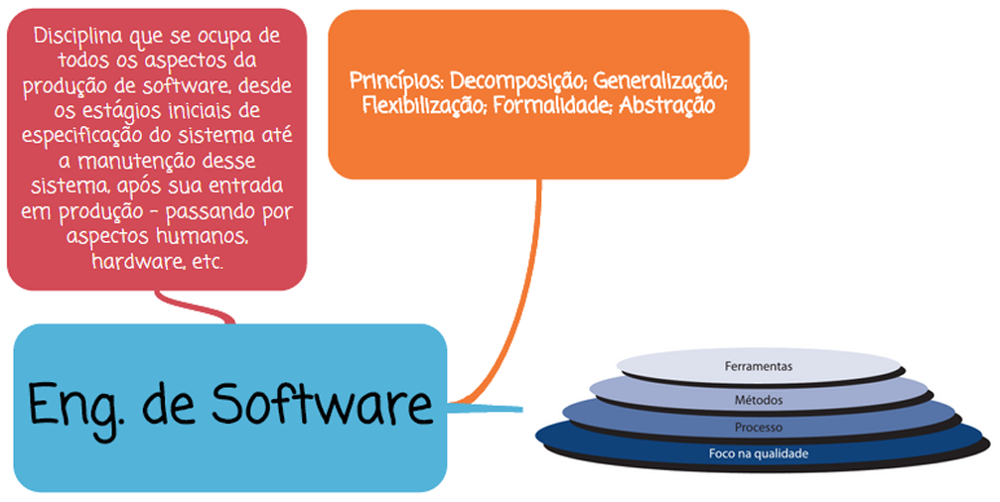

# Capítulo 1 – Fundamentos da Engenharia de Software

## O que é Software?

Ao abordar o conceito de **software**, é comum que, em uma visão leiga ou simplificada, pensemos apenas nos programas executados em computadores — como editores de texto, navegadores web ou sistemas operacionais. No entanto, essa é uma definição bastante restrita. Em termos técnicos, o software é um conjunto abrangente que inclui não apenas os programas (ou código executável), mas também todos os artefatos necessários ao seu funcionamento correto. Isso inclui, por exemplo, a documentação técnica (como manuais de instalação, configuração e manutenção), arquivos de configuração, scripts auxiliares, dados de inicialização e, em alguns casos, até informações de suporte à operação.

Portanto, podemos entender software como um produto imaterial, mas sistemático e organizado, cuja função é operar sobre hardware para realizar tarefas específicas, automatizar processos ou viabilizar soluções informacionais.

Como exemplo, considere um sistema bancário. O código que calcula os juros, valida os dados de um cliente ou registra uma transação é apenas uma parte do software. Há também documentos que orientam como instalar esse sistema, como realizar o backup das informações, como proceder em caso de falhas e até como treinar os usuários finais. Todos esses componentes, reunidos, constituem o software completo.

## O que é um Processo?

O conceito de processo está diretamente relacionado à ideia de organização e estrutura. Em termos gerais, um processo é um conjunto de atividades inter-relacionadas que visam transformar insumos (entradas) em produtos (saídas) por meio de uma sequência lógica de passos. Todo processo possui objetivos definidos, recursos utilizados, regras a serem seguidas e, idealmente, critérios de qualidade para avaliação dos resultados.

Por exemplo, o processo de fabricação de um automóvel envolve uma cadeia de etapas — como corte de chapas, soldagem, pintura, montagem e testes — que transformam matérias-primas em um veículo finalizado. De forma análoga, no contexto da engenharia de software, o processo é aquilo que guia a criação de sistemas computacionais: desde o entendimento do que precisa ser desenvolvido até a entrega final e a manutenção contínua.

## O Processo de Software

Um processo de software é, portanto, a aplicação do conceito de processo ao desenvolvimento de sistemas. Trata-se de uma sequência organizada de atividades que visa garantir que o software seja construído de forma eficiente, com qualidade, dentro do prazo e orçamento estipulados.

As principais etapas de um processo de software incluem:

- **Especificação de Requisitos**: identificar o que o cliente ou usuário final espera que o sistema faça.
- **Projeto de Software (Design)**: estruturar as soluções técnicas para atender aos requisitos.
- **Implementação (Codificação)**: escrever o código-fonte e integrar os componentes.
- **Validação e Verificação**: testar o software para garantir que ele esteja correto, completo e confiável.
- **Manutenção**: realizar correções, adaptações ou melhorias após a entrega do produto.

Seguir um processo bem definido é essencial para reduzir riscos, garantir a previsibilidade do projeto e aumentar a chance de sucesso. Diferentes processos de software foram desenvolvidos ao longo do tempo, adaptando-se a contextos específicos — como veremos em capítulos posteriores ao discutir metodologias de desenvolvimento.

## Engenharia de Software: Definição e Objetivos

A **Engenharia de Software** é a disciplina que aplica princípios de engenharia ao desenvolvimento de sistemas de software. De acordo com a definição do IEEE (Institute of Electrical and Electronics Engineers), trata-se da “aplicação de uma abordagem sistemática, disciplinada e quantificável ao desenvolvimento, operação e manutenção de software”.

Friedrich Bauer, considerado um dos pais da Engenharia de Software, afirmou que ela envolve a criação e a utilização de sólidos princípios de engenharia com o objetivo de obter software de maneira econômica, confiável e eficiente, que funcione em máquinas reais.

Em suma, a Engenharia de Software é um campo multidisciplinar que combina conhecimentos de ciência da computação, engenharia de sistemas, gerenciamento de projetos e qualidade de software. Seu foco está na produção de software com boa relação custo-benefício, que atenda aos requisitos dos usuários e seja fácil de manter e evoluir.

Essa disciplina preocupa-se com aspectos técnicos (como linguagens de programação, algoritmos, estrutura de dados), gerenciais (como estimativa de esforço, cronograma, alocação de equipe) e humanos (como comunicação, documentação e interação com os stakeholders).

Como destaca Ian Sommerville, autor referência na área: “A Engenharia de Software não está relacionada apenas com os processos técnicos de desenvolvimento de software, mas também com atividades como o gerenciamento de projeto e o desenvolvimento de ferramentas, métodos e teorias que apoiem a produção de software”.

## A Relação com a Engenharia de Sistemas

Embora o nome possa sugerir um foco exclusivo em software, a Engenharia de Software é, na verdade, um subconjunto da Engenharia de Sistemas. A Engenharia de Sistemas é uma abordagem mais ampla, que considera diversos elementos – humanos, tecnológicos, informacionais – como partes de um sistema completo.

Roger Pressman, outro autor influente, afirma que “a Engenharia de Software ocorre como consequência de um processo chamado Engenharia de Sistemas”, o qual considera não apenas o software, mas também o hardware, os processos de negócio, os usuários e o ambiente operacional.

Isso significa que o engenheiro de software, ao projetar um sistema, precisa entender o contexto maior onde esse sistema será inserido. Ele deve considerar, por exemplo, a compatibilidade com equipamentos, a infraestrutura de rede, a experiência do usuário e até a viabilidade econômica do projeto.

## Origem e Evolução da Engenharia de Software

A Engenharia de Software surgiu como uma resposta à chamada **crise do software**, termo utilizado para descrever os desafios enfrentados pelas empresas de tecnologia a partir da década de 1960. Naquela época, o crescimento da complexidade dos sistemas começou a ultrapassar a capacidade das práticas existentes de desenvolvimento, o que resultava em atrasos, estouros de orçamento, sistemas com muitos erros ou mesmo completamente inutilizáveis.

Na tentativa de resolver esse problema, conferências internacionais começaram a discutir a necessidade de encarar o desenvolvimento de software com o mesmo rigor aplicado a outras engenharias. Nasciam, assim, os primeiros esforços para criar metodologias, padrões e ferramentas voltadas à sistematização da produção de software.

Ao longo das décadas seguintes, diversas inovações marcaram a evolução da área:

- **Anos 1980**: surgimento da Análise Estruturada e das primeiras Ferramentas CASE (Computer-Aided Software Engineering), que ajudavam a automatizar etapas do processo.
- **Anos 1990**: disseminação da orientação a objetos, popularização de linguagens como Java e C++, e consolidação do Processo Unificado como método de desenvolvimento iterativo.
- **Anos 2000 e 2010**: ascensão das Metodologias Ágeis (como Scrum e XP), que colocam o cliente no centro do processo e privilegiam entregas incrementais e adaptativas.
- **Anos recentes**: integração com DevOps, entrega contínua, testes automatizados, engenharia de dados e aprendizado de máquina.

## Princípios Fundamentais da Engenharia de Software

Ao longo de sua consolidação como disciplina, a Engenharia de Software passou a se apoiar em uma série de princípios que orientam suas práticas e métodos. Entre os principais, podemos destacar:

- **Formalidade**: o desenvolvimento deve seguir um processo definido e documentado, com etapas bem estruturadas e padrões claros.
- **Abstração**: os problemas devem ser analisados em níveis conceituais, isolando os aspectos mais relevantes e ocultando detalhes desnecessários para facilitar o raciocínio.
- **Decomposição**: problemas complexos devem ser divididos em partes menores e mais gerenciáveis, que possam ser compreendidas, desenvolvidas e testadas de forma independente.
- **Generalização**: soluções devem ser projetadas de forma genérica e reaproveitável, sempre que possível, promovendo modularidade e redução de retrabalho.
- **Flexibilização**: os sistemas devem ser projetados para permitir mudanças e adaptações, garantindo sua evolução ao longo do tempo.

Esses princípios não são apenas ideias abstratas, mas norteadores concretos de boas práticas. Por exemplo, quando um time utiliza arquitetura em camadas (como MVC), está aplicando abstração e decomposição. Quando se cria uma biblioteca reutilizável para autenticação, está se valendo da generalização. E quando se utiliza testes automatizados e integração contínua, garante-se maior flexibilização e controle de mudanças.

## Considerações Finais

A Engenharia de Software é muito mais do que escrever código. Ela representa uma abordagem organizada, técnica e gerencial para lidar com a crescente complexidade dos sistemas de informação modernos. Aplicar seus princípios, seguir seus processos e dominar suas práticas é essencial para construir software que realmente atenda às necessidades humanas e organizacionais.

  

Seguir o processo, passo a passo, tal como definido ao longo do tempo por especialistas e baseado em aprendizados de sucessos e fracassos, é uma das maiores garantias de êxito no desenvolvimento de sistemas. Ao entender que a qualidade do software depende tanto da qualidade do processo quanto da competência técnica da equipe, damos um passo fundamental rumo à maturidade profissional em desenvolvimento de software.
