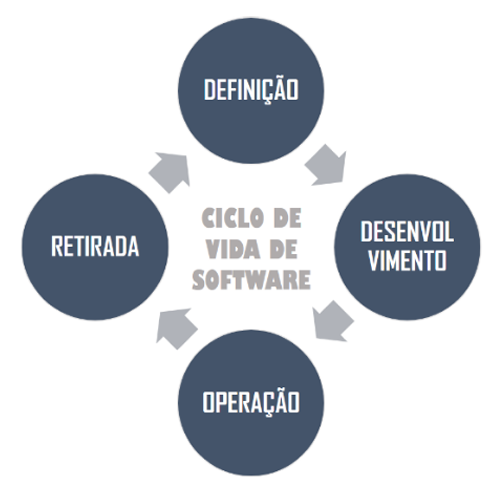
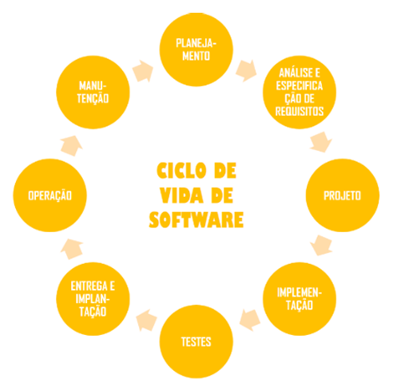

# Capítulo 2 – Ciclo de Vida e Processos de Software

O ciclo de vida de um software refere-se às etapas sequenciais e interdependentes que compõem sua existência. Trata-se de um conjunto de fases que se inicia com a identificação de uma necessidade ou problema e termina com a retirada definitiva do sistema. Ao longo da história da engenharia de software, diversos autores propuseram variações sobre essas etapas, refletindo diferentes visões e práticas de desenvolvimento. Entretanto, algumas fases são amplamente reconhecidas como comuns à maioria dos projetos.

De maneira geral, podemos entender que um software passa por momentos distintos: a definição de suas funcionalidades, o planejamento de seu desenvolvimento, a codificação propriamente dita, os testes para assegurar seu funcionamento, a entrega ao usuário final, e por fim a manutenção contínua, até que o sistema seja substituído ou desativado. Essa visão permite compreender o software como algo dinâmico, que interage constantemente com as mudanças nos requisitos dos usuários e nas tecnologias utilizadas.

Contudo, é importante reconhecer que não existe consenso entre os estudiosos da área sobre quais fases compõem o ciclo de vida de software. Alguns autores preferem uma abordagem mais genérica, com poucas fases amplas e abrangentes; outros optam por uma visão mais granular e detalhada. A seguir, exploraremos algumas das principais visões encontradas na literatura.

Uma versão bastante sintética do ciclo de vida de software compreende quatro fases principais (esquerda). Essa representação minimalista é útil para uma compreensão geral, embora não contemple as diversas atividades e nuances envolvidas no desenvolvimento de software. Outra representação mais detalhada propõe as seguintes fases (direita). Esse modelo é mais fiel ao cotidiano dos projetos de software, pois desdobra o desenvolvimento em fases distintas, permitindo maior controle e rastreabilidade.

  

Autores como Ian Sommerville e Roger Pressman oferecem interpretações distintas sobre essas fases. Para Sommerville, o ciclo é composto por quatro grandes atividades: especificação, desenvolvimento, validação e evolução. Aqui, vale notar que o desenvolvimento engloba as atividades de projeto e implementação. Trata-se de um modelo recorrente na literatura e frequentemente citado em provas. Já Pressman propõe um modelo mais detalhado, que parte da comunicação com os interessados, passa pelo planejamento e modelagem do sistema, e culmina com a construção e implantação.

  

Esses quatro modelos ilustram diferentes formas de enxergar o ciclo de vida de software. Nenhum é melhor ou pior que outro por si só; a escolha de um modelo depende do contexto em que será aplicado. Apesar das variações, todas essas abordagens buscam responder a uma mesma questão fundamental: como construir software de maneira sistemática, previsível e controlada? É nesse ponto que surge um conceito importante: **modelo de ciclo de vida de software**.

Enquanto o ciclo de vida representa as fases pelas quais um sistema passa, os modelos de ciclo de vida indicam como essas fases são organizadas e conduzidas, ou seja, eles não apenas definem as fases que compõem o ciclo, mas também explicitam como essas fases se relacionam entre si. Eles servem como guias estruturais, definindo a forma de execução do processo de desenvolvimento. 

Dessa forma, podemos distinguir:

- **Ciclo de Vida:** representa as fases pelas quais algo passa desde seu início até seu fim.
- **Ciclo de Vida de Software:** representa as fases pelas quais um software passa da concepção à desativação.
- **Modelo de Ciclo de Vida de Software:** representa as fases pelas quais um software passa da concepção à desativação e as relações entre elas.

Mais adiante, chegamos ao conceito de **processo de software**, que pode ser entendido como o conjunto de atividades, métodos, técnicas e transformações que guiam o trabalho de desenvolvimento de software. Trata-se de um elemento central na engenharia de software, pois define o “como fazer” ao longo de todas as fases do ciclo de vida. Ian Sommerville define um processo de software como "um conjunto de atividades relacionadas que levam à produção de um produto de software". Para fins práticos, muitos consideram "modelo de processo" sinônimo de "modelo de ciclo de vida". 

Contudo, um processo de software é algo mais amplo: ele é ajustado às especificidades do projeto e leva em conta o tipo de software, a tecnologia utilizada, os recursos humanos disponíveis, entre outros fatores:

- **Processos de software**: conjunto de atividades, métodos, práticas e transformações que guiam pessoas na produção de software.
- **Modelo de Processo de software**: mesmo conceito de Modelo de Ciclo de Vida - é uma representação abstrata de um processo de software.

As atividades fundamentais de qualquer processo incluem a especificação, o desenvolvimento, a validação e a evolução do software. A especificação visa entender e registrar o que o sistema deve fazer. O desenvolvimento é a fase em que o sistema é projetado e implementado. A validação garante que o software atenda aos requisitos. Por fim, a evolução trata das modificações que o sistema sofrerá após ser colocado em operação, seja para corrigir falhas, adaptar-se a novas demandas ou melhorar seu desempenho.

A escolha e adaptação de um processo de software devem levar em conta fatores como o tipo de aplicação, o contexto organizacional, as tecnologias empregadas e a composição da equipe de desenvolvimento. Não existe um processo ideal que sirva para todos os projetos; o sucesso depende da adequação do processo às características específicas de cada situação.

A escolha de um modelo de ciclo de vida (ou modelo de processo) é o ponto de partida para a definição de um processo de desenvolvimento de software. Um modelo de ciclo de vida, geralmente, organiza as macro-atividades básicas do processo, estabelecendo precedência e dependência entre as mesmas.

Conforme dito anteriormente, alguns autores afirmam que os modelos de ciclo de vida básicos, de maneira geral, contemplam pelo menos as fases de: Planejamento; Análise e Especificação de Requisitos; Projeto; Implementação; Testes; Entrega e Implantação; Operação; e Manutenção. Abaixo eu trago uma descrição genérica sobre cada uma dessas fases. Para entender melhor, vejamos a descrição genérica das fases de um modelo de ciclo de vida comumente aceito:

|Fase|Descrição|
| --- | --- |
|Planejamento|O planejamento estabelece o escopo do projeto e define estimativas de recursos, prazos e custos. Um plano de projeto deve ser elaborado e atualizado conforme o projeto progride. Essa fase é essencial para a gestão e o acompanhamento do desenvolvimento.|
|Análise e Especificação de Requisitos|Aqui, os requisitos do sistema são investigados, documentados e validados. Envolve entrevistas, reuniões e observações com stakeholders. O resultado é um modelo funcional do que o software  tem de fazer (e não como fazê-lo).|
|Projeto|Essa fase transforma os requisitos em uma solução concreta. Envolve projeto da arquitetura (visão macro do sistema) e projeto detalhado (descrição precisa de cada componente). O objetivo é gerar um guia claro para a implementação.|
|Implementação|Consiste na codificação do sistema de acordo com o projeto detalhado. Cada módulo é desenvolvido de forma a cumprir os requisitos especificados.|
|Testes|Engloba os testes de unidade, integração e sistema. Visa detectar e corrigir erros e verificar se o software atende às necessidades dos usuários.|
|Entrega e Implantação|O sistema é disponibilizado aos usuários. Envolve a instalação no ambiente de produção, treinamento dos usuários e testes de aceitação.|
|Operação|Corresponde ao uso efetivo do software em ambiente real. Essa fase pode durar anos, com o sistema sendo utilizado rotineiramente pelos usuários.|
|Manutenção|A manutenção pode ser corretiva, adaptativa ou evolutiva. Envolve modificações necessárias após a entrega para corrigir defeitos, adaptar o sistema a novas condições ou incluir novas funcionalidades.|

Além dessas fases, modelos mais completos incluem outras atividades como:

- **Análise (como atividade distinta do projeto):** foca na modelagem do problema (diferente do projeto, responsável por modelar a solução do problema).
- **Homologação:** fase de aceitação formal do sistema.
- **Gerência de Configuração:** controle sistemático de versões, artefatos e documentação.

Segundo Sommerville, um processo de software é um conjunto de atividades e resultados associados que produz um produto de software. Para ele, quatro atividades fundamentais estão presentes em todo processo:

- Especificação de Software
- Desenvolvimento de Software (Projeto e Implementação)
- Validação de Software
- Evolução de Software

Ainda segundo o autor, um modelo de processo de software é uma representação simplificada do processo real. Ele destaca três modelos principais:

- Modelo em Cascata
- Desenvolvimento Iterativo
- Engenharia de Software Baseada em Componentes

Isso entra em contradição com o que dizem outros autores, isto é, os principais modelos podem ser agrupados em três categorias:

- Modelos sequenciais
- Modelos incrementais
- Modelos evolutivos

  

Por fim, o conceito de **Metodologia de Desenvolvimento de Software** (ou processo de desenvolvimento de software) diz respeito a uma caracterização prescritiva ou descritiva do modo como o software deve ser desenvolvido. Ela define o "quê", o "como" e o "quando" das atividades de desenvolvimento, oferecendo diretrizes, técnicas e ferramentas que conduzem à construção de produtos de qualidade. Elas representam estratégias sistemáticas para planejar, executar e controlar as atividades de desenvolvimento.

Tradicionalmente, utilizavam-se metodologias prescritivas, que seguiam uma sequência rígida de fases, como o modelo em cascata. Essas abordagens priorizavam a documentação e o planejamento antecipado. Contudo, com a crescente necessidade de agilidade e adaptação, surgiram as metodologias ágeis, que enfatizam a colaboração entre as partes interessadas, a entrega frequente de software funcional e a capacidade de resposta a mudanças nos requisitos.

Scrum, Extreme Programming (XP) e Kanban são exemplos de abordagens ágeis que ganharam destaque. Elas propõem ciclos curtos de desenvolvimento, com reuniões constantes e um foco intenso na comunicação dentro da equipe. Essas metodologias tornaram-se particularmente valiosas em contextos de inovação, onde os objetivos e requisitos do sistema evoluem rapidamente.

## Considerações Finais

Compreender o ciclo de vida e os processos de software é essencial para quem deseja desenvolver sistemas de forma eficaz e sustentável. A escolha dos modelos e metodologias mais adequados depende de uma análise cuidadosa do projeto, do ambiente organizacional e da natureza da aplicação. Quando essas escolhas são feitas de maneira consciente e embasada, aumentam-se significativamente as chances de sucesso, qualidade e longevidade do produto final.
