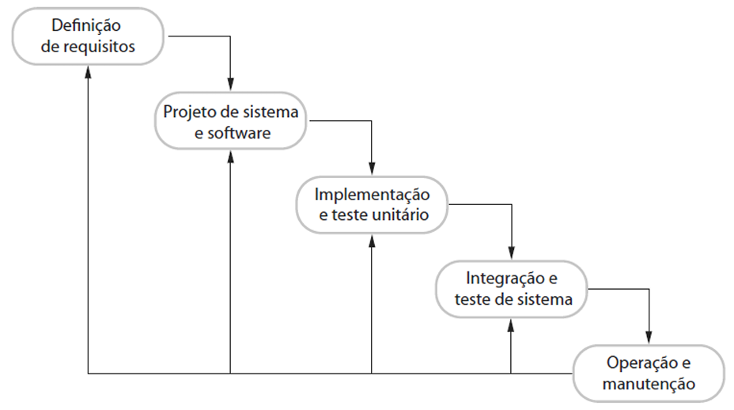
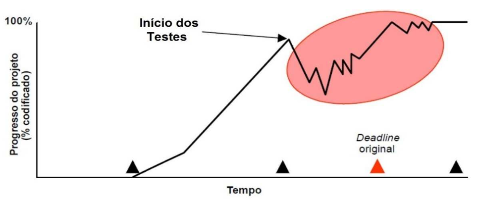

# Capítulo 2 – Modelos Sequenciais: Cascata e V

Dentro do vasto universo da Engenharia de Software, os modelos de processo representam abordagens sistemáticas e estruturadas para organizar, executar e gerenciar os complexos projetos de desenvolvimento de sistemas. Entre as diversas filosofias e arcabouços propostos ao longo das décadas, os chamados **modelos sequenciais** ocupam um lugar de destaque histórico. Como o próprio nome sugere, eles adotam uma lógica linear e progressiva, na qual as fases do ciclo de vida do software se sucedem de forma ordenada e rígida, como se os passos fossem degraus de uma escada ou elos de uma corrente, onde cada etapa deve ser concluída antes que a próxima possa começar. Essa abordagem, embora hoje contrastante com a flexibilidade exigida por muitos projetos modernos, estabeleceu as bases para a disciplina e ainda encontra aplicação em contextos específicos.

Dois modelos sequenciais clássicos ganharam notoriedade e se tornaram referências fundamentais: o **Modelo em Cascata** (também conhecido como _Waterfall_) e sua evolução, o **Modelo em V**. Ambos compartilham uma visão estruturada e planejada do desenvolvimento, enfatizando a definição completa de requisitos no início e uma progressão controlada através das fases de projeto, implementação e teste. Ainda que tenham perdido espaço significativo para abordagens mais adaptativas, como os métodos ágeis, a compreensão profunda desses modelos continua sendo essencial, tanto do ponto de vista educacional – por formarem a base conceitual sobre a qual outros modelos foram construídos – quanto em situações práticas onde a previsibilidade e a documentação rigorosa são requisitos indispensáveis.

## Modelo em Cascata

O Modelo em Cascata foi formalmente descrito pela primeira vez em 1970 por **Winston W. Royce**, em um artigo influente que, ironicamente, já apontava as limitações de uma abordagem puramente sequencial e propunha melhorias iterativas. Apesar das ressalvas do próprio autor, a simplicidade e a clareza da estrutura linear fizeram com que ela fosse amplamente popularizada e adotada pela indústria nas décadas seguintes, tornando-se o paradigma dominante por muitos anos. Ao longo do tempo, recebeu diversas denominações que refletem suas características: **Modelo Clássico, Modelo Sequencial, Modelo Linear, Modelo Tradicional, Modelo Rígido, Modelo _Top-Down_, Modelo Monolítico**, ou, em sua versão original em inglês, **_Waterfall Model_**.

A origem do termo "cascata" é uma analogia direta ao fluxo contínuo e unidirecional de uma queda d’água, que passa de um nível (fase) ao seguinte sem a possibilidade de retornar facilmente ao nível anterior. Nesse modelo, a regra fundamental é que uma **fase só pode ser iniciada após a completa finalização, revisão e aprovação formal da fase anterior**. Os produtos (artefatos, documentos) gerados em uma fase servem como a entrada obrigatória e imutável para a fase subsequente. Essa rigidez no encadeamento das etapas tem implicações profundas na gestão de riscos, na capacidade de adaptação a mudanças e na visibilidade do produto final, como exploraremos em detalhe.

### Fases do Modelo em Cascata

Uma das principais dificuldades ao estudar o Modelo em Cascata reside na diversidade de terminologias e no nível de detalhamento adotados por diferentes autores para descrever suas fases constituintes. A estrutura geral é invariavelmente sequencial, mas os nomes e a granularidade das etapas podem variar consideravelmente. A tabela a seguir compara como três autores de referência na Engenharia de Software – Ian Sommerville, Winston Royce (em sua descrição original) e Roger Pressman (em diferentes edições de sua obra) – segmentam o processo:

| **Ian Sommerville**               | **Winston Royce**      | **Roger Pressman (4ª ed)**                   | **Roger Pressman (6ª ed)** |
| --------------------------------- | ---------------------- | -------------------------------------------- | -------------------------- |
| Análise e definição de requisitos | Requisitos de sistema  | Modelagem e engenharia do sistema/informação | Comunicação                |
| Projeto de sistema e software     | Requisitos de software | Análise de requisitos de software            | Planejamento               |
| Implementação e teste de unidade  | Análise                | Projeto                                      | Modelagem                  |
| Integração e teste de sistema     | Projeto                | Geração de código                            | Construção                 |
| Operação e manutenção             | Codificação            | Teste e manutenção                           | Implantação                |
|                                   | Teste                  |                                              |                            |
|                                   | Operação               |                                              |                            |

Essa divergência não representa um problema técnico fundamental, mas sim uma questão de interpretação, ênfase e evolução conceitual. Cada autor propõe uma segmentação que melhor se alinha à sua visão pedagógica ou ao enfoque específico de sua obra. O ponto crucial a ser compreendido é que, independentemente da nomenclatura adotada, o **modelo se baseia invariavelmente em uma sequência rígida de etapas, onde o produto final de uma fase serve como a linha de base congelada para o início da próxima**.

Para aprofundar a compreensão, vamos analisar em detalhe a visão proposta por Ian Sommerville, frequentemente utilizada como referência:

|**Fase**|**Descrição**|**Artefatos Comuns Gerados**|
|---|---|---|
|Análise e definição de requisitos|Fase inicial onde os serviços, restrições e objetivos do sistema são estabelecidos através de consulta aos usuários e stakeholders. As expectativas são identificadas, analisadas e documentadas detalhadamente. O resultado é a **especificação de requisitos**, um documento formal que define o que o sistema deve fazer.|Documento de Visão, Documento de Requisitos de Software|
|Projeto de sistema e software|A especificação de requisitos é traduzida em uma arquitetura de sistema. Define-se a estrutura geral do software, a alocação de responsabilidades entre hardware e software (se aplicável), e o projeto detalhado dos componentes de software, incluindo estruturas de dados, algoritmos, interfaces entre módulos e banco de dados.|Documento de Arquitetura, Especificações de Projeto|
|Implementação e teste de unidade|O projeto de software é transformado em código executável na linguagem de programação escolhida. Os desenvolvedores codificam cada módulo ou unidade de forma independente e realizam **testes de unidade** para verificar se cada peça funciona corretamente, isoladamente, de acordo com sua especificação.|Código-fonte, Casos de Teste de Unidade, Relatórios|
|Integração e teste de sistema|Os módulos individuais já testados são integrados progressivamente para formar o sistema completo. Após a integração, realizam-se **testes de sistema** para verificar se os componentes interagem corretamente e se o sistema como um todo atende aos requisitos funcionais e não funcionais definidos na especificação original.|Sistema Integrado, Casos de Teste de Sistema, Relatórios|
|Operação e manutenção|Fase mais longa do ciclo de vida. O software é entregue, instalado no ambiente do cliente (implantação) e entra em uso real (operação). A **manutenção** envolve a correção de erros que não foram detectados nas fases anteriores (corretiva), adaptações a mudanças no ambiente (adaptativa) ou melhorias e novas funcionalidades (evolutiva/perfectiva).|Software em Produção, Logs, Relatórios de Bugs|

A ilustra essa sequência, mostrando o fluxo descendente principal e a possibilidade (embora limitada e custosa no modelo puro) de feedback para a fase imediatamente anterior.

Tomando um exemplo prático, imagine o desenvolvimento de um sistema de controle de estoque para uma pequena livraria utilizando o Modelo em Cascata. Primeiro, a equipe passaria semanas ou meses levantando _todos_ os requisitos com o dono da livraria: cadastro de livros (ISBN, título, autor, editora, preço, quantidade), registro de entradas (compras de fornecedores), registro de saídas (vendas), geração de relatórios de inventário, controle de livros mais vendidos, talvez um sistema simples de busca. Somente após o dono da livraria aprovar formalmente o documento de requisitos, a equipe passaria para a fase de projeto, definindo a arquitetura, o banco de dados e as telas. Depois, todo o sistema seria codificado. Em seguida, testes completos seriam realizados. Finalmente, o sistema seria instalado na livraria. Se, _somente neste momento_, o dono percebesse que esqueceu de pedir uma funcionalidade essencial, como o controle de consignação ou a integração com um leitor de código de barras, a incorporação dessa mudança seria extremamente problemática. Exigiria retornar à fase de requisitos, refazer parte do projeto, recodificar módulos afetados e retestar tudo, gerando um impacto significativo no prazo e no custo originalmente planejados.

### Desafios Práticos

Embora sua estrutura lógica e sequencial pareça organizada e fácil de gerenciar no papel, o Modelo em Cascata enfrenta sérios desafios quando aplicado a projetos de software no mundo real, especialmente aqueles de maior complexidade ou com requisitos incertos. Um dos problemas mais críticos é a sua **inerente falta de flexibilidade**. Em sistemas reais, é extremamente comum que os requisitos mudem ao longo do projeto. Essas mudanças podem surgir devido a novas necessidades do cliente que só se tornam claras com o tempo, alterações no ambiente de negócios (novas leis, concorrentes), evolução da tecnologia ou simplesmente porque a compreensão do problema amadurece durante o desenvolvimento. O modelo cascata, com sua estrutura rígida e fases congeladas, lida muito mal com essas mudanças. Voltar a uma fase anterior para incorporar uma alteração é um processo formal, custoso e que pode desestabilizar todo o cronograma.

Além disso, a natureza sequencial do modelo atrasa significativamente a **redução de riscos** e a **detecção de erros**. Falhas cometidas nas fases iniciais – como um requisito mal interpretado ou um erro fundamental no projeto da arquitetura – geralmente só são descobertas muito mais tarde, durante as fases de teste ou, pior ainda, após a implantação do sistema. O gráfico de progresso típico de um projeto em cascata, ilustrado abaixo, demonstra esse fenômeno. A linha de progresso (% codificado) sobe de forma aparentemente suave durante a implementação, mas ao entrar na fase de testes (marcada pela elipse vermelha), o progresso torna-se errático, com subidas e descidas, refletindo o ciclo de encontrar bugs, corrigi-los (o que pode introduzir novos bugs) e retestar.

Note também que o projeto frequentemente ultrapassa o prazo final (_deadline_) original. Isso ocorre porque a correção de erros encontrados tardiamente é exponencialmente mais cara e demorada do que se fossem detectados no início. Como a redução de riscos e a validação são postergadas, qualquer problema significativo descoberto no final pode levar a um extenso retrabalho, impactando não apenas o prazo, mas também o orçamento e, potencialmente, até mesmo o escopo final do projeto.

Outros problemas práticos frequentemente associados ao Modelo em Cascata incluem:

- **Alto risco acumulado:** Os maiores riscos (tecnológicos, de requisitos) só são confrontados nas fases finais.
- **Atraso na visibilidade do produto:** O cliente ou usuário final só vê o software funcionando em um estágio muito avançado, geralmente perto da entrega final. Isso impede o feedback precoce e aumenta o risco de o produto final não atender às expectativas reais, mesmo que cumpra a especificação escrita.
- **Atraso na identificação de erros:** Como mencionado, falhas de concepção ou requisitos podem passar despercebidas por meses, tornando sua correção muito mais complexa e cara. Um erro de requisito que custaria $1 para corrigir na fase de requisitos pode custar $1000 para corrigir após a implantação.
- **Estados de bloqueio e ineficiência da equipe:** Em um fluxo estritamente sequencial, é comum que partes da equipe fiquem ociosas. Por exemplo, os testadores podem ter pouco a fazer enquanto a codificação está em andamento, e os codificadores podem ficar bloqueados aguardando a finalização completa do projeto detalhado.
- **Inadequação a projetos reais:** A grande maioria dos projetos de software do mundo real não segue um fluxo perfeitamente linear. Requisitos evoluem, prioridades mudam, e a necessidade de feedback é constante.
- **Dificuldade intrínseca na definição completa de requisitos:** É muito difícil, e muitas vezes impossível, para um cliente articular _todos_ os seus requisitos de forma completa, correta e inequívoca no início de um projeto, especialmente para sistemas inovadores ou complexos. O modelo cascata exige essa definição inicial completa e tem dificuldade em acomodar a incerteza natural do processo.
- **Longa espera do cliente:** O cliente precisa esperar até o final do ciclo para ter acesso a uma versão operacional do software, o que pode ser problemático em mercados competitivos onde a velocidade de entrega é crucial.

Para exemplificar concretamente o custo de um erro tardio, retomemos o exemplo do sistema de estoque da livraria. Suponha que, durante a análise de requisitos, a equipe interpretou que o controle de estoque deveria ser feito apenas pelo código ISBN do livro. O projeto, a implementação e os testes foram todos baseados nessa premissa. Após a entrega, o dono da livraria percebe que, para livros usados ou edições diferentes com o mesmo ISBN, ele precisava, na verdade, de um controle por lote ou por identificador único de exemplar. Descobrir essa falha de requisito após o sistema estar pronto pode exigir uma reestruturação profunda do banco de dados, da lógica de negócio em várias partes do sistema e de todos os relatórios. O custo seria imenso. Agora, imagine que essa mesma necessidade de controle por lote fosse identificada logo após a fase de requisitos, durante uma reunião de validação com o cliente antes do início do projeto. A correção envolveria apenas ajustar o documento de requisitos e, talvez, o modelo conceitual de dados, com um custo e impacto mínimos no cronograma.

### Vantagens e Cenários de Aplicação

Apesar das críticas contundentes e de sua inadequação para muitos cenários modernos, o Modelo em Cascata possui algumas vantagens e ainda pode ser uma abordagem apropriada em contextos muito específicos. Suas principais qualidades são:

- **Simplicidade e Facilidade de Entendimento:** Sua estrutura linear e fases bem definidas o tornam fácil de explicar, entender e gerenciar, sendo um bom ponto de partida para equipes com pouca experiência em processos formais.
- **Estrutura e Disciplina:** Impõe uma ordem clara ao processo, o que pode ser útil para padronizar o desenvolvimento e garantir que todas as etapas sejam executadas.
- **Ênfase na Documentação:** Como cada fase produz documentos formais que são revisados e aprovados antes de prosseguir, o modelo tende a gerar uma documentação completa e detalhada, o que facilita a manutenção futura e a rastreabilidade das decisões.
- **Divisão Clara de Responsabilidades:** As fases distintas permitem alocar especialistas para cada etapa (analistas de requisitos, arquitetos, programadores, testadores), o que pode ser eficiente em organizações com estruturas funcionais bem definidas.

Considerando essas características, o Modelo em Cascata pode ser uma escolha defensável (embora raramente ideal) nas seguintes situações:

- **Requisitos Extremamente Estáveis e Bem Compreendidos:** Quando o escopo do projeto é muito bem definido desde o início e há pouca ou nenhuma expectativa de mudanças nos requisitos ao longo do desenvolvimento. Isso pode ocorrer em projetos de migração de sistemas legados bem documentados ou no desenvolvimento de software embarcado com especificações rígidas e imutáveis.
- **Sistemas Críticos com Alta Necessidade de Formalidade:** Em domínios onde a segurança ou a vida humana estão em jogo (ex: software para aviação, equipamentos médicos, sistemas nucleares), a necessidade de documentação exaustiva, revisões formais em cada etapa e rastreabilidade completa pode justificar uma abordagem sequencial rigorosa.
- **Projetos Pequenos e Simples:** Para projetos muito pequenos, onde a complexidade é baixa e a equipe é reduzida, a sobrecarga de gerenciamento de modelos mais complexos pode não se justificar, e a simplicidade do cascata pode ser suficiente.
- **Equipes com Baixa Experiência ou Resistência a Mudanças:** Em alguns contextos organizacionais, a clareza e a rigidez do cascata podem ser mais fáceis de implementar do que modelos que exigem maior colaboração e adaptação.

Contudo, é fundamental reiterar que, na grande maioria dos projetos de software contemporâneos, caracterizados por ambientes de negócios dinâmicos, requisitos emergentes e a necessidade de feedback rápido, a aplicação do Modelo em Cascata puro tende a ser inadequada e arriscada, podendo levar a produtos que não atendem às necessidades reais do mercado ou dos usuários.

## Modelo em V

Reconhecendo as limitações do Modelo em Cascata, especialmente a detecção tardia de falhas, surgiu uma variação conhecida como **Modelo em V**. Ele não abandona a natureza sequencial, mas a reorganiza visual e conceitualmente para dar um **destaque explícito à relação entre as atividades de desenvolvimento e as atividades de teste (Verificação e Validação - V&V)**. Ele representa uma evolução direta do cascata, buscando integrar o controle de qualidade de forma mais sistemática ao longo do processo.

### Estrutura e Filosofia

A estrutura gráfica do modelo, que lhe confere o nome, assemelha-se a uma letra "V". No lado esquerdo descendente do "V", encontram-se as fases de **especificação e projeto**, que detalham progressivamente o sistema, desde os requisitos de alto nível até o design detalhado dos módulos. No lado direito ascendente do "V", estão as fases correspondentes de **validação e testes**, que verificam e validam o sistema em níveis crescentes de integração, culminando na aceitação final. O ponto mais baixo do "V" representa a fase de **codificação ou implementação**, onde o código é efetivamente escrito.

O grande diferencial e a filosofia central do Modelo em V é a **correspondência explícita e o planejamento paralelo entre cada etapa de desenvolvimento e sua respectiva etapa de V&V**. Isso significa que, ao mesmo tempo em que uma especificação ou projeto é criado (lado esquerdo), a estratégia e os casos de teste para validar aquela especificação ou projeto já começam a ser planejados e preparados (lado direito). Essa ligação direta é ilustrada pelas setas horizontais no diagrama, conectando, por exemplo:

- **Análise de Requisitos (Requirements)** está ligada ao **Teste de Aceitação (Acceptance Testing)**: Os testes de aceitação são planejados com base nos requisitos do usuário para validar se o sistema final atende às suas necessidades e expectativas.
- **Projeto do Sistema (System Design)** está ligado ao **Teste de Sistema (System Testing)**: Os testes de sistema são planejados com base no design geral do sistema para verificar se todos os componentes integrados funcionam juntos conforme especificado.
- **Projeto da Arquitetura (Architecture Design)** está ligado ao **Teste de Integração (Integration Testing)**: Os testes de integração são planejados com base no design da arquitetura para verificar se os módulos ou componentes interagem corretamente entre si.
- **Projeto do Módulo/Detalhado (Module Design)** está ligado ao **Teste de Unidade (Unit Testing)**: Os testes de unidade são planejados com base no design detalhado de cada módulo para verificar se ele funciona corretamente de forma isolada.
- **Codificação (Coding)** é o ponto de inflexão onde o desenvolvimento "desce" e os testes começam a "subir".

Essa abordagem garante que a **atividade de teste não seja relegada ao final do projeto**, mas sim considerada e planejada desde as fases iniciais. A definição dos critérios de teste e aceitação ocorre em paralelo com a definição do que será construído, o que força uma maior clareza nas especificações e antecipa a identificação de ambiguidades ou problemas potenciais.

Para ilustrar, consideremos o desenvolvimento de um sistema de automação residencial usando o Modelo em V. Durante a fase de Análise de Requisitos, define-se a funcionalidade: “O sistema deve permitir que o usuário agende o acendimento das luzes da sala para as 18h todos os dias úteis”. Simultaneamente, no planejamento do Teste de Aceitação, a equipe já define o caso de teste correspondente: "Verificar se, ao configurar o agendamento para 18h de segunda a sexta, as luzes da sala acendem automaticamente nesses horários e permanecem apagadas nos fins de semana". Esse planejamento antecipado do teste ajuda a garantir que o requisito seja claro, testável e que o desenvolvimento subsequente (projeto e codificação) tenha um objetivo de validação bem definido desde o início.

### Vantagens e Desvantagens do Modelo em V

O Modelo em V herda algumas das características do Modelo em Cascata, mas introduz melhorias significativas relacionadas ao controle de qualidade.

As principais **vantagens** são:

- **Ênfase em Verificação e Validação:** O teste é uma atividade planejada e integrada desde o início, não uma reflexão tardia, o que tende a melhorar a qualidade do produto final.
- **Detecção Precoce de Defeitos (Relativa):** Embora não tão cedo quanto em modelos iterativos, o planejamento antecipado dos testes ajuda a identificar ambiguidades e falhas nas especificações e projetos mais cedo do que no cascata puro.
- **Clareza e Rastreabilidade:** A correspondência clara entre as fases de desenvolvimento e teste facilita o gerenciamento e a rastreabilidade, garantindo que cada requisito e decisão de projeto seja devidamente testado.
- **Adequado para Projetos Críticos:** Assim como o cascata, sua estrutura formal e a ênfase em V&V o tornam adequado para projetos onde a confiabilidade e a segurança são primordiais.

No entanto, o Modelo em V também compartilha muitas das **desvantagens** do seu predecessor:

- **Rigidez e Pouca Flexibilidade:** Assim como o cascata, ele lida mal com mudanças nos requisitos após o início do projeto. Uma alteração em um requisito exige a revisão não apenas das fases de desenvolvimento subsequentes, mas também dos planos de teste correspondentes.
- **Alto Custo de Mudanças Tardias:** Embora a detecção de erros seja potencialmente antecipada, mudanças significativas nos requisitos descobertas tardiamente ainda geram um alto custo de retrabalho em múltiplas fases.
- **Visibilidade Tardia do Produto:** O cliente ainda só interage com uma versão funcional do software nas fases finais de teste de sistema e aceitação.
- **Não Adequado para Projetos Complexos ou com Requisitos Incertos:** Se os requisitos não são bem compreendidos no início, o modelo se torna arriscado.

Em resumo, o Modelo em V é uma melhoria incremental sobre o Modelo em Cascata, especialmente no que diz respeito à integração do processo de teste. Ele força uma mentalidade de qualidade desde o início, mas mantém a rigidez sequencial que o torna inadequado para a maioria dos projetos de software modernos que exigem adaptabilidade e feedback contínuo.

## Considerações Finais

O Modelo em Cascata e o Modelo em V representam a primeira geração de processos formais de desenvolvimento de software, marcados por uma abordagem **sequencial, planejada e focada na documentação**. Eles trouxeram uma estrutura e disciplina necessárias em uma época onde o desenvolvimento era frequentemente caótico. Em um mundo ideal, onde os requisitos pudessem ser perfeitamente definidos no início e não sofressem alterações, esses modelos seriam altamente eficientes. No entanto, a realidade do desenvolvimento de software raramente se encaixa nesse cenário. A necessidade de lidar com a incerteza, a evolução dos requisitos e a demanda por entregas mais rápidas e feedback contínuo levou à busca por alternativas.

Ainda assim, a **compreensão desses modelos sequenciais é fundamental para a formação de qualquer engenheiro de software**. Eles não apenas fornecem um contexto histórico importante, mas também introduzem conceitos de fases, artefatos e controle de processo que servem como base para a compreensão de modelos mais avançados. Em particular, **o Modelo em V representa um passo significativo na tentativa de mitigar as deficiências do Cascata, ao integrar formalmente as atividades de verificação e validação ao longo do ciclo de desenvolvimento, aproximando a construção do controle de qualidade**. Ambos os modelos, contudo, só devem ser considerados em cenários muito específicos: quando os requisitos são excepcionalmente estáveis e bem compreendidos desde o início, ou em domínios de altíssima criticidade onde a formalidade, a documentação exaustiva e o controle rigoroso de cada etapa são requisitos não negociáveis, como no desenvolvimento de software para sistemas embarcados em equipamentos médicos, aeronaves ou infraestruturas críticas.

No próximo capítulo, iniciaremos nossa exploração justamente das abordagens que surgiram como resposta direta às limitações dos modelos sequenciais: os **modelos iterativos, incrementais e evolutivos**. Veremos como esses modelos abraçam a mudança, promovem maior flexibilidade, incentivam o envolvimento contínuo do cliente e buscam reduzir os riscos desde as fases iniciais do projeto, refletindo de forma mais realista a natureza dinâmica do desenvolvimento de software moderno.