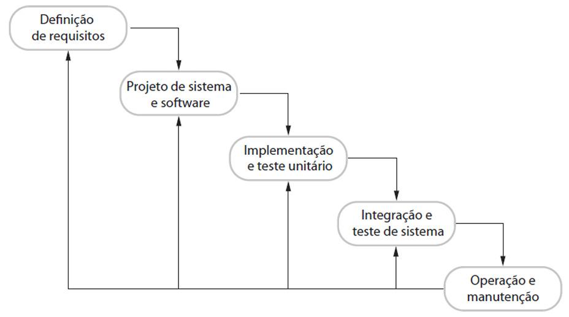

# Capítulo 3 – Modelos Sequenciais: Modelo em Cascata e Modelo em V

Dentro do universo da Engenharia de Software, os modelos de processo representam abordagens sistemáticas para organizar, executar e gerenciar projetos de desenvolvimento. Entre esses modelos, os chamados **modelos sequenciais** são os mais tradicionais. Como o próprio nome sugere, eles adotam uma lógica linear e progressiva, na qual cada fase sucede a anterior de forma rígida, como se os passos fossem degraus de uma escada.

Dois modelos sequenciais clássicos ganharam notoriedade ao longo das últimas décadas: o **Modelo em Cascata** (ou Waterfall) e o **Modelo em V**. Ambos compartilham uma visão estruturada do desenvolvimento de software, e ainda que tenham perdido espaço para abordagens mais flexíveis, como os métodos ágeis, continuam sendo fundamentais tanto em contextos educacionais quanto em situações específicas do mundo real.

## Modelo em Cascata: Origem, Fundamentos e Evolução

O Modelo em Cascata foi descrito pela primeira vez em 1970 por **Winston W. Royce**, em um artigo que, curiosamente, criticava a rigidez de uma abordagem puramente sequencial. Ainda assim, essa estrutura linear foi popularizada e adotada por muitos profissionais da época, sendo chamada de diversos nomes: **Modelo Clássico, Sequencial, Linear, Tradicional, Rígido, Top-Down, Monolítico**, ou, em sua versão original, **Waterfall Model**.

  

A origem do termo "cascata" refere-se ao fluxo contínuo de uma fase para outra, como uma queda d’água que passa de um nível ao seguinte sem retornar. Nesse modelo, uma **fase só é iniciada após a completa finalização e aprovação da fase anterior**. A rigidez desse encadeamento tem implicações diretas na gestão de riscos e na flexibilidade do processo, como veremos mais adiante.

### Fases do Modelo em Cascata

Uma das principais dificuldades ao estudar o Modelo em Cascata está na diversidade de terminologias adotadas por diferentes autores. A estrutura geral é semelhante, mas os nomes e a granularidade das fases variam. A seguir, apresentamos como três autores renomados descrevem essas fases:

|Ian Sommerville|Winston Royce|
| --- | --- |
|Análise e definição de requisitos|Requisitos de sistema|
|Projeto de sistema e software|Requisitos de software|
|Implementação e teste de unidade|Análise|
|Integração e teste de sistema|Projeto|
|Operação e manutenção|Codificação|
||Teste|
||Operação|

| Roger Pressman (4ª ed)                       | Roger Pressman (6ª ed) |
| -------------------------------------------- | ---------------------- |
| Modelagem e engenharia do sistema/informação | Comunicação            |
| Análise de requisitos de software            | Planejamento           |
| Projeto                                      | Modelagem              |
| Geração de código                            | Construção             |
| Teste e manutenção                           | Implantação            |

Essa divergência não é um problema técnico, mas uma questão de interpretação e ênfase. Cada autor propõe uma segmentação que melhor se adapta à sua visão pedagógica ou ao enfoque da obra. O importante é compreender que, independentemente da nomenclatura, o **modelo baseia-se em uma sequência rígida de etapas, nas quais o produto de uma fase serve de entrada para a próxima**.

Vamos analisar, em detalhe, a visão de Ian Sommerville, um dos principais estudiosos da Engenharia de Software:

|Fase|Descrição|
| --- | --- |
|Análise e definição de requisitos|É a fase em que as expectativas dos usuários são identificadas por meio de entrevistas, reuniões e observações. Os requisitos funcionais e não funcionais do sistema são documentados, formando a **especificação de requisitos**, que serve de referência para as etapas seguintes.|
|Projeto de sistema e software|Aqui, o sistema é arquitetado. A alocação de responsabilidades entre hardware e software é realizada e, em seguida, é feito o projeto do software propriamente dito, com a definição das estruturas de dados, algoritmos, módulos e interações.|
|Implementação e teste de unidade|Os módulos definidos na fase anterior são codificados em uma linguagem de programação e testados individualmente, a fim de garantir que atendem às suas especificações.|
|Integração e teste de sistema|Os módulos desenvolvidos são integrados, e o sistema é testado como um todo. Os testes visam verificar se os requisitos originais foram de fato implementados de forma satisfatória.|
|Operação e manutenção|Após a entrega e implantação, o sistema entra em operação. Nessa fase, são corrigidos erros residuais, feitas melhorias e adaptações conforme surgem novos requisitos.|

 

  

Tomando um exemplo prático, imagine o desenvolvimento de um sistema de controle de estoque para uma empresa. No Modelo em Cascata, as funcionalidades (entrada, saída, relatórios, controle de fornecedores etc.) são todas definidas na fase de requisitos. O cliente só verá o sistema funcionando após a conclusão de todas as fases. Se ele perceber que precisa de uma funcionalidade adicional, como alertas automáticos por e-mail, essa demanda exigirá o retorno a fases anteriores, o que pode implicar alto custo e atraso.

### Problemas Práticos do Modelo em Cascata

Embora estruturado e bem documentado, o Modelo em Cascata enfrenta sérios desafios no uso prático. Um dos principais é a **falta de flexibilidade**. Em sistemas reais, frequentemente os requisitos mudam – seja por novas necessidades do cliente, mudanças no mercado ou avanços tecnológicos.

Além disso, erros só são descobertos somente após o início dos testes e implantação. Podemos notar no gráfico abaixo que, a partir da região vermelha, o progresso do projeto sobe e desce diversas vezes, porque provavelmente o sistema está sendo corrigido devido a requisitos modificados.

  

Veja, também, que o projeto não terminou em seu deadline (prazo de conclusão) original. Como a redução de riscos atrasou, todo andamento do projeto também atrasou. Dessa forma, não se cumpriu nem o prazo do projeto e, provavelmente, nem o orçamento e talvez nem seu escopo – tendo em vista que, quanto mais ao fim do projeto um erro é identificado, mais caras se tornam as modificações.

Além disso, a rigidez sequencial atrasa a **redução de riscos**. Erros nos requisitos ou no projeto só serão percebidos muito tempo depois, durante testes ou na implantação. Isso leva ao temido retrabalho.

Outros problemas práticos que podem ser citados são:

- **Alto risco acumulado**: A redução de riscos acontece muito tardiamente no projeto.
- **Atraso na visibilidade do produto**: O cliente só vê o sistema pronto no final, o que pode gerar frustrações caso suas expectativas tenham sido mal interpretadas.
- **Atraso na identificação de erros**: Falhas cometidas nas fases iniciais geralmente só são descobertas no final, aumentando o custo de correção.
- **Estados de bloqueio**: Algumas equipes ficam ociosas aguardando a conclusão de etapas anteriores, o que prejudica a produtividade.
- **Pouco aplicação a projetos reais**: Projetos reais raramente seguem o fluxo sequencial que o modelo propõe.
- **Dificuldade de definição de requisitos**: Frequentemente, é difícil para o cliente estabelecer explicitamente todas as necessidades. O modelo cascata requer isso e tem dificuldade para adequar a incerteza natural que existe no início de muitos projetos. 
- **Espera do cliente**: O cliente espera muito até poder ter acesso a uma versão operacional do(s) programa(s), que só estará disponível ao estarmos próximos do final do projeto.

Para exemplificar esses problemas, imagine que um cliente solicite um sistema para controle de estoque e você interprete que o sistema deve controlar os estoques por código do produto. Porém, o cliente queria controle por lote. Se esse erro só for percebido após o sistema pronto, talvez seja necessário redesenhar todo o modelo de dados e lógica de negócio. Agora, imagine que esse mesmo erro fosse percebido logo após a definição de requisitos, durante uma reunião de validação com o cliente. O custo de correção seria mínimo.

### Vantagens do Modelo em Cascata

Apesar de suas críticas, o modelo possui vantagens importantes:

- **Facilidade de entendimento e aplicação**: É ideal para equipes iniciantes ou com pouca experiência.
- **Padronização do processo**: Permite melhor controle, gestão e rastreabilidade do projeto.
- **Clareza na documentação**: Cada fase exige artefatos documentais detalhados.
- **Divisão clara de responsabilidades**: Permite alocar especialistas para cada fase.

O Modelo em Cascata pode ainda ser apropriado em contextos muito específicos:

- Projetos com requisitos bem conhecidos e estáveis.
- Sistemas críticos em que a documentação e a validação formal são imprescindíveis.
- Equipes com baixa experiência ou com perfis muito técnicos e pouco adaptáveis.
- Atualizações de sistemas legados bem compreendidos.

Contudo, em ambientes dinâmicos e com grande incerteza, o uso do Modelo em Cascata tende a ser um erro estratégico.

## O Modelo em V: Uma Variação do Cascata com Ênfase em Testes

### Estrutura e Filosofia do Modelo em V

O **Modelo em V** é uma evolução direta do Modelo em Cascata, proposto para endereçar uma de suas maiores deficiências: o atraso na detecção de falhas. Ele mantém a abordagem sequencial, mas reforça a ideia de **validação e verificação paralelas às etapas de desenvolvimento**.

  

A letra "V" representa a estrutura gráfica do modelo: no lado esquerdo do "V" estão as fases de **especificação e projeto**, e no lado direito estão as fases de **validação e testes**, que correspondem diretamente às etapas anteriores. O ponto mais baixo do "V" representa a **implementação**.

O diferencial do Modelo em V é que para cada etapa de desenvolvimento há uma etapa correspondente de verificação e validação. Por exemplo:

- **Requisitos de sistema** → Teste de aceitação
- **Requisitos de software** → Teste de sistema
- **Projeto de alto nível** → Teste de integração
- **Projeto detalhado** → Teste de unidade

Essa correspondência permite que a **atividade de teste seja planejada desde o início**, antecipando a definição de critérios de aceitação e estratégias de verificação.

Se tomarmos como exemplo um projeto de desenvolvimento de um sistema de automação residencial. Ao definir os requisitos do sistema (ex.: “ligar luzes automaticamente às 18h”), já se planeja como essa funcionalidade será testada ao final do projeto. Com isso, os desenvolvedores trabalham com mais clareza e os testes são mais eficazes.

### Vantagens e desvantagens

As principais **vantagens** do modelo em V são:

- Redução de riscos mais precoce do que no Modelo em Cascata.
- Forte enfoque em testes e validação.
- Planejamento de qualidade desde o início do projeto.
- Boa documentação e rastreabilidade.

Já as **desvantagens**:

- Ainda possui pouca flexibilidade frente a mudanças nos requisitos.
- Alto custo de mudanças após as fases iniciais.
- Pode gerar complexidade excessiva se não bem gerenciado.

## Considerações Finais

O Modelo em Cascata e o Modelo em V representam uma geração de processos de software que priorizam o planejamento, a padronização e a documentação. Em um mundo que valoriza agilidade, mudanças rápidas e feedback contínuo, esses modelos podem parecer antiquados. No entanto, **sua compreensão é essencial para a formação de um bom engenheiro de software**, pois servem como base conceitual para modelos mais modernos.

Em especial, **o Modelo em V representa um passo importante na tentativa de mitigar as deficiências do Cascata, aproximando o desenvolvimento do controle de qualidade.** Ambos, contudo, só devem ser aplicados quando os requisitos forem estáveis e bem compreendidos — ou em domínios onde a certificação e o controle rigoroso são indispensáveis, como softwares embarcados em equipamentos médicos ou aeronaves.

No próximo capítulo, iniciaremos o estudo justamente dos **modelos iterativos e incrementais**, que surgiram como resposta direta às limitações dos modelos sequenciais, promovendo maior flexibilidade, envolvimento contínuo do cliente e redução de riscos desde o início do projeto.
