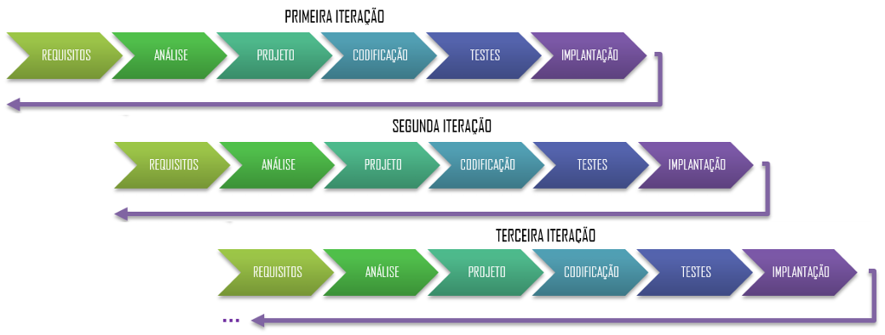
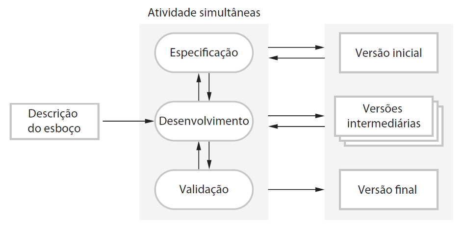
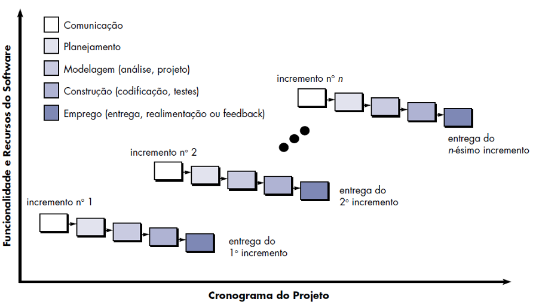

# Capítulo 3 – Modelos Iterativos e Incrementais

No capítulo anterior, exploramos os modelos sequenciais, como o Cascata e o V, que, apesar de sua estrutura lógica e ênfase no planejamento, frequentemente acumulam riscos até fases muito avançadas do projeto. Essa rigidez inerente explica por que, historicamente, tantos projetos de software enfrentaram dificuldades significativas: prazos que dobravam, orçamentos que estouravam e, o mais crítico, requisitos que eram mal atendidos ou sequer entregues ao final do processo. A dificuldade em acomodar mudanças e a falta de visibilidade do produto durante longos períodos levaram à busca por abordagens mais flexíveis e adaptativas. Para superar essa rigidez e minimizar o impacto de incertezas e mudanças, emergiu o paradigma dos **Modelos Iterativos e Incrementais**, uma filosofia de desenvolvimento que combina duas ideias centrais e poderosas para gerenciar a complexidade e entregar valor de forma mais eficaz.

A abordagem iterativa e incremental parte de um princípio fundamental: em vez de tentar construir o sistema inteiro de uma só vez, o desenvolvimento é decomposto em ciclos menores e gerenciáveis. Essa decomposição se manifesta de duas formas complementares:

1. **Incremental:** O conjunto total de requisitos do software é dividido em "pedaços" menores, funcionais e entregáveis, conhecidos como **incrementos** ou _builds_. Cada incremento representa um subconjunto coerente de funcionalidades que pode ser desenvolvido, testado e, potencialmente, entregue ao usuário de forma independente. O software completo é construído pela adição sucessiva desses incrementos.
2. **Iterativo:** O desenvolvimento não segue uma linha reta e única, mas sim ciclos repetitivos de atividades (como análise, projeto, implementação e teste). A cada **iteração** (ou ciclo), o software é refinado, melhorado e expandido progressivamente. O feedback obtido ao final de cada iteração (seja da equipe interna ou dos usuários) é usado para guiar e ajustar o trabalho nas iterações seguintes.

Imagine um projeto com cem funcionalidades a serem implementadas. Em vez de seguir o modelo Cascata – especificando todas as cem, projetando todas, codificando todas, testando todas e só então entregando o sistema completo –, a equipe que adota uma abordagem iterativa e incremental pode decidir entregar um primeiro incremento com as dez funcionalidades mais essenciais. Esse pequeno conjunto passaria por um ciclo completo (requisitos detalhados, projeto, codificação, testes). Dentro desse ciclo, poderiam ocorrer várias iterações para refinar essas dez funcionalidades. Uma vez entregue e validado esse primeiro incremento, a equipe passaria para o próximo conjunto de funcionalidades. Essa abordagem proporciona entregas mais rápidas de valor utilizável, maior capacidade de adaptação a mudanças, interação mais frequente com o usuário e feedback contínuo, reduzindo drasticamente o risco de surpresas desagradáveis ou desalinhamentos ao final do projeto.

## Distinguindo (e Combinando) Incremental e Iterativo

Embora os termos "incremental" e "iterativo" sejam frequentemente usados juntos e seus conceitos se sobreponham na prática moderna, é didaticamente útil entender suas distinções conceituais antes de vermos como eles se complementam.

- **Desenvolvimento Incremental Puro:** Foca na **entrega por partes**. Os requisitos são particionados em módulos ou funcionalidades independentes. Cada parte (incremento) é desenvolvida sequencialmente, seguindo um "mini-cascata" (análise, projeto, codificação, teste). O software final é a soma de todos os incrementos entregues. A ênfase está em entregar pedaços funcionais do sistema o mais rápido possível.
- **Desenvolvimento Iterativo Puro:** Foca no **refinamento progressivo do todo**. Aborda-se o sistema inteiro desde o início, mas de forma superficial ou parcial. A primeira iteração pode produzir um protótipo ou uma versão muito básica que implementa esqueletos de todas as funcionalidades principais. As iterações subsequentes revisitam e aprimoram essas funcionalidades, adicionando detalhes, corrigindo problemas e melhorando a qualidade, até que o sistema completo atinja o nível desejado. A ênfase está em aprender e amadurecer a solução através de ciclos de feedback.

Na prática contemporânea da Engenharia de Software, especialmente com a ascensão das metodologias ágeis, esses dois conceitos raramente são aplicados de forma isolada. O que prevalece é o **Modelo Iterativo e Incremental**, onde **cada incremento (um subconjunto de funcionalidades) é desenvolvido por meio de uma ou mais iterações (ciclos de refinamento)**. Essa combinação sinérgica garante, ao mesmo tempo, a entrega frequente de valor tangível (através dos incrementos) e o amadurecimento contínuo da qualidade e da compreensão do produto (através das iterações).

A figura ilustra graficamente essa combinação, mostrando múltiplos ciclos (iterações) que se repetem, cada um passando pelas fases clássicas de desenvolvimento (requisitos, análise, projeto, codificação, testes, implantação), construindo o software de forma incremental.

## Ilustrando os Conceitos: Metáfora da Mona Lisa

Uma analogia visual frequentemente utilizada para diferenciar e ilustrar os modelos incremental e iterativo (e sua combinação) é a pintura da Mona Lisa.

**Abordagem Incremental:** Imagine um artista que recebe a encomenda da Mona Lisa e já tem uma imagem mental perfeita da obra final. Ele decide pintar o quadro por partes completas e independentes, como se estivesse montando um quebra-cabeças. Primeiro, ele pinta detalhadamente uma pequena seção do topo do quadro. Depois, revela outra seção adjacente, completamente finalizada. Ele continua esse processo, adicionando "incrementos" de pintura finalizada, até que o quadro inteiro esteja completo. A cada etapa, uma parte do produto final é entregue em sua versão definitiva, mas o quadro como um todo só faz sentido no final.

No desenvolvimento de software, isso equivaleria a entregar módulos ou funcionalidades completas sequencialmente. Por exemplo, em um sistema de processamento de texto:

1. **Primeiro incremento:** Entregar apenas as funcionalidades básicas de criação, abertura e gravação de documentos, perfeitamente funcionais.
2. **Segundo incremento:** Adicionar as funções de formatação de texto (negrito, itálico, fontes), integradas ao núcleo já existente.
3. **Terceiro incremento:** Implementar a verificação ortográfica e gramatical.
4. **Quarto incremento:** Adicionar recursos avançados de layout, como cabeçalhos, rodapés e índices.

A cada entrega, o cliente recebe uma nova funcionalidade completa, que se soma às anteriores.

**Abordagem Iterativa:** Nesta abordagem, o artista começa com um esboço muito simples da Mona Lisa inteira, capturando apenas as formas e proporções gerais, sem detalhes ou cores. Na segunda iteração, ele refina o esboço, adicionando mais detalhes à estrutura do rosto e do corpo. Na terceira, ele começa a aplicar cores básicas e sombras. Em cada iteração subsequente, ele revisita todo o quadro, aprimorando os detalhes, ajustando as cores, melhorando o sombreamento e a textura, até que a obra-prima final emerja. O quadro nunca "parte do zero" a cada ciclo; cada iteração melhora e refina o trabalho anterior, mantendo a visão do todo.

Em software, isso corresponderia a lançar uma primeira versão (1.0) do processador de texto com todas as funcionalidades principais (edição, formatação, verificação, layout) presentes, mas de forma muito básica ou rudimentar. A versão 2.0 aprimoraria todas essas áreas, talvez com mais opções de formatação e uma verificação ortográfica melhor. A versão 3.0 adicionaria mais refinamentos, melhor performance e novos recursos em todas as frentes, e assim por diante. O produto amadurece como um todo a cada ciclo.

**Abordagem Combinada (Iterativa e Incremental):** Esta é a abordagem mais comum e poderosa. O artista pode decidir trabalhar incrementalmente (focando em partes), mas aplicando iterações dentro de cada parte. Ele pode começar com um esboço geral (iterativo). Em seguida, foca no rosto (incremental), fazendo várias iterações para detalhar os olhos, depois a boca, depois o cabelo. Uma vez satisfeito com o rosto, ele passa para as mãos (novo incremento), novamente aplicando várias iterações de refinamento. Ele continua adicionando incrementos (roupa, fundo) e iterando dentro de cada um, garantindo que as partes se integrem harmoniosamente.

No exemplo do processador de texto, a equipe poderia entregar o primeiro incremento (edição básica) após algumas iterações internas de refinamento. Para o segundo incremento (formatação), eles novamente fariam várias iterações, talvez liberando primeiro negrito/itálico, depois fontes, depois alinhamento, obtendo feedback a cada pequena adição dentro do incremento maior.

Essa combinação traz benefícios claros e sinérgicos:

- **Entrega Precoce e Contínua de Valor:** O cliente não precisa esperar até o final para ter algo utilizável. Mesmo que apenas um subconjunto das funcionalidades esteja pronto, ele já pode começar a usar o sistema e obter valor (benefício incremental).
- **Alto Envolvimento do Usuário e Feedback Constante:** A entrega frequente de incrementos permite que o cliente ou usuário final veja e experimente o software em evolução. Isso gera um feedback muito mais rico e realista do que a simples leitura de documentos de requisitos. Esse feedback contínuo permite corrigir mal-entendidos, ajustar prioridades e garantir que o produto final esteja verdadeiramente alinhado às expectativas (benefício iterativo).
- **Mitigação Progressiva de Riscos:** Cada incremento entregue e validado reduz a incerteza do projeto. Riscos técnicos (uma integração complexa, uma nova tecnologia) podem ser abordados em incrementos iniciais. Riscos de negócio (aceitação do mercado, usabilidade) são mitigados pelo feedback constante. Cada iteração, por sua vez, permite detectar e corrigir erros de projeto, de codificação ou de entendimento o quanto antes, quando o custo da correção ainda é baixo (benefícios incremental e iterativo).
- **Maior Flexibilidade para Mudanças:** Acomodar novos requisitos ou repriorizar funcionalidades existentes é inerentemente mais fácil e barato em um modelo iterativo e incremental do que no Cascata. As mudanças podem ser incorporadas no planejamento do próximo incremento ou da próxima iteração, sem necessariamente desestabilizar todo o projeto (benefícios incremental e iterativo).
- **Melhoria da Qualidade e Potencial de Reuso:** Os ciclos iterativos de refinamento permitem que a equipe melhore continuamente a qualidade do código, a arquitetura e a usabilidade. Componentes bem projetados e testados em um incremento podem ser mais facilmente reutilizados em incrementos posteriores, aumentando a produtividade e a consistência (benefício iterativo).

## Visões de Autores Consagrados sobre o Desenvolvimento Incremental

A importância e as nuances do desenvolvimento incremental (frequentemente englobando o aspecto iterativo) são destacadas por autores de referência na Engenharia de Software.

**Ian Sommerville** descreve o desenvolvimento incremental como uma abordagem onde as atividades de especificação, desenvolvimento e validação são intercaladas, em contraste com a separação rígida do modelo cascata. Ele enfatiza que o processo começa com uma descrição geral ou esboço do sistema. A partir disso, desenvolve-se rapidamente uma implementação inicial (que pode ser vista como um protótipo ou a primeira versão). Essa versão é então avaliada pelos usuários ou stakeholders, e seus comentários e feedback são usados para guiar as modificações e a evolução do sistema em versões intermediárias subsequentes, até que a versão final seja alcançada. A figura ilustra essa visão de Sommerville, mostrando as atividades de Especificação, Desenvolvimento e Validação ocorrendo de forma concorrente, com forte feedback entre elas e resultando em múltiplas versões (inicial, intermediárias, final).

Sommerville aponta três vantagens principais dessa abordagem:

1. **Menor custo para acomodar mudanças nos requisitos:** Como as mudanças geralmente afetam apenas o incremento atual ou futuros, o custo de reanálise e retrabalho é significativamente menor do que no modelo cascata, onde uma mudança pode exigir a revisão de fases já concluídas e aprovadas.
2. **Feedback mais rápido e rico dos clientes:** Os clientes interagem com software funcional (demonstrações ou versões preliminares) em vez de apenas lerem documentos abstratos de especificação. Isso permite um feedback mais preciso e a detecção precoce de mal-entendidos.
3. **Entrega rápida de funcionalidade útil:** É possível entregar e colocar em operação um subconjunto útil do sistema muito mais cedo do que em um modelo sequencial. Isso permite que a organização comece a obter retorno sobre o investimento (ROI) mais rapidamente e que os usuários se beneficiem das funcionalidades essenciais desde o início.

**Roger Pressman**, por sua vez, enfatiza que o modelo incremental é particularmente adequado para situações onde os requisitos iniciais são razoavelmente bem definidos, mas o escopo geral do projeto sugere uma abordagem que combine fluxos lineares (para cada incremento) com paralelismo (desenvolvimento de múltiplos incrementos, se a equipe for grande). Em sua visão, ilustrada abaixo, o modelo incremental aplica sequências lineares de atividades (Comunicação, Planejamento, Modelagem, Construção, Emprego/Entrega) de forma escalonada ao longo do tempo. Cada uma dessas sequências produz um "incremento" funcional e entregável do software. Pressman também observa que o fluxo de processo dentro de qualquer incremento pode, flexivelmente, incorporar outros paradigmas, como a prototipagem, para refinar requisitos ou explorar soluções técnicas.

Ambas as visões, embora com ênfases ligeiramente diferentes, convergem na ideia central de construir o software em partes gerenciáveis, entregando valor progressivamente e utilizando o feedback para guiar o desenvolvimento contínuo.

## Fluxo Detalhado do Processo na Prática

Quando uma equipe adota um modelo de processo incremental, o fluxo de trabalho geralmente segue um ciclo repetitivo para cada incremento planejado. O objetivo é entregar um produto operacional, mesmo que parcial, ao final de cada ciclo. Um fluxo típico pode ser descrito da seguinte forma:

1. **Planejamento Geral e Identificação do Produto Essencial (ou Mínimo Viável):** No início do projeto, realiza-se um planejamento de alto nível para definir o escopo geral e a arquitetura básica. Em seguida, seleciona-se um subconjunto de funcionalidades consideradas essenciais ou de maior prioridade para formar o **primeiro incremento**. Este primeiro incremento muitas vezes corresponde a um **produto essencial** (_core product_) ou **Produto Mínimo Viável (MVP - Minimum Viable Product)** – a versão mais simples do software que já entrega valor real ao usuário e permite validar as hipóteses do negócio.
2. **Desenvolvimento do Incremento Atual:** A equipe foca no desenvolvimento do conjunto de funcionalidades definido para o incremento atual. Isso envolve um ciclo completo de atividades em escala menor:
    - **Análise e Especificação Detalhada:** Refinamento dos requisitos específicos para este incremento.
    - **Projeto:** Design da solução técnica para as funcionalidades do incremento, garantindo a integração com a arquitetura existente.
    - **Codificação:** Implementação do código-fonte.
    - **Testes:** Verificação (testes de unidade, integração) e validação (testes funcionais) do incremento.
3. **Entrega e Avaliação pelo Cliente/Usuário:** O incremento funcional é entregue ao cliente ou a um grupo de usuários para uso ou avaliação detalhada. Esta é uma etapa crucial para coletar feedback sobre a usabilidade, a adequação das funcionalidades e a identificação de possíveis problemas ou novas necessidades.
4. **Coleta de Feedback e Planejamento do Próximo Incremento:** O feedback recebido é analisado pela equipe. Com base nesse feedback e nas prioridades de negócio, planeja-se o **próximo incremento**. Isso pode envolver:
    - Ajustar ou refinar funcionalidades já entregues.
    - Selecionar o próximo conjunto de novas funcionalidades a serem implementadas (do _backlog_ geral do projeto).
    - Realizar ajustes na arquitetura do software, se necessário, para garantir que ela continue suportando a evolução do sistema de forma sustentável.
5. **Repetição do Ciclo:** O ciclo (passos 2 a 4) se repete para cada novo incremento, até que todas as funcionalidades planejadas tenham sido desenvolvidas, testadas e entregues, resultando no produto completo.

Vamos aplicar esse fluxo a um exemplo mais detalhado: o desenvolvimento de um aplicativo de gerenciamento financeiro pessoal para uma startup.

- **Planejamento Geral:** Define-se que o app deve permitir registrar despesas/receitas, categorizá-las, visualizar relatórios e, futuramente, conectar contas bancárias e oferecer análises avançadas. A arquitetura será baseada em um app móvel nativo (Android/iOS) com um backend na nuvem.
- **Incremento 1 (MVP - Produto Essencial):**
    - **Funcionalidades:** Cadastro manual de despesas e receitas; Criação e edição de categorias simples (ex: Alimentação, Transporte); Visualização de um relatório básico de saldo mensal.
    - **Desenvolvimento:** Equipe foca nessas funções, realizando algumas iterações internas para refinar a interface de lançamento.
    - **Entrega e Avaliação:** O app é liberado para um grupo pequeno de _beta testers_.
    - **Feedback:** Os testers acham fácil lançar despesas, mas pedem uma forma de marcar se a despesa já foi paga ou não, e sugerem melhorias no relatório.
- **Incremento 2:**
    - **Planejamento:** Prioriza-se adicionar o status "pago/não pago" aos lançamentos e melhorar o relatório mensal com gráficos. Decide-se adiar a conexão bancária para o próximo incremento.
    - **Desenvolvimento:** Implementa-se o novo campo de status e a visualização gráfica no relatório.
    - **Entrega e Avaliação:** Nova versão liberada para os testers.
    - **Feedback:** O status é útil, os gráficos ajudam, mas agora os testers pedem filtros por categoria no relatório.
- **Incremento 3:**
    - **Planejamento:** Prioriza-se adicionar filtros ao relatório e iniciar a funcionalidade de conexão bancária (talvez apenas para um banco, como teste).
    - _(O ciclo continua...)_

Perceba como, a cada incremento, um produto funcional é entregue, o feedback é incorporado e o planejamento do próximo passo é ajustado, mantendo sempre um núcleo operacional que evolui de forma controlada.

## Limitações e Cuidados Necessários

Apesar de suas inúmeras vantagens sobre os modelos sequenciais puros, a abordagem iterativa e incremental não é isenta de desafios e requer cuidados específicos para ser bem-sucedida, especialmente em projetos de maior escala ou com longa duração. Duas preocupações principais frequentemente apontadas são:

1. **Baixa Visibilidade do Processo e Potencial Falta de Documentação:** Em modelos que enfatizam a entrega rápida de código funcional, como algumas implementações ágeis do paradigma incremental, pode haver uma tendência a negligenciar a produção de documentação detalhada (como especificações de projeto ou manuais atualizados) para cada incremento. Embora isso acelere o desenvolvimento a curto prazo, a falta de documentação adequada pode dificultar a manutenção futura, a integração de novos membros na equipe e o controle formal do progresso do projeto por parte da gerência, que pode ter dificuldade em avaliar o estado real do sistema sem artefatos intermediários claros. É necessário encontrar um equilíbrio, produzindo documentação "suficiente" e focada no que agrega valor.
2. **Risco de Degradação da Estrutura do Software (Entropia de Software):** A natureza adaptativa do modelo, que permite e até incentiva mudanças contínuas nos requisitos e no código, pode levar a um fenômeno conhecido como **entropia de software** ou **degradação da arquitetura**. Se as mudanças e adições de novas funcionalidades não forem feitas com cuidado e disciplina arquitetural, a estrutura original do software tende a se deteriorar ao longo do tempo. O código pode se tornar mais complexo, mais acoplado (partes interdependentes demais) e mais difícil de entender e modificar. Em sistemas muito grandes ou com um ciclo de vida muito longo, essa degradação pode tornar a manutenção proibitivamente cara e a evolução futura do sistema, inviável.

Para mitigar esses riscos, especialmente em projetos de larga escala ou com múltiplas equipes trabalhando em paralelo, é fundamental adotar práticas complementares:

- **Definição de uma Arquitetura de Referência:** Estabelecer uma arquitetura de software estável e bem definida desde o início, que sirva como um _framework_ ou "esqueleto" para guiar o desenvolvimento dos incrementos.
- **Gerenciamento de Interfaces:** Definir claramente as interfaces de comunicação entre os diferentes módulos ou componentes desenvolvidos, garantindo que eles possam evoluir de forma independente sem "quebrar" uns aos outros.
- **Práticas de Refatoração Contínua:** Incorporar a refatoração (melhoria da estrutura interna do código sem alterar seu comportamento externo) como uma atividade regular dentro das iterações, para combater a degradação e manter a qualidade do código.
- **Gerenciamento de Configuração Robusto:** Utilizar ferramentas e processos para controlar as diferentes versões do código, dos documentos e dos incrementos entregues.
- **Documentação Estratégica:** Focar na documentação que realmente importa, como a arquitetura, as APIs públicas e as decisões de design críticas, mantendo-a atualizada.

## Considerações Finais

O **Modelo Iterativo e Incremental** representa um marco fundamental na evolução da Engenharia de Software, oferecendo uma alternativa robusta e flexível aos modelos sequenciais rígidos. Ao decompor o desenvolvimento em ciclos menores e entregas parciais, ele permite a **entrega contínua de valor** ao cliente, promove um **alinhamento constante** entre a equipe de desenvolvimento e os stakeholders através de feedback frequente, e facilita a **gestão ativa de riscos**, permitindo que problemas e incertezas sejam identificados e tratados mais cedo no processo. Essa abordagem equilibra a necessidade de disciplina e planejamento (na definição e gestão dos incrementos) com a capacidade de adaptação e resposta a mudanças (através das iterações e da repriorização).

Sua filosofia de "construir um pouco, testar um pouco, entregar um pouco" tornou-se a base para muitas das metodologias de desenvolvimento modernas, incluindo as abordagens ágeis que dominam grande parte da indústria atualmente. No entanto, como discutido, o sucesso de sua aplicação, especialmente em projetos de grande porte, complexos ou de longa duração, não é automático. Requer disciplina, boas práticas de engenharia e uma atenção constante à qualidade da arquitetura e do código para garantir a sustentabilidade do software ao longo do tempo. A escolha de implementar um modelo iterativo e incremental deve ser acompanhada da adoção de práticas como refatoração, testes automatizados, integração contínua e, possivelmente, uma governança de arquitetura e documentação seletiva, para colher todos os seus benefícios sem sucumbir aos seus potenciais desafios.