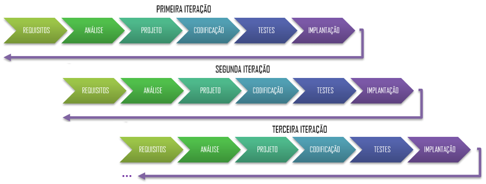
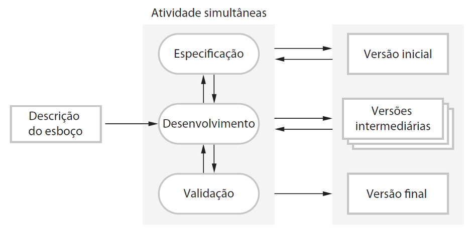
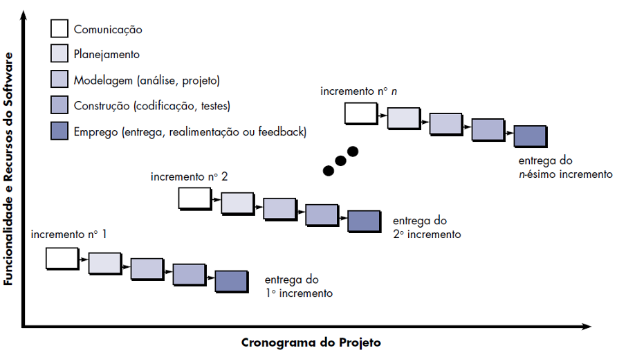

## Capítulo 4 – Modelo Iterativo e Incremental

Conforme vimos no capítulo anterior, o Modelo em Cascata costuma acumular riscos até fases muito avançadas, o que explica por que tantos projetos “fracassavam”: prazos dobravam, orçamentos estouravam, requisitos eram mal atendidos ou sequer entregues. Para superar essa rigidez e minimizar o impacto de mudanças, surgiu o **Modelo Iterativo e Incremental**, que combina duas ideias centrais:

1. **Incremental**: dividir o conjunto total de requisitos em “pedaços” menores e entregáveis, chamados incrementos ou builds, cada um com funcionalidade completa e testada;
2. **Iterativo**: repetir ciclos de análise, projeto, implementação e teste até refinar progressivamente cada incremento, incorporando feedback dos usuários.

Por exemplo, se tivermos cem funcionalidades a implementar, em vez de aguardar a conclusão de todas as cem funcionalidades para só então testar e entregar (como no Cascata), o time passa por várias “mini-cascatas” menores (incrementos) e, dentro de cada uma, refina o que já foi feito (iterações). Essa abordagem proporciona entregas mais rápidas, maior interação com o usuário e feedback contínuo, reduzindo drasticamente o risco de surpresas ao final do projeto.

### Incremental x Iterativo (e por que sempre vêm juntos)

Embora possamos conceitualmente distinguir os dois termos, na prática **incremental** e **iterativo** caminham lado a lado:

- No **modelo incremental**, os requisitos são particionados em módulos ou miniprojetos: se há cem requisitos, podemos agrupá-los em vinte pacotes de cinco cada. Cada pacote segue um mini-cascata (análise, projeto, codificação, teste).
- No **modelo iterativo**, todos os requisitos são abordados desde o início, mas de forma parcial: faz-se uma primeira versão que implementa tudo de modo básico, depois refina-se em ciclos sucessivos.

Quando falamos hoje em **Modelo Iterativo e Incremental**, entendemos que cada incremento (um subconjunto de funcionalidades) é desenvolvido por meio de várias iterações, até atingir o nível de qualidade e completude desejado. A combinação garante, ao mesmo tempo, entregas frequentes (incrementos) e amadurecimento contínuo (iterações).

  

### Os Modelos Incremental e Iterativo na Prática

Imagine um artista que vai pintar a Mona Lisa não como um esboço único, mas como um quebra-cabeças de várias peças. Ele já sabe exatamente como a obra final deve ficar, mas escolhe pintar primeiro o rosto, depois as mãos, depois o fundo, e assim por diante, integrando as partes ao final. Cada peça funciona isoladamente e pode ser mostrada ao cliente, que valida se aquela parte corresponde ao esperado.

  

No desenvolvimento de software, cada “peça” é um incremento. Por exemplo, num sistema de processamento de texto:

1. **Primeiro incremento**: funcionalidades básicas de criação, abertura e gravação de documentos.
2. **Segundo incremento**: funções de formatação de texto (negrito, itálico, fontes).
3. **Terceiro incremento**: correção ortográfica e gramatical.
4. **Quarto incremento**: layout avançado, cabeçalhos, rodapés, índices.

A cada entrega, o cliente avalia, ensina novos requisitos ou prioriza ajustes — e isso tudo sem paralisar o fluxo de trabalho.

Já na abordagem iterativa, o artista começa com um esboço geral da Mona Lisa, com traços simples e sem cores definidas. Em cada nova versão, ele melhora detalhes: primeiro as proporções do rosto, depois o sombreado, em seguida a textura da roupa, e assim por diante. O quadro nunca “parte do zero” a cada ciclo; cada iteração conserva o que já foi aprimorado anteriormente.

  

Em software, isso significa lançar a versão 1.0 com funcionalidades mínimas, depois a 2.0 aprimorada, 3.0 ainda mais rica, até a versão final. A cada iteração, o produto amadurece, e erros de projeto ou entendimento são corrigidos rapidamente, antes que se tornem desastres.

A combinação iterativo + incremental traz benefícios claros:

- **Entrega precoce de valor**: mesmo se todo o escopo não estiver pronto, o cliente já tem algo utilizável.
- **Alto envolvimento do usuário**: feedback constante, correções de rumo e alinhamento de expectativas.
- **Mitigação de riscos**: cada incremento reduz a incerteza, e cada iteração detecta erros o quanto antes.
- **Flexibilidade para mudanças**: acomodar novos requisitos ou priorizar funcionalidades é muito mais barato do que no Cascata.
- **Reuso e qualidade**: refinamentos iterativos permitem criar componentes mais robustos que podem ser reaproveitados em incrementos posteriores.

  

### O Que Dizem os Autores Consagrados

**Ian Sommerville** descreve o desenvolvimento incremental como uma sequência de implementações iniciais que, após comentários dos usuários, evoluem por várias versões até atingir o sistema final. Nessa visão, as atividades de especificação, desenvolvimento e validação são intercaladas, nunca completamente separadas. As principais vantagens para ele são:

- **Menor custo para acomodar mudanças**, pois apenas o incremento em curso precisa de reanálise;
- **Feedback mais rico dos clientes**, que veem demonstrações de software em vez de meros documentos;
- **Entrega rápida de um sistema útil**, mesmo que parcial, garantindo valor desde cedo.

Um esboço simples do processo de desenvolvimento incremental é apresentado a seguir. As atividades de especificação, desenvolvimento e validação são intercaladas, em vez de separadas, com feedback rápido que permeia as atividades. Desenvolve-se rapidamente uma implementação inicial do software (protótipo) a partir de especificações bastante abstratas e são feitas modificações de acordo com sua avaliação. 

  

Cada versão do programa herda as melhores características das versões anteriores. Cada versão é refinada com base no feedback recebido dos clientes para produzir um sistema que satisfaça suas necessidades. Neste ponto, o sistema pode ser entregue ou pode ser reimplementado utilizando uma abordagem mais estruturada para aumentar a robustez e a facilidade de manutenções. As atividades de especificação, desenvolvimento e validação são concorrentes e apresentam um forte feedback entre si, como mostra a imagem apresentada anteriormente.

Já **Roger Pressman** enfatiza que, em muitos projetos, requisitos estão inicialmente bem expressos, mas o escopo geral exige um processo que combine fluxos lineares e paralelos. No seu modelo incremental, cada sequência linear produz incrementos escalonados que podem incorporar protótipos e estilos evolucionários.

  

Na imagem anterior, o modelo incremental aplica sequências lineares, de forma escalonada, à medida que o tempo vai avançando. Cada sequência linear gera “incrementais” (entregáveis/aprovados/liberados) do software de maneira similar aos incrementais gerados por um fluxo de processos evolucionários. Deve-se notar que o fluxo de processos para qualquer incremento pode incorporar o paradigma da prototipação.

### Limitações e Cuidados Necessários

Apesar de mais eficaz que o Cascata, o desenvolvimento incremental e iterativo não é uma perfeito. Dois problemas principais merecem atenção:

- **Baixa visibilidade documental**: produzir documentos para cada incremento pode ser economicamente inviável, prejudicando o controle formal do projeto.
- **Risco de má estruturação**: mudanças contínuas tendem a “entortar” a arquitetura do software, tornando-o difícil de manter e evoluir em sistemas muito grandes ou de ciclo de vida extenso.

Em projetos de larga escala, com várias equipes trabalhando em módulos distintos, é fundamental estabelecer um framework arquitetural estável desde o início e definir responsabilidades claras, sob risco de gerar um “monstro” difícil de orquestrar.

### Fluxo Detalhado do Processo Incremental

No fluxo incremental, cada **incremento** é planejado, desenvolvido e validado de forma autônoma, mas guardando compatibilidade com o produto como um todo:

1. **Identificação do produto essencial**: seleção das características mínimas viáveis que entregam valor.
2. **Desenvolvimento do incremento**: análise, projeto, codificação e testes focados nesse subconjunto.
3. **Avaliação pelo cliente**: uso ou demonstração em ambiente controlado, com coleta de melhorias.
4. **Planejamento do próximo incremento**: ajustes no backlog e refinamento arquitetural, visando acomodar novos requisitos.

Quando se utiliza um modelo incremental, frequentemente, o primeiro incremento é um produto essencial. Isto é, os requisitos básicos são atendidos, porém, muitos recursos complementares (alguns conhecidos, outros não) ainda não são entregues. Esse produto essencial é utilizado pelo cliente (ou passa por uma avaliação detalhada). Como resultado do uso e/ou avaliação, é desenvolvido um planejamento para o incremento seguinte. Esse ciclo se repete até que o produto completo esteja disponível, mantendo sempre um núcleo operacional que evolui a cada entrega. O modelo de processo incremental tem seu foco voltado para a entrega de um produto operacional com cada incremento.

Suponha que uma startup precise de um Sistema de Gerenciamento Financeiro para lançar despesas e receitas:

- **Incremento 1**: cadastro de categorias e lançamentos simples; relatórios básicos.
- **Incremento 2**: integração com contas bancárias via API; extratos automáticos.
- **Incremento 3**: gerenciamento de múltiplos usuários e permissões.
- **Incremento 4**: dashboards avançados e previsões financeiras.

Em cada incremento, antes de partir para o próximo, a equipe reúne feedback dos primeiros usuários, corrige bugs, ajusta fluxos de navegação e refina a arquitetura — garantindo que as bases suportem funcionalidades cada vez mais complexas.

### Considerações Finais

O **Modelo Iterativo e Incremental** representa um ponto de virada na Engenharia de Software, permitindo a entrega contínua de valor, o alinhamento constante com o cliente e a gestão ativa de riscos. Ele equilibra disciplina (ao exigir planejamento de incrementos) e adaptabilidade (ao permitir iterações e novas priorizações).

No entanto, para projetos muito grandes ou críticos, recomenda-se complementar essa abordagem com práticas de arquitetura definida, governança de configuração e documentação seletiva que garantam a sustentabilidade do software ao longo do tempo.
