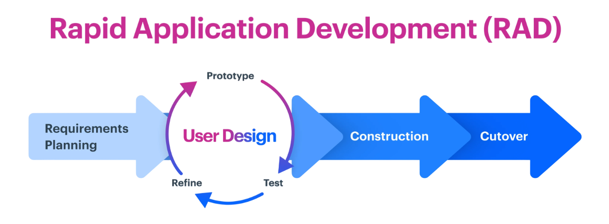
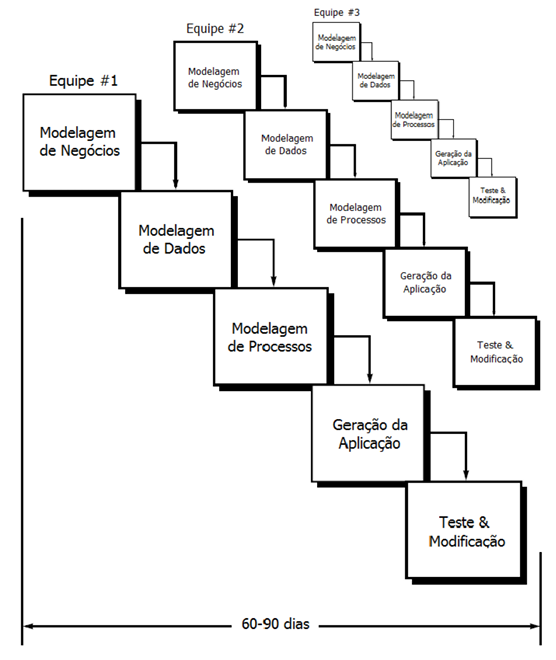

# Capítulo 4 – Rapid Application Development (RAD)

À medida que os modelos iterativos e incrementais se consolidavam como alternativas mais flexíveis aos rígidos processos sequenciais, a Engenharia de Software continuou buscando maneiras de otimizar ainda mais o ciclo de desenvolvimento. O objetivo era claro: acelerar a entrega de software funcional, reduzir custos, aumentar a capacidade de resposta a mudanças e, crucialmente, aproximar o processo de desenvolvimento das necessidades reais e em constante evolução dos usuários. Foi nesse contexto de busca por velocidade e adaptabilidade que surgiu, na década de 1990, o **Rapid Application Development (RAD)**, um modelo de processo incremental projetado especificamente para entregar sistemas de alta qualidade em prazos extremamente curtos.

O RAD não é apenas uma variação do modelo incremental; ele possui uma filosofia própria, fortemente ancorada em dois pilares: o **reuso intensivo de componentes** de software pré-existentes e testados, e uma **interação colaborativa e constante com o usuário final** ao longo de todo o ciclo. A premissa central é que, ao construir sobre bases sólidas (componentes reutilizáveis) e validar continuamente a direção do projeto com quem realmente usará o sistema, é possível desenvolver aplicações de forma muito mais rápida e assertiva. O modelo RAD é particularmente associado a ciclos de desenvolvimento muito curtos, tipicamente variando entre **60 a 90 dias** por incremento ou versão.

A figura ilustra a essência do RAD: um planejamento inicial focado, um design centrado no usuário com prototipagem iterativa, uma construção acelerada e uma transição rápida para a operação.

## Fases Fundamentais do RAD

O modelo RAD organiza o desenvolvimento em um conjunto de fases bem definidas, embora a nomenclatura e o agrupamento exato possam variar ligeiramente entre diferentes implementações e autores. Tradicionalmente, o processo é estruturado em cinco fases principais, que podem ser pensadas como um fluxo contínuo de modelagem e construção. Abaixo está detalhada uma visão clássica dessas fases, mostrando inclusive como elas podem ser paralelizadas por diferentes equipes para acelerar ainda mais o processo.

Vamos analisar cada uma dessas fases em detalhe:

1. **Modelagem de Negócios (_Business Modeling_):** Esta fase inicial concentra-se em entender o contexto e os objetivos de negócio que o software deve suportar. O objetivo é mapear o fluxo de informações fundamental para as funções de negócio relevantes. As perguntas-chave são:
    - Que informações são geradas? (Ex: Pedido de cliente, Nota fiscal)
    - Quem gera essas informações? (Ex: Vendedor, Sistema de faturamento)
    - Para onde fluem essas informações? (Ex: Do vendedor para o estoque e para o financeiro)
    - Quem processa ou consome essas informações? (Ex: Gerente de estoque, Contabilidade)
        O resultado não é um documento exaustivo, mas sim um mapa claro e conciso dos processos de negócio impactados, identificando os principais atores, os dados envolvidos e as interações entre eles.
    - **Exemplo Prático:** Ao desenvolver um sistema de gestão de pedidos para um restaurante via delivery, a modelagem de negócios mapearia o fluxo desde o recebimento do pedido (via app, telefone), passando pela confirmação, envio para a cozinha, preparo, atribuição a um entregador, até a confirmação de entrega e o registro do pagamento. Identificariam-se os atores (cliente, atendente, cozinheiro, entregador, gerente) e as informações trocadas (dados do pedido, endereço, status, forma de pagamento).
2. **Modelagem de Dados (_Data Modeling_):** Com base no fluxo de informações identificado na fase anterior, esta etapa foca em refinar e estruturar os dados que o sistema manipulará. Cada informação relevante é transformada em **objetos de dados** (que podem ser representados como entidades, tabelas em um banco de dados, ou classes em programação orientada a objetos). Para cada objeto de dados, identificam-se seus **atributos** (as características ou campos, como "Nome do Cliente", "Telefone", "Valor do Pedido", "Data de Entrega") e definem-se os **relacionamentos** entre eles (por exemplo, "um Cliente pode ter vários Pedidos", "um Pedido contém vários Itens", "um Item pertence a uma Categoria de produto"). O objetivo é criar um modelo de dados claro e consistente que sirva de base para a aplicação.
    - **Exemplo Prático:** Para o sistema de delivery, a modelagem de dados definiria entidades como `Cliente` (com atributos: nome, telefone, endereço), `Pedido` (com atributos: id, data/hora, cliente_id, status, valor_total), `ItemPedido` (com atributos: pedido_id, produto_id, quantidade, preco_unitario) e `Produto` (com atributos: id, nome, descricao, preco). Seriam definidos relacionamentos como "um `Cliente` faz muitos `Pedidos`" e "um `Pedido` tem muitos `ItensPedido`".
3. **Modelagem de Processos (_Process Modeling_):** Tendo os objetos de dados bem estabelecidos, esta fase descreve como esses dados serão transformados e manipulados pela aplicação para executar as funções de negócio. Os fluxos de informação identificados na Modelagem de Negócios são detalhados em **processos operacionais específicos**. Para cada objeto de dados, define-se como a aplicação deverá **criar, ler, atualizar ou excluir (CRUD - _Create, Read, Update, Delete_)** suas instâncias. As **regras de negócio** (validações, cálculos, condições, notificações) são incorporadas a esses processos.
    - **Exemplo Prático:** No sistema de delivery, a modelagem de processo detalharia o fluxo "Confirmar Pedido": verificar se todos os itens estão em estoque, calcular o valor total (incluindo taxa de entrega), validar os dados de pagamento do cliente, atualizar o status do pedido para "Confirmado" e enviar uma notificação para a cozinha. Outro processo seria "Atualizar Status de Entrega", detalhando como o entregador informa a saída para entrega e a conclusão, e como o sistema notifica o cliente.
4. **Geração da Aplicação (_Application Generation_):** Esta é a fase onde o RAD se diferencia mais fortemente de outros modelos. Em vez de uma codificação manual extensiva, o foco está no uso de **ferramentas automatizadas e componentes reutilizáveis** para construir a aplicação rapidamente. Utilizam-se:
    - **Ferramentas CASE (_Computer-Aided Software Engineering_) e linguagens de quarta geração (4GL):** Ambientes que permitem gerar código automaticamente a partir de modelos visuais ou especificações de alto nível.
    - **Geradores de telas (_Screen Generators_) e construtores de interfaces (_UI Builders_):** Ferramentas que permitem criar interfaces de usuário (telas, formulários) de forma visual, arrastando e soltando componentes (campos, botões, tabelas).
    - **Geradores de relatórios (_Report Generators_):** Ferramentas para criar relatórios complexos definindo visualmente as fontes de dados, colunas, filtros e layouts.
    - Bibliotecas de componentes reutilizáveis: Utilização intensiva de módulos de código pré-existentes e já testados para funcionalidades comuns (ex: autenticação de usuários, acesso a banco de dados, geração de gráficos, integração com APIs externas).
        O objetivo é minimizar a escrita de código manual, focando apenas na lógica de negócio específica que não pode ser gerada automaticamente ou encontrada em componentes prontos. Novos componentes criados durante o projeto também devem ser projetados pensando em seu potencial de reuso futuro.
5. **Teste e Modificação (_Testing and Turnover_):** A fase final concentra-se na validação e no refinamento da aplicação gerada. Como o RAD se baseia fortemente no reuso de componentes, muitos desses módulos já possuem um histórico de testes e um nível de confiabilidade conhecido. No entanto, **todos os novos componentes, as integrações entre eles e, principalmente, as interfaces de usuário e os fluxos de processo implementados devem ser testados exaustivamente**. Os testes geralmente envolvem a simulação de cenários reais de uso, muitas vezes com a participação ativa do usuário final. Devido aos ciclos curtos do RAD, os bugs encontrados são corrigidos e os ajustes solicitados pelo usuário são incorporados quase em tempo real ("on the fly"). O objetivo é garantir que, ao final do ciclo de 60-90 dias, a aplicação esteja funcional, estável e pronta para ser implantada no ambiente de produção (_turnover_).

É importante notar que, na prática, especialmente com equipes experientes e multidisciplinares, as fases de modelagem (Negócios, Dados, Processos) podem ser condensadas ou sobrepostas, assim como as fases de Geração da Aplicação e Teste/Modificação. Como ilustrado, múltiplas equipes podem trabalhar em paralelo em diferentes conjuntos de funcionalidades, cada uma passando por seu próprio ciclo de modelagem, geração e teste dentro do prazo geral estabelecido, acelerando ainda mais a entrega.

## A Importância da Interação com o Usuário e das Ferramentas de Apoio

Dois elementos são absolutamente cruciais para o sucesso do modelo RAD: a colaboração intensa com o usuário e o uso eficaz de ferramentas de desenvolvimento rápido.

- **Proximidade com o Usuário:** Diferente do modelo Cascata, onde o usuário participa ativamente apenas no início (requisitos) e no final (aceitação), no RAD o **envolvimento do usuário é contínuo e fundamental** em todas as fases. Workshops de modelagem conjunta (_Joint Application Design - JAD sessions_), demonstrações frequentes de protótipos de tela e validações diárias ou quase diárias garantem que o software evolua em total sintonia com as necessidades e expectativas reais do cliente. Esse feedback constante permite corrigir desvios de rota rapidamente, evitando surpresas desagradáveis e garantindo que o produto final seja verdadeiramente útil.
- **Ferramentas de Desenvolvimento Rápido:** Para viabilizar a construção de um sistema funcional em ciclos tão curtos (60 a 90 dias), a equipe depende fortemente de um conjunto de ferramentas que automatizam e aceleram o desenvolvimento. Isso inclui:
    - **Geradores de tela e UI Builders:** Ferramentas _low-code_ ou _no-code_ que permitem criar interfaces arrastando e soltando componentes visuais (campos de texto, tabelas, botões, menus).
    - **Criadores de relatórios visuais:** Ferramentas que permitem definir consultas, filtros, agrupamentos e layouts de relatórios sem escrever código SQL ou de formatação complexo.
    - **Ambientes visuais de modelagem (CASE):** Ferramentas que permitem criar diagramas de fluxo de processo, modelos de dados (Entidade-Relacionamento) ou diagramas de classes UML que podem ser parcial ou totalmente convertidos em código ou estruturas de banco de dados automaticamente.
    - **Bibliotecas de componentes e Frameworks:** Utilização massiva de código pronto e testado para funcionalidades comuns, como sistemas de login, validação de formulários, comunicação com APIs, geração de gráficos, exportação de dados (PDF, Excel), etc.

Esse arsenal de ferramentas permite que a equipe **abstraia muitos dos detalhes técnicos de baixo nível** (como a manipulação direta de bancos de dados ou a criação manual de elementos de interface), concentrando seu esforço no que realmente agrega valor ao negócio: a implementação correta da **lógica de negócio** e a criação de uma **experiência de usuário** eficaz e agradável.

## Cenários de Aplicação

O modelo RAD, com sua ênfase na velocidade e no reuso, não é uma solução universal para todos os tipos de projeto de software. Ele demonstra sua maior eficácia em cenários específicos, mas pode ser inadequado ou até prejudicial em outros.

O RAD é particularmente **recomendado** quando:

- **O sistema pode ser modularizado:** O escopo do projeto permite uma divisão clara em componentes ou módulos independentes que podem ser desenvolvidos em paralelo por equipes menores.
- **Componentes reutilizáveis estão disponíveis:** Já existe um conjunto significativo de componentes testados (seja de projetos anteriores, bibliotecas internas ou frameworks de mercado) que podem ser aproveitados para acelerar a construção.
- **O escopo é bem definido e limitado:** Os requisitos principais são razoavelmente bem compreendidos e o escopo geral do incremento é gerenciável dentro do ciclo curto de 60-90 dias.
- **O desempenho não é o fator ultra-crítico:** Embora o sistema deva ser funcional, a otimização extrema de performance não é a principal prioridade em comparação com a velocidade de entrega. Ferramentas de geração automática podem produzir código que não é tão performático quanto o código manual otimizado.
- **O risco técnico é considerado baixo:** As tecnologias a serem utilizadas (linguagem, banco de dados, frameworks) são bem conhecidas e dominadas pela equipe de desenvolvimento.
- **A equipe é experiente e possui as habilidades necessárias:** O RAD exige desenvolvedores com boa capacidade de modelagem, familiaridade com as ferramentas de desenvolvimento rápido e habilidade de colaboração intensa com os usuários.
- **Há forte comprometimento do usuário:** O sucesso do RAD depende da disponibilidade e do engajamento dos usuários finais ou especialistas do negócio para participar das sessões de modelagem, prototipagem e validação contínua.

Por outro lado, o modelo RAD **não é indicado** para:

- **Sistemas de alta criticidade ou de missão crítica:** Onde falhas podem ter consequências graves (ex: controle de tráfego aéreo, software para equipamentos médicos, sistemas financeiros de grande porte). Esses sistemas exigem processos mais formais, verificação rigorosa e, muitas vezes, não podem depender de código gerado automaticamente cuja performance ou robustez não seja totalmente controlada.
- **Sistemas com requisitos não funcionais complexos e de alta performance:** Se o sistema exige otimizações de baixo nível, algoritmos muito específicos ou processamento em tempo real com garantias de latência, o RAD pode não ser a melhor abordagem.
- **Projetos com escopo muito amplo, mal definido ou distribuído geograficamente:** O RAD funciona melhor com equipes pequenas e co-localizadas trabalhando em módulos bem delimitados.
- **Sistemas que dependem de integração com tecnologias novas ou desconhecidas:** Onde o risco técnico é alto e a curva de aprendizado pode comprometer o ciclo rápido.
- **Ambientes onde mudanças tecnológicas significativas são esperadas durante o ciclo de desenvolvimento:** A dependência de ferramentas e componentes específicos pode tornar o sistema vulnerável a obsolescência rápida.
- **Projetos que exigem padrões muito rígidos de segurança, auditoria ou certificação formal:** O foco na velocidade pode levar a uma documentação menos exaustiva, o que pode ser um impeditivo em contextos regulados.
- **Situações contratuais ou de governança que exigem documentação pesada e aprovações formais antes do início da codificação:** O RAD subverte essa lógica ao integrar modelagem e construção.

## Vantagens e Desvantagens

A adoção do modelo RAD oferece um conjunto atraente de benefícios, mas também impõe desafios e riscos que precisam ser cuidadosamente gerenciados.

**Vantagens:**

- **Velocidade de Entrega (_Time-to-Market_ Reduzido):** Esta é a principal vantagem. A combinação de ciclos curtos, reuso de componentes e ferramentas automatizadas permite entregar software funcional muito mais rapidamente do que os modelos tradicionais.
- **Reuso Intensivo de Componentes:** Aumenta a produtividade, reduz o esforço de codificação e teste, e melhora a consistência e a confiabilidade (componentes já testados).
- **Feedback Antecipado e Contínuo:** A interação constante com o usuário e a entrega de protótipos e incrementos funcionais permitem validar ideias, corrigir mal-entendidos e alinhar o produto às expectativas desde cedo.
- **Maior Flexibilidade a Mudanças (Dentro do Ciclo):** Embora o escopo do incremento seja definido, a prototipagem e o feedback permitem ajustes e refinamentos rápidos durante o desenvolvimento.
- **Redução da Codificação Manual:** Libera os desenvolvedores para focarem na lógica de negócio complexa e na experiência do usuário, em vez de tarefas repetitivas.
- **Maior Envolvimento e Satisfação do Usuário:** O usuário se sente parte do processo de construção, o que aumenta a probabilidade de aceitação e satisfação com o produto final.
- **Potencial Redução de Custos:** A redução do tempo de desenvolvimento geralmente se traduz em menor custo total do projeto.

**Desvantagens e Riscos:**

- **Necessidade de Equipes Altamente Qualificadas:** Requer desenvolvedores experientes em modelagem, nas ferramentas RAD específicas e com boas habilidades de comunicação e colaboração. Profissionais com esse perfil podem ser mais caros e difíceis de encontrar.
- **Dependência de Ferramentas (Custo e _Lock-in_):** O modelo depende fortemente de ferramentas CASE e 4GL, que podem ter custos elevados de licenciamento e podem criar uma dependência tecnológica (_vendor lock-in_).
- **Comprometimento Intenso Exigido (Equipe e Usuário):** Tanto a equipe de desenvolvimento quanto os usuários/especialistas de negócio precisam dedicar tempo significativo e contínuo para as sessões de modelagem, prototipagem e validação. A falta desse comprometimento pode inviabilizar o modelo.
- **Dificuldade no Gerenciamento de Projetos Grandes:** Escalar o RAD para projetos muito grandes, com múltiplas equipes interdependentes, pode ser complexo e requer uma forte coordenação e uma arquitetura bem definida para evitar o caos.
- **Risco de Foco Excessivo na Interface em Detrimento da Arquitetura:** A facilidade de criar interfaces com ferramentas visuais pode levar a negligenciar a qualidade da arquitetura subjacente, resultando em sistemas difíceis de manter e escalar a longo prazo.
- **Qualidade Potencialmente Inferior (se não bem gerenciado):** A pressão pela velocidade pode levar a atalhos, código de baixa qualidade ou testes insuficientes se não houver disciplina e foco em boas práticas de engenharia.
- **Inadequado para Sistemas de Baixo Nível ou Alta Performance:** Como mencionado, não é ideal para sistemas onde o controle fino sobre o hardware ou a otimização extrema de algoritmos são necessários.
- **Padronização de Interface pode ser um Desafio:** Sem diretrizes claras de design (um _design system_), módulos desenvolvidos por equipes diferentes podem ter aparências e comportamentos inconsistentes.

## Considerações Finais

O **Rapid Application Development (RAD)** representa uma abordagem pragmática e acelerada dentro do paradigma incremental, buscando maximizar a velocidade de entrega através do **reuso estratégico de componentes** e da **colaboração intensa com o usuário final**. Sua filosofia de "montar em vez de construir do zero" e validar continuamente com protótipos e entregas frequentes o torna uma opção atraente para projetos com prazos curtos, requisitos razoavelmente bem definidos e onde a modularidade é viável. Quando aplicado com disciplina, por equipes experientes e nos cenários adequados, o RAD pode encurtar drasticamente o ciclo de desenvolvimento (_time-to-market_), aumentar a satisfação do cliente e garantir um alinhamento mais preciso entre o software entregue e as necessidades reais do negócio.

Entretanto, sua eficácia depende crucialmente da disponibilidade de componentes reutilizáveis, do acesso a ferramentas de desenvolvimento rápido, da expertise da equipe e, fundamentalmente, do comprometimento contínuo dos usuários no processo. A busca pela velocidade não pode negligenciar os fundamentos da boa engenharia de software; é preciso um equilíbrio cuidadoso para garantir que a rapidez na entrega não comprometa a qualidade, a manutenibilidade e a escalabilidade do sistema a longo prazo. O RAD, portanto, não é uma bala de prata, mas uma ferramenta poderosa no arsenal da engenharia de software, a ser utilizada criteriosamente onde seus pontos fortes podem ser melhor aproveitados.

No próximo capítulo, continuaremos nossa exploração de modelos que abraçam a mudança e o feedback, mergulhando nos **Modelos Evolutivos**, como a Prototipagem e o Modelo Espiral, que lidam explicitamente com a incerteza e o risco.