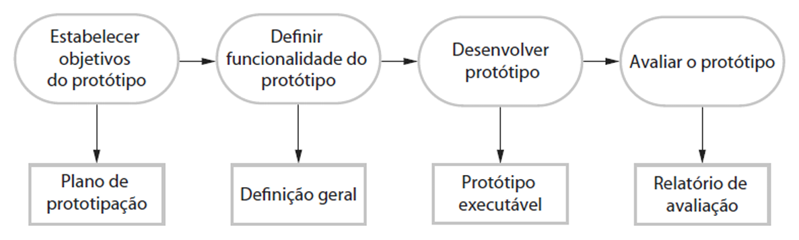
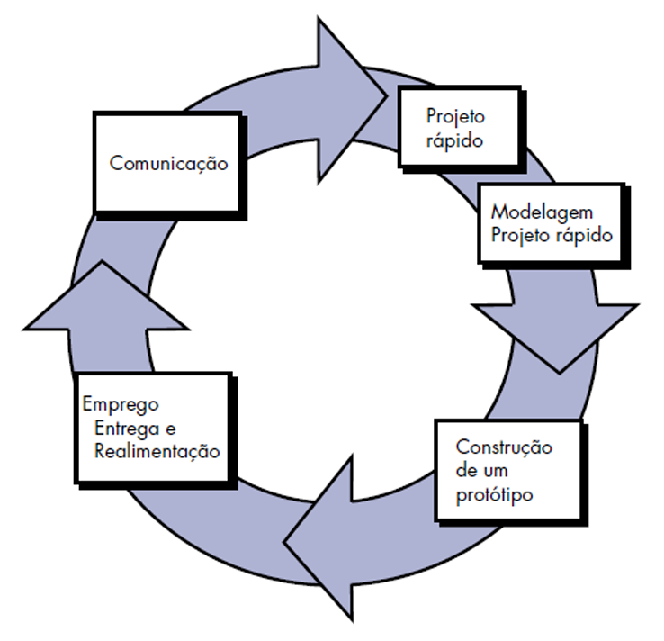

# Capítulo 7 – Modelo de Prototipagem

No complexo universo do desenvolvimento de software, nem sempre é possível iniciar um projeto com uma compreensão completa e cristalina de todos os requisitos. Frequentemente, as equipes se deparam com situações onde o cliente consegue descrever apenas os objetivos gerais do sistema desejado, mas tem dificuldade em especificar, de forma detalhada e inequívoca, todas as funcionalidades, regras de negócio e interações necessárias. Da mesma forma, a própria equipe de desenvolvimento pode enfrentar incertezas quanto à eficiência de um algoritmo específico, à viabilidade de integração com novas tecnologias, à compatibilidade com diferentes plataformas ou, muito comumente, sobre qual seria a melhor abordagem para a interface e a experiência do usuário.

Diante desses cenários permeados por ambiguidade, vagueza ou simples desconhecimento, os modelos de processo puramente sequenciais mostram-se inadequados. Torna-se imperativo adotar uma abordagem que favoreça a **experimentação controlada, o aprendizado incremental e a validação progressiva** das ideias e funcionalidades. É precisamente nesse contexto que o **modelo de prototipagem** se destaca como uma estratégia poderosa e eficaz dentro do paradigma iterativo e evolutivo. Através da criação e avaliação de **protótipos** – versões preliminares e simplificadas do sistema – é possível visualizar, testar e validar conceitos com antecedência, contribuindo significativamente para o amadurecimento e a estabilização dos requisitos, além de permitir ajustes cruciais no design antes que grandes volumes de tempo e recursos sejam investidos na construção do produto final.

## Conceitos Fundamentais da Prototipagem

A prototipagem, em sua essência, é uma técnica que pode ser aplicada de duas formas principais no desenvolvimento de software:

1. Como um **modelo de processo isolado (_stand-alone_)**: Onde todo o ciclo de vida do desenvolvimento é centrado na criação e refinamento de protótipos.
2. Como uma **técnica complementar a outros modelos de processo**: Onde a prototipagem é utilizada em fases específicas (geralmente no início) de modelos como o Cascata, Espiral ou Incremental, para auxiliar na definição de requisitos ou na exploração de soluções técnicas.

Independentemente da forma como é aplicada, sua função primordial é servir como um **instrumento de aprendizado e comunicação**, permitindo que todos os stakeholders – desenvolvedores, clientes, usuários finais e gerentes – consigam **compreender melhor aquilo que está para ser construído**, especialmente quando os requisitos iniciais são vagos, ambíguos, incompletos ou sujeitos a mudanças.

Trata-se de uma abordagem inerentemente **iterativa**, pois envolve ciclos de construção e avaliação; **interativa**, pois exige a participação ativa dos usuários no teste e feedback; e muitas vezes **ágil** em sua execução, pois busca entregar algo tangível rapidamente para acelerar o aprendizado. O objetivo principal é desenvolver versões preliminares do sistema (os protótipos) com o intuito de **experimentação**. Através desses protótipos, torna-se possível identificar requisitos ocultos, validar suposições, refinar funcionalidades e, em alguns casos, até mesmo descartar ideias que se mostrem inviáveis ou indesejadas, tudo isso antes de se comprometer com a construção em larga escala da versão definitiva do produto. Uma característica marcante desse modelo é que a documentação textual tradicional (como especificações detalhadas) muitas vezes cede lugar à comunicação visual e prática, centrada na interação com o protótipo funcional.

### O que é um Protótipo de Software?

Um **protótipo de software** é uma **versão inicial, deliberadamente incompleta e, muitas vezes, funcionalmente limitada** do sistema final que se deseja construir. Ele não é projetado para ser um produto robusto, otimizado ou pronto para produção. Seu papel principal é servir como um **modelo tangível e interativo** que permite:

- **Explorar e Esclarecer Requisitos:** Ajudar clientes e usuários a visualizar e articular melhor suas necessidades.
- **Validar o Design da Interface (UI) e a Experiência do Usuário (UX):** Testar a usabilidade, o fluxo de navegação e a clareza da interface antes de implementá-la.
- **Avaliar Alternativas Técnicas:** Experimentar diferentes abordagens de implementação, algoritmos ou integrações para verificar sua viabilidade ou desempenho.
- **Demonstrar Conceitos:** Apresentar ideias de forma concreta para obter aprovação ou investimento.
- **Treinar Usuários Antecipadamente:** Familiarizar os usuários com a futura interface do sistema.

Os protótipos funcionam como uma ferramenta poderosa para **antecipar mudanças e detectar problemas** (sejam eles de requisitos, de design ou técnicos) ainda nas fases iniciais do processo de desenvolvimento. Como a experiência na indústria demonstra repetidamente, o custo de corrigir um erro ou mal-entendido aumenta exponencialmente quanto mais tarde ele for descoberto. Um requisito corrigido durante a prototipagem tem um custo mínimo, enquanto o mesmo erro descoberto após a implantação do sistema pode exigir um retrabalho massivo e custoso.

## Aplicações da Prototipagem

A técnica de prototipagem encontra suas aplicações mais diretas e valiosas nas fases iniciais do ciclo de vida de desenvolvimento de software, atuando como uma ferramenta crucial nas disciplinas de **Engenharia de Requisitos** e **Projeto (Design) de Sistema e Software**.

### Prototipagem na Engenharia de Requisitos

Durante a **Engenharia de Requisitos**, o protótipo serve como um catalisador para **elicitar (descobrir), validar e refinar os requisitos** do sistema. Muitas vezes, os usuários têm dificuldade em articular suas necessidades abstratamente ou em validar longos documentos de especificação textual. Ao interagirem com um protótipo, mesmo que simples, eles conseguem:

- **Visualizar o Futuro Sistema:** Ter uma ideia concreta de como o software funcionará.
- **Expressar Necessidades de Forma Mais Clara:** "Não era bem isso que eu queria, preciso também de um botão para..."
- **Identificar Requisitos Omissos:** Perceber funcionalidades que não haviam sido mencionadas inicialmente.
- **Detectar Inconsistências ou Ambiguidades:** Apontar fluxos confusos ou informações contraditórias.
- **Validar Regras de Negócio:** Verificar se a lógica implementada no protótipo corresponde aos processos reais da organização.

O protótipo transforma a discussão abstrata sobre requisitos em uma conversa concreta e colaborativa centrada em algo tangível.

### Prototipagem no Projeto (Design) do Sistema

Já durante o **Projeto do Sistema**, a prototipagem pode ser utilizada para diversos fins técnicos e de design:

- **Exploração de Soluções Técnicas:** Construir pequenos protótipos para testar a viabilidade de usar uma nova biblioteca, integrar com uma API desconhecida ou avaliar o desempenho de um algoritmo específico sob condições simuladas.
- **Teste de Viabilidade de Componentes:** Criar versões simplificadas de componentes críticos da arquitetura para garantir que eles podem ser implementados e que interagem corretamente.
- **Design e Validação de Interfaces de Usuário (UI/UX):** Esta é, talvez, a aplicação mais comum da prototipagem no design. Interfaces gráficas são inerentemente interativas e sua qualidade depende enormemente da experiência subjetiva do usuário. Descrições textuais ou diagramas estáticos são frequentemente insuficientes para capturar a dinâmica da interação. Protótipos (que podem variar de _wireframes_ clicáveis a interfaces com funcionalidade simulada) permitem que designers e usuários testem o fluxo de navegação, a disposição dos elementos, a clareza das informações e a facilidade de uso geral, iterando rapidamente sobre o design até alcançar uma solução ideal.

**Exemplo Prático:** Imagine o desenvolvimento de um novo aplicativo de _internet banking_ para um banco. O requisito inicial do cliente (o banco) é "oferecer uma experiência de usuário moderna e intuitiva para transferências bancárias". Essa especificação é extremamente vaga. A equipe de desenvolvimento decide usar prototipagem:

1. **Iteração 1 (Requisitos/UI - Baixa Fidelidade):** Criação de _wireframes_ (esboços de tela) clicáveis simulando o fluxo de transferência (selecionar contato, digitar valor, confirmar). Sessões de teste com usuários revelam confusão sobre como adicionar novos favorecidos e a necessidade de um comprovante mais detalhado.
2. **Iteração 2 (Requisitos/UI - Alta Fidelidade):** Criação de um protótipo visualmente mais elaborado, com o fluxo de adição de favorecidos redesenhado e um modelo de comprovante. Novos testes mostram que os usuários sentem falta de opções de agendamento e de transferência via PIX.
3. **Iteração 3 (Técnica):** Enquanto o design da UI é refinado, outra parte da equipe cria um protótipo técnico focado em validar a integração com o sistema legado do banco para consulta de saldo em tempo real e com a API do Banco Central para realizar a transferência PIX. Esse protótipo ajuda a identificar desafios de performance e segurança.
4. **(Iterações Subsequentes):** O protótipo da UI continua evoluindo para incorporar agendamento e PIX, enquanto as lições aprendidas com o protótipo técnico informam o design da arquitetura final.

Neste exemplo, a prototipagem foi usada tanto para refinar os requisitos funcionais e de interface (o que o usuário vê e faz) quanto para mitigar riscos técnicos (a integração com outros sistemas), tudo antes da codificação massiva do produto final.

## Processo de Prototipagem

O desenvolvimento de protótipos, por ser uma atividade exploratória e iterativa, segue um processo cíclico com etapas bem definidas, embora a formalidade e o detalhamento possam variar significativamente dependendo dos objetivos do protótipo e do modelo de processo geral em que ele está inserido. Uma estrutura comum para este processo, focada na clareza dos objetivos e na avaliação contínua, é apresentada a seguir.

Analisando cada etapa:

1. **Estabelecer Objetivos do Protótipo:** Antes de iniciar qualquer construção, é crucial definir **claramente o que se espera aprender ou validar** com o protótipo. Os objetivos direcionam todo o esforço subsequente. Exemplos de objetivos: "Validar o fluxo de checkout com usuários reais", "Testar a usabilidade do novo painel de controle", "Avaliar o desempenho da integração com a API X", "Esclarecer os requisitos para o relatório Y". Objetivos vagos como "fazer um protótipo do sistema" levam a resultados ineficazes. O resultado desta etapa é um **Plano de Prototipação** (mesmo que informal), definindo o escopo, os objetivos e os critérios de avaliação.
2. **Definir Funcionalidade do Protótipo:** Com base nos objetivos, define-se **quais funcionalidades e características específicas serão incluídas** no protótipo. É essencial focar apenas no necessário para atingir os objetivos definidos, mantendo o protótipo **simples e rápido de construir**. Detalhes irrelevantes para o objetivo (como tratamento de erros complexos, otimizações de performance, segurança robusta) são geralmente omitidos nesta fase. O resultado é uma **Definição Geral** do que o protótipo fará.
3. **Desenvolver o Protótipo:** Esta é a fase de construção rápida do protótipo. Utilizam-se ferramentas que aceleram o desenvolvimento, como linguagens de script, plataformas _low-code_/_no-code_, construtores de UI, ou frameworks especializados em prototipagem. O foco é na velocidade e na funcionalidade essencial, não na qualidade do código interno ou na arquitetura escalável. O resultado é um **Protótipo Executável** (ou interativo, no caso de UI).
4. **Avaliar o Protótipo:** O protótipo é apresentado aos stakeholders relevantes (clientes, usuários finais, equipe técnica) para **avaliação e coleta de feedback**. Esta é a etapa crucial onde o aprendizado ocorre. A avaliação pode envolver demonstrações guiadas, sessões de teste de usabilidade, ou simplesmente o uso livre do protótipo. O feedback coletado (sugestões de melhoria, identificação de problemas, validação de conceitos) é documentado em um **Relatório de Avaliação**.
5. **Refinamento e Nova Iteração (Ciclo):** Com base no relatório de avaliação, decide-se os próximos passos. Se os objetivos foram alcançados e os requisitos estão claros, o processo de prototipagem pode ser concluído. Se o feedback indicar a necessidade de ajustes ou mais exploração, o protótipo é **refinado** (voltando à etapa 3 ou mesmo 2) e um novo ciclo de avaliação (etapa 4) é realizado. Esse ciclo iterativo de construção-avaliação-refinamento continua até que os objetivos da prototipagem sejam satisfatoriamente atingidos.

**Roger Pressman** oferece uma visão ligeiramente diferente, mas complementar, desse ciclo iterativo, enfatizando a comunicação inicial e o projeto rápido:

Nesta visão, o ciclo começa com a **Comunicação** para entender os objetivos. Segue para um **Projeto Rápido** e **Modelagem** focados apenas no que será prototipado. A **Construção do protótipo** leva à **Entrega e Realimentação (Feedback)**, que por sua vez alimenta a próxima rodada de **Comunicação**, reiniciando o ciclo de refinamento. Ambas as visões (Sommerville e Pressman) destacam a natureza iterativa e centrada no feedback do processo de prototipagem.

## Tipos Estratégicos de Prototipagem

Do ponto de vista estratégico, ou seja, considerando o **propósito final** do protótipo dentro do ciclo de vida do projeto, podemos classificar a prototipagem em dois tipos principais: **descartável (_throwaway_)** e **evolutiva (ou exploratória)**. É importante notar que, em muitos contextos acadêmicos e na literatura (como indicado por Sommerville), quando o termo "prototipagem" é usado sem qualificação adicional, ele geralmente se refere, por padrão, à abordagem descartável, dada sua natureza puramente exploratória.

### Prototipação Descartável (_Throwaway Prototyping_)

Nesta abordagem, o principal (e muitas vezes único) objetivo do protótipo é servir como uma **ferramenta de aprendizado para compreender e validar os requisitos do sistema**, especialmente aqueles que são inicialmente obscuros, ambíguos ou difíceis de formalizar textualmente. O protótipo é desenvolvido rapidamente, com foco na exploração e na comunicação, utilizando talvez tecnologias mais simples ou ferramentas específicas de prototipagem. Uma vez que os requisitos tenham sido suficientemente esclarecidos, validados e documentados com base no aprendizado obtido, o protótipo **cumpre sua função e é completamente descartado**. O sistema final será então desenvolvido "do zero" (ou a partir da arquitetura definida), utilizando um processo de engenharia mais formal e robusto, mas agora guiado pelos requisitos solidificados graças ao protótipo.

- **Vantagens:** Foco claro no aprendizado de requisitos; evita que código de baixa qualidade (típico de protótipos rápidos) contamine o produto final; força uma reengenharia limpa da solução final.
- **Desvantagens:** Pode parecer "desperdício" de esforço para alguns stakeholders; exige disciplina para realmente descartar o protótipo e não tentar "aproveitá-lo".

**Exemplo:** Uma equipe é contratada para desenvolver um sistema complexo de análise de dados científicos para pesquisadores que nunca usaram um sistema similar antes. Os requisitos são muito vagos. A equipe decide construir um protótipo descartável usando uma ferramenta de visualização de dados interativa e simples. Após várias sessões de demonstração e feedback com os pesquisadores, os fluxos de análise, os tipos de gráficos necessários e os formatos de dados de entrada/saída ficam claros. Com essa compreensão, a equipe descarta o protótipo e inicia o desenvolvimento do sistema final usando tecnologias mais robustas (Python com bibliotecas científicas, banco de dados otimizado, arquitetura escalável) e um processo mais formal.

### Prototipação Evolutiva (ou Exploratória)

Nesta abordagem, o protótipo inicial não é descartado, mas sim **serve como a base sobre a qual o sistema final será construído e evoluído**. O processo começa com a construção de um protótipo que implementa os requisitos mais bem compreendidos ou o núcleo funcional do sistema. Este protótipo inicial é então entregue aos usuários para avaliação. Com base no feedback recebido, o protótipo é **refinado, corrigido e expandido continuamente** em ciclos iterativos subsequentes. Novas funcionalidades são adicionadas, a interface é melhorada, a performance é otimizada, até que o protótipo evolua gradualmente para se tornar o sistema final completo e pronto para produção.

- **Vantagens:** Entrega rápida de um sistema funcional (mesmo que limitado); feedback contínuo sobre um produto em evolução; evita o "choque" de um sistema completamente novo no final.
- **Desvantagens:** Risco de o sistema final herdar uma arquitetura pobre ou código de baixa qualidade do protótipo inicial (se não houver refatoração); pode ser difícil gerenciar a evolução contínua sem perder a visão do todo; a pressão por entregar rápido pode levar a negligenciar requisitos não funcionais importantes (segurança, performance) nas fases iniciais.

**Exemplo:** Uma startup deseja criar uma nova rede social focada em um nicho específico. Eles desenvolvem rapidamente um protótipo evolucionário com as funcionalidades mínimas: cadastro de usuário, criação de posts simples e um feed básico. Lançam essa versão para um grupo fechado de usuários (_early adopters_). Com base no feedback ("precisamos de comentários", "queremos poder adicionar imagens", "a busca é lenta"), a equipe refina o protótipo, adicionando comentários na iteração seguinte, uploads de imagem na próxima, otimizando a busca depois, e assim por diante. O protótipo inicial nunca é jogado fora; ele é a semente que cresce e se transforma no produto final.

## Vantagens e Desvantagens

A adoção do modelo de prototipagem, seja descartável ou evolutiva, traz consigo um conjunto significativo de benefícios, mas também apresenta desafios e riscos que precisam ser considerados e gerenciados.

**Principais Vantagens:**
- **Melhora a Comunicação Cliente-Desenvolvedor:** O protótipo serve como um artefato tangível que facilita a comunicação e o entendimento mútuo, superando as limitações da comunicação puramente textual ou verbal.
- **Validação Precoce e Refinamento de Requisitos:** Permite que usuários e clientes experimentem o sistema (ou partes dele) muito cedo no ciclo de vida, ajudando a identificar requisitos omissos, ambíguos ou incorretos antes que se tornem problemas caros.
- **Redução de Riscos e Retrabalho:** Ao validar requisitos e designs antecipadamente, a prototipagem reduz significativamente o risco de construir a "coisa errada" e minimiza a necessidade de retrabalho custoso nas fases posteriores.
- **Suporte ao Desenvolvimento Ágil e Centrado no Usuário:** A natureza iterativa e focada no feedback da prototipagem alinha-se perfeitamente com os princípios do desenvolvimento ágil e do design centrado no usuário.
- **Pode Resultar em um Produto Final Mais Adequado:** O envolvimento contínuo do usuário tende a resultar em um sistema que atende melhor às suas necessidades reais e expectativas de usabilidade.

**Principais Desvantagens e Riscos:**
- **Pode Gerar Expectativas Irreais:** O cliente, ao ver um protótipo funcional (especialmente de interface), pode não compreender suas limitações internas (falta de tratamento de erros, performance não otimizada, segurança inexistente) e pode pressionar por uma entrega rápida, assumindo que o "sistema já está quase pronto". É crucial gerenciar essas expectativas.
- **Risco de "Apego" ao Protótipo Descartável:** Desenvolvedores (ou mesmo clientes) podem se apegar a um protótipo descartável, resistindo a jogá-lo fora e tentando "aproveitá-lo" como base para o sistema final. Isso é perigoso, pois o código do protótipo geralmente não tem a qualidade necessária para produção.
- **Foco Excessivo na Interface em Detrimento da Estrutura:** A facilidade de criar interfaces com ferramentas de prototipagem pode levar a negligenciar aspectos estruturais importantes, como a arquitetura de dados, a segurança ou a escalabilidade.
- **Negligência de Requisitos Não Funcionais:** Protótipos geralmente focam no "o quê" (funcionalidades) e no "como" (interface), mas podem ignorar requisitos não funcionais cruciais como desempenho sob carga, segurança contra ataques, robustez a falhas ou manutenibilidade a longo prazo.
- **Documentação Insuficiente:** A ênfase na construção rápida e no feedback verbal pode levar a uma documentação escassa ou desatualizada, dificultando a manutenção futura ou a integração de novos membros na equipe.
- **Gerenciamento do Processo Pode Ser Desafiador:** O ciclo iterativo e a flexibilidade podem tornar o planejamento e o acompanhamento do progresso mais complexos do que em modelos sequenciais, exigindo maior disciplina da equipe e do gerente de projeto.

## Destino Crucial Protótipo: Jogar Fora ou Evoluir?

Uma das decisões mais críticas ao final de um ciclo de prototipagem (especialmente se a abordagem inicial não foi claramente definida como descartável ou evolutiva) é: **o que fazer com o protótipo que foi construído?** A resposta correta depende fundamentalmente do tipo de prototipagem adotado e dos objetivos que foram alcançados.

- **Se a abordagem foi a Prototipação Descartável (_Throwaway_):** O destino é claro. O protótipo serviu ao seu propósito de aprendizado e validação de requisitos. Ele deve ser **formalmente abandonado**, e o desenvolvimento do sistema final deve começar com uma base de código limpa, utilizando as lições aprendidas e os requisitos agora solidificados. Tentar "remendar" ou "aproveitar" o código do protótipo descartável é quase sempre um erro que comprometerá a qualidade e a manutenibilidade do produto final.
- **Se a abordagem foi a Prototipação Evolutiva:** O protótipo não é descartado; ele é a **primeira versão (ou uma versão intermediária) do sistema final**. O caminho a seguir é continuar o ciclo iterativo, refinando, corrigindo e adicionando funcionalidades sobre a base existente, aplicando práticas de engenharia de software (como refatoração, testes automatizados, design cuidadoso) para garantir que a qualidade da arquitetura e do código não se deteriore à medida que o sistema evolui.

É crucial ter a disciplina de tomar a decisão correta. Muitas vezes, um protótipo inicial, construído rapidamente para explorar ideias, é simplesmente **inadequado para servir como base para um sistema de produção**. Ele pode ter sido feito com tecnologias inapropriadas, sem considerar escalabilidade, segurança ou manutenibilidade. Nesses casos, mesmo que a intenção inicial fosse evolutiva, a decisão mais sábia pode ser **descartá-lo** e recomeçar com um design mais robusto, aproveitando apenas o conhecimento adquirido. Não hesitar em jogar fora um protótipo que cumpriu seu papel exploratório é, paradoxalmente, um passo essencial para garantir a qualidade do sistema final.

## Considerações Finais

O **modelo de prototipagem**, inserido no paradigma mais amplo dos processos **iterativos e evolutivos**, estabelece-se como uma das abordagens mais pragmáticas e eficazes para lidar com a **incerteza e a ambiguidade** que frequentemente caracterizam o início de projetos de software. Ao priorizar a **experimentação controlada**, a **construção rápida de modelos interativos** e o **feedback contínuo e antecipado** dos usuários e stakeholders, a prototipagem transforma o levantamento de requisitos de uma atividade puramente documental em um processo dinâmico de descoberta e validação.

Seja através da **prototipagem descartável**, que atua como uma sonda para explorar o terreno desconhecido dos requisitos antes de iniciar a construção formal, ou da **prototipagem evolutiva**, que permite que o sistema cresça e se adapte organicamente em resposta ao aprendizado e às necessidades emergentes, o princípio fundamental é o mesmo: **prototipar é aprender fazendo**. Nesse sentido, o protótipo transcende sua natureza de artefato técnico para se tornar uma poderosa **ferramenta de comunicação, colaboração e mitigação de riscos**.

Contudo, sua aplicação bem-sucedida exige clareza nos objetivos, disciplina na execução dos ciclos de avaliação e refinamento, e, crucialmente, a sabedoria para decidir o destino do protótipo – descartá-lo quando ele cumpriu seu papel exploratório ou evoluí-lo com rigor de engenharia. Quando utilizada de forma consciente e estratégica, a prototipagem não apenas melhora a qualidade e a adequação do produto final, mas também promove um maior alinhamento entre a equipe de desenvolvimento e as reais necessidades do cliente, aumentando significativamente as chances de sucesso do projeto.