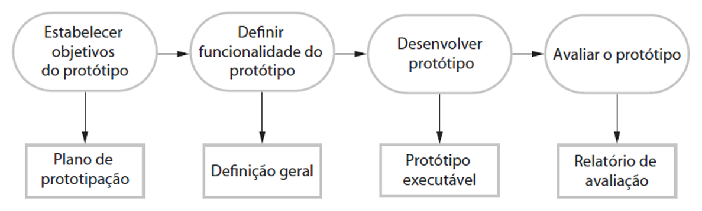
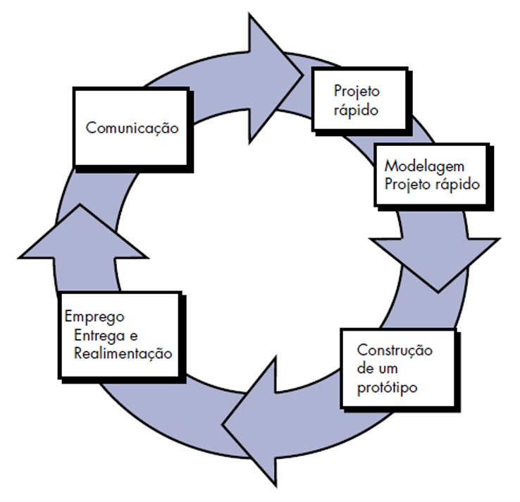

# Capítulo 7 – Modelo Iterativo e Evolutivo: Modelo de Prototipagem

No universo do desenvolvimento de software, é comum encontrarmos situações em que os requisitos do sistema não estão completamente definidos. Em muitos casos, o cliente consegue descrever apenas objetivos gerais do software desejado, mas não é capaz de especificar, de forma detalhada, as funcionalidades e os recursos necessários. Por outro lado, o próprio desenvolvedor pode se ver inseguro quanto à eficiência de um algoritmo, à compatibilidade com determinadas plataformas ou mesmo sobre como deve ocorrer a interação entre o usuário e o sistema.

Diante de cenários como esses, torna-se necessário adotar uma abordagem que favoreça a experimentação, o aprendizado incremental e a validação progressiva das funcionalidades. É nesse contexto que o **modelo de prototipagem** se destaca como uma estratégia eficaz dentro do paradigma iterativo e evolutivo. Através da criação de protótipos, é possível visualizar, testar e validar ideias com antecedência, contribuindo para o amadurecimento dos requisitos e permitindo ajustes antes que grandes investimentos sejam feitos na construção do produto final.

## Conceitos Fundamentais da Prototipagem

A prototipagem pode ser aplicada tanto como um **modelo de processo isolado (stand-alone)** quanto como uma **técnica complementar a outros modelos de processo**. Sua principal função é permitir que os stakeholders — desenvolvedores, clientes, usuários e gerentes — consigam compreender melhor aquilo que está para ser construído, especialmente quando os requisitos ainda estão vagos ou ambíguos.

Trata-se de uma abordagem **iterativa, interativa e ágil**, cujo objetivo é desenvolver versões preliminares do sistema (os protótipos) com o intuito de experimentação. Através desses protótipos, torna-se possível identificar, validar, refinar e até mesmo descartar requisitos de software, antes da construção da versão definitiva do produto. Vale observar que, nesse modelo, a documentação tradicional geralmente cede lugar à comunicação visual e prática com o sistema em funcionamento.

### O que é um Protótipo?

Um **protótipo de software** é uma versão inicial, incompleta e, muitas vezes, limitada do sistema final. Seu papel não é atender a todos os requisitos de produção, mas sim permitir testes rápidos de conceitos, avaliação de alternativas de design e, principalmente, a interação do usuário com uma representação funcional do sistema.

Protótipos ajudam a antecipar mudanças e a detectar problemas ainda nas fases iniciais do processo, quando os custos de correção são significativamente menores. Como veremos adiante, o protótipo pode servir tanto para o levantamento de requisitos como para a avaliação da viabilidade de soluções técnicas.

## Prototipagem como Ferramenta para Engenharia de Requisitos e Design

A prototipagem possui aplicações diretas nas fases iniciais do desenvolvimento de software, sobretudo nas atividades de engenharia de requisitos e projeto de sistema.

Durante a **engenharia de requisitos**, o protótipo pode ser utilizado para **elicitar, validar e refinar os requisitos** do sistema. Usuários, ao interagirem com o protótipo, conseguem expressar de forma mais clara o que esperam do sistema, além de identificar inconsistências, lacunas e imprecisões na especificação inicial.

Já durante o **projeto do sistema**, o protótipo pode ser útil na **exploração de soluções técnicas**, no **teste de viabilidade de componentes** e, especialmente, no **desenvolvimento de interfaces de usuário**. Como interfaces são, por natureza, dinâmicas e sensíveis à experiência do usuário, é comum que descrições textuais e diagramas sejam insuficientes para definir como a interação ocorrerá. A prototipagem, nesse caso, é insubstituível.

Como exemplo prático, imagine o desenvolvimento de um sistema bancário com interface gráfica. O cliente informa que deseja "uma tela simples para movimentações". Essa especificação é ambígua. A equipe de desenvolvimento decide criar um protótipo navegável que simula a interface de transações — depósitos, saques e transferências. Ao testar o protótipo, o cliente percebe que deseja filtros por data, categorias de transações e um sistema de confirmação em duas etapas. Nada disso havia sido descrito inicialmente. O protótipo, portanto, serviu como instrumento de comunicação e refinamento de requisitos.

## Processo de Prototipagem

O desenvolvimento de protótipos segue um processo com etapas bem definidas, embora possa variar conforme os objetivos do projeto. A seguir, descrevemos uma estrutura comum para a criação de protótipos de software:

  

- **Definição dos Objetivos do Protótipo:** Antes de construir qualquer artefato, é necessário definir o que se espera alcançar com o protótipo. Pode-se, por exemplo, prototipar apenas a interface gráfica, experimentar requisitos funcionais específicos ou validar uma arquitetura de dados. Objetivos mal definidos levam a protótipos ineficazes.
- **Planejamento da Iteração:** Uma vez definidos os objetivos, planeja-se rapidamente uma iteração de prototipagem. Essa fase inclui a definição do escopo, dos recursos necessários e da abordagem técnica.
- **Construção do Protótipo:** A construção deve ser rápida e focada. Frequentemente são utilizadas ferramentas de desenvolvimento ágil ou plataformas especializadas para prototipagem. Apenas os elementos essenciais devem ser incluídos. Requisitos não funcionais (como desempenho ou segurança) geralmente são ignorados, a não ser que sejam o foco da iteração.
- **Avaliação do Protótipo pelos Stakeholders:** Os usuários interagem com o protótipo, testam funcionalidades, fornecem feedback e sugerem melhorias. Essa fase pode revelar erros de entendimento, funcionalidades redundantes ou omissões graves.
- **Refinamento e Nova Iteração (se necessário):** Com base no feedback, o protótipo é ajustado. Esse ciclo de refinamento pode ocorrer diversas vezes até que os requisitos estejam claros.

Uma representação comum desse processo é a apresentada por **Ian Sommerville**, que enfatiza que a prototipação é um processo iterativo com foco no entendimento e validação dos requisitos. Já **Roger Pressman** descreve esse processo com etapas bem definidas, a começar pela comunicação, seguida por projeto rápido, modelagem, construção do protótipo, avaliação e refinamento.

  

## Tipos de Prototipagem

Do ponto de vista estratégico, podemos dividir a prototipagem em dois grandes tipos: **prototipação descartável (throwaway)** e **prototipação evolutiva (ou exploratória)**. Vale destacar que em muitos contextos, quando não especificado, o termo "prototipagem" geralmente se refere à versão descartável, como indicado por Sommerville.

### Prototipação Descartável (Throwaway)

Neste tipo, o objetivo é **compreender os requisitos**, especialmente aqueles mais obscuros ou difíceis de formalizar. O protótipo é desenvolvido com foco em experimentação e, uma vez que os requisitos estejam claros, ele é **descartado**. O sistema final será então desenvolvido “do zero”, utilizando os requisitos elicitados com o protótipo.

**Exemplo:** Uma equipe precisa desenvolver um aplicativo de agendamento de consultas médicas. Inicialmente, cria um protótipo de baixa fidelidade com telas básicas e fluxos simplificados. Após diversas sessões com os usuários, os requisitos são definidos com precisão. O protótipo é então abandonado e inicia-se o desenvolvimento formal.

### Prototipação Evolutiva (Exploratória)

Neste caso, o protótipo é **refinado continuamente até se tornar o sistema final**. Parte-se de uma versão inicial rudimentar e, a cada ciclo, novas funcionalidades são adicionadas, melhoradas ou ajustadas, conforme os usuários fornecem feedback.

**Exemplo:** Uma startup desenvolve um protótipo funcional de sua aplicação de delivery. O protótipo já contém funcionalidades mínimas e é colocado em uso com um grupo restrito. A partir daí, novas funções são incorporadas continuamente, até atingir um produto maduro e estável.

## Vantagens e Desvantagens da Prototipagem

As principais vantagens de se utilizar o modelo de protótipo são:

- Facilita a comunicação com o cliente.
- Permite validação precoce dos requisitos.
- Reduz riscos de retrabalho.
- Suporta desenvolvimento ágil e centrado no usuário.

Todavia, dentre as principais desvantagens:

- Pode gerar expectativas irreais sobre o desempenho do sistema final.
- Protótipos podem ser inadequadamente reaproveitados.
- Foco limitado nos requisitos não funcionais.
- Documentação tende a ser negligenciada.

## O Destino do Protótipo: Jogar Fora ou Evoluir?

Uma das dúvidas mais frequentes é: **o que fazer com o protótipo após atingir seu objetivo?** A resposta depende do tipo de prototipagem adotado.

- **Se for descartável**, o protótipo é abandonado e serve apenas como instrumento de aprendizado.
- **Se for evolucionário**, o sistema prototipado será a base do sistema final, com incrementos sucessivos.

É importante reforçar que, em muitos casos, o primeiro protótipo é apenas um "rascunho funcional", sendo inadequado para produção devido a limitações de desempenho, usabilidade ou manutenção. Não hesite em descartá-lo quando necessário — esse é, muitas vezes, um passo essencial para a qualidade do sistema final.

## Considerações Finais

O modelo de **prototipagem**, dentro do paradigma **iterativo e evolutivo**, é uma das abordagens mais eficazes para lidar com a incerteza nos requisitos de software. Ao priorizar a experimentação e o feedback constante dos usuários, esse modelo não apenas melhora a qualidade dos requisitos, mas também promove maior alinhamento entre o sistema desenvolvido e as reais necessidades do cliente.

Seja por meio da **prototipagem descartável**, que visa esclarecer requisitos antes do desenvolvimento formal, ou da **prototipagem evolutiva**, que gradualmente dá forma ao sistema final, o importante é compreender que **prototipar é aprender fazendo**. E, nesse sentido, o protótipo é muito mais do que um artefato técnico: é uma poderosa ferramenta de comunicação, descoberta e construção colaborativa.
