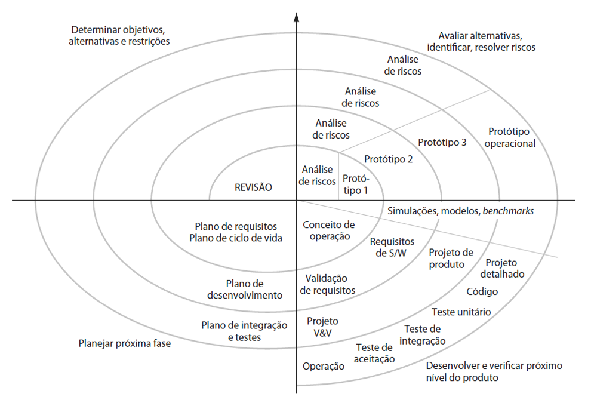
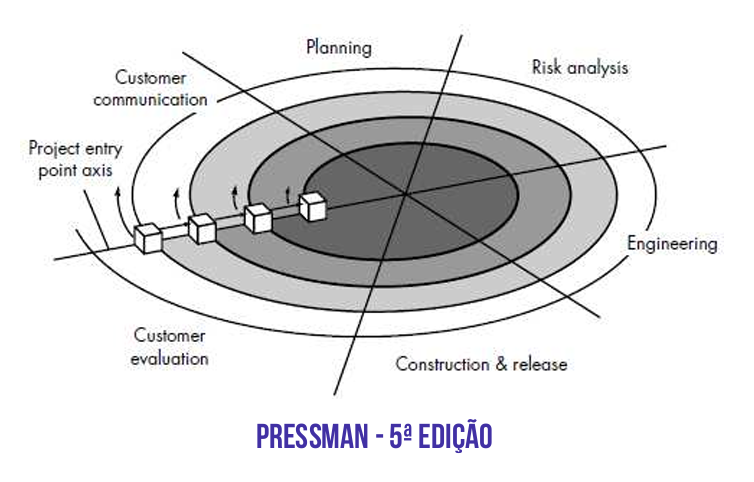
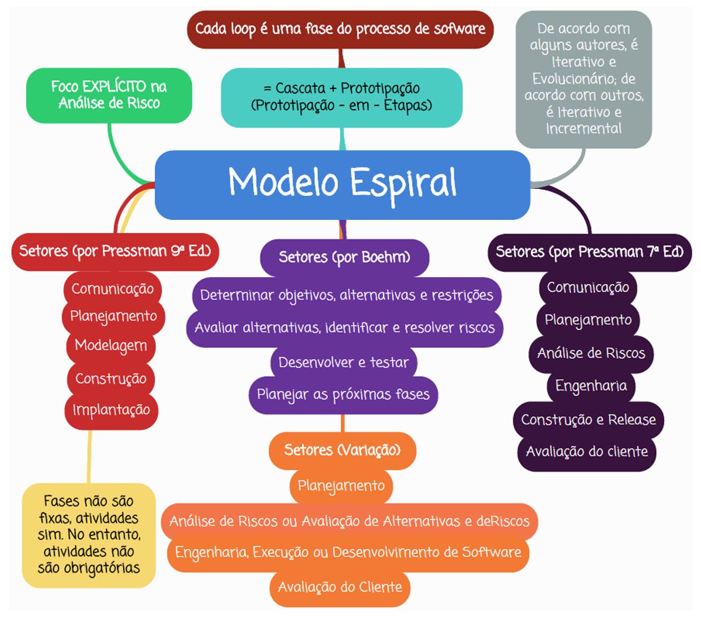

# Capítulo 8 – Modelo em Espiral

No panorama diversificado dos modelos de processo da Engenharia de Software, o **Modelo em Espiral** ocupa uma posição de destaque como uma abordagem sofisticada e particularmente adaptada à construção de sistemas complexos, de grande escala e, acima de tudo, **críticos**, onde o gerenciamento proativo de **riscos** é um fator essencial para o sucesso. Proposto originalmente por **Barry Boehm** em um artigo seminal de 1988, o modelo surgiu como uma resposta direta às limitações percebidas nos modelos sequenciais lineares, como o Cascata, que se mostravam inadequados para lidar com a incerteza e a evolução inerentes a projetos ambiciosos. O Modelo em Espiral, de forma inovadora, incorporou conceitos de **prototipagem**, **análise sistemática de riscos** e **planejamento contínuo**, organizando-os de maneira cíclica e evolucionária.

A representação gráfica icônica deste modelo assemelha-se a uma **espiral que se expande progressivamente** a partir de um ponto central. Cada "volta" ou ciclo completo da espiral representa uma **fase ou estágio do processo de desenvolvimento do software**. A cada ciclo, novas funcionalidades são agregadas ao sistema ou as existentes são refinadas, enquanto, crucialmente, os **riscos associados** a essa etapa do projeto são explicitamente **identificados, analisados e mitigados**. Dessa forma, o modelo combina de forma elegante as características **iterativas** (ciclos repetidos de desenvolvimento) e **evolucionárias** (o sistema cresce e amadurece progressivamente) dentro de um processo altamente gerenciado e explicitamente **guiado por riscos**. Por essa integração da prototipagem como ferramenta de análise e mitigação de riscos em etapas sucessivas, ele também ficou conhecido pela alcunha de **prototipagem-em-etapas**.

## Fundamentos Conceituais

A estrutura central do Modelo em Espiral, conforme proposta originalmente por Boehm, é composta por uma **série de loops ou ciclos** que emanam de um ponto inicial. Cada loop completo representa a passagem por um conjunto de atividades padrão, culminando em um produto (ou protótipo) mais evoluído e em um plano para o próximo ciclo. Diferentemente de modelos onde cada fase (como Requisitos, Projeto, etc.) é executada uma única vez de forma monolítica, no Modelo em Espiral **essas atividades fundamentais se repetem múltiplas vezes** ao longo do projeto, a cada volta da espiral.

O avanço pela espiral simboliza o **progresso acumulado** no projeto e o **grau crescente de completude e refinamento** do software. Os loops mais internos, próximos ao centro, geralmente correspondem às fases iniciais de **concepção e viabilidade** do projeto. À medida que a espiral se expande para loops subsequentes, eles podem corresponder à **definição de requisitos**, à **prototipagem**, ao **projeto arquitetural**, ao **desenvolvimento detalhado**, à **validação** e, eventualmente, à **manutenção e evolução** do sistema já implantado.

O elemento mais distintivo do modelo de Boehm é sua explícita **orientação à análise de riscos**. Cada loop da espiral é sistematicamente subdividido em **quatro grandes setores ou quadrantes de atividades**, que são percorridos sequencialmente em cada ciclo:

### Quadrante 1: Determinar Objetivos, Alternativas e Restrições

Nesta primeira etapa de cada ciclo, o foco está em **definir com clareza os objetivos específicos** para aquela iteração ou fase do desenvolvimento. Esses objetivos podem variar amplamente dependendo do ponto em que o projeto se encontra na espiral: desde "definir a viabilidade inicial" no primeiro ciclo, passando por "validar a interface do usuário para a funcionalidade X" em um ciclo intermediário, até "melhorar o desempenho da consulta Y" em um ciclo de evolução. Além dos objetivos, são identificadas **alternativas técnicas ou estratégicas** para alcançá-los (por exemplo, desenvolver internamente versus comprar um componente pronto, usar a tecnologia A versus a tecnologia B) e as **restrições** que limitam essas alternativas (como orçamento disponível, prazos impostos, recursos humanos limitados, tecnologia legada existente, regulamentações a serem cumpridas).

**Exemplo Prático:** Em um projeto para desenvolver um novo sistema de _internet banking_ para um banco, um objetivo em um ciclo inicial (fase de Elaboração) poderia ser "Definir e validar a arquitetura de segurança para autenticação multifator (MFA)". As alternativas poderiam incluir: (A) desenvolver uma solução MFA proprietária, (B) integrar com uma API de um fornecedor de MFA de mercado, (C) usar tokens de hardware. As restrições poderiam ser: o orçamento alocado para segurança, o prazo para ter a solução MFA implementada e a necessidade de cumprir as normas de segurança do Banco Central.

### Quadrante 2: Avaliar Alternativas, Identificar e Resolver Riscos

Com os objetivos, alternativas e restrições definidos, o segundo quadrante dedica-se à **análise crítica e à gestão de riscos**. Realiza-se uma avaliação comparativa das alternativas identificadas, ponderando seus prós e contras em relação aos objetivos e restrições. Durante essa avaliação, inevitavelmente surgem **incertezas e potenciais problemas – os riscos** – que podem comprometer o sucesso daquela iteração ou do projeto como um todo (riscos técnicos, de requisitos, de recursos, etc.). Esses riscos são cuidadosamente **identificados, analisados (probabilidade e impacto) e priorizados**. Em seguida, são definidas e executadas **estratégias para mitigar ou resolver os riscos mais críticos**. Uma das estratégias de mitigação mais frequentemente utilizadas neste quadrante é a **criação de protótipos**, que funcionam como "experimentos" ou "provas de conceito" para reduzir incertezas técnicas ou validar requisitos ambíguos.

**Exemplo Prático (continuação):** Avaliando as alternativas de MFA, a equipe identifica riscos: (A) desenvolver internamente pode atrasar o projeto e a solução pode não ser tão segura quanto as de mercado (risco técnico e de prazo); (B) a API do fornecedor de mercado pode ter problemas de compatibilidade com a infraestrutura legada do banco (risco técnico); (C) tokens de hardware podem ter alto custo de distribuição e baixa aceitação pelos clientes (risco de negócio e de custo). Para mitigar o risco B (o mais crítico tecnicamente), a equipe decide, neste quadrante, **construir um protótipo focado exclusivamente na integração** com a API do fornecedor em um ambiente de teste controlado, para validar a compatibilidade e o desempenho antes de se comprometer com essa solução.

### Quadrante 3: Desenvolver e Testar o Produto (Engenharia)

Uma vez que os riscos mais críticos daquele ciclo foram abordados e resolvidos (ou minimizados a um nível aceitável), o projeto avança para o terceiro quadrante: o **desenvolvimento e teste** do produto daquela iteração. Aqui, a equipe **escolhe e aplica o modelo de desenvolvimento mais apropriado** para os objetivos e a natureza do trabalho daquele ciclo específico. Isso demonstra a flexibilidade do Espiral: dentro deste quadrante, pode-se usar uma abordagem cascata (se os requisitos estiverem muito claros), prototipagem evolucionária, desenvolvimento baseado em componentes, métodos formais ou qualquer outra abordagem que faça sentido para construir a parte do software planejada para aquela iteração. O software (ou o incremento, ou o protótipo) é efetivamente codificado, testado (unidade, integração) e preparado para ser avaliado no próximo quadrante.

**Exemplo Prático (continuação):** Após o protótipo de integração com a API de MFA ser bem-sucedido (risco mitigado), a equipe, neste quadrante, desenvolve a funcionalidade completa de login com MFA, seguindo talvez um "mini-cascata" (projeto detalhado -> codificação -> teste de unidade -> teste de integração da funcionalidade MFA). O resultado é uma versão do sistema de _internet banking_ que agora inclui a autenticação multifator funcional.

### Quadrante 4: Planejar a Próxima Iteração (Revisão)

No último setor de cada loop, realiza-se uma **revisão formal dos resultados obtidos** na iteração concluída. O produto desenvolvido é avaliado em relação aos objetivos definidos no início do ciclo. Verifica-se se os riscos foram adequadamente tratados e se o progresso geral do projeto está satisfatório. Com base nessa avaliação, toma-se a **decisão crítica**: o projeto deve **prosseguir para a próxima iteração**? Ou é necessário **revisar** o plano, ajustar o escopo ou até mesmo **interromper** o projeto se os resultados não forem promissores ou os riscos permanecerem muito altos? Se a decisão for continuar, elabora-se o **plano detalhado para a próxima iteração**, definindo seus objetivos, escopo, recursos e cronograma, iniciando assim um novo loop da espiral com novos desafios a serem considerados.

Essa estrutura de revisão e planejamento explícito ao final de cada ciclo garante que o desenvolvimento ocorra com base em **marcos concretos e validações periódicas**, ancorando o projeto na realidade técnica e de negócio e permitindo um controle mais eficaz sobre seu direcionamento.

## Adaptações e Variações

O modelo original de Boehm, com seus quatro quadrantes focados em objetivos e riscos, serviu de base para diversas adaptações. **Roger Pressman**, em diferentes edições de sua obra sobre Engenharia de Software, propôs versões ligeiramente modificadas do Modelo em Espiral, ajustando a terminologia e o número de setores para alinhá-los a um framework de atividades mais genérico.

Em edições anteriores (como a 5ª), Pressman descrevia um modelo com **seis regiões de tarefas**:

1. Comunicação com o Cliente
2. Planejamento
3. Análise de Riscos
4. Engenharia (Projeto e Construção)
5. Construção e Liberação (_Release_)
6. Avaliação do Cliente (Feedback)

Em edições mais recentes (como a 7ª), ele simplificou para **cinco atividades principais**:

1. **Comunicação:** Estabelecimento de um canal eficaz entre desenvolvedores e stakeholders.
2. **Planejamento:** Estimativas (esforço, cronograma), alocação de recursos e análise de riscos.
3. **Modelagem:** Atividades de análise de requisitos e projeto (design) do sistema.
4. **Construção:** Implementação do código e execução dos testes.
5. **Emprego (Implantação):** Entrega de uma versão (incremento ou protótipo) ao cliente e obtenção de feedback.

Apesar das diferenças na nomenclatura e no número exato de setores, **o espírito fundamental do modelo permanece o mesmo** em ambas as visões (Boehm e Pressman): **ciclos iterativos que progridem pela espiral, ênfase explícita na análise e mitigação de riscos em cada ciclo, possibilidade de usar prototipagem, entregas sucessivas de versões cada vez mais completas e a participação contínua do cliente para fornecer feedback e validar o progresso**.

É importante entender que cada loop da espiral pode representar diferentes níveis de abstração ou fases do processo. Por exemplo:

- **Loop 1 (Ciclo Inicial):** Poderia focar na avaliação da **viabilidade** técnica e econômica do conceito do projeto. O produto poderia ser um documento de conceito ou um protótipo de baixíssima fidelidade.
- **Loop 2:** Poderia se concentrar na **definição detalhada dos requisitos** e na criação de um **protótipo** mais elaborado da interface ou de funcionalidades chave.
- **Loop 3:** Poderia abordar o **projeto arquitetural** e a **construção** de um núcleo funcional do sistema.
- **Loop 4 e subsequentes:** Poderiam focar na **construção incremental** das demais funcionalidades, testes completos, implantação e, eventualmente, na **manutenção e evolução** contínua do sistema após a entrega inicial.

Em todas essas fases ou loops, as atividades centrais (sejam os 4 quadrantes de Boehm ou os 5/6 setores de Pressman) são realizadas, promovendo uma abordagem consistente e controlada ao longo de todo o ciclo de vida.

## Características Distintivas

O Modelo em Espiral possui características que o diferenciam de forma marcante de outros modelos de processo, tornando-o particularmente poderoso para certos tipos de projeto:

1. **Crescimento Evolucionário Acoplado à Redução Contínua de Riscos:** Esta é talvez a sua característica mais definidora. A cada volta completa da espiral, o sistema não apenas **cresce em funcionalidade, complexidade e nível de detalhe**, mas também se torna **mais robusto e menos arriscado**. Os riscos mais críticos são confrontados e tratados nas fases iniciais, e os riscos residuais são continuamente identificados e gerenciados a cada novo ciclo. O modelo, portanto, alia de forma intrínseca a **segurança** (proporcionada pelo gerenciamento de riscos) à **flexibilidade** (permitida pela natureza iterativa e evolucionária).
2. **Marcos de Ancoragem (_Anchoring Milestones_):** Ao final de cada ciclo (ou em pontos chave definidos no planejamento), o Modelo em Espiral prevê a existência de **pontos de verificação formais**, chamados de Marcos de Ancoragem. Esses marcos servem como portões de decisão cruciais, onde o progresso do projeto é avaliado de forma objetiva em relação aos planos, os riscos são reavaliados e as partes interessadas (equipe, gerência, cliente) tomam uma decisão formal sobre o futuro do projeto: **continuar** para o próximo ciclo como planejado, **revisar** o plano (ajustar escopo, prazo, recursos) ou, em casos extremos, **interromper** o projeto se ele se mostrar inviável ou desalinhado com os objetivos. Esses marcos garantem que as decisões importantes sejam tomadas com base em **dados concretos e com o comprometimento formal** de todos os envolvidos, evitando que o projeto "derive" sem controle.

## Natureza do Modelo: Evolutivo ou Incremental?

Uma discussão frequente na literatura acadêmica sobre o Modelo em Espiral diz respeito à sua classificação exata: ele seria um modelo puramente **evolucionário** ou também **incremental**? A resposta, novamente, pode depender da interpretação.

Seguindo a distinção proposta por Pressman (discutida no capítulo anterior), o Modelo em Espiral é fundamentalmente **iterativo** (pois opera em ciclos repetidos) e **evolucionário** (pois o sistema amadurece e se refina progressivamente). No entanto, ele **não é necessariamente incremental** no sentido estrito de **sempre** entregar um incremento de software **funcional e utilizável pelo cliente final** a cada iteração.

Como vimos, os ciclos iniciais da espiral podem focar em atividades como análise de viabilidade, levantamento de requisitos ou prototipagem exploratória, cujos produtos podem ser documentos, modelos ou protótipos técnicos, e não necessariamente software operacional. O que se constrói e entrega a cada ciclo são **versões progressivamente mais completas e refinadas** do software (ou de seus artefatos), que evoluem em direção à solução final. Portanto, na visão de Pressman, ele é classificado como **iterativo e evolucionário**, mas não estritamente incremental em todas as suas voltas. Outros autores podem ter visões ligeiramente diferentes, mas a ênfase na evolução guiada por riscos é um consenso.

## Aplicações Práticas

Dadas suas características – foco em riscos, natureza iterativa e capacidade de lidar com a evolução de sistemas complexos – o Modelo em Espiral **não é uma abordagem trivial** e geralmente não é a escolha mais eficiente para projetos pequenos, simples ou com requisitos muito bem definidos e estáveis. Sua força reside em cenários mais desafiadores.

O modelo é especialmente indicado para:

- **Projetos de Grande Porte e Longa Duração:** Onde a complexidade é alta, o escopo é vasto e a necessidade de controle e gerenciamento de riscos ao longo de vários anos é fundamental.
- **Sistemas Críticos ou de Missão Crítica:** Onde falhas podem ter consequências severas (financeiras, de segurança, de vidas humanas). O foco explícito na análise e mitigação de riscos é crucial nesses contextos. Exemplos incluem software para setores como **defesa, aeroespacial, saúde (equipamentos médicos), financeiro (sistemas bancários centrais), energia (controle de usinas) e automotivo (sistemas embarcados)**.
- **Projetos com Altos Riscos Técnicos ou de Requisitos:** Quando há incerteza significativa sobre a viabilidade de uma tecnologia chave, a complexidade de integração com sistemas legados, ou quando os requisitos são inovadores, ambíguos ou sujeitos a mudanças frequentes. O modelo permite explorar e resolver essas incertezas em ciclos iniciais.
- **Desenvolvimento de Linhas de Produto ou Versões Múltiplas:** Onde um núcleo de sistema é desenvolvido e depois evoluído em diferentes versões ou produtos derivados. A espiral pode modelar esse ciclo de vida contínuo.
- **Projetos que Exigem Forte Participação do Cliente/Usuário:** Embora não tão centrado no cliente quanto alguns métodos ágeis, o modelo prevê pontos de avaliação e feedback ao final de cada ciclo, permitindo um envolvimento significativo.

A aplicação do Modelo em Espiral exige uma **equipe experiente**, especialmente em **análise de riscos e planejamento**, e um certo nível de **maturidade organizacional** para lidar com a complexidade do gerenciamento de múltiplos ciclos e marcos.

## Vantagens e Desvantagens

Como toda abordagem de processo, o Modelo em Espiral apresenta um conjunto de pontos fortes e fracos que determinam sua adequação a diferentes contextos.

|**Vantagens**|**Desvantagens**|
|---|---|
|**Gerenciamento Explícito e Robusto de Riscos:** Principal diferencial. Permite identificar e mitigar riscos proativamente em cada ciclo.|**Complexidade:** O modelo em si é mais complexo de entender, implementar e gerenciar do que modelos mais simples como o Cascata ou alguns métodos ágeis.|
|**Flexibilidade e Adaptabilidade:** A natureza iterativa permite acomodar mudanças nos requisitos e ajustar o plano a cada ciclo.|**Exige Expertise em Riscos:** A eficácia do modelo depende crucialmente da habilidade da equipe (especialmente analistas e gerentes) em identificar e avaliar riscos corretamente.|
|**Produção de Versões Intermediárias:** Gera protótipos ou versões do sistema em cada iteração, permitindo feedback e validação precoce.|**Potencialmente Caro:** Se mal gerenciado, ou se muitos ciclos forem necessários, o custo total do projeto pode se tornar elevado devido à sobrecarga de planejamento e análise de riscos em cada loop.|
|**Qualidade Progressiva:** O software evolui e é refinado a cada ciclo, tendendo a resultar em um produto final de maior qualidade.|**Não Ideal para Projetos Pequenos/Simples:** A sobrecarga de gerenciamento de riscos e planejamento de múltiplos ciclos pode ser excessiva e desnecessária para projetos de baixo risco ou curta duração.|
|**Reflete Práticas Reais:** A combinação de planejamento, prototipagem, desenvolvimento e avaliação espelha de forma mais realista como muitos projetos complexos são conduzidos.|**Dependência de Marcos:** O sucesso depende da disciplina em realizar as revisões nos marcos e tomar as decisões difíceis (ajustar/cancelar) quando necessário.|
|**Abordagem Sistemática e Controlada:** Apesar da flexibilidade, mantém um alto nível de controle e visibilidade sobre o processo através dos ciclos e marcos.|**Contrato pode ser Difícil:** Definir um contrato de preço fixo para um projeto em espiral pode ser desafiador, dada a natureza exploratória e a possibilidade de ajustes no escopo.|
|**Estimativas Mais Realistas:** O planejamento iterativo permite refinar as estimativas de prazo e custo à medida que o projeto avança e as incertezas diminuem.||

## Considerações Finais

O **Modelo em Espiral** representa uma das abordagens mais completas, realistas e robustas dentro da Engenharia de Software para lidar com o desenvolvimento de sistemas complexos e de alto risco. Sua principal contribuição foi a **integração explícita e sistemática da análise de riscos** como um motor central do processo iterativo e evolutivo. Ao combinar as melhores práticas da prototipagem (para exploração e aprendizado) com a disciplina do planejamento e controle de modelos mais formais, ele permite construir software de forma gerenciada, com qualidade crescente e, fundamentalmente, com uma capacidade proativa de identificar e neutralizar as incertezas que podem comprometer o sucesso do projeto.

Sua estrutura cíclica, dividida em quadrantes ou setores que se repetem a cada volta da espiral, garante que as atividades essenciais (planejamento, análise de riscos, engenharia/desenvolvimento, avaliação) sejam revisitadas continuamente, permitindo o refinamento progressivo do produto e do processo. Os marcos de ancoragem ao final de cada ciclo adicionam pontos de controle cruciais, assegurando que o projeto avance com base em validações concretas e decisões conscientes.

Embora sua complexidade e a exigência de expertise em gerenciamento de riscos o tornem menos adequado para projetos triviais, o Modelo em Espiral permanece como uma **escolha ideal para projetos de grande porte, de longa duração, tecnologicamente desafiadores ou inseridos em domínios críticos**, onde a falha não é uma opção. Por ser altamente adaptável, pode ser configurado para diferentes níveis de formalidade, acompanhando a evolução do produto desde a concepção inicial até sua eventual retirada de uso. Ele se consolida, assim, não apenas como um modelo de processo, mas como uma filosofia de engenharia focada na **excelência através da gestão contínua da incerteza**.

