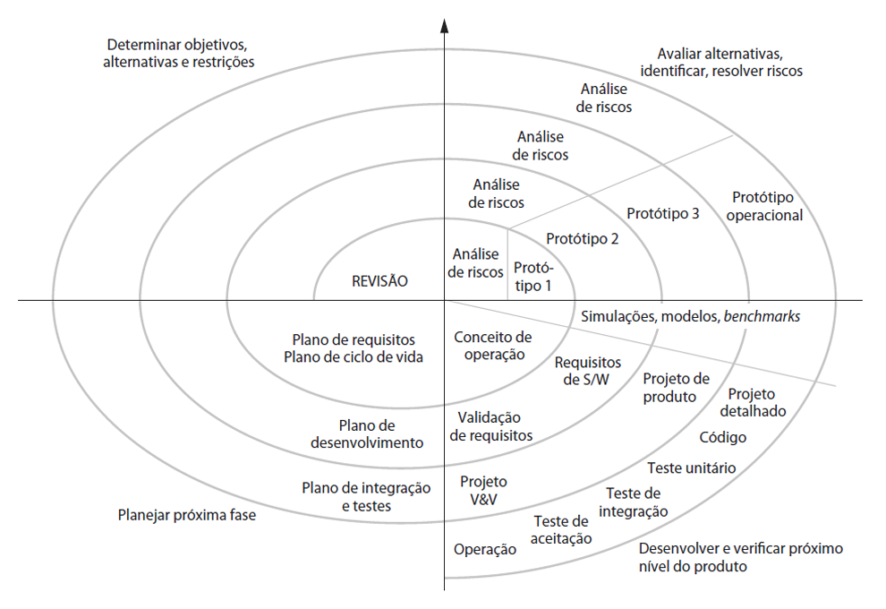
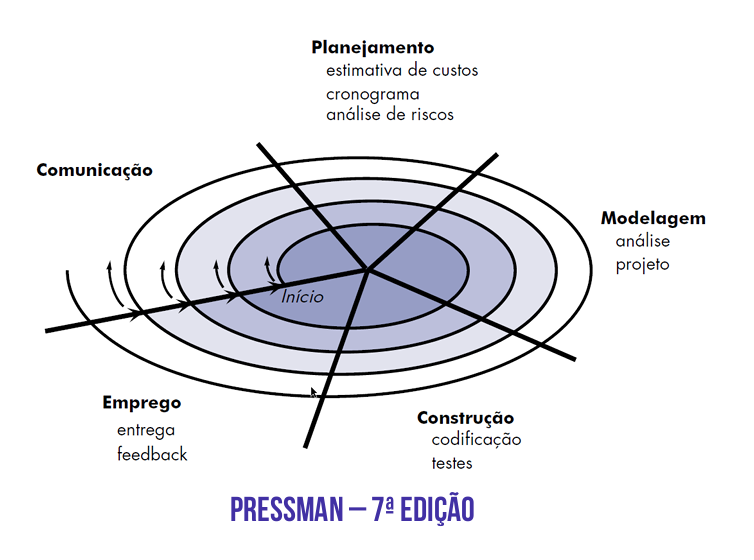
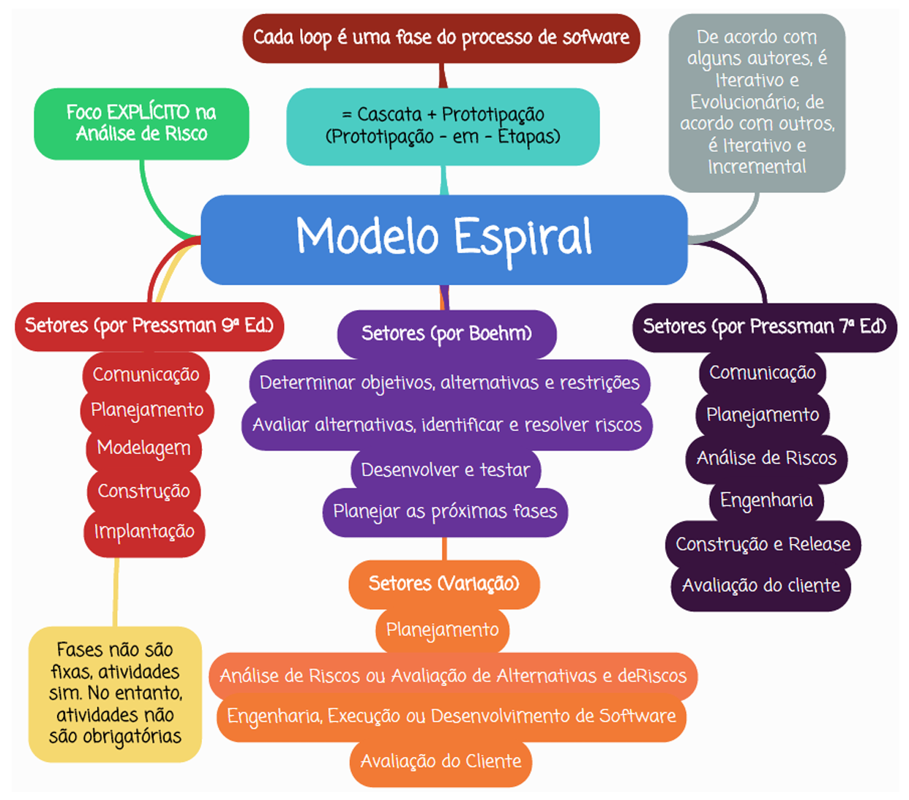

# Capítulo 8 – Modelo Iterativo e Evolutivo: Modelo em Espiral

No campo da Engenharia de Software, o **Modelo em Espiral** destaca-se como uma abordagem sofisticada, voltada à construção de sistemas complexos e críticos, especialmente aqueles em que o gerenciamento de riscos é essencial. Proposto originalmente por Barry Boehm em 1988, o modelo surgiu como uma resposta às limitações dos modelos lineares tradicionais, como o modelo em cascata, e incorporou conceitos de prototipação, análise de riscos e planejamento contínuo, organizando-os de maneira cíclica.

A representação gráfica deste modelo lembra uma espiral que se expande progressivamente. A cada "volta" da espiral, novas funcionalidades do sistema são agregadas, enquanto os riscos associados ao projeto são identificados, analisados e mitigados. Assim, o modelo combina características iterativas e evolucionárias em um processo altamente gerenciado e baseado em riscos, sendo por isso também conhecido como **prototipagem-em-etapas**.

## Fundamentos do Modelo em Espiral

A espiral proposta por Boehm é composta por uma série de loops, ou ciclos, onde cada loop representa uma fase do desenvolvimento do software. Diferente de modelos em que cada fase é realizada uma única vez, no Modelo em Espiral essas fases se repetem várias vezes ao longo do projeto. Os loops mais internos podem corresponder, por exemplo, à fase de viabilidade do projeto; os loops seguintes, à definição de requisitos, à modelagem, à implementação, à validação, e assim por diante. O avanço pela espiral representa um grau crescente de sofisticação e refinamento no desenvolvimento do software.

  

O modelo de Boehm é orientado à análise de riscos. Cada loop é subdividido em quatro grandes setores de atividades:

### Determinar Objetivos, Alternativas e Restrições

Nesta primeira etapa, os objetivos do projeto são definidos com clareza. Esses objetivos podem variar desde aumentar a performance do sistema até corrigir funcionalidades ou melhorar a qualidade geral do software. Paralelamente, são identificadas alternativas técnicas ou estratégicas — como reutilizar componentes, adquirir software pronto ou desenvolver do zero — bem como as restrições do projeto, que incluem custos, prazos, recursos humanos, limitações tecnológicas, entre outras.

**Exemplo:** Em um projeto de sistema bancário, o objetivo pode ser melhorar a segurança das transações. Como alternativas, podem ser consideradas a integração com APIs de terceiros, o uso de criptografia de ponta ou o desenvolvimento de um módulo interno. As restrições podem incluir o orçamento do banco e o tempo para entrar em produção.

### Avaliar Alternativas, Identificar e Resolver Riscos

Com as alternativas definidas, realiza-se uma análise comparativa entre elas, observando quais atendem melhor aos objetivos dentro das restrições impostas. Durante essa análise, surgem incertezas — os chamados riscos — que podem comprometer o sucesso do projeto. Esses riscos são cuidadosamente avaliados e, quando possível, mitigados. Uma das estratégias frequentemente utilizadas para mitigação é a criação de protótipos, que funcionam como "testes de conceito".

**Exemplo:** Continuando o exemplo do sistema bancário, pode haver o risco de que uma determinada API de autenticação externa não seja compatível com a infraestrutura atual. Para mitigar esse risco, desenvolve-se um protótipo de integração que permita testar essa API em um ambiente controlado.

### Desenvolver e Testar o Produto

Uma vez resolvidos ou minimizados os riscos, passa-se à etapa de desenvolvimento e testes. Aqui, o time escolhe o modelo de desenvolvimento mais apropriado — como o modelo cascata, a prototipação evolucionária, o desenvolvimento baseado em componentes, entre outros — e implementa as funcionalidades previamente planejadas. O software é codificado, testado e preparado para ser avaliado na próxima etapa.

### Planejar a Próxima Iteração

No último setor de cada loop, é feita uma avaliação dos resultados obtidos. Se o projeto apresentar progresso satisfatório e riscos sob controle, decide-se pelo prosseguimento à próxima fase. Nesse momento, é elaborado o plano para a iteração seguinte, que inicia um novo loop da espiral com novos objetivos, novas alternativas e, naturalmente, novos riscos a serem considerados.

Ao final de cada volta na espiral, existe uma **tomada de decisão crítica**: continuar, revisar ou interromper o projeto. Essa característica garante que o desenvolvimento ocorra com base em marcos concretos, ancorando o projeto em realidades técnicas e de negócio.

## Adaptações e Variações: A Visão de Pressman

Roger Pressman, um dos principais autores em Engenharia de Software, adaptou o modelo de Boehm e propôs uma versão com **cinco setores de atividades** (em edições anteriores ele considerava seis etapas: Planejamento, Análise de Riscos, Engenharia, Construção e Liberação, Avaliação do Cliente e Comunicação com Cliente) por loop:

  
  

1. **Comunicação:** Estabelecimento de um canal eficaz entre os desenvolvedores e os stakeholders para coleta e entendimento dos requisitos.
2. **Planejamento:** Estimativas de esforço, cronograma, alocação de recursos e análise de riscos.
3. **Modelagem:** Atividades de análise e design do sistema.
4. **Construção:** Implementação do código e execução dos testes.
5. **Implantação:** Entrega do produto ao cliente e obtenção de feedback.

Apesar das diferenças terminológicas, o espírito do modelo permanece o mesmo: ciclos iterativos, ênfase em riscos, entregas sucessivas e participação contínua do cliente.

Abaixo, um exemplo de como cada loop pode representar diferentes níveis do processo:

- **Loop 1:** Avaliação da viabilidade técnica e econômica do projeto.
- **Loop 2:** Definição dos requisitos e prototipação inicial.
- **Loop 3:** Projeto e construção do sistema.
- **Loop 4:** Manutenção e evolução contínua após a entrega inicial.

Em todas essas fases, os cinco setores de atividades são realizados, promovendo consistência no desenvolvimento.

## Características Distintivas do Modelo

O Modelo em Espiral apresenta duas características que o diferenciam de forma marcante dos demais modelos:

- **Crescimento Evolucionário com Redução de Riscos:** A cada volta da espiral, o sistema cresce em complexidade e definição, enquanto os riscos são continuamente identificados e tratados. O modelo, assim, alia segurança à flexibilidade.
- **Marcos de Ancoragem (Anchoring Milestones):** Ao final de cada ciclo, existem pontos de verificação que servem como marcos de validação do progresso. Eles garantem que as decisões tomadas tenham o comprometimento dos envolvidos e estejam baseadas em dados concretos.

## Evolutivo ou Incremental?

Uma discussão comum sobre o Modelo em Espiral diz respeito à sua natureza: afinal, ele é um modelo incremental ou evolucionário? De acordo com Pressman, o modelo é **iterativo**, mas não **incremental** — ou seja, ele **evolui** em torno de uma estrutura central, mas não necessariamente entrega incrementos funcionais completos em cada iteração. Em vez disso, o que se constrói são versões progressivamente mais completas do software.

## Aplicações Práticas

O modelo é especialmente indicado para projetos:

- De grande porte e longa duração;
- Envolvendo sistemas críticos ou com riscos elevados;
- Em que há necessidade de forte participação do cliente;
- Que exigem uma evolução contínua e validação frequente.

Por essa razão, seu uso é comum em setores como defesa, aeroespacial, saúde, bancos e outros contextos onde falhas podem ter consequências graves.

## Vantagens e Desvantagens

A seguir, apresentamos um resumo das principais vantagens e desvantagens do Modelo em Espiral:

|Vantagens|Desvantagens|
|---|---|
|Suporta mecanismos robustos de mitigação de riscos|Requer analistas experientes em avaliação de riscos|
|Produz versões do sistema em cada iteração|Exige uma equipe altamente qualificada|
|Cada entrega é mais refinada e de melhor qualidade|O gerenciamento do processo é complexo|
|Reflete práticas reais da Engenharia de Software|Pouco indicado para projetos simples e curtos|
|Apresenta abordagem sistemática e controlada|-|
|Permite estimativas realistas de prazo e custo|-|

## Considerações Finais

O Modelo em Espiral é uma das abordagens mais completas e realistas dentro da Engenharia de Software. Seu foco na análise de riscos, sua estrutura iterativa e sua capacidade de evolução contínua fazem dele uma escolha ideal para projetos críticos. Ao combinar as melhores práticas da prototipação com a disciplina do modelo cascata, ele permite construir software de forma controlada e com qualidade crescente. Em resumo:

  

Por ser altamente adaptável, esse modelo pode ser moldado de acordo com as necessidades específicas de cada projeto, acompanhando a evolução do produto desde a concepção inicial até a sua retirada de uso. Isso o transforma não apenas em uma ferramenta de desenvolvimento, mas também em uma filosofia de engenharia voltada à excelência.
