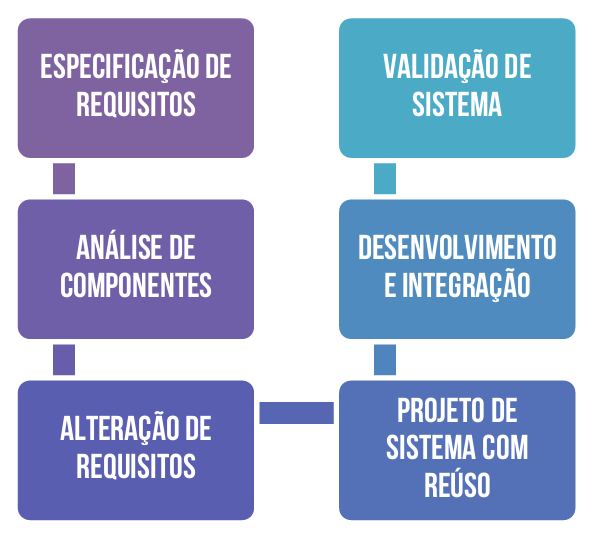

# Capítulo 9 – Modelos Específicos

Nos capítulos anteriores, exploramos os grandes paradigmas que moldam os processos de desenvolvimento de software: os modelos sequenciais, com sua estrutura linear e planejada, e os modelos iterativos, incrementais e evolutivos, que abraçam a mudança, o feedback contínuo e a entrega progressiva. Essas abordagens fornecem _frameworks_ gerais para organizar o ciclo de vida do software. No entanto, a Engenharia de Software, em sua busca contínua por rigor, eficiência e qualidade, também desenvolveu modelos e abordagens mais **específicos**, projetados para lidar com desafios particulares ou para otimizar certos aspectos do desenvolvimento.

Estes modelos específicos não necessariamente substituem os paradigmas gerais, mas muitas vezes os **complementam ou se especializam** neles, oferecendo técnicas e filosofias focadas em resolver problemas pontuais de forma mais eficaz. Neste capítulo, mergulharemos em três dessas abordagens distintas, cada uma respondendo a um desafio fundamental diferente:

1. **Métodos Formais:** Focados em garantir a **máxima confiabilidade e correção** do software através do rigor matemático, essenciais para sistemas onde falhas são inaceitáveis.
2. **Modelo Baseado em Componentes (CBSE):** Centrado no **reuso estratégico** de partes de software pré-existentes para acelerar o desenvolvimento, reduzir custos e aumentar a qualidade.
3. **Modelo Orientado a Aspectos (POA):** Voltado para melhorar a **modularidade** do software ao lidar com "interesses transversais" – funcionalidades sistêmicas que se espalham por múltiplos componentes.

Ao compreendermos essas abordagens específicas, expandimos nosso repertório de ferramentas e estratégias para enfrentar a diversidade de desafios encontrados no desenvolvimento de software moderno.

## Métodos Formais

Os **métodos formais** representam uma abordagem altamente rigorosa e especializada dentro da Engenharia de Software, fundamentada na aplicação direta de **conceitos e notações matemáticas** ao processo de desenvolvimento. Seu objetivo primordial é alcançar um nível superior de **confiabilidade, precisão e correção** nos sistemas de software, especialmente naqueles considerados críticos, onde uma falha pode acarretar consequências catastróficas. Isso é alcançado através da **especificação formal** (descrição matemática dos requisitos e do comportamento esperado), do **desenvolvimento sistemático** a partir dessa especificação e, crucialmente, da **verificação formal** (utilização de provas matemáticas para demonstrar que o sistema implementado satisfaz rigorosamente as propriedades especificadas).

Diferentemente de abordagens mais empíricas, que dependem fortemente de testes para encontrar erros, os métodos formais buscam **prevenir a introdução de erros** desde o início, permitindo **demonstrar matematicamente a corretude** do software em relação aos seus requisitos.

### Essência Matemática

Em sua essência, os métodos formais são técnicas baseadas em **matemática aplicada à engenharia de software**. A proposta central é substituir ou complementar as descrições em linguagem natural (frequentemente ambíguas, incompletas ou inconsistentes) por **modelos matemáticos formais** que representem os requisitos, o comportamento esperado, as restrições e as propriedades do sistema. Esses modelos, por serem baseados em linguagens com semântica precisa e regras lógicas bem definidas, podem ser **analisados, manipulados, refinados e verificados com um rigor impossível** de alcançar com descrições informais.

Em outras palavras, um método formal utiliza ferramentas da lógica matemática (como lógica proposicional, lógica de predicados de primeira ordem, teoria dos conjuntos, álgebra relacional, teoria de autômatos, etc.) para:

- **Especificar formalmente** os requisitos funcionais e não funcionais do sistema, criando uma descrição precisa e não ambígua do que o sistema deve fazer e quais propriedades deve garantir.
- **Verificar formalmente**, por meio de provas matemáticas (sejam elas manuais ou assistidas por computador), se o design do sistema ou sua implementação é consistente com a especificação formal e satisfaz as propriedades desejadas (como segurança, vivacidade, ausência de deadlocks).
- **Auxiliar na implementação correta** através de um processo chamado **refinamento formal**, onde a especificação abstrata é transformada sistematicamente em um design mais concreto e, eventualmente, em código, preservando as propriedades comprovadas em cada passo.
- **Identificar e eliminar** ambiguidades, inconsistências e lacunas (incompletude) nos requisitos muito mais cedo no ciclo de vida, durante a própria fase de especificação.

Autores de referência corroboram essa visão. **Ian Sommerville** afirma que “o ponto de partida dos métodos formais é um modelo formal construído a partir dos requisitos do usuário. A partir desse modelo, é possível provar que o programa é consistente com os requisitos definidos. Isso elimina erros de implementação por falha de interpretação dos requisitos". **Roger Pressman** reforça, dizendo que “os métodos formais fornecem uma base sólida para eliminar ambiguidade, incompletude e inconsistência. Através da matemática, é possível estabelecer a correção do sistema antes mesmo da implementação”.

Entre os principais conceitos associados aos métodos formais, destacam-se:

- **Especificação Formal:** A descrição matemática precisa do comportamento, propriedades e restrições do sistema, utilizando uma linguagem formal (como Z, VDM, B, Alloy, TLA+).
- **Modelagem Formal:** A criação de representações abstratas dos dados, estados e operações do sistema usando estruturas matemáticas.
- **Prova Formal:** A demonstração lógica rigorosa, passo a passo, de que o sistema (ou um modelo dele) satisfaz certas propriedades estabelecidas em sua especificação. Pode envolver técnicas como verificação de modelos (_model checking_) ou prova de teoremas (_theorem proving_).
- **Refinamento Formal:** O processo gradual e comprovadamente correto de transformar uma especificação formal abstrata em uma implementação concreta, mantendo as propriedades essenciais em cada nível de detalhe.

Ferramentas computacionais como Z/Eves, B-Toolkit, VDMTools, Alloy Analyzer, SPIN, Coq, Isabelle/HOL e TLA+ são amplamente utilizadas para apoiar a escrita de especificações, a análise de modelos e a realização de provas formais.

**Exemplo Ilustrativo:**

Consideremos uma regra de saque em um sistema bancário. Em linguagem natural, poderíamos dizer: "O sistema só deve permitir um saque se o saldo da conta for maior ou igual ao valor solicitado. Após um saque bem-sucedido, o saldo deve ser atualizado subtraindo o valor sacado."

Essa descrição parece clara, mas levanta ambiguidades: E se o valor do saque for negativo ou zero? O que acontece se a conta tiver um limite de cheque especial? Uma especificação formal, usando uma notação baseada em pré e pós-condições (como na linguagem Z ou VDM), poderia expressar isso com muito mais precisão:

```
Operação_Saque
Input: conta_id : ID_Conta, valor_saque : Real
Output: mensagem : String
Estado: saldos : ID_Conta -> Real

Pré-condições:
  valor_saque > 0                   // Valor deve ser positivo
  conta_id ∈ dom saldos             // Conta deve existir
  saldos(conta_id) ≥ valor_saque    // Saldo deve ser suficiente

Pós-condições:
  saldos' = saldos ⊕ {conta_id ↦ saldos(conta_id) - valor_saque}  // Saldo é atualizado
  mensagem' = "Saque realizado com sucesso."
```

Nesta especificação:

- `Input` e `Output` definem os parâmetros de entrada e saída.
- `Estado` define as variáveis que a operação pode modificar (o mapa `saldos`).
- `Pré-condições` definem as condições que _devem_ ser verdadeiras _antes_ da operação ser executada. Se não forem, a operação não pode ocorrer ou resultará em erro.
- `Pós-condições` definem o estado do sistema _após_ a execução bem-sucedida da operação. O apóstrofo (`'`) indica o valor da variável após a operação. O símbolo `⊕` indica a atualização do mapa `saldos`.

Este modelo matemático elimina ambiguidades. Ele define explicitamente que o valor deve ser positivo, que a conta deve existir e que o saldo deve ser suficiente. A pós-condição garante a atualização correta do saldo. Com essa especificação, é possível usar ferramentas formais para **verificar matematicamente** se o design proposto ou o código implementado para a função de saque respeita rigorosamente essas regras em todos os cenários possíveis, algo muito difícil de garantir apenas com testes.

### Cenários de Aplicação

Devido ao investimento significativo em tempo, esforço e expertise que exigem, os métodos formais **não são aplicados rotineiramente** na grande maioria dos projetos de software comerciais. Sua aplicação se justifica e se torna **altamente recomendada (e por vezes obrigatória por normas regulatórias)** em domínios onde a **confiabilidade, a segurança e a correção são requisitos absolutos**, e onde as consequências de uma falha de software podem ser catastróficas:

- **Sistemas Críticos de Segurança (_Safety-Critical Systems_):** Onde uma falha pode causar perda de vidas humanas ou danos ambientais graves. Exemplos:
    - Sistemas de controle de voo em aeronaves (aviônicos).
    - Sistemas de controle de trens e metrôs.
    - Software embarcado em equipamentos médicos de suporte à vida (marca-passos, bombas de infusão).
    - Sistemas de controle de reatores nucleares ou processos químicos perigosos.
- **Sistemas Críticos de Missão (_Mission-Critical Systems_):** Onde uma falha pode levar ao fracasso de uma missão importante (embora não necessariamente com risco de vida). Exemplos:
    - Software embarcado em satélites, sondas espaciais ou veículos autônomos.
    - Sistemas militares e de defesa.
- **Sistemas Críticos de Negócio (_Business-Critical Systems_):** Onde uma falha pode causar perdas financeiras massivas, danos à reputação ou violações legais graves. Exemplos:
    - Plataformas de transações financeiras de alta frequência em bolsas de valores.
    - Sistemas centrais de _internet banking_.
    - Protocolos de segurança e criptografia.
    - Núcleos de sistemas operacionais ou hipervisores que precisam garantir isolamento e segurança.

Apesar de sua adoção limitada na indústria de software em geral, principalmente devido ao **custo inicial elevado**, à **necessidade de especialistas** com profundo conhecimento em lógica matemática e linguagens formais, e à **complexidade percebida das ferramentas** e notações, há evidências de que, quando bem aplicados nos contextos corretos, os métodos formais podem, a longo prazo, **reduzir custos totais**. Isso ocorre porque eles **reduzem drasticamente o número de defeitos** introduzidos nas fases iniciais, diminuindo significativamente o esforço (e custo) de depuração, testes e correções em fases posteriores ou após a implantação.

### Etapas de Desenvolvimento

O processo de desenvolvimento de software que utiliza métodos formais geralmente segue um conjunto estruturado de etapas, aplicando o rigor matemático desde a concepção até a verificação final. As cinco etapas principais são:

1. **Especificação Formal:** Traduzir os requisitos do sistema (levantados junto aos stakeholders) de uma linguagem natural para uma linguagem matemática formal. Elimina ambiguidades, inconsistências e incompletudes, criando uma base precisa para o desenvolvimento. Ferramentas de análise formal podem ser usadas nesta etapa para verificar propriedades da especificação em si (como consistência interna).
2. **Refinamento Formal:** Transformar gradualmente a especificação formal abstrata em um modelo de design mais concreto, que se aproxima da implementação. Este processo ocorre em múltiplos passos, onde cada passo introduz mais detalhes (escolha de estruturas de dados, algoritmos) e deve ser **comprovadamente correto**, ou seja, deve-se provar matematicamente que o modelo refinado ainda satisfaz as propriedades do modelo mais abstrato.
3. **Síntese de Código (ou Implementação Verificada):** Gerar o código-fonte a partir do modelo de design refinado. Essa tradução pode ser manual (onde o programador segue rigorosamente a especificação formal) ou, em alguns casos, parcialmente automatizada por ferramentas. O objetivo é garantir que o código implementado corresponda fielmente ao design formalmente verificado.
4. **Prototipação (Opcional, mas Recomendada):** Mesmo com a base formal, a validação com os usuários é importante. A criação de protótipos funcionais baseados na especificação pode ajudar a verificar se o comportamento formalizado realmente corresponde às expectativas dos usuários e a identificar problemas de usabilidade ou requisitos mal interpretados que a matemática sozinha não captura.
5. **Prova Formal (Verificação):** A etapa final (e contínua) onde se utilizam técnicas de prova matemática (verificação de modelos, prova de teoremas) para demonstrar rigorosamente que a implementação (ou o design final) satisfaz a especificação formal original. Verifica-se se todas as pré e pós-condições são respeitadas, se invariantes são mantidos e se propriedades de segurança ou vivacidade são garantidas.

### Vantagens e Desvantagens

A decisão de adotar métodos formais envolve ponderar seus benefícios potenciais contra seus custos e desafios.

**Vantagens:**
- **Precisão e Rigor Incomparáveis:** Eliminação de ambiguidades e inconsistências nas especificações.
- **Detecção Precoce de Erros:** Falhas lógicas e de requisitos podem ser encontradas muito cedo, na fase de especificação, quando a correção é mais barata.
- **Verificabilidade Matemática:** Capacidade de provar a correção do sistema (ou partes dele) em relação à especificação, oferecendo um nível de confiança muito superior aos testes tradicionais.
- **Alta Confiabilidade Resultante:** Sistemas desenvolvidos com métodos formais tendem a ter taxas de defeitos em operação significativamente menores.
- **Documentação Precisa e Inequívoca:** A própria especificação formal serve como uma documentação exata e detalhada do comportamento esperado.
- **Potencial Redução de Custos a Longo Prazo:** Menos erros em produção significam menor custo com manutenção corretiva e menor risco de falhas catastróficas.

**Desvantagens e Limitações:**
- **Alto Custo e Esforço Inicial:** O processo de especificação e verificação formal é geralmente mais demorado e exige um investimento inicial maior do que abordagens tradicionais.
- **Necessidade de Especialistas:** Requer profissionais com forte formação em matemática discreta, lógica formal e nas ferramentas e linguagens específicas, que são escassos no mercado.
- **Curva de Aprendizado Íngreme:** Tanto para os especialistas quanto para o restante da equipe que precisa interagir com os modelos formais.
- **Dificuldade de Comunicação com Stakeholders Não Técnicos:** Especificações matemáticas são difíceis (ou impossíveis) de serem compreendidas e validadas diretamente por clientes ou usuários finais sem conhecimento técnico. (A prototipagem ajuda a mitigar isso).
- **Complexidade das Ferramentas:** Muitas ferramentas de apoio ainda possuem interfaces pouco amigáveis e exigem conhecimento aprofundado para serem utilizadas eficazmente.
- **Escalabilidade Limitada:** Aplicar métodos formais a sistemas _inteiros_ de grande porte pode ser impraticável. A abordagem é mais frequentemente aplicada a componentes _críticos_ dentro de um sistema maior.
- **Resistência Cultural:** A introdução de métodos formais pode enfrentar resistência de equipes acostumadas a processos menos rigorosos.

### Método Cleanroom

Um exemplo notável de metodologia de desenvolvimento que incorpora fortemente princípios dos métodos formais é o **Método Cleanroom**. Inspirado nos processos de fabricação de hardware em "salas limpas" (ambientes controlados para evitar contaminação), o Cleanroom busca **prevenir a introdução de defeitos** no software desde o início, em vez de depender de testes massivos para encontrá-los e corrigi-los posteriormente. Suas características principais incluem:

- **Especificação Formal ou Semi-Formal:** Uso de notações precisas para definir o comportamento esperado.
- **Desenvolvimento Incremental:** Construção do software em incrementos gerenciáveis.
- **Verificação Formal no Desenvolvimento:** O código não é testado pelo desenvolvedor através de execução (testes de unidade tradicionais são proibidos). Em vez disso, o desenvolvedor **prova formalmente (ou através de inspeções rigorosas em equipe)** que o código implementado corresponde à sua especificação antes de integrá-lo.
- **Teste Estatístico da Caixa Preta:** O software integrado é testado pela equipe de teste (independente dos desenvolvedores) usando uma abordagem estatística baseada no perfil de uso esperado, focando em medir a confiabilidade do sistema em operação, e não em encontrar todos os bugs.

Estudos de caso da aplicação do Cleanroom (por exemplo, na IBM) demonstraram **reduções drásticas nas taxas de defeitos** (até 90%) em comparação com processos tradicionais, evidenciando o potencial dos métodos formais para alcançar níveis excepcionais de qualidade.

## Modelo Baseado em Componentes

A disciplina de Engenharia de Software carrega em seu próprio nome a aspiração de aplicar os princípios, métodos e a disciplina das engenharias tradicionais (civil, mecânica, elétrica) ao desenvolvimento de software. Essa aspiração não é meramente nominal; ela nasceu como uma resposta direta à **Crise do Software**, um período crítico na história da computação (iniciado por volta de 1968) onde a crescente complexidade dos sistemas começou a superar a capacidade das práticas de desenvolvimento informais da época. A introdução dos circuitos integrados, que barateou e potencializou o hardware, paradoxalmente agravou a crise no software, pois permitiu a concepção de sistemas cada vez maiores e mais ambiciosos, para os quais as metodologias existentes se mostravam inadequadas, resultando em estouros de prazo e orçamento, baixa qualidade e falhas frequentes.

A Engenharia de Software surgiu, então, propondo uma abordagem mais estruturada, baseada em modelagem, abstração, métricas e, fundamentalmente, no **reuso de soluções comprovadas** – um princípio basilar em outras engenharias. É nesse contexto que se insere o **Modelo Baseado em Componentes**, também conhecido como **Engenharia de Software Baseada em Componentes (CBSE - Component-Based Software Engineering)** ou, em terminologias mais recentes como a de Ian Sommerville, **Modelo de Integração e Configuração**. Este modelo representa uma abordagem estratégica que coloca o **reuso de software** como pilar central do processo de desenvolvimento. A ideia fundamental é que sistemas complexos podem (e devem) ser construídos de forma mais eficiente e confiável através da **integração de componentes de software preexistentes, reutilizáveis e bem definidos**, em vez de reinventar a roda a cada novo projeto.

### Filosofia do Reuso

Antes de detalhar o modelo CBSE, vale reforçar a importância do princípio do reuso. Assim como um engenheiro civil utiliza vigas, tijolos e instalações hidráulicas padronizadas, ou um engenheiro eletrônico monta circuitos a partir de transistores, resistores e microchips pré-fabricados, a Engenharia de Software busca incessantemente formas de construir sistemas a partir de "blocos" de software já existentes. O reuso pode ocorrer em diferentes níveis:

- **Reuso de Código:** Utilização de funções, bibliotecas ou frameworks.
- **Reuso de Design:** Aplicação de padrões de projeto (Design Patterns) ou arquiteturais.
- **Reuso de Componentes:** Integração de unidades de software encapsuladas e independentes.
- **Reuso de Serviços:** Consumo de funcionalidades através de APIs ou web services.

O Modelo Baseado em Componentes foca primariamente nos dois últimos níveis, propondo que os sistemas sejam montados pela **orquestração e integração de componentes e serviços**.

### Definindo o CBSE

O **CBSE** é, portanto, uma abordagem de desenvolvimento que prioriza a construção de sistemas através da **seleção, configuração e composição de componentes de software reutilizáveis**. Esses componentes podem ser desenvolvidos internamente (para reuso futuro), adquiridos de fornecedores terceiros (**COTS - Commercial Off-The-Shelf**) ou obtidos de fontes de código aberto (_open source_).

A eficácia dessa abordagem depende crucialmente de dois fatores:

1. **Disponibilidade de Componentes:** É necessário ter acesso a uma **biblioteca ou mercado robusto de componentes reutilizáveis**, bem documentados e de alta qualidade, que cubram as funcionalidades necessárias.
2. **Framework de Integração:** É preciso ter um **mecanismo ou arquitetura padrão** que permita que esses componentes (potencialmente de origens e tecnologias diferentes) sejam "conectados" e interajam de maneira coesa e confiável.

Uma consequência importante dessa abordagem é a mudança no perfil de custos do projeto: enquanto os custos de **desenvolvimento "do zero" diminuem** significativamente devido ao reuso, os custos relacionados à **busca, avaliação, adaptação, integração e teste** dos componentes tendem a **aumentar**. É preciso garantir que os componentes selecionados realmente atendam aos requisitos (funcionais e não funcionais), sejam compatíveis entre si e não introduzam vulnerabilidades ou problemas de desempenho.

### O que é um Componente de Software?

Para que o CBSE funcione, o conceito de "componente" precisa ser bem definido. Segundo Pressman, um **componente de software** pode ser caracterizado como um **bloco de construção** que possui as seguintes propriedades:

- **Modular:** Encapsula uma funcionalidade ou conjunto de funcionalidades coesas.
- **Executável e Implantável:** Pode ser distribuído e executado (direta ou indiretamente).
- **Independente:** Possui baixo acoplamento com outros componentes, podendo ser desenvolvido, testado e substituído com relativo isolamento.
- **Padronizado:** Adere a um modelo de componente padrão (como JavaBeans, COM, OSGi, ou simplesmente como um microsserviço com uma API REST).
- **Reutilizável:** Projetado para ser usado em diferentes contextos ou sistemas.
- **Composável:** Possui **interfaces bem definidas** que especificam como ele interage com o mundo exterior (outros componentes ou o sistema hospedeiro). Essas interfaces são o "contrato" do componente, ocultando sua implementação interna (encapsulamento).

**Exemplo Prático:** No desenvolvimento de um sistema de vendas online (e-commerce), em vez de construir tudo do zero, a equipe poderia adotar uma abordagem baseada em componentes:

- **Catálogo de Produtos:** Utilizar um componente de gerenciamento de conteúdo (CMS) open source ou um serviço de PIM (Product Information Management).
- **Autenticação de Usuário:** Integrar um serviço de identidade como Auth0, Firebase Authentication ou Keycloak via OAuth/OpenID Connect.
- **Carrinho de Compras:** Desenvolver um microsserviço específico para gerenciar carrinhos, mas que se comunica via API REST.
- **Processamento de Pagamento:** Integrar um componente COTS de um gateway de pagamento (Stripe, PayPal, PagSeguro) através de suas APIs.
- **Cálculo de Frete:** Consumir web services dos Correios ou de transportadoras.
- **Envio de E-mails Transacionais:** Utilizar um serviço de e-mail como SendGrid ou Amazon SES via API.
- **Sistema de Recomendação:** Integrar um serviço de recomendação de terceiros ou um componente de machine learning.

Nesse cenário, o trabalho principal da equipe de desenvolvimento não é escrever cada uma dessas funcionalidades, mas sim **orquestrar a integração** desses diversos componentes, garantindo que eles se comuniquem corretamente, que os dados fluam de forma segura e que a experiência do usuário seja coesa.

### Etapas de Desenvolvimento

O processo de desenvolvimento utilizando o CBSE geralmente segue um conjunto de etapas adaptadas para incorporar a busca e a integração de componentes. A Figura 9 ilustra um fluxo típico.

<div align="center">

</div>

Analisando cada etapa:

1. **Especificação de Requisitos:** Similar a outros modelos, esta etapa inicial foca em levantar, analisar e documentar os requisitos do sistema. A diferença é que a especificação já pode ser feita pensando em funcionalidades que potencialmente podem ser atendidas por componentes existentes. O documento resultante deve distinguir claramente os **Requisitos de Usuário** (visão do negócio) e os **Requisitos de Sistema** (detalhes técnicos).
2. **Análise de Componentes:** Com os requisitos definidos, inicia-se uma fase de **prospecção e avaliação**. A equipe pesquisa em repositórios internos, catálogos de componentes comerciais (COTS) ou comunidades open source por componentes que possam atender às funcionalidades especificadas. É raro encontrar um componente que se encaixe _perfeitamente_. Geralmente, os componentes encontrados atendem apenas parcialmente aos requisitos ou possuem interfaces que não são diretamente compatíveis com a arquitetura desejada. A análise envolve avaliar não apenas a funcionalidade, mas também a qualidade, a documentação, o suporte, o custo (licenciamento) e a compatibilidade do componente.
3. **Modificação de Requisitos (ou Adaptação):** Os requisitos inicialmente definidos são então **confrontados com os componentes encontrados**. Podem ocorrer duas situações:
    - **Modificação dos Requisitos:** Se um componente COTS promissor atende 90% de um requisito, mas de uma forma ligeiramente diferente do especificado, pode ser mais vantajoso **ajustar o requisito** para se adequar ao componente do que desenvolver a funcionalidade do zero. Essa negociação é crucial.
    - **Busca por Alternativas:** Se a incompatibilidade for grande ou o requisito for inegociável, retorna-se à Análise de Componentes para procurar outras opções.
4. **Projeto de Sistema com Reuso:** Nesta etapa, define-se a **arquitetura geral** do sistema, levando em conta os componentes selecionados e como eles serão integrados. Um **framework de integração** pode ser escolhido ou projetado para facilitar a comunicação entre os componentes. Para as funcionalidades onde **nenhum componente adequado foi encontrado**, o software necessário (chamado de "código cola" ou _glue code_, ou mesmo módulos completos) deverá ser **projetado especificamente** para preencher essas lacunas.
5. **Desenvolvimento e Integração:** O "código cola" e os componentes customizados são desenvolvidos. Em seguida, todos os componentes (reutilizados e novos) são **integrados** para formar o sistema. No CBSE, a integração não é uma fase final isolada, mas uma **atividade central e contínua** do desenvolvimento. Podem ser necessárias **adaptações** (criação de _adapters_ ou _wrappers_) para compatibilizar as interfaces dos diferentes componentes.
6. **Validação de Sistema:** O sistema completo, agora integrado, passa por testes rigorosos para verificar se ele atende aos requisitos originais (mesmo após modificações), se os componentes interagem corretamente, e se os requisitos não funcionais (desempenho, segurança, confiabilidade) são satisfeitos. A validação no CBSE é particularmente importante para garantir que a **composição** dos componentes resultou em um sistema coeso e funcional.

### Características, Benefícios e Limitações

O Modelo Baseado em Componentes compartilha muitas características com o Modelo Espiral, sendo frequentemente classificado como **evolucionário** (pois o sistema pode evoluir pela substituição ou adição de componentes) e **iterativo** (o processo de busca, integração e teste pode ocorrer em ciclos).

Os principais **benefícios** derivados da **reusabilidade** central ao CBSE são:

- **Redução de Custos e Tempo de Desenvolvimento:** Evita a necessidade de desenvolver funcionalidades comuns do zero.
- **Aumento da Qualidade e Confiabilidade:** Componentes reutilizados (especialmente COTS ou open source populares) geralmente já passaram por extensos testes e uso em produção, sendo mais maduros e confiáveis.
- **Agilidade e _Time-to-Market_ Acelerado:** A montagem a partir de blocos prontos permite entregar sistemas funcionais mais rapidamente.
- **Melhoria na Manutenibilidade e Flexibilidade:** Sistemas modulares baseados em componentes com interfaces claras são mais fáceis de atualizar, modificar ou estender (ex: trocar um componente de pagamento por outro).
- **Padronização e Interoperabilidade:** O uso de componentes baseados em padrões facilita a integração com outros sistemas.

No entanto, a abordagem CBSE também apresenta **desafios e limitações** importantes:

- **Dificuldade em Encontrar Componentes Adequados:** O "mercado" de componentes pode não oferecer exatamente o que é necessário, exigindo adaptações ou desenvolvimento customizado.
- **Custo de Integração e Teste:** Garantir que componentes de diferentes origens funcionem bem juntos pode ser complexo e exigir um esforço significativo de teste de integração.
- **Restrições de Componentes COTS:** Componentes comerciais "de prateleira" geralmente vêm como "caixas pretas" (sem acesso ao código-fonte), o que **impede modificações ou customizações profundas** para atender a requisitos muito específicos. A equipe fica limitada ao que a interface do componente oferece.
- **Gerenciamento de Dependências e Versões:** Manter o controle das diferentes versões dos componentes utilizados e suas interdependências pode se tornar complexo.
- **Confiança no Fornecedor (para COTS):** A qualidade e a evolução do sistema podem ficar dependentes da continuidade e do suporte oferecido pelo fornecedor do componente.

### Integração e Configuração

Na edição mais recente de sua obra, **Ian Sommerville** renomeia esta abordagem para **Modelo de Integração e Configuração (I&C)**. Essa nova denominação busca enfatizar que o foco principal do trabalho de desenvolvimento neste modelo não é a escrita de código novo, mas sim a **seleção, configuração, adaptação e integração de sistemas e componentes reutilizáveis** (sejam eles COTS, open source ou serviços web) para montar uma nova aplicação. O papel do engenheiro de software se desloca de "construtor" para "integrador" ou "configurador", orquestrando a montagem do sistema a partir de peças pré-existentes.

## Modelo Orientado a Aspectos

Ao longo da história da Engenharia de Software e das linguagens de programação, uma busca constante tem sido por melhores mecanismos de **modularização** – a capacidade de dividir um sistema complexo em unidades menores, coesas, independentes e compreensíveis. Paradigmas como a Programação Estruturada (com funções e procedimentos) e, principalmente, a **Programação Orientada a Objetos (POO)** (com classes e objetos) representaram avanços enormes nessa direção, fornecendo abstrações poderosas para organizar o código em torno de entidades do domínio do problema ou responsabilidades funcionais.

Contudo, mesmo com a sofisticação da POO, certos tipos de funcionalidades ou responsabilidades de software mostraram-se resistentes a uma modularização limpa e eficaz dentro dessas estruturas tradicionais. Existem propriedades e comportamentos que, por sua natureza, **não pertencem a uma única classe ou módulo**, mas sim **atravessam ("cortam") diversas partes do sistema**. Exemplos clássicos incluem:

- **Tratamento de Exceções:** A lógica para capturar e lidar com erros pode precisar estar presente em múltiplos métodos e classes.
- **Registro de Logs (_Logging_) e Auditoria:** A necessidade de registrar eventos importantes (quem fez o quê, quando) permeia diversas funcionalidades do sistema.
- **Autenticação e Autorização (Segurança):** A verificação de permissões de acesso geralmente precisa ser aplicada em muitos pontos de entrada do sistema ou antes da execução de operações sensíveis.
- **Gerenciamento de Transações:** Em sistemas que interagem com bancos de dados, a lógica para iniciar, confirmar (_commit_) ou reverter (_rollback_) transações pode envolver múltiplos objetos de negócio.
- **Controle de Concorrência e Sincronização:** Em sistemas multi-thread, a necessidade de garantir acesso seguro a recursos compartilhados (usando _locks_, semáforos, etc.) pode afetar diversas classes.
- **Monitoramento de Desempenho:** A instrumentação para medir o tempo de execução de métodos pode ser necessária em várias partes críticas do sistema.
- **Caching:** A lógica para armazenar temporariamente resultados computados e invalidar o cache pode ser aplicada a diferentes funções que acessam dados.

Essas funcionalidades são frequentemente chamadas de **interesses transversais (_crosscutting concerns_)**. Elas representam responsabilidades que são ortogonais à decomposição funcional principal do sistema (a lógica de negócio).

### Dispersão e Entrelaçamento de Código

O problema fundamental com os interesses transversais, quando se utilizam apenas os mecanismos da programação estruturada ou orientada a objetos, é que sua implementação tende a levar a dois fenômenos indesejados:

1. **Código Disperso (_Code Scattering_):** A mesma lógica transversal (ex: iniciar uma transação) aparece repetida (ou com pequenas variações) em múltiplos módulos ou classes do sistema.
2. **Código Entrelaçado (_Code Tangling_):** Dentro de um mesmo módulo ou classe, a lógica de negócio principal acaba misturada ("entrelaçada") com o código das diversas responsabilidades transversais (log, segurança, transação, etc.).

Essa dispersão e entrelaçamento **prejudicam seriamente os princípios fundamentais** da boa engenharia de software:

- **Baixa Coesão:** Módulos que misturam lógica de negócio com múltiplos interesses transversais têm baixa coesão (não focam em uma única responsabilidade bem definida).
- **Alto Acoplamento:** A lógica de negócio fica dependente dos detalhes de implementação dos interesses transversais, e vice-versa.
- **Dificuldade de Manutenção:** Uma mudança em uma regra transversal (ex: alterar o formato do log) exige encontrar e modificar todos os pontos onde essa lógica está dispersa, um processo propenso a erros.
- **Redução da Reutilização:** Módulos entrelaçados são mais difíceis de reutilizar em outros contextos, pois carregam consigo dependências de múltiplos interesses.
- **Legibilidade Comprometida:** A mistura de diferentes responsabilidades torna o código mais difícil de ler e entender.

As linguagens tradicionais, por si só, não oferecem mecanismos elegantes e eficazes para separar completamente esses interesses transversais das funcionalidades centrais do sistema.

### Programação Orientada a Aspectos (POA)

A **Programação Orientada a Aspectos (POA)**, também conhecida como **Desenvolvimento Orientado a Aspectos (AOD - Aspect-Oriented Development)** ou simplesmente **AOP (Aspect-Oriented Programming)**, surge como um **paradigma complementar** de desenvolvimento de software, projetado especificamente para resolver o problema dos interesses transversais. A POA propõe uma **separação explícita** entre dois tipos de interesses:

- **Interesses Principais (_Core Concerns_):** A lógica de negócio central do sistema, as funcionalidades que definem o propósito da aplicação. Geralmente, são bem modularizados usando técnicas como a POO.
- **Interesses Transversais (_Crosscutting Concerns_):** As responsabilidades sistêmicas ou de infraestrutura (logging, segurança, transações, etc.) que afetam múltiplos módulos dos interesses principais.

A inovação fundamental da POA é fornecer mecanismos para **encapsular os interesses transversais em unidades modulares separadas, chamadas Aspectos**. Um aspecto representa um módulo que agrupa a lógica de um interesse transversal específico e define **onde e como** essa lógica deve ser aplicada ("tecida" ou _weaved_) ao código dos interesses principais, **sem modificar diretamente** esse código.

É crucial entender que a **POA não substitui a Programação Orientada a Objetos (POO)**; ela a **complementa**. A ideia é utilizar a POO para modularizar os interesses principais (através de classes e objetos) e a POA para modularizar os interesses transversais (através de aspectos). Juntas, elas permitem alcançar um nível de separação de interesses e modularidade que nenhuma delas conseguiria isoladamente.

### Benefícios da Separação de Interesses

A **Separação de Interesses (_Separation of Concerns_ - SoC)** promovida pela POA oferece inúmeras vantagens práticas e conceituais:

- **Melhoria da Modularidade:** Interesses transversais são isolados em seus próprios módulos (aspectos), tornando tanto a lógica de negócio quanto a lógica transversal mais coesas e fáceis de entender.
- **Facilidade de Manutenção e Evolução:** Modificar um comportamento transversal (ex: mudar o sistema de log) exige alterar apenas o aspecto correspondente, sem impactar o código de negócio. Da mesma forma, adicionar um novo interesse transversal (ex: caching) pode ser feito criando um novo aspecto, minimizando o impacto no código existente.
- **Aumento da Reutilização:** Aspectos bem definidos (ex: um aspecto de gerenciamento de transações) podem ser facilmente reutilizados em diferentes partes do mesmo sistema ou até mesmo em projetos distintos.
- **Redução do Acoplamento:** O código dos interesses principais não precisa ter conhecimento explícito (dependências diretas) sobre a implementação dos interesses transversais. A aplicação dos aspectos é gerenciada por um "tecelão" (_weaver_) de aspectos.
- **Código Mais Limpo e Legível:** A lógica de negócio fica livre da "poluição" do código transversal, tornando-a mais focada e fácil de compreender.

### O que São Aspectos e Como Funcionam?

**Aspectos** são, portanto, os módulos que encapsulam os interesses transversais de um sistema. Eles contêm tanto a **lógica** do interesse transversal (o que fazer) quanto as **regras** que definem onde essa lógica deve ser aplicada no código principal.

Para alcançar essa separação e aplicação dinâmica, a POA define alguns conceitos chave:

- **_Join Point_ (Ponto de Junção):** Um ponto bem definido e identificável durante a execução do programa onde o comportamento de um aspecto pode ser inserido. Exemplos comuns de _join points_ incluem: a chamada de um método, a execução do corpo de um método, o acesso a um atributo de um objeto, a instanciação de um objeto ou o tratamento de uma exceção.
- **_Pointcut_ (Ponto de Corte):** Uma **expressão ou predicado** que seleciona um conjunto de _join points_. Funciona como uma "query" ou um filtro que define _onde_ no código o aspecto deve atuar. Por exemplo, um _pointcut_ pode selecionar "todas as chamadas a métodos públicos na classe `ServicoCliente`" ou "a execução de qualquer método anotado com `@Transacional`".
- **_Advice_ (Aconselho ou Comportamento):** O bloco de **código que implementa a lógica** do interesse transversal. O _advice_ é associado a um _pointcut_ e define _o que_ fazer e _quando_ fazer em relação aos _join points_ selecionados. Tipos comuns de _advice_ incluem:
    - `Before`: Executa _antes_ do _join point_. (Ex: verificar permissões antes de executar um método).
    - `After Returning`: Executa _após_ o _join point_ completar com sucesso. (Ex: registrar log após uma operação bem-sucedida).
    - `After Throwing`: Executa _se_ o _join point_ lançar uma exceção. (Ex: registrar detalhes de um erro).
    - `After (Finally)`: Executa _após_ o _join point_ finalizar, independentemente de sucesso ou erro. (Ex: liberar um recurso).
    - `Around`: O mais poderoso. Envolve o _join point_, permitindo executar lógica _antes e depois_, e até mesmo decidir se o _join point_ original deve ou não ser executado. (Ex: implementar caching, gerenciar transações).
- **Aspecto (_Aspect_):** A **classe ou módulo** que encapsula _pointcuts_ e _advices_ relacionados a um interesse transversal específico.
- **_Weaving_ (Tecelagem):** O processo (que pode ocorrer em tempo de compilação, tempo de carregamento da classe ou tempo de execução) pelo qual o código dos _advices_ é efetivamente **combinado** com o código dos interesses principais nos _join points_ definidos pelos _pointcuts_.

**Exemplo Prático: Logging como Aspecto**

Imagine que precisamos registrar no log toda vez que um método de qualquer classe dentro do pacote `com.minhaempresa.servicos` for executado, incluindo o nome do método e os argumentos passados. Sem AOP, teríamos que adicionar manualmente chamadas `logger.info(...)` no início de cada um desses métodos.

Com AOP (usando a sintaxe do AspectJ, uma implementação popular para Java), poderíamos criar um aspecto:

```java
import org.aspectj.lang.annotation.*;
import org.aspectj.lang.JoinPoint;
import org.slf4j.Logger;
import org.slf4j.LoggerFactory;
import java.util.Arrays;

@Aspect // Declara que esta classe é um aspecto
public class LoggingAspect {

    private static final Logger logger = LoggerFactory.getLogger(LoggingAspect.class);

    // Define um Pointcut que seleciona a execução de qualquer método
    // dentro do pacote com.minhaempresa.servicos e seus subpacotes
    @Pointcut("execution(* com.minhaempresa.servicos..*.*(..))")
    public void serviceMethodExecution() {}

    // Define um Advice do tipo Before, associado ao pointcut acima
    @Before("serviceMethodExecution()")
    public void logBeforeMethodExecution(JoinPoint joinPoint) {
        String methodName = joinPoint.getSignature().toShortString(); // Nome do método
        String args = Arrays.toString(joinPoint.getArgs()); // Argumentos
        logger.info("Executando método: {} com argumentos: {}", methodName, args);
    }

    // (Opcional) Poderíamos adicionar um @AfterReturning para logar o retorno, etc.
}
```

Neste exemplo:

- `@Aspect` marca a classe como um aspecto.
- `@Pointcut` define a regra `serviceMethodExecution` para interceptar a `execution` de qualquer método (`*`) em qualquer classe (`*`) dentro do pacote `com.minhaempresa.servicos` e subpacotes (`..`), com quaisquer argumentos (`(..)`).
- `@Before` define um _advice_ que executa _antes_ dos _join points_ selecionados pelo _pointcut_.
- `JoinPoint` é um objeto injetado pelo framework AOP que fornece informações sobre o _join point_ interceptado (como a assinatura do método e seus argumentos).

Com este aspecto definido, a lógica de log será automaticamente "tecida" (aplicada) a todos os métodos de serviço, **sem que precisemos alterar uma única linha do código desses serviços**. Se precisarmos mudar o formato do log no futuro, modificamos apenas o `LoggingAspect`. Isso demonstra o poder da POA para modularizar interesses transversais.

### Perspectivas da Literatura sobre AOP

**Roger Pressman** destaca que, independentemente do processo de software adotado (Cascata, Ágil, etc.), os desenvolvedores inevitavelmente se deparam com requisitos e restrições (como segurança, tratamento de erros, desempenho) que **perpassam toda a arquitetura** do sistema. Ele reconhece que esses elementos não estão bem localizados em um único componente, mas sim **espalhados**, dificultando a modelagem, implementação e manutenção. Pressman posiciona o **Modelo Orientado a Aspectos** como uma abordagem de processo emergente que oferece **suporte explícito para definir, especificar, projetar e construir aspectos**, permitindo lidar com essas preocupações transversais de forma mais limpa e modular.

**Ian Sommerville** aprofunda essa análise ao observar a complexidade inerente aos sistemas de grande porte. Ele aponta que, frequentemente, um **mesmo requisito funcional acaba sendo implementado em diversas partes** (componentes ou classes) do sistema. Inversamente, um **único componente pode conter trechos de código que implementam múltiplos requisitos diferentes** (tanto funcionais quanto não funcionais/transversais).

Essa falta de mapeamento claro entre requisitos e código gera um problema sério de **rastreabilidade e manutenibilidade**. Quando um requisito precisa ser alterado, a equipe enfrenta a tarefa árdua e propensa a erros de **localizar e modificar todos os componentes afetados** por aquela mudança. A POA, segundo Sommerville, busca justamente resolver esse tipo de problema, fornecendo mecanismos de **abstração (os aspectos)** que permitem que **interesses transversais sejam isolados, encapsulados e gerenciados de forma independente** da lógica de negócio principal.

## Considerações Finais

Neste capítulo, exploramos três modelos de processo de software que se destacam por abordarem desafios específicos com estratégias focadas: os **Métodos Formais**, o **Modelo Baseado em Componentes (CBSE)** e o **Modelo Orientado a Aspectos (POA)**. Eles representam um afastamento das abordagens de "tamanho único", reconhecendo que diferentes tipos de problemas e contextos exigem diferentes tipos de soluções e processos.

Os **Métodos Formais** nos mostraram o caminho para alcançar níveis excepcionais de **confiabilidade e correção** através da aplicação rigorosa da matemática. Embora seu custo e complexidade limitem sua aplicação generalizada, eles são indispensáveis em **sistemas críticos**, onde a prova matemática da corretude é mais valiosa do que qualquer quantidade de testes empíricos. Eles nos lembram que a Engenharia de Software também pode ser uma ciência exata quando necessário.

O **Modelo Baseado em Componentes (CBSE)** nos apresentou a filosofia do **reuso estratégico** como motor de produtividade e qualidade. Ao construir sistemas pela integração de blocos de software preexistentes e testados, o CBSE busca acelerar o desenvolvimento, reduzir custos e aproveitar o conhecimento acumulado em componentes maduros. Ele reflete a maturidade da engenharia, onde a montagem a partir de peças padronizadas se torna mais eficiente do que a construção artesanal do zero.

Por fim, o **Modelo Orientado a Aspectos (POA)** nos ofereceu uma solução elegante para um problema persistente na modularização de software: o gerenciamento de **interesses transversais**. Ao complementar a POO com mecanismos para isolar e aplicar funcionalidades sistêmicas (como logging, segurança, transações) de forma não invasiva, a POA permite criar sistemas mais limpos, coesos, com menor acoplamento e, consequentemente, mais fáceis de manter e evoluir.

É importante reforçar que esses modelos específicos **não são mutuamente exclusivos** e frequentemente **complementam**, em vez de substituir, os modelos de processo mais gerais (Sequencial, Iterativo, Incremental, Evolutivo). Uma equipe pode, por exemplo, usar um processo iterativo e incremental como base, aplicar CBSE para acelerar a construção de certas partes do sistema e utilizar Métodos Formais para verificar a correção de um componente crítico específico. A escolha da abordagem (ou combinação de abordagens) mais adequada depende sempre de uma análise cuidadosa do contexto do projeto, dos requisitos de qualidade, dos riscos envolvidos e da expertise da equipe. Dominar esses diferentes modelos enriquece a caixa de ferramentas do engenheiro de software, permitindo-lhe selecionar a estratégia mais eficaz para cada desafio.