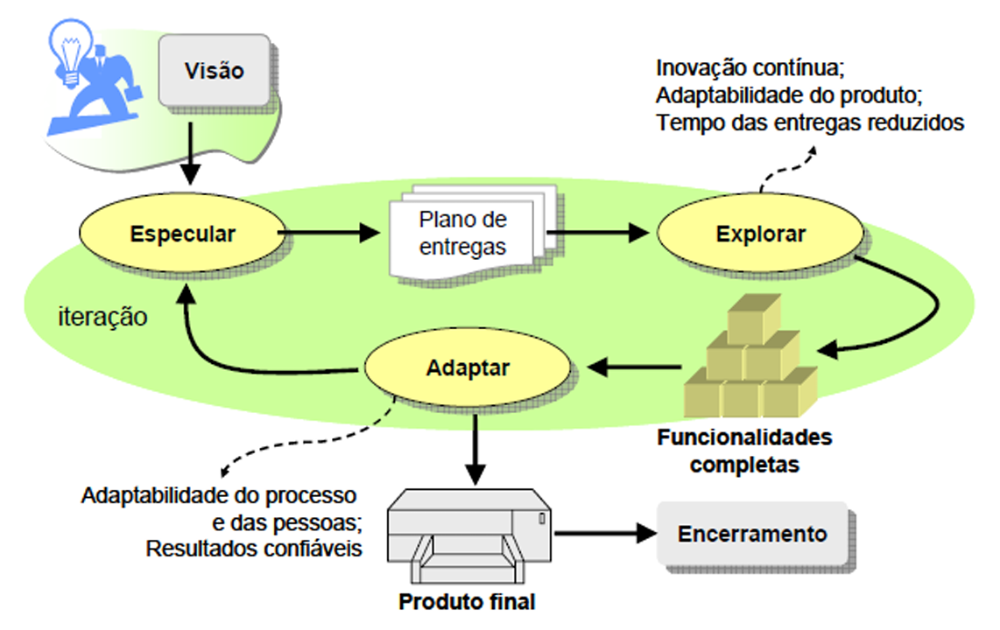

# Capítulo 10 – Metodologias Ágeis

A Engenharia de Software, como disciplina, passou por diversas fases de amadurecimento, buscando incessantemente o equilíbrio entre a previsibilidade dos processos de engenharia e a natureza abstrata e criativa do desenvolvimento de código. Após explorarmos modelos sequenciais, iterativos e específicos nos capítulos anteriores, chegamos a um ponto de inflexão histórica. A virada do milênio trouxe consigo não apenas novas tecnologias, mas uma mudança fundamental na filosofia de gestão de projetos. Diante de mercados cada vez mais voláteis e da necessidade de entregas rápidas, a rigidez dos métodos tradicionais cedeu espaço para abordagens que abraçam a mudança como uma vantagem competitiva. Este capítulo dedica-se a explorar o universo das Metodologias Ágeis, compreendendo suas origens, seus valores fundamentais e como elas redefiniram o paradigma de construção de software moderno.

## Origem do Pensamento Ágil

Para compreender a revolução ágil, é necessário contextualizar o cenário da indústria de tecnologia no final da década de 1990 e início dos anos 2000. Esse período foi marcado por uma tensão crescente. De um lado, a demanda por software explodia com a popularização da internet e o "boom" das empresas pontocom. Do outro, as práticas de desenvolvimento vigentes — fortemente baseadas em modelos preditivos, pesados e burocráticos, como o Modelo em Cascata e variações rígidas do RUP — falhavam sistematicamente em entregar resultados satisfatórios.

O cenário era de **frustração generalizada**. Projetos de software eram sinônimos de atrasos crônicos, orçamentos estourados e, o mais crítico, a entrega de produtos que, após meses ou anos de desenvolvimento, já não atendiam às necessidades dos usuários, pois o mercado havia mudado durante o processo. A tentativa de aplicar a engenharia civil ou mecânica ao software, com planejamentos exaustivos e imutáveis, estava colapsando diante da intangibilidade e volatilidade do software.

Foi em resposta a essa crise de eficiência e qualidade que, em fevereiro de 2001, um evento histórico ocorreu. Dezessete profissionais proeminentes da área de software — entre eles criadores de métodos como Extreme Programming (XP), Scrum, DSDM, Adaptive Software Development, Crystal, Feature-Driven Development e Pragmatic Programming — reuniram-se na estação de esqui de Snowbird, nas montanhas de Utah, Estados Unidos.

O objetivo inicial não era criar uma nova metodologia unificada, mas sim compartilhar experiências e buscar pontos de convergência entre suas abordagens. O clima era informal, mas as discussões tocavam na raiz dos problemas da indústria. Durante o encontro, as histórias se repetiam:

- Relatos de como a rigidez do Modelo em Cascata causava prejuízos financeiros enormes;
- Experiências onde o cumprimento cego de prazos irreais resultava em código de baixa qualidade;
- A constatação de que tentar "congelar" o escopo no início do projeto era uma batalha perdida contra a realidade.

Por outro lado, os participantes compartilharam o que estava funcionando em seus métodos alternativos: o uso de **iterações curtas**, a redução drástica da documentação em favor da comunicação face a face e a adaptação dinâmica do planejamento. Houve um consenso de que a chave para o sucesso não estava em processos mais rigorosos, mas em **abordagens mais leves, iterativas e centradas no fator humano**.

Durante a busca por um nome que sintetizasse essa nova filosofia, o termo "Lightweight" (leve) foi cogitado. No entanto, o grupo percebeu que "leve" poderia ser interpretado pejorativamente como "fraco" ou "sem substância". A escolha recaiu então sobre o termo **"Ágil"**. A palavra capturava perfeitamente a essência do que propunham: a capacidade de se mover rapidamente, mudar de direção com facilidade e responder a novos desafios com destreza e equilíbrio, assim como um atleta.

O resultado desse encontro foi a redação do **Manifesto Ágil para o Desenvolvimento de Software**, um documento conciso, mas profundamente impactante, que cristalizou os valores e princípios dessa nova era. Para perpetuar e disseminar esses ideais, o grupo fundou a **Agile Alliance**, uma organização sem fins lucrativos que até hoje atua como guardiã e promotora da cultura ágil.

O impacto do Manifesto foi sísmico. Ele não apenas validou as práticas emergentes, como Scrum e XP, mas estabeleceu um novo paradigma. A Engenharia de Software deixava de ser vista puramente como uma linha de montagem previsível para ser encarada como um processo empírico, colaborativo e adaptativo.

## Os Quatro Valores do Manifesto Ágil

O coração da filosofia ágil não reside em um conjunto de regras rígidas ou em um algoritmo de gerenciamento, mas sim em um sistema de valores. O Manifesto Ágil estrutura-se sobre quatro pilares fundamentais que orientam a tomada de decisão e a postura das equipes.

A figura abaixo apresenta o texto original traduzido desses valores:

É crucial interpretar corretamente a estrutura desses valores. O texto diz: _"mesmo havendo valor nos itens à direita, valorizamos mais os itens à esquerda"_. Isso significa que a agilidade **não é a negação da engenharia tradicional**. Documentação, processos, ferramentas, contratos e planos ainda são importantes e necessários. O Manifesto apenas estabelece uma nova **hierarquia de prioridades**: quando houver um conflito entre os dois lados, a escolha ágil deve pender para o lado esquerdo (pessoas, software funcionando, colaboração e resposta a mudanças).

A seguir, analisaremos detalhadamente cada um desses quatro valores.

### Indivíduos e Interações mais que Processos e Ferramentas

Este é talvez o valor mais disruptivo em relação à gestão tradicional, que frequentemente tentava tornar o desenvolvimento de software "à prova de pessoas", criando processos tão detalhados que qualquer indivíduo poderia ser substituído como uma peça de engrenagem. O Manifesto Ágil inverte essa lógica, reconhecendo que o desenvolvimento de software é uma atividade intelectual, criativa e social.

No centro do sucesso de um projeto estão as **pessoas** — suas habilidades, sua motivação e, principalmente, a forma como interagem entre si. Processos robustos e ferramentas caras (como softwares complexos de gestão de ciclo de vida, IDEs avançadas ou sistemas de tickets) são úteis, mas são apenas meios para um fim. Eles não conseguem compensar uma equipe desmotivada, sem comunicação ou sem as competências necessárias.

Jim Highsmith, um dos signatários, destaca que a **competência e a colaboração** são os verdadeiros motores do desenvolvimento. Uma equipe de "estrelas" que não se comunica falhará diante de uma equipe mediana que colabora intensamente.

Exemplo Prático:

Imagine uma empresa que implementou um processo rigoroso onde toda comunicação deve ser registrada em uma ferramenta de chamados (JIRA, por exemplo), proibindo interrupções diretas.

- **Abordagem Tradicional (Foco em Processo/Ferramenta):** O desenvolvedor A encontra um erro no código do desenvolvedor B. Ele abre um chamado detalhado. O desenvolvedor B lê o chamado 4 horas depois, não entende, e responde no chamado. A troca de mensagens leva dois dias até a resolução. O processo foi seguido, a ferramenta foi usada, mas a eficiência foi baixa.
- **Abordagem Ágil (Foco em Indivíduos/Interações):** O desenvolvedor A levanta da cadeira (ou chama no chat de vídeo), conversa com B, explica o erro. Eles resolvem juntos em 15 minutos. A interação humana direta superou a burocracia do processo.

Valorizar indivíduos significa criar ambientes onde a comunicação flui sem barreiras, onde há confiança mútua e onde a criatividade é incentivada em detrimento da obediência cega a um fluxograma de processo.

### Software em Funcionamento mais que Documentação Abrangente

Historicamente, muitos projetos seguiam a premissa de que o software só deveria ser codificado após a produção de uma documentação exaustiva (especificações de requisitos de centenas de páginas, diagramas UML completos de todo o sistema, etc.). O problema é que **documentação não é o produto**. O cliente não usa a documentação para resolver seus problemas de negócio; ele usa o software.

Este valor ataca a burocracia excessiva que gera o que chamamos de "ilusão de progresso". Ter 100% dos requisitos documentados não significa que 100% do problema está resolvido, pois nada foi construído ou testado ainda. Além disso, documentos desatualizam-se rapidamente, exigindo esforço constante de manutenção que não agrega valor direto ao usuário.

A analogia do carro é perfeita para ilustrar este ponto: ao comprar um veículo, o manual do proprietário é importante e deve existir. Porém, o que define a compra e a satisfação é a experiência de dirigir, o conforto e a segurança do carro em si. Ninguém compra um carro pelo manual.

**Atenção:** O Manifesto **não diz "sem documentação"**. Ele diz "mais que documentação abrangente". A documentação ágil deve ser:

- **Just-in-time:** Criada quando necessária.
- **Suficiente:** Apenas o necessário para o entendimento e manutenção (o famoso "barely sufficient").
- **Executável (quando possível):** Testes automatizados que servem como documentação viva do sistema.

O foco muda de "produzir papéis sobre o software" para "entregar software que funciona e gera valor", utilizando a documentação como suporte, e não como um fim em si mesma.

### Colaboração com o Cliente mais que Negociação de Contratos

O modelo tradicional de contratação de software muitas vezes assemelha-se à construção civil: o cliente define tudo o que quer em um contrato rígido (escopo fechado), a empresa de software orça e executa. Qualquer mudança solicitada pelo cliente gera uma "Solicitação de Mudança", revisão de custos e, frequentemente, conflitos legais e relacionais. Cria-se uma relação de adversários: "Nós (desenvolvedores) contra Eles (clientes)".

O Manifesto Ágil propõe derrubar esse muro. O cliente não deve aparecer apenas no início (para pedir) e no fim (para homologar). Ele deve ser um **membro ativo e presente durante todo o ciclo de desenvolvimento**. A colaboração contínua permite que o cliente veja o software nascendo e evoluindo, podendo direcionar o produto para o que realmente importa.

Isso exige uma mudança na estrutura contratual e na confiança. Em vez de contratos que tentam prever o futuro e blindar as partes contra mudanças, busca-se modelos flexíveis, como contratos de **escopo variável e tempo fixo**.

**Exemplo Prático:**

- **Modelo Tradicional (Negociação):** O cliente descobre, no meio do projeto, que uma funcionalidade contratada ("Relatório X") não é mais útil, mas precisa de uma nova ("Dashboard Y"). O fornecedor diz: "O Dashboard Y não está no contrato. Teremos que fazer um aditivo, cobrar extra e renegociar o prazo". O cliente fica insatisfeito e preso ao contrato.
- **Modelo Ágil (Colaboração):** Diante da mesma situação, a equipe e o cliente conversam. A equipe diz: "Tudo bem. Como o Dashboard Y tem complexidade similar ao Relatório X, vamos remover o Relatório X do escopo e colocar o Dashboard Y no lugar, mantendo o prazo e o custo". O valor entregue ao negócio é maximizado através da colaboração.

### Responder a Mudanças mais que Seguir um Plano

Talvez a maior certeza no desenvolvimento de software seja a incerteza. Vivemos em um mundo **VUCA** (Volátil, Incerto, Complexo e Ambíguo). A tecnologia avança exponencialmente, concorrentes surgem do nada, leis mudam e a economia flutua. Empresas que se apegaram rigidamente aos seus planos estratégicos de longo prazo sem observar as mudanças do ambiente — como a Kodak, a Blockbuster ou a Nokia — sucumbiram.

No desenvolvimento de software, tentar seguir um plano detalhado feito meses atrás, ignorando que a realidade mudou, é uma receita para o fracasso. É como usar um mapa antigo de uma cidade que passou por reformas viárias: seguir o mapa à risca levará você ao lugar errado ou a um beco sem saída.

O Manifesto Ágil valoriza a **adaptabilidade**. O planejamento no ágil existe, mas é diferente:

- Ele é **contínuo e iterativo** (planejamento em ondas sucessivas).
- Ele aceita que o conhecimento sobre o projeto aumenta com o tempo.
- A mudança não é vista como um erro de planejamento ou um incômodo, mas como uma oportunidade de melhorar o produto e torná-lo mais competitivo.

Em suma, uma equipe ágil tem um plano, mas não tem medo de rasgá-lo e desenhar um novo se o feedback do mercado ou do usuário indicar que a direção original não é mais a melhor. A capacidade de pivotar rapidamente é mais valiosa do que a capacidade de seguir um cronograma obsoleto.

## Agilidade x Velocidade

Ao adentrarmos o estudo das metodologias ágeis, deparamo-nos frequentemente com uma confusão semântica e conceitual que pode comprometer o entendimento da filosofia ágil: a mistura entre os termos **agilidade** e **velocidade**. Embora no senso comum essas palavras sejam usadas quase como sinônimos, na Engenharia de Software — e em diversos outros campos, como a física e o esporte — elas representam capacidades distintas. É fundamental dissociar esses conceitos para compreender que ser ágil não significa, necessariamente, ser o mais rápido em linha reta, mas sim ter a melhor capacidade de resposta.

Para ilustrar essa distinção de forma didática e memorável, recorremos a metáforas fora do universo da computação, começando pelo atletismo de alto nível.

### Metáfora do Atletismo

Usain Bolt é, indiscutivelmente, uma lenda do esporte mundial. O atleta jamaicano consagrou-se como o homem mais rápido do mundo, dominando as provas de 100 e 200 metros rasos por anos. Sua **velocidade** final é fenomenal, permitindo-lhe cruzar a linha de chegada muito à frente de seus competidores. Contudo, uma análise técnica detalhada de suas corridas revela um dado curioso e contra-intuitivo: Bolt raramente era o primeiro a largar ou a liderar os primeiros metros da prova.

Ao observarmos os registros visuais de suas competições, é comum notar que, nos primeiros 10 a 20 metros, Bolt figurava entre os últimos colocados. A razão para isso é física e biomecânica: sendo um atleta excepcionalmente alto e com grande massa muscular, Bolt possuía uma inércia maior. Isso significa que ele demorava mais tempo para vencer o estado de repouso e começar a se mover em comparação a corredores mais baixos e compactos.

Neste contexto, podemos afirmar que, na largada, Bolt era **menos ágil** que seus adversários. A **agilidade** aqui refere-se à capacidade de **reagir instantaneamente a uma mudança de estado** (no caso, o som do tiro de largada) e alterar sua posição corporal. Se as provas olímpicas fossem de apenas 50 metros, é muito provável que a história fosse diferente: Bolt poderia não ter alcançado o sucesso estrondoso que teve, ou talvez nem mesmo conquistasse o tricampeonato olímpico. Seus rivais, mais ágeis na reação e aceleração inicial, poderiam vencê-lo antes que ele tivesse tempo de desenvolver sua velocidade máxima.

O triunfo de Bolt ocorria na segunda metade da prova, onde a necessidade de reagir a mudanças (o tiro de largada) já havia passado, restando apenas a necessidade de manter e incrementar a velocidade de deslocamento.

### Metáfora dos Carros

Expandindo a analogia para o automobilismo, podemos comparar um carro extremamente potente e pesado (como um _muscle car_ ou um caminhão de corrida) com um carro leve e esportivo (como um _kart_ ou um veículo de rali).

Em uma pista de arrancada curta, o carro leve tende a ser mais **ágil**. Ele responde imediatamente ao acelerador, muda de direção com facilidade e sai da imobilidade num piscar de olhos. Ele possui uma excelente capacidade de reação. Já o veículo pesado e potente pode demorar alguns segundos a mais para transferir toda a sua força para o asfalto e ganhar momento.

No entanto, em uma reta longa, a **velocidade** final do carro potente prevalecerá. Ele cobrirá uma distância maior em menos tempo, uma vez que esteja em movimento pleno.

A síntese dessas metáforas é clara:

- **Agilidade** é a competência de responder a **mudanças** e reagir a novos cenários com rapidez e baixo custo de transição.
- **Velocidade** é a competência de executar uma tarefa ou percorrer uma distância em um curto intervalo de tempo, uma vez que a direção já está definida.

### Aplicando ao Desenvolvimento de Software

Trazendo esses conceitos para a Engenharia de Software, a distinção torna-se vital para a escolha do modelo de processo. Um processo pode ser projetado para ser extremamente **rápido**, como é o caso do **RAD (Rapid Application Development)**, estudado anteriormente. O RAD foca em ciclos curtos e entrega veloz, mas sua estrutura, baseada em time-boxing rígido e ferramentas de geração de código, não garante necessariamente que a equipe consiga mudar de direção facilmente no meio do caminho.

A **agilidade no software**, portanto, não se trata apenas de codificar rápido ou entregar na próxima semana. Trata-se da **capacidade de adaptação da equipe e do projeto** diante de instabilidades e imprevistos. Um projeto é considerado ágil quando a equipe consegue lidar com cenários como:

- **Mudança de Arquitetura:** Descobre-se, no meio do projeto, que a arquitetura monolítica escolhida não suportará a carga de usuários, exigindo uma migração para microsserviços. Uma equipe ágil consegue replanejar e executar essa transição sem paralisar o projeto inteiro.
- **Restrições de Recursos:** A empresa sofre um corte de orçamento e a equipe é reduzida pela metade. O processo ágil permite re-priorizar o _backlog_ imediatamente, garantindo que o produto mais importante continue sendo entregue, mesmo com menos braços.
- **Obsolescência Tecnológica:** Uma biblioteca ou framework fundamental para o projeto é descontinuado ou surge uma nova tecnologia que oferece uma vantagem competitiva imensa. A equipe ágil tem a flexibilidade técnica e gerencial para incorporar a nova tecnologia sem derrubar o que já foi construído.
- **Mudança de Negócio:** O concorrente lança uma funcionalidade inovadora. A equipe ágil consegue interromper o desenvolvimento de uma funcionalidade menos crítica para focar na resposta a essa concorrência.

Em suma, uma equipe ágil não foca apenas em correr para a linha de chegada (velocidade), mas em garantir que está correndo na direção certa, mesmo que o destino mude durante a corrida (agilidade). **Ela entrega com flexibilidade.**

### Diretrizes para um Processo de Software Ágil

Para que um processo de software seja considerado ágil, ele não precisa necessariamente seguir um "livro de regras" dogmático, mas deve aderir a certos princípios de adaptabilidade. **Roger Pressman**, uma das maiores autoridades na área, elenca diretrizes fundamentais que permitem a qualquer processo — mesmo aqueles com raízes mais tradicionais — mover-se em direção à agilidade:

1. **Adaptação e Racionalização:** O processo não deve ser uma camisa de força. Ele deve ser projetado de tal forma que a equipe tenha autonomia para adaptar as tarefas e o fluxo de trabalho às necessidades específicas do projeto e do momento. Se uma tarefa não faz sentido no contexto atual, ela deve ser racionalizada ou removida.
2. **Planejamento Fluido:** O planejamento não é um evento único e estático feito no início. Ele deve ser contínuo, levando em conta a fluidez inerente ao desenvolvimento de software. Planos devem ser feitos para serem mudados, não para serem seguidos cegamente.
3. **Essencialismo (Eliminação de Desperdício):** Devem ser eliminados todos os artefatos (documentos, diagramas, relatórios) que não agregam valor direto ao produto final ou à gestão necessária. Se um documento é produzido apenas para cumprir um rito burocrático e ninguém o lê, ele não é ágil. Mantenha apenas o essencial.
4. **Estratégia Incremental:** O processo deve focar na entrega contínua de incrementos de software operacional. O cliente deve ver o software funcionando o mais cedo possível, e não apenas no final do cronograma.

Seguindo essas diretrizes, a agilidade deixa de ser um rótulo de metodologias específicas (como Scrum ou XP) e passa a ser uma característica intrínseca da forma como a engenharia de software é conduzida.

### Agilidade: Adaptabilidade e Colaboração

Em última análise, as metodologias ágeis são filosofias de gestão projetadas para **reagir positivamente às mudanças**. Ao contrário da visão antiga de que a mudança é um "erro de requisitos" ou um "desvio de escopo" que deve ser evitado ou taxado, o ágil abraça a mudança como uma forma de aumentar a competitividade do produto.

Podemos contrastar as características dos dois mundos da seguinte forma:

- **Métodos Tradicionais:**
    - **Preditivos:** Tentam prever o futuro detalhadamente antes de começar.
    - **Formais e Documentais:** Baseiam-se em pesada documentação aprovada (assinada) antes da codificação.
    - **Contratuais:** Focam no cumprimento estrito do que foi contratado inicialmente (escopo, prazo, custo).
    - **Rígidos:** A mudança é vista como um custo alto e indesejável.
- **Métodos Ágeis:**
    - **Adaptativos (Dinâmicos):** Aceitam que o futuro é incerto e aprendem durante o processo.
    - **Iterativos:** Constroem o produto em ciclos, permitindo correções de rota frequentes.
    - **Colaborativos:** Priorizam a interação constante entre desenvolvedores e clientes em vez da negociação de contratos.
    - **Flexíveis:** A mudança é bem-vinda, mesmo em estágios tardios do desenvolvimento, se isso significar maior vantagem competitiva para o cliente.

Portanto, enquanto a **velocidade** pode ser útil para chegar rápido ao mercado, é a **agilidade** que garante a sobrevivência do software em um ambiente onde as regras do jogo mudam todos os dias. No mundo atual, a única certeza é a mudança, e a agilidade é a ferramenta estratégica para navegar nessa incerteza.

## Princípios Ágeis

Para traduzir a filosofia do Manifesto Ágil em práticas tangíveis no dia a dia de um projeto, foram estabelecidos doze princípios fundamentais. Eles funcionam como um farol, guiando as decisões da equipe e moldando a cultura organizacional. Enquanto os quatro valores do Manifesto representam o "espírito" da agilidade, os doze princípios descrevem como esse espírito se manifesta na prática.

A figura abaixo ilustra esses princípios de forma resumida, destacando aspectos como satisfação do consumidor, aceitação de mudanças, entregas frequentes, trabalho em equipe e busca por simplicidade e excelência.

Vamos analisar cada um desses princípios em profundidade, entendendo suas implicações práticas:

1. **Nossa maior prioridade é satisfazer o cliente através da entrega contínua e antecipada de software com valor agregado.**
    A satisfação do cliente não é alcançada apenas no final do projeto, mas continuamente. "Valor agregado" significa entregar funcionalidades que resolvem problemas reais do negócio agora, não daqui a seis meses. A antecipação gera retorno sobre o investimento (ROI) mais cedo.
    
2. **Mudanças nos requisitos são bem-vindas, mesmo em estágios avançados do desenvolvimento. Processos ágeis aproveitam as mudanças para gerar vantagem competitiva ao cliente.**
    Em vez de temer a mudança, a equipe ágil a abraça. Se o mercado muda, o software deve mudar junto. A capacidade de alterar o rumo no final do projeto pode ser a diferença entre entregar um produto obsoleto e um produto líder de mercado.
    
3. **Entregar frequentemente software funcionando, em ciclos que vão de poucas semanas a poucos meses, sempre priorizando ciclos mais curtos.**
    A frequência combate a incerteza. Ciclos curtos (Sprints ou iterações) permitem feedback rápido. Se algo está errado, descobre-se em duas semanas, não em dois anos.
    
4. **Negócios e desenvolvimento trabalham juntos diariamente durante todo o projeto.**
    A barreira entre "quem pede" (negócio) e "quem faz" (TI) deve ser dissolvida. A colaboração diária garante que o software construído esteja sempre alinhado com a estratégia da empresa, evitando o famoso "telefone sem fio".
    
5. **Construa projetos em torno de indivíduos motivados. Ofereça a eles o suporte e o ambiente necessários e confie que realizarão um bom trabalho.**
    Projetos são feitos de pessoas, não de recursos. A motivação é o combustível da produtividade. O papel da gestão muda de "comando e controle" para "serviço e facilitação", removendo obstáculos para que a equipe brilhe.
    
6. **O método mais eficiente e eficaz de comunicar informações é a conversa face a face.**
    Documentos escritos geram ambiguidade e demora na resposta. Uma conversa direta (mesmo que por vídeo) resolve problemas complexos em minutos, com riqueza de comunicação não verbal e feedback instantâneo.
    
7. **Software funcionando é a principal medida de progresso.**
    Relatórios de status, cronogramas coloridos e especificações aprovadas não são progresso real se o código não funciona. A única métrica que realmente importa é o software operacional nas mãos do usuário.
    
8. **Processos ágeis promovem desenvolvimento sustentável. Todos os envolvidos devem conseguir manter um ritmo constante e indefinido.**
    Agilidade não é sinônimo de pressa ou horas extras constantes ("marcha da morte"). É sobre encontrar um ritmo sustentável que a equipe possa manter a longo prazo sem burnout, garantindo qualidade e saúde mental.
    
9. **Atenção contínua à excelência técnica e ao bom design aumenta a agilidade.**
    Código sujo e mal projetado deixa o sistema rígido e difícil de manter. Investir em qualidade técnica (testes, refatoração, padrões de projeto) desde o início torna o software mais flexível para aceitar mudanças futuras.
    
10. **Simplicidade é essencial, ou seja, a arte de maximizar a quantidade de trabalho não realizado.**
    O princípio YAGNI (You Aren't Gonna Need It) impera aqui. Não construa funcionalidades que "talvez" sejam usadas no futuro. Foque no que é necessário agora. Menos código significa menos bugs e menos manutenção.
    
11. **As melhores arquiteturas, requisitos e designs emergem de equipes auto-organizáveis.**
    Quando a equipe tem autonomia para decidir como fazer o trabalho, o comprometimento e a criatividade aumentam. As soluções não são impostas de cima para baixo, mas emergem da inteligência coletiva do time.
    
12. **Em intervalos regulares, a equipe reflete sobre como se tornar mais eficaz e então ajusta seu comportamento de acordo.**
    A melhoria contínua é institucionalizada através de retrospectivas. A equipe para, analisa o que funcionou e o que não funcionou, e define ações para ser melhor na próxima iteração.

### Reflexão Importante: Escalabilidade do Ágil

Diante desses princípios, uma dúvida histórica persiste: **"As metodologias ágeis funcionam para projetos de qualquer tamanho e complexidade?"**

Ian Sommerville, uma das vozes mais tradicionais e respeitadas da literatura de Engenharia de Software, expressou em edições passadas de sua obra uma visão cautelosa:

> “Todos os métodos têm limites, e os métodos ágeis são somente adequados para alguns tipos de desenvolvimento de sistema. Na minha opinião, eles são mais adequados para o desenvolvimento de sistemas de pequenas e médias empresas e produtos para computadores pessoais.”

Essa perspectiva baseava-se na dificuldade inicial de coordenar múltiplas equipes ágeis e manter a coerência arquitetural em sistemas gigantescos sem um planejamento centralizado pesado. No entanto, o cenário evoluiu drasticamente.

Hoje, essa visão é amplamente considerada **ultrapassada** pela prática de mercado. Frameworks de escala como SAFe (Scaled Agile Framework), LeSS (Large-Scale Scrum) e o Modelo Spotify provaram que é possível aplicar agilidade em organizações globais com milhares de desenvolvedores e sistemas de altíssima complexidade (bancários, telecomunicações, aeroespaciais). A agilidade deixou de ser exclusividade de startups e times pequenos para se tornar o padrão de operação de grandes corporações, demonstrando sua maturidade e adaptabilidade.

## Principais Metodologias Ágeis

O termo "Metodologias Ágeis" é um guarda-chuva que abriga diversas abordagens, frameworks e práticas. Cada uma nasceu em um contexto diferente para resolver problemas específicos, mas todas compartilham os valores e princípios do Manifesto. Abaixo, listamos as mais proeminentes no mercado:

- **SCRUM:** O framework ágil mais popular do mundo, focado na gestão de projetos complexos através de iterações (Sprints) e papéis bem definidos.
- **XP (Extreme Programming):** Uma metodologia focada radicalmente nas boas práticas de engenharia de software (código), como programação em par e testes contínuos.
- **KANBAN:** Originário do sistema Toyota de produção, foca na visualização do fluxo de trabalho, limitação do trabalho em progresso (WIP) e melhoria contínua do fluxo.
- **TDD (Test-Driven Development):** Prática de desenvolvimento onde os testes são escritos antes do código funcional.
- **BDD (Behavior-Driven Development):** Evolução do TDD, foca na especificação do comportamento do sistema em linguagem natural, facilitando a comunicação entre técnicos e não técnicos.
- **ATDD (Acceptance Test-Driven Development):** Similar ao TDD, mas focado nos testes de aceitação do usuário.
- **FDD (Feature-Driven Development):** Metodologia focada no desenvolvimento guiado por funcionalidades de negócio.
- **DDD (Domain-Driven Design):** Abordagem de design de software que foca na modelagem do domínio do problema complexo.
- **CRYSTAL:** Uma família de metodologias (Crystal Clear, Yellow, Orange, etc.) que se adaptam à criticidade e ao tamanho do projeto.
- **DSDM (Dynamic Systems Development Method):** Um framework ágil robusto com foco em governança e ciclo de vida completo do projeto.
- **ASD (Adaptive Software Development):** Foca na adaptação contínua a ambientes complexos.
- **MDD (Model-Driven Development):** Desenvolvimento guiado por modelos.
- **BADM (Beyond Agile Development Method)**
- **AUP (Agile Unified Process):** Uma versão simplificada e ágil do RUP (Rational Unified Process).
- **Agile Modeling:** Práticas para modelagem e documentação de forma ágil e eficaz.
- **OSSD (Open Source Software Development):** Modelo colaborativo descentralizado típico de projetos de código aberto.
- **SCRUMBAN:** Um híbrido que combina a estrutura do Scrum com a fluidez e visualização do Kanban.

### Comparação Entre Modelos Tradicionais e Ágeis

Para cristalizar o entendimento sobre a mudança de paradigma que a agilidade representa, é útil comparar diretamente suas características com os modelos tradicionais (como o Cascata). A tabela a seguir detalha essas diferenças cruciais em diversos aspectos do gerenciamento e desenvolvimento:

|**Critério**|**Modelos Tradicionais**|**Modelos Ágeis**|
|---|---|---|
|**Planejamento**|Preditivo e detalhado. Tenta antecipar tudo no início (fase de planejamento pesado).|Adaptativo e contínuo. Planejamento de alto nível inicial, detalhado apenas para a próxima iteração.|
|**Riscos**|Tratados extensivamente no início (análise de riscos pesada), mas muitas vezes só mitigados no final.|Mitigados continuamente a cada iteração. O feedback frequente reduz o risco de construir a coisa errada.|
|**Equipe**|Comando e controle. Papéis rígidos, hierarquia clara, tarefas atribuídas pelo gerente.|Auto-organizável e multidisciplinar. A equipe decide "como" fazer o trabalho. Liderança servidora.|
|**Tempo de Entrega**|Longo. O software funcional só aparece no final do cronograma (meses ou anos).|Curto e fixo (Time-box). Entregas de software funcional a cada 2 a 4 semanas.|
|**Aceitação de Mudanças**|Resistência. Mudanças são vistas como falha no planejamento, exigem burocracia (CRs) e renegociação.|Bem-vindas. Mudanças são esperadas e vistas como vantagem competitiva. Processo flexível.|
|**Previsibilidade**|Baixa. Baseada na ilusão de um plano perfeito que raramente se cumpre.|Alta (a curto prazo). Baseada na velocidade real da equipe e na transparência do progresso diário.|
|**Resultados**|Valor entregue apenas no final do projeto (Big Bang).|Valor entregue de forma incremental e contínua desde as primeiras semanas.|
|**Visibilidade**|Relatórios de status formais, gráficos de Gantt complexos, reuniões de status esporádicas.|Radiadores de informação (quadros físicos ou digitais), Daily Scrum. Status real visível a qualquer momento.|
|**Prazo**|Fixo no contrato, mas frequentemente estourado devido a atrasos nas fases anteriores.|Fixo por iteração (Sprint). O escopo varia para caber no prazo, garantindo entregas pontuais.|
|**Documentação**|Exaustiva e pesada. Frequentemente desatualizada e pouco lida. Fim em si mesma.|Enxuta e Just-in-Time. Apenas o necessário para o entendimento e suporte. Valor no software.|
|**Cliente**|Distante. Participa no início (requisitos) e no fim (homologação). Relação contratual.|Parceiro. Participa diariamente ou frequentemente. Define prioridades e valida entregas.|
|**Melhoria**|Lições aprendidas apenas no final do projeto (post-mortem), quando é tarde para agir.|Retrospectivas ao final de cada iteração. Melhoria contínua do processo durante o projeto.|
|**Comando**|Centralizado no Gerente de Projetos.|Distribuído. A equipe tem autonomia técnica e de processo.|
|**Papéis**|Especialistas isolados (Analista, Arquiteto, Testador) com handoffs entre eles.|Generalistas-especialistas ("T-shaped"). Colaboração intensa, foco no objetivo do time.|
|**Processo**|Rígido. Seguir o plano é mais importante que o resultado.|Empírico. Inspeção e adaptação constantes para maximizar o valor.|
|**Contexto Ideal**|Projetos com escopo estável, requisitos claros e fixos, baixa incerteza tecnológica.|Projetos com escopo dinâmico, requisitos voláteis, alta incerteza e necessidade de inovação.|

Essa comparação evidencia que a escolha entre Ágil e Tradicional não é uma questão de "certo ou errado", mas de adequação ao contexto. No entanto, no cenário atual de negócios, onde a velocidade de mudança é vertiginosa, as características ágeis (adaptabilidade, entrega de valor, colaboração) tornaram-se essenciais para a maioria das iniciativas de software.

## Profissional Ágil

A transição de modelos tradicionais para a agilidade exige muito mais do que a simples adoção de novos processos ou ferramentas. Ela requer uma mudança fundamental na mentalidade (**mindset**) dos indivíduos envolvidos. No contexto das metodologias ágeis e sob a luz dos valores do **Manifesto Ágil**, o perfil do profissional sofre uma transformação significativa: as competências técnicas (_hard skills_) continuam essenciais, mas as competências comportamentais (_soft skills_) ganham um peso determinante para o sucesso do projeto.

Trabalhar com frameworks como **Scrum, Kanban, XP (Extreme Programming), DSDM ou FDD** implica operar em ambientes de alta incerteza e mudança constante. Nesse cenário, o profissional que se apega rigidamente a planos ou que prefere trabalhar isoladamente tende a encontrar dificuldades. O "Profissional Ágil" é aquele que compreende que o desenvolvimento de software é uma atividade social e colaborativa, onde a adaptação supera o planejamento estático.

Abaixo, detalhamos as características essenciais que compõem este perfil, contrastando com a postura de profissionais em ambientes rígidos de comando e controle:

| **CARACTERÍSTICA**                 | **DESCRIÇÃO**                                                                                                                                                                                                                                                                     |
| ---------------------------------- | --------------------------------------------------------------------------------------------------------------------------------------------------------------------------------------------------------------------------------------------------------------------------------- |
| **Flexibilidade e adaptabilidade** | Capacidade de se adaptar rapidamente às mudanças no escopo, nos requisitos ou nas prioridades do projeto. Profissionais ágeis encaram as mudanças como algo natural e necessário para gerar valor, e não como um sinal de fracasso no planejamento.                               |
| **Colaboração e comunicação**      | Valorizam o trabalho colaborativo (como _Pair Programming_ ou _Mob Programming_), tanto entre os membros da equipe quanto com clientes e stakeholders. A comunicação é constante, clara e objetiva, promovendo transparência e alinhamento, preferencialmente face a face.        |
| **Foco no cliente**                | A busca pela satisfação do cliente é uma prioridade absoluta. O profissional ágil trabalha de forma iterativa, buscando sempre feedbacks curtos para garantir que o produto atenda (ou supere) as expectativas do cliente, evitando o desenvolvimento de funcionalidades inúteis. |
| **Aprendizado contínuo**           | Diante de um cenário tecnológico dinâmico, estão em constante desenvolvimento pessoal e profissional. O conceito de _Lifelong Learning_ é aplicado na prática: aprender, desaprender conceitos obsoletos e reaprender novas abordagens faz parte do cotidiano.                    |
| **Proatividade e autonomia**       | Profissionais ágeis não esperam ordens para agir; eles são donos (_ownership_) do seu trabalho. Assumem responsabilidades, tomam iniciativas para resolver impedimentos e buscam soluções, atuando de maneira independente e colaborativa.                                        |
| **Resiliência e persistência**     | Diante de desafios e adversidades, mantêm-se firmes. Encaram erros e falhas não como motivos para punição, mas como oportunidades de aprendizado e melhoria do processo (cultura _blameless_).                                                                                    |
| **Habilidade de priorização**      | Sabem diferenciar o que é essencial do que é secundário. Compreendem o Princípio de Pareto (80/20) e priorizam tarefas que geram mais valor para o cliente e para o projeto, baseando-se em dados e feedbacks, e não em "achismos".                                               |
| **Empatia e suporte aos outros**   | Praticam a empatia, entendendo as necessidades e dificuldades dos colegas e dos clientes. Contribuem para um ambiente psicologicamente seguro, saudável e produtivo, onde todos se sentem à vontade para expor ideias.                                                            |

Portanto, ser um **profissional ágil** não significa apenas ter certificações em Scrum ou saber operar um quadro Kanban. Significa adotar uma postura onde a colaboração substitui a hierarquia rígida, a adaptação substitui a burocracia e a entrega de valor constante é o objetivo final.

### Entregando Valor para Clientes no Contexto Digital

Um dos termos mais repetidos no universo ágil é "valor". Mas o que isso realmente significa? O conceito de **valor** é subjetivo e está diretamente ligado à percepção do cliente sobre o quanto uma solução resolve seus problemas, alivia suas dores ou gera benefícios tangíveis (como lucro ou economia de tempo). Em ambientes ágeis, a entrega de valor não é um evento único no final do projeto, mas um processo **contínuo, iterativo e incremental**.

No contexto digital atual, a definição de valor é volátil. O que é valioso para um cliente hoje pode não ser amanhã, devido ao surgimento de novas tecnologias ou mudanças no comportamento do consumidor. Diferente da engenharia tradicional, onde o valor de uma ponte é fixo (atravessar um rio), no software digital, o valor é móvel. Isso exige que as equipes desenvolvam uma sensibilidade apurada para entender as **necessidades, desejos e comportamentos** do seu público-alvo.

Para navegar nessa complexidade, o profissional ágil deve adotar uma mentalidade centrada no cliente (_Customer Centricity_). Isso envolve ir além do código e entender o negócio. A seguir, apresentamos as principais estratégias utilizadas por equipes ágeis para garantir que o software desenvolvido seja, de fato, valioso:

| **ESTRATÉGIA**                             | **DESCRIÇÃO**                                                                                                                                                                                                                       |
| ------------------------------------------ | ----------------------------------------------------------------------------------------------------------------------------------------------------------------------------------------------------------------------------------- |
| **Pesquisa e feedback**                    | Não assumir premissas; validar hipóteses. Realizar pesquisas, entrevistas com usuários reais, análises de comportamento (analytics) e obter feedbacks constantes para entender as dores e necessidades reais, evitando o "achismo". |
| **Persona e jornadas do cliente**          | Criar perfis fictícios baseados em dados reais (personas) que representem os diferentes tipos de clientes e mapear suas jornadas de uso, identificando gargalos, pontos de dor e oportunidades de encantamento.                     |
| **MVP (Minimum Viable Product)**           | Desenvolver a versão mais simples possível do produto que ainda entregue valor. O objetivo não é lançar algo "malfeito", mas sim validar o aprendizado com o menor esforço possível antes de grandes investimentos.                 |
| **Entrega contínua**                       | Adotar práticas de DevOps como integração e entrega contínua (CI/CD), garantindo que melhorias e novas funcionalidades cheguem às mãos do cliente em horas ou dias, não meses.                                                      |
| **Análise de dados e métricas de sucesso** | Monitorar métricas de negócio (KPIs) como engajamento, conversão, retenção, _churn_ (taxa de cancelamento) e NPS (satisfação), para guiar as decisões de desenvolvimento baseadas em fatos.                                         |
| **Testes A/B e experimentação**            | Conduzir experimentos controlados (ex: mostrar duas versões de uma tela para grupos diferentes) para validar qual abordagem gera melhor resultado antes de implementá-la para toda a base.                                          |
| **Design centrado no usuário**             | Priorizar a Experiência do Usuário (UX) e a Interface do Usuário (UI), criando sistemas intuitivos. Um software poderoso, mas difícil de usar, tem baixo valor percebido.                                                           |
| **Usabilidade e acessibilidade**           | Garantir que o produto seja inclusivo e acessível a pessoas com deficiências, além de ser utilizável em diferentes dispositivos (mobile, desktop), ampliando o alcance do valor entregue.                                           |
| **Comunicação personalizada**              | Utilizar os dados para se comunicar de forma contextualizada. Notificações e e-mails úteis e oportunos aumentam a percepção de valor do serviço.                                                                                    |
| **Construção de comunidade**               | Promover espaços onde clientes possam interagir e se ajudar (fóruns, grupos). O valor do produto aumenta quando há um ecossistema de usuários engajados ao redor dele.                                                              |
| **Novas tendências e tecnologias**         | Manter-se atento às inovações (IA, Blockchain, IoT) não por modismo, mas para identificar como elas podem resolver problemas antigos de formas mais eficientes, criando diferenciais competitivos.                                  |
| **Cultura de inovação**                    | Estimular a segurança psicológica para que a equipe proponha ideias ousadas. A inovação incremental ou disruptiva só ocorre em ambientes onde o erro no processo de descoberta é tolerado.                                          |

Em suma, o **profissional ágil** atua como um facilitador da entrega de valor. Seu papel transcende a execução técnica de tarefas; ele atua como um agente de transformação, garantindo que cada linha de código escrita tenha um propósito claro: melhorar a vida do usuário ou resolver um problema de negócio.

## Gestão Ágil de Projetos

A transição para o universo ágil não se resume apenas à adoção de práticas de desenvolvimento de software, como a codificação ou testes; ela exige uma reestruturação profunda na camada de gerenciamento. A **Gestão Ágil de Projetos** não deve ser compreendida como uma metodologia única e rígida, mas sim como um amplo "guarda-chuva" conceitual que abriga diversas abordagens, frameworks e práticas (como Scrum, Kanban, Lean), todas unificadas por uma filosofia comum e um conjunto compartilhado de valores.

Historicamente, a gestão de projetos tradicional (frequentemente associada ao PMBOK ou ao modelo em cascata) focava no determinismo: a crença de que, com planejamento suficiente, o futuro poderia ser previsto e controlado. A Gestão Ágil representa uma ruptura com esse paradigma, movendo o foco do **controle rígido e preditivo** para a **facilitação, adaptação e empirismo**.

Diversos autores e pensadores fundamentais contribuíram para solidificar o que entendemos hoje por gestão ágil, cada um trazendo uma nuance importante para a definição:

- **Jim Highsmith**, um dos signatários originais do Manifesto Ágil, define a gestão ágil como um conjunto de princípios, valores e práticas que equipam a equipe para entregar produtos ou serviços de valor, especificamente em **ambientes de projetos desafiadores**. "Desafiador", neste contexto, refere-se a ambientes voláteis, onde a tecnologia ou os requisitos de negócio mudam rapidamente.
- **G. Chin** observa a gestão ágil sob a ótica da eficiência organizacional, vendo-a como um elemento evolutivo que complementa e expande a teoria tradicional de gestão de projetos. Para ele, a agilidade é a chave para que empresas operem de forma eficiente em **cenários de incerteza**, onde os modelos tradicionais falhariam por rigidez excessiva.
- **D. DeCarlo** oferece uma visão mais psicológica e humana, descrevendo a gestão ágil como "a arte e ciência de facilitar e gerenciar o fluxo de pensamentos, emoções e interações". O objetivo final permanece sendo a produção de valor, mas DeCarlo reconhece que isso ocorre em condições frequentemente adversas, complexas e sujeitas a mudanças constantes. Ele destaca que gerenciar o "fluxo" e as pessoas é tão crítico quanto gerenciar o cronograma.

A própria etimologia e uso da palavra **"agilidade"** no contexto de projetos não se refere apenas à velocidade, mas à **manobrabilidade**. Significa que a equipe de projeto desenvolve a competência necessária para **criar mudanças** (inovação) e **responder a mudanças** (adaptação) que ocorrem inevitavelmente.

Portanto, a abordagem do gerenciamento ágil é uma busca constante pelo equilíbrio dinâmico entre **flexibilidade e estabilidade**. Como postula **Doug Augustine**, o gestor ágil deve saber balancear o caos (necessário para a criatividade) com a ordem (necessária para a entrega), a execução (fazer acontecer) com o planejamento (olhar para frente) e a exploração (descobrir o novo) com a otimização (melhorar o existente).

Sintetizando as visões desses autores, identificamos três pontos de convergência que formam a base teórica da gestão ágil:

1. **Flexibilidade e Adaptação:** A capacidade de absorver mudanças durante todo o ciclo de vida do projeto não é vista como uma falha de planejamento, mas como uma característica essencial do processo.
2. **Enfoque Humanista:** Há um deslocamento da valorização excessiva de processos, ferramentas e documentação para a valorização do **aprendizado contínuo** e da capacidade intelectual dos indivíduos. As pessoas são vistas como participantes ativos e criativos, não como recursos intercambiáveis.
3. **Entrega de Valor:** O sucesso do projeto não é medido pelo cumprimento estrito de um plano original (que pode estar obsoleto), mas pela entrega contínua de valor real para o cliente, mesmo diante da imprevisibilidade do mercado.

### Pilares da Mentalidade Ágil na Gestão

Para que a gestão ágil saia da teoria e se torne prática, ela deve ser sustentada por pilares operacionais que orientam o comportamento diário das equipes e dos líderes. Esses pilares garantem que a prioridade seja a entrega rápida e contínua, a adaptação dinâmica e a colaboração irrestrita.

#### Cooperação

A cooperação na gestão ágil transcende a simples "comunicação". Ela representa a espinha dorsal do processo, exigindo uma colaboração contínua e intensa não apenas entre os desenvolvedores, mas entre todas as partes interessadas. O modelo de "silos", onde analistas escrevem documentos para passar a desenvolvedores, que passam a testadores, é substituído por um trabalho conjunto.

Na prática, isso se manifesta através de:

- **Ciclos Curtos (Sprints):** Onde o feedback é gerado e compartilhado constantemente, evitando que a equipe trabalhe isolada por longos períodos na direção errada.
- **Rituais de Sincronização:** Como as reuniões diárias (_daily stand-ups_), que servem como um pulso rápido para alinhar o progresso e remover impedimentos imediatos, garantindo que a cooperação seja diária e não apenas em marcos mensais.
- **Integração do Cliente:** A cooperação se estende para fora da equipe técnica. Clientes e stakeholders deixam de ser apenas "contratantes" para se tornarem parceiros ativos, participando de revisões de sprint e validações, co-criando o produto.

#### Flexibilidade de Escopo

Este é um dos pontos de maior divergência em relação à gestão tradicional. No modelo clássico (Triângulo de Ferro tradicional), tenta-se fixar o escopo, o prazo e o custo. Na gestão ágil, inverte-se essa lógica: fixa-se o prazo (time-box) e os recursos (equipe), permitindo que o **escopo seja flexível**.

A gestão ágil assume que é impossível saber tudo no início do projeto. Portanto, o escopo deve ser ajustado continuamente com base no aprendizado empírico.

- **Backlog Priorizado:** A principal ferramenta para gerenciar essa flexibilidade é o Backlog do Produto — uma lista viva de desejos e requisitos.
- **Revisão Constante:** O _Product Owner_ (Dono do Produto) trabalha em colaboração com a equipe para reordenar itens constantemente. Se uma nova oportunidade de mercado surge, ela pode ser priorizada para o topo do backlog, empurrando itens menos valiosos para baixo. Isso garante que a equipe esteja sempre trabalhando nas funcionalidades de maior valor de negócio atual, maximizando o ROI (Retorno sobre Investimento).

#### Interatividade

A gestão ágil rejeita a abordagem "Big Bang", onde todo o software é entregue de uma só vez no final. Em vez disso, ela enfatiza a **interatividade** e a entrega incremental. O trabalho é fatiado em pequenos incrementos funcionais verticais (que atravessam todas as camadas da arquitetura, do banco de dados à interface).

- **Iterações Curtas:** Sprints ou ciclos de 1 a 4 semanas são utilizados para transformar requisitos em funcionalidades potencialmente utilizáveis.
- **Ciclo Construir-Medir-Aprender:** Ao final de cada iteração, realiza-se uma **Revisão** (_Review_) onde o software funcionando é demonstrado. Isso permite medir a reação do usuário e aprender com ela.
- **Correção de Curso:** Se o feedback indicar que o produto não está resolvendo o problema do usuário, a interatividade permite ajustar o curso do projeto imediatamente, economizando meses de desenvolvimento que seriam desperdiçados em uma direção errada.

#### Autonomia e Empoderamento de Equipes

A gestão ágil altera fundamentalmente a estrutura de poder dentro do projeto. O modelo de "Comando e Controle", onde um gerente distribui tarefas e cobra prazos, dá lugar a equipes **autônomas e auto-organizadas**.

- **Auto-organização:** A equipe tem a liberdade e a responsabilidade de decidir _como_ realizar o trabalho técnico. A gerência define _o que_ precisa ser feito (os objetivos de negócio), mas a equipe decide a melhor arquitetura, a divisão de tarefas internas e as estimativas de esforço.
- **Empoderamento:** Para que a autonomia funcione, a equipe precisa ser empoderada. Isso significa fornecer os recursos, o ambiente e a autoridade necessários.
- **Liderança Servidora:** O papel do gestor evolui para o de um "Líder Servidor" ou facilitador (como o Scrum Master). Sua função principal não é microgerenciar, mas sim remover obstáculos, proteger a equipe de interrupções externas e garantir que eles tenham tudo o que precisam para performar. Esse ambiente de confiança aumenta drasticamente a motivação intrínseca e o senso de propriedade (_ownership_) sobre o produto.

#### Programação em Pares

Embora seja uma prática técnica originária do XP (_Extreme Programming_), a **Programação em Pares (Pair Programming)** é um reflexo direto dos valores de gestão ágil aplicados ao código. Nela, dois desenvolvedores compartilham uma única estação de trabalho.

- **Piloto e Navegador:** O "piloto" controla o teclado e foca na tática (escrever a linha de código atual), enquanto o "navegador" foca na estratégia (revisar o código em tempo real, pensar na arquitetura, prever casos de erro e integração).
- **Qualidade e Disseminação de Conhecimento:** Do ponto de vista de gestão, a programação em pares pode parecer, à primeira vista, um uso ineficiente de recursos (duas pessoas para fazer o trabalho de uma). No entanto, estudos e a prática mostram que ela reduz drasticamente a taxa de bugs, melhora o design do sistema e elimina "ilhas de conhecimento" (onde apenas uma pessoa sabe como mexer em determinada parte do sistema). Isso cria um desenvolvimento mais sustentável, resiliente e com menor custo de manutenção a longo prazo.

### Princípios Fundamentais da Gestão Ágil

Ao migrarmos para um modelo ágil de gerenciamento, abandonamos a premissa de que podemos controlar o futuro através de planos perfeitos. Em vez disso, adotamos um novo conjunto de princípios que valorizam a capacidade de navegar na incerteza e entregar valor de forma contínua. Esses princípios representam uma mudança filosófica profunda sobre onde o foco gerencial deve estar: menos em documentos e processos burocráticos, e mais em pessoas, colaboração e resultados tangíveis.

A gestão ágil é guiada por seis princípios interconectados, como ilustrado na figura a seguir, que se dividem entre o foco na entrega do produto e na liderança da equipe.

Estes princípios, detalhados abaixo, formam a bússola que orienta a tomada de decisão ágil:

- **Foco no Cliente e na Entrega de Valor:** O sucesso de um projeto ágil não é medido por quão bem seguimos o plano original, mas sim pela satisfação do cliente e pelo valor de negócio real entregue. O objetivo é resolver o problema do cliente, não apenas entregar o que foi especificado no contrato inicial.
- **Colaboração e Liderança da Equipe:** A gestão ágil inverte a pirâmide organizacional. A equipe é empoderada para se auto-organizar e tomar decisões técnicas. O gerente deixa de ser um "chefe" que distribui tarefas para se tornar um "líder servidor", focado em remover impedimentos e facilitar o trabalho dos especialistas.
- **Adaptação Contínua ao Contexto:** O plano não é uma escritura em pedra. Processos, planos e prioridades são continuamente inspecionados e adaptados com base no feedback real do produto e nas mudanças do mercado. A rigidez dá lugar à responsividade.
- **Simplicidade e Foco no Essencial:** A gestão ágil busca incessantemente eliminar o desperdício (princípio do Lean). Isso significa remover documentação desnecessária, reuniões improdutivas e funcionalidades que não agregam valor, focando apenas no caminho mais simples para atingir os objetivos.
- **Qualidade e Excelência Técnica:** A agilidade não é desculpa para código ruim. Pelo contrário, a atenção contínua à excelência técnica e ao bom design aumenta a agilidade, pois um código limpo é mais fácil de modificar e evoluir. A qualidade é construída _durante_ o processo, não inspecionada apenas no final.

### Abordagem Tradicional versus Abordagem Ágil

As diferenças entre a gestão tradicional e a ágil não são apenas superficiais; elas refletem visões de mundo distintas sobre como o trabalho complexo deve ser gerenciado. A tabela a seguir resume essas distinções fundamentais, contrastando a rigidez preditiva com a flexibilidade adaptativa:

| **Dimensão**                  | **Abordagem Tradicional**                                                                                              | **Abordagem Ágil**                                                                                                         |
| ----------------------------- | ---------------------------------------------------------------------------------------------------------------------- | -------------------------------------------------------------------------------------------------------------------------- |
| **Metas do Projeto**          | Foco na restrição tripla (tempo, custo, escopo). O sucesso é entregar o escopo contratado dentro do prazo e orçamento. | Foco nos resultados de negócio e na satisfação do cliente. O sucesso é entregar valor real, mesmo que o escopo mude.       |
| **Plano do Projeto**          | Um roteiro detalhado e estático de atividades a serem seguidas rigorosamente para garantir previsibilidade.            | Um guia vivo e dinâmico para atingir metas de negócio. O plano evolui à medida que o conhecimento sobre o projeto aumenta. |
| **Abordagem Gerencial**       | Rígida e prescritiva. Foco no controle de desvios e na conformidade com o plano inicial.                               | Flexível e adaptativa. Foco em responder a mudanças e facilitar o trabalho da equipe.                                      |
| **Natureza do Trabalho**      | Assume que o trabalho é linear, previsível e mensurável desde o início (como uma linha de montagem).                   | Reconhece que o trabalho de conhecimento é complexo, não-linear e imprevisível, exigindo exploração.                       |
| **Influência Organizacional** | Tenta isolar o projeto das influências externas após o início (congelamento de escopo).                                | Aceita e integra a influência contínua da organização e do mercado ao longo de toda a execução.                            |
| **Controle**                  | Identificar desvios do plano e agir para colocar o projeto "de volta nos trilhos".                                     | Identificar mudanças no ambiente e ajustar o plano para garantir que o projeto continue relevante.                         |
| **Aplicação Metodológica**    | Tendência a usar um processo padrão ("one-size-fits-all") para todos os projetos.                                      | Adaptação do processo ao contexto específico, tamanho e complexidade de cada projeto.                                      |
| **Estilo de Gestão**          | Comando e controle. O gerente decide, a equipe executa.                                                                | Liderança servidora e colaborativa. A equipe decide _como_, o gestor facilita _o quê_.                                     |

### Ciclo de Vida da Gestão Ágil de Projetos

Diferente do modelo em cascata, que flui linearmente do início ao fim, a Gestão Ágil opera em um ciclo de vida adaptativo e iterativo. As fases de planejamento, execução e revisão não acontecem apenas uma vez, mas se repetem continuamente em ciclos de aprendizado (iterações).

As cinco fases principais desse ciclo são:

| **Fase**         | **Descrição e Objetivos**                                                                                                                                                                                                                                                                                                                                                                                          |
| ---------------- | ------------------------------------------------------------------------------------------------------------------------------------------------------------------------------------------------------------------------------------------------------------------------------------------------------------------------------------------------------------------------------------------------------------------ |
| **Visão**        | O objetivo desta fase inicial é **determinar a visão do produto e o escopo geral do projeto**. Define-se _o que_ será entregue em alto nível, quem são os envolvidos (a comunidade do projeto) e _como_ a equipe irá trabalhar e interagir. É o momento de alinhar as expectativas e estabelecer as bases para o projeto.                                                                                          |
| **Especulação**  | Com a visão estabelecida, o objetivo desta fase é **planejar o projeto com base nessa visão preliminar**. A palavra "especulação" é usada de propósito para indicar que este não é um plano fixo e detalhado, mas sim uma exploração das possibilidades. A equipe de projeto, com o apoio dos stakeholders, define um plano de _release_ baseado nas funcionalidades e prioridades, e planeja a primeira iteração. |
| **Exploração**   | Esta fase é onde o trabalho de desenvolvimento acontece. O objetivo é **executar o que foi planejado na iteração, entregando funcionalidades de valor**. A equipe trabalha de forma focada, promovendo a auto-organização e a autodisciplina. A gestão ágil, aqui, foca em facilitar o trabalho, remover impedimentos e gerenciar as interações da equipe com o cliente para garantir feedback contínuo.           |
| **Adaptação**    | Ao final de cada ciclo de exploração, o objetivo da fase de Adaptação é **rever os resultados obtidos**. A equipe analisa o progresso do projeto, avalia seu próprio desempenho e utiliza o feedback recebido para fazer adaptações. O plano do projeto, as prioridades das entregas e o plano para as próximas iterações podem ser ajustados caso seja necessário. É o coração do processo de aprendizado ágil.   |
| **Encerramento** | A fase final do projeto. Seu objetivo é **transferir os conhecimentos-chave adquiridos**, entregar o produto final e celebrar os resultados obtidos com a equipe. É recomendado que, além do encerramento formal do projeto, sejam realizados "mini-fechamentos" ao final de cada iteração, criando momentos para celebrar as pequenas vitórias e consolidar o aprendizado.                                        |

## Ferramentas, Artefatos, Métricas e Indicadores

A implementação bem-sucedida das metodologias ágeis transcende a mudança cultural e a adoção de novos princípios. Para que a agilidade saia do campo das ideias e se torne uma prática operacional eficiente, é necessário um arcabouço de suporte composto por elementos tangíveis e mensuráveis. Neste tópico, exploraremos os alicerces operacionais da agilidade: **as ferramentas**, que instrumentalizam o processo; **os artefatos**, que materializam o trabalho e o conhecimento; e **as métricas e indicadores**, que fornecem a bússola para a melhoria contínua.

A interação entre esses três elementos cria um ecossistema onde a transparência é maximizada, a inspeção é baseada em dados reais e a adaptação ocorre de forma estruturada, evitando que a flexibilidade ágil se transforme em caos organizacional.

### Ferramentas

No contexto da Engenharia de Software moderna, as **ferramentas ágeis** desempenham um papel vital na redução da carga cognitiva da equipe e na eliminação de desperdícios. Elas não são meros repositórios de dados, mas plataformas dinâmicas que automatizam fluxos, centralizam a comunicação e garantem a rastreabilidade das informações desde a concepção da ideia até a entrega em produção.

É fundamental compreender que a ferramenta deve servir ao processo, e não o contrário. No entanto, a escolha de um ferramental adequado pode potencializar a adoção de práticas como Scrum ou Kanban, facilitando a visualização do trabalho e a colaboração em tempo real, especialmente em equipes distribuídas geograficamente.

A tabela a seguir categoriza as ferramentas essenciais para o ecossistema ágil:

| **Tipos de Ferramentas**                   | **Descrição e Aplicação Prática**                                                                                                                                                                                                                                                             |
| ------------------------------------------ | --------------------------------------------------------------------------------------------------------------------------------------------------------------------------------------------------------------------------------------------------------------------------------------------- |
| **Gerenciamento de projeto e colaboração** | Estas ferramentas substituem os cronogramas estáticos tradicionais. Elas permitem a criação de Backlogs dinâmicos, planejamento de Sprints, visualização de fluxo através de quadros Kanban e a atribuição clara de responsabilidades, garantindo que todos saibam "quem está fazendo o quê". |
| **Integração e entrega contínua (CI/CD)**  | Fundamentais para a prática de DevOps dentro do Ágil. Automatizam o pipeline de construção (build), testes automatizados e implantação (deploy). Isso permite que incrementos de software sejam entregues várias vezes ao dia com baixo risco.                                                |
| **Monitoramento e relatórios**             | Vão além do status do projeto. Monitoram a saúde da aplicação em produção (APM) e geram relatórios de produtividade da equipe (como gráficos de Burndown e Velocity), oferecendo dados para retrospectivas baseadas em fatos.                                                                 |
| **Rastreamento de bugs e issues**          | Permitem o ciclo de vida completo de um defeito: detecção, triagem, priorização, correção e verificação. A integração dessas ferramentas com o código-fonte permite rastrear qual alteração introduziu ou corrigiu uma falha.                                                                 |
| **Repositórios e revisão de código**       | Essenciais para o trabalho colaborativo no código-fonte. Facilitam práticas como _Pull Requests_ e _Code Reviews_, onde o conhecimento é compartilhado e a qualidade é verificada por pares antes da integração.                                                                              |

O mercado oferece uma vasta gama de softwares que atendem a essas categorias. A seleção abaixo detalha as soluções mais prevalentes e como elas se encaixam no fluxo de trabalho ágil:

| **Ferramenta** | **Detalhamento e Contexto de Uso**                                                                                                                                                                                                                                                            |
| -------------- | --------------------------------------------------------------------------------------------------------------------------------------------------------------------------------------------------------------------------------------------------------------------------------------------- |
| **Jira**       | Padrão da indústria para gestão ágil em escala. Sua alta configurabilidade permite criar fluxos de trabalho complexos, gerenciar dependências entre times e gerar relatórios avançados de Scrum e Kanban. É ideal para organizações que necessitam de governança e rastreabilidade detalhada. |
| **Trello**     | Focado na simplicidade visual e na metáfora de cartões. É extremamente flexível e tem uma curva de aprendizado quase nula. Frequentemente utilizado por equipes que estão iniciando no Kanban ou para gestão de processos não-técnicos (como Marketing ou RH Ágil).                           |
| **Asana**      | Foca na gestão de tarefas e fluxo de trabalho com uma interface amigável. Permite visualizar o trabalho em listas, cronogramas ou quadros, facilitando a coordenação entre equipes multifuncionais que não necessariamente seguem o Scrum rígido.                                             |
| **Confluence** | Atua como a "memória coletiva" do projeto. É uma wiki corporativa onde requisitos, atas de reunião, documentação técnica e decisões de arquitetura são armazenados. Sua integração nativa com o Jira permite ligar documentos de especificação diretamente às tarefas de desenvolvimento.     |
| **GitHub**     | Popularizou a "codificação social". Centraliza o desenvolvimento com controle de versão distribuído (Git). Suas funcionalidades de _Issues_ e _Projects_ permitem que equipes menores gerenciem todo o ciclo de desenvolvimento sem sair da plataforma.                                       |
| **GitLab**     | Destaca-se por oferecer uma plataforma única para todo o ciclo DevOps (All-in-One), eliminando a necessidade de integrar múltiplas ferramentas. Inclui repositório, CI/CD, registro de containers e monitoramento de segurança.                                                               |
| **Slack**      | Revolucionou a comunicação ao permitir a integração com outras ferramentas (ChatOps). Por exemplo, a equipe pode receber notificações no Slack quando um build falha no GitLab ou quando um ticket é criado no Jira, centralizando os eventos do projeto.                                     |

A adoção correta dessas ferramentas gera valor tangível para a organização:

|**Benefício**|**Impacto no Projeto**|
|---|---|
|**Melhoria da colaboração**|Elimina silos de informação. Desenvolvedores, testers e Product Owners têm acesso à mesma fonte de verdade, reduzindo ruídos de comunicação e e-mails desnecessários.|
|**Visibilidade e transparência**|O trabalho se torna visível. Stakeholders podem acompanhar o progresso em tempo real sem a necessidade de reuniões de status constantes, promovendo confiança.|
|**Eficiência operacional**|A automação de tarefas repetitivas libera o potencial criativo da equipe para resolver problemas de negócio complexos, em vez de gastar tempo com burocracia manual.|
|**Adaptabilidade e flexibilidade**|Ferramentas ágeis permitem reordenar prioridades (drag-and-drop) instantaneamente. O custo de mudança do plano é reduzido drasticamente em comparação a ferramentas tradicionais de cronograma.|
|**Fomento à melhoria contínua**|A coleta automática de dados históricos permite que a equipe identifique gargalos no processo (ex: tarefas que ficam muito tempo em "code review") e atue para otimizá-los.|

### Artefatos

Enquanto as ferramentas são o meio, os **artefatos** são a materialização da informação. No contexto ágil, artefatos não são documentos mortos arquivados em pastas de rede; são **radiadores de informação** vivos, constantemente atualizados, que refletem o estado atual do entendimento do produto e do progresso do trabalho. Eles servem para garantir a transparência, um dos pilares empíricos do Scrum e de outras metodologias.

Os artefatos principais atuam em diferentes níveis de granularidade, desde a visão estratégica até a tarefa técnica diária:

|**Artefato**|**Aprofundamento**|
|---|---|
|**Backlog do Produto (Product Backlog)**|É uma lista emergente e ordenada. Não é um contrato fixo de requisitos. Itens no topo são detalhados e prontos para desenvolvimento (refinados), enquanto itens na base são macroscópicos. É a única fonte de requisitos para qualquer mudança a ser feita no produto.|
|**Backlog da Sprint (Sprint Backlog)**|Pertence exclusivamente aos desenvolvedores. É a previsão de funcionalidades para a Sprint somada ao plano de como entregá-las. É altamente dinâmico e atualizado diariamente durante a _Daily Scrum_ conforme novas tarefas técnicas são descobertas.|
|**Incremento**|É o passo concreto em direção ao objetivo do produto. Um incremento deve ser inspecionável e utilizável. Se o trabalho não atende à Definição de Pronto (DoD), ele não é um incremento e não pode ser apresentado na Revisão da Sprint.|
|**Quadro Kanban**|Ferramenta visual para controle de fluxo. Mais do que mostrar o status, ele deve evidenciar os limites de trabalho em progresso (WIP Limits) e tornar explícitas as políticas de processo (ex: o que é necessário para mover um item de "Dev" para "Test").|
|**Gráfico de Burndown**|Uma ferramenta de rastreamento visual que exibe a relação entre o trabalho restante e o tempo. A "linha ideal" mostra o progresso linear esperado, enquanto a "linha real" mostra a realidade, permitindo identificar desvios precocemente (ex: escopo mal estimado ou impedimentos ocultos).|
|**Histórias de Usuário (User Stories)**|Uma técnica para expressar requisitos na linguagem do negócio. Seguem o modelo dos 3Cs: Cartão (lembrete do requisito), Conversa (detalhamento verbal) e Confirmação (critérios de aceitação). Exemplo: _"Como gerente de vendas, quero extrair um relatório mensal, para calcular as comissões da equipe."_|
|**Definição de Pronto (Definition of Done - DoD)**|Um acordo de qualidade da equipe. Lista de verificação que assegura que o incremento é potencialmente liberável. Ex: "Código revisado", "Testes unitários aprovados", "Ambiente de homologação atualizado". Evita o acúmulo de dívida técnica.|
|**Épicos**|Funcionam como "containers" para histórias de usuário relacionadas. Um Épico pode ser "Sistema de Pagamentos", que será quebrado em histórias menores como "Pagar com Cartão", "Pagar com Boleto", "Estornar Pagamento". Ajudam no planejamento de longo prazo (Roadmap).|

### Métricas e Indicadores

A frase "o que não é medido não é gerenciado" aplica-se ao Ágil, mas com ressalvas. As **métricas ágeis** devem ser usadas para impulsionar o aprendizado e a melhoria do processo, jamais para punir indivíduos. Métricas mal utilizadas (ex: medir linhas de código por desenvolvedor) geram comportamentos disfuncionais.

O foco deve estar em métricas de resultado (outcome) e fluxo, em vez de apenas métricas de esforço (output).

|**Métrica / Indicador**|**Análise Detalhada**|
|---|---|
|**Velocidade da equipe**|Métrica exclusiva do time para autoconhecimento e planejamento de capacidade. Não deve ser usada para comparar times diferentes, pois a pontuação de complexidade é subjetiva a cada equipe. Sua estabilidade é mais importante que seu valor absoluto.|
|**Gráfico de Burndown**|Além do progresso, o formato da curva diz muito sobre o time. Um "platô" seguido de uma queda brusca no final indica que o trabalho não está sendo integrado continuamente (efeito cachoeira dentro da Sprint).|
|**Lead Time e Cycle Time**|Métricas fundamentais do Lean/Kanban. **Lead Time** é a visão do cliente (do pedido à entrega). **Cycle Time** é a visão da engenharia (do início da codificação ao fim). Reduzir o Cycle Time geralmente melhora o Lead Time e a satisfatividade do time.|
|**Taxa de falhas em produção**|Também conhecida como _Change Failure Rate_. Indica a estabilidade do sistema. Em DevOps, busca-se manter essa taxa baixa mesmo com alta frequência de deploys. Altas taxas indicam problemas na qualidade dos testes ou no processo de revisão.|
|**Satisfação do cliente**|O objetivo final do Ágil. O **NPS (Net Promoter Score)** é comum, mas o feedback qualitativo nas Reviews e o uso efetivo das funcionalidades (analytics) são indicadores diretos de valor entregue.|
|**Vazão (Throughput)**|Diferente da velocidade (que usa pontos), a vazão conta itens entregues. Em sistemas maduros onde as histórias têm tamanho similar, a vazão é uma métrica robusta para previsões probabilísticas (Simulação de Monte Carlo).|
|**Work in Progress (WIP)**|O indicador mais importante para a saúde do fluxo. Um WIP alto gera troca de contexto (_context switching_), o que atrasa todas as entregas. Reduzir o WIP força a equipe a terminar o que começou antes de puxar algo novo.|
|**Métrica de Felicidade da Equipe**|Muitas vezes negligenciada, mas crucial. Equipes insatisfeitas geram alta rotatividade (_turnover_), o que destrói a produtividade e o conhecimento do produto. Pode ser medida através de "Niko-niko calendars" ou pesquisas de pulso semanais.|
|**Retenção de clientes**|Indicador de lagging (tardio), mas vital. Se a equipe entrega muitas funcionalidades (alta velocidade) mas a retenção cai, pode-se estar entregando as funcionalidades erradas ou com baixa usabilidade.|

Esses indicadores oferecem uma visão abrangente e holística da saúde do projeto e da equipe. Entretanto, é essencial escolher as métricas que realmente façam sentido para os objetivos estratégicos da organização. O uso excessivo ou mal interpretado de métricas pode gerar distorções no comportamento da equipe e prejudicar os princípios ágeis.

A combinação inteligente desses três pilares — ferramentas adequadas, artefatos claros e métricas orientadas a valor — cria a estrutura necessária para que a cultura ágil prospere, permitindo que a organização navegue na complexidade com segurança e eficiência.

