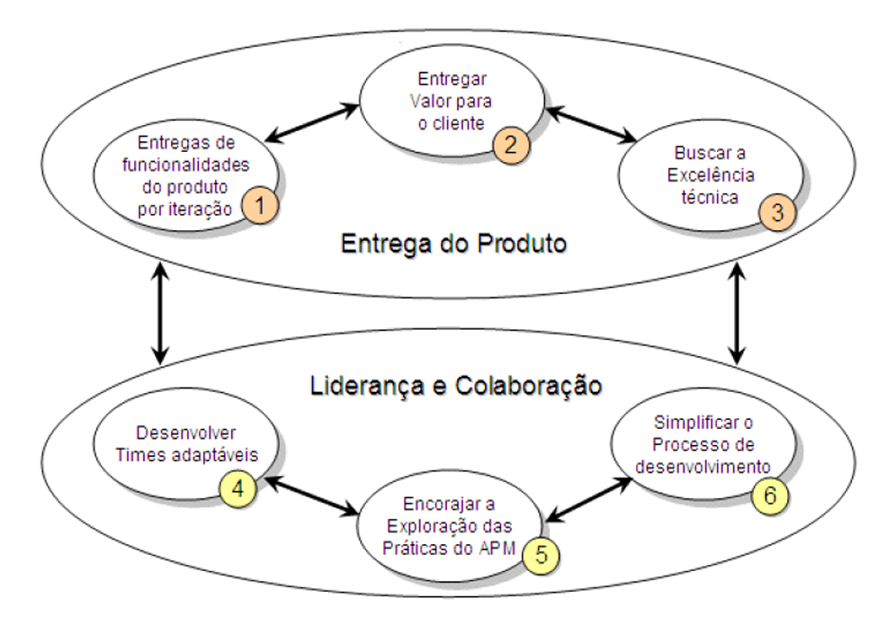

# Capítulo 10 – Metodologias Ágeis

A Engenharia de Software, como disciplina, passou por diversas fases de amadurecimento, buscando incessantemente o equilíbrio entre a previsibilidade dos processos de engenharia e a natureza abstrata e criativa do desenvolvimento de código. Após explorarmos modelos sequenciais, iterativos e específicos nos capítulos anteriores, chegamos a um ponto de inflexão histórica. A virada do milênio trouxe consigo não apenas novas tecnologias, mas uma mudança fundamental na filosofia de gestão de projetos. Diante de mercados cada vez mais voláteis e da necessidade de entregas rápidas, a rigidez dos métodos tradicionais cedeu espaço para abordagens que abraçam a mudança como uma vantagem competitiva. Este capítulo dedica-se a explorar o universo das Metodologias Ágeis, compreendendo suas origens, seus valores fundamentais e como elas redefiniram o paradigma de construção de software moderno.

## Origem do Pensamento Ágil

Para compreender a revolução ágil, é necessário contextualizar o cenário da indústria de tecnologia no final da década de 1990 e início dos anos 2000. Esse período foi marcado por uma tensão crescente. De um lado, a demanda por software explodia com a popularização da internet e o "boom" das empresas pontocom. Do outro, as práticas de desenvolvimento vigentes — fortemente baseadas em modelos preditivos, pesados e burocráticos, como o Modelo em Cascata e variações rígidas do RUP — falhavam sistematicamente em entregar resultados satisfatórios.

O cenário era de **frustração generalizada**. Projetos de software eram sinônimos de atrasos crônicos, orçamentos estourados e, o mais crítico, a entrega de produtos que, após meses ou anos de desenvolvimento, já não atendiam às necessidades dos usuários, pois o mercado havia mudado durante o processo. A tentativa de aplicar a engenharia civil ou mecânica ao software, com planejamentos exaustivos e imutáveis, estava colapsando diante da intangibilidade e volatilidade do software.

Foi em resposta a essa crise de eficiência e qualidade que, em fevereiro de 2001, um evento histórico ocorreu. Dezessete profissionais proeminentes da área de software — entre eles criadores de métodos como Extreme Programming (XP), Scrum, DSDM, Adaptive Software Development, Crystal, Feature-Driven Development e Pragmatic Programming — reuniram-se na estação de esqui de Snowbird, nas montanhas de Utah, Estados Unidos.

O objetivo inicial não era criar uma nova metodologia unificada, mas sim compartilhar experiências e buscar pontos de convergência entre suas abordagens. O clima era informal, mas as discussões tocavam na raiz dos problemas da indústria. Durante o encontro, as histórias se repetiam:

- Relatos de como a rigidez do Modelo em Cascata causava prejuízos financeiros enormes;
- Experiências onde o cumprimento cego de prazos irreais resultava em código de baixa qualidade;
- A constatação de que tentar "congelar" o escopo no início do projeto era uma batalha perdida contra a realidade.

Por outro lado, os participantes compartilharam o que estava funcionando em seus métodos alternativos: o uso de **iterações curtas**, a redução drástica da documentação em favor da comunicação face a face e a adaptação dinâmica do planejamento. Houve um consenso de que a chave para o sucesso não estava em processos mais rigorosos, mas em **abordagens mais leves, iterativas e centradas no fator humano**.

Durante a busca por um nome que sintetizasse essa nova filosofia, o termo "Lightweight" (leve) foi cogitado. No entanto, o grupo percebeu que "leve" poderia ser interpretado pejorativamente como "fraco" ou "sem substância". A escolha recaiu então sobre o termo **"Ágil"**. A palavra capturava perfeitamente a essência do que propunham: a capacidade de se mover rapidamente, mudar de direção com facilidade e responder a novos desafios com destreza e equilíbrio, assim como um atleta.

O resultado desse encontro foi a redação do **Manifesto Ágil para o Desenvolvimento de Software**, um documento conciso, mas profundamente impactante, que cristalizou os valores e princípios dessa nova era. Para perpetuar e disseminar esses ideais, o grupo fundou a **Agile Alliance**, uma organização sem fins lucrativos que até hoje atua como guardiã e promotora da cultura ágil.

O impacto do Manifesto foi sísmico. Ele não apenas validou as práticas emergentes, como Scrum e XP, mas estabeleceu um novo paradigma. A Engenharia de Software deixava de ser vista puramente como uma linha de montagem previsível para ser encarada como um processo empírico, colaborativo e adaptativo.

## Os Quatro Valores do Manifesto Ágil

O coração da filosofia ágil não reside em um conjunto de regras rígidas ou em um algoritmo de gerenciamento, mas sim em um sistema de valores. O Manifesto Ágil estrutura-se sobre quatro pilares fundamentais que orientam a tomada de decisão e a postura das equipes.

A figura abaixo apresenta o texto original traduzido desses valores:

É crucial interpretar corretamente a estrutura desses valores. O texto diz: _"mesmo havendo valor nos itens à direita, valorizamos mais os itens à esquerda"_. Isso significa que a agilidade **não é a negação da engenharia tradicional**. Documentação, processos, ferramentas, contratos e planos ainda são importantes e necessários. O Manifesto apenas estabelece uma nova **hierarquia de prioridades**: quando houver um conflito entre os dois lados, a escolha ágil deve pender para o lado esquerdo (pessoas, software funcionando, colaboração e resposta a mudanças).

A seguir, analisaremos detalhadamente cada um desses quatro valores.

### Indivíduos e Interações mais que Processos e Ferramentas

Este é talvez o valor mais disruptivo em relação à gestão tradicional, que frequentemente tentava tornar o desenvolvimento de software "à prova de pessoas", criando processos tão detalhados que qualquer indivíduo poderia ser substituído como uma peça de engrenagem. O Manifesto Ágil inverte essa lógica, reconhecendo que o desenvolvimento de software é uma atividade intelectual, criativa e social.

No centro do sucesso de um projeto estão as **pessoas** — suas habilidades, sua motivação e, principalmente, a forma como interagem entre si. Processos robustos e ferramentas caras (como softwares complexos de gestão de ciclo de vida, IDEs avançadas ou sistemas de tickets) são úteis, mas são apenas meios para um fim. Eles não conseguem compensar uma equipe desmotivada, sem comunicação ou sem as competências necessárias.

Jim Highsmith, um dos signatários, destaca que a **competência e a colaboração** são os verdadeiros motores do desenvolvimento. Uma equipe de "estrelas" que não se comunica falhará diante de uma equipe mediana que colabora intensamente.

Exemplo Prático:

Imagine uma empresa que implementou um processo rigoroso onde toda comunicação deve ser registrada em uma ferramenta de chamados (JIRA, por exemplo), proibindo interrupções diretas.

- **Abordagem Tradicional (Foco em Processo/Ferramenta):** O desenvolvedor A encontra um erro no código do desenvolvedor B. Ele abre um chamado detalhado. O desenvolvedor B lê o chamado 4 horas depois, não entende, e responde no chamado. A troca de mensagens leva dois dias até a resolução. O processo foi seguido, a ferramenta foi usada, mas a eficiência foi baixa.
- **Abordagem Ágil (Foco em Indivíduos/Interações):** O desenvolvedor A levanta da cadeira (ou chama no chat de vídeo), conversa com B, explica o erro. Eles resolvem juntos em 15 minutos. A interação humana direta superou a burocracia do processo.

Valorizar indivíduos significa criar ambientes onde a comunicação flui sem barreiras, onde há confiança mútua e onde a criatividade é incentivada em detrimento da obediência cega a um fluxograma de processo.

### Software em Funcionamento mais que Documentação Abrangente

Historicamente, muitos projetos seguiam a premissa de que o software só deveria ser codificado após a produção de uma documentação exaustiva (especificações de requisitos de centenas de páginas, diagramas UML completos de todo o sistema, etc.). O problema é que **documentação não é o produto**. O cliente não usa a documentação para resolver seus problemas de negócio; ele usa o software.

Este valor ataca a burocracia excessiva que gera o que chamamos de "ilusão de progresso". Ter 100% dos requisitos documentados não significa que 100% do problema está resolvido, pois nada foi construído ou testado ainda. Além disso, documentos desatualizam-se rapidamente, exigindo esforço constante de manutenção que não agrega valor direto ao usuário.

A analogia do carro é perfeita para ilustrar este ponto: ao comprar um veículo, o manual do proprietário é importante e deve existir. Porém, o que define a compra e a satisfação é a experiência de dirigir, o conforto e a segurança do carro em si. Ninguém compra um carro pelo manual.

**Atenção:** O Manifesto **não diz "sem documentação"**. Ele diz "mais que documentação abrangente". A documentação ágil deve ser:

- **Just-in-time:** Criada quando necessária.
- **Suficiente:** Apenas o necessário para o entendimento e manutenção (o famoso "barely sufficient").
- **Executável (quando possível):** Testes automatizados que servem como documentação viva do sistema.

O foco muda de "produzir papéis sobre o software" para "entregar software que funciona e gera valor", utilizando a documentação como suporte, e não como um fim em si mesma.

### Colaboração com o Cliente mais que Negociação de Contratos

O modelo tradicional de contratação de software muitas vezes assemelha-se à construção civil: o cliente define tudo o que quer em um contrato rígido (escopo fechado), a empresa de software orça e executa. Qualquer mudança solicitada pelo cliente gera uma "Solicitação de Mudança", revisão de custos e, frequentemente, conflitos legais e relacionais. Cria-se uma relação de adversários: "Nós (desenvolvedores) contra Eles (clientes)".

O Manifesto Ágil propõe derrubar esse muro. O cliente não deve aparecer apenas no início (para pedir) e no fim (para homologar). Ele deve ser um **membro ativo e presente durante todo o ciclo de desenvolvimento**. A colaboração contínua permite que o cliente veja o software nascendo e evoluindo, podendo direcionar o produto para o que realmente importa.

Isso exige uma mudança na estrutura contratual e na confiança. Em vez de contratos que tentam prever o futuro e blindar as partes contra mudanças, busca-se modelos flexíveis, como contratos de **escopo variável e tempo fixo**.

**Exemplo Prático:**

- **Modelo Tradicional (Negociação):** O cliente descobre, no meio do projeto, que uma funcionalidade contratada ("Relatório X") não é mais útil, mas precisa de uma nova ("Dashboard Y"). O fornecedor diz: "O Dashboard Y não está no contrato. Teremos que fazer um aditivo, cobrar extra e renegociar o prazo". O cliente fica insatisfeito e preso ao contrato.
- **Modelo Ágil (Colaboração):** Diante da mesma situação, a equipe e o cliente conversam. A equipe diz: "Tudo bem. Como o Dashboard Y tem complexidade similar ao Relatório X, vamos remover o Relatório X do escopo e colocar o Dashboard Y no lugar, mantendo o prazo e o custo". O valor entregue ao negócio é maximizado através da colaboração.

### Responder a Mudanças mais que Seguir um Plano

Talvez a maior certeza no desenvolvimento de software seja a incerteza. Vivemos em um mundo **VUCA** (Volátil, Incerto, Complexo e Ambíguo). A tecnologia avança exponencialmente, concorrentes surgem do nada, leis mudam e a economia flutua. Empresas que se apegaram rigidamente aos seus planos estratégicos de longo prazo sem observar as mudanças do ambiente — como a Kodak, a Blockbuster ou a Nokia — sucumbiram.

No desenvolvimento de software, tentar seguir um plano detalhado feito meses atrás, ignorando que a realidade mudou, é uma receita para o fracasso. É como usar um mapa antigo de uma cidade que passou por reformas viárias: seguir o mapa à risca levará você ao lugar errado ou a um beco sem saída.

O Manifesto Ágil valoriza a **adaptabilidade**. O planejamento no ágil existe, mas é diferente:

- Ele é **contínuo e iterativo** (planejamento em ondas sucessivas).
- Ele aceita que o conhecimento sobre o projeto aumenta com o tempo.
- A mudança não é vista como um erro de planejamento ou um incômodo, mas como uma oportunidade de melhorar o produto e torná-lo mais competitivo.

Em suma, uma equipe ágil tem um plano, mas não tem medo de rasgá-lo e desenhar um novo se o feedback do mercado ou do usuário indicar que a direção original não é mais a melhor. A capacidade de pivotar rapidamente é mais valiosa do que a capacidade de seguir um cronograma obsoleto.

## Agilidade x Velocidade

Ao adentrarmos o estudo das metodologias ágeis, deparamo-nos frequentemente com uma confusão semântica e conceitual que pode comprometer o entendimento da filosofia ágil: a mistura entre os termos **agilidade** e **velocidade**. Embora no senso comum essas palavras sejam usadas quase como sinônimos, na Engenharia de Software — e em diversos outros campos, como a física e o esporte — elas representam capacidades distintas. É fundamental dissociar esses conceitos para compreender que ser ágil não significa, necessariamente, ser o mais rápido em linha reta, mas sim ter a melhor capacidade de resposta.

Para ilustrar essa distinção de forma didática e memorável, recorremos a metáforas fora do universo da computação, começando pelo atletismo de alto nível.

### Metáfora do Atletismo

Usain Bolt é, indiscutivelmente, uma lenda do esporte mundial. O atleta jamaicano consagrou-se como o homem mais rápido do mundo, dominando as provas de 100 e 200 metros rasos por anos. Sua **velocidade** final é fenomenal, permitindo-lhe cruzar a linha de chegada muito à frente de seus competidores. Contudo, uma análise técnica detalhada de suas corridas revela um dado curioso e contra-intuitivo: Bolt raramente era o primeiro a largar ou a liderar os primeiros metros da prova.

Ao observarmos os registros visuais de suas competições, é comum notar que, nos primeiros 10 a 20 metros, Bolt figurava entre os últimos colocados. A razão para isso é física e biomecânica: sendo um atleta excepcionalmente alto e com grande massa muscular, Bolt possuía uma inércia maior. Isso significa que ele demorava mais tempo para vencer o estado de repouso e começar a se mover em comparação a corredores mais baixos e compactos.

Neste contexto, podemos afirmar que, na largada, Bolt era **menos ágil** que seus adversários. A **agilidade** aqui refere-se à capacidade de **reagir instantaneamente a uma mudança de estado** (no caso, o som do tiro de largada) e alterar sua posição corporal. Se as provas olímpicas fossem de apenas 50 metros, é muito provável que a história fosse diferente: Bolt poderia não ter alcançado o sucesso estrondoso que teve, ou talvez nem mesmo conquistasse o tricampeonato olímpico. Seus rivais, mais ágeis na reação e aceleração inicial, poderiam vencê-lo antes que ele tivesse tempo de desenvolver sua velocidade máxima.

O triunfo de Bolt ocorria na segunda metade da prova, onde a necessidade de reagir a mudanças (o tiro de largada) já havia passado, restando apenas a necessidade de manter e incrementar a velocidade de deslocamento.

### Metáfora dos Carros

Expandindo a analogia para o automobilismo, podemos comparar um carro extremamente potente e pesado (como um _muscle car_ ou um caminhão de corrida) com um carro leve e esportivo (como um _kart_ ou um veículo de rali).

Em uma pista de arrancada curta, o carro leve tende a ser mais **ágil**. Ele responde imediatamente ao acelerador, muda de direção com facilidade e sai da imobilidade num piscar de olhos. Ele possui uma excelente capacidade de reação. Já o veículo pesado e potente pode demorar alguns segundos a mais para transferir toda a sua força para o asfalto e ganhar momento.

No entanto, em uma reta longa, a **velocidade** final do carro potente prevalecerá. Ele cobrirá uma distância maior em menos tempo, uma vez que esteja em movimento pleno.

A síntese dessas metáforas é clara:

- **Agilidade** é a competência de responder a **mudanças** e reagir a novos cenários com rapidez e baixo custo de transição.
- **Velocidade** é a competência de executar uma tarefa ou percorrer uma distância em um curto intervalo de tempo, uma vez que a direção já está definida.

### Aplicando ao Desenvolvimento de Software

Trazendo esses conceitos para a Engenharia de Software, a distinção torna-se vital para a escolha do modelo de processo. Um processo pode ser projetado para ser extremamente **rápido**, como é o caso do **RAD (Rapid Application Development)**, estudado anteriormente. O RAD foca em ciclos curtos e entrega veloz, mas sua estrutura, baseada em time-boxing rígido e ferramentas de geração de código, não garante necessariamente que a equipe consiga mudar de direção facilmente no meio do caminho.

A **agilidade no software**, portanto, não se trata apenas de codificar rápido ou entregar na próxima semana. Trata-se da **capacidade de adaptação da equipe e do projeto** diante de instabilidades e imprevistos. Um projeto é considerado ágil quando a equipe consegue lidar com cenários como:

- **Mudança de Arquitetura:** Descobre-se, no meio do projeto, que a arquitetura monolítica escolhida não suportará a carga de usuários, exigindo uma migração para microsserviços. Uma equipe ágil consegue replanejar e executar essa transição sem paralisar o projeto inteiro.
- **Restrições de Recursos:** A empresa sofre um corte de orçamento e a equipe é reduzida pela metade. O processo ágil permite re-priorizar o _backlog_ imediatamente, garantindo que o produto mais importante continue sendo entregue, mesmo com menos braços.
- **Obsolescência Tecnológica:** Uma biblioteca ou framework fundamental para o projeto é descontinuado ou surge uma nova tecnologia que oferece uma vantagem competitiva imensa. A equipe ágil tem a flexibilidade técnica e gerencial para incorporar a nova tecnologia sem derrubar o que já foi construído.
- **Mudança de Negócio:** O concorrente lança uma funcionalidade inovadora. A equipe ágil consegue interromper o desenvolvimento de uma funcionalidade menos crítica para focar na resposta a essa concorrência.

Em suma, uma equipe ágil não foca apenas em correr para a linha de chegada (velocidade), mas em garantir que está correndo na direção certa, mesmo que o destino mude durante a corrida (agilidade). **Ela entrega com flexibilidade.**

### Diretrizes para um Processo de Software Ágil

Para que um processo de software seja considerado ágil, ele não precisa necessariamente seguir um "livro de regras" dogmático, mas deve aderir a certos princípios de adaptabilidade. **Roger Pressman**, uma das maiores autoridades na área, elenca diretrizes fundamentais que permitem a qualquer processo — mesmo aqueles com raízes mais tradicionais — mover-se em direção à agilidade:

1. **Adaptação e Racionalização:** O processo não deve ser uma camisa de força. Ele deve ser projetado de tal forma que a equipe tenha autonomia para adaptar as tarefas e o fluxo de trabalho às necessidades específicas do projeto e do momento. Se uma tarefa não faz sentido no contexto atual, ela deve ser racionalizada ou removida.
2. **Planejamento Fluido:** O planejamento não é um evento único e estático feito no início. Ele deve ser contínuo, levando em conta a fluidez inerente ao desenvolvimento de software. Planos devem ser feitos para serem mudados, não para serem seguidos cegamente.
3. **Essencialismo (Eliminação de Desperdício):** Devem ser eliminados todos os artefatos (documentos, diagramas, relatórios) que não agregam valor direto ao produto final ou à gestão necessária. Se um documento é produzido apenas para cumprir um rito burocrático e ninguém o lê, ele não é ágil. Mantenha apenas o essencial.
4. **Estratégia Incremental:** O processo deve focar na entrega contínua de incrementos de software operacional. O cliente deve ver o software funcionando o mais cedo possível, e não apenas no final do cronograma.

Seguindo essas diretrizes, a agilidade deixa de ser um rótulo de metodologias específicas (como Scrum ou XP) e passa a ser uma característica intrínseca da forma como a engenharia de software é conduzida.

### Agilidade: Adaptabilidade e Colaboração

Em última análise, as metodologias ágeis são filosofias de gestão projetadas para **reagir positivamente às mudanças**. Ao contrário da visão antiga de que a mudança é um "erro de requisitos" ou um "desvio de escopo" que deve ser evitado ou taxado, o ágil abraça a mudança como uma forma de aumentar a competitividade do produto.

Podemos contrastar as características dos dois mundos da seguinte forma:

- **Métodos Tradicionais:**
    - **Preditivos:** Tentam prever o futuro detalhadamente antes de começar.
    - **Formais e Documentais:** Baseiam-se em pesada documentação aprovada (assinada) antes da codificação.
    - **Contratuais:** Focam no cumprimento estrito do que foi contratado inicialmente (escopo, prazo, custo).
    - **Rígidos:** A mudança é vista como um custo alto e indesejável.
- **Métodos Ágeis:**
    - **Adaptativos (Dinâmicos):** Aceitam que o futuro é incerto e aprendem durante o processo.
    - **Iterativos:** Constroem o produto em ciclos, permitindo correções de rota frequentes.
    - **Colaborativos:** Priorizam a interação constante entre desenvolvedores e clientes em vez da negociação de contratos.
    - **Flexíveis:** A mudança é bem-vinda, mesmo em estágios tardios do desenvolvimento, se isso significar maior vantagem competitiva para o cliente.

Portanto, enquanto a **velocidade** pode ser útil para chegar rápido ao mercado, é a **agilidade** que garante a sobrevivência do software em um ambiente onde as regras do jogo mudam todos os dias. No mundo atual, a única certeza é a mudança, e a agilidade é a ferramenta estratégica para navegar nessa incerteza.

## Princípios Ágeis

Para traduzir a filosofia do Manifesto Ágil em práticas tangíveis no dia a dia de um projeto, foram estabelecidos doze princípios fundamentais. Eles funcionam como um farol, guiando as decisões da equipe e moldando a cultura organizacional. Enquanto os quatro valores do Manifesto representam o "espírito" da agilidade, os doze princípios descrevem como esse espírito se manifesta na prática.

A figura abaixo ilustra esses princípios de forma resumida, destacando aspectos como satisfação do consumidor, aceitação de mudanças, entregas frequentes, trabalho em equipe e busca por simplicidade e excelência.

Vamos analisar cada um desses princípios em profundidade, entendendo suas implicações práticas:

1. **Nossa maior prioridade é satisfazer o cliente através da entrega contínua e antecipada de software com valor agregado.**
    A satisfação do cliente não é alcançada apenas no final do projeto, mas continuamente. "Valor agregado" significa entregar funcionalidades que resolvem problemas reais do negócio agora, não daqui a seis meses. A antecipação gera retorno sobre o investimento (ROI) mais cedo.
    
2. **Mudanças nos requisitos são bem-vindas, mesmo em estágios avançados do desenvolvimento. Processos ágeis aproveitam as mudanças para gerar vantagem competitiva ao cliente.**
    Em vez de temer a mudança, a equipe ágil a abraça. Se o mercado muda, o software deve mudar junto. A capacidade de alterar o rumo no final do projeto pode ser a diferença entre entregar um produto obsoleto e um produto líder de mercado.
    
3. **Entregar frequentemente software funcionando, em ciclos que vão de poucas semanas a poucos meses, sempre priorizando ciclos mais curtos.**
    A frequência combate a incerteza. Ciclos curtos (Sprints ou iterações) permitem feedback rápido. Se algo está errado, descobre-se em duas semanas, não em dois anos.
    
4. **Negócios e desenvolvimento trabalham juntos diariamente durante todo o projeto.**
    A barreira entre "quem pede" (negócio) e "quem faz" (TI) deve ser dissolvida. A colaboração diária garante que o software construído esteja sempre alinhado com a estratégia da empresa, evitando o famoso "telefone sem fio".
    
5. **Construa projetos em torno de indivíduos motivados. Ofereça a eles o suporte e o ambiente necessários e confie que realizarão um bom trabalho.**
    Projetos são feitos de pessoas, não de recursos. A motivação é o combustível da produtividade. O papel da gestão muda de "comando e controle" para "serviço e facilitação", removendo obstáculos para que a equipe brilhe.
    
6. **O método mais eficiente e eficaz de comunicar informações é a conversa face a face.**
    Documentos escritos geram ambiguidade e demora na resposta. Uma conversa direta (mesmo que por vídeo) resolve problemas complexos em minutos, com riqueza de comunicação não verbal e feedback instantâneo.
    
7. **Software funcionando é a principal medida de progresso.**
    Relatórios de status, cronogramas coloridos e especificações aprovadas não são progresso real se o código não funciona. A única métrica que realmente importa é o software operacional nas mãos do usuário.
    
8. **Processos ágeis promovem desenvolvimento sustentável. Todos os envolvidos devem conseguir manter um ritmo constante e indefinido.**
    Agilidade não é sinônimo de pressa ou horas extras constantes ("marcha da morte"). É sobre encontrar um ritmo sustentável que a equipe possa manter a longo prazo sem burnout, garantindo qualidade e saúde mental.
    
9. **Atenção contínua à excelência técnica e ao bom design aumenta a agilidade.**
    Código sujo e mal projetado deixa o sistema rígido e difícil de manter. Investir em qualidade técnica (testes, refatoração, padrões de projeto) desde o início torna o software mais flexível para aceitar mudanças futuras.
    
10. **Simplicidade é essencial, ou seja, a arte de maximizar a quantidade de trabalho não realizado.**
    O princípio YAGNI (You Aren't Gonna Need It) impera aqui. Não construa funcionalidades que "talvez" sejam usadas no futuro. Foque no que é necessário agora. Menos código significa menos bugs e menos manutenção.
    
11. **As melhores arquiteturas, requisitos e designs emergem de equipes auto-organizáveis.**
    Quando a equipe tem autonomia para decidir como fazer o trabalho, o comprometimento e a criatividade aumentam. As soluções não são impostas de cima para baixo, mas emergem da inteligência coletiva do time.
    
12. **Em intervalos regulares, a equipe reflete sobre como se tornar mais eficaz e então ajusta seu comportamento de acordo.**
    A melhoria contínua é institucionalizada através de retrospectivas. A equipe para, analisa o que funcionou e o que não funcionou, e define ações para ser melhor na próxima iteração.

### Reflexão Importante: Escalabilidade do Ágil

Diante desses princípios, uma dúvida histórica persiste: **"As metodologias ágeis funcionam para projetos de qualquer tamanho e complexidade?"**

Ian Sommerville, uma das vozes mais tradicionais e respeitadas da literatura de Engenharia de Software, expressou em edições passadas de sua obra uma visão cautelosa:

> “Todos os métodos têm limites, e os métodos ágeis são somente adequados para alguns tipos de desenvolvimento de sistema. Na minha opinião, eles são mais adequados para o desenvolvimento de sistemas de pequenas e médias empresas e produtos para computadores pessoais.”

Essa perspectiva baseava-se na dificuldade inicial de coordenar múltiplas equipes ágeis e manter a coerência arquitetural em sistemas gigantescos sem um planejamento centralizado pesado. No entanto, o cenário evoluiu drasticamente.

Hoje, essa visão é amplamente considerada **ultrapassada** pela prática de mercado. Frameworks de escala como SAFe (Scaled Agile Framework), LeSS (Large-Scale Scrum) e o Modelo Spotify provaram que é possível aplicar agilidade em organizações globais com milhares de desenvolvedores e sistemas de altíssima complexidade (bancários, telecomunicações, aeroespaciais). A agilidade deixou de ser exclusividade de startups e times pequenos para se tornar o padrão de operação de grandes corporações, demonstrando sua maturidade e adaptabilidade.

## Principais Metodologias Ágeis

O termo "Metodologias Ágeis" é um guarda-chuva que abriga diversas abordagens, frameworks e práticas. Cada uma nasceu em um contexto diferente para resolver problemas específicos, mas todas compartilham os valores e princípios do Manifesto. Abaixo, listamos as mais proeminentes no mercado:

- **SCRUM:** O framework ágil mais popular do mundo, focado na gestão de projetos complexos através de iterações (Sprints) e papéis bem definidos.
- **XP (Extreme Programming):** Uma metodologia focada radicalmente nas boas práticas de engenharia de software (código), como programação em par e testes contínuos.
- **KANBAN:** Originário do sistema Toyota de produção, foca na visualização do fluxo de trabalho, limitação do trabalho em progresso (WIP) e melhoria contínua do fluxo.
- **TDD (Test-Driven Development):** Prática de desenvolvimento onde os testes são escritos antes do código funcional.
- **BDD (Behavior-Driven Development):** Evolução do TDD, foca na especificação do comportamento do sistema em linguagem natural, facilitando a comunicação entre técnicos e não técnicos.
- **ATDD (Acceptance Test-Driven Development):** Similar ao TDD, mas focado nos testes de aceitação do usuário.
- **FDD (Feature-Driven Development):** Metodologia focada no desenvolvimento guiado por funcionalidades de negócio.
- **DDD (Domain-Driven Design):** Abordagem de design de software que foca na modelagem do domínio do problema complexo.
- **CRYSTAL:** Uma família de metodologias (Crystal Clear, Yellow, Orange, etc.) que se adaptam à criticidade e ao tamanho do projeto.
- **DSDM (Dynamic Systems Development Method):** Um framework ágil robusto com foco em governança e ciclo de vida completo do projeto.
- **ASD (Adaptive Software Development):** Foca na adaptação contínua a ambientes complexos.
- **MDD (Model-Driven Development):** Desenvolvimento guiado por modelos.
- **BADM (Beyond Agile Development Method)**
- **AUP (Agile Unified Process):** Uma versão simplificada e ágil do RUP (Rational Unified Process).
- **Agile Modeling:** Práticas para modelagem e documentação de forma ágil e eficaz.
- **OSSD (Open Source Software Development):** Modelo colaborativo descentralizado típico de projetos de código aberto.
- **SCRUMBAN:** Um híbrido que combina a estrutura do Scrum com a fluidez e visualização do Kanban.

### Comparação Entre Modelos Tradicionais e Ágeis

Para cristalizar o entendimento sobre a mudança de paradigma que a agilidade representa, é útil comparar diretamente suas características com os modelos tradicionais (como o Cascata). A tabela a seguir detalha essas diferenças cruciais em diversos aspectos do gerenciamento e desenvolvimento:

| **Critério**              | **Modelos Tradicionais**                                                                              | **Modelos Ágeis**                                                                                            |
| ------------------------- | ----------------------------------------------------------------------------------------------------- | ------------------------------------------------------------------------------------------------------------ |
| **Planejamento**          | Preditivo e detalhado. Tenta antecipar tudo no início (fase de planejamento pesado).                  | Adaptativo e contínuo. Planejamento de alto nível inicial, detalhado apenas para a próxima iteração.         |
| **Riscos**                | Tratados extensivamente no início (análise de riscos pesada), mas muitas vezes só mitigados no final. | Mitigados continuamente a cada iteração. O feedback frequente reduz o risco de construir a coisa errada.     |
| **Equipe**                | Comando e controle. Papéis rígidos, hierarquia clara, tarefas atribuídas pelo gerente.                | Auto-organizável e multidisciplinar. A equipe decide "como" fazer o trabalho. Liderança servidora.           |
| **Tempo de Entrega**      | Longo. O software funcional só aparece no final do cronograma (meses ou anos).                        | Curto e fixo (Time-box). Entregas de software funcional a cada 2 a 4 semanas.                                |
| **Aceitação de Mudanças** | Resistência. Mudanças são vistas como falha no planejamento, exigem burocracia (CRs) e renegociação.  | Bem-vindas. Mudanças são esperadas e vistas como vantagem competitiva. Processo flexível.                    |
| **Previsibilidade**       | Baixa. Baseada na ilusão de um plano perfeito que raramente se cumpre.                                | Alta (a curto prazo). Baseada na velocidade real da equipe e na transparência do progresso diário.           |
| **Resultados**            | Valor entregue apenas no final do projeto (Big Bang).                                                 | Valor entregue de forma incremental e contínua desde as primeiras semanas.                                   |
| **Visibilidade**          | Relatórios de status formais, gráficos de Gantt complexos, reuniões de status esporádicas.            | Radiadores de informação (quadros físicos ou digitais), Daily Scrum. Status real visível a qualquer momento. |
| **Prazo**                 | Fixo no contrato, mas frequentemente estourado devido a atrasos nas fases anteriores.                 | Fixo por iteração (Sprint). O escopo varia para caber no prazo, garantindo entregas pontuais.                |
| **Documentação**          | Exaustiva e pesada. Frequentemente desatualizada e pouco lida. Fim em si mesma.                       | Enxuta e Just-in-Time. Apenas o necessário para o entendimento e suporte. Valor no software.                 |
| **Cliente**               | Distante. Participa no início (requisitos) e no fim (homologação). Relação contratual.                | Parceiro. Participa diariamente ou frequentemente. Define prioridades e valida entregas.                     |
| **Melhoria**              | Lições aprendidas apenas no final do projeto (post-mortem), quando é tarde para agir.                 | Retrospectivas ao final de cada iteração. Melhoria contínua do processo durante o projeto.                   |
| **Comando**               | Centralizado no Gerente de Projetos.                                                                  | Distribuído. A equipe tem autonomia técnica e de processo.                                                   |
| **Papéis**                | Especialistas isolados (Analista, Arquiteto, Testador) com handoffs entre eles.                       | Generalistas-especialistas ("T-shaped"). Colaboração intensa, foco no objetivo do time.                      |
| **Processo**              | Rígido. Seguir o plano é mais importante que o resultado.                                             | Empírico. Inspeção e adaptação constantes para maximizar o valor.                                            |
| **Contexto Ideal**        | Projetos com escopo estável, requisitos claros e fixos, baixa incerteza tecnológica.                  | Projetos com escopo dinâmico, requisitos voláteis, alta incerteza e necessidade de inovação.                 |

Essa comparação evidencia que a escolha entre Ágil e Tradicional não é uma questão de "certo ou errado", mas de adequação ao contexto. No entanto, no cenário atual de negócios, onde a velocidade de mudança é vertiginosa, as características ágeis (adaptabilidade, entrega de valor, colaboração) tornaram-se essenciais para a maioria das iniciativas de software.

## Profissional Ágil

No contexto das metodologias ágeis e dos princípios que norteiam o **Manifesto Ágil**, o perfil de um **profissional ágil** vai muito além das competências técnicas. Esse profissional precisa adotar uma mentalidade alinhada aos valores e princípios ágeis, além de desenvolver uma série de competências comportamentais que favorecem a adaptação, colaboração e entrega contínua de valor.

Trabalhar em ambientes ágeis, como os que utilizam frameworks e metodologias como **Scrum, Kanban, XP, DSDM, FDD**, entre outros, exige um perfil que consiga navegar com segurança em cenários de constante mudança, incerteza e evolução. A seguir, detalhamos as principais características que definem um profissional ágil:

| **CARACTERÍSTICA**                 | **DESCRIÇÃO**                                                                                                                                                                                              |
| ---------------------------------- | ---------------------------------------------------------------------------------------------------------------------------------------------------------------------------------------------------------- |
| **Flexibilidade e adaptabilidade** | Capacidade de se adaptar rapidamente às mudanças no escopo, nos requisitos ou nas prioridades do projeto. Profissionais ágeis encaram as mudanças como algo natural e necessário para gerar valor.         |
| **Colaboração e comunicação**      | Valorizam o trabalho colaborativo, tanto entre os membros da equipe quanto com clientes e stakeholders. A comunicação é constante, clara e objetiva, promovendo transparência e alinhamento.               |
| **Foco no cliente**                | A busca pela satisfação do cliente é uma prioridade. O profissional ágil trabalha de forma iterativa, buscando sempre feedbacks para garantir que o produto atenda (ou supere) as expectativas do cliente. |
| **Aprendizado contínuo**           | Diante de um cenário dinâmico, estão em constante desenvolvimento pessoal e profissional. Aprender, desaprender e reaprender faz parte do seu cotidiano.                                                   |
| **Proatividade e autonomia**       | Profissionais ágeis são donos do seu trabalho. Assumem responsabilidades, tomam iniciativas e buscam soluções, atuando de maneira independente e colaborativa.                                             |
| **Resiliência e persistência**     | Diante de desafios e adversidades, mantêm-se firmes, resilientes e persistentes, encarando erros e falhas como oportunidades de crescimento e melhoria.                                                    |
| **Habilidade de priorização**      | Sabem diferenciar o que é essencial do que é secundário, priorizando tarefas que geram mais valor para o cliente e para o projeto, com base em dados e feedbacks.                                          |
| **Empatia e suporte aos outros**   | Praticam a empatia, entendendo as necessidades e dificuldades dos colegas e dos clientes. Contribuem para um ambiente colaborativo, saudável e produtivo.                                                  |

Portanto, ser um **profissional ágil** não significa apenas dominar ferramentas e técnicas. Significa adotar uma postura colaborativa, adaptativa e centrada em entregar valor constantemente.

### Entregando Valor para Clientes no Contexto Digital

O conceito de **valor** está diretamente ligado à percepção do cliente sobre o quanto uma solução, produto ou serviço resolve seus problemas, atende suas necessidades ou gera benefícios. Em ambientes ágeis, entregar valor é um processo contínuo, iterativo e incremental.

No entanto, no contexto digital, identificar e entregar valor exige uma compreensão profunda das **necessidades, desejos, dores e comportamentos dos clientes**. Isso significa que as equipes e os profissionais precisam ser ainda mais sensíveis e ágeis em suas abordagens.

O conceito de valor não é fixo — ele **varia de cliente para cliente, de segmento para segmento e até ao longo do tempo**, conforme o ambiente de negócios evolui. Dessa forma, é imprescindível que o profissional ágil adote uma **mentalidade centrada no cliente**, combinada com práticas que permitam entregar valor de forma rápida, contínua e ajustada às necessidades em constante mudança.

Algumas das principais estratégias para identificar e entregar valor ao cliente digital são:

| **ESTRATÉGIA**                             | **DESCRIÇÃO**                                                                                                                                                              |
| ------------------------------------------ | -------------------------------------------------------------------------------------------------------------------------------------------------------------------------- |
| **Pesquisa e feedback**                    | Realizar pesquisas, entrevistas, análises de comportamento (em sites, aplicativos, redes) e obter feedbacks constantes para entender as dores e necessidades dos clientes. |
| **Persona e jornadas do cliente**          | Criar perfis (personas) que representem os diferentes tipos de clientes e mapear suas jornadas, identificando pontos de dor, expectativas e oportunidades de melhoria.     |
| **MVP (Minimum Viable Product)**           | Desenvolver uma versão mínima viável do produto, com funcionalidades essenciais, para validar hipóteses, obter feedback rápido e ajustar antes de grandes investimentos.   |
| **Entrega contínua**                       | Adotar práticas de integração e entrega contínua, garantindo que melhorias e novas funcionalidades sejam disponibilizadas regularmente aos clientes.                       |
| **Análise de dados e métricas de sucesso** | Monitorar métricas como engajamento, conversão, retenção, churn e satisfação do cliente, para entender o que gera mais valor e onde há oportunidades de melhoria.          |
| **Testes A/B e experimentação**            | Conduzir experimentos para validar ideias e testar diferentes abordagens, ajustando rapidamente com base nos resultados.                                                   |
| **Design centrado no usuário**             | Priorizar a experiência do usuário, criando interfaces intuitivas, agradáveis e funcionais, alinhadas às expectativas dos usuários.                                        |
| **Usabilidade e acessibilidade**           | Garantir que o produto seja acessível a todos, incluindo pessoas com deficiências, e otimizar a usabilidade em diferentes dispositivos e contextos.                        |
| **Comunicação personalizada**              | Utilizar canais de comunicação (e-mails, notificações, redes sociais) de forma segmentada e personalizada, melhorando o relacionamento com os clientes.                    |
| **Construção de comunidade**               | Promover espaços onde clientes possam interagir, compartilhar experiências e fornecer feedback, criando um senso de pertencimento e fidelização.                           |
| **Novas tendências e tecnologias**         | Manter-se atento às inovações tecnológicas, metodológicas e comportamentais que podem agregar valor ao cliente e criar diferenciais competitivos.                          |
| **Cultura de inovação**                    | Estimular a criatividade e a experimentação contínua dentro das equipes, promovendo um ambiente onde ideias novas sejam bem-vindas e rapidamente testadas.                 |

O **profissional ágil** é, antes de tudo, um facilitador da entrega de valor. Seu papel vai além da execução de tarefas — ele atua como um agente de transformação, promovendo uma cultura de colaboração, inovação, foco no cliente e melhoria contínua.

## Gestão Ágil de Projetos

A Gestão Ágil de Projetos não é uma única metodologia, mas sim um guarda-chuva de abordagens que compartilham uma filosofia e um conjunto de valores. Ela representa uma mudança fundamental na forma de pensar sobre como liderar projetos, movendo o foco do controle rígido para a facilitação e adaptação. Diversos autores contribuíram para sua definição:

- **Jim Highsmith**, um dos signatários do Manifesto Ágil, a define como um conjunto de princípios, valores e práticas que auxiliam a equipe a entregar produtos ou serviços de valor em um ambiente de projetos desafiador.
- **G. Chin** a vê como um novo elemento que pode contribuir para a teoria tradicional de gestão de projetos, permitindo que as empresas sejam mais eficientes na gestão de projetos em ambientes incertos.
- **D. DeCarlo** a descreve como "a arte e ciência de facilitar e gerenciar o fluxo de pensamentos, emoções e interações" com o objetivo de produzir resultados de valor em condições adversas e complexas, sujeitas a mudanças constantes e elevados níveis de incerteza.

O próprio termo **"agilidade"**, no contexto do desenvolvimento ágil, significa que a equipe de projeto desenvolve a habilidade necessária para **criar e responder às mudanças** ocorridas no projeto. A abordagem do gerenciamento ágil deve ser encarada como a busca por um equilíbrio constante entre flexibilidade e estabilidade. Como afirma **Doug Augustine**, é necessário balancear caos com ordem, execução com planejamento e exploração com otimização.

Analisando essas definições, alguns pontos em comum se destacam:

- **Flexibilidade e Adaptação:** Todas as definições enfatizam a necessidade de flexibilidade e a habilidade de absorver mudanças durante todo o ciclo de vida do projeto.
- **Enfoque Humanista:** Há uma forte valorização do aprendizado contínuo e da capacidade dos indivíduos como participantes ativos do processo, em vez de uma valorização excessiva das técnicas e processos de gestão.
- **Entrega de Valor:** O foco principal não é apenas seguir um plano, mas sim entregar valor para o cliente de forma contínua, mesmo diante da imprevisibilidade.

### Pilares da Mentalidade Ágil na Gestão

A gestão ágil de projetos é sustentada por um conjunto de práticas e valores que priorizam a entrega rápida e contínua de valor ao cliente, adaptando-se às mudanças de forma dinâmica e promovendo a colaboração. Vamos explorar os pilares dessa abordagem.

#### Cooperação

A cooperação é a espinha dorsal da gestão ágil. Ela envolve a colaboração contínua e intensa entre todos os membros da equipe, bem como entre a equipe e os stakeholders, para garantir que todos estejam alinhados e trabalhando em direção ao mesmo objetivo. Na prática, isso significa que as equipes ágeis operam em ciclos curtos e interativos, como sprints, onde o feedback é compartilhado constantemente. Reuniões diárias (daily stand-ups) são comuns e servem como um pulso rápido para que os membros da equipe sincronizem seu progresso e identifiquem desafios. A cooperação não se limita à equipe interna; ela se estende aos clientes e stakeholders, que são integrados ao processo de desenvolvimento através de revisões de sprint e validações constantes, tornando-se parceiros ativos na construção do produto.

#### Flexibilidade de Escopo

Diferente da gestão tradicional de projetos, onde o escopo é definido rigidamente no início e qualquer mudança é tratada como uma exceção custosa, a gestão ágil abraça a **flexibilidade de escopo**. Isso significa que o escopo do projeto pode e deve ser ajustado continuamente com base no feedback recebido e nas necessidades emergentes do cliente. Na prática, essa flexibilidade é gerenciada através de um backlog priorizado, que é um artefato vivo, constantemente revisado e atualizado. O Product Owner trabalha em estreita colaboração com a equipe para reordenar o backlog, garantindo que as funcionalidades mais valiosas sejam sempre desenvolvidas primeiro. Isso permite que a equipe responda rapidamente a mudanças no mercado ou nos requisitos do cliente, sem comprometer o fluxo de entrega.

#### Interatividade

A gestão ágil enfatiza a **interatividade** em todos os níveis, tanto no processo de desenvolvimento quanto na comunicação. O trabalho é dividido em pequenos incrementos funcionais, e cada um deles é completamente desenvolvido, testado e revisado antes de se avançar. Na prática, iterações curtas, geralmente chamadas de sprints no Scrum, são usadas para criar versões incrementais e potencialmente utilizáveis do produto. Ao final de cada sprint, uma **Revisão de Sprint** é realizada para demonstrar o progresso, obter feedback valioso dos stakeholders e ajustar o curso do projeto se necessário. Isso cria um ciclo contínuo de **construir-medir-aprender**, garantindo que o produto final evolua de acordo com as necessidades reais do usuário.

#### Autonomia e Empoderamento de Equipes

Na gestão ágil, as equipes são incentivadas a serem **autônomas e auto-organizadas**. Isso significa que elas têm a liberdade e a responsabilidade de tomar decisões sobre _como_ o trabalho será realizado, sem a necessidade de aprovações ou supervisão constante da gerência. A autonomia é promovida através de uma clara definição de papéis (como Scrum Master e Product Owner) e do empoderamento da equipe de desenvolvimento para tomar decisões técnicas. Cada membro da equipe tem a liberdade de escolher a melhor maneira de abordar suas tarefas, dentro das diretrizes gerais do projeto.

O **empoderamento** é o ato de fornecer às equipes os recursos, a autoridade e a confiança para que possam cumprir seus objetivos. Líderes ágeis atuam como facilitadores e "líderes servidores", cujo principal papel é remover obstáculos e apoiar a equipe, em vez de microgerenciá-la. Isso não apenas acelera a tomada de decisões, mas também aumenta drasticamente a motivação, o senso de propriedade e o comprometimento da equipe com a qualidade do resultado.

#### Programação em Pares

A **Programação em Pares (Pair Programming)** é uma prática técnica de desenvolvimento de software, originária do Extreme Programming (XP), onde duas pessoas trabalham juntas no mesmo código em um único computador. Um dos programadores, chamado de "piloto", escreve o código, enquanto o outro, o "navegador" ou "copiloto", revisa cada linha de código à medida que é escrita. O navegador pensa em melhorias, erros potenciais, alternativas de design e considera o impacto geral da solução no sistema. Os papéis são trocados com frequência.

Na prática, a programação em pares promove a colaboração intensa, a melhoria contínua e a elevação da qualidade do código. Embora possa parecer menos eficiente inicialmente, devido ao envolvimento de dois desenvolvedores em uma única tarefa, os benefícios de um código mais limpo, menos bugs, maior disseminação de conhecimento e decisões de design mais robustas geralmente compensam essa percepção, resultando em um desenvolvimento mais eficaz e sustentável a longo prazo.

### Princípios Fundamentais da Gestão Ágil

A Gestão Ágil de Projetos é regida por um conjunto de princípios básicos que a diferenciam da abordagem tradicional. Esses princípios remetem a uma reflexão sobre onde o foco da gestão deve estar. Enquanto a teoria tradicional enfatiza o valor do plano de projeto e a antecipação de eventos, a gestão ágil questiona como é possível agregar valor, simplificar o processo e criar times adaptáveis quando não se pode prever tudo.

  

Os princípios ilustrados acima podem ser resumidos em:

- **Foco no Cliente e na Entrega de Valor:** O sucesso é medido pela satisfação do cliente e pelo valor de negócio entregue, não apenas pelo cumprimento de um cronograma.
- **Colaboração e Liderança da Equipe:** A equipe é empoderada para se auto-organizar e tomar decisões. A liderança é um papel de serviço, focado em remover impedimentos e facilitar o trabalho.
- **Adaptação Contínua ao Contexto:** O processo e o plano não são rígidos. Eles são continuamente inspecionados e adaptados com base no feedback e no aprendizado obtido.
- **Simplicidade e Foco no Essencial:** Busca-se a maneira mais simples de atingir os objetivos, eliminando desperdícios, burocracia e atividades que não agregam valor.
- **Qualidade e Excelência Técnica:** A qualidade é construída ao longo do processo, não verificada apenas no final. A atenção contínua à excelência técnica aumenta a agilidade.

### Abordagem Tradicional versus Abordagem Ágil

As diferenças filosóficas entre a gestão tradicional e a ágil se manifestam em praticamente todos os aspectos do gerenciamento de um projeto. A tabela a seguir resume as principais distinções:

| **Abordagem**                 | **Tradicional**                                                                                                | **Ágil**                                                                                                                        |
| ----------------------------- | -------------------------------------------------------------------------------------------------------------- | ------------------------------------------------------------------------------------------------------------------------------- |
| **Metas do Projeto**          | Enfoque na finalização do projeto no tempo, custo e escopo definidos (o "triângulo de ferro").                 | Enfoque nos resultados do negócio e em atingir múltiplos critérios de sucesso, incluindo a satisfação do cliente.               |
| **Plano do Projeto**          | Uma coleção detalhada de atividades que são executadas como planejado para atender a tempo, custo e qualidade. | Uma organização e um processo para atingir as metas esperadas e os resultados para o negócio. O plano é um guia, não uma regra. |
| **Abordagem Gerencial**       | Rígida, com foco no controle e na conformidade com o plano inicial.                                            | Flexível, variável e adaptativa, pronta para responder às mudanças.                                                             |
| **Trabalho e Execução**       | Assume que o trabalho é previsível, mensurável, linear e relativamente simples.                                | Reconhece que o trabalho é imprevisível, nem sempre mensurável, não-linear e complexo.                                          |
| **Influência da Organização** | Mínima e imparcial a partir do kick-off do projeto.                                                            | Afeta o projeto continuamente ao longo de sua execução, exigindo interação constante.                                           |
| **Controle do Projeto**       | Identificar desvios do plano inicial e corrigir o trabalho para seguir o plano.                                | Identificar mudanças no ambiente e no entendimento do problema, e ajustar o plano adequadamente.                                |
| **Aplicação da Metodologia**  | Aplicação genérica e, muitas vezes, igualitária em todos os projetos.                                          | Adaptação do processo dependendo do tipo, tamanho e contexto de cada projeto.                                                   |
| **Estilo de Gestão**          | Um modelo único ("one-size-fits-all") tende a ser aplicado a todos os tipos de projetos.                       | Abordagem adaptativa; um único modelo não atende a todos os tipos de projetos.                                                  |

### Ciclo de Vida da Gestão Ágil de Projetos

Diferente de um processo linear com fases bem definidas e sequenciais, a Gestão Ágil de Projetos opera em um ciclo de vida adaptativo, composto por cinco fases principais. As fases de Especulação, Exploração e Adaptação formam um ciclo contínuo de planejamento, execução e aprendizado.

  

| **Fases**        | **Descrição**                                                                                                                                                                                                                                                                                                                                                                                                      |
| ---------------- | ------------------------------------------------------------------------------------------------------------------------------------------------------------------------------------------------------------------------------------------------------------------------------------------------------------------------------------------------------------------------------------------------------------------ |
| **Visão**        | O objetivo desta fase inicial é **determinar a visão do produto e o escopo geral do projeto**. Define-se _o que_ será entregue em alto nível, quem são os envolvidos (a comunidade do projeto) e _como_ a equipe irá trabalhar e interagir. É o momento de alinhar as expectativas e estabelecer as bases para o projeto.                                                                                          |
| **Especulação**  | Com a visão estabelecida, o objetivo desta fase é **planejar o projeto com base nessa visão preliminar**. A palavra "especulação" é usada de propósito para indicar que este não é um plano fixo e detalhado, mas sim uma exploração das possibilidades. A equipe de projeto, com o apoio dos stakeholders, define um plano de _release_ baseado nas funcionalidades e prioridades, e planeja a primeira iteração. |
| **Exploração**   | Esta fase é onde o trabalho de desenvolvimento acontece. O objetivo é **executar o que foi planejado na iteração, entregando funcionalidades de valor**. A equipe trabalha de forma focada, promovendo a auto-organização e a autodisciplina. A gestão ágil, aqui, foca em facilitar o trabalho, remover impedimentos e gerenciar as interações da equipe com o cliente para garantir feedback contínuo.           |
| **Adaptação**    | Ao final de cada ciclo de exploração, o objetivo da fase de Adaptação é **rever os resultados obtidos**. A equipe analisa o progresso do projeto, avalia seu próprio desempenho e utiliza o feedback recebido para fazer adaptações. O plano do projeto, as prioridades das entregas e o plano para as próximas iterações podem ser ajustados caso seja necessário. É o coração do processo de aprendizado ágil.   |
| **Encerramento** | A fase final do projeto. Seu objetivo é **transferir os conhecimentos-chave adquiridos**, entregar o produto final e celebrar os resultados obtidos com a equipe. É recomendado que, além do encerramento formal do projeto, sejam realizados "mini-fechamentos" ao final de cada iteração, criando momentos para celebrar as pequenas vitórias e consolidar o aprendizado.                                        |

## Ferramentas, Artefatos, Métricas e Indicadores

Neste tópico, abordaremos de forma detalhada os principais elementos que sustentam e viabilizam a adoção das metodologias ágeis no dia a dia das equipes: **as ferramentas, os artefatos, as métricas e os indicadores**. Esses componentes são fundamentais para garantir que o desenvolvimento ágil seja realizado de maneira organizada, eficiente, transparente e orientada à entrega de valor.

### Ferramentas

As **ferramentas ágeis** são sistemas, plataformas e softwares desenvolvidos com o objetivo de apoiar as equipes na implementação e na operacionalização dos princípios ágeis. Elas facilitam desde o planejamento e a colaboração até o acompanhamento do progresso, a gestão de tarefas e a entrega contínua de valor.

Cada tipo de ferramenta possui funcionalidades específicas que suportam diferentes aspectos do desenvolvimento ágil. A seguir, apresentamos uma tabela que resume os principais tipos de ferramentas, suas descrições e seus objetivos:

|**Tipos de Ferramentas**|**Descrição**|
|---|---|
|**Gerenciamento de projeto e colaboração**|Suportam o planejamento de sprints, o rastreamento de tarefas, o uso de quadros Kanban e a comunicação eficiente entre os membros da equipe.|
|**Integração e entrega contínua (CI/CD)**|Automatizam processos de desenvolvimento, desde a integração do código até os testes e a entrega em produção, garantindo maior agilidade e qualidade.|
|**Monitoramento e relatórios**|Fornecem visibilidade sobre o progresso do projeto, a qualidade do código e métricas de desempenho, ajudando na tomada de decisões.|
|**Rastreamento de bugs e issues**|Facilitam a identificação, o acompanhamento e a resolução de bugs, falhas e problemas ao longo do desenvolvimento.|
|**Repositórios e revisão de código**|Permitem o versionamento do código, a colaboração entre desenvolvedores e a realização de revisões para garantir a qualidade do produto.|

Além dos tipos, é importante conhecer os principais exemplos de ferramentas utilizadas no contexto ágil, bem como suas funcionalidades:

| **Ferramenta** | **Descrição**                                                                                                                                                     |
| -------------- | ----------------------------------------------------------------------------------------------------------------------------------------------------------------- |
| **Jira**       | Plataforma robusta que oferece suporte para metodologias Scrum e Kanban. Permite o gerenciamento de sprints, backlog, issues, bugs e geração de relatórios.       |
| **Trello**     | Ferramenta baseada em quadros Kanban, muito intuitiva, ideal para projetos menores ou equipes que buscam simplicidade no acompanhamento de tarefas.               |
| **Asana**      | Solução de gerenciamento de trabalho que auxilia no planejamento de projetos, acompanhamento de tarefas e colaboração entre equipes.                              |
| **Confluence** | Plataforma de colaboração que permite a criação, o compartilhamento e a organização de documentação e conteúdo da equipe. Muito utilizada em conjunto com o Jira. |
| **GitHub**     | Além de ser um repositório de código, oferece funcionalidades como controle de versões, revisão de código, gestão de issues e integração contínua.                |
| **GitLab**     | Similar ao GitHub, inclui funcionalidades robustas de CI/CD, controle de versões e gestão de projetos, tudo em uma única plataforma.                              |
| **Slack**      | Ferramenta de comunicação em tempo real, que facilita o trabalho colaborativo, integrando-se facilmente a outras ferramentas de desenvolvimento ágil.             |

O uso dessas ferramentas proporciona uma série de benefícios para as equipes ágeis:

| **Benefício**                      | **Descrição**                                                                                                                                |
| ---------------------------------- | -------------------------------------------------------------------------------------------------------------------------------------------- |
| **Melhoria da colaboração**        | Fortalece a comunicação entre os membros da equipe e stakeholders, independentemente da localização, promovendo maior alinhamento.           |
| **Visibilidade e transparência**   | Proporciona uma visão clara do andamento do projeto, do status das tarefas e dos possíveis bloqueios, facilitando a gestão baseada em dados. |
| **Eficiência operacional**         | Automatiza tarefas rotineiras, como testes, deploys e acompanhamento de tarefas, aumentando a produtividade da equipe.                       |
| **Adaptabilidade e flexibilidade** | Permite respostas rápidas a mudanças, seja na priorização, na adaptação de funcionalidades ou na resolução de problemas.                     |
| **Fomento à melhoria contínua**    | Através de dashboards, relatórios e métricas, facilita a análise de desempenho e a identificação de pontos de melhoria.                      |

### Artefatos

Os **artefatos ágeis** são elementos concretos, produzidos e utilizados pelas equipes durante o ciclo de desenvolvimento. Eles são fundamentais para organizar o trabalho, promover a transparência, facilitar a comunicação e garantir que todos estejam alinhados quanto aos objetivos, às prioridades e ao progresso do projeto.

A seguir, são apresentados os principais artefatos utilizados nas metodologias ágeis, especialmente no Scrum e no Kanban:

|**Artefato**|**Descrição**|
|---|---|
|**Backlog do Produto (Product Backlog)**|Lista priorizada de tudo que é necessário para o produto, incluindo funcionalidades, melhorias, correções e requisitos técnicos. É gerenciado e constantemente atualizado pelo Product Owner.|
|**Backlog da Sprint (Sprint Backlog)**|Conjunto de itens selecionados do Product Backlog que a equipe se compromete a entregar durante a sprint. Inclui também o plano para alcançar essa entrega.|
|**Incremento**|Soma de todos os itens concluídos do Product Backlog durante a sprint, que deve estar em um estado utilizável e potencialmente entregável. Reflete o progresso real do projeto.|
|**Quadro Kanban**|Representação visual do fluxo de trabalho da equipe, dividido em colunas (como "A Fazer", "Em Progresso", "Concluído"). Permite gerenciar e otimizar o fluxo, identificando gargalos.|
|**Gráfico de Burndown**|Gráfico que mostra o trabalho restante ao longo do tempo, ajudando a equipe a visualizar se está no caminho certo para concluir a sprint ou o projeto no prazo.|
|**Histórias de Usuário (User Stories)**|Descrições simples das necessidades do usuário, geralmente escritas no formato: “Como [tipo de usuário], eu quero [objetivo] para [benefício].” Ajudam a garantir que o desenvolvimento esteja centrado no valor para o usuário.|
|**Definição de Pronto (Definition of Done - DoD)**|Critérios claros que definem quando uma história, tarefa ou incremento é considerado completo. Garante qualidade e consistência na entrega.|
|**Épicos**|Grandes funcionalidades ou iniciativas que, por serem muito extensas, são divididas em várias histórias de usuário menores. Facilitam a organização e o acompanhamento de funcionalidades de maior escala.|

Os artefatos são a materialização do trabalho da equipe, fornecendo clareza sobre o que precisa ser feito, o que está em andamento e o que foi concluído, além de alinhar expectativas com todos os envolvidos.

### Métricas e Indicadores

As **métricas e indicadores ágeis** são ferramentas essenciais para avaliar o desempenho das equipes, a eficiência dos processos e a qualidade das entregas. Elas oferecem dados objetivos que ajudam na tomada de decisão, no ajuste de processos e no aprimoramento contínuo.

É importante, no entanto, utilizar essas métricas de maneira inteligente e contextualizada, evitando que elas sejam interpretadas como formas de microgestão ou controle excessivo, o que pode ser prejudicial à cultura ágil.

A tabela a seguir apresenta as principais métricas e indicadores utilizados em ambientes ágeis:

|**Métrica / Indicador**|**Descrição**|
|---|---|
|**Velocidade da equipe**|Quantidade de trabalho (geralmente em pontos de história) concluída durante um sprint. Ajuda no planejamento e na previsão de entregas futuras.|
|**Gráfico de Burndown**|Representa visualmente o trabalho restante versus o tempo disponível. Facilita o acompanhamento do progresso durante uma sprint ou um projeto.|
|**Lead Time e Cycle Time**|**Lead Time:** tempo total desde a solicitação até a entrega de uma tarefa.**Cycle Time:** tempo desde o início efetivo até a conclusão da tarefa. Avaliam a agilidade e eficiência do processo.|
|**Taxa de falhas em produção**|Mede a quantidade de bugs ou falhas que surgem após a entrega em produção. Quanto menor, maior a qualidade do produto entregue.|
|**Satisfação do cliente**|Pode ser medida por pesquisas ou pelo Net Promoter Score (NPS). Avalia se o produto está atendendo às necessidades e expectativas dos clientes.|
|**Vazão (Throughput)**|Número de itens de trabalho concluídos em um determinado período (por exemplo, por sprint ou por semana). Mede a produtividade da equipe.|
|**Work in Progress (WIP)**|Quantidade de tarefas em andamento. Manter o WIP sob controle evita sobrecarga, aumenta a eficiência e melhora o fluxo de trabalho.|
|**Métrica de Felicidade da Equipe**|Avalia o bem-estar, o moral e a satisfação dos membros da equipe. Equipes felizes tendem a ser mais produtivas, criativas e resilientes.|
|**Retenção de clientes**|Mede o percentual de clientes que continuam utilizando o produto ao longo do tempo. Altos índices de retenção são indicativos de que o produto está gerando valor sustentável.|

Esses indicadores oferecem uma visão abrangente e holística da saúde do projeto e da equipe. Entretanto, é essencial escolher as métricas que realmente façam sentido para os objetivos estratégicos da organização. O uso excessivo ou mal interpretado de métricas pode gerar distorções no comportamento da equipe e prejudicar os princípios ágeis.

Compreender e utilizar corretamente as ferramentas, os artefatos, as métricas e os indicadores é um fator crítico para o sucesso das metodologias ágeis. Eles não apenas estruturam e organizam o trabalho, mas também promovem transparência, colaboração e melhoria contínua — pilares essenciais para qualquer projeto ágil de sucesso.

## Arquitetura Ágil

A Arquitetura Ágil é um conjunto de valores, práticas e colaborações que sustentam e apoiam a construção e evolução de sistemas em ambientes que adotam metodologias ágeis. Ela une os princípios tradicionais de arquitetura de software com os valores e práticas do desenvolvimento ágil, buscando criar soluções que sejam, ao mesmo tempo, robustas e flexíveis, capazes de se adaptar rapidamente às mudanças dos requisitos e do mercado.

Diferentemente da arquitetura tradicional — que costuma ser definida de forma detalhada no início do projeto, antes mesmo do desenvolvimento —, a Arquitetura Ágil adota uma abordagem incremental, evolutiva e colaborativa. Isso significa que a arquitetura do sistema não é completamente definida antecipadamente, mas sim construída, ajustada e aprimorada continuamente ao longo do desenvolvimento, à medida que a equipe aprende mais sobre o problema, as necessidades dos usuários e os desafios técnicos.

### Características da Arquitetura Ágil

As principais características da Arquitetura Ágil estão alinhadas com os princípios do desenvolvimento ágil, priorizando a adaptação, a colaboração e a entrega contínua de valor. A seguir, destacamos essas características:

| **Característica**            | **Descrição**                                                                                                                                                                                                                                                      |
| ----------------------------- | ------------------------------------------------------------------------------------------------------------------------------------------------------------------------------------------------------------------------------------------------------------------ |
| **Planejamento incremental**  | A arquitetura do sistema é planejada e desenvolvida em pequenos incrementos, permitindo que mudanças sejam incorporadas rapidamente, conforme o feedback dos stakeholders e o aprendizado da equipe. O foco é sempre entregar valor de forma contínua e frequente. |
| **Colaboração e comunicação** | Envolve arquitetos, desenvolvedores, testadores, Product Owners e outros stakeholders trabalhando juntos na definição e na evolução da arquitetura. A comunicação clara, constante e aberta é fundamental para garantir o alinhamento de todos.                    |
| **Qualidade e refatoração**   | A qualidade da arquitetura é mantida por meio de práticas como refatoração contínua, testes automatizados, revisão de código e melhoria constante. A busca por código limpo e bem estruturado é uma prática recorrente.                                            |
| **Abordagem empírica**        | As decisões arquiteturais são tomadas com base em dados, experimentação e feedback constante, ao invés de suposições iniciais. Isso permite que a arquitetura evolua de forma mais alinhada com as reais necessidades do projeto.                                  |
| **Design emergente**          | A arquitetura não é completamente definida no início. Ela emerge gradualmente, à medida que a equipe entende melhor os requisitos, as restrições e os desafios técnicos do sistema.                                                                                |
| **Feedback rápido**           | A busca por retorno rápido sobre as escolhas arquiteturais é constante. Isso ocorre por meio de testes, revisões de código, demonstrações frequentes e validações contínuas.                                                                                       |
| **Padrões e boas práticas**   | Faz uso de padrões de projeto, princípios SOLID e práticas de engenharia que promovem modularidade, escalabilidade, manutenibilidade e testabilidade.                                                                                                              |
| **Refatoração constante**     | A melhoria contínua não se limita ao código-fonte, mas também se estende à própria arquitetura do sistema. O time está sempre atento para identificar pontos de melhoria e aplicar refatorações necessárias.                                                       |

### Princípios da Arquitetura Ágil

Os princípios da Arquitetura Ágil são norteadores fundamentais para guiar as decisões e as práticas no desenvolvimento de sistemas em ambientes ágeis. São eles:

|**Princípios**|**Descrição**|
|---|---|
|**Simplicidade**|Priorizar soluções simples, diretas e objetivas, evitando adicionar complexidade desnecessária desde o início.|
|**Flexibilidade**|Manter a capacidade de adaptação às mudanças nos requisitos, nas tecnologias e no ambiente de desenvolvimento.|
|**Testabilidade**|Estruturar a arquitetura de forma que ela facilite a realização de testes automatizados e manuais, garantindo qualidade contínua.|
|**Reutilizabilidade**|Projetar componentes e módulos que possam ser reaproveitados em diferentes partes do sistema ou até mesmo em outros projetos, otimizando tempo e recursos.|
|**Evolutividade**|Permitir que a arquitetura evolua de forma natural, acompanhando as mudanças do negócio, da tecnologia e das necessidades dos usuários, sem grandes reestruturações.|

### Benefícios da Arquitetura Ágil

Adotar uma abordagem ágil na arquitetura traz uma série de benefícios tanto para o time de desenvolvimento quanto para os stakeholders e a própria organização. Podemos destacar:

|**Benefícios**|
|---|
|**Maior adaptabilidade às mudanças**, permitindo que o sistema evolua de acordo com as necessidades do negócio.|
|**Maior qualidade do software**, graças à prática constante de refatoração e foco em código limpo e bem estruturado.|
|**Maior velocidade na entrega de valor**, uma vez que o desenvolvimento incremental permite disponibilizar funcionalidades em ciclos curtos.|
|**Maior colaboração e alinhamento entre os times**, com foco na comunicação clara e constante entre arquitetos, desenvolvedores, Product Owners e outros stakeholders.|
|**Maior flexibilidade para lidar com incertezas e riscos**, promovendo soluções que podem ser ajustadas rapidamente frente a novos desafios.|

A Arquitetura Ágil não é uma receita pronta nem uma metodologia rígida. Ela é um conjunto de práticas, valores e princípios que devem ser adaptados de acordo com o contexto específico de cada projeto, organização ou equipe. Assim como no desenvolvimento ágil, o sucesso da Arquitetura Ágil depende do comprometimento da equipe, da busca por melhoria contínua e da capacidade de aprender e se adaptar constantemente.

Em vez de tentar prever e resolver todos os problemas no início do projeto, a Arquitetura Ágil promove uma abordagem que permite enfrentar a complexidade de forma incremental, entregando valor de forma constante e mantendo o sistema sempre alinhado às reais necessidades dos usuários e do negócio.

## Qualidade Ágil

A **Qualidade Ágil** refere-se a uma abordagem de garantia de qualidade que está totalmente alinhada com os princípios e práticas das metodologias ágeis de desenvolvimento de software. Diferente dos modelos tradicionais, onde a qualidade é frequentemente tratada como uma etapa separada — geralmente no final do processo —, no desenvolvimento ágil, a qualidade é encarada como uma **responsabilidade compartilhada por toda a equipe**, desde o início do projeto até sua entrega.

Garantir qualidade em um ambiente ágil significa incorporá-la diretamente nas atividades diárias de desenvolvimento, testes e entregas. Isso exige disciplina, colaboração, automação e um forte compromisso com a melhoria contínua.

### Importância da Qualidade no Contexto Ágil

No desenvolvimento ágil, a busca pela qualidade não é apenas técnica, mas também estratégica. Ela garante que o software entregue atenda às necessidades dos clientes, seja sustentável, fácil de manter, evoluir e proporcione valor constante. As razões que tornam a qualidade ágil fundamental podem ser resumidas na seguinte tabela:

|**Característica**|**Descrição**|
|---|---|
|**Entrega de Valor ao Cliente**|A qualidade é priorizada desde o início, garantindo que o produto entregue atenda às expectativas e satisfaça as necessidades do cliente, promovendo entregas rápidas, frequentes e com alto valor.|
|**Feedback Contínuo**|A equipe busca constantemente feedback dos clientes e stakeholders, permitindo identificar melhorias e garantir que o software evolua alinhado às expectativas.|
|**Adaptação Rápida**|As equipes conseguem adaptar rapidamente o produto às mudanças de requisitos, mantendo altos padrões de qualidade mesmo em ambientes dinâmicos e incertos.|
|**Colaboração e Comunicação**|A garantia da qualidade é reforçada pela comunicação aberta e constante entre desenvolvedores, testadores, analistas e stakeholders, promovendo alinhamento de expectativas e objetivos.|
|**Redução de Riscos**|Problemas são identificados e solucionados mais cedo, reduzindo retrabalho, falhas em produção e aumentando a confiabilidade do software.|
|**Cultura de Melhoria Contínua**|A equipe está sempre buscando aprimorar práticas, processos e produtos, o que resulta em maior inovação, produtividade e qualidade sustentada ao longo do tempo.|

### Relação Entre o Manifesto Ágil e a Qualidade

Os princípios do **Manifesto Ágil** estão diretamente relacionados à busca pela qualidade. A seguir, destacamos como alguns desses princípios influenciam diretamente a garantia da qualidade no desenvolvimento de software:

- **Satisfação do Cliente Através da Entrega Contínua de Software Funcionando:** A busca por qualidade é constante, uma vez que cada entrega incremental deve estar funcionando corretamente, agregando valor imediato ao cliente.
- **Mudanças nos Requisitos São Bem-Vindas, Mesmo Tardiamente no Desenvolvimento:** A capacidade de adaptação só é possível se a qualidade estiver incorporada ao processo. Isso permite que mudanças sejam feitas com segurança, sem comprometer a estabilidade do produto.
- **Entregue Software Funcionando Frequentemente:** Ao promover entregas regulares, as equipes reforçam práticas de testes contínuos, validação constante e melhoria incremental da qualidade.
- **Colaboração Entre Clientes e Desenvolvedores:** A qualidade não é apenas técnica, mas também uma questão de entender corretamente o que deve ser entregue. A colaboração estreita garante que as funcionalidades atendam às reais necessidades dos usuários.
- **Construa Projetos em Torno de Indivíduos Motivados:** Uma equipe motivada, com autonomia e ambiente de suporte, é essencial para manter altos níveis de qualidade, pois são os próprios membros que garantem a excelência do que está sendo desenvolvido.

### Testes Ágeis como Pilar da Qualidade

Em ambientes ágeis, os testes não são uma etapa isolada. Pelo contrário, fazem parte do ciclo de desenvolvimento desde o início. As práticas de testes ágeis garantem que a qualidade seja construída de forma contínua, validando cada incremento entregue.

| **Prática**                                             | **Descrição**                                                                                                                                                                                                                                                                                                             |
| ------------------------------------------------------- | ------------------------------------------------------------------------------------------------------------------------------------------------------------------------------------------------------------------------------------------------------------------------------------------------------------------------- |
| **Test-Driven Development (TDD)**                       | Consiste em escrever os testes antes do código de produção. O ciclo é: criar um teste que falha, escrever o código para passar no teste e, em seguida, refatorar. Isso assegura que cada funcionalidade esteja coberta por testes desde sua concepção, promovendo desenvolvimento incremental e código de alta qualidade. |
| **Behavior-Driven Development (BDD)**                   | Focado no comportamento do sistema do ponto de vista do usuário, utiliza linguagens naturais (como “Dado que... Quando... Então...”) para definir os testes. Promove uma compreensão compartilhada entre desenvolvedores, testadores e stakeholders, além de alinhar os testes aos requisitos de negócio.                 |
| **Automação de Testes**                                 | Essencial para manter a agilidade nas entregas. Testes automatizados garantem que novas alterações não quebrem funcionalidades existentes, além de acelerar as validações, reduzir erros e permitir regressões rápidas.                                                                                                   |
| **Automação na Entrega Contínua (Continuous Delivery)** | A entrega contínua depende diretamente da automação dos testes. Sem ela, seria inviável manter um ritmo elevado de deploys frequentes e seguros. A automação garante que cada versão entregue mantenha os padrões de qualidade.                                                                                           |
| **Cobertura de Testes**                                 | A cobertura mede o quanto do código está sendo exercitado pelos testes. Quanto maior a cobertura, menor a chance de bugs não detectados. No contexto ágil, busca-se um equilíbrio entre alta cobertura e a manutenção de testes eficientes e relevantes.                                                                  |

### Benefícios da Qualidade Ágil

Adotar uma abordagem de qualidade ágil traz uma série de benefícios para a organização, a equipe de desenvolvimento e, principalmente, para os clientes:

| **Benefícios**                                                                                   |
| ------------------------------------------------------------------------------------------------ |
| **Maior satisfação dos clientes**, com entregas que atendem às suas expectativas.                |
| **Redução de falhas** e problemas em produção, com detecção precoce de erros.                    |
| **Capacidade de adaptação constante** a novos requisitos sem perda de qualidade.                 |
| **Redução de custos a longo prazo**, com menos retrabalho e manutenção corretiva.                |
| **Aumento da produtividade da equipe**, graças à automação e melhoria contínua dos processos.    |
| **Maior confiança e motivação da equipe**, que trabalha com um produto mais robusto e confiável. |

A **Qualidade Ágil** não é apenas um conjunto de práticas técnicas, mas sim uma **mudança cultural e de mentalidade**, onde a busca pela excelência faz parte do dia a dia de toda a equipe. Ela está diretamente conectada aos princípios ágeis, promovendo entregas frequentes, foco no cliente, adaptação rápida às mudanças e melhoria contínua.

Implementar qualidade em ambientes ágeis exige investimento em práticas como automação de testes, integração contínua, entrega contínua, além de uma forte cultura de colaboração e aprendizado. Quando bem aplicada, a Qualidade Ágil não só melhora os produtos desenvolvidos, mas também transforma a forma como as equipes trabalham e se relacionam com os stakeholders, promovendo mais valor, inovação e satisfação para todos os envolvidos.

## Método Ágil x Método Lean

Ao longo da evolução das práticas de desenvolvimento de software e gestão de projetos, dois conceitos ganharam enorme relevância: o **Método Lean** e o **Método Ágil**. Embora compartilhem muitos princípios, como foco na entrega de valor, melhoria contínua e redução de desperdícios, eles possuem **origens distintas, abordagens diferentes e aplicações específicas**.

O **Método Lean**, também conhecido como **Método Enxuto**, surgiu na indústria automobilística japonesa, mais especificamente no **Sistema Toyota de Produção**, desenvolvido após a Segunda Guerra Mundial. Seu foco central é **eliminar desperdícios**, ou seja, tudo aquilo que **não agrega valor do ponto de vista do cliente**, buscando ao mesmo tempo maximizar a eficiência e a produtividade. Com o tempo, seus princípios foram adaptados para diferentes setores, incluindo o desenvolvimento de software, dando origem ao conceito de **Lean Software Development**.

O Lean Manufacturing, sua fonte original, possui cinco princípios que formam a base de sua filosofia:

|**Princípio**|**Descrição**|
|---|---|
|**Identificação de valor**|O valor é definido do ponto de vista do cliente final. O primeiro princípio do Lean Manufacturing é entender o que realmente agrega valor ao produto ou serviço do ponto de vista do cliente. Tudo o que não agrega valor é considerado desperdício e deve ser eliminado.|
|**Mapeamento do fluxo de valor**|Mapear o fluxo de valor envolve identificar todos os passos – tanto os que agregam valor quanto os que não agregam – necessários para trazer um produto do conceito ao cliente final. O objetivo é entender o fluxo de materiais e informações e identificar oportunidades de melhoria.|
|**Criação do fluxo contínuo**|Depois de eliminar os desperdícios identificados, os processos restantes devem ser organizados de maneira que o fluxo de produção seja contínuo e suave. Isso significa garantir que os produtos se movam rapidamente e sem interrupções através do processo de produção, minimizando esperas e gargalos.|
|**Produção puxada**|A produção puxada significa que a produção é desencadeada pela demanda do cliente, e não por previsões de vendas ou produção em massa. Isso ajuda a evitar excesso de estoque e sobreprodução, produzindo apenas o que é necessário, quando é necessário.|
|**Perfeição e melhoria contínua**|O objetivo final do Lean Manufacturing é a busca pela perfeição através da melhoria contínua. O processo de melhoria contínua, ou Kaizen, envolve todos os níveis da organização e se concentra em pequenas melhorias incrementais em todos os aspectos do processo de produção.|

No desenvolvimento de software, o Lean se apoia em **sete princípios fundamentais**, que orientam a criação de produtos de forma mais eficiente e com foco no cliente:

|**Princípio**|**Descrição**|
|---|---|
|**Eliminar Desperdício**|Remover atividades que não agregam valor, como burocracias desnecessárias, documentação excessiva, retrabalho e processos lentos.|
|**Amplificar / Criar Conhecimento**|O conhecimento sobre o produto deve ser construído ao longo do desenvolvimento, por meio de testes constantes, feedbacks e aprendizado contínuo.|
|**Fortalecer o Time / Respeitar as Pessoas**|Criar um ambiente que estimule equipes autogerenciáveis, colaborativas, valorizando as pessoas e evitando microgerenciamento.|
|**Entregas Rápidas**|Realizar entregas frequentes permite obter feedbacks constantes, antecipar problemas e garantir que o produto esteja alinhado com as necessidades atuais do cliente.|
|**Construir / Integrar Qualidade**|A qualidade é inegociável e deve estar presente tanto na percepção do cliente (produto confiável, funcional) quanto na arquitetura do sistema (estrutura limpa, coesa e de fácil manutenção).|
|**Otimizar o Todo**|Focar na visão sistêmica. Não basta melhorar partes isoladas; é necessário garantir que o processo como um todo entregue valor de maneira eficiente.|
|**Adiar Decisões / Compromissos**|Postergar decisões importantes até o último momento responsável, quando se dispõe de mais informações concretas, reduzindo riscos e incertezas.|

A aplicação do Lean traz inúmeros **benefícios** para organizações, como:

- **Redução de custos**: a diminuição de desperdícios e a melhoria da eficiência operacional levam a uma redução significativa nos custos de produção.
- **Melhoria da qualidade**: ao focar na eliminação de defeitos e na melhoria contínua, o Lean ajuda a aumentar a qualidade dos produtos. Isso reduz o retrabalho e desperdício associado à correção de erros, além de melhorar a reputação da marca.
- **Aumento da eficiência**: a implementação de processos mais eficientes e a eliminação de atividades que não agregam valor resultam em um aumento significativo da produtividade.
- **Maior flexibilidade frente às mudanças**: a simplificação e a otimização dos processos de produção aumentam a flexibilidade da empresa, permitindo uma adaptação mais rápida às mudanças nas preferências dos consumidores e às condições do mercado.
- **Redução de desperdícios e retrabalho**: o principal objetivo do Lean é identificar e eliminar desperdícios (atividades que não agregam valor ao produto final). Isso inclui desperdícios de tempo, material, movimento, espaço, e outros recursos.
- **Melhoria nos tempos de entrega**: processos mais eficientes e um sistema de produção puxada que responde diretamente à demanda do cliente reduz significativamente os tempos de entrega. Isso aumenta a satisfação e permite uma resposta mais rápida às mudanças do mercado.
- **Maior engajamento e participação dos funcionários**: o Método Lean promove um ambiente de trabalho inclusivo e colaborativo, onde os funcionários são encorajados a participar ativamente do processo de melhoria contínua.
- **Contribuição para práticas sustentáveis**: ao reduzir desperdícios e otimizar o uso de recursos, o Lean contribui para práticas de negócios mais sustentáveis, com menor impacto ambiental e uso consciente de recursos.

O Lean, portanto, é uma filosofia ampla, que pode ser aplicada não apenas em desenvolvimento de software, mas em qualquer processo produtivo ou organizacional.

Por outro lado, o **Método Ágil** nasceu como uma **resposta direta aos desafios do desenvolvimento de software**. Enquanto o Lean surgiu na manufatura e foi adaptado posteriormente para software, o Ágil já nasceu nesse contexto, propondo uma abordagem mais leve, flexível e iterativa.

O foco do Ágil está na **entrega contínua de valor ao cliente**, por meio de ciclos curtos (iterações ou sprints), comunicação constante, adaptação às mudanças e equipes colaborativas e multidisciplinares. Ele se apoia nos **quatro valores e doze princípios do Manifesto Ágil**, além de práticas consolidadas como **Scrum, Kanban, XP e Lean Software Development**, este último claramente inspirado nos princípios do Lean tradicional.

A tabela a seguir apresenta um resumo das principais diferenças entre os dois métodos:

|**Característica**|**Método LEAN**|**Método ÁGIL**|
|---|---|---|
|**Origem e Foco**|Origem na indústria automobilística (Toyota). Foco na **eliminação de desperdícios** e na **eficiência dos processos**.|Origem no desenvolvimento de software. Foco na **entrega incremental**, na **flexibilidade** e na **colaboração com o cliente**.|
|**Princípios e Práticas**|Baseado em **Kaizen (melhoria contínua)**, Just-In-Time, mapeamento do fluxo de valor e redução de desperdícios.|Baseado nos **valores e princípios do Manifesto Ágil**. Práticas como Scrum, Kanban, XP, integração contínua, TDD e entregas incrementais.|
|**Abordagem de Implementação**|Aplicável a **qualquer tipo de processo**, incluindo áreas operacionais, administrativas, desenvolvimento de produtos e serviços. Foco na eficiência organizacional.|Foco principal no **desenvolvimento de software e gestão de projetos**, com entregas iterativas, planejamento adaptativo e forte colaboração com o cliente.|
|**Medida de Sucesso**|**Eficiência do processo**, redução de desperdícios e entrega contínua de valor com o uso mínimo de recursos.|**Satisfação do cliente**, capacidade de **responder rapidamente às mudanças** e entrega constante de software funcional.|

Embora sejam métodos distintos, **Lean e Ágil são altamente complementares**. Na verdade, muitos conceitos do Lean foram fundamentais para o surgimento do Ágil. Ambos valorizam a melhoria contínua, o foco no cliente e a busca por processos mais eficientes e enxutos.

Na prática, muitas empresas adotam uma **combinação de práticas Lean e Ágil**, criando um ambiente de desenvolvimento que prioriza tanto a eficiência quanto a flexibilidade. Por exemplo, o **Kanban**, muito utilizado em times ágeis, tem origem direta nos princípios do Lean.

### E o que é o Método Kaizen?

Ao falarmos de Lean, é importante destacar também o conceito de **Kaizen**, que significa literalmente **melhoria contínua** em japonês. Enquanto o Lean pode ser implementado por meio de projetos específicos de otimização, o Kaizen é um **processo cultural e contínuo**, no qual **todos os membros da organização — desde os operários até a alta gestão — buscam constantemente pequenas melhorias no dia a dia**.

O Kaizen foca na ideia de que, ao somarmos pequenos avanços diários, obtém-se, no longo prazo, **grandes melhorias na qualidade, na produtividade e na satisfação dos clientes e colaboradores**. Ele compartilha muitas ferramentas e princípios do Lean, mas sua essência está fortemente ligada ao comportamento e à mentalidade das pessoas dentro da organização.

## Considerações Finais

Ao longo deste capítulo, exploramos as **Metodologias Ágeis**, desde sua origem até seus principais valores, princípios e práticas. Vimos como o **Manifesto Ágil** surgiu como uma resposta às limitações dos métodos tradicionais, propondo uma abordagem mais **flexível, colaborativa e centrada nas pessoas e no valor entregue ao cliente**.

Compreendemos que a agilidade não se resume ao simples uso de ferramentas ou à adoção de cerimônias específicas, mas sim a uma **mudança cultural e de mentalidade**, que coloca no centro do desenvolvimento de software a comunicação, a adaptação e a entrega contínua de valor.

Analisamos também como os métodos ágeis dialogam e se diferenciam do **Método Lean**, sua influência direta, e do **Kaizen**, ambos fundamentados na busca pela melhoria contínua e eliminação de desperdícios. Embora compartilhem muitos princípios, é essencial entender seus diferentes contextos de aplicação e abordagens.

Fica evidente que, em um mundo cada vez mais dinâmico, incerto e competitivo, **a capacidade de se adaptar rapidamente às mudanças e de entregar valor de forma contínua é uma competência indispensável tanto para equipes de desenvolvimento quanto para as organizações como um todo**. Por isso, o domínio das metodologias ágeis não é apenas uma questão técnica, mas estratégica.

Por fim, é fundamental destacar que **ser ágil não significa seguir cegamente um conjunto de práticas, mas sim adotar uma postura de aprendizado constante, experimentação e evolução dos processos**, sempre com foco nas pessoas, na colaboração e na satisfação do cliente.