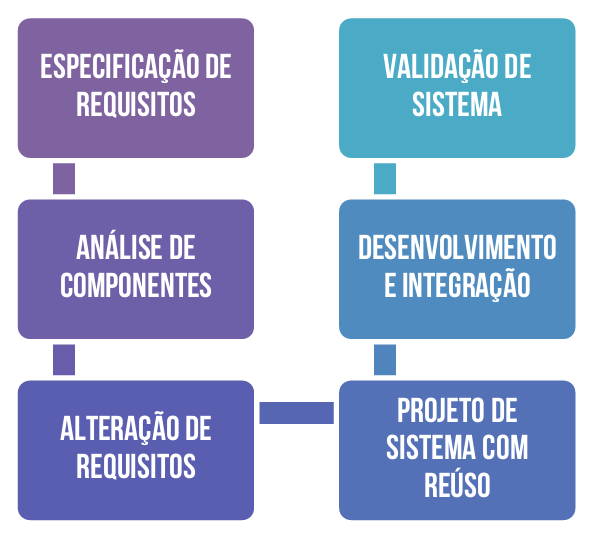

# Capítulo 10 – Modelos Específicos: Modelo Baseado em Componentes

A disciplina de Engenharia de Software carrega em seu nome uma intenção muito clara: aplicar princípios, métodos e boas práticas da Engenharia tradicional ao desenvolvimento de software. Essa proposta nasceu como resposta a um momento crítico na história da computação conhecido como a Crise do Software. A crise surgiu em 1968, quando a crescente complexidade dos sistemas de software, impulsionada pela introdução dos circuitos integrados, revelou os limites das abordagens informais e pouco sistemáticas de desenvolvimento da época. Foi nesse contexto que surgiu a Engenharia de Software, propondo uma abordagem mais estruturada, com uso de modelagens, abstrações, métricas e reuso de componentes, tudo com o objetivo de tornar o desenvolvimento de software mais previsível, seguro e eficiente.

Um dos reflexos diretos desse pensamento é o **Modelo Baseado em Componentes**, também conhecido como **Component-Based Software Engineering (CBSE)** ou, em edições mais recentes do livro de Ian Sommerville, **Modelo de Integração e Configuração**. Este modelo se baseia na ideia de que sistemas complexos podem (e devem) ser construídos a partir da integração de componentes de software reusáveis e bem definidos.

## Engenharia de Software e a Busca pela Reusabilidade

Antes de mergulharmos nos detalhes do modelo baseado em componentes, é importante compreender o contexto em que essa abordagem surgiu e por que ela é parte integrante da disciplina de Engenharia de Software. Para isso, vale a pena revisitar um evento histórico marcante: a Conferência de Engenharia de Software realizada em 1968, organizada justamente para debater a chamada Crise do Software.

A crise teve origem na crescente complexidade dos sistemas computacionais, especialmente após a introdução dos circuitos integrados. Mas atenção: essa inovação tecnológica não foi um problema em si — pelo contrário, ela abriu portas para a criação de aplicações sofisticadas e poderosas. O verdadeiro desafio estava no fato de que o desenvolvimento de software da época era informal, pouco sistemático e altamente suscetível a falhas. Como resultado, os sistemas criados frequentemente ultrapassavam orçamentos, apresentavam desempenho insatisfatório, eram difíceis de manter e pouco confiáveis.

Enquanto o custo do hardware despencava, o custo do software crescia em ritmo acelerado. Isso gerou a necessidade urgente de novas técnicas e métodos para lidar com a complexidade intrínseca aos grandes sistemas de software. Foi nesse momento que surgiu o termo **Engenharia de Software**: uma tentativa deliberada de aplicar os princípios sólidos e sistemáticos das engenharias tradicionais ao processo de desenvolvimento de sistemas computacionais.

E por que isso faz sentido? Basta lembrar que a engenharia tradicional evolui há séculos, com ênfase em projetos baseados em componentes reutilizáveis e padronizados. Raramente um engenheiro civil, por exemplo, projeta uma estrutura do zero sem aproveitar componentes previamente testados e aprovados. É justamente essa filosofia de **reuso** que está na base do **Modelo Baseado em Componentes**, o qual propõe que sistemas de software sejam construídos com blocos já existentes, reduzindo custos, acelerando entregas e aumentando a confiabilidade do produto final.

## O que é o Modelo Baseado em Componentes?

O **Modelo Baseado em Componentes**, também conhecido pela sigla **CBSE (Component-Based Software Engineering)**, é uma abordagem estratégica de desenvolvimento de software que privilegia o reúso como pilar central. Em vez de desenvolver todas as funcionalidades de um sistema do zero, o CBSE propõe a utilização de **componentes de software reutilizáveis**, previamente desenvolvidos, testados e integráveis.

Essa abordagem depende fortemente da existência de uma **biblioteca robusta de componentes reutilizáveis** e de um **framework de integração** que permita combiná-los de maneira coerente. Embora o reuso diminua os custos de desenvolvimento, os custos de **integração e teste** tendem a aumentar, pois é necessário assegurar que os componentes utilizados realmente atendam aos requisitos e sejam compatíveis entre si.

Segundo Pressman, um **componente de software** pode ser definido como um **bloco de construção modular** — uma parte do sistema que pode ser executada, implantada, padronizada e reutilizada de forma independente. Esse componente encapsula a lógica interna e expõe apenas um **conjunto de interfaces** para interação com o restante do sistema.

Por exemplo, imagine que estamos desenvolvendo um sistema de vendas online. Em vez de implementar um módulo de autenticação do zero, podemos integrar um componente de autenticação já pronto, como o Auth0. Esse componente é testado, seguro e amplamente utilizado no mercado. O mesmo vale para componentes de pagamento, geração de relatórios, envio de e-mails, entre outros.

## O que é um Componente?

De acordo com Pressman, um **componente de software** é um **bloco de construção modular, executável, implantável, independente, padronizado e reutilizável**, que encapsula uma implementação interna e expõe um conjunto de **interfaces bem definidas**. Essas interfaces são essenciais para garantir que o componente possa ser integrado com outros componentes dentro de um sistema maior, formando o que se denomina arquitetura baseada em componentes.

Um exemplo clássico é o de um componente de autenticação de usuário: ele possui funções de login, validação de senha, geração de token de acesso e expõe essas funcionalidades por meio de uma interface de programação de aplicação (API). Qualquer sistema que precise dessa funcionalidade pode reutilizar o componente, desde que respeite suas interfaces.

## Etapas do Modelo Baseado em Componentes

O processo de desenvolvimento baseado em componentes é composto por uma série de etapas interdependentes, que envolvem desde a definição de requisitos até a validação do sistema integrado. A seguir, discutimos cada uma dessas fases de forma detalhada:

  

### Especificação de Requisitos

A primeira etapa consiste em traduzir as informações coletadas na fase de análise em um **documento de requisitos de software**. Esse documento deve conter dois tipos fundamentais de requisitos:

- **Requisitos de Usuário:** descrevem, em linguagem natural, o que o usuário espera do sistema;
- **Requisitos de Sistema:** detalham, de forma técnica e estruturada, as funcionalidades e restrições que o sistema deverá obedecer.

Essa etapa é crítica para orientar a busca e seleção dos componentes que serão reutilizados no projeto.

### Análise de Componentes

Com os requisitos em mãos, inicia-se a **pesquisa por componentes** capazes de atender às funcionalidades especificadas. Nem sempre haverá uma correspondência exata entre o componente procurado e os disponíveis. Com frequência, os componentes encontrados atendem apenas parcialmente às funcionalidades desejadas, o que pode exigir adaptações ou complementações.

### Modificação de Requisitos

Os requisitos inicialmente definidos são então **revistos à luz dos componentes encontrados**. Caso haja incompatibilidades, os requisitos podem ser **modificados** para se adaptarem aos componentes disponíveis. Quando isso não é possível, pode ser necessário retornar à fase anterior e procurar alternativas que ofereçam melhor aderência às necessidades do projeto.

### Projeto de Sistema com Reúso

Nessa etapa, o framework do sistema é projetado ou, preferencialmente, reutilizado a partir de frameworks existentes. O projeto leva em consideração os componentes selecionados e suas respectivas interfaces. Caso não haja um componente adequado para determinada funcionalidade, o software necessário deverá ser projetado e desenvolvido especificamente para o sistema em questão.

### Desenvolvimento e Integração

Aqui ocorre o **desenvolvimento do software complementar** (caso necessário) e a **integração de todos os componentes**, incluindo sistemas **COTS** (Commercial Off-The-Shelf). A integração, nesse modelo, é uma parte intrínseca do desenvolvimento, e não uma atividade final separada, como em modelos mais tradicionais.

### Validação de Sistema

A última fase é a **validação**, na qual o sistema completo é testado para verificar se atende aos requisitos do cliente e às expectativas de desempenho, confiabilidade e usabilidade. Essa etapa é especialmente útil para verificar se os componentes utilizados operam de forma integrada e são compatíveis com os requisitos definidos.

## Características e Benefícios do Modelo

O modelo baseado em componentes compartilha diversas características com o modelo espiral, sendo por isso considerado **evolucionário**. Ele também é **iterativo**, permitindo que o sistema seja desenvolvido em ciclos, com a adição progressiva de funcionalidades por meio da integração de novos componentes.

Entre os principais benefícios proporcionados pela **reusabilidade** no CBSE, destacam-se:

- **Redução de custos:** menos tempo gasto em desenvolvimento do zero;
- **Aumento de qualidade:** componentes reutilizados são, em geral, bem testados e maduros;
- **Agilidade nas entregas:** menos tempo de implementação e validação;
- **Melhoria na manutenção:** componentes padronizados facilitam atualizações e correções.

Entretanto, existem também algumas **limitações importantes**. A principal delas é a **restrição à modificação de componentes comerciais prontos para uso**, os chamados **COTS (Commercial Off-The-Shelf)**, que, por não fornecerem o código-fonte, não podem ser ajustados à realidade específica do projeto. Isso impõe um limite à flexibilidade da equipe de desenvolvimento.

## Integração e Configuração: Uma Nova Visão

Na edição mais recente do livro de Ian Sommerville, o modelo baseado em componentes recebe o nome de **Integração e Configuração (I&C)**. De acordo com o autor, essa abordagem enfatiza o uso de componentes e sistemas reutilizáveis como elementos centrais do desenvolvimento. O objetivo é **configurar e integrar esses componentes** para formar sistemas personalizados.

Essa nova denominação reforça a ideia de que o papel principal do engenheiro de software, nesse contexto, é orquestrar a montagem de um sistema por meio de peças pré-existentes, realizando as adaptações necessárias para garantir a coesão, a consistência e a performance esperada.

## Considerações Finais

O Modelo Baseado em Componentes representa uma evolução significativa na forma como desenvolvemos software, pois oferece uma alternativa viável ao desenvolvimento tradicional ao colocar o **reuso** no centro da estratégia de engenharia. Essa abordagem responde diretamente à necessidade de controlar a complexidade, reduzir custos e acelerar a entrega de soluções confiáveis em um mercado cada vez mais competitivo.

A analogia com outras engenharias não é mera coincidência: assim como engenheiros civis e mecânicos constroem sistemas a partir de peças padronizadas, os engenheiros de software podem — e devem — adotar práticas semelhantes, promovendo o reuso de componentes robustos e bem definidos. Com isso, a Engenharia de Software se aproxima de seu ideal original: criar soluções complexas de forma **sistemática**, **controlada** e **eficiente**, tal como qualquer outro ramo da engenharia madura.
