# Capítulo 12 – Modelo Iterativo e Incremental: Rational Unified Process (RUP)

### Um Breve Contexto Histórico: A Origem do RUP

No início da década de 1990, o cenário do desenvolvimento de software vivia uma efervescência teórica e prática, especialmente no que diz respeito à orientação a objetos e à necessidade de processos mais robustos e estruturados. Foi nesse contexto que surgiu a Rational Software Corporation, uma empresa localizada na Califórnia (EUA), que acabaria por se tornar um dos principais polos de inovação em engenharia de software.

Dentro da Rational, três grandes nomes da área passaram a colaborar ativamente: **Grady Booch**, **Jim Rumbaugh** e **Ivar Jacobson**. Apelidados informalmente de **The Three Amigos**, esses engenheiros não apenas desenvolveram contribuições fundamentais nas suas respectivas áreas – Análise e Projeto Orientados a Objetos (Booch), Modelagem de Objetos (Rumbaugh) e Processos de Software Orientados a Objetos (Jacobson) – como também protagonizaram a criação de uma das linguagens de modelagem mais influentes do século XX: a **UML – Unified Modeling Language**.

A convivência e a troca de experiências entre esses profissionais resultaram na identificação de um conjunto de **boas práticas** comuns e eficazes no processo de desenvolvimento de software. A partir da tentativa de integrar essas práticas em um processo coeso e padronizado, surgiu o **Processo Unificado**, que, por ter sido desenvolvido dentro da Rational, passou a ser conhecido como **Rational Unified Process (RUP)**.

Em 2003, a IBM adquiriu a Rational e passou a manter, distribuir e oferecer suporte e consultoria para o RUP. Desde então, também passou a ser comum encontrar o nome **IRUP – IBM Rational Unified Process** como sinônimo. Ainda assim, o termo “RUP” permanece mais amplamente utilizado. Cabe mencionar que surgiram outras variações do Processo Unificado, como o **Agile Unified Process (AUP)** de Scott Ambler e o **Open Unified Process (OpenUP)**, mantido pela Eclipse Foundation, que representam adaptações com diferentes enfoques.

### Entendendo a Essência do RUP

O **Rational Unified Process** é um **framework iterativo e incremental de desenvolvimento de software**, com características marcantes que o distinguem de outros modelos. Em sua definição mais clássica, o RUP é descrito como:

> **Um framework iterativo e incremental, centrado na arquitetura, planejado por riscos, guiado por casos de uso e orientado a objetos.**

Cada uma dessas características é essencial para entender como o RUP opera na prática.

Outro ponto importante é que o RUP é **exclusivamente voltado para o desenvolvimento de software**. Não se trata de um processo para projetos de hardware, nem de um processo de gerenciamento de projetos em sentido amplo. Toda a sua estrutura está orientada à produção de soluções de software com alta qualidade, desde a concepção até a entrega.

Vale ressaltar que a missão do RUP é clara: **garantir a produção de software de alta qualidade, que atenda às necessidades dos usuários, dentro de prazos e orçamentos previsíveis**. Essa meta orienta todas as fases do processo e está presente em todas as disciplinas definidas no modelo.

Esse foco simultâneo em qualidade, satisfação do cliente, previsibilidade e controle de custos é um dos grandes diferenciais do RUP em relação a outras abordagens.

#### RUP como Framework Adaptável

Antes de mais nada, é fundamental compreender que o RUP é um **framework**, ou seja, **um arcabouço estruturado de melhores práticas**. Não se trata de um processo rígido e fechado, mas sim de uma **plataforma adaptável** que pode ser configurada para atender às necessidades específicas de diferentes projetos e organizações.

A analogia com a instalação de softwares como o Microsoft Office é bastante pertinente: ao instalar o Office, o usuário pode escolher quais componentes utilizar – Word, Excel, PowerPoint, Outlook etc. Da mesma forma, no RUP, é possível selecionar quais disciplinas, artefatos e atividades serão aplicados, de acordo com a realidade do projeto.

Essa **capacidade de configuração** é um dos grandes trunfos do RUP, permitindo que ele seja utilizado tanto de forma completa quanto de maneira enxuta, quando adequado.

Frequentemente, o RUP é classificado como uma **metodologia pesada**. Mas o que isso significa, exatamente?

O termo “pesado” refere-se à sua **estrutura formal, à grande quantidade de documentos, à presença de papéis bem definidos e à alta cerimônia nos processos**. Essa característica é percebida de forma mais evidente quando o RUP é implementado em sua totalidade, sem customizações.

Entretanto, é fundamental destacar que **o RUP é altamente adaptável**. A organização pode utilizar apenas os elementos mais relevantes para seu contexto, ajustando o framework para torná-lo mais “leve”, mais ágil e mais eficiente.

#### Iteratividade e Incrementalidade

O RUP é **iterativo** e **incremental**. A **incrementalidade** refere-se à entrega do sistema em partes, isto é, cada entrega adiciona funcionalidades ao produto final. Já a **iteratividade** indica que essas partes são desenvolvidas **de forma cíclica**, passando por sucessivos refinamentos.

Por exemplo, imagine o desenvolvimento de um sistema bancário. Em uma primeira iteração, pode-se implementar o módulo de cadastro de clientes. Em uma segunda, aprimora-se esse módulo e adiciona-se o módulo de contas correntes. Em uma terceira, integram-se os módulos anteriores e adiciona-se o módulo de investimentos, e assim por diante. A cada iteração, o sistema é evoluído e melhorado.

Vale destacar que, **embora o RUP compartilhe essa estrutura com os métodos ágeis**, ele **não é um framework ágil**. Todos os métodos ágeis são iterativos e incrementais, mas nem todos os métodos iterativos e incrementais são, necessariamente, ágeis. O RUP, nesse sentido, pertence a uma **categoria distinta**, mais formal e estruturada.

#### Centrado na Arquitetura

O RUP é **centrado na arquitetura**, ou seja, toda a base do desenvolvimento se apoia em uma **estrutura robusta e bem definida do sistema**. A arquitetura de software pode ser compreendida como a **macroestrutura do sistema**, o esqueleto que sustenta todos os componentes.

Podemos compará-la à estrutura de um prédio: pode-se modificar a pintura, o acabamento, as janelas ou os móveis, mas não se pode remover uma coluna estrutural sem comprometer a integridade da edificação. No RUP, a construção da arquitetura ocorre nas fases iniciais, com o objetivo de **garantir estabilidade** ao longo de todo o processo.

Mais ainda: essa arquitetura deve ser **flexível o suficiente** para permitir incrementos em cada iteração. Ou seja, o núcleo do sistema é planejado com antecedência, mas já antevendo as mudanças e ampliações futuras.

#### Planejado por Riscos

Um dos pilares do RUP é o **planejamento baseado em riscos**. Isso significa que os **riscos mais críticos e complexos são identificados e tratados o mais cedo possível** no ciclo de desenvolvimento. Em outras palavras, o RUP direciona os esforços iniciais para as partes do sistema que apresentam maior incerteza técnica, maior impacto nos negócios ou maior dificuldade de implementação.

Por exemplo, se um sistema depende de integração com um hardware novo e pouco testado, essa funcionalidade será tratada nas primeiras iterações, para que seus riscos sejam mitigados antes que se tornem obstáculos intransponíveis no final do projeto.

#### Guiado por Casos de Uso

Outra característica essencial do RUP é ser **guiado por casos de uso**. Isso significa que a principal técnica de **levantamento e especificação de requisitos** adotada é a **modelagem de casos de uso**, técnica essa amplamente difundida e padronizada na UML.

Desde as fases iniciais do projeto, os casos de uso são utilizados como base para diversas atividades: definição dos requisitos, especificação do comportamento do sistema, planejamento de testes, desenvolvimento de código e validação de funcionalidades.

Como exemplo, imagine o caso de uso “Emitir Fatura”. A partir desse caso de uso, os desenvolvedores saberão quais funcionalidades implementar, os testadores saberão quais cenários validar e os analistas de requisitos saberão que funcionalidades revisar com o cliente. Trata-se de um elemento central que **alinha todos os envolvidos** no desenvolvimento.

#### Orientado a Objetos

Por fim, o RUP é **orientado a objetos**, o que significa que ele adota esse paradigma como base para **análise, projeto e implementação do sistema**. Classes, objetos, herança, polimorfismo e encapsulamento são conceitos fundamentais em todas as fases do processo.

Isso está em plena consonância com a origem do RUP, uma vez que seus criadores foram pioneiros na modelagem orientada a objetos e na definição da própria UML.

### Problemas que Motivaram o Surgimento do RUP

O RUP não surgiu por acaso. Ele foi desenvolvido como uma **resposta a diversos problemas recorrentes** observados em projetos tradicionais de software. Entre os principais, destacam-se:

- **Necessidades não atendidas**: em muitos projetos, os requisitos definidos não correspondiam às reais necessidades dos usuários, devido à ausência de validação adequada.
- **Requisitos instáveis**: os processos tradicionais assumiam que os requisitos eram imutáveis, o que raramente se verifica na prática. O RUP incorpora o entendimento de que os requisitos evoluem.
- **Falhas na integração de módulos**: o desenvolvimento modularizado sem integração contínua levava a problemas sérios no momento da junção dos componentes.
- **Dificuldades de manutenção**: a falta de padronização e documentação dificultava a manutenção e a evolução do software ao longo do tempo.
- **Descoberta tardia de falhas**: a validação tardia dos requisitos gerava retrabalho e custos elevados quando problemas eram descobertos no final do ciclo de vida.
- **Baixa qualidade percebida pelo usuário**: muitas vezes, os usuários envolvidos na validação eram inexperientes ou não representavam de fato as necessidades do negócio.
- **Problemas de desempenho**: mesmo quando os requisitos eram atendidos, o desempenho do sistema podia ser insatisfatório devido à ausência de testes adequados de performance.
- **Esforço descoordenado entre as equipes**: a falta de alinhamento e comunicação entre os membros do projeto gerava retrabalho, redundância e baixa produtividade.

## Perspectivas do RUP

O Rational Unified Process (RUP) pode ser descrito sob três diferentes perspectivas, cada uma oferecendo uma visão específica sobre o processo de desenvolvimento de software. Essas perspectivas se complementam e fornecem uma compreensão ampla e estruturada do funcionamento do RUP.

|**Perspectiva**|**Descrição**|
|---|---|
|**Dinâmica**|Também conhecida como **temporal** ou **horizontal**, apresenta as fases do modelo ao longo do tempo, incluindo as **iterações** e os **marcos** do projeto.|
|**Estática**|Também chamada de **funcional** ou **vertical**, descreve os **componentes** do processo, como **atividades, disciplinas, artefatos** e **papéis**.|
|**Prática**|Aborda um conjunto de **boas práticas recomendadas** para a execução do processo. Essa perspectiva não é reconhecida por todos os autores, mas é amplamente adotada como suporte complementar.|

A maior parte das representações gráficas do RUP busca combinar as perspectivas **estática** e **dinâmica** em um **único diagrama**, permitindo uma visão integrada e intuitiva do processo. Um exemplo clássico disso é o **Gráfico de Baleias**, ilustrado a seguir:

  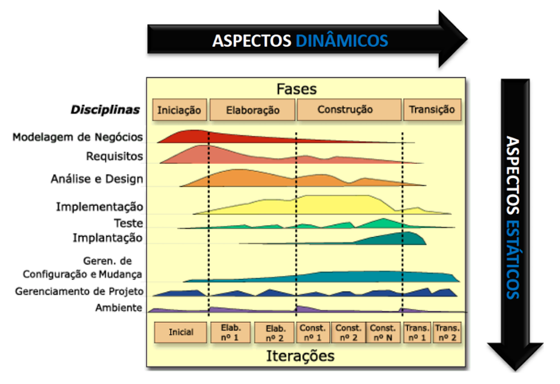

Esse gráfico é uma representação **abstrata** (de alto nível) da organização do RUP, unindo elementos das três perspectivas em uma única visualização. Vamos compreender melhor como cada uma dessas perspectivas se manifesta nesse gráfico.

### Perspectiva Dinâmica

A perspectiva dinâmica trata dos elementos que se desenvolvem **ao longo do tempo**. No Gráfico de Baleias, essa perspectiva é representada por:

- **Fases**: aparecem na parte **superior** do gráfico. São discretas, sequenciais e indicam os principais momentos do projeto.
- **Iterações**: localizadas na parte **inferior**, representam os ciclos de desenvolvimento que ocorrem dentro de cada fase. Diferente das fases, as iterações podem ocorrer em paralelo ou se sobrepor.
- **Marcos**: indicados por **linhas pontilhadas verticais**, marcam a transição entre as fases e indicam que objetivos importantes foram atingidos.

As quatro fases do RUP são **sequenciais**, ou seja, uma inicia **apenas após** o término da anterior. Entretanto, as **iterações** dentro dessas fases podem **variar em quantidade** e até mesmo ocorrer de forma sobreposta, de acordo com a complexidade e os objetivos do projeto.

Um ponto importante sobre essa perspectiva é que ela permite **controlar o avanço do projeto** por meio dos marcos. Cada fase termina com um marco específico que sinaliza o cumprimento de critérios bem definidos.

### Perspectiva Estática

A perspectiva estática trata de **elementos estruturais do processo**, que **não mudam com o tempo**. Isso inclui:

- **Papéis**: responsabilidades atribuídas aos membros da equipe.
- **Atividades**: ações ou tarefas a serem executadas.
- **Artefatos**: produtos de trabalho gerados ou utilizados durante o processo.
- **Fluxos de trabalho**: sequência organizada de atividades relacionadas a uma disciplina específica.

Quando dizemos que essa perspectiva é “independente do tempo”, estamos dizendo que **esses elementos permanecem os mesmos** ao longo de todo o processo, independentemente da fase em que o projeto se encontra.

Um equívoco comum em avaliações é afirmar, por exemplo, que "não há atividades de implementação na fase de iniciação". Isso **não é verdade**. O gráfico de baleias mostra a **intensidade** das disciplinas ao longo do tempo — não a ausência. Assim, **todas as atividades ocorrem durante todas as fases**, mas com **diferentes intensidades**.

### Perspectiva Prática

A terceira perspectiva do RUP trata das **práticas recomendadas** para o desenvolvimento de software. Embora nem todos os autores a incluam como uma perspectiva formal, ela é **fundamental para orientar a aplicação efetiva do modelo**.

As práticas mais conhecidas incluem:

- Desenvolver o software iterativamente;
- Gerenciar requisitos;
- Utilizar arquitetura baseada em componentes;
- Modelar visualmente;
- Verificar a qualidade continuamente;
- Controlar mudanças no software.

Essas práticas funcionam como **diretrizes** para que o processo seja conduzido de forma eficaz, mantendo foco na qualidade, na adaptabilidade e na entrega contínua de valor.

## Conceitos Fundamentais do RUP

Antes de avançarmos para o estudo detalhado das fases e disciplinas do RUP, é importante compreender alguns **conceitos estruturantes** que dão sustentação a todo o modelo. Esses conceitos não costumam aparecer em provas diretamente, mas aparecem com frequência em **questões situacionais**.

### Processo

No RUP, **um processo** é definido como a descrição de **quem faz o quê, como e quando**, com o objetivo de alcançar um resultado específico. Essa definição implica uma **organização clara de papéis, atividades e produtos**.

### Papel (Role)

Um **papel** representa uma **função abstrata** dentro do processo. Ele define as **responsabilidades** e **comportamentos esperados** de uma pessoa (ou grupo de pessoas) no desenvolvimento do software.

> ⚠️ **Importante:** Um papel **não é sinônimo de pessoa!** Uma mesma pessoa pode exercer **vários papéis**, e um mesmo papel pode ser assumido por **múltiplas pessoas**.

Exemplos de papéis no RUP:

- Analista de testes
- Especificador de requisitos
- Arquiteto de software
- Desenvolvedor
- Gerente de projeto

O RUP define formalmente **32 papéis distintos**, que podem ser combinados de acordo com o porte e a complexidade do projeto.

### Atividade (Activity)

Uma **atividade** é uma **unidade de trabalho com propósito definido**, cuja execução gera um **resultado significativo** no projeto. As atividades geralmente **consomem ou produzem artefatos** e estão fortemente ligadas aos papéis.

Por exemplo, o papel de Especificador de Requisitos realiza a atividade “Detalhar Caso de Uso”, que resulta no artefato “Descrição do Caso de Uso”.

### Artefato (Artifact)

Artefatos são os **produtos tangíveis** gerados ou utilizados ao longo do processo. Eles podem ser documentos, modelos, diagramas, ou até mesmo componentes de software.

> ➕ Também são chamados de **Produtos de Trabalho** (**Work Products**).

Os artefatos são usados como **entradas e saídas das atividades**, compondo o núcleo da documentação e do controle do projeto.

|**Artefato**|**Descrição**|
|---|---|
|Documento de Visão|Apresenta uma visão geral do projeto para os stakeholders.|
|Casos de Negócio|Avalia a viabilidade do projeto do ponto de vista do investimento.|
|Plano de Desenvolvimento de Software|Contém todas as informações necessárias para o gerenciamento do projeto.|
|Modelo de Casos de Uso|Define as funcionalidades do sistema sob o ponto de vista do usuário.|
|Glossário|Padroniza e define os termos usados ao longo do projeto.|
|Protótipos|Usados para explorar e reduzir riscos.|
|Lista de Riscos|Lista priorizada de riscos e estratégias de mitigação.|
|Documento de Arquitetura de Software|Visão geral dos aspectos arquiteturais do sistema.|
|Modelo de Projeto|Representa as classes e componentes que implementam os casos de uso.|
|Modelo de Dados|Subconjunto do modelo de implementação que descreve a representação lógica e física dos dados.|
|Conjunto de Testes|Agrupamento de testes para verificar a estabilidade de versões.|
|Notas de Release|Documentam mudanças, correções e novidades de cada release.|
|Artefatos de Instalação|Instruções e componentes necessários para instalar o software.|
|Materiais de Treinamento|Documentos usados para treinar usuários finais e equipes.|

### Fluxo de Trabalho (Workflow)

Fluxo de trabalho é a **sequência lógica de atividades** relacionadas a uma **disciplina específica** do processo. Cada disciplina do RUP — como requisitos, análise e projeto, testes, implantação — possui seus próprios fluxos de trabalho organizados e bem definidos.

## Princípios-Chave do RUP

O RUP não é apenas uma coleção de fases, disciplinas e atividades. Ele também é orientado por um conjunto de **princípios fundamentais**, que servem como **diretrizes estratégicas** para o desenvolvimento de software. Esses princípios devem ser levados em consideração em todas as etapas do projeto e são essenciais para alcançar os objetivos de qualidade, eficiência e valor para os stakeholders. A seguir, apresentamos os **seis princípios-chave do RUP**, acompanhados de explicações e exemplos práticos.

### Adaptar o Processo

Embora o RUP seja frequentemente classificado como um framework “pesado”, essa percepção não é totalmente justa. O RUP é, na verdade, um **framework flexível e configurável**. Ele pode ser ajustado para atender às necessidades específicas de diferentes projetos, organizações e contextos.

Por exemplo, grandes sistemas corporativos, como um software para o controle do tráfego aéreo, exigem uma configuração mais robusta e completa do RUP. Já projetos menores, como o desenvolvimento de um sistema de gerenciamento para uma padaria, podem se beneficiar de versões mais enxutas, como o **RUP for Small Projects** ou o **OpenUP**, uma variação mais leve e ágil do RUP.

Além disso, o RUP pode ser configurado com base em práticas já consagradas e adaptadas ao porte e às características do projeto. Essa adaptabilidade é essencial para tornar o processo **eficaz sem se tornar excessivamente burocrático**.

### Balancear as Prioridades dos Interessados

No levantamento de requisitos, é comum surgirem conflitos de interesse entre diferentes stakeholders. Por exemplo, um usuário pode desejar uma funcionalidade altamente personalizada, enquanto o gestor do projeto está preocupado com os prazos e os custos. Além disso, podem ocorrer divergências dentro da própria equipe ou entre diferentes departamentos sobre o que é mais importante.

Essas situações são complexas e exigem habilidade para encontrar **compromissos e consensos**. O RUP orienta que o desenvolvimento de software deve **equilibrar as prioridades dos diversos interessados**, considerando fatores como custo, prazo, desempenho, reutilização e escalabilidade.

Uma boa prática nesse sentido é **evitar personalizações excessivas**, que tendem a aumentar a complexidade, o custo e o tempo de desenvolvimento. Em vez disso, **padronizar funcionalidades** e **reutilizar componentes** pode ser uma solução mais eficaz.

Por exemplo, suponha que duas áreas de uma empresa queiram relatórios diferentes. Em vez de desenvolver dois módulos distintos, é possível criar um módulo padrão com filtros personalizáveis, atendendo ambas as áreas com menor esforço.

### Colaboração entre Times

A colaboração entre equipes é um pilar central do RUP. Os projetos são desenvolvidos por times multidisciplinares, e o sucesso do projeto depende diretamente da **comunicação eficiente e da cooperação entre os membros da equipe**.

O RUP sugere que as equipes sejam organizadas com base nas **habilidades e experiências individuais**. Profissionais mais experientes podem apoiar os menos experientes, promovendo **trocas de conhecimento e boas práticas**.

Além disso, a **harmonia e o alinhamento entre as equipes** de desenvolvimento, testes, análise e gestão são fundamentais para evitar retrabalho, reduzir falhas de comunicação e aumentar a produtividade.

### Demonstrar o Valor da Iteratividade

O RUP é um processo iterativo e incremental. Isso significa que o desenvolvimento ocorre em **ciclos curtos**, com entregas parciais e frequentes, permitindo feedback contínuo.

Esse princípio enfatiza que a **iteratividade permite maior flexibilidade** na gestão de mudanças e **reduz os riscos** do projeto. Ao tratar os riscos mais críticos logo nas primeiras iterações, a equipe constrói uma arquitetura sólida desde o início e melhora a previsibilidade do projeto.

Além disso, a iteração contínua facilita a **adaptação do projeto a novas necessidades**, melhora a comunicação com os stakeholders e proporciona entregas de valor mais rápido.

### Elevar o Nível de Abstração

A complexidade é uma das maiores inimigas do sucesso em projetos de software. O RUP defende que se deve **elevar o nível de abstração sempre que possível**, para reduzir essa complexidade e tornar o processo mais compreensível, comunicável e gerenciável.

Isso pode ser feito por meio de práticas como:

- Reutilização de componentes e artefatos.
- Uso de ferramentas de automação.
- Adoção de frameworks, middlewares e plataformas opensource.
- Modelagem com linguagens de alto nível, como a **UML**.
- Evitar documentação excessiva e desnecessária, principalmente em nível de baixo detalhe.

Por exemplo, em vez de descrever em detalhes a estrutura de dados de cada módulo em documentos separados, use diagramas UML para representar as relações entre classes de forma mais visual e de alto nível.

Essa abordagem também facilita a comunicação com os stakeholders, permitindo que até mesmo usuários finais consigam compreender os aspectos essenciais do sistema em desenvolvimento.

### Foco Contínuo na Qualidade

Ao contrário de outras abordagens, o RUP **não trata a qualidade como uma fase isolada** do processo. A qualidade deve ser **incorporada em todas as fases e disciplinas**, desde a concepção do sistema até a sua implantação.

Todos os membros da equipe – analistas, desenvolvedores, testadores, gerentes – são **responsáveis pela qualidade** do produto. A disciplina de testes, por exemplo, contribui com a validação, mas **não detém sozinha a responsabilidade pela qualidade**.

O foco contínuo na qualidade significa que:

- Os requisitos devem ser bem definidos desde o início.
- O código deve ser escrito e revisado com atenção à qualidade.
- Os testes devem ser planejados e executados desde as primeiras iterações.
- A arquitetura deve suportar a escalabilidade, manutenabilidade e desempenho.

## Melhores Práticas do RUP

Ao longo deste capítulo, discutimos as principais estruturas do RUP, abordando suas fases, disciplinas e princípios-chave. Entretanto, há ainda uma dimensão fundamental a ser considerada: as **melhores práticas** recomendadas pelo RUP.

Segundo o autor Ian Sommerville, essas práticas podem ser compreendidas como uma **terceira perspectiva** do RUP, somando-se às duas já conhecidas: a **perspectiva estática** (baseada em disciplinas) e a **perspectiva dinâmica** (baseada nas fases). Essa visão é apresentada pelo autor como uma forma prática de compreender os pilares que sustentam a aplicação eficaz do RUP em projetos reais. Embora essa classificação não seja oficial da IBM Rational, é amplamente aceita na literatura acadêmica e profissional por seu valor didático.

A seguir, exploraremos as seis melhores práticas do RUP, consideradas fundamentais para o sucesso de projetos de software.

### Desenvolvimento Iterativo

O **desenvolvimento iterativo** é uma das práticas centrais do RUP e constitui a espinha dorsal de seu modelo de ciclo de vida. Um projeto que adota o desenvolvimento iterativo não é conduzido em um único bloco de atividades sequenciais, mas sim por meio de **várias iterações**.

Cada iteração inclui atividades de **modelagem de negócios, levantamento de requisitos, análise, projeto, implementação, testes e implantação**, com maior ou menor intensidade dependendo da fase do projeto. Ao final de cada iteração, é gerado um _build_ funcional, ou seja, uma versão executável do sistema, que pode ser testada, validada e apresentada aos usuários.

Essa prática possibilita a **incorporação progressiva de requisitos**, melhora a **compreensão do domínio do problema**, permite a **identificação e mitigação antecipada de riscos**, além de promover uma **evolução arquitetural contínua** do sistema.

### Gerenciamento de Requisitos

O **gerenciamento de requisitos** é uma abordagem sistemática para **levantar, documentar, organizar, acompanhar e modificar** requisitos ao longo de todo o ciclo de vida do projeto.

No RUP, requisito é definido como uma **condição ou capacidade que o sistema deve satisfazer**. Essa prática assegura que todos os requisitos estejam **verificados e validados**, garantindo que o sistema entregue realmente atenda às necessidades dos usuários.

Além disso, o gerenciamento de requisitos prevê o **rastreamento de dependências** entre eles. Isso é essencial, pois muitos requisitos impactam outros. Assim, ao ocorrer alguma alteração em um requisito, o impacto pode ser identificado e gerenciado de forma eficaz.

### Uso da Arquitetura de Componentes

O RUP enfatiza o uso de uma **arquitetura baseada em componentes**, onde o sistema é construído a partir de blocos coesos e bem encapsulados de funcionalidade. Esses componentes podem ser:

- Código-fonte reutilizável
- Bibliotecas de terceiros
- Módulos executáveis
- Web services ou APIs

Cada componente possui **interfaces bem definidas** e **comportamentos esperados**, sendo possível substituí-los ou atualizá-los com mínimo impacto nas demais partes do sistema. Essa prática favorece a **modularidade, a escalabilidade e a manutenção** do software, além de facilitar o **reuso** de soluções já existentes.

### Modelagem Visual (UML)

A prática da **modelagem visual** no RUP consiste no uso de **notações gráficas e textuais** para representar o sistema de maneira mais compreensível e estruturada. A principal linguagem adotada é a **UML (Unified Modeling Language)**.

A UML fornece uma **notação padronizada**, com sintaxe e semântica rigorosas, permitindo:

- Maior **clareza e comunicação entre os membros da equipe**
- **Validação e revisão dos modelos** antes da implementação
- Redução de **ambiguidades** na descrição dos requisitos e do projeto

Ao permitir que o projeto seja pensado de forma **abstrata e visual**, a modelagem facilita o entendimento do sistema tanto para desenvolvedores quanto para analistas, testadores e partes interessadas.

### Contínua Verificação da Qualidade

A **qualidade** no RUP não é uma responsabilidade isolada de uma única equipe ou fase. Ao contrário, ela deve ser **incorporada em todas as atividades e por todos os membros da equipe**. Essa prática é chamada de **verificação contínua da qualidade**.

O RUP promove o planejamento da qualidade desde o início do projeto, com foco em:

- Testes automatizados e regressivos
- Revisões e inspeções técnicas
- Métricas de qualidade
- Boas práticas de codificação e integração contínua

Dessa forma, evita-se a concentração de atividades de verificação no final do projeto e garante-se um nível mais alto de confiabilidade desde os primeiros incrementos do software.

### Gerenciamento de Mudanças

Mudanças são **inevitáveis** em qualquer projeto de software. Elas podem ocorrer devido a:

- Evolução dos requisitos
- Necessidades de mercado
- Problemas técnicos imprevistos
- Solicitações dos usuários

O RUP prevê uma prática sólida de **gerenciamento de mudanças**, que inclui:

- Mecanismos para **controlar e documentar mudanças**
- Ferramentas para **rastrear e monitorar solicitações**
- Estruturas organizacionais como o **Controle de Configuração e Gerenciamento de Versão**
- **Espaços de trabalho isolados**, para garantir que mudanças em partes do sistema não impactem negativamente outras partes

Essa prática é especialmente eficaz em **arquiteturas baseadas em componentes**, em que mudanças locais podem ser realizadas com impacto mínimo no restante da aplicação.

## Fases do RUP

O RUP é um framework de processo de desenvolvimento de software estruturado em **quatro fases sequenciais e bem definidas**: Iniciação, Elaboração, Construção e Transição. Ao contrário do modelo cascata, no qual as fases correspondem diretamente às atividades técnicas do processo, no RUP as fases estão mais relacionadas à **maturidade do negócio** e aos **marcos de projeto** do que a atividades técnicas específicas.

Cada fase é delimitada por **dois marcos principais**, que indicam o início e o fim de um estágio lógico do projeto. Dentro de cada fase, ocorrem **várias iterações**, nas quais o processo é executado de maneira incremental e evolutiva. A seguir, exploramos cada uma das fases do RUP com seus objetivos, atividades básicas e artefatos relevantes.

### Fase de Iniciação (ou Concepção)

Esta fase tem como principal objetivo **estabelecer um caso de negócio viável para o sistema**. Nela, é realizada uma análise inicial dos objetivos, das partes interessadas e das necessidades que justificam o projeto. Além disso, são identificadas as entidades externas que interagirão com o sistema, bem como suas respectivas interações.

Se, ao fim da fase de iniciação, for verificado que o projeto **não apresenta viabilidade comercial, técnica ou estratégica**, é possível que ele seja **cancelado ou reavaliado** antes do avanço para as próximas fases.

**Atividades Básicas da Iniciação**:

- Formular o escopo do projeto;
- Planejar e preparar um caso de negócio;
- Esboçar uma arquitetura inicial do sistema;
- Preparar o ambiente para o projeto.

**Artefatos Relevantes**:

- Documento de Visão;
- Casos de Negócio;
- Plano de Desenvolvimento de Software;
- Modelo de Casos de Uso (inicial);
- Glossário de termos.

### Fase de Elaboração

Na fase de Elaboração, o foco principal é **compreender o domínio do problema e estabelecer uma arquitetura robusta** para o sistema. É a fase em que ocorre uma análise mais profunda dos requisitos e na qual são identificados os principais riscos técnicos e de negócio. Essa fase também visa produzir um plano mais detalhado para o desenvolvimento e definir as bases para a construção do software.

**Atividades Básicas da Elaboração**:

- Definir, validar e estabelecer a baseline da arquitetura;
- Refinar o Documento de Visão com base nos requisitos;
- Criar planos de iteração detalhados para a fase de construção;
- Refinar os casos de uso mais críticos;
- Identificar e planejar estratégias para mitigar os riscos principais.

**Artefatos Relevantes**:

- Protótipos;
- Lista de Riscos;
- Documento de Arquitetura de Software;
- Modelo de Projeto;
- Modelo de Dados.

### Fase de Construção

A fase de Construção é dedicada à **implementação completa e integrada das funcionalidades do sistema**, com foco em garantir desempenho, qualidade e robustez. Essa fase envolve atividades intensas de codificação, testes, integração de componentes e desenvolvimento da documentação de suporte. Ao final, o sistema deve estar funcional e pronto para ser entregue aos usuários ou para testes no ambiente real.

**Atividades Básicas da Construção**:

- Gerenciar recursos e otimizar o controle do processo de desenvolvimento;
- Implementar completamente os componentes de software;
- Realizar testes baseados nos critérios de aceitação;
- Produzir versões (builds) intermediárias do sistema com casos de uso implementados.

**Artefatos Relevantes**:

- Sistema executável (ou builds parciais);
- Bibliotecas e componentes desenvolvidos;
- Conjunto de testes automatizados e manuais;
- Materiais de treinamento e suporte ao usuário.

### Fase de Transição

A fase de Transição é voltada à **entrega do sistema aos usuários finais**, colocando-o em operação no ambiente de produção. Trata-se da fase de **implantação**, onde o sistema é validado em campo, treinamentos são ministrados e o feedback dos usuários é recolhido para ajustes finais.

**Atividades Básicas da Transição**:

- Executar os planos de implantação do sistema;
- Finalizar a documentação e o material de suporte ao usuário;
- Testar o produto em ambiente real (validação final);
- Criar o release definitivo do produto;
- Coletar e analisar o feedback dos usuários;
- Realizar ajustes no sistema conforme necessário;
- Disponibilizar o produto para os usuários finais.

**Artefatos Relevantes**:

- Notas de Release;
- Artefatos de Instalação;
- Documentação final do sistema.

### Observações Importantes

É importante destacar que os **artefatos do RUP estão associados às disciplinas, e não diretamente às fases**. Por esse motivo, pode haver confusão sobre "a qual fase pertence determinado artefato". Na realidade, muitos artefatos **são utilizados ou refinados em várias fases**, pois acompanham a evolução do projeto.

Por exemplo, o **manual de treinamento** e o **manual de suporte do usuário** são planejados na Elaboração, mas finalizados apenas na Construção. Ambos pertencem à disciplina de **Implantação**, que pode atravessar diversas fases do ciclo de vida.

Além disso, o RUP é um framework altamente configurável. Existem variações do RUP voltadas para diferentes contextos, como o **RUP for Small Projects**, que adapta o processo para projetos de menor porte, reduzindo a complexidade e o número de artefatos.

## Marcos de Projeto

Cada fase do RUP é encerrada por um **marco**, que representa um ponto de controle fundamental no ciclo de vida do software. Esses marcos fornecem evidências concretas de que a fase foi concluída com sucesso e que o projeto pode prosseguir para a próxima etapa.

|Fase|Marco Principal|
|---|---|
|Iniciação|Escopo ou objetivos do ciclo de vida|
|Elaboração|Arquitetura estabilizada|
|Construção|Capacidade operacional inicial|
|Transição|Lançamento (release) do produto|

**Arquitetura estabilizada** é o marco mais crítico da fase de Elaboração. Pode-se pensar nela como o **esqueleto** do sistema — uma estrutura básica que sustenta os componentes principais, define as interfaces e estabelece as diretrizes para o desenvolvimento. Se essa arquitetura for mal definida, o projeto poderá desmoronar nas fases seguintes.

**Capacidade operacional inicial** marca a entrega de uma versão funcional do sistema, que já permite testes com usuários e feedback inicial. Frequentemente, esse estágio é representado por uma **versão beta** do sistema.

**Lançamento do produto**, por sua vez, é o marco final e representa a entrega oficial do software aos usuários finais, com a documentação completa e o suporte necessário.

## Gerenciamento de Riscos no RUP

O gerenciamento de riscos é uma atividade **transversal a todo o projeto**, embora esteja formalmente inserida na disciplina de **Gerência de Projeto**. O papel do gerente de projeto é fundamental na **identificação, avaliação, mitigação e monitoramento de riscos**.

As **principais estratégias de gerenciamento de riscos** são:

- **Prevenção de Riscos**: reorganizar o projeto para eliminar o risco;
- **Transferência de Riscos**: repassar o risco a terceiros;
- **Aceitação de Riscos**: monitorar o risco e preparar um plano de contingência.

Ao aceitar um risco, devem-se adotar duas posturas:

- **Mitigação**: ações para reduzir a probabilidade ou o impacto;
- **Plano de Contingência**: ações planejadas caso o risco se concretize.

Além disso, é importante distinguir:

- **Riscos Diretos**: passíveis de controle direto;
- **Riscos Indiretos**: não podem ser diretamente controlados.

Tipos comuns de risco:

- Riscos de Recursos;
- Riscos de Negócio;
- Riscos Técnicos;
- Riscos de Programação.

## Disciplinas do RUP

Após explorarmos os fundamentos, fases e características do Rational Unified Process (RUP), chegamos agora à última parte deste capítulo: as disciplinas. As disciplinas representam os grandes agrupamentos de atividades dentro do processo unificado. Elas orientam os trabalhos realizados pelas equipes ao longo de cada iteração e fase do projeto.

O RUP define **nove disciplinas principais**, sendo **seis disciplinas de engenharia** e **três disciplinas de apoio** (ou infraestrutura). A seguir, abordaremos cada uma delas em detalhes, destacando suas finalidades, principais atividades, artefatos produzidos e papéis envolvidos.

### Modelagem de Negócios

A disciplina de Modelagem de Negócios busca entender a estrutura e a dinâmica da organização onde o sistema será implantado, com o objetivo de identificar problemas, propor melhorias e alinhar os desenvolvedores ao contexto organizacional. Os processos de negócios são representados por meio de **casos de uso de negócios**, o que permite derivar requisitos diretamente das necessidades institucionais.

**Finalidades**:

- Compreender a organização-alvo onde o sistema será implantado;
- Identificar problemas atuais e oportunidades de melhoria;
- Promover um entendimento comum entre clientes, usuários e desenvolvedores;
- Derivar requisitos de sistema baseados nas necessidades organizacionais.

**Artefatos**: Capturam o **contexto de negócios**, servindo como base para a definição dos requisitos do sistema.

  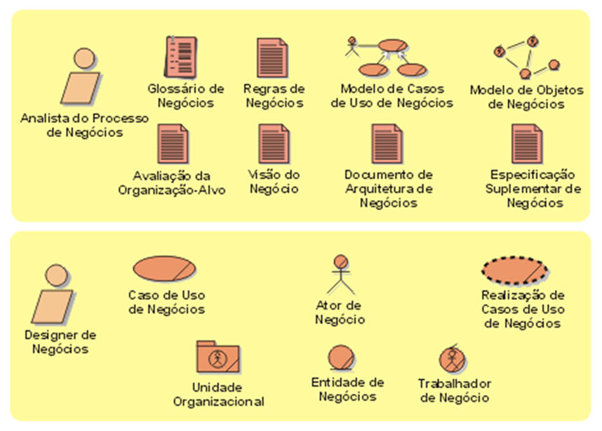

### Requisitos

Na disciplina de Requisitos, identificam-se os **atores** que interagem com o sistema e desenvolvem-se os **casos de uso**, que documentam o comportamento do sistema em resposta às interações externas. Esta disciplina é essencial para garantir alinhamento entre os envolvidos sobre o que o sistema deve fazer.

**Finalidades**:

- Alinhar as expectativas dos stakeholders sobre as funcionalidades do sistema;
- Definir os limites (fronteiras) do sistema;
- Estabelecer a base para estimativas de tempo e custo;
- Fornecer subsídios para o planejamento das iterações;
- Definir interfaces centradas no usuário.

**Artefatos**: Capturam e apresentam informações usadas para **definir os recursos necessários do sistema**. Documentos de requisitos, diagramas de casos de uso, protótipos de interface, entre outros.

  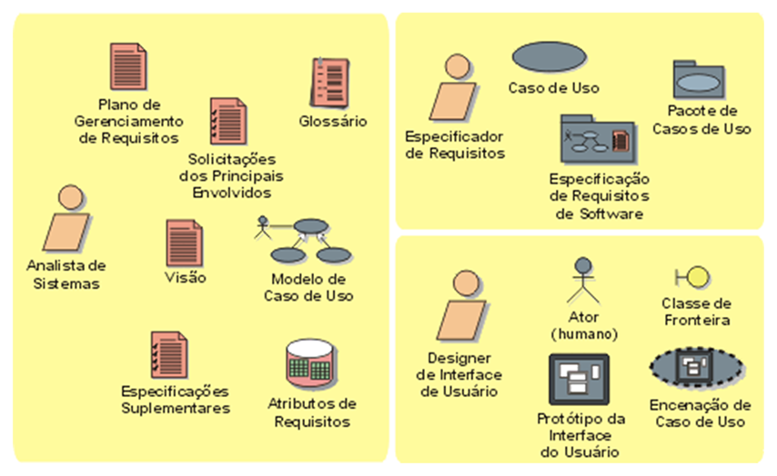

### Análise e Projeto (Design)

Esta disciplina transforma os requisitos em um modelo de projeto detalhado. São criados modelos arquiteturais, de componentes, objetos e sequências, considerando também aspectos como desempenho, modularidade e reutilização. O foco está na **concepção técnica da solução**.

**Finalidades**:

- Transformar os requisitos em um design estruturado e funcional;
- Desenvolver uma arquitetura robusta e escalável.    
- Adaptar o projeto ao ambiente de implementação.

**Artefatos**: Capturam e apresentam informações relacionadas à **solução dos problemas propostos**. Modelos arquiteturais, diagramas de classes, objetos, componentes, sequência e pacotes.

  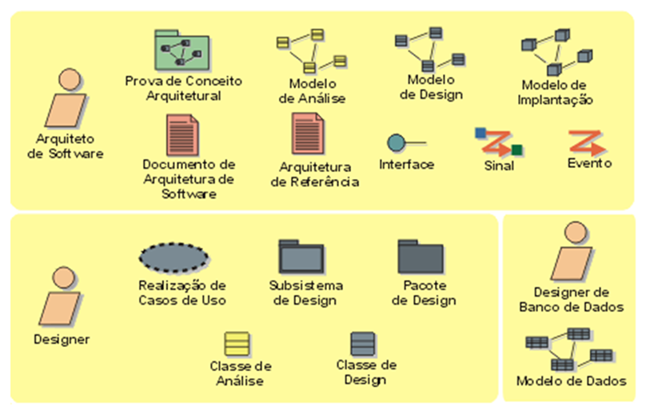

### Implementação

A disciplina de Implementação organiza a estrutura do código em subsistemas, geralmente organizados em **camadas**. Classes e objetos são implementados como componentes, testados isoladamente e integrados ao sistema final.

**Finalidades**:

- Estruturar o código-fonte em camadas e subsistemas;
- Implementar componentes reutilizáveis;
- Realizar testes de unidade;
- Integrar os componentes no sistema executável.

**Artefatos**: Capturam e apresentam a **realização da solução proposta** no conjunto de Análise e Design. Código-fonte, binários, scripts de build, pacotes, documentação técnica.

  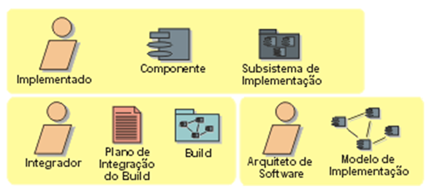

### Teste

O Teste no RUP é **iterativo e contínuo**, sendo executado desde os primeiros estágios do desenvolvimento. Seu objetivo é validar funcionalidades, verificar requisitos e identificar falhas no software, sempre com base em cenários reais de uso.

**Finalidades**:

- Detectar e registrar defeitos no software;
- Avaliar a qualidade geral do produto;
- Validar suposições dos requisitos e do design;
- Verificar se os requisitos foram corretamente implementados.

**Artefatos**: **Produtos das atividades de Teste** e avaliação agrupados por papel de responsabilidade. Casos de teste, scripts de automação, relatórios de defeitos, planos de teste. 

  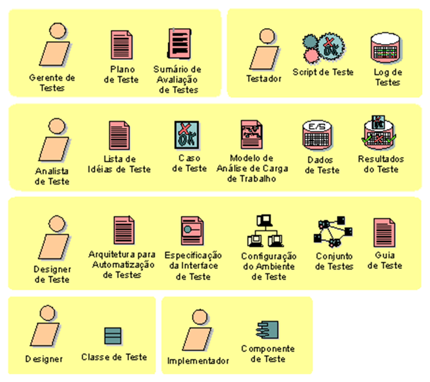

### Implantação

A disciplina de Implantação trata da **entrega do sistema** ao usuário final. Envolve desde o preparo da versão para produção até a criação de artefatos de instalação e materiais de apoio, como treinamentos e manuais.

**Finalidades**:

- Coordenar os testes beta e de aceitação;
- Criar artefatos de instalação e documentação para os usuários;
- Realizar a entrega do sistema no ambiente de produção.

**Artefatos**:  Capturam e apresentam informações relacionadas à **transição do sistema para o ambiente de produção**. Instaladores, pacotes de distribuição, manuais do usuário, vídeos de treinamento.

  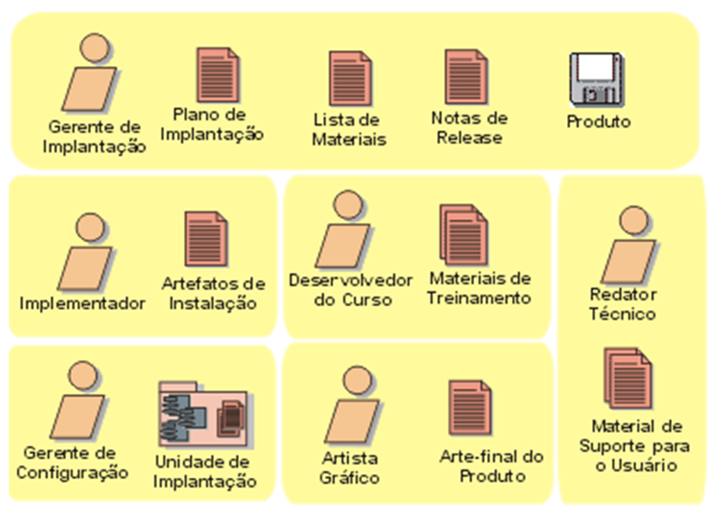

### Gerenciamento de Configuração e Mudanças (Disciplina de Apoio)

Esta disciplina gerencia as versões e mudanças dos artefatos do projeto. Busca evitar conflitos, controlar alterações e garantir a integridade dos artefatos e produtos entregues.

**Finalidades**:

- Identificar e controlar itens de configuração;
- Restringir e auditar mudanças;
- Evitar conflitos de versão e sobrescritas acidentais;
- Criar **baselines**, que representam versões estáveis dos artefatos.

**Artefatos**: Captura e apresenta informações relacionadas à disciplina de **gerenciamento de configuração e mudança**. Logs de mudanças, políticas de versionamento, repositórios de configuração.

  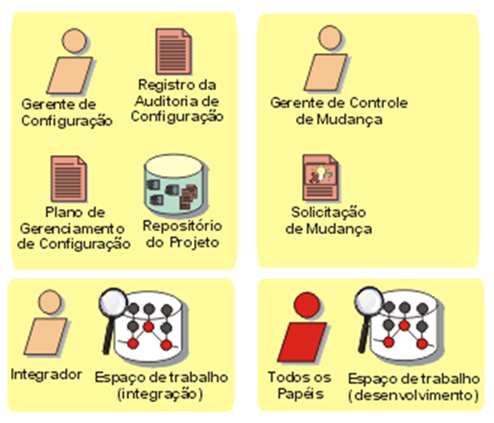

### Gerenciamento de Projetos (Disciplina de Apoio)

Foca no planejamento, acompanhamento e controle do projeto. Diferente de frameworks como o PMBOK, seu escopo é mais restrito, concentrando-se em aspectos técnicos do projeto de software. Não cobre gerenciamento de pessoal, orçamento ou contratos.

**Finalidades**:

- Planejar, montar equipe, executar e monitorar o projeto;
- Gerenciar riscos técnicos;
- Coordenar a execução das atividades de forma iterativa.

**Artefatos**: Capturam os artefatos associados ao **planejamento e à execução do projeto e do processo**. Plano de projeto, cronogramas, gráficos de progresso, relatórios de riscos.

  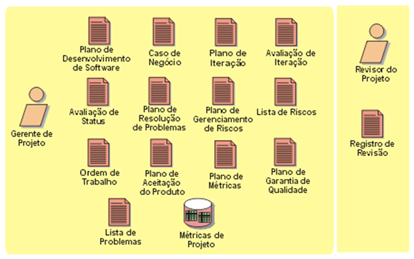

### Ambiente (Disciplina de Apoio)

Essa disciplina está relacionada ao suporte ao processo e à equipe. Trata da disponibilização de ferramentas, configuração de ambientes de desenvolvimento e definição de padrões e diretrizes.

**Finalidades**:

- Fornecer ferramentas e processos que apoiem o desenvolvimento;
- Configurar ambientes de desenvolvimento e teste;
- Estabelecer diretrizes e padrões técnicos.

**Artefatos**: Apresenta artefatos usados como instruções durante o desenvolvimento, a fim de garantir a consistência dos artefatos. Templates, scripts, ferramentas configuradas, manuais internos, guias de processo.

  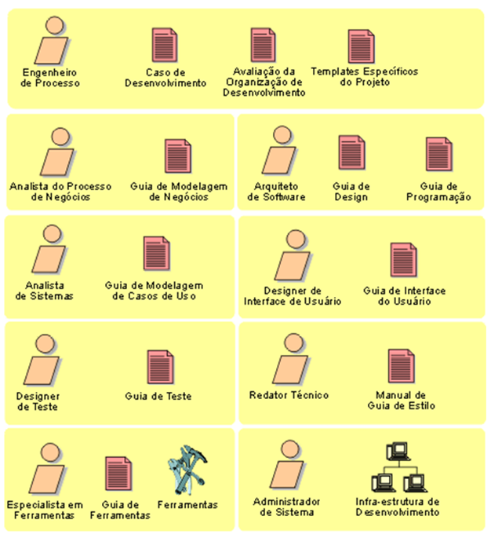

## Considerações Finais

Neste capítulo, exploramos de forma aprofundada o Rational Unified Process (RUP), um dos modelos de processo de software mais estruturados, amplamente adotado no desenvolvimento de sistemas de grande porte. Diferentemente de modelos tradicionais e lineares, o RUP adota uma abordagem **iterativa e incremental**, permitindo que os projetos sejam conduzidos em ciclos sucessivos de desenvolvimento, com entregas parciais e contínua validação dos requisitos.

Compreendemos que o RUP organiza o ciclo de vida do software em **quatro fases principais** — **iniciação**, **elaboração**, **construção** e **transição** — cada uma com objetivos específicos que visam aumentar a qualidade do produto, reduzir riscos e garantir que os recursos sejam empregados de maneira eficiente.

Além disso, estudamos as **nove disciplinas fundamentais** do RUP, divididas entre **seis disciplinas principais** (Modelagem de Negócios, Requisitos, Análise e Projeto, Implementação, Teste e Implantação) e **três disciplinas de apoio** (Gerenciamento de Configuração e Mudança, Gerenciamento de Projetos e Ambiente). Cada disciplina envolve atividades, papéis e artefatos que se complementam e contribuem para a execução eficaz do projeto.

  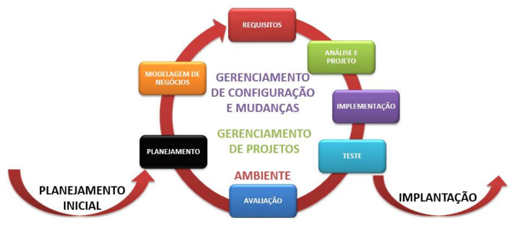

Uma passagem pelas quatro fases se chama **ciclo de desenvolvimento** e uma passagem pelas nove disciplinas se chama **Iteração,** podendo haver mais de uma iteração por fase, como mostra a imagem abaixo (na elaboração e na construção). Além disso:

- Cada iteração dura, em média, **de 2 a 6 semanas**;
- Um projeto típico possui **de 3 a 9 iterações** ao longo de todas as fases;
- A disciplina **Modelagem de Negócios** é **opcional** e pode ser omitida conforme a natureza do projeto.

  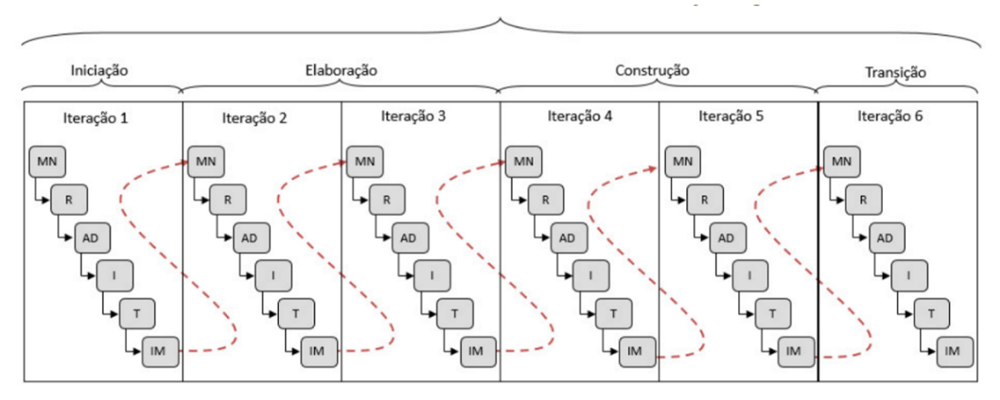

O RUP integra **boas práticas de engenharia de software**, como o gerenciamento de requisitos, o desenvolvimento baseado em componentes reutilizáveis, a validação contínua da qualidade e a gestão efetiva de mudanças. O modelo também valoriza a colaboração entre os membros da equipe e as partes interessadas, oferecendo uma estrutura clara de responsabilidades e entregas.

O RUP, por sua natureza robusta e bem documentada, é especialmente indicado para projetos complexos, que exigem alto grau de controle, rastreabilidade e confiabilidade. No entanto, também exige um certo nível de maturidade da equipe, bem como um investimento inicial na definição de processos, ferramentas e treinamento.

A seguir, apresentamos uma **figura de resumo geral** com os principais elementos estudados neste capítulo, incluindo as fases, disciplinas, papéis e artefatos do RUP, como forma de consolidar os conhecimentos adquiridos.

  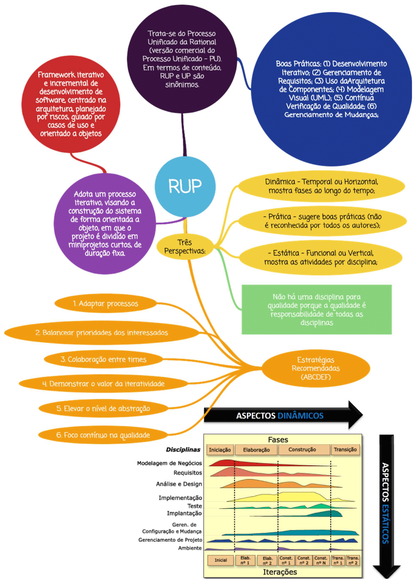

