# Capítulo 14 – Scrum

## Conceitos Básicos do Scrum

Antes de adentrarmos na teoria do Scrum propriamente dita, é importante entendermos a origem desse nome tão peculiar. O termo **Scrum** vem do esporte **Rugby**, e não foi escolhido por acaso. Ele carrega uma forte carga simbólica, representando a importância da cooperação, da união e do esforço coletivo para se alcançar objetivos em contextos de alta competitividade e complexidade.

No Rugby, o termo **scrum** designa uma formação específica, na qual os jogadores das duas equipes se agrupam, pressionando-se uns contra os outros, formando uma espécie de “muralha humana”. O objetivo dessa formação é disputar a posse da bola de maneira conjunta e coordenada. Aqui, todos os jogadores são fundamentais; não existe um líder que centraliza as jogadas, como acontece, por exemplo, no futebol americano com o quarterback. Cada membro da equipe desempenha um papel crucial no sucesso da jogada.

  

Essa metáfora é perfeita para o ambiente de desenvolvimento de produtos complexos. Assim como no Rugby, no Scrum todos os integrantes da equipe precisam trabalhar de maneira colaborativa, sincronizada e focada no alcance de objetivos comuns. Não há espaço para individualismo, hierarquias rígidas ou centralização de decisões. O sucesso depende da soma das forças, do comprometimento e da responsabilidade compartilhada.

### O Que é Scrum?

Do ponto de vista técnico, o **Scrum é um framework leve, simples de entender, porém extremamente difícil de dominar**, que permite às pessoas, times e organizações gerar valor por meio de soluções adaptativas para problemas complexos. Esse conceito está presente em ambas as versões mais conhecidas do **Guia Scrum** (2017 e 2020), documento oficial que descreve detalhadamente seus princípios, práticas, papéis, eventos, artefatos e regras.

É fundamental entender que o Scrum **não é um processo, uma técnica ou uma metodologia fechada**. Na verdade, ele oferece uma estrutura dentro da qual é possível empregar diversos processos, técnicas e práticas, desde que estes estejam alinhados aos seus princípios. É como se o Scrum fosse uma moldura, dentro da qual cada organização ou equipe pode pintar o seu próprio quadro, adaptando as práticas às suas necessidades específicas.

Essa característica oferece enorme flexibilidade, mas também exige disciplina, comprometimento e compreensão profunda dos seus princípios. É por isso que, embora seja simples de entender, não é trivial aplicá-lo corretamente no dia a dia.

### Framework e Não Metodologia

Faz-se necessário reforçar essa distinção: Scrum é um **framework**, não uma metodologia. Uma metodologia, geralmente, traz prescrições detalhadas sobre o que deve ser feito, como deve ser feito, quando e por quem. Já o framework estabelece uma base conceitual, composta por papéis, eventos, artefatos e regras mínimas, que devem ser combinadas, ajustadas e complementadas conforme o contexto do time ou da organização.

Portanto, o Scrum **não te dirá exatamente como fazer o seu trabalho**, mas fornecerá um ambiente seguro e estruturado para que você e sua equipe possam experimentar, inspecionar, adaptar e, assim, maximizar a geração de valor.

### Aplicações do Scrum no Mundo Real

Engana-se quem pensa que o Scrum é restrito ao desenvolvimento de software. De fato, ele surgiu neste contexto, mas ao longo das décadas sua aplicação se expandiu de forma significativa. Atualmente, é utilizado nas mais diversas áreas e setores, como desenvolvimento de hardware, engenharia, marketing, educação, operações, jurídico, recursos humanos, serviços públicos, governo e até no gerenciamento da própria organização.

Por exemplo, imagine uma equipe de marketing que precisa lançar campanhas digitais constantemente. Nesse contexto, os requisitos mudam com frequência — novos dados de mercado surgem, concorrentes alteram suas estratégias, e as tendências evoluem rapidamente. Utilizar o Scrum permite que a equipe organize seu trabalho em ciclos curtos (chamados de **Sprints**), entregando incrementos de valor de forma contínua, testando, aprendendo e ajustando sua estratégia com agilidade.

Outro exemplo prático está no desenvolvimento de produtos físicos, como veículos autônomos. Empresas desse setor precisam lidar com requisitos altamente mutáveis, inovações tecnológicas constantes e interações complexas entre software, hardware e inteligência artificial. O Scrum se mostra extremamente eficaz para coordenar o trabalho de equipes multidisciplinares, permitindo ciclos curtos de desenvolvimento, testes constantes e entrega de resultados incrementais.

### Por Que Scrum Funciona em Ambientes Complexos?

Para entender a efetividade do Scrum, precisamos compreender primeiro o que caracteriza um **ambiente complexo**. Aqui, cabe introduzir o conceito do **Modelo Cynefin**, criado por Dave Snowden, que classifica os ambientes em quatro domínios principais:

  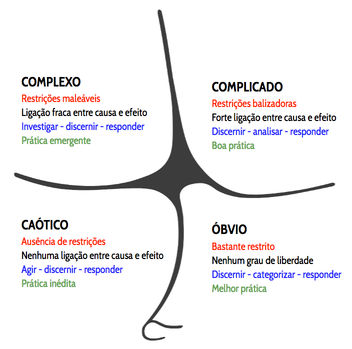

- **Simples (ou Óbvio)**: As relações de causa e efeito são claras, conhecidas e previsíveis. Soluções baseadas em boas práticas funcionam muito bem. Um exemplo clássico é a produção de uma rede de fast food, como o McDonald’s. As tarefas são altamente padronizadas e quase não há espaço para variações.
- **Complicado**: Existe uma relação de causa e efeito, mas ela não é óbvia e exige análise ou expertise para ser compreendida. A solução é baseada em boas práticas e especialistas. Imagine, por exemplo, o desenvolvimento de um avião — é difícil, mas possível de planejar detalhadamente.
- **Complexo**: As relações de causa e efeito só podem ser percebidas de forma retrospectiva, após os eventos ocorrerem. Esse ambiente é caracterizado pela alta incerteza, mudanças constantes e imprevisibilidade. Nesse cenário, o caminho correto surge por meio de experimentação, inspeção e adaptação. É aqui que o Scrum brilha.
- **Caótico**: Não há relação clara de causa e efeito. A prioridade aqui é agir rapidamente para estabilizar a situação, depois analisar e responder.

Portanto, o Scrum é especialmente eficaz em **ambientes complexos**, onde não é possível prever tudo antecipadamente e onde mudanças são frequentes. Diferente de modelos tradicionais que tentam prever e planejar tudo no início, o Scrum aposta na abordagem **iterativa e incremental**, com ciclos curtos de trabalho que permitem aprendizado constante, ajustes rápidos e redução de riscos.

### Iteratividade, Incremento e Controle Empírico

O Scrum é fundamentado na teoria do **controle empírico de processos**, que se apoia em três pilares fundamentais: **transparência, inspeção e adaptação** (que veremos detalhadamente mais a frente). Através de ciclos iterativos e incrementais, o Scrum maximiza as oportunidades de feedback, melhorando não apenas o produto, mas também o próprio processo e a dinâmica do time.

Cada ciclo, chamado de **Sprint**, é uma oportunidade de inspecionar os resultados, avaliar o que está funcionando, identificar o que precisa ser ajustado e, então, adaptar-se para o próximo ciclo.

De forma resumida, o Scrum é composto por:

- **Papéis**: São três, e cada um tem responsabilidades muito bem definidas – o **Product Owner**, o **Scrum Master** e os **Developers** (Desenvolvedores, que compõem o Time Scrum).
- **Eventos**: Existem quatro eventos principais, além do próprio Sprint. São eles: **Sprint Planning**, **Daily Scrum**, **Sprint Review** e **Sprint Retrospective**.
- **Artefatos**: Também são três – **Product Backlog**, **Sprint Backlog** e **Incremento**.
- **Regras e Fluxo**: As regras do Scrum integram papéis, eventos e artefatos, definindo como eles interagem entre si. Além disso, existe o **fluxo de trabalho iterativo e incremental**, onde a Sprint é o coração do processo.

Embora seja possível utilizar outros artefatos complementares — como o **Gráfico de Burndown**, o **Documento de Visão do Produto**, ou ferramentas de acompanhamento — eles são opcionais, funcionando como “extensões” ao framework.

### Uma Visão Pragmática

Por fim, é importante destacar que o Scrum não é uma bala de prata, nem uma solução mágica para todos os problemas. Ele exige comprometimento, mudança cultural e disciplina. Times que tentam “adaptar” o Scrum removendo seus elementos essenciais — como ignorar eventos, não adotar todos os papéis, ou não manter os artefatos —, na prática, deixam de fazer Scrum e acabam perdendo seus benefícios.

O próprio **Guia Scrum** nos alerta que sua simplicidade é proposital, e que sua implementação deve ser feita na íntegra antes que se considerem adaptações. **A experimentação é bem-vinda, desde que os pilares e fundamentos sejam respeitados.**

## Pilares Fundamentais do Scrum

O Scrum é um framework ágil que se baseia em dois conceitos fundamentais: **empirismo** e **lean thinking**. Compreender esses fundamentos é essencial para entender não apenas como o Scrum funciona, mas também por que ele funciona de maneira tão eficiente, especialmente em ambientes complexos, incertos e dinâmicos.

### Empirismo: Aprendizado pela Experiência

O primeiro pilar conceitual do Scrum é o **empirismo**, uma filosofia que defende que o conhecimento se dá por meio da experiência direta e da tomada de decisões fundamentadas naquilo que é conhecido no momento. Ao invés de tentar prever todos os possíveis caminhos de um projeto desde o início, o Scrum permite que as equipes aprendam e se adaptem continuamente conforme o trabalho avança.

Esse aprendizado ocorre por meio de ciclos de trabalho curtos, conhecidos como **Sprints**, onde, ao final de cada ciclo, a equipe avalia o que foi feito, aprende com os erros, ajusta processos e se prepara para o próximo ciclo. Dessa forma, riscos são constantemente controlados e a previsibilidade dos resultados melhora progressivamente.

### Lean Thinking: Foco na Eliminação de Desperdícios

O segundo conceito essencial é o **Lean Thinking**, um modelo mental que tem como objetivo reduzir desperdícios e maximizar aquilo que realmente agrega valor. No contexto do Scrum, isso significa que toda atividade, processo ou tarefa que não contribua diretamente para gerar valor ao produto ou ao cliente deve ser questionada e, sempre que possível, eliminada.

Assim, o Scrum não é apenas uma sequência de práticas; ele representa uma mudança cultural que estimula o foco no que importa, promovendo produtividade, eficiência e agilidade.

### Os Três Pilares do Empirismo no Scrum

O funcionamento prático do Scrum, dentro desse pensamento empírico e enxuto, se sustenta em três pilares fundamentais: **Transparência, Inspeção e Adaptação** — frequentemente representados pela sigla **TIA**.

  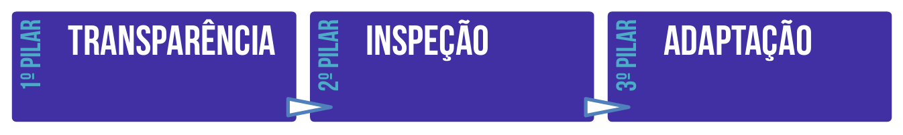

Esses pilares não são apenas conceitos teóricos; eles estão diretamente refletidos em todos os eventos, artefatos e práticas do Scrum. Eles são a base para garantir que as equipes tenham controle efetivo do processo, possam responder rapidamente às mudanças e, principalmente, entreguem valor de forma constante e incremental.

#### Transparência: A Verdade Precisa Ser Visível

O pilar da **Transparência** estabelece que todos os aspectos significativos do processo devem ser visíveis, claros e compreendidos por todos os envolvidos no projeto, tanto pela equipe que executa quanto pelos stakeholders (clientes, usuários e outros interessados).

Essa visibilidade é fundamental para que haja uma compreensão compartilhada sobre o que está acontecendo, evitando mal-entendidos, suposições incorretas e desalinhamento.

Como bem definiu **Ken Schwaber**, um dos criadores do Scrum:

> “Scrum é igual sogra: chega na sua casa e esfrega todos os seus problemas na sua cara.”

Essa frase, bem-humorada, ilustra perfeitamente o espírito da transparência no Scrum: se há problemas, falhas, atrasos ou qualquer outro tipo de dificuldade, todos devem saber. Nada é escondido debaixo do tapete. O enfrentamento honesto das dificuldades permite que elas sejam discutidas e, principalmente, solucionadas.

A **transparência** no Scrum não significa apenas “ser honesto”, mas também garantir que haja uma linguagem comum, definições claras e critérios bem estabelecidos. Por exemplo, todos precisam entender exatamente o que significa um item estar **“Pronto”** (o famoso _Definition of Done_). Sem essa clareza, cada membro pode interpretar o andamento do trabalho de forma diferente, gerando desalinhamentos prejudiciais.

Reflexões dos Guias Scrum:

- **Guia Scrum 2017:** “Aspectos significativos do processo devem estar visíveis aos responsáveis pelos resultados. A transparência requer que estes aspectos tenham uma definição padrão comum para que os observadores compartilhem um entendimento comum do que está sendo visto.”
- **Guia Scrum 2020:** “O processo emergente e o trabalho devem ser visíveis tanto para quem executa o trabalho quanto para quem recebe o trabalho. Artefatos com baixa transparência podem levar a decisões que diminuem o valor e aumentam o risco. A transparência permite a inspeção. A inspeção sem transparência é enganosa e gera desperdício.”

#### Inspeção: Avaliar Para Melhorar

Se tudo está visível, é natural que o próximo passo seja inspecionar. A **Inspeção** é o segundo pilar do Scrum e consiste na verificação constante dos artefatos produzidos, do progresso do trabalho e dos processos que estão sendo executados.

O objetivo da inspeção é simples, porém fundamental: **detectar desvios indesejados o mais cedo possível**. Isso permite que os problemas sejam corrigidos antes que gerem impactos maiores no projeto.

Essa inspeção não é feita de maneira aleatória, mas estruturada nos eventos formais do Scrum, como veremos mais adiante: **Reuniões Diárias, Revisões da Sprint, Retrospectivas, entre outros**. É nesses momentos que a equipe avalia tanto o produto quanto os processos, identificando melhorias, riscos e oportunidades de ajuste.

É importante destacar que a inspeção, quando mal conduzida, pode se transformar em microgerenciamento — o que é absolutamente contra os princípios do Scrum. Por isso, o próprio Guia Scrum alerta que as inspeções **“não devem ser tão frequentes que atrapalhem o trabalho”**, devendo ocorrer de forma cadenciada, dentro dos eventos preestabelecidos.

Reflexões dos Guias Scrum:

- **Guia Scrum 2017:** “Os usuários Scrum devem, frequentemente, inspecionar os artefatos e o progresso em direção ao objetivo da Sprint para detectar variações indesejadas. Esta inspeção não deve ser tão frequente que atrapalhe os trabalhos.”
- **Guia Scrum 2020:** “Os artefatos do Scrum e o progresso em direção às metas devem ser inspecionados com frequência e diligência para detectar variações ou problemas indesejáveis. A inspeção habilita a adaptação. A inspeção sem adaptação é inútil.”

#### Adaptação: Corrigir a Rota Sempre que Necessário

Quando a inspeção revela problemas, desvios ou oportunidades de melhoria, é hora de colocar em prática o terceiro pilar: a **Adaptação**.

No Scrum, qualquer desvio em relação à meta — seja no produto ou no processo — deve ser corrigido imediatamente. A ideia central é que **quanto mais rápido se reage aos problemas, menor é o impacto que eles podem causar no projeto.**

Por exemplo, se durante uma Retrospectiva a equipe percebe que a comunicação interna está falhando, ela deve propor e implementar mudanças já na próxima Sprint para resolver esse problema. Da mesma forma, se uma funcionalidade não atende aos critérios de aceitação, ela deve ser ajustada antes de seguir para o cliente.

A **adaptação** não é opcional no Scrum; ela é obrigatória e constante. E mais: ela se torna muito mais difícil se a equipe não for autogerenciável ou não estiver empoderada para tomar decisões. Por isso, o Scrum estimula fortemente equipes auto-organizadas, que tenham liberdade e autonomia para se ajustar rapidamente frente às mudanças.

Reflexões dos Guias Scrum:

- **Guia Scrum 2017:** “Se um inspetor determina que um ou mais aspectos de um processo desviou para fora dos limites aceitáveis, e que o resultado do produto será inaceitável, o processo ou o material sendo produzido deve ser ajustado. O ajuste deve ser realizado o mais breve possível.”
- **Guia Scrum 2020:** “A adaptação se torna mais difícil quando as pessoas envolvidas não são empoderadas ou autogerenciadas. Espera-se que um Scrum Team se adapte no momento em que aprende algo novo por meio da inspeção.”

#### Resumo dos Pilares Fundamentais

Para facilitar o entendimento, podemos resumir os três pilares fundamentais do Scrum na tabela a seguir:

|**Pilar**|**Descrição**|
|---|---|
|**Transparência**|Todo trabalho deve ser claramente definido, visível e conhecido por todos os envolvidos no projeto.|
|**Inspeção**|O trabalho e os processos devem ser inspecionados periodicamente para garantir sua qualidade.|
|**Adaptação**|O projeto deve ser capaz de se adaptar rapidamente às necessidades de negócio e às mudanças.|

### A Importância dos Pilares Para o Sucesso do Scrum

É fundamental compreender que **Transparência, Inspeção e Adaptação** não são práticas isoladas; elas são interdependentes e funcionam em conjunto.

Sem **transparência**, não há como realizar uma inspeção honesta e precisa.  
Sem **inspeção**, não há como saber se há necessidade de ajustes.  
Sem **adaptação**, qualquer problema identificado continuará existindo, comprometendo o produto e o processo.

Esse ciclo contínuo de **tornar visível → inspecionar → adaptar** é o que permite que o Scrum seja altamente eficiente em contextos de incerteza, mudança constante e necessidade de entrega de valor contínuo.

## Valores Fundamentais do Scrum

O Scrum, além de ser um framework ágil altamente estruturado e eficiente para o desenvolvimento de software e outros produtos complexos, fundamenta-se em um conjunto sólido de valores que direcionam o comportamento, as interações e as decisões de todos os envolvidos no projeto. Esses valores são essenciais para criar um ambiente de trabalho colaborativo, produtivo e sustentável, e sua aplicação prática é vital para o sucesso na adoção do Scrum.

  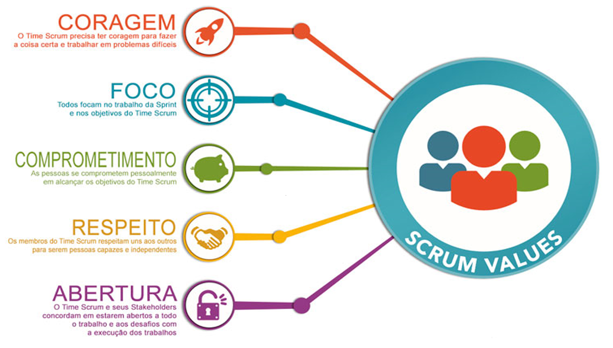

São cinco os valores que sustentam o Scrum: **Coragem**, **Foco**, **Comprometimento**, **Respeito** e **Abertura**. Embora possam parecer conceitos simples, a verdadeira aplicação desses valores no cotidiano de um projeto exige prática, maturidade, disciplina e uma cultura organizacional que os incentive.

| Valores         | Descrição                                                                                                                                                       |
| --------------- | --------------------------------------------------------------------------------------------------------------------------------------------------------------- |
| Coragem         | Os integrantes de um projeto precisam ter coragem para fazer a coisa certa e trabalharem juntos removendo impedimentos, buscando soluções.                      |
| Foco            | Os integrantes de um projeto precisam focar no trabalho durante a sprint e nas metas designadas – time disperso perde produtividade e não alcança os objetivos. |
| Comprometimento | Os integrantes se comprometem com o trabalho que se responsabilizaram em fazer, envolvendo-se e não abandonando pela metade ou entregando sem qualidade.        |
| Respeito        | Os integrantes se respeitam entre si a fim de manter a colaboração, a integração e o bom ambiente de trabalho.                                                  |
| Abertura        | Os integrantes devem poder ser francos, expor ideias e propostas mesmo que elas não sejam proveitosas. Momentos de debates, discussões e sugestões são ideais.  |

O sucesso na utilização do Scrum não está restrito apenas ao cumprimento dos eventos, papéis e artefatos que compõem o framework. Ele está diretamente relacionado à internalização desses valores pelos membros do time, stakeholders e, idealmente, por toda a organização. Eles não são meramente decorativos ou filosóficos — são diretrizes práticas que moldam comportamentos, decisões e formas de interação dentro do Time Scrum.

### Coragem

No contexto do Scrum, **coragem** significa que os membros do Time Scrum devem ter a disposição necessária para fazer o que é certo, mesmo quando isso é desconfortável ou difícil. Isso inclui enfrentar desafios técnicos, discutir problemas abertamente, admitir erros, assumir responsabilidades e buscar soluções inovadoras.

Por exemplo, imagine uma Sprint em que um dos desenvolvedores percebe que um requisito, inicialmente planejado, não poderá ser entregue dentro do tempo restante, sem que haja perda na qualidade. Ter coragem, nesse caso, significa trazer essa informação para o time o quanto antes, discutir as alternativas, renegociar o escopo da Sprint se necessário, e não empurrar o problema para o futuro, comprometendo o produto.

Coragem também é necessária para lidar com impedimentos, desafios externos, pressão de stakeholders e, principalmente, para garantir que as práticas e os princípios ágeis sejam respeitados, mesmo que isso vá de encontro à cultura tradicional de comando e controle ainda presente em muitas organizações.

### Foco

O valor do **foco** é central dentro do Scrum, que é um framework orientado a objetivos claros e incrementos de trabalho bem definidos. O Time Scrum deve concentrar sua energia no trabalho da Sprint, evitando dispersões, interrupções desnecessárias ou desvios de escopo.

Isso significa que, durante uma Sprint, o time deve priorizar as atividades que estão comprometidas no Sprint Backlog, deixando de lado outras solicitações que possam surgir e que não estejam alinhadas com o objetivo da Sprint. Focar não é apenas uma questão de gestão de tempo, mas também de garantir qualidade, evitar retrabalho e maximizar a entrega de valor.

Por exemplo, suponha que durante uma Sprint, um stakeholder externo solicite a inclusão de uma nova funcionalidade que não estava planejada. O Time Scrum, então, deve gentilmente redirecionar essa solicitação para o Product Owner, que irá avaliar e, se for o caso, priorizar essa demanda para uma próxima Sprint. Isso preserva o foco do time nas metas estabelecidas, sem gerar dispersão.

### Comprometimento

O **comprometimento** no Scrum transcende a simples ideia de estar presente ou participar. Ele envolve assumir a responsabilidade pelo trabalho, pela entrega e pela qualidade do que é produzido. Cada membro do Time Scrum se compromete não apenas com as tarefas que assumiu, mas também com o sucesso coletivo do time.

Esse comprometimento não é imposto. Ele surge do entendimento compartilhado dos objetivos, da clareza das responsabilidades e da confiança mútua dentro do time. Um ambiente onde os membros estão verdadeiramente comprometidos é caracterizado por colaboração, ajuda mútua, transparência e busca pela melhoria contínua.

Por exemplo, se durante uma Sprint um desenvolvedor termina sua tarefa antes do previsto, ao invés de considerar seu trabalho concluído, ele se disponibiliza para ajudar colegas que estejam com dificuldades, revisando códigos, testando funcionalidades ou até mesmo contribuindo com tarefas fora de sua especialidade.

### Respeito

O **respeito** é a base que permite que times Scrum operem de forma colaborativa e saudável. Isso significa que todos os membros do Time Scrum se reconhecem como profissionais capazes, responsáveis e autônomos, e tratam-se mutuamente com dignidade, consideração e empatia.

Respeitar não significa apenas ser cordial. É compreender e valorizar as opiniões, as limitações, as contribuições e as necessidades dos colegas. É entender que cada membro tem sua própria bagagem de conhecimento, seu próprio ritmo de aprendizado e sua forma de trabalhar.

Por exemplo, durante um Sprint Retrospective, quando um membro aponta que se sentiu sobrecarregado devido a uma má distribuição das tarefas, os demais membros escutam atentamente, sem julgamentos, e juntos pensam em soluções para melhorar esse aspecto nas próximas Sprints.

Além disso, o respeito também se estende aos stakeholders e à organização, criando um ambiente onde as opiniões são consideradas e as decisões são tomadas de maneira colaborativa.

### Abertura

O valor da **abertura** se traduz na disposição para compartilhar informações, ideias, feedbacks e até mesmo problemas. Dentro do Scrum, a transparência é essencial, e isso só é possível quando todos estão dispostos a se comunicar de forma aberta e honesta.

Um Time Scrum deve estar aberto para discutir tanto os sucessos quanto os fracassos, os avanços e os obstáculos. A abertura permite que problemas sejam identificados e resolvidos rapidamente, que melhorias sejam constantemente implementadas e que todos se sintam parte do processo.

Por exemplo, se durante uma Sprint o time percebe que a abordagem técnica escolhida não está funcionando, a abertura permite que esse problema seja trazido para discussão imediatamente, para que uma nova abordagem possa ser definida, evitando desperdício de tempo e esforço.

A abertura também promove a inovação. Quando os membros do time se sentem à vontade para propor ideias, mesmo que inicialmente pareçam ousadas ou inviáveis, isso pode levar a descobertas e soluções criativas que trazem grande valor ao projeto.

### Integração dos Valores aos Pilares do Scrum

Quando os valores de **Coragem**, **Foco**, **Comprometimento**, **Respeito** e **Abertura** são efetivamente vivenciados no dia a dia, os três pilares do Scrum — **Transparência**, **Inspeção** e **Adaptação** — tornam-se muito mais do que simples conceitos: eles se transformam em práticas vivas que sustentam a melhoria contínua e a entrega de valor.

A internalização desses valores constrói a base de confiança necessária para que o Time Scrum possa operar de maneira eficaz. Isso significa que as reuniões são mais produtivas, os problemas são tratados mais rapidamente, a qualidade do produto melhora significativamente, e o ambiente de trabalho torna-se mais saudável e motivador.

Essa sinergia entre valores e pilares também fortalece o empoderamento do Time Scrum, permitindo que ele seja verdadeiramente autogerenciável, colaborativo e capaz de entregar resultados consistentes em ambientes complexos e de constante mudança.

> **Observação:**  As descrições e interpretações desses valores foram enriquecidas com base nos Guias Scrum de 2017 e 2020, que ressaltam a importância desses princípios como elementos fundamentais para o sucesso na adoção do framework. É importante destacar que, ao longo do tempo, embora a essência dos valores permaneça a mesma, as versões mais recentes do Guia Scrum reforçam a necessidade de que esses valores estejam profundamente enraizados na cultura do Time Scrum e na forma como ele interage com seus stakeholders.

## Papéis no Scrum

Quando falamos sobre o funcionamento do Scrum, é fundamental compreender que este framework é construído sobre a colaboração intensa de um pequeno grupo de profissionais altamente capacitados, autogerenciáveis e multifuncionais. Um dos aspectos mais característicos do Scrum é que ele não estabelece uma grande quantidade de papéis, funções ou cargos. Pelo contrário, o Scrum aposta na simplicidade estrutural, estabelecendo poucos papéis, mas extremamente bem definidos, cada qual com suas responsabilidades e sua importância no funcionamento do framework.

Os indivíduos que ocupam esses papéis não são apenas executores de tarefas isoladas, mas sim membros integrantes de um mesmo time, comprometidos coletivamente com a geração de valor e com o alcance dos objetivos definidos. Eles trabalham juntos, de maneira colaborativa, transparente e incremental, o que os torna igualmente responsáveis pelos resultados obtidos.

Ao longo dos anos, o Scrum passou por atualizações significativas, o que gerou algumas diferenças conceituais e terminológicas entre as versões de seus guias oficiais. Por esse motivo, ao falarmos sobre os papéis no Scrum, é necessário entender como eles eram definidos até a versão de 2017 e como passaram a ser tratados a partir da versão de 2020.

Na versão de 2017, o Scrum estabelecia três papéis centrais: o **Product Owner**, o **Scrum Master** e o chamado **Development Team**, ou seja, o time de desenvolvimento. Juntos, esses três elementos formavam o que era chamado de **Scrum Team**. Entretanto, havia uma diferenciação clara: o **Scrum Team** era composto por esses três papéis de forma conjunta, mas se destacava internamente o **Development Team**, representando o grupo dos profissionais responsáveis diretamente pela construção do produto.

Já na versão de 2020, essa diferenciação foi eliminada. Passou-se a adotar uma visão mais unificada, na qual todo o grupo é denominado simplesmente de **Scrum Team**, sem subdivisões internas entre desenvolvimento e demais funções. Com isso, os papéis de **Developers**, **Product Owner** e **Scrum Master** passaram a ser compreendidos como responsabilidades dentro de um mesmo time coeso, colaborativo e com foco comum.

A seguir, observa-se uma figura que ilustra as diferenças na definição dos papéis entre as versões de 2017 e 2020:

  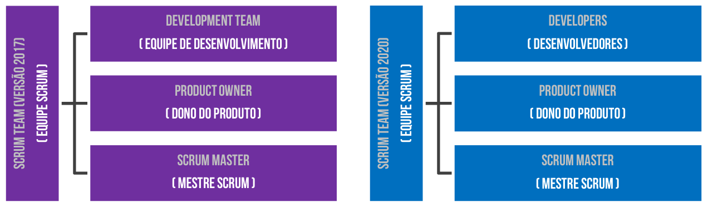

Essa representação ajuda a entender como a evolução do framework buscou tornar os conceitos mais simples e alinhados com a realidade dos times ágeis modernos, evitando interpretações equivocadas sobre subdivisões internas ou hierarquias ocultas dentro da equipe.

### Diferenças Fundamentais entre as Versões

Na **versão de 2017**, o Scrum Team era composto por:

- **Product Owner**: responsável por maximizar o valor do produto e gerir o **Product Backlog**.
- **Scrum Master**: responsável por garantir que o Scrum seja compreendido e seguido, atuando como facilitador do processo e como um servidor para o time.
- **Development Team**: composto por profissionais que possuem todas as competências necessárias para construir o incremento do produto.

É muito importante frisar que, no Scrum, esse Development Team deveria ser **multifuncional** e **auto-organizável**. Isso significa que o time possui todas as habilidades necessárias para desenvolver o produto sem depender de terceiros e tem total autonomia para decidir a melhor forma de realizar seu trabalho, sem imposições externas.

Por outro lado, na **versão de 2020**, essa diferenciação deixa de existir formalmente. O Scrum Team passa a ser considerado uma única unidade coesa, dentro da qual existem três **responsabilidades bem definidas**:

- **Product Owner**
- **Scrum Master**
- **Developers**

Nessa visão, não existe mais o conceito de subtimes, e tampouco qualquer tipo de hierarquia interna. Todos são igualmente responsáveis pelo sucesso do projeto e trabalham conjuntamente para atingir a **Meta do Produto**, que se torna um conceito central no framework.

### Tamanho Ideal dos Times Scrum

Outro aspecto relevante, tanto nas versões antigas quanto nas mais recentes, refere-se ao tamanho ideal dos times. Na prática, o Scrum recomenda que os times sejam pequenos o suficiente para manterem-se ágeis e grandes o suficiente para que consigam entregar um trabalho significativo dentro de uma Sprint.

De maneira geral, considera-se que um Scrum Team deve ter **10 ou menos pessoas**. Na versão de 2017, o foco estava mais especificamente no tamanho do Development Team, que deveria possuir, preferencialmente, entre **3 e 9 integrantes**. Times com menos de 3 membros poderiam ter dificuldades em termos de cobertura de competências, além de perderem dinamismo nas interações. Por outro lado, times maiores que 9 integrantes demandariam um nível de coordenação tão elevado que comprometeria a agilidade e a efetividade do trabalho.

Na versão de 2020, esse limite passou a ser aplicado ao Scrum Team como um todo. Caso haja a necessidade de um time maior, recomenda-se que ele seja subdividido em **Scrum Teams coesos**, todos compartilhando o mesmo **Product Backlog**, o mesmo **Product Owner** e a mesma **Meta do Produto**, mas atuando de forma relativamente independente no desenvolvimento de partes distintas do produto.

### Times Auto-organizáveis e Multifuncionais

Seja qual for a versão adotada, o Scrum defende fortemente os princípios de **auto-organização** e de **multifuncionalidade**.

- Ser **auto-organizável** significa que o time tem autonomia para decidir, internamente, como fará seu trabalho. Não existem gestores externos impondo tarefas, métodos ou sequências. O time, de forma colaborativa, define quem faz o quê, quando e como.
- Ser **multifuncional** implica que o time, em seu conjunto, possui todas as habilidades necessárias para entregar um incremento do produto, desde atividades de análise, desenvolvimento, testes, validação, integração, até deploy e operação, se necessário.

Vale destacar que, no Scrum, não se faz distinção formal entre desenvolvedores, analistas, testadores ou designers. Todos são considerados **Developers**, independentemente de sua especialidade. Isso reforça o caráter colaborativo e a responsabilidade compartilhada pelo trabalho.

### Sobreposição de Papéis: É Possível?

Uma dúvida bastante comum surge quando se observa a simplicidade na definição dos papéis no Scrum: uma mesma pessoa pode exercer dois papéis simultaneamente dentro de um Scrum Team?

A resposta para essa questão requer certa nuance. Na **versão de 2017**, o próprio Guia Scrum reconhece que os papéis de **Scrum Master** e **Product Owner** não são incluídos na contagem de membros do Development Team, **a menos que essas pessoas também estejam ativamente envolvidas no desenvolvimento do produto, executando trabalho técnico do Sprint Backlog**.

Por exemplo, em um time pequeno, pode acontecer de um Scrum Master também atuar como desenvolvedor, contribuindo diretamente para a construção do incremento. O mesmo pode ser verdadeiro para o Product Owner, desde que isso não comprometa suas responsabilidades principais.

No entanto, há uma regra bastante clara, ainda que não esteja explicitamente escrita no guia, mas é amplamente aceita na comunidade Scrum: **uma mesma pessoa jamais deve assumir, ao mesmo tempo, os papéis de Scrum Master e Product Owner**. Isso ocorre porque essas funções possuem naturezas que podem gerar **conflitos de interesse**.

O **Product Owner** é o responsável por maximizar o valor do produto, tomar decisões sobre prioridades e, muitas vezes, negociar com stakeholders. Já o **Scrum Master** atua como facilitador, defensor do processo e como um escudo para proteger o time de interferências externas. Acumular essas duas funções poderia colocar uma mesma pessoa na posição desconfortável de ser, ao mesmo tempo, quem exige e quem protege, o que comprometeria a neutralidade e a eficácia do framework.

### Exemplo Prático: Composição de um Scrum Team

Imagine uma empresa de desenvolvimento de software que está criando um novo aplicativo mobile para serviços de delivery. Esse projeto é executado utilizando Scrum. O Scrum Team é composto por:

- **Maria**, que atua como **Product Owner**. Ela é a responsável por entender as necessidades dos clientes, priorizar o Product Backlog e definir quais funcionalidades trazem mais valor para o negócio.
- **Carlos**, que assume o papel de **Scrum Master**. Ele garante que o time entenda os princípios do Scrum, facilita as cerimônias, remove impedimentos e protege o time contra interferências externas.
- **Ana**, **Lucas**, **Fernanda** e **João**, que são os **Developers**. Embora cada um tenha especializações (Ana é desenvolvedora backend, Lucas é frontend, Fernanda é especialista em UX/UI e João é tester), todos trabalham colaborativamente, se ajudam mutuamente, e são igualmente responsáveis por entregar um incremento funcional do produto ao final de cada Sprint.

Este time é pequeno o suficiente para ser ágil, mas possui todas as competências necessárias para, de forma autônoma, construir, testar, validar e entregar o aplicativo.

Quando surge a dúvida se Carlos, além de Scrum Master, poderia assumir o papel de Product Owner, a resposta é claramente não. Isso porque a imparcialidade de Carlos como facilitador do processo ficaria comprometida, especialmente em momentos de negociação de prioridades, conflitos sobre requisitos ou tomadas de decisão críticas.

### Product Owner (PO): O Guardião do Valor

O **Product Owner**, ou simplesmente PO, é o responsável por maximizar o valor do produto desenvolvido. Essa pessoa é quem representa os interesses dos stakeholders, clientes e usuários, traduzindo suas necessidades em requisitos organizados no **Product Backlog**.

  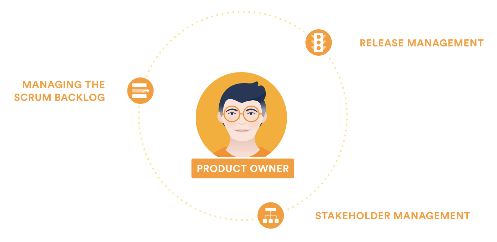

O PO não é um comitê, nem um grupo de pessoas — é **uma pessoa única**, com autoridade sobre as decisões relacionadas ao produto. Esse princípio é fundamental para garantir clareza, foco e alinhamento nas prioridades do time. Embora o Product Owner possa ouvir opiniões, sugestões ou recomendações de diversos stakeholders, a decisão final sobre o que será priorizado cabe exclusivamente a ele.

O sucesso do PO, no entanto, não depende apenas de sua capacidade individual, mas também do apoio e respeito da organização às suas decisões. Essas decisões são refletidas diretamente na ordem dos itens no Product Backlog e, consequentemente, no direcionamento do trabalho do Scrum Team.

As responsabilidades do Product Owner:

- **Gestão do Produto:** O PO atua na **macrogestão**, sendo responsável pela visão do produto, suas metas e pela entrega de valor para o negócio.
- **Maximização do Valor:** Garante que o trabalho do Scrum Team resulte no maior valor possível para o negócio e para os clientes.
- **Gestão do Product Backlog:** É o único responsável por criar, atualizar, ordenar e priorizar os itens do Product Backlog.
- **Definição e Comunicação da Meta do Produto:** No Scrum Guide de 2020, uma novidade foi a inclusão da **Meta do Produto** (Product Goal), que é de responsabilidade do PO comunicar de forma clara.
- **Visibilidade e Transparência:** Mantém o Product Backlog claro, visível e transparente para todos os envolvidos.
- **Garantia do ROI:** O PO é responsável por assegurar que o produto gere retorno sobre o investimento (ROI) da organização.
- **Facilitação do Entendimento:** Garante que os desenvolvedores compreendam suficientemente os itens do Product Backlog, tanto em termos de requisitos quanto de valor.

Algumas observações importantes:

- O PO pode delegar tarefas operacionais de gestão do Product Backlog, mas **a responsabilidade nunca é delegada**, ou seja, ele sempre será o responsável pela gestão.
- Nenhuma pessoa fora do PO pode alterar prioridades do backlog. Caso stakeholders queiram mudanças, devem negociar diretamente com ele.
- Para que esse papel funcione, é imprescindível que a organização apoie e respeite suas decisões, não permitindo interferências externas que prejudiquem o foco da equipe.

**Exemplo prático:** Imagine que uma empresa de tecnologia está desenvolvendo um aplicativo de entregas. O Product Owner desse projeto representa os interesses dos usuários, dos donos de restaurantes, dos entregadores e dos investidores. Cabe a ele decidir se a próxima funcionalidade será um sistema de rastreamento de entregas em tempo real, uma melhoria no sistema de pagamentos, ou a adição de um sistema de avaliação dos entregadores. Cada uma dessas decisões deve considerar o que gera mais valor no momento, respeitando a estratégia de negócio.

### Developers (DV): Os Construtores do Produto

Os **Developers**, ou desenvolvedores, são as pessoas responsáveis por transformar os itens priorizados no Product Backlog em funcionalidades prontas e utilizáveis. Eles são os verdadeiros construtores do produto e estão comprometidos em entregar, ao final de cada Sprint, um incremento que gere valor.

  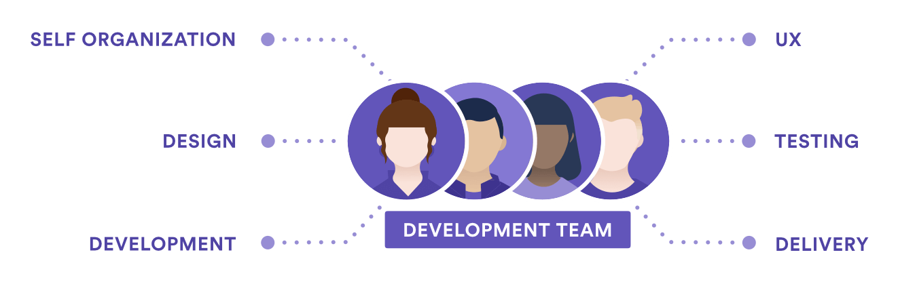

Com a atualização do Guia Scrum em 2020, o antigo termo **"Time de Desenvolvimento"** foi substituído por **"Developers"**. Essa mudança não é apenas semântica, mas também conceitual, pois elimina a percepção equivocada de que existe um sub-time dentro do Scrum Team. Agora, fica claro que o Scrum Team é uma unidade única, composta por três conjuntos de responsabilidades: **Product Owner, Scrum Master e Developers**, todos comprometidos com o mesmo objetivo.

As principais características dos Developers:

- **Auto-organização:** Eles decidem, de forma autônoma, como transformar os itens do Product Backlog em incrementos de produto. Nenhuma pessoa externa, nem mesmo o Scrum Master, pode determinar como eles farão seu trabalho.
- **Multifuncionalidade:** O grupo possui todas as habilidades necessárias para construir o incremento. Isso inclui atividades como análise, design, codificação, testes, documentação, entre outros.
- **Responsabilidade Coletiva:** Embora os membros possam ter especializações (ex.: programador, testador, analista), a responsabilidade pela entrega é coletiva. O Scrum não reconhece títulos internos.
- **Sem Subtimes:** Não existem subgrupos formais dentro dos Developers. Todos trabalham juntos, colaborativamente, na busca pela meta da Sprint.
- **Comprometimento com a Qualidade:** São responsáveis por garantir que os incrementos estejam aderentes à **Definição de Pronto** (_Definition of Done_).

Já as responsabilidades dos Developers:

- **Criação do Sprint Backlog:** Planejam o trabalho necessário para atingir a **Meta da Sprint**.
- **Comprometimento com a Entrega:** Trabalham diariamente adaptando seu plano para garantir que a meta da Sprint seja atingida.
- **Autogerenciamento:** Organizam-se sem a necessidade de um gerente externo.
- **Garantia de Qualidade:** Introduzem qualidade no trabalho, assegurando que tudo esteja aderente à Definição de Pronto.
- **Responsabilidade Compartilhada:** Mantêm um compromisso mútuo e se responsabilizam uns pelos outros.

O Guia Scrum 2020 recomenda, sem impor regras rígidas, que o **Scrum Team tenha 10 pessoas ou menos**, incluindo Product Owner e Scrum Master. Isso busca equilibrar agilidade e capacidade produtiva, evitando os problemas de comunicação e coordenação que surgem em times muito grandes.

**Exemplo prático:** Suponha que, no desenvolvimento de um sistema bancário, o Product Backlog tenha uma funcionalidade que permite aos clientes solicitar cartões de crédito. Os Developers planejam como vão desenvolver essa funcionalidade, definindo quais atividades serão necessárias (análise, implementação, testes, validação). Ninguém de fora pode interferir nesse planejamento ou dizer como eles devem executar suas tarefas. Eles são responsáveis, juntos, por transformar esse item em uma funcionalidade pronta para ser entregue.

### Scrum Master (SM): O Guardião do Processo

O **Scrum Master**, ou SM, é frequentemente chamado de **servo-líder** do Scrum Team. Sua principal missão é garantir que o Scrum esteja sendo bem compreendido, implementado e seguido. O SM atua como um facilitador, mentor e coach, tanto para o Scrum Team quanto para a organização.

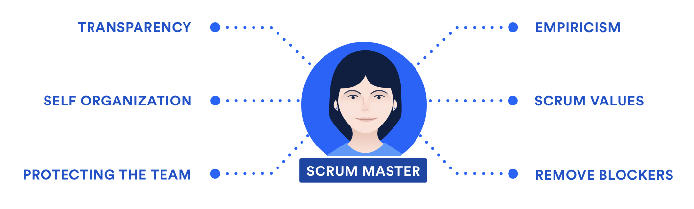

Diferente de um gerente tradicional, o Scrum Master **não possui autoridade hierárquica sobre o time**, tampouco toma decisões sobre o que será feito. Sua autoridade é sobre o processo, não sobre as pessoas. Ele atua removendo impedimentos, facilitando discussões, promovendo a melhoria contínua e garantindo que os princípios e valores do Scrum sejam respeitados.

São responsabilidades do Scrum Master:

- **Gestão do Processo:** Garante que o framework Scrum seja bem compreendido e corretamente aplicado.
- **Facilitação:** Atua como facilitador das cerimônias (eventos) do Scrum, assegurando que elas aconteçam de forma eficiente, mas não as conduz.
- **Mentoria e Coaching:** Treina o Product Owner, os Developers e até a organização nos princípios e práticas do Scrum.
- **Remoção de Impedimentos:** Atua ativamente para remover qualquer barreira que esteja atrapalhando o time na entrega da Sprint.
- **Proteção do Time:** Protege o Scrum Team de interferências externas que possam comprometer seu foco e desempenho.
- **Transformação Organizacional:** Trabalha com a organização para ajudá-la a compreender como interagir com times Scrum, promovendo uma cultura ágil.

A atuação do Scrum Master nos três níveis é:

- **Para o Product Owner:**
    - Ajuda na definição e ordenação do Product Backlog.
    - Ensina técnicas eficazes de gestão de backlog.
    - Apoia na comunicação da visão, das metas e dos itens do backlog para o time.

- **Para os Developers:**
    - Treina o time em autogestão, colaboração e melhoria contínua.
    - Facilita a remoção de impedimentos que possam comprometer a Sprint.
    - Auxilia o time na busca pela qualidade e entrega de valor.

- **Para a Organização:**
    - Lidera e apoia a transformação ágil da organização.
    - Promove entendimento sobre o Scrum, seus papéis, eventos e artefatos.
    - Ensina quais interações com o Scrum Team são úteis e quais devem ser evitadas.

**Exemplo prático:** Imagine um time que, durante uma Sprint, percebe que depende da liberação de um ambiente de homologação, controlado por outra área da empresa. O Scrum Master atua imediatamente, conversando com os responsáveis, intermediando negociações, buscando soluções para remover esse impedimento, permitindo que o time não perca seu ritmo. Além disso, ele ajuda a organização a entender que criar gargalos externos pode comprometer o fluxo ágil de trabalho.

## Artefatos do Scrum

Dentro do framework Scrum, os artefatos são elementos fundamentais que proporcionam transparência, alinhamento e foco no trabalho que está sendo realizado pela equipe. Segundo o **Guia do Scrum**, os artefatos têm como objetivo representar trabalho ou valor, e são projetados para maximizar a transparência das informações essenciais, de forma que todos — tanto membros da equipe quanto stakeholders — compartilhem uma visão comum e inequívoca sobre o estado atual do projeto.

A definição dos artefatos evoluiu ao longo dos anos. Na versão de 2017 do Guia, enfatizava-se que os artefatos eram instrumentos para fornecer transparência e viabilizar a inspeção e a adaptação — dois dos três pilares do empirismo que sustentam o Scrum. Já na versão de 2020, além de manter esse princípio, o Guia reforça a importância dos compromissos associados a cada artefato, tornando-os não apenas repositórios de informações, mas também instrumentos de foco e comprometimento com os objetivos do time.

Os três artefatos oficiais do Scrum são:

- **Product Backlog** (Backlog do Produto);
- **Sprint Backlog** (Backlog da Sprint);
- **Product Increment** (Incremento do Produto).

Cada artefato está diretamente ligado a um compromisso que sustenta sua transparência e orienta seu uso:

- O **Product Backlog** está vinculado à **Meta do Produto**.
- O **Sprint Backlog** está vinculado à **Meta da Sprint**.
- O **Incremento** está vinculado à **Definição de Pronto** (_Definition of Done_).

Esses compromissos existem para reforçar o empirismo e os valores do Scrum, ajudando o Scrum Team e seus stakeholders a manterem um alinhamento claro sobre o progresso e os objetivos.

### Product Backlog

O **Product Backlog** é, essencialmente, uma lista ordenada, dinâmica e viva que contém tudo o que é necessário para que o produto atenda às expectativas das partes interessadas. É o artefato que concentra **todos os requisitos conhecidos do produto**, sejam eles funcionais, não funcionais, técnicos, de infraestrutura ou até mesmo relacionados à mitigação de riscos.

Mas, afinal, o que significa o termo **“backlog”**? No contexto geral, backlog pode ser entendido como uma **fila de trabalho**, uma lista de pendências ou um histórico acumulado de demandas a serem executadas. No caso do Scrum, o **Product Backlog** representa exatamente isso: um repositório organizado de tudo aquilo que o time deve considerar para desenvolver, manter e evoluir o produto.

Por definição, o Product Backlog **nunca estará completo**. Ele é um artefato **em constante evolução**, que se modifica sempre que surgem novos requisitos, mudanças nas prioridades, descobertas técnicas ou até alterações nas necessidades do mercado e dos usuários. Enquanto o produto existir, o Product Backlog também existirá.

A responsabilidade pela gestão do Product Backlog é do **Product Owner (PO)**. É ele quem decide:

- Quais itens entram no backlog;
- Como eles são descritos;
- A ordem em que aparecem (priorização);
- E quando eles podem ser removidos.

É importante ressaltar que, embora o PO tenha essa responsabilidade, o refinamento dos itens do backlog é uma atividade que **envolve todo o Scrum Team**, especialmente os Developers, que ajudam a esclarecer dúvidas, decompor funcionalidades e estimar esforços.

#### Representação dos Itens

De modo geral, os itens do Product Backlog são comumente representados por **Histórias de Usuário (User Stories)**, mas isso não é uma regra fixa. Dependendo do contexto e da maturidade da equipe, podem ser utilizados outros formatos, como:

- Descrições textuais de funcionalidades;
- Cenários de casos de uso;
- Especificações técnicas;
- Itens de arquitetura;
- Demandas de infraestrutura;
- E até itens relacionados à redução de riscos ou pagamento de dívidas técnicas.

Uma **História de Usuário**, por exemplo, é uma forma simples, centrada no usuário, de descrever um requisito. Normalmente segue o formato:

> "**Como** [tipo de usuário], **eu quero** [ação/desejo] **para que** [objetivo/motivo]."

Por exemplo:

> "Como usuário do Twitter, eu quero poder excluir um tuíte, para que eu possa remover publicações indesejadas."

Itens mais importantes e de maior valor para o negócio são priorizados no topo do backlog. Naturalmente, são também os itens mais bem detalhados, pois estarão mais próximos de serem selecionados para desenvolvimento. Já os itens de menor prioridade ficam mais abaixo, geralmente com menos detalhes, podendo ser refinados no futuro, caso sua prioridade aumente.

#### A Dinâmica do Product Backlog

É perfeitamente comum que, no decorrer do projeto, algumas funcionalidades percam importância e sejam até descartadas, enquanto outras sejam adicionadas. Isso reflete a realidade dinâmica dos ambientes ágeis, onde mudanças são esperadas e bem-vindas, desde que gerem valor.

Por exemplo, imagine que você está desenvolvendo uma rede social chamada **DevConnect**, voltada para desenvolvedores. No início, seu Product Backlog contém itens como:

- Permitir postar conteúdos (alta prioridade);
- Sistema de curtidas (alta prioridade);
- Chat entre usuários (média prioridade);
- Feed personalizado por linguagens (baixa prioridade).

Após algumas sprints, percebe-se que o chat não é tão relevante, pois os usuários estão mais interessados em interações públicas via comentários. Assim, esse item é descartado. Por outro lado, surge uma nova necessidade: permitir integração com repositórios do GitHub, que então entra no topo do backlog.

#### Definition of Ready (DoR)

Para que um item do Product Backlog esteja apto a ser selecionado durante o **Sprint Planning**, ele deve estar suficientemente claro e pequeno a ponto de ser concluído dentro de uma única sprint. Esse estado é conhecido como **Definition of Ready (DoR)**.

A **DoR** não é uma prática oficial do Scrum, mas é amplamente utilizada por muitas equipes ágeis para evitar problemas comuns, como requisitos mal definidos ou divergências de entendimento entre PO e Developers. Trata-se de um **acordo interno do time** que define critérios mínimos para que um item seja considerado pronto para desenvolvimento.

Por exemplo, a DoR pode estabelecer que uma história de usuário deve conter:

- Descrição clara e objetiva;
- Critérios de aceitação bem definidos;
- Impactos técnicos ou dependências identificadas;
- Esforço estimado;
- Validação de que não existem bloqueios.

Se um item não atende à DoR, ele não deve ser selecionado para a sprint.

Por exemplo, em uma equipe se o Product Owner entregasse histórias de usuário com descrições vagas, como: “Melhorar a performance do sistema”. Isso geraria confusão: o que exatamente significava “melhorar”? Quais métricas? Quais pontos do sistema? Isso resultava em retrabalho e discussões no final das sprints.

A solução foi criar uma DoR onde, para qualquer item relacionado a performance, deveriam ser definidos:

- Métricas atuais e metas desejadas;
- Quais módulos seriam otimizados;
- Critérios claros para considerar o trabalho concluído.

A partir disso, as entregas passaram a ser muito mais alinhadas com as expectativas.

#### Refinamento do Product Backlog

O processo de **refinamento** é uma atividade contínua que envolve decompor itens grandes (épicos) em itens menores (histórias de usuário), esclarecer requisitos, discutir soluções e ajustar estimativas.

Embora o Scrum não defina uma cerimônia específica para isso, o Guia recomenda que o refinamento **não consuma mais de 10% da capacidade do time na sprint**.

O refinamento pode ocorrer de forma:

- **Formalizada**, com reuniões específicas de backlog refinement;
- **Informal**, acontecendo naturalmente durante as interações do time.

#### Monitoramento do Progresso

O Product Owner é responsável por acompanhar o progresso do time em direção à **Meta do Produto**. Isso pode ser feito utilizando métricas visuais, como:

- **Burndown Charts:** mostram a quantidade de trabalho restante na sprint ou no projeto;
- **Burnup Charts:** evidenciam o progresso acumulado até atingir o total de trabalho planejado;
- **Fluxos Cumulativos:** ajudam a identificar gargalos e analisar o fluxo de trabalho.

Contudo, vale reforçar que essas ferramentas são apenas **auxiliares**, não substituindo o princípio básico do empirismo no Scrum. Em ambientes complexos, o melhor preditor do futuro é o aprendizado obtido a partir das entregas anteriores.

#### Compromisso: Meta do Produto

A **Meta do Produto** é o compromisso associado ao Product Backlog. Trata-se de um objetivo de longo prazo que dá direção ao Scrum Team. Enquanto a sprint possui uma meta específica de curto prazo (a **Meta da Sprint**), a Meta do Produto guia a evolução do backlog, orientando as escolhas de priorização.

Um produto pode ter como meta, por exemplo:

> “Permitir que usuários criem, compartilhem e colaborem em projetos de código aberto diretamente pela plataforma.”

Enquanto essa meta não for alcançada — ou até que seja abandonada e substituída —, os itens do Product Backlog existirão para apoiar seu cumprimento.

### Sprint Backlog

O Sprint Backlog é um dos principais artefatos dentro do framework Scrum e desempenha um papel essencial no acompanhamento e na organização do trabalho que será executado durante uma Sprint. Sua correta compreensão é indispensável para a prática eficiente do Scrum, tanto em ambientes acadêmicos quanto no mercado profissional.

De forma conceitual, o Sprint Backlog pode ser definido como o conjunto de itens selecionados do Product Backlog para serem desenvolvidos durante uma Sprint, acrescido da meta da Sprint e de um plano de ação que descreve como esses itens serão transformados em um incremento de produto que seja funcional e potencialmente utilizável. Importante ressaltar que o Sprint Backlog é criado e gerenciado exclusivamente pelos desenvolvedores — ou seja, é de responsabilidade total e direta desse grupo.

Para compreender melhor este conceito, é fundamental diferenciar claramente o **Product Backlog** do **Sprint Backlog**, já que essa é uma das confusões mais comuns entre estudantes, profissionais e até candidatos em processos de certificação Scrum.

O **Product Backlog** é uma lista ordenada de tudo aquilo que é necessário no produto. Ele representa os requisitos, funcionalidades, melhorias e correções que descrevem o que o produto deve ter ou fazer. É um artefato de natureza dinâmica e evolutiva, sendo constantemente refinado e priorizado pelo Product Owner à medida que se aprende mais sobre o produto e seu contexto de desenvolvimento.

Por sua vez, o **Sprint Backlog** é um subconjunto do Product Backlog. Trata-se da seleção dos itens que foram priorizados para serem implementados em uma Sprint específica, acompanhados da meta da Sprint e de um plano detalhado que descreve como esses itens serão transformados em funcionalidades prontas. Esse plano é geralmente composto por tarefas técnicas que desmembram cada item selecionado em ações menores, concretas e viáveis de serem realizadas dentro do período da Sprint.

Uma característica essencial do Sprint Backlog é sua **alta visibilidade**. Ele funciona como uma fotografia em tempo real do trabalho que os desenvolvedores planejam concluir durante aquela Sprint. Essa visibilidade não é apenas interna ao time, mas muitas vezes é disponibilizada de forma transparente para toda a organização, especialmente em ambientes que prezam por uma cultura ágil e colaborativa.

Além disso, é fundamental compreender que o Sprint Backlog **pertence exclusivamente aos desenvolvedores**. Somente eles têm autoridade para modificá-lo ao longo da Sprint. Se, durante a execução, surgirem descobertas sobre tarefas adicionais necessárias, essas podem ser prontamente incluídas. Da mesma forma, se determinadas tarefas se mostrarem irrelevantes ou desnecessárias, podem ser removidas sem qualquer prejuízo, desde que essa alteração não comprometa a meta da Sprint.

Outro ponto relevante é que o progresso dentro da Sprint é monitorado de forma constante. A cada **Reunião Diária (Daily Scrum)**, os desenvolvedores avaliam o total do trabalho restante e utilizam essas informações para projetar se estão no caminho certo para alcançar a meta estabelecida. Isso permite ajustes rápidos, promovendo um gerenciamento dinâmico e eficiente do próprio trabalho.

#### Monitorando o Progresso: Um Processo Contínuo e Adaptativo

O acompanhamento do progresso durante a Sprint é uma prática constante e imprescindível no Scrum. A qualquer momento, o time pode somar o total de trabalho remanescente no Sprint Backlog para avaliar o quanto falta ser concluído. Esse monitoramento não é meramente operacional, mas estratégico, permitindo que os desenvolvedores tomem decisões embasadas sobre priorização, replanejamento de tarefas e eventuais renegociações com o Product Owner, caso surjam imprevistos.

Essa prática de inspecionar frequentemente o trabalho restante, somada à transparência proporcionada pelo Sprint Backlog, é o que torna o Scrum altamente adaptativo e responsivo às mudanças, garantindo que os riscos sejam minimizados e que as entregas tenham maior previsibilidade.

#### Evolução do Conceito nas Versões do Guia Scrum

A definição e os detalhes sobre o Sprint Backlog passaram por alguns ajustes importantes ao longo das versões do **Guia Scrum**.

Na versão de **2017**, o Guia Scrum introduziu um reforço explícito sobre a importância da **melhoria contínua**. Passou a ser recomendado que, a cada Sprint, fosse incluído no Sprint Backlog ao menos um item de alta prioridade relacionado à melhoria dos processos internos, identificado na reunião de retrospectiva anterior. Esse movimento destacava que o Scrum não se concentra apenas na entrega de funcionalidades, mas também na evolução constante do próprio time, dos processos e das práticas adotadas.

Contudo, na versão de **2020**, essa recomendação específica foi removida do texto oficial. Isso não significa, porém, que a melhoria contínua deixou de ser um princípio do Scrum; ela continua sendo um valor implícito e fundamental. A diferença é que, na nova abordagem, oferece-se mais liberdade e autonomia para que os times decidam como conduzir essa melhoria, sem uma prescrição direta no artefato Sprint Backlog.

Além dessa alteração, a versão de 2020 trouxe uma descrição mais clara e organizada sobre os componentes do Sprint Backlog. Passou-se a defini-lo explicitamente como composto por três elementos principais:

- **Por que:** A **Meta da Sprint**, que fornece propósito, alinhamento e foco. Ela representa o objetivo que o time busca atingir naquela Sprint, funcionando como um guia norteador.
- **O que:** O conjunto de **itens selecionados do Product Backlog**, que descrevem o que será entregue no incremento da Sprint.
- **Como:** O **plano de ação**, que detalha as atividades e tarefas necessárias para transformar os itens selecionados em um incremento funcional.

Essa estrutura permite uma visão muito mais clara, tanto para os membros do time quanto para stakeholders externos, sobre os objetivos, escopo e estratégias daquela Sprint.

#### Compromisso: Meta da Sprint

Com as atualizações mais recentes do Scrum, o Sprint Backlog passou a incorporar formalmente um compromisso: a **Meta da Sprint**.

A Meta da Sprint não é apenas um artefato textual, mas um elemento que exerce papel fundamental no direcionamento do trabalho. Embora ela seja um compromisso assumido coletivamente pelos desenvolvedores, ela também oferece flexibilidade. Isso significa que, embora a Meta deva ser preservada durante a Sprint, o caminho exato para alcançá-la pode ser ajustado. Se, no decorrer da Sprint, os desenvolvedores perceberem que algumas tarefas precisam ser modificadas, substituídas ou até removidas, isso pode ser feito desde que a Meta da Sprint continue sendo viável e relevante.

Essa abordagem promove alinhamento, foco e colaboração, evitando que o time se disperse em atividades paralelas ou sem impacto real para o objetivo daquela iteração.

Para ilustrar de forma concreta como se estrutura um Sprint Backlog, podemos recorrer a um exemplo prático baseado no Guia Scrum de 2017 (Backlog do Produto Twitter):

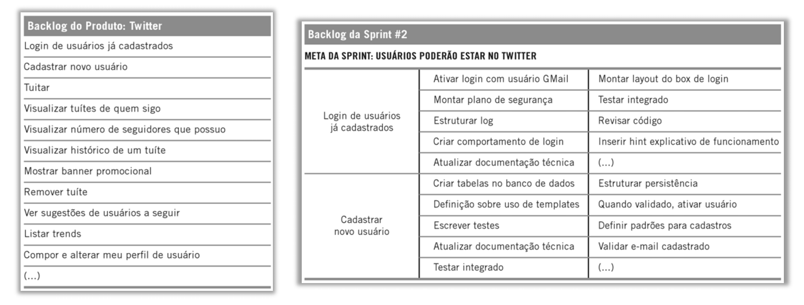

Imagine que estamos desenvolvendo uma plataforma social e, na **Sprint 2**, a meta é que os usuários possam se cadastrar na plataforma e realizar o login.

- No lado esquerdo do quadro, temos itens do **Product Backlog**, como:
	- Cadastrar novo usuário;
    - Login de usuários já cadastrados.
- No lado direito, aparece o **Sprint Backlog**, que detalha as tarefas necessárias para transformar esses itens em funcionalidades completas, tais como:
    - Ativar login com usuário Gmail;
    - Estruturar log;
    - Criar tabelas no banco de dados, etc.

Essas tarefas representam o “**como**” e detalham tecnicamente o que precisa ser feito para entregar as funcionalidades prometidas. A Meta da Sprint, nesse caso, funciona como o grande objetivo motivador: **“Usuários poderão estar no Twitter”**.

À medida que o time avança na Sprint, as tarefas são marcadas como concluídas, ajustadas ou, quando necessário, atualizadas, sempre tendo em mente o progresso em direção à Meta.

### Product Increment

Um dos conceitos mais fundamentais dentro do Scrum, e que representa de forma muito clara a natureza empírica desse framework, é o **Product Increment**, ou Incremento de Produto.

O Incremento de Produto corresponde à **soma de todos os itens do Product Backlog que foram concluídos durante uma Sprint**, somando-se ainda ao valor dos incrementos produzidos nas Sprints anteriores. No entanto, para que um incremento seja efetivamente considerado válido e relevante, ele precisa atender a um critério extremamente importante no Scrum: estar **“Pronto” (Done)**, segundo um conjunto de critérios muito bem estabelecido e compartilhado por toda a equipe.

Ao final de cada Sprint, os desenvolvedores entregam um incremento do produto, que nada mais é do que o resultado prático de todo o trabalho realizado durante aquele ciclo. Esse conceito não apenas reflete o progresso obtido, mas também permite que o Product Owner visualize claramente o retorno sobre o investimento realizado até aquele ponto. Além disso, torna possível avaliar quais são os próximos passos, se surgem novas necessidades, ou se há oportunidade para revisar prioridades.

Do ponto de vista da equipe de desenvolvimento, é essencial compreender que o incremento precisa ser algo **potencialmente entregável** ou **liberável**. E por que utilizamos o termo “potencialmente”? Isso ocorre porque, embora o incremento esteja tecnicamente pronto para ser utilizado, **a decisão de efetivamente liberá-lo ou não cabe ao Product Owner**, que irá avaliar se aquele incremento agrega valor imediato para os stakeholders ou se sua disponibilização deve ser postergada.

Essa exigência de que o incremento seja potencialmente liberável leva a uma reflexão extremamente relevante sobre a qualidade do que é produzido. O Scrum deixa claro que um trabalho só pode ser considerado concluído se ele realmente atender a critérios objetivos de qualidade, completude e aderência às expectativas.

É justamente nesse contexto que surge o conceito de **Definition of Done**, ou **Definição de Pronto**, um dos compromissos essenciais dentro do Scrum.

#### A Importância da Definition of Done (DoD)

Quando dizemos, em uma equipe ágil, que uma funcionalidade está “pronta”, isso precisa significar, de forma inequívoca, que ela está completa, testada e com qualidade suficiente para ser entregue, sem a necessidade de complementações posteriores.

O Definition of Done (DoD) é, portanto, um **acordo formal, objetivo e transparente**, que define quais são os critérios mínimos que devem ser cumpridos para que um item do Product Backlog, ou um incremento, seja considerado concluído. Trata-se, na prática, de um **checklist de critérios de aceite**, que contempla todas as etapas e atividades necessárias — como desenvolvimento, testes unitários, testes de integração, revisão de código, documentação mínima, implantação em ambiente de testes, entre outras etapas que a equipe julgar pertinentes.

Dessa maneira, o DoD funciona como uma espécie de **contrato informal entre os Developers e o Product Owner**, assegurando que todo incremento produzido esteja dentro dos padrões de qualidade esperados e acordados desde o início.

#### Definition of Done versus Definition of Ready

Para que possamos compreender melhor a função do DoD, é interessante compará-lo com outro conceito muito conhecido em ambientes ágeis: o **Definition of Ready (DoR)**.

Enquanto o DoR representa um conjunto de critérios que define quando um item do Product Backlog está suficientemente bem descrito, claro, viável e compreendido para que os desenvolvedores possam iniciá-lo, o DoD atua na outra ponta do processo. Ele define quando o trabalho sobre esse item pode ser considerado efetivamente concluído e pronto para entrega ou validação.

Em outras palavras:

- O **DoR** responde à pergunta: “Quando podemos começar a trabalhar nisso?”
- O **DoD** responde à pergunta: “Quando isso está realmente pronto?”

Ambos são critérios de aceite, mas se aplicam a momentos diferentes do ciclo de desenvolvimento. Importante ressaltar que, embora o DoR seja uma prática recomendada, ele não é obrigatório no framework Scrum. Já o **Definition of Done é obrigatório**, sendo um dos principais pilares que garantem a qualidade e a transparência no trabalho realizado.

#### Critérios Comuns na Definition of Done

Ainda que o DoD possa variar bastante entre diferentes equipes e organizações, existem critérios que costumam ser recorrentes, tais como:

- Código implementado, testado e funcionando conforme os requisitos;
- Passagem bem-sucedida por testes unitários e de integração;
- Validação dos critérios de aceite definidos pelo Product Owner;
- Código revisado, documentado e versionado corretamente;
- Implementação de testes automatizados, quando aplicável;
- Publicação em ambiente de homologação para validação;
- Aprovação formal por parte do Product Owner.

Naturalmente, esses critérios podem (e devem) ser adaptados às necessidades, características e maturidade da equipe e da organização.

#### O Que Acontece se Algo Não Está Pronto?

No Scrum, se uma funcionalidade não atende aos critérios estabelecidos no DoD ao final da Sprint, ela **não pode ser considerada parte do incremento**. Isso significa que ela não será apresentada na Sprint Review, muito menos liberada para produção ou para os stakeholders.

O destino desse item é simples: ele retorna ao **Product Backlog**, onde poderá ser replanejado, reestimado e priorizado novamente em uma Sprint futura.

Esse comportamento reforça o princípio da **qualidade como um valor inegociável** dentro do Scrum. Afinal, não faz sentido entregar funcionalidades incompletas, mal testadas ou que não atendem às expectativas dos clientes e usuários.

#### Evolução Contínua da Definition of Done

Outro aspecto muito interessante e relevante sobre o DoD é que ele **não é um documento estático**. Assim como o próprio time e o próprio produto evoluem ao longo do tempo, é perfeitamente natural que os critérios do DoD também evoluam.

À medida que a equipe adquire mais maturidade, desenvolve melhores práticas e supera desafios técnicos e operacionais, ela pode — e deve — revisar seu Definition of Done, tornando-o mais robusto, completo e alinhado com as necessidades do negócio.

Por exemplo, uma equipe que inicialmente não tinha capacidade para realizar testes automatizados pode incluir esse critério no DoD após adquirir domínio sobre ferramentas e processos de automação. Da mesma forma, uma organização que passa a adotar padrões corporativos de segurança ou _compliance_ pode exigir que esses requisitos sejam incorporados ao DoD de todos os times.

#### Padrões Organizacionais e DoD Compartilhado

Quando falamos de organizações que possuem múltiplos times Scrum trabalhando sobre um mesmo produto ou plataforma, surge a necessidade de um alinhamento ainda mais rigoroso sobre o que significa “pronto”.

Se a organização já possui **padrões organizacionais de Definition of Done**, todos os times devem segui-los como critério mínimo. Caso contrário, cabe aos times envolvidos estabelecerem, de forma colaborativa, um **Definition of Done compartilhado**, garantindo que todos os incrementos produzidos estejam alinhados e compatíveis entre si.

Essa prática não só evita retrabalho, como também assegura que o produto como um todo mantenha uma consistência em termos de qualidade, arquitetura, testes e entrega de valor.

#### Product Increment no Guia Scrum 2017 e 2020

É interessante observar que o conceito de Product Increment foi evoluindo nas diferentes versões do Guia Scrum.

**No Guia Scrum 2017**, o incremento era descrito como:

> “A soma de todos os itens do Backlog do Produto completados durante a Sprint e o valor dos incrementos de todas as Sprints anteriores. Ao final da Sprint um novo incremento deve estar ‘Pronto’, o que significa que deve estar na condição de ser utilizado e atender à definição de ‘Pronto’ do Time Scrum.”

**No Guia Scrum 2020**, a definição foi aprimorada, enfatizando ainda mais a relação entre o incremento e a meta do produto:

> “Um incremento é um trampolim concreto em direção à Meta do Produto. Cada incremento é adicionado a todos os incrementos anteriores e completamente verificado, garantindo que todos os incrementos funcionem juntos. A fim de fornecer valor, o incremento deve ser utilizável. Vários incrementos podem ser criados em uma Sprint. A soma dos incrementos é apresentada na Sprint Review, apoiando assim o empirismo. No entanto, um incremento pode ser entregue aos stakeholders antes do final da Sprint.”

Percebe-se, portanto, uma evolução no entendimento do papel do incremento, não apenas como um artefato isolado da Sprint, mas como um componente essencial no avanço contínuo em direção à **Meta do Produto (Product Goal)**.

#### Compromisso Associado: Definition of Done

No Scrum, cada artefato possui um compromisso que reforça sua transparência e sua entrega de valor. No caso do Product Increment, esse compromisso é exatamente o **Definition of Done (DoD)**.

De acordo com o Guia Scrum 2020:

> “A Definition of Done é uma descrição formal do estado do Incremento quando ele atende às medidas de qualidade exigidas para o produto. No momento em que um item do Product Backlog atende à Definition of Done, um incremento nasce.”

Isso significa que a DoD não apenas define o que é considerado “pronto”, mas também atua como um elemento de transparência dentro do framework, garantindo que todos os membros da equipe e os stakeholders tenham um entendimento comum e inequívoco sobre o que foi efetivamente entregue.

Caso algum item do Product Backlog não atenda aos critérios da DoD, ele não pode ser incluído no incremento, não pode ser apresentado na Sprint Review, nem muito menos ser liberado para produção. Esse item deve, portanto, ser devolvido ao Product Backlog para ser reavaliado, priorizado e tratado no futuro.

### Burndown Chart: Um Artefato Complementar

Embora não seja oficialmente reconhecido como um artefato formal no Guia Scrum, é muito comum — e altamente recomendado — que os times utilizem o **Gráfico Burndown** como uma ferramenta de apoio ao acompanhamento do trabalho durante a Sprint.

O Burndown Chart permite **visualizar, de forma clara e objetiva, o progresso do time em direção ao cumprimento dos itens planejados para a Sprint**, comparando o trabalho planejado com o trabalho efetivamente realizado ao longo dos dias.

Basicamente, o gráfico apresenta uma linha descendente que representa a quantidade estimada de trabalho restante. As unidades normalmente utilizadas são horas de esforço, pontos de história ou qualquer outra métrica acordada pela equipe.

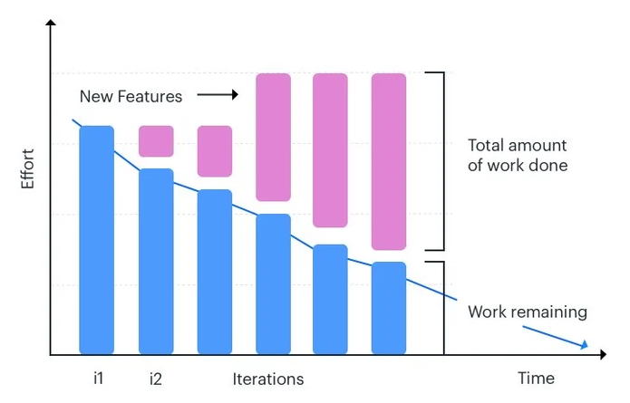

Essa ferramenta é extremamente útil não apenas para o time, mas também para os gestores, que podem acompanhar o andamento da Sprint e identificar eventuais desvios, gargalos ou necessidades de ajuste, tanto em relação ao tempo quanto ao esforço empregado.

## Eventos no Scrum

Dentro do framework Scrum, os **eventos** desempenham um papel central na organização do trabalho, na promoção da transparência e na aplicação dos pilares fundamentais do empirismo: **transparência, inspeção e adaptação**. Esses eventos são, muitas vezes, chamados de **reuniões** ou até mesmo de **cerimônias**, especialmente em contextos acadêmicos, provas de certificações ou na prática das equipes.

A definição e realização adequada dos eventos Scrum não são meramente questões formais ou burocráticas. Pelo contrário, eles são mecanismos fundamentais que garantem que o desenvolvimento do produto ocorra de forma estruturada, eficiente e aderente aos princípios ágeis. Cada evento possui uma finalidade bem definida e uma duração máxima previamente estipulada, conceito conhecido como **time-box**. Isso significa que o evento não pode ultrapassar esse tempo, embora possa ser encerrado antes, desde que seu objetivo tenha sido alcançado.

Falhar em conduzir corretamente qualquer um desses eventos reduz drasticamente a eficácia do Scrum, pois compromete a visibilidade do trabalho, prejudica os momentos de inspeção e, consequentemente, limita as oportunidades de adaptação do processo e do produto.

### Sprint: O Contêiner de Todos os Eventos

Antes de mergulharmos nos eventos específicos, é crucial compreender o papel da **Sprint**, que funciona como um verdadeiro contêiner para todos os outros eventos do Scrum. Ela não é apenas uma etapa, mas sim o ciclo completo no qual todo o trabalho ocorre, incluindo planejamento, execução, acompanhamento e avaliação.

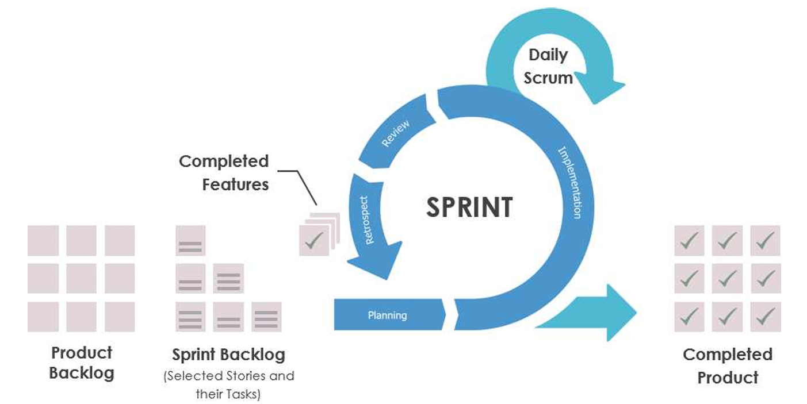

A Sprint possui uma duração fixa, que pode ser de até **um mês**, embora muitas equipes adotem ciclos menores, como duas ou três semanas, dependendo das necessidades do projeto e do ambiente organizacional. Independentemente da duração escolhida, o mais importante é que ela se mantenha **consistente** ao longo do desenvolvimento, promovendo regularidade, previsibilidade e estabilidade no processo.

Mas, afinal, o que exatamente acontece durante uma Sprint? Para ilustrar, imagine que você tenha contratado um marceneiro para construir os armários do apartamento que você acabou de comprar. Existem basicamente duas formas de conduzir esse projeto. Na abordagem tradicional, você explicaria todos os detalhes do que deseja, ele passaria alguns meses construindo os móveis em sua oficina, e só no final traria tudo pronto para ser instalado. Se houvesse qualquer equívoco no entendimento, você só descobriria no fim do processo, o que poderia gerar frustração, retrabalho e desperdícios.

Agora, pense na abordagem ágil, representada pelo Scrum. Nessa abordagem, vocês combinariam ciclos regulares — por exemplo, de quinze em quinze dias. Ao final de cada ciclo, o marceneiro entregaria uma parte funcional dos móveis. Na primeira quinzena, ele entrega os armários do banheiro, já instalados e prontos para uso. Na quinzena seguinte, os armários da área de serviço. Na terceira quinzena, parte dos armários do quarto, como o guarda-roupa. Assim, a cada ciclo, você recebe um **incremento funcional** que já pode ser utilizado, além de ter a oportunidade de sugerir ajustes antes que o restante seja construído.

Essa metáfora é extremamente poderosa para compreender o funcionamento da Sprint. Assim como no exemplo, ao final de cada Sprint no desenvolvimento de software, deve ser entregue um **incremento potencialmente utilizável**, ou seja, uma parte do produto que já possa, em tese, ser colocada em produção e gerar valor para o cliente.

#### As Regras da Sprint

O Scrum estabelece regras claras que regem o funcionamento da Sprint. Uma vez iniciado o ciclo, alguns princípios devem ser rigidamente respeitados:

- **Não são permitidas mudanças que coloquem em risco o objetivo da Sprint.** Por exemplo, se a equipe planejou desenvolver uma funcionalidade de pagamento com cartão utilizando determinado framework, não é aceitável, no meio da Sprint, trocar esse framework, pois isso comprometeria os prazos e a entrega combinada.
- **As metas de qualidade não podem ser reduzidas.** O compromisso com a qualidade é inegociável no Scrum.
- **O escopo da Sprint pode ser renegociado, mas nunca de forma arbitrária.** Conforme surgem novos aprendizados durante o desenvolvimento, o Product Owner e os desenvolvedores podem, juntos, ajustar e esclarecer o escopo, desde que isso não comprometa o objetivo central da Sprint.

Essa combinação de rigidez nos objetivos, mas flexibilidade no entendimento do escopo, é um dos grandes diferenciais do Scrum, pois permite um equilíbrio saudável entre planejamento e adaptação.

#### Cancelamento de uma Sprint

Uma Sprint pode, sim, ser cancelada, mas essa é uma decisão extrema e rara. Apenas o **Product Owner** possui autoridade para cancelar uma Sprint, embora essa decisão possa ser tomada com base em recomendações ou influências de outros membros, como o Scrum Master, os desenvolvedores ou stakeholders.

O cancelamento só deve ocorrer se a **Meta da Sprint se tornar obsoleta**, o que pode acontecer, por exemplo, se:

- A organização mudar sua estratégia;
- O mercado sofrer uma alteração brusca;
- Surgirem mudanças tecnológicas que inviabilizem o trabalho planejado.

Quando uma Sprint é cancelada:

- Qualquer trabalho concluído e considerado **“Pronto”** é revisado e, se estiver de acordo, pode ser liberado.
- Os itens do **Product Backlog** que não foram concluídos retornam ao backlog, sendo reavaliados, reestimados e priorizados novamente.
- Há consumo de tempo e recursos para reorganizar uma nova Sprint, já que é necessário realizar um novo **Sprint Planning**.
- Além disso, o cancelamento pode ser **emocionalmente desgastante** para a equipe, pois quebra o ritmo de trabalho e gera frustração.

É importante observar que, devido à curta duração das Sprints, o cancelamento é uma prática extremamente incomum e só se justifica em cenários excepcionais.

#### Por que a Sprint é tão importante?

O coração do Scrum pulsa na Sprint. É nela que todo o trabalho acontece. Ela não apenas delimita o tempo disponível para desenvolvimento, mas também estabelece um **ritmo sustentável**, favorecendo ciclos constantes de feedback, aprendizado, entrega de valor e melhoria contínua.

A Sprint permite:

- **Previsibilidade**, uma vez que, ao trabalhar em ciclos curtos e regulares, a equipe pode acompanhar o progresso e ajustar as rotas rapidamente;
- **Limitação de riscos**, pois qualquer erro ou problema detectado impacta, no máximo, aquele ciclo, e não todo o projeto;
- **Aumento da produtividade e da qualidade**, já que existe uma cadência constante e foco total nas metas daquele ciclo.

A prática de dividir o desenvolvimento em Sprints também fortalece a **cultura de entregas frequentes**, reduzindo a ansiedade de esperar por grandes lançamentos e permitindo que o cliente perceba valor incremental continuamente.

#### Os Eventos que Acontecem Dentro da Sprint

Além do próprio trabalho de desenvolvimento, a Sprint é composta por quatro eventos fundamentais, cada um com objetivos bem definidos:

1. **Sprint Planning (Planejamento da Sprint):** Onde se define o que será feito na Sprint e como o trabalho será realizado;
2. **Daily Scrum (Reunião Diária):** Encontro diário para sincronizar as atividades e planejar o trabalho das próximas 24 horas;
3. **Sprint Review (Revisão da Sprint):** Apresentação do incremento desenvolvido, coletando feedback dos stakeholders;
4. **Sprint Retrospective (Retrospectiva da Sprint):** Momento para reflexão da equipe sobre o processo, identificando pontos de melhoria.

Todos esses eventos são **time-boxed**, ou seja, possuem uma duração máxima predeterminada, e devem ocorrer **sempre nos mesmos horários e locais**, quando possível, para reduzir a complexidade logística e manter a regularidade do trabalho.

Cada evento é uma oportunidade formal de aplicar os pilares do Scrum, permitindo a **inspeção dos artefatos**, a avaliação do andamento do trabalho e a **adaptação contínua**. A omissão de qualquer evento reduz diretamente a transparência e enfraquece a eficácia do framework.

### Sprint Planning: Planejamento da Sprint

O **Planejamento da Sprint**, conhecido internacionalmente como **Sprint Planning**, é um evento fundamental no framework Scrum. Trata-se do momento em que o **Scrum Team** (ou **Equipe Scrum**) se reúne para planejar o trabalho que será realizado na Sprint que está prestes a começar.

Esse evento não acontece de forma isolada, nem é uma simples lista de tarefas. Na realidade, é um exercício colaborativo que envolve uma compreensão profunda dos objetivos, alinhamento entre as partes interessadas e planejamento técnico do trabalho a ser executado. É, portanto, um dos pilares que sustentam o sucesso da Sprint e, consequentemente, do projeto.

O principal objetivo desse evento é responder de maneira clara e objetiva às seguintes perguntas:

1. **O que será entregue como resultado da Sprint?**
2. **Como o trabalho necessário para entregar esse resultado será realizado?**

Em outras palavras, a equipe deve entender tanto **o que precisa ser feito** quanto **como fará para alcançar esse objetivo**.

O Sprint Planning possui um **timebox máximo de oito horas** para uma Sprint de um mês. Caso a Sprint tenha uma duração menor, o tempo desse evento é proporcionalmente reduzido. Por exemplo, para uma Sprint de duas semanas, o planejamento costuma durar cerca de quatro horas.

O **Scrum Master** é responsável por garantir que o evento ocorra, que os participantes compreendam seu propósito e que o planejamento permaneça dentro dos limites de tempo estabelecidos.

#### Estrutura do Planejamento da Sprint

O Sprint Planning se estrutura em três tópicos principais, conforme descrito na versão mais recente do **Guia Scrum (2020)**, embora esses conceitos já estivessem presentes de forma implícita nas versões anteriores.

##### Tópico 1: Por que esta Sprint é valiosa? Definindo a Meta

A reunião se inicia com uma pergunta essencial: **"Por que esta Sprint é valiosa?"**

Aqui, o **Product Owner** desempenha um papel de extrema relevância. Ele propõe como a Sprint pode agregar valor ao produto e, consequentemente, aos stakeholders. A partir dessa proposta, todo o Scrum Team colabora para definir a **Meta da Sprint**.

A **Meta da Sprint** é, portanto, um objetivo claro que direciona o trabalho da equipe durante toda a Sprint. Ela serve como um norte, ajudando os desenvolvedores a tomarem decisões sobre o que priorizar, como se organizar e como adaptar seu trabalho frente às dificuldades que podem surgir ao longo do caminho.

Imagine, por exemplo, que uma equipe trabalha em um aplicativo de e-commerce e, para a Sprint atual, a meta seja **"Permitir que os usuários filtrem produtos por faixa de preço"**. Essa meta orientará todas as ações da equipe, desde a seleção dos itens até a definição das tarefas.

A definição da Meta da Sprint deve ocorrer **antes do final do Sprint Planning**, sendo um compromisso coletivo do Scrum Team.

##### Tópico 2: O que pode ser feito nesta Sprint? Seleção dos Itens

Após a definição da meta, a equipe responde à segunda pergunta: **"O que pode ser feito nesta Sprint?"**

Aqui, entra o papel crucial do **Product Owner**, que apresenta os itens do **Product Backlog** priorizados, ou seja, aqueles que possuem maior valor de negócio. Essa priorização normalmente é feita atribuindo valores aos itens, representando a importância de cada funcionalidade.

Por exemplo, o Product Owner pode dizer que uma funcionalidade tem um valor de negócio de 1000, enquanto outra, menos urgente, tem valor de 10. Assim, a equipe consegue visualizar claramente quais itens geram mais valor.

No entanto, saber o que tem maior valor não é suficiente. É necessário também estimar o **esforço** necessário para realizar cada item. E, diferente das metodologias tradicionais, onde esse esforço é geralmente medido em horas ou dias, no Scrum é comum utilizar uma unidade de medida relativa chamada de **Story Points**.

**Story Points** representam o esforço relativo necessário para implementar uma determinada funcionalidade. Eles não medem tempo diretamente, mas sim uma combinação de fatores como:

- Complexidade técnica;
- Quantidade de trabalho;
- Incertezas;
- Riscos envolvidos.

Se uma história de usuário requerer aproximadamente o dobro de esforço de outra, ela receberá o dobro de Story Points. Dessa forma, é possível estabelecer uma base de comparação entre diferentes histórias.

Uma das práticas mais populares para estimação dos Story Points — embora não oficializada pelo guia Scrum — é o **Planning Poker**. Trata-se de uma técnica colaborativa e dinâmica que ajuda na obtenção de estimativas mais precisas, reduzindo a influência de membros mais experientes ou mais persuasivos sobre os demais.

Funcionamento do Planning Poker:

1. Cada membro do time recebe um conjunto de cartas numeradas. A sequência mais comum é baseada na **Sequência de Fibonacci**: 0, 1, 2, 3, 5, 8, 13, 20, 40, 100 (embora possam ser utilizadas outras sequências).
2. O **Product Owner** lê e explica a história de usuário que está sendo estimada, tirando todas as dúvidas dos desenvolvedores.
3. Cada membro escolhe, em segredo, uma carta que representa sua estimativa para aquela história.
4. Quando todos estiverem prontos, revelam as cartas simultaneamente.
5. Se houver divergência significativa, os membros discutem os motivos de suas escolhas. Aqueles que deram as menores e maiores estimativas costumam justificar primeiro.
6. Após a discussão, repete-se o processo até que se alcance um consenso ou, pelo menos, uma aproximação confortável para o grupo.

Essa técnica é poderosa porque explora a inteligência coletiva, permitindo que membros mais experientes ajudem a esclarecer pontos para os menos experientes, e que diferentes perspectivas sejam consideradas. Além disso, elimina o risco de um único indivíduo influenciar toda a estimativa, tornando-a mais justa e precisa.

Vale ressaltar que escolha da **Sequência de Fibonacci** não é aleatória. Ela cresce de forma não linear, o que reflete bem a incerteza crescente à medida que o tamanho das tarefas aumenta. Enquanto é relativamente fácil diferenciar entre uma tarefa de 1 e uma de 2 pontos, a diferença entre 20 e 40 não é tão precisa — e isso representa adequadamente o grau de incerteza em tarefas muito grandes.

Durante essa fase, é comum que algumas histórias de usuário sejam consideradas muito grandes para serem realizadas dentro de uma única Sprint. Essas histórias são chamadas de **Épicos**. Quando um épico é identificado, ele deve ser decomposto em histórias menores e viáveis para desenvolvimento.

Em alguns casos, projetos maiores podem conter agrupamentos ainda mais amplos, conhecidos como **Sagas**, que por sua vez são compostas por múltiplos épicos.

Por fim, após a estimativa, os desenvolvedores avaliam quantos itens podem ser realizados dentro da Sprint, levando em consideração sua **capacidade histórica** (ou seja, quantos Story Points costumam entregar em Sprints anteriores) e qualquer variável que possa impactar a Sprint atual (como férias, licenças ou eventos externos).

Aqui, é essencial destacar um ponto fundamental do Scrum: **somente os desenvolvedores podem decidir quanto trabalho conseguem assumir.** Nem o Product Owner, nem o Scrum Master, nem qualquer gerente externo deve impor essa decisão.

##### Tópico 3: Como o trabalho será feito? Criação do Sprint Backlog

Com a meta definida e os itens selecionados, a equipe então responde à última pergunta: **"Como o trabalho necessário para entregar o incremento será realizado?"**

Neste momento, os desenvolvedores transformam os itens selecionados do **Product Backlog** em um conjunto de tarefas técnicas que serão organizadas no **Sprint Backlog**. Este se torna o plano de trabalho da Sprint.

Durante a criação do Sprint Backlog, as histórias de usuário são decompostas em tarefas menores, geralmente com um tamanho que permita sua conclusão em **um dia ou menos**. Esse nível de granularidade ajuda a equipe a manter o controle do progresso e facilita os ajustes diários.

Por exemplo, uma história como **"Implementar filtro de produtos por faixa de preço"** pode ser quebrada em tarefas como:

- Criar interface gráfica do filtro;
- Implementar backend para receber parâmetros de preço;
- Adaptar consultas no banco de dados;
- Testar funcionalidade de filtro;
- Validar comportamento em dispositivos móveis.

Se, durante esse processo, a equipe perceber que selecionou trabalho demais ou de menos, ela pode negociar com o Product Owner, adicionando ou removendo itens do Sprint Backlog.

Ainda, quando necessário, a equipe pode convidar especialistas externos — como arquitetos de software, designers ou analistas de negócios — para fornecer informações técnicas, esclarecer dúvidas ou ajudar nas estimativas.

#### Conclusão do Sprint Planning

Ao final do evento de planejamento, a equipe deve estar plenamente alinhada sobre:

- **A Meta da Sprint**, que descreve o objetivo principal do trabalho;
- **Os itens do Product Backlog** selecionados para serem transformados em incremento;
- **O Sprint Backlog**, contendo o detalhamento das tarefas necessárias para atingir o objetivo.

Com isso, o time inicia a Sprint sabendo exatamente **o que vai entregar** e **como irá trabalhar**, promovendo alinhamento, foco e comprometimento.

### Daily Scrum: Reunião Diária

A **Reunião Diária**, ou **Daily Scrum**, é um evento crucial e dinâmico dentro do framework Scrum, frequentemente o mais visível no dia a dia da equipe, mas também um dos que mais exige disciplina para ser executado com eficácia. Trata-se de um evento com duração máxima de **15 minutos** (time-boxed), realizado **todos os dias da Sprint**, idealmente no mesmo horário e local para minimizar complexidades e estabelecer um ritmo constante.

O propósito fundamental da Daily Scrum é **inspecionar o progresso em direção à Meta da Sprint e adaptar o Sprint Backlog conforme necessário**, ajustando o plano de trabalho para as próximas 24 horas. Este não é um evento de reporte de status para o Scrum Master ou para qualquer figura gerencial, mas sim um momento de **sincronização, planejamento e colaboração para os Desenvolvedores**, realizado por eles e para eles.

Ao inspecionar o trabalho realizado desde a última Reunião Diária e prever as atividades da Sprint para o dia corrente, os Desenvolvedores otimizam a colaboração e a performance, aumentando significativamente a probabilidade de atingirem a Meta da Sprint. É o momento em que a equipe, de forma auto-organizada, define como irá trabalhar em conjunto para completar o objetivo da Sprint e criar o Incremento previsto.

#### A Condução e Estrutura da Daily Scrum

Conforme o **Guia Scrum de 2020**, "os Developers podem selecionar qualquer estrutura e técnicas que quiserem, desde que seu Daily Scrum se concentre no progresso em direção a Meta da Sprint e produza um plano de ação para o próximo dia de trabalho. Isso cria foco e melhora o autogerenciamento."

Essa flexibilidade é uma evolução em relação a interpretações mais antigas, como a do **Guia Scrum de 2017**, que, embora também afirmasse que "a estrutura da reunião é definida pelo Time de Desenvolvimento", frequentemente via a Daily Scrum ser conduzida através de três perguntas clássicas:

1. O que eu fiz ontem que ajudou o Time de Desenvolvimento a atingir a Meta da Sprint?
2. O que eu farei hoje para ajudar o Time de Desenvolvimento a atingir a Meta da Sprint?
3. Eu vejo algum obstáculo que impeça a mim ou o Time de Desenvolvimento no atingimento da Meta da Sprint?

Embora essas perguntas ainda possam ser úteis como um guia, especialmente para equipes novas no Scrum, o foco principal deve ser sempre o **progresso em direção à Meta da Sprint** e a **adaptação do plano de trabalho diário**. A reunião não deve se transformar em uma série de relatos individuais desconectados, mas sim em uma conversa colaborativa focada no objetivo comum.

**Exemplo Prático: Uma Daily Scrum Eficaz vs. Ineficaz**:

- **Daily Scrum Ineficaz (focada em status individual):**
    - **Desenvolvedor A:** "Ontem trabalhei na funcionalidade de login. Hoje vou continuar nela. Sem impedimentos."
    - **Desenvolvedor B:** "Ontem corrigi o bug X. Hoje vou testar. Nenhum impedimento."
    - **Desenvolvedor C:** "Ontem comecei a tarefa Y. Hoje pretendo terminar. Sem bloqueios."
    - Neste cenário, cada um reporta suas tarefas, mas não há uma conexão clara com a Meta da Sprint, nem um planejamento conjunto para o dia.

- **Daily Scrum Eficaz (focada na Meta da Sprint e colaboração):**
    - A Meta da Sprint é: "Disponibilizar o carrinho de compras com cálculo de frete básico."
    - **Desenvolvedor A:** "Ontem finalizei a integração da API de cálculo de frete. Para hoje, meu plano é ajudar a Desenvolvedora B a conectar essa API ao front-end do carrinho, para que possamos ter um fluxo funcional e avançar na meta. B, como está seu progresso com os componentes visuais?"
    - **Desenvolvedor B:** "Os componentes visuais do carrinho estão quase prontos. Preciso de uma pequena ajuda para alinhar o campo de CEP com o novo design. Após isso, podemos focar na integração com a API de frete. Desenvolvedor C, a validação dos CEPs que você estava implementando ontem já está disponível para eu testar?"
    - **Desenvolvedor C:** "Sim, a validação de CEP está pronta e os testes unitários passaram. Meu foco hoje é garantir que o cálculo de frete não apresente valores negativos, um risco que identificamos. Isso nos manterá alinhados com a meta e com a qualidade do incremento."
    - Aqui, a equipe discute o progresso em relação à Meta, identifica dependências, oferece ajuda e planeja o dia de forma colaborativa.

#### Papéis e Participação

A Daily Scrum é um evento **dos Desenvolvedores**. O **Scrum Master** assegura que a Reunião Diária ocorra, mas são os Desenvolvedores os responsáveis por conduzi-la. O Scrum Master também ensina a equipe a manter a reunião dentro do **time-box** de 15 minutos.

Conforme o Guia Scrum 2020: "Se o Product Owner ou o Scrum Master estão trabalhando ativamente nos itens do Sprint Backlog, eles participam como Developers." Caso contrário, sua presença é como observadores, e o Scrum Master deve garantir que eles não perturbem a reunião, pois o foco é a sincronização e o planejamento dos Desenvolvedores.

#### Flexibilidade e Discussões Posteriores

É importante ressaltar que a Daily Scrum não é o único momento em que os Desenvolvedores podem ajustar seu plano. Como o Guia Scrum 2017 aponta, "o Time de Desenvolvimento ou membros da equipe frequentemente se encontram imediatamente após a Reunião Diária para discussões detalhadas, ou para adaptar, ou replanejar, o restante do trabalho da Sprint." O Guia de 2020 reforça essa ideia, afirmando que os Desenvolvedores "costumam se reunir ao longo do dia para discussões mais detalhadas sobre a adaptação ou replanejamento do resto do trabalho da Sprint."

#### Benefícios da Daily Scrum

Quando conduzida corretamente, a Daily Scrum é uma ferramenta poderosa que:

- **Melhora as comunicações:** Facilita a troca rápida de informações relevantes.
- **Elimina a necessidade de outras reuniões:** Muitas questões de alinhamento são resolvidas diariamente.
- **Identifica e ajuda a remover impedimentos:** Problemas são expostos rapidamente, permitindo ação imediata.
- **Destaca e promove rápidas tomadas de decisão:** A equipe se alinha sobre os próximos passos de forma ágil.
- **Melhora o nível de conhecimento dos Desenvolvedores:** Todos ficam cientes do progresso geral e dos desafios.
- **Reforça o autogerenciamento e o foco da equipe.**

Em suma, a Daily Scrum é uma reunião chave para a **inspeção** do progresso em direção à Meta da Sprint e para a **adaptação** do plano de trabalho diário, sendo um pilar para a eficácia e a agilidade do Scrum Team.

### Sprint Review: Revisão da Sprint

Ao final de cada Sprint, antes da Retrospectiva, ocorre a **Revisão da Sprint** (Sprint Review). Este é um evento crucial, com _time-box_ proporcional de no máximo **quatro horas** para uma Sprint de um mês (para Sprints menores, o evento é usualmente mais curto). Embora seja frequentemente associada à demonstração das novas funcionalidades desenvolvidas, seu propósito principal é muito mais amplo: **inspecionar o Incremento do Produto** resultante da Sprint e, com base nisso, **adaptar o Product Backlog** se necessário. O foco central é o aprimoramento contínuo do produto através da colaboração e do feedback.

A Sprint Review não é uma reunião de status formal, nem apenas uma apresentação unilateral. Trata-se de uma **sessão de trabalho informal e colaborativa** onde o **Scrum Team** e os **principais stakeholders** (convidados pelo Product Owner) se reúnem para discutir o que foi realizado durante a Sprint. O Scrum Master garante que o evento ocorra, que os participantes entendam seu propósito e que se mantenha dentro do _time-box_ estabelecido.

Durante este evento, o Scrum Team apresenta os resultados de seu trabalho. Conforme o **Guia Scrum 2020**, "o Scrum Team e os stakeholders revisam o que foi realizado na Sprint e o que mudou em seu ambiente. Com base nessas informações, os participantes colaboram sobre o que fazer a seguir. O Product Backlog também pode ser ajustado para atender a novas oportunidades."

É o momento em que o Product Owner tem a oportunidade de validar se a Meta da Sprint, acordada durante o Sprint Planning, foi alcançada. Discutem-se os problemas enfrentados, as soluções encontradas e, após a demonstração do Incremento, respondem-se quaisquer dúvidas dos presentes. O objetivo é motivar, obter feedback valioso e promover a colaboração para otimizar o valor do produto.

#### Elementos Chave da Sprint Review

Conforme o **Guia Scrum 2017**, a Revisão da Sprint tipicamente inclui os seguintes elementos, que continuam relevantes em sua essência:

1. **Participantes:** Inclui o Scrum Team (Product Owner, Scrum Master e Desenvolvedores) e os stakeholders chave convidados pelo Product Owner.
2. **Apresentação do "Pronto":** O Product Owner esclarece quais itens do Product Backlog foram concluídos ("Prontos", de acordo com a Definição de Pronto) e quais não foram.
3. **Discussão da Sprint pelos Desenvolvedores:** O Time de Desenvolvimento (ou Desenvolvedores, no Guia 2020) discute o que correu bem durante a Sprint, quais problemas surgiram e como esses problemas foram resolvidos.
4. **Demonstração do Incremento:** Os Desenvolvedores demonstram o trabalho que está "Pronto" e respondem a perguntas sobre o Incremento. Esta demonstração é focada no produto funcionando.
5. **Discussão do Product Backlog pelo Product Owner:** O Product Owner discute o Product Backlog como está. Ele pode projetar prováveis alvos e datas de entrega com base no progresso até o momento, se necessário. O progresso em direção à Meta do Produto é discutido.
6. **Colaboração sobre os Próximos Passos:** Todo o grupo colabora sobre o que fazer a seguir. Esta é uma entrada valiosa para o próximo Sprint Planning. Analisa-se:
    - Como o mercado ou o uso potencial do produto pode ter mudado.
    - Qual é a coisa mais importante a se fazer a seguir.
    - A linha do tempo, orçamento, potenciais capacidades e mercado para a próxima versão esperada do produto.

#### O Resultado da Sprint Review

O principal resultado da Sprint Review é um **Product Backlog revisado**, que define os prováveis itens para a próxima Sprint. O Product Backlog pode ser ajustado para refletir novas oportunidades, mudanças de prioridade ou aprendizados obtidos durante a Sprint e a própria Review.

Este evento é, portanto, um mecanismo fundamental de **inspeção e adaptação** focado no produto, garantindo que ele evolua de forma alinhada com as necessidades dos stakeholders e as condições de mercado, maximizando o valor entregue.

### Sprint Retrospective: Retrospectiva da Sprint

A **Retrospectiva da Sprint** (Sprint Retrospective) é o evento que conclui a Sprint. Trata-se de uma oportunidade formal para o Scrum Team **inspecionar a si próprio** e criar um plano de melhorias concretas a serem implementadas na próxima Sprint. Com um _time-box_ proporcional de no máximo **três horas** para uma Sprint de um mês (e usualmente menor para Sprints mais curtas), este evento ocorre após a Sprint Review e antes do Sprint Planning da próxima Sprint.

O propósito da Retrospectiva da Sprint, conforme o **Guia Scrum 2020**, é "planejar maneiras de aumentar a qualidade e a eficácia". O Scrum Team inspeciona como foi a última Sprint em relação a indivíduos, interações, processos, ferramentas e sua Definição de "Pronto". O **Guia Scrum 2017** complementa, afirmando que se inspeciona "como a última Sprint foi em relação às pessoas, aos relacionamentos, aos processos e às ferramentas".

Durante este evento, o Scrum Team:

- Discute o que deu certo durante a Sprint.
- Identifica quais problemas encontraram.
- Analisa como esses problemas foram (ou não) resolvidos.
- Identifica e ordena os principais itens que foram bem e as potenciais melhorias.
- Cria um plano para implementar melhorias no modo como o Scrum Team faz seu trabalho.

O **Scrum Master** garante que o evento ocorra, seja positivo e produtivo, ensinando todos a manterem o evento dentro do _time-box_. O Scrum Master participa da reunião como um membro da equipe, responsável por facilitar e ajudar o time a focar na melhoria contínua, encorajando-o a aprimorar seu processo de desenvolvimento e suas práticas dentro do framework Scrum, tornando-o mais efetivo e agradável.

As suposições que desviaram o time são identificadas e suas origens exploradas. O Scrum Team identifica as mudanças mais úteis para melhorar sua eficácia. As melhorias mais impactantes são endereçadas o mais rápido possível e podem, inclusive, ser adicionadas ao Sprint Backlog para a próxima Sprint.

Durante cada Retrospectiva da Sprint, o Time Scrum planeja formas de aumentar a qualidade do produto, seja melhorando o processo de trabalho ou adaptando a Definição de "Pronto" – se apropriado e sem entrar em conflito com os padrões do produto ou da organização.

Ao final da Retrospectiva da Sprint, o Scrum Team deverá ter identificado melhorias que serão implementadas na próxima Sprint. A implementação destas melhorias é a forma de **adaptação** à inspeção que o Scrum Team faz a si próprio. Embora melhorias possam ser implementadas a qualquer momento, a Retrospectiva da Sprint fornece uma oportunidade formal focada em inspeção e adaptação.

### Eventos e Conceitos Complementares (Não-Oficiais no Scrum)

Antes de concluirmos a exploração dos eventos formais do Scrum, vamos abordar alguns conceitos e cerimônias que, embora não sejam oficiais do framework, são frequentemente utilizados por equipes ágeis para complementar e enriquecer o processo.

#### Reunião de Visão do Produto

Um desses momentos importantes, embora não prescrito pelo Guia Scrum, é a **Reunião de Visão do Produto**. Trata-se do momento que visa estabelecer um ponto no processo em que o **Product Owner** deve expor os detalhes do produto a ser construído. A saída dessa reunião deve ser uma **visão sobre o produto**, isto é, representa como os clientes, usuários finais, gerentes, stakeholders, executivos, entre outros, visualizam o resultado final do produto que será criado.

Para tal, pode-se utilizar diversas técnicas como: **Product Vision Box, Product RoadMap ou Elevator Pitch Sentence**. Vamos ver mais profundamente este último.

Geoffrey Moore, em seu livro "Crossing the Chasm", apresenta um modelo interessante para a Visão do Produto, o chamado **“Teste do Elevador”**. A ideia é que seja possível explicar o que é o produto durante a subida de um elevador, ou seja, em um tempo bastante curto. Adaptado por Jim Highsmith, esse modelo tem um formato apresentado conforme a imagem a seguir:

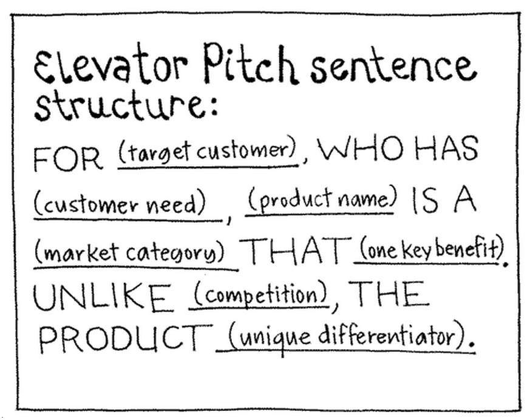

Um exemplo de visão sobre um produto de turismo poderia ser:

> “**Para** turistas usuários de smartphone **que desejam** aproveitar melhor seus locais de destino, **o** MyTrip **é um** aplicativo móvel de viagens **que** sugere roteiros diários flexíveis de acordo com seu perfil de viajante. **Ao contrário de** guias de viagens com roteiros predefinidos e burocráticos, **nosso produto** elabora trajetos personalizados e adaptáveis.”

Lembremos que a visão do produto, de forma geral, deve permanecer estável durante todo o projeto. Ela é criada, gerenciada e compartilhada pelo Product Owner, que garante que o Product Backlog esteja sempre alinhado a ela. No entanto, as partes interessadas relevantes podem estar diretamente envolvidas no refinamento dessa visão.

#### Release Planning Meeting (Reunião de Planejamento da Release)

Outra cerimônia não-oficial, apesar de muito comum, é a **Release Planning Meeting**. Como vimos, ao final da Sprint, a equipe entrega um Incremento do produto potencialmente funcional, isto é, tem o potencial de entrar em produção. Muitas vezes é desejável esperar algumas Sprints até juntar todas as funcionalidades e entregar uma release (um conjunto de funcionalidades prontas e validadas). Essa cerimônia serve para planejar como será essa release.

Isso é muito importante, principalmente devido a criticidade da tarefa de colocar algo em produção. É comum ter várias restrições, preocupações e dependências, como datas importantes, itens contratuais, logística, entre outros. Dessa forma, a equipe, juntamente com o Product Owner e stakeholders relevantes, precisa planejar suas entregas várias Sprints à frente.

#### Fases do Ciclo de Vida no Scrum (Uma Perspectiva Ampliada)

Por fim, é salutar enfatizar que, embora o Scrum seja focado no ciclo de Sprints, podemos visualizar seu encaixe em um ciclo de vida de projeto mais amplo, que algumas literaturas dividem em três fases principais:

1. **Pré-Planejamento (Pre-game Phase):** Nesta fase inicial, define-se o sistema a ser desenvolvido. Cria-se o **Product Backlog** inicial, que contém os requisitos atuais e informações sobre o planejamento do projeto. Também se pode criar uma arquitetura de alto nível para guiar o desenvolvimento.
2. **Desenvolvimento (Game Phase):** O sistema é desenvolvido em **Sprints**, por meio de uma abordagem iterativa e incremental. A cada Sprint, novas funcionalidades são adicionadas seguindo as atividades de análise, projeto, implementação, testes, etc., dentro do ciclo da Sprint.
3. **Pós-Planejamento (Post-game Phase):** Após um conjunto de Sprints ou ao final do desenvolvimento de uma release significativa, podem ocorrer atividades para analisar o progresso geral do projeto e demonstrar o software consolidado para os clientes. Aqui podem ocorrer etapas de integração final, testes de aceitação mais amplos e preparação da documentação para a entrega.

É importante notar que estas "fases" não são prescrições do Guia Scrum, que se concentra no ciclo da Sprint. Contudo, essa visão mais ampla ajuda a contextualizar como o Scrum pode ser aplicado dentro de um ciclo de vida de produto ou projeto maior.

## Novidades e Evoluções no Framework Scrum

O Scrum, desde sua concepção inicial, tem passado por um processo contínuo de refinamento e aprimoramento, refletindo os aprendizados da comunidade ágil global e buscando sempre maior clareza e eficácia. Essas evoluções são consolidadas nas atualizações do Guia Scrum, o documento oficial que define o framework. É fundamental que profissionais e estudantes estejam cientes das mudanças mais significativas, pois elas impactam a forma como o Scrum é compreendido e aplicado.

Nossa abordagem até aqui tem sido construída sobre os fundamentos do Scrum estabelecidos na versão de 2013, incorporando as atualizações relevantes das versões de 2017 e, mais notavelmente, da versão de 2020. Esta última trouxe mudanças importantes que visam tornar o Scrum ainda mais leve, menos prescritivo e mais adaptável a diversos contextos, não se limitando apenas ao desenvolvimento de software. A seguir, detalharemos as principais melhorias introduzidas pelo Guia Scrum de 2020.

### Guia Scrum 2020: Uma Visão Mais Enxuta e Abrangente

Uma das primeiras percepções ao se analisar o Guia Scrum 2020 é sua **simplificação e concisão**. Os autores, Ken Schwaber e Jeff Sutherland, colocaram uma ênfase considerável na eliminação de informações redundantes, na remoção de complexidades desnecessárias e, crucialmente, na supressão de qualquer linguagem que remetesse exclusivamente ao universo da tecnologia da informação. Termos como "testes", "sistemas", "design" ou "requerimento", que poderiam sugerir uma aplicação restrita ao desenvolvimento de software, foram generalizados ou removidos. Essa alteração tem um propósito claro: reforçar que o Scrum é um framework versátil, aplicável a projetos e produtos em quaisquer áreas do conhecimento. Como resultado, o Guia Scrum tornou-se notavelmente mais curto, com menos de 13 páginas, e sua linguagem foi adaptada para ser mais acessível e compreensível para um público mais amplo.

Essa busca por universalidade reflete-se também na própria **definição de Scrum**. Enquanto a versão de 2017 mencionava que o Scrum ajudava "pessoas" a resolver problemas complexos, a versão de 2020 expande essa visão, afirmando:

> Scrum é um framework leve que ajuda pessoas, **times e organizações** a gerar valor por meio de soluções adaptativas para problemas complexos.

Essa pequena, mas significativa, alteração reconhece o impacto do Scrum em diferentes níveis de uma organização, desde o indivíduo até a estrutura corporativa como um todo.

### Evoluções nos Eventos Scrum

#### Daily Scrum: Além das Três Perguntas

Uma das mudanças mais comentadas no Guia Scrum 2020 foi a **remoção da sugestão das três perguntas** que frequentemente estruturavam a Reunião Diária (Daily Scrum): "O que eu fiz ontem?", "O que farei hoje?" e "Vejo algum impedimento?". Os autores esclareceram que essas perguntas sempre foram apenas um exemplo de como a reunião poderia ser conduzida, e não uma regra ou uma forte sugestão. No entanto, para muitas equipes, elas se tornaram um roteiro fixo, muitas vezes transformando a Daily Scrum em uma mera reunião de reporte de status individual, desviando-se de seu propósito principal de inspeção do progresso em direção à Meta da Sprint e adaptação do plano para as próximas 24 horas.

Para evitar essa disfunção e reforçar a autonomia dos Desenvolvedores na condução do evento, as perguntas foram completamente removidas. O Guia 2020 agora enfatiza que os Desenvolvedores podem selecionar a estrutura e as técnicas que desejarem, desde que a Daily Scrum se concentre no progresso em direção à Meta da Sprint e produza um plano de ação para o próximo dia de trabalho.

#### Sprint Planning: A Inclusão Estratégica do "Porquê"

O evento de Planejamento da Sprint (Sprint Planning) também recebeu um acréscimo conceitual importante. Além dos tópicos tradicionais que respondem "O quê?" pode ser feito na Sprint e "Como?" o trabalho escolhido será realizado, a versão 2020 introduziu formalmente um terceiro tópico: **"Por quê?"**.

Este novo tópico questiona: **"Por que esta Sprint é valiosa?"**. A intenção é garantir que, antes de mergulhar no planejamento detalhado, o Scrum Team compreenda claramente o propósito e o valor que aquela Sprint específica trará para o produto e para os stakeholders. Muitas vezes, as equipes sabem o que fazer e como fazer, mas perdem de vista o porquê, o que pode levar à criação de funcionalidades com pouco impacto ou desalinhadas com os objetivos estratégicos. A inclusão do "Porquê" visa combater o desperdício – um princípio fundamental do _lean thinking_ – e garantir que cada Sprint contribua significativamente para a Meta do Produto. A resposta a essa pergunta culmina na criação da Meta da Sprint.

### Clareza nos Artefatos: A Introdução dos Compromissos

Talvez uma das evoluções mais estruturais do Guia Scrum 2020 seja a introdução explícita do conceito de **Compromissos (Commitments)** associados a cada um dos três artefatos do Scrum. Essa mudança visa aumentar a transparência e fornecer um foco claro contra o qual o progresso pode ser medido.

O Guia afirma:

> Os artefatos do Scrum representam trabalho ou valor. Eles são projetados para maximizar a transparência das principais informações. Assim, todos os que os inspecionam têm a mesma base para adaptação. Cada artefato contém um compromisso para garantir que ele forneça informações que aumentem a transparência e o foco contra o qual o progresso pode ser medido.

Os compromissos estabelecidos são:

- Para o **Product Backlog**, o compromisso é a **Meta do Produto (Product Goal)**.
- Para o **Sprint Backlog**, o compromisso é a **Meta da Sprint (Sprint Goal)**.
- Para o **Incremento**, o compromisso é a **Definição de "Pronto" (Definition of Done - DoD)**.

É importante notar que a Meta da Sprint e a Definição de "Pronto" já existiam no Guia Scrum 2017, mas sua natureza e relação com os artefatos podiam gerar ambiguidades. A versão 2020 solidifica esses conceitos como compromissos formais, reforçando o empirismo e os valores do Scrum.

#### Compromisso: Meta do Produto (Product Goal)

A **Meta do Produto** descreve um estado futuro do produto que serve como um alvo de longo prazo para o Scrum Team planejar. Ela reside no Product Backlog, e o restante do Product Backlog emerge para definir "o que" será necessário para cumprir essa meta.

Um produto, no contexto do Scrum, é um veículo para entregar valor, possuindo um limite claro, stakeholders conhecidos e usuários ou clientes bem definidos. Pode ser um serviço, um produto físico ou algo mais abstrato. A Meta do Produto orienta o Scrum Team em suas decisões de planejamento e priorização. A equipe deve cumprir (ou abandonar conscientemente) uma Meta do Produto antes de assumir a próxima.

**Exemplo Prático**: Para um novo aplicativo de e-commerce, a Meta do Produto inicial poderia ser: "Tornar-se a plataforma de referência para compra de produtos artesanais locais, oferecendo uma experiência de usuário simples e segura, e conectando diretamente artesãos a consumidores em sua região nos próximos 12 meses." Todos os itens do Product Backlog subsequentes seriam criados e priorizados com o intuito de alcançar essa meta.

#### Compromisso: Meta da Sprint (Sprint Goal)

A **Meta da Sprint** é o único objetivo para a Sprint. Embora seja um compromisso dos Desenvolvedores, ela oferece flexibilidade em termos do trabalho exato necessário para alcançá-la. A Meta da Sprint cria coerência e foco, encorajando o Scrum Team a trabalhar em conjunto, em vez de em iniciativas separadas e desconexas.

Ela é criada durante o evento de Sprint Planning e adicionada ao Sprint Backlog. Durante a Sprint, os Desenvolvedores mantêm a Meta da Sprint em mente. Se o trabalho se mostrar diferente do esperado, eles colaboram com o Product Owner para negociar o escopo do Sprint Backlog, desde que isso não afete a Meta da Sprint.

**Exemplo Prático**: Para uma Sprint do aplicativo de e-commerce cuja Meta do Produto é a mencionada acima, uma Meta da Sprint poderia ser: "Permitir que os artesãos cadastrem seus produtos com fotos, descrições e preços, tornando-os visíveis para os consumidores na plataforma."

#### Compromisso: Definição de "Pronto" (Definition of Done - DoD)

A **Definição de "Pronto"** é uma descrição formal do estado do Incremento quando ele atende às medidas de qualidade exigidas para o produto. No momento em que um item do Product Backlog atende à Definição de "Pronto", um Incremento nasce.

A DoD cria transparência ao fornecer a todos um entendimento compartilhado sobre qual trabalho foi concluído como parte do Incremento. Se um item do Product Backlog não atender à Definição de "Pronto", ele não poderá ser liberado ou mesmo apresentado na Sprint Review, retornando ao Product Backlog para consideração futura.

Se a Definição de "Pronto" para um Incremento faz parte dos padrões da organização, todos os Scrum Teams devem segui-la como mínimo. Caso contrário, o Scrum Team deve criar uma Definição de "Pronto" apropriada para o produto. Os Desenvolvedores são responsáveis por aderir à Definição de "Pronto". Se vários Scrum Teams trabalham juntos em um produto, eles devem definir e cumprir mutuamente a mesma Definição de "Pronto" para garantir a integração e a qualidade do produto como um todo.

### Time Scrum: Mais Coeso e Autônomo

A estrutura e a dinâmica do Time Scrum também foram objeto de refinamentos importantes no Guia 2020, buscando maior coesão, clareza de papéis e autonomia.

#### Um Único Time Scrum: A Extinção do "Time de Desenvolvimento"

Uma das mudanças terminológicas mais significativas foi a **remoção do termo "Time de Desenvolvimento" (Development Team)**. Anteriormente, o Guia Scrum descrevia o Scrum Team como sendo composto pelo Product Owner, Scrum Master e o Time de Desenvolvimento. Essa estrutura, embora funcional, poderia inadvertidamente passar a impressão da existência de um "time dentro do time", ou de uma hierarquia sutil onde o Time de Desenvolvimento era um subconjunto separado.

Para eliminar essa ambiguidade e reforçar a ideia de uma unidade coesa, o Guia 2020 passou a definir o Scrum Team como consistindo em um Scrum Master, um Product Owner e os **Desenvolvedores (Developers)**. Não há mais a menção a um "Time de Desenvolvimento" como uma entidade separada. Agora, "Desenvolvedores" refere-se às pessoas no Scrum Team que estão comprometidas em criar qualquer aspecto de um Incremento utilizável a cada Sprint.

Essa mudança não é apenas semântica. Ao deixar claro que todos pertencem a um único Time Scrum, com responsabilidades distintas, mas com o mesmo objetivo (a Meta do Produto), fortalece-se o compromisso coletivo e a colaboração. A unidade fundamental do Scrum é, portanto, um pequeno time de pessoas, o Scrum Team, focado em um objetivo de cada vez. Dentro de um Scrum Team, não há subtimes ou hierarquias.

#### Dimensionamento da Equipe: Menos Prescritivo, Mais Orientado

A orientação sobre o tamanho da equipe também foi sutilmente ajustada. O Guia Scrum 2017 especificava que o Time de Desenvolvimento deveria, idealmente, ser composto por 3 a 9 integrantes. A versão 2020, buscando ser menos prescritiva, removeu essa contagem específica para os Desenvolvedores.

Em vez disso, o Guia agora comenta que o **Scrum Team como um todo (incluindo Scrum Master, Product Owner e Desenvolvedores) normalmente tem 10 ou menos pessoas**. A justificativa permanece a mesma: times menores comunicam-se melhor e são mais produtivos, enquanto times muito grandes podem ter dificuldades de coordenação que comprometem a agilidade.

Se os Scrum Teams se tornarem muito grandes, a recomendação é que eles considerem a reorganização em vários Scrum Teams coesos, cada um focado no mesmo produto. Nesses casos, eles devem compartilhar a mesma Meta do Produto, o mesmo Product Backlog e o mesmo Product Owner.

#### De Auto-Organizável para Auto-Gerenciável

Outra mudança terminológica com implicações conceituais profundas foi a substituição de "times auto-organizáveis" por **"times auto-gerenciáveis"**. Na prática, "auto-organização" já implicava que o time decidia quem faria o trabalho e como o faria. O termo "auto-gerenciável", no entanto, amplia essa autonomia.

Um time auto-gerenciável não apenas decide _como_ executar o trabalho e _quem_ o fará, mas também tem um papel mais ativo em decidir _no que_ trabalhar, alinhado, claro, com as prioridades estabelecidas pelo Product Owner e a Meta da Sprint. Isso significa que o Scrum Team, como unidade, possui as responsabilidades compartilhadas de selecionar, entender e priorizar o trabalho, além de definir como ele será realizado para cumprir seus compromissos. Essa mudança reforça a mensagem de empoderamento e responsabilidade do Time Scrum.

#### O Product Owner em Múltiplos Times

O Guia 2020 também trouxe um esclarecimento importante sobre a atuação do Product Owner quando múltiplos times trabalham no mesmo produto. Ele reitera que, mesmo que uma organização opte por ter vários Scrum Teams focados em um único produto (por exemplo, para escalar o desenvolvimento), esses times devem compartilhar:

- A mesma **Meta do Produto**.
- O mesmo **Product Backlog**.
- O mesmo **Product Owner**.

Isso garante o alinhamento estratégico, a consistência na priorização e uma visão unificada do produto, evitando que diferentes times puxem o produto em direções conflitantes. A existência de um único Product Owner para um produto é crucial para manter a integridade e o foco do desenvolvimento.

Essas novidades e refinamentos demonstram o compromisso do Scrum em evoluir como um framework que não apenas responde às necessidades de desenvolvimento de software, mas que se posiciona como uma abordagem robusta para a entrega de valor em qualquer domínio que lide com problemas complexos e adaptativos.

## Considerações Finais

Ao longo deste capítulo, desvendamos o Scrum não como uma metodologia prescritiva e inflexível, mas como **um framework leve, poderoso e adaptável**, projetado para capacitar equipes a navegar pela complexidade e **entregar valor de forma incremental e sustentável**. Sua estrutura, embora simples de entender, revela uma profundidade notável quando seus pilares, valores, papéis, eventos e artefatos são vivenciados em sua plenitude.

Exploramos a essência do Scrum, fundamentada no empirismo – com seus pilares de **Transparência, Inspeção e Adaptação** – e nos valores de **Comprometimento, Coragem, Foco, Abertura e Respeito**. Vimos como o **Time Scrum**, com suas responsabilidades distintas, mas interdependentes, do **Product Owner, Scrum Master e Desenvolvedores**, colabora para transformar ideias em Incrementos de produto valiosos.

Analisamos os artefatos – **Product Backlog, Sprint Backlog e Incremento** – e seus respectivos compromissos – **Meta do Produto, Meta da Sprint e Definição de "Pronto"** – que fornecem foco e transparência ao processo. Detalhamos os **eventos da Sprint** – desde o **Sprint Planning até a Sprint Retrospective** – que estabelecem o ritmo e as oportunidades para inspeção e adaptação.

Finalmente, abordamos **as evoluções mais recentes do Guia Scrum**, que buscam tornar o framework ainda mais enxuto, menos prescritivo e mais aplicável a uma gama diversificada de desafios, reforçando seu papel como uma ferramenta vital para organizações que buscam agilidade, inovação e resultados consistentes em um mundo em constante transformação.

  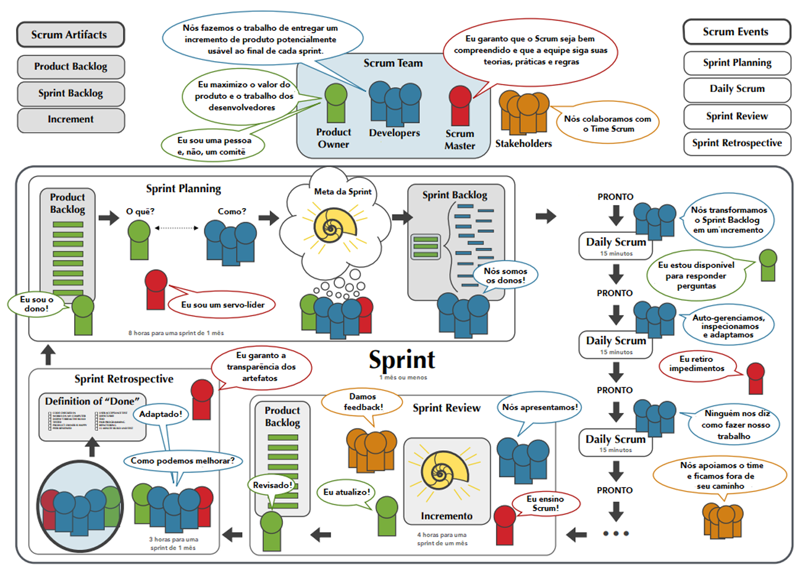

Dominar o Scrum vai além de memorizar suas regras; requer uma mudança de mentalidade, um compromisso com a melhoria contínua e a coragem de abraçar a incerteza como uma oportunidade para aprender e evoluir. As equipes que verdadeiramente internalizam seus princípios e valores descobrem não apenas uma forma mais eficaz de trabalhar, mas também um caminho mais gratificante e colaborativo para criar produtos que realmente fazem a diferença.
