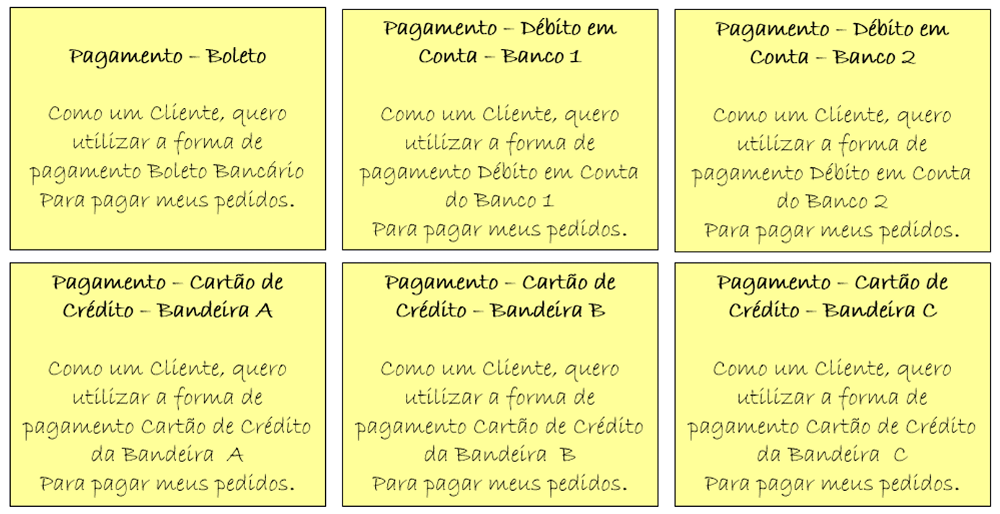
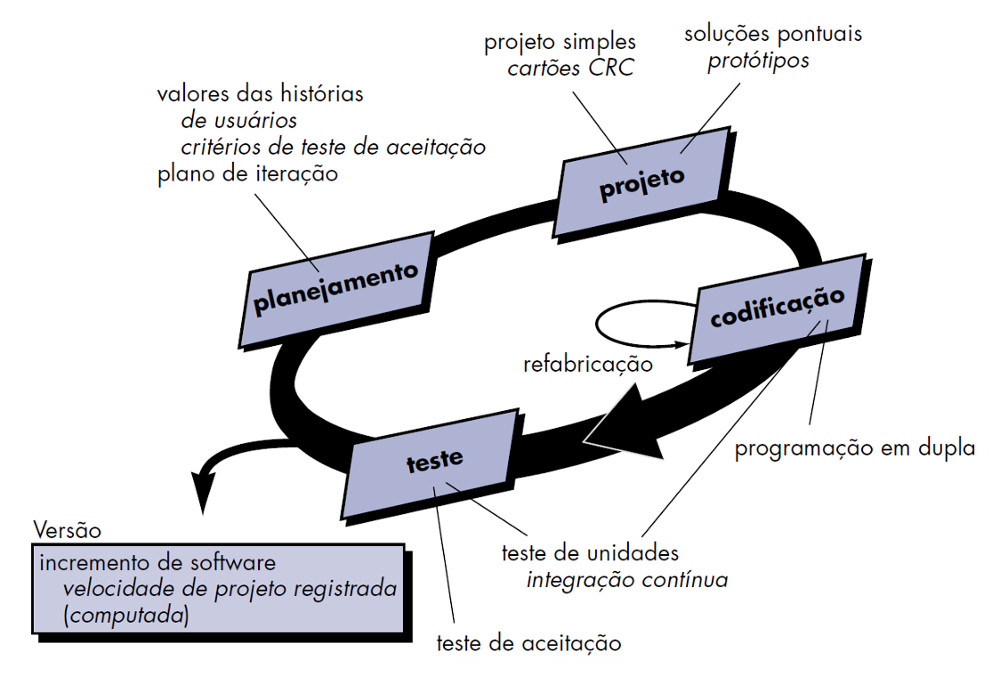
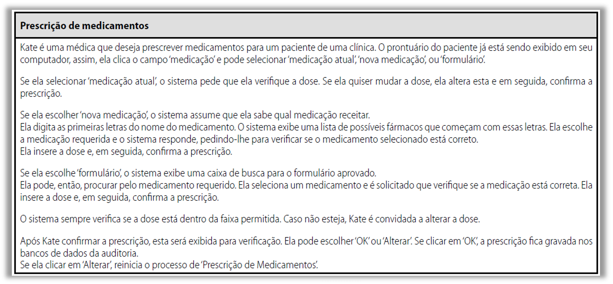
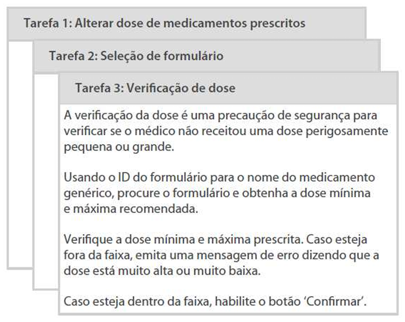
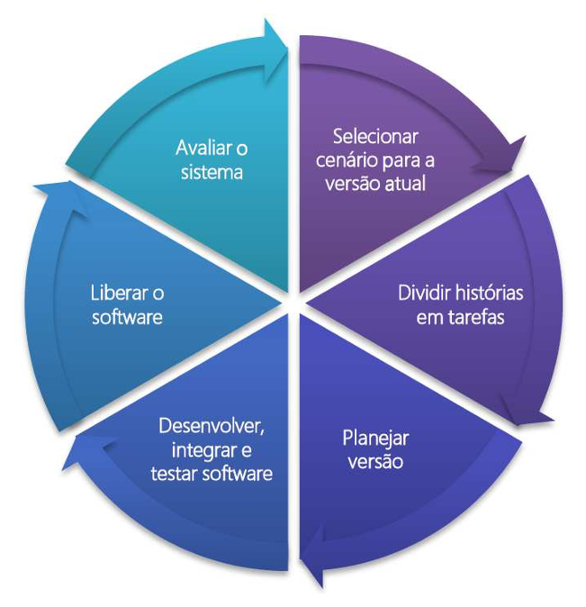

# Capítulo 15 – Extreme Programming (XP)

No vasto universo das metodologias de desenvolvimento de software, poucas abordagens se destacam tanto pela sua intensidade e foco na excelência técnica quanto o Extreme Programming, ou XP. Esta metodologia ágil, concebida para responder dinamicamente às incertezas e mudanças inerentes aos projetos de software, propõe uma filosofia de trabalho que desafia muitas convenções tradicionais, levando ao "extremo" práticas consagradas de engenharia de software.

## Introdução ao Extreme Programming: A Filosofia do "Extremo"

Em meados da década de 1990, mais precisamente em 1996, **Kent Beck**, uma figura proeminente no mundo do desenvolvimento de software e um dos signatários do Manifesto Ágil, consolidou e formalizou um novo paradigma de desenvolvimento. Esta abordagem, que rompia significativamente com muitas das metodologias tradicionais da época, foi batizada de **Extreme Programming (XP)**. Mas, por que "extremo"? A resposta reside na própria filosofia da metodologia: Beck propôs que as boas práticas de desenvolvimento de software, aquelas que sabidamente contribuem para a qualidade e eficiência, fossem levadas às suas últimas consequências, ou seja, praticadas de forma intensa e contínua.

Para ilustrar essa ideia, podemos nos perguntar:

- Se realizar testes é uma prática benéfica, por que não **testar o tempo todo**, a cada pequena alteração ou nova funcionalidade?
- Se o desenvolvimento iterativo permite aprendizado e adaptação, por que não **iterar constantemente**, em ciclos muito curtos?
- Se integrar o trabalho de diferentes desenvolvedores frequentemente evita problemas complexos no futuro, por que não **integrar continuamente**, idealmente várias vezes ao dia?

O eXtreme Programming, portanto, é uma metodologia ágil especialmente desenhada para equipes pequenas, coesas e multidisciplinares que enfrentam projetos com requisitos frequentemente vagos, incompletos ou em constante processo de mudança. Um dos seus princípios mais marcantes é a valorização do **código-fonte como a principal e mais confiável forma de documentação**. A lógica por trás disso é simples: qualquer outra forma de documentação (diagramas, manuais extensos, especificações detalhadas) tende a se tornar rapidamente desatualizada diante das mudanças frequentes, perdendo sua fidedignidade e utilidade. No XP, a ênfase recai sobre a clareza, simplicidade e expressividade do próprio código. Consequentemente, a atividade de **codificação (ou programação)** é central e primordial em todo o processo XP.

Dentro do XP, todos os requisitos do sistema são expressos na forma de **cenários**, também conhecidos como **histórias de usuário (user stories)**. Essas histórias são, então, implementadas diretamente como uma série de tarefas de desenvolvimento. Uma característica distintiva do XP é a prática da **programação em pares**, onde dois desenvolvedores trabalham juntos em uma mesma estação de trabalho. Além disso, um pilar fundamental é o desenvolvimento de **testes para cada tarefa antes mesmo da escrita do código-fonte** correspondente (prática conhecida como Test-Driven Development ou TDD). Sempre que uma nova funcionalidade é integrada ao sistema, novos testes são adicionados e executados, e o cliente (ou seu representante) participa ativamente na priorização dos requisitos para os próximos ciclos de desenvolvimento.

A equipe de desenvolvimento, ou os programadores, como são frequentemente chamados no contexto do XP, analisa cada um dos cenários (histórias) e os divide em tarefas menores e gerenciáveis. Cada tarefa representa uma característica discreta e isolada do sistema, permitindo que um teste unitário específico seja projetado para ela. Paralelamente, os **testes de aceitação** (ou testes de cliente) são especificados pelo próprio cliente e mantêm o foco nas características e funcionalidades que são visíveis e relevantes para o usuário final do sistema como um todo.

O desenvolvimento incremental no XP é fortemente apoiado por **pequenos e frequentes releases** do sistema e por uma abordagem de descrição de requisitos baseada nos cenários do cliente. Adicionalmente, o **envolvimento constante e em tempo integral do cliente** no dia a dia da equipe de desenvolvimento é considerado um fator crítico, pois facilita enormemente o processo de desenvolvimento e contribui significativamente para a melhoria da qualidade do produto final.

Falamos brevemente sobre histórias de usuário, mas dada a sua importância central no XP e em muitas outras metodologias ágeis, é crucial aprofundarmos um pouco mais neste conceito.

## Histórias de Usuário (User Stories): A Voz do Cliente no XP

As **Histórias de Usuário (User Stories)** são artefatos de desenvolvimento cruciais, amplamente utilizados em sistemas gerenciados segundo metodologias ágeis, e ocupam um lugar de destaque no Extreme Programming. De forma concisa, podemos definir uma história de usuário como uma **descrição resumida de alguma funcionalidade ou capacidade que o sistema deve fornecer, sempre do ponto de vista de um usuário específico desse sistema**. Ela representa uma pequena porção da funcionalidade total a ser construída, e é fundamental entender que uma história de usuário **não se trata de uma especificação completa e exaustiva** de uma funcionalidade.

A figura abaixo ilustra a estrutura típica de um cartão de história de usuário:

  

Uma história de usuário é, essencialmente, um **símbolo ou um lembrete das conversas que ocorreram e que ainda ocorrerão entre o cliente (ou seu representante) e os programadores**. A presença constante do cliente no local de trabalho da equipe de desenvolvimento, uma das práticas chave do XP, minimiza a necessidade de documentar extensivamente cada história. Isso ocorre porque os programadores podem simplesmente dar alguns passos e fazer suas perguntas diretamente ao cliente. É inegavelmente mais proveitoso tirar uma eventual dúvida rapidamente, em uma conversa informal, do que marcar uma reunião formal para dias depois, interrompendo o fluxo de trabalho e potencialmente gerando interpretações equivocadas.

Os detalhes mais finos das histórias de usuário, aqueles que especificam o comportamento esperado e os critérios de sucesso, são capturados nos **testes automatizados de aceitação**. Esses testes são desenvolvidos em colaboração com o cliente e são posteriormente utilizados para validar se a implementação da história atende aos requisitos. Em algumas situações, pode não ser necessário escrever descrições textuais detalhadas para todas as histórias, especialmente se o nome ou título da história já fornecer informações suficientes para iniciar uma conversa e o desenvolvimento dos testes.

Mas, o que realmente indica uma **boa história de usuário**? Primeiramente, o cliente deverá se preocupar genuinamente com ela; a história deve representar algo que traga **valor de negócio** sob a perspectiva do cliente, para que ele possa priorizá-la adequadamente em relação a outras histórias.

Às vezes, uma história inicialmente concebida pode ser muito grande ou complexa para ser implementada dentro de uma única iteração de desenvolvimento. Nesses casos, ela precisa ser **decomposta em partes menores**, mais gerenciáveis. Se, por si só, uma história decomposta não fornecer um valor de negócio completo e independente, ela deverá, no mínimo, representar um progresso tangível em direção a uma funcionalidade maior que efetivamente agregue valor ao negócio.

Idealmente, as histórias de usuário **atravessam verticalmente a arquitetura do produto**. Isso significa que a implementação de uma história geralmente envolve trabalho em diferentes camadas ou componentes do sistema (por exemplo, interface do usuário, lógica de negócio, acesso a dados), em vez de estarem focadas em um único subsistema específico. Essa abordagem garante que, ao final da implementação da história, uma fatia funcional e de valor real seja entregue.

Outras características importantes de uma boa história de usuário incluem:

- Ser **razoavelmente estimável** pelos desenvolvedores. Histórias que não podem ser estimadas com um grau mínimo de confiança idealmente deverão ser reescritas, esclarecidas ou decompostas até que se tornem estimáveis.
- Permitir a escrita de **casos de teste** para verificar se os programadores as implementaram corretamente. Um **caso de teste** é um conjunto de condições, incluindo valores de entrada e os resultados esperados do processamento, usado para testar uma funcionalidade específica do software.
- Ser **concluível dentro de uma única iteração**. Uma história de usuário que, mesmo após tentativas de decomposição, ainda se mostre grande demais para caber em uma iteração, precisa ser revista e quebrada em duas ou mais histórias menores.

Em suma, as histórias de usuário criam um ambiente de **propriedade do cliente** em relação aos recursos e prioridades do projeto, tudo isso dentro de um contexto de desenvolvimento incremental e iterativo.

A seguir, podemos ver mais alguns exemplos de como as histórias de usuário podem ser formuladas:

  

Esses exemplos ilustram a simplicidade e o foco no usuário que caracterizam as User Stories, tornando-as uma ferramenta de comunicação eficaz entre o cliente e a equipe de desenvolvimento.

## As Práticas Fundamentais do Extreme Programming

O XP não é apenas uma filosofia; ele se materializa através de um conjunto coeso e interdependente de práticas de desenvolvimento. Essas práticas, quando aplicadas em conjunto e com disciplina, são o que conferem ao XP sua agilidade e sua capacidade de produzir software de alta qualidade em ambientes de alta incerteza. O entendimento das práticas do XP é um ponto crucial. Talvez seja a parte mais importante da nossa exploração sobre esta metodologia.

É importante ressaltar que, embora o XP defenda a aplicação integral dessas práticas para obter o máximo de seus benefícios, no contexto do dia a dia das organizações, nem todas elas são universalmente adotadas ou implementadas da mesma forma. Em regra, cada organização ou equipe escolhe e adapta aquelas práticas que consideram mais úteis, eficientes e viáveis dentro de sua realidade específica. Por exemplo, para acomodar diferentes níveis de habilidade e familiaridade com o código, alguns programadores podem hesitar em fazer refatoração em partes do sistema que não desenvolveram originalmente. Da mesma forma, nem sempre é logisticamente possível ou culturalmente aceito que a programação seja feita estritamente em pares durante todo o tempo. É claro que a teoria descreve um cenário ideal, mas a prática exige adaptação.

A seguir, apresentamos as principais práticas do Extreme Programming, com uma breve descrição de cada uma:

|PRÁTICAS|DESCRIÇÃO|
|---|---|
|**Planejamento Incremental**|Os requisitos são registrados em cartões de histórias (User Stories). As histórias a serem incluídas em um _release_ (entrega) são determinadas pelo tempo disponível e sua prioridade relativa, definida pelo cliente. Os desenvolvedores dividem essas histórias em tarefas menores.|
|**Pequenos Releases**|O conjunto mínimo útil de funcionalidade que agrega valor real ao negócio é desenvolvido e entregue primeiro. Os _releases_ do sistema são frequentes (tipicamente a cada poucas semanas) e adicionam funcionalidade incrementalmente ao primeiro _release_.|
|**Projeto Simples**|É realizado um projeto que seja suficientemente simples para atender aos requisitos atuais e nada mais. O XP desencoraja o superdimensionamento do projeto ou a adição de funcionalidades "por via das dúvidas". Deve-se lembrar o princípio KIS – _Keep It Simple_ (Mantenha Simples). Um código simples não significa, necessariamente, um código fácil de escrever, mas sim um código fácil de entender e manter.|
|**Desenvolvimento Orientado a Testes (Test-First Development / TDD)**|Um framework automatizado de teste unitário é usado para escrever os testes para uma nova parte da funcionalidade _antes_ que esta seja implementada. Portanto, primeiro se escreve o teste que falha, depois se faz a implementação do código para que o teste passe, e por fim, refatora-se o código.|
|**Refatoração (Refactoring)**|Espera-se que todos os desenvolvedores recriem (refatorem) o código continuamente, tão logo os aprimoramentos no código sejam identificados. Isso significa melhorar a estrutura interna do código sem alterar seu comportamento externo, tornando-o mais simples de entender, mais fácil de manter e menos propenso a erros.|
|**Programação em Pares (Pair Programming)**|Os desenvolvedores trabalham em pares, utilizando o mesmo computador, teclado e monitor. Enquanto um programador (o "piloto") efetivamente escreve o código, o outro (o "navegador" ou "copiloto") observa, revisa, sugere melhorias, pensa estrategicamente e ajuda a manter o foco. Os papéis são trocados frequentemente. Isso promove a revisão contínua do código, a disseminação de conhecimento e a produção de software de maior qualidade.|
|**Propriedade Coletiva do Código (Collective Code Ownership)**|Os pares de desenvolvedores trabalham em todas as áreas do sistema, de tal maneira que não se formem "ilhas de conhecimento" ou especialistas isolados em determinadas partes do código. Todos os desenvolvedores têm a permissão e a responsabilidade de entender e modificar qualquer parte do código do sistema. Qualquer um pode mudar qualquer coisa, sempre com o objetivo de melhorar o sistema.|
|**Integração Contínua (Continuous Integration)**|Tão logo o trabalho em uma tarefa (ou uma pequena funcionalidade) seja concluído e os testes locais passem, este é integrado ao sistema como um todo (na linha de base principal do código). Depois de qualquer integração, todos os testes unitários do sistema devem ser executados para garantir que nada foi quebrado. Idealmente, essa integração ocorre várias vezes ao dia.|
|**Ritmo Sustentável (Sustainable Pace / Forty-Hour Week)**|Grandes quantidades de horas extras não são consideradas aceitáveis nem produtivas a longo prazo. O XP defende que, no médio e longo prazo, o excesso de trabalho leva a uma redução na qualidade do código, aumento de erros e queda na produtividade geral. Trabalhar por longos períodos de forma contínua torna-se contraproducente. Recomenda-se, idealmente, uma semana de trabalho de 40 horas.|
|**Metáforas (Metaphor)**|A equipe busca utilizar uma ou mais metáforas simples e compartilhadas para descrever como o sistema funciona e como seus componentes se relacionam. Se a equipe conseguir encontrar uma metáfora que realmente faça sentido dentro do contexto do projeto, ela pode facilitar a comunicação, o entendimento comum e o raciocínio sobre o projeto do sistema.|
|**Cliente Presente (On-site Customer)**|Um representante do usuário final do sistema (o Cliente) deve estar disponível em tempo integral para a equipe de desenvolvimento, idealmente trabalhando no mesmo ambiente físico. No XP, o cliente é considerado um membro da equipe de desenvolvimento e é o principal responsável por fornecer os requisitos do sistema, esclarecer dúvidas e priorizar as funcionalidades.|
|**Reuniões em Pé (Stand-up Meetings)**|Reuniões de sincronização diária são realizadas em pé, geralmente no início do dia, para não se perder o foco nos assuntos e para que sejam rápidas (tipicamente 15 minutos). Nelas, abordam-se as tarefas realizadas, as tarefas a realizar e quaisquer impedimentos.|
|**Time Coeso (Whole Team / Cohesive Team)**|A equipe de desenvolvimento é formada por pessoas engajadas, colaborativas e multidisciplinares. Isso significa que, como um todo, a equipe possui as habilidades necessárias para realizar todas as atividades do projeto, desde a análise e o projeto até a codificação e os testes.|
|**Jogo do Planejamento (Planning Game)**|O planejamento de um _release_ e das iterações é feito de forma colaborativa, com base nas histórias de usuário, e conta com a participação de toda a equipe de desenvolvimento, incluindo o cliente. Os papéis são divididos em: "negócio" (representado pelo cliente, que prioriza as histórias com base no valor) e "técnico" (representado pelos desenvolvedores, que avaliam a complexidade e estimam o esforço).|

A combinação dessas práticas cria um ciclo de feedback rápido, aprendizado contínuo e adaptação constante, permitindo que as equipes XP entreguem software funcional e de alta qualidade, mesmo diante de requisitos voláteis.

## Processo de Desenvolvimento no XP

E como seria o processo do Extreme Programming na prática? No contexto da programação, a abordagem orientada a objetos é o paradigma de desenvolvimento preferido e mais naturalmente alinhado com os princípios do XP. O processo XP, embora flexível e adaptativo, envolve um conjunto de regras e práticas que se articulam em torno de quatro atividades metodológicas principais: (1) Planejamento, (2) Projeto (Design), (3) Codificação e (4) Teste. É crucial entender que essas atividades não ocorrem de forma estritamente sequencial como em um modelo cascata; elas são altamente interativas e sobrepostas, acontecendo em ciclos curtos e frequentes.

Observem na imagem abaixo uma representação simplificada de como essas atividades se interligam no fluxo do XP:

  

Vamos detalhar cada uma dessas atividades.

### Planejamento (Planning)

A atividade de **Planejamento** no XP se inicia com a fundamental prática de **ouvir**. Esta é, em essência, uma atividade de levantamento de requisitos que capacita os membros técnicos da equipe XP a entenderem profundamente o ambiente de negócios do cliente. O objetivo é obter uma percepção ampla sobre os resultados de negócio que são solicitados, identificar os fatores críticos de sucesso e compreender a funcionalidade desejada para o sistema.

Esse ato de "ouvir" ativamente conduz à criação de um conjunto de **histórias de usuário (User Stories)**, que, como vimos, descrevem o resultado esperado, as características e a funcionalidade requisitados para o software a ser construído. Cada história é tipicamente escrita pelo cliente em um cartão físico ou digital. Após a criação da história, o cliente atribui um **valor** (ou prioridade) a ela, baseando-se no valor de negócio global que aquele recurso ou função representa para a organização.

Em seguida, os membros da equipe XP, os desenvolvedores, avaliam cada história e atribuem um **custo** a ela. Esse custo não é medido em dinheiro, mas sim em **semanas de desenvolvimento** ou, mais comumente, em **pontos de história (story points)**, que representam uma estimativa relativa de esforço e complexidade. Se, durante a estimativa, uma história aparentar requerer mais do que um tempo considerado razoável para uma iteração (por exemplo, mais que três semanas de desenvolvimento, ou um número muito alto de story points), é solicitado ao cliente que ele **divida essa história em histórias menores** e mais gerenciáveis. Após a divisão, o processo de atribuição de valor pelo cliente e de custo pela equipe ocorre novamente para as novas histórias menores.

É importante notar que, no XP, o processo de criação de histórias é dinâmico: **novas histórias podem ser escritas e introduzidas a qualquer momento** ao longo do projeto. Clientes e desenvolvedores trabalham em estreita colaboração para decidir como agrupar as histórias para a próxima versão ou **release** (o próximo incremento de software) a ser desenvolvida pela equipe XP.

Conseguindo chegar a um compromisso básico sobre o escopo de uma versão – ou seja, um acordo sobre quais histórias serão incluídas, a data de entrega aproximada, e outros fatores relevantes – a equipe XP ordena as histórias a serem desenvolvidas, geralmente seguindo uma destas três abordagens:

1. **Implementação Imediata:** Todas as histórias selecionadas para o release serão implementadas imediatamente, geralmente em um prazo de poucas semanas.
2. **Priorização por Valor:** As histórias de maior valor de negócio são deslocadas para o topo do cronograma e implementadas primeiro.
3. **Priorização por Risco:** As histórias que apresentam maior risco técnico ou de negócio são deslocadas para o topo do cronograma e implementadas primeiro, a fim de mitigar esses riscos o mais cedo possível.

Depois que a primeira versão do projeto (também denominada incremento de software) foi entregue, a equipe XP calcula a **velocidade do projeto (project velocity)**. De forma simples, a velocidade do projeto é o número de histórias de cliente (ou a soma de seus pontos de história) que foram implementadas com sucesso durante a primeira versão ou iteração. A velocidade do projeto é uma métrica crucial e pode ser utilizada para:

- Ajudar a estimar as datas de entrega e o cronograma para releases e iterações subsequentes.
- Determinar se foi assumido um compromisso exagerado para todas as histórias planejadas ao longo de todo o projeto de desenvolvimento (ou seja, se o escopo é realista para os prazos).

Se for constatado um exagero no planejamento (o time está se comprometendo com mais trabalho do que sua velocidade histórica indica ser capaz de entregar), o conteúdo das próximas versões é modificado ou as datas finais de entrega são renegociadas com o cliente.

Conforme o trabalho de desenvolvimento prossegue, o cliente tem a flexibilidade de **acrescentar novas histórias, mudar o valor de uma história existente, dividir algumas histórias em menores ou até mesmo eliminar histórias** que não são mais relevantes. Em resposta a essas mudanças, a equipe XP reconsidera todos os releases remanescentes e modifica seus planos de acordo, mantendo o planejamento sempre atualizado e alinhado com as necessidades do cliente. Este processo colaborativo de planejamento é frequentemente chamado de **Jogo do Planejamento (Planning Game)**.

### Projeto (Design)

O **Projeto (Design)** no Extreme Programming segue rigorosamente o princípio **KIS (Keep It Simple – Mantenha Simples)**. A filosofia é que é sempre preferível um projeto simples, que atenda estritamente aos requisitos atuais, do que uma representação mais complexa que tente antecipar todas as necessidades futuras. Como um acréscimo, o projeto no XP oferece um guia de implementação para uma história de usuário à medida que ela é escrita — nada mais, nada menos. A prática de projetar ou codificar funcionalidades extras, baseada na suposição do desenvolvedor de que elas serão necessárias no futuro (**You Ain't Gonna Need It - YAGNI**), é fortemente desencorajada.

O Extreme Programming encoraja o uso de **Cartões CRC (Classe – Responsabilidade - Colaborador)** como um mecanismo eficaz para pensar sobre o software em um contexto orientado a objetos. Os cartões CRC ajudam a identificar e organizar as classes orientadas a objetos que são relevantes para o incremento de software corrente. Frequentemente, os cartões CRC são o único artefato de projeto mais formal produzido como parte do processo XP, refletindo sua ênfase em comunicação e simplicidade em detrimento de documentação pesada.

Se um **problema de projeto particularmente difícil** for encontrado como parte do projeto de uma história, o XP recomenda a criação imediata de um **protótipo operacional** dessa parte específica do projeto. Denominada **solução pontual (spike solution)**, esse protótipo do projeto é implementado e avaliado rapidamente. O objetivo de um **spike** é reduzir o risco técnico associado ao problema, validar as estimativas originais para a história que contém o problema de projeto e fornecer aprendizado para a verdadeira implementação.

Anteriormente, mencionamos que o XP encoraja a **refatoração (refactoring)** – uma técnica de construção que é, intrinsecamente, um método para otimização contínua do projeto. Refatoração é o processo de alteração de um sistema de software de tal forma que **não se altere o comportamento externo do código, mas se aprimore a sua estrutura interna**. É uma forma disciplinada de organizar o código (e, por consequência, modificar e simplificar o projeto interno) que minimiza as chances de introdução de bugs e melhora a legibilidade e a manutenibilidade. Ao se refatorar, está se aperfeiçoando o projeto da codificação **depois** que este já foi feito, ou durante o processo de escrita.

Como o XP utiliza praticamente nenhuma notação de modelagem formal e produz poucos, se algum, artefatos de projeto detalhados (além dos cartões CRC e das soluções pontuais), o projeto é visto como algo **transiente e evolutivo**, que pode e deve ser continuamente modificado e melhorado conforme a construção do software prossegue. O objetivo é controlar as modificações, sugerindo pequenas mudanças de projeto que, acumuladas, são capazes de melhorar radicalmente a qualidade e a simplicidade da solução.

Deve ser observado, no entanto, que o esforço necessário para a refatoração pode aumentar dramaticamente à medida que o tamanho e a complexidade de uma aplicação cresçam, especialmente se a prática não for constante. Um aspecto central no XP é o de que a elaboração do projeto ocorre tanto **antes como depois** de se ter iniciado a codificação. Na realidade, a própria atividade de desenvolvimento, com seus desafios e descobertas, guiará a equipe XP quanto ao aprimoramento contínuo do projeto.

### Codificação (Coding)

Após as histórias de usuário terem sido desenvolvidas e o trabalho preliminar de elaboração do projeto ter sido feito, a equipe XP não passa diretamente para a codificação da funcionalidade em si. Em vez disso, um passo crucial é dado primeiro: os desenvolvedores criam uma série de **testes de unidade (unit tests)** que exercitarão cada uma das histórias a serem incluídas na versão corrente (o incremento de software).

Uma vez criado o teste de unidade (que inicialmente irá falhar, pois o código da funcionalidade ainda não existe), o desenvolvedor poderá focar-se melhor no que deve ser implementado para que o código seja aprovado no teste. Nada estranho ou além do necessário para passar no teste é adicionado, respeitando o princípio KIS (Keep It Simple).

Estando o código da funcionalidade completo, ele pode ser **testado em unidade imediatamente**. Essa prática fornece um **feedback instantâneo** para os desenvolvedores sobre a corretude da implementação.

Conforme vimos anteriormente, um conceito-chave na atividade de codificação do XP é a **Programação em Pares (Pair Programming)**. O Extreme Programming recomenda que duas pessoas trabalhem juntas, colaborativamente, em uma mesma estação de trabalho para criar o código para uma história. Essa prática oferece múltiplos benefícios:

- **Resolução de problemas em tempo real:** Duas cabeças, com diferentes perspectivas e conhecimentos, normalmente funcionam melhor do que uma para encontrar soluções e superar obstáculos.
- **Garantia da qualidade em tempo real:** O código é constantemente revisado pelo "navegador" à medida que é escrito pelo "piloto", pegando erros e más práticas no momento em que surgem.
- **Foco no problema:** A presença do par ajuda a manter os desenvolvedores focados na tarefa em questão, minimizando distrações.
- **Disseminação de conhecimento:** Habilidades, técnicas e conhecimento sobre o sistema são compartilhados organicamente entre os membros da dupla.

Na prática da programação em pares, cada pessoa assume um papel ligeiramente diferente, e esses papéis são trocados frequentemente. Por exemplo, uma pessoa (o piloto) pode estar focada nos detalhes de codificação de um algoritmo específico, enquanto a outra (o navegador) está pensando na estratégia geral da solução, na conformidade com os padrões de codificação, nos próximos passos e nos possíveis casos de teste.

Conforme a dupla de programadores completa seu trabalho em uma tarefa ou história, o código que eles desenvolveram é **integrado ao trabalho de outros membros da equipe e ao sistema como um todo**. Em alguns casos, essa integração é realizada diariamente por uma equipe de integração dedicada (embora isso seja menos comum em equipes XP puras). Em outros, e mais frequentemente, a própria dupla de programadores é responsável por realizar a integração de seu código.

A estratégia de **Integração Contínua (Continuous Integration)** é vital no XP. Ela ajuda a evitar problemas de compatibilidade e de interfaceamento que podem surgir quando diferentes partes do sistema são desenvolvidas isoladamente por muito tempo. Além disso, a integração frequente cria um ambiente de **“teste da fumaça” (smoke test)**, onde se verifica rapidamente se a nova integração não quebrou funcionalidades essenciais do sistema, ajudando a revelar erros precocemente.

### Testes (Testing)

Já foi observado reiteradamente que a criação de **testes de unidade antes de começar a codificação (Test-First Development)** é um elemento-chave e distintivo da abordagem XP. Os testes de unidade criados devem ser implementados usando-se uma metodologia ou ferramenta que os capacite a serem **automatizados**. Isso é crucial porque permite que os testes sejam executados fácil, rápida e repetidamente por qualquer membro da equipe, a qualquer momento.

A automação dos testes encoraja e viabiliza uma estratégia robusta de **testes de regressão**. Testes de regressão são aqueles que verificam se modificações recentes no código (seja uma nova funcionalidade, uma correção de bug ou uma refatoração) não introduziram novos defeitos ou quebraram funcionalidades que antes funcionavam corretamente. No XP, dada a filosofia de refatoração constante e integração contínua, os testes de regressão são executados com altíssima frequência.

Como os testes de unidades individuais são organizados em um **“conjunto de testes universal” (universal test suite)**, que cobre todas as funcionalidades implementadas, os testes de integração (que verificam a interação entre diferentes componentes) e os testes de validação do sistema (que verificam se o sistema atende aos requisitos do cliente) podem ocorrer diariamente, ou até várias vezes ao dia. Isso dá à equipe XP uma indicação contínua e clara do progresso e da saúde do sistema, e também permite lançar alertas muito cedo, caso as coisas não estejam andando bem. Como afirma Ron Jeffries, um dos proponentes do XP: “Corrigir pequenos problemas em intervalos de poucas horas leva menos tempo do que corrigir problemas enormes próximo ao prazo de entrega”.

Ian Sommerville também oferece uma perspectiva valiosa sobre o processo XP, particularmente em relação aos requisitos e testes. Ele destaca que, no XP, os **clientes estão intimamente envolvidos na especificação e priorização dos requisitos do sistema**. Os requisitos não são especificados como uma lista formal e exaustiva de funções requeridas. Pelo contrário, o cliente do sistema é parte integrante da equipe de desenvolvimento e discute cenários de uso com outros membros da equipe. Juntos, eles desenvolvem um **cartão de história (story card)**, que engloba as necessidades do cliente de forma concisa.

A figura abaixo ilustra um exemplo de cartão de história, enfatizando sua simplicidade e foco na necessidade do usuário:

A equipe de desenvolvimento, então, tenta implementar esse cenário em uma release futura do software. Os cartões de história são as principais entradas para o processo de planejamento no XP, o **Jogo do Planejamento (Planning Game)**. Uma vez que os cartões de história tenham sido desenvolvidos e priorizados, a equipe de desenvolvimento os divide em **tarefas (tasks)** menores e estima o esforço e os recursos necessários para a realização de cada tarefa. Esse processo de detalhamento e estimativa geralmente envolve discussões contínuas com o cliente para refinar os requisitos e garantir o entendimento mútuo.

A figura a seguir mostra um exemplo de como as histórias podem ser decompostas em tarefas:

O cliente, então, prioriza as histórias para implementação, escolhendo aquelas que podem ser usadas imediatamente para oferecer apoio aos negócios ou que representam o maior valor no momento. A intenção é identificar um conjunto de funcionalidades úteis que possa ser implementado em um ciclo curto, tipicamente cerca de **duas semanas**, que é a duração comum de uma iteração no XP. Ao final dessa iteração, uma nova release do sistema, contendo as funcionalidades implementadas, é disponibilizada para o cliente. É claro que, como os requisitos mudam, as histórias ainda não implementadas podem ter sua prioridade alterada, serem modificadas ou até mesmo descartadas.

Se houver necessidade de mudanças em um sistema que já tenha sido entregue, novos cartões de história são desenvolvidos para representar essas mudanças. Mais uma vez, o cliente decide se essas mudanças devem ter prioridade sobre a implementação de novas funcionalidades.

Às vezes, durante o Jogo do Planejamento, emergem questões técnicas ou de requisitos que não podem ser facilmente respondidas sem uma investigação mais aprofundada. Para lidar com isso, a equipe pode realizar um **desenvolvimento-teste ou um protótipo** para explorar possíveis soluções e ganhar mais entendimento sobre o problema. Em termos XP, essa atividade de exploração é chamada de **spike**. Um spike é, portanto, um pequeno experimento ou uma investigação focada, cujo objetivo é responder a uma pergunta específica ou mitigar um risco. Durante um spike, o objetivo principal não é entregar funcionalidade de produção, mas sim obter conhecimento. Pode haver spikes para investigar uma nova tecnologia, para testar a viabilidade de uma abordagem de projeto da arquitetura do sistema, ou até mesmo para desenvolver a documentação mínima necessária para um componente complexo.

De acordo com Sommerville, o ciclo de desenvolvimento de um incremento no XP pode ser visualizado da seguinte forma:

  

Sommerville também enfatiza que uma das diferenças importantes entre o desenvolvimento incremental (como o XP) e o desenvolvimento dirigido a planos (como o modelo cascata) está na forma como o sistema é testado. Com o desenvolvimento incremental, geralmente não há uma especificação completa e detalhada do sistema que possa ser usada por uma equipe de teste externa e independente para o desenvolvimento de testes formais do sistema. Como consequência, algumas abordagens para o desenvolvimento incremental podem ter um processo de testes que parece mais informal em comparação com os testes rigorosos e documentados do desenvolvimento dirigido a planos.

Para evitar alguns dos problemas de teste e validação do sistema que poderiam surgir dessa aparente informalidade, o XP, paradoxalmente, **enfatiza enormemente a importância dos testes de software**. Ele inclui uma abordagem de testes multifacetada e contínua que reduz significativamente as chances de erros não detectados passarem para a versão atual do sistema.

As principais características dos testes na metodologia XP, que contribuem para sua robustez, são:

1. **Desenvolvimento Orientado a Testes (Test-First Development):** Escrever testes unitários automatizados **antes** de escrever o código de produção.
2. **Desenvolvimento Incremental de Testes a partir de Cenários:** Os testes de aceitação são desenvolvidos a partir das histórias de usuário (cenários do cliente), garantindo que o software faça o que o cliente espera.
3. **Envolvimento dos Usuários no Desenvolvimento e Validação de Testes:** O cliente participa ativamente na definição dos critérios de aceitação e na validação das funcionalidades através dos testes de aceitação.
4. **Uso de Frameworks de Testes Automatizados:** Ferramentas que permitem a criação, organização e execução automatizada de testes (tanto unitários quanto de aceitação) são essenciais para suportar a integração contínua e a refatoração segura.

Essa abordagem intensiva e integrada de testes é o que permite ao XP manter a qualidade e a confiança no software, mesmo com ciclos de desenvolvimento curtos e mudanças frequentes nos requisitos.

## Os Pilares do XP: Valores e Princípios

O Extreme Programming não se sustenta apenas em suas práticas técnicas; ele é profundamente enraizado em um conjunto de valores fundamentais e princípios básicos que guiam o comportamento, as decisões e a cultura da equipe. Entender e internalizar esses pilares é tão importante quanto aplicar as práticas para o sucesso da adoção do XP.

### Valores Fundamentais do XP

O XP identifica cinco valores fundamentais que, quando vividos pela equipe, criam um ambiente propício para a colaboração, a qualidade e a adaptabilidade. É importante notar que esses valores se reforçam mutuamente.

|VALORES FUNDAMENTAIS|DESCRIÇÃO|
|---|---|
|**Comunicação**|Para se desenvolver um sistema de software de forma eficaz, exige-se uma comunicação clara e constante sobre os requisitos do sistema entre todos os envolvidos, especialmente entre os desenvolvedores e o cliente. Em metodologias formais de desenvolvimento, esta tarefa é frequentemente realizada por meio de documentação extensa. O Extreme Programming, por outro lado, favorece projetos simples, o uso de metáforas comuns para facilitar o entendimento, a colaboração próxima e contínua dos usuários (cliente presente) com os programadores e outros stakeholders, a comunicação verbal frequente e direta, e o feedback constante em múltiplos níveis.|
|**Simplicidade**|O XP incentiva que se comece sempre com a solução mais simples possível que atenda aos requisitos atuais (princípio YAGNI - _You Ain't Gonna Need It_). Funcionalidades adicionais, mesmo que pareçam úteis no futuro, só devem ser acrescentadas quando se tornarem realmente necessárias. Alega-se que desenvolver funções que não são estritamente necessárias hoje pode ser prejudicial, na medida em que, futuramente, essa função pode não ser mais útil, ter sido mal interpretada ou ter suas premissas alteradas. A codificação e o projeto de necessidades futuras incertas implicam o risco de gastar recursos em algo que não agregará valor, enquanto talvez se esteja atrasando aspectos cruciais do sistema.|
|**Feedback**|O feedback no XP é multifacetado e ocorre em ciclos curtos e frequentes. Ele se manifesta quando os testes unitários ou testes de integração retornam o estado do sistema após a implementação de mudanças, indicando se tudo está funcionando como esperado. Ademais, como os clientes participam ativamente do desenvolvimento dos testes de aceitação e estão presentes com a equipe, eles podem fornecer um feedback instantâneo sobre as funcionalidades desenvolvidas. Dessa forma, o cliente pode orientar o desenvolvimento, sugerindo ajustes ou até mesmo uma recodificação de partes do sistema. Quando o cliente traz um novo requisito ou solicita uma mudança, ele recebe um feedback imediato da equipe sobre o impacto em termos de tempo, esforço e orçamento.|
|**Coragem**|A coragem, no contexto do XP, assume diversas formas. Permite que os desenvolvedores se sintam confortáveis e tenham a iniciativa de refatorar o seu código (ou o código de outros, devido à propriedade coletiva) sempre que necessário para melhorar sua estrutura e clareza, mesmo que isso envolva mexer em partes críticas do sistema. Eventualmente, é preciso ter coragem para jogar fora um código que não está bom ou para remover código obsoleto, não importa quanto esforço e tempo se gastou para produzi-lo. Além disso, coragem significa persistência, pois um programador pode se encontrar preso em um problema complexo durante um dia inteiro (ou mais) sem conseguir resolvê-lo, e precisa ter a determinação para continuar buscando a solução ou a humildade para pedir ajuda.|
|**Respeito**|Este valor é fundamental para a colaboração e a saúde da equipe. Inclui o respeito pelos outros membros da equipe, assim como o autorrespeito. Os membros devem respeitar seu próprio trabalho, sempre se esforçando para oferecer alta qualidade e buscando o melhor projeto possível para a solução através de práticas como a refatoração. Ninguém na equipe deve se sentir desvalorizado, ignorado ou ter suas contribuições menosprezadas. Isso garante um alto nível de motivação, incentiva a lealdade dentro da equipe e permite que a comunicação e o feedback ocorram de forma aberta e construtiva. Este valor é, em grande medida, dependente da vivência dos outros quatro valores.|

A prática desses valores cria um ciclo virtuoso: a comunicação eficaz leva a um entendimento compartilhado, que permite a busca pela simplicidade. O feedback constante sobre o trabalho simples permite correções rápidas. A coragem é necessária para agir com base nesse feedback, seja para refatorar, descartar código ou enfrentar desafios. E tudo isso só é sustentável em um ambiente de respeito mútuo.

### Princípios Básicos do XP

Da mesma forma que existem valores fundamentais que norteiam a cultura da equipe XP, há também um conjunto de princípios básicos que orientam suas ações e decisões técnicas no dia a dia do projeto. É muito importante não confundir esses dois conceitos. Embora ambos sejam cruciais, os valores são mais sobre a mentalidade e o comportamento, enquanto os princípios são diretrizes mais operacionais. Curiosamente, assim como os valores, são cinco os princípios básicos frequentemente destacados:

|PRINCÍPIOS BÁSICOS|DESCRIÇÃO|
|---|---|
|**Feedback Rápido**|Este princípio está intrinsecamente ligado ao valor do feedback, mas o enfatiza como uma diretriz operacional. O sistema deve ser projetado e o processo conduzido de forma a fornecer retornos rápidos em todas as etapas. Isso inclui o feedback do cliente sobre as funcionalidades, o feedback dos testes automatizados sobre a saúde do código, e o feedback dos pares durante a programação em dupla. O retorno deve ser tempestivo para que as correções e adaptações sejam feitas o mais cedo possível, quando o custo da mudança é menor.|
|**Abraçar Mudanças (Embrace Change)**|Diferentemente de metodologias tradicionais que veem a mudança como um problema a ser evitado ou rigidamente controlado, o XP reconhece que a mudança é inevitável em projetos de software, especialmente aqueles com requisitos vagos ou voláteis. Portanto, em vez de resistir, as equipes XP devem abraçar as mudanças, vendo-as como oportunidades para entregar um produto que melhor atenda às necessidades reais do cliente. As práticas do XP (iterações curtas, refatoração, testes) são projetadas para permitir que as mudanças ocorram de acordo com o melhor entendimento do projeto, com o mínimo de impacto negativo.|
|**Presumir Simplicidade (Assume Simplicity)**|Este princípio reforça o valor da simplicidade. Ao enfrentar um problema, a equipe deve sempre começar buscando a solução mais simples que funcione. Não se deve adicionar complexidade desnecessária ao sistema na tentativa de antecipar necessidades futuras que podem nunca se materializar. Se uma solução simples atender aos requisitos atuais, ela é a preferida. A complexidade pode ser adicionada incrementalmente, apenas quando for comprovadamente necessária.|
|**Mudanças Incrementais (Incremental Change)**|A solução de software não é construída de uma só vez. Ela é desenvolvida e aperfeiçoada através de pequenos incrementos, em ciclos curtos. Cada iteração adiciona um pequeno conjunto de funcionalidades testadas e funcionais. Essa abordagem permite que o cliente veja o progresso frequentemente, forneça feedback e ajuste as prioridades, garantindo que o produto evolua de forma a satisfazer, ao fim do processo, as suas expectativas.|
|**Trabalho de Qualidade (Quality Work / Work with Quality)**|A qualidade jamais deve ser comprometida no XP. Ela não é uma fase final ou uma responsabilidade de um grupo isolado de testadores. A qualidade é construída no produto desde o início e ao longo de todo o processo, por todos os membros da equipe. Essa é uma das razões fundamentais para práticas como o desenvolvimento orientado a testes (onde os testes são codificados antes do sistema), a programação em pares (que promove a revisão contínua) e a refatoração constante (que melhora a estrutura e a manutenibilidade do código).|

No XP, as novas versões de software (ou builds) podem ser compiladas e testadas várias vezes por dia, graças à integração contínua e aos testes automatizados. Os incrementos de funcionalidade são entregues para os clientes em ciclos curtos, tipicamente a cada uma ou duas semanas. Quando um programador compila o sistema para criar uma nova versão, ele deve executar todos os testes automatizados existentes, bem como os testes específicos para a nova funcionalidade que está sendo integrada. A nova compilação do software só será aceita e integrada à linha de base principal se todos os testes forem executados com sucesso.

Um preceito essencial da engenharia de software tradicional é "projetar para mudanças". Em outras palavras, você deve tentar antecipar mudanças futuras para o software e projetá-lo de tal maneira que essas mudanças possam ser implementadas facilmente no futuro. O Extreme Programming, contudo, adota uma postura um tanto cética em relação a esse princípio, especialmente quando ele leva a um excesso de complexidade inicial. O XP argumenta que projetar para a mudança, tentando prever o imprevisível, é, geralmente, um esforço que pode ser inútil ou até prejudicial.

As mudanças que foram antecipadas muitas vezes não ocorrem da forma esperada, e as solicitações de mudança que efetivamente surgem são, frequentemente, completamente diferentes do que se imaginou, causando retrabalho e tornando partes do projeto original obsoletas ou inadequadas. O problema é que com a implementação de mudanças não antecipadas em um sistema que não foi projetado para elas é que essas mudanças tendem a degradar a estrutura do software, tornando as alterações subsequentes cada vez mais difíceis e custosas de implementar.

O Extreme Programming lida com este problema de forma diferente: em vez de tentar prever todas as mudanças, ele defende que o software deve passar por **refatoração constante**. Isso significa que a equipe de programação procura ativamente por possíveis melhorias na estrutura interna do software e as implementa imediatamente, assim que são identificadas. Portanto, o software deve ser mantido sempre em um estado que seja fácil de compreender e alterar quando novas histórias de usuário precisarem ser implementadas. Essa capacidade de resposta e adaptação através da refatoração contínua é uma das chaves para a agilidade no desenvolvimento de software preconizado pelo XP.

## Considerações Finais

Ao longo deste capítulo, mergulhamos no universo do Extreme Programming (XP), uma metodologia ágil que se destaca por sua intensidade, disciplina técnica e foco incansável na entrega de valor ao cliente. Vimos que o XP não é apenas um conjunto de técnicas, mas uma filosofia de desenvolvimento que leva ao "extremo" práticas consagradas de engenharia de software, como testes, iterações e integração.

Exploramos como o XP é particularmente adequado para equipes pequenas e coesas que enfrentam projetos com requisitos voláteis, onde a comunicação próxima com o cliente e a capacidade de adaptação são cruciais. As **Histórias de Usuário** emergiram como a principal forma de capturar requisitos, servindo como promessas de conversas futuras e sendo detalhadas através de testes de aceitação.

Dissecamos as **Práticas Fundamentais do XP**, desde o Planejamento Incremental e Pequenos Releases até o Desenvolvimento Orientado a Testes, Programação em Pares, Refatoração e Integração Contínua. Compreendemos que essas práticas, embora idealmente aplicadas em conjunto, podem ser adaptadas à realidade de cada equipe, mas sempre com o objetivo de maximizar a qualidade e a capacidade de resposta.

Analisamos o **Processo de Desenvolvimento no XP**, com suas quatro atividades centrais e interativas: Planejamento, Projeto, Codificação e Testes. Vimos como o Jogo do Planejamento envolve o cliente na priorização, como o design busca a simplicidade (KIS e YAGNI), como a codificação é impulsionada por testes e realizada em pares, e como os testes são uma atividade contínua e fundamental, desde os testes unitários automatizados até os testes de aceitação definidos pelo cliente.

Finalmente, refletimos sobre os **Pilares do XP: seus Valores e Princípios**. Os valores de Comunicação, Simplicidade, Feedback, Coragem e Respeito formam a base cultural para o sucesso, enquanto os princípios de Feedback Rápido, Abraçar Mudanças, Presumir Simplicidade, Mudanças Incrementais e Trabalho de Qualidade orientam as decisões técnicas e operacionais da equipe.

O Extreme Programming, com sua abordagem rigorosa e ao mesmo tempo flexível, oferece um caminho robusto para equipes que buscam não apenas entregar software funcional, mas também construir sistemas de alta qualidade, de forma sustentável e em sintonia com as necessidades de um mercado em constante evolução. Sua ênfase na excelência técnica, na colaboração e no feedback contínuo o consolida como uma das metodologias ágeis mais influentes e eficazes no panorama da engenharia de software moderna.