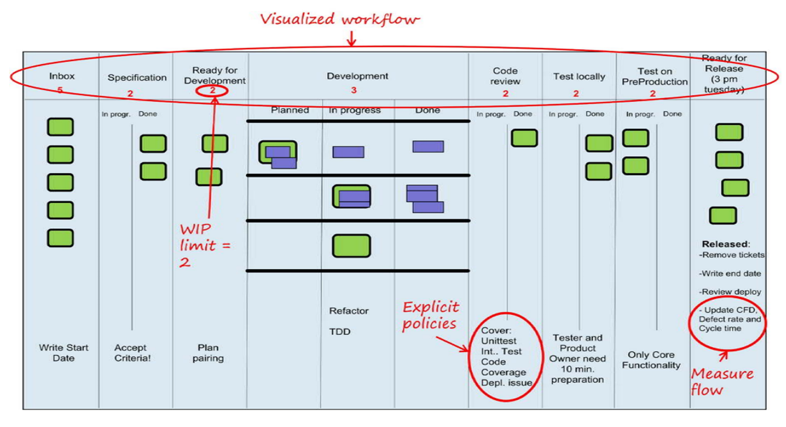
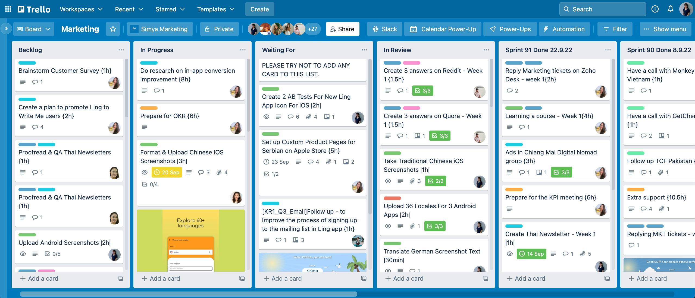

# Capítulo 16 – Kanban: Visualizando o Fluxo e Otimizando a Entrega

Após explorarmos diversas metodologias e modelos de processo, adentramos agora o universo do Kanban, uma abordagem com raízes profundas na busca pela eficiência e pela melhoria contínua dos fluxos de trabalho. Frequentemente associado a quadros visuais e cartões coloridos, o Kanban transcende a simples ferramenta para se configurar como um poderoso método de gestão de mudanças e otimização.

## Desvendando o Kanban: Natureza e Conceitos Essenciais

O termo "Kanban" (看板), de origem japonesa, traduz-se literalmente como "cartão" ou "sinal visual". Essa etimologia já nos oferece uma pista valiosa sobre a essência do método: o Kanban utiliza a **visualização do trabalho** como um de seus pilares centrais. Em sua aplicação mais conhecida, especialmente no desenvolvimento de software e em outras áreas do trabalho do conhecimento, o Kanban se manifesta como um sistema para gerenciar o fluxo de tarefas, identificar gargalos e promover um ritmo de entrega mais estável e previsível. Seu foco principal reside em tornar o trabalho visível, limitar o **Trabalho em Progresso (WIP - Work In Progress)**, gerenciar o fluxo, tornar as políticas explícitas, implementar ciclos de feedback e promover a melhoria colaborativa e evolutiva.

### Kanban é uma Metodologia de Desenvolvimento? Uma Discussão Necessária

Antes de aprofundarmos nas mecânicas do Kanban, é fundamental esclarecer uma questão que frequentemente gera debates: o Kanban é, por si só, uma metodologia de desenvolvimento de software? Para muitos especialistas, incluindo David J. Anderson, uma das figuras mais proeminentes na adaptação e popularização do Kanban para o trabalho do conhecimento, a resposta é não. Anderson argumenta de forma consistente que o Kanban não define um ciclo de vida de desenvolvimento de software, nem prescreve papéis, eventos ou artefatos específicos da maneira que o Scrum faz, por exemplo.

Suas palavras são elucidativas:

> “Kanban is not a software development life cycle or project management methodology! It is not a way of making software or running projects that make software!” – David J. Anderson

> “There is no kanban process for software development. At least I am not aware of one. I have never published one” – David J. Anderson

> “It is actually not possible to develop with only Kanban. The Kanban Method by itself does not contain practices sufficient to do product development” – David J. Anderson

Estas citações reforçam a ideia de que o Kanban deve ser entendido mais como um **método de gestão de fluxo** e um **catalisador de mudanças incrementais** do que como um processo de desenvolvimento completo. Ele oferece um conjunto de princípios e práticas que podem ser aplicados **sobre** processos já existentes para otimizar a entrega de valor e promover a melhoria contínua. No entanto, é comum que algumas pessoas e materiais didáticos o apresentem ou o comparem diretamente com metodologias de desenvolvimento, dada a sua ampla adoção e impacto no mundo ágil.

### O Quadro Kanban: A Materialização da Gestão Visual

A relação do Kanban com sua tradução de "cartão visual" é intrínseca. A ferramenta mais emblemática do método é o **Quadro Kanban (Kanban Board)**. Este quadro, que pode ser físico (como um quadro branco com post-its) ou digital (através de softwares especializados), serve para mapear e visualizar as etapas do fluxo de trabalho de uma equipe ou organização.

As tarefas ou itens de trabalho são representados por cartões (os "kanbans") que se movem através de colunas, cada coluna representando uma etapa distinta do processo (por exemplo: "A Fazer", "Em Análise", "Desenvolvimento", "Testes", "Aguardando Aprovação", "Concluído").

  

Esta representação visual proporciona uma **transparência imediata** sobre o status de cada tarefa, quem está trabalhando em quê, e onde podem estar ocorrendo gargalos ou impedimentos. É um dos grandes trunfos do Kanban, pois permite que toda a equipe e demais interessados tenham uma compreensão compartilhada do andamento do trabalho.

Diferentemente de abordagens como o Scrum, que opera em ciclos de tempo fixo (Sprints) com um escopo definido para cada ciclo, o Kanban, em sua forma pura, é um **sistema de fluxo contínuo**. Isso significa que não há uma obrigatoriedade de estimativas detalhadas para cada tarefa da mesma forma, nem a imposição de iterações. As prioridades podem ser ajustadas com maior fluidez, e as funcionalidades podem ser entregues assim que estiverem prontas e agregarem valor, sem a necessidade de esperar o final de um ciclo predefinido. Contudo, muitas equipes que utilizam Kanban optam por estabelecer uma **cadência** para certas atividades, como o planejamento de novas demandas (replenishment) e as entregas, para criar um ritmo previsível.

### Mudança Evolucionária e Melhoria Contínua

O Kanban é fundamentalmente construído sobre os conceitos de **mudança evolucionária** e **melhoria contínua (Kaizen)**. A abordagem típica para sua implementação não envolve uma ruptura drástica com os processos atuais. Pelo contrário, o primeiro passo é entender e visualizar o sistema de trabalho como ele opera no presente. A partir dessa visualização, e com a aplicação dos princípios e práticas do Kanban (como a limitação do WIP), a equipe começa a identificar os pontos de atrito, os gargalos e as oportunidades de otimização.

As melhorias são implementadas de forma incremental, um passo de cada vez, focando em aliviar o maior gargalo ou resolver o problema mais impactante no fluxo. O processo evolui organicamente, com a equipe aprendendo e se adaptando continuamente. Essa abordagem é significativamente diferente do Scrum, que já define de antemão papéis, eventos e artefatos que estruturam o processo.

Essa natureza adaptativa e não disruptiva torna o Kanban uma excelente opção para ser utilizado **em conjunto com outros processos e metodologias**. Ele pode ser aplicado sobre um fluxo de trabalho existente, seja ele baseado no Scrum, no modelo Cascata, ou em qualquer outra abordagem. É particularmente útil em organizações onde mudanças radicais enfrentam grande resistência, pois permite uma transição mais suave e gradual em direção a uma maior agilidade e eficiência.

Embora o Kanban promova melhorias incrementais, ele não exclui a possibilidade de mudanças mais significativas quando estas se mostram necessárias, seja por questões estruturais ou pela urgência em alcançar um novo patamar de desempenho.

### Kanban e Scrum: Diferenças e Sinergias

É comum a comparação entre Kanban e Scrum, e é importante destacar suas diferenças e como podem se complementar. O Scrum é um framework que prescreve iterações de tempo fixo (Sprints), com um conjunto de funcionalidades planejadas para cada iteração. O Kanban, por sua vez, é um sistema de fluxo contínuo, focado em limitar o trabalho em progresso e otimizar o **lead time** (tempo total para uma tarefa atravessar o sistema).

Principais distinções:

- **Iterações:** Scrum é iterativo por natureza (Sprints); Kanban é baseado em fluxo contínuo, embora possa ter cadências.
- **Prescrição de Papéis/Eventos:** Scrum define papéis (Product Owner, Scrum Master, Desenvolvedores) e eventos (Sprint Planning, Daily Scrum, Sprint Review, Sprint Retrospective); Kanban não prescreve papéis ou reuniões específicas, embora certas reuniões de feedback e planejamento sejam comuns.
- **Gestão do WIP:** O Kanban tem como prática central a limitação explícita do WIP por etapa do fluxo; o Scrum gerencia o WIP implicitamente através do escopo da Sprint.
- **Entrega:** No Scrum, o Incremento é entregue ao final da Sprint; no Kanban, a entrega pode ocorrer a qualquer momento, assim que um item de trabalho é concluído.

Apesar das diferenças, Kanban e Scrum não são mutuamente exclusivos. Muitas equipes utilizam o **Scrumban**, uma abordagem híbrida que combina a estrutura de eventos e papéis do Scrum com a gestão visual do fluxo e os limites de WIP do Kanban. Isso permite, por exemplo, que uma equipe Scrum visualize o fluxo de tarefas do Sprint Backlog em um quadro Kanban, limitando o WIP para cada etapa dentro da Sprint.

Independentemente de ser usado de forma pura ou combinada, um sistema Kanban bem implementado proporciona um controle robusto do processo através de:

- **Visualização Permanente:** O quadro Kanban oferece uma visão clara e em tempo real do trabalho.
- **Medição do Fluxo:** Métricas como **cycle time** e **throughput** permitem entender e melhorar a eficiência.
- **Fluxo Puxado:** Limitar o WIP cria um sistema onde o trabalho é "puxado" para a próxima etapa quando há capacidade, em vez de ser "empurrado" independentemente da capacidade.
- **Ciclos de Feedback Rápidos:** A visualização e as métricas facilitam a identificação ágil de problemas e a implementação de melhorias.

## Os Pilares do Kanban: Princípios e Práticas para a Otimização do Fluxo

O método Kanban, apesar de sua aparente simplicidade e flexibilidade, é sustentado por um conjunto de princípios fundamentais e se manifesta através de práticas centrais que são essenciais para sua eficácia na otimização do fluxo de valor e na promoção da melhoria contínua. A compreensão e aplicação diligente desses elementos são cruciais para colher os benefícios que o Kanban pode oferecer.

### Princípios Fundamentais do Kanban

Os princípios do Kanban atuam como alicerces filosóficos e diretrizes estratégicas para a sua implementação e evolução. Eles orientam as equipes e organizações a adotarem uma mentalidade focada na melhoria incremental e no respeito aos processos e pessoas existentes. São eles:

- **Comece com o que você faz agora (Start with what you do now):** Este é, talvez, o princípio mais distintivo do Kanban em relação a outras abordagens que propõem uma reestruturação completa desde o início. O Kanban não exige uma revolução nos processos atuais. Pelo contrário, ele encoraja as organizações a começarem exatamente de onde estão, respeitando os papéis, responsabilidades e processos já existentes. A ideia é aplicar as práticas do Kanban sobre a estrutura atual para, primeiramente, visualizar o fluxo de trabalho como ele realmente acontece e, a partir daí, identificar gradualmente os pontos de melhoria. Esta abordagem minimiza a resistência à mudança e permite uma adoção mais orgânica e menos disruptiva.
- **Busque a melhoria incremental e evolucionária (Agree to pursue incremental, evolutionary change):** O Kanban é um método de gestão de mudanças que favorece a evolução gradual em vez de transformações radicais e repentinas. A filosofia é que pequenas melhorias contínuas, implementadas de forma consistente ao longo do tempo, levam a resultados significativos e sustentáveis. Mudanças drásticas podem ser desestabilizadoras e encontrar maior resistência. O Kanban propõe identificar o maior gargalo ou a maior fonte de ineficiência e trabalhar para resolvê-la, um passo de cada vez.
- **Respeite os processos, papéis, responsabilidades e títulos atuais (Initially, respect current roles, responsibilities, and job titles):** Alinhado com o primeiro princípio, o Kanban reconhece que as estruturas e papéis existentes em uma organização geralmente têm um propósito e um valor. Em vez de impor uma nova estrutura de papéis desde o início (como o Scrum faz com Product Owner, Scrum Master, etc.), o Kanban busca entender e respeitar a organização atual. As melhorias no fluxo podem, eventualmente, levar a reflexões sobre a otimização de papéis e responsabilidades, mas isso ocorre como uma consequência da evolução do sistema, e não como uma precondição para iniciar com Kanban.
- **Incentive atos de liderança em todos os níveis (Encourage acts of leadership at all levels):** O Kanban valoriza a ideia de que a liderança não está restrita a cargos formais de gestão. Qualquer pessoa na organização, independentemente de sua posição hierárquica, pode e deve exercer liderança ao identificar problemas, propor melhorias, colaborar com os colegas e tomar iniciativas que contribuam para a otimização do fluxo e a entrega de valor. O Kanban fomenta uma cultura onde a responsabilidade pela melhoria é compartilhada e onde a proatividade é encorajada.

Esses quatro princípios fundamentais estabelecem uma base de respeito, pragmatismo e foco na evolução contínua, tornando o Kanban uma abordagem poderosa para a gestão de mudanças em qualquer tipo de organização que realize trabalho do conhecimento.

### Práticas Gerais do Kanban

Para traduzir os princípios em ações concretas, o Kanban se apoia em seis práticas gerais que são essenciais para a sua implementação e operação eficaz:

- **Visualizar o Fluxo de Trabalho (Visualize the Flow of Work):** Esta é a prática mais icônica do Kanban. Consiste em mapear as etapas do processo de trabalho em um quadro visual (o Quadro Kanban). Cada etapa pela qual um item de trabalho passa, desde sua concepção até a entrega, é representada como uma coluna. Os itens de trabalho em si são representados por cartões que se movem através dessas colunas. Esta visualização torna o trabalho, o fluxo, os bloqueios e os gargalos imediatamente transparentes para toda a equipe e para os stakeholders. É o primeiro passo para entender o sistema e identificar onde as melhorias são mais necessárias.
- **Limitar o Trabalho em Progresso (Limit Work In Progress - WIP):** Esta é, possivelmente, a prática mais poderosa e transformadora do Kanban. Limitar o WIP significa definir uma quantidade máxima de itens de trabalho que podem estar em cada etapa do fluxo (ou em certas partes do fluxo, ou no sistema como um todo) ao mesmo tempo. Quando o limite de WIP de uma coluna é atingido, nenhum novo item pode ser puxado para aquela etapa até que um item existente avance para a próxima.
    - **Por que limitar o WIP?** A sobrecarga de trabalho é uma das maiores causas de ineficiência, queda de qualidade e estresse nas equipes. Quando há muitas tarefas em andamento simultaneamente, o foco se dispersa, o custo de troca de contexto aumenta, as filas de espera crescem e o tempo total para entregar qualquer item individual (lead time) se alonga. Limitar o WIP combate esses problemas, pois:
        - **Cria um sistema puxado:** O trabalho só avança quando há capacidade na próxima etapa, evitando o acúmulo de trabalho inacabado.
        - **Reduz o tempo de ciclo:** Com menos itens em progresso, cada item tende a fluir mais rapidamente pelo sistema.
        - **Expõe gargalos:** Se uma etapa consistentemente atinge seu limite de WIP enquanto a etapa seguinte tem capacidade ociosa, isso indica um gargalo que precisa ser tratado.
        - **Melhora o foco e a qualidade:** As equipes podem se concentrar em finalizar o trabalho iniciado antes de começar novas tarefas.
    - **Como definir os limites de WIP?** Não existe um número mágico. Os limites de WIP devem ser definidos empiricamente, começando com valores que reflitam a capacidade atual da equipe e ajustando-os gradualmente com base na observação do fluxo e nas métricas. Se o limite for muito baixo, a equipe pode ficar ociosa; se for muito alto, os benefícios da limitação do WIP são perdidos. A chave é experimentar e encontrar o equilíbrio que otimiza o fluxo para o contexto específico.
- **Gerenciar o Fluxo (Manage Flow):** O objetivo principal do Kanban é melhorar o fluxo de valor para o cliente. Gerenciar o fluxo significa monitorar como o trabalho se move através do sistema, identificar onde ele fica parado ou lento, e tomar ações para remover impedimentos e suavizar o fluxo. Isso envolve observar o quadro Kanban regularmente, analisar métricas de fluxo (como lead time, cycle time e throughput), e facilitar a colaboração para resolver problemas que estão impactando a capacidade do sistema de entregar valor de forma rápida e previsível.
- **Tornar as Políticas do Processo Explícitas (Make Process Policies Explicit):** Para que um sistema Kanban funcione bem, as "regras do jogo" precisam ser claras e compreendidas por todos. Políticas explícitas definem como o trabalho é gerenciado dentro do sistema. Exemplos de políticas incluem:
    - O que define um item como "pronto" para passar de uma coluna para outra (critérios de entrada/saída).
    - Como os diferentes tipos de trabalho (classes de serviço, como "urgente", "padrão", "data fixa") são tratados e priorizados.
    - Como os limites de WIP são aplicados e o que acontece quando um limite é atingido.
    - Como os itens bloqueados são sinalizados e tratados. Tornar essas políticas visíveis (muitas vezes anotadas no próprio quadro Kanban) ajuda a garantir consistência, reduz ambiguidades e facilita a tomada de decisões pela equipe.
- **Implementar Ciclos de Feedback (Implement Feedback Loops):** O Kanban enfatiza a importância de ciclos de feedback regulares para permitir a inspeção e adaptação contínuas. Esses ciclos ocorrem em diferentes níveis e cadências:
    - **Feedback no nível do item de trabalho:** A própria movimentação do cartão no quadro fornece feedback sobre seu progresso.
    - **Feedback no nível da equipe/fluxo:** Reuniões regulares (muitas vezes chamadas de "Kanban meeting" ou "stand-up focada no fluxo") para revisar o estado do quadro, discutir bloqueios e sincronizar o trabalho.
    - **Feedback no nível do serviço/entrega:** Reuniões para revisar o desempenho do sistema (métricas de fluxo), a qualidade das entregas e o feedback dos clientes (semelhante a uma Sprint Review, mas com cadência definida pela equipe).
    - **Feedback no nível de estratégia/risco:** Reuniões para avaliar se o sistema Kanban está alinhado com os objetivos de negócio e para revisar riscos. Esses ciclos de feedback são essenciais para o aprendizado e a melhoria contínua.

- **Melhorar Colaborativamente, Evoluir Experimentalmente (Improve Collaboratively, Evolve Experimentally - using models & the scientific method):** A melhoria no Kanban é um esforço contínuo e colaborativo, envolvendo toda a equipe. Em vez de impor grandes mudanças, o Kanban encoraja uma abordagem experimental, baseada no método científico:
    - **Observar:** Analisar o sistema atual e identificar um problema ou oportunidade de melhoria.
    - **Formular uma Hipótese:** Propor uma mudança que se acredita que levará a uma melhoria.
    - **Experimentar:** Implementar a mudança de forma controlada.
    - **Medir e Aprender:** Coletar dados para avaliar o impacto da mudança.
    - **Validar ou Invalidar:** Com base nos resultados, decidir se a mudança deve ser mantida, ajustada ou descartada. Este ciclo de aprendizado e experimentação permite que o sistema evolua de forma segura e eficaz.

### Ferramentas de Suporte ao Kanban

Embora a essência do Kanban possa ser capturada com um simples quadro branco e post-its, o uso de ferramentas digitais se tornou comum, especialmente para equipes que trabalham remotamente, precisam de funcionalidades de relatório mais robustas ou gerenciam fluxos de trabalho mais complexos.

O **Trello** é um exemplo frequentemente citado de ferramenta que, com sua interface baseada em quadros, listas e cartões, permite uma implementação visual e intuitiva de um sistema Kanban simples. Cada lista no Trello pode representar uma coluna do quadro Kanban, e os cartões representam os itens de trabalho que se movem entre essas listas.

  

Além do Trello, o mercado oferece uma vasta gama de outras ferramentas que suportam o Kanban, algumas mais especializadas e com funcionalidades avançadas de gestão de fluxo e métricas. Exemplos incluem **Jira** (que possui configurações específicas para quadros Kanban), **KanbanFlow**, **Kanbanery**, **LeanKit Kanban**, **Azure DevOps Boards** (anteriormente Visual WIP ou TFS), entre muitas outras. A escolha da ferramenta mais adequada dependerá das necessidades específicas da equipe, da complexidade do fluxo, dos requisitos de integração com outras ferramentas e do orçamento disponível. O importante é que a ferramenta escolhida apoie os princípios e práticas do Kanban, especialmente a visualização do fluxo e a limitação do WIP.

## Considerações Finais sobre o Kanban

Ao encerrarmos este capítulo dedicado ao Kanban, torna-se claro que sua aparente simplicidade esconde uma abordagem profundamente eficaz para a gestão do trabalho e a promoção da melhoria contínua. Diferenciando-se de metodologias mais prescritivas, o Kanban oferece um caminho flexível e evolucionário para otimizar fluxos de trabalho, aplicável a uma vasta gama de contextos, muito além do desenvolvimento de software.

Revisitamos a discussão sobre sua natureza, entendendo que, embora frequentemente associado a metodologias ágeis, o Kanban é, em sua essência, um método de gestão de fluxo que pode complementar e potencializar outros processos já existentes, incluindo o Scrum, dando origem a abordagens híbridas como o Scrumban. Sua filosofia de "começar com o que você faz agora" e "buscar a melhoria incremental" o torna particularmente atraente para organizações que buscam aprimoramento sem a necessidade de rupturas radicais.

Os princípios fundamentais do Kanban – visualizar o trabalho, limitar o WIP, gerenciar o fluxo, tornar as políticas explícitas, implementar ciclos de feedback e melhorar colaborativamente – fornecem um roteiro robusto para que as equipes ganhem controle sobre seus processos, identifiquem ineficiências e tomem decisões embasadas em dados. As práticas centrais, com destaque para a visualização através do quadro Kanban e a crucial limitação do Trabalho em Progresso, são as ferramentas que materializam esses princípios no dia a dia.

Concluímos, portanto, que o Kanban é muito mais do que um quadro com cartões. É uma mentalidade e um sistema de gestão que capacita as equipes a entenderem, controlarem e, o mais importante, aprimorarem continuamente a forma como entregam valor. Seja qual for o domínio de aplicação, o Kanban oferece um conjunto poderoso de lentes para enxergar o trabalho de uma nova maneira, promovendo maior previsibilidade, eficiência e, em última instância, a satisfação tanto de quem produz quanto de quem recebe o resultado desse trabalho.
