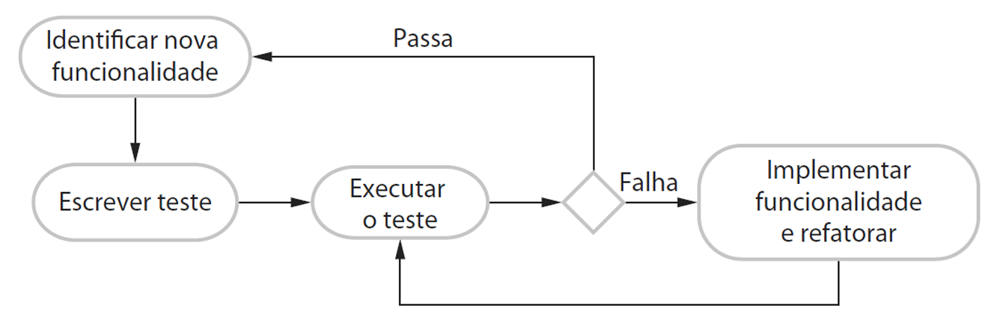
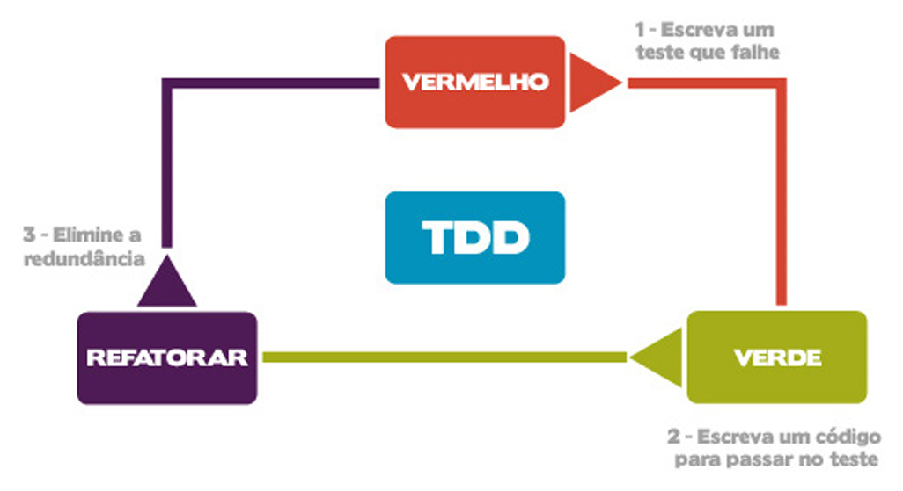

# Capítulo 17 – Desenvolvimento Orientado a Testes (Test-Driven Development - TDD)

No dinâmico e exigente universo da Engenharia de Software, a busca por práticas que elevem a qualidade, a confiabilidade e a manutenibilidade dos sistemas é uma constante. Entre as diversas abordagens que emergiram, especialmente no contexto das metodologias ágeis, o **Desenvolvimento Orientado a Testes (Test-Driven Development - TDD)** se destaca como uma técnica poderosa e transformadora. Longe de ser apenas uma metodologia de teste, o TDD é, em sua essência, uma filosofia de desenvolvimento que coloca os testes no epicentro do processo de construção de software, guiando a implementação de forma incremental e iterativa.

Este capítulo se dedicará a desvendar os conceitos, processos, benefícios e nuances do TDD, explorando como essa abordagem pode revolucionar a maneira como o software é concebido, escrito e validado.

## Desvendando o Test-Driven Development: Conceitos Fundamentais

O **Test-Driven Development (TDD)**, ou Desenvolvimento Orientado a Testes, é uma abordagem de desenvolvimento de software que se caracteriza pela intrínseca e contínua intercalação entre a escrita de testes e o desenvolvimento do código de produção. A premissa central é que nenhum código de funcionalidade é escrito antes que um teste automatizado, que verifica essa mesma funcionalidade, tenha sido criado e visto falhar. Essencialmente, o software é construído de forma incremental, com cada pequeno incremento sendo precedido e validado por um teste específico. O desenvolvedor só avança para o próximo incremento de funcionalidade após garantir que todo o código desenvolvido anteriormente passe em todos os testes existentes.

Embora o TDD tenha ganhado grande proeminência como uma das práticas fundamentais de metodologias ágeis, como o **Extreme Programming (XP)** – onde foi formalizado e popularizado por Kent Beck – sua aplicabilidade não se restringe a esses contextos. Os princípios do TDD podem ser adaptados e trazer benefícios significativos também em processos de desenvolvimento mais tradicionais ou dirigidos a planos, desde que haja uma cultura que valorize a qualidade e a automação de testes.

A ideia fundamental que sustenta o TDD é a repetição de um ciclo de desenvolvimento muito curto, intensamente focado na criação e execução de **testes unitários**. Este ciclo, frequentemente denominado "Vermelho-Verde-Refatorar" (Red-Green-Refactor), estabelece uma cadência onde o desenvolvedor primeiro escreve um teste para uma pequena funcionalidade que ainda não existe (o teste, naturalmente, falha – estado "Vermelho"), depois escreve o mínimo de código necessário para que esse teste passe (estado "Verde") e, finalmente, refatora o código para melhorar sua estrutura e clareza, sem alterar seu comportamento externo.

### O Ciclo de Desenvolvimento no TDD

O processo de desenvolvimento orientado a testes segue um conjunto de etapas bem definidas, que se repetem continuamente para cada pequena porção de funcionalidade a ser implementada. Essas etapas garantem que o desenvolvimento seja guiado pelos requisitos (expressos na forma de testes) e que a qualidade seja embutida no código desde o seu nascimento.

A tabela a seguir detalha as etapas desse processo cíclico:

|ETAPA|DESCRIÇÃO|
|---|---|
|1|**Identificar o Incremento de Funcionalidade:** Você começa identificando a próxima pequena funcionalidade ou comportamento que precisa ser adicionado ao sistema. Este incremento deve ser pequeno o suficiente para ser implementável com poucas linhas de código e para que um teste específico possa ser escrito para ele.|
|2|**Escrever um Teste Automatizado:** Antes de escrever qualquer código de produção para a funcionalidade identificada, você escreve um teste que verificará se essa funcionalidade se comporta conforme o esperado. É crucial que este teste seja automatizado, ou seja, possa ser executado por uma ferramenta que reporte automaticamente se ele passou ou falhou.|
|3|**Executar Todos os Testes (e Ver o Novo Teste Falhar):** Você executa o novo teste juntamente com todos os outros testes que já foram implementados para o sistema. Como a funcionalidade correspondente ao novo teste ainda não foi implementada, é esperado (e desejável) que este novo teste falhe. Essa falha inicial é importante, pois confirma que o teste está, de fato, verificando algo novo e que não passa acidentalmente.|
|4|**Implementar a Funcionalidade e Executar os Testes Novamente:** Agora, você escreve o mínimo de código de produção necessário para fazer com que o teste recém-criado (e que estava falhando) passe. Isso pode envolver a refatoração de código existente para acomodar a nova funcionalidade ou a adição de novo código. Após a implementação, todos os testes são executados novamente.|
|5|**Refatorar e Confirmar (se necessário):** Se todos os testes passarem, incluindo o novo, você pode então refatorar o código que acabou de escrever e o código existente para melhorar sua clareza, simplicidade, desempenho ou estrutura interna, sem alterar seu comportamento externo. Após a refatoração, todos os testes devem ser executados novamente para garantir que nenhuma regressão foi introduzida.|
|6|**Repetir o Ciclo:** Uma vez que todos os testes estejam passando e o código esteja limpo, você seleciona o próximo pequeno incremento de funcionalidade e repete o ciclo a partir da etapa 1.|

Este processo pode ser visualizado da seguinte forma:

  

A natureza incremental do TDD, com o desenvolvimento ocorrendo em porções muito pequenas de funcionalidade, exige uma capacidade ágil de executar todos os testes do sistema repetidamente. Cada vez que uma nova funcionalidade é adicionada ou uma refatoração é realizada, o conjunto completo de testes deve ser executado para garantir que nenhuma regressão foi introduzida. Para viabilizar isso, os testes são tipicamente implementados utilizando frameworks de teste automatizado (como JUnit para Java, NUnit para .NET, PyUnit para Python, entre muitos outros). Esses frameworks permitem que centenas, ou até milhares, de testes sejam executados em questão de segundos, fornecendo feedback rápido e constante para o desenvolvedor.

### A Importância da Automação e o Entendimento dos Requisitos

Um dos argumentos mais fortes em favor do desenvolvimento dirigido a testes é que ele força os programadores a **clarear suas ideias sobre o que um segmento de código supostamente deve fazer, antes mesmo de escrevê-lo**. Para conseguir escrever um teste significativo, o desenvolvedor precisa ter um entendimento preciso do comportamento esperado da funcionalidade. Esse exercício de pensar sobre os resultados esperados e as condições de contorno, no momento da escrita do teste, frequentemente leva a um design mais simples, coeso e correto do código de produção.

No entanto, é crucial reconhecer que o TDD não é uma panaceia. Se o desenvolvedor possui um conhecimento ou compreensão incompleta dos requisitos ou das regras de negócio, o TDD, por si só, não garantirá a correção da funcionalidade. Se você não sabe o suficiente sobre o problema para escrever os testes corretos e abrangentes, provavelmente também não desenvolverá o código necessário para lidar com todas as situações.

Por exemplo, considere uma funcionalidade que envolve um cálculo com divisão. Se o desenvolvedor se esquecer de que a divisão por zero é uma condição de erro que precisa ser tratada, ele provavelmente não escreverá um teste para verificar esse cenário específico. Consequentemente, o código de produção para essa verificação de divisão por zero pode nunca ser incluído no programa, resultando em uma falha potencial em tempo de execução. O TDD ajuda a traduzir o entendimento existente em código testável, mas não substitui a necessidade de uma análise cuidadosa dos requisitos.

## Os Benefícios Tangíveis do TDD

A adoção do Test-Driven Development traz consigo uma série de vantagens significativas que impactam positivamente a qualidade do software, a produtividade da equipe e a manutenibilidade do sistema a longo prazo. Esses benefícios não são meramente teóricos; são observados na prática por equipes que incorporam o TDD em seu fluxo de trabalho diário.

|Benefícios|Descrição|
|---|---|
|**Cobertura de Código Abrangente**|Em princípio, todo segmento de código de produção que você escreve no TDD deve ter pelo menos um teste automatizado associado a ele, pois o código só é escrito para fazer um teste passar. Isso resulta em uma alta cobertura de testes, o que significa que você pode ter uma confiança maior de que todo o código no sistema foi realmente executado e verificado durante o desenvolvimento. Como cada parte do código é testada no momento em que está sendo escrita, os defeitos tendem a ser descobertos muito no início do processo de desenvolvimento, quando são mais fáceis e baratos de corrigir.|
|**A Força dos Testes de Regressão Contínuos**|Um conjunto robusto de testes automatizados é desenvolvido de forma incremental à medida que o programa evolui. Isso significa que você sempre pode executar testes de regressão para verificar se as mudanças recentes no programa (sejam novas funcionalidades, correções de bugs ou refatorações) não introduziram novos defeitos ou quebraram funcionalidades que antes funcionavam corretamente. A capacidade de realizar testes de regressão de forma rápida e frequente é um dos pilares da agilidade e da manutenção da qualidade ao longo do tempo.|
|**Depuração Simplificada e Eficaz**|Quando um teste falha no TDD, a localização do problema geralmente se torna muito mais óbvia. Como os testes são escritos para pequenas unidades de funcionalidade e o código é adicionado incrementalmente, a falha de um teste frequentemente aponta diretamente para o código recém-escrito ou modificado. Isso reduz drasticamente a necessidade de usar ferramentas de depuração complexas para rastrear a origem do erro. Alguns relatos de equipes que utilizam TDD intensivamente sugerem que a necessidade de recorrer a um depurador automatizado se torna uma ocorrência rara.|
|**Testes como Documentação Viva do Sistema**|Os próprios testes automatizados agem como uma forma de documentação executável e sempre atualizada do sistema. Eles descrevem de maneira precisa e inequívoca o que cada segmento de código deve estar fazendo, quais são as entradas esperadas e quais são os resultados esperados. Ler os testes pode tornar muito mais fácil a compreensão do comportamento e da intenção do código de produção, especialmente para novos membros da equipe ou para desenvolvedores que precisam dar manutenção em um código que não escreveram.|

### Redução de Custos com Testes de Regressão: Um Benefício Chave

Um dos benefícios mais impactantes e frequentemente citados do desenvolvimento dirigido a testes é a **significativa redução nos custos associados aos testes de regressão**. O teste de regressão, como mencionado, envolve a execução de conjuntos de testes que já foram executados com sucesso anteriormente, após a realização de quaisquer alterações no sistema. Seu objetivo é crucial: verificar se essas mudanças não introduziram novos bugs (regressões) e se o novo código interage corretamente com o código existente.

Quando um sistema é testado predominantemente de forma manual, o teste de regressão torna-se uma tarefa extremamente cara, demorada e, muitas vezes, impraticável de ser realizada de forma completa a cada pequena alteração. Os custos com tempo e esforço humano são proibitivos. Em tais situações, as equipes frequentemente precisam tentar adivinhar ou escolher quais são os testes "mais relevantes" para executar novamente, correndo um risco significativo de deixar passar testes importantes e, consequentemente, introduzir defeitos em produção.

No entanto, a ênfase do TDD na **criação de testes automatizados desde o início** muda radicalmente esse cenário. Testes automatizados podem ser executados repetidamente, de forma rápida e com custo marginal próximo de zero. Após qualquer modificação ser feita em um sistema desenvolvido com TDD – seja a adição de uma nova funcionalidade, uma correção de bug ou uma refatoração – todos os testes existentes devem ser executados. E eles devem todos passar com êxito antes que qualquer nova funcionalidade seja considerada para adição.

Como programador, ao seguir a disciplina do TDD, você ganha uma rede de segurança robusta. Você pode ter uma confiança muito maior de que a nova funcionalidade que está integrando não causou ou revelou problemas com o código existente, pois o conjunto completo de testes de regressão está lá para validar isso continuamente. Essa capacidade de realizar regressões completas e frequentes é o que permite que as equipes ágeis mantenham um ritmo de desenvolvimento rápido sem sacrificar a qualidade.

## Aplicabilidade e Limitações do TDD

Apesar de seus inúmeros benefícios, o Test-Driven Development não é uma solução universalmente aplicável a todos os cenários de desenvolvimento de software com a mesma eficácia. Compreender seus pontos fortes e suas limitações é crucial para decidir onde e como aplicá-lo de maneira mais produtiva.

### Cenários Ideais para Adoção do TDD

O desenvolvimento dirigido a testes demonstra sua maior utilidade e eficácia no **desenvolvimento de softwares novos (greenfield projects)**, onde a funcionalidade é implementada predominantemente em código novo ou através da utilização de bibliotecas-padrão que já são, por si só, bem testadas e confiáveis. Nesses contextos, a disciplina de escrever testes antes do código pode guiar o design da aplicação desde o início, promovendo uma arquitetura mais limpa, modular e testável.

Além disso, o TDD é particularmente valioso em projetos onde os **requisitos são bem compreendidos ou podem ser decompostos em pequenas unidades funcionais claras e testáveis**. A capacidade de expressar o comportamento esperado de cada pequena parte do sistema na forma de um teste automatizado é fundamental para o sucesso da abordagem.

### Desafios e Contextos de Menor Eficácia

Por outro lado, existem situações em que a aplicação do TDD pode ser mais desafiadora ou menos eficaz:

- **Sistemas Legados e Reúso de Componentes Massivos:** Se você está trabalhando com a **reutilização de grandes componentes de código existentes ou sistemas legados** que não foram desenvolvidos com testabilidade em mente e não possuem uma suíte de testes adequada, aplicar o TDD diretamente pode ser difícil. Nesses casos, antes de introduzir novas funcionalidades com TDD, pode ser necessário um esforço significativo para escrever testes para esses sistemas legados como um todo (testes de caracterização) ou para criar interfaces testáveis ao redor deles.
- **Sistemas Altamente Concorrentes (Multi-threaded):** O TDD também pode apresentar desafios em **sistemas que envolvem múltiplas threads de execução (multi-threaded)**. A natureza não determinística da intercalação de threads pode fazer com que os testes produzam resultados diferentes em execuções diferentes, mesmo que o código subjacente não tenha mudado. Isso torna a criação de testes unitários estáveis e confiáveis para lógica concorrente uma tarefa complexa, exigindo técnicas e ferramentas especializadas.
- **Interfaces Gráficas de Usuário (GUIs):** Testar interfaces gráficas de usuário de forma unitária e automatizada com TDD pode ser complicado. Embora existam ferramentas e padrões para testes de GUI, a natureza dinâmica e visual das interfaces muitas vezes torna os testes frágeis e difíceis de manter. Nesses casos, o TDD pode ser mais eficaz se focado na lógica de apresentação (como em padrões como MVP, MVVM) e complementado por outros tipos de testes de UI (como testes de aceitação automatizados com ferramentas específicas de UI).
- **Integração com Sistemas Externos Complexos:** Quando a funcionalidade depende fortemente da interação com sistemas externos sobre os quais não se tem controle (ex: APIs de terceiros, bancos de dados legados), escrever testes unitários isolados pode exigir um uso extensivo de mocks e stubs, o que pode, em alguns casos, tornar os testes menos representativos do comportamento real do sistema integrado.

### A Necessidade Complementar do Teste de Sistema

É crucial entender que, mesmo que você utilize o desenvolvimento dirigido a testes de forma rigorosa, **ele não elimina a necessidade de um processo de teste de sistema mais abrangente**. O TDD foca primariamente em garantir que as unidades individuais de código funcionem corretamente e que o sistema não tenha regressões em nível de componente.

No entanto, o **teste de sistema** é essencial para validar o sistema como um todo, verificando se ele atende aos requisitos dos stakeholders em um ambiente mais próximo do de produção. Isso inclui:

- **Testes de Desempenho:** Para garantir que o sistema responda dentro dos tempos esperados sob diferentes cargas de trabalho.
- **Testes de Confiabilidade e Escalabilidade:** Para verificar a robustez do sistema e sua capacidade de lidar com falhas e aumento de demanda.
- **Testes de Segurança:** Para identificar e corrigir vulnerabilidades.
- **Testes de Usabilidade:** Para garantir que a interface seja intuitiva e fácil de usar.
- **Verificação de Requisitos Não Funcionais:** Como conformidade com regulamentações, compatibilidade entre diferentes plataformas, etc.
- **Validação de que o sistema não faz coisas que não deveria:** O TDD ajuda a garantir que o sistema faça o que é esperado, mas o teste de sistema também é importante para verificar comportamentos indesejados ou efeitos colaterais não previstos.

O TDD tem se revelado uma abordagem de grande sucesso para projetos de software de pequeno e médio porte, e muitos desenvolvedores que adotam essa prática relatam um aumento na satisfação com o trabalho e percebem o TDD como uma maneira mais produtiva e menos estressante de desenvolver software. Diversos experimentos e estudos de caso também têm demonstrado que a aplicação consistente do TDD pode levar a melhorias significativas na qualidade intrínseca do código, resultando em menos defeitos e maior facilidade de manutenção.

## O Coração do TDD: O Ciclo Vermelho-Verde-Refatorar (Red-Green-Refactor)

A essência prática do Test-Driven Development reside em um ciclo curto, iterativo e disciplinado conhecido como **Vermelho-Verde-Refatorar (Red-Green-Refactor)**. Este ciclo não é apenas uma sequência de passos, mas uma mentalidade que guia o desenvolvedor na construção de software de forma incremental, garantindo que cada pequena peça de funcionalidade seja validada por testes antes mesmo de ser completamente implementada e, em seguida, refinada para alcançar a melhor qualidade possível.

A imagem a seguir ilustra visualmente este ciclo fundamental:

  

Vamos detalhar cada uma das etapas deste ciclo:

|ETAPA|DESCRIÇÃO|
|---|---|
|**VERMELHO (RED)**|**Escreva um teste que falha:** O ciclo começa com a escrita de um novo teste automatizado para uma pequena funcionalidade ou comportamento que ainda não existe no sistema. Como o código de produção correspondente ainda não foi implementado, é esperado e crucial que este teste falhe quando executado. A falha é frequentemente indicada por uma barra vermelha ou uma mensagem de erro na ferramenta de teste, daí o nome "Vermelho". Esta etapa força o desenvolvedor a pensar claramente sobre os requisitos e o comportamento esperado da funcionalidade antes de escrever qualquer código para ela. A falha inicial também serve como uma verificação de que o teste em si está correto e que realmente está testando algo novo.|
|**VERDE (GREEN)**|**Escreva código para passar no teste:** Após confirmar que o novo teste está falhando (e falhando pelas razões corretas), o desenvolvedor escreve o **mínimo de código de produção necessário** para fazer com que esse teste específico passe. O objetivo nesta fase não é escrever o código mais elegante, otimizado ou completo, mas sim o código mais simples possível que satisfaça o teste. Uma vez que o código é escrito, todos os testes (incluindo o novo) são executados novamente. Se o novo teste passar (e todos os testes anteriores continuarem passando), o desenvolvedor alcançou o estado "Verde", geralmente indicado por uma barra verde na ferramenta de teste.|
|**REFATORAR (REFACTOR)**|**Elimine redundâncias e melhore o design:** Com os testes passando (garantindo que o comportamento esperado está correto), o desenvolvedor agora tem a segurança para refatorar o código que acabou de escrever e qualquer outro código relacionado. Refatorar significa melhorar a estrutura interna do código – tornando-o mais limpo, mais claro, mais eficiente, removendo duplicações, melhorando nomes de variáveis e métodos, etc. – **sem alterar seu comportamento externo observado**. Após cada pequena refatoração, todos os testes devem ser executados novamente para garantir que nenhuma funcionalidade foi quebrada no processo. Esta etapa é crucial para manter a qualidade do código e evitar o acúmulo de "dívida técnica".|

### A Dinâmica do Feedback Rápido e a Qualidade Emergente

Como já sabemos, para cada nova parte da aplicação ou funcionalidade a ser adicionada, o desenvolvedor primeiro escreve um teste. Este teste é escrito **antes mesmo do desenvolvimento do código da funcionalidade em si**. Por que essa ordem é tão importante? Porque os testes, quando escritos primeiro, atuam como uma especificação executável do comportamento desejado e ajudam a reduzir os riscos de introduzir problemas ou mal-entendidos no código de produção.

Ao executarmos o teste recém-criado, ele deve, necessariamente, **falhar**! Isso pode parecer contraintuitivo à primeira vista, mas é um passo fundamental. Por que ele deve falhar? Simplesmente porque a funcionalidade para a qual o teste foi escrito ainda não existe no sistema. Se o teste passasse de primeira, isso indicaria um problema: ou o teste não está verificando o que deveria, ou a funcionalidade já existe (talvez de forma não intencional), ou o próprio teste está com defeito.

Somente após confirmar a falha do teste (o estado **Vermelho**), nós adicionamos a nova funcionalidade ao sistema, escrevendo apenas o código suficiente para que ele passe no teste. Em seguida, executamos novamente o teste (e, idealmente, todos os outros testes do sistema). Agora, ele deve passar (o estado **Verde**).

O ciclo continua: adicionamos um novo teste para a próxima pequena peça de funcionalidade, executamos todos os testes (o novo teste falha, os antigos continuam passando). Se algum dos testes anteriores falhar após a adição do novo código, isso indica uma regressão, e o código da funcionalidade deve ser modificado e todos os testes executados novamente, até que tudo esteja verde. E assim por diante, seguindo o processo ilustrado anteriormente.

Vocês conseguem perceber como o **feedback sobre a nova funcionalidade ocorre de maneira incrivelmente rápida**? O desenvolvedor sabe quase que instantaneamente se o código que acabou de escrever está funcionando conforme o esperado. Além disso, essa abordagem tende a criar um **código mais limpo e simples**, visto que o objetivo inicial é apenas fazer o teste passar, evitando a superengenharia ou a adição de complexidade desnecessária.

Outros benefícios diretos dessa dinâmica incluem:

- **Maior segurança na correção de eventuais bugs:** Se um bug é descoberto, o primeiro passo é escrever um teste que reproduza esse bug. Uma vez que o teste esteja falhando, o desenvolvedor corrige o código e, ao ver o teste passar, tem a confiança de que o bug foi realmente corrigido e que a correção não introduziu novos problemas (desde que todos os outros testes continuem passando).
- **Aumento da produtividade:** Embora possa parecer que escrever testes primeiro adiciona mais trabalho, a longo prazo, perde-se muito menos tempo com sessões demoradas de depuração, pois os erros são pegos cedo e de forma localizada.
- **Código mais flexível, menos acoplado e mais coeso:** A necessidade de escrever código testável frequentemente leva a um design mais modular, com componentes menores, bem definidos e com responsabilidades claras, o que facilita a manutenção e a evolução do sistema.

### Tipos de Testes e Ferramentas de Suporte

No contexto do TDD, embora a ênfase seja frequentemente dada aos **testes unitários** (que verificam pequenas unidades de código, como métodos ou classes, de forma isolada), a abordagem não se limita a eles. Dependendo da granularidade da "funcionalidade" que está sendo desenvolvida, podem ser utilizados também **testes de integração** (que verificam a interação entre diferentes componentes ou módulos) ou até mesmo **testes de aceitação** (que validam o comportamento do sistema do ponto de vista do usuário ou do negócio), embora estes últimos sejam mais característicos de variações como o ATDD (Acceptance Test-Driven Development), que veremos adiante. No entanto, os testes unitários são, de fato, os mais comuns e formam a espinha dorsal da prática do TDD.

Para implementar o processo de desenvolvimento orientado a testes, existe uma vasta gama de **ferramentas (frameworks de teste)** disponíveis para as mais diversas linguagens de programação. Algumas das mais conhecidas incluem:

- **JUnit:** Para a linguagem Java.
- **TestNG:** Também para Java, com funcionalidades adicionais em relação ao JUnit.
- **PHPUnit:** Para a linguagem PHP.
- **SimpleTest:** Outra opção para PHP.
- **NUnit:** Para a plataforma .NET (C#, VB.NET).
- **Jasmine:** Um framework de teste BDD (Behavior-Driven Development) para JavaScript.
- **CUnit:** Para a linguagem C.
- **PyUnit (unittest):** O framework de teste padrão da linguagem Python.

Essas ferramentas automatizam a execução dos testes, o relatório de falhas e sucessos, e fornecem asserções e outras utilidades que facilitam a escrita dos casos de teste.

## TDD: Uma Filosofia de Desenvolvimento, Não Apenas de Teste

Um detalhe crucial que muitas vezes passa despercebido ou é mal interpretado, especialmente por quem está tendo o primeiro contato com o TDD, é a sua verdadeira natureza. É fundamental reforçar que o **Test-Driven Development (TDD) não é primordialmente uma abordagem para realizar testes; trata-se, fundamentalmente, de uma abordagem para desenvolver software**. Ele pode, inclusive, ser considerado uma **técnica de programação** ou uma **disciplina de design de software**.

Os testes, no TDD, são um meio para um fim, e não o fim em si. Eles servem como especificações executáveis que guiam o desenvolvimento, fornecem feedback rápido, garantem a corretude incremental e possibilitam a refatoração segura. O foco está no design do código e na construção de um sistema robusto e manutenível, e os testes são a ferramenta que viabiliza esse processo.

### Vantagens do TDD em Comparação com Outras Abordagens Ágeis

Essa distinção é importante, por exemplo, ao responder a questões discursivas que comparam o TDD com outras metodologias ágeis. Se perguntado sobre as vantagens do emprego do TDD, poderíamos destacar:

1. **Maior Qualidade Intrínseca do Software:** O software desenvolvido com TDD tende a apresentar maior qualidade, na medida em que cada pequena parte da funcionalidade é implementada com o objetivo de satisfazer um conjunto de expectativas claras e verificáveis (os testes). Isso alinha o desenvolvimento diretamente às necessidades e comportamentos esperados, muitas vezes refletindo as expectativas do cliente de forma mais precisa.
2. **Confiabilidade Elevada pela Cobertura de Testes:** A prática de escrever testes para todo o código de produção leva a uma alta cobertura de testes. Isso oferece uma maior confiabilidade ao sistema, pois aumenta a probabilidade de que defeitos sejam detectados e corrigidos durante o desenvolvimento, antes de chegarem ao usuário final.
3. **Design Modular, Flexível e Extensível:** A necessidade de escrever código que seja facilmente testável incentiva os desenvolvedores a criar componentes menores, com responsabilidades bem definidas e baixo acoplamento. Isso resulta em um código mais modularizado, flexível e extensível. É importante notar que, embora os testes unitários sejam tipicamente utilizados, o TDD não obriga o uso exclusivo desse tipo de teste; a granularidade do teste deve ser apropriada para a funcionalidade sendo desenvolvida.

### Sinergia entre TDD e Extreme Programming (XP)

O TDD possui uma relação intrínseca e sinérgica com várias práticas do **Extreme Programming (XP)**, sendo uma de suas pedras angulares. Se uma questão discursiva indagasse sobre quais princípios ou práticas do XP são apoiados pelo TDD, uma resposta adequada poderia abordar:

1. **Test-First Development (Teste Primeiro):** Esta é, talvez, a conexão mais óbvia e direta. O TDD é a materialização da prática de "Teste Primeiro" do XP. Ele fornece o "como" para essa prática, detalhando o ciclo de escrever um teste que falha, fazer o código passar e refatorar. O TDD, portanto, instrumentaliza a realização dos testes de unidade e de funcionalidade que são tão importantes e necessários no XP.
2. **Refatoração (Refactoring):** O TDD confere ao programador uma segurança muito maior para realizar a refatoração contínua do código. Com uma suíte de testes abrangente e automatizada, o desenvolvedor pode identificar e remover código duplicado, simplificar estruturas complexas e melhorar o design interno do sistema com a confiança de que, se alguma refatoração introduzir um erro, os testes o detectarão imediatamente. Assim, o TDD é um facilitador essencial da melhoria contínenta do programa, um dos pilares do XP.
3. **Design Simples (Simple Design):** O ciclo Red-Green-Refactor do TDD incentiva a escrita do código mais simples possível para fazer o teste passar (fase Green). Isso está alinhado com o princípio YAGNI (You Ain't Gonna Need It) do XP, evitando a superengenharia e a adição de funcionalidades que não são imediatamente necessárias.
4. **Integração Contínua (Continuous Integration):** Para que a integração contínua seja eficaz e segura, é fundamental que haja uma suíte de testes automatizados que possa ser executada rapidamente após cada integração. O TDD fornece essa suíte de testes, garantindo que a integração de novo código não quebre o sistema existente.
5. **Pequenos Releases (Small Releases):** O TDD, ao promover o desenvolvimento incremental de pequenas funcionalidades testadas, facilita a criação de pequenos releases frequentes, uma prática central do XP para obter feedback rápido do cliente.

Dessa forma, o TDD não apenas se encaixa perfeitamente no ecossistema de práticas do XP, mas também potencializa muitas delas, contribuindo para a agilidade, qualidade e sustentabilidade do desenvolvimento.

## Expandindo o Horizonte: Acceptance Test-Driven Development (ATDD)

Enquanto o TDD tradicional foca primariamente na perspectiva do desenvolvedor, garantindo que as unidades de código funcionem corretamente, existe uma variação ou uma abordagem complementar conhecida como **Acceptance Test-Driven Development (ATDD)**, também referida por alguns como **Specification by Example (SBE)** ou, em contextos que utilizam ferramentas específicas, **Behavior-Driven Development (BDD)** (embora BDD tenha suas próprias nuances).

O ATDD é um método ágil de desenvolvimento de software que se baseia fundamentalmente na **comunicação e colaboração entre os clientes do negócio (ou seus representantes, como Product Owners), desenvolvedores e testadores**. Seu diferencial em relação ao TDD clássico reside no **foco ainda maior na comunicação e no entendimento compartilhado dos requisitos, utilizando os testes de aceitação como o principal veículo para essa colaboração.**

No ATDD, os **testes de aceitação são escritos do ponto de vista do usuário ou do negócio**, descrevendo como o sistema deve se comportar para atender a um critério de aceitação específico. Esses testes são, idealmente, definidos antes ou no início do desenvolvimento da funcionalidade correspondente.

A principal proposta do ATDD é **capturar os requisitos do sistema diretamente na forma de testes de aceitação**, e então utilizar esses testes para guiar o processo de desenvolvimento. Isso ajuda a assegurar que todos os membros da equipe do projeto – incluindo stakeholders de negócio, analistas, desenvolvedores e testadores – tenham um entendimento preciso, concreto e compartilhado sobre o que precisa ser feito e implementado. Os critérios de aceitação são estabelecidos a partir da perspectiva do usuário, e exemplos concretos são criados para ilustrar o comportamento esperado do software.

As equipes que experimentam o ATDD frequentemente concluem que o simples ato de **definir os testes de aceitação durante as discussões sobre os requisitos resulta em uma compreensão muito mais profunda e clara desses requisitos**. Os testes no ATDD forçam a equipe e os stakeholders a chegarem a um ponto de acordo concreto sobre o exato comportamento que se espera que o software deva ter, eliminando ambiguidades e suposições não validadas.

### As Diferenças e Sinergias entre TDD e ATDD

Embora as abordagens de Desenvolvimento Orientado a Testes (TDD) e Desenvolvimento Orientado a Testes de Aceitação (ATDD) compartilhem a filosofia fundamental de "testes primeiro", elas operam em níveis de abstração distintos e possuem focos, objetivos e participantes diferentes. Longe de serem concorrentes, são práticas altamente complementares que, quando utilizadas em conjunto, criam um processo de desenvolvimento robusto que alinha a qualidade técnica do código com o valor de negócio entregue ao usuário.

#### Foco, Escopo e Granularidade

A distinção mais fundamental entre TDD e ATDD reside no escopo e na granularidade dos testes que guiam o desenvolvimento.

O **TDD Clássico** opera em um nível micro, focado primariamente nos **testes unitários**. O desenvolvedor, antes de escrever o código de produção, escreve um pequeno teste automatizado para uma unidade específica de código, que geralmente é um método ou uma classe. O objetivo é garantir que cada "tijolo" do sistema funcione corretamente de forma isolada. O escopo é estritamente técnico e interno à implementação. A pergunta que o TDD busca responder é: "Estou construindo esta unidade de código da maneira correta?".

- **Exemplo Prático de TDD:** Imagine a necessidade de implementar uma funcionalidade para calcular o desconto de um produto com base em seu preço e categoria. No ciclo TDD, um desenvolvedor começaria identificando a menor peça de lógica, talvez uma função `calcularDesconto(preco, categoria)`.
    1. **(Vermelho)** Primeiro, ele escreveria um teste unitário que falha: `teste_desconto_para_categoria_livros()`, que verifica se `calcularDesconto(100.00, "LIVRO")` retorna `10.00` (um desconto de 10%). Este teste falhará, pois a função ainda não existe ou não tem essa lógica.
    2. **(Verde)** Em seguida, ele escreveria o mínimo de código dentro da função `calcularDesconto` para que esse teste específico passe.
    3. **(Refatorar)** Por fim, ele poderia refatorar o código para melhorar sua clareza ou estrutura, garantindo que o teste continue passando. O ciclo se repetiria para outras condições, como `teste_desconto_para_categoria_eletronicos()` ou `teste_preco_negativo_deve_lancar_excecao()`.

O **ATDD**, por outro lado, opera em um nível macro, concentrando-se nos **testes de aceitação**. Estes testes validam o comportamento do sistema sob a perspectiva do negócio ou do usuário final. Eles não se preocupam com os detalhes de implementação de um método específico, mas sim em garantir que uma funcionalidade completa ou um fluxo de usuário atenda aos requisitos e critérios de aceitação definidos. O escopo abrange o sistema como um todo ou grandes partes dele, focando na interação entre os componentes para entregar um resultado observável. A pergunta que o ATDD busca responder é: "Estamos construindo a funcionalidade certa, que atende à necessidade do usuário?".

- **Exemplo Prático de ATDD:** Para a mesma funcionalidade de desconto, a abordagem ATDD começaria com a definição de um critério de aceitação. Este critério seria escrito em uma linguagem de negócio, como Gherkin (Dado-Quando-Então), antes do início do desenvolvimento:
    - **Cenário:** Cálculo de desconto para livros
        - **Dado** que um usuário está na página de um produto da categoria "LIVRO" com preço de R$ 100,00
        - **Quando** o usuário adiciona o produto ao carrinho
        - **Então** o sistema deve aplicar um desconto de 10% e exibir o preço final de R$ 90,00 no carrinho.
            Este teste de aceitação verifica um fluxo completo e valida o resultado final do ponto de vista do usuário, sem se importar com qual função ou classe específica é responsável pelo cálculo.

#### Colaboração e Atores Envolvidos

A natureza dos participantes em cada processo também é um diferenciador chave.

A prática de **TDD** é, em grande parte, uma atividade realizada exclusivamente pelos **desenvolvedores**. O ciclo Vermelho-Verde-Refatorar é uma disciplina de programação, um diálogo contínuo entre o desenvolvedor e o código que ele está construindo. É uma ferramenta para guiar o design técnico e garantir a correção funcional em um nível granular.

Já o **ATDD** é intrinsecamente **colaborativo**. Ele promove a comunicação entre os "Três Amigos": os representantes do negócio (como Gerentes de Produto ou Analistas de Negócio), os desenvolvedores e os testadores. Todos trabalham juntos para definir os critérios de aceitação e escrever os testes que os validam. O objetivo dessa colaboração é criar um entendimento compartilhado e inequívoco dos requisitos antes que uma linha de código seja escrita, garantindo que a equipe esteja alinhada com as expectativas do cliente. Os testes são definidos em conjunto, embora a automação deles possa ser realizada por desenvolvedores ou testadores especializados.

#### Objetivo Final e o Feedback Gerado

Embora ambos busquem a qualidade, seus objetivos finais e os ciclos de feedback que proporcionam são distintos.

O objetivo do **TDD** é criar um **código de alta qualidade técnica**: limpo, modular, testável e com baixo acoplamento. Ele visa capturar defeitos no nível mais granular possível e fornecer uma rede de segurança para refatorações. O feedback do TDD é rápido e técnico, ocorrendo em segundos ou minutos. A cada pequena alteração, o desenvolvedor sabe imediatamente se o novo código funciona e se alguma funcionalidade existente foi quebrada.

O objetivo do **ATDD** é garantir que o sistema, como um todo, **entregue o valor esperado pelo negócio** e funcione conforme as expectativas dos usuários. O ATDD valida que o software satisfaz as necessidades e os critérios de aceitação para ser considerado "pronto". O feedback no ATDD ocorre em um nível mais alto e, crucialmente, é obtido _antes mesmo do início do desenvolvimento_, durante a fase de especificação colaborativa. Isso evita o desperdício de construir uma funcionalidade que, embora tecnicamente perfeita, não resolve o problema correto do usuário.

#### Os Testes como Documentação

Ambas as abordagens produzem testes que servem como documentação, mas para públicos diferentes.

Os testes unitários criados durante o **TDD** atuam como uma **documentação técnica precisa e sempre atualizada**. Um novo desenvolvedor que precise entender o comportamento de uma classe ou método pode ler seus testes para ver exatamente quais cenários são cobertos, quais entradas são esperadas e quais saídas são produzidas. Essa documentação nunca fica obsoleta, pois se ficasse, os testes falhariam.

Os testes de aceitação no **ATDD** servem como uma **documentação executável do sistema**. Eles descrevem o comportamento esperado de uma maneira que é compreensível tanto para a equipe técnica quanto para os stakeholders não técnicos. Essa coleção de testes de aceitação se torna uma "fonte única da verdade" sobre o que o sistema faz, alinhando a visão de negócio com a realidade implementada.

### A Sinergia na Prática: Construindo a Coisa Certa, do Jeito Certo

O ATDD não substitui o TDD; eles se fortalecem mutuamente em um fluxo de trabalho coeso. Uma equipe pode usar o ATDD para definir o que uma funcionalidade deve fazer e, em seguida, usar o TDD para implementar os detalhes dessa funcionalidade.

Um fluxo de trabalho integrado se pareceria com isto:

1. **Nível ATDD (O "Quê"):** A equipe (negócio, desenvolvedores, testadores) se reúne para discutir uma história de usuário. Juntos, eles definem um teste de aceitação automatizado que descreve o comportamento esperado. Inicialmente, este teste de alto nível falha, pois a funcionalidade ainda não existe.
2. **Nível TDD (O "Como"):** Um desenvolvedor começa a trabalhar na implementação. Para fazer o teste de aceitação passar, ele decompõe o problema em unidades menores e inicia o ciclo TDD para cada uma delas: escreve um teste unitário que falha, escreve o código para fazê-lo passar e refatora.
3. **Fechando o Ciclo:** Após vários ciclos de TDD, todas as unidades de código necessárias foram construídas e testadas. O desenvolvedor então executa novamente o teste de aceitação de alto nível definido no início. Agora, ele deve passar, sinalizando que a funcionalidade não apenas foi implementada corretamente em seus componentes internos (validado pelo TDD), mas também atende ao requisito de negócio (validado pelo ATDD).

Nessa sinergia, os testes de aceitação do ATDD servem como uma camada externa de validação, garantindo que a equipe está construindo a coisa certa, enquanto os testes unitários do TDD garantem a corretude e a qualidade interna dos componentes, assegurando que a coisa está sendo construída do jeito certo.

### O Impacto do ATDD no Entendimento dos Requisitos

A proposta central do ATDD é favorecer uma **colaboração e comunicação muito maior e mais eficaz entre todos os envolvidos** no desenvolvimento de um produto. Essa colaboração intensificada, centrada na criação conjunta de exemplos e testes de aceitação, resulta em um entendimento mais claro, refinado e compartilhado dos requisitos. Isso possibilita um acordo muito mais robusto entre o time de desenvolvimento e os stakeholders de negócio sobre o que será desenvolvido durante uma iteração ou sprint.

No final do ciclo de desenvolvimento, quando os testes de aceitação (que foram definidos colaborativamente) passam, há uma confiança muito maior de que o resultado estará alinhado com as expectativas reais do cliente, pois essas expectativas foram traduzidas em critérios de teste concretos desde o início.

## Considerações Finais

Ao longo deste capítulo, exploramos o Test-Driven Development (TDD) não apenas como uma técnica de escrita de testes, mas como uma disciplina de desenvolvimento de software que impulsiona a qualidade, o design e a colaboração. Vimos que sua essência reside no ciclo iterativo **Vermelho-Verde-Refatorar**, um motor que guia a construção incremental de funcionalidades, sempre precedida pela criação de testes automatizados.

Discutimos os **benefícios significativos** do TDD, como a alta cobertura de código, a criação de uma robusta suíte de testes de regressão, a simplificação do processo de depuração e o papel dos testes como uma documentação viva e executável do sistema. Enfatizamos como o TDD reduz drasticamente os custos e o esforço associados aos testes de regressão, um dos grandes desafios em projetos de software.

Analisamos a **aplicabilidade e as limitações** do TDD, reconhecendo sua força em projetos novos e sua adaptabilidade, mas também os desafios em contextos de sistemas legados complexos ou ambientes altamente concorrentes. Reiteramos que o TDD, embora poderoso, não substitui a necessidade de testes de sistema abrangentes.

Aprofundamos no **ciclo Vermelho-Verde-Refatorar**, detalhando como cada etapa contribui para um feedback rápido e para a emergência de um código mais limpo e de melhor qualidade. Também mencionamos a importância das ferramentas de automação de testes que viabilizam a prática eficaz do TDD.

Reforçamos a ideia crucial de que o **TDD é uma filosofia de desenvolvimento**, uma maneira de pensar e construir software, e não meramente uma técnica de teste. Sua sinergia com práticas do Extreme Programming, como "Teste Primeiro" e "Refatoração", foi destacada, mostrando como o TDD pode potencializar abordagens ágeis.

Finalmente, expandimos nossos horizontes para o **Acceptance Test-Driven Development (ATDD)**, uma abordagem complementar que eleva o "teste primeiro" para o nível dos requisitos de negócio, fomentando uma colaboração ainda mais estreita entre clientes, desenvolvedores e testadores, e utilizando os testes de aceitação como uma linguagem comum para definir e validar o valor entregue.

Concluímos que o Test-Driven Development, quando compreendido e aplicado com disciplina, oferece um caminho para construir software de maneira mais confiável, sustentável e alinhada às necessidades reais dos usuários. Ele desafia os desenvolvedores a pensarem criticamente sobre o comportamento esperado do código antes de escrevê-lo, resultando não apenas em menos defeitos, mas em sistemas mais bem projetados e mais fáceis de evoluir.