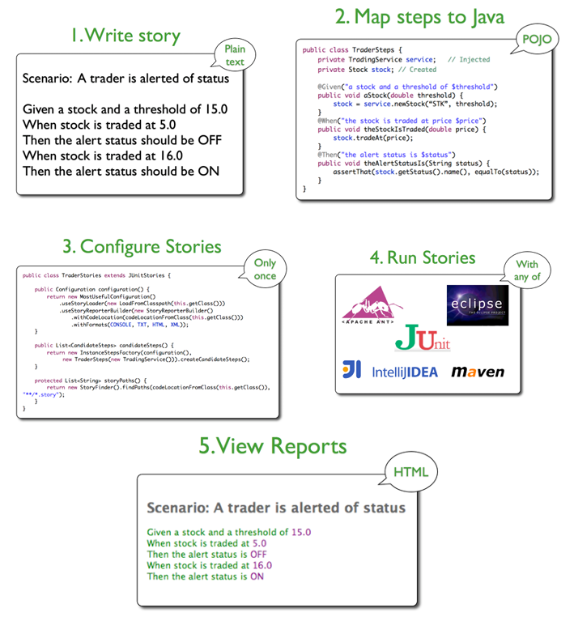
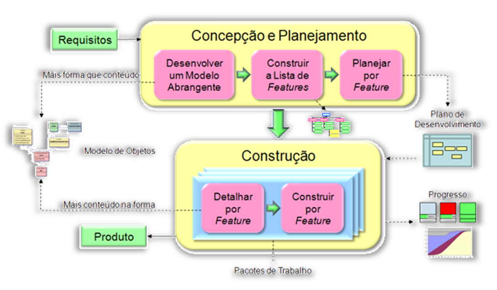

# Capítulo 18 – Outras Abordagens:  BDD, DDD, MDA, MDD, FDD e DSDM

Após a navegação por diversos modelos e metodologias, a exploração do universo da Engenharia de Software continua. Este capítulo se aprofunda em abordagens específicas que ganharam destaque por suas filosofias e práticas distintas: o **Behaviour-Driven Development (BDD)**, o **Domain-Driven Design (DDD)**, as abordagens **Model-Driven (MDA e MDD)**, o **Feature-Driven Development (FDD)** e o **Dynamic Systems Development Method (DSDM)**. Cada uma delas traz uma perspectiva única para enfrentar os desafios do desenvolvimento de software.

## Behaviour-Driven Development (BDD): Desenvolvimento Orientado por Comportamento

Em 2003, Dan North desenvolveu o **Behaviour-Driven Development (BDD)**. Muitos veem o BDD como uma resposta direta aos já conhecidos **Test-Driven Development (TDD)** e **Acceptance Test-Driven Development (ATDD)**. No entanto, o BDD pode ser entendido mais como uma **evolução natural** dessas ideias do que simplesmente como uma resposta. A proposta central do BDD é buscar tornar as práticas dessas outras metodologias mais acessíveis e intuitivas, tanto para iniciantes na área quanto para especialistas.

O BDD é uma metodologia de desenvolvimento ágil que colabora para que o desenvolvimento de software mantenha o foco na **entrega de valor real para o negócio**. Isso é alcançado principalmente através da formação de um **vocabulário comum** entre todas as partes interessadas, o que acaba reduzindo a distância entre a área de Negócios e a equipe de TI. A dinâmica proposta é a seguinte: o cliente (ou o representante do negócio) deve prover à equipe informações claras sobre o problema que deseja resolver. A partir daí, cliente e equipe definem **exemplos concretos** que irão guiar e nortear todo o processo de desenvolvimento. Se há uma palavra-chave no BDD, essa palavra é **exemplos**.

A ênfase em exemplos se justifica pela forma como os seres humanos compreendem conceitos complexos. É através deles que se torna possível tangibilizar ideias abstratas e facilitar a compreensão de um domínio de negócios que, muitas vezes, pode ser intrincado. Em situações onde é preciso modelar um sistema para um domínio desconhecido, no qual tudo parece vago e obscuro, o exemplo funciona como uma ferramenta de clarificação.

Exemplos reais são uma forma de comunicação poderosa. Ao trabalhar com exemplos concretos e relacionados à realidade do negócio, a comunicação flui muito melhor, pois as pessoas conseguem se relacionar com eles de forma mais fácil e intuitiva. Isso se torna ainda mais perceptível quando o domínio do negócio é complexo e cheio de particularidades. O BDD, portanto, busca aprimorar essa comunicação e a interação entre todos os stakeholders – sejam eles clientes, usuários finais, programadores, analistas de qualidade, etc.

Com o BDD, fica muito claro como o software deve se comportar. Isso é alcançado por meio de **cenários escritos em linguagem natural**. Não se trata de uma linguagem natural qualquer, mas de uma combinação da linguagem do dia a dia com uma **linguagem ubíqua**. A linguagem ubíqua é um vocabulário compartilhado, construído e compreendido tanto pelos programadores quanto pelos especialistas no domínio do negócio. Ela inclui jargões técnicos do negócio e terminologias específicas daquela área. Ao usar essa linguagem, minimizam-se ruídos de comunicação, previnem-se falhas de interpretação e, consequentemente, reduzem-se os riscos do projeto – este é o grande foco da metodologia.

As principais práticas que sustentam o BDD são:

| **Práticas do BDD**                                                                                                                                              |
| ---------------------------------------------------------------------------------------------------------------------------------------------------------------- |
| Envolver as partes interessadas no processo através de **Outside-in Development** (Desenvolvimento de fora para dentro).                                         |
| Usar exemplos para descrever o comportamento de uma aplicação ou unidades de código.                                                                             |
| Automatizar os exemplos para prover um feedback rápido e possivelmente testes de regressão.                                                                      |
| Usar “deve” (ou "should" em inglês) na hora de descrever o comportamento ajuda a esclarecer responsabilidades e permitir que funcionalidades sejam questionadas. |
| Usar simuladores de teste (Mocks, Stubs, Fakes, Dummies, Spies) para auxiliar na colaboração entre módulos e códigos que ainda não foram escritos.               |

A aplicação prática do BDD ocorre através da escrita de cenários, começando pela criação de uma **história de usuário**. Todas elas seguem, mais ou menos, o mesmo padrão conhecido de outras metodologias ágeis:

> **Eu, como** `<papel do usuário>`, **desejo** `<uma necessidade ou objetivo>` **para** `<um motivo ou benefício>`

Um exemplo seria:

> "Eu, como Analista de Relacionamento, desejo poder manipular todas as informações de um chamado para que eu possa resolvê-lo."

Esta é uma história de usuário que claramente possui valor para o negócio. Baseado nela, deve-se criar um ou mais **cenários**. Assim como as histórias, os cenários também seguem um padrão bem definido, frequentemente utilizando a tríade **Dado-Quando-Então (Given-When-Then)**:

> **Dado que** <um contexto inicial ou pré-condição>
> **Quando** <um evento ou ação ocorre>
> **Então** <o resultado esperado ou o comportamento observável>

Aplicando ao exemplo:

> "Dado que não existam chamados abertos para o meu setor,
> Quando um novo chamado for aberto e atribuído a mim,
> Então eu devo poder visualizar todos os detalhes do chamado e iniciar a sua manipulação para resolução."

Alguns pontos importantes a se observar:

1. A história de usuário é uma narrativa mais geral, que serve de base para a especificação de um ou mais cenários detalhados.
2. A linguagem utilizada é totalmente voltada para o domínio do negócio, sem jargões técnicos de programação ou detalhes de implementação.
3. O cenário descreve um comportamento específico do sistema sob uma condição particular.

Como mencionado, o BDD é uma evolução do TDD/ATDD, e uma de suas grandes vantagens é a possibilidade de **automatizar testes** escritos na forma desses cenários. Existem ferramentas específicas que permitem "traduzir" esses cenários em linguagem natural para código de teste executável, como SpecFlow (para .NET), JBehave (para Java) e Cucumber (multilinguagem).

O **JBehave**, por exemplo, geralmente segue um fluxo de trabalho que pode ser resumido em cinco passos principais, como ilustrado na figura abaixo:

  

Essencialmente, o BDD associa os benefícios de uma **documentação formal**, escrita e mantida com a participação ativa do pessoal de negócio, com **testes automatizados** que efetivamente "demonstram" que essa documentação (os comportamentos descritos) é válida e está sendo atendida pelo sistema. Na prática, a documentação deixa de ser um artefato estático e que rapidamente se torna obsoleto, convertendo-se em um **artefato dinâmico**, que reflete constantemente o estado atual do projeto.

Para uma revisão rápida, os fundamentos básicos do BDD podem ser resumidos nos seguintes pontos:

- O Behaviour-Driven Development (BDD) é uma técnica ágil de desenvolvimento de software focada em **atender funcionalidades ou comportamentos desejados pelos usuários**.
- Ele representa uma tentativa de **abarcar e integrar diversos conceitos importantes** da agilidade, tais como: Especificação por Exemplo (Specification by Example), Definição de “Pronto” (Definition of Done), Histórias de Usuário, Desenvolvimento Outside-In (de fora para dentro), TDD, ATDD, DDD (Domain-Driven Design) e até DSLs (Domain-Specific Languages).
- Assim como no Test-Driven Development (TDD), a técnica do BDD busca **escrever testes (na forma de cenários de comportamento) antes de codificar qualquer regra de negócio** do sistema.
- Em contraste com o TDD, onde os testes são frequentemente escritos sob o ponto de vista do desenvolvedor (focando em unidades de código), no BDD, os **testes (cenários) são escritos sob o ponto de vista do usuário ou do negócio**.
- Assim como no Acceptance Test-Driven Development (ATDD), o BDD busca **desenvolver o software baseado em critérios automáticos de aceitação**, que são derivados dos cenários de comportamento.
- De forma similar ao Domain-Driven Design (DDD), o BDD utiliza uma **linguagem ubíqua**, ou seja, um vocabulário comum entre usuários e desenvolvedores, baseado no domínio do negócio.
- Essa abordagem promove uma **melhor comunicação e colaboração entre as equipes**, facilita o compartilhamento de conhecimento, gera uma documentação dinâmica e viva, proporciona uma visão holística do sistema e mantém o foco na entrega de valor para o negócio.
- O BDD apresenta um conjunto de **cenários, protótipos (quando aplicável) e especificações orientadas a exemplos**, que servem como a principal entrada e guia para o processo de desenvolvimento.
- Para fazer uma analogia com tipos de teste: o TDD é frequentemente associado a um **Teste de Caixa Branca** (pois o desenvolvedor conhece a estrutura interna do código que está testando), enquanto o BDD é mais similar a um **Teste de Caixa Preta** (pois os cenários são especificados pelo usuário/negócio, focando no comportamento externo do sistema, sem necessariamente conhecer os detalhes da implementação).

## Domain-Driven Design (DDD): Modelando a Complexidade do Negócio

Outra abordagem poderosa para construir software de alta qualidade, especialmente ao lidar com regras de negócio complexas, é o **Domain-Driven Design (DDD)**, também conhecido por alguns como Domain-Driven Programming (DDP). O DDD é uma abordagem (alguns diriam uma filosofia) para o desenvolvimento de software que se concentra em lidar com **comportamentos e regras de negócio complexas** na construção de um sistema.

O DDD se baseia em três premissas fundamentais que guiam todo o seu processo:

1. **Focar o projeto no domínio principal (core domain) e na lógica desse domínio.** Isso significa que a parte mais importante do software, aquela que realmente resolve o problema central do cliente, deve receber a maior atenção e o maior esforço de modelagem.
2. **Basear projetos complexos em um modelo rico e expressivo do domínio.** Não se trata de qualquer modelo, mas de um modelo que capture a essência, as entidades, as regras e os processos do negócio de forma clara e profunda.
3. **Iniciar e manter uma colaboração criativa e constante entre os especialistas técnicos (desenvolvedores, arquitetos) e os especialistas do domínio (usuários chave, analistas de negócio, o próprio cliente).** Essa colaboração tem como objetivo refinar continuamente o modelo conceitual do domínio.

No desenvolvimento de software, especialmente em projetos grandes e que envolvem domínios de negócio intrincados, saber ordenar as prioridades é crucial para acelerar as entregas e garantir que o software realmente atenda às necessidades. Para isso, a equipe precisa de um conjunto robusto de práticas, técnicas e princípios, e é aí que o DDD entra.

Antes de prosseguir, é essencial esclarecer dois termos centrais do DDD: **Domínio** e **Modelo**.

- **Domínio**: No contexto do DDD, Domínio nada mais é do que uma **área de conhecimento específica**, um campo de atividade ou um assunto ao qual o software se aplica. É, essencialmente, o **universo do problema** que estamos tentando resolver com o software. Por exemplo, o domínio de uma empresa aérea inclui reservas de passagens, gerenciamento de voos, programas de milhagem, etc. O domínio de um hospital envolve pacientes, prontuários, agendamentos, etc.
- **Modelo**: Um Modelo, por sua vez, é um **sistema de abstrações que descreve aspectos selecionados de um domínio**. Ele simplifica a realidade complexa do domínio, focando nos elementos e nas regras que são relevantes para resolver problemas específicos relacionados a esse domínio. O modelo é a nossa representação organizada do conhecimento sobre o domínio.

Para que o DDD seja aplicado com sucesso, algumas condições são importantes:

- O domínio em questão **não pode ser trivial**. Se o problema é muito simples, o esforço de aplicar DDD pode não compensar.
- A equipe de desenvolvimento deve ser **experiente na utilização do paradigma orientado a objetos**, pois muitos dos padrões táticos do DDD se baseiam em conceitos de OO.
- Deve haver **contato próximo e contínuo com os especialistas do domínio**. Sem eles, é impossível construir um modelo rico e fiel à realidade do negócio.
- O DDD é, fundamentalmente, um **processo iterativo** de aprendizado e refino do modelo.

### A Linguagem Ubíqua: A Ponte Entre Negócio e Código

Para construir um software que realmente atenda e reflita um determinado domínio, é absolutamente necessário que se estabeleça, logo no início e ao longo de todo o projeto, uma **Linguagem Ubíqua (Ubiquitous Language)**. Trata-se de um vocabulário comum, compartilhado e rigorosamente utilizado tanto pelos especialistas de negócio quanto pela equipe de desenvolvimento. Essa linguagem é composta por termos que fazem parte das conversas diárias, dos documentos, dos diagramas e, crucialmente, **do próprio código-fonte do sistema**.

Todos os envolvidos no projeto devem usar os mesmos termos para se referir aos mesmos conceitos do domínio. Essa linguagem ubíqua precisa ser compreendida por todos e **não pode haver ambiguidades**. Toda vez que alguém na equipe perceber que um determinado conceito do domínio está sendo representado por várias palavras diferentes, a responsabilidade é de levantar a questão e buscar um realinhamento tanto na linguagem falada e escrita quanto no código.

Um exemplo simples: se no domínio de uma livraria, o termo "Pedido" sempre se refere a uma "Ordem de Compra de um Cliente que já foi Paga e está Pronta para Envio", então a classe no código que representa isso deve se chamar `Pedido` (ou `Order`, em inglês), e suas propriedades e métodos devem refletir essa definição. Não se deve usar sinônimos como "Solicitação" ou "Requisição" de forma intercambiável, pois isso gera confusão.

Toda vez que alguém na equipe perceber que um determinado conceito do domínio está sendo representado por várias palavras diferentes, ou que um mesmo termo tem múltiplos significados, essa pessoa tem a responsabilidade de levantar a questão e buscar um realinhamento. O objetivo é readequar tanto a linguagem falada e escrita quanto o código para que haja consistência total.

### Princípios e O Papel do Modelo

O DDD se apoia em princípios como o **alinhamento rigoroso do código ao negócio**, o favorecimento da **reutilização de código** (especialmente dos componentes do modelo de domínio), a busca pelo **mínimo acoplamento** entre as partes do sistema e uma certa **independência de tecnologia** no que tange à lógica de domínio (a lógica de negócio não deve depender de detalhes de frameworks ou bancos de dados específicos).

Para ilustrar a importância de entender o domínio, imagine a construção de um avião. As pessoas que trabalham diretamente na linha de montagem, juntando as peças, podem ter uma visão bastante limitada do que, de fato, constitui o avião como um todo. Elas podem enxergá-lo apenas como um amontoado de peças que precisam ser encaixadas em uma determinada ordem. No entanto, um avião é incomensuravelmente mais do que isso. Ele começa com um projeto, um design complexo que é formulado, testado e reformulado centenas, talvez milhares de vezes, ao longo de anos, antes que se possa sonhar em atingir algo próximo da perfeição.

Somente após a criação de modelos em escala, simulações, testes aerodinâmicos exaustivos, análises de materiais, testes de resistência em situações críticas, e uma infinidade de outros estudos, é que as peças que formam o avião começam a ser efetivamente construídas e meticulosamente postas em suas devidas posições.

É possível traçar um paralelo direto entre esse exemplo e o desenvolvimento de software de qualidade. O desenvolvedor não pode, e na verdade não consegue de forma eficaz, simplesmente sentar e começar a escrever código aleatoriamente. É imperativo, é crucial, **entender o propósito do software**, o problema que ele visa solucionar, para então criar sistemas que realmente tenham qualidade e agreguem valor.

Por exemplo, não é possível criar um sistema eficiente para uma companhia seguradora sem antes entender profundamente como funcionam seus processos de negócio, as nuances do mercado de seguros, as regulamentações, enfim, o **domínio no qual ela está inserida**. O domínio é sempre o ponto de partida, e os especialistas de negócio que trabalham diariamente na seguradora são as pessoas que mais entendem daquele universo. Eles conhecem todas as características do negócio, suas particularidades, os problemas recorrentes, os segredos e as oportunidades – eles acumularam uma vasta experiência naquilo que fazem todos os dias, há anos.

Essas pessoas sabem **o que deve ser feito**, como o software idealmente deveria se comportar para otimizar seu trabalho, mas geralmente não sabem como construir o software em si. E isso é normal, porque o negócio delas não é desenvolver software; é a oferta, análise, precificação e contratação de seguros. Por outro lado, os desenvolvedores, arquitetos e analistas de requisitos sabem como construir software, porque este é o domínio do negócio **deles**, mas geralmente não são especialistas no ramo de seguros.

Aí está a chave: o projeto de um software deve estar **profundamente fundamentado no domínio em que ele irá atuar**. O objetivo central de qualquer software de negócio é melhorar a utilização, a eficiência ou a aplicação dos processos de negócio de um domínio específico. Para que isso seja realmente possível, o software precisa estar harmoniosamente e intrinsecamente ligado com seu domínio. Essa é a grande sacada do Design Orientado a Domínio.

E qual a melhor forma de conseguir um bom relacionamento, uma simbiose, entre o software e o domínio? É **projetar o software de maneira que ele reflita o mais fielmente possível o próprio domínio**. É preciso incorporar no software os conceitos-chave, os elementos mais importantes do domínio e, fundamentalmente, o relacionamento entre eles. O software, em sua essência, precisa ser uma **representação viva do domínio**. Caso contrário, ele não reagirá bem às mudanças que, com certeza absoluta, ocorrerão no negócio ao qual ele se aplica.

Grande parte do conhecimento necessário para construir esse modelo rico e representativo é fruto de conversas, discussões, entrevistas e workshops, muitas vezes aparentemente intermináveis, com os especialistas de negócio. Todo esse conhecimento adquirido, que é vasto e detalhado, certamente não ficará armazenado apenas na cabeça dos analistas ou desenvolvedores. É preciso, então, **transformar tudo aquilo que foi conversado e aprendido em um modelo que seja passível de implementação**, um modelo que possa ser traduzido em código.

Uma das formas mais comuns de representar esse conhecimento de forma estruturada no modelo é através da identificação e formalização das **Regras de Negócio**. As Regras de Negócio são declarações que definem ou restringem algum aspecto do negócio. Elas realizam os comportamentos necessários para que os objetivos da atividade de negócio sejam atingidos. Por exemplo, "Um cliente VIP tem direito a 15% de desconto em todas as compras" é uma regra de negócio. No DDD, essa regra estaria encapsulada dentro do modelo de domínio, provavelmente associada à entidade Cliente ou Pedido.

Outra forma de colocar o modelo para funcionar e garantir seu alinhamento com a implementação é utilizando o **Model-Driven Design (MDD)**, que veremos na sequência. O DDD, ao focar no domínio, ajuda a criar um modelo robusto que pode servir de base para abordagens MDD.

## Abordagens Orientadas a Modelos: MDA e MDD

Continuando nossa exploração, vamos agora mergulhar um pouco mais fundo nas abordagens que colocam a modelagem no centro do palco: a **Arquitetura Orientada a Modelo (Model-Driven Architecture - MDA)** e o **Design Orientado a Modelo (Model-Driven Design - MDD)**. Essas abordagens buscam elevar o nível de abstração no desenvolvimento de software, permitindo que as equipes se concentrem mais no **quê** o sistema deve fazer (a lógica de negócio) e menos no **como** ele será implementado em uma tecnologia específica.

### Model-Driven Architecture (MDA): Da Abstração à Concretude

A **Model-Driven Architecture (MDA)**, ou Arquitetura Orientada a Modelo, é uma iniciativa da OMG (Object Management Group) que propõe um método de desenvolvimento de software fortemente **baseado em modelos**. Em termos simples, o MDA é um conjunto de práticas e padrões que guiam a estruturação de especificações de software, onde essas especificações são expressas primariamente como modelos formais.

No MDA, a **modelagem é o foco central de todo o processo de desenvolvimento**. A ideia principal é refinar progressivamente um modelo abstrato, que descreve o sistema de forma conceitual, até chegar a um modelo concreto, que está muito mais próximo da implementação final, culminando na geração do código-fonte da maneira mais **automatizada** possível.

O processo de modelagem no MDA geralmente é definido em três etapas principais de transformação de modelos:

1. **PIM (Platform-Independent Model – Modelo Independente de Plataforma):** Esta é a primeira etapa e consiste na construção de um modelo do sistema com um **alto nível de abstração**, que descreve a sua estrutura, comportamento e requisitos de negócio, mas **sem se preocupar com os detalhes de nenhuma tecnologia ou plataforma específica** (como Java, .NET, um banco de dados específico, etc.). O PIM foca na lógica de domínio e nos aspectos essenciais do sistema.
    - **Exemplo**: Um PIM para um sistema de e-commerce poderia definir entidades como `Cliente`, `Produto`, `Pedido`, seus atributos e relacionamentos, e os principais processos de negócio como `RealizarCompra` ou `ConsultarEstoque`, tudo isso de forma genérica.
2. **PSM (Platform-Specific Model – Modelo Específico da Plataforma):** A segunda etapa, frequentemente considerada a mais complexa, é o **refinamento do PIM em um ou mais Modelos Específicos da Plataforma (PSM)**. Um PSM traduz o modelo abstrato do PIM para os detalhes de uma tecnologia ou plataforma de implementação escolhida. Por exemplo, se a plataforma alvo for Java EE, o PSM incluirá classes Java, anotações específicas de EJB, descritores de implantação, etc. Se for .NET, incluirá classes C#, atributos específicos da plataforma, etc. Podem existir múltiplos PSMs derivados de um único PIM se o sistema precisar ser implementado em diferentes plataformas.
3. **Geração de Código:** Por fim, o PSM é utilizado como base para **transformar esse modelo específico em código-fonte executável** para a plataforma alvo. Idealmente, grande parte dessa transformação é automatizada por ferramentas CASE (Computer-Aided Software Engineering) compatíveis com MDA, que "leem" o PSM e geram o esqueleto do código, as configurações e outros artefatos necessários.

Resumidamente:

- MDA é **totalmente focado em modelos**.
- Começa-se com um modelo mais abstrato (PIM) e termina-se em um modelo mais concreto (código-fonte).
- Parte-se de um Modelo Independente de Plataforma (PIM).
- Em seguida, refina-se esse PIM para um Modelo Específico da Plataforma (PSM).
- E, finalmente, o PSM é usado para produzir o código-fonte – de preferência, de modo automático ou semi-automático.

Vale ressaltar que o **maior esforço de desenvolvimento** em um projeto MDA concentra-se, portanto, **na fase de modelagem**. Como a transformação para código tende a ser automatizada, o tempo gasto para programar manualmente é consideravelmente reduzido.

### Model-Driven Design (MDD): Elevando a Abstração na Programação

O **Model-Driven Design (MDD)** é um conceito um pouco mais amplo, mas intrinsecamente ligado ao MDA. Desde o surgimento das primeiras linguagens de programação, como o Fortran, os pesquisadores e engenheiros da computação têm trabalhado incessantemente para **aumentar o grau de abstração** em que os programas são escritos. O primeiro compilador Fortran, lá nos primórdios, já foi um marco gigantesco nesse sentido, porque, pela primeira vez na história, ele permitiu aos programadores **especificar o que a máquina deveria fazer (a lógica)**, e não apenas **como** a máquina deveria executar cada pequena instrução em baixo nível. Desde então, a engenharia de software tem sido uma busca contínua por níveis de abstração cada vez mais altos, visando simplificar o desenvolvimento e aumentar a produtividade.

O MDD é, em essência, a **continuação dessa nobre empreitada**. Em vez de forçar os desenvolvedores a especificarem todos os mínimos detalhes da implementação de um sistema, o MDD permite que eles se concentrem em **modelar a funcionalidade e a arquitetura geral** que o sistema deve possuir.

Ele é uma abordagem de engenharia de software que utiliza um **modelo como o principal artefato para criar um produto de software**. Uma das características mais marcantes do MDD é a **separação clara que ele promove entre o modelo do sistema e o código de implementação** desse sistema.

O fluxo típico no MDD é o seguinte:

1. O usuário (desenvolvedor/arquiteto) trabalha na criação de um **modelo**, geralmente utilizando uma linguagem de modelagem visual (como UML) e, idealmente, esse modelo é **independente de plataformas** específicas.
2. Em seguida, o usuário **seleciona uma plataforma específica** (ex: Java, Python, um SGBD específico) para a qual deseja gerar a implementação.
3. A **ferramenta MDD (ou um conjunto de ferramentas) então gera automaticamente o código** e outros artefatos necessários para aquela plataforma, a partir do modelo.

O impacto disso na produtividade pode ser gigantesco, visto que uma quantidade significativa de código é gerada automaticamente, reduzindo o trabalho manual e repetitivo. Ainda é necessário realizar testes, refinar o código gerado, implementar lógicas muito específicas que a ferramenta não conseguiu gerar, etc., mas já é um grande avanço em termos de eficiência.

O grande intuito por trás do MDD é permitir o desenvolvimento de sistemas de modo **bastante abstrato**, tornando o processo mais **fácil de especificar** e muito mais **rápido de produzir**, sem que o desenvolvedor precise se afogar em detalhes de baixo nível sobre persistência de dados, interoperabilidade entre diferentes tecnologias ou distribuição de componentes em uma rede.

**MDD vs. MDA:** Embora os termos sejam frequentemente usados de forma intercambiável, é útil pensar no MDA como **uma implementação específica e padronizada pela OMG** dos princípios do MDD. O MDD é o conceito mais genérico de usar modelos para guiar o desenvolvimento, enquanto o MDA define uma arquitetura específica (PIM, PSM, transformações) para realizar isso.

## Feature-Driven Development (FDD): Orientado a Funcionalidades de Valor

O **Feature-Driven Development (FDD)** é uma metodologia que, como o próprio nome sugere, é fortemente orientada ao desenvolvimento incremental de funcionalidades ou características que agregam valor direto ao cliente. O FDD é uma das seis implementações de metodologias ágeis originais que foram contemporâneas à criação do Manifesto Ágil. Sua origem remonta a um projeto de grande porte para um banco em Singapura no final dos anos 90, e desde então tem se mostrado uma abordagem robusta, oferecendo um conjunto coeso de princípios e práticas que abrangem tanto a gestão de projetos quanto a engenharia de software. Um ponto interessante é que o FDD harmoniza bem com outras abordagens ágeis e pode ser adaptado a diferentes contextos.

Essa metodologia se fundamenta em uma combinação de **técnicas de gerenciamento de projetos** bem estabelecidas e na **modelagem orientada a objetos**, buscando um equilíbrio entre as vantagens das metodologias tradicionais (como um planejamento mais estruturado e a ênfase na modelagem) e os benefícios das metodologias ágeis (como ciclos curtos de desenvolvimento, orientação constante ao cliente e uma forte ênfase na programação e entrega de software funcional). Pode-se dizer que o FDD se posiciona como um interessante **meio-termo entre a flexibilidade do XP e a estrutura mais formal do RUP**.

Uma **feature** (funcionalidade ou característica) é basicamente uma pequena porção de funcionalidade, valorizada pelo cliente, que pode ser projetada, desenvolvida e testada em um período curto, geralmente duas semanas ou menos. Alguns autores a descrevem como algo muito similar a um requisito funcional que, quando implementado, gera um valor tangível e reconhecível para o cliente ou usuário do sistema.

Uma das grandes vantagens do FDD é que, devido à participação ativa e constante do cliente no projeto, os resultados do desenvolvimento têm **bastante visibilidade** e são percebidos de forma muito rápida, o que aumenta a satisfação e o alinhamento. O método oferece algumas características importantes que contribuem para seu sucesso:

|**CARACTERÍSTICAS DO FDD**|
|---|
|Fornecimento de uma estrutura adequada para equipes maiores.|
|Ênfase na produção de software de alta qualidade.|
|Disponibilização de informação de estado e progresso de forma simples e clara.|
|Capacidade de agradar diferentes stakeholders: clientes, gerentes e desenvolvedores.|
|Entrega de resultados frequentes, tangíveis e funcionais.|
|Planejamento detalhado e guiado para permitir uma medição eficaz do progresso.|
|Alta rastreabilidade e geração de relatórios com precisão.|

O FDD também recomenda fortemente a adoção de um conjunto de **melhores práticas** para que o método atinja seus objetivos principais. São elas: modelagem de objetos de domínio, desenvolvimento por feature, posse individual do código (cada classe tem um "dono"), equipes de features (times pequenos e focados em um conjunto de features), inspeções de código e de design, builds regulares (integração frequente), gerenciamento de configuração rigoroso, e relatórios e visibilidade constante dos resultados.

O processo FDD é estruturado em **duas grandes fases** que englobam **cinco processos principais**.

### Fase 1 – Concepção & Planejamento

Esta é uma parte absolutamente crítica do processo FDD. É nesta fase inicial que são listadas as características (Features) que serão desenvolvidas ao longo do projeto. Em um primeiro momento, é aqui que são definidas todas as características do sistema e, de forma mais ampla, as fases do projeto em si. Esta fase compreende três processos:

|**Processo**|**Descrição**|
|---|---|
|1. Desenvolver um Modelo Abrangente|Este processo abrange todo o projeto. Inicia-se com um estudo dirigido sobre o escopo geral do sistema e o contexto em que ele se insere. Em seguida, são realizados estudos mais detalhados para cada área específica do domínio que precisa ser modelada. Para isso, pequenos grupos são formados, compostos por membros especialistas do domínio do negócio e por desenvolvedores, e cada grupo fica responsável por compor seus próprios modelos para uma determinada área. Posteriormente, esses pequenos grupos apresentam seus modelos para serem revisados por parceiros e para discussão mútua. Um dos modelos propostos para cada área é então selecionado por consenso, tornando-se o modelo oficial para aquela área do domínio. Finalmente, realiza-se uma combinação e integração dos modelos de cada área dentro de um modelo abrangente e unificado para todo o sistema.|
|2. Construir uma Lista de Funcionalidades|Também abrangendo todo o projeto, o objetivo aqui é identificar todas as funcionalidades (features) que, em conjunto, satisfaçam os requisitos do sistema. Uma equipe é formada especificamente para decompor funcionalmente o domínio em áreas de negócio principais. Dentro de cada área, identificam-se as atividades de negócio e, para cada atividade, os passos necessários. Essa decomposição resulta em uma lista categorizada e hierárquica de funcionalidades.|
|3. Planejar por Funcionalidade|Este processo, ainda dentro da fase de concepção e planejamento e abrangendo todo o projeto, busca produzir o plano de desenvolvimento. O gerente de projeto, o gerente de desenvolvimento e os programadores-líderes (Chief Programmers) trabalham juntos para planejar a ordem em que as funcionalidades serão implementadas. Essa ordem é baseada em diversos fatores, como as dependências entre as funcionalidades, a carga de trabalho estimada para a equipe e a complexidade de cada funcionalidade. As principais atividades neste processo não seguem uma sequência estritamente linear; como é comum em muitas atividades de planejamento, elas são consideradas em conjunto, com refinamentos sendo feitos a partir de uma ou mais atividades e, em seguida, considerando as outras novamente em um ciclo de ajuste. Após esse planejamento, a "posse" das classes (quem será o desenvolvedor responsável principal por cada classe do modelo de objetos) estará completada, além das classes principais que já foram consideradas para posse durante a modelagem.|

### Fase 2 – Construção

Com o planejamento inicial concluído, a implementação das features começa. O trabalho é organizado agrupando features que são relacionadas entre si. Esse agrupamento forma um **pacote de trabalho**, que deve ser completado dentro de uma iteração de desenvolvimento. Um pacote de trabalho completo e entregue representa uma parte do sistema que já pode ser utilizada pelo cliente, agregando valor de forma incremental. Esta fase compreende dois processos:

|**Processo**|**Descrição**|
|---|---|
|4. Detalhar por Funcionalidade|Este processo ocorre para cada funcionalidade (ou conjunto de funcionalidades) e busca produzir o **pacote de projeto** detalhado para ela. Um certo número de funcionalidades é agendado para desenvolvimento ao serem atribuídas a um **programador-líder** (Chief Programmer). Este programador-líder seleciona as funcionalidades que irá desenvolver a partir de sua "caixa de entrada" de funcionalidades atribuídas. Ele pode, estrategicamente, escolher diversas funcionalidades que utilizem as mesmas classes do modelo de objetos (e, portanto, os mesmos desenvolvedores "donos" dessas classes). Operacionalmente, é frequente o caso de conjuntos de funcionalidades serem agendados para desenvolvimento de uma só vez pelo programador-líder; tal conjunto é chamado de **Pacote de Trabalho do Programador-Líder (PTPL)**. O programador-líder então forma uma **equipe de funcionalidades** (_feature team_), identificando os proprietários das classes que provavelmente estarão envolvidos no desenvolvimento das funcionalidades que ele selecionou. Esta equipe produz os artefatos de design necessários, como diagramas de sequência, para as funcionalidades atribuídas. O programador-líder, então, refina o modelo de objetos conforme necessário, e realiza-se uma inspeção formal no projeto antes de prosseguir.|
|5. Construir Funcionalidade|Abrangendo cada funcionalidade individualmente, o objetivo deste processo é produzir uma **função com valor real para o cliente**. Começando com o pacote de projeto que foi detalhado no processo anterior, os proprietários das classes envolvidas implementam os itens necessários para que suas classes suportem o projeto para esta funcionalidade específica. O código produzido passa por testes unitários e por inspeções de código. Após ser aprovado, o código é promovido à versão atual do sistema (o _build_ principal).|

A figura a seguir tenta ilustrar essa dinâmica de fases e processos:

  

Uma das grandes vantagens do Feature-Driven Development é que ele pode facilitar imensuravelmente o fardo de reportar o status do projeto para os gerentes e stakeholders. Ele permite que o rastreio do progresso do desenvolvimento seja feito através de **marcos bem definidos por funcionalidade**, o que, por sua vez, facilita a visualização do andamento do projeto como um todo. Esses marcos começam a ser monitorados de perto pelo gerente do projeto a partir do momento em que a fase de construção se inicia.

Os marcos típicos para cada feature incluem:

|**Marcos para cada Feature (FDD)**|
|---|
|Walkthroughs do projeto (revisão inicial do design da feature)|
|Projeto (design detalhado da feature concluído)|
|Inspeção do projeto (revisão formal do design detalhado)|
|Código (codificação da feature concluída)|
|Inspeção de código (revisão formal do código)|
|Progressão para construção (feature integrada ao build principal)|

Essa granularidade no acompanhamento oferece um controle bastante preciso sobre o desenvolvimento.

## Dynamic Systems Development Method (DSDM): Agilidade com Foco no Prazo

O **Método de Desenvolvimento de Sistemas Dinâmicos (Dynamic Systems Development Method - DSDM)** é uma abordagem de desenvolvimento de software ágil que se destaca por oferecer uma metodologia estruturada para **construir e manter sistemas que precisam atender a restrições de prazo muito apertadas**. A chave para isso é o uso intensivo da **prototipagem incremental** dentro de um ambiente que, apesar de ágil, é bastante controlado.

A filosofia por trás do DSDM baseia-se em uma versão modificada do famoso **Princípio de Pareto** (também conhecido como a regra 80/20). A ideia é que, em muitos projetos de software, **80% do valor ou da funcionalidade essencial de uma aplicação pode ser entregue em apenas 20% do tempo** que seria necessário para entregar a aplicação completa (100% de todas as funcionalidades, incluindo aquelas menos críticas ou "nice-to-have").

O DSDM é um processo de software **iterativo**, e cada uma de suas iterações segue essa regra dos 80%. Isso significa que, para cada incremento do software, somente o trabalho essencial e suficiente é requisitado para facilitar o movimento rápido para o próximo incremento. Uma das máximas do DSDM é: **as funcionalidades devem se adequar aos prazos fixos, e não o contrário**. Isso é uma inversão da lógica tradicional, onde muitas vezes o escopo é fixo e o prazo acaba estourando. No DSDM, o prazo é o rei, e o escopo é flexível para caber nele.

Os detalhes remanescentes, aquelas funcionalidades que compõem os 20% de valor adicional mas que consumiriam 80% do tempo, podem ser completados depois, em iterações futuras, ou quando outros requisitos de negócio mais prementes forem conhecidos, ou ainda quando alterações tiverem sido solicitadas e acomodadas no planejamento.

O **Consórcio DSDM** é um grupo mundial de empresas e especialistas que, coletivamente, assume o papel de guardião e mantenedor do método. Esse consórcio definiu um modelo de processos ágeis, conhecido como o **ciclo de vida DSDM**. Esse ciclo de vida é bem característico e define **três ciclos iterativos diferentes**, que são precedidos por **duas atividades de ciclo de vida adicionais**, mais preparatórias. Vamos detalhar cada uma delas:

|**Atividade/Ciclo do DSDM**|**Descrição**|
|---|---|
|1. Estudo de Viabilidade|Esta atividade inicial estabelece os **requisitos básicos de negócio e as principais restrições** associados à aplicação que se pretende construir. Em seguida, e de forma crucial, avalia-se se a aplicação é ou não um **candidato viável** para ser desenvolvida utilizando o processo DSDM. Nem todo projeto se beneficia igualmente do DSDM; projetos com prazos flexíveis ou escopo totalmente rígido podem não ser os ideais.|
|2. Estudo de Negócio|Uma vez confirmada a viabilidade, esta atividade foca em estabelecer os **requisitos funcionais e de informação** que permitirão à aplicação agregar valor real de negócio. Além disso, define-se também a **arquitetura básica da aplicação** e identificam-se os **requisitos de facilidade de manutenção** para a aplicação. É um mergulho mais profundo no "o quê" e no "porquê" do sistema.|
|3. Iteração de Modelos Funcionais|Aqui começam os ciclos iterativos propriamente ditos. Este ciclo produz um conjunto de **protótipos incrementais que demonstram funcionalidade diretamente para o cliente**. Um ponto muito importante: todos os protótipos no DSDM são feitos com a intenção de que eles **evoluam para a aplicação final** que será entregue ao cliente, não são protótipos descartáveis. Durante este ciclo iterativo, o objetivo principal é juntar requisitos adicionais e refinar os existentes ao se obter _feedback_ constante dos usuários, conforme eles testam e interagem com o protótipo.|
|4. Iteração de Projeto e Desenvolvimento|Este ciclo iterativo **revisita os protótipos que foram desenvolvidos durante a Iteração de Modelos Funcionais**. O objetivo aqui é assegurar-se de que cada um desses protótipos tenha passado por um processo de engenharia de software robusto, para capacitá-los a oferecer, aos usuários finais, valor de negócio em termos operacionais e com a qualidade esperada. Em alguns casos, especialmente em projetos menores ou mais ágeis, a Iteração de Modelos Funcionais e a Iteração de Projeto e Desenvolvimento podem ocorrer de forma concomitante ou muito entrelaçada.|
|5. Implementação|Esta é a fase que aloca a **última versão do incremento de software** (que é, essencialmente, um protótipo que foi "operacionalizado" e robustecido) no ambiente operacional do cliente. Aqui, é importante notar dois pontos: (1) o incremento entregue pode não estar 100% completo em termos de todas as funcionalidades sonhadas inicialmente, mas sim conter os 80% de maior valor que cabiam no prazo; ou (2) alterações e novos requisitos podem surgir conforme o incremento é alocado e utilizado em produção. Em qualquer um desses casos, o trabalho de desenvolvimento do DSDM continua, geralmente retornando-se à atividade de Iteração de Modelos Funcionais para o próximo ciclo de incremento.|

Uma característica interessante do DSDM é sua capacidade de **combinação com outras abordagens ágeis**. Por exemplo, o DSDM pode ser combinado com o **Extreme Programming (XP)** para fornecer uma abordagem que une um modelo de processos consistente e bem definido (o ciclo de vida do DSDM) com as práticas de engenharia de software e desenvolvimento ágil do XP (como Test-First, Pair Programming, Integração Contínua, etc.), necessárias para construir os incrementos de software de forma eficaz. Além disso, os conceitos de **colaboração intensiva e de equipes auto-organizáveis**, que são muito fortes no **Adaptive Software Development (ASD)**, também podem ser adaptados e incorporados a um modelo de processos DSDM combinado com outras práticas.

Para que o DSDM funcione efetivamente, ele se baseia em um conjunto de **princípios fundamentais** que devem guiar todas as ações e decisões do projeto. Originalmente eram 9, e foram revisados para 8 princípios na versão mais recente do DSDM Agile Project Framework:

1. **Foco no Negócio:** Todas as decisões técnicas devem ser tomadas com o objetivo de entregar o que o negócio precisa para ter sucesso, quando precisa.
2. **Entregar no Prazo:** Entregar uma solução de software no tempo acordado é um objetivo primário. Atrasos minam a credibilidade e o valor.
3. **Colaborar:** As equipes DSDM devem promover a colaboração e o comprometimento de todos os stakeholders, incluindo usuários de negócio, desenvolvedores e gestão.
4. **Nunca Comprometer a Qualidade:** O nível de qualidade a ser entregue deve ser acordado no início. Embora o escopo possa ser variável, a qualidade não deve ser sacrificada para cumprir prazos.
5. **Construir Incrementalmente a Partir de Fundações Firmes:** O DSDM enfatiza a necessidade de fazer um design inicial suficiente (arquitetura e planejamento) para garantir que o desenvolvimento incremental subsequente seja coerente e sustentável.
6. **Desenvolver Iterativamente:** O DSDM usa iterações para investigar, refinar e entregar. O feedback é usado para convergir para uma solução de negócio precisa.
7. **Comunicar Continuamente e Claramente:** A má comunicação é uma grande causa de falha em projetos. O DSDM promove canais de comunicação eficientes e documentação enxuta.
8. **Demonstrar Controle:** É essencial ter visibilidade e controle sobre o progresso do projeto, tanto do ponto de vista técnico quanto gerencial, especialmente em relação aos prazos.

Esses princípios, combinados com o ciclo de vida iterativo e a filosofia do 80/20, fazem do DSDM uma opção robusta para projetos que exigem entregas rápidas e valor de negócio tangível dentro de cronogramas desafiadores.

## Considerações Finais

Ao final deste capítulo, percorremos um conjunto diversificado de abordagens e metodologias, cada uma com sua filosofia e seus pontos fortes.

Vimos o **Behaviour-Driven Development (BDD)**, que ensina a importância dos exemplos e da linguagem ubíqua para alinhar o desenvolvimento aos comportamentos esperados pelo negócio, transformando a especificação em uma documentação viva e testável.

Exploramos o **Domain-Driven Design (DDD)**, uma abordagem profunda para dominar a complexidade de negócios intrincados, focando na criação de um modelo de domínio rico e na colaboração intensa com os especialistas.

Aprofundamos nas **Abordagens Orientadas a Modelos**, com a **Model-Driven Architecture (MDA)** e o **Model-Driven Design (MDD)**, que buscam elevar o nível de abstração, permitindo que os desenvolvedores se concentrem na lógica de negócio e automatizem parte da geração de código.

Conhecemos o **Feature-Driven Development (FDD)**, uma metodologia ágil que equilibra planejamento e modelagem com entregas incrementais focadas em funcionalidades de valor para o cliente.

E, por fim, desvendamos o **Dynamic Systems Development Method (DSDM)**, com sua ênfase em cumprir prazos apertados através da prototipagem incremental e da regra 80/20.

Fica claro que não existe uma "bala de prata" no mundo da Engenharia de Software. Cada uma dessas metodologias oferece ferramentas e perspectivas valiosas que podem ser mais ou menos adequadas dependendo do contexto do projeto, da cultura da organização e da complexidade do domínio. Muitas vezes, a solução mais eficaz pode ser uma combinação inteligente de práticas de diferentes abordagens.

O importante é conhecer esse leque de opções, entender seus fundamentos e saber quando e como aplicá-los para construir software de alta qualidade, que realmente atenda às necessidades dos usuários e agregue valor ao negócio.