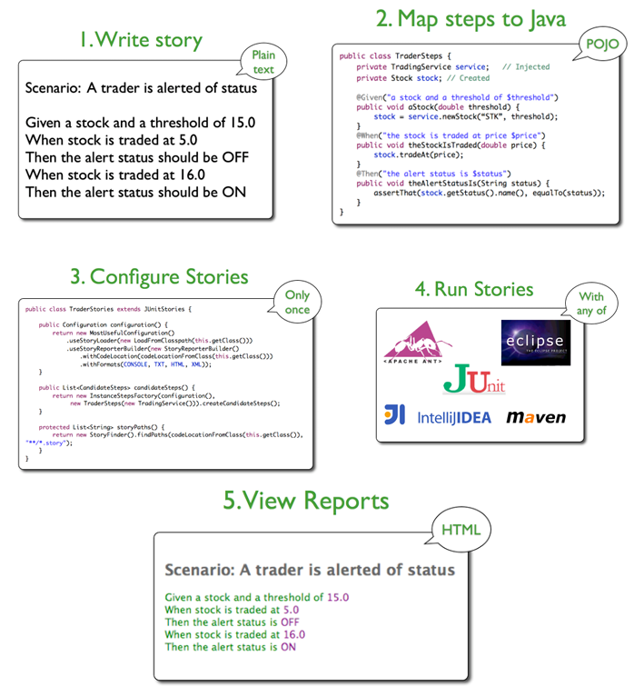

# Capítulo 18 – Desenvolvimento Guiado pelo Comportamento (Behaviour-Driven Development - BDD)

No contínuo aprimoramento das práticas de desenvolvimento de software, surgem abordagens que não apenas refinam técnicas existentes, mas que propõem uma mudança fundamental na maneira como concebemos, comunicamos e construímos soluções. O **Desenvolvimento Guiado pelo Comportamento (Behaviour-Driven Development - BDD)** é um exemplo emblemático dessa evolução, posicionando-se como uma metodologia ágil que transcende o código para focar no valor entregue ao negócio e na colaboração efetiva entre todas as partes interessadas.

Este capítulo mergulhará nos fundamentos do BDD, explorando suas origens, seus princípios, suas práticas e como ele se diferencia e complementa outras abordagens ágeis, como o TDD e o ATDD, com o objetivo de construir software que verdadeiramente atenda às expectativas e comportamentos desejados pelos usuários.

## As Origens e a Filosofia do BDD: Uma Evolução Natural

O Behaviour-Driven Development (BDD) foi concebido por **Dan North em 2003**, não como uma ruptura radical com as práticas existentes, mas como uma resposta ponderada e uma evolução natural aos desafios e aprendizados observados com metodologias como o **Test-Driven Development (TDD)** e o **Acceptance Test-Driven Development (ATDD)**. Poderíamos, de fato, caracterizar o BDD mais como um refinamento e uma extensão dessas ideias do que como uma simples alternativa. A principal motivação de Dan North era tornar as poderosas práticas de desenvolvimento orientado a testes mais **acessíveis, intuitivas e eficazes**, tanto para equipes iniciantes quanto para especialistas experientes.

### O Contexto do Surgimento: Dan North e a Busca por Clareza

Dan North, ao trabalhar com TDD, percebeu que, embora a técnica fosse extremamente valiosa, muitos desenvolvedores enfrentavam dificuldades em entender **o que** testar e **como** nomear seus testes de forma significativa. A linguagem dos testes unitários, muitas vezes focada em nomes de classes e métodos, nem sempre comunicava claramente o **propósito de negócio** da funcionalidade sendo testada. Havia uma lacuna na comunicação, especialmente ao tentar explicar o valor e a cobertura dos testes para stakeholders não técnicos.

O BDD surge, então, como uma tentativa de preencher essa lacuna, propondo uma linguagem e um processo que colocam o **comportamento esperado do software** no centro das discussões. A ideia é que, ao focar no comportamento, a equipe consegue criar uma ponte mais sólida entre a visão de negócio e a implementação técnica.

### BDD como Ponte entre Negócio e TI

Uma das grandes contribuições do BDD é sua capacidade de colaborar para que o desenvolvimento de software foque genuinamente na **entrega de valor para o negócio**. Isso é alcançado, em grande parte, através da formação de um **vocabulário comum** e compartilhado entre todas as partes envolvidas, desde os representantes do negócio e clientes até os desenvolvedores e analistas de qualidade. Essa linguagem compartilhada, muitas vezes referida como **linguagem ubíqua** (um conceito emprestado do Domain-Driven Design - DDD), ajuda a reduzir significativamente a distância e os ruídos de comunicação que frequentemente existem entre as áreas de Negócio e a Tecnologia da Informação (TI).

No BDD, o processo colaborativo é fundamental. Em geral, espera-se que o cliente (ou seu representante, como um Product Owner) forneça à equipe informações claras sobre o problema de negócio que ele deseja resolver. A partir daí, **juntos**, cliente e equipe técnica, podem pensar e definir **exemplos concretos** que irão nortear e guiar todo o processo de desenvolvimento. E por que essa ênfase em exemplos?

## O Poder dos Exemplos: A Pedra Angular do BDD

Qual é a maneira mais eficaz e intuitiva de entender algo novo ou complexo? Indiscutivelmente, é por meio de **exemplos**. O ser humano tem uma capacidade inata de aprender e internalizar conceitos quando eles são ilustrados com situações práticas e palpáveis. Diante de um domínio de negócios intrincado, vago ou obscuro, onde a terminologia é desconhecida e as regras são nebulosas, os exemplos funcionam como uma verdadeira "luz no fim do túnel". Eles transformam o abstrato em concreto.

### Compreendendo Domínios Complexos Através de Exemplos Concretos

Exemplos reais são uma forma extraordinariamente poderosa de comunicação, e nós os utilizamos em nosso dia a dia de maneira quase inconsciente para explicar ideias, ensinar conceitos e alinhar entendimentos. Ao trazer essa prática para o desenvolvimento de software, especialmente ao trabalhar com exemplos que refletem situações reais do negócio, a comunicação entre os envolvidos melhora drasticamente. As pessoas conseguem se relacionar com esses exemplos de forma muito mais fácil e direta do que com especificações puramente abstratas ou diagramas técnicos complexos.

Essa capacidade de facilitar o entendimento é ainda mais perceptível e valiosa quando o domínio do negócio em questão é, por natureza, complexo, cheio de regras específicas, exceções e interdependências. O BDD, ao colocar os exemplos no centro do processo de descoberta e especificação de requisitos, busca ativamente **melhorar a comunicação e a interação entre todos os stakeholders** – sejam eles clientes, usuários finais, analistas de negócio, desenvolvedores, testadores ou gerentes de projeto.

### Exemplos como Ferramenta de Comunicação Universal

Os exemplos, no contexto do BDD, não são meras ilustrações; eles se tornam a principal forma de especificar o comportamento esperado do software. Ao discutir e documentar o comportamento através de exemplos concretos, a equipe cria um artefato que é compreensível tanto por pessoas de negócio quanto por pessoas técnicas. Isso estabelece uma base comum para o diálogo, reduzindo ambiguidades e garantindo que todos tenham a mesma visão sobre o que o software deve fazer.

## A Linguagem do BDD: Cenários e a Linguagem Ubíqua

A clareza sobre como o software deve se comportar é alcançada no BDD através da escrita de **cenários**. Esses cenários são descrições narrativas, formuladas em **linguagem natural**, que ilustram uma interação específica com o sistema e o resultado esperado dessa interação. Mas não se trata de qualquer linguagem natural; o BDD propõe a utilização de uma combinação da linguagem natural com uma **linguagem ubíqua**.

A linguagem ubíqua, um termo popularizado pelo Domain-Driven Design (DDD), refere-se a um vocabulário comum, construído e compartilhado por todos os membros da equipe – programadores, especialistas no domínio do negócio, analistas, etc.. Ela incorpora os jargões técnicos relevantes, as terminologias do dia a dia da área de negócio e quaisquer outros termos que sejam essenciais para descrever o domínio de forma precisa e sem ambiguidades.

A utilização dessa linguagem híbrida nos cenários do BDD é fundamental para **minimizar ruídos de comunicação, prevenir falhas de interpretação e, consequentemente, reduzir riscos** no projeto – este, aliás, é um dos grandes focos da metodologia BDD.

### Escrevendo o Comportamento: Histórias de Usuário e Cenários

Então, professor, como eu posso escrever um cenário de forma prática? Cara, o processo é muito fácil e intuitivo, começando pela definição de uma história de usuário.

#### A Estrutura da História de Usuário

Primeiro, a equipe, em colaboração com o cliente, cria uma **história de usuário**. Todas as histórias de usuário seguem, mais ou menos, o mesmo padrão consagrado no mundo ágil:

**Eu, como `<papel do usuário>`, desejo `<uma necessidade ou objetivo>` para que `<o motivo ou benefício esperado>`**.

Por exemplo, uma história de usuário poderia ser:

> "Eu, como **Analista de Relacionamento**, desejo **poder manipular todas as informações de um chamado** para que eu **possa resolvê-lo de forma eficiente**".

Pronto! Esta é uma história concisa que descreve uma funcionalidade e, crucialmente, explicita o **valor que ela agrega para o negócio** (resolver o chamado de forma eficiente).

#### A Estrutura do Cenário

No entanto, nosso papo sobre especificação não acabou com a história. Baseado nessa história de usuário, a equipe deve criar um ou mais **cenários** que detalham o comportamento esperado em situações específicas. Todos os cenários no BDD também seguem um padrão bem definido, frequentemente utilizando as palavras-chave Gherkin (Dado, Quando, Então):

**Dado que `<um contexto inicial ou pré-condição>`** **Quando `<ocorre um evento ou uma ação>`** **Então `<o resultado esperado ou a consequência observável>`**

Utilizando a história de usuário anterior como base, um cenário poderia ser:

> "**Dado que** não existam chamados abertos no sistema, **Quando** um novo chamado for aberto pelo cliente, **Então** eu, como Analista de Relacionamento, devo poder visualizar e manipular todas as informações deste chamado."

Percebam alguns pontos importantes aqui:

- A **história de usuário** serve como uma narrativa de base, um requisito de alto nível, para a especificação de um ou mais cenários detalhados. Uma única história pode gerar diversos cenários, cobrindo diferentes condições, caminhos felizes e exceções.
- A linguagem utilizada nos cenários é fortemente **voltada para o domínio do negócio**, evitando jargões técnicos excessivos ou detalhes de implementação. O foco é no **o quê** e no **porquê**, não no **como**.
- A estrutura "Dado-Quando-Então" (Given-When-Then) não é apenas uma convenção; ela ajuda a pensar de forma clara sobre as pré-condições, as ações e as pós-condições de um comportamento, tornando a especificação mais precisa e testável.

Entendido? Essa estrutura padronizada facilita a leitura, a compreensão e, como veremos adiante, a automação dos cenários.

## As Práticas Essenciais do Behaviour-Driven Development

O BDD não é apenas uma forma de escrever especificações; ele se manifesta através de um conjunto de práticas que, juntas, promovem a colaboração, o foco no comportamento e a entrega de valor. Vamos explorar as principais práticas que sustentam essa metodologia:

|PRÁTICAS DO BDD|DESCRIÇÃO|
|---|---|
|**Envolver as partes interessadas no processo através de Outside-in Development (Desenvolvimento de fora para dentro)**|O BDD preconiza uma abordagem de desenvolvimento "de fora para dentro". Isso significa que o processo começa pela perspectiva do usuário e do negócio, definindo os comportamentos externos e o valor que o sistema deve entregar. A partir dessa visão externa, o desenvolvimento avança para as camadas internas e detalhes técnicos. Envolver ativamente todas as partes interessadas (clientes, usuários, analistas, desenvolvedores, testadores) desde o início é crucial para garantir que o software construído realmente atenda às necessidades e expectativas corretas.|
|**Usar exemplos para descrever o comportamento de uma aplicação ou unidades de código**|Como já enfatizado, os exemplos são a espinha dorsal do BDD. Eles são usados para ilustrar e especificar o comportamento esperado tanto da aplicação como um todo (em nível de funcionalidade) quanto de unidades menores de código (em nível de componente ou módulo). Esses exemplos concretos tornam os requisitos mais tangíveis e menos ambíguos.|
|**Automatizar os exemplos para prover um feedback rápido e possivelmente testes de regressão**|Os cenários e exemplos definidos no BDD não são apenas documentação estática; eles são projetados para serem automatizáveis. Ao transformar esses exemplos em testes automatizados, a equipe obtém um feedback rápido sobre a corretude da implementação. Além disso, essa suíte de testes automatizados baseados em comportamento serve como uma poderosa ferramenta para testes de regressão, garantindo que novas alterações não quebrem funcionalidades existentes.|
|**Usar “deve” na hora de descrever o comportamento ajuda a esclarecer responsabilidades e permitir que funcionalidades sejam questionadas**|A forma como o comportamento é descrito importa. O uso de uma linguagem imperativa e clara, como utilizar o verbo "deve" (por exemplo, "O sistema _deve_ calcular o imposto corretamente"), ajuda a estabelecer responsabilidades inequívocas para o software. Também abre espaço para questionamentos e discussões sobre a real necessidade ou a forma correta de uma funcionalidade, promovendo um refinamento colaborativo dos requisitos.|
|**Usar simuladores de teste (Mocks, Stubs, Fakes, Dummies, Spies) para auxiliar na colaboração entre módulos e códigos que ainda não foram escritos**|Para testar comportamentos de forma isolada e permitir o desenvolvimento paralelo de diferentes partes do sistema, o BDD frequentemente se beneficia do uso de **simuladores de teste** (test doubles). Esses objetos "falsos" simulam o comportamento de dependências reais (como bancos de dados, serviços externos ou outros módulos que ainda não foram implementados), permitindo que um componente seja testado sem depender da disponibilidade ou do estado desses colaboradores reais. Isso facilita a colaboração e o desenvolvimento incremental, mesmo quando algumas partes do sistema ainda não estão prontas.|

A aplicação conjunta dessas práticas cria um ciclo de desenvolvimento onde a compreensão do negócio guia a especificação do comportamento, que por sua vez guia a implementação e a validação através de testes automatizados, resultando em software mais alinhado com as necessidades do usuário e com maior qualidade.

## BDD em Ação: Da Especificação à Automação

Sendo uma evolução do TDD/ATDD, uma das grandes forças do BDD é justamente a capacidade de **automatizar os testes escritos na linguagem de negócio** (os cenários "Dado-Quando-Então") e usá-los para validar o software de forma contínua. Essa automação é viabilizada por ferramentas específicas que fazem a ponte entre as especificações em linguagem natural e o código de teste executável.

O BDD não veio para substituir o TDD ou o ATDD, mas sim para construir sobre seus alicerces, oferecendo uma camada de comunicação e colaboração ainda mais focada no negócio.

- Com o **TDD**, o BDD compartilha o princípio de "testes primeiro", mas eleva o nível de abstração desses testes para o comportamento observável pelo usuário, em vez de focar apenas em unidades de código.
- Com o **ATDD**, o BDD compartilha o foco nos critérios de aceitação definidos pelo cliente, mas formaliza a linguagem e a estrutura dos cenários para facilitar a automação e o entendimento comum.

Pode-se dizer que o BDD fornece o "porquê" e o "o quê" de uma forma que o negócio entende, enquanto o TDD pode ser usado para focar no "como" da implementação técnica, garantindo que os componentes individuais funcionem corretamente para suportar o comportamento esperado.

### Automatizando Cenários: Ferramentas e Processos

Existem diversas ferramentas no mercado que suportam a automação de cenários BDD, tais como:

- **Cucumber:** Uma das ferramentas mais populares, suporta diversas linguagens (Ruby, Java, .NET, etc.) e utiliza a linguagem Gherkin para escrever os cenários.
- **SpecFlow:** Específico para a plataforma .NET, também utiliza Gherkin.
- **JBehave:** Uma opção para Java, foi uma das pioneiras no BDD.
- **RSpec:** Focado na linguagem Ruby, mais orientado ao desenvolvedor, mas com forte influência do BDD.
- **JSpec:** Para JavaScript.

O processo de automação com uma ferramenta como o **JBehave**, por exemplo, geralmente segue alguns passos bem definidos, como ilustrado na figura a seguir:

  

Vamos detalhar esses passos:

1. **Write Story (Escrever a História/Cenário):** A equipe, em colaboração com o cliente, escreve as histórias de usuário e os cenários utilizando a sintaxe "Dado-Quando-Então" em arquivos de texto simples.
2. **Map Steps to Java (Mapear os Passos para Java ou outra linguagem):** Cada passo do cenário (ex: "Dado que não existam chamados abertos") precisa ser mapeado para um trecho de código (um "step definition" ou definição de passo) na linguagem de programação escolhida. Esse código será responsável por interagir com o sistema sob teste para simular a condição, executar a ação ou verificar o resultado.
3. **Configure Stories (Configurar as Histórias):** É necessário configurar a ferramenta para que ela saiba onde encontrar os arquivos de cenário e as definições de passos correspondentes.
4. **Run Stories (Executar as Histórias):** A ferramenta de BDD executa os cenários, um por um. Para cada passo, ela invoca o código de definição de passo correspondente. Se o código interagir com o sistema e o resultado for o esperado no cenário, o passo é marcado como "passou". Se algo der errado, o passo (e o cenário) é marcado como "falhou".
5. **View Reports (Visualizar os Relatórios):** Após a execução, a ferramenta gera relatórios que mostram quais cenários passaram e quais falharam, fornecendo um feedback claro sobre o estado do sistema em relação aos comportamentos esperados.

### Documentação Viva: O BDD Transformando Especificações

Um dos benefícios mais poderosos da automação de cenários BDD é a transformação da **documentação em um artefato vivo e dinâmico**. No desenvolvimento tradicional, é comum que a documentação de requisitos (especificações funcionais, por exemplo) seja criada no início do projeto e, com o tempo e as mudanças, torne-se gradualmente desatualizada e dessincronizada com o software real.

O BDD, ao associar os benefícios de uma documentação formal, escrita e mantida em linguagem de negócio, com testes automatizados que "demonstram" que essa documentação é efetivamente válida e reflete o comportamento atual do sistema, resolve esse problema. Os cenários BDD são, ao mesmo tempo, especificações compreensíveis para o negócio e testes executáveis para a equipe técnica. Se o software muda e um cenário automatizado começa a falhar, isso indica que a "documentação" (o próprio cenário) não reflete mais a realidade, forçando uma atualização ou uma correção.

Na prática, isso garante que a documentação deixa de ser um registro estático e propenso ao esquecimento, convertendo-se em um **artefato dinâmico que reflete constantemente o estado atual e o comportamento validado de um projeto**.

## BDD em Perspectiva: Relações e Distinções Fundamentais

Legal, mas chegou o momento de resumir esse nosso papo! Se você estiver desesperado porque não conseguiu fechar o edital e precisa saber rapidamente apenas os fundamentos básicos dessa metodologia, eu vou facilitar sua vida e te mostrar o que você precisa saber em poucas palavras. Vou fazer isso em um conjunto de pontos para que fique mais claro para vocês – espero que vocês compreendam.

- **Behaviour-Driven Development (BDD)** é uma técnica ágil de desenvolvimento de software profundamente focada em atender funcionalidades ou **comportamentos desejados pelos usuários**. Sua meta é construir o software certo, da maneira certa, através da colaboração e do entendimento compartilhado.
- O BDD é uma tentativa de **abarcar e integrar diversos conceitos e práticas valiosas** do mundo ágil, tais como: Especificação por Exemplo (o coração do BDD), Definição de “Pronto” (garantindo que o comportamento esteja completo), Histórias de Usuário (para capturar necessidades), Desenvolvimento Outside-In (partindo da perspectiva do usuário), TDD (para a implementação dos detalhes), ATDD (para o foco nos critérios de aceitação), DDD (para a linguagem ubíqua) e até mesmo DSLs (Domain-Specific Languages, pois a linguagem Gherkin pode ser vista como uma DSL para descrever comportamento).
- Assim como o Test-Driven Development (TDD), essa técnica preconiza **escrever testes (na forma de cenários de comportamento) antes de codificar qualquer regra de negócio** do sistema. Isso garante que o desenvolvimento seja guiado por especificações claras e verificáveis.
- Em contraste fundamental com o Test-Driven Development (TDD), os testes (cenários) no BDD são escritos primariamente sob o **ponto de vista do usuário e do negócio**, e não sob o ponto de vista técnico do desenvolvedor focado em unidades de código.
- Assim como o Acceptance Test-Driven Development (ATDD), essa técnica busca **desenvolver o software baseado em critérios automáticos de aceitação**, que são derivados diretamente dos cenários de comportamento acordados com o cliente.
- Assim como o Domain-Driven Design (DDD), o BDD utiliza e promove uma **linguagem ubíqua**, ou seja, um vocabulário comum e consistente entre usuários, analistas de negócio e desenvolvedores, baseado nos termos e conceitos do domínio do negócio.
- Essa abordagem resulta em inúmeros benefícios, como: uma **melhor comunicação e colaboração** entre as diversas equipes e stakeholders; um **compartilhamento de conhecimento** mais eficaz sobre o negócio e o sistema; a criação de uma **documentação dinâmica e viva** (os próprios cenários); uma **visão mais holística** e integrada do sistema; e, crucialmente, um **foco constante na entrega de valor** para o cliente.
- O BDD apresenta como entrada para o processo de desenvolvimento um conjunto de **cenários, protótipos (quando aplicável) e especificações orientadas a exemplos concretos**, que são muito mais fáceis de entender e validar do que documentos de requisitos tradicionais e abstratos.
- Podemos fazer uma analogia útil: o **TDD é similar a um Teste Caixa-Branca**, onde o desenvolvedor, conhecendo a estrutura interna do código, especifica testes para suas unidades. Já o **BDD é similar a um Teste Caixa-Preta**, onde o comportamento do sistema é especificado e validado do ponto de vista externo do usuário, sem necessidade de conhecer os detalhes da implementação interna.

Compreender essas relações e distinções ajuda a posicionar o BDD corretamente dentro do espectro das metodologias ágeis e a extrair o máximo de seus benefícios.

## Considerações Finais

Ao finalizarmos nossa exploração sobre o Behaviour-Driven Development (BDD), fica evidente que esta abordagem representa um passo significativo na evolução das práticas ágeis, buscando incessantemente aprimorar a comunicação, a colaboração e o alinhamento entre as necessidades de negócio e a construção técnica de software. O BDD não é apenas um conjunto de ferramentas ou uma nova forma de escrever testes; é uma filosofia que coloca o **comportamento esperado do software** e o **valor percebido pelo usuário** no centro de todo o processo de desenvolvimento.

Sua ênfase na utilização de **exemplos concretos** e de uma **linguagem ubíqua** transforma a maneira como os requisitos são descobertos, especificados e validados, criando uma ponte robusta entre o mundo do negócio e o mundo da tecnologia. Os cenários "Dado-Quando-Então" tornam-se não apenas especificações claras, mas também a base para testes automatizados, convertendo a documentação em um artefato vivo, dinâmico e constantemente sincronizado com o estado real do sistema.

A integração de conceitos de TDD, ATDD e DDD, juntamente com práticas como o desenvolvimento "de fora para dentro", confere ao BDD uma capacidade única de promover um entendimento compartilhado, reduzir ambiguidades e garantir que as equipes estejam construindo "o software certo, da maneira certa".

Embora a adoção do BDD exija uma mudança cultural e um compromisso com a colaboração intensiva, os benefícios – como a melhoria da qualidade, a redução de retrabalho, o aumento da satisfação do cliente e a criação de uma documentação que realmente agrega valor – justificam o investimento. O BDD capacita as equipes a entregarem soluções que não apenas funcionam tecnicamente, mas que se comportam exatamente como os usuários e o negócio esperam, materializando, assim, o verdadeiro espírito da agilidade.