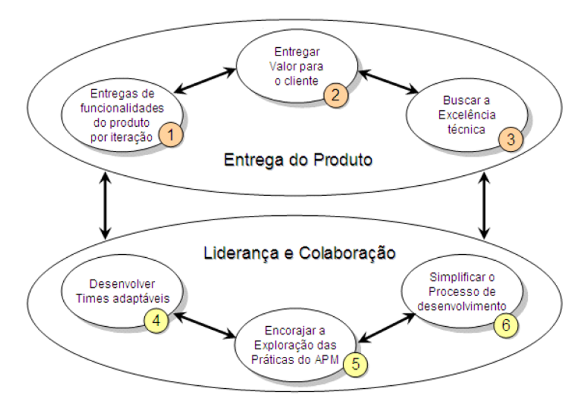
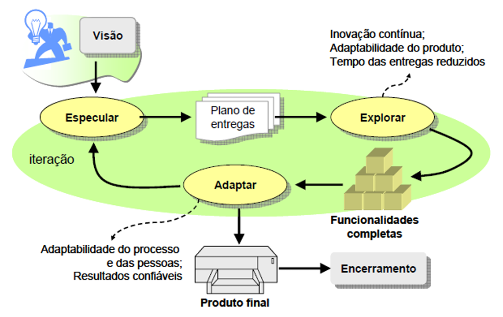

# Capítulo 25 – Gestão Ágil de Projetos: Liderando em Ambientes de Incerteza

O gerenciamento de projetos tradicional, com sua estrutura e guias de melhores práticas como o PMBOK, serviu por muito tempo como o padrão para a condução de projetos complexos. No entanto, com a crescente velocidade das mudanças no mercado e a natureza dinâmica do desenvolvimento de produtos inovadores, essa abordagem começou a enfrentar críticas por sua rigidez e complexidade.

A abordagem tradicional de gerenciamento de projetos apresenta uma redução em sua eficiência quando aplicada em projetos com elevado nível de incerteza, com equipes pequenas e co-localizadas, e que exigem um alto nível de interação entre os membros da equipe e os clientes. No modelo tradicional, o sucesso dependia da capacidade de antecipar ou prever todas as variáveis relacionadas ao desenvolvimento do projeto, um cenário cada vez mais raro no desenvolvimento de software moderno. O plano era rei, e qualquer desvio era visto como uma falha a ser corrigida.

Em resposta a esses desafios, começaram a surgir diversas propostas de abordagens de gerenciamento de projetos alternativas, mais leves e adaptativas. Elas propunham novos princípios de gerenciamento em que o envolvimento da equipe e a utilização de técnicas simplificadas, com enfoque no desenvolvimento da autogestão, se adequam melhor a ambientes onde a imprevisibilidade e as mudanças predominam. Assim nasceu a **Gestão Ágil de Projetos (GAP)**, ou **Agile Project Management (APM)**.

## O Que é a Gestão Ágil de Projetos (APM)?

A Gestão Ágil de Projetos não é uma única metodologia, mas sim um guarda-chuva de abordagens que compartilham uma filosofia e um conjunto de valores. Ela representa uma mudança fundamental na forma de pensar sobre como liderar projetos, movendo o foco do controle rígido para a facilitação e adaptação. Diversos autores contribuíram para sua definição:

- **Jim Highsmith**, um dos signatários do Manifesto Ágil, a define como um conjunto de princípios, valores e práticas que auxiliam a equipe a entregar produtos ou serviços de valor em um ambiente de projetos desafiador.
- **G. Chin** a vê como um novo elemento que pode contribuir para a teoria tradicional de gestão de projetos, permitindo que as empresas sejam mais eficientes na gestão de projetos em ambientes incertos.
- **D. DeCarlo** a descreve como "a arte e ciência de facilitar e gerenciar o fluxo de pensamentos, emoções e interações" com o objetivo de produzir resultados de valor em condições adversas e complexas, sujeitas a mudanças constantes e elevados níveis de incerteza.

O próprio termo **"agilidade"**, no contexto do desenvolvimento ágil, significa que a equipe de projeto desenvolve a habilidade necessária para **criar e responder às mudanças** ocorridas no projeto. A abordagem do gerenciamento ágil deve ser encarada como a busca por um equilíbrio constante entre flexibilidade e estabilidade. Como afirma **Doug Augustine**, é necessário balancear caos com ordem, execução com planejamento e exploração com otimização.

Analisando essas definições, alguns pontos em comum se destacam:

- **Flexibilidade e Adaptação:** Todas as definições enfatizam a necessidade de flexibilidade e a habilidade de absorver mudanças durante todo o ciclo de vida do projeto.
- **Enfoque Humanista:** Há uma forte valorização do aprendizado contínuo e da capacidade dos indivíduos como participantes ativos do processo, em vez de uma valorização excessiva das técnicas e processos de gestão.
- **Entrega de Valor:** O foco principal não é apenas seguir um plano, mas sim entregar valor para o cliente de forma contínua, mesmo diante da imprevisibilidade.

## Os Pilares da Mentalidade Ágil na Gestão

A gestão ágil de projetos é sustentada por um conjunto de práticas e valores que priorizam a entrega rápida e contínua de valor ao cliente, adaptando-se às mudanças de forma dinâmica e promovendo a colaboração. Vamos explorar os pilares dessa abordagem.

### Cooperação

A cooperação é a espinha dorsal da gestão ágil. Ela envolve a colaboração contínua e intensa entre todos os membros da equipe, bem como entre a equipe e os stakeholders, para garantir que todos estejam alinhados e trabalhando em direção ao mesmo objetivo. Na prática, isso significa que as equipes ágeis operam em ciclos curtos e interativos, como sprints, onde o feedback é compartilhado constantemente. Reuniões diárias (daily stand-ups) são comuns e servem como um pulso rápido para que os membros da equipe sincronizem seu progresso e identifiquem desafios. A cooperação não se limita à equipe interna; ela se estende aos clientes e stakeholders, que são integrados ao processo de desenvolvimento através de revisões de sprint e validações constantes, tornando-se parceiros ativos na construção do produto.

### Flexibilidade de Escopo

Diferente da gestão tradicional de projetos, onde o escopo é definido rigidamente no início e qualquer mudança é tratada como uma exceção custosa, a gestão ágil abraça a **flexibilidade de escopo**. Isso significa que o escopo do projeto pode e deve ser ajustado continuamente com base no feedback recebido e nas necessidades emergentes do cliente. Na prática, essa flexibilidade é gerenciada através de um backlog priorizado, que é um artefato vivo, constantemente revisado e atualizado. O Product Owner trabalha em estreita colaboração com a equipe para reordenar o backlog, garantindo que as funcionalidades mais valiosas sejam sempre desenvolvidas primeiro. Isso permite que a equipe responda rapidamente a mudanças no mercado ou nos requisitos do cliente, sem comprometer o fluxo de entrega.

### Interatividade

A gestão ágil enfatiza a **interatividade** em todos os níveis, tanto no processo de desenvolvimento quanto na comunicação. O trabalho é dividido em pequenos incrementos funcionais, e cada um deles é completamente desenvolvido, testado e revisado antes de se avançar. Na prática, iterações curtas, geralmente chamadas de sprints no Scrum, são usadas para criar versões incrementais e potencialmente utilizáveis do produto. Ao final de cada sprint, uma **Revisão de Sprint** é realizada para demonstrar o progresso, obter feedback valioso dos stakeholders e ajustar o curso do projeto se necessário. Isso cria um ciclo contínuo de **construir-medir-aprender**, garantindo que o produto final evolua de acordo com as necessidades reais do usuário.

### Autonomia e Empoderamento de Equipes

Na gestão ágil, as equipes são incentivadas a serem **autônomas e auto-organizadas**. Isso significa que elas têm a liberdade e a responsabilidade de tomar decisões sobre _como_ o trabalho será realizado, sem a necessidade de aprovações ou supervisão constante da gerência. A autonomia é promovida através de uma clara definição de papéis (como Scrum Master e Product Owner) e do empoderamento da equipe de desenvolvimento para tomar decisões técnicas. Cada membro da equipe tem a liberdade de escolher a melhor maneira de abordar suas tarefas, dentro das diretrizes gerais do projeto.

O **empoderamento** é o ato de fornecer às equipes os recursos, a autoridade e a confiança para que possam cumprir seus objetivos. Líderes ágeis atuam como facilitadores e "líderes servidores", cujo principal papel é remover obstáculos e apoiar a equipe, em vez de microgerenciá-la. Isso não apenas acelera a tomada de decisões, mas também aumenta drasticamente a motivação, o senso de propriedade e o comprometimento da equipe com a qualidade do resultado.

### Programação em Pares

A **Programação em Pares (Pair Programming)** é uma prática técnica de desenvolvimento de software, originária do Extreme Programming (XP), onde duas pessoas trabalham juntas no mesmo código em um único computador. Um dos programadores, chamado de "piloto", escreve o código, enquanto o outro, o "navegador" ou "copiloto", revisa cada linha de código à medida que é escrita. O navegador pensa em melhorias, erros potenciais, alternativas de design e considera o impacto geral da solução no sistema. Os papéis são trocados com frequência.

Na prática, a programação em pares promove a colaboração intensa, a melhoria contínua e a elevação da qualidade do código. Embora possa parecer menos eficiente inicialmente, devido ao envolvimento de dois desenvolvedores em uma única tarefa, os benefícios de um código mais limpo, menos bugs, maior disseminação de conhecimento e decisões de design mais robustas geralmente compensam essa percepção, resultando em um desenvolvimento mais eficaz e sustentável a longo prazo.

## Os Princípios Fundamentais da Gestão Ágil

A Gestão Ágil de Projetos é regida por um conjunto de princípios básicos que a diferenciam da abordagem tradicional. Esses princípios remetem a uma reflexão sobre onde o foco da gestão deve estar. Enquanto a teoria tradicional enfatiza o valor do plano de projeto e a antecipação de eventos, a gestão ágil questiona como é possível agregar valor, simplificar o processo e criar times adaptáveis quando não se pode prever tudo.

  

Os princípios ilustrados acima podem ser resumidos em:

- **Foco no Cliente e na Entrega de Valor:** O sucesso é medido pela satisfação do cliente e pelo valor de negócio entregue, não apenas pelo cumprimento de um cronograma.
- **Colaboração e Liderança da Equipe:** A equipe é empoderada para se auto-organizar e tomar decisões. A liderança é um papel de serviço, focado em remover impedimentos e facilitar o trabalho.
- **Adaptação Contínua ao Contexto:** O processo e o plano não são rígidos. Eles são continuamente inspecionados e adaptados com base no feedback e no aprendizado obtido.
- **Simplicidade e Foco no Essencial:** Busca-se a maneira mais simples de atingir os objetivos, eliminando desperdícios, burocracia e atividades que não agregam valor.
- **Qualidade e Excelência Técnica:** A qualidade é construída ao longo do processo, não verificada apenas no final. A atenção contínua à excelência técnica aumenta a agilidade.

## Abordagem Tradicional versus Abordagem Ágil: Uma Comparação

As diferenças filosóficas entre a gestão tradicional e a ágil se manifestam em praticamente todos os aspectos do gerenciamento de um projeto. A tabela a seguir resume as principais distinções:

|**Abordagem**|**Tradicional**|**Ágil**|
|---|---|---|
|**Metas do Projeto**|Enfoque na finalização do projeto no tempo, custo e escopo definidos (o "triângulo de ferro").|Enfoque nos resultados do negócio e em atingir múltiplos critérios de sucesso, incluindo a satisfação do cliente.|
|**Plano do Projeto**|Uma coleção detalhada de atividades que são executadas como planejado para atender a tempo, custo e qualidade.|Uma organização e um processo para atingir as metas esperadas e os resultados para o negócio. O plano é um guia, não uma regra.|
|**Abordagem Gerencial**|Rígida, com foco no controle e na conformidade com o plano inicial.|Flexível, variável e adaptativa, pronta para responder às mudanças.|
|**Trabalho e Execução**|Assume que o trabalho é previsível, mensurável, linear e relativamente simples.|Reconhece que o trabalho é imprevisível, nem sempre mensurável, não-linear e complexo.|
|**Influência da Organização**|Mínima e imparcial a partir do kick-off do projeto.|Afeta o projeto continuamente ao longo de sua execução, exigindo interação constante.|
|**Controle do Projeto**|Identificar desvios do plano inicial e corrigir o trabalho para seguir o plano.|Identificar mudanças no ambiente e no entendimento do problema, e ajustar o plano adequadamente.|
|**Aplicação da Metodologia**|Aplicação genérica e, muitas vezes, igualitária em todos os projetos.|Adaptação do processo dependendo do tipo, tamanho e contexto de cada projeto.|
|**Estilo de Gestão**|Um modelo único ("one-size-fits-all") tende a ser aplicado a todos os tipos de projetos.|Abordagem adaptativa; um único modelo não atende a todos os tipos de projetos.|

## O Ciclo de Vida da Gestão Ágil de Projetos

Diferente de um processo linear com fases bem definidas e sequenciais, a Gestão Ágil de Projetos opera em um ciclo de vida adaptativo, composto por cinco fases principais. As fases de Especulação, Exploração e Adaptação formam um ciclo contínuo de planejamento, execução e aprendizado.

  

|**Fases**|**Descrição**|
|---|---|
|**Visão**|O objetivo desta fase inicial é **determinar a visão do produto e o escopo geral do projeto**. Define-se _o que_ será entregue em alto nível, quem são os envolvidos (a comunidade do projeto) e _como_ a equipe irá trabalhar e interagir. É o momento de alinhar as expectativas e estabelecer as bases para o projeto.|
|**Especulação**|Com a visão estabelecida, o objetivo desta fase é **planejar o projeto com base nessa visão preliminar**. A palavra "especulação" é usada de propósito para indicar que este não é um plano fixo e detalhado, mas sim uma exploração das possibilidades. A equipe de projeto, com o apoio dos stakeholders, define um plano de _release_ baseado nas funcionalidades e prioridades, e planeja a primeira iteração.|
|**Exploração**|Esta fase é onde o trabalho de desenvolvimento acontece. O objetivo é **executar o que foi planejado na iteração, entregando funcionalidades de valor**. A equipe trabalha de forma focada, promovendo a auto-organização e a autodisciplina. A gestão ágil, aqui, foca em facilitar o trabalho, remover impedimentos e gerenciar as interações da equipe com o cliente para garantir feedback contínuo.|
|**Adaptação**|Ao final de cada ciclo de exploração, o objetivo da fase de Adaptação é **rever os resultados obtidos**. A equipe analisa o progresso do projeto, avalia seu próprio desempenho e utiliza o feedback recebido para fazer adaptações. O plano do projeto, as prioridades das entregas e o plano para as próximas iterações podem ser ajustados caso seja necessário. É o coração do processo de aprendizado ágil.|
|**Encerramento**|A fase final do projeto. Seu objetivo é **transferir os conhecimentos-chave adquiridos**, entregar o produto final e celebrar os resultados obtidos com a equipe. É recomendado que, além do encerramento formal do projeto, sejam realizados "mini-fechamentos" ao final de cada iteração, criando momentos para celebrar as pequenas vitórias e consolidar o aprendizado.|

## Considerações Finais

A Gestão Ágil de Projetos não deve ser vista como uma abordagem "anti-planejamento" ou "anti-gerenciamento". Pelo contrário, ela é uma forma de planejamento e gerenciamento mais realista e adaptada aos ambientes de alta incerteza que caracterizam o desenvolvimento de software inovador. Ela reconhece que o plano inicial é apenas um ponto de partida e que o verdadeiro valor reside na capacidade da equipe de aprender e se adaptar ao longo do caminho.

O foco se desloca do rigoroso seguimento de um plano para a entrega contínua de valor, da imposição de processos para o empoderamento de equipes auto-organizáveis, e do controle centralizado para a colaboração distribuída. Ao abraçar a mudança como uma constante e ao colocar as pessoas e suas interações no centro do processo, a Gestão Ágil de Projetos oferece um framework robusto para navegar pela complexidade, aumentar a eficiência e entregar produtos de alta qualidade que atendem verdadeiramente às necessidades dos clientes.