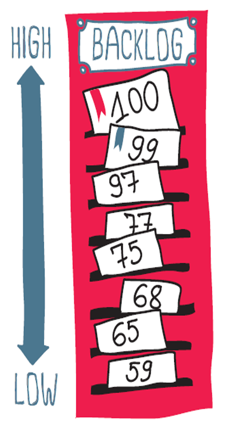
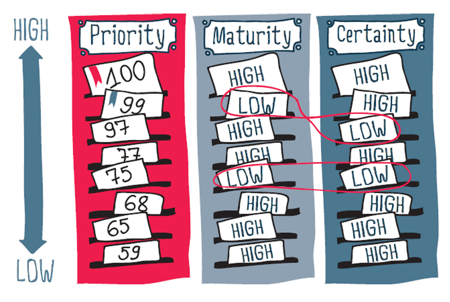
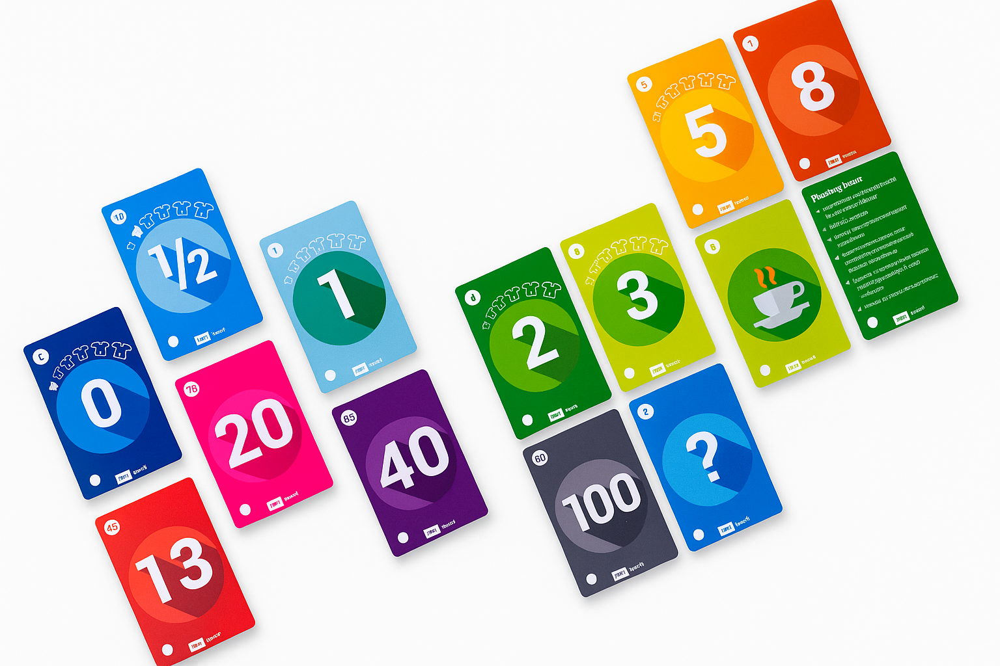

# Capítulo 26 – Técnicas para Planejamento e Estimativa de Escopo em Projetos Ágeis

Adentrar o universo do planejamento ágil é, antes de tudo, desconstruir um mito persistente: a ideia de que agilidade e planejamento são conceitos antagônicos. Um pensamento comum e errôneo entre diversos profissionais é que, para ser ágil, é preciso abandonar o planejamento. A realidade, no entanto, é exatamente o oposto.

Em projetos ágeis, planeja-se, e muitas vezes de forma mais intensa e frequente do que em abordagens tradicionais. O que se desencoraja não é o ato de planejar, mas sim a rigidez de um plano imutável. A agilidade encoraja o **replanejamento contínuo**, a capacidade de adaptar o curso com base em aprendizados e feedbacks constantes. Em contraste, um projeto tradicional enfatiza um planejamento detalhado e exaustivo feito no início, antes de qualquer investimento significativo. Este plano inicial tenta prever todo o curso do projeto, buscando detalhar a lista completa de requisitos para todas as fases, uma tarefa que se mostra cada vez mais impraticável em ambientes de alta incerteza.

Este capítulo se aprofunda nas técnicas e filosofias que permitem às equipes ágeis navegar pela complexidade, priorizar o que realmente importa e estimar o esforço de forma colaborativa e inteligente, transformando a incerteza inicial em um fluxo de entrega de valor previsível e contínuo.

## Técnicas para Planejamento e Priorização de Escopo

É um desafio comum em projetos de software lidar com a dificuldade dos clientes em priorizar suas necessidades. Em geral, a percepção inicial é de que **tudo é importante e urgente!** Essa ausência de hierarquia dificulta enormemente o trabalho da equipe, pois é impossível construir tudo de uma vez. É fundamental que haja uma priorização e uma estimativa do escopo.

Grosso modo, em uma lista ordenada de prioridades, os requisitos no topo são mais importantes e devem ser desenvolvidos primeiro, enquanto os que estão na base são menos críticos (o que não significa que não tenham importância). Para que essa ordenação seja eficaz, cada item do escopo deve ter um tamanho mensurável ou, mais realisticamente, **estimável**.

A diferença entre os termos é fundamental. Um item **mensurável** pode ser medido com alta precisão, geralmente em unidades absolutas como horas ou dias. Já um item **estimável** tem seu tamanho avaliado de forma relativa, comparando-o com outros itens. A abordagem mais adequada para equipes ágeis que lidam com a incerteza é, sem dúvida, a segunda. As técnicas a seguir viabilizam essa priorização e planejamento incrementais.

### Priorização Binária

Esta é uma das técnicas mais simples e diretas para ordenar um conjunto de funcionalidades. Ela pode ser usada para organizar o escopo inteiro de um projeto, desde as atividades de mais alta prioridade até as de mais baixa.

O método consiste em pegar dois itens da lista de escopo e decidir qual deles é mais importante. O item escolhido é considerado de maior prioridade. Esse processo é repetido iterativamente com diferentes pares de itens, utilizando um algoritmo de ordenação (como o _bubble sort_), até que toda a lista esteja organizada hierarquicamente. Sua força reside na simplicidade da tomada de decisão, que é sempre focada em apenas dois elementos por vez. Contudo, é uma técnica que pode se tornar ineficiente para listas muito grandes de itens, sendo mais indicada para priorizar um conjunto focado de funcionalidades.

### Priorização baseada em Valor de Negócio (Business Value)

Nesta abordagem, cada requisito, história de usuário ou funcionalidade carrega um **valor de negócio** potencial que pode gerar para a organização. Esse valor é atribuído pelo Product Owner ou por um comitê de stakeholders. Ele não se resume apenas a receita; pode representar diversos fatores, como:

- **Aumento de Receita:** Novas funcionalidades que abrem mercados ou aumentam vendas.
- **Redução de Custos:** Automação de processos que diminuem despesas operacionais.
- **Satisfação do Cliente:** Melhorias que aumentam a lealdade e a retenção de usuários.
- **Aquisição de Novos Usuários:** Funcionalidades que atraem um novo público para o produto.
- **Diferenciação de Mercado:** Inovações que colocam o produto à frente da concorrência.
- **Conformidade Regulatória (Compliance):** Requisitos obrigatórios para operar legalmente.

O princípio é direto: os requisitos com maior valor de negócio são implementados prioritariamente. Isso garante que a equipe esteja sempre trabalhando naquilo que maximiza o retorno sobre o investimento (ROI).

### Priorização MoSCoW

Esta técnica, cujo nome é um acrônimo, é amplamente utilizada para categorizar requisitos com base em sua criticidade. A equipe, em colaboração com os stakeholders, classifica cada item do escopo em uma das quatro categorias:

- **Must Have (Deve Ter):** Requisitos não negociáveis, sem os quais o produto não funciona ou não tem valor. São essenciais para o lançamento atual.
- **Should Have (Deveria Ter):** Requisitos importantes, mas não vitais. O produto funcionará sem eles, mas ficará significativamente degradado. Devem ser incluídos se possível.
- **Could Have (Poderia Ter):** Requisitos desejáveis, mas de menor impacto. São considerados "nice-to-have" e só serão implementados se houver tempo e recursos sobrando, sem impactar os itens mais importantes.
- **Won't Have (Não Terá... por enquanto):** Requisitos que foram explicitamente acordados como fora do escopo para o lançamento ou iteração atual. Isso não significa que nunca serão feitos, mas sim que não são uma prioridade agora.

O grande desafio dessa técnica é um problema bastante conhecido: os clientes tendem a marcar quase tudo como **Must Have**. Se todos os itens têm o mesmo nível de prioridade, na prática, não há priorização alguma! Uma boa estratégia para contornar isso é limitar a quantidade de esforço ou itens que podem ser classificados como "Must Have" a uma porcentagem do total (ex: 60% da capacidade da equipe na iteração).

### Modelo Kano

Desenvolvido por Noriaki Kano, este modelo classifica as funcionalidades com base em seu potencial para satisfazer o cliente. É uma técnica mais sofisticada que ajuda a equipe a entender o impacto emocional e funcional de cada requisito. Os requisitos são divididos em cinco categorias:

1. **Must-be (Obrigatórios):** São as funcionalidades básicas que os clientes esperam como padrão. Se não estiverem presentes, os clientes ficarão extremamente insatisfeitos. No entanto, sua presença não gera satisfação, apenas evita a insatisfação. Exemplo: os freios em um carro novo.
2. **One-dimensional (De Desempenho):** A satisfação do cliente é diretamente proporcional à presença e qualidade dessas funcionalidades. Quanto mais e melhor, mais satisfeito o cliente fica. Exemplo: o consumo de combustível de um carro.
3. **Attractive (Atrativos):** São as funcionalidades inesperadas que encantam o cliente. Sua ausência não causa insatisfação (pois não são esperadas), mas sua presença gera um alto nível de satisfação. Exemplo: o primeiro teto solar panorâmico em um carro popular.
4. **Indifferent (Indiferentes):** Funcionalidades que não fazem diferença para o cliente. Sua presença ou ausência não afeta a satisfação. Devem ser evitadas, pois representam desperdício de esforço.
5. **Reverse (Reversos):** Funcionalidades que, quando presentes, causam insatisfação. Alguns clientes preferem que elas não existam. Exemplo: uma interface excessivamente complexa com funcionalidades que o usuário nunca irá usar.

### Priorização Baseada em Risco

Esta abordagem foca em mitigar as maiores ameaças ao sucesso do projeto o mais cedo possível. Existem duas vertentes principais:

- **Risco de Negócio:** Priorizam-se as funcionalidades que possuem maior incerteza sobre sua aceitação pelo mercado ou seu valor real. Ao desenvolvê-las primeiro, a equipe pode validar ou invalidar hipóteses críticas de negócio rapidamente.
- **Risco Técnico:** Priorizam-se os trabalhos que envolvem as maiores complexidades de implementação, por conta da tecnologia usada no desenvolvimento, ou desafios arquitetônicos. Resolver esses desafios primeiro evita que eles se tornem grandes impedimentos no final do projeto.

### Magnitude Relativa e o Gerenciamento da Incerteza

Uma técnica de estimativa muito interessante funciona da seguinte forma: escolhe-se uma escala numérica arbitrária. Pode ser a Sequência de Fibonacci, Potências de Dois, Progressões Aritméticas, entre outros. Pode-se inclusive inventar uma sequência.

  

Então, a equipe escolhe um item do escopo que tenha um tamanho médio e atribui a ele um valor médio da escala escolhida. Assim, os demais itens do escopo serão comparados a esse item médio para se atribuir uma magnitude maior ou menor. Isso é uma estimativa realizada rapidamente – diferente de uma mensuração, que em geral necessita de um grande esforço. As equipes podem, então, usar essa informação para calcular a velocidade de desenvolvimento, melhorando a precisão de suas estimativas futuras.

Além do tamanho, quando um projeto começa, nem todos os requisitos estão prontos e levantados, portanto deve-se levar em consideração aspectos de incerteza e maturidade. Alguns itens do escopo podem ter alta prioridade, mas podem não estar completamente definidos (maduros) ou válidos (incertos).

  

Dessa forma, as equipes buscam rastrear a certeza e a maturidade de cada item do escopo para ajudá-las a monitorar quais itens estão realmente prontos para serem desenvolvidos. Itens com baixa maturidade e certeza não são bons candidatos ao desenvolvimento, mesmo que tenham alta prioridade. A equipe deve primeiro passar algum tempo amadurecendo e validando o requisito antes de se comprometer com sua implementação.

## Técnicas de Estimativa de Escopo

A estimativa de escopo é um processo crítico no gerenciamento de projetos, envolvendo a definição e a documentação detalhada de todos os trabalhos necessários para completar um projeto com sucesso. O escopo do projeto abrange tanto os produtos ou entregáveis finais que devem ser produzidos quanto o trabalho necessário para criar esses entregáveis.

O escopo de um projeto define e delimita exatamente o que está e o que não está incluído no projeto. Ele abrange:

- **Entregáveis do Projeto:** os produtos, serviços ou resultados que serão entregues ao final do projeto.
- **Trabalho do Projeto:** todas as tarefas, atividades e processos necessários para criar esses entregáveis, incluindo tempo, recursos e processos envolvidos.

|**Importância**|**Descrição**|
|---|---|
|**Clareza e direção**|Uma definição clara de escopo fornece uma compreensão comum do que o projeto visa alcançar, oferecendo direção para todos os envolvidos.|
|**Base para planejamento**|O escopo é a base para o planejamento detalhado do projeto, incluindo cronograma, orçamento e alocação de recursos. Sem uma definição precisa do escopo, é impossível planejar eficazmente.|
|**Gerenciamento de expectativas**|Definir o escopo ajuda a gerenciar as expectativas das partes interessadas, garantindo que todos tenham a mesma compreensão dos objetivos do projeto e dos resultados esperados.|
|**Controle de mudanças**|Uma vez que o escopo está definido, qualquer alteração nos entregáveis ou no trabalho do projeto precisa passar por um processo formal de controle de mudanças. Isso ajuda a evitar o "Scope Creep" (Expansão Não Controlada do Escopo), que pode levar a atrasos, aumento de custos e outros problemas.|
|**Avaliação de desempenho**|O escopo estabelece critérios claros contra os quais o desempenho do projeto pode ser medido, permitindo avaliar se os objetivos do projeto estão sendo atendidos.|

O gerenciamento eficaz do escopo é vital para o sucesso do projeto e obedece a um processo que contém as seguintes fases: Coleta de Requisitos, Definição de Escopo, Criação da Estrutura Analítica do Projeto (EAP) e Validação do Escopo.

|**Processo**|**Descrição**|
|---|---|
|**Coleta de requisitos**|Reunir informações das partes interessadas para entender as necessidades e expectativas.|
|**Definição de escopo**|Documentar detalhadamente os entregáveis e o trabalho do projeto.|
|**Criação da EAP**|Decompor o trabalho do projeto em componentes menores e mais gerenciáveis.|
|**Validação do escopo**|Garantir que o escopo definido atenda às necessidades e expectativas das partes interessadas.|

A estimativa de escopo é essencial para garantir que um projeto seja entregue com sucesso, dentro do prazo e do orçamento previstos. Ela não apenas define o que precisa ser feito, mas também estabelece a base para o planejamento de recursos, tempo e custos, conforme os objetivos listados abaixo.

|**Objetivos**|**Descrição**|
|---|---|
|**Clareza nos resultados esperados**|A estimativa de escopo ajuda a definir com clareza os entregáveis do projeto, garantindo que todas as partes interessadas tenham uma compreensão unificada do que o projeto visa alcançar.|
|**Alinhamento de expectativas**|Facilita o alinhamento das expectativas entre a equipe do projeto, as partes interessadas e os patrocinadores, minimizando mal-entendidos e conflitos potenciais.|
|**Base para cronograma e orçamento**|Ao compreender o escopo do projeto, os gerentes podem desenvolver cronogramas de trabalho mais precisos e estimativas de custo, fundamentais para a alocação eficaz de tempo e recursos.|
|**Alocação de recursos**|Permite a identificação e alocação adequada dos recursos necessários – humanos, financeiros e materiais – para a execução do projeto.|
|**Identificação de riscos**|A análise detalhada do escopo ajuda a identificar potenciais riscos e desafios associados ao projeto, permitindo o desenvolvimento de estratégias de mitigação.|
|**Controle de mudanças**|Estabelece uma base para o gerenciamento de mudanças de escopo, ajudando a controlar o impacto de quaisquer alterações nos objetivos originais do projeto.|
|**Prevenção de sobrecarga de trabalho (scope creep)**|Evita a expansão não planejada do escopo, que pode levar a atrasos, aumento de custos e desgaste da equipe.|
|**Otimização do processo de trabalho**|Facilita a identificação de redundâncias ou ineficiências no plano de trabalho, permitindo ajustes que otimizem a execução do projeto.|
|**Critérios para medição de sucesso**|Fornece critérios claros contra os quais o sucesso do projeto pode ser medido, facilitando a avaliação de seu desempenho.|
|**Ferramenta para comunicação**|Serve como uma ferramenta de comunicação eficaz, fornecendo uma descrição detalhada do trabalho a ser realizado para todas as equipes e partes interessadas envolvidas.|

### Planning Poker

O Planning Poker, também conhecido como Scrum Poker, é uma técnica lúdica e colaborativa de estimativa de escopo usada principalmente em projetos que adotam metodologias ágeis como o Scrum. Essa técnica incentiva a participação de toda a equipe no processo de estimativa, promovendo o entendimento comum do trabalho e ajudando a garantir que as estimativas sejam precisas e consensuais.

  

O funcionamento da técnica segue as seguintes etapas:

|**Etapas**|**Descrição**|
|---|---|
|**Preparação**|Cada participante recebe um conjunto de cartas com números representando diferentes níveis de esforço, geralmente seguindo a série de Fibonacci (1, 2, 3, 5, 8, 13, 21, etc.), pois esta série reflete a incerteza inerente à estimativa de tarefas complexas.|
|**Apresentação dos itens**|Um item de trabalho (uma história de usuário, por exemplo) é apresentado à equipe. O moderador, que pode ser o Scrum Master, explica os detalhes e objetivos do item.|
|**Discussão inicial**|A equipe discute o item para esclarecer dúvidas. Esta etapa é crucial para garantir que todos tenham uma compreensão clara do que está sendo estimado.|
|**Estimativa individual**|Cada membro da equipe seleciona uma carta de seu baralho que representa sua estimativa do esforço necessário. As escolhas são feitas em segredo para evitar influências.|
|**Revelação**|Todos os participantes revelam suas cartas simultaneamente. Se houver um consenso, essa estimativa é aceita. Se as estimativas variarem significativamente, os membros com as estimativas mais altas e mais baixas explicam seu raciocínio.|
|**Discussão e reestimativa**|Após a discussão, a equipe realiza outra rodada de estimativas, repetindo o processo até alcançar um consenso ou uma aproximação aceitável.|

**Exemplo Concreto:**

Imagine uma equipe desenvolvendo um aplicativo móvel para uma rede de restaurantes. Eles precisam estimar a seguinte história de usuário:

- **História de Usuário:** "Como cliente, quero poder filtrar o menu por categorias de alimentos (como veganos, sem glúten, etc.), para que eu possa encontrar facilmente os pratos que atendem às minhas preferências alimentares".

|**Etapas**|**Descrição**|
|---|---|
|**Preparação**|A equipe se reúne com seus conjuntos de cartas. O Scrum Master apresenta a história, seus detalhes, objetivos e critérios de aceitação.|
|**Discussão inicial**|A equipe discute. O desenvolvedor front-end menciona a necessidade de implementar um novo componente de interface para os filtros. O especialista em back-end fala sobre ajustar as consultas ao banco de dados. O designer de UX/UI destaca a importância de uma interface intuitiva.|
|**Estimativa individual**|Após a discussão, cada membro escolhe sua carta. O desenvolvedor front-end escolhe **8**, considerando o trabalho na interface. O back-end escolhe **5**, pois parte da infraestrutura pode ser reaproveitada. O designer escolhe **3**, acreditando que o design pode ser adaptado de componentes existentes.|
|**Revelação**|Todos revelam suas cartas. Com a discrepância (3, 5, 8), a discussão é necessária.|
|**Discussão e reestimativa**|O desenvolvedor front-end explica os desafios técnicos que justificam o 8. O designer oferece soluções que podem simplificar o trabalho. Após entenderem melhor os desafios uns dos outros, a equipe realiza uma segunda rodada.|
|**Consenso**|Na segunda rodada, as estimativas são mais alinhadas. A equipe concorda com uma estimativa de **5 pontos de esforço**, considerando as soluções propostas e a colaboração entre as áreas.|

Este exemplo mostra como o Planning Poker facilita a colaboração, permitindo que diferentes perspectivas sejam compartilhadas para se chegar a um consenso informado.

### Story Points

Story Points são uma unidade de medida utilizada em metodologias ágeis para estimar o esforço necessário para completar uma história de usuário. Diferentemente de estimativas baseadas em tempo, eles consideram fatores que afetam o esforço, incluindo a complexidade da tarefa, volume de trabalho, riscos potenciais e incertezas.

|**Etapas**|**Descrição**|
|---|---|
|**Sessões de planejamento**|Durante as reuniões, a equipe discute cada história de usuário e atribui Story Points por meio de um consenso ou técnicas como Planning Poker.|
|**Ajustes com base na experiência**|Conforme a equipe avança no projeto, ela se torna mais eficiente em estimar, ajustando suas estimativas com base na experiência adquirida em sprints anteriores.|
|**Monitoramento da velocidade**|A equipe acompanha a quantidade de Story Points completados em cada sprint (sua "velocidade"), o que ajuda a prever a capacidade de trabalho para sprints futuros.|

Um erro comum a ser evitado é tentar criar uma equivalência direta entre Story Points e horas (ex: 1 ponto = 4 horas). Essa prática é um antipadrão, pois reintroduz a pressão e a imprecisão das estimativas baseadas em tempo, ignorando a natureza relativa dos pontos, que considera complexidade e incerteza, e não apenas a duração.

**Exemplo Concreto:**

Uma equipe está desenvolvendo um aplicativo de finanças pessoais e precisa estimar três histórias de usuário:

- **História de Usuário 1:** "Como usuário, quero poder categorizar minhas despesas, para que eu possa visualizar meu orçamento por categorias".
- **História de Usuário 2:** "Como usuário, quero receber notificações sobre transações suspeitas, para que eu possa garantir a segurança da minha conta".
- **História de Usuário 3:** "Como usuário, quero poder exportar relatórios mensais das minhas despesas para PDF, para que eu possa arquivá-las para referência futura".

Após discussão, a equipe avalia:

- **História 1 (Categorias):** Complexidade média, envolve UI e back-end. **Estimativa: 5 Story Points.**
- **História 2 (Notificações):** Mais desafiadora, requer algoritmos de detecção de anomalias. **Estimativa: 13 Story Points.**
- **História 3 (Exportar PDF):** Relativamente simples, a equipe já tem experiência com a biblioteca de PDF. **Estimativa: 3 Story Points.**

Com base nessas estimativas e na velocidade conhecida da equipe, o Scrum Master e a equipe decidem quais histórias incluir no próximo sprint.

### Enquetes (Método Delphi)

Essa técnica é utilizada para coletar opiniões e alcançar um consenso entre especialistas, alinhando-se com a abordagem de consultar um grupo diversificado para refinar estimativas. A aplicação mais formal desse conceito é o Método Delphi.

|**Etapas**|**Descrição**|
|---|---|
|**Seleção dos especialistas**|Um grupo diversificado de especialistas com conhecimento relevante sobre o projeto é selecionado.|
|**Rodadas de questionários**|São enviados questionários anônimos aos especialistas. Após a primeira rodada, um resumo das estimativas e justificativas é preparado e compartilhado com o grupo, sem revelar os autores.|
|**Feedback e iteração**|Os especialistas revisam as respostas dos colegas e têm a oportunidade de revisar suas próprias estimativas na rodada seguinte, considerando as novas perspectivas.|
|**Convergência e consenso**|O processo é repetido até que um consenso seja alcançado ou as opiniões comecem a convergir para uma faixa comum de respostas.|

O anonimato incentiva a honestidade, e a estrutura iterativa ajuda a reduzir vieses. Ao final, a equipe de projeto ganha uma estimativa de escopo informada pelo consenso de especialistas.

**Exemplo Concreto:**

Um hospital deseja estimar o escopo para um novo sistema de informação hospitalar.

|**Etapas**|**Descrição**|
|---|---|
|**Seleção dos especialistas**|A equipe do projeto seleciona desenvolvedores, gerentes de TI do hospital, médicos, enfermeiros e um especialista em conformidade regulatória.|
|**Primeira rodada**|Um questionário anônimo é enviado, pedindo estimativas de esforço para as funcionalidades, com justificativas.|
|**Compilação e feedback**|As respostas são compiladas em um resumo (faixa de estimativas, justificativas), que é enviado de volta aos especialistas.|
|**Segunda rodada**|Os especialistas revisam o resumo e refinam suas estimativas, levando em conta as novas informações.|
|**Convergência e consenso**|Após três rodadas, as estimativas convergem, e a equipe concorda com uma estimativa detalhada do escopo e dos recursos necessários.|

O resultado é uma estimativa bem fundamentada, que oferece uma base sólida para o planejamento detalhado do projeto.

### T-Shirt Sizing

Este é um método simples e intuitivo para estimar rapidamente o tamanho relativo de tarefas ou histórias de usuário, comparando-as a tamanhos de camisetas: XS, S, M, L, XL, etc.

  

|**Etapas**|**Descrição**|
|---|---|
|**Discussão inicial**|A equipe reúne-se para discutir as características de cada tarefa, focando na compreensão do trabalho e das complexidades.|
|**Classificação relativa**|A equipe classifica cada tarefa atribuindo-lhe um "tamanho de camiseta", estimulando o pensamento relativo em vez de valores absolutos.|
|**Revisão e ajuste**|As classificações podem ser revistas e ajustadas conforme novas informações surgem.|

Após a classificação, a equipe pode converter os tamanhos em estimativas mais quantificáveis, como Story Points.

**Exemplo Concreto:**

Uma equipe está desenvolvendo um aplicativo de entrega de comida e precisa estimar as histórias para o MVP.

- **Histórias:** Pedido do Usuário, Rastreamento de Entrega, Cadastro de Usuário, Avaliações e Comentários.

A equipe discute e estima:

- **Pedido do Usuário - L (Large):** Grande, devido à integração de carrinho, pagamento e confirmação.
- **Rastreamento de Entrega - XL (Extra Large):** A mais complexa, devido à integração com serviços de localização em tempo real.
- **Cadastro de Usuário - M (Medium):** Padrão, mas requer integração com autenticação e segurança.
- **Avaliações e Comentários - S (Small):** A menos complexa, envolve interface e armazenamento de dados.

Com base nisso, a equipe e o Product Owner priorizam as histórias, talvez começando com S e M para garantir um progresso rápido.

## Considerações Finais

As técnicas de planejamento e estimativa em projetos ágeis representam uma mudança fundamental de mentalidade: da busca por precisão absoluta para a busca por entendimento compartilhado e adaptabilidade. Elas reconhecem que, em ambientes complexos, o plano inicial é apenas um ponto de partida, e a verdadeira habilidade reside na capacidade de ajustar o curso com base em aprendizados contínuos.

Ferramentas como MoSCoW e o Modelo Kano ajudam a focar no que realmente agrega valor, enquanto técnicas de estimativa como Planning Poker e T-Shirt Sizing transformam a tarefa de medir o esforço em um exercício colaborativo que fortalece a equipe. O uso de Story Points liberta as equipes da tirania do relógio, permitindo que se concentrem na complexidade e no esforço relativos, o que leva a previsões mais realistas a longo prazo.

Em última análise, o objetivo dessas práticas não é criar um plano perfeito, mas sim facilitar as conversas certas, alinhar as expectativas e construir um ritmo sustentável de entrega. Ao abraçar a estimativa como uma arte de comparação e a priorização como uma negociação constante de valor, as equipes ágeis se capacitam para entregar os produtos certos, no momento certo.