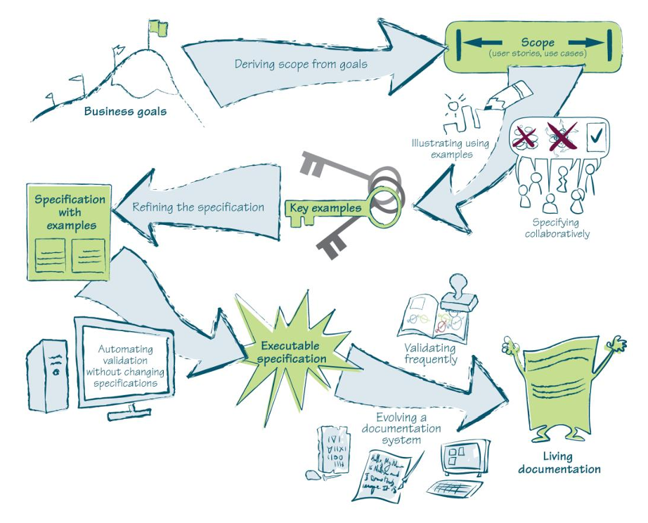

# Capítulo 27 – Especificação por Exemplo: Construindo o Software Certo Através da Colaboração

Antes de mergulhar em uma nova técnica, é crucial definir seus termos. O que é uma especificação? Em sua essência, especificação é a definição detalhada das características de algo. Para ser verdadeiramente útil no desenvolvimento de software, uma especificação deve ser precisa e testável; deve ser um guia para a funcionalidade, e não um roteiro de implementação (script); e seu foco deve ser o valor para o negócio, não os detalhes do design de software. Uma vez que uma funcionalidade é implementada, a especificação que a descreve assume um novo propósito: ela passa a documentar o que o sistema faz e serve como um alerta vital contra regressões funcionais.

Nesse contexto, emerge a **Especificação por Exemplo (Specification by Example - SBE)**. Trata-se de um conjunto de padrões de processos que ajudam as equipes a construir o produto correto, focando intensamente na comunicação entre todas as partes interessadas. O objetivo é garantir que todos tenham um entendimento claro e compartilhado sobre o que está sendo produzido, permitindo uma colaboração mais eficaz.

É importante notar que a Especificação por Exemplo não é a forma como a maioria dos profissionais foi ensinada a pensar sobre especificações. O aprendizado tradicional prega que as especificações devem ser genéricas para cobrir todos os casos possíveis. Os exemplos, nesse modelo, servem apenas para destacar alguns pontos, e a generalização fica a cargo da interpretação individual. A Especificação por Exemplo inverte essa lógica, usando exemplos concretos como o pilar da comunicação. Isso não significa que ela deva ser a única técnica de levantamento de requisitos utilizada, mas certamente pode assumir um papel de liderança no processo.

### Especificação por Exemplo versus Abordagens Formais

Até recentemente, a ideia dominante para criar especificações rigorosas — aquelas que podem ser claramente julgadas como "aprovadas" ou "reprovadas" — era o uso de pré-condições e pós-condições. Essas técnicas são a base de métodos formais e também sustentam o **Design por Contrato (Design by Contract - DbC)**, cuja ideia principal é que cada componente de software deve ter um "contrato" formal que descreva seu comportamento e como ele interage com outros.

Embora tenham seu lugar, as pré-condições e pós-condições não são ideais em todos os cenários. Em algumas situações, elas podem ser fáceis de escrever, mas em outras, especialmente em aplicações de negócio complexas, o esforço para escrever as pré e pós-condições pode ser tão grande quanto o de escrever a própria solução.

Na Especificação por Exemplo, os exemplos concretos são, em geral, muito mais fáceis de criar e compreender, especialmente para os especialistas de negócio que não são da área de TI. Um dos maiores perigos de uma especificação de requisitos tradicional é a falsa sensação de que, uma vez escrita, a comunicação pode cessar. A Especificação por Exemplo, por outro lado, só funciona em um contexto de colaboração contínua. Os exemplos acionam abstrações na mente da equipe de desenvolvimento e, ao mesmo tempo, mantêm essas abstrações fundamentadas na realidade do negócio.

### Fundamentos da Especificação por Exemplo

A Especificação por Exemplo é uma abordagem colaborativa para definir requisitos e testes funcionais, baseada na captura e ilustração desses requisitos por meio de exemplos realistas, em vez de declarações abstratas. O foco é o desenvolvimento e a entrega de requisitos de negócio que sejam, ao mesmo tempo, prioritários e verificáveis.

Embora o conceito seja relativamente novo, ele é, em grande parte, uma reformulação de práticas eficazes já existentes. Ele se apoia em um vocabulário específico e conciso, conhecido como **linguagem ubíqua** (um termo do Domain-Driven Design), que é compartilhado e utilizado por todos na equipe — clientes, analistas, desenvolvedores e testadores.

A Especificação por Exemplo pode ser usada como uma entrada direta para a construção de testes automatizados que refletem o domínio do negócio. Assim, seu duplo foco é **construir o produto correto** (atender à necessidade real) e **construir o produto corretamente** (com qualidade técnica). É crucial entender que essas são duas coisas diferentes, e ambas são necessárias para o sucesso.

As principais vantagens dessa abordagem são:

- **Maior qualidade** nos produtos de software.
- **Redução significativa do desperdício** e do retrabalho.
- **Risco reduzido** de defeitos em produção.
- **Esforço focado** no que realmente agrega valor.
- **Alterações mais seguras** no código, graças a uma suíte de testes de regressão robusta.
- **Melhoria no envolvimento** e na colaboração com a área de negócio.

A longo prazo, a Especificação por Exemplo ajuda as equipes a criar um **sistema de documentação vivo**: uma descrição relevante e confiável da funcionalidade do sistema, que é atualizada automaticamente junto com o código. As práticas da SBE funcionam melhor com métodos de desenvolvimento de ciclo curto (como Scrum e XP) ou baseados em fluxo (Kanban), embora algumas de suas ideias também possam ser adaptadas para processos como RUP ou Cascata.

## Os Padrões de Processo da Especificação por Exemplo

A Especificação por Exemplo se manifesta através de um conjunto de padrões de processo que guiam a equipe desde a concepção de uma ideia até a sua validação contínua em produção.

  

### Derivando o Escopo das Metas

O escopo de uma implementação de software deve ser a solução para um problema de negócio ou um meio para atingir uma meta de negócio. No entanto, muitas equipes esperam que um cliente, Product Owner ou usuário de negócio decida o escopo completo do trabalho antes do início da implementação. Nesse modelo, os usuários de negócio especificam o que desejam, e a equipe de software implementa. Supostamente, isso deveria deixar os clientes satisfeitos. Na realidade, é aí que começam os problemas.

Ao contar com os clientes para fornecer uma lista de histórias de usuários ou casos de uso, as equipes estão, na prática, pedindo a seus clientes que projetem uma solução de software. Mas os usuários de negócio não são designers de software. Se os clientes definem o escopo isoladamente, o projeto não se beneficia do conhecimento técnico da equipe de entrega. Isso resulta em um software que faz o que o cliente **pediu**, mas não necessariamente o que ele realmente **precisava**.

Em vez de aceitar cegamente os requisitos como uma solução para um problema desconhecido, as equipes de sucesso derivam o escopo a partir dos objetivos. Elas começam com a meta de negócio do cliente e, em seguida, colaboram para definir o escopo que atingirá essa meta. Os usuários de negócio se concentram em comunicar a intenção do recurso e o valor esperado. Com esse entendimento, a equipe técnica pode sugerir uma solução que seja mais barata, rápida e fácil de manter do que a que os usuários de negócio criariam por conta própria.

### Especificando Colaborativamente

Se os desenvolvedores e testadores não estiverem envolvidos na criação das especificações, estas precisam ser comunicadas a eles em uma etapa posterior, um "hand-off". Na prática, isso deixa muitas oportunidades para mal-entendidos; detalhes cruciais podem se perder na tradução. Como consequência, os usuários de negócio precisam validar o software apenas após a entrega, e as equipes precisam refazer o trabalho se ele falhar na validação. Isso é retrabalho desnecessário.

Em vez de depender de uma única pessoa para acertar as especificações de forma isolada, as equipes de sucesso colaboram. Pessoas de diferentes áreas (negócio, desenvolvimento, teste, design) têm ideias distintas e usam suas experiências para resolver problemas. Especialistas técnicos sabem como usar melhor a infraestrutura existente ou aplicar novas tecnologias. Testadores sabem onde procurar possíveis problemas e como evitá-los.

Especificar de forma colaborativa permite aproveitar o conhecimento de toda a equipe. Além disso, cria um sentimento de propriedade coletiva sobre as especificações, tornando todos mais engajados no processo de entrega.

### Ilustrando Usando Exemplos

A linguagem natural é inerentemente ambígua e dependente de contexto. Requisitos escritos apenas em prosa não podem fornecer um contexto completo e inequívoco para desenvolvimento ou teste. Desenvolvedores e testadores precisam interpretar os requisitos, e pessoas diferentes podem interpretar conceitos complicados de maneiras diferentes.

Pequenas diferenças de entendimento têm um efeito cumulativo, muitas vezes levando a problemas que só são descobertos após a entrega, causando atrasos. Em vez de esperar que as especificações sejam expressas precisamente pela primeira vez durante a implementação, as equipes de sucesso ilustram as especificações usando exemplos.

A equipe trabalha com os usuários de negócio para identificar os exemplos-chave que descrevem a funcionalidade esperada. Durante esse processo, desenvolvedores e testadores geralmente sugerem exemplos adicionais que ilustram casos de borda ou abordam áreas problemáticas do sistema. Isso elimina lacunas e inconsistências, garantindo que todos tenham uma compreensão compartilhada do que precisa ser entregue. Se o sistema funcionar corretamente para todos os exemplos-chave, ele atenderá à especificação acordada.

### Refinando as Especificações

Uma discussão aberta e colaborativa cria um entendimento compartilhado, mas os exemplos resultantes geralmente contêm mais detalhes do que o necessário. Por exemplo, usuários de negócio tendem a pensar na perspectiva da interface do usuário, oferecendo exemplos sobre clicar em links e preencher campos. Essas descrições detalhadas restringem a solução e focam no "como" em vez de no "quê". Isso é um desperdício.

O excesso de detalhes torna os exemplos mais difíceis de comunicar e entender. Os exemplos-chave devem ser concisos. Ao refinar a especificação, a equipe remove informações estranhas e cria um contexto preciso para desenvolvimento e teste. Eles definem o que o software deve fazer, não como ele deve fazer. Exemplos refinados podem ser usados como critérios de aceitação; o desenvolvimento só está concluído quando o sistema funciona corretamente para todos os exemplos.

### Automatizando a Validação Sem Alterar as Especificações

Uma vez que a equipe concorda com as especificações refinadas, elas podem ser usadas como um alvo para a implementação e um meio para validar o produto. Executar essas verificações manualmente introduziria atrasos e tornaria o feedback lento. A solução óbvia é a automação.

Contudo, se a validação for automatizada usando ferramentas tradicionais de teste de unidade ou de teste funcional, corre-se o risco de perder detalhes na tradução entre a especificação de negócio e o código de teste. As especificações tecnicamente automatizadas se tornam inacessíveis aos usuários de negócio. Se houver mais de uma versão da verdade (a especificação em um documento e o teste em outro), surgirão problemas de sincronização.

Para obter o máximo dos exemplos, as equipes de sucesso automatizam a validação sem alterar as informações da especificação. Eles mantêm tudo na especificação igual durante a automação. Uma especificação automatizada, compreensível e acessível a todos, torna-se uma **especificação executável**. Ela pode ser usada como alvo de desenvolvimento e para verificar se o sistema cumpre o acordado, servindo como a única fonte da verdade.

### Validando Frequentemente

Para suportar eficientemente um sistema, é preciso saber o que ele faz e por quê. Em muitos projetos, a única fonte confiável de informação é o próprio código-fonte, pois a documentação tradicional rapidamente se torna obsoleta. As especificações executáveis, no entanto, podem ser validadas contra o sistema a qualquer momento.

Se essa validação for frequente (por exemplo, a cada commit, dentro de um pipeline de Integração Contínua), a equipe pode ter tanta confiança nas especificações quanto no código. Ao verificar com frequência todas as especificações executáveis, as equipes descobrem rapidamente quaisquer divergências entre o comportamento do sistema e o que foi especificado. Isso permite que a equipe sincronize constantemente o sistema e sua documentação.

### Evoluindo um Sistema de Documentação

As equipes mais bem-sucedidas não se contentam com um conjunto de especificações executáveis. Elas garantem que essas especificações sejam bem organizadas, fáceis de encontrar e consistentes. À medida que o projeto e o entendimento do domínio evoluem, as equipes atualizam suas especificações para refletir essas mudanças, desenvolvendo um **sistema de documentação vivo**.

A documentação viva é uma fonte confiável e autorizada de informações sobre a funcionalidade do sistema. É tão confiável quanto o código, mas infinitamente mais fácil de ler e entender. A equipe de suporte pode usá-la para descobrir o que o sistema faz. Os desenvolvedores, como um alvo para o desenvolvimento. Os testadores, como base para os testes. E os analistas de negócio, como ponto de partida para analisar o impacto de novas solicitações de mudança. Além de tudo, ela fornece testes de regressão funcionais como um subproduto valioso.

## Considerações Finais

A Especificação por Exemplo é muito mais do que uma técnica de documentação; é uma filosofia de trabalho centrada na colaboração e na comunicação. Ao colocar exemplos concretos e realistas no centro do processo de definição de requisitos, ela quebra as barreiras entre as áreas de negócio e de tecnologia, eliminando a ambiguidade que assombra tantos projetos de software.

A jornada proposta pelos padrões de processo da SBE — desde derivar o escopo de metas de negócio até evoluir um sistema de documentação vivo — cria um ciclo virtuoso. As conversas colaborativas geram um entendimento compartilhado, que é capturado em exemplos claros. Esses exemplos, por sua vez, tornam-se especificações executáveis que guiam o desenvolvimento e garantem a qualidade de forma contínua. O resultado final não é apenas um software que funciona, mas um software que comprovadamente faz a coisa certa, acompanhado de uma documentação que é, ao mesmo tempo, precisa, confiável e sempre atualizada.