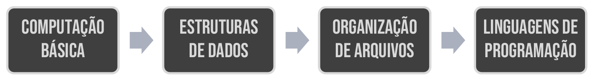
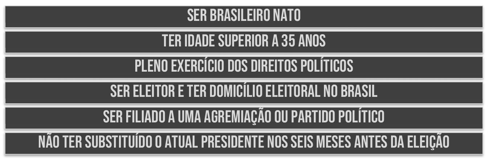
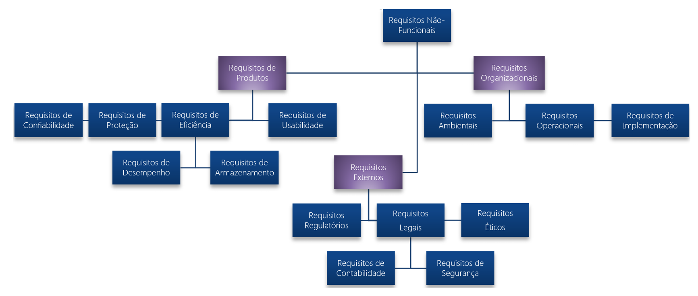

# Capítulo 33 – Requisitos de Software

Para iniciarmos nossa jornada no universo dos requisitos de software, é útil darmos um passo atrás e entendermos o significado da própria palavra. O que significa o verbo “requisitar”? De acordo com o dicionário, requisitar é o ato de pedir ou requerer algo de modo oficial ou formal; é solicitar ou exigir uma condição. Daí deriva o substantivo **requisito**: aquilo que é necessário e indispensável para que algo aconteça ou exista.

Embora pareça um conceito simples, ele está presente em inúmeras situações do nosso cotidiano, muito além da tecnologia. Vamos analisar alguns exemplos para solidificar essa ideia.

Imagine o início de um semestre na universidade, no momento de realizar a matrícula nas disciplinas. Em um curso de graduação em Ciência da Computação, por exemplo, existe um fluxo lógico que deve ser seguido.

  

No currículo do curso, ter sido aprovado na disciplina de "Computação Básica" é um **requisito** para poder cursar "Estrutura de Dados". Da mesma forma, "Estrutura de Dados" é um pré-requisito para "Organização de Arquivos", que, por sua vez, é requisito para "Linguagens de Programação". Se você é um estudante no primeiro semestre, não pode simplesmente se matricular em "Organização de Arquivos", pois existe uma cadeia de exigências que precisa ser satisfeita primeiro. Cada matéria é uma condição indispensável para a próxima.

Vamos para outro exemplo, agora na esfera jurídica. Suponha que alguém decida se candidatar à Presidência da República. Não basta apenas ter a vontade; é necessário cumprir uma série de requisitos formais para que a candidatura seja aceita.

  

Para ser candidato, é preciso: ser brasileiro nato; ter idade mínima de trinta e cinco anos; estar em pleno exercício dos direitos políticos; ser eleitor e ter domicílio eleitoral no Brasil; ser filiado a um partido político; e não ter substituído o presidente em exercício nos seis meses anteriores à eleição. Somente após satisfazer todas essas condições é que a pessoa estará apta a concorrer.

Como vimos, o conceito de requisito é bastante intuitivo. No contexto da Engenharia, ele costuma ser definido como uma **propriedade ou um comportamento que um produto ou serviço deve atender**. Trazendo para a nossa área, a Engenharia de Software, um requisito é uma **condição que deve ser satisfeita para se alcançar um objetivo**, ou uma **qualidade que o sistema deve prover para ser útil e valioso para seus usuários**. É a partir dos requisitos que todo o processo de desenvolvimento de software se inicia e se guia.

## Classificações dos Requisitos de Software

Existem diversas maneiras de classificar os requisitos, cada uma oferecendo uma perspectiva diferente sobre suas características e finalidades. Compreender essas classificações é fundamental para analisá-los, documentá-los e gerenciá-los de forma eficaz. A seguir, veremos as principais abordagens.

### Quanto ao Nível de Abstração

Uma das primeiras formas de classificar requisitos leva em conta o seu **nível de abstração**. Em resumo, abstrair é o ato de subtrair detalhes para focar no essencial. Logo, algo muito abstrato é pouco detalhado, enquanto algo pouco abstrato é bastante detalhado. Essa distinção é crucial, pois os requisitos são lidos por públicos diferentes, com necessidades de informação distintas.

Nessa perspectiva, os requisitos se dividem em:

- **Requisitos de Usuário:** São descrições de alto nível, geralmente escritas em linguagem natural e apoiadas por diagramas simples, que definem quais serviços o sistema deve fornecer e sob quais restrições gerais ele deve operar. O foco aqui é o **"o quê"** do ponto de vista do usuário final, sem entrar em detalhes técnicos de implementação. São feitos para serem lidos e validados por pessoas leigas, como clientes e usuários, que não precisam entender de tecnologia.
    - **Exemplo:** “O sistema deve gerar um relatório de acompanhamento mensal das vendas e enviá-lo automaticamente para os gerentes por e-mail.” Note que a descrição é clara, direta e foca na necessidade do negócio, sem especificar como o relatório será gerado, qual o formato ou qual tecnologia de e-mail será usada.
- **Requisitos de Sistema:** São descrições detalhadas e estruturadas sobre as funções, operações e restrições do sistema. Eles servem como um contrato técnico entre o cliente e o desenvolvedor, definindo exatamente o que deve ser implementado. Possuem baixo nível de abstração, são ricos em detalhes e direcionados à equipe técnica (desenvolvedores, testadores, arquitetos).
    - **Exemplo:** “O sistema deve gerar o relatório de vendas em formato PDF, consolidando os dados a partir de views materializadas no banco de dados multidimensional. O envio deve ser feito via protocolo SMTP, utilizando o servidor corporativo, para a lista de e-mails cadastrada no perfil ‘Gerentes’.” Aqui, os detalhes técnicos são explícitos e fornecem um guia claro para a implementação.

Essa separação não existe para complicar, mas sim para facilitar a comunicação. Ao escrever requisitos, é vital considerar quem serão seus leitores. Usuários e gestores não se importam com os detalhes de implementação; eles querem saber se o sistema resolverá seus problemas. Já os programadores necessitam de especificações precisas para construir o software corretamente.

### Quanto a Qualidade e Satisfação do Cliente

Outra forma interessante de classificar requisitos é pelo impacto que eles causam na satisfação do cliente. Essa abordagem é inspirada no **Quality Function Deployment (QFD)**, uma técnica de gestão da qualidade que busca traduzir as necessidades do cliente (a "voz do cliente") em requisitos técnicos, com o objetivo de maximizar sua satisfação.

O QFD nos ajuda a entender que nem todos os requisitos têm o mesmo peso emocional para o cliente. Alguns são básicos, outros são desejados e há aqueles que podem encantar.

- **Requisitos Normais:** Refletem os objetivos e metas que foram explicitamente discutidos e estabelecidos para o produto durante as conversas com o cliente. Se esses requisitos estiverem presentes e bem implementados, o cliente ficará satisfeito. São as funcionalidades que o cliente pede e espera receber.
    - **Exemplo:** Em um sistema para uma biblioteca, requisitos como "permitir o cadastro de novos livros" ou "permitir a busca de um livro pelo seu título" são considerados normais. São as funções essenciais que justificam a existência do sistema.
- **Requisitos Esperados:** São requisitos tão fundamentais e óbvios para o funcionamento do produto que o cliente muitas vezes nem se dá ao trabalho de mencioná-los. Ele simplesmente assume que estarão lá. A presença deles não gera satisfação extra (pois são o mínimo esperado), mas a sua ausência causa uma enorme insatisfação.
    - **Exemplo:** Continuando com o sistema da biblioteca, após buscar um livro por título, o usuário não espera apenas uma mensagem dizendo "10 livros encontrados". Ele **espera** ver uma lista com os livros que foram encontrados. O sistema apresentar essa lista é um requisito esperado. Se isso não acontecer, o cliente ficará frustrado, mesmo que nunca tenha pedido explicitamente por uma "listagem de resultados da busca".
- **Requisitos Fascinantes (ou "Delighters"):** São recursos ou características que vão além das expectativas do cliente. São as "cerejas do bolo", funcionalidades inovadoras que o cliente não pediu e talvez nem imaginasse que fossem possíveis, mas que, quando presentes, geram um grande encantamento e satisfação.
    - **Exemplo:** No sistema da biblioteca, o programador decide ir além. Além de todas as funcionalidades normais e esperadas, ele implementa o sistema com total suporte a tecnologias assistivas. Isso inclui um leitor de tela integrado para usuários com deficiência visual e navegação otimizada por teclado. O cliente não pediu por isso, mas ao ver a funcionalidade, fica fascinado com o cuidado e a inclusão, o que agrega um valor imenso ao produto.

### Quanto a Evolução

Requisitos não são estáticos; eles mudam ao longo do tempo. Essa classificação se baseia na probabilidade e na frequência com que eles podem sofrer alterações.

- **Requisitos Permanentes (ou Estáveis):** São requisitos diretamente ligados à atividade principal da organização ou ao domínio do problema. Eles representam a essência do sistema e tendem a mudar muito lentamente. Sendo que muitos profissionais também se referem a eles como **"estáveis"**, pois "permanentes" dá a falsa impressão de que nunca mudam, e sabemos que todo requisito pode, eventualmente, mudar.
    - **Exemplo:** Em um sistema para a Bolsa de Valores, é natural que sempre existam requisitos relacionados à negociação de ações, visualização de cotações, cálculo de índices, etc. Mesmo que um sistema completamente novo seja construído daqui a vinte anos, a essência do negócio da Bolsa permanecerá, e esses requisitos continuarão sendo centrais, ainda que com tecnologias e detalhes diferentes.
- **Requisitos Voláteis (ou Instáveis):** São requisitos mais específicos a um contexto, a um cliente particular ou a um ambiente que está em constante mudança. São muito mais propensos a sofrer alterações durante o desenvolvimento ou mesmo após a implantação do sistema. Eles podem ser subclassificados:
    - **Mutáveis:** Requisitos que se modificam devido a mudanças no ambiente externo. Um exemplo clássico são os requisitos de um sistema fiscal no Brasil, que precisam ser constantemente atualizados para se adequar às novas leis tributárias.
    - **Emergentes:** Requisitos que não podem ser completamente definidos no início do projeto, pois emergem à medida que o cliente e a equipe aprofundam seu entendimento sobre o sistema. Geralmente, surgem durante o processo de desenvolvimento, a partir de feedbacks e novos insights.
    - **Consequentes:** São requisitos que surgem como consequência do uso do sistema. Ao interagir com o software, o usuário percebe novas necessidades ou formas melhores de realizar uma tarefa.
    - **De Compatibilidade:** Requisitos que dependem de outros sistemas, processos ou hardwares. Se esses elementos externos mudam, o requisito precisa ser alterado para manter a compatibilidade.

### Quanto a Funcionalidade

De todas as formas de classificar requisitos, a mais tradicional, importante e frequentemente utilizada é, sem sombra de dúvidas, a distinção entre requisitos funcionais e não funcionais.

**Requisitos Funcionais (RFs):** Descrevem **o que o sistema deve fazer**. São declarações sobre os serviços, as ações e as funcionalidades que o sistema deve fornecer para atingir seus objetivos. Eles definem como o sistema deve reagir a entradas específicas e como deve se comportar em determinadas situações.

|**Requisitos Funcionais**|
| --- |
| Declarações de serviços que o sistema deve fornecer. |
| Como o sistema deve reagir a entradas específicas. |
| Como o sistema deve se comportar em determinadas situações. |
| Podem estabelecer explicitamente o que o sistema **não deve** fazer. |
| Podem ser descritos inicialmente como requisitos de usuário (abstratos). |
| Para a implementação, devem ser detalhados com entradas, saídas, exceções, etc. |
| Em princípio, sua especificação deve ser **completa** e **consistente**. |

**Problemas Comuns:** A especificação de requisitos funcionais pode ser desafiadora. É comum encontrar **ambiguidade** (permitindo múltiplas interpretações), **incompletude** (não descrevendo toda a funcionalidade) e **inconsistência** (entrando em contradição com outros requisitos).

**Exemplos de Requisitos Funcionais:**

- **Outlook**: "O sistema deverá fornecer uma opção para o usuário filtrar e-mails por 'Assunto' e 'Presença de Anexos'."
- **YouTube**: "O sistema deverá reagir com a suspensão de vídeos que comprovadamente violem direitos autorais, após notificação."
- **Google Maps**: "Caso não encontre o endereço exato pesquisado, o sistema deverá procurar e sugerir a rua mais próxima."

**Requisitos Não-Funcionais (RNFs):** Descrevem **como o sistema deve ser** ou operar. São restrições ou qualidades sobre as quais o sistema deve funcionar. Não estão ligados a uma função específica, mas sim a atributos gerais como desempenho, segurança, usabilidade, confiabilidade, etc. Muitas vezes, os RNFs são mais críticos que os próprios RFs. Um sistema que faz tudo o que deveria, mas é extremamente lento ou inseguro, é um sistema inútil.

|**Requisitos Não Funcionais**|
| --- |
| Definem restrições e qualidades globais que afetam a arquitetura técnica do sistema. |
| Não se preocupam diretamente com as funções, mas sim com os **atributos** do sistema. |
| Incluem características como confiabilidade, segurança, usabilidade, desempenho, etc. |
| Devem ser, sempre que possível, **verificáveis** e **mensuráveis**. |

**Problemas Comuns:** RNFs são difíceis de especificar objetivamente. Dizer "o sistema deve ser rápido" é vago. O ideal é usar medidas testáveis, como "o sistema deve responder a 95% das requisições em menos de 2 segundos". Outro problema comum são os **conflitos** entre RNFs. Por exemplo, um cliente pode desejar um desempenho altíssimo (que exige hardware caro) e, ao mesmo tempo, um baixo custo de infraestrutura.

**Exemplos de Requisitos Não Funcionais:**

- **WhatsApp (Disponibilidade)**: "O sistema deverá fornecer uma disponibilidade mínima de 99,8% durante o horário comercial."
- **Facebook (Implementação)**: "O sistema deverá ser desenvolvido utilizando a linguagem de programação Java e o framework Spring."
- **Android (Desempenho)**: "O sistema operacional deverá ser capaz de rodar de forma fluida em dispositivos com apenas 1GB de memória RAM."

**Requisitos de Domínio:** São requisitos derivados do domínio da aplicação, refletindo regras, leis ou características específicas daquela área de negócio. Eles podem ser tanto funcionais quanto não funcionais. O não cumprimento de um requisito de domínio pode inviabilizar o sistema. Por exemplo, um software de aviação que não atende aos rigorosos requisitos de confiabilidade da agência reguladora simplesmente não será certificado para voo.

**Problemas Comuns:** Especialistas de domínio frequentemente usam jargões técnicos de sua área e podem omitir detalhes que consideram óbvios, dificultando o entendimento pela equipe de desenvolvimento.

**Exemplos de Requisitos de Domínio:**

- **Sistema Acadêmico (USP)**: "O sistema deverá calcular a nota final da prova de mestrado segundo a fórmula `(1.74*N1 + 3.17*N2 + 2.59*N3) / 3 * IRA(Aluno)`."
- **Sistema Financeiro (STN)**: "O sistema deverá calcular o valor de resgate de um Título Público NTN-B multiplicando seu valor de face pelo VNA do dia e aplicando a taxa Selic acumulada do período."
- **Sistema Aeroespacial (NASA)**: "O sistema de imagem deverá operar com uma câmera 4K captando espectro infravermelho e ser resistente a variações de temperatura de -50°C a 120°C."

De acordo com o renomado autor Ian Sommerville, a distinção entre esses tipos de requisitos nem sempre é tão clara na prática. Um requisito que parece não funcional, como "o sistema deve ser seguro", pode se desdobrar em vários requisitos funcionais, como "o sistema deve exigir autenticação de dois fatores para acesso administrativo". A distinção, portanto, é muitas vezes uma ferramenta de análise, mas na realidade os requisitos estão interligados.

### Aprofundando nos Requisitos Não-Funcionais

Para organizar melhor a vasta gama de requisitos não-funcionais, podemos subclassificá-los de acordo com sua origem. Essa visão nos ajuda a entender de onde vêm as restrições e qualidades que o sistema deve atender.

  

- **Requisitos de Produto:** Especificam o comportamento e as qualidades do próprio produto. Incluem:
    - **Usabilidade:** Facilidade com que os usuários podem aprender e operar o sistema.
    - **Eficiência:** Relacionado a desempenho (tempo de resposta) e espaço (uso de memória, disco).
    - **Confiabilidade:** Frequência de falhas e capacidade de recuperação.
    - **Segurança (Protection/Security):** Proteção contra acesso não autorizado e ataques.
    - **Portabilidade:** Facilidade de transferir o software para outros ambientes.
- **Requisitos Organizacionais:** Derivam de políticas, padrões e procedimentos da organização do cliente ou do desenvolvedor. Incluem:
    - **Entrega:** Prazos e formatos de entrega do software e da documentação.
    - **Implementação:** Restrições sobre as tecnologias a serem usadas (ex: "deve ser em Java", "deve rodar em Linux").
    - **Padrões:** Conformidade com padrões de codificação, de interface ou de processo definidos pela empresa.
- **Requisitos Externos:** Originam-se de fatores externos ao sistema e à organização. Incluem:
    - **Interoperabilidade:** Capacidade do sistema de interagir e trocar dados com outros sistemas externos. **Importante:** Embora pareça um requisito de produto, a interoperabilidade é classificada como externa porque depende de padrões e interfaces que estão fora do controle da equipe.
    - **Éticos:** Garantir que o sistema opere de forma justa e moralmente aceitável, protegendo a privacidade e evitando vieses.
    - **Legais:** Conformidade com leis e regulamentações (ex: leis de proteção de dados como a LGPD, regulamentos fiscais).

Para finalizar, vejamos exemplos concretos de alguns desses requisitos não funcionais:

|**Requisito Não Funcional**|**Exemplo Concreto**|
|---|---|
|**Requisito de Confiabilidade**|"O sistema de e-commerce não deve ficar indisponível por mais de cinco segundos consecutivos durante o horário comercial."|
|**Requisito de Proteção**|"O sistema não deve permitir que usuários comuns modifiquem as permissões de acesso de outros usuários."|
|**Requisito de Desempenho**|"O sistema de busca deverá ser capaz de processar oitocentas consultas por segundo com um tempo de resposta médio inferior a 500ms."|
|**Requisito de Espaço**|"O aplicativo móvel, após instalado, deverá ocupar no máximo 80MB da memória interna do dispositivo."|
|**Requisito de Usabilidade**|"Novos usuários deverão ser capazes de realizar uma compra completa no sistema após, no máximo, 2 horas de treinamento."|
|**Requisito de Segurança (Safety)**|"O sistema de controle de tráfego aéreo não deve permitir a ativação simultânea de mais de três alertas de colisão em um mesmo setor."|
|**Requisito Ético**|"O sistema de recomendação não utilizará dados de saúde do usuário para sugerir produtos, a menos que haja consentimento explícito."|
|**Requisito de Implementação**|"A interface de usuário do portal web deve ser implementada utilizando a biblioteca React e não deve utilizar Applets Java."|

## Considerações Finais

Neste capítulo, exploramos o conceito fundamental de **requisitos de software**, a pedra angular sobre a qual todo projeto de tecnologia é construído. Vimos que um requisito, em sua essência, é uma condição ou capacidade necessária que um sistema deve possuir para entregar valor e atender aos seus objetivos.

Compreendemos que os requisitos não são monolíticos; eles podem ser classificados de diversas maneiras para facilitar sua análise e gestão. A distinção entre **requisitos de usuário** (abstratos) e **requisitos de sistema** (detalhados) nos ajuda a comunicar eficazmente com diferentes públicos. A perspectiva do **QFD** nos ensina a diferenciar entre requisitos **normais, esperados e fascinantes**, focando naquilo que verdadeiramente importa para a satisfação do cliente. A análise da **evolução** nos prepara para lidar com requisitos **estáveis** e, principalmente, com os **voláteis**, que são uma constante em projetos dinâmicos.

Acima de tudo, solidificamos o entendimento da classificação mais crucial: a que separa **requisitos funcionais** (o que o sistema faz) de **requisitos não funcionais** (como o sistema é ou se comporta). Enquanto os primeiros definem as funcionalidades, são os últimos que frequentemente determinam o sucesso ou o fracasso de um sistema no mundo real, ditando sua qualidade, desempenho, segurança e usabilidade.

A correta identificação, documentação e gerenciamento dos diferentes tipos de requisitos são habilidades essenciais para qualquer profissional de engenharia de software. Ignorá-los ou tratá-los de forma superficial é a receita para projetos que estouram o orçamento, atrasam e, no final, não entregam o valor esperado. Dominar a arte e a ciência dos requisitos é o primeiro passo para a construção de software robusto, útil e de alta qualidade.