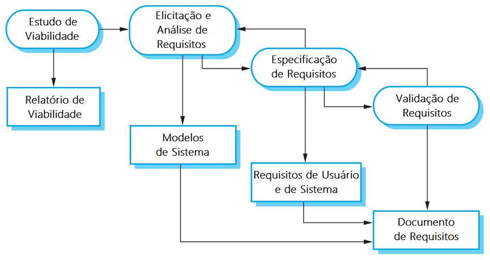
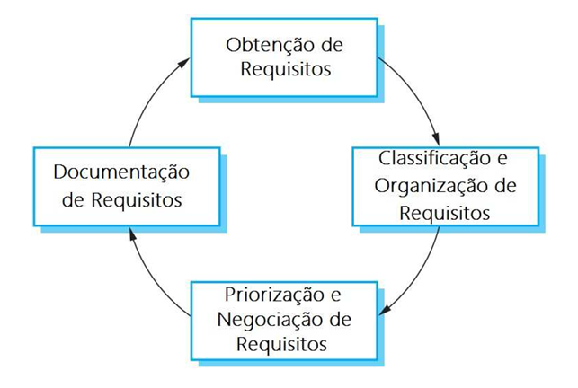

# Capítulo 34 – Engenharia de Requisitos: A Disciplina de Construir o Software Certo

## O que é Engenharia de Requisitos?

Para compreender a essência da Engenharia de Requisitos, é útil darmos um passo para trás e olharmos para o termo "Engenharia". O que é a Engenharia Civil? É o processo formal, baseado em princípios da física e da matemática, para a concepção, projeto, construção e manutenção de infraestruturas como pontes, edifícios e estradas. E a Engenharia Mecânica? É o processo formal para a concepção, análise, fabricação e manutenção de sistemas mecânicos, desde motores a turbinas. A palavra-chave em comum, que define a própria natureza da disciplina e a distingue de uma atividade puramente artesanal, é **processo formal**.

Sempre que a palavra "engenharia" aparece, podemos inferir que se trata de uma abordagem sistemática, metodológica, processual e repetível. Isso significa que, ao seguir um processo de engenharia, os resultados tendem a ser consistentes, previsíveis e de qualidade controlada. Um carro projetado e fabricado no México, seguindo os mesmos processos de engenharia, terá um resultado muito semelhante a um carro fabricado na Holanda. A engenharia busca transformar a arte de criar em uma ciência de construir.

Trazendo essa lógica para o nosso campo, o que é, então, a **Engenharia de Software**? É a aplicação de uma abordagem sistemática, disciplinada e quantificável para o desenvolvimento, operação e manutenção de software. E dentro dela, como uma de suas fundações mais críticas, reside a **Engenharia de Requisitos (ER)**.

A Engenharia de Requisitos pode ser definida como uma **abordagem sistemática para a formulação, análise, documentação e manutenção dos requisitos de um sistema**. Em outras palavras, é o processo formal que engloba todas as atividades que contribuem para a produção de um **documento de requisitos**, que servirá como a base, o alicerce, para todo o desenvolvimento subsequente.

O termo em si, embora utilizado tecnicamente desde a década de 70 em relatórios internos de empresas como a TRW Inc., só ganhou notoriedade e se consolidou como uma disciplina distinta na comunidade de software nos anos 90, com a publicação de tutoriais pela IEEE e a criação de conferências internacionais dedicadas exclusivamente ao tema. Essa formalização não foi um mero capricho acadêmico, mas uma resposta direta e necessária a um dos maiores, mais persistentes e mais caros problemas da indústria de software.

### A Importância Crítica da Engenharia de Requisitos

A fase de requisitos é, sem dúvida, a mais crítica em todo o ciclo de vida do desenvolvimento de software. Erros cometidos neste estágio inicial não apenas se propagam, mas se amplificam de forma exponencial, conduzindo inevitavelmente a problemas graves e custosos nas fases de projeto, implementação e teste. Como disse o lendário engenheiro de software da IBM e autor do livro "The Mythical Man-Month", Fred Brooks, em uma citação que ecoa até hoje:

> “A parte mais árdua na construção de um sistema de software consiste em decidir o que construir! Nenhuma outra fase do processo de desenvolvimento compromete tanto o resultado final do sistema se feita errada e nenhuma outra dificulta tanto as correções posteriores.”

Dados da indústria reforçam essa visão de forma contundente. Um estudo clássico (MIRANDA, 2002 apud SANTOS, 2007) revelou dados alarmantes que continuam relevantes:

- **50% dos principais defeitos** de software são oriundos da fase de especificação de requisitos.
- **12% das principais causas de fracassos** em projetos de software são devidos a requisitos incompletos.
- Por outro lado, **12% das principais causas de sucesso** em projetos são atribuídas a requisitos consistentes e bem definidos.

Mas se é tão importante, a solução não seria simples? Bastaria contratar um bom engenheiro de requisitos, ele vai até a organização, levanta as necessidades e pronto, problema resolvido. A realidade é muito mais complexa e cheia de nuances.

O processo de descobrir o que um sistema deve fazer é um campo minado de desafios de comunicação, interpretação e psicologia humana. Usuários, muitas vezes, não conseguem expressar claramente o que desejam. Outras vezes, um mesmo usuário solicita requisitos que são completamente contraditórios, sem perceber a inconsistência lógica. Em organizações grandes, diferentes departamentos podem ter visões conflitantes sobre o mesmo produto, gerando disputas políticas que se refletem diretamente nos requisitos.

Além disso, a própria organização pode não ter processos de negócio maduros e bem definidos, fazendo com que os requisitos mudem no meio do caminho simplesmente porque o modo de trabalho está sendo inventado ao mesmo tempo que o software que deveria apoiá-lo. É para navegar nesse cenário caótico que a Engenharia de Requisitos existe, oferecendo um conjunto de ferramentas, técnicas e processos para mitigar esses problemas.

Mesmo com a melhor das metodologias, é praticamente impossível satisfazer absolutamente todas as expectativas de todos os clientes. Requisitos são entidades vivas; eles mudam porque as pessoas desenvolvem uma melhor compreensão do que querem à medida que veem o sistema tomar forma, a organização muda suas prioridades, a tecnologia evolui e o mercado se transforma. O objetivo da Engenharia de Requisitos não é criar uma especificação imutável e perfeita, mas sim encontrar a melhor solução viável no momento e fornecer um mecanismo robusto para gerenciar essa evolução de forma controlada e inteligente.

## O Processo de Engenharia de Requisitos

A Engenharia de Requisitos é um processo estruturado, composto por um conjunto de fases interligadas. Agora, uma pergunta importante: quais são as fases desse processo? Existe uma divergência entre os principais autores da área. É instrutivo aprofundar no modelo de **Ian Sommerville**, um dos autores mais renomados nesse quesito, mas também é válido conhecer o modelo de **Roger Pressman**, que oferece uma visão ligeiramente diferente e mais granular.

O modelo de Pressman divide o processo em sete fases, com um foco muito claro na sequência de atividades que um engenheiro de requisitos executa:

|Fases (Modelo de Pressman)|Descrição Detalhada da Atividade|
|---|---|
|**Concepção**|Após uma necessidade de negócio ser identificada, esta fase busca estabelecer um entendimento básico e de alto nível do problema. É o ponto de partida, onde se responde a perguntas como: "Qual problema estamos tentando resolver?", "Quem são os principais envolvidos (stakeholders)?", "Qual é a natureza da solução que imaginamos?". O objetivo é iniciar o processo de comunicação entre clientes e a equipe técnica, definindo os contornos gerais do projeto.|
|**Levantamento**|Esta é uma etapa crítica que utiliza uma abordagem organizada para descobrir o que o cliente deseja em seu sistema. Envolve intensa participação dos stakeholders e busca responder a três perguntas fundamentais: Qual o objetivo do produto? Como o produto se enquadra nas necessidades estratégicas do negócio? Como o produto será utilizado no dia a dia pelos usuários finais?|
|**Elaboração**|Por vezes chamada de Análise, esta fase pega as informações brutas obtidas do cliente durante a concepção e o levantamento e as expande, refina e estrutura em um modelo. O objetivo é definir o domínio do problema de forma mais precisa, incluindo modelagens de cenários de interação do usuário com o sistema (casos de uso) e modelagens das entidades de negócio envolvidas (classes).|
|**Negociação**|Esta fase tem o objetivo claro de chegar a um consenso sobre os conflitos entre clientes e usuários. Por meio de um processo de negociação, os requisitos são avaliados em conjunto, discutidos e priorizados. Alguns requisitos podem ser combinados, outros excluídos, e novos podem surgir a partir da discussão. O objetivo é equilibrar as expectativas com as restrições de custo, prazo e tecnologia.|
|**Especificação**|Também chamada de Documentação, esta fase gera o produto final do engenheiro de requisitos. O resultado pode ser um documento de texto, um conjunto de modelos gráficos, cenários de uso detalhados, protótipos interativos, etc. Trata-se da apresentação formal e não ambígua dos dados obtidos até o momento, de modo que possa guiar o desenvolvimento futuro do software de forma confiável.|
|**Validação**|Os produtos de trabalho resultantes da engenharia de requisitos (como o documento de especificação) são avaliados quanto à sua qualidade por todos os envolvidos. O foco é buscar erros de interpretação, ambiguidades, omissões, inconsistências e garantir que o que foi especificado é realmente o que o cliente precisa.|
|**Gestão**|Esta não é uma fase sequencial, mas um conjunto de atividades contínuas que auxiliam a equipe do projeto a identificar, controlar e rastrear requisitos e as mudanças que ocorrem neles a qualquer momento. Para projetos de grande porte, é uma fase essencial, na medida em que a mudança em um requisito pode afetar dezenas de outros.|

Após essa visão, é possível seguir para as fases de acordo com o Sommerville, que oferece um modelo mais cíclico e interativo.

A tabela abaixo compara os dois modelos, mostrando como as atividades se relacionam:

|**Fases segundo Sommerville**|**Fases segundo Pressman**|
|---|---|
|Estudo de viabilidade|Concepção|
|Elicitação e análise de requisitos|- (Engloba as atividades abaixo)|
|_Obtenção de requisitos_|_Levantamento_|
|_Classificação e organização_|_Elaboração_|
|_Priorização e negociação_|_Negociação_|
|_Documentação de requisitos_|_Especificação_|
|Especificação de Requisitos|Especificação|
|Validação de Requisitos|Validação|
|Gerenciamento de Requisitos|Gestão|

A imagem a seguir apresenta graficamente as fases da Engenharia de Requisitos de acordo com Sommerville. São elas: Estudo de Viabilidade, Elicitação e Análise de Requisitos, Especificação de Requisitos e Validação de Requisitos. Por fim, há uma última atividade que não está representada como uma fase sequencial, mas que envolve e suporta todas as anteriores e também é de suma importância: a Gestão de Requisitos.

  

Sommerville afirma que o objetivo da engenharia de requisitos é criar e manter um documento de requisitos de sistema. Assim, nota-se que cada fase gera um artefato que serve de insumo para a próxima: o resultado do Estudo de Viabilidade é o **Relatório de Viabilidade**; o da Elicitação e Análise de Requisitos é um conjunto de **Modelos do Sistema**; o da Especificação de Requisitos são os **Requisitos de Usuário e de Sistema**; e o da Validação de Requisitos é, finalmente, o **Documento de Requisitos** validado.

Além disso, as setas no diagrama que vão e voltam entre as fases reforçam a natureza iterativa do processo. No momento de validar os requisitos, por exemplo, se algo incorreto for encontrado, é possível (e necessário) retornar à fase de Especificação ou mesmo de Elicitação para corrigir o problema. A seguir, um detalhamento de cada uma dessas fases.

### Fase 1: Estudo de Viabilidade

Toda grande jornada começa com um primeiro passo. Na Engenharia de Requisitos, esse passo é o **Estudo de Viabilidade**. Trata-se de uma avaliação relativamente rápida e de baixo custo, realizada no início do processo, para determinar se vale a pena prosseguir com o desenvolvimento do sistema proposto. O resultado dessa avaliação fornece informações cruciais para que a alta gestão da organização tome uma decisão embasada de "go/no-go" (vamos em frente ou não).

Este é o momento de fazer perguntas difíceis e estratégicas:

- O sistema realmente agregará valor ao negócio?
- Qual é o retorno sobre o investimento (ROI) esperado?
- É viável construir este sistema com a tecnologia atual, dentro do orçamento e do prazo disponíveis?

Imagine um sistema de software que automatiza algum processo de negócio de uma organização, mas que custa R$ 10 milhões para implementar e economiza apenas R$ 5.000/mês. Um estudo de viabilidade rapidamente apontaria que o projeto, como proposto, não é financeiramente sensato.

O estudo deve ser curto, focado e, preferencialmente, barato. Se ele se tornar muito longo ou caro, perde seu propósito. Ao final, ele deve responder a três questões fundamentais. Se a resposta para qualquer uma delas for "não", o projeto provavelmente não deve seguir adiante:

1. **O sistema contribui para os objetivos gerais da organização?** (Alinhamento estratégico)
2. **O sistema pode ser implementado com tecnologia atual e dentro do custo e prazo?** (Viabilidade técnica e financeira)
3. **O sistema pode ser integrado a outros sistemas já implantados?** (Viabilidade operacional)

As respostas para essas três questões não é algo tão simples de ser obtido, visto que geralmente a empresa não tem a exata definição de seus objetivos. Para ajudar nesta definição, questões podem ser levantadas às partes interessadas e, com as respostas em mãos, pode-se concluir se o desenvolvimento do sistema deve prosseguir ou não; pode-se propor alterações de escopo, orçamento, prazo; etc. Segue uma lista de questionamentos possíveis:

1. Se o sistema não fosse implementado, qual seria o rumo da organização?
2. Quais são as falhas dos processos atuais e quais soluções o novo sistema traria?
3. Quanto aos objetivos e requisitos, qual a contribuição direta do novo sistema?
4. Existe a possibilidade de integração com outros sistemas?
5. Quais das tecnologias serão novas?
6. O que o novo sistema irá apoiar?

### Fase 2: Elicitação e Análise de Requisitos

Uma vez que o projeto é considerado viável, inicia-se a fase de **Elicitação e Análise**. O verbo "elicitar" não é muito utilizado no cotidiano, mas significa o mesmo que descobrir, identificar, deduzir, extrair, evocar, obter informações sobre uma questão específica. É aqui que os engenheiros de software trabalham intensamente com clientes e usuários finais do sistema para aprender sobre o domínio da aplicação, quais serviços o sistema deve fornecer, o desempenho esperado, restrições de hardware, entre outros quesitos.

Esta é, talvez, a fase mais desafiadora, pois lida diretamente com a complexidade da comunicação humana. Uma das figuras mais clássicas da engenharia de software ilustra perfeitamente este desafio: o cliente explica o que quer de uma forma, o líder de projeto entende de outra, o analista projeta uma terceira, o programador codifica uma quarta, e no final, o que o cliente realmente precisava era algo completamente diferente.

Às vezes, os próprios clientes não sabem o que querem; às vezes, eles querem automatizar um processo que ainda não está efetivamente maduro; às vezes, eles esquecem de mencionar um requisito bastante importante porque para eles era óbvio para a área de tecnologia não era. Enfim... a engenharia de requisitos está aqui para ajudar a descobrir requisitos implícitos, contraditórios, inconsistentes, incompletos, entre outros.

Este processo é composto por quatro atividades principais:

  

a. **Obtenção de Requisitos:** processo de interação com os stakeholders para coletar requisitos. Os requisitos de domínio também são descobertos durante essa atividade.
b. **Classificação e organização de requisitos:** esta atividade envolve a coleção de requisitos não estruturados, agrupa os requisitos relacionados e os organiza em conjuntos coerentes.
c. **Priorização e negociação de requisitos:** inevitavelmente, os requisitos serão conflitantes. Assim, busca-se priorizar os requisitos e resolver conflitos por meio da negociação.
d. **Documentação de requisitos:** os requisitos são documentados e colocados na próxima volta da espiral. Podem ser produzidos documentos de requisitos formais ou informais.

#### Técnicas de Elicitação de Requisitos

Para assegurar uma cobertura ampla dos requisitos, os analistas dispõem de uma vasta caixa de ferramentas. A escolha da técnica certa depende do contexto do projeto, do tipo de stakeholder e da natureza da informação desejada. A seguir, detalhamos as principais.

##### Entrevistas

As entrevistas são, talvez, a técnica mais fundamental e universalmente utilizada. Consistem em conversas, formais ou informais, entre a equipe de engenharia de requisitos e os stakeholders (usuários, clientes, gestores) para obter informações sobre o sistema atual e o sistema a ser desenvolvido. Elas podem ser:

- **Entrevistas Abertas:** Não seguem um roteiro rígido. São exploratórias e permitem que o entrevistado fale livremente sobre seu trabalho e suas necessidades. São ótimas para a fase inicial, para obter um entendimento geral do contexto.
- **Entrevistas Fechadas:** Seguem um conjunto predefinido de perguntas. São mais eficientes para obter respostas específicas e confirmar informações já levantadas.
- **Estruturas Formais:** Existem modelos para estruturar a condução da entrevista, como a estrutura em **Funil** (começa com perguntas genéricas e afunila para detalhes específicos), em **Pirâmide** (o oposto, começando com detalhes e expandindo para o geral) e em **Diamante** (uma combinação das duas).

As principais vantagens e desvantagens são:

- **Vantagens:** As pessoas geralmente gostam de falar sobre seu trabalho, o que torna as entrevistas uma forma eficaz de construir relacionamento e obter uma visão geral das operações e dificuldades dos usuários.
- **Desvantagens:** Não são ideais para descobrir requisitos de domínio muito técnicos (que o usuário pode não saber articular) ou questões políticas e organizacionais sensíveis, que as pessoas tendem a evitar em conversas diretas.

##### Etnografia

A etnografia é uma técnica de observação poderosa, emprestada da antropologia. O analista de requisitos se insere no ambiente de trabalho do usuário e observa suas atividades diárias "em seu habitat natural". O objetivo não é perguntar, mas **ver** o que as pessoas realmente fazem, em vez de confiar apenas no que elas dizem que fazem.

- **Valor Principal:** Seu maior valor está na descoberta de **requisitos implícitos**. São aquelas tarefas, atalhos e processos que os usuários realizam de forma tão automática que nem se lembram de mencioná-los em uma entrevista. A etnografia revela a diferença entre o processo formal (o que "deveria" ser feito) e o processo real (o que "é" feito).
- **Aplicação:** É frequentemente usada em conjunto com outras técnicas, pois a observação por si só pode não capturar as razões por trás das ações. Após observar um comportamento, o analista pode usar uma entrevista para questionar o porquê daquela ação específica.

##### Cenários

As pessoas têm mais facilidade em relatar exemplos concretos e narrativas do que em descrever regras de negócio abstratas. A técnica de cenários aproveita isso, usando descrições de exemplos de sessões de interação para detalhar os requisitos.

- **Como funciona:** Começa-se com um esboço de uma interação (ex: "o usuário compra um produto"). Durante as sessões de elicitação com os stakeholders, detalhes são adicionados a essa narrativa, descrevendo passo a passo o que acontece, quais informações são necessárias, quais as exceções possíveis, etc.
- **Formatos:** Os cenários podem ser capturados em texto, diagramas de fluxo, storyboards, ou, de forma mais estruturada, como **Casos de Uso** (uma técnica formal da UML) ou **Histórias de Usuário** (comum em métodos ágeis).

##### Questionários

São formulários com questões pré-definidas distribuídos a um grande número de stakeholders.

- **Quando usar:** São particularmente úteis quando é necessário coletar dados de um público amplo e geograficamente disperso, onde entrevistas individuais seriam inviáveis.
- **Vantagens:** Baixo custo, facilidade de aplicação e rápido retorno de dados quantitativos.
- **Desvantagens:** A falta de interação impede o aprofundamento das respostas. Perguntas mal formuladas podem levar a interpretações equivocadas e dados de baixa qualidade. É uma técnica de "mão única".

##### Workshop de Requisitos

São reuniões intensivas e estruturadas que reúnem um grupo cuidadosamente selecionado de stakeholders-chave e a equipe de analistas, sob a condução de um facilitador neutro.

- **Objetivo:** Obter um conjunto de requisitos bem definidos e consensuais em um curto período de tempo. A dinâmica colaborativa acelera a tomada de decisões e a resolução de conflitos.
- **Dinâmica:** O facilitador utiliza diversas técnicas, como brainstorming e interpretação de papéis, para manter o grupo engajado e produtivo. A presença de todos os decisores na mesma sala é um grande acelerador.

##### Brainstorming (Tempestade de Ideias)

Uma técnica de elicitação em grupo, realizada em um ambiente informal, onde o objetivo é gerar o maior número possível de ideias sobre um tópico, sem qualquer tipo de julgamento ou crítica. A regra de ouro é: "quantidade sobre qualidade" nesta fase. Todas as ideias, mesmo as mais "estranhas", são bem-vindas. Um facilitador organiza e, posteriormente, ajuda a priorizar os resultados.

##### Leitura de Documentos

Consiste na análise de documentos existentes na organização para extrair requisitos. Isso pode incluir manuais de sistemas legados, organogramas, políticas internas, relatórios de mercado, legislação pertinente, etc. É uma fonte valiosa de informações que são difíceis de obter por meio de interação direta.

#####  JAD (Joint Application Design)

Similar a um workshop, o JAD é uma metodologia registrada pela IBM que promove sessões colaborativas altamente estruturadas. Reúne usuários, executivos e desenvolvedores em workshops para definir e detalhar os requisitos de forma conjunta. É interativo e eficaz para promover o consenso e o engajamento de todos os envolvidos.

##### Prototipação

A prototipação na elicitação consiste em criar um modelo executável ou um esboço da aplicação (seja um protótipo de baixa fidelidade em papel ou um de alta fidelidade, interativo).

- **Finalidade:** É especialmente útil quando os usuários têm dificuldade em articular suas necessidades. Ao interagir com o protótipo, eles conseguem visualizar o sistema, o que desencadeia feedbacks muito mais concretos e ajuda a identificar requisitos que não surgiriam em uma conversa abstrata.

##### Reúso de Requisitos

Consiste no estudo e na reutilização de especificações e glossários de projetos anteriores, especialmente de sistemas legados ou da mesma família de produtos. Estudos mostram que sistemas similares podem reutilizar uma parcela significativa de seus requisitos, o que economiza tempo, reduz custos e diminui riscos, pois se baseia em um conhecimento já validado.

##### Histórias de Usuários

Popularizada pela metodologia XP, uma história de usuário é uma descrição informal e curta de uma funcionalidade, contada da perspectiva do usuário final. O formato padrão é: "Como um `<papel>`, eu quero `<objetivo>` para que `<benefício>`".

- **Exemplo:** "Como um **turista**, eu quero **alugar um equipamento de snorkel** para que **possa explorar o fundo do mar e ter uma experiência única**".
- **Critérios de Aceitação:** Cada história é acompanhada por critérios que definem as condições que devem ser satisfeitas para que a história seja considerada "pronta". Eles detalham o comportamento esperado e servem como base para os testes.

##### Participação Ativa de Usuários

Esta técnica vai além de entrevistar os usuários; ela os incorpora diretamente na equipe de desenvolvimento ou de requisitos. Embora exija um maior comprometimento e algum treinamento do usuário, permite um feedback contínuo e uma interação muito mais rica.

##### Encenação (Role-Playing)

O analista ou um facilitador "encena" uma situação de uso do futuro sistema para os stakeholders, que atuam como uma plateia. Eles observam e comentam sobre a encenação, ajudando a validar fluxos de trabalho e a identificar requisitos de interação.

##### Interpretação de Papéis

Similar à encenação, mas aqui os próprios stakeholders assumem papéis (por exemplo, "cliente", "atendente", "gerente") e interagem como se estivessem usando o sistema. Isso ajuda a descobrir responsabilidades e gargalos no processo.

##### Grupo Focal

Uma discussão em grupo, informal e reduzida (até 12 pessoas), guiada por um moderador, para obter informações qualitativas e profundas sobre um tópico específico. É útil para explorar percepções, atitudes e ideias de forma mais aprofundada do que um questionário permitiria.

##### Análise de Protocolos

Consiste em pedir a uma pessoa que execute uma tarefa enquanto verbaliza em voz alta todos os seus pensamentos, raciocínios e decisões. O analista grava e analisa esse "protocolo verbal" para entender os processos cognitivos e os modelos mentais do usuário.

##### Pontos de Vista (VORD)

A VORD (Viewpoint-Oriented Requirements Definition) é uma técnica que estrutura a elicitação reconhecendo que diferentes stakeholders têm diferentes pontos de vista sobre o sistema. Ela identifica esses pontos de vista e os utiliza como uma forma de descobrir, organizar e, principalmente, identificar conflitos entre os requisitos.

É possível se aprofundar bastante em cada uma dessas técnicas. No entanto, o importante é entender que um bom engenheiro de requisitos possui essa "caixa de ferramentas" e sabe combinar as técnicas mais adequadas para cada situação.

### Fase 3: Especificação de Requisitos

A fase de **Especificação de Requisitos** é a atividade de traduzir as informações coletadas, analisadas, organizadas e negociadas em um documento formal e estruturado. Este documento, frequentemente chamado de **Especificação de Requisitos de Software (ERS)**, representa o principal produto da engenharia de requisitos. Sua importância é tamanha que ele funciona como um **contrato** entre as partes: de um lado, o cliente (que o usa para entender e validar o que será construído) e, de outro, a equipe de desenvolvimento (que o usa como guia para o projeto e a implementação).

A documentação gerada na fase de elicitação era preliminar e servia principalmente para a comunicação interna da equipe de requisitos. Agora, o objetivo é criar um artefato robusto, que servirá de referência para todo o ciclo de vida do projeto. Para isso, o documento deve ser bilíngue, no sentido de que precisa se comunicar com dois públicos distintos:

- **Para o Cliente:** O documento deve conter os **Requisitos de Usuário**, descritos de forma clara e acessível, utilizando linguagem natural, tabelas simples, diagramas de fluxo, mockups ou qualquer outra representação visual que facilite a compreensão por parte de quem não tem conhecimento técnico. O foco aqui é no "o quê", nas características externas e no valor de negócio.
- **Para a Equipe Técnica:** O documento deve conter os **Requisitos de Sistema**, que são a extensão detalhada dos requisitos de usuário. Aqui, a linguagem é técnica e precisa, utilizando modelos formais, diagramas UML (como casos de uso e diagramas de classes), especificações de interfaces, algoritmos e regras de negócio detalhadas. O foco é no "como", servindo de base para o projeto da arquitetura e a codificação.

Idealmente, os requisitos especificados (tanto de usuário quanto de sistema) devem possuir um conjunto de qualidades essenciais:

- **Clareza e Não Ambiguidade:** Cada requisito deve ter uma única interpretação possível.
- **Completude:** O documento deve abranger todas as funcionalidades e restrições conhecidas.
- **Consistência:** Não devem existir requisitos contraditórios.
- **Compreensibilidade:** Deve ser fácil de ler e entender pelos seus respectivos públicos.
- **Verificabilidade:** Cada requisito deve ser escrito de forma que seja possível criar um teste para verificar se ele foi atendido.

Alcançar todas essas qualidades é um ideal. Na prática, é um desafio imenso. A linguagem natural é inerentemente ambígua, e diferentes stakeholders podem interpretar a mesma frase de maneiras distintas. Por isso, esta fase não é responsável por _verificar_ se todos esses atributos foram alcançados — esse é o papel da fase seguinte, a Validação. A responsabilidade da fase de Especificação é **escrever** o documento com a intenção de atingir essas qualidades, criando a melhor representação possível do sistema a ser construído.

Em resumo, a fase de Especificação de Requisitos gera o artefato central que descreve as funcionalidades e limitações do sistema, detalha suas entradas e saídas e serve como a única fonte da verdade para o que deve ser validado na próxima fase.

### Fase 4: Validação de Requisitos

A atividade de **Validação de Requisitos** é o processo de verificação para garantir que o documento de requisitos atenda a dois objetivos críticos: primeiro, que ele realmente define o sistema que o cliente deseja e precisa; segundo, que ele está livre de erros, inconsistências e omissões. Este estágio é focado no cliente e na descoberta de problemas antes que eles se tornem caros demais para corrigir.

A validação é de extrema importância porque um erro em um documento de requisitos, se não for detectado, se propagará para o projeto, para o código e para os testes. O custo de correção de um problema de requisito descoberto após o sistema entrar em operação pode ser centenas de vezes maior do que o custo de corrigi-lo nesta fase. Uma mudança de requisito em um estágio avançado geralmente implica em mudanças no projeto, na implementação e na execução de novos testes de regressão.

Contudo, não se deve subestimar os desafios da validação. É difícil para os stakeholders demonstrarem que um conjunto de requisitos atende às suas necessidades apenas lendo um documento. Eles precisam imaginar o sistema em operação e avaliar mentalmente sua adequação ao trabalho. Se isso já é difícil para profissionais de TI experientes, é ainda mais para os usuários do sistema. Como resultado, é quase impossível encontrar todos os problemas de requisitos durante a validação. É inevitável que algumas omissões e mal-entendidos só sejam descobertos mais tarde.

É importante notar a diferença entre **Verificação** e **Validação** de Requisitos, termos muitas vezes usados de forma intercambiável. De forma rigorosa:

- **Verificação:** Foca em checar se os artefatos estão corretos em relação à sua especificação. No contexto de requisitos, seria checar se os modelos estão consistentes, se não há contradições, etc. ("Estamos construindo o produto de forma correta?").
- **Validação:** Foca em checar se o produto atende às necessidades do cliente. ("Estamos construindo o produto certo?").

A fase de Validação de Requisitos engloba ambas as atividades.

Durante o processo de validação de requisitos, devem ser realizadas verificações nos requisitos do documento de requisitos. Essas verificações incluem: 

| **Tipo de verificação** | **Descrição** |
| --- | --- |
| Verificação de Validade | Estudos e análises podem identificar que funções adicionais e diferentes daquelas levantadas pelos usuários são necessárias. Os sistemas têm diversos stakeholders com necessidades diferentes e qualquer conjunto de requisitos é, inevitavelmente, um compromisso. |
| Verificação de Consistência | Os requisitos em um documento não devem ser conflitantes e contraditórios. Isso significa que não devem existir restrições ou descrições contraditórias para a mesma função do sistema, porque isso gera problemas sérios de inconsistência. |
| Verificação de Completeza | O documento de requisitos deve incluir requisitos que definam todas as funções e as restrições desejadas pelo usuário do sistema. Isso torna o documento de requisitos bastante verboso e pesado, no entanto é um requisito para alcançar a completeza do requisito. |
| Verificação de Realismo | Usando o conhecimento da tecnologia existente, os requisitos devem ser verificados quanto a se realmente podem ser implementados. Essas verificações também devem levar em consideração o orçamento e o prazo para o desenvolvimento do sistema. |
| Facilidade de Verificação | Para reduzir o potencial de divergências entre cliente e fornecedor, os requisitos do sistema devem sempre ser escritos de modo que sejam verificáveis. Isso significa que você deve ser capaz de escrever um conjunto de testes que possa demonstrar que o sistema entregue atende a cada requisito especificado. |

Para maximizar a eficácia da validação, uma série de técnicas pode ser usada, algumas descritas a seguir.

#### Revisão de Requisitos (Revisão Técnica)

É a análise sistemática dos requisitos por uma equipe de revisores (clientes, usuários, desenvolvedores, testadores).

- **Revisões Informais:** Uma simples conversa em grupo sobre os requisitos para identificar problemas óbvios.
- **Revisões Formais (Inspeções e Walkthroughs):** Processos mais estruturados.
    - **Walkthrough:** A equipe "caminha" através do documento, simulando cenários de uso para encontrar erros. É um processo de duas etapas: preparação individual e análise em equipe.
    - **Inspeção:** Um processo formal de cinco etapas (visão geral, preparação, inspeção, reformulação e acompanhamento), onde os revisores utilizam checklists para procurar defeitos de forma metódica.

Durante a revisão, a equipe verifica cada requisito e o documento como um todo em relação a uma lista de atributos de qualidade:

|Atributo|Descrição da Verificação|
|---|---|
|**Validade**|Examina se os requisitos realmente atendem às necessidades de negócio e aos objetivos dos stakeholders.|
|**Consistência**|Examina se existem conflitos lógicos ou contradições entre os requisitos identificados.|
|**Compreensibilidade**|Examina se os requisitos são escritos de forma clara e podem ser entendidos de forma inequívoca pelos seus leitores.|
|**Completude**|Examina se todas as funcionalidades e restrições pretendidas pelos stakeholders fazem parte da especificação.|
|**Realismo**|Examina se, dadas as restrições de tecnologia, orçamento e prazo, os requisitos especificados são implementáveis.|
|**Verificabilidade**|Examina se cada requisito foi descrito de forma que seja possível criar um teste para verificar se ele foi ou não implementado.|
|**Rastreabilidade**|Examina se a origem de cada requisito está claramente identificada, permitindo rastreá-lo até sua fonte.|
|**Adaptabilidade**|Examina se os requisitos podem sofrer alterações sem produzir efeitos colaterais massivos em outros requisitos.|
|**Conformidade**|Examina se a especificação obedece às normas técnicas, legais ou organizacionais aplicáveis.|

#### Prototipação para Validação

Diferente da prototipação para elicitação (que busca descobrir requisitos), aqui o objetivo é **validar** os requisitos já especificados. Um modelo executável do sistema é apresentado aos usuários para que eles possam "experimentar" as funcionalidades e confirmar se o comportamento do protótipo corresponde ao que foi documentado e ao que eles realmente precisam. As desvantagens são o custo e o tempo de desenvolvimento do protótipo, e o risco de os usuários o confundirem com o sistema final.

#### Geração de Casos de Teste

Esta técnica parte do princípio de que um requisito só é bom se for testável. A equipe tenta criar casos de teste para cada requisito na especificação. Se for difícil ou impossível projetar um teste para um determinado requisito, isso geralmente significa que o requisito está mal formulado (ambíguo, incompleto ou não verificável) e precisa ser reescrito.

### Processo de Suporte: Gerenciamento de Requisitos

O Gerenciamento de Requisitos não é uma fase, mas um **processo contínuo** que permeia todas as outras. Como os requisitos estão em constante evolução, é essencial ter um processo para **compreender, acompanhar e controlar as mudanças** de forma sistemática.

Isso envolve:

- **Gerenciamento de Mudanças:** Ter um processo formal para que qualquer stakeholder possa propor uma mudança, que será então analisada quanto ao seu impacto, custo e benefício antes de ser aprovada ou rejeitada.
- **Rastreabilidade:** Manter ligações claras entre os requisitos e outros artefatos do projeto. A **matriz de rastreabilidade** é uma ferramenta comum para isso, permitindo rastrear um requisito desde sua origem (quem pediu e por quê) até sua implementação no código e seus casos de teste. Isso é fundamental para analisar o impacto de qualquer mudança proposta. Existem três tipos principais de rastreabilidade:
    - **Rastreabilidade da Origem:** Liga o requisito ao stakeholder que o propôs e à sua justificativa de negócio.
    - **Rastreabilidade de Requisitos:** Liga requisitos dependentes entre si.
    - **Rastreabilidade de Projeto:** Liga o requisito aos módulos de código, testes e outros artefatos de implementação.

Para projetos pequenos, o gerenciamento de requisitos pode ser menos formal. No entanto, para sistemas de grande porte, com centenas ou milhares de requisitos interligados, um processo formal de gerenciamento, muitas vezes apoiado por ferramentas de software especializadas, é absolutamente essencial para evitar o caos.

## Considerações Finais

A Engenharia de Requisitos é a disciplina que estabelece a fundação de qualquer projeto de software bem-sucedido. Ignorá-la ou tratá-la de forma superficial é uma receita quase certa para o fracasso. Ela fornece os processos e as técnicas necessárias para transformar as necessidades, muitas vezes vagas e conflitantes dos stakeholders, em uma especificação clara, consistente e validada que pode guiar a equipe de desenvolvimento.

É uma jornada que começa com a avaliação da viabilidade de uma ideia, passa pela complexa e humana tarefa de elicitar e analisar as necessidades, se materializa em uma especificação formal e é rigorosamente validada antes que uma única linha de código de produção seja escrita. Tudo isso, enquanto se gerencia a inevitável maré de mudanças.

Dominar a Engenharia de Requisitos é, em última instância, dominar a arte de ouvir, analisar, negociar e comunicar, garantindo que o esforço, o tempo e os recursos investidos resultem não apenas em um software que funciona, mas no software certo.