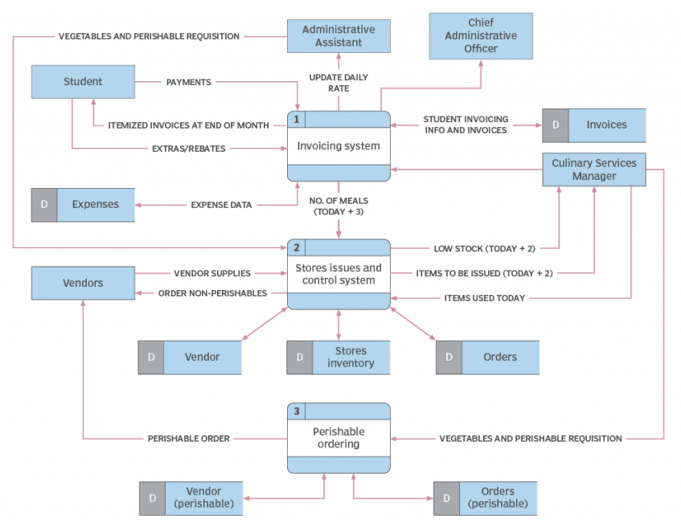
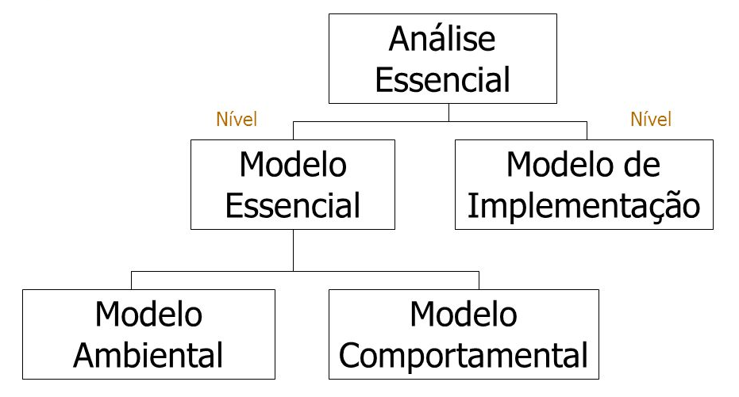

# Capítulo 35 – Análise e Projeto Estruturado e Essencial

## O Contexto dos Métodos Estruturados

Em meados do século XX, o desenvolvimento de software vivia um período que ficou conhecido como a "crise do software". Os projetos eram frequentemente marcados por atrasos, estouros de orçamento e, pior ainda, por produtos finais que não atendiam às necessidades dos usuários. O processo era, em grande parte, artesanal, caótico e carente de disciplina. Como resposta direta a esses desafios, surgiram os **Métodos Estruturados**, uma coleção de técnicas de análise, projeto e implementação que buscaram trazer os rigores da engenharia para o mundo do software.

A filosofia por trás dessas abordagens era simples: introduzir estrutura, formalismo e um conjunto de ferramentas gráficas para transformar as regras de negócio e os requisitos, muitas vezes ambíguos, em especificações claras e compreensíveis. Duas das mais importantes vertentes desse movimento são a **Análise Estruturada** e a **Análise Essencial**, que exploraremos em detalhe a seguir.

## Análise Estruturada: Mapeando o Fluxo da Informação

A **Análise Estruturada** é um método que visa converter regras de negócio e requisitos de sistema em um conjunto de especificações de software, representadas principalmente por meio de **Diagramas de Fluxo de Dados (DFD)**. Seu foco principal é compreender e modelar como a informação flui através de um sistema.

Os objetivos centrais da Análise Estruturada são:

- Identificar os elementos externos (pessoas, outras organizações, outros sistemas) que interagem com o sistema.
- Mostrar o fluxo de informação que ocorre entre o sistema e seu ambiente externo.
- Estabelecer de forma clara os limites do sistema, definindo o que está "dentro" e o que está "fora" de seu escopo.
- Identificar os eventos que ocorrem no ambiente externo e que provocam uma resposta do sistema.

### A Ferramenta Central: O Diagrama de Fluxo de Dados (DFD)

O Diagrama de Fluxo de Dados (DFD) é a ferramenta gráfica central da Análise Estruturada. Ele descreve o fluxo de informação e as transformações que são aplicadas aos dados à medida que eles se movem da entrada para a saída. É importante notar que o DFD **não descreve a lógica procedimental** (como loops, condições `if/else` ou a sequência de passos), mas sim o **caminho que os dados percorrem**.

O DFD adota uma visão de "entrada-processo-saída": objetos de dados entram no sistema, são transformados por elementos de processamento e, em seguida, saem do sistema. Essa abordagem permite que o analista desenvolva, simultaneamente, modelos do domínio informacional (os dados) e do domínio funcional (as transformações).

À medida que um DFD é refinado em níveis de maior detalhe, o analista realiza uma decomposição funcional implícita do sistema. Isso significa que um processo complexo é quebrado em subprocessos mais simples e gerenciáveis. Ao mesmo tempo, essa decomposição refina a representação dos dados à medida que eles se movem entre os novos processos.

#### Construindo um Diagrama de Fluxo de Dados

A construção de um DFD segue uma abordagem hierárquica, começando com uma visão geral e mergulhando progressivamente nos detalhes.

- **DFD Nível 0 (Diagrama de Contexto):** Este é o nível mais alto de abstração. Ele representa todo o software ou sistema como um único processo (uma única "bolha"). O objetivo do Diagrama de Contexto é mostrar as principais entradas e saídas de dados e as entidades externas com as quais o sistema interage, estabelecendo assim seu escopo e suas fronteiras.
- **DFD Nível 1 e Refinamentos Posteriores:** O DFD Nível 1 "explode" a bolha do Diagrama de Contexto, revelando os principais processos (ou subfunções) que compõem o sistema. Por exemplo, um processo único como "Sistema de Vendas" no Nível 0 pode ser decomposto em cinco ou seis processos no Nível 1, como "Processar Pedido", "Verificar Estoque", "Calcular Frete" e "Emitir Nota Fiscal". Cada um desses processos no Nível 1 pode, por sua vez, ser explodido em um DFD de Nível 2, e assim por diante, até que cada processo seja simples o suficiente para ser descrito sem ambiguidade.

Algumas diretrizes simples podem ajudar na derivação de um DFD:

1. O DFD de Nível 0 deve sempre apresentar o sistema como um único processo.
2. As principais entradas e saídas do sistema devem ser cuidadosamente identificadas e rotuladas no Nível 0.
3. O refinamento deve começar isolando os principais processos, objetos de dados e depósitos de dados que compõem o sistema.
4. Todas as setas (fluxos) e bolhas (processos) devem ser rotuladas com nomes significativos e claros.
5. A continuidade do fluxo de informação deve ser mantida de um nível para o outro (o que é conhecido como "balanceamento" do DFD).
6. Um processo (bolha) de cada vez deve ser refinado para o próximo nível de detalhe.

#### Os Símbolos do DFD

A grande força do DFD está em sua simplicidade. Ele utiliza apenas quatro símbolos para modelar todo o sistema, suas fronteiras e as relações entre os dados e os processos.

  

1. **Processo (ou Função):** Representado por um círculo ou um retângulo com cantos arredondados. Um processo mostra uma parte do sistema que **transforma dados de entrada em dados de saída**. Ele representa uma ação, um cálculo ou uma decisão. É também conhecido como "Bolha" ou "Transformação".
2. **Fluxo de Dados:** Representado por uma seta que entra ou sai de um processo. Indica o movimento de informações de uma parte do sistema para outra. A seta deve ser rotulada com o nome do dado que está fluindo.
3. **Terminador (ou Entidade Externa):** Representado por um retângulo. É utilizado para representar entidades que estão **fora** do sistema, mas que se comunicam com ele, seja fornecendo dados (fontes) ou recebendo dados (sumidouros). Pode representar pessoas, departamentos, outras organizações ou outros sistemas.
4. **Depósito de Dados:** Representado por um retângulo aberto (ou duas linhas paralelas). É utilizado para modelar um "pacote de dados em repouso", ou seja, um local onde os dados são armazenados para uso posterior. Representa arquivos, tabelas de banco de dados, etc.

A figura a seguir mostra o exemplo de um diagrama completo:

  

## Análise Essencial: Focando na Essência do Negócio

A **Análise Essencial** é uma evolução ou um refinamento da Análise Estruturada. Sua premissa fundamental é que a análise de um sistema deve se concentrar na **essência do negócio**, independentemente das soluções tecnológicas que serão utilizadas para implementá-lo. A técnica parte do princípio de que os sistemas de negócio existem para atender a uma oportunidade ou resolver um problema, e essa "essência" existe independentemente de o sistema ser manual, automatizado, rodar em um mainframe ou em um smartphone.

Ela propõe que um sistema seja modelado através de três dimensões distintas:

- **Dados:** Os aspectos estáticos e estruturais do sistema (as informações que ele armazena).
- **Controle:** Os aspectos temporais e comportamentais do sistema (como ele reage a eventos ao longo do tempo).
- **Funções:** As transformações de valores que ocorrem dentro do sistema (os processos).

Para alcançar essa modelagem completa, a Análise Essencial se baseia na criação de dois modelos distintos, que representam diferentes níveis de abstração.

  

### O Modelo Essencial

O analista inicia a análise criando um **Modelo Essencial**, que representa o sistema em um nível de abstração completamente **independente de restrições tecnológicas**. Antes de se pensar em como o sistema será implementado, é necessário conhecer sua verdadeira essência. Não importa se a implementação será manual ou automatizada, ou que tipo de hardware e software serão usados. O Modelo Essencial é composto por dois sub-modelos:

- **Modelo Ambiental:** Define a fronteira entre o sistema e o resto do mundo, ou seja, seu contexto. Ele consiste em quatro componentes:
    1. **Declaração de Objetivos:** Uma descrição concisa do propósito do sistema.
    2. **Diagrama de Contexto:** O DFD de Nível 0, que mostra o sistema como uma única entidade e suas interações com o ambiente externo.
    3. **Lista de Eventos:** Uma lista textual de todos os estímulos no ambiente externo aos quais o sistema deve responder. Cada evento na lista irá disparar uma ou mais atividades dentro do sistema.
    4. **Dicionário de Dados Preliminar (Opcional):** Uma definição inicial dos principais fluxos de dados que cruzam a fronteira do sistema.
- **Modelo Comportamental:** Define o comportamento das partes internas do sistema, detalhando como ele precisa agir para interagir corretamente com o ambiente. Ele é composto por cinco componentes principais:
    1. **DFD Particionado:** Um DFD detalhado que mostra os processos internos do sistema, organizados (particionados) em resposta aos eventos listados no Modelo Ambiental.
    2. **Modelo Entidade-Relacionamento (MER):** Um diagrama que modela a estrutura dos dados armazenados pelo sistema, mostrando as entidades de negócio (ex: Cliente, Produto, Pedido) e seus relacionamentos. Fornece a visão estática dos dados.
    3. **Diagrama de Transição de Estado (DTE):** Um modelo que descreve o comportamento do sistema (ou de parte dele) ao longo do tempo, mostrando como ele muda de estado em resposta a eventos. É crucial para sistemas com comportamento temporal complexo.
    4. **Dicionário de Dados Completo:** Um repositório central que define detalhadamente todos os fluxos de dados, depósitos de dados e estruturas de dados do sistema.
    5. **Especificações de Processos:** Descrições detalhadas (também conhecidas como "mini-specs") da lógica de cada processo primitivo (os processos que não são mais decompostos) no DFD.

### O Modelo de Implementação

Após a criação e validação do Modelo Essencial, que captura o "o quê", a equipe passa a criar o **Modelo de Implementação**. Este modelo tem como objetivo definir a forma como o sistema será implementado em um **ambiente técnico específico**. Ele é derivado do Modelo Essencial, mas agora apresenta o sistema em um nível de abstração completamente **dependente de restrições tecnológicas**.

Nesta fase, as decisões de implementação são tomadas:

- Que processos serão automatizados e quais permanecerão manuais?
- Qual será o Sistema de Gerenciamento de Banco de Dados (SGBD)?
- Qual será a linguagem de programação e o framework utilizados?
- Como a interface do usuário será projetada?

Os artefatos gráficos do Modelo de Implementação (Processo, Depósito de Dados, Entidade Externa, Fluxo de Dados) são os mesmos do DFD, mas agora eles são mapeados para componentes tecnológicos concretos. Por exemplo, um Depósito de Dados "Clientes" no Modelo Essencial se torna uma tabela "TBL_CLIENTES" em um banco de dados SQL Server no Modelo de Implementação.

## Considerações Finais

A Análise Estruturada e a Análise Essencial representam um marco na história da Engenharia de Software. Elas trouxeram uma abordagem disciplinada e sistemática para a fase de análise, que antes era frequentemente tratada de forma ad hoc e intuitiva. O uso do Diagrama de Fluxo de Dados (DFD) forneceu uma linguagem visual poderosa para descrever como a informação se move e se transforma dentro de um sistema, facilitando a comunicação entre analistas, desenvolvedores e usuários.

A Análise Essencial, em particular, introduziu um conceito de profundo valor: a separação rigorosa entre a **essência do negócio** e as **contingências da implementação**. Ao forçar a criação de um modelo independente de tecnologia, ela permite que as equipes compreendam e validem os verdadeiros requisitos de negócio antes de se prenderem a uma solução técnica específica. Isso aumenta drasticamente as chances de construir um sistema que não apenas funciona, mas que também resolve o problema certo.

Embora novos paradigmas, como a Orientação a Objetos e as Metodologias Ágeis, tenham surgido e ganhado predominância, os princípios fundamentais ensinados por essas abordagens estruturadas permanecem atemporais. A necessidade de entender o fluxo de dados, de definir claramente as fronteiras do sistema e de capturar a essência do problema de negócio antes de saltar para a codificação continua a ser um pilar da boa engenharia de software.