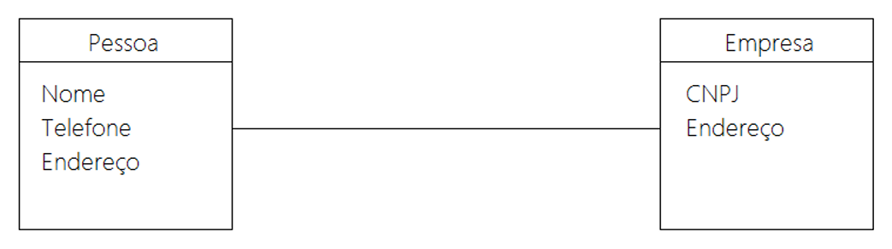

# Capítulo 36 – Análise e Projeto Orientados a Objetos

## O Paradigma Orientado a Objetos (POO)

A programação estruturada, com sua abordagem procedural, representou um avanço significativo na organização do desenvolvimento de software, introduzindo conceitos como funções e módulos. No entanto, ela frequentemente leva a um problema fundamental de design: partes do código que servem apenas para manipular os dados (as estruturas de dados) se misturam com partes do código que tratam da lógica do algoritmo (os procedimentos). Essa falta de separação clara entre dados e comportamento não é uma prática saudável, pois diminui a reusabilidade, dificulta a leitura, a depuração e, principalmente, a manutenção do código ao longo do tempo. A modularização foi uma tentativa de resolver isso, mas a verdadeira revolução veio com o **Paradigma Orientado a Objetos (POO)**.

Este novo paradigma propõe uma forma de pensar e estruturar o software que reflete mais fielmente a maneira como percebemos o mundo: como uma coleção de "coisas" ou "objetos" que possuem características (dados) e que são capazes de realizar ações (comportamento). O POO se baseia na abstração de entidades do mundo real (ou conceitos abstratos) em componentes de software autocontidos e potencialmente reusáveis. A ideia central é que um sistema de software pode ser visualizado como uma ecologia de agentes interconectados chamados **objetos**. Cada objeto é responsável por realizar tarefas específicas, e é por meio da interação e colaboração entre eles que uma tarefa computacional complexa é realizada.

Essa forma de pensar já é natural para nós. Cotidianamente, resolvemos problemas complexos decompondo-os em objetos e suas interações. Ao modelar um sistema de software dessa maneira, reduz-se a "distância semântica" entre a realidade e o código. Em vez de pensar em termos de variáveis e funções desconexas, o desenvolvedor passa a pensar em termos de `Cliente`, `Produto` e `Pedido`, tornando os programas mais intuitivos e compreensíveis, não apenas para os programadores, mas também para os analistas de negócio.

### Vantagens do Paradigma Orientado a Objetos

A adoção do POO traz uma série de vantagens estratégicas que o tornaram o padrão dominante no desenvolvimento de software moderno.

|Vantagens do Paradigma Orientado a Objetos|Descrição Detalhada|
|---|---|
|**Produção de software natural**|Os programas se tornam mais inteligíveis porque a estrutura do código espelha a estrutura do domínio do problema. Em vez de programar em termos de estruturas de dados e procedimentos isolados, o profissional pode usar a terminologia do negócio, criando classes como `Fatura`, `Funcionario` ou `Estoque`, o que torna o código autoexplicativo.|
|**Confiabilidade**|Programas orientados a objetos, bem projetados e cuidadosamente escritos, são mais confiáveis. O princípio do encapsulamento protege os dados de um objeto contra modificações indevidas, permitindo o acesso apenas através de uma interface bem definida. Isso previne efeitos colaterais inesperados e torna o sistema mais robusto e previsível.|
|**Reusabilidade**|Classes bem projetadas podem ser facilmente reutilizadas em diferentes programas e projetos. Assim como um engenheiro civil reutiliza o projeto de uma viga padrão em várias construções, um desenvolvedor pode reutilizar uma classe `Autenticacao` ou `ConexaoBancoDeDados`, acelerando o desenvolvimento e aumentando a consistência.|
|**Manutenibilidade**|Um código orientado a objetos bem projetado é mais fácil de manter. Graças à alta coesão e ao baixo acoplamento, para corrigir um erro ou alterar uma regra de negócio, o programador pode focar na classe responsável, com a confiança de que a mudança não quebrará outras partes do sistema. Essa "localidade da mudança" é crucial para a evolução de software a longo prazo.|
|**Extensibilidade e Escalabilidade**|O software não é estático. A orientação a objetos oferece mecanismos poderosos como herança e polimorfismo, que permitem estender o sistema com novas funcionalidades de forma controlada, sem comprometer sua estrutura. Um novo tipo de relatório pode ser adicionado criando uma nova classe que herda de uma classe base `Relatorio`, por exemplo. Isso torna o software mais escalável, capaz de crescer em complexidade sem se tornar caótico.|
|**Ciclos de Desenvolvimento Rápidos**|Ao promover a reusabilidade e a extensibilidade, o POO ajuda a encurtar os ciclos de desenvolvimento. As equipes gastam menos tempo reinventando a roda ou corrigindo bugs causados por interdependências complexas, e mais tempo entregando novas funcionalidades de valor para o negócio.|

Além disso, uma das grandes vantagens do paradigma é seu **caráter unificador**. Ele permite que todas as etapas do desenvolvimento — análise, projeto, modelagem, implementação e até mesmo o banco de dados (através de ORMs ou bancos de dados orientados a objetos) — sejam tratadas sob uma única abordagem conceitual. Isso elimina as rupturas de paradigma que ocorriam quando, por exemplo, um modelo de dados relacional precisava ser traduzido para um modelo de programação procedural, um processo frequentemente propenso a erros.

### Os Pilares do POO

O Paradigma Orientado a Objetos é sustentado por alguns princípios ou pilares fundamentais. Os mais citados são: **Encapsulamento**, **Herança** e **Polimorfismo**. No entanto, muitos autores argumentam que esses três pilares são, na verdade, aplicações de um conceito ainda mais fundamental: a **Abstração**. Como ilustrado na figura, a abstração é a base, o solo fértil a partir do qual todos os outros conceitos do paradigma florescem.

<div align="center">
  
</div>

Vamos explorar cada um desses conceitos em detalhe.

## Classes e Objetos

Os conceitos de classe e objeto são o ponto de partida da orientação a objetos.

- **Objeto:** Um objeto é uma representação de uma "coisa" do mundo real ou de um conceito abstrato. Pode ser um `Carro`, uma `Foto`, uma `ContaBancaria` ou uma `TransacaoFinanceira`. Cada objeto possui três componentes essenciais:
    - **Identidade:** É o que torna um objeto único, distinguindo-o de todos os outros, mesmo que sejam da mesma categoria e tenham as mesmas características. No mundo do software, isso é frequentemente representado por um endereço de memória ou um identificador único (ID). Dois objetos `Carro` podem ser idênticos em todos os seus atributos (mesma marca, modelo e cor), mas ainda assim são duas entidades distintas.
    - **Estado:** Reflete os valores correntes das propriedades (atributos) de um objeto em um determinado momento. O estado de um objeto `Carro` pode incluir sua `cor = "vermelho"`, `velocidadeAtual = 60` e `quantidadeDeCombustivel = 25.5`. O estado de um objeto é dinâmico e muda ao longo do tempo.
    - **Comportamento:** Refere-se a como um objeto reage a solicitações (mensagens) e como ele pode alterar seu próprio estado ou o de outros objetos. O comportamento é definido por suas operações (métodos), como `acelerar()`, `frear()` e `ligarFarol()`.

- **Classe:** Uma classe é um **modelo**, um "projeto" ou um "molde" a partir do qual os objetos são criados. Ela descreve os atributos e métodos que serão comuns a todo um grupo de objetos. Por exemplo, a classe `Carro` definiria que todo objeto carro terá atributos como `marca`, `modelo` e `ano`, e métodos como `ligar()` e `desligar()`. Objetos como um "Fusca 1970" e uma "Ferrari 2023" são, portanto, **instâncias** diferentes da mesma classe `Carro`.

Para fins de modelagem de um sistema, apenas um subconjunto de características do mundo real é relevante. Ao criar a classe `Carro` para um sistema de gestão de frotas, podemos ignorar atributos como "cor do estofado" se isso não for importante para o sistema em questão. Esse processo de focar no essencial é a aplicação da abstração.

```java
// Exemplo em Java: A classe Carro atua como um modelo.
public class Carro {
    // Atributos (Estado)
    String marca;
    String modelo;
    int ano;
    int velocidadeAtual;

    // Método Construtor para inicializar o objeto
    public Carro(String marca, String modelo, int ano) {
        this.marca = marca;
        this.modelo = modelo;
        this.ano = ano;
        this.velocidadeAtual = 0; // Carro começa parado
    }

    // Métodos (Comportamento)
    public void acelerar(int incremento) {
        this.velocidadeAtual += incremento;
        System.out.println("O " + modelo + " acelerou para " + this.velocidadeAtual + " km/h.");
    }

    public void frear(int decremento) {
        this.velocidadeAtual -= decremento;
        System.out.println("O " + modelo + " freou para " + this.velocidadeAtual + " km/h.");
    }
}

// Classe principal para demonstrar a criação de objetos
class Garagem {
    public static void main(String[] args) {
        // Criando duas instâncias (objetos) da classe Carro
        Carro meuFusca = new Carro("Volkswagen", "Fusca", 1970);
        Carro suaFerrari = new Carro("Ferrari", "F8", 2023);

        // Cada objeto tem sua própria identidade e estado
        System.out.println("Carro 1: " + meuFusca.marca + " " + meuFusca.modelo);
        System.out.println("Carro 2: " + suaFerrari.marca + " " + suaFerrari.modelo);

        // Invocando o comportamento dos objetos
        meuFusca.acelerar(50);
        suaFerrari.acelerar(120);
    }
}
```

## Atributos

Um atributo consiste em uma informação de estado para a qual cada objeto de uma classe tem seu próprio valor. Eles são, basicamente, a estrutura de dados que representa a classe.

Existem dois tipos principais de atributos:

|Tipo de Atributo|Descrição|
|---|---|
|**Atributo de Instância**|É uma variável cujo valor é específico para cada objeto (instância) da classe. Se temos dois objetos da classe `Carro`, cada um terá seu próprio valor para o atributo `cor`. Mudar a cor de um não afeta o outro. Este é o tipo padrão de atributo na maioria das linguagens OO.|
|**Atributo de Classe (Estático)**|É uma variável cujo valor é **compartilhado** por todos os objetos daquela classe. Funciona de forma similar a uma variável global, mas com escopo restrito à classe. Se um atributo `numeroDeCarrosProduzidos` for de classe, qualquer mudança em seu valor será refletida em todas as instâncias. Em linguagens como Java, é declarado com a palavra-chave `static`.|

```java
public class Carro {
    // Atributos de Instância (cada carro tem o seu)
    public String modelo;
    public String cor;

    // Atributo de Classe (compartilhado por todos os carros)
    public static int totalDeCarrosCriados = 0;

    public Carro(String modelo, String cor) {
        this.modelo = modelo;
        this.cor = cor;
        totalDeCarrosCriados++; // Incrementa a variável compartilhada
        System.out.println("Carro " + modelo + " criado. Total de carros: " + totalDeCarrosCriados);
    }
}

class Concessionaria {
     public static void main(String[] args) {
        System.out.println("Total inicial de carros: " + Carro.totalDeCarrosCriados);
        Carro carro1 = new Carro("Fusca", "Azul");
        Carro carro2 = new Carro("Ferrari", "Vermelha");
        System.out.println("Total final de carros: " + Carro.totalDeCarrosCriados);
     }
}
```

## Métodos

Os métodos são similares a procedimentos e funções da programação estruturada. Eles consistem em descrições das operações que um objeto pode executar quando recebe uma mensagem.

Assim como os atributos, os métodos também podem ser de dois tipos:

|Tipo de Método|Descrição|
|---|---|
|**Método de Instância**|É um método que realiza operações específicas para um objeto particular, geralmente acessando ou modificando seus atributos de instância. Por padrão, a maioria dos métodos em uma classe são de instância. O método `acelerar()` de um carro, por exemplo, modifica o atributo `velocidadeAtual` daquele carro específico.|
|**Método de Classe (Estático)**|É um método que realiza operações genéricas, que não dependem do estado de uma instância particular. Ele pertence à classe como um todo. Um exemplo seria um método `calcularImpostoSobreVeiculo()` que recebe o valor do carro como parâmetro e retorna o imposto, sem precisar de uma instância específica de carro para funcionar. Em Java, também é declarado com `static`.|

Um tipo especial de método é o **método construtor**. É um método especial que é chamado automaticamente quando uma nova instância de uma classe é criada (por exemplo, com o operador `new` em Java). Seu objetivo é inicializar o objeto, garantindo que ele seja criado em um estado válido. Ele geralmente tem o mesmo nome da classe e não possui tipo de retorno. Uma classe pode ter múltiplos construtores (com diferentes parâmetros), um conceito conhecido como sobrecarga de construtores.

A associação entre uma chamada de método e o código que será efetivamente executado é chamada de **ligação (Binding)**.

|Tipo de Ligação|Descrição|
|---|---|
|**Early Binding (Ligação Estática)**|Ocorre quando o método a ser invocado é determinado em **tempo de compilação**. O compilador sabe exatamente qual código será executado. Isso é o padrão para a maioria das chamadas de método.|
|**Late Binding (Ligação Dinâmica)**|Ocorre quando o método a ser invocado só é determinado em **tempo de execução**. Isso é fundamental para o funcionamento do polimorfismo, onde o mesmo nome de método pode se referir a implementações diferentes em subclasses.|

## Mensagens

Qual a utilidade de um objeto isolado? Geralmente, muito pouca. É por meio da **interação entre objetos** que um sistema orientado a objetos realiza suas funcionalidades complexas. Essa interação ocorre através da **troca de mensagens**.

Quando um objeto A quer que um objeto B realize uma operação, o objeto A envia uma mensagem para o objeto B. Uma mensagem é composta por três partes:

1. O objeto receptor (a quem a mensagem é endereçada).
2. O nome do método que se deseja executar.
3. Os parâmetros necessários para o método (se houver).

```java
// Exemplo de troca de mensagens
public class Motorista {
    private String nome;

    public Motorista(String nome) {
        this.nome = nome;
    }

    public void dirigirCarro(Carro carro, int velocidade) {
        System.out.println(this.nome + " está dirigindo o carro.");
        // O objeto 'Motorista' envia a mensagem 'acelerar' para o objeto 'carro'.
        carro.acelerar(velocidade);
    }
}

class TesteDirecao {
    public static void main(String[] args) {
        Motorista motoristaJoao = new Motorista("João");
        Carro carroFusca = new Carro("Fusca", "Azul");

        // O objeto motoristaJoao envia uma mensagem para o objeto carroFusca
        motoristaJoao.dirigirCarro(carroFusca, 80);
    }
}
```

O objeto que recebe a mensagem (o `Carro`) é responsável por saber como executar a operação solicitada. O objeto remetente (`Motorista`) não precisa saber dos detalhes internos. Essa separação promove baixo acoplamento e alta coesão, melhorando a reusabilidade e a manutenção do sistema.

## Abstração

A abstração é o pilar fundamental do POO. É o processo mental de focar nos aspectos essenciais de um objeto, ignorando os detalhes irrelevantes para um determinado contexto. Ao modelar um sistema bancário, abstraímos uma `Pessoa` para uma classe `Cliente`, focando em atributos como `nome`, `cpf` e `saldo`, e ignorando características como `cor_do_cabelo`.

- **Classe Concreta:** É uma classe que pode ser instanciada diretamente para criar objetos. Ela implementa todos os seus métodos.
- **Classe Abstrata:** É uma classe que não pode ser instanciada. Ela serve como um modelo (template) para outras classes. Geralmente, ela fornece uma implementação parcial (com métodos concretos) e define um contrato de métodos que as subclasses devem implementar (métodos abstratos). Se uma classe possui pelo menos um método abstrato, ela obrigatoriamente deve ser declarada como abstrata.

```java
// Exemplo de Classe Abstrata
public abstract class Veiculo {
    protected String marca;

    // Método concreto, compartilhado pelas subclasses
    public String getMarca() {
        return marca;
    }

    // Método abstrato, que DEVE ser implementado pelas subclasses
    public abstract void emitirSom();
}

public class Carro extends Veiculo {
    @Override
    public void emitirSom() {
        System.out.println("Vrum vrum!");
    }
}

public class Motocicleta extends Veiculo {
     @Override
    public void emitirSom() {
        System.out.println("Randandan!");
    }
}
```

## Interface

Uma interface é um conceito similar, mas mais restrito, que uma classe abstrata. Uma interface é um "contrato" que define um conjunto de métodos que uma classe deve implementar. As principais diferenças são:

|Características|Interfaces|Classes Abstratas|
|---|---|---|
|**Herança Múltipla**|Uma classe **pode implementar múltiplas interfaces**, herdando múltiplos contratos de comportamento.|A maioria das linguagens (como Java) **não suporta herança múltipla de classes**. Uma classe só pode estender uma única classe abstrata.|
|**Implementação**|Não pode conter métodos concretos (em versões mais antigas de linguagens como Java). Todos os seus métodos são, por definição, abstratos e públicos.|Pode conter uma mistura de métodos concretos (com implementação) e abstratos (sem implementação).|
|**Atributos**|Só pode conter constantes (variáveis `public static final`), não atributos de instância.|Pode conter tanto atributos de instância quanto de classe.|
|**Encapsulamento**|Métodos e membros devem sempre ser públicos por padrão.|Métodos e membros podem ter qualquer visibilidade.|
|**Construtores**|Não possui construtores.|Possui construtores, que são chamados pelas subclasses.|
|**Velocidade**|Em geral, são mais lentas que classes abstratas.|Em geral, são mais rápidas que interfaces.|

Conceitualmente, uma boa forma de pensar é: uma **classe abstrata** define o que um objeto **é** (ex: `Animal` é uma abstração para `Cachorro` e `Gato`). Uma **interface** define o que um objeto **pode fazer** (ex: `Cachorro`, `Gato` e `RoboAspirador` podem implementar a interface `Movivel`).

```java
// Exemplo de Interface
public interface Ligavel {
    void ligar();
    void desligar();
}

public class Carro implements Ligavel {
    @Override
    public void ligar() {
        System.out.println("Carro ligado.");
    }
    @Override
    public void desligar() {
        System.out.println("Carro desligado.");
    }
}

public class Lampada implements Ligavel {
    @Override
    public void ligar() {
        System.out.println("Lâmpada acesa.");
    }
    @Override
    public void desligar() {
        System.out.println("Lâmpada apagada.");
    }
}
```

## Encapsulamento

O encapsulamento é o mecanismo de agrupar os dados (atributos) e os métodos que os manipulam dentro de uma única unidade (o objeto), e de **restringir o acesso direto ao estado interno do objeto**. O acesso aos dados só deve ser feito através dos métodos públicos do objeto (sua interface).

Isso é como a encomenda dos Correios: você entrega o pacote e espera o resultado (a entrega), mas não precisa saber (e nem pode interferir) nos detalhes internos do processo (se vai de avião, trem, etc.).

O encapsulamento é implementado através de **modificadores de acesso** (`public`, `protected`, `private`), que definem a visibilidade de atributos e métodos. A prática comum é declarar os atributos como `private` e fornecer métodos `public` (como `getters` e `setters`) para acessá-los de forma controlada.

|Modificador (UML)|Acesso na mesma Classe|Acesso no mesmo Pacote|Acesso em Subclasse|Acesso em Todo Lugar|
|---|---|---|---|---|
|**Público (+)**|Sim|Sim|Sim|Sim|
|**Protegido (#)**|Sim|Não|Sim|Não|
|**Pacote (~)**|Sim|Sim|Não|Não|
|**Privado (-)**|Sim|Não|Não|Não|

A visibilidade em Java difere ligeiramente da UML para o modificador `protected`.

|Modificador (Java)|Acesso na mesma Classe|Acesso no mesmo Pacote|Acesso em Subclasse|Acesso em Todo Lugar|
|---|---|---|---|---|
|**Público (+)**|Sim|Sim|Sim|Sim|
|**Protegido (#)**|Sim|Sim|Sim|Não|
|**Pacote (~)**|Sim|Sim|Não|Não|
|**Privado (-)**|Sim|Não|Não|Não|

```java
public class ContaBancaria {
    // Atributo encapsulado (privado)
    private double saldo;

    public ContaBancaria(double saldoInicial) {
        if (saldoInicial >= 0) {
            this.saldo = saldoInicial;
        }
    }

    // Método público para acessar o saldo (getter)
    public double getSaldo() {
        return this.saldo;
    }

    // Método público para modificar o saldo de forma controlada
    public void depositar(double valor) {
        if (valor > 0) {
            this.saldo += valor;
        }
    }
}
```

## Polimorfismo

Polimorfismo (do grego, "muitas formas") é a capacidade de objetos de diferentes classes responderem à mesma mensagem (chamada de método) de maneiras específicas para cada classe. Ele permite que um único nome de método represente códigos diferentes, selecionados por algum mecanismo automático, fazendo com que o mesmo nome possa ter muitos comportamentos distintos.

O conceito pode ser ilustrado com uma analogia: um controle remoto de um antigo videocassete pode, eventualmente, funcionar em um novo aparelho de blu-ray da mesma marca. Dois objetos distintos (o videocassete e o blu-ray) respondem à mesma mensagem (o sinal do botão "Play"), cada um executando a ação de forma apropriada ao seu hardware. No contexto da orientação a objetos, o polimorfismo permite que a mesma mensagem seja enviada a diferentes objetos e que cada um execute a operação que é mais apropriada para a sua classe.

Existe uma relação estreita com o conceito de abstração, pois um objeto pode enviar a mesma mensagem para objetos semelhantes que implementam uma interface comum de formas diferentes.

### Tipos de Polimorfismo

O polimorfismo é tradicionalmente classificado em dois tipos principais: Estático e Dinâmico. No entanto, uma classificação mais formal divide o polimorfismo em duas grandes categorias: Universal e Ad-hoc.

<div align="center">
  
</div>

- **Polimorfismo Universal:** Pode trabalhar com um número infinito de tipos.
- **Polimorfismo Ad-hoc:** Pode trabalhar com um número finito e limitado de tipos. Alguns autores mais rigorosos não o consideram um "polimorfismo verdadeiro", pois sua resolução ocorre em tempo de compilação, e não em tempo de execução.

#### Polimorfismo Dinâmico (Sobrescrita)

Também conhecido como polimorfismo por sobrescrita, inclusão, herança ou subtipo (overriding), está diretamente associado ao conceito de herança. Ocorre quando uma subclasse fornece uma implementação específica para um método que já é definido em sua superclasse. A **assinatura do método** (nome e parâmetros) deve ser a mesma na superclasse e na subclasse. A decisão de qual método chamar (o da superclasse ou o da subclasse) é tomada em **tempo de execução** (Late Binding), com base no tipo real do objeto.

A definição exata de **assinatura de um método** pode variar: dois métodos têm a mesma assinatura se possuem o mesmo nome e os mesmos parâmetros (em quantidade, tipo e ordem). Algumas linguagens, como Java, ignoram o tipo de retorno para esta verificação, enquanto outras, como C++, o consideram.

```java
// Exemplo de Polimorfismo Dinâmico (Sobrescrita)
public abstract class Animal {
    public abstract void fazerBarulho();
}

public class Cachorro extends Animal {
    @Override
    public void fazerBarulho() {
        System.out.println("Au Au!");
    }
}

public class Gato extends Animal {
    @Override
    public void fazerBarulho() {
        System.out.println("Miau!");
    }
}

class TesteAnimais {
    public static void main(String[] args) {
        // A mesma variável 'animal' pode se referir a objetos de diferentes tipos
        Animal animal;

        animal = new Cachorro();
        animal.fazerBarulho(); // Executa o método da classe Cachorro

        animal = new Gato();
        animal.fazerBarulho(); // Executa o método da classe Gato
    }
}
```

#### Polimorfismo Estático (Sobrecarga)

Também conhecido como polimorfismo por sobrecarga (overloading), ocorre quando múltiplos métodos na mesma classe têm o **mesmo nome, mas assinaturas diferentes**. A diferença pode estar na quantidade, no tipo ou na ordem dos parâmetros. A decisão de qual método chamar é tomada em **tempo de compilação** (Early Binding) com base nos argumentos passados na chamada.

Uma subclasse pode sobrecarregar os métodos herdados da superclasse. Esses métodos sobrecarregados são considerados novos e únicos da subclasse; eles não ocultam nem sobrescrevem os métodos da superclasse.

#### Polimorfismo Paramétrico

Este é um tipo de polimorfismo universal, também chamado de "polimorfismo verdadeiro". Ele permite que um código seja escrito de forma genérica para operar sobre valores de tipos diferentes, que só serão especificados em tempo de execução. Uma única função ou classe pode trabalhar uniformemente em um intervalo de tipos.

Em Java, a partir da versão 1.5, isso é implementado através de **Generics**. Por exemplo, a interface `List<T>` permite criar listas para qualquer tipo de objeto (`String`, `Integer` ou tipos customizados) sem a necessidade de reescrever os métodos da lista (como `add`, `get`, `remove`) para cada tipo.

```java
// O tipo 'T' é um parâmetro de tipo
List<String> listaDeString = new ArrayList<>();
List<Integer> listaDeInteger = new ArrayList<>();

listaDeString.add("Primeiro Texto");
listaDeInteger.add(4000);
```

#### Polimorfismo de Coerção

Este é um tipo de polimorfismo ad-hoc que ocorre quando um valor de um tipo é convertido implicitamente para outro tipo (conhecido como casting implícito) para se adequar ao tipo esperado por uma função ou operador. Um exemplo comum é atribuir um valor do tipo `int` a uma variável do tipo `double`. Nesse caso, o valor inteiro é "coagido" ou convertido para o tipo real para que a operação seja válida, evitando um erro de tipo.

## Herança (Generalização/Especialização)

A herança é um mecanismo fundamental da orientação a objetos que permite que uma classe (a **subclasse**) herde atributos e métodos de outra classe (a **superclasse**). É uma forma de abstração que agrupa classes semelhantes em uma hierarquia, representando uma relação "é um tipo de" (por exemplo, `Carro` é um tipo de `Veiculo`).

A herança estabelece uma relação entre classes, não entre objetos, e facilita o compartilhamento de comportamento comum, permitindo o reaproveitamento de código e a especialização de operações e atributos. A classe que herda é também chamada de classe-filha ou derivada, enquanto a classe que é herdada é chamada de classe-pai ou base.

<div align="center">
  
</div>

Existem dois tipos principais de herança:

- **Herança Simples:** A subclasse herda de apenas uma superclasse.
- **Herança Múltipla:** A subclasse herda diretamente de duas ou mais superclasses.

Uma questão comum é se a herança múltipla é permitida em orientação a objetos. A resposta é sim; o paradigma de orientação a objetos a permite. No entanto, algumas linguagens de programação, como Java e C#, não implementam a herança múltipla de classes para evitar problemas de ambiguidade. Essa ambiguidade pode ocorrer quando superclasses possuem membros com o mesmo nome e a subclasse não os redefine, tornando incerto a qual membro da superclasse uma referência se destina.

### Herdar vs. Acessar

É crucial entender a diferença entre **herdar** e **acessar**. Uma subclasse **herda todos** os membros de sua superclasse, independentemente de seus modificadores de acesso (público, protegido ou privado). No entanto, a subclasse só pode **acessar** diretamente os membros que não são privados (ou seja, os públicos e protegidos).

Uma boa analogia para visualizar essa diferença é a de herdar um cofre trancado: você é o dono do cofre e de todo o dinheiro dentro dele (herança), mas sem a chave ou a senha (acesso), não consegue usar o conteúdo. Da mesma forma, uma subclasse herda os membros privados de sua superclasse, mas não pode invocá-los ou manipulá-los diretamente.

### Herança vs. Polimorfismo

Embora relacionados, são conceitos distintos. A herança é um mecanismo para reutilização de código e criação de hierarquias, permitindo que uma nova classe seja baseada em uma já existente. Já o polimorfismo permite que um único nome (como um nome de método) represente diferentes comportamentos, selecionados de acordo com o contexto.

## Análise e Projeto Orientados a Objetos

Com os conceitos do paradigma estabelecidos, podemos aplicá-los nas fases de análise e projeto. A distinção fundamental entre essas duas fases pode ser resumida na seguinte frase: **NA ANÁLISE, DESENHA-SE O PROBLEMA. NO PROJETO, DESENHA-SE A SOLUÇÃO.**

- A **Análise Orientada a Objetos (AOO)** consiste nas atividades necessárias para entender o domínio do problema, ou seja, **o que** deve ser feito. É uma atividade de investigação com foco no cliente e no negócio, onde a tecnologia de implementação e os requisitos não funcionais não são a preocupação principal. O foco está em modelar as funções, dados e relacionamentos do sistema como eles existem no mundo real.
- O **Projeto Orientado a Objetos (POO ou OOD)**, por sua vez, consiste nas atividades para conceber o domínio da solução, isto é, **como** deve ser feito. É uma atividade técnica, com foco no desenvolvedor, que refina os resultados da análise, adicionando detalhes de implementação, definindo a arquitetura e preparando o modelo para a codificação.

### A Evolução do Modelo de Classes

O **Modelo de Classes**, frequentemente representado por um Diagrama de Classes da UML, é o principal artefato e evolui ao longo do desenvolvimento, passando por estágios sucessivos de abstração e detalhamento.

1. **Modelo de Classes de Análise (ou Domínio):** Construído durante a atividade de análise, representa as classes do domínio do negócio. Este modelo é conceitual e não considera restrições de tecnologia. Ele descreve a estrutura do problema.

<div align="center">
  
</div>

2. **Modelo de Classes de Especificação (ou Projeto):** Construído durante a atividade de projeto, estende o modelo de análise. Ele contém detalhes específicos da solução de software, como tipos de dados para atributos e visibilidade de métodos, mas ainda pode ser agnóstico a uma linguagem de programação específica.

<div align="center">
  
</div>

3. **Modelo de Classes de Implementação:** Construído durante a implementação, estende o modelo de projeto e adiciona detalhes específicos da linguagem de programação escolhida (por exemplo, usando tipos de dados de Java como `String` e `ArrayList`).

```java
private class Pessoa {
	public String Nome;
	public String Telefone;
	private Empresa empresa[];

	public String getInfo() {
		return empresa.getConta();
	}
}

public class Empresa {
	public Number CNPJ;
	public String Endereco;

	public getConta() {
		return 0;
	}
}
```

Essa progressão mostra como o **Modelo de Análise** enfatiza o desenho lógico, uma visão externa, conceitual e "caixa-preta", enquanto o **Modelo de Projeto** enfatiza o desenho físico, uma visão interna, concreta e "caixa-branca". O Modelo de Análise tende a ser mais estável, pois as regras de negócio mudam com menos frequência do que as tecnologias de implementação. Ter um modelo de análise bem-feito facilita a adaptação do sistema a novas tecnologias no futuro.

### Análise Orientada a Objetos (AOO) em Detalhes

A meta da análise é criar um esboço do comportamento e da estrutura do sistema. Este processo geralmente envolve quatro atividades principais:

1. **Identificar classes:** Descobrir as entidades, conceitos ou "coisas" relevantes no domínio do problema.
2. **Identificar responsabilidades:** Determinar o que cada classe "sabe" (atributos) e o que ela "faz" (métodos).
3. **Identificar atributos:** Detalhar as propriedades de cada classe, inicialmente sem se preocupar com os tipos de dados.
4. **Identificar relacionamentos:** Modelar como as classes se conectam (associações, generalizações, etc.).

#### Análise de Robustez: Classes de Fronteira, Controle e Entidade

Proposta por Ivar Jacobson, a Análise de Robustez é uma técnica poderosa para a transição dos casos de uso para o modelo de análise. Ela ajuda a categorizar as classes de acordo com suas responsabilidades em três estereótipos:

<div align="center">
  
</div>

- **Classe de Fronteira (Boundary):** Modela a interação entre o sistema e seus atores (usuários ou outros sistemas). Elas são as "janelas", "telas", protocolos de comunicação e interfaces com sensores. Sua função é isolar o núcleo do sistema das mudanças no ambiente externo. Alterar uma interface gráfica, por exemplo, deveria impactar apenas as classes de fronteira.
- **Classe de Entidade (Entity):** Representa as informações persistentes e centrais do negócio, como `Cliente`, `Produto` ou `Pedido`. Geralmente, correspondem a conceitos-chave do domínio e, posteriormente, a tabelas no banco de dados. Elas são independentes do ambiente e encapsulam os dados e comportamentos mais estáveis do sistema.
- **Classe de Controle (Control):** Orquestra a lógica de um caso de uso específico. Atua como uma "cola", recebendo eventos das classes de fronteira e coordenando as ações das classes de entidade para realizar uma tarefa. Classes de controle encapsulam a lógica de negócio que não pertence naturalmente a nenhuma classe de entidade, e seu ciclo de vida está frequentemente atrelado à execução de um caso de uso.

Essa categorização garante que cada classe seja especialista em uma tarefa: comunicar-se com atores (Fronteira), manter as informações do sistema (Entidade) ou coordenar a realização de um caso de uso (Controle).

### Projeto Orientado a Objetos (OOD) e Arquitetura de Software

Após a análise definir **o que** fazer, o projeto define **como** fazer. Esta fase culmina na definição da **Arquitetura de Software**, que é a organização dos componentes significativos do sistema e suas interações. Uma boa arquitetura é crucial para a comunicação entre as partes interessadas e para garantir que o sistema atenda aos requisitos funcionais e não-funcionais (como desempenho, segurança e manutenibilidade).

Dois princípios são o mantra de uma boa arquitetura:

- **Baixo Acoplamento:** Trata do nível de dependência entre os módulos (ou classes) de um software. Módulos com baixo acoplamento são mais independentes. Modificar um não causa um efeito cascata em outros, o que facilita a manutenção e promove o reúso.
- **Alta Coesão:** Trata do quão focada é a responsabilidade de um único módulo. Um módulo com alta coesão tem uma única e bem definida finalidade. Isso torna os módulos mais simples de entender, manter e reutilizar.

Uma forma comum de organizar a arquitetura para alcançar baixo acoplamento e alta coesão é através de **camadas**. Cada camada agrupa funcionalidades relacionadas e fornece serviços para a camada superior, enquanto consome serviços da camada inferior. A **arquitetura de três camadas** é um padrão dominante:

1. **Camada de Apresentação (View):** Responsável pela interface com o usuário (UI). Seu objetivo é exibir informações ao usuário e traduzir as ações do usuário em requisições para a camada de negócio. Contém, por exemplo, as classes de fronteira para atores humanos.
2. **Camada de Lógica de Negócio (Controller/Model):** Contém as regras de negócio e a lógica da aplicação. Processa as requisições da camada de apresentação, toma decisões e utiliza a camada de acesso a dados para manipular as informações.
3. **Camada de Acesso a Dados (Model/Persistence):** Responsável por se comunicar com o banco de dados ou outros sistemas de armazenamento. Abstrai os detalhes de como os dados são fisicamente armazenados e recuperados.

O padrão **Model-View-Controller (MVC)** é a implementação mais famosa do conceito de arquitetura em camadas, separando as responsabilidades de forma clara:

- **Modelo (Model):** Responsável por modelar os dados da aplicação e as regras de negócio. Foca no armazenamento, manipulação e geração de dados. Objetos do Modelo são o coração do sistema, representando as classes de entidade.
- **Visão (View):** Responsável pela apresentação dos dados aos usuários. Recebe os dados do modelo e os renderiza na interface. Não armazena nem manipula dados; sua única função é a exibição.
- **Controle (Controller):** Atua como o intermediário entre o Modelo e a Visão. Processa e responde a eventos (geralmente ações do usuário vindas da Visão), invoca alterações no Modelo e seleciona a Visão apropriada para a resposta.

## Considerações Finais

O Paradigma Orientado a Objetos representa mais do que uma simples técnica de programação; é uma forma de pensar e de modelar a complexidade do mundo. Ao nos permitir organizar o software em torno de objetos que espelham entidades do mundo real, ele nos fornece ferramentas poderosas — abstração, encapsulamento, herança e polimorfismo — para construir sistemas mais naturais, confiáveis, manuteníveis e escaláveis.

A jornada da Análise Orientada a Objetos, focada em entender o problema, para o Projeto Orientado a Objetos, focado em desenhar a solução, é um processo de refinamento contínuo. Técnicas como a Análise de Robustez e padrões arquitetônicos como o MVC nos ajudam a estruturar esse processo, garantindo que a solução final seja não apenas funcional, mas também bem projetada e preparada para evoluir. Dominar o POO é, portanto, uma habilidade essencial para qualquer profissional de software que deseje construir sistemas robustos para o mundo moderno.