# Capítulo 37 – UML: Visão Geral, Modelos e Diagramas

## O Nascimento da UML: A Unificação dos Métodos

Havia uma empresa chamada Rational Software Corporation, a mesma criadora do Processo Unificado Rational (RUP). Em 1995, ela conseguiu reunir três dos pesquisadores de Engenharia de Software mais proeminentes do mundo: **James Rumbaugh, Grady Booch e Ivar Jacobson** – que ficaram conhecidos como **The Three Amigos**.

<div align="center">
  
</div>

Rumbaugh era o criador da **Técnica de Modelagem de Objetos (OMT - Object-Modeling Technique)**. Já Booch era o criador do método de **Projeto Orientado a Objetos**, conhecido como **Método Booch**. Por fim, Jacobson era o criador do método de **Engenharia de Software Orientada a Objetos (OOSE - Object-Oriented Software Engineering)**. Esses três pesquisadores trabalhavam para a Rational, mas cada um seguia seus métodos e técnicas de modelagem próprios. Naquela época, não havia uma linguagem de modelagem dominante; existiam diversas linguagens, cada uma com suas vantagens e desvantagens.

Foi aí que a Rational se perguntou: "Por que a famosa e moderna tecnologia de Orientação a Objetos estava demorando tanto para ser adotada de fato?". A resposta foi, entre outras, que havia um excesso de linguagens de modelagem concorrentes. A empresa não gostou da resposta e requisitou aos seus notáveis pesquisadores que encontrassem uma solução.

E o que eles fizeram? Reuniram-se, consultaram outros pesquisadores, consolidaram seus respectivos métodos com as informações obtidas e padronizaram tudo em uma linguagem de modelagem não-proprietária: a **Unified Modeling Language (UML)**.

Naquela época, os fornecedores de ferramentas e metodologias estavam com medo de que um padrão controlado pela Rational desse alguma vantagem competitiva de forma desleal à empresa. Então, eles incitaram a **Object Management Group (OMG)** – um consórcio de empresas de tecnologia responsável por estabelecer padrões que suportem interoperabilidade – a tomar partido e gerenciar o processo de padronização.

Essa consolidação surgiu por meio de intensas discussões com representantes de tecnologias concorrentes. A UML é, portanto, o resultado da fusão de vários métodos e visões distintas de modelagem, incorporando as melhores práticas da época.

<div align="center">
  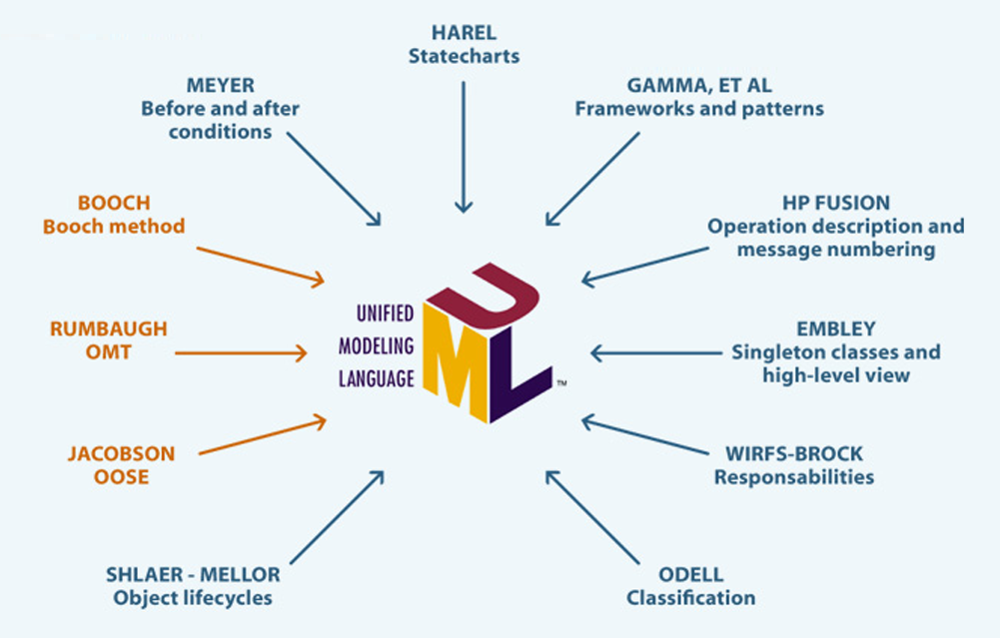
</div>

Observa-se que a UML contou com a participação de outras empresas de peso (como IBM, HP, Oracle, entre outras). Sendo assim, a OMG adotou a **UML versão 1.1** como um padrão oficial em agosto de 1997. Posteriormente, ela foi editada como um padrão internacional pela ISO, sob o código **ISO/IEC 19501:2005**.

A partir daí, a linguagem evoluiu continuamente. A revisão 1.2 foi focada em melhorias estéticas; já a versão 1.3 trouxe mudanças mais significativas. A revisão 1.4 acrescentou os conceitos de componentes e perfis, e a revisão 1.5 adicionou a semântica de ação. Com o passar do tempo, a linguagem passou a integrar conceitos de outros métodos de orientação a objetos, corrigindo diversos bugs e inconsistências até alcançar maturidade suficiente para o grande salto para a **versão UML 2.0**, em meados de 2005. A partir de então, passou por diversas e pequenas atualizações até chegar à versão atual: a **UML 2.5**.

## Definição e Propósito da UML

A UML pode ser definida como uma **linguagem gráfica para especificar, visualizar e documentar artefatos de um sistema, primariamente de software**. Por que "primariamente"? Porque ela tem sido usada efetivamente em diversas outras áreas, a saber: telecomunicações, defesa, aeroespacial, bancária, eletrônica, financeira, entre outras. Logo, a UML não está limitada à modelagem de software. Aliás, ela é uma linguagem tão expressiva que pode modelar outros sistemas complexos, tais como o fluxograma de um sistema judiciário, o comportamento de um sistema de saúde pública ou um projeto de hardware.

Alguns a definem como uma linguagem padrão de modelagem visual usada para modelagem de negócio e processos similares, além da análise, projeto e implementação de sistemas baseados em software. Trata-se de uma linguagem comum para analistas de negócio, arquitetos de software e desenvolvedores, usada tanto para sistemas de software já existentes quanto para novos projetos.

A UML é intencionalmente **independente de processos**, isto é, pode ser aplicada no contexto de diferentes metodologias de desenvolvimento (como RUP, Scrum, XP, etc.). Ademais, é importante notar que ela **não é uma linguagem completa**, ou seja, um único diagrama raramente é suficiente para entender completamente o comportamento de um sistema; e **não é completamente visual**, pois alguns conceitos e restrições não possuem notação gráfica, sendo descritos textualmente.

### Por que utilizar a UML?

Martin Fowler, um renomado autor da área de software, afirma que os principais motivos são a **comunicação** e o **entendimento**. Um bom diagrama frequentemente pode ajudar uma equipe a compreender um problema complexo e a transmitir uma solução de forma clara e eficaz. A notação gráfica da UML serve como um meio-termo ideal entre a imprecisão da linguagem natural e o detalhamento excessivo de uma linguagem de programação.

Pense em como seria especificar um sistema complexo apenas escrevendo ou falando. A quantidade de ambiguidades e mal-entendidos seria imensa, pois a linguagem natural é inerentemente imprecisa. Agora, imagine o oposto: especificar um sistema usando diretamente código C++ ou Java. Já imaginou a reação de um cliente ou analista de negócios ao se deparar com 400 linhas de código para entender o funcionamento de uma única classe? O código detalha em excesso e em um nível de abstração muito baixo. Este equilíbrio já seria um excelente motivo para se utilizar a UML.

Mas resume-se a isso? Não. Ela é uma linguagem completamente **não-dependente de tecnologia**. Isso significa que seus modelos não estão atrelados a uma linguagem de programação específica. É perfeitamente possível modelar um sistema em UML e depois implementá-lo em C++, Java, Python, ou até mesmo em linguagens estruturadas como C, Cobol e Pascal. Ela é independente de linguagem de programação, ferramentas e plataformas.

Hoje em dia, a UML se tornou não somente a notação gráfica mais dominante dentro do mundo orientado a objetos, como também uma técnica popular em círculos não orientados a objetos. Por fim, cabe salientar que a UML é uma verdadeira ferramenta de planejamento, ajudando a apresentar uma visão geral do sistema, tanto do seu estado atual quanto do futuro desejado.

## Estrutura da UML: Especificações e Visões

A UML é formalmente definida por um conjunto de quatro especificações interdependentes, mantidas pela OMG.

|**Especificações UML**|**Descrição**|
|---|---|
|**Infraestrutura**|Especificação que define a base da linguagem, o **core** da sua arquitetura, e os mecanismos de extensão, como perfis e estereótipos.|
|**Superestrutura**|Especificação que define os elementos de modelagem do usuário, tanto os estáticos (estruturais) quanto os dinâmicos (comportamentais).|
|**Object Constraint Language (OCL)**|Especificação que contém a linguagem formal e textual usada para descrever expressões e regras de negócio (como pré e pós-condições) que se aplicam aos modelos UML.|
|**Intercâmbio de Diagramas (DI)**|Especificação que define os formatos padrão para o intercâmbio de diagramas entre diferentes ferramentas CASE, garantindo a interoperabilidade.|

### As Visões Arquiteturais (Modelo 4+1)

Na década de 90, a arquitetura de software padecia de alguns problemas graves. Muitas vezes, enfatizava-se exageradamente apenas um aspecto do desenvolvimento, como a estrutura de dados, negligenciando outros. Em outras vezes, a arquitetura não era descrita de forma a atender aos interesses de todos os envolvidos (stakeholders). Para solucionar essa questão, Philippe Kruchten, trabalhando na Rational, propôs o "Modelo de Visão Arquitetural 4+1", que organiza a descrição da arquitetura de software usando diversas visões concorrentes, cada uma direcionada a um conjunto de interesses específicos. A UML foi projetada para dar suporte a essa abordagem.

|Visões UML|Descrição|
|---|---|
|**Visão Lógica**|Trata-se da visão da arquitetura sob o ponto de vista dos **usuários finais**. Apresenta os requisitos funcionais do software, ou seja, "o que" o sistema faz. Mostra as classes, suas estruturas e seus relacionamentos. Principais diagramas utilizados: Classe, Objetos e Pacotes. (Também chamada de **Visão de Projeto**).|
|**Visão de Desenvolvimento**|Trata-se da visão da arquitetura sob o ponto de vista do **programador**. Apresenta a organização estática dos módulos e componentes que formam o software, focando na gerenciabilidade do código-fonte. Principais diagramas utilizados: Componentes e Pacotes. (Também chamada de **Visão de Implementação**).|
|**Visão de Processo**|Trata-se da visão da arquitetura sob o ponto de vista do **integrador de sistemas**. Apresenta os aspectos dinâmicos, a concorrência e a sincronização. Foca em requisitos não-funcionais como desempenho, escalabilidade e disponibilidade. Principais diagramas utilizados: Sequência, Estrutura Composta, Máquina de Estados e Atividade.|
|**Visão Física**|Trata-se da visão da arquitetura sob o ponto de vista do **engenheiro de sistemas**. Apresenta a topologia da infraestrutura de hardware e como os componentes de software são distribuídos (implantados) nos nós físicos da rede. Principais diagramas utilizados: Implantação. (Também chamada de **Visão de Implantação**).|
|**Visão de Casos de Uso (+1)**|Trata-se da visão central que conecta todas as outras, sob o ponto de vista de **todos os stakeholders**. Descreve os cenários e os requisitos que guiam o projeto arquitetural, apresentando a consistência e a validade do sistema. Principal diagrama utilizado: Casos de Uso. (Também chamada de **Visão de Cenários**).|

<div align="center">
  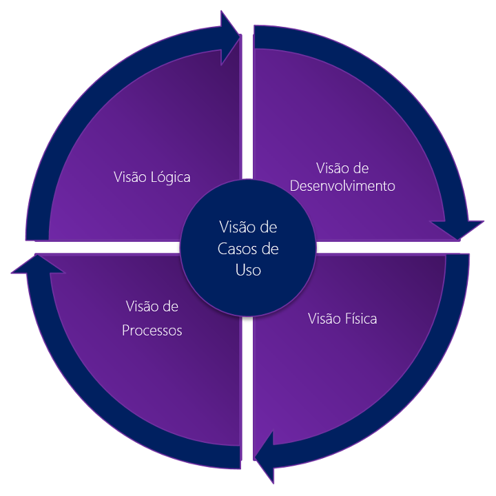
</div>

## Mecanismos Gerais da UML

A UML contém alguns mecanismos de uso geral muito importantes, que permitem estender e detalhar os modelos para além da notação padrão.

|**Mecanismos UML**|**Descrição**|
|---|---|
|**Estereótipo**|Mecanismo utilizado para estender o significado de um elemento do modelo, criando um "novo tipo" de elemento com semântica específica para um domínio ou plataforma.|
|**Notas Explicativas**|Mecanismo utilizado para adicionar comentários, esclarecimentos ou informações textuais a qualquer parte de um diagrama, sem alterar sua semântica.|
|**Tagged Values**|Mecanismo que permite definir novas propriedades (metadados) para os elementos, sempre associadas a um estereótipo.|
|**Restrições**|Mecanismo utilizado para especificar regras ou condições que devem ser verdadeiras para um ou mais elementos de um modelo.|
|**Pacotes**|Mecanismo utilizado para agrupar elementos semanticamente relacionados, organizando o modelo e controlando sua visibilidade (será detalhado no Diagrama de Pacotes).|

### Estereótipos

Estereótipos permitem adaptar ou personalizar modelos com construções específicas para um domínio, plataforma ou método de desenvolvimento particular. Em outras palavras, é o principal mecanismo de extensão da UML, conferindo-lhe mais poder e flexibilidade. Antes, os modeladores estavam limitados aos elementos padrão; com estereótipos, as possibilidades para representar um sistema se tornam praticamente infinitas.

Existem duas classificações independentes para estereótipos:

1. **Quanto à Origem**:
    - **Predefinidos pela Linguagem**: Já vêm nativamente na UML (Ex: `<<interface>>`, `<<trace>>`, `<<entity>>`).
    - **Definidos pelo Usuário**: A equipe de desenvolvimento pode criar seus próprios estereótipos para representar conceitos específicos do seu projeto (Ex: `<<TelaCadastro>>`, `<<ServidorLegado>>`).
2. **Quanto à Representação**:
    - **Textual**: Representado por um nome entre aspas angulares duplas (Ex: `<<control>>`).
    - **Gráfica**: Representado por um ícone específico que substitui o símbolo padrão do elemento, lembrando visualmente o conceito associado.

<div align="center">
  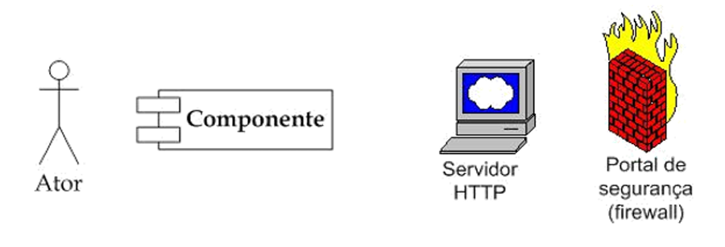
</div>

Na imagem acima, os dois estereótipos à esquerda são predefinidos, enquanto os dois à direita são exemplos de estereótipos que poderiam ser criados pela equipe. Como as classificações são independentes, é possível ter estereótipos gráficos ou textuais, sejam eles predefinidos ou definidos pelo usuário.

### Notas Explicativas

Notas explicativas são utilizadas para definir informações que comentam ou esclarecem alguma parte de um diagrama. Elas podem conter texto livre ou uma expressão formal utilizando a OCL (Object Constraint Language).

Graficamente, as notas são representadas por um retângulo com um canto superior direito dobrado, como uma "orelhinha". O conteúdo da nota é inserido no interior do retângulo, que por sua vez é ligado ao elemento que se quer comentar através de uma linha tracejada. Ao contrário dos estereótipos, as notas não modificam nem estendem o significado do elemento ao qual estão associadas; ou seja, não criam algo novo, apenas explicam ou documentam um elemento existente no modelo sem alterar sua estrutura ou semântica.

<div align="center">
  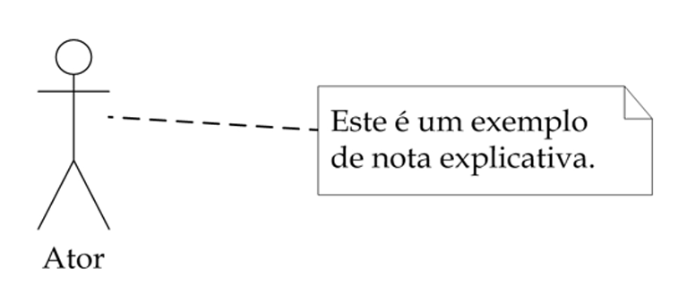
</div>

### Tagged Values (Etiquetas Valoradas)

Elementos UML possuem um conjunto de propriedades predefinidas. As classes, por exemplo, possuem: Nome, Visibilidade, Lista de Atributos e Lista de Operações. As Tagged Values (ou Etiquetas Valoradas) são utilizadas para definir novas propriedades para os elementos de um diagrama. A partir da UML 2.0, as Tagged Values só podem ser utilizadas em conjunto com estereótipos, funcionando como metadados para esses estereótipos. Elas são representadas no formato `{tag = valor}`.

<div align="center">
  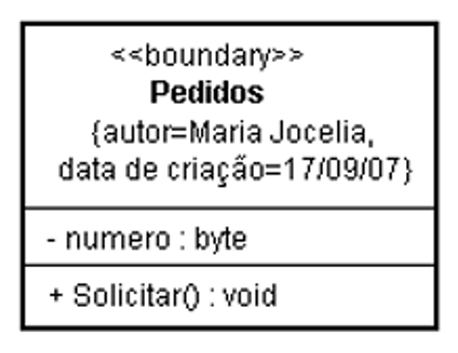
</div>

### Restrições

A todo elemento da UML está associada uma semântica bem definida. As restrições (constraints) permitem estender ou alterar a semântica natural de um elemento, especificando condições ou regras que devem ser satisfeitas. Esse mecanismo geral especifica limitações sobre um ou mais valores de um ou mais elementos de um modelo.

As restrições podem ser especificadas formalmente, através da OCL, ou informalmente, com texto livre em linguagem natural. Em ambos os casos, devem vir delimitadas por chaves `{}` e, frequentemente, são colocadas dentro de notas explicativas anexadas aos elementos que restringem.

## Visão Geral dos Diagramas UML

A Modelagem Orientada a Objetos ocorre quase sempre por meio da **Unified Modeling Language**. A UML 2.5 descreve 14 tipos de diagramas oficiais, divididos em duas categorias principais, que por sua vez se subdividem.

<div align="center">
  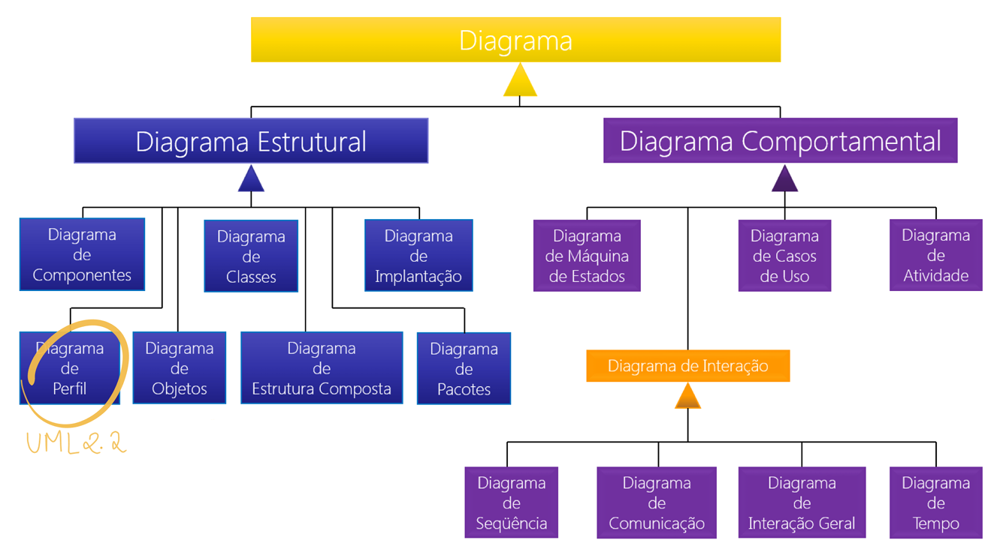
</div>

|**Tipos de Diagramas**|**Descrição**|
|---|---|
|**Diagramas Estruturais**|Representam os aspectos **estáticos** do sistema sob diversas visões. Em outras palavras, esses diagramas apresentam a estrutura do sistema, seus componentes e seus relacionamentos, sem levar em consideração a passagem do tempo. São eles: Diagrama de Classes, de Componentes, de Implantação, de Perfil, de Objetos, de Estrutura Composta e de Pacotes.|
|**Diagramas Comportamentais**|Representam os aspectos **dinâmicos** do sistema como um conjunto de mudanças e interações ao longo do tempo. Descrevem como os processos e funcionalidades do programa se relacionam e se comportam. São eles: Diagrama de Máquina de Estados, de Casos de Uso, de Atividade, de Sequência, de Comunicação, de Visão Geral da Interação e de Tempo.|
|**Diagramas de Interação**|Trata-se de um **subconjunto** dos diagramas comportamentais que focam especificamente no relacionamento dinâmico e colaborativo entre os objetos do sistema e suas trocas de mensagens. Eles enfatizam o controle de fluxo e o fluxo de dados entre os elementos. São eles: Diagrama de Sequência, de Comunicação, de Visão Geral da Interação e de Tempo.|

## Diagramas Estruturais

### Diagrama de Classes

O diagrama de classes é facilmente o diagrama mais conhecido e importante entre todos os outros. Ele descreve as classes e interfaces presentes no sistema, suas características, restrições e os vários tipos de relacionamentos estáticos entre seus objetos. Representam-se também as propriedades e as operações de uma classe, assim como as restrições que se aplicam à maneira como os objetos estão conectados.

<div align="center">
  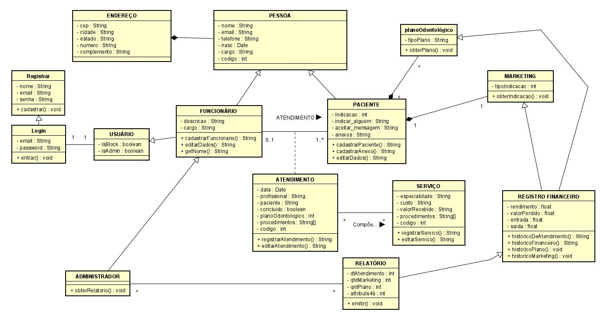
</div>

Uma classe é uma estrutura classificadora que abstrai um conjunto de objetos que compartilham características, restrições e semânticas similares. Ela define, também, o comportamento de seus objetos através de métodos e o estado por meio de atributos.

Pode-se representar uma classe de diversas formas, dependendo do nível de abstração: primeiro, apenas com nome da classe (mais abstrata); segundo, com nome da classe e suas propriedades; e terceiro, com nome da classe, suas propriedades e suas operações (mais concreta).

<div align="center">
  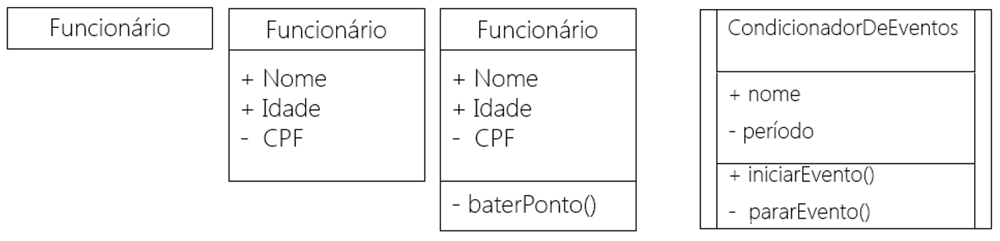
</div>

A classe com borda dupla na imagem é a representação do que chamamos de **Classe Ativa**, que tem por objetivo representar classes cujos objetos têm um ou mais processos (threads). É possível inserir detalhes de implementação da linguagem de programação escolhida no diagrama.

**Representação de Membros:**

- Um atributo estático é representado sublinhando o nome do atributo.
- Uma operação abstrata é representada com seu nome em itálico.
- Uma operação estática é representada com seu nome sublinhado.

Com relação a visibilidade dos membros, as tabelas abaixo apresentam a diferença de visibilidade dos modificadores da Linguagem Java e a UML.

- **Tabela de modificadores UML**

|Modificador|Símbolo|Classe|Subclasse|Pacote|Todos|
|---|---|---|---|---|---|
|Público|+|X|X|X|X|
|Protegido|#|X|X|-|-|
|Pacote|~|X|-|X|-|
|Privado|–|X|-|-|-|

- **Tabela de modificadores Java**

|Modificador|Símbolo|Classe|Subclasse|Pacote|Todos|
|---|---|---|---|---|---|
|Público|+|X|X|X|X|
|Protegido|#|X|X|X|-|
|Default|~|X|-|X|-|
|Privado|–|X|-|-|-|

Existem duas diferenças sutis: (1) na UML, um elemento protegido não é visível para elementos dentro do mesmo pacote; e (2) o Nível Pacote da UML é chamado de Nível Default em Java. Segue um exemplo de classe com diferentes modificadores:

<div align="center">
  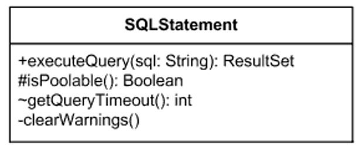
</div>

#### Tipos de Relacionamentos

Eles representam as conexões entre classes, objetos, pacotes, tabelas, entre outros. Há três tipos de relacionamentos entre classes: Dependência, Generalização e Associação.

<div align="center">
  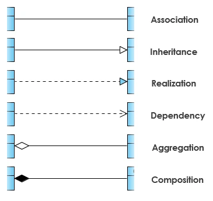
</div>

- **Relacionamento de Dependência**: É um relacionamento direcionado e semântico entre dois ou mais elementos que ocorre se mudanças na definição de um elemento (independente) causarem mudanças ao outro elemento (dependente). Em outras palavras, é quando a classe cliente é dependente de algum serviço da classe fornecedora. O relacionamento de dependência é representado por uma seta tracejada que aponta para classe independente. Os relacionamentos `<<include>>` e `<<extend>>` também são relacionamentos de dependência.

<div align="center">
  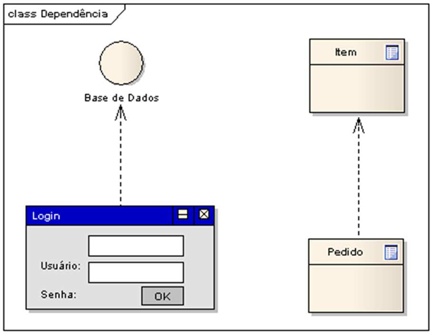
</div>

- **Relacionamento de Generalização/Especialização (Herança)**: Indica que a subclasse é uma especialização da superclasse ou que a superclasse é uma generalização da subclasse. Qualquer instância da subclasse é também uma instância da superclasse. É conhecido como relacionamento de herança, relacionamento de extensão ou relacionamento “é-um”. É representado por uma linha com um triângulo que aponta para a classe genérica.

<div align="center">
  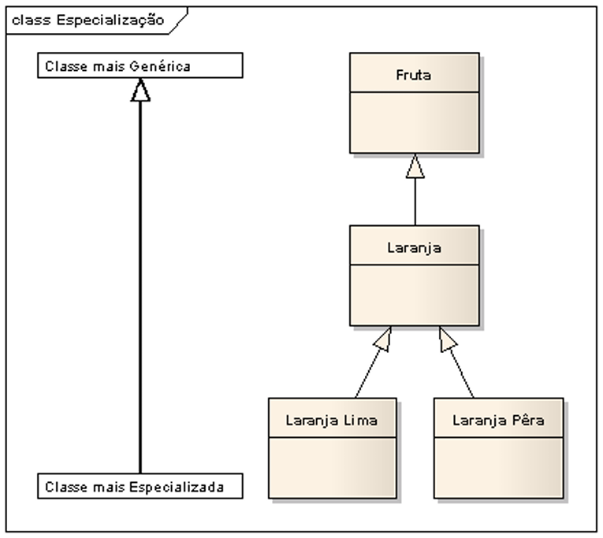
</div>

- **Relacionamento de Realização**: Relacionamento entre dois elementos em que um elemento realiza (implementa/executa) o comportamento que o outro elemento especifica. Costuma-se dizer que um dos elementos especifica um contrato e o outro elemento realiza esse contrato. É representado por uma linha tracejada com um triângulo que aponta para a interface.

<div align="center">
  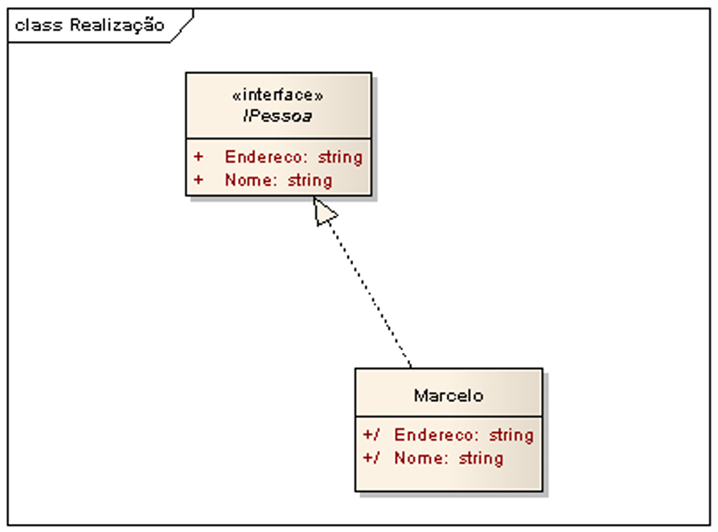
</div>

- **Relacionamento de Associação:** Relacionamento estrutural entre objetos que especifica os objetos de uma classe que estão ligados a objetos de outra classe.

- **Associação Simples**: É um tipo de relacionamento mais forte que o de dependência e indica que uma instância de um elemento está ligada à instância de outro elemento. São representados por uma linha sólida com ou sem setas de navegabilidade. Pode haver nomes para a associação e indicação de multiplicidade.

<div align="center">
  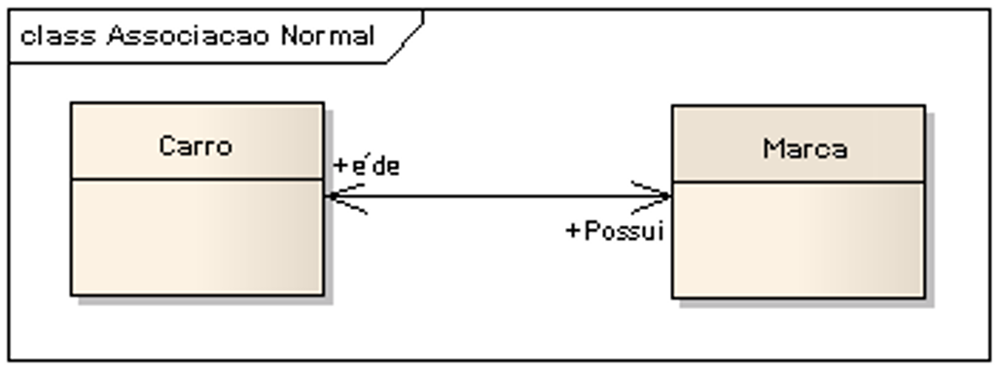
</div>

- **Associação Qualificada**: É um tipo de relacionamento similar à associação simples, contudo possui um qualificador, que é um atributo do elemento-alvo capaz de identificar uma instância dentre as demais. Ela ocorre em associações um-para-muitos ou muitos-para-muitos em que se deseja encontrar um elemento específico dada uma chave. É representado por uma linha sólida com um retângulo ao lado da classe de cardinalidade 1 contendo o qualificador.

<div align="center">
  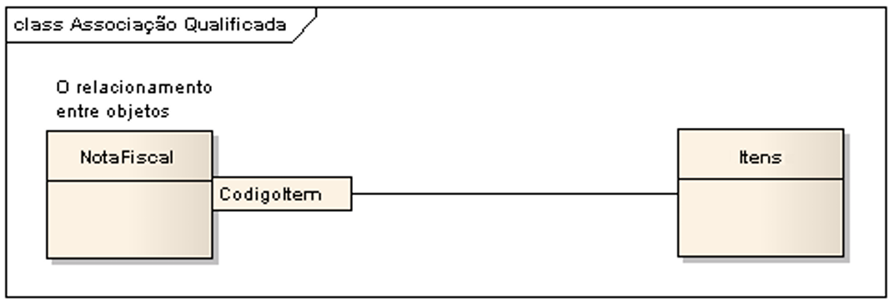
</div>

- **Agregação**: É um tipo de associação, porém mais forte, em que o todo está relacionado às suas partes de forma independente. Nesse tipo de relacionamento, as partes têm existência própria. É representado por uma linha com um diamante vazio na extremidade referente ao todo.

<div align="center">
  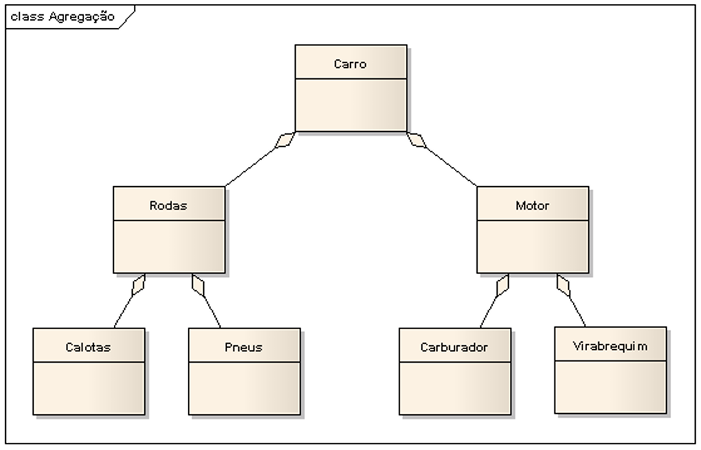
</div>

- **Composição**: É um tipo de agregação (inclusive, é chamado algumas vezes de Agregação por Composição), porém mais forte, em que o todo está relacionado às partes de forma dependente. Nesse relacionamento, as partes não têm existência própria. É representado por uma linha com um diamante cheio na extremidade referente ao todo.

<div align="center">
  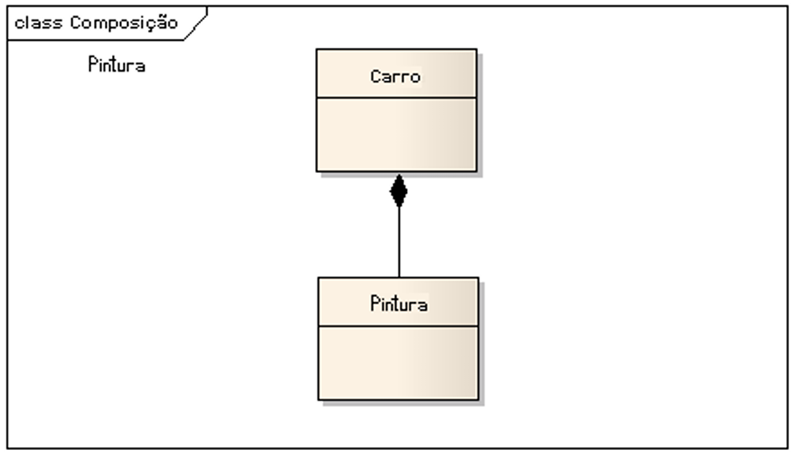
</div>

Segue um resumo visual geral dos relacionamentos:

<div align="center">
  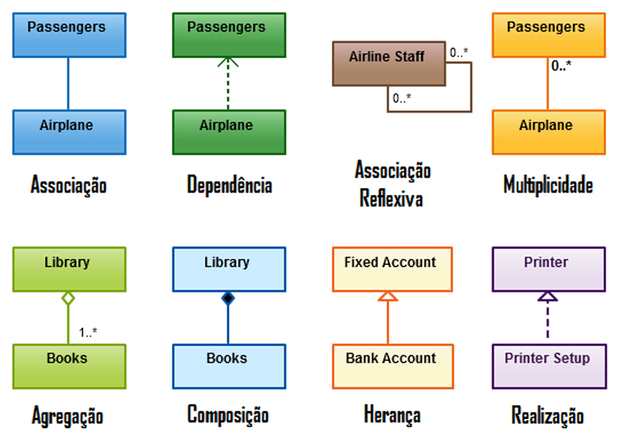
</div>

- **Associação**: mostra que os passageiros e o avião possuem alguma ligação;
- **Dependência**: mostra que o avião depende de passageiros;
- **Associação Reflexiva**: mostra que a equipe do avião se relaciona entre si;
- **Multiplicidade**: mostra que um avião possui zero ou mais passageiros;
- **Agregação**: mostra que uma biblioteca tem um ou mais livros (independentes). Nesse entendimento, livros continuarão a existir mesmo sem bibliotecas;
- **Composição**: mostra que uma biblioteca tem livros (necessariamente). Nesse entendimento, livros só podem existir como parte de uma biblioteca;
- **Herança**: mostra que uma conta bancária é filha de conta fixa;
- **Realização**: setup da impressora implementa funcionalidades da impressora.

#### Quando Utilizar o Diagrama de Classes?

Os Diagramas de Classe são considerados a espinha dorsal da UML e, por isso, são utilizados constantemente. No entanto, seu maior problema reside na riqueza de detalhes, que pode torná-los excessivamente complexos. Por esse motivo, não se recomenda o uso de todas as notações disponíveis. A utilização de diagramas de classes conceituais é especialmente útil para a exploração da linguagem do negócio. É importante manter o foco fora do software durante a discussão e adotar uma notação mais simples. Não é necessário modelar todos os aspectos; o ideal é concentrar-se nas áreas mais relevantes. É preferível dispor de poucos diagramas que sejam efetivamente utilizados e mantidos atualizados do que ter uma grande quantidade de modelos esquecidos e obsoletos. O principal risco está em concentrar-se unicamente na estrutura, negligenciando o comportamento. Por isso, ao elaborar diagramas de classe com o objetivo de compreender o software, é essencial associá-los a alguma técnica comportamental.

### Diagrama de Objetos

O **Diagrama de Objetos** (também conhecido como **Diagrama de Instâncias**) é uma variação do Diagrama de Classes que representa uma **fotografia estática do sistema em um dado momento da execução**. Ao contrário do Diagrama de Classes, que apresenta a estrutura geral do sistema por meio de suas classes, o Diagrama de Objetos mostra **instâncias específicas**, ou seja, objetos reais que estão ativos em determinado instante. Por essa razão, é comum que esse tipo de diagrama seja referido como **Diagrama de Instâncias**.

Enquanto no Diagrama de Classes se modela, por exemplo, a classe `Pessoa`, no Diagrama de Objetos se encontra a instância específica “João”. Em vez de `Carro`, tem-se “Pálio”; em vez de `Cachorro`, tem-se “Totó”. Portanto, este diagrama é uma representação concreta e personalizada dos elementos do sistema em tempo de execução, contendo **valores reais de atributos e os vínculos entre os objetos** naquele momento.

<div align="center">
  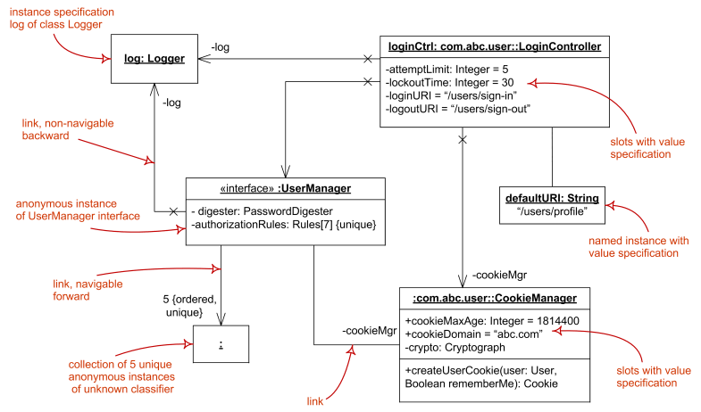
</div>

Em termos técnicos, os elementos de um Diagrama de Objetos são chamados de **especificações de instância**, e não instâncias verdadeiras. Isso se deve ao fato de que, nesses diagramas, é aceitável **deixar atributos obrigatórios em branco** ou até mesmo representar **instâncias de classes abstratas** – situações que não ocorreriam durante a execução real do sistema, mas que são úteis para fins de modelagem.

A **sintaxe dos nomes** em um Diagrama de Objetos segue a forma geral:

```
NomeDeInstância:NomeDaClasse
```

Ambas as partes são opcionais, mas se for utilizado apenas o nome da classe, os dois-pontos devem ser mantidos. Quando os nomes estão **sublinhados**, significa que o elemento representado é uma instância.

A tabela a seguir apresenta as formas mais comuns de representação de nomes:

|Representação do Nome|Descrição|
|---|---|
|`:`|Significa que se trata de uma instância anônima de uma classe anônima.|
|`:Cliente`|Significa que se trata de uma instância anônima da classe Cliente.|
|`NovoCliente:`|Significa que se trata de uma instância NovoCliente de uma classe anônima.|
|`NovoCliente:Cliente`|Significa que se trata de uma instância NovoCliente de uma classe Cliente.|
|`NovoCliente:Clientes::Cliente`|Significa que se trata de uma instância NovoCliente de uma classe Cliente de um pacote Clientes.|

#### Quando Utilizar o Diagrama de Objetos?

O Diagrama de Objetos é especialmente útil quando se deseja **ilustrar exemplos concretos de objetos interligados**, permitindo uma visualização mais clara das relações em tempo de execução. Em muitos casos, mesmo com um Diagrama de Classes bem definido, a estrutura geral do sistema pode parecer abstrata ou difícil de compreender. Nesses contextos, o Diagrama de Objetos pode **facilitar a validação, o entendimento do domínio modelado e a comunicação entre analistas e desenvolvedores**.

Esse tipo de diagrama pode ser comparado a um **Diagrama de Comunicação sem as mensagens**, já que se concentra na disposição e nos relacionamentos entre os objetos, sem representar explicitamente o fluxo de interações entre eles.

Apesar de não ser tão utilizado quanto outros diagramas da UML, sua aplicação é valiosa em situações onde se deseja **esclarecer aspectos específicos de um Diagrama de Classes**, principalmente para ilustrar **relações complexas** entre os objetos do sistema.

### Diagrama de Componentes

O Diagrama de Componentes representa o sistema sob uma perspectiva funcional, expondo a organização de seus módulos e as relações entre seus componentes por meio de interfaces. Um **componente** é uma unidade independente, que pode ser utilizada ou substituída com/por outros componentes para formar um sistema complexo. Eles representam peças que podem ser adquiridas e atualizadas independentemente, como tabelas, documentos, etc. Sua grande vantagem é a modularidade.

<div align="center">
  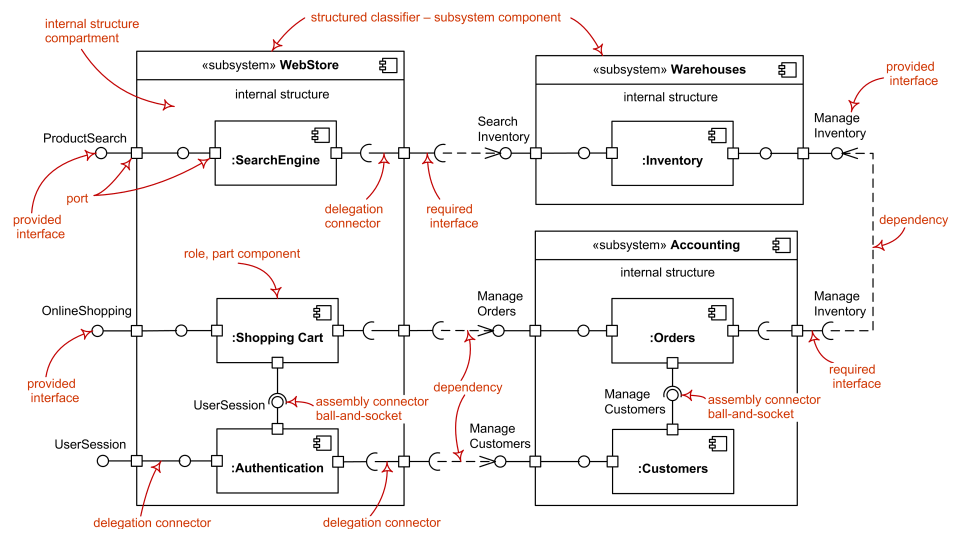
</div>

Os componentes são representados como retângulos com o símbolo de componente no canto superior direito.

<div align="center">
  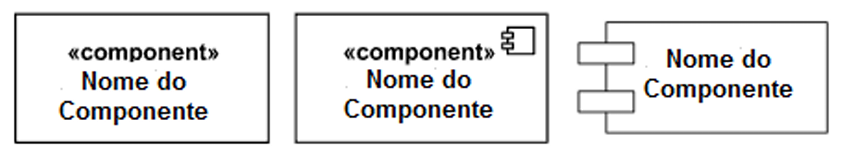
</div>

Um componente pode apresentar um estereótipo. Os principais são:

- `<<Arquivo>>`: determina que o componente é um arquivo de dados do sistema.
- `<<Biblioteca>>`: determina que o componente é uma biblioteca de código.
- `<<Documento>>`: determina que o componente é um documento de sistema.
- `<<Executável>>`: determina que o componente é um arquivo executável.
- `<<Tabela>>`: determina que o componente é uma tabela de um banco de dados.

<div align="center">
  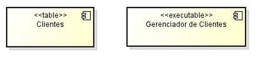
</div>

Temos também a **Interface Fornecida** (esquerda), que designa uma interface que o próprio componente possui e oferece para outros componentes, e a **Interface Requerida** (direita), que designa uma interface necessária para que o componente se comunique com outros.

<div align="center">
  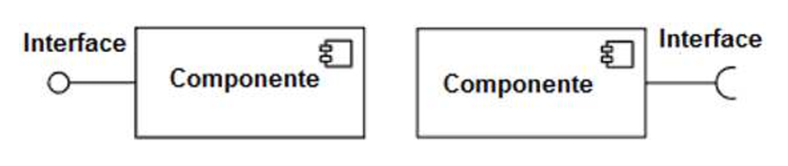
</div>

#### Quando Utilizar o Diagrama de Componentes?

Utiliza-se o **Diagrama de Componentes** quando se deseja representar a **organização física do sistema**, ou seja, **como o software é dividido em partes reutilizáveis e independentes** — os chamados **componentes**. Esse tipo de diagrama é ideal para **visualizar, documentar e projetar a arquitetura do sistema** em termos de módulos ou unidades de implementação, especialmente em sistemas grandes e complexos. É útil para:

- **Dividir o sistema em módulos reutilizáveis** e independentes;
- **Mostrar a comunicação entre componentes** através de interfaces fornecidas e requeridas;
- **Representar a decomposição interna de um componente**, revelando suas partes e dependências;
- **Documentar a arquitetura física** do sistema, como bibliotecas, pacotes, arquivos compilados ou serviços externos;
- **Projetar sistemas baseados em serviços** ou microsserviços, com foco na integração de módulos.

Ideal para fases de **arquitetura, integração e implantação**, esse diagrama facilita a visualização da **estrutura física e das dependências** do software.

### Diagrama de Pacotes

O **Diagrama de Pacotes** é utilizado para representar **pacotes e as dependências existentes entre eles** dentro de um sistema. Mas afinal, o que é um pacote? Na UML, um pacote é um **agrupamento lógico de elementos modelados**, que permite organizar classes, interfaces, componentes e outros artefatos em **unidades de mais alto nível**. Embora os pacotes comumente agrupem classes, eles também podem conter outros pacotes, formando uma **estrutura hierárquica**, em que pacotes de nível superior são subdivididos em **subpacotes**, e assim sucessivamente.

<div align="center">
  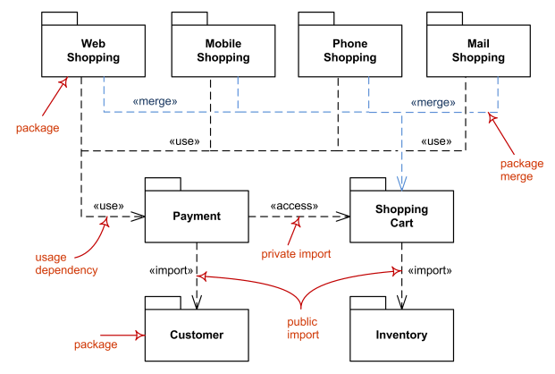
</div>

Visualmente, os pacotes são representados como **pastas**, podendo conter **classes ou outros pacotes internos**. Esse tipo de diagrama fornece uma **visão macro da organização do sistema**, facilitando o entendimento de sua **arquitetura em camadas ou módulos**. A ideia principal é permitir uma separação clara entre diferentes partes da aplicação, promovendo **melhor modularidade, reutilização de código e manutenção**.

O Diagrama de Pacotes é particularmente útil quando se deseja representar **dependências entre agrupamentos lógicos**, como as relações entre diferentes módulos, subsistemas ou camadas arquiteturais de uma aplicação. Ele é uma ferramenta eficaz para ilustrar como os pacotes se comunicam, **quem depende de quem**, e até mesmo para identificar **possíveis acoplamentos excessivos** ou **ciclos indesejados de dependência**, o que é essencial em projetos de grande escala.

#### Quando Utilizar o Diagrama de Pacotes?

Os Diagramas de Pacote devem ser utilizados quando se busca **compreender e gerenciar a estrutura modular de sistemas grandes e complexos**. Eles permitem obter uma **visão clara das dependências entre os principais elementos** da aplicação, o que é fundamental para **manter a arquitetura organizada e coesa**. Além disso, esses diagramas refletem bem as **estruturas típicas de programação**, como diretórios, namespaces ou módulos de código-fonte.

Outro ponto relevante é que os diagramas de pacotes atuam como um mecanismo de agrupamento em **tempo de compilação**, ou seja, ajudam a organizar os artefatos de software ainda durante o desenvolvimento. Caso se deseje representar **a composição dinâmica de objetos em tempo de execução**, recomenda-se, em vez disso, a utilização do **Diagrama de Estrutura Composta**, que é mais apropriado para esse fim.

### Diagrama de Implantação (ou Instalação)

O **Diagrama de Implantação**, também chamado de **Diagrama de Instalação** ou **Diagrama de Distribuição**, tem como principal objetivo representar o **layout físico de um sistema**, indicando **quais partes do software estão instaladas e executadas em quais partes do hardware**. É um dos principais diagramas da UML utilizados durante as fases de **implantação, configuração e manutenção** de sistemas distribuídos ou complexos.

<div align="center">
  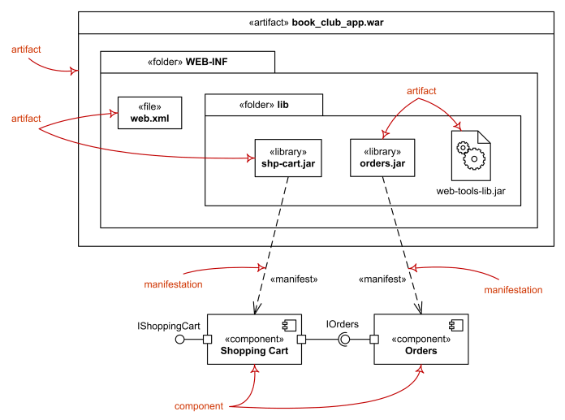
</div>

Nesse tipo de diagrama, os elementos centrais são os **nós**, que representam unidades físicas ou lógicas de execução. Os nós são conectados por **caminhos de comunicação**, que mostram como ocorre a troca de informações entre eles. Um **nó** pode ser um **dispositivo físico**, como um servidor ou computador, ou um **ambiente de execução**, como um sistema operacional, uma máquina virtual, um contêiner ou qualquer outro software capaz de hospedar componentes executáveis.

Os nós contêm **artefatos**, que são as **manifestações físicas do software** – ou seja, arquivos que serão efetivamente implantados no ambiente de execução. Esses artefatos podem incluir arquivos **executáveis** (como `.exe` ou binários), arquivos de **dados**, arquivos de **configuração**, **scripts**, **documentos HTML**, entre outros. A presença de um artefato em um nó indica que ele está **instalado naquele ponto específico da infraestrutura**. Em UML, os artefatos podem ser representados de duas formas: como **caixas nomeadas com a palavra-chave `<<artifact>>`** ou apenas listados dentro do nó.

Os nós e artefatos podem ser **rotulados com informações adicionais**, como o nome do fornecedor, o sistema operacional utilizado, a localização física do servidor ou qualquer outro detalhe relevante para o contexto de implantação. Em cenários em que múltiplos nós físicos realizam a **mesma função lógica**, pode-se representar isso utilizando **várias instâncias de nós** ou indicando a **quantidade** com um valor afixado no diagrama.

Os **caminhos de comunicação** entre os nós indicam **como os componentes trocam dados**, podendo ser rotulados com os **protocolos utilizados**, como HTTP, FTP, TCP/IP, etc. Esses caminhos representam as **interfaces físicas ou lógicas de comunicação**, tais como redes locais, conexões remotas, filas de mensagens ou outras formas de integração.

Um aspecto importante é que **os Diagramas de Implantação não dizem respeito diretamente à codificação do sistema**, sendo mais relevantes para a **equipe de infraestrutura, operações ou DevOps**, que se responsabiliza por definir a **topologia física do sistema, a distribuição dos componentes de software e os requisitos de ambiente**.

#### Quando Utilizar o Diagrama de Implantação?

O Diagrama de Implantação é especialmente útil em **sistemas distribuídos, aplicações corporativas complexas ou soluções que exigem múltiplos ambientes**, como servidores de aplicação, bancos de dados, serviços em nuvem, gateways de comunicação, entre outros. Ele permite compreender **o que está instalado, onde está instalado e como os componentes interagem fisicamente entre si**.

Sempre que a implantação envolver **diversos nós físicos ou virtuais**, **arquiteturas baseadas em múltiplos servidores**, **distribuição em ambientes heterogêneos** ou **requisitos específicos de comunicação entre módulos**, esse diagrama se torna essencial para **garantir clareza, rastreabilidade e organização na entrega do sistema**.

### Diagrama de Perfil

O **Diagrama de Perfil** é utilizado quando se deseja **especializar a UML para uma área de domínio específica** ou para um propósito particular, como geração de código em uma linguagem específica ou modelagem de sistemas não contemplados diretamente pelos elementos padrões da UML. Em vez de criar uma nova linguagem de modelagem, o Diagrama de Perfil permite **estender a própria UML** utilizando elementos definidos sobre sua estrutura original.

<div align="center">
  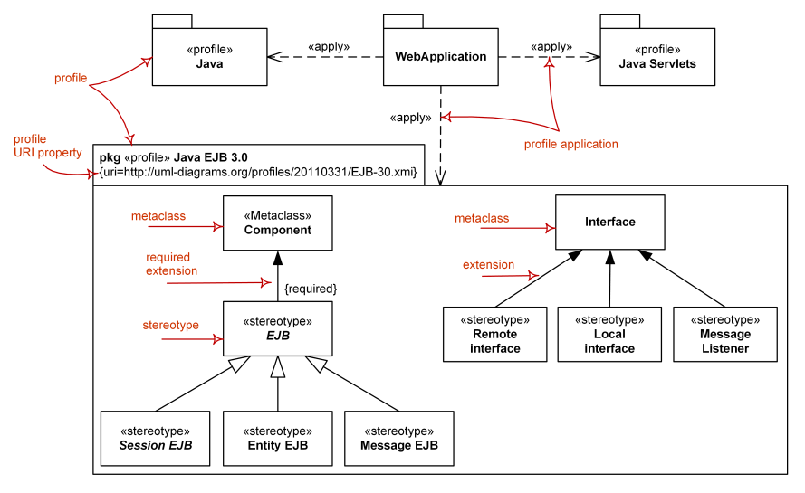
</div>

Esses perfis são compostos por um **conjunto de estereótipos predefinidos, valores atribuídos, restrições e metaclasses base**, selecionando um **subconjunto dos elementos da UML** para uso e adaptando-os a contextos específicos. Isso significa que um perfil **não é uma nova linguagem de modelagem**, mas sim uma **customização da UML**, podendo ser interpretado por qualquer ferramenta que suporte a linguagem padrão. Por isso, os perfis são amplamente utilizados por **criadores de frameworks, desenvolvedores de ferramentas e arquitetos de software**, enquanto os modeladores em geral apenas **utilizam** esses perfis prontos, sem a necessidade de criá-los do zero.

Um exemplo comum de uso de perfis é a especialização da UML para **linguagens de programação específicas**, como Java ou C++. Cada linguagem pode demandar estereótipos distintos para orientar a geração de código – por exemplo, um estereótipo `<<DAO>>` pode ser usado para marcar uma classe como um objeto de acesso a dados em Java. Também é possível utilizar perfis para modelar **bancos de dados**, **redes de computadores** (com estereótipos como `<<roteador>>` ou `<<switch>>`), **sistemas embarcados**, **processos de negócio** ou qualquer outro domínio técnico.

A UML já oferece **estereótipos padronizados**, como `<<interface>>`, `<<include>>`, `<<extend>>` e `<<actor>>`. Contudo, o modelador pode criar **seus próprios estereótipos personalizados** para representar relações ou elementos semânticos específicos que não estão contemplados na linguagem padrão. Por exemplo, caso se queira expressar a ação de sacar dinheiro em um relacionamento entre "Pessoa" e "Dinheiro", pode-se criar o estereótipo `<<sacar>>` e usá-lo na modelagem para representar semanticamente esse vínculo.

#### Perfis, Metamodelos e Metaclasses

Para compreender plenamente o Diagrama de Perfil, é necessário entender o **nível de metamodelagem** em que ele opera. A UML é baseada em um metamodelo, ou seja, **uma linguagem que define os elementos que podem compor um modelo**. Em outras palavras, enquanto um **modelo** descreve uma visão específica de um sistema real (por exemplo, um modelo que representa a estrutura de um sistema bancário), o **metamodelo** descreve **os conceitos e regras usados para construir esse modelo** (como classe, associação, atributo, operação, etc.).

Cada elemento de um modelo UML é uma **instância de um elemento do metamodelo**. Assim, quando desenhamos uma classe, estamos instanciando a metaclasse `Class` do metamodelo da UML. Quando aplicamos um estereótipo sobre uma classe, estamos estendendo a semântica dessa metaclasse com um novo significado ou comportamento.

A **metaclasse** é, portanto, uma classe do metamodelo que pode ser **estendida por estereótipos**, adicionando atributos, restrições e propriedades adicionais. Isso permite que os perfis expressem **variações semânticas ou sintáticas** de um elemento UML para contextos específicos, mantendo a conformidade com a linguagem padrão.

#### Quando Utilizar o Diagrama de Perfil?

Utiliza-se o Diagrama de Perfil quando há a necessidade de **personalizar a UML para um domínio de aplicação, ferramenta, linguagem de programação ou contexto técnico específico**, sem romper com a estrutura da linguagem. Ele é particularmente útil:

- Quando se deseja **adicionar semântica adicional** aos elementos da UML usando **estereótipos personalizados**;
- Quando é necessário **definir regras específicas** de modelagem que não estão contempladas na UML padrão;
- Para **aumentar a expressividade do modelo**, tornando-o mais próximo da realidade do domínio representado;
- Em projetos que utilizam **ferramentas de geração automática de código, documentação ou validação**, onde os estereótipos orientam o comportamento das ferramentas;
- Para **organizar modelos reutilizáveis** em **bibliotecas de modelagem específicas de domínio**, aumentando a produtividade e a padronização em equipes de desenvolvimento.

Em resumo, o Diagrama de Perfil permite que a UML **se adapte aos mais variados contextos sem perder sua base formal**, oferecendo uma forma estruturada e extensível de aplicar a linguagem em qualquer tipo de sistema.

### Diagrama de Estrutura Composta

O **Diagrama de Estrutura Composta** é utilizado para **modelar a estrutura interna de elementos de modelagem**, como **classes, interfaces e componentes**, revelando as **colaborações internas** necessárias para realizar uma determinada funcionalidade. A ideia central é representar **como as partes de um sistema colaboram entre si em tempo de execução**, indo além da estrutura externa mostrada em diagramas de classes tradicionais.

<div align="center">
  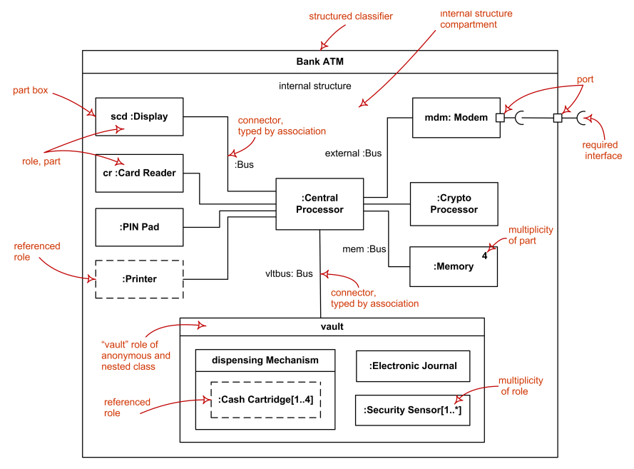
</div>

Um conceito-chave nesse tipo de diagrama é o de **colaboração**, que pode ser entendida como uma **visão de um conjunto de entidades cooperativas**, geralmente instâncias de classes ou componentes, que **trabalham juntas para cumprir um comportamento ou realizar uma operação específica**. Uma colaboração, inclusive, pode ser composta por outras colaborações, reforçando o caráter hierárquico e dinâmico desse tipo de modelagem.

O Diagrama de Estrutura Composta permite detalhar **como um elemento é construído internamente**, destacando suas **partes constituintes**, suas **conexões e interações internas** e as **interfaces pelas quais se comunica com o exterior**. Ele é especialmente útil para especificar **a composição de componentes, a conexão entre objetos internos e os pontos de interação com o meio externo**, tudo isso dentro do escopo de uma única entidade modelada.

Esse diagrama surgiu com a introdução da **UML 2.0** e representou um avanço em relação à modelagem estrutural, fornecendo meios de capturar informações mais ricas sobre **a organização interna de classes e componentes**, o que antes não era possível com os diagramas disponíveis na UML 1.x.

#### Quando Utilizar o Diagrama de Estrutura Composta?

O Diagrama de Estrutura Composta deve ser utilizado quando há a necessidade de **representar a composição interna de um elemento em tempo de execução**, especialmente em contextos onde a **interação entre partes internas** é relevante para o funcionamento do sistema.

Uma boa analogia para diferenciá-lo de outros diagramas é compará-lo ao Diagrama de Pacotes: enquanto os **Diagramas de Pacote** representam **agrupamentos lógicos em tempo de compilação**, as **estruturas compostas mostram a composição dinâmica dos elementos em tempo de execução**. Assim, esse diagrama é indicado para modelar **componentes divididos internamente em partes**, **classes que se comunicam com subcomponentes internos** ou **interfaces que conectam blocos funcionais dentro de uma aplicação**.

Apesar de sua proposta rica e detalhada, é importante destacar que o Diagrama de Estrutura Composta **ainda é pouco utilizado na prática**. Muitos modeladores e engenheiros de software consideram sua notação excessivamente complexa ou redundante em comparação com outros diagramas já consolidados, como os de **componentes**, **classes** e **sequência**. Inclusive, há registros de que dentro do próprio comitê organizador da UML houve discussões quanto à real utilidade e aplicação prática desse diagrama.

Mesmo assim, em sistemas complexos, orientados a componentes, ou que requerem uma descrição formal da **composição e conectividade interna**, o Diagrama de Estrutura Composta pode ser uma ferramenta poderosa para enriquecer a documentação e a compreensão do projeto.

## Diagramas Comportamentais

### Diagrama de Casos de Uso

Casos de Uso são uma técnica para captar os requisitos funcionais de um sistema, descrevendo as interações de usuários com o sistema. Um **cenário** é uma instância de um caso de uso. O diagrama descreve um conjunto de funcionalidades do sistema e interações com elementos externos (**Atores**) e entre si. Um ator pode ser um humano, uma máquina ou outro sistema.

[Figura - Diagrama de Caso de Uso]

- **Tipos de Casos de Uso:**
    - **Concreto:** Iniciado por um ator, constitui um fluxo completo de eventos.
    - **Abstrato:** Jamais é instanciado diretamente, é incluído, estendido ou generalizado por outros (representado com nome em itálico).
    - **Primário:** Representa os objetivos principais dos atores.
    - **Secundário:** Necessário para o sistema funcionar, mas não traz benefício direto aos atores.
- **Relacionamentos:**
    - Comunicação: Ligação entre ator e caso de uso.
        [Figura - Representação do Relacionamento de Comunicação]
    - Inclusão (`<<include>>`): Comportamento obrigatório e repetido. Quando o caso de uso A “inclui” o caso de uso B, significa que sempre que A for executado, B também será. A seta vai do caso de uso que inclui para o incluído.
        [Figura - Representação do Relacionamento de Inclusão]
    - Extensão (`<<extend>>`): Comportamento alternativo ou opcional. Quando B estende A, significa que quando A for executado, B poderá ser executado também. A seta vai do caso de uso extensor para o estendido.
		[Figura - Representação do Relacionamento de Extensão]
    - Herança: Relacionamento entre atores ou entre casos de uso para reaproveitar comportamentos.
        [Figura - Representação do Relacionamento de Herança]

|Relações|Comunicação|Extensão|Inclusão|Herança|
|---|---|---|---|---|
|Entre casos de uso|-|X|X|X|
|Entre atores|-|-|-|X|
|Entre casos de uso e atores|X|-|-|-|

#### Quando Utilizar o Diagrama de Casos de Uso?

São uma ferramenta valiosa para ajudar no entendimento dos requisitos funcionais. Uma primeira passagem deve ser feita no início do projeto. É importante lembrar que casos de uso representam uma visão externa do sistema. Concentra-se energia mais no texto do que no diagrama; é esse texto que contém todo o valor da técnica.

### Diagrama de Atividades

O Diagrama de Atividades descreve lógica de procedimento, processo de negócio e fluxos de trabalho. Ele desempenha um papel semelhante aos fluxogramas, mas suporta comportamentos paralelos. Uma **atividade** é um comportamento parametrizado representado como um fluxo coordenado de ações. O diagrama não se preocupa com interações entre objetos, mas entre processos de negócios de mais alto nível. Os estados mudam quando uma ação é executada.

Pode ser representado por meio de **swimlanes** (raias), que agrupam as atividades e as organizam de acordo com suas respectivas responsabilidades.

[Figura - Diagrama de Atividades]

- **Ramificações:** Especificam caminhos alternativos baseados em expressões booleanas (representadas com um diamante).
    
- **Bifurcação (Fork) e União (Join):** A bifurcação é a divisão de um fluxo em dois ou mais fluxos concorrentes. A união é a sincronização desses fluxos. Uma barra de sincronização é usada para especificar ambos.
    

#### Quando Utilizar o Diagrama de Atividades?

A maior qualidade dos Diagramas de Atividades está no fato de que eles suportam e estimulam o comportamento paralelo. Isso os torna uma excelente ferramenta para modelagem de fluxos de trabalho e de proc6essos.

### Diagrama de Máquina de Estados

Também conhecido como Diagrama de Transição de Estados, apresenta diversos estados possíveis de um objeto no decorrer da execução de processos de um sistema. Um objeto pode passar de um estado inicial para um estado final, por meio de uma transição, quando ocorre algum evento ou estímulo. Ele mostra o ciclo de vida de objetos e como eles são afetados por eventos.

[Figura - Diagrama de Máquina de Estados]

É necessário distinguir Diagrama de Atividades e Diagrama de Máquina de Estados. No primeiro, o comportamento está expresso nos nós. No segundo, o comportamento está nos arcos. Apesar de visualmente similares, o que é representado em cada diagrama é o oposto um do outro.

#### Quando Utilizar o Diagrama de Máquina de Estados?

Eles são bons para descrever o comportamento de um objeto por intermédio de vários casos de uso ou para descrever um comportamento que envolva vários objetos em colaboração. Recomenda-se não o utilizar para todas as classes, mas apenas para aquelas que exibem comportamento interessante.

---

### Diagramas de Interação

### Diagrama de Sequência

O Diagrama de Sequência é um diagrama de interação que captura o comportamento de um único cenário, mostrando vários exemplos de objetos e as mensagens que são trocadas entre eles, com ênfase na ordem temporal. O eixo horizontal representa os objetos e o vertical representa o tempo (linha de vida). Uma **mensagem** é um serviço solicitado de um objeto para outro.

[Figura - Diagrama de Sequência]

#### Quando Utilizar o Diagrama de Sequência?

Você deve utilizá-lo quando quiser observar o comportamento de vários objetos dentro de um único caso de uso. São bons para mostrar as colaborações entre os objetos, mas não para uma definição precisa do comportamento.

### Diagrama de Comunicação

Também é um diagrama de interação muito semelhante ao de sequência, mas com ênfase na ordem estrutural e, não, temporal. Em versões anteriores da UML, era conhecido como Diagrama de Colaboração. Ele possui números que identificam a sequência das mensagens.

[Figura - Diagrama de Comunicação]

#### Quando Utilizar o Diagrama de Comunicação?

A principal questão é quando usá-los em lugar dos diagramas de sequência. Grande parte da decisão é questão de preferência pessoal. Os diagramas de sequência são melhores quando você quer salientar a sequência de chamadas e os de comunicação são melhores quando se quer salientar os vínculos.

### Diagrama de Tempo (ou Temporização)

Este diagrama de interação descreve o comportamento dos objetos no decorrer do tempo e a duração na qual eles permanecem em determinados estados. Ele associa características do Diagrama de Sequência com o de Máquina de Estados. O foco está nas restrições de temporização entre mudanças de estado.

[Figura - Diagrama de Tempo]

#### Quando Utilizar o Diagrama de Temporização?

Os Diagramas de Temporização são úteis para mostrar restrições de temporização entre mudanças de estado em diferentes objetos. São particularmente conhecidos dos Engenheiros de hardware.

### Diagrama de Interação Geral

É um diagrama de interação que mistura o Diagrama de Atividades e o de Sequência. Ele fornece uma visão geral do controle de fluxo entre objetos e engloba diversos tipos de diagramas de interação para demonstrar um processo geral. Ele mostra a troca de mensagens entre objetos e o estado de atividades.

[Figura - Diagrama de Interação Geral]

Pode-se considerar os diagramas de interação geral como diagramas de atividades nos quais as atividades são substituídas por pequenos diagramas de sequência.

#### Quando Utilizar o Diagrama de Interação Geral?

Esses diagramas surgiram a partir da UML 2.0. Martin Fowler expressa que não gosta muito deles, pois acredita que eles misturam dois estilos que não se encaixam muito bem. A recomendação dele é: desenhe um Diagrama de Atividades ou use um Diagrama de Sequência, dependendo do que melhor atender seu propósito.

## Considerações Finais

A Unified Modeling Language (UML) emergiu de um cenário fragmentado para se tornar a linguagem padrão universal para a modelagem de sistemas, trazendo clareza e rigor onde antes havia ambiguidade. Seu conjunto de 14 diagramas oferece múltiplas perspectivas para dissecar e entender a complexidade, desde a arquitetura estática fundamental, detalhada no Diagrama de Classes, até os fluxos de comportamento dinâmico, ilustrados nos diagramas de interação e atividade.

É crucial, no entanto, encarar a UML como o que ela é: uma ferramenta de comunicação e planejamento, não um processo rígido ou um fim em si mesmo. O maior perigo reside na supermodelagem ou no foco excessivo na notação em detrimento do diálogo. Um diagrama só tem valor se ele promove o entendimento compartilhado e ajuda a equipe a construir o software certo, da maneira certa.

Dominar a UML significa, portanto, mais do que memorizar símbolos. Significa entender qual diagrama usar para responder a qual pergunta, como manter os modelos simples e focados no que é essencial, e como usá-los para guiar conversas produtivas entre todos os envolvidos no projeto. Utilizada com pragmatismo e sabedoria, a UML é um ativo inestimável para a engenharia de software moderna.