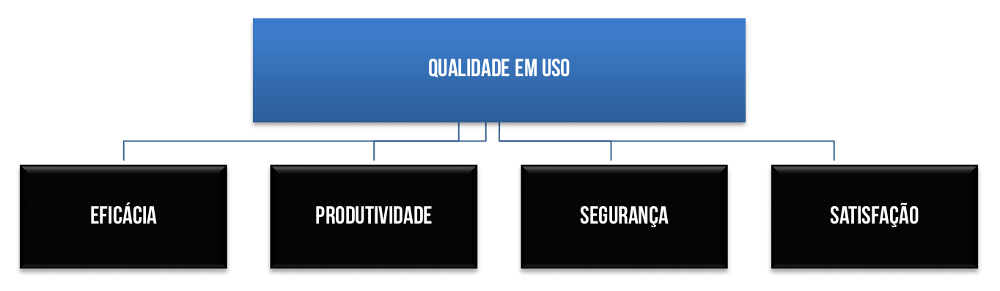

# Capítulo 38 – Qualidade de Software

## A Importância Crítica da Qualidade na Era Digital

A discussão sobre qualidade de software tornou-se um pilar central na engenharia e gestão de tecnologia, figurando em bibliografias especializadas e sendo tema recorrente em processos seletivos. A razão para essa proeminência é clara: o software deixou de ser uma ferramenta de nicho para se tornar o tecido conjuntivo de praticamente todas as atividades humanas e empresariais.

O clamor por maior qualidade intensificou-se a partir da década de 1990, quando o mundo começou a testemunhar as consequências financeiras e operacionais de softwares deficientes. Empresas desperdiçavam bilhões de dólares anualmente em projetos de software que falhavam em entregar as funcionalidades prometidas ou em atender aos requisitos essenciais de negócio. Pior ainda, governos e corporações demonstravam uma preocupação crescente com a possibilidade de uma falha grave de software comprometer infraestruturas críticas — como sistemas bancários, redes de energia e controle de tráfego aéreo —, elevando os prejuízos potenciais a dezenas de bilhões.

Na virada do século, o problema atingiu um ponto de ebulição. Uma manchete em uma proeminente revista de tecnologia lamentava: “Chega de desperdiçar US$ 78 bilhões por ano”, destacando que as empresas americanas gastavam fortunas em softwares que simplesmente não faziam o que deveriam. A revista Information Wee, na mesma época, publicou uma análise contundente baseada em dados do Standish Group, uma respeitada empresa de pesquisa de mercado:

> Apesar das boas intenções, código malfeito continua a ser o “fantasma” do mercado de software, sendo responsável por até 45% do tempo de inatividade dos sistemas computacionais e custando às empresas americanas cerca de US$ 100 bilhões no último ano em termos de manutenção e redução da produtividade. Isso não inclui o custo da perda de clientes insatisfeitos. [...] Qual o prejuízo causado por software de má qualidade? As definições variam, mas especialistas dizem que bastam três ou quatro defeitos a cada 1.000 linhas de código para fazer com que um programa execute de forma inadequada. Acrescente a isso que a maioria dos programadores insere cerca de um erro a cada 10 linhas de código escrito, multiplicados por milhões de linhas de código em vários produtos comerciais. Assim, deduz-se que o custo dos fornecedores de software será de pelo menos a metade dos seus orçamentos para a realização dos testes e correção dos erros.

Hoje, a questão da qualidade de software persiste, mas o debate sobre a responsabilidade é complexo. Os clientes frequentemente culpam os desenvolvedores, citando práticas descuidadas e falta de rigor técnico como causas para produtos de baixa qualidade. Por outro lado, os desenvolvedores culpam os clientes e outros stakeholders, argumentando que prazos de entrega irreais, orçamentos apertados e um fluxo contínuo de mudanças nos requisitos os forçam a entregar software antes que ele esteja completamente validado e polido. Na realidade, a verdade reside na intersecção dessas duas perspectivas.

## O Conceito de Qualidade de Software

Antes de analisar a qualidade no contexto de software, é preciso definir o que é "qualidade" em um sentido mais amplo. Qualidade é um conceito multidimensional que buscamos em produtos, processos e serviços. O dicionário a define como uma característica inerente, um traço distintivo, ou um grau de excelência. Essa definição, embora correta, é genérica. No desenvolvimento de produtos, é útil decompor a qualidade em duas dimensões principais:

- **Qualidade de Projeto (Quality of Design):** Refere-se às características que os projetistas especificam para um produto. No desenvolvimento de software, a qualidade de projeto engloba o grau em que o modelo de requisitos e a arquitetura atendem às funções e características desejadas. Envolve tomar as decisões corretas sobre o que o software **deve ser**. Inclui a definição de uma arquitetura robusta, a escolha de tecnologias adequadas e a especificação de requisitos funcionais e não-funcionais claros e completos. Um software com alta qualidade de projeto é aquele que, em sua concepção, já prevê as necessidades do usuário e os desafios do ambiente operacional.
- **Qualidade de Conformidade (Quality of Conformance):** Foca no grau em que a implementação segue o projeto e no grau em que o sistema resultante atende às especificações definidas. Trata-se de construir o produto **da maneira correta**. Um software pode ter um projeto excelente, mas se for implementado com bugs, falhas de lógica ou inconsistências, ele terá baixa qualidade de conformidade.

É crucial entender que a satisfação do cliente não depende apenas dessas duas dimensões. Um produto pode ter um design impecável e ser implementado sem falhas, mas se for entregue com anos de atraso e com o triplo do orçamento previsto, ele será percebido como um projeto de baixa qualidade. Portanto, a gestão de qualidade também abrange fatores de projeto como custo e prazo.

No sentido mais geral, a **qualidade de software** pode ser definida como uma gestão de qualidade efetiva, aplicada para criar um produto útil que forneça valor mensurável tanto para quem o produz quanto para quem o utiliza.

### Modelos de Fatores de Qualidade

Dado que "qualidade" é um conceito abstrato, foram propostos diversos modelos para decompor a qualidade de software em um conjunto de fatores ou atributos concretos e mensuráveis. Esses fatores, quando atingidos, indicam um software de alta qualidade. Dois dos modelos mais influentes são o de McCall e o da norma ISO/IEC 9126.

#### O Modelo de Qualidade de McCall, Richards e Walters

Este modelo clássico, proposto na década de 1970, foi um dos primeiros a tentar sistematizar a qualidade de software. Ele organiza os fatores em três perspectivas principais: características operacionais do produto, sua capacidade de suportar mudanças e sua adaptabilidade a novos ambientes.

  

|Fator|Descrição Detalhada e Exemplo Prático|
|---|---|
|**Correção**|O quanto um programa satisfaz sua especificação e atende aos objetivos da missão do cliente. **Exemplo:** Um sistema de e-commerce que calcula corretamente os impostos e custos de frete para todas as regiões de entrega.|
|**Confiabilidade**|O quanto se pode esperar que um programa realize a função pretendida com a precisão exigida, sem falhar. **Exemplo:** Um aplicativo de home banking que completa 99,99% das transações sem erros ou interrupções.|
|**Eficiência**|A quantidade de recursos computacionais (CPU, memória, rede) e código exigidos por um programa para desempenhar sua função. **Exemplo:** Um editor de vídeo que renderiza um clipe de 5 minutos em um tempo razoável, sem consumir toda a memória RAM do computador.|
|**Integridade**|O quanto o acesso ao software ou aos dados por pessoas não autorizadas pode ser controlado. **Exemplo:** Um sistema de prontuário eletrônico que garante que apenas médicos e enfermeiros autorizados possam visualizar os dados de um paciente.|
|**Usabilidade**|O esforço necessário para aprender, operar, preparar a entrada de dados e interpretar a saída de um programa. **Exemplo:** Um novo usuário consegue criar e enviar uma fatura em um software de gestão financeira em menos de 5 minutos, sem precisar consultar o manual.|
|**Facilidade de Manutenção**|O esforço necessário para localizar e corrigir um erro (manutenção corretiva) em um programa. **Exemplo:** Um desenvolvedor consegue identificar e corrigir um bug no módulo de login em menos de uma hora, graças a um código bem documentado e modular.|
|**Flexibilidade**|O esforço necessário para modificar um programa em operação (manutenção adaptativa ou perfectiva). **Exemplo:** Adicionar um novo método de pagamento (como PIX) a um sistema de vendas existente requer a modificação de apenas dois módulos, sem impactar o resto do sistema.|
|**Testabilidade**|O esforço necessário para testar um programa de modo a garantir que ele desempenhe a função destinada. **Exemplo:** O sistema é projetado de forma que cada funcionalidade pode ser testada de forma isolada através de testes unitários e de integração automatizados.|
|**Portabilidade**|O esforço necessário para transferir o programa de um ambiente de hardware e/ou software para outro. **Exemplo:** Um aplicativo web desenvolvido para rodar no servidor Apache pode ser migrado para o servidor Nginx com alterações mínimas de configuração.|
|**Reusabilidade**|O quanto um programa (ou partes de um programa, como componentes ou classes) pode ser reutilizado em outras aplicações. **Exemplo:** Um componente de autenticação de usuários é tão bem projetado que pode ser usado em três sistemas diferentes da mesma empresa.|
|**Interoperabilidade**|O esforço necessário para integrar um sistema a outro, permitindo a troca de dados e funcionalidades. **Exemplo:** O sistema de CRM da empresa consegue se comunicar via API com o sistema de ERP para sincronizar dados de clientes e pedidos automaticamente.|

#### O Modelo de Qualidade da Norma ISO/IEC 9126 (e sua sucessora ISO/IEC 25010)

A norma ISO 9126, posteriormente substituída e expandida pela ISO/IEC 25010, é um padrão internacional que busca definir um modelo de qualidade mais estruturado. Ela identifica seis características principais, que por sua vez são decompostas em sub-características.

|Característica|Descrição e Sub-características Relevantes|
|---|---|
|**Funcionalidade**|A capacidade do software de prover funcionalidades que atendam às necessidades declaradas e implícitas quando em uso. Sub-características incluem: **Adequação** (as funções são apropriadas para as tarefas?), **Acurácia** (os resultados são corretos?), **Interoperabilidade** e **Segurança de Acesso**.|
|**Confiabilidade**|A capacidade do software de manter seu nível de desempenho sob condições estabelecidas por um período de tempo. Sub-características incluem: **Maturidade** (frequência de falhas), **Tolerância a Falhas** (capacidade de operar mesmo com falhas) e **Recuperabilidade** (capacidade de se recuperar de uma falha).|
|**Usabilidade**|A capacidade do software de ser entendido, aprendido, usado e atraente para o usuário, quando usado sob condições especificadas. Sub-características incluem: **Inteligibilidade** (facilidade de compreensão), **Apreensibilidade** (facilidade de aprendizado) e **Operabilidade** (facilidade de controle).|
|**Eficiência**|O desempenho relativo à quantidade de recursos usados sob condições estabelecidas. Sub-características incluem: **Comportamento em Relação ao Tempo** (tempos de resposta e processamento) e **Utilização de Recursos** (consumo de CPU, memória, disco, rede).|
|**Manutenibilidade**|A capacidade do software de ser modificado. As modificações podem incluir correções, melhorias ou adaptação a mudanças no ambiente. Sub-características incluem: **Analisabilidade** (facilidade de diagnosticar deficiências), **Modificabilidade** (facilidade de realizar mudanças), **Estabilidade** (risco de efeitos inesperados após modificação) e **Testabilidade**.|
|**Portabilidade**|A capacidade do software de ser transferido de um ambiente para outro. Sub-características incluem: **Adaptabilidade**, **Instalabilidade** (facilidade de instalação e desinstalação) e **Capacidade para Substituir** (capacidade de substituir outro software).|

### O Custo da Qualidade e o Dilema do "Bom o Suficiente"

Todas as organizações de software enfrentam um dilema: embora o objetivo seja construir sistemas de altíssima qualidade, o tempo e o esforço necessários para produzir um software "perfeito" (livre de todos os defeitos) são proibitivos e, na prática, impossíveis. Isso leva à pergunta: deve-se construir um software "bom o suficiente"?

A resposta depende do contexto, mas essa abordagem carrega um risco significativo. Para tomar uma decisão informada, é essencial entender que a qualidade (ou a falta dela) tem um custo. Esse custo pode ser dividido em quatro categorias:

1. **Custos de Prevenção:** Incluem todas as atividades realizadas para **evitar** que defeitos ocorram em primeiro lugar. São investimentos proativos em qualidade.
    - **Exemplos:** Planejamento de qualidade, revisões técnicas formais (de requisitos, design), treinamento de equipes, criação e manutenção de padrões de codificação.
2. **Custos de Avaliação:** São os custos associados à verificação e validação dos artefatos para **encontrar** defeitos antes que o produto chegue ao cliente.
    - **Exemplos:** Inspeções de código, todas as formas de teste (unitário, integração, sistema, aceitação), auditorias de qualidade e aquisição de equipamentos de teste.
3. **Custos de Falhas Internas:** São os custos incorridos para corrigir defeitos **descobertos antes** da entrega do produto ao cliente.
    - **Exemplos:** O tempo gasto em depuração (debugging), o esforço para corrigir o código, o re-teste das funcionalidades corrigidas e o descarte e retrabalho de componentes defeituosos.
4. **Custos de Falhas Externas:** São os custos mais perigosos e caros, ocorrendo **depois** que o produto foi entregue ao cliente.
    - **Exemplos:** Custos de suporte técnico (help desk), trabalho de correção e emissão de patches, danos à reputação da marca, perda de clientes, e em casos graves, custos legais e responsabilidade por perdas financeiras ou de dados causadas pela falha.

A gestão de qualidade eficaz busca um equilíbrio, investindo nos custos de prevenção e avaliação para minimizar drasticamente os custos de falhas, especialmente as externas.

## O Processo e o Produto: Garantia vs. Controle de Qualidade

Dentro do grande guarda-chuva da Gestão da Qualidade, dois conceitos são fundamentais e frequentemente confundidos: **Garantia da Qualidade (QA - Quality Assurance)** e **Controle de Qualidade (QC - Quality Control)**. Embora ambos visem a entrega de um produto de alta qualidade, suas abordagens, focos e momentos de atuação são distintos e complementares. Entender essa diferença é crucial para implementar uma estratégia de qualidade eficaz.

A distinção central pode ser resumida da seguinte forma:

- A **Garantia da Qualidade** está focada em **processos** e na **prevenção** de defeitos.
- O **Controle de Qualidade** está focado em **produtos** (artefatos) e na **detecção** de defeitos.

### Garantia da Qualidade (QA): Construindo a Qualidade no Processo

A Garantia da Qualidade é um conjunto de atividades **proativas** que visam assegurar que os processos de desenvolvimento e gestão utilizados são adequados para produzir software de alta qualidade. A filosofia da QA é que, se o processo for bem definido, monitorado e continuamente aprimorado, a probabilidade de introduzir defeitos no produto diminuirá significativamente. Em outras palavras, a QA se preocupa em **fazer as coisas da maneira certa**.

As atividades de QA estabelecem a infraestrutura e as "regras do jogo" para a qualidade em um projeto ou organização. Elas incluem:

- **Definição de Metodologias e Padrões:** Selecionar e adaptar um ciclo de vida de desenvolvimento (como Scrum, Kanban ou RUP), criar padrões de codificação (coding standards), definir templates para documentos de requisitos e design, etc.
- **Seleção de Ferramentas:** Escolher e padronizar o uso de ferramentas que suportem a qualidade, como sistemas de controle de versão (Git), ferramentas de integração contínua (Jenkins, GitLab CI) e plataformas de análise estática de código (SonarQube).
- **Treinamento:** Capacitar a equipe nas metodologias, padrões e ferramentas definidas para garantir que todos tenham o conhecimento necessário para seguir o processo corretamente.
- **Auditorias de Processo:** Realizar verificações periódicas para garantir que as equipes estão, de fato, aderindo aos processos e padrões estabelecidos.
- **Análise de Métricas e Melhoria Contínua:** Coletar dados sobre o processo (ex: número de defeitos por fase, tempo de ciclo) para identificar gargalos, ineficiências e oportunidades de melhoria.

A QA, portanto, não encontra um bug específico, mas cria um ambiente onde a ocorrência de bugs é menos provável.

### Controle de Qualidade (QC): Identificando Defeitos no Produto

O Controle de Qualidade, por sua vez, compreende um conjunto de atividades **reativas** focadas em examinar os artefatos de software (o produto em si) para identificar e corrigir defeitos. Se a QA se preocupa com o processo, o QC se preocupa com o **resultado** desse processo. O objetivo do QC é garantir que o produto final esteja em conformidade com os requisitos e padrões de qualidade previamente definidos. Ele se preocupa em **verificar se os resultados estão certos**.

As atividades de QC são as "inspeções" realizadas ao longo do ciclo de vida. Elas incluem:

- **Revisões e Inspeções:** Revisão por pares (peer review) de artefatos como documentos de requisitos, diagramas de arquitetura e, principalmente, código-fonte.
- **Testes de Software:** Todas as formas de teste que visam encontrar falhas no comportamento do software, como testes unitários, testes de integração, testes de sistema e testes de aceitação do usuário.
- **Validação e Verificação:** Atividades que garantem que cada produto de trabalho atenda às suas metas de qualidade e requisitos especificados.

O QC é a linha de defesa que impede que produtos defeituosos cheguem ao cliente. Ele fornece um feedback valioso que pode ser usado tanto para corrigir o produto atual quanto para alimentar o processo de melhoria contínua da QA.

### Uma Analogia: A Linha de Montagem de Automóveis

Para solidificar a diferença, a analogia com uma fábrica de automóveis é extremamente eficaz.

- **Controle de Qualidade (QC):** Imagine um inspetor posicionado no final da linha de montagem. Sua função é examinar cada carro que sai da linha. Ele liga o motor, testa os freios, verifica a pintura contra a luz e confere todos os itens de uma longa checklist. Se ele encontra um defeito — um arranhão na porta ou um farol que não acende — ele etiqueta o carro e o envia para o reparo. O foco do inspetor está no **produto individual** e na **detecção** de falhas.
- **Garantia da Qualidade (QA):** Agora, imagine que o inspetor de QC reporta que 15% dos carros estão saindo com arranhões na mesma porta. O profissional de QA não vai simplesmente consertar os 15% de carros. Sua função é investigar a **causa raiz** do problema no **processo**. Ele vai analisar toda a linha de montagem, entrevistar operadores, verificar os robôs de pintura e talvez descobrir que um bico de pulverização está desalinhado, causando os arranhões. Ele então implementa uma correção no robô e ajusta o procedimento de calibração. O foco do profissional de QA está no **processo** e na **prevenção** de futuros defeitos.

### Relação e Síntese

QA e QC não são opostos, mas sim parceiros em um sistema de qualidade integrado. A QA define o framework, e o QC opera dentro dele. A QA estabelece que "todo módulo de software deve ter 85% de cobertura de testes unitários". O QC executa esses testes e reporta se um módulo específico atingiu ou não essa meta. A QA, por sua vez, pode analisar os relatórios de defeitos gerados pelo QC para identificar tendências e decidir se o processo de desenvolvimento precisa de ajustes.

A tabela a seguir resume as principais diferenças:

|Garantia da Qualidade (QA)|Controle de Qualidade (QC)|
|---|---|
|Garante que o processo é definido, apropriado e seguido.|Foca na descoberta de defeitos específicos nos artefatos.|
|**Orientada a Processo:** Foco em como o produto é feito.|**Orientada a Produto:** Foco no produto final e seus intermediários.|
|**Orientada a Prevenção:** Busca evitar que defeitos ocorram.|**Orientada a Detecção:** Busca encontrar defeitos que já ocorreram.|
|**Atividades Proativas:** Planejamento, definição de padrões, auditorias.|**Atividades Reativas:** Testes, inspeções, revisões.|
|Foco em monitoração e melhoria contínua do processo.|Foco em garantir que o produto atenda aos requisitos especificados.|
|Geralmente focada no início e na gestão contínua do ciclo de vida.|Geralmente focada nas saídas e no final das fases do ciclo de vida.|
|Garante que a equipe está **"fazendo as coisas da maneira certa"**.|Garante que os **"resultados do trabalho estão certos"**.|

## Verificação e Validação: Construindo o Produto Certo, Corretamente

As atividades de Controle de Qualidade (QC) são amplamente sustentadas por um conjunto de processos conhecidos como **Verificação e Validação (V&V)**. Conforme define Roger Pressman, V&V é o nome dado ao conjunto de atividades que buscam certificar que o software atende à sua especificação e entrega a funcionalidade esperada pelos stakeholders. Essas atividades não ocorrem apenas no final, mas em cada estágio do processo de desenvolvimento, começando com revisões de requisitos e continuando através de revisões de projeto, inspeções de código e testes de produto.

Embora frequentemente usados em conjunto, Verificação e Validação são conceitos distintos. A diferença fundamental foi brilhantemente capturada por Barry Boehm em duas perguntas simples que encapsulam a essência de cada termo:

- **Verificação:** "Estamos construindo o produto **corretamente**?"
- **Validação:** "Estamos construindo o produto **certo**?"

Vamos aprofundar essa distinção crucial.

### Verificação: Conformidade com a Especificação

A verificação é o processo de avaliar se os artefatos de uma determinada fase do ciclo de desenvolvimento estão em conformidade com as condições impostas no início dessa fase. Em termos mais simples, ela checa se o que foi construído corresponde ao que foi especificado no projeto. A verificação depende, portanto, da **especificação**.

- **Foco:** Interno, técnico.
- **Pergunta-chave:** "O software atende a todos os requisitos funcionais e não-funcionais definidos no documento de especificação?"
- **Ambiente:** Geralmente ocorre no ambiente de desenvolvimento.

A verificação pode ser realizada de duas formas complementares:

1. **Verificação Estática (Inspeção):** Envolve a análise de representações do sistema sem a necessidade de executar o código. Qualquer artefato legível pode ser inspecionado: documentos de requisitos, diagramas de arquitetura (UML), modelos de dados, e o próprio código-fonte. Ferramentas de análise estática de código, por exemplo, podem verificar automaticamente a conformidade com padrões de codificação, identificar possíveis bugs (como variáveis não utilizadas ou ponteiros nulos) e calcular métricas de complexidade. As revisões por pares e inspeções formais são as principais técnicas manuais.
    - **Vantagem:** Pode encontrar defeitos muito cedo no ciclo de vida, antes mesmo da codificação, o que torna sua correção muito mais barata.
    - **Desvantagem:** Requer que as especificações sejam precisas e confiáveis. Além disso, não é eficaz para verificar requisitos não-funcionais dinâmicos, como desempenho ou usabilidade.
2. **Verificação Dinâmica (Teste):** Envolve a execução do software (ou de partes dele) com um conjunto de dados de entrada para observar seu comportamento e comparar as saídas com os resultados esperados. É o que a maioria das pessoas entende como "teste de software". Isso inclui testes unitários, de integração e de sistema.
    - **Vantagem:** Verifica o comportamento real do software em tempo de execução.
    - **Desvantagem:** Só pode revelar a presença de defeitos, não provar sua ausência. Encontrar defeitos em fases tardias é mais caro de corrigir.

Verificação estática e dinâmica não são opostas; são complementares. A inspeção pode encontrar um erro de lógica em um algoritmo antes que ele seja testado, enquanto o teste pode encontrar uma falha de desempenho que a inspeção jamais detectaria.

### Validação: Atendimento às Necessidades do Usuário

A validação é um processo mais amplo que busca garantir que o software, como um todo, atende às necessidades, expectativas e objetivos de negócio do cliente e dos usuários finais. Ela não se prende apenas à especificação escrita, mas ao propósito real do sistema. A validação depende, portanto, do **usuário**.

- **Foco:** Externo, de negócio.
- **Pergunta-chave:** "O software resolve o problema do usuário? Ele é útil e utilizável em seu ambiente operacional?"
- **Ambiente:** Ocorre no ambiente do usuário ou em uma simulação fiel deste.

A principal técnica de validação é o **teste de aceitação**, onde os usuários finais ou clientes executam o software para verificar se ele se comporta como esperado em cenários do mundo real.

**Exemplo Prático:** Imagine um requisito para um botão em um site de e-commerce:

- **Verificação:** A equipe de desenvolvimento verifica se o botão tem a cor `#FF0000` (vermelho), o texto "Comprar Agora" e se, ao ser clicado, ele chama a função `adicionarAoCarrinho()`, conforme especificado no documento de design. Isso é construir o produto **corretamente**.
- **Validação:** Durante o teste de aceitação, o cliente percebe que um botão vermelho brilhante em um site com um esquema de cores pastel assusta os usuários, que pensam que é um botão de "cancelar" ou "erro". A validação revela que, embora o botão tenha sido construído corretamente conforme a especificação, ele não era o produto **certo** para atender à necessidade do usuário de se sentir seguro ao comprar.

### Os Limites de V&V e o Conceito de "Suficientemente Confiável"

É fundamental reconhecer que V&V não garante que um software seja 100% livre de defeitos. Testar todas as combinações possíveis de entradas e estados em um sistema complexo é computacionalmente inviável. O objetivo de V&V é, portanto, aumentar a confiança no software até um nível aceitável.

Mas o que é um nível "suficientemente confiável"? A resposta depende de três fatores principais:

- **Criticidade do Sistema:** O nível de confiança exigido está diretamente relacionado às consequências de uma falha. Um defeito em um sistema de controle de tráfego aéreo pode ter consequências catastróficas, exigindo um processo de V&V extremamente rigoroso e caro. Em contraste, um bug em um sistema de catálogo de livros de uma biblioteca é inconveniente, mas não coloca vidas em risco, permitindo um nível de confiança menor.
- **Expectativas do Usuário:** Para sistemas não críticos, como o software de caixa de uma padaria ou o controle de estoque de um pequeno mercado, os usuários podem ter expectativas mais baixas. Eles podem tolerar falhas ocasionais se os benefícios gerais do uso do sistema superarem as desvantagens.
- **Fatores de Mercado:** Em mercados competitivos, o time-to-market (tempo para lançar um produto) pode ser um fator decisivo. Uma empresa pode decidir lançar uma versão de seu software com alguns defeitos conhecidos de baixa prioridade para ser a primeira no mercado e conquistar uma base de usuários, planejando corrigir os problemas em atualizações futuras.

### Distinção Rápida: Teste vs. Depuração

Outra confusão comum ocorre entre os termos "teste" e "depuração" (debugging). A diferença é simples e crucial:

- **Teste:** É o processo de **encontrar defeitos**. Seu objetivo é executar o software para fazer com que as falhas se manifestem. Geralmente, é uma atividade realizada por uma equipe de testes (QAs).
- **Depuração:** É o processo de **localizar a causa raiz** de um defeito conhecido e **corrigi-la**. É uma atividade de diagnóstico e correção, geralmente realizada pela equipe de desenvolvimento.

Em suma, o teste estabelece a existência de um problema; a depuração o resolve.

## A Anatomia de um Problema: Erro, Defeito e Falha

No universo da qualidade de software, a terminologia usada para descrever problemas pode ser confusa, pois diferentes autores e padrões (como IEEE e ISTQB) usam os termos **Erro**, **Defeito** e **Falha** com nuances distintas. Essa falta de consenso pode ser um desafio, mas entender as principais correntes de pensamento é essencial para uma comunicação clara e para a compreensão da cadeia causal que leva a um comportamento indesejado do software.

### A Perspectiva Causal (Padrão ISTQB e IEEE)

A visão mais amplamente aceita, especialmente na comunidade de testes, estabelece uma clara relação de causa e efeito entre os três termos.

- **Erro (Engano / Mistake):** É a **ação humana** que produz um resultado incorreto. O erro é a origem de tudo e acontece na mente de uma pessoa.
    - **Causa:** Falta de conhecimento, má interpretação de um requisito, pressão de prazo, cansaço, erro de digitação.
    - **Exemplos:** Um programador que usa o operador `<` (menor que) em vez de `<=` (menor ou igual) em uma condição de laço; um analista que escreve um requisito ambíguo; um arquiteto que escolhe um padrão de projeto inadequado para o problema.
- **Defeito (Falta / Fault, Bug, Defect):** É a **manifestação do erro** em um artefato de software. É o resultado tangível da ação humana incorreta. O defeito é uma propriedade estática do software, "adormecido" no código, na documentação ou no design, esperando para ser ativado.
    - **Causa:** Um erro humano.
    - **Exemplos:** A linha de código com o operador `<` incorreto; a seção ambígua no documento de especificação de requisitos; um diagrama de classes com um relacionamento errado.
- **Falha (Failure):** É o **desvio do comportamento observado** do software em relação ao comportamento esperado. A falha ocorre quando um defeito é executado, fazendo com que o sistema produza um resultado incorreto ou se comporte de maneira indesejada. É a consequência dinâmica e visível do defeito.
    - **Causa:** A execução de um defeito.
    - **Exemplos:** O sistema entra em um laço infinito (causado pelo defeito no operador `<`); um cálculo financeiro produz um resultado errado; o software trava e exibe uma mensagem de erro ("tela azul"); um relatório é gerado com informações faltando.

A cadeia causal é, portanto: **Erro → introduz um → Defeito → que, quando executado, pode causar uma → Falha.**

Um ponto crucial é que a existência de um defeito não garante a ocorrência de uma falha. Uma falha só se manifesta se três condições forem atendidas:

1. A parte do código que contém o defeito precisa ser **executada**.
2. O estado do sistema no momento da execução deve ser tal que **ative** o defeito.
3. A execução do código defeituoso precisa se **propagar** e causar um resultado externo incorreto.

**Exemplo:** Um programador comete um **erro** de lógica ao implementar o cálculo para anos bissextos. Isso cria um **defeito** no código. No entanto, esse defeito só causará uma **falha** (um cálculo de data incorreto) se o usuário inserir uma data específica (como 29 de fevereiro) em um ano que o código processa incorretamente. Se nenhum usuário jamais utilizar essa funcionalidade com os dados específicos que ativam o defeito, a falha nunca será observada, embora o defeito continue existindo no código.

A tabela a seguir, baseada no padrão IEEE 610, resume essa perspectiva:

|Termo (Padrão IEEE 610)|Descrição e Perspectiva|
|---|---|
|**Erro (Engano)**|Ação humana que produz um resultado incorreto. É a causa raiz, ligada ao indivíduo. **Perspectiva:** Humana.|
|**Defeito (Falta)**|Um passo, processo ou definição de dados incorretos em um artefato (ex: uma instrução incorreta no código). É a materialização do erro. **Perspectiva:** Interna, do desenvolvedor.|
|**Falha**|Comportamento operacional do software diferente do esperado. É a consequência externa e visível de um defeito executado. **Perspectiva:** Externa, do usuário.|

### A Perspectiva Temporal (Roger Pressman)

Roger Pressman, em seu influente livro sobre Engenharia de Software, propõe uma distinção diferente, baseada no **momento em que o problema de qualidade é encontrado**. Essa visão é menos comum, mas importante de se conhecer.

- **Erro:** Um problema de qualidade (um defeito, na terminologia padrão) que é encontrado pela equipe de desenvolvimento **antes** de o software ser entregue ao cliente.
- **Defeito:** Um problema de qualidade que é encontrado pelo usuário final **após** a entrega do software.

A lógica por trás dessa distinção é gerencial e econômica. Um **erro** encontrado internamente tem um custo (principalmente de retrabalho), mas não afeta a imagem da empresa. Um **defeito** encontrado pelo cliente, por outro lado, acarreta todos os custos de falhas externas: suporte, correções emergenciais, perda de confiança e danos à reputação.

Nessa visão, o objetivo da equipe de engenharia de software é encontrar e corrigir o maior número possível de **erros** para evitar que eles se tornem **defeitos**.

|Termo (Visão de Pressman)|Descrição|
|---|---|
|**Erro**|Problema de qualidade descoberto **antes** do lançamento do software aos usuários.|
|**Defeito**|Problema de qualidade descoberto **após** o lançamento do software aos usuários.|

É fundamental notar que essa distinção temporal não é o padrão dominante na indústria, mas serve para enfatizar os diferentes impactos que um mesmo problema técnico pode ter dependendo de quando e por quem ele é descoberto.

## A Medição da Qualidade: Métricas de Software

Para que a gestão da qualidade deixe de ser um exercício subjetivo e passe a ser uma disciplina de engenharia, é fundamental medir. A medição de software consiste em derivar um valor numérico (uma métrica) para um atributo de um processo, produto ou projeto de software. Ao comparar esses valores entre si e com padrões ou metas estabelecidas, as equipes podem tomar decisões baseadas em dados, em vez de apenas em intuição.

O objetivo de longo prazo da medição de software é usá-la para fazer julgamentos objetivos sobre a qualidade. Idealmente, um sistema poderia ser avaliado por um conjunto de métricas e, a partir delas, ter sua qualidade inferida. Se o software atingir o limiar de qualidade requerido, ele poderia ser aprovado. Embora esse cenário totalmente automatizado ainda esteja distante, a medição já é uma ferramenta indispensável para identificar áreas problemáticas e guiar esforços de melhoria.

### O Processo de Medição

Um programa de medição eficaz opera como um ciclo de feedback contínuo, onde dados sobre o processo de desenvolvimento e o produto resultante são coletados e usados para influenciar decisões gerenciais que, por sua vez, aprimoram o próprio processo. O fluxo pode ser visualizado da seguinte forma:

  

1. O **Processo de Software** (o conjunto de todas as atividades de desenvolvimento) é o ponto de partida. Ele gera dois fluxos principais de informação para medição.
2. O primeiro fluxo são as **Medições de Métrica de Controle**, que são extraídas diretamente da observação do processo. Elas medem a eficiência e a eficácia das atividades, como o tempo gasto em cada fase ou o número de erros encontrados por hora de revisão.
3. O segundo fluxo se origina do **Produto de Software**, o artefato gerado pelo processo. Este produto é analisado para obter **Medições de Métrica de Previsão**, que medem atributos internos do software (como complexidade ou tamanho) para prever sua qualidade externa.
4. Ambos os tipos de medições (de controle e de previsão) alimentam as **Decisões de Gerenciamento**. Com base nesses dados, os gerentes podem, por exemplo, alocar mais recursos para testes em módulos complexos ou identificar gargalos no processo de desenvolvimento.
5. Finalmente, essas decisões gerenciais criam um **ciclo de feedback**, levando a ajustes e melhorias no **Processo de Software** original, tornando-o mais maduro e eficaz ao longo do tempo.

### Categorias de Métricas de Software

As métricas de software podem ser classificadas de diversas formas. Uma distinção comum é entre métricas de controle e de previsão:

- **Métricas de Controle (ou de Processo):** São usadas para gerenciar e melhorar o processo de desenvolvimento. Elas respondem a perguntas como: "Quão eficiente é nosso processo de correção de bugs?". Exemplos incluem o tempo médio para reparar defeitos e o esforço (em pessoas/dia) gasto em cada fase.
- **Métricas de Previsão (ou de Produto):** São associadas ao software em si e ajudam a prever características de qualidade. Elas respondem a perguntas como: "Quão complexo é este módulo?". Exemplos incluem a complexidade ciclomática e o tamanho do código.

Outra forma de categorizar, mais abrangente, divide as métricas em três grandes áreas:

- **Métricas de Processo:** Focam na eficácia do processo de desenvolvimento e manutenção. Um exemplo clássico é a **Efetividade de Remoção de Defeitos (DRE - Defect Removal Effectiveness)**, que mede a porcentagem de defeitos encontrados por uma equipe antes da entrega do produto. A fórmula é: $DRE=E/(E+D)$ Onde $E$ é o número de erros encontrados antes da entrega e $D$ é o número de defeitos encontrados após a entrega. Um DRE próximo de 1 (ou 100%) indica um processo de verificação e validação muito eficaz.
- **Métricas de Projeto:** Descrevem as características e o andamento do projeto. São usadas para monitorar custo, prazo, produtividade e estabilidade. Exemplos incluem o número de desenvolvedores, o custo por ponto de função e a taxa de mudança nos requisitos.
- **Métricas de Produto:** Medem as características do software em si. O objetivo é usar atributos internos (que são fáceis de medir) para prever atributos de qualidade externos (que são difíceis de medir).

### Atributos Internos vs. Externos

A grande dificuldade na medição da qualidade é que muitos dos atributos que realmente importam para o usuário — como manutenibilidade, usabilidade e confiabilidade — são **atributos externos**. Eles só podem ser observados quando o software está em uso e são influenciados por fatores subjetivos.

Para contornar isso, mede-se **atributos internos** do software (como tamanho, complexidade, acoplamento) e assume-se que existe uma relação entre eles e os atributos externos desejados. Por exemplo, assume-se que um software com alta complexidade interna (atributo interno) terá baixa manutenibilidade (atributo externo).

- **Métricas Estáticas:** São coletadas a partir de representações estáticas do sistema (código-fonte, diagramas, documentação) sem executá-lo. Elas são boas para prever atributos como complexidade, compreensibilidade e manutenibilidade.
- **Métricas Dinâmicas:** São coletadas durante a execução do programa (em testes ou em produção). Elas são boas para avaliar atributos como eficiência e confiabilidade. Exemplos: tempo de resposta de uma função, consumo de memória, número de falhas por hora de uso.

Embora a relação entre métricas estáticas e qualidade externa não seja sempre direta e universal, algumas métricas de produto se mostraram consistentemente úteis:

|Métrica de Produto (Estática)|Descrição|
|---|---|
|**Fan-In/Fan-Out**|**Fan-in:** número de módulos que chamam um determinado módulo X. Um fan-in alto indica que X é muito reutilizado, mas também que mudanças em X podem ter um grande impacto. **Fan-out:** número de módulos que são chamados por X. Um fan-out alto pode indicar alta complexidade em X.|
|**Comprimento de Código**|Medida do tamanho de um programa (ex: Linhas de Código - LOC). É uma das métricas mais simples e, surpreendentemente, uma das mais eficazes para prever a propensão a erros. Componentes maiores tendem a ser mais complexos e a ter mais defeitos.|
|**Complexidade Ciclomática**|Mede a complexidade estrutural de um programa, contando o número de caminhos linearmente independentes através do código. Um valor alto (geralmente > 10) indica um código difícil de entender e testar.|
|**Comprimento de Identificadores**|Mede o tamanho médio dos nomes de variáveis, métodos e classes. Nomes mais longos e descritivos (ex: `calcularImpostoRenda` vs. `calc`) tendem a tornar o código mais compreensível.|
|**Profundidade de Aninhamento Condicional**|Conta o número máximo de `if`s aninhados. Estruturas profundamente aninhadas são extremamente difíceis de ler e raciocinar sobre, sendo uma fonte comum de erros.|
|**Índice FOG**|Aplicada à documentação, mede a legibilidade de um texto com base no comprimento médio de palavras e sentenças. Um índice alto indica um texto difícil de entender.|

### Métricas de Robustez e Densidade de Defeitos

Para medir a qualidade do produto sob a perspectiva do cliente, duas métricas são proeminentes:

- **Tempo Médio para Falha (MTTF - Mean Time To Failure):** Mede o tempo médio de operação de um sistema antes que uma falha ocorra. É uma métrica de robustez crucial para sistemas críticos, onde a continuidade da operação é vital. Por exemplo, um sistema de controle de tráfego aéreo pode ter um requisito de MTTF de vários anos.
- **Tempo Médio Entre Falhas (MTBF - Mean Time Between Failures):** Similar ao MTTF, mas aplicado a sistemas que podem ser reparados. Mede o tempo total de operação dividido pelo número de falhas observadas ($MTBF=MTTF+MTTR$, onde $MTTR$ é o tempo médio para reparar).
- **Densidade de Defeitos:** Mede o número de defeitos encontrados em um produto em relação ao seu tamanho (geralmente em mil linhas de código - KLOC, ou por Pontos de Função). $\text{Densidade De Defeitos} = \text{Número De Defeitos}/\text{Tamanho do Software}$. Essa métrica permite comparar a qualidade intrínseca de diferentes componentes ou produtos e identificar módulos de alto risco que podem precisar de mais testes ou refatoração.

## Métricas Focadas no Código-Fonte

Com a ascensão de metodologias ágeis e do software de código aberto, o código-fonte se consolidou como o artefato central para a avaliação da qualidade. Um código de alta qualidade é a base para um software manutenível, flexível e robusto. A qualidade do código não se refere apenas à ausência de bugs, mas a um conjunto de características que o tornam fácil de ler, entender, testar e modificar.

Um código-fonte será muito mais lido do que escrito ao longo de seu ciclo de vida. Portanto, otimizar para a legibilidade é um dos investimentos mais importantes que uma equipe pode fazer. Os principais critérios para um código-fonte de qualidade são:

|Critério de Qualidade de Código|Descrição|
|---|---|
|**Legibilidade**|O código (e seus comentários) deve declarar claramente sua intenção. Se um desenvolvedor não consegue entender o que um trecho de código faz, todos os outros esforços de qualidade (como correção de bugs e refatoração) são comprometidos.|
|**Testabilidade**|O código deve ser organizado de forma que facilite a criação de testes de unidade isolados. Isso geralmente implica em baixo acoplamento e alta coesão, permitindo que cada parte seja verificada independentemente.|
|**Flexibilidade**|As dependências em relação a outros códigos devem ser minimizadas e gerenciadas através de abstrações (interfaces). Evitar implementações "hard-coded" (fixas) de valores, estruturas de dados ou classes concretas torna o código mais fácil de adaptar e reutilizar.|
|**Conformidade**|O código deve cumprir com seus requisitos, tanto funcionais quanto não-funcionais. Ele deve fazer o que foi especificado que ele faria.|
|**Economicidade**|O código deve fazer uso razoável e eficiente dos recursos do sistema (memória, CPU, rede). Envolve pensar no retorno sobre o investimento e evitar a "superengenharia" ou otimizações prematuras que aumentam a complexidade sem um benefício claro.|

## O Modelo de Qualidade ISO/IEC 9126

A norma NBR ISO/IEC 9126 (e sua sucessora mais moderna, a ISO/IEC 25010) representa um esforço internacional para padronizar a forma como a qualidade de um produto de software é definida, especificada e avaliada. Ela fornece um vocabulário comum e um framework estruturado que pode ser utilizado por todos os envolvidos no ciclo de vida do software, desde clientes e gerentes até desenvolvedores e auditores.

A norma foi originalmente dividida em quatro partes, cada uma abordando um aspecto específico da medição da qualidade:

- **ISO/IEC 9126-1:** Define o **Modelo de Qualidade**, que é o coração da norma.
- **ISO/IEC 9126-2:** Descreve um conjunto de **Métricas Externas**.
- **ISO/IEC 9126-3:** Descreve um conjunto de **Métricas Internas**.
- **ISO/IEC 9126-4:** Descreve um conjunto de **Métricas de Qualidade em Uso**.

### As Três Perspectivas da Qualidade

O pilar conceitual da norma é a decomposição da qualidade em três perspectivas complementares, que representam a visão de diferentes stakeholders em diferentes momentos:

- **Qualidade Interna:** É a visão do **desenvolvedor**. Refere-se à totalidade das características de um produto de software que podem ser avaliadas sem executá-lo. É a qualidade dos artefatos estáticos (código-fonte, arquitetura, documentação). A qualidade interna não garante, mas influencia fortemente a qualidade externa.
    - **Exemplo:** Um código com baixa complexidade ciclomática, alta coesão, baixo acoplamento e bem documentado possui alta qualidade interna.
- **Qualidade Externa:** É a visão do **testador**. Refere-se à qualidade do software quando ele é executado. É a totalidade das características observáveis do produto em um ambiente controlado ou simulado.
    - **Exemplo:** Um software que responde a uma requisição em menos de 2 segundos, não trava durante os testes de estresse e produz resultados corretos para os casos de teste possui alta qualidade externa.
- **Qualidade em Uso:** É a visão do **usuário final**. É a qualidade do software sob a perspectiva de quem o utiliza para atingir metas específicas em um ambiente operacional real. Ela mede o **efeito** que o software tem no usuário e em seus objetivos, e não as propriedades do software em si. É a medida definitiva de sucesso.
    - **Exemplo:** Um usuário que consegue completar a tarefa de "emitir uma nota fiscal" de forma rápida, sem erros e se sentindo satisfeito com a experiência, demonstra que o software tem alta qualidade em uso.

A relação entre elas é causal: uma boa **Qualidade Interna** (código limpo) facilita a obtenção de uma boa **Qualidade Externa** (menos falhas nos testes), que por sua vez é um pré-requisito para uma boa **Qualidade em Uso** (usuário satisfeito e produtivo).

### O Modelo de Qualidade Interna e Externa

Esta é a parte mais conhecida da norma. Ela categoriza os atributos de qualidade de software em seis características principais, que são subdivididas em sub-características.

  

A seguir, uma descrição detalhada de cada característica e suas sub-características, com exemplos práticos.

**FUNCIONALIDADE:** A capacidade do produto de software de prover funções que atendam às necessidades explícitas e implícitas, quando utilizado sob condições especificadas.

|Subcaracterística|Descrição|Exemplo Prático|
|---|---|---|
|**Adequação**|Capacidade de prover um conjunto apropriado de funções para as tarefas e objetivos do usuário.|Um software de contabilidade que oferece funções para cálculo de impostos, emissão de balanços e controle de fluxo de caixa.|
|**Acurácia**|Capacidade de prover resultados ou efeitos corretos ou conforme acordados, com o grau de precisão necessário.|Um sistema de GPS que calcula a localização do usuário com uma margem de erro inferior a 5 metros.|
|**Interoperabilidade**|Capacidade de interagir com um ou mais sistemas especificados.|Um aplicativo de calendário que sincroniza eventos automaticamente com o Google Calendar e o Microsoft Outlook.|
|**Segurança de Acesso**|Capacidade de proteger informações e dados contra acesso não autorizado, garantindo o acesso aos autorizados.|Um sistema bancário que usa autenticação de dois fatores para impedir que transações sejam feitas por pessoas não autorizadas.|
|**Conformidade (Funcionalidade)**|Capacidade de estar de acordo com normas, convenções ou regulamentações relacionadas à funcionalidade.|Um software de emissão de nota fiscal eletrônica que segue rigorosamente o layout e as regras definidas pela Receita Federal.|

**CONFIABILIDADE:** A capacidade do produto de software de manter um nível de desempenho especificado, quando usado em condições especificadas.

|Subcaracterística|Descrição|Exemplo Prático|
|---|---|---|
|**Maturidade**|Capacidade de evitar falhas decorrentes de defeitos no software.|Um servidor web que opera continuamente por 30 dias sem precisar ser reiniciado devido a falhas de software.|
|**Tolerância a Falhas**|Capacidade de manter um nível de desempenho especificado mesmo em casos de falhas ou entradas inválidas.|Um formulário de cadastro que, ao receber uma data inválida (ex: 30/02/2025), exibe uma mensagem de erro clara em vez de travar o sistema.|
|**Recuperabilidade**|Capacidade de restabelecer seu nível de desempenho e recuperar dados após a ocorrência de uma falha.|Um editor de texto que, após uma queda de energia, consegue restaurar o documento não salvo na próxima vez que é aberto.|
|**Conformidade (Confiabilidade)**|Capacidade de estar de acordo com normas ou regulamentações relacionadas à confiabilidade.|Um software para equipamentos médicos que cumpre as normas da ANVISA para operação segura e contínua.|

**USABILIDADE:** A capacidade do produto de software de ser compreendido, aprendido, operado e atraente ao usuário, quando usado sob condições especificadas.

|Subcaracterística|Descrição|Exemplo Prático|
|---|---|---|
|**Inteligibilidade**|Capacidade de possibilitar ao usuário compreender se o software é apropriado e como pode ser usado.|Um usuário, ao abrir um aplicativo de edição de fotos pela primeira vez, entende imediatamente que os ícones de "tesoura" e "pincel" servem para cortar e desenhar.|
|**Apreensibilidade**|Capacidade de possibilitar ao usuário aprender sua aplicação.|Um novo funcionário aprende a operar o sistema de ponto de venda da loja em menos de 15 minutos de treinamento.|
|**Operacionalidade**|Capacidade de possibilitar ao usuário operá-lo e controlá-lo com facilidade.|Um site de e-commerce que permite ao usuário filtrar produtos por preço, marca e avaliação com poucos cliques.|
|**Atratibilidade**|Capacidade de ser atraente ao usuário, através de um design visual agradável e uma experiência de uso positiva.|Um aplicativo de meditação que utiliza cores suaves, animações fluidas e sons relaxantes para criar um ambiente agradável.|
|**Conformidade (Usabilidade)**|Capacidade de estar de acordo com guias de estilo ou convenções de plataforma (ex: Material Design do Google, Human Interface Guidelines da Apple).|Um aplicativo para iPhone que utiliza os gestos de navegação e os componentes de interface padrão do iOS, tornando-o familiar para os usuários.|

**EFICIÊNCIA:** A capacidade do produto de software de apresentar desempenho apropriado, relativo à quantidade de recursos usados, sob condições especificadas.

|Subcaracterística|Descrição|Exemplo Prático|
|---|---|---|
|**Comportamento em Relação ao Tempo**|Capacidade de fornecer tempos de resposta e de processamento apropriados.|Um mecanismo de busca que retorna os resultados de uma pesquisa em menos de 500 milissegundos.|
|**Utilização de Recursos**|Capacidade de usar quantidades apropriadas de recursos (CPU, memória, rede, bateria).|Um aplicativo de mensagens que consome uma quantidade mínima de bateria quando executado em segundo plano no celular.|
|**Conformidade (Eficiência)**|Capacidade de estar de acordo com normas ou convenções relacionadas à eficiência.|Um software embarcado que cumpre a norma de não utilizar mais que 80% da capacidade do processador.|

**MANUTENIBILIDADE:** A capacidade do produto de software de ser modificado (correções, melhorias ou adaptações).

|Subcaracterística|Descrição|Exemplo Prático|
|---|---|---|
|**Analisabilidade**|Capacidade de permitir o diagnóstico de deficiências ou a identificação de partes a serem modificadas.|Um desenvolvedor, ao receber um relatório de bug, consegue localizar a causa raiz no código em poucos minutos graças a logs detalhados e um código bem estruturado.|
|**Modificabilidade**|Capacidade de permitir que uma modificação especificada seja implementada com baixo esforço.|Alterar a taxa de juros em um sistema financeiro requer a mudança de um único parâmetro em um arquivo de configuração, sem a necessidade de recompilar o código.|
|**Estabilidade**|Capacidade de evitar efeitos inesperados (regressões) decorrentes de modificações no software.|Após corrigir um bug no módulo de faturamento, os testes de regressão automatizados confirmam que o módulo de estoque não foi afetado.|
|**Testabilidade**|Capacidade de permitir que o software, quando modificado, seja validado de forma eficaz.|Cada classe do sistema possui testes de unidade correspondentes, permitindo que os desenvolvedores verifiquem suas modificações rapidamente.|
|**Conformidade (Manutenibilidade)**|Capacidade de estar de acordo com normas ou convenções de codificação e arquitetura.|O projeto segue rigorosamente os padrões de codificação da empresa, facilitando a entrada de novos desenvolvedores na equipe.|

**PORTABILIDADE:** A capacidade do produto de software de ser transferido de um ambiente (hardware, sistema operacional) para outro.

|Subcaracterística|Descrição|Exemplo Prático|
|---|---|---|
|**Adaptabilidade**|Capacidade de ser adaptado para diferentes ambientes sem necessidade de ações além das previstas.|Um aplicativo web que se ajusta automaticamente para ser exibido corretamente em navegadores de desktop, tablets e smartphones (design responsivo).|
|**Capacidade para ser Instalado**|Capacidade do produto de ser instalado (e desinstalado) em um ambiente especificado.|Um software que oferece um instalador "passo a passo" simples, que guia o usuário por todo o processo de instalação sem dificuldades.|
|**Coexistência**|Capacidade de coexistir com outros softwares em um ambiente comum, compartilhando recursos sem conflitos.|Um novo antivírus que pode ser instalado e executado em um computador que já possui um firewall de outra empresa, sem que um interfira no outro.|
|**Capacidade para Substituir**|Capacidade de ser usado em substituição a outro software especificado, para o mesmo propósito.|Um novo navegador web que consegue importar todos os favoritos, senhas e histórico de um navegador concorrente.|
|**Conformidade (Portabilidade)**|Capacidade de estar de acordo com normas relacionadas à portabilidade (ex: POSIX para sistemas Unix).|Um software escrito em Java padrão que pode ser executado em qualquer sistema operacional que possua uma Máquina Virtual Java (JVM).|

### O Modelo de Qualidade em Uso

Enquanto o modelo anterior foca nas propriedades do software, o modelo de Qualidade em Uso foca no resultado da interação do usuário com o software em um contexto real.

  

|Característica|Descrição|Exemplo Prático|
|---|---|---|
|**Eficácia**|Capacidade de permitir que usuários atinjam metas especificadas com acurácia e completude.|95% dos usuários de um site de passagens aéreas conseguem encontrar e comprar um voo para o destino desejado na primeira tentativa.|
|**Produtividade**|Capacidade de permitir que usuários empreguem quantidade apropriada de recursos (tempo, esforço) em relação à eficácia obtida.|Um contador leva 10 minutos para gerar um relatório complexo usando o novo software, enquanto no sistema antigo a mesma tarefa levava 45 minutos.|
|**Segurança**|Capacidade de apresentar níveis aceitáveis de riscos de danos a pessoas, negócios, software, propriedades ou ao ambiente.|Um software de controle industrial que possui mecanismos para desligar uma máquina automaticamente se a temperatura exceder um limite seguro, prevenindo acidentes.|
|**Satisfação**|Capacidade de satisfazer usuários, medida através de suas atitudes e percepções em relação ao uso do produto.|Uma pesquisa de satisfação revela que 8 em cada 10 usuários classificam a experiência de uso de um aplicativo de streaming de música como "muito boa" ou "excelente".|

### O Papel das Métricas na ISO 9126

A norma não apenas define os modelos, mas também guia como medi-los através de suas outras partes:

- **Métricas Externas (Parte 2):** Medem o software em execução. Exemplo: para avaliar o **Comportamento em Relação ao Tempo**, pode-se medir o tempo de resposta de uma transação em segundos.
- **Métricas Internas (Parte 3):** Medem os artefatos estáticos para prever a qualidade. Exemplo: para avaliar a **Analisabilidade**, pode-se usar a métrica de **Complexidade Ciclomática**.
- **Métricas de Qualidade em Uso (Parte 4):** Medem a experiência do usuário. Exemplo: para avaliar a **Eficácia**, pode-se medir a porcentagem de tarefas completadas com sucesso.

Em resumo, a ISO/IEC 9126 fornece um framework completo e hierárquico para entender, especificar e avaliar a qualidade de software de forma estruturada, desde o código-fonte até a satisfação do usuário final.

## Considerações Finais

Ao longo deste capítulo, navegamos pelos conceitos fundamentais que sustentam a disciplina de Qualidade de Software. Partimos da compreensão de que a qualidade deixou de ser um mero diferencial técnico para se tornar um imperativo estratégico, com impactos diretos na viabilidade financeira, na reputação e na segurança de empresas e usuários. A era digital amplificou as consequências de falhas, tornando a busca pela qualidade uma responsabilidade central da engenharia de software.

Vimos que a qualidade é um conceito multifacetado, que pode ser decomposto em **Qualidade de Projeto** (fazer a coisa certa) e **Qualidade de Conformidade** (fazer a coisa do jeito certo). Para gerenciar essa complexidade, a indústria desenvolveu uma abordagem dual: a **Garantia da Qualidade (QA)**, focada na prevenção de defeitos através da melhoria contínua dos processos, e o **Controle de Qualidade (QC)**, focado na detecção de defeitos nos produtos através de atividades como testes e inspeções.

Dentro do QC, a distinção entre **Verificação** ("estamos construindo o produto corretamente?") e **Validação** ("estamos construindo o produto certo?") é crucial. Enquanto a verificação garante a conformidade com as especificações, a validação assegura que o produto final realmente atende às necessidades e expectativas do usuário, resolvendo o problema para o qual foi concebido.

A terminologia também se mostrou vital. Compreender a cadeia causal onde um **Erro** humano leva a um **Defeito** no artefato, que, por sua vez, pode causar uma **Falha** visível ao usuário, é fundamental para uma análise de causa raiz eficaz e para uma comunicação precisa entre as equipes.

Contudo, a qualidade não pode ser gerenciada se não for medida. As **métricas de software** — sejam de processo, projeto ou produto — são as ferramentas que transformam a qualidade de um conceito abstrato em um indicador quantificável. Elas nos permitem avaliar a saúde de um código-fonte, a eficiência de um processo e a robustez de um sistema em produção, guiando decisões gerenciais baseadas em evidências.

Finalmente, padrões como a **NBR ISO/IEC 9126** (e sua sucessora, a ISO/IEC 25010) fornecem um framework robusto e um vocabulário comum para toda a indústria. Ao estruturar a qualidade em múltiplas perspectivas (interna, externa e em uso) e em características como funcionalidade, confiabilidade, usabilidade, eficiência, manutenibilidade e portabilidade, a norma oferece um mapa detalhado para especificar, construir e avaliar produtos de software de alta qualidade.

Em suma, a qualidade de software não é um evento único ou uma fase final do desenvolvimento. É uma jornada contínua, uma cultura que deve permear todas as atividades, desde a concepção de um requisito até a manutenção de um sistema em produção. Envolve processos bem definidos, ferramentas adequadas e, acima de tudo, uma mentalidade de excelência e melhoria contínua por parte de todos os envolvidos.