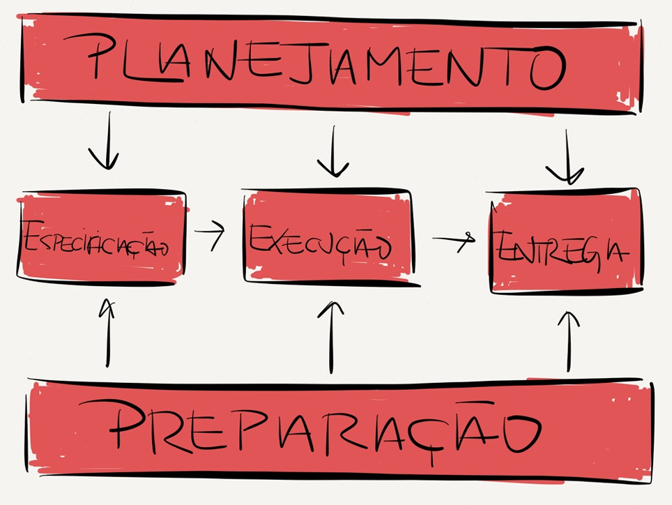
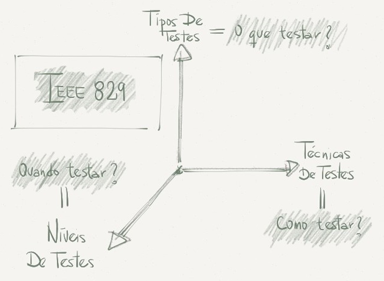
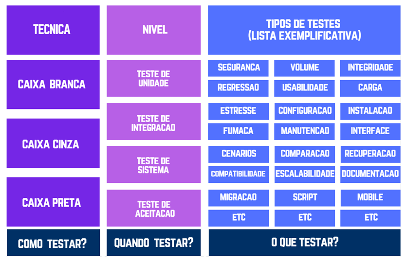
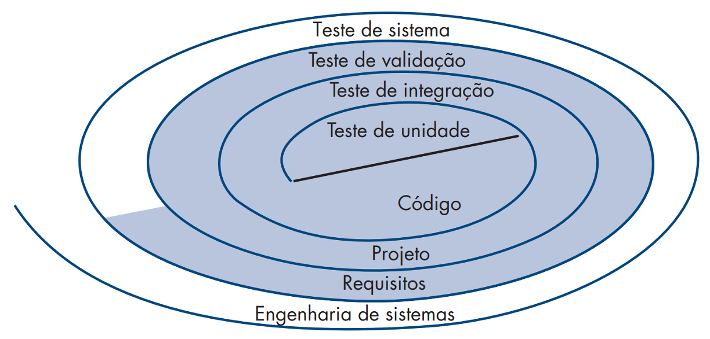
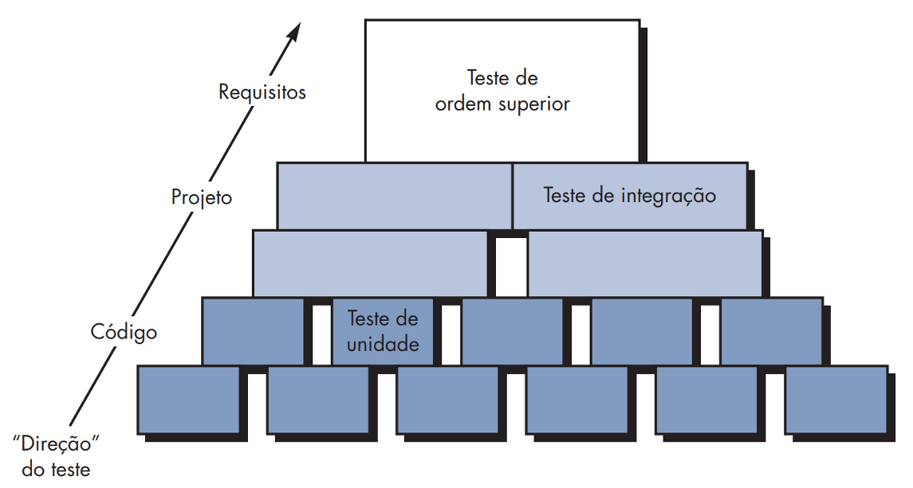

# Capítulo 39 – Testes de Software

Existe uma frase que encapsula a filosofia por trás de qualquer processo rigoroso de engenharia: “A melhor maneira de construir confiança é tentar destruí-la”. Longe de ser um paradoxo, essa ideia é a pedra fundamental para garantir a qualidade e a segurança de produtos complexos, do mundo físico ao digital.

Para visualizar isso, basta observar a indústria automobilística. Os testes de impacto (crash tests) são um exemplo claro dessa mentalidade. Nesses ensaios, veículos são lançados contra barreiras deformáveis e indeformáveis com um único objetivo: avaliar sistematicamente os limites de sua segurança e identificar pontos de falha.

Cada teste destrutivo, cada componente que falha sob estresse, gera dados valiosíssimos. A partir dessas falhas, os engenheiros corrigem, reforçam e redesenham, sempre com o intuito de construir um veículo que proteja ao máximo seus passageiros. Portanto, quanto mais se tenta “destruir” o carro em um ambiente controlado, mais confiança se constrói sobre sua performance no mundo real.

Com software, o processo é conceitualmente idêntico. O teste de software é a disciplina de engenharia que executa um programa ou sistema com o objetivo de medir sua qualidade, encontrar problemas e, em última instância, construir confiança.

## Conceitos Fundamentais dos Testes de Software

O teste de software é um processo investigativo que envolve a execução de um sistema com duas metas primordiais e complementares:

- **Demonstrar conformidade (Validação):** Provar ao desenvolvedor, ao cliente e a todos os stakeholders que o software atende aos seus requisitos. O objetivo aqui é confirmar que o sistema se comporta como esperado e entrega o valor para o qual foi projetado.
- **Descobrir defeitos (Verificação):** Encontrar falhas, erros e comportamentos incorretos, indesejáveis ou que não estão em conformidade com a especificação. O objetivo é quebrar o sistema de forma controlada para que os problemas possam ser corrigidos antes de impactarem o usuário final.

Essa dualidade de objetivos dá origem a duas mentalidades distintas de teste. A primeira meta conduz ao **Teste de Validação**, onde o testador projeta casos de teste que simulam o uso real e esperado do sistema, esperando que ele funcione corretamente. Um teste de validação bem-sucedido é aquele que passa sem encontrar erros. A segunda meta conduz ao **Teste de Defeitos**, onde o testador assume uma postura adversarial, criando cenários, muitas vezes obscuros e atípicos, com a intenção explícita de expor fraquezas e provocar falhas. Nesse caso, um teste bem-sucedido é aquele que **encontra** um defeito.

É crucial entender, no entanto, que os testes não são uma bala de prata para a qualidade. Como o célebre cientista da computação Edsger Dijkstra afirmou: **“Os testes podem somente mostrar a presença de erros, não sua ausência”**. É impossível testar todas as combinações de entradas, estados e caminhos de execução de um sistema minimamente complexo. Sempre existirá a possibilidade de um cenário não previsto ou de um defeito latente que não foi ativado.

O verdadeiro propósito do teste não é alcançar a perfeição absoluta, mas sim mitigar riscos e fornecer um nível de confiança suficiente para que os desenvolvedores e clientes possam decidir que o software está "bom o suficiente" para seu uso operacional.

### A Definição Formal de Testes e o Conceito de Confiabilidade

Embora o conceito seja intuitivo, diferentes autoridades na área de software o definem com nuances importantes, refletindo as múltiplas facetas da disciplina:

- **Glenford Myers:** Em sua obra clássica, define teste como "o processo de executar um programa com a intenção de encontrar erros". Essa definição enfatiza a mentalidade de "caça aos bugs" do teste de defeitos.
- **Padrão IEEE 729:** Define teste como "o processo formal de avaliar um sistema ou componente por meios manuais ou automáticos para verificar se ele satisfaz os requisitos especificados". Aqui, o foco está na conformidade e na verificação contra uma especificação.
- **ISTQB (International Software Testing Qualifications Board):** Oferece a definição mais abrangente, conceituando teste como "atividades do ciclo de vida, estáticas ou dinâmicas, voltadas para o planejamento, preparação e avaliação de produtos de software [...] a fim de determinar se eles satisfazem os requisitos especificados, demonstrar que estão aptos para sua finalidade e detectar defeitos".

Um dos principais objetivos do teste é aumentar a **confiabilidade do software**. Se um programa falha de forma frequente e imprevisível, de pouco adianta ele ser eficiente ou ter uma boa usabilidade. A confiabilidade é definida em termos estatísticos como **a probabilidade de um programa operar sem falhas em um ambiente específico por um determinado período de tempo**. Diferente de outros fatores de qualidade mais subjetivos, a confiabilidade pode ser estimada e medida.

**Exemplo:** Um sistema de processamento de pagamentos tem uma confiabilidade estimada de 0,999 para um período de 24 horas de operação contínua. Isso significa que, se 1.000 instâncias desse sistema operarem por 24 horas, é estatisticamente provável que 999 delas funcionem sem nenhuma falha, enquanto uma pode falhar.

Essa métrica é crucial para definir o nível de risco aceitável para um produto de software.

### Os Sete Princípios Fundamentais dos Testes

A prática de testes ao longo de décadas consolidou um conjunto de princípios que guiam a elaboração de estratégias de teste eficazes. Ignorá-los pode levar a processos de teste ineficientes, caros e que geram uma falsa sensação de segurança.

|Princípio|Descrição Detalhada|
|---|---|
|**Testes Demonstram a Presença de Defeitos**|Reitera a máxima de Dijkstra. Um teste pode confirmar que defeitos existem, mas nunca pode provar que o software está 100% livre deles. O teste reduz o risco da existência de defeitos não descobertos, mas não o elimina.|
|**Testes Exaustivos São Impossíveis**|Testar todas as combinações de entradas, pré-condições e caminhos de um sistema é combinatorialmente explosivo e, portanto, inviável. Em vez de tentar o impossível, a estratégia de teste deve usar técnicas de análise de risco e priorização para focar os esforços nas áreas mais críticas do sistema.|
|**Testar o Mais Cedo Possível (Antecipação)**|O custo para corrigir um defeito aumenta exponencialmente ao longo do ciclo de vida do software. Um defeito de requisito encontrado na fase de análise pode custar 1 unidade para ser corrigido; o mesmo defeito, se encontrado em produção, pode custar 100 ou 1000 vezes mais, envolvendo retrabalho em design, código, testes e implantação. Portanto, as atividades de teste (como revisões de requisitos) devem começar o mais cedo possível.|
|**Agrupamento de Defeitos**|A experiência prática e os dados mostram que os defeitos não são distribuídos uniformemente pelo código. Seguindo o Princípio de Pareto (a regra 80/20), uma pequena porcentagem dos módulos (cerca de 20%) tende a conter a maioria dos defeitos (cerca de 80%). Identificar e focar os testes nessas áreas "sensíveis" ou complexas aumenta drasticamente a eficiência na detecção de falhas.|
|**O Paradoxo do Pesticida**|Assim como os insetos desenvolvem resistência a um pesticida usado repetidamente, os mesmos casos de teste, executados várias vezes, perdem sua eficácia em encontrar novos defeitos. Para superar esse paradoxo, os casos de teste precisam ser regularmente revisados, atualizados e expandidos para cobrir novas áreas e funcionalidades do software.|
|**Testes Dependem do Contexto**|Não existe uma estratégia de teste única que sirva para todos os sistemas. O contexto determina a abordagem. Um site de e-commerce, focado em usabilidade e desempenho sob carga, será testado de maneira muito diferente de um software embarcado em um marca-passo, onde a confiabilidade e a segurança são absolutas e não negociáveis.|
|**A Ilusão da Ausência de Erros**|Encontrar e corrigir todos os defeitos reportados não garante o sucesso do sistema. Se o software foi construído com base em requisitos equivocados, ele pode ser tecnicamente perfeito, mas completamente inútil para o usuário. A validação (construir o produto certo) é tão importante quanto a verificação (construir o produto sem defeitos).|

### As Características de um Bom Teste

O objetivo do teste é encontrar erros, e um bom caso de teste é aquele com alta probabilidade de fazê-lo. Para isso, os testes devem ser projetados com certas características em mente.

|Característica|Descrição Detalhada|
|---|---|
|**Alta Probabilidade de Encontrar Defeitos**|Um bom testador não executa o software aleatoriamente. Ele deve compreender a aplicação, seus pontos fracos e desenvolver uma "imagem mental" de como ela pode falhar. As classes de falha mais comuns (ex: tratamento de valores nulos, erros de "off-by-one" em laços, condições de corrida) devem ser investigadas deliberadamente.|
|**Não Ser Redundante**|O tempo e os recursos são finitos. Cada caso de teste deve ter um propósito claro e distinto. Realizar múltiplos testes que verificam exatamente a mesma condição ou caminho lógico é um desperdício de esforço. Técnicas como classes de equivalência ajudam a evitar redundâncias.|
|**Ser o "Melhor da Espécie" (Best-of-Breed)**|Em um conjunto de testes com propósitos similares, deve-se priorizar aquele com a maior probabilidade de descobrir toda uma classe de erros. Por exemplo, ao testar um campo que aceita números de 1 a 100, testar os valores de fronteira (0, 1, 100, 101) é muito mais eficaz do que testar valores aleatórios no meio do intervalo (como 23, 58, 71).|
|**Não Ser Nem Muito Simples, Nem Muito Complexo**|Testes muito simples podem ser triviais e não encontrar defeitos significativos. Por outro lado, combinar muitas verificações em um único caso de teste complexo pode ser perigoso. Se o teste falhar, pode ser difícil diagnosticar qual das múltiplas condições causou a falha. Além disso, uma falha inicial pode mascarar outras falhas que ocorreriam mais tarde no mesmo teste. A regra geral é focar cada teste em uma condição ou cenário específico.|

### Testabilidade: Projetando Software para ser Testado

Um dos maiores desafios da atividade de teste é lidar com software que não foi projetado para ser testável. A **testabilidade** é uma qualidade de projeto que mede a facilidade com que um programa pode ser testado. Construir software com a testabilidade em mente desde o início reduz drasticamente o custo e o esforço do processo de qualidade. As principais características que levam a um software testável são:

|Característica|Descrição Detalhada|
|---|---|
|**Operabilidade**|Um sistema que é estável, que possui poucas falhas em seu fluxo principal e cujas funcionalidades estão completas é mais fácil de testar. Se o sistema trava a cada cinco minutos durante a configuração, torna-se impossível testar as funcionalidades mais avançadas. A operabilidade garante que a base para o teste é sólida.|
|**Observabilidade**|É a capacidade de "enxergar" o estado interno do sistema durante a execução. Isso vai além de observar a interface do usuário. Um software com boa observabilidade fornece logs detalhados, exibe mensagens de erro claras, permite acesso ao banco de dados para verificação de estado e expõe APIs que retornam o estado interno dos componentes. Sem observabilidade, quando um teste falha, a depuração se torna um exercício de adivinhação.|
|**Controlabilidade**|Refere-se à capacidade de colocar o software em um estado específico para realizar um teste. Quanto melhor for o controle sobre as entradas e o ambiente do sistema, mais fácil será automatizar e otimizar os testes. Isso inclui a capacidade de simular condições de erro, forçar o sistema a usar configurações específicas e isolar componentes para testes unitários.|
|**Decomponibilidade**|Um sistema bem estruturado, com módulos independentes e baixo acoplamento, é mais fácil de testar. A decomponibilidade permite que os testadores isolem problemas mais rapidamente, testando cada componente separadamente (teste de unidade) antes de integrá-los. Isso segue a estratégia de "dividir para conquistar".|
|**Simplicidade**|Quanto menos houver para testar, mais rápido e completo será o teste. A simplicidade pode se manifestar de três formas: **funcional** (evitar funcionalidades desnecessárias e complexas), **estrutural** (usar arquiteturas e padrões de código limpos e coesos) e de **código** (evitar lógica aninhada e complexa).|
|**Estabilidade**|Um sistema cujos requisitos e funcionalidades mudam com pouca frequência é mais fácil de testar. Mudanças constantes invalidam os casos de teste existentes e exigem um esforço contínuo de manutenção da suíte de testes, interrompendo o fluxo de validação.|
|**Compreensibilidade**|Refere-se à disponibilidade e clareza das informações sobre o sistema. Isso inclui documentação técnica bem escrita (requisitos, design) e um código-fonte limpo e autoexplicativo. Quanto mais a equipe de testes entender sobre como o sistema funciona, mais inteligentes e eficazes serão os testes projetados.|

## O Processo de Teste: Uma Abordagem Estruturada

Assim como o desenvolvimento de software segue um ciclo de vida, a atividade de teste também é um processo estruturado, e não uma única fase isolada. O processo de teste consiste em um conjunto de atividades interligadas, desde o planejamento inicial até a análise final dos resultados, com o objetivo de guiar o esforço de verificação e validação de forma eficiente e eficaz. Seguir um processo formal serve para minimizar os riscos causados por defeitos, otimizar o uso de recursos e garantir que os objetivos de qualidade sejam alcançados de maneira sistemática.

Este processo não é estritamente linear; muitas de suas atividades ocorrem em paralelo e se retroalimentam. A figura a seguir ilustra as principais etapas que compõem um processo de teste robusto.

  

Cada uma dessas etapas gera artefatos e informações cruciais que servem de entrada para a etapa seguinte, criando um fluxo de trabalho coeso para a equipe de qualidade.

### Planejamento e Controle

A etapa de planejamento é a fundação de todo o esforço de teste. É aqui que a estratégia geral é definida, os objetivos são esclarecidos e os recursos são alocados. Esta não é uma atividade que ocorre apenas no início; o controle e o replanejamento são contínuos, acompanhando a evolução do projeto. A principal saída desta etapa é o **Plano de Testes**.

As atividades centrais de planejamento e controle incluem:

- **Definição do escopo e dos objetivos do teste:** O que será testado e o que está fora do escopo? Quais são as metas de qualidade a serem alcançadas?
- **Análise de Riscos:** Identificar os riscos do produto (ex: áreas com maior probabilidade de falha, funcionalidades de maior impacto para o negócio) para priorizar os esforços de teste.
- **Definição da Estratégia de Teste:** Decidir sobre os níveis, tipos e técnicas de teste que serão aplicados.
- **Estimativa de Esforço e Cronograma:** Estimar o tempo, o custo e os recursos humanos necessários para as atividades de teste.
- **Definição dos Critérios de Saída:** Estabelecer as condições que devem ser satisfeitas para que o ciclo de testes seja considerado concluído (ex: 95% dos casos de teste executados com sucesso, nenhum defeito crítico em aberto).

### Análise e Modelagem de Testes

Uma vez que o planejamento inicial está em vigor, a equipe de testes se aprofunda nos requisitos e no design do sistema para modelar como os testes serão realizados. Esta etapa traduz os objetivos de teste em ações concretas e documentadas. Seus dois artefatos mais importantes são o Plano de Testes detalhado e os Casos de Teste.

#### O Plano de Testes

O Plano de Testes é o documento mestre que guia toda a operação de teste. Por ser um documento gerencial, seu principal objetivo é comunicar e obter a aprovação dos stakeholders sobre o escopo, a abordagem, os recursos e o cronograma do esforço de teste. Ele deve ser claro e focado nas informações relevantes para seu público. Embora a estrutura possa variar, um Plano de Testes abrangente geralmente inclui as seguintes seções:

|Seção do Plano de Testes|Descrição Detalhada|
|---|---|
|**Introdução**|Apresenta o projeto, os objetivos do plano de testes, o público-alvo do documento e define claramente o escopo do que será testado, incluindo funcionalidades, plataformas e integrações.|
|**Requisitos a Serem Testados**|Lista os requisitos funcionais e não-funcionais que serão objeto de teste. Pode fazer referência a documentos de especificação e priorizar os requisitos com base na análise de risco.|
|**Estratégias e Ferramentas**|Descreve a abordagem de teste. Detalha os tipos de testes (funcional, desempenho, segurança), as técnicas a serem usadas (caixa-preta, caixa-branca) e os critérios de finalização (exit criteria). Também lista as ferramentas de apoio (automação, gerenciamento de testes, relatório de defeitos).|
|**Equipe e Infraestrutura**|Detalha os recursos necessários. Inclui a composição da equipe de testes e suas responsabilidades, bem como os requisitos de hardware, software, rede e dados (`massa de testes`) para criar um ambiente de teste representativo.|
|**Cronograma de Atividades**|Apresenta um cronograma com as principais atividades de teste, seus responsáveis, dependências e marcos importantes (_milestones_), como o início da execução dos testes de regressão ou a data de congelamento de código para testes de aceitação.|
|**Documentação Complementar**|Relaciona todos os documentos de referência pertinentes ao projeto, como especificações de requisitos, diagramas de arquitetura, manuais de usuário, etc.|

#### Os Casos de Teste

O Caso de Teste é o artefato que descreve, passo a passo, como uma funcionalidade específica ou um caminho do sistema deve ser verificado. É um script detalhado que contém todas as informações necessárias para que um testador possa executar um teste de forma consistente e avaliar seu resultado. Cada caso de teste é projetado para validar uma condição ou requisito específico.

Sua estrutura geralmente contém:

- **Identificador Único:** Um código para rastrear o caso de teste (ex: CT-LOGIN-001).
- **Descrição/Objetivo:** Um resumo do que o teste visa verificar.
- **Pré-condições:** O estado em que o sistema deve estar para que o teste possa ser executado (ex: "O usuário deve estar na página de login").
- **Passos de Execução:** Uma sequência numerada de ações que o testador deve realizar.
- **Dados de Entrada:** Os valores específicos a serem inseridos durante os passos.
- **Resultado Esperado:** A descrição exata do que deve acontecer se o software funcionar corretamente após a execução dos passos.

Para ilustrar, imagine uma fabricante de automóveis desenvolvendo um protótipo de carro voador. A equipe de testes, após elaborar o plano, precisa criar casos de teste específicos para validar suas funcionalidades.

|Identificador|Descrição do Teste|Pré-condições|Passos de Execução|Resultado Esperado|
|---|---|---|---|---|
|**CT-VOO-01**|Validar sequência de decolagem vertical|1. Carro em solo   2. Freio de mão ativado   3. Sistema ligado|1. Pressionar o botão "Ativar Modo Voo"   2. Desativar o freio de mão   3. Pressionar o pedal do acelerador gradualmente|O carro deve iniciar uma aceleração vertical suave e controlada, subindo a uma taxa de 2 m/s.|

Se, ao executar o passo 3, o carro não decolar ou disparar para cima sem controle, o testador encontrou uma falha. O resultado esperado não foi alcançado.

Trazendo para o mundo do software, considere o teste de um campo de CPF em um formulário de cadastro:

|Identificador|Descrição do Teste|Pré-condições|Passos de Execução|Resultado Esperado|
|---|---|---|---|---|
|**CT-CAD-CPF-04**|Validar formato inválido de CPF|1. Estar na tela de cadastro de cliente.|1. Navegar até o campo "CPF"   2. Inserir o texto "1234.56.7-7890"   3. Clicar no botão "Salvar"|O sistema deve exibir uma mensagem de erro "Formato de CPF inválido" abaixo do campo e o registro não deve ser salvo.|

### Preparação e Configuração do Ambiente

Nesta etapa, a equipe de testes materializa o que foi planejado, organizando a infraestrutura necessária para a execução. Um ambiente de testes mal configurado ou que não reflete o ambiente de produção pode invalidar os resultados. As atividades incluem:

- **Configuração de Hardware e Software:** Preparar servidores, máquinas clientes, sistemas operacionais e qualquer software de base necessário.
- **Criação da Massa de Testes:** Preparar o conjunto de dados (banco de dados, arquivos) que será utilizado pelos testes. Isso pode envolver a criação de dados sintéticos ou a anonimização de dados de produção.
- **Instalação das Ferramentas:** Instalar e configurar as ferramentas de automação, gerenciamento e monitoramento.

### Execução dos Testes

Esta é a fase em que os casos de teste são efetivamente executados contra a aplicação. A equipe segue os roteiros e scripts definidos na fase de modelagem, sempre que uma nova versão do software é disponibilizada para teste. Durante a execução, duas atividades são primordiais:

1. **Execução e Comparação:** Para cada passo do caso de teste, o testador executa a ação e compara o resultado obtido no sistema (o resultado atual) com o resultado esperado.
2. **Registro de Resultados e Evidências:** Todos os resultados são meticulosamente registrados. Se um teste passa, ele é marcado como "Aprovado". Se falha, é marcado como "Reprovado", e evidências da falha (como capturas de tela, logs de erro, vídeos) são coletadas para a abertura de um relatório de defeito.

### Avaliação dos Critérios de Saída e Relatórios

A fase final do processo de teste envolve a análise dos resultados para decidir se o software atingiu o nível de qualidade necessário para ser liberado. As atividades incluem:

- **Verificação dos Critérios de Saída:** A equipe verifica se os critérios definidos no plano de testes foram atendidos.
- **Elaboração do Relatório Final de Testes:** Um resumo de todo o esforço de teste é compilado, incluindo o número de testes executados, a porcentagem de sucesso, a quantidade de defeitos encontrados (abertos e fechados) e uma análise final dos riscos remanescentes.
- **Documentação e Arquivamento:** Todos os artefatos de teste (planos, casos, relatórios, evidências) são arquivados para referência futura e auditoria. As lições aprendidas são registradas para a melhoria contínua do processo.

### As Dimensões do Teste: Como, Quando e O Que Testar?

Para organizar a vasta disciplina de testes, é útil pensar nela através de três dimensões distintas, que respondem a três perguntas fundamentais. Essas dimensões não são mutuamente exclusivas; pelo contrário, elas se cruzam para formar uma estratégia de teste completa.

  

 

  

- **Níveis de Teste (Quando testar?):** Esta dimensão aborda o momento e o escopo do teste dentro do ciclo de vida de desenvolvimento. Ela define uma progressão, começando com o teste de pequenas unidades de código e expandindo para o sistema como um todo. Os níveis são a resposta para a pergunta "Quando?".
- **Tipos de Teste (O que testar?):** Esta dimensão foca em um atributo ou característica de qualidade específica do software. Ela responde à pergunta "O que estamos tentando validar?". Exemplos incluem testes funcionais (foco no comportamento) e testes não-funcionais (foco em desempenho, usabilidade, segurança).
- **Técnicas de Teste (Como testar?):** Esta dimensão descreve os métodos usados para projetar e derivar os casos de teste. Ela é a resposta para a pergunta "Como vamos criar nossos testes?". As técnicas definem a abordagem, como o teste de caixa-preta (sem conhecimento interno) ou caixa-branca (com conhecimento do código).

Nos próximos tópicos, exploraremos cada uma dessas dimensões em profundidade, detalhando os principais níveis, tipos e técnicas que formam o arsenal de um engenheiro de software de qualidade.

## Estratégias e Níveis de Teste: Do Componente ao Sistema Completo

Uma vez que entendemos os princípios fundamentais, uma série de perguntas práticas emerge: Como devemos conduzir os testes de forma organizada? Devemos estabelecer um plano formal? Testamos o programa como um todo de uma só vez ou executamos testes em partes menores? E quando o cliente deve ser envolvido?

Essas e outras questões são respondidas por meio de uma **estratégia de teste de software**. O teste, muitas vezes, requer mais esforço de projeto e planejamento do que a própria codificação. Se for realizado de maneira casual e desorganizada, o resultado é tempo perdido, esforço duplicado e, o pior de tudo, erros críticos que passam sem ser detectados. Portanto, é essencial estabelecer uma abordagem sistemática e formal para a atividade de teste.

De maneira geral, toda estratégia de teste de software eficaz parte do “pequeno” em direção ao “grande”. Ou seja, os testes iniciais focam em um único componente ou em um pequeno grupo de unidades relacionadas, aplicando verificações para descobrir erros nos dados e na lógica de processamento encapsulados por eles. Após os componentes serem validados individualmente, eles são progressivamente integrados até que o sistema completo esteja montado. Nesse ponto, são executados testes de ordem superior para descobrir erros no atendimento aos requisitos do cliente.

Pense na montagem de um motor de carro. Os testes começam nos componentes menores e isolados, como a vela de ignição, a biela ou o pistão. Em seguida, os engenheiros realizam testes de integração para verificar se esses componentes trabalham corretamente em conjunto. Finalmente, o motor completo é testado em um dinamômetro para validar seu desempenho (potência, torque) e, por fim, o carro inteiro é testado na pista. A estratégia de teste de software segue essa mesma lógica incremental e hierárquica.

### Princípios de uma Estratégia de Teste

Embora existam muitas estratégias de teste propostas na literatura, todas elas compartilham um conjunto de características e princípios genéricos:

- **Revisões Técnicas como Ponto de Partida:** Um teste eficaz começa antes mesmo da execução do código. A realização de **revisões técnicas eficazes** sobre os artefatos (requisitos, diagramas de arquitetura, etc.) permite eliminar uma grande quantidade de erros de lógica e interpretação antes que eles se transformem em defeitos no software.
- **Progressão de Nível:** O teste sempre se inicia no nível do componente individual (a menor parte testável do software) e progride em direção à integração do sistema computacional como um todo.
- **Técnicas Apropriadas para Cada Contexto:** Diferentes técnicas de teste (que veremos mais adiante) são apropriadas para diferentes abordagens de engenharia e em diferentes pontos do ciclo de vida. Testes de unidade, por exemplo, utilizam técnicas de caixa-branca, enquanto testes de sistema utilizam técnicas de caixa-preta.
- **Envolvimento de Múltiplos Papéis:** O teste é uma responsabilidade compartilhada. Ele é realizado tanto pelo **desenvolvedor do software**, que tem o conhecimento profundo do código, quanto por um **grupo de teste independente** (em projetos maiores), que traz uma perspectiva imparcial e focada nos requisitos do usuário, evitando o viés de confirmação.
- **Distinção entre Teste e Depuração:** Testar e depurar (_debugging_) são atividades distintas. **Testar é o processo de encontrar defeitos; depurar é o processo de localizar e corrigir a causa desses defeitos**. Embora diferentes, elas são intrinsecamente ligadas, e a depuração deve ser uma consequência natural de uma boa estratégia de teste.

### Visualizando a Estratégia: O Modelo em Espiral dos Testes

Uma estratégia de teste eficaz precisa acomodar tanto os testes de baixo nível, que verificam pequenos segmentos de código, quanto os de alto nível, que validam as funções do sistema em relação aos requisitos do cliente. Uma das melhores maneiras de visualizar essa dinâmica é através do modelo em espiral.

  

Este modelo pode ser interpretado sob dois pontos de vista complementares: o do processo de desenvolvimento e o do processo de teste.

- **O Fluxo de Desenvolvimento (Sentido Anti-Horário):** Visto pela perspectiva do processo de software, o desenvolvimento se move da parte externa para a interna da espiral, em um sentido **anti-horário**. Começa-se com a **Engenharia de Sistemas** e a **Análise de Requisitos**, que são atividades de alta abstração. Em seguida, avança-se para o **Projeto** da arquitetura e, finalmente, para a **Codificação**, que é a atividade mais concreta. O desenvolvimento, portanto, diminui o nível de abstração a cada volta.
- **O Fluxo de Testes (Sentido Horário):** Visto pela perspectiva da estratégia de testes, o processo se move do centro da espiral para fora, em um sentido **horário**. Começa-se com o **Teste de Unidade**, focado em cada componente de código recém-implementado. Em seguida, o escopo se expande para o **Teste de Integração**, que verifica o projeto e a arquitetura. Depois, para o **Teste de Validação**, que confere os requisitos, e, finalmente, para o **Teste de Sistema**, que avalia o sistema como um todo. O processo de teste, portanto, aumenta o escopo e o nível de abstração a cada volta.

Essa visualização deixa claro que o teste não é uma fase final, mas sim um conjunto de atividades que espelham e validam cada etapa do processo de desenvolvimento.

### A Hierarquia dos Níveis de Teste

Considerando a estratégia de um ponto de vista procedimental, o teste de software é, na prática, uma série de quatro níveis de teste implementados sequencialmente. Essa progressão garante que o software seja construído sobre uma base sólida, verificando primeiro as partes pequenas e depois suas interações, até validar o todo.

  

Essa hierarquia pode ser dividida em duas grandes categorias, que exigem diferentes habilidades e perspectivas:

- **Testes de Baixo Nível (1º Nível):** Composto pelo **Teste de Unidade** e **Teste de Integração**, este nível foca na verificação técnica do software. Exige um profundo conhecimento da estrutura interna do código, da arquitetura e das tecnologias utilizadas. Por essa razão, esses testes são frequentemente realizados pelos próprios desenvolvedores, que possuem todo o contexto necessário para criá-los e executá-los. A abordagem aqui é predominantemente de **caixa-branca**.
- **Testes de Alto Nível (2º Nível):** Composto pelo **Teste de Validação** e **Teste de Sistema**, este nível foca na validação do software em relação às necessidades do negócio e dos usuários. Não é necessário ter conhecimento da implementação interna; os testes são guiados pelas especificações de requisitos e pelos cenários de uso. Por isso, são geralmente conduzidos por uma equipe de testes dedicada, por analistas de negócio ou até mesmo pelos usuários finais. A abordagem aqui é de **caixa-preta**.

A seguir, uma introdução a cada um desses quatro níveis, que serão detalhados nos próximos tópicos.

- **Teste de Unidade:** Foca em verificar a menor parte testável do software (uma função, um método, uma classe) de forma isolada, garantindo que ela funcione corretamente.
- **Teste de Integração:** Após as unidades serem testadas, o foco se move para a verificação das interações entre elas. O objetivo é descobrir defeitos nas interfaces e na comunicação entre os componentes integrados.
- **Teste de Validação:** Verifica se o software, já totalmente integrado, atende aos requisitos funcionais, de desempenho e de comportamento definidos na fase de análise. A pergunta-chave aqui é: "Estamos construindo o produto certo?".
- **Teste de Sistema:** Avalia o software como parte de um sistema maior, que pode incluir hardware, outros softwares, pessoas e processos. Ele verifica se todos os elementos se combinam corretamente e se o desempenho global do sistema é alcançado.

### Teste de Unidade

O **Teste de Unidade**, também conhecido como **Teste de Componente** ou **Teste de Módulo**, representa o primeiro e mais fundamental nível de teste. Ele concentra o esforço de verificação na **menor unidade de projeto do software**: o componente. A ideia central é testar cada pedaço do software de forma isolada para garantir que ele se comporte conforme o esperado, antes de combiná-lo com outras partes.

Mas o que exatamente é uma "unidade"? Dependendo do paradigma de programação e da granularidade do projeto, uma unidade pode ser:

- Uma função ou procedimento individual.
- Um método dentro de uma classe.
- Uma classe completa, com seus atributos e métodos.
- Um componente composto que agrupa várias funções ou objetos, mas que possui uma interface bem definida para ser acessado.

O objetivo deste teste é explorar a lógica de processamento interna e as estruturas de dados dentro dos limites de um único componente, procurando por falhas de implementação. Por serem focados em partes pequenas e isoladas, os testes de unidade podem ser executados em paralelo para múltiplos componentes, acelerando o ciclo de feedback para os desenvolvedores. Geralmente, são escritos e executados pelos próprios programadores, pois exigem um conhecimento profundo do código-fonte.

As principais áreas de foco em um teste de unidade são:

- **A Interface do Módulo:** Verificar se os dados fluem corretamente para dentro e para fora da unidade (parâmetros de entrada, valores de retorno).
- **Estruturas de Dados Locais:** Garantir que os dados mantidos temporariamente dentro da unidade (variáveis locais) são preservados e manipulados corretamente durante a execução.
- **Caminhos Independentes:** Assegurar que todos os caminhos lógicos da estrutura de controle (como `if`, `else`, `switch` e laços) sejam executados pelo menos uma vez.
- **Condições de Limite (Boundary Conditions):** Testar o comportamento da unidade em seus limites operacionais (ex: valores máximos e mínimos, entradas nulas, listas vazias), pois é onde os erros frequentemente ocorrem.
- **Manipulação de Erros:** Verificar se todos os caminhos de tratamento de erro (ex: blocos `try-catch`, validações de entrada) são acionados corretamente quando uma condição de falha é simulada.

Retornando à nossa analogia do motor, o teste de unidade é o equivalente a testar cada peça individualmente. Antes de montar o motor, os engenheiros testam a vela de ignição para garantir que ela produz a faísca correta, o pistão para verificar sua resistência e a biela para conferir sua durabilidade. Cada peça, a menor unidade do motor, precisa funcionar perfeitamente por si só.

Para selecionar os casos de teste de unidade de forma eficaz, duas estratégias são comumente utilizadas:

1. **Teste de Partição (ou Particionamento de Equivalência):** Identifica grupos de entradas que possuem características comuns e que, teoricamente, seriam processadas da mesma maneira pela unidade. Em vez de testar todos os valores possíveis, escolhe-se um representante de cada grupo. Por exemplo, se uma função espera um número de 1 a 100, as partições seriam: números negativos (inválida), zero (inválida), 1 a 100 (válida) e maiores que 100 (inválida).
2. **Testes Baseados em Diretrizes:** Utiliza a experiência acumulada sobre os tipos de erros que os programadores mais cometem. Por exemplo, diretrizes podem sugerir sempre testar com valores nulos, strings vazias, números zero ou com o maior valor que um tipo de dado pode suportar.

A tabela a seguir resume algumas definições importantes sobre os Testes de Unidade:

| Definições Importantes de Testes de unidade |
| --- |
| Testes de Unidade são aqueles realizados sobre as menores estruturas de código-fonte, como métodos e classes. |
| Testes de Unidade consistem em testar individualmente, componentes ou módulos de software que, posteriormente devem ser testados de maneira integrada. |
| Testes de Unidade focalizam cada componente de um software de forma individual, garantindo que o componente funciona adequadamente. |
| Testes de Unidade focalizam o esforço de verificação na menor unidade de projeto de software, isto é, no componente ou no módulo de software. |
| Testes de Unidade têm por objetivo explorar a menor unidade do projeto, procurando identificar falhas ocasionadas por defeitos de lógica e de implementação em cada módulo separadamente. |
| Testes de Unidade enfocam a lógica interna de processamento e as estruturas de dados dentro dos limites de um componente. |
| Testes de Unidade concentram o esforço de verificação na menor unidade de design de software. |
| Testes de Unidade concentram-se na lógica de processamento interno e nas estruturas de dados dentro dos limites de um componente. |
| Testes de Unidade têm por objetivo explorar a menor unidade do projeto, procurando provocar falhas ocasionadas por defeitos de lógica e de implementação em cada módulo, separadamente. |
| Testes de Unidade têm como foco as menores unidades de um programa, que podem ser funções, procedimentos, métodos ou classes. |

### Teste de Integração

Após os testes de unidade garantirem que os componentes individuais funcionam corretamente em isolamento, o próximo desafio é fazê-los trabalhar em conjunto. Um iniciante poderia perguntar: "Se todas as peças funcionam perfeitamente sozinhas, por que elas não funcionariam juntas?". A realidade da engenharia de software mostra que a integração de componentes é uma das fontes mais ricas de defeitos.

O **Teste de Integração** é a técnica sistemática para construir a arquitetura do software, combinando os componentes testados em unidade e, ao mesmo tempo, conduzindo testes para descobrir erros associados às suas **interfaces** e interações. Problemas comuns que surgem nesta fase incluem:

- Dados perdidos ou corrompidos ao passar de um componente para outro.
- Um componente causando um efeito colateral adverso e inesperado em outro.
- Subfunções que, quando combinadas, não produzem a função principal desejada.
- Pequenas imprecisões de cálculo em componentes individuais que se amplificam a níveis inaceitáveis quando combinadas.
- Conflitos no acesso a estruturas de dados globais.

Uma abordagem ingênua e perigosa para a integração é a chamada **"Big Bang"**, onde todos os componentes são combinados de uma só vez e o programa inteiro é testado. O resultado é, quase sempre, o caos. Um grande número de erros aparece simultaneamente, e isolar a causa de cada um se torna uma tarefa extremamente complexa e demorada.

A alternativa profissional é a **integração incremental**. Nela, o programa é construído e testado em pequenos incrementos, adicionando um componente de cada vez à base já testada. Essa abordagem permite que os erros sejam isolados e corrigidos mais facilmente, que as interfaces sejam testadas de forma mais completa e que uma estratégia sistemática seja aplicada.

Voltando ao nosso motor, o teste de integração seria o momento de juntar o virabrequim, a biela e o pistão. Individualmente, eles passaram nos testes, mas agora é preciso verificar se eles se conectam perfeitamente e se, juntos, conseguem transformar o movimento linear do pistão em movimento de rotação no virabrequim, como esperado. O foco está na interface e na colaboração entre as peças.

A tabela a seguir resume algumas definições importantes sobre os Testes de Integração:

| Definições Importantes de Testes de integração |
| --- |
| Testes de Integração são caracterizados por testar as interfaces entre os componentes ou interações de diferentes partes de um sistema. |
| Testes de Integração visam testar as falhas decorrentes da integração dos módulos do sistema. |
| Testes de Integração são uma técnica sistemática para construir a arquitetura do software, enquanto, ao mesmo tempo, conduz testes para descobrir erros associados às interfaces. |
| Testes de Integração têm por objetivo construir uma estrutura de programa determinada pelo projeto a partir de componentes já testados. |
| Testes de Integração são uma técnica utilizada para descobrir erros associados às interfaces na qual, a partir de componentes testados individualmente, se constrói uma estrutura de programa determinada pelo projeto. |
| Testes de Integração verificam o funcionamento em conjunto dos componentes do sistema, se são chamados corretamente e se a transferência de dados acontece no tempo correto, por meio de suas interfaces. |
| Testes de Integração verificam se os componentes do sistema, juntos, trabalham conforme descrito nas especificações do sistema e do projeto do programa. |
| Testes de Integração são uma técnica sistemática para construir a arquitetura do software enquanto conduz testes para descobrir erros associados às interfaces. |

### Teste de Validação

Quando o teste de integração termina, temos um software completamente montado como um pacote, com seus erros de interface já descobertos e corrigidos. É neste ponto que começa o **Teste de Validação**, também conhecido como **Teste de Aceitação**. Seu foco muda da verificação técnica interna para a validação do produto em relação às expectativas do cliente.

O teste de validação concentra-se exclusivamente em **ações visíveis ao usuário e em saídas do sistema reconhecíveis por ele**. A validação tem sucesso quando o software funciona de uma maneira que pode ser razoavelmente esperada pelo cliente. Mas como definir "expectativas razoáveis"? O árbitro para essa questão é o **documento de requisitos de software**, que deve conter uma seção de **Critérios de Validação**.

A validação é frequentemente realizada por meio de duas práticas principais:

- **Teste Alfa (Alpha Testing):** É conduzido por um grupo de usuários finais ou pela equipe de testes no ambiente de desenvolvimento, mas de forma controlada. O objetivo é simular o uso real e encontrar defeitos antes que o software seja liberado para um público maior.
- **Teste Beta (Beta Testing):** É conduzido por usuários finais reais, no seu próprio ambiente. O software é liberado para um grupo limitado de clientes que concordam em usá-lo e reportar problemas. O teste beta é uma excelente forma de obter feedback sobre o desempenho e a usabilidade do produto no mundo real.

No exemplo do nosso motor, suponha que ele foi encomendado pela BMW para ser instalado em um carro da Citroën. O Teste Alfa seria a equipe da Citroën indo até a fábrica da BMW para testar o motor em um ambiente controlado. O Teste Beta seria a BMW entregando alguns motores para a Citroën instalá-los em seus carros e testá-los em condições reais de uso.

A tabela a seguir resume algumas definições importantes sobre os Testes de Validação:

| Definições Importantes de Testes de validação |
| --- |
| Testes de Validação focalizam ações e saídas, tais como percebidas pelo usuário final. |
| Testes de Validação são executados logo após montagem do pacote de software, quando os erros de interface já foram descobertos e corrigidos. |
| Testes de Validação têm como principal característica verificar o sistema em relação aos seus requisitos originais e às necessidades atuais do usuário. |
| Testes de Validação avaliam o software com respeito aos seus requisitos e detecta falhas nos requisitos e na interface com o usuário. |

#### Verificação vs. Validação: Uma Nuance Importante

É crucial entender a diferença conceitual entre verificação e validação, um tópico frequente em avaliações e discussões teóricas.

- **Verificação:** Responde à pergunta "Estamos construindo o produto **corretamente**?". É um processo interno, focado em checar se o software está em conformidade com sua **especificação técnica** (design, arquitetura). Os testes de unidade e integração são, em sua essência, atividades de verificação.
- **Validação:** Responde à pergunta "Estamos construindo o produto **certo**?". É um processo externo, focado em checar se o software atende às **necessidades e expectativas do usuário**.

No entanto, há uma nuance. Como as expectativas do cliente são formalizadas nos Critérios de Validação, que fazem parte da especificação de requisitos, algumas fontes, incluindo o autor Roger Pressman, afirmam que a validação demonstra a **conformidade com os requisitos**. Como ele diz: "A validação de software é conseguida por meio de uma série de testes que demonstram conformidade com os requisitos."

Portanto, para um entendimento padrão: a verificação foca na conformidade técnica, enquanto a validação foca na conformidade com as necessidades do usuário. Contudo, ao afirmar que o teste de validação ocorre em relação aos requisitos, sem compará-lo com o teste de verificação, essa afirmação pode ser considerada correta no contexto prático.

### Teste de Sistema

O software, por mais complexo que seja, é geralmente apenas um elemento de um sistema maior, que envolve hardware, redes, bancos de dados, outros softwares e, claro, pessoas. O **Teste de Sistema** é o nível final de teste, onde o software já validado é integrado a todos os outros elementos do sistema para verificar se o conjunto funciona de forma coesa.

A finalidade primária do teste de sistema é exercitar totalmente o sistema de ponta a ponta. Ele avalia o software em relação ao seu projeto arquitetural e detecta falhas de especificação, desempenho, robustez e segurança que só se manifestam quando todos os componentes do ecossistema estão interagindo.

Um problema clássico que surge nesta fase é a “caça ao culpado”. Quando um erro é descoberto, as equipes responsáveis pelos diferentes elementos do sistema (software, banco de dados, infraestrutura) podem começar a acusar umas às outras. Para evitar essa postura improdutiva, a equipe de software deve se antecipar, criando testes que simulem falhas nas interfaces com outros elementos e registrando os resultados como evidência.

Finalizando nossa analogia: após validar que o motor atende aos critérios da Citroën, o teste de sistema consiste em **instalar o motor no carro** e testá-lo integrado a todos os outros sistemas: o sistema de transmissão, o elétrico, o de freios, o de arrefecimento, etc. O objetivo é garantir que o carro, como um todo, funcione harmoniosamente.

O teste de integração verifica as interfaces **entre os componentes do mesmo software**. O teste de sistema verifica as interfaces **entre o software e os outros elementos do sistema maior**.

A tabela a seguir resume algumas definições importantes sobre os Testes de Sistema:

| Definições Importantes de Testes de sistema |
| --- |
| Testes de Sistema incluem diversas modalidades de teste, cujo objetivo é testar o sistema computacional como um todo. |
| Testes de Sistema testam se o sistema cumpre seus requisitos funcionais e não funcionais. |
| Testes de Sistema avaliam o software com respeito ao seu projeto arquitetural e detecta falhas de especificação, desempenho, robustez e segurança. |
| Testes de Sistema visam a verificar o sistema, baseado em computador, não se limitando ao software, mas incluindo o processo como um todo, como hardware, pessoal e informação. |

