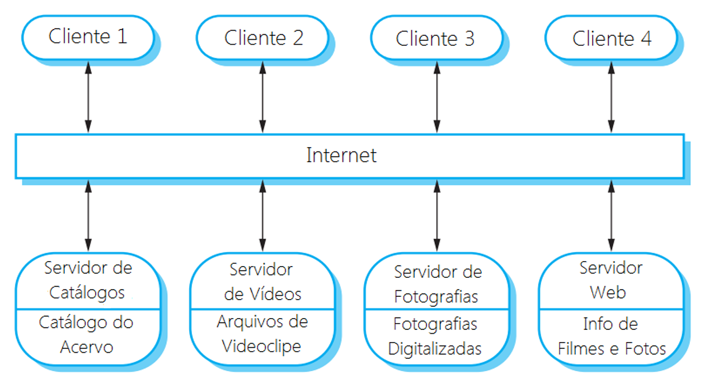
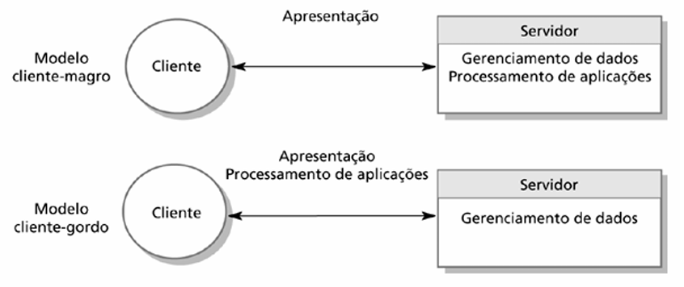
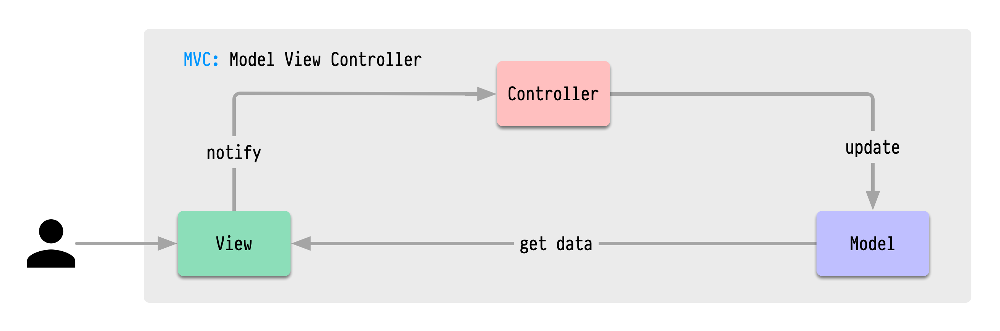
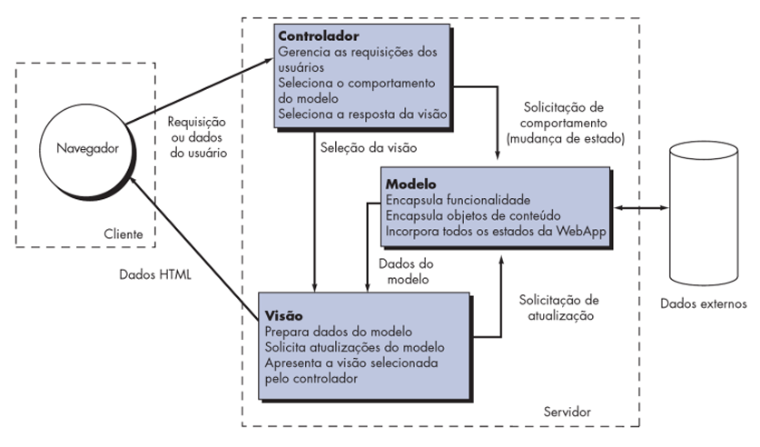
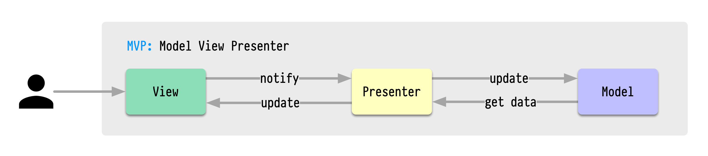
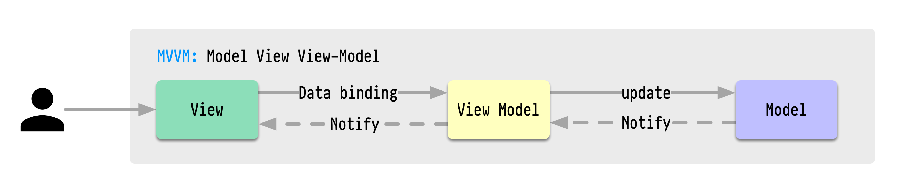
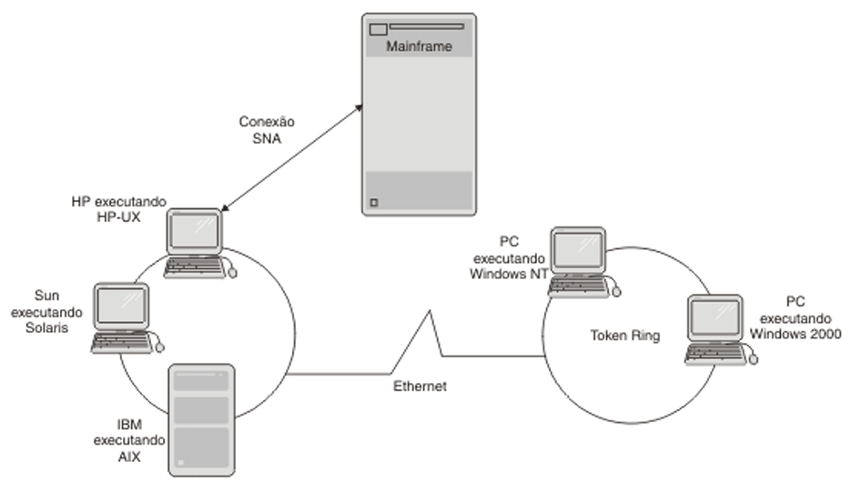
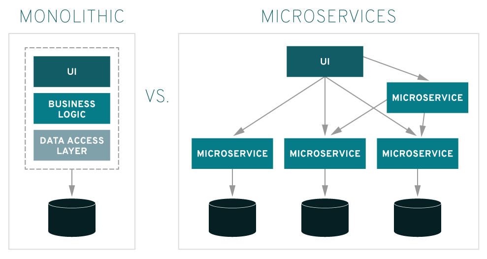

# Capítulo 40 – Arquitetura de Software

Ao se considerar a arquitetura de um edifício, diversos atributos vêm à mente. No nível mais simplista, pensamos na forma geral da estrutura física, em sua silhueta contra o céu. No entanto, a verdadeira arquitetura é muito mais do que isso. Ela é a maneira pela qual os vários componentes — a fundação, a estrutura de aço, os sistemas elétricos, a hidráulica, as paredes — são integrados para formar um todo coeso e funcional. É o modo como o edifício se ajusta ao seu ambiente, seja dialogando com a paisagem natural ou integrando-se à malha urbana e aos edifícios vizinhos.

A arquitetura também se mede pelo grau com que o edifício atende ao seu propósito expresso e satisfaz às necessidades de seu proprietário e de seus usuários. Um hospital e uma escola podem compartilhar materiais, mas suas arquiteturas são fundamentalmente diferentes porque seus propósitos são distintos. Há também o sentido estético da estrutura, o impacto visual que ela causa, e a maneira pela qual texturas, cores e materiais são combinados para criar não apenas uma fachada, mas um "ambiente de moradia" ou de trabalho. Ela engloba, por fim, os detalhes: o projeto dos dispositivos de iluminação, o tipo de piso, o posicionamento de painéis de vidro para maximizar a luz natural.

A arquitetura, portanto, é a soma de milhares de decisões, tanto as grandes quanto as pequenas. Algumas dessas decisões, como a escolha do local e da estrutura fundamental, são tomadas logo no início e têm um impacto profundo sobre todas as ações subsequentes, definindo os limites do que é possível. Outras decisões são postergadas ao máximo, evitando restrições prematuras que poderiam levar a uma implementação inadequada do estilo arquitetural desejado. Mas o que dizer da arquitetura de software? A analogia se encaixa com uma precisão notável.

## Definindo a Arquitetura de Software: Estrutura, Componentes e Decisões

Assim como em uma construção civil, a arquitetura de um sistema de software é o seu alicerce conceitual, a estrutura fundamental sobre a qual todo o resto é construído. É um termo complexo, e diferentes autores o definem com nuances importantes, mas que convergem para uma ideia central. Uma das definições mais consagradas afirma que:

> “A arquitetura de software de um programa ou sistema computacional é a estrutura ou estruturas do sistema, que abrange os componentes de software, as propriedades externamente visíveis desses componentes e as relações entre eles”.

De forma complementar, pode-se dizer que a arquitetura de software é a organização ou a estrutura dos **componentes significativos** do sistema, que interagem por meio de **interfaces** bem definidas.

É crucial entender que a arquitetura **não é o software operacional em si**. Assim como a planta de um edifício não é o próprio edifício, a arquitetura é uma **representação abstrata**. Essa representação é uma ferramenta poderosa que nos permite:

- **Analisar a efetividade do projeto** para atender aos requisitos declarados, tanto funcionais quanto não-funcionais (como desempenho, segurança e manutenibilidade).
- **Considerar e avaliar alternativas de arquitetura** em um estágio inicial, quando realizar mudanças de projeto ainda é relativamente fácil e barato.
- **Reduzir os riscos** associados à construção do software, ao tomar decisões críticas sobre a estrutura antes de escrever milhares de linhas de código.

Uma arquitetura bem projetada deve ser capaz de atender aos requisitos funcionais e não-funcionais do sistema e, fundamentalmente, ser flexível o suficiente para suportar os requisitos voláteis, que inevitavelmente surgirão ao longo do ciclo de vida do produto.

### Os Blocos de Construção da Arquitetura

Para dissecar a definição, vamos analisar seus três elementos centrais:

- **Componentes de Software:** No contexto do projeto de arquitetura, um componente é uma unidade de computação ou de dados que compõe o sistema. Ele pode ser algo tão granular quanto um módulo de programa ou uma classe em um sistema orientado a objetos. Contudo, a visão pode ser bem mais ampla, abrangendo bancos de dados, "middleware" que possibilita a configuração de redes cliente-servidor, ou até mesmo microsserviços inteiros, cada um com sua própria responsabilidade.
    - **Exemplo:** Em um sistema de e-commerce, componentes arquiteturais podem incluir o `Serviço de Catálogo de Produtos`, o `Módulo de Carrinho de Compras`, a `API de Pagamentos` e o `Banco de Dados de Clientes`.
- **Propriedades Externamente Visíveis:** São as características de um componente que outros componentes precisam conhecer para poder interagir com ele. Isso inclui sua interface (os métodos ou endpoints que ele expõe), os dados que ele consome e produz, e os protocolos de comunicação que ele utiliza. Detalhes internos de um componente, como o algoritmo específico usado para uma tarefa, não são propriedades arquiteturais, pois estão ocultos e podem ser alterados sem impactar o resto do sistema.
    - **Exemplo:** A `API de Pagamentos` tem como propriedade externa o fato de que ela aceita um número de cartão de crédito, uma data de validade e um valor, e retorna uma confirmação de sucesso ou falha. O complexo processo interno de verificação de fraude é um detalhe de implementação, não uma propriedade visível.
- **Relacionamentos:** Descrevem como os componentes se conectam e interagem. Esses relacionamentos podem ser tão simples quanto uma chamada procedural direta de um módulo a outro, ou tão complexos quanto um protocolo de mensagens assíncronas em uma fila de eventos, ou as interações via API REST em uma arquitetura de microsserviços.
    - **Exemplo:** O componente `Módulo de Carrinho de Compras` tem um relacionamento com a `API de Pagamentos`, no qual ele envia os detalhes da compra e aguarda uma resposta para finalizar o pedido.


### A Importância Estratégica da Arquitetura

Investir tempo e esforço na definição de uma arquitetura robusta não é um luxo, mas uma necessidade estratégica. Uma arquitetura bem definida serve como:

- **Ferramenta de Comunicação:** Permite uma comunicação eficaz entre todas as partes interessadas (desenvolvedores, gerentes, clientes). Um diagrama de arquitetura claro pode transmitir a estrutura e o funcionamento do sistema de forma muito mais rápida e precisa do que páginas de texto, facilitando a compreensão, a negociação e o consenso.
- **Mecanismo para Decisões Precoces:** Possibilita que decisões críticas sobre a estrutura, tecnologia e abordagem sejam tomadas, corrigidas e validadas antes que a implementação comece e os custos de mudança se tornem proibitivos.
- **Abstração Reutilizável:** Uma arquitetura bem-sucedida pode se tornar um ativo para a organização. A estrutura e os padrões de um sistema de e-commerce bem-sucedido, por exemplo, podem ser reutilizados como ponto de partida para a construção de um novo sistema de marketplace, economizando tempo e mitigando riscos.

### Organizando a Complexidade com Camadas

Uma das formas mais antigas e eficazes de organizar a arquitetura de um sistema complexo é por meio da **utilização de camadas de software**. Esta abordagem consiste em decompor o sistema em um conjunto de grupos lógicos (as camadas), onde cada camada agrupa funcionalidades relacionadas e possui uma responsabilidade específica.

O princípio fundamental da arquitetura em camadas é a **dependência direcionada**. As camadas são organizadas hierarquicamente, e a regra é que as camadas de abstração mais altas devem depender das camadas de abstração mais baixas, e nunca o contrário. Isso cria um fluxo de dependência unidirecional que traz enormes benefícios:

- **Portabilidade e Modificabilidade:** Desde que a interface de uma camada inferior não seja alterada, sua implementação interna pode ser completamente trocada (por exemplo, trocar um banco de dados Oracle por um PostgreSQL) sem que as camadas superiores sequer percebam a mudança. Da mesma forma, mudanças na camada superior (como uma nova tela na interface do usuário) não afetam as camadas inferiores.
- **Separação de Responsabilidades e Encapsulamento:** Cada camada tem um foco claro. A camada de apresentação se preocupa apenas em exibir dados, a camada de negócio em aplicar regras, e a camada de dados em persistir informações. Isso resulta em maior coesão dentro de cada camada e menor acoplamento entre elas.
- **Reúso e Extensibilidade:** Uma camada de negócio bem definida, que não depende da tecnologia da interface do usuário, pode ser reutilizada para servir a múltiplos "clientes" — um aplicativo web, um aplicativo móvel e uma API pública, por exemplo.

No entanto, a arquitetura em camadas não é uma solução isenta de contrapartidas. Uma crítica comum é que ela pode **penalizar o desempenho**, pois uma única requisição do usuário pode ter que atravessar múltiplas camadas, e em cada fronteira, os dados podem precisar ser transformados de uma representação para outra (por exemplo, de um objeto Java para uma linha de tabela de banco de dados). Além disso, embora as camadas encapsulem bem as responsabilidades, uma mudança que afeta todas as partes do sistema (como adicionar um novo campo a uma tela que precisa ser persistido no banco) pode resultar em **alterações em cascata**, exigindo modificações em todas as camadas intermediárias.

A questão do desempenho é, de fato, um ponto de atenção. No entanto, é um erro assumir que camadas extras **necessariamente** prejudicam o desempenho. Em muitos casos, o encapsulamento de uma funcionalidade subjacente em sua própria camada permite otimizações focadas que mais do que compensam a sobrecarga de comunicação. Por exemplo, uma camada de acesso a dados pode implementar um cache sofisticado, fazendo com que consultas subsequentes sejam extremamente rápidas, um ganho de eficiência que beneficia todo o sistema. A decisão de quantas camadas usar e como dividi-las é, portanto, uma das decisões de trade-off mais importantes que um arquiteto de software deve tomar.

## Coesão e Acoplamento: Os Pilares de um Design Robusto

No coração de toda decisão arquitetural, desde a organização de um simples aplicativo até a estrutura de um sistema corporativo complexo, residem dois princípios fundamentais que atuam como o yin e yang do design de software: **Coesão** e **Acoplamento**. Compreender e aplicar corretamente esses conceitos é, talvez, a habilidade mais crítica para a criação de um software que não apenas funcione no dia do lançamento, mas que também seja manutenível, extensível e resiliente ao longo do tempo.

Um dos mantras mais repetidos e verdadeiros da engenharia de software afirma que uma arquitetura de qualidade deve buscar, incessantemente, a **alta coesão** e o **baixo acoplamento**. Esses não são objetivos opcionais ou meramente estéticos; eles são as forças que ditam a saúde interna de um sistema. Um software que ignora esses princípios pode até funcionar superficialmente, mas por baixo dos panos, torna-se um emaranhado frágil e custoso, onde cada nova funcionalidade ou correção de bug se transforma em uma empreitada arriscada e demorada.

Para tornar esses conceitos abstratos mais tangíveis, podemos usar a analogia de uma cozinha profissional bem organizada. Em uma cozinha de alta performance, cada estação de trabalho possui **alta coesão**: a estação de grelhados tem apenas os utensílios, temperos e ingredientes necessários para grelhar; a estação de confeitaria, por sua vez, contém apenas batedeiras, formas e açúcares. Não se encontra uma frigideira na confeitaria, nem um saco de farinha na grelha. Cada componente (estação) tem uma responsabilidade única e focada.

Ao mesmo tempo, as estações possuem **baixo acoplamento**. O chef da estação de grelhados não precisa saber qual marca de batedeira o confeiteiro está usando. A comunicação entre eles ocorre por meio de interfaces bem definidas: o confeiteiro recebe um pedido de "uma sobremesa de chocolate" e entrega o produto final, sem que o outro chef precise conhecer os detalhes internos do processo. Se o confeiteiro decidir trocar sua batedeira por um modelo mais novo, a estação de grelhados não é afetada. Essa independência é o que permite que a cozinha funcione de forma eficiente e se adapte a mudanças sem parar toda a operação.

### Alta Coesão: O Princípio da Responsabilidade Focada

A **Coesão** pode ser definida como uma medida da **força funcional e lógica** de um módulo ou componente de software. Ela responde à pergunta: "Quão bem as partes de um componente pertencem umas às outras?". Um componente com alta coesão é aquele cujos elementos internos (sejam funções, métodos ou atributos) estão fortemente relacionados e trabalham em conjunto para cumprir uma única e bem definida responsabilidade.

A coesão está intrinsecamente ligada ao **Princípio da Responsabilidade Única (SRP)**, um dos pilares do design orientado a objetos. Este princípio afirma que uma classe deve ter uma, e apenas uma, razão para mudar. Em outras palavras, ela deve ter uma única e clara responsabilidade. Quando um módulo é altamente coeso, ele naturalmente adere a este princípio, tornando-se mais fácil de entender, testar, reutilizar e manter.

**Exemplo de Baixa Coesão (Indesejável):**

Imagine uma classe chamada `GerenciadorDeUtilidades`. Em um primeiro momento, ela parece útil, mas ao olharmos seu conteúdo, encontramos os seguintes métodos:

```java
public class GerenciadorDeUtilidades {
    public boolean validarEmail(String email) { /* ... */ }
    public String criptografarSenha(String senha) { /* ... */ }
    public void conectarAoBancoDeDados(String url, String user, String pass) { /* ... */ }
    public byte[] converterImagemParaPNG(byte[] imagemJPEG) { /* ... */ }
    public void enviarNotificacaoPorPush(String token, String mensagem) { /* ... */ }
}
```

Esta classe sofre de baixíssima coesão. Ela é um "canivete suíço" de funcionalidades não relacionadas. Uma mudança no protocolo de envio de notificações pode, acidentalmente, introduzir um bug que afete a validação de e-mails. A classe é difícil de entender, impossível de reutilizar em um contexto que precise apenas de uma de suas funções, e se torna um ponto central de manutenção complexa.

**Exemplo de Alta Coesão (Desejável):**

A solução é decompor a classe `GerenciadorDeUtilidades` em múltiplos componentes, cada um com alta coesão:

```java
public class ServicoDeCriptografia {
    public String criptografarSenha(String senha) { /* ... */ }
    // Outros métodos relacionados à criptografia...
}

public class ServicoDeNotificacao {
    public void enviarNotificacaoPorPush(String token, String mensagem) { /* ... */ }
    // Outros métodos relacionados a notificações...
}

public class ConversorDeImagem {
    public byte[] converterImagemParaPNG(byte[] imagemJPEG) { /* ... */ }
    // Outros métodos de manipulação de imagens...
}
```

Agora, cada classe tem uma responsabilidade focada. Se precisarmos alterar o algoritmo de criptografia, sabemos exatamente qual arquivo modificar. Se um novo aplicativo precisar apenas do serviço de notificação, a classe `ServicoDeNotificacao` pode ser facilmente reutilizada.

### Baixo Acoplamento: O Princípio da Independência Saudável

O **Acoplamento** é uma medida do **grau de interdependência** entre dois ou mais módulos. Ele responde à pergunta: "Quanto um módulo precisa saber sobre os detalhes internos de outro para poder funcionar?". Em um sistema com alto acoplamento, os módulos são fortemente entrelaçados. Uma pequena mudança em um módulo pode causar um efeito cascata, exigindo modificações em vários outros, tornando o sistema frágil, rígido e difícil de evoluir.

Embora a comunicação e a colaboração sejam elementos essenciais de qualquer sistema, existe um lado sombrio nesse processo. À medida que o volume de comunicação e o grau de conhecimento que um módulo tem sobre o outro aumentam, a complexidade do sistema também cresce. Com a complexidade, a dificuldade de implementação, teste e manutenção disparam. O objetivo do bom design arquitetural é, portanto, manter o acoplamento no nível mais baixo possível, garantindo que os módulos colaborem através de interfaces estáveis e bem definidas, sem expor seus detalhes internos.

### O Espectro do Acoplamento: Dos Mais Fortes aos Mais Fracos

O acoplamento não é um conceito binário (alto ou baixo), mas sim um espectro. Existem diferentes tipos de acoplamento, variando do mais forte e problemático ao mais fraco e desejável. Compreender esses tipos ajuda os arquitetos a identificar e corrigir pontos de fragilidade no design. A seguir, apresentamos os principais tipos, ordenados do mais indesejável ao mais aceitável.

|Tipo de Acoplamento|Descrição Detalhada e Exemplo|Avaliação|
|---|---|---|
|**Acoplamento por Conteúdo**|É a forma mais forte e perigosa de acoplamento. Ocorre quando um módulo acessa e/ou modifica diretamente os dados internos ou o código de outro módulo. Isso viola completamente o princípio do encapsulamento e cria uma dependência extrema, onde qualquer mudança interna no módulo-alvo pode quebrar o módulo que o acessa.  <br>  <br>**Exemplo:** O Módulo A altera diretamente o valor de uma variável dentro do Módulo B, sem usar um método ou interface.|**Extremamente Ruim.** Deve ser evitado a todo custo. É um sintoma de um design pobre e leva a sistemas impossíveis de manter.|
|**Acoplamento Comum (ou Global)**|Ocorre quando dois ou mais módulos compartilham e se comunicam através de uma mesma área de dados globais. Qualquer módulo pode ler e escrever nesses dados. É difícil determinar qual módulo é responsável por uma alteração, e uma mudança na estrutura dos dados globais afeta todos os módulos que os acessam.  <br>  <br>**Exemplo:** Múltiplas funções em um programa que leem e modificam uma mesma variável de configuração global para controlar seu comportamento.|**Muito Ruim.** Torna o código difícil de raciocinar e propenso a efeitos colaterais inesperados. Embora às vezes usado para configurações, deve ser minimizado.|
|**Acoplamento Externo**|Ocorre quando um componente se comunica ou depende de elementos de infraestrutura externos, como um protocolo de comunicação, um formato de arquivo específico ou uma API de hardware. Embora necessário, um acoplamento excessivo com tecnologia externa espalhado por todo o sistema o torna difícil de portar ou atualizar.  <br>  <br>**Exemplo:** Várias classes de negócio que contêm código para se comunicar diretamente com um serviço da AWS.|**Necessário, mas Perigoso.** A melhor prática é isolar esse tipo de acoplamento em um número pequeno de componentes (por exemplo, em uma camada de "Gateway" ou "Adaptador"), que abstraem os detalhes externos do resto do sistema.|
|**Acoplamento por Controle**|Ocorre quando um módulo passa uma "bandeira" (flag) ou um parâmetro de controle para outro, ditando seu fluxo de execução. O módulo chamador precisa conhecer a lógica interna do módulo chamado para saber qual flag passar. Isso cria uma dependência de implementação.  <br>  <br>**Exemplo:** `calcularImposto(produto, "PESSOA_FISICA")`. O módulo chamador precisa saber que o módulo `calcularImposto` tem um `if` interno que diferencia os tipos de pessoa.|**Ruim.** Uma abordagem melhor seria ter métodos diferentes (`calcularImpostoPessoaFisica`) ou usar polimorfismo, eliminando a necessidade da flag.|
|**Acoplamento por Inclusão/Importação**|Ocorre quando um componente A importa um pacote ou inclui o conteúdo do Componente B. Esta é uma forma muito comum e necessária de acoplamento em sistemas modernos, mas ainda assim representa uma dependência que precisa ser gerenciada. Se a API pública do componente B muda, o componente A precisará ser alterado.|**Aceitável e Comum.** É a base da reutilização de código. O objetivo é depender de interfaces estáveis, e não de implementações concretas.|
|**Acoplamento por Dados**|É a forma mais desejável de acoplamento. Ocorre quando a comunicação entre os módulos é feita exclusivamente por meio da passagem de dados simples como parâmetros. Os módulos não sabem nada um do outro, exceto o que é revelado pelos parâmetros em suas interfaces.  <br>  <br>**Exemplo:** `double resultado = calculadora.somar(5, 3)`. O módulo que chama `somar` não sabe como a soma é implementada, apenas que ele precisa passar dois números e receberá um em troca.|**Bom.** É a forma ideal de comunicação entre componentes, pois promove a máxima independência e encapsulamento.|
|**Acoplamento por Uso de Tipos**|Ocorre quando um módulo utiliza um tipo de dado (como uma classe, estrutura ou enumeração) que é definido em outro módulo. Essa é uma forma muito comum de acoplamento em linguagens tipadas. Se a definição do tipo compartilhado mudar (ex: um atributo é adicionado ou removido), todos os módulos que o utilizam precisam ser recompilados e, possivelmente, alterados.  <br>  <br>**Exemplo:** O `MóduloDePedidos` utiliza a classe `ClienteDTO` definida no `MóduloDeClientes`. Se a estrutura de `ClienteDTO` for alterada, o `MóduloDePedidos` será diretamente impactado.|**Moderado mas muito comum.** É inevitável em programação orientada a objetos. O risco é gerenciado ao se depender de tipos de dados estáveis e bem definidos, preferencialmente interfaces em vez de classes concretas.|

### A Relação Inversa: Como a Coesão Influencia o Acoplamento

Coesão e acoplamento não são apenas dois princípios isolados; eles possuem uma forte relação inversa. Geralmente, **um design que promove a alta coesão tende, naturalmente, a resultar em baixo acoplamento**.

Quando um módulo é projetado para ter uma única e bem definida responsabilidade (alta coesão), seu escopo de trabalho é limitado. Para realizar sua tarefa, ele precisa de um conjunto mínimo e focado de informações, e interage com outros módulos de forma muito específica. Isso reduz a necessidade de ele conhecer detalhes internos de outros componentes, diminuindo assim o acoplamento.

Por outro lado, um módulo com baixa coesão (o "canivete suíço") precisa interagir com muitas partes diferentes do sistema para cumprir suas múltiplas e não relacionadas responsabilidades. Essa necessidade de comunicação ampla e diversificada inevitavelmente aumenta o acoplamento, criando uma teia de dependências que torna o sistema rígido e frágil. Portanto, a busca pela alta coesão é uma das estratégias mais eficazes para se alcançar o baixo acoplamento.

## Arquitetura em Camadas: Da Arquitetura Monolítica à N-Tier

A organização do software em camadas é um dos padrões arquiteturais mais duradouros e influentes. É uma abordagem que busca gerenciar a complexidade através da separação de responsabilidades, decompondo um sistema em grupos lógicos distintos. A história dessa abordagem é uma jornada evolutiva, impulsionada pelas limitações dos modelos anteriores e pelas crescentes demandas dos usuários e dos negócios.

### O Ponto de Partida: A Arquitetura de Uma Camada (Monolítica)

Nos primórdios da computação comercial, os aplicativos eram frequentemente desenvolvidos como uma única e coesa unidade, um modelo que hoje conhecemos como **arquitetura de uma camada** ou **arquitetura monolítica**. Nesse paradigma, todos os componentes do sistema — o código de acesso ao Banco de Dados, a Lógica de Negócio do aplicativo e a Interface com o Usuário — eram combinados e executados em um único processo, em uma única máquina.

Geralmente, essa máquina era um computador de grande porte (mainframe), e os usuários interagiam com o sistema por meio de "terminais burros". Esses terminais não possuíam poder de processamento próprio; sua única função era exibir os dados enviados pelo servidor e capturar a entrada do usuário, enviando-a de volta para o processamento central. Essa abordagem centralizada oferecia um benefício claro: a simplicidade de administração. Toda a gestão, manutenção e atualização do sistema ocorriam em um único local.

Contudo, essa simplicidade vinha com um grave empecilho, que se tornou cada vez mais evidente com a evolução da tecnologia. Os usuários começaram a esperar interfaces gráficas ricas e interativas (GUIs), que exigiam um poder computacional muito superior ao que os simples terminais burros podiam oferecer. Realizar o processamento centralizado de milhares de interfaces gráficas complexas exigiria um poder computacional astronômico, muito além do que um único servidor poderia disponibilizar. Ficou claro que a arquitetura de uma camada não conseguiria escalar para suportar as novas demandas, abrindo caminho para o próximo passo evolutivo.

### A Arquitetura Cliente-Servidor: Dividindo as Responsabilidades

Para superar as limitações do modelo monolítico, surgiu a **arquitetura cliente-servidor**, um paradigma que dominou a computação na década de 1990 e cujos princípios permanecem relevantes até hoje. A ideia central é organizar o sistema como um conjunto de **serviços**, oferecidos por **servidores**, e um conjunto de **clientes** associados que os acessam e os utilizam. O processamento da informação é, assim, dividido em módulos ou processos distintos que interagem através de uma rede, permitindo que os recursos sejam compartilhados enquanto se obtém o máximo de benefício de cada dispositivo.

Os principais componentes desse modelo são:

|Componentes|Descrição Detalhada|
|---|---|
|**Servidores**|São processos ou máquinas dedicadas que oferecem serviços específicos e bem definidos para outros subsistemas. Eles operam de forma contínua, aguardando solicitações. Exemplos clássicos incluem Servidores de Impressão (gerenciam filas de impressão), Servidores de Arquivos (armazenam e fornecem acesso a arquivos compartilhados) e Servidores de Banco de Dados.|
|**Clientes**|São processos ou máquinas que solicitam os serviços oferecidos pelos servidores para realizar uma tarefa. Geralmente são independentes uns dos outros e podem ser executados simultaneamente. O cliente é responsável por iniciar e terminar a comunicação, além de, tipicamente, cuidar da interação com o usuário (entrada e saída de dados).|
|**Rede**|É a infraestrutura de comunicação que permite aos clientes acessarem os serviços dos servidores. Em cenários onde clientes e servidores são executados na mesma máquina, a rede pode não ser necessária, mas o modelo conceitual de comunicação permanece.|

Nessa dinâmica, a comunicação é quase sempre iniciada pelo cliente. Os clientes precisam conhecer os nomes dos servidores e os serviços que eles fornecem para poderem fazer solicitações, mas os servidores, em geral, não precisam saber da identidade dos clientes com antecedência; eles simplesmente respondem às solicitações que chegam. Essa interação geralmente ocorre por meio de chamadas de procedimento remoto (RPC) ou protocolos de aplicação, como o HTTP. Essencialmente, um cliente faz um pedido a um servidor e espera até receber uma resposta.

<div align="center">
  
</div>

Para ilustrar, a imagem acima representa um sistema multiusuário baseado na web para um acervo de filmes e fotografias. Nesse sistema:

- **Vários servidores** especializados gerenciam diferentes tipos de mídia. Um servidor cuida da compressão e do streaming de vídeo, que precisa ser rápido. Outro servidor armazena as fotografias em alta resolução.
- Um **servidor de catálogo** gerencia as consultas e fornece links para outros sistemas, como um site de informações sobre filmes e um sistema de e-commerce para a venda dos itens.
- O **programa cliente** é a interface com o usuário, provavelmente um navegador web, que integra o acesso a todos esses serviços de forma transparente para o usuário final.

A vantagem mais importante do modelo cliente-servidor é que ele é, por natureza, uma **arquitetura distribuída**. Isso permite o uso efetivo de sistemas em rede com múltiplos processadores e facilita a escalabilidade: é relativamente fácil adicionar um novo servidor para atender a uma nova demanda ou atualizar um servidor existente sem afetar outras partes do sistema.

### Cliente-Magro vs. Cliente-Gordo: Onde Fica a Lógica?

A arquitetura cliente-servidor em sua forma mais comum é a de **duas camadas**, onde as responsabilidades são divididas entre o cliente e o servidor. No entanto, a forma como essa divisão é feita dá origem a duas abordagens distintas: o modelo Cliente-Magro (Thin-Client) e o Cliente-Gordo (Fat-Client).

<div align="center">
  
</div>

- **Modelo Cliente-Magro (Thin-Client):** Neste modelo, quase todo o trabalho pesado — o processamento da lógica de negócio e o gerenciamento dos dados — é realizado no servidor. O cliente é "magro" porque sua responsabilidade é mínima: ele se encarrega apenas de executar o software de apresentação (exibir a interface e capturar a entrada do usuário). Um navegador web moderno é o exemplo perfeito de um cliente-magro.

|Vantagens de Clientes-Magros|Desvantagens de Clientes-Magros|
|---|---|
|Baixo custo de administração (atualizações são feitas no servidor).|Dependência total do servidor; sem redundância, uma falha no servidor paralisa todos os clientes.|
|Facilidade de proteção e segurança centralizada.|Exige maior largura de banda na rede, pois toda interação gera tráfego.|
|Baixo custo de hardware para as máquinas clientes.|Pior tempo de resposta em geral, pois cada transação depende de uma viagem de ida e volta ao servidor.|
|Menor custo de licenciamento de software.|Apoio transacional menos robusto do lado do cliente.|

- **Modelo Cliente-Gordo (Fat-Client):** Neste modelo, a responsabilidade é invertida. O servidor é encarregado apenas do gerenciamento de dados (geralmente um servidor de banco de dados). O cliente é "gordo" porque implementa toda a lógica da aplicação e as interações com o usuário. Aplicações desktop tradicionais (como um software de edição de vídeo instalado no computador) que se conectam a um banco de dados remoto são exemplos clássicos.

|Vantagens de Clientes-Gordos|Desvantagens de Clientes-Gordos|
|---|---|
|Exigem requisitos mínimos do servidor, que só armazena dados.|Não há um local central para atualizar a lógica de negócio; cada cliente deve ser atualizado individualmente.|
|Performance multimídia e de processamento superior no lado do cliente.|Exige grande confiança no cliente, que pode ter acesso direto ao banco de dados.|
|Maior flexibilidade para aproveitar o hardware específico do cliente.|Não escala bem; o aumento do número de clientes pode sobrecarregar o servidor de banco de dados com muitas conexões diretas.|

Comparada à arquitetura de uma camada, a arquitetura de duas camadas trouxe a vantagem crucial de separar fisicamente a interface do usuário da camada de dados. Para isso, os terminais burros foram substituídos por computadores capazes de executar código de apresentação sofisticado e, no caso dos clientes-gordos, a própria lógica do aplicativo.

### A Arquitetura de Três Camadas: A Separação Definitiva

Os sistemas cliente-servidor em duas camadas, especialmente o modelo cliente-gordo, apresentavam um desafio de manutenção significativo: para cada nova versão do software, era preciso reinstalar ou atualizar o aplicativo em todas as máquinas clientes. Para resolver esse e outros problemas, a arquitetura evoluiu mais um passo, dando origem à **arquitetura de três camadas**.

A grande inovação deste modelo foi separar a **Lógica de Negócio** tanto da camada de apresentação quanto da de dados, criando uma camada intermediária independente. Isso resulta em três grupos lógicos distintos, que podem ser implantados em máquinas diferentes.

É importante esclarecer a diferença entre **Layers (Camadas)** e **Tiers (Níveis)**. Embora muitas vezes usados como sinônimos, **Layers** se referem a uma **separação lógica** de responsabilidades no código, que podem, teoricamente, rodar na mesma máquina. **Tiers**, por outro lado, se referem a uma **separação física**, onde cada camada é executada em uma máquina ou servidor diferente. Uma arquitetura de três camadas (3-layers) pode ser implementada em um único nível físico (1-tier) ou, mais comumente, em três níveis físicos (3-tiers).

As três camadas lógicas são:

|Camada|Descrição Detalhada|
|---|---|
|**Camada de Apresentação**|Também chamada de Camada de Interface (UI Layer), é responsável por toda a interação com o usuário. Seu objetivo é exibir informações e traduzir as ações do usuário (cliques, preenchimento de formulários) em requisições para a camada de negócio. Com a popularização da internet, as interfaces baseadas em navegadores web tornaram-se o padrão para esta camada.|
|**Camada de Negócio**|Também chamada de Camada Lógica ou de Aplicação (Business Logic Layer), é o "cérebro" do sistema. Ela contém as classes e os componentes que implementam as regras de negócio, os fluxos de trabalho e as políticas da organização. Ela processa as requisições da camada de apresentação, realiza cálculos e toma decisões, orquestrando o acesso à camada de dados.|
|**Camada de Dados**|Também chamada de Camada de Acesso a Dados (Data Access Layer), é responsável pela comunicação com os sistemas de armazenamento persistente. Ela abstrai os detalhes de como os dados são armazenados e recuperados, seja de um banco de dados, de arquivos no sistema ou de outros sistemas externos.|

Essa arquitetura traz enormes vantagens. Um exemplo clássico é um sistema de home banking:

- O **cliente** é o computador do usuário com um navegador web (Camada de Apresentação).
- Um **servidor web/de aplicação** hospeda a lógica para transferir dinheiro, gerar extratos e pagar contas (Camada de Negócio).
- Um **servidor de banco de dados** gerencia as informações das contas e transações (Camada de Dados).

Nesse modelo, a comunicação entre o servidor de aplicação e o servidor de banco de dados pode ser otimizada com protocolos rápidos e de baixo nível. O sistema se torna muito mais **escalável**, pois para atender a mais clientes, basta adicionar mais servidores de aplicação, sem impactar as outras camadas. Além disso, a lógica de negócio, que é a parte mais volátil do sistema, está centralizada, tornando as **atualizações muito mais simples e seguras**.

### Expandindo o Modelo: Arquiteturas N-Tier

A lógica da separação de responsabilidades não para em três camadas. Com o aumento da complexidade dos sistemas, surgiu a **arquitetura de quatro camadas**, impulsionada principalmente pelas aplicações web. Nessa abordagem, a Camada de Apresentação é, ela mesma, dividida, retirando a responsabilidade de renderizar a interface da máquina do cliente e centralizando-a em um **Servidor Web**.

As quatro camadas típicas são:

1. **Camada do Cliente (Client Tier):** O navegador web, cuja única função é renderizar o HTML/CSS/JavaScript enviado pelo servidor web e enviar as requisições do usuário.
2. **Camada de Apresentação (Presentation Tier):** Um Servidor Web (como Apache ou Nginx) que serve os arquivos estáticos e processa a lógica de apresentação para gerar as páginas dinâmicas.
3. **Camada de Aplicação (Application Tier):** Um Servidor de Aplicação (como um servidor Java EE ou .NET) que executa as regras de negócio.
4. **Camada de Dados (Data Tier):** Um Servidor de Banco de Dados.

De forma geral, qualquer arquitetura com mais de três camadas é chamada de **arquitetura N-Tier**. Outro exemplo de uma camada adicional seria a introdução de um **Servidor de Integração**, usado quando uma aplicação precisa acessar e combinar dados de múltiplos bancos de dados diferentes. Esse servidor se posiciona entre a camada de aplicação e os servidores de dados, coletando e apresentando as informações como se viessem de uma única fonte. Essa capacidade de adicionar camadas especializadas conforme a necessidade confere ao modelo uma enorme flexibilidade para projetar sistemas robustos e escaláveis.

## O Padrão MVC (Model-View-Controller): Separando as Responsabilidades da Aplicação

Dentro do universo dos padrões arquiteturais, poucos alcançaram a onipresença e a influência do **Model-View-Controller (MVC)**. Concebido originalmente na década de 1970 para ser utilizado em projetos de interface gráfica na linguagem de programação Smalltalk, o MVC propôs uma solução elegante para um problema fundamental: como organizar o código de uma aplicação de forma que as regras de negócio, os dados e a apresentação ao usuário pudessem evoluir de forma independente.

A ideia central do padrão é a **separação de responsabilidades**. Ele divide uma aplicação, ou mesmo uma parte dela, em três componentes principais interconectados: o **Modelo (Model)**, a **Visão (View)** e o **Controlador (Controller)**. O objetivo é isolar as representações internas da informação (o Modelo) das formas como essa informação é apresentada ao usuário (a Visão), utilizando o Controlador como o maestro que orquestra toda a interação.

Essa separação promove um design com baixo acoplamento e alta coesão, resultando em um sistema com maior manutenibilidade, escalabilidade e potencial de reúso de código. Com o advento da World Wide Web, o padrão MVC foi adaptado para o mundo do desenvolvimento web e se tornou a base para inúmeros frameworks comerciais e de código aberto, embora com diferentes interpretações sobre como as responsabilidades são divididas entre o cliente e o servidor.

### Os Três Pilares do MVC

Para compreender o padrão, é essencial dissecar o papel de cada um de seus três componentes: Modelo, Visão e Controlador.

#### O Modelo (Model): O Coração da Aplicação

O **Modelo** é o componente responsável pela representação dos dados e pela lógica de negócio da aplicação. Ele é o centro nevrálgico de qualquer operação que envolva a manipulação de dados, seja para leitura, escrita, atualização ou validação. O Modelo encapsula o estado da aplicação e as regras que governam as mudanças nesse estado.

Suas responsabilidades-chave incluem:

- **Acesso e Manipulação de Dados:** O Modelo provê os meios para acessar e modificar os dados da aplicação, seja interagindo com um banco de dados, consumindo uma API externa ou manipulando arquivos.
- **Implementação das Regras de Negócio:** Toda a lógica fundamental do sistema — os cálculos, os fluxos de trabalho, as políticas — reside no Modelo. Por exemplo, em um sistema de e-commerce, a regra de que "um cliente VIP tem 10% de desconto em todas as compras" é uma regra de negócio implementada no Modelo.
- **Validação de Dados:** É responsabilidade do Modelo garantir a integridade e a consistência dos dados. Embora validações possam ocorrer na interface do usuário (por exemplo, usando JavaScript para verificar se um campo não está vazio) para melhorar a experiência, essa é uma camada de conveniência. A validação definitiva e segura deve sempre ocorrer no Modelo para garantir que dados inválidos nunca cheguem ao coração do sistema.
- **Manutenção do Estado e Notificação:** O Modelo é o guardião do estado da aplicação. Quando seu estado é alterado (por exemplo, um novo produto é adicionado ao carrinho de compras), ele possui a capacidade de notificar os componentes interessados, principalmente as Visões, para que elas possam se atualizar e refletir o novo estado para o usuário.

#### A Visão (View): A Face do Sistema

A **Visão** é a camada responsável por toda a interação com o usuário, sendo sua única finalidade a **exibição dos dados** contidos no Modelo. Ela é, em essência, uma representação visual do estado do Modelo em um determinado momento. Uma das grandes forças do padrão MVC é que um único Modelo pode ter diversas Visões associadas a ele, cada uma apresentando os mesmos dados de formas diferentes.

- **Exemplo:** Um conjunto de dados sobre o desempenho de vendas de uma empresa (o Modelo) pode ser apresentado por meio de múltiplas Visões: uma tabela detalhada com números exatos, um gráfico de pizza mostrando a participação de cada produto e um gráfico de linhas exibindo a evolução das vendas ao longo do tempo.

A Visão deve ser, idealmente, "burra" (dumb). Ela não contém lógica de negócio. Sua função é receber os dados do Modelo, renderizá-los para o usuário (em formato HTML, JSON, ou em uma interface gráfica de desktop) e capturar as ações do usuário (cliques de botões, preenchimento de formulários, etc.), encaminhando-as para o Controlador.

#### O Controlador (Controller): O Maestro da Orquestra

O **Controlador** atua como um intermediário, uma "cola" que conecta o Modelo e a Visão. Sua principal função é receber e processar todas as requisições do usuário, orquestrando as ações necessárias. Ele não contém lógica de negócio nem é responsável pela apresentação; seu papel é o de um maestro.

O fluxo de trabalho típico de um Controlador é:

1. **Receber a Requisição:** Captura uma ação do usuário, que é enviada pela Visão (por exemplo, o clique no botão "Finalizar Compra").
2. **Interpretar a Requisição:** Analisa a requisição para entender a intenção do usuário.
3. **Acionar o Modelo:** Chama os métodos apropriados no Modelo para atualizar seu estado (por exemplo, chamar o método `finalizarPedido()` no modelo de carrinho de compras).
4. **Selecionar a Visão:** Após a atualização do Modelo, o Controlador seleciona a próxima Visão a ser exibida para o usuário (por exemplo, a página de "Pedido Confirmado").

O nome "Controlador" é apropriado porque ele controla o fluxo da aplicação. Geralmente, em aplicações web, há um controlador para cada conjunto de funcionalidades relacionadas (ex: `PedidosController`, `ProdutosController`), e cada método dentro do controlador, chamado de **action**, corresponde a uma página ou operação específica.

### O Fluxo de Interação: MVC vs. Arquitetura de 3 Camadas

À primeira vista, a arquitetura MVC pode parecer idêntica à arquitetura de três camadas, com o Modelo correspondendo à Camada de Dados, a Visão à Camada de Apresentação e o Controlador à Camada de Lógica de Negócio. No entanto, existe uma diferença fundamental e crucial na forma como os componentes interagem.

Na **arquitetura de três camadas**, a comunicação é estritamente **linear**. A Camada de Apresentação só se comunica com a Camada de Lógica, e a Camada de Lógica só se comunica com a Camada de Dados. Não há comunicação direta entre a Apresentação e os Dados.

Já no **padrão MVC**, a comunicação é **triangular**, permitindo uma interação mais flexível entre os componentes.

<div align="center">
  
</div>

Analisando a figura, podemos observar o fluxo clássico:

1. O usuário interage com a **Visão**.
2. A **Visão** dispara um evento que é capturado pelo **Controlador**.
3. O **Controlador** manipula o **Modelo**, atualizando seu estado.
4. O **Modelo**, por sua vez, pode notificar a **Visão** sobre a mudança.
5. A **Visão** então obtém os dados atualizados do **Modelo** para se renderizar novamente.

Um ponto de debate frequente, e muitas vezes polêmico, é se a Visão pode se comunicar diretamente com o Modelo para obter dados, sem a intermediação do Controlador. A resposta é: sim, em muitas implementações isso é possível e desejável.

Imagine o cenário de um carrinho de compras em um site de cursos como a Udemy. Após adicionar três cursos ao carrinho, o usuário clica no ícone do carrinho para ver a lista de itens. Neste caso, a Visão (a página do carrinho) não precisa necessariamente fazer uma requisição ao Controlador apenas para listar os itens. Ela pode consultar diretamente o Modelo (o objeto do carrinho) para obter a lista de cursos e exibi-la. Essa comunicação direta é geralmente para fins de **leitura**. Operações de **escrita** (como remover um item do carrinho) ainda devem passar pelo Controlador.

<div align="center">
  
</div>

## O Padrão MVP (Model-View-Presenter): Refinando a Separação de Responsabilidades

A Arquitetura **Model-View-Presenter (MVP)** é um padrão de design derivado do MVC, amplamente utilizado no desenvolvimento de aplicações que possuem interfaces gráficas (UI). Seu principal objetivo é aprimorar a separação de responsabilidades, buscando um desacoplamento ainda mais rigoroso entre a lógica de apresentação e a interface do usuário, o que resulta em um código mais testável, manutenível e flexível.

O MVP pode ser entendido como uma evolução do padrão MVC, nascido da necessidade de resolver algumas das ambiguidades do modelo original e de fornecer uma estrutura mais clara para o desenvolvimento de interfaces complexas. Ele divide a aplicação nas mesmas três camadas conceituais — Modelo, Visão e Apresentador (Presenter) — mas reinterpreta a dinâmica de comunicação entre elas.

### O Modelo (Model)

Assim como no padrão MVC, o **Modelo** no MVP é responsável por gerenciar a lógica de negócios e os dados da aplicação. Ele encapsula o estado da aplicação, as regras de negócio e a comunicação com as fontes de dados, sejam elas um banco de dados, APIs externas ou arquivos locais. De forma crucial, o Modelo opera de forma completamente independente da interface do usuário; ele não possui nenhum conhecimento direto sobre a Visão ou o Apresentador.

### A Visão (View): A Interface Passiva

A **Visão** é a camada responsável por apresentar a interface do usuário, com todos os seus componentes visuais. A característica que define o padrão MVP é que a Visão é projetada para ser o mais **passiva** possível. Isso significa que ela não contém nenhuma lógica de apresentação ou de negócios. Suas únicas responsabilidades são:

1. Exibir os dados que lhe são fornecidos pelo Apresentador.
2. Capturar as interações do usuário (como cliques, toques, digitação) e delegá-las imediatamente ao Apresentador para que sejam tratadas.

A Visão, portanto, depende completamente do Apresentador para realizar qualquer ação, incluindo a recuperação de dados para exibição e a atualização de seu próprio estado. Em uma implementação típica, a Visão implementa uma interface (ex: `IClienteView`) que define os métodos que o Apresentador pode chamar para manipulá-la (ex: `exibirCliente(nome)`, `mostrarMensagemDeErro(mensagem)`).

### O Apresentador (Presenter)

O **Apresentador** é o intermediário ativo entre o Modelo e a Visão. Ele assume o papel que, em algumas implementações do MVC, era dividido entre o Controlador e a própria Visão. O Apresentador contém toda a lógica da interface do usuário e orquestra a comunicação entre as outras duas camadas.

Suas funções incluem:

- Receber eventos da Visão (como o clique de um botão).
- Processar esses eventos, interagindo com o Modelo para buscar ou modificar dados.
- Obter os dados do Modelo, formatá-los adequadamente para exibição e, em seguida, chamar os métodos da Visão para atualizar a interface com esses dados formatados.

Diferente do Controlador no MVC (que muitas vezes é mais desacoplado), o Apresentador mantém uma referência direta à Visão (geralmente por meio de sua interface), permitindo uma comunicação direta e um controle preciso sobre o que é exibido.

### O Fluxo de Interação no MVP

O fluxo de comunicação no padrão MVP é claro e rigorosamente mediado pelo Apresentador, o que elimina a comunicação direta entre a Visão e o Modelo.

<div align="center">
  
</div>

A sequência de eventos típica é a seguinte:

1. O usuário interage com a **Visão**, acionando um evento (ex: clica no botão "Salvar").
2. A **Visão**, sendo passiva, não processa o evento. Em vez disso, ela notifica o **Apresentador** sobre a ação ocorrida.
3. O **Apresentador** processa o evento, aplicando a lógica necessária. Ele pode, por exemplo, buscar os dados dos campos da Visão e solicitar que o **Modelo** os salve.
4. O **Modelo** executa a operação de negócio (ex: salva os dados no banco) e retorna o resultado ao **Apresentador**.
5. O **Apresentador**, com base no resultado, manipula os dados e comanda a **Visão** sobre como se atualizar (ex: exibindo uma mensagem de "Dados salvos com sucesso" ou limpando o formulário).

### Principais Vantagens do Padrão MVP

A adoção do MVP traz benefícios significativos, especialmente em aplicações onde a testabilidade e a separação de interesses são críticas.

|Característica|Descrição Detalhada|
|---|---|
|**Desacoplamento Rigoroso**|A principal vantagem do MVP é o completo desacoplamento entre a lógica de exibição (Apresentador) e a tecnologia de renderização (Visão). A comunicação entre Visão e Modelo é inexistente, sendo sempre mediada pelo Apresentador. Isso simplifica a manutenção e aumenta a coesão de cada componente.|
|**Alta Testabilidade**|Como o Apresentador é independente da interface gráfica e não tem referências a bibliotecas de UI (como Android SDK ou Windows Forms), sua lógica pode ser facilmente testada com testes de unidade rápidos e isolados. Pode-se "mockar" (simular) a Visão e o Modelo e verificar todo o comportamento do Apresentador sem a necessidade de renderizar uma única tela.|
|**Manutenibilidade e Flexibilidade**|A clara divisão de responsabilidades torna a manutenção mais simples. Mudanças no layout da Visão (por exemplo, trocar um conjunto de botões por uma lista suspensa) não afetam a lógica no Apresentador ou no Modelo. Além disso, permite que diferentes Visões sejam criadas para diferentes plataformas (desktop, web, mobile) reutilizando o mesmo Apresentador e Modelo, desde que a nova Visão implemente a interface esperada.|
|**Escalabilidade da Aplicação**|A separação de interesses facilita a escalabilidade, permitindo que diferentes partes da aplicação sejam desenvolvidas e mantidas por equipes diferentes de forma independente.|

Devido a essas características, o padrão MVP é amplamente utilizado em ambientes que demandam uma separação clara entre a lógica de apresentação e a interface gráfica, como em aplicações desktop (Windows Forms, JavaFX), desenvolvimento para dispositivos móveis (especialmente no Android nativo antes da ascensão de arquiteturas mais modernas) e em alguns frameworks web como o GWT (Google Web Toolkit).

### MVP vs. MVC: As Diferenças Cruciais

Embora sejam parentes próximos, MVP e MVC possuem distinções importantes em seu fluxo de comunicação e na distribuição de responsabilidades.

- **Comunicação View-Model:** No MVC, especialmente em suas implementações mais clássicas, a Visão pode se comunicar diretamente com o Modelo para obter os dados que precisa exibir. No MVP, essa comunicação é estritamente proibida; toda a interação entre a Visão e o Modelo é mediada pelo Apresentador.
- **Papel do Intermediário:** No MVC, o Controlador geralmente responde a eventos de entrada e delega as tarefas, agindo mais como um dispatcher. A Visão pode ter uma lógica própria para se atualizar (por exemplo, observando o Modelo). No MVP, o Apresentador tem um papel mais ativo e centralizado, controlando totalmente a lógica de apresentação e manipulando diretamente a Visão para que ela se atualize.
- **Acoplamento com a Visão:** O Apresentador no MVP é, por design, fortemente acoplado a uma Visão específica (geralmente em uma relação um-para-um). O Controlador no MVC pode, em algumas implementações, ser mais genérico e orquestrar múltiplas Visões.


## O Padrão MVVM (Model-View-ViewModel): A Potência do Data Binding

A Arquitetura **Model-View-ViewModel (MVVM)** é um padrão de design arquitetural que representa uma refinada evolução dos padrões MVC e MVP. Utilizado principalmente no desenvolvimento de aplicações que envolvem interfaces gráficas (UI), o MVVM tornou-se extremamente popular em frameworks modernos para desenvolvimento desktop, mobile e web, como WPF (Windows Presentation Foundation), Xamarin, Angular e Vue.js.

Seu principal objetivo é promover uma separação de responsabilidades ainda mais limpa entre a lógica de negócios da aplicação, a lógica de apresentação e a própria interface do usuário. Para isso, ele introduz um componente-chave, a **ViewModel**, e se apoia fortemente em um mecanismo poderoso chamado **Data Binding (Vinculação de Dados)**.

### O Modelo (Model)

O papel do **Modelo** no MVVM é idêntico ao que desempenha nos padrões MVC e MVP. Ele é a camada responsável por representar os dados e toda a lógica de negócios da aplicação. Ele lida com o acesso e a manipulação das fontes de dados (sejam bancos de dados, serviços de API ou sistemas de arquivos) e contém as regras de negócio associadas. O Modelo opera de forma totalmente independente da interface, não tendo nenhum conhecimento direto sobre a ViewModel ou a View.

### A Visão (View): A Interface Declarativa

A **Visão** é a camada responsável por exibir a interface do usuário e capturar suas interações. No padrão MVVM, a Visão é projetada para ser o mais "passiva" ou "burra" possível, de forma similar ao que ocorre no padrão MVP. Idealmente, ela não contém nenhuma lógica de apresentação ou de negócios.

A grande diferença é que, no MVVM, a Visão é frequentemente construída de forma **declarativa** (usando linguagens de marcação como XAML no WPF, ou HTML em frameworks web). O código na Visão consiste primariamente em definir a estrutura dos componentes de UI (botões, listas, caixas de texto) e estabelecer "vinculações" (bindings) entre as propriedades desses componentes (como o texto de um botão ou o conteúdo de uma caixa de texto) e as propriedades expostas pela ViewModel.

### A ViewModel: O Modelo para a Visão

A **ViewModel** é a peça central e a grande inovação do padrão MVVM. Ela atua como a camada intermediária entre a Visão (UI) e o Modelo (lógica de negócio), mas seu papel é mais específico que o do Apresentador no MVP. A ViewModel é, literalmente, um **"Modelo para a Visão"**.

Suas responsabilidades são:

- **Expor Dados:** A ViewModel obtém os dados brutos do Modelo e os transforma em um formato que a Visão possa consumir facilmente. Por exemplo, ela pode pegar um objeto `Date` do Modelo e expô-lo como uma string formatada ("06 de julho de 2025") para a Visão.
- **Expor Comandos:** Ela expõe ações ou comandos que a Visão pode invocar. Por exemplo, em vez de um botão na Visão ter um evento de clique em seu código, ele é "vinculado" a um `SaveCommand` na ViewModel. Toda a lógica para salvar os dados reside no comando dentro da ViewModel.
- **Manter o Estado da Interface:** A ViewModel mantém o estado da interface do usuário. Por exemplo, ela guarda a informação sobre qual item de uma lista está selecionado, se um botão deve estar habilitado ou desabilitado, ou se uma animação de "carregando" deve ser exibida.

### O Poder do Data Binding Bidirecional

O Data Binding (Vinculação de Dados) é o mecanismo que torna o MVVM tão poderoso e eficiente. Trata-se de um processo que **sincroniza automaticamente os dados entre a Visão e a ViewModel**, eliminando a necessidade de escrever código manual para manter as duas camadas em sintonia.

Existem dois tipos principais de data binding:

- **One-Way Binding (Unidirecional):** Os dados fluem em apenas uma direção, da ViewModel para a Visão. Se uma propriedade na ViewModel muda, o componente de UI vinculado a ela é atualizado automaticamente.
- **Two-Way Binding (Bidirecional):** Os dados fluem em ambas as direções. Uma mudança na ViewModel atualiza a Visão, e uma interação do usuário na Visão (como digitar em uma caixa de texto) atualiza automaticamente a propriedade correspondente na ViewModel.

Essa sincronização automática reduz drasticamente a quantidade de código "boilerplate" (repetitivo) que os desenvolvedores precisam escrever para manipular a UI, tornando a implementação mais limpa, declarativa e menos propensa a erros.

### O Fluxo de Interação no MVVM

O fluxo de comunicação no MVVM é distinto, sendo orquestrado pelo mecanismo de data binding.

<div align="center">
  
</div>

1. O usuário interage com a **Visão** (ex: digita seu nome em uma caixa de texto).
2. O mecanismo de **Data Binding bidirecional** detecta a mudança na UI e atualiza automaticamente a propriedade correspondente na **ViewModel** (ex: a propriedade `NomeUsuario`).
3. A **ViewModel** pode então executar uma lógica em resposta à mudança de sua propriedade. Se necessário, ela se comunica com o **Modelo** para realizar operações de negócio ou manipular dados.
4. As mudanças no **Modelo** são refletidas de volta na **ViewModel**.
5. Qualquer alteração nas propriedades da **ViewModel** é automaticamente refletida na **Visão** por meio do data binding, atualizando a interface do usuário sem a necessidade de código adicional.

### Principais Vantagens do Padrão MVVM

A arquitetura MVVM oferece uma abordagem robusta com várias vantagens claras, especialmente para aplicações com interfaces ricas e interativas.

|Característica|Descrição Detalhada|
|---|---|
|**Separação Clara de Responsabilidades**|O MVVM estabelece uma separação rigorosa entre a lógica de negócios (Modelo), a lógica de apresentação e estado (ViewModel) e a interface do usuário puramente visual (View). Isso facilita a manutenção e a evolução do código, já que mudanças em uma camada têm impacto mínimo sobre as outras.|
|**Alta Testabilidade**|Assim como o Presenter no MVP, a ViewModel é completamente desacoplada da tecnologia de UI. Por não ter dependências diretas da interface gráfica, toda a sua lógica de apresentação, comandos e manipulação de estado pode ser rigorosamente verificada com testes de unidade automatizados, que são rápidos e confiáveis.|
|**Reusabilidade**|A ViewModel pode ser reutilizada por diferentes Visões. Isso é extremamente útil em cenários onde os mesmos dados e lógica de apresentação precisam ser exibidos de maneiras diferentes (por exemplo, uma Visão para desktop e outra para mobile podem compartilhar a mesma ViewModel).|
|**Desenvolvimento Paralelo**|A separação clara permite que equipes de desenvolvimento de UI (designers e desenvolvedores front-end) trabalhem na Visão de forma paralela e independente das equipes que desenvolvem a lógica de negócio na ViewModel e no Modelo, agilizando o processo de desenvolvimento.|
|**Redução de Código "Glue-Code"**|Graças ao data binding, a necessidade de escrever código manual para sincronizar a UI com os dados subjacentes é drasticamente reduzida. Isso resulta em um código mais limpo, mais declarativo e mais fácil de manter.|

Devido a esses benefícios, o padrão MVVM é a escolha ideal para aplicações que demandam interfaces de usuário ricas e dinâmicas, onde o estado da UI precisa estar constantemente sincronizado com a lógica da aplicação.

### MVVM vs. MVC: A Mudança de Paradigma

Embora ambos busquem a separação de interesses, MVVM e MVC operam com filosofias de comunicação diferentes.

- **Mecanismo de Comunicação:** A principal diferença reside em como as camadas se comunicam. No MVC, o Controlador ativamente medeia as interações, e a atualização da Visão muitas vezes requer código explícito. No MVVM, a comunicação entre a Visão e a ViewModel é automatizada e abstraída pelo poderoso mecanismo de **data binding**.
- **Interação com o Modelo:** No MVC, a Visão pode ter conhecimento do Modelo e até interagir com ele. No MVVM, a Visão é completamente ignorante sobre o Modelo; ela só conhece a ViewModel.
- **Propósito do Intermediário:** O Controlador no MVC é focado em responder a ações e controlar o fluxo da aplicação. A ViewModel no MVVM tem um propósito mais específico: é um "conversor" ou "adaptador" que prepara e modela os dados para o consumo da Visão.

## Arquitetura Distribuída: Conectando Sistemas em Rede

A história da computação é marcada por uma contínua evolução em como o poder de processamento é organizado e acessado. Desde o início da era moderna dos computadores, em 1945, até meados da década de 1980, o paradigma dominante era o da centralização. Os computadores eram máquinas enormes, caras e raras, conhecidas como mainframes. Nessa **arquitetura centralizada**, todo o processamento ocorria em um único ponto, e os usuários interagiam com o sistema por meio de terminais que não possuíam capacidade de processamento própria.

Contudo, a partir dos anos 80, dois avanços tecnológicos revolucionários começaram a mudar drasticamente esse cenário: o desenvolvimento de **microprocessadores de alta capacidade**, que tornaram os computadores pessoais poderosos e acessíveis, e a invenção de **redes de computadores de alta velocidade**, que permitiram a essas máquinas se comunicarem de forma eficiente.

Foi nesse novo contexto que surgiu a **arquitetura distribuída**, uma abordagem que inverte a concepção centralizada. Em vez de concentrar o processamento em um único ponto, ele é dispersado através de uma coleção de computadores independentes — como desktops, estações de trabalho e servidores — que se comunicam por meio de uma rede para executar uma tarefa comum. A definição formal de um sistema distribuído é:

> Um conjunto de computadores autônomos e independentes que se apresenta a seus usuários como um sistema único e coerente.

A palavra-chave aqui é **transparência**. Para o usuário final, a complexidade da rede e a existência de múltiplas máquinas são completamente invisíveis. Para ele, a experiência é a de interagir com um único sistema coeso, mesmo que, por baixo dos panos, dezenas de componentes em diferentes localizações geográficas estejam colaborando para atender à sua solicitação. Esses computadores podem estar fisicamente próximos, conectados por uma rede local (LAN), ou geograficamente distantes, conectados por uma rede remota (WAN).

<div align="center">
  
</div>

A imagem acima ilustra a natureza heterogênea que uma arquitetura distribuída pode ter. O sistema é composto por duas redes locais (LANs) interconectadas. Uma delas consiste em estações de trabalho UNIX de diferentes fabricantes (HP, Sun, IBM), enquanto a outra é composta por PCs executando diversas versões do sistema operacional Windows. Ambas as redes ainda se conectam a um mainframe por meio de um protocolo de rede específico (SNA). Mesmo com toda essa diversidade de hardware, sistemas operacionais e protocolos, a arquitetura distribuída visa fazer com que toda essa rede funcione como um único computador unificado. Os padrões de arquitetura Cliente-Servidor e Peer-to-Peer (P2P) são os exemplos mais famosos de arquiteturas distribuídas.

### Arquitetura Distribuída vs. Arquitetura Paralela

É comum, mas incorreto, confundir computação distribuída com computação paralela. Embora ambas envolvam a execução concorrente de processos, suas naturezas e objetivos são fundamentalmente distintos.

|Característica|Arquitetura Distribuída|Arquitetura Paralela|
|---|---|---|
|**Ambiente de Execução**|Processos são executados concorrentemente em **máquinas diferentes** dentro de uma rede.|Processos são executados concorrentemente em múltiplos processadores dentro de **uma mesma máquina**.|
|**Acoplamento**|**Fracamente acoplada.** A comunicação entre os nós ocorre através de uma rede, que é inerentemente mais lenta e menos confiável.|**Fortemente acoplada.** Os processadores podem compartilhar memória e se comunicar através de um barramento de alta velocidade.|
|**Previsibilidade**|**Mais imprevisível.** O desempenho é suscetível a falhas de rede, latência e problemas de comunicação entre as máquinas.|**Mais previsível.** A comunicação interna via barramento é extremamente rápida e menos propensa a falhas.|
|**Controle de Recursos**|**Controle e acesso descentralizado** aos recursos. Cada nó na rede gerencia seus próprios recursos.|**Controle e acesso centralizado** aos recursos, geralmente gerenciado por um único sistema operacional.|

Em resumo, a computação paralela foca em utilizar múltiplos processadores para acelerar a resolução de um único problema computacional complexo em uma única máquina. A computação distribuída foca em coordenar múltiplas máquinas para compartilhar recursos e colaborar em tarefas, formando um sistema maior e mais resiliente.

### Vantagens e Desafios da Abordagem Distribuída

A adoção de uma arquitetura distribuída oferece uma série de benefícios estratégicos significativos, mas também introduz uma nova classe de desafios complexos que precisam ser gerenciados.

As principais vantagens da abordagem distribuída são:

- **Compartilhamento de Recursos:** Permite que usuários em diferentes máquinas compartilhem recursos caros, como impressoras de alta performance, bancos de dados e serviços especializados.
- **Escalabilidade:** Sistemas distribuídos são inerentemente mais escaláveis. Se a carga de trabalho aumenta, é possível adicionar novos nós (computadores) à rede para aumentar a capacidade de processamento (escalabilidade horizontal).
- **Redundância e Disponibilidade:** Ao distribuir o processamento e os dados, o sistema se torna mais tolerante a falhas. A falha de um único nó não compromete o sistema inteiro, que pode continuar operando de forma degradada ou redirecionar o trabalho para outros nós disponíveis.
- **Responsividade:** O processamento pode ocorrer mais perto do usuário, reduzindo a latência da rede e melhorando o tempo de resposta percebido.
- **Flexibilidade Tecnológica:** Permite que componentes sejam hospedados em diferentes plataformas e tecnologias, escolhendo a melhor ferramenta para cada tarefa específica, e que se comuniquem por meio de padrões de rede.

Com relação aos desafios, os principais são:

- **Complexidade:** Projetar, desenvolver, gerenciar e manter sistemas distribuídos é intrinsecamente mais complexo do que lidar com um sistema centralizado.
- **Segurança:** Garantir a segurança do sistema e o sigilo dos dados trocados entre as máquinas em uma rede pública ou privada é um desafio monumental. É preciso se preocupar com a autenticação, autorização e criptografia em múltiplos pontos.
- **Acesso Concorrente:** Controlar o acesso concorrente a dados e recursos compartilhados para evitar inconsistências é um problema complexo, que exige mecanismos como bloqueios (locking) e transações distribuídas.
- **Confiabilidade e Falhas Parciais:** É preciso projetar o sistema para lidar com a inevitabilidade de falhas parciais. Um nó pode falhar, a rede pode ficar indisponível, e o sistema como um todo precisa ser capaz de detectar e se recuperar dessas situações de forma graciosa.
- **Heterogeneidade:** Lidar com a diversidade de hardware, sistemas operacionais e protocolos de comunicação exige uma camada de abstração para garantir a interoperabilidade. É aqui que entra o conceito de middleware.

### Middleware: A Camada de Cola dos Sistemas Distribuídos

Para gerenciar a complexidade e a heterogeneidade inerentes aos sistemas distribuídos, surgiu o conceito de **Middleware**. Trata-se de uma camada de software que se posiciona entre o sistema operacional e as aplicações, com o objetivo de mascarar as diferenças e fornecer uma interface de programação unificada.

O middleware funciona como uma "cola" ou um "tradutor universal", permitindo que componentes de aplicações interoperem através da rede, independentemente de seus protocolos, arquiteturas, sistemas operacionais ou bancos de dados subjacentes. Ele oculta do desenvolvedor da aplicação toda a complexidade do processo de transporte da rede, permitindo que ele se concentre na lógica de negócio.

Quando utilizamos linguagens orientadas a objetos em arquiteturas distribuídas, o middleware nos permite alcançar o conceito de **objetos distribuídos**, que são instâncias de classes que podem ser acessadas remotamente, de outra máquina na rede. Isso traz para o mundo distribuído todas as vantagens da orientação a objetos, como encapsulamento e reusabilidade.

A comunicação com esses objetos remotos é feita por meio de **invocação de método remoto**. Em linguagens estruturadas, essa técnica era conhecida como **Chamada de Procedimento Remoto (Remote Procedure Call - RPC)**. No paradigma orientado a objetos, a técnica análoga é a **Invocação de Método Remoto (Remote Method Invocation - RMI)**.

### A Anatomia da Invocação de Método Remoto (RMI)

O RMI permite que um objeto sendo executado em uma Máquina Virtual Java (JVM) invoque métodos de outro objeto que está sendo executado em uma JVM diferente, possivelmente em outra máquina física. Para que essa "mágica" aconteça, o middleware implementa um mecanismo sofisticado com vários componentes-chave:

1. **O Contrato (A Interface Remota):** Para que um objeto cliente possa invocar um método em um objeto servidor, ambos precisam concordar com um contrato comum. Na programação orientada a objetos, esse contrato é uma **interface**, que define as assinaturas dos métodos que estarão disponíveis para invocação remota. O cliente programa para a interface, sem precisar conhecer a classe concreta que a implementa no servidor.
2. **O Lado do Cliente (O Proxy):** O cliente não interage diretamente com o objeto remoto. Em vez disso, ele interage com um objeto local chamado **Proxy** (ou Stub). O Proxy implementa a mesma interface remota, agindo como um "dublê" do objeto real. Quando o cliente invoca um método no Proxy, este se encarrega de todo o trabalho de baixo nível: empacotar os parâmetros do método (processo chamado de marshalling), estabelecer a conexão de rede e enviar a requisição para o servidor.
3. **O Lado do Servidor (Dispatcher e Skeleton):** No lado do servidor, dois componentes trabalham em conjunto. O **Dispatcher** é um processo que fica "ouvindo" a rede, aguardando por requisições de invocação. Ao receber uma, ele a repassa para o **Skeleton** apropriado. O Skeleton, assim como o Proxy, também implementa a interface remota. Sua função é desembrulhar os parâmetros recebidos da rede (unmarshalling), invocar o método correspondente no objeto de negócio real e, em seguida, empacotar o resultado para enviá-lo de volta ao cliente.
4. **O Serviço de Nomes (O Binder):** Uma pergunta fundamental permanece: como o Proxy do cliente sabe onde encontrar o objeto remoto na vasta rede? A resposta é o **Binder** (ou Registry Service). O Binder funciona como uma "lista telefônica" de objetos distribuídos. Quando um objeto servidor é iniciado, ele se registra no Binder, associando um nome lógico de serviço ao seu endereço de rede real. Posteriormente, o cliente pode consultar o Binder usando esse nome lógico para obter uma referência ao Proxy correto, que já sabe como se conectar ao servidor.

Em conjunto, Proxy, Skeleton, Dispatcher e Binder formam a infraestrutura de middleware que torna a invocação remota de métodos transparente para o desenvolvedor da aplicação.

## Arquitetura em Microsserviços: A Descentralização Radical

Nas últimas seções, traçamos uma jornada evolutiva que nos levou da arquitetura monolítica, centralizada e coesa, para as arquiteturas em camadas, que buscaram gerenciar a complexidade através da separação de responsabilidades. A **Arquitetura em Microsserviços** pode ser vista como o próximo passo lógico nessa evolução, ou talvez uma reinterpretação radical do conceito de sistema distribuído. Em vez de decompor uma aplicação em algumas grandes camadas lógicas, a abordagem de microsserviços decompõe um único e grande aplicativo em uma **suíte de pequenos serviços independentes**.

Para usar uma analogia, se uma aplicação monolítica é como uma grande loja de departamentos, onde todos os setores (roupas, eletrônicos, alimentos) operam sob um único teto, com uma única gestão e um sistema de estoque centralizado, uma arquitetura de microsserviços é como um shopping center moderno. Cada loja no shopping é um serviço independente: ela tem sua própria equipe, seu próprio estoque (banco de dados), seu próprio horário de funcionamento e sua própria especialidade. Elas se comunicam por meio de interfaces bem definidas (as portas das lojas e os corredores do shopping) e, juntas, oferecem uma experiência de compra completa e diversificada.

Cada microsserviço é projetado para executar uma única capacidade de negócio, como `Gerenciamento de Usuários`, `Processamento de Pagamentos` ou `Serviço de Notificações`. Eles são desenvolvidos, implantados e escalados de forma completamente independente uns dos outros.

<div align="center">
  
</div>

### Características Fundamentais dos Microsserviços

Para que um conjunto de serviços seja considerado uma arquitetura de microsserviços, ele deve aderir a um conjunto de princípios fundamentais:

- **Altamente Coesos e Focados em Negócio:** Cada serviço é construído em torno de uma capacidade de negócio específica. Isso garante que cada serviço seja pequeno, focado e altamente coeso, seguindo o Princípio da Responsabilidade Única em um nível arquitetural.
- **Fracamente Acoplados e Independentes:** Os serviços são independentes e se comunicam através de APIs bem definidas e leves, geralmente utilizando protocolos como HTTP/REST ou sistemas de mensagens assíncronas. Eles não compartilham código-fonte nem dependem dos detalhes internos uns dos outros.
- **Propriedade Descentralizada de Dados:** Este é um dos princípios mais críticos e desafiadores. Cada microsserviço é responsável por sua própria persistência de dados, gerenciando seu próprio banco de dados. Isso impede que um serviço acesse diretamente o banco de dados de outro, forçando a comunicação via API e garantindo o baixo acoplamento.
- **Desenvolvimento e Implantação Independentes:** Como os serviços são autônomos, uma equipe pode desenvolver, testar e implantar seu serviço sem a necessidade de coordenar ou aguardar por outras equipes. Uma nova versão do serviço de `Pagamentos` pode ser implantada a qualquer momento, sem que o serviço de `Catálogo` precise ser sequer tocado.
- **Liberdade Tecnológica (Pilha Poliglota):** A independência dos serviços permite que as equipes escolham a melhor tecnologia para a sua necessidade específica. O serviço de `Recomendações`, que exige processamento de grafos, pode ser escrito em Python com um banco de dados Neo4j, enquanto o serviço transacional de `Pedidos` pode usar Java com um banco de dados PostgreSQL.

### Vantagens e Desafios da Abordagem

A arquitetura de microsserviços oferece benefícios poderosos, mas que vêm acompanhados de uma complexidade significativa.

As principais vantagens são:

- **Agilidade e Velocidade:** Equipes pequenas e autônomas podem desenvolver e implantar de forma rápida e independente, acelerando o ciclo de entrega de novas funcionalidades.
- **Escalabilidade Granular:** Permite escalar apenas os serviços que realmente precisam de mais recursos. Em um pico de acessos, pode-se escalar apenas o serviço de `Catálogo de Produtos`, o que é muito mais eficiente e econômico do que escalar uma aplicação monolítica inteira.
- **Resiliência e Tolerância a Falhas:** A falha em um serviço não crítico (como o serviço de `Recomendações`) não necessariamente derruba toda a aplicação. O sistema pode ser projetado para degradar graciosamente.
- **Manutenibilidade e Compreensão:** É muito mais fácil para um desenvolvedor entender, manter e modificar uma base de código pequena e focada do que navegar em um monolito com milhões de linhas de código.

Já os desafios:

- **Complexidade Operacional:** Gerenciar um sistema distribuído com dezenas ou centenas de serviços é extremamente complexo. Exige uma infraestrutura robusta de automação de implantação (CI/CD), monitoramento, logging centralizado e orquestração (como Kubernetes).
- **Consistência de Dados:** Manter a consistência dos dados entre múltiplos bancos de dados é um desafio notório. Transações distribuídas são complexas e, muitas vezes, as equipes precisam adotar um modelo de **consistência eventual**.
- **Latência de Rede:** Toda comunicação entre serviços ocorre pela rede, que é inerentemente mais lenta e menos confiável do que as chamadas de método dentro de um único processo. Isso precisa ser cuidadosamente gerenciado.
- **Testes de Integração:** Enquanto testar um único serviço é relativamente simples, testar as interações e os fluxos de negócio que perpassam múltiplos serviços é um desafio complexo.

Em suma, a arquitetura de microsserviços não é uma "bala de prata". É uma abordagem poderosa para construir sistemas grandes, complexos e escaláveis, mas exige um alto nível de maturidade técnica e organizacional para ser implementada com sucesso.

## Considerações Finais

Ao longo deste capítulo, navegamos pelo conceito multifacetado de **Arquitetura de Software**. Partimos da analogia com a engenharia civil para compreender que a arquitetura não é o produto final, mas sim o **alicerce conceitual**, o conjunto de decisões estruturais fundamentais que definem a forma, a função e a resiliência de um sistema. Vimos que uma arquitetura bem definida é uma ferramenta indispensável para a comunicação, para a tomada de decisões precoces e para o gerenciamento da complexidade inerente ao desenvolvimento de software.

Exploramos os dois princípios que servem como a bússola para todo arquiteto: a busca incessante pela **alta coesão**, que nos guia a criar componentes com responsabilidades focadas e claras, e pelo **baixo acoplamento**, que nos compele a minimizar as dependências entre eles. A harmonia entre esses dois princípios é o que produz sistemas robustos, manuteníveis e capazes de evoluir sem se quebrar.

Traçamos a jornada evolutiva dos padrões arquiteturais, começando com a simplicidade centralizada do **monolito**, passando pela crucial separação de responsabilidades introduzida pela **arquitetura em camadas** (2-tier, 3-tier e N-tier), que se tornou um pilar do desenvolvimento de aplicações corporativas. Vimos como o padrão **MVC** oferece um refinamento para essa separação, organizando a interação entre dados, lógica e interface de usuário de forma elegante e eficaz.

Finalmente, mergulhamos nas abordagens modernas baseadas em **arquitetura distribuída**, culminando nos **microsserviços**. Este último representa a descentralização radical, decompondo grandes sistemas em uma suíte de serviços pequenos, autônomos e independentes, otimizados para agilidade, escalabilidade e resiliência.

A conclusão mais importante desta jornada é que **não existe uma "melhor" arquitetura universal**. Cada estilo arquitetural — do monolito aos microsserviços — vem com seu próprio conjunto de vantagens e, crucialmente, de **trade-offs**. Um monolito oferece simplicidade de desenvolvimento e implantação em troca de rigidez e dificuldade de escala. Os microsserviços oferecem escalabilidade e flexibilidade em troca de uma imensa complexidade operacional.

O verdadeiro papel do arquiteto de software não é seguir a última moda, mas sim compreender profundamente o contexto do negócio, os requisitos, as restrições e os objetivos do projeto para, então, escolher e adaptar o padrão arquitetural cujos trade-offs sejam os mais aceitáveis para aquela realidade específica. A arquitetura é, portanto, um ato contínuo de equilíbrio e um design vivo que deve sustentar o sistema não apenas no lançamento, mas por todo o seu ciclo de vida.