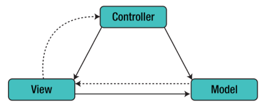

# Capítulo 40 – Arquitetura de Software

Ao se considerar a arquitetura de um edifício, diversos atributos vêm à mente. No nível mais simplista, pensamos na forma geral da estrutura física, em sua silhueta contra o céu. No entanto, a verdadeira arquitetura é muito mais do que isso. Ela é a maneira pela qual os vários componentes — a fundação, a estrutura de aço, os sistemas elétricos, a hidráulica, as paredes — são integrados para formar um todo coeso e funcional. É o modo como o edifício se ajusta ao seu ambiente, seja dialogando com a paisagem natural ou integrando-se à malha urbana e aos edifícios vizinhos.

A arquitetura também se mede pelo grau com que o edifício atende ao seu propósito expresso e satisfaz às necessidades de seu proprietário e de seus usuários. Um hospital e uma escola podem compartilhar materiais, mas suas arquiteturas são fundamentalmente diferentes porque seus propósitos são distintos. Há também o sentido estético da estrutura, o impacto visual que ela causa, e a maneira pela qual texturas, cores e materiais são combinados para criar não apenas uma fachada, mas um "ambiente de moradia" ou de trabalho. Ela engloba, por fim, os detalhes: o projeto dos dispositivos de iluminação, o tipo de piso, o posicionamento de painéis de vidro para maximizar a luz natural.

A arquitetura, portanto, é a soma de milhares de decisões, tanto as grandes quanto as pequenas. Algumas dessas decisões, como a escolha do local e da estrutura fundamental, são tomadas logo no início e têm um impacto profundo sobre todas as ações subsequentes, definindo os limites do que é possível. Outras decisões são postergadas ao máximo, evitando restrições prematuras que poderiam levar a uma implementação inadequada do estilo arquitetural desejado. Mas o que dizer da arquitetura de software? A analogia se encaixa com uma precisão notável.

## Definindo a Arquitetura de Software: Estrutura, Componentes e Decisões

Assim como em uma construção civil, a arquitetura de um sistema de software é o seu alicerce conceitual, a estrutura fundamental sobre a qual todo o resto é construído. É um termo complexo, e diferentes autores o definem com nuances importantes, mas que convergem para uma ideia central. Uma das definições mais consagradas afirma que:

> “A arquitetura de software de um programa ou sistema computacional é a estrutura ou estruturas do sistema, que abrange os componentes de software, as propriedades externamente visíveis desses componentes e as relações entre eles”.

De forma complementar, pode-se dizer que a arquitetura de software é a organização ou a estrutura dos **componentes significativos** do sistema, que interagem por meio de **interfaces** bem definidas.

É crucial entender que a arquitetura **não é o software operacional em si**. Assim como a planta de um edifício não é o próprio edifício, a arquitetura é uma **representação abstrata**. Essa representação é uma ferramenta poderosa que nos permite:

- **Analisar a efetividade do projeto** para atender aos requisitos declarados, tanto funcionais quanto não-funcionais (como desempenho, segurança e manutenibilidade).
- **Considerar e avaliar alternativas de arquitetura** em um estágio inicial, quando realizar mudanças de projeto ainda é relativamente fácil e barato.
- **Reduzir os riscos** associados à construção do software, ao tomar decisões críticas sobre a estrutura antes de escrever milhares de linhas de código.

Uma arquitetura bem projetada deve ser capaz de atender aos requisitos funcionais e não-funcionais do sistema e, fundamentalmente, ser flexível o suficiente para suportar os requisitos voláteis, que inevitavelmente surgirão ao longo do ciclo de vida do produto.

### Os Blocos de Construção da Arquitetura

Para dissecar a definição, vamos analisar seus três elementos centrais:

- **Componentes de Software:** No contexto do projeto de arquitetura, um componente é uma unidade de computação ou de dados que compõe o sistema. Ele pode ser algo tão granular quanto um módulo de programa ou uma classe em um sistema orientado a objetos. Contudo, a visão pode ser bem mais ampla, abrangendo bancos de dados, "middleware" que possibilita a configuração de redes cliente-servidor, ou até mesmo microsserviços inteiros, cada um com sua própria responsabilidade.
    - **Exemplo:** Em um sistema de e-commerce, componentes arquiteturais podem incluir o `Serviço de Catálogo de Produtos`, o `Módulo de Carrinho de Compras`, a `API de Pagamentos` e o `Banco de Dados de Clientes`.
- **Propriedades Externamente Visíveis:** São as características de um componente que outros componentes precisam conhecer para poder interagir com ele. Isso inclui sua interface (os métodos ou endpoints que ele expõe), os dados que ele consome e produz, e os protocolos de comunicação que ele utiliza. Detalhes internos de um componente, como o algoritmo específico usado para uma tarefa, não são propriedades arquiteturais, pois estão ocultos e podem ser alterados sem impactar o resto do sistema.
    - **Exemplo:** A `API de Pagamentos` tem como propriedade externa o fato de que ela aceita um número de cartão de crédito, uma data de validade e um valor, e retorna uma confirmação de sucesso ou falha. O complexo processo interno de verificação de fraude é um detalhe de implementação, não uma propriedade visível.
- **Relacionamentos:** Descrevem como os componentes se conectam e interagem. Esses relacionamentos podem ser tão simples quanto uma chamada procedural direta de um módulo a outro, ou tão complexos quanto um protocolo de mensagens assíncronas em uma fila de eventos, ou as interações via API REST em uma arquitetura de microsserviços.
    - **Exemplo:** O componente `Módulo de Carrinho de Compras` tem um relacionamento com a `API de Pagamentos`, no qual ele envia os detalhes da compra e aguarda uma resposta para finalizar o pedido.


### A Importância Estratégica da Arquitetura

Investir tempo e esforço na definição de uma arquitetura robusta não é um luxo, mas uma necessidade estratégica. Uma arquitetura bem definida serve como:

- **Ferramenta de Comunicação:** Permite uma comunicação eficaz entre todas as partes interessadas (desenvolvedores, gerentes, clientes). Um diagrama de arquitetura claro pode transmitir a estrutura e o funcionamento do sistema de forma muito mais rápida e precisa do que páginas de texto, facilitando a compreensão, a negociação e o consenso.
- **Mecanismo para Decisões Precoces:** Possibilita que decisões críticas sobre a estrutura, tecnologia e abordagem sejam tomadas, corrigidas e validadas antes que a implementação comece e os custos de mudança se tornem proibitivos.
- **Abstração Reutilizável:** Uma arquitetura bem-sucedida pode se tornar um ativo para a organização. A estrutura e os padrões de um sistema de e-commerce bem-sucedido, por exemplo, podem ser reutilizados como ponto de partida para a construção de um novo sistema de marketplace, economizando tempo e mitigando riscos.

### Organizando a Complexidade com Camadas

Uma das formas mais antigas e eficazes de organizar a arquitetura de um sistema complexo é por meio da **utilização de camadas de software**. Esta abordagem consiste em decompor o sistema em um conjunto de grupos lógicos (as camadas), onde cada camada agrupa funcionalidades relacionadas e possui uma responsabilidade específica.

O princípio fundamental da arquitetura em camadas é a **dependência direcionada**. As camadas são organizadas hierarquicamente, e a regra é que as camadas de abstração mais altas devem depender das camadas de abstração mais baixas, e nunca o contrário. Isso cria um fluxo de dependência unidirecional que traz enormes benefícios:

- **Portabilidade e Modificabilidade:** Desde que a interface de uma camada inferior não seja alterada, sua implementação interna pode ser completamente trocada (por exemplo, trocar um banco de dados Oracle por um PostgreSQL) sem que as camadas superiores sequer percebam a mudança. Da mesma forma, mudanças na camada superior (como uma nova tela na interface do usuário) não afetam as camadas inferiores.
- **Separação de Responsabilidades e Encapsulamento:** Cada camada tem um foco claro. A camada de apresentação se preocupa apenas em exibir dados, a camada de negócio em aplicar regras, e a camada de dados em persistir informações. Isso resulta em maior coesão dentro de cada camada e menor acoplamento entre elas.
- **Reúso e Extensibilidade:** Uma camada de negócio bem definida, que não depende da tecnologia da interface do usuário, pode ser reutilizada para servir a múltiplos "clientes" — um aplicativo web, um aplicativo móvel e uma API pública, por exemplo.

No entanto, a arquitetura em camadas não é uma solução isenta de contrapartidas. Uma crítica comum é que ela pode **penalizar o desempenho**, pois uma única requisição do usuário pode ter que atravessar múltiplas camadas, e em cada fronteira, os dados podem precisar ser transformados de uma representação para outra (por exemplo, de um objeto Java para uma linha de tabela de banco de dados). Além disso, embora as camadas encapsulem bem as responsabilidades, uma mudança que afeta todas as partes do sistema (como adicionar um novo campo a uma tela que precisa ser persistido no banco) pode resultar em **alterações em cascata**, exigindo modificações em todas as camadas intermediárias.

A questão do desempenho é, de fato, um ponto de atenção. No entanto, é um erro assumir que camadas extras **necessariamente** prejudicam o desempenho. Em muitos casos, o encapsulamento de uma funcionalidade subjacente em sua própria camada permite otimizações focadas que mais do que compensam a sobrecarga de comunicação. Por exemplo, uma camada de acesso a dados pode implementar um cache sofisticado, fazendo com que consultas subsequentes sejam extremamente rápidas, um ganho de eficiência que beneficia todo o sistema. A decisão de quantas camadas usar e como dividi-las é, portanto, uma das decisões de trade-off mais importantes que um arquiteto de software deve tomar.

## Coesão e Acoplamento: Os Pilares de um Design Robusto

No coração de toda decisão arquitetural, desde a organização de um simples aplicativo até a estrutura de um sistema corporativo complexo, residem dois princípios fundamentais que atuam como o yin e yang do design de software: **Coesão** e **Acoplamento**. Compreender e aplicar corretamente esses conceitos é, talvez, a habilidade mais crítica para a criação de um software que não apenas funcione no dia do lançamento, mas que também seja manutenível, extensível e resiliente ao longo do tempo.

Um dos mantras mais repetidos e verdadeiros da engenharia de software afirma que uma arquitetura de qualidade deve buscar, incessantemente, a **alta coesão** e o **baixo acoplamento**. Esses não são objetivos opcionais ou meramente estéticos; eles são as forças que ditam a saúde interna de um sistema. Um software que ignora esses princípios pode até funcionar superficialmente, mas por baixo dos panos, torna-se um emaranhado frágil e custoso, onde cada nova funcionalidade ou correção de bug se transforma em uma empreitada arriscada e demorada.

Para tornar esses conceitos abstratos mais tangíveis, podemos usar a analogia de uma cozinha profissional bem organizada. Em uma cozinha de alta performance, cada estação de trabalho possui **alta coesão**: a estação de grelhados tem apenas os utensílios, temperos e ingredientes necessários para grelhar; a estação de confeitaria, por sua vez, contém apenas batedeiras, formas e açúcares. Não se encontra uma frigideira na confeitaria, nem um saco de farinha na grelha. Cada componente (estação) tem uma responsabilidade única e focada.

Ao mesmo tempo, as estações possuem **baixo acoplamento**. O chef da estação de grelhados não precisa saber qual marca de batedeira o confeiteiro está usando. A comunicação entre eles ocorre por meio de interfaces bem definidas: o confeiteiro recebe um pedido de "uma sobremesa de chocolate" e entrega o produto final, sem que o outro chef precise conhecer os detalhes internos do processo. Se o confeiteiro decidir trocar sua batedeira por um modelo mais novo, a estação de grelhados não é afetada. Essa independência é o que permite que a cozinha funcione de forma eficiente e se adapte a mudanças sem parar toda a operação.

### Alta Coesão: O Princípio da Responsabilidade Focada

A **Coesão** pode ser definida como uma medida da **força funcional e lógica** de um módulo ou componente de software. Ela responde à pergunta: "Quão bem as partes de um componente pertencem umas às outras?". Um componente com alta coesão é aquele cujos elementos internos (sejam funções, métodos ou atributos) estão fortemente relacionados e trabalham em conjunto para cumprir uma única e bem definida responsabilidade.

A coesão está intrinsecamente ligada ao **Princípio da Responsabilidade Única (SRP)**, um dos pilares do design orientado a objetos. Este princípio afirma que uma classe deve ter uma, e apenas uma, razão para mudar. Em outras palavras, ela deve ter uma única e clara responsabilidade. Quando um módulo é altamente coeso, ele naturalmente adere a este princípio, tornando-se mais fácil de entender, testar, reutilizar e manter.

**Exemplo de Baixa Coesão (Indesejável):**

Imagine uma classe chamada `GerenciadorDeUtilidades`. Em um primeiro momento, ela parece útil, mas ao olharmos seu conteúdo, encontramos os seguintes métodos:

```java
public class GerenciadorDeUtilidades {
    public boolean validarEmail(String email) { /* ... */ }
    public String criptografarSenha(String senha) { /* ... */ }
    public void conectarAoBancoDeDados(String url, String user, String pass) { /* ... */ }
    public byte[] converterImagemParaPNG(byte[] imagemJPEG) { /* ... */ }
    public void enviarNotificacaoPorPush(String token, String mensagem) { /* ... */ }
}
```

Esta classe sofre de baixíssima coesão. Ela é um "canivete suíço" de funcionalidades não relacionadas. Uma mudança no protocolo de envio de notificações pode, acidentalmente, introduzir um bug que afete a validação de e-mails. A classe é difícil de entender, impossível de reutilizar em um contexto que precise apenas de uma de suas funções, e se torna um ponto central de manutenção complexa.

**Exemplo de Alta Coesão (Desejável):**

A solução é decompor a classe `GerenciadorDeUtilidades` em múltiplos componentes, cada um com alta coesão:

```java
public class ServicoDeCriptografia {
    public String criptografarSenha(String senha) { /* ... */ }
    // Outros métodos relacionados à criptografia...
}

public class ServicoDeNotificacao {
    public void enviarNotificacaoPorPush(String token, String mensagem) { /* ... */ }
    // Outros métodos relacionados a notificações...
}

public class ConversorDeImagem {
    public byte[] converterImagemParaPNG(byte[] imagemJPEG) { /* ... */ }
    // Outros métodos de manipulação de imagens...
}
```

Agora, cada classe tem uma responsabilidade focada. Se precisarmos alterar o algoritmo de criptografia, sabemos exatamente qual arquivo modificar. Se um novo aplicativo precisar apenas do serviço de notificação, a classe `ServicoDeNotificacao` pode ser facilmente reutilizada.

### Baixo Acoplamento: O Princípio da Independência Saudável

O **Acoplamento** é uma medida do **grau de interdependência** entre dois ou mais módulos. Ele responde à pergunta: "Quanto um módulo precisa saber sobre os detalhes internos de outro para poder funcionar?". Em um sistema com alto acoplamento, os módulos são fortemente entrelaçados. Uma pequena mudança em um módulo pode causar um efeito cascata, exigindo modificações em vários outros, tornando o sistema frágil, rígido e difícil de evoluir.

Embora a comunicação e a colaboração sejam elementos essenciais de qualquer sistema, existe um lado sombrio nesse processo. À medida que o volume de comunicação e o grau de conhecimento que um módulo tem sobre o outro aumentam, a complexidade do sistema também cresce. Com a complexidade, a dificuldade de implementação, teste e manutenção disparam. O objetivo do bom design arquitetural é, portanto, manter o acoplamento no nível mais baixo possível, garantindo que os módulos colaborem através de interfaces estáveis e bem definidas, sem expor seus detalhes internos.

### O Espectro do Acoplamento: Dos Mais Fortes aos Mais Fracos

O acoplamento não é um conceito binário (alto ou baixo), mas sim um espectro. Existem diferentes tipos de acoplamento, variando do mais forte e problemático ao mais fraco e desejável. Compreender esses tipos ajuda os arquitetos a identificar e corrigir pontos de fragilidade no design. A seguir, apresentamos os principais tipos, ordenados do mais indesejável ao mais aceitável.

|Tipo de Acoplamento|Descrição Detalhada e Exemplo|Avaliação|
|---|---|---|
|**Acoplamento por Conteúdo**|É a forma mais forte e perigosa de acoplamento. Ocorre quando um módulo acessa e/ou modifica diretamente os dados internos ou o código de outro módulo. Isso viola completamente o princípio do encapsulamento e cria uma dependência extrema, onde qualquer mudança interna no módulo-alvo pode quebrar o módulo que o acessa.  <br>  <br>**Exemplo:** O Módulo A altera diretamente o valor de uma variável dentro do Módulo B, sem usar um método ou interface.|**Extremamente Ruim.** Deve ser evitado a todo custo. É um sintoma de um design pobre e leva a sistemas impossíveis de manter.|
|**Acoplamento Comum (ou Global)**|Ocorre quando dois ou mais módulos compartilham e se comunicam através de uma mesma área de dados globais. Qualquer módulo pode ler e escrever nesses dados. É difícil determinar qual módulo é responsável por uma alteração, e uma mudança na estrutura dos dados globais afeta todos os módulos que os acessam.  <br>  <br>**Exemplo:** Múltiplas funções em um programa que leem e modificam uma mesma variável de configuração global para controlar seu comportamento.|**Muito Ruim.** Torna o código difícil de raciocinar e propenso a efeitos colaterais inesperados. Embora às vezes usado para configurações, deve ser minimizado.|
|**Acoplamento Externo**|Ocorre quando um componente se comunica ou depende de elementos de infraestrutura externos, como um protocolo de comunicação, um formato de arquivo específico ou uma API de hardware. Embora necessário, um acoplamento excessivo com tecnologia externa espalhado por todo o sistema o torna difícil de portar ou atualizar.  <br>  <br>**Exemplo:** Várias classes de negócio que contêm código para se comunicar diretamente com um serviço da AWS.|**Necessário, mas Perigoso.** A melhor prática é isolar esse tipo de acoplamento em um número pequeno de componentes (por exemplo, em uma camada de "Gateway" ou "Adaptador"), que abstraem os detalhes externos do resto do sistema.|
|**Acoplamento por Controle**|Ocorre quando um módulo passa uma "bandeira" (flag) ou um parâmetro de controle para outro, ditando seu fluxo de execução. O módulo chamador precisa conhecer a lógica interna do módulo chamado para saber qual flag passar. Isso cria uma dependência de implementação.  <br>  <br>**Exemplo:** `calcularImposto(produto, "PESSOA_FISICA")`. O módulo chamador precisa saber que o módulo `calcularImposto` tem um `if` interno que diferencia os tipos de pessoa.|**Ruim.** Uma abordagem melhor seria ter métodos diferentes (`calcularImpostoPessoaFisica`) ou usar polimorfismo, eliminando a necessidade da flag.|
|**Acoplamento por Inclusão/Importação**|Ocorre quando um componente A importa um pacote ou inclui o conteúdo do Componente B. Esta é uma forma muito comum e necessária de acoplamento em sistemas modernos, mas ainda assim representa uma dependência que precisa ser gerenciada. Se a API pública do componente B muda, o componente A precisará ser alterado.|**Aceitável e Comum.** É a base da reutilização de código. O objetivo é depender de interfaces estáveis, e não de implementações concretas.|
|**Acoplamento por Dados**|É a forma mais desejável de acoplamento. Ocorre quando a comunicação entre os módulos é feita exclusivamente por meio da passagem de dados simples como parâmetros. Os módulos não sabem nada um do outro, exceto o que é revelado pelos parâmetros em suas interfaces.  <br>  <br>**Exemplo:** `double resultado = calculadora.somar(5, 3)`. O módulo que chama `somar` não sabe como a soma é implementada, apenas que ele precisa passar dois números e receberá um em troca.|**Bom.** É a forma ideal de comunicação entre componentes, pois promove a máxima independência e encapsulamento.|
|**Acoplamento por Uso de Tipos**|Ocorre quando um módulo utiliza um tipo de dado (como uma classe, estrutura ou enumeração) que é definido em outro módulo. Essa é uma forma muito comum de acoplamento em linguagens tipadas. Se a definição do tipo compartilhado mudar (ex: um atributo é adicionado ou removido), todos os módulos que o utilizam precisam ser recompilados e, possivelmente, alterados.  <br>  <br>**Exemplo:** O `MóduloDePedidos` utiliza a classe `ClienteDTO` definida no `MóduloDeClientes`. Se a estrutura de `ClienteDTO` for alterada, o `MóduloDePedidos` será diretamente impactado.|**Moderado mas muito comum.** É inevitável em programação orientada a objetos. O risco é gerenciado ao se depender de tipos de dados estáveis e bem definidos, preferencialmente interfaces em vez de classes concretas.|

### A Relação Inversa: Como a Coesão Influencia o Acoplamento

Coesão e acoplamento não são apenas dois princípios isolados; eles possuem uma forte relação inversa. Geralmente, **um design que promove a alta coesão tende, naturalmente, a resultar em baixo acoplamento**.

Quando um módulo é projetado para ter uma única e bem definida responsabilidade (alta coesão), seu escopo de trabalho é limitado. Para realizar sua tarefa, ele precisa de um conjunto mínimo e focado de informações, e interage com outros módulos de forma muito específica. Isso reduz a necessidade de ele conhecer detalhes internos de outros componentes, diminuindo assim o acoplamento.

Por outro lado, um módulo com baixa coesão (o "canivete suíço") precisa interagir com muitas partes diferentes do sistema para cumprir suas múltiplas e não relacionadas responsabilidades. Essa necessidade de comunicação ampla e diversificada inevitavelmente aumenta o acoplamento, criando uma teia de dependências que torna o sistema rígido e frágil. Portanto, a busca pela alta coesão é uma das estratégias mais eficazes para se alcançar o baixo acoplamento.

## Arquitetura em Camadas: Da Arquitetura Monolítica à N-Tier

A organização do software em camadas é um dos padrões arquiteturais mais duradouros e influentes. É uma abordagem que busca gerenciar a complexidade através da separação de responsabilidades, decompondo um sistema em grupos lógicos distintos. A história dessa abordagem é uma jornada evolutiva, impulsionada pelas limitações dos modelos anteriores e pelas crescentes demandas dos usuários e dos negócios.

### O Ponto de Partida: A Arquitetura de Uma Camada (Monolítica)

Nos primórdios da computação comercial, os aplicativos eram frequentemente desenvolvidos como uma única e coesa unidade, um modelo que hoje conhecemos como **arquitetura de uma camada** ou **arquitetura monolítica**. Nesse paradigma, todos os componentes do sistema — o código de acesso ao Banco de Dados, a Lógica de Negócio do aplicativo e a Interface com o Usuário — eram combinados e executados em um único processo, em uma única máquina.

Geralmente, essa máquina era um computador de grande porte (mainframe), e os usuários interagiam com o sistema por meio de "terminais burros". Esses terminais não possuíam poder de processamento próprio; sua única função era exibir os dados enviados pelo servidor e capturar a entrada do usuário, enviando-a de volta para o processamento central. Essa abordagem centralizada oferecia um benefício claro: a simplicidade de administração. Toda a gestão, manutenção e atualização do sistema ocorriam em um único local.

Contudo, essa simplicidade vinha com um grave empecilho, que se tornou cada vez mais evidente com a evolução da tecnologia. Os usuários começaram a esperar interfaces gráficas ricas e interativas (GUIs), que exigiam um poder computacional muito superior ao que os simples terminais burros podiam oferecer. Realizar o processamento centralizado de milhares de interfaces gráficas complexas exigiria um poder computacional astronômico, muito além do que um único servidor poderia disponibilizar. Ficou claro que a arquitetura de uma camada não conseguiria escalar para suportar as novas demandas, abrindo caminho para o próximo passo evolutivo.

### A Arquitetura Cliente-Servidor: Dividindo as Responsabilidades

Para superar as limitações do modelo monolítico, surgiu a **arquitetura cliente-servidor**, um paradigma que dominou a computação na década de 1990 e cujos princípios permanecem relevantes até hoje. A ideia central é organizar o sistema como um conjunto de **serviços**, oferecidos por **servidores**, e um conjunto de **clientes** associados que os acessam e os utilizam. O processamento da informação é, assim, dividido em módulos ou processos distintos que interagem através de uma rede, permitindo que os recursos sejam compartilhados enquanto se obtém o máximo de benefício de cada dispositivo.

Os principais componentes desse modelo são:

|Componentes|Descrição Detalhada|
|---|---|
|**Servidores**|São processos ou máquinas dedicadas que oferecem serviços específicos e bem definidos para outros subsistemas. Eles operam de forma contínua, aguardando solicitações. Exemplos clássicos incluem Servidores de Impressão (gerenciam filas de impressão), Servidores de Arquivos (armazenam e fornecem acesso a arquivos compartilhados) e Servidores de Banco de Dados.|
|**Clientes**|São processos ou máquinas que solicitam os serviços oferecidos pelos servidores para realizar uma tarefa. Geralmente são independentes uns dos outros e podem ser executados simultaneamente. O cliente é responsável por iniciar e terminar a comunicação, além de, tipicamente, cuidar da interação com o usuário (entrada e saída de dados).|
|**Rede**|É a infraestrutura de comunicação que permite aos clientes acessarem os serviços dos servidores. Em cenários onde clientes e servidores são executados na mesma máquina, a rede pode não ser necessária, mas o modelo conceitual de comunicação permanece.|

Nessa dinâmica, a comunicação é quase sempre iniciada pelo cliente. Os clientes precisam conhecer os nomes dos servidores e os serviços que eles fornecem para poderem fazer solicitações, mas os servidores, em geral, não precisam saber da identidade dos clientes com antecedência; eles simplesmente respondem às solicitações que chegam. Essa interação geralmente ocorre por meio de chamadas de procedimento remoto (RPC) ou protocolos de aplicação, como o HTTP. Essencialmente, um cliente faz um pedido a um servidor e espera até receber uma resposta.

<div align="center">
  
</div>

Para ilustrar, a imagem acima representa um sistema multiusuário baseado na web para um acervo de filmes e fotografias. Nesse sistema:

- **Vários servidores** especializados gerenciam diferentes tipos de mídia. Um servidor cuida da compressão e do streaming de vídeo, que precisa ser rápido. Outro servidor armazena as fotografias em alta resolução.
- Um **servidor de catálogo** gerencia as consultas e fornece links para outros sistemas, como um site de informações sobre filmes e um sistema de e-commerce para a venda dos itens.
- O **programa cliente** é a interface com o usuário, provavelmente um navegador web, que integra o acesso a todos esses serviços de forma transparente para o usuário final.

A vantagem mais importante do modelo cliente-servidor é que ele é, por natureza, uma **arquitetura distribuída**. Isso permite o uso efetivo de sistemas em rede com múltiplos processadores e facilita a escalabilidade: é relativamente fácil adicionar um novo servidor para atender a uma nova demanda ou atualizar um servidor existente sem afetar outras partes do sistema.

### Cliente-Magro vs. Cliente-Gordo: Onde Fica a Lógica?

A arquitetura cliente-servidor em sua forma mais comum é a de **duas camadas**, onde as responsabilidades são divididas entre o cliente e o servidor. No entanto, a forma como essa divisão é feita dá origem a duas abordagens distintas: o modelo Cliente-Magro (Thin-Client) e o Cliente-Gordo (Fat-Client).

<div align="center">
  
</div>

- **Modelo Cliente-Magro (Thin-Client):** Neste modelo, quase todo o trabalho pesado — o processamento da lógica de negócio e o gerenciamento dos dados — é realizado no servidor. O cliente é "magro" porque sua responsabilidade é mínima: ele se encarrega apenas de executar o software de apresentação (exibir a interface e capturar a entrada do usuário). Um navegador web moderno é o exemplo perfeito de um cliente-magro.

|Vantagens de Clientes-Magros|Desvantagens de Clientes-Magros|
|---|---|
|Baixo custo de administração (atualizações são feitas no servidor).|Dependência total do servidor; sem redundância, uma falha no servidor paralisa todos os clientes.|
|Facilidade de proteção e segurança centralizada.|Exige maior largura de banda na rede, pois toda interação gera tráfego.|
|Baixo custo de hardware para as máquinas clientes.|Pior tempo de resposta em geral, pois cada transação depende de uma viagem de ida e volta ao servidor.|
|Menor custo de licenciamento de software.|Apoio transacional menos robusto do lado do cliente.|

- **Modelo Cliente-Gordo (Fat-Client):** Neste modelo, a responsabilidade é invertida. O servidor é encarregado apenas do gerenciamento de dados (geralmente um servidor de banco de dados). O cliente é "gordo" porque implementa toda a lógica da aplicação e as interações com o usuário. Aplicações desktop tradicionais (como um software de edição de vídeo instalado no computador) que se conectam a um banco de dados remoto são exemplos clássicos.

|Vantagens de Clientes-Gordos|Desvantagens de Clientes-Gordos|
|---|---|
|Exigem requisitos mínimos do servidor, que só armazena dados.|Não há um local central para atualizar a lógica de negócio; cada cliente deve ser atualizado individualmente.|
|Performance multimídia e de processamento superior no lado do cliente.|Exige grande confiança no cliente, que pode ter acesso direto ao banco de dados.|
|Maior flexibilidade para aproveitar o hardware específico do cliente.|Não escala bem; o aumento do número de clientes pode sobrecarregar o servidor de banco de dados com muitas conexões diretas.|

Comparada à arquitetura de uma camada, a arquitetura de duas camadas trouxe a vantagem crucial de separar fisicamente a interface do usuário da camada de dados. Para isso, os terminais burros foram substituídos por computadores capazes de executar código de apresentação sofisticado e, no caso dos clientes-gordos, a própria lógica do aplicativo.

### A Arquitetura de Três Camadas: A Separação Definitiva

Os sistemas cliente-servidor em duas camadas, especialmente o modelo cliente-gordo, apresentavam um desafio de manutenção significativo: para cada nova versão do software, era preciso reinstalar ou atualizar o aplicativo em todas as máquinas clientes. Para resolver esse e outros problemas, a arquitetura evoluiu mais um passo, dando origem à **arquitetura de três camadas**.

A grande inovação deste modelo foi separar a **Lógica de Negócio** tanto da camada de apresentação quanto da de dados, criando uma camada intermediária independente. Isso resulta em três grupos lógicos distintos, que podem ser implantados em máquinas diferentes.

É importante esclarecer a diferença entre **Layers (Camadas)** e **Tiers (Níveis)**. Embora muitas vezes usados como sinônimos, **Layers** se referem a uma **separação lógica** de responsabilidades no código, que podem, teoricamente, rodar na mesma máquina. **Tiers**, por outro lado, se referem a uma **separação física**, onde cada camada é executada em uma máquina ou servidor diferente. Uma arquitetura de três camadas (3-layers) pode ser implementada em um único nível físico (1-tier) ou, mais comumente, em três níveis físicos (3-tiers).

As três camadas lógicas são:

|Camada|Descrição Detalhada|
|---|---|
|**Camada de Apresentação**|Também chamada de Camada de Interface (UI Layer), é responsável por toda a interação com o usuário. Seu objetivo é exibir informações e traduzir as ações do usuário (cliques, preenchimento de formulários) em requisições para a camada de negócio. Com a popularização da internet, as interfaces baseadas em navegadores web tornaram-se o padrão para esta camada.|
|**Camada de Negócio**|Também chamada de Camada Lógica ou de Aplicação (Business Logic Layer), é o "cérebro" do sistema. Ela contém as classes e os componentes que implementam as regras de negócio, os fluxos de trabalho e as políticas da organização. Ela processa as requisições da camada de apresentação, realiza cálculos e toma decisões, orquestrando o acesso à camada de dados.|
|**Camada de Dados**|Também chamada de Camada de Acesso a Dados (Data Access Layer), é responsável pela comunicação com os sistemas de armazenamento persistente. Ela abstrai os detalhes de como os dados são armazenados e recuperados, seja de um banco de dados, de arquivos no sistema ou de outros sistemas externos.|

Essa arquitetura traz enormes vantagens. Um exemplo clássico é um sistema de home banking:

- O **cliente** é o computador do usuário com um navegador web (Camada de Apresentação).
- Um **servidor web/de aplicação** hospeda a lógica para transferir dinheiro, gerar extratos e pagar contas (Camada de Negócio).
- Um **servidor de banco de dados** gerencia as informações das contas e transações (Camada de Dados).

Nesse modelo, a comunicação entre o servidor de aplicação e o servidor de banco de dados pode ser otimizada com protocolos rápidos e de baixo nível. O sistema se torna muito mais **escalável**, pois para atender a mais clientes, basta adicionar mais servidores de aplicação, sem impactar as outras camadas. Além disso, a lógica de negócio, que é a parte mais volátil do sistema, está centralizada, tornando as **atualizações muito mais simples e seguras**.

### Expandindo o Modelo: Arquiteturas N-Tier

A lógica da separação de responsabilidades não para em três camadas. Com o aumento da complexidade dos sistemas, surgiu a **arquitetura de quatro camadas**, impulsionada principalmente pelas aplicações web. Nessa abordagem, a Camada de Apresentação é, ela mesma, dividida, retirando a responsabilidade de renderizar a interface da máquina do cliente e centralizando-a em um **Servidor Web**.

As quatro camadas típicas são:

1. **Camada do Cliente (Client Tier):** O navegador web, cuja única função é renderizar o HTML/CSS/JavaScript enviado pelo servidor web e enviar as requisições do usuário.
2. **Camada de Apresentação (Presentation Tier):** Um Servidor Web (como Apache ou Nginx) que serve os arquivos estáticos e processa a lógica de apresentação para gerar as páginas dinâmicas.
3. **Camada de Aplicação (Application Tier):** Um Servidor de Aplicação (como um servidor Java EE ou .NET) que executa as regras de negócio.
4. **Camada de Dados (Data Tier):** Um Servidor de Banco de Dados.

De forma geral, qualquer arquitetura com mais de três camadas é chamada de **arquitetura N-Tier**. Outro exemplo de uma camada adicional seria a introdução de um **Servidor de Integração**, usado quando uma aplicação precisa acessar e combinar dados de múltiplos bancos de dados diferentes. Esse servidor se posiciona entre a camada de aplicação e os servidores de dados, coletando e apresentando as informações como se viessem de uma única fonte. Essa capacidade de adicionar camadas especializadas conforme a necessidade confere ao modelo uma enorme flexibilidade para projetar sistemas robustos e escaláveis.

## O Padrão MVC (Model-View-Controller): Separando as Responsabilidades da Aplicação

Dentro do universo dos padrões arquiteturais, poucos alcançaram a onipresença e a influência do **Model-View-Controller (MVC)**. Concebido originalmente na década de 1970 para ser utilizado em projetos de interface gráfica na linguagem de programação Smalltalk, o MVC propôs uma solução elegante para um problema fundamental: como organizar o código de uma aplicação de forma que as regras de negócio, os dados e a apresentação ao usuário pudessem evoluir de forma independente.

A ideia central do padrão é a **separação de responsabilidades**. Ele divide uma aplicação, ou mesmo uma parte dela, em três componentes principais interconectados: o **Modelo (Model)**, a **Visão (View)** e o **Controlador (Controller)**. O objetivo é isolar as representações internas da informação (o Modelo) das formas como essa informação é apresentada ao usuário (a Visão), utilizando o Controlador como o maestro que orquestra toda a interação.

Essa separação promove um design com baixo acoplamento e alta coesão, resultando em um sistema com maior manutenibilidade, escalabilidade e potencial de reúso de código. Com o advento da World Wide Web, o padrão MVC foi adaptado para o mundo do desenvolvimento web e se tornou a base para inúmeros frameworks comerciais e de código aberto, embora com diferentes interpretações sobre como as responsabilidades são divididas entre o cliente e o servidor.

### Os Três Pilares do MVC

Para compreender o padrão, é essencial dissecar o papel de cada um de seus três componentes: Modelo, Visão e Controlador.

#### O Modelo (Model): O Coração da Aplicação

O **Modelo** é o componente responsável pela representação dos dados e pela lógica de negócio da aplicação. Ele é o centro nevrálgico de qualquer operação que envolva a manipulação de dados, seja para leitura, escrita, atualização ou validação. O Modelo encapsula o estado da aplicação e as regras que governam as mudanças nesse estado.

Suas responsabilidades-chave incluem:

- **Acesso e Manipulação de Dados:** O Modelo provê os meios para acessar e modificar os dados da aplicação, seja interagindo com um banco de dados, consumindo uma API externa ou manipulando arquivos.
- **Implementação das Regras de Negócio:** Toda a lógica fundamental do sistema — os cálculos, os fluxos de trabalho, as políticas — reside no Modelo. Por exemplo, em um sistema de e-commerce, a regra de que "um cliente VIP tem 10% de desconto em todas as compras" é uma regra de negócio implementada no Modelo.
- **Validação de Dados:** É responsabilidade do Modelo garantir a integridade e a consistência dos dados. Embora validações possam ocorrer na interface do usuário (por exemplo, usando JavaScript para verificar se um campo não está vazio) para melhorar a experiência, essa é uma camada de conveniência. A validação definitiva e segura deve sempre ocorrer no Modelo para garantir que dados inválidos nunca cheguem ao coração do sistema.
- **Manutenção do Estado e Notificação:** O Modelo é o guardião do estado da aplicação. Quando seu estado é alterado (por exemplo, um novo produto é adicionado ao carrinho de compras), ele possui a capacidade de notificar os componentes interessados, principalmente as Visões, para que elas possam se atualizar e refletir o novo estado para o usuário.

#### A Visão (View): A Face do Sistema

A **Visão** é a camada responsável por toda a interação com o usuário, sendo sua única finalidade a **exibição dos dados** contidos no Modelo. Ela é, em essência, uma representação visual do estado do Modelo em um determinado momento. Uma das grandes forças do padrão MVC é que um único Modelo pode ter diversas Visões associadas a ele, cada uma apresentando os mesmos dados de formas diferentes.

- **Exemplo:** Um conjunto de dados sobre o desempenho de vendas de uma empresa (o Modelo) pode ser apresentado por meio de múltiplas Visões: uma tabela detalhada com números exatos, um gráfico de pizza mostrando a participação de cada produto e um gráfico de linhas exibindo a evolução das vendas ao longo do tempo.

A Visão deve ser, idealmente, "burra" (dumb). Ela não contém lógica de negócio. Sua função é receber os dados do Modelo, renderizá-los para o usuário (em formato HTML, JSON, ou em uma interface gráfica de desktop) e capturar as ações do usuário (cliques de botões, preenchimento de formulários, etc.), encaminhando-as para o Controlador.

#### O Controlador (Controller): O Maestro da Orquestra

O **Controlador** atua como um intermediário, uma "cola" que conecta o Modelo e a Visão. Sua principal função é receber e processar todas as requisições do usuário, orquestrando as ações necessárias. Ele não contém lógica de negócio nem é responsável pela apresentação; seu papel é o de um maestro.

O fluxo de trabalho típico de um Controlador é:

1. **Receber a Requisição:** Captura uma ação do usuário, que é enviada pela Visão (por exemplo, o clique no botão "Finalizar Compra").
2. **Interpretar a Requisição:** Analisa a requisição para entender a intenção do usuário.
3. **Acionar o Modelo:** Chama os métodos apropriados no Modelo para atualizar seu estado (por exemplo, chamar o método `finalizarPedido()` no modelo de carrinho de compras).
4. **Selecionar a Visão:** Após a atualização do Modelo, o Controlador seleciona a próxima Visão a ser exibida para o usuário (por exemplo, a página de "Pedido Confirmado").

O nome "Controlador" é apropriado porque ele controla o fluxo da aplicação. Geralmente, em aplicações web, há um controlador para cada conjunto de funcionalidades relacionadas (ex: `PedidosController`, `ProdutosController`), e cada método dentro do controlador, chamado de **action**, corresponde a uma página ou operação específica.

### O Fluxo de Interação: MVC vs. Arquitetura de 3 Camadas

À primeira vista, a arquitetura MVC pode parecer idêntica à arquitetura de três camadas, com o Modelo correspondendo à Camada de Dados, a Visão à Camada de Apresentação e o Controlador à Camada de Lógica de Negócio. No entanto, existe uma diferença fundamental e crucial na forma como os componentes interagem.

Na **arquitetura de três camadas**, a comunicação é estritamente **linear**. A Camada de Apresentação só se comunica com a Camada de Lógica, e a Camada de Lógica só se comunica com a Camada de Dados. Não há comunicação direta entre a Apresentação e os Dados.

Já no **padrão MVC**, a comunicação é **triangular**, permitindo uma interação mais flexível entre os componentes.

<div align="center">
  
</div>

Analisando a figura, podemos observar o fluxo clássico:

1. O usuário interage com a **Visão**.
2. A **Visão** dispara um evento que é capturado pelo **Controlador**.
3. O **Controlador** manipula o **Modelo**, atualizando seu estado.
4. O **Modelo**, por sua vez, pode notificar a **Visão** sobre a mudança.
5. A **Visão** então obtém os dados atualizados do **Modelo** para se renderizar novamente.

Um ponto de debate frequente, e muitas vezes polêmico, é se a Visão pode se comunicar diretamente com o Modelo para obter dados, sem a intermediação do Controlador. A resposta é: sim, em muitas implementações isso é possível e desejável.

Imagine o cenário de um carrinho de compras em um site de cursos como a Udemy. Após adicionar três cursos ao carrinho, o usuário clica no ícone do carrinho para ver a lista de itens. Neste caso, a Visão (a página do carrinho) não precisa necessariamente fazer uma requisição ao Controlador apenas para listar os itens. Ela pode consultar diretamente o Modelo (o objeto do carrinho) para obter a lista de cursos e exibi-la. Essa comunicação direta é geralmente para fins de **leitura**. Operações de **escrita** (como remover um item do carrinho) ainda devem passar pelo Controlador.

<div align="center">
  
</div>

### Além do MVC: Uma Breve Olhada em MVP e MVVM

O MVC foi tão influente que deu origem a diversos padrões derivados, cada um tentando resolver ou aprimorar algum aspecto do modelo original. Os dois mais notáveis são o MVP e o MVVM.

- **MVP (Model-View-Presenter):** O MVP é uma evolução do MVC que busca um desacoplamento ainda maior entre a Visão e o resto do sistema. A principal mudança é a introdução do **Presenter** em substituição ao Controlador. A grande diferença é que, no MVP, o Presenter se comunica bidirecionalmente com a Visão e com o Modelo, e a Visão torna-se completamente passiva. A Visão não tem nenhuma referência ao Modelo; ela apenas delega todas as ações do usuário ao Presenter e expõe métodos para que o Presenter possa atualizá-la (ex: `exibirNomeDoUsuario(String nome)`). Isso torna a Visão extremamente simples e facilita os testes de unidade da lógica de apresentação, que agora reside inteiramente no Presenter. Tipicamente, há uma relação de um-para-um entre a Visão e o Presenter.
- **MVVM (Model-View-ViewModel):** Popularizado por frameworks de interface modernos (como Angular, Vue.js, React), o MVVM introduz o conceito de **ViewModel**. O ViewModel é um "Modelo da Visão", ou seja, é uma classe que representa o estado e o comportamento da Visão, expondo dados e comandos de uma forma que a Visão possa consumir facilmente. A grande mágica do MVVM é o mecanismo de **Data Binding (Vinculação de Dados)**. A Visão é "vinculada" ao ViewModel, e qualquer mudança nas propriedades do ViewModel é automaticamente refletida na Visão, e vice-versa, sem a necessidade de código manual para sincronizá-los. Isso reduz drasticamente a quantidade de código "boilerplate" necessário para manter a interface atualizada. No MVVM, o ViewModel não conhece a Visão (permitindo que múltiplas Visões se conectem a um mesmo ViewModel), mas a Visão conhece o ViewModel.

