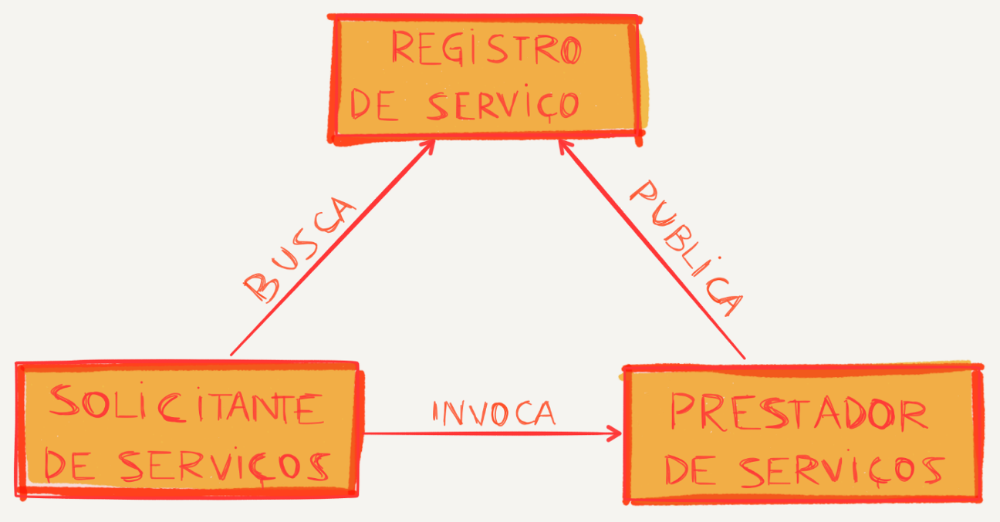
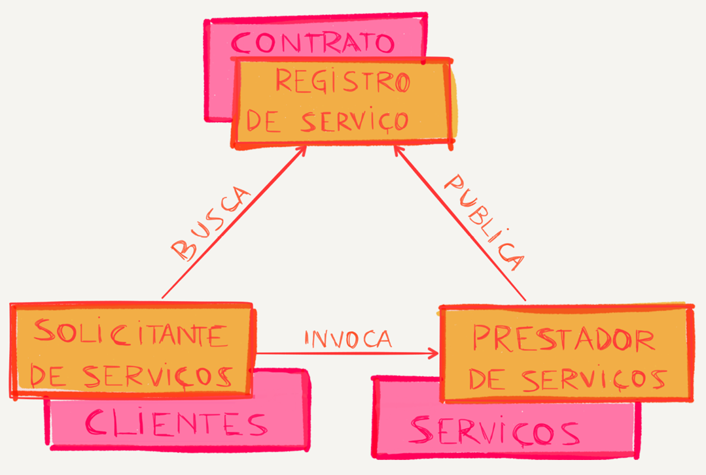
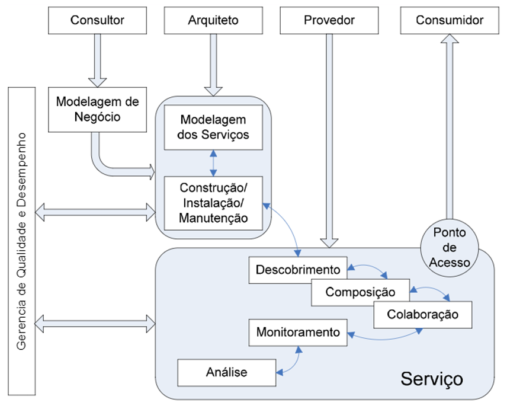
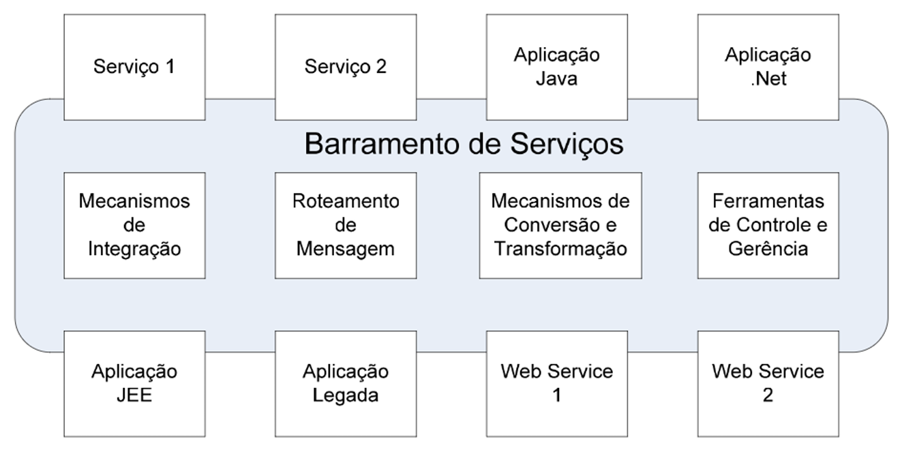
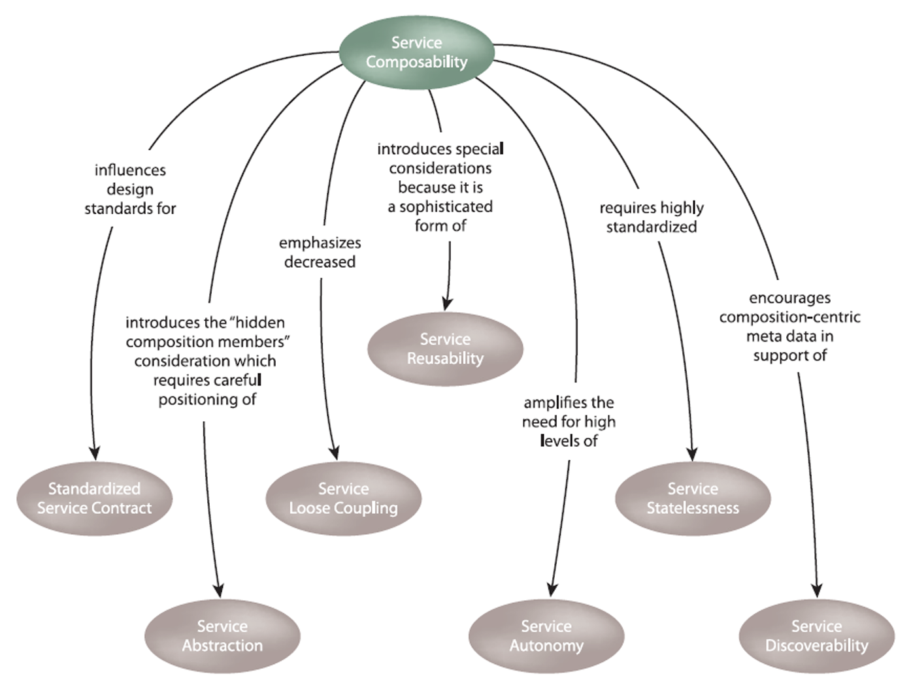
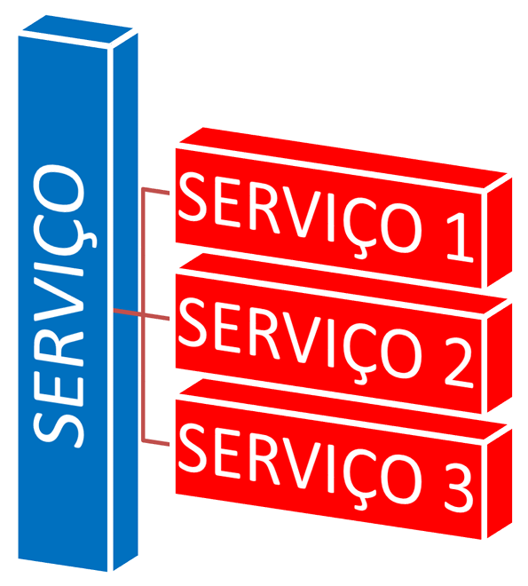
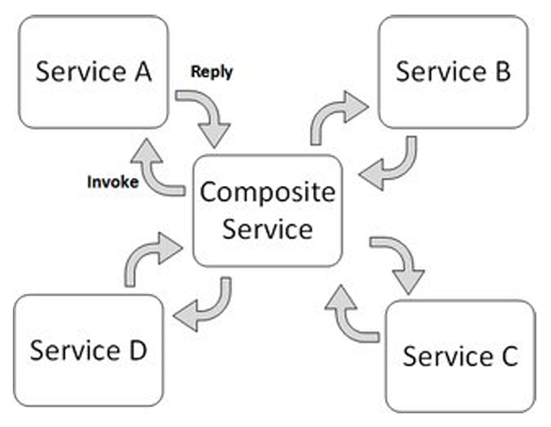
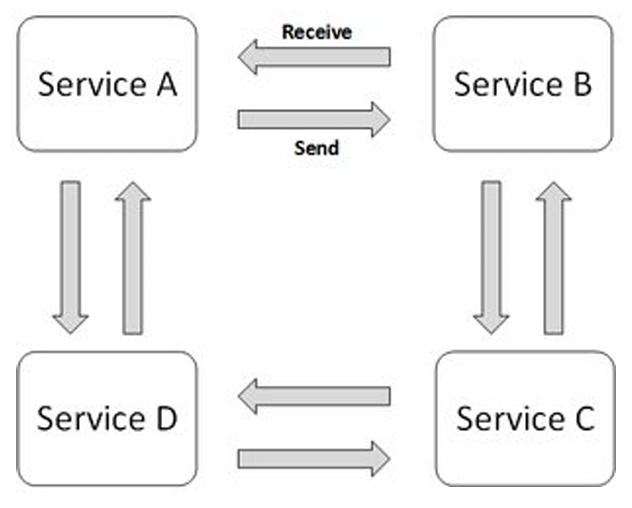
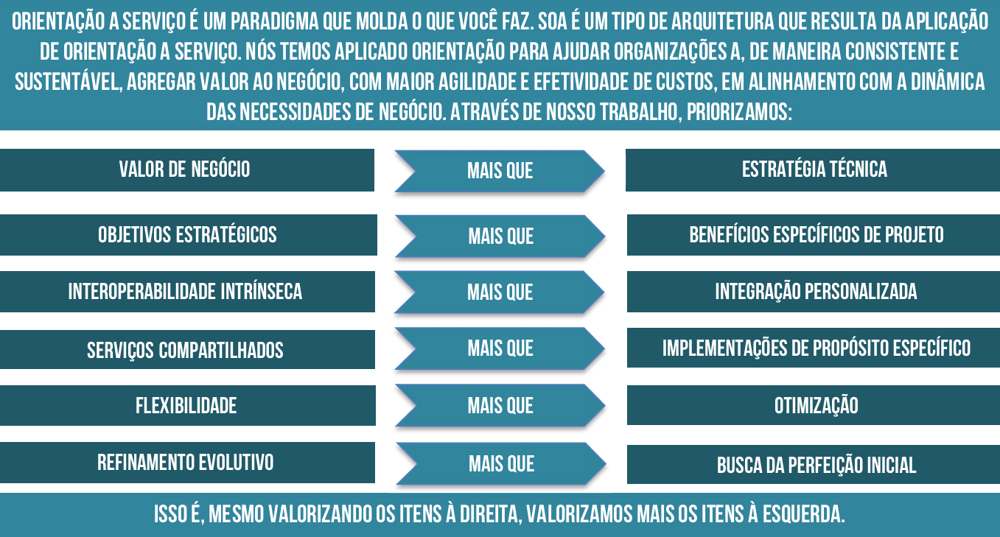

# Capítulo 41 – Arquitetura Orientada a Serviços (SOA)

## Motivação e Conceitos Fundamentais

Para embarcar no estudo da **Arquitetura Orientada a Serviços (Service-Oriented Architecture - SOA)**, é imprescindível primeiro solidificar a compreensão dos dois conceitos que formam seu nome. A **arquitetura**, no contexto da engenharia de software, refere-se à organização ou à estrutura dos componentes significativos de um sistema, que interagem entre si por meio de interfaces bem definidas. É o esqueleto conceitual que dita como as partes de um software se encaixam e colaboram.

O segundo pilar é o **serviço**. Um serviço é um mecanismo que permite acessar um conjunto de recursos ou funcionalidades. Esse acesso é fornecido por meio de uma interface formalmente descrita e deve ser exercido de acordo com as políticas e restrições especificadas na descrição do serviço. Em sua essência, um serviço é oferecido por uma entidade, o **Provedor de Serviços**, para uso por outra, o **Consumidor de Serviços**.

Uma característica crucial é que não há necessidade de o consumidor conhecer os detalhes internos da implementação do provedor. A interação é baseada em um contrato claro (a interface), permitindo que o serviço seja utilizado de maneiras que podem até mesmo extrapolar o escopo original concebido por seu criador.

### O Princípio da Lógica Agnóstica

Um conceito central que define a natureza de um serviço em SOA é o de ser **agnóstico**. Isso significa que a lógica encapsulada por um serviço deve ser, tanto quanto possível, independente de qualquer processo de negócio específico, de uma aplicação particular ou de tecnologias proprietárias. O autor Thomas Erl, uma das maiores autoridades no assunto, define essa característica da seguinte forma:

> “Dentro de uma solução orientada a serviços, as unidades de lógica (serviços) encapsulam funcionalidades não específicas a nenhum aplicativo ou processo de negócio. Esses serviços são classificados como ativos de tecnologia da informação agnósticos e reusáveis. Serviços agnósticos fornecem um intervalo de funcionalidades genéricas. Qualquer serviço agnóstico pode, portanto, ser adaptado inúmeras vezes para que seja possível automatizar diferentes processos de negócio como parte de diferentes soluções orientadas a serviços.”

Quanto mais agnóstico for um serviço, mais genéricas são suas capacidades e, consequentemente, maior é seu potencial de reúso em toda a organização. Uma analogia simples do mundo real ilustra bem essa ideia: ao contratar um serviço de fornecimento de energia elétrica para uma residência, o consumidor se preocupa apenas em ter a energia disponível na tomada. Os detalhes complexos da geração (hidrelétrica, solar, eólica), transmissão e distribuição dessa energia são de responsabilidade do provedor e completamente irrelevantes para o consumidor. O serviço "fornecer energia" é agnóstico à sua fonte de implementação.

Além de serem agnósticos, os serviços em uma arquitetura SOA bem projetada apresentam outros benefícios destacados por Thomas Erl: são reutilizáveis por natureza, compartilham um contrato formal, promovem baixo acoplamento, abstraem a lógica de implementação, são capazes de se compor para criar funcionalidades mais complexas e operam de forma autônoma.

### Definindo a Arquitetura Orientada a Serviços (SOA)

Com os conceitos de arquitetura e serviço estabelecidos, podemos uni-los. A OASIS (Organization for the Advancement of Structured Information Standards), um consórcio global para padrões de tecnologia, define a Arquitetura Orientada a Serviços como:

> Um paradigma para organização e utilização de recursos distribuídos que estão sob o controle de diferentes domínios proprietários, permitindo que funcionalidades implementadas sejam disponibilizadas na forma de serviços fracamente acoplados.

A expressão **"serviços fracamente acoplados"** significa que os serviços são independentes uns dos outros. Uma mudança na implementação interna de um serviço não deve, em teoria, afetar os consumidores que dependem dele, desde que o contrato da interface seja mantido.

|O que SOA é...|
|---|
|Um conjunto de **princípios e melhores práticas** para implementar processos de negócio automatizados em ambientes de TI heterogêneos.|
|Uma forma de **aproximar a linguagem do negócio e da tecnologia**, facilitando a integração de sistemas corporativos por meio de serviços reutilizáveis.|
|Um meio para organizar soluções de TI que promove o **reúso, o crescimento sustentável e a interoperabilidade** entre sistemas diferentes.|
|Uma **abordagem distribuída e não monolítica** para a integração de sistemas, baseada no conceito de serviço como a unidade fundamental de lógica.|
|Uma **abordagem arquitetural corporativa** que permite a criação de serviços de negócio que podem ser facilmente compartilhados entre aplicações e até mesmo entre empresas parceiras.|

É fundamental posicionar a SOA como um modelo de arquitetura que é, por definição, **agnóstico a qualquer plataforma de tecnologia específica**. Ao adotar a SOA como uma filosofia, uma empresa ganha a liberdade de perseguir seus objetivos estratégicos, aproveitando os avanços tecnológicos futuros sem ficar presa a uma única tecnologia ou fornecedor. Embora os **Web Services** tenham se tornado a plataforma de tecnologia mais associada à implementação de SOA, outras tecnologias como DCOM, CORBA, RPC e WCF também podem ser utilizadas para construir uma arquitetura orientada a serviços.

### A Motivação para a SOA: O Problema da "Bola de Pelo"

Para entender por que a SOA se tornou tão relevante, é preciso visualizar o cenário que a motivou. Ao longo de décadas, o desenvolvimento de aplicações em grandes ambientes corporativos ocorreu de forma orgânica e, muitas vezes, desordenada. Esse crescimento não planejado resultou em uma verdadeira "colcha de retalhos" de sistemas, onde cada nova aplicação era desenvolvida para resolver um problema imediato, ligando apenas dois pontos do sistema, sem uma preocupação com as consequências a longo prazo.

Considere a seguinte história, que ilustra um problema comum em grandes organizações, como um banco comercial.

João, um analista de negócios, precisa de dados específicos para seus relatórios diários. No entanto, esses dados estão espalhados por três sistemas legados diferentes: Aplicação A, B e C. Para resolver o problema de João, um programador cria uma nova aplicação customizada que se conecta a esses três sistemas, recupera os dados e os consolida em uma planilha.

  

João, satisfeito, percebe que precisa dessa planilha todas as manhãs e não quer gerá-la manualmente. Ele solicita à equipe de infraestrutura que automatize o processo. Um `job` (tarefa agendada) é criado para executar a aplicação de João todas as manhãs. Agora, um novo fluxo de aplicação foi criado e formalizado, e ele depende diretamente de outras três aplicações do banco.

  

Naturalmente, João não é o único funcionário em um banco desse porte. Multiplique essa situação por centenas de outros analistas e departamentos, cada um com suas próprias necessidades e soluções pontuais. O resultado é o que se convencionou chamar de **Arquitetura de Bola de Pelo (Hairball Architecture)**. Temos centenas de "pelos" (integrações ponto a ponto) indo e vindo em todas as direções. Ninguém tem controle total, e torna-se impossível rastrear o fluxo de dependências.

  

Agora, imagine o pesadelo: o banco precisa substituir a Aplicação B, que é um sistema imenso e desatualizado cujo fornecedor deixará de oferecer suporte em dois anos. A pergunta crítica é: quais das centenas de outras aplicações dependem da Aplicação B? A rede de dependências é tão caótica e não documentada que se torna praticamente impossível mudar qualquer aspecto do sistema sem causar um efeito cascata em dezenas de outros. O sistema sofre de **alto acoplamento** e **alta redundância**, pois funcionalidades semelhantes foram replicadas em diversas soluções customizadas.

  

Em um nível estratégico, essa situação significa perda de agilidade, aumento de custos de manutenção e, em última análise, perda de dinheiro. Havia, portanto, uma necessidade urgente de uma nova abordagem, uma arquitetura que fosse simultaneamente robusta, eficiente e flexível o suficiente para permitir que inovações fossem criadas sem quebrar o ecossistema existente.

### Desmistificando o SOA: O Que Ele Não É

Diante de um problema tão complexo, a primeira reação de muitas organizações é procurar por uma solução pronta. No entanto, é fundamental entender que a Arquitetura Orientada a Serviços não é algo que se possa simplesmente comprar. Não se pode chegar a um fornecedor e pedir "o melhor SOA que você tem à venda".

|O que SOA **não** é...|
|---|
|**Não é uma tecnologia:** SOA é um paradigma, uma filosofia de design arquitetural. Tecnologias específicas, como Web Services, CORBA, DCOM ou filas de mensagens, são os meios utilizados para implementar os princípios de uma arquitetura orientada a serviços, mas não são a SOA em si. Uma organização pode usar Web Services e ainda assim não ter uma arquitetura verdadeiramente orientada a serviços.|
|**Não é um projeto de TI:** A adoção de SOA não é um projeto com início, meio e fim definidos. É uma jornada de transformação cultural e técnica que afeta a forma como a organização inteira pensa e desenvolve soluções de software. É um compromisso de longo prazo, não uma iniciativa pontual.|
|**Não é uma metodologia:** A SOA é um conjunto de princípios de design, não um processo passo a passo para o desenvolvimento de software. Metodologias como o RUP ou frameworks ágeis podem ser utilizados para guiar a construção de serviços e a implementação de uma SOA, mas não devem ser confundidos com a própria arquitetura.|
|**Não é um serviço:** Um serviço é a unidade fundamental, o "tijolo" dentro de uma SOA. A arquitetura é o "edifício" completo, ou seja, a forma como esses múltiplos serviços são organizados, compostos e orquestrados para entregar valor ao negócio.|
|**Não é um produto ou um software:** Não existe um "software SOA" que se possa comprar em uma prateleira e instalar. É possível adquirir produtos de software, como um Enterprise Service Bus (ESB) ou um Gateway de API, que ajudam a construir e gerenciar uma SOA, mas eles são apenas peças de um quebra-cabeça muito maior.|
|**Não é uma solução de negócio:** A SOA, por si só, não resolve um problema de negócio específico (como "aumentar as vendas" ou "otimizar o estoque"). Ela é uma **estratégia de TI** que **habilita** a criação de soluções de negócio mais ágeis, flexíveis e integradas. É a fundação que permite que o negócio se adapte mais rapidamente às mudanças.|
|**Não é uma ferramenta:** Ferramentas de modelagem, desenvolvimento, teste e monitoramento são utilizadas para construir, implantar e gerenciar os serviços. A arquitetura, no entanto, é o plano mestre, o design de alto nível, e não as ferramentas usadas para executá-lo.|
|**Não é um web service:** Esta é uma das confusões mais comuns. Um Web Service é uma implementação técnica específica de um serviço que utiliza padrões web (como HTTP, SOAP ou REST). Ele é, talvez, a tecnologia mais popular para se construir uma SOA, mas é perfeitamente possível ter uma arquitetura orientada a serviços utilizando outras tecnologias de comunicação remota. Nem todo serviço em uma SOA é um Web Service.|
|**Não é um framework:** Frameworks de programação (como Spring, .NET, Django) fornecem estruturas e bibliotecas para acelerar o desenvolvimento de aplicações. Pode-se usar um framework para construir um serviço individual, mas o framework não define a arquitetura de alto nível que dita como esse serviço se relaciona com todos os outros no ecossistema da empresa.|
|**Não é um middleware:** O middleware, como vimos, é a camada de "encanamento" que permite a comunicação em sistemas distribuídos. Ele é uma parte essencial da infraestrutura que suporta uma SOA, mas não é a arquitetura em si. A arquitetura é o projeto; o middleware é parte dos materiais e da infraestrutura usados para construir conforme o projeto.|

Compreender o que a SOA é, e o que ela não é, é o primeiro passo para planejar uma adoção bem-sucedida, que visa transformar a "bola de pelo" caótica em um ecossistema organizado de serviços reutilizáveis e bem definidos.

## Os Pilares Conceituais da SOA

Para construir e operar uma arquitetura orientada a serviços de forma eficaz, é essencial compreender os conceitos fundamentais que governam tanto a dinâmica das interações quanto a estrutura que as suporta. O Modelo de Referência da SOA estabelece um conjunto de pilares conceituais que nos ajudam a raciocinar sobre como os serviços são descobertos, utilizados e como eles produzem resultados tangíveis. Podemos dividir esses pilares em dois grandes grupos: a dinâmica da interação com os serviços e a estrutura de suporte a essa interação.

### A Dinâmica da Interação com Serviços

Esta perspectiva descreve o ciclo de vida de uma interação, desde o momento em que um consumidor descobre um provedor até o resultado final da utilização do serviço. Ela é composta por três conceitos-chave: Visibilidade, Interação e Efeito no Mundo Real.

|Conceitos-Chave da Dinâmica|
|---|
|Visibilidade entre provedores e consumidores de serviços.|
|Interação entre provedores e consumidores de serviços.|
|Efeitos no mundo real da interação com um serviço.|

#### Visibilidade

A **visibilidade** é a condição prévia para qualquer interação. Ela representa o relacionamento que é satisfeito quando um consumidor de serviço e um provedor de serviço estão aptos a interagir. Para que a visibilidade exista, três pré-condições devem ser atendidas:

1. **Consciência (Awareness):** O consumidor precisa ter a percepção da existência do provedor e do serviço que ele oferece. Em termos práticos, o consumidor precisa saber que o serviço existe e qual é a sua finalidade.
2. **Concordância (Willingness):** Ambos os participantes, consumidor e provedor, precisam estar dispostos a interagir. O provedor deve estar operacional e pronto para aceitar requisições, e o consumidor deve ter a intenção de utilizar o serviço.
3. **Acessibilidade (Reachability):** Os participantes precisam ser capazes de interagir tecnicamente. Isso implica que deve haver um caminho de comunicação entre eles (como uma rede) e que eles compreendem os mesmos protocolos e formatos de dados.

Uma boa analogia é a de um restaurante: para um cliente (consumidor) poder jantar, ele primeiro precisa saber que o restaurante (provedor) existe (**consciência**). Em seguida, o restaurante precisa estar aberto para negócios (**concordância**). Por fim, o cliente precisa ser capaz de chegar ao restaurante, seja fisicamente ou por meio de um serviço de delivery (**acessibilidade**).

#### Interação

A **interação** é a execução das ações em si, o ato de utilizar o serviço. Na maioria dos cenários de software, isso é realizado pela **troca de mensagens** entre o consumidor e o provedor. O consumidor envia uma mensagem de requisição, e o provedor responde com uma mensagem de resposta. No entanto, a interação pode ocorrer de outras formas que não envolvem explicitamente a transmissão de mensagens, como a modificação do estado de um recurso compartilhado (por exemplo, a alteração de um arquivo em um diretório comum). Grosso modo, a interação refere-se ao mecanismo pelo qual um serviço é invocado e executa sua função.

#### Efeito no Mundo Real

Toda interação com um serviço tem um propósito, um objetivo. O **efeito no mundo real** é o resultado tangível e o propósito alcançado através do uso de um serviço. Esse efeito é frequentemente observado como uma **alteração no estado compartilhado** entre o consumidor, o provedor e outras entidades que pertencem ao mesmo domínio de negócio.

É importante focar no estado que é compartilhado, e não nos estados internos e privados de cada serviço. Imagine um sistema de compras online composto por múltiplos serviços. Quando um cliente finaliza uma compra, a interação com o serviço de "Checkout" gera vários efeitos no mundo real que alteram o estado compartilhado do ecossistema:

- O estoque do produto comprado é reduzido no serviço de `Inventário`.
- A conta do comprador sofre um débito no serviço de `Pagamentos`.
- Um novo pedido é criado com o status "Aguardando Envio" no serviço de `Pedidos`.

Essas três mudanças representam o efeito no mundo real daquela interação, alterando um estado que é de interesse de múltiplas partes do sistema.

### A Estrutura de Suporte aos Serviços

Para que a dinâmica de visibilidade e interação possa ocorrer de forma ordenada e confiável, especialmente em ambientes distribuídos e heterogêneos, a SOA se apoia em um conjunto de conceitos estruturais. Eles formam a "infraestrutura" que permite que os serviços sejam descritos, governados e executados.

#### Descrição do Serviço

A **descrição do serviço** é o conjunto de informações necessárias para que um consumidor possa descobrir, entender e utilizar um serviço. Seu propósito é facilitar a **visibilidade** e a **interação**, particularmente quando o provedor e o consumidor estão em domínios de propriedade diferentes (por exemplo, em empresas diferentes).

Ao oferecer uma descrição formal e padronizada, o provedor torna possível que potenciais consumidores construam sistemas que usam seus serviços sem a necessidade de conhecimento prévio sobre a sua implementação interna. Essa descrição funciona como um "manual de instruções" do serviço.

- **Exemplo Técnico:** No mundo dos Web Services, a descrição de um serviço SOAP é feita por um arquivo **WSDL (Web Services Description Language)**. Para uma API RESTful, a descrição é comumente feita usando a especificação **OpenAPI (anteriormente Swagger)**. Esses documentos detalham os endpoints disponíveis, as operações, os parâmetros esperados, os tipos de dados e os possíveis códigos de resposta.

#### Contratos e Políticas

**Políticas** e **contratos** são os mecanismos utilizados para governar o uso de um serviço.

- Uma **política** representa uma restrição ou condição sobre o uso, a distribuição ou a descrição de um serviço, geralmente definida de forma unilateral pelo provedor. É uma regra que deve ser seguida.
    - **Exemplo:** Uma política de segurança pode ditar que "para acessar o serviço de `ConsultaDeSaldo`, o consumidor deve se autenticar usando o protocolo OAuth 2.0".
- Um **contrato**, por outro lado, representa um **acordo** entre duas ou mais partes. Ele também define as condições de uso de um serviço, mas de forma negociada. Além disso, um contrato pode restringir os efeitos esperados no mundo real ao usar o serviço.
    - **Exemplo:** Um **Acordo de Nível de Serviço (SLA - Service Level Agreement)** é um tipo de contrato. Nele, o provedor pode se comprometer a manter o serviço disponível 99.9% do tempo e a responder a requisições em menos de 200 milissegundos. Em troca, o consumidor concorda em pagar uma taxa mensal e a não exceder um certo número de requisições por minuto.

#### Contexto de Execução

O **contexto de execução** de uma interação de serviço é o conjunto de todos os elementos de infraestrutura, entidades de processo, políticas e contratos que são identificados como parte daquela interação específica. Ele representa o "ambiente" completo no qual a interação ocorre, formando um caminho entre aqueles que possuem necessidades (consumidores) e aqueles que possuem competências (provedores).

Em suma, o contexto de execução engloba os participantes (consumidor e provedor), a infraestrutura de comunicação (a rede), as regras do jogo (políticas e contratos) e a documentação necessária (a descrição do serviço). É a combinação de todos esses elementos que permite que uma interação de serviço ocorra de forma bem-sucedida.

## Objetivos Estratégicos e Benefícios Práticos da SOA

Adotar uma Arquitetura Orientada a Serviços não é apenas uma decisão técnica, mas um movimento estratégico que busca transformar a forma como a tecnologia da informação se alinha e serve aos objetivos de negócio. Segundo Thomas Erl, a SOA persegue três objetivos estratégicos de alto nível que, quando alcançados, podem remodelar fundamentalmente o ecossistema de TI de uma organização. São eles:

1. **Maior Interoperabilidade Intrínseca:** O primeiro e mais fundamental objetivo é estabelecer a **interoperabilidade** como uma característica nativa dos sistemas. Em ambientes de TI tradicionais, que cresceram de forma orgânica, é comum encontrar uma miríade de sistemas escritos em linguagens diferentes, rodando em plataformas distintas e utilizando tecnologias variadas. Fazer com que esses sistemas conversem entre si exige a construção de complexos e frágeis projetos de integração, com a criação de "conectores" e "tradutores" de dados customizados para cada par de sistemas. A SOA busca eliminar essa necessidade massiva de integração. Ao projetar a lógica de negócio na forma de serviços que se comunicam por meio de padrões abertos e bem definidos, a interoperabilidade deixa de ser uma reflexão tardia para se tornar uma propriedade intrínseca do design. Um `ServiçoDeCliente` bem projetado pode ser consumido de forma nativa tanto pelo `SistemaDeVendas` (escrito em Java) quanto pelo `SistemaDeMarketing` (escrito em .NET), sem a necessidade de "códigos de cola" intermediários.
2. **Maior Federação:** Um ambiente de TI federado é aquele em que diferentes recursos e aplicações são unidos para formar um todo coeso, mas cada parte individual mantém sua **autonomia e autogestão**. A SOA alcança a federação por meio do uso de serviços padronizados e com capacidade de composição. Cada serviço encapsula um segmento da organização (um domínio de negócio, um processo específico) e o expõe de maneira consistente para o resto da empresa. Isso permite que diferentes departamentos ou unidades de negócio gerenciem seus próprios sistemas e processos de forma autônoma, ao mesmo tempo em que contribuem para e consomem de um ecossistema corporativo unificado e interoperável.
3. **Maior Diversificação de Fornecedores:** Em uma SOA madura, a lógica de negócio é abstraída na forma de serviços, e não de aplicações monolíticas. Isso confere à organização uma maior liberdade de escolha. Se uma funcionalidade de negócio (como a verificação de crédito de um cliente) é exposta como um serviço padronizado, a empresa pode escolher entre diferentes implementações desse serviço. Pode ser um serviço desenvolvido internamente, um serviço oferecido por um fornecedor A ou um serviço de um fornecedor B. A aplicação que consome esse serviço pode, teoricamente, invocar o que for mais condizente com sua demanda no momento, seja pelo melhor preço, desempenho ou qualidade. Isso evita a dependência de um único fornecedor (vendor lock-in) e promove uma competição saudável que impulsiona a qualidade.

### Vantagens e Desvantagens em Detalhe

A busca por esses objetivos estratégicos traz uma série de vantagens práticas, mas também introduz novos desafios e complexidades que devem ser cuidadosamente gerenciados.

#### As Vantagens da Adoção de SOA

|Vantagem|Descrição Detalhada|
|---|---|
|**Reutilização e Produtividade**|Como os serviços são projetados para serem agnósticos e encapsular funcionalidades de negócio, eles podem ser reutilizados em múltiplas aplicações. Um único `ServiçoDeAutenticação` pode ser desenvolvido uma vez e, em seguida, consumido por dezenas de sistemas diferentes na empresa, desde o portal do cliente até o sistema interno de RH. Isso aumenta drasticamente a produtividade, pois as equipes de desenvolvimento não precisam "reinventar a roda" a cada novo projeto.|
|**Flexibilidade e Manutenibilidade**|O baixo acoplamento entre os serviços e seus consumidores torna o sistema mais flexível e fácil de manter. Se as regras de negócio para o cálculo de frete mudam, apenas o `ServiçoDeCálculoDeFrete` precisa ser modificado e reimplantado. As aplicações que o consomem (como o site de e-commerce e o sistema de logística) não precisam ser alteradas, desde que o contrato do serviço permaneça o mesmo.|
|**Alinhamento com o Negócio**|A SOA incentiva que os serviços sejam modelados em torno de processos e capacidades de negócio. Isso cria uma ponte entre a área de negócio e a de tecnologia. Fica mais fácil para os stakeholders do negócio visualizarem como a tecnologia suporta seus processos, pois eles podem pensar em termos de "serviços" como "Consultar Estoque" ou "Aprovar Crédito".|
|**Interoperabilidade e Integração**|Como já mencionado, a padronização das comunicações facilita a integração não apenas entre sistemas novos, mas também com sistemas legados, que podem ser "envelopados" por uma camada de serviço para que possam participar do ecossistema SOA.|
|**Governança e Mitigação de Riscos**|Uma SOA bem implementada exige uma governança centralizada sobre o ciclo de vida dos serviços. Isso permite um gerenciamento mais eficaz dos processos de negócio e ajuda a mitigar riscos, garantindo que os serviços críticos sejam robustos, seguros e estejam em conformidade com as políticas da empresa.|
|**Abstração**|O consumidor de um serviço não precisa saber nada sobre sua implementação interna. O serviço é uma "caixa-preta" que esconde a complexidade tecnológica, seja ela uma aplicação em Cobol rodando em um mainframe ou um algoritmo de machine learning em Python.|

#### As Desvantagens e Desafios a Considerar

|Desvantagem|Descrição Detalhada|
|---|---|
|**Performance**|A comunicação entre serviços ocorre pela rede, o que introduz latência. A cada chamada de serviço, os dados precisam ser serializados (convertidos para um formato de transmissão), enviados pela rede, deserializados, processados pelo serviço e o processo se repete no caminho de volta. Em aplicações que exigem altíssima performance e baixa latência, essa sobrecarga pode ser um fator limitante.|
|**Complexidade e Design**|Embora a SOA vise simplificar a integração, ela introduz uma nova camada de complexidade no design da arquitetura. Projetar serviços que sejam verdadeiramente agnósticos, reutilizáveis e com a granularidade correta é uma tarefa difícil e exige uma habilidade de design de software significativa.|
|**Robustez e Disponibilidade**|Em um sistema distribuído, a falha é uma constante. Um serviço pode ficar indisponível, ou a rede pode falhar. Isso exige a implementação de padrões de resiliência, como retries (tentar novamente) e circuit breakers (desativar temporariamente a chamada a um serviço que está falhando), para garantir que a falha de um componente não cause uma falha em cascata no sistema inteiro.|
|**Testabilidade**|Testar um serviço individualmente pode ser simples, mas testar um processo de negócio que orquestra múltiplos serviços é complexo. O debugging (depuração) de um problema que atravessa vários serviços na rede pode se tornar um grande desafio para os desenvolvedores.|
|**Segurança**|Ao expor funcionalidades na rede, a "superfície de ataque" do sistema aumenta. É preciso garantir que cada serviço implemente mecanismos robustos de autenticação e autorização, e que os dados trafegados na rede sejam criptografados para evitar interceptação.|
|**Governança**|A liberdade e a autonomia da SOA podem se tornar um caos sem uma governança forte. É preciso ter um processo claro para gerenciar o ciclo de vida dos serviços, catalogá-los, controlar suas versões e evitar que diferentes equipes criem serviços redundantes que fazem a mesma coisa. Sem governança, a SOA pode acabar recriando a "bola de pelo", só que de forma distribuída.|

##  Modelos de Interação em SOA

Embora a Arquitetura Orientada a Serviços seja um paradigma independente de tecnologia, sua implementação prática depende de modelos arquitetônicos que definam como os diferentes participantes — provedores e consumidores — descobrem uns aos outros e interagem. A evolução desses modelos reflete a busca por uma arquitetura mais dinâmica, flexível e escalável.

### O Modelo Primitivo: Ponto a Ponto (End-to-End)

Nos primórdios das arquiteturas distribuídas, o modelo de interação mais comum era o **ponto a ponto (end-to-end)**. Nesse modelo, a comunicação era direta: os provedores de serviços, de alguma forma, notificavam os solicitantes de serviços sobre os serviços disponíveis, e os solicitantes, de posse dessa informação, invocavam os serviços diretamente.

  

Embora simples, esse modelo possui uma limitação severa: ele presume que o consumidor de serviço já conhece previamente a localização de rede do provedor e os detalhes de sua interface. Em um ambiente corporativo dinâmico e de grande escala, essa abordagem não é sustentável. Ela dificulta a descoberta de novos serviços e torna o sistema rígido, pois qualquer mudança na localização ou na interface de um provedor exige que todos os seus consumidores sejam atualizados manualmente.

### O Modelo Triangular: Publicar, Encontrar e Vincular

Para resolver as deficiências do modelo ponto a ponto, surgiu o **Modelo Triangular**, que se tornou a estrutura fundamental para a criação, registro, descoberta e composição de serviços distribuídos. Este modelo introduz um terceiro participante, o **Registro de Serviços**, que atua como um intermediário para facilitar a descoberta.

  

Neste modelo, três papéis com responsabilidades bem definidas são identificados:

- **Provedor de Serviço (Service Provider):** É a entidade (pessoa, organização ou software) que possui o serviço. Ele é o responsável por implementar o serviço, fornecer a infraestrutura para seu acesso e garantir que ele responda às requisições.
- **Solicitante de Serviço (Service Requester / Consumer):** É a entidade que possui uma necessidade e utiliza o serviço para satisfazê-la. Um consumidor pode ser uma pessoa interagindo com uma aplicação, um componente de software ou outra organização.
- **Registro de Serviço (Service Registry):** É o componente que atua como um "catálogo" ou uma "lista telefônica" de serviços. Sua função é armazenar e organizar as descrições dos serviços publicados e fornecer uma interface de busca para que os solicitantes possam encontrá-los.

O fluxo de interação nesse modelo ocorre em três etapas principais:

1. **Publicar (Publish):** O Provedor de Serviço publica a descrição de seu serviço no Registro de Serviços. Essa descrição contém todas as informações necessárias para que um consumidor possa utilizar o serviço, como suas operações, os dados de entrada e saída, e seu endereço de rede (endpoint).
2. **Encontrar (Find):** O Solicitante de Serviço, precisando de uma funcionalidade específica, consulta o Registro de Serviços para encontrar um serviço que atenda às suas necessidades.
3. **Vincular e Invocar (Bind & Invoke):** Após o Registro de Serviços retornar a descrição e a localização do serviço desejado, o Solicitante de Serviço utiliza essa informação para se conectar diretamente ao Provedor de Serviço e invocar o serviço remotamente.

A grande vantagem desse modelo é a **descoberta dinâmica**. Os consumidores não precisam mais conhecer previamente a localização de todos os serviços. Eles podem descobrir novos serviços ou encontrar implementações alternativas através do registro. No entanto, se um solicitante já estiver ciente de um provedor apropriado, ele pode optar por se conectar diretamente, sem consultar o registro, como no modelo ponto a ponto.

Este padrão triangular é a base para modelos de implementação mais específicos, como o **Publish-Find-Bind** e o **Find-Bind-Execute (também conhecido como Find-Bind-Invoke)**, que são essencialmente variações de nomenclatura para o mesmo fluxo fundamental de publicação, descoberta e invocação.

  

##  Papéis e Processos no Ciclo de Vida SOA

A implementação de uma Arquitetura Orientada a Serviços não é apenas uma questão de adotar um modelo de interação; ela envolve um ciclo de vida completo, desde a concepção do serviço até seu consumo, com papéis e processos bem definidos.

### Os Papéis Essenciais em uma Solução SOA

Além dos papéis dinâmicos de Provedor e Consumidor, o ciclo de vida de uma solução SOA bem-sucedida envolve outros atores estratégicos:

|Papel|Descrição Detalhada|
|---|---|
|**Consultor de Negócios**|É o profissional responsável por entender e mapear os processos de negócio da organização. Sua função é identificar as capacidades de negócio que podem ser abstraídas e expostas como serviços, garantindo que a arquitetura de TI esteja diretamente alinhada com as necessidades e objetivos estratégicos da empresa. Ele é a ponte entre o negócio e a tecnologia.|
|**Arquiteto SOA**|É o responsável técnico pela concepção e manutenção da arquitetura orientada a serviços. Suas atividades incluem a modelagem dos serviços, a definição de padrões de design e de comunicação, a escolha de tecnologias de suporte e a garantia de que o ecossistema de serviços permaneça coeso, seguro e escalável.|
|**Provedor de Serviço**|Como já visto, é o papel daquele que constrói, implanta e mantém um serviço específico, garantindo sua disponibilidade e conformidade com o contrato estabelecido.|
|**Consumidor de Serviço**|É o papel daquele que utiliza um ou mais serviços para construir uma aplicação ou automatizar um processo de negócio.|

### O Processo de Modelagem de Serviços

A primeira etapa na implantação de qualquer solução orientada a serviço está relacionada à **modelagem do serviço**, ou seja, o processo de identificar quais serviços devem ser criados. A modelagem é responsável por identificar os recursos necessários para construir novos serviços, adaptar ou reutilizar serviços existentes e integrar a solução final. Para isso, duas abordagens principais são comumente utilizadas:

- **Modelagem Top-Down (Guiada pelo Negócio):** Esta abordagem começa com uma análise de alto nível dos processos de negócio da organização. O ponto de partida são os objetivos estratégicos e os fluxos de trabalho prioritários. A partir desses processos, eles são decompostos para identificar as capacidades de negócio fundamentais que podem ser encapsuladas como serviços agnósticos e reutilizáveis. Essa abordagem garante um forte alinhamento entre a TI e o negócio, mas pode ser mais demorada.
- **Modelagem Bottom-Up (Guiada pela Tecnologia Existente):** Esta abordagem parte do cenário oposto. Ela começa com uma análise dos sistemas e aplicações legadas já existentes na organização. O objetivo é identificar funcionalidades úteis que estão "presas" dentro desses sistemas e "envelopá-las" com uma interface de serviço padronizada. Isso permite que funcionalidades antigas sejam expostas de forma moderna e reutilizadas em novas aplicações. Essa abordagem é mais pragmática e rápida para alavancar ativos existentes, mas corre o risco de criar serviços que são excessivamente acoplados à tecnologia legada, limitando sua flexibilidade.

  

Na prática, as organizações mais bem-sucedidas na adoção de SOA utilizam uma **abordagem híbrida**, combinando a visão estratégica da modelagem top-down com o pragmatismo da modelagem bottom-up, garantindo que a arquitetura atenda tanto aos novos objetivos de negócio quanto à realidade do parque tecnológico existente.

## Os Oito Princípios de Design da SOA

A criação de uma arquitetura orientada a serviços eficaz não ocorre por acaso. Ela é guiada por um conjunto de princípios de design que, quando aplicados de forma consistente, garantem que os serviços resultantes sejam robustos, reutilizáveis e alinhados com os objetivos estratégicos do negócio. Thomas Erl, em sua obra de referência sobre o assunto, destaca oito princípios fundamentais que norteiam a modelagem e a lógica de serviços e aplicações em uma SOA.

### Contrato de Serviço Padronizado (Standardized Service Contract)

**Todo serviço deve expor suas funcionalidades por meio de um contrato formal e padronizado.** O contrato de serviço é o documento que descreve o que o serviço faz, quais operações ele oferece, que dados ele espera receber e que dados ele retorna. Ele é a interface pública do serviço.

O aspecto "padronizado" é crucial: todos os contratos de serviço dentro de um mesmo inventário (o conjunto de serviços de uma organização) devem seguir os mesmos padrões de design e de documentação. Isso garante consistência e facilita a compreensão e a adoção dos serviços. O contrato é o pilar que sustenta a **visibilidade**, a **autonomia** e o **reúso**, pois é através dele que o mundo exterior descobre e aprende a interagir com o serviço.

Um contrato pode ser composto por múltiplos documentos, incluindo um **Acordo de Nível de Serviço (SLA - Service Level Agreement)**, que especifica métricas de qualidade como tempo de resposta, disponibilidade e capacidade. Como o serviço tende a evoluir, o contrato deve ser um artefato vivo, mantido e versionado em sincronia com as funcionalidades que ele descreve. Um dos maiores riscos em uma SOA é a defasagem entre o contrato e a implementação real do serviço.

### Baixo Acoplamento de Serviços (Service Loose Coupling)

O baixo acoplamento é um princípio fundamental da engenharia de software que ganha ainda mais importância em uma arquitetura distribuída. Ele se refere ao grau de **independência** de um serviço em relação aos seus consumidores e a outros serviços. Um serviço com baixo acoplamento é aquele que pode realizar sua tarefa com o mínimo de conhecimento ou dependência de outras partes do sistema.

A busca pelo baixo acoplamento está diretamente ligada à promoção da **alta coesão**. Um serviço altamente coeso tem uma responsabilidade única e bem definida. Ao focar em uma única tarefa, ele naturalmente precisa de menos informações e interações com o mundo exterior, resultando em um menor acoplamento. Projetar um serviço que executa quatro tarefas completamente diferentes é uma receita para o alto acoplamento e para a complexidade de manutenção.

É importante notar que um serviço nunca será 100% desacoplado, pois ele precisa se comunicar para ser útil. O desafio do arquiteto é encontrar o grau de acoplamento ideal que torne o serviço flexível para ser composto com outros, sem que o custo de integração seja proibitivo.

Para gerenciar e reduzir o acoplamento em uma SOA, muitas organizações utilizam um padrão de middleware conhecido como **Barramento de Serviço Corporativo (ESB - Enterprise Service Bus)**.

  

A analogia com um sistema de transporte público é bastante eficaz. O passageiro (consumidor) não precisa saber o trajeto exato do ônibus (implementação), apenas qual linha pegar (interface) para chegar ao seu destino. O ESB atua como esse sistema de transporte para mensagens. É uma arquitetura de middleware que abstrai a forma como os serviços são conectados, permitindo que eles se comuniquem sem estarem diretamente acoplados. Um ESB geralmente oferece capacidades essenciais como:

- **Roteamento Dinâmico de Mensagens:** Direciona as mensagens para o serviço correto com base em seu conteúdo ou em regras predefinidas.
- **Transformação de Mensagens:** Converte mensagens de um formato para outro, permitindo que serviços com tecnologias diferentes possam se comunicar.
- **Resolução de Descrições de Serviços:** Ajuda a localizar e interpretar o contrato do serviço de destino.
- **Tratamento de Exceções e Monitoramento:** Oferece uma infraestrutura centralizada para lidar com erros e monitorar o fluxo de mensagens.

É crucial entender que **ESB não é sinônimo de SOA**. O ESB é um padrão de implementação que ajuda a alcançar o baixo acoplamento em uma SOA, mas é possível ter uma SOA sem um ESB, e vice-versa.

### Abstração de Serviços (Service Abstraction)

**Os serviços devem esconder do mundo exterior toda a sua lógica e tecnologia de implementação.** Esse princípio dita que a única informação que um consumidor deve ter sobre um serviço é aquela publicada em seu contrato. Todo o resto — a linguagem de programação, a arquitetura interna, o banco de dados utilizado — é um detalhe privado e irrelevante para o consumidor.

O serviço deve ser tratado como uma **caixa-preta**. Se uma organização contrata um serviço dos Correios para entregar suas apostilas, ela não precisa e não quer saber sobre a logística interna de entrega. Os Correios podem mudar seus centros de distribuição, otimizar rotas ou trocar sua frota de caminhões; desde que a apostila chegue ao aluno no prazo acordado (o contrato), o consumidor não é afetado.

O objetivo da abstração é criar uma interface de comunicação estável, permitindo que a implementação interna do serviço evolua e seja refatorada livremente, sem quebrar os sistemas que dependem dele.

### Reusabilidade de Serviços (Service Reusability)

**Os serviços devem ser projetados como ativos corporativos, com lógica genérica o suficiente para ser reutilizada em diferentes contextos e aplicações.** Este princípio é fundamental para que a SOA entregue seu prometido retorno sobre o investimento (ROI).

Construir um serviço genérico, que atenda a diversas demandas e cenários, exige mais esforço, tempo e investimento do que construir uma solução para um problema específico. No entanto, o benefício a médio e longo prazo é imenso. Um serviço reutilizável, que não carrega particularidades de um único processo de negócio, pode ser combinado em novas soluções, acelerando drasticamente o desenvolvimento e aumentando a agilidade da empresa. A reusabilidade é uma consequência direta do baixo acoplamento e do design agnóstico.

### Autonomia de Serviços (Service Autonomy)

**Os serviços devem ter o máximo de controle possível sobre a lógica e os recursos que encapsulam.** Um serviço autônomo é aquele que depende minimamente de elementos externos para executar sua função. Quanto maior a autonomia, maior a confiabilidade e a previsibilidade do serviço, pois ele está menos sujeito a falhas em recursos sobre os quais não tem controle.

Essa autonomia se reflete, por exemplo, na capacidade de um serviço gerenciar seu próprio banco de dados ou sua própria infraestrutura de execução. Essa independência aumenta o controle que o serviço tem sobre seu ambiente em tempo de execução, o que pode levar a um melhor desempenho, pois as execuções se tornam mais diretas e com menos dependências externas.

### Independência de Estados de Serviços (Service Statelessness)

**Os serviços devem ser projetados, sempre que possível, para serem _stateless_ (sem estado).** Isso significa que um serviço não deve reter nenhuma informação de estado específica de um cliente entre uma requisição e outra. Cada interação deve ser autossuficiente; a mensagem enviada pelo consumidor deve conter todos os dados necessários para que o serviço processe a requisição.

O protocolo HTTP, que fundamenta a web, é um exemplo clássico de um protocolo sem estado. Essa característica é o que permite a imensa escalabilidade da internet. Em uma SOA, a independência de estado permite que um serviço seja escalado horizontalmente com facilidade. Múltiplas instâncias do mesmo serviço podem ser executadas atrás de um balanceador de carga, e qualquer instância pode atender a qualquer requisição, pois não há um estado de sessão para ser mantido. Isso otimiza a alocação de recursos e aumenta a robustez do sistema.

### Visibilidade de Serviços (Service Discoverability)

**Os serviços devem ser projetados para serem facilmente descobertos e interpretados por potenciais consumidores.** A reusabilidade, um dos maiores benefícios da SOA, é inútil se ninguém conseguir encontrar os serviços que já existem.

A visibilidade é alcançada ao se enriquecer os contratos de serviço com **meta-informações** que descrevem claramente o propósito, as capacidades e as políticas do serviço de uma forma que seja compreensível tanto para humanos quanto para máquinas. Para evitar o desenvolvimento redundante de soluções, as equipes precisam ter um mecanismo de descoberta (como um registro de serviços) que lhes permita encontrar e avaliar os serviços existentes antes de decidir construir um novo.

### Composição de Serviços (Service Composability)

**Os serviços devem ser projetados como blocos de construção eficazes, que podem ser combinados para criar serviços de maior granularidade ou para orquestrar processos de negócio completos.** Este princípio é onde o verdadeiro poder da SOA se manifesta. A composição é, em si, uma forma avançada de reutilização.

- **Exemplo:** Os Correios oferecem um serviço `A` que, dado um CEP, retorna um endereço. Eles também oferecem um serviço `B` que, dado um CEP e as dimensões de um pacote, retorna os tipos de frete e seus valores. Isoladamente, eles resolvem problemas específicos. Quando compostos, eles permitem a criação de uma funcionalidade de negócio muito mais complexa, como a de um site de e-commerce que calcula o frete automaticamente a partir do endereço do cliente.

  

Ao construir um inventário de serviços altamente coesos, pouco acoplados e reutilizáveis, uma organização cria a base para que futuros requisitos de negócio sejam atendidos de forma ágil, através da composição de capacidades existentes. É importante notar que esses oito princípios são interdependentes e se reforçam mutuamente: o baixo acoplamento permite a autonomia; um contrato padronizado é a base para a visibilidade; a independência de estado maximiza a reusabilidade; e a visibilidade promove a composição.

## Composição de Serviços: Criando Valor a Partir de Peças Reutilizáveis

Como vimos no princípio de design da **Composição de Serviços**, uma das características mais potentes da SOA é a capacidade de combinar serviços individuais para criar novos serviços de mais alto nível ou para automatizar processos de negócio complexos. Um serviço de maior granularidade é, essencialmente, composto por outros serviços menores e mais focados, que atuam como blocos de construção.

  

A composição de serviços potencializa os diversos benefícios oferecidos pela arquitetura orientada a serviços. Ela permite, por exemplo, que o serviço de mais alto nível realize interações socrônicas ou assíncronas e, crucialmente, que ele gerencie o estado de um processo de negócio de longa duração.

Neste ponto, pode surgir uma aparente contradição com o princípio da **Independência de Estados (Statelessness)**. Se os serviços individuais devem ser projetados para não manter estado, como um processo composto pode ser stateful? A resposta está na separação de responsabilidades. Os serviços individuais (ex: `ProcessarPagamento`, `VerificarEstoque`) permanecem stateless, tratando cada requisição de forma isolada. No entanto, o processo que os compõe — o **workflow de coordenação** — é responsável por manter o estado da transação de negócio como um todo (ex: o pedido está no estado "Aguardando Pagamento", depois "Pagamento Aprovado", depois "Enviado").

Existem dois padrões de workflow principais para implementar a composição de serviços: a Orquestração e a Coreografia.

### Orquestração de Serviços: A Abordagem Centralizada

A **orquestração de serviços** representa um processo de negócio executável, centralizado e único, no qual um componente, chamado **orquestrador** ou **coordenador**, é responsável por controlar e coordenar as interações entre os diferentes serviços que participam do fluxo. O orquestrador é a peça central que invoca e combina os serviços individuais para formar o serviço composto.

A analogia com uma orquestra sinfônica é perfeita. A orquestra é o serviço composto, os músicos são os serviços individuais, e o **maestro é o orquestrador**. É o maestro quem dita o ritmo, diz quando um instrumento deve começar a tocar e quando deve parar. Ele tem a visão completa da partitura (o processo de negócio) e coordena a interação entre todos os músicos para produzir a sinfonia.

  

A orquestração inclui o gerenciamento de transações que podem abranger múltiplos serviços e emprega uma abordagem centralizada. A lógica do processo de negócio pertence inteiramente ao orquestrador, sendo, portanto, uma lógica **privada** e tipicamente **intra-organização** (dentro de uma mesma empresa).

No contexto de Web Services, a linguagem padrão para definir esses fluxos de orquestração é a **WS-BPEL (Web Services Business Process Execution Language)**. O WS-BPEL é uma linguagem executável baseada em XML que permite especificar, de forma programática, as ações de um processo de negócio, incluindo a invocação de serviços, a manipulação de variáveis, o tratamento de exceções e a lógica condicional.

### Coreografia de Serviços: A Abordagem Descentralizada

Em contraste direto com a orquestração, a **coreografia de serviços** não possui um coordenador central. Em vez disso, cada serviço envolvido no processo sabe exatamente quando executar suas operações e com quem deve interagir. A coreografia é um esforço colaborativo, distribuído e descentralizado, focado na troca de mensagens em processos de negócio que são, muitas vezes, **públicos** e **inter-organizações**.

A analogia aqui é a de um grupo de dançarinos executando uma coreografia de balé. Não há um maestro no palco lhes dando ordens. Cada dançarino conhece seus passos, suas deixas e como seus movimentos se sincronizam com os dos outros. Todos os participantes seguem um roteiro pré-acordado para produzir a dança de forma colaborativa.

  

Na coreografia, todos os participantes precisam estar cientes do processo de negócio, das operações a serem executadas, das mensagens a serem trocadas e do momento exato de cada interação. A lógica do processo não reside em um ponto central, mas está distribuída entre os próprios participantes.

No mundo dos Web Services, a linguagem utilizada para descrever essas interações é a **WS-CDL (Web Services Choreography Description Language)**. Diferente do WS-BPEL, que é uma linguagem **executável**, o WS-CDL é uma linguagem **descritiva**. Ele descreve, de um ponto de vista global e observável, as colaborações ponto a ponto entre os participantes.

A tabela a seguir resume as principais diferenças entre os dois padrões:

|Característica|Orquestração|Coreografia|
|---|---|---|
|**Controle**|Centralizado (em um orquestrador).|Distribuído (entre os participantes).|
|**Lógica do Processo**|Reside inteiramente no orquestrador.|Distribuída entre todos os serviços participantes.|
|**Visibilidade**|A lógica é privada, representando o ponto de vista de uma parte (a organização).|O protocolo de interação é público e compartilhado, representando um ponto de vista global.|
|**Escopo Típico**|Processos internos de uma organização (intra-organização).|Processos de negócio entre diferentes organizações (inter-organização).|
|**Linguagem Padrão**|WS-BPEL (executável).|WS-CDL (descritiva).|

### SCA (Service Component Architecture): Um Modelo para Simplificar a Composição

A **Service Component Architecture (SCA)** é um conjunto de especificações, iniciado por grandes fornecedores de software (como IBM, Oracle, SAP, entre outros), com o objetivo de **simplificar a construção de aplicações e sistemas baseados em SOA**. Trata-se de um modelo de programação simples e poderoso, que abstrai a complexidade das tecnologias de comunicação.

A SCA é baseada na ideia de que as funcionalidades de negócio são providas como uma série de serviços, que são combinados para criar soluções. Essas soluções podem conter tanto serviços novos, criados especificamente para a aplicação, quanto funcionalidades de sistemas legados, que são reutilizadas como parte da composição. A grande vantagem da SCA é que ela busca ser agnóstica à tecnologia. Ela provê um modelo para:

1. **Composição:** Como empacotar componentes de software (escritos em Java, C++, etc.) para que possam ser facilmente reutilizados.
2. **Montagem:** Define como esses componentes podem ser "conectados" ou "montados" para formar uma aplicação maior, tratando-os como um único serviço.
3. **Política:** Define como tratar requisitos não-funcionais, como segurança (assinatura digital) e transações, de forma padronizada e desacoplada da lógica de negócio.

Em essência, a SCA permite que os desenvolvedores se concentrem na lógica de negócio, enquanto a infraestrutura da SCA cuida dos detalhes de como os componentes se comunicam, seja por meio de Web Services, sistemas de mensagens ou outras tecnologias de invocação remota.

## O Manifesto SOA: Valores e Princípios Orientadores

Assim como o desenvolvimento ágil de software foi formalizado por um conjunto de valores e princípios no Manifesto Ágil, a Arquitetura Orientada a Serviços também possui seu próprio documento norteador. O **Manifesto SOA**, criado em 2009 por um grupo de especialistas da indústria, não é uma especificação técnica, mas sim uma declaração de intenções que busca capturar a essência e as prioridades de uma iniciativa de SOA bem-sucedida.

Ele serve como um guia filosófico para organizações que buscam não apenas implementar uma nova tecnologia, mas cultivar uma verdadeira cultura de orientação a serviços, com foco em agilidade, sustentabilidade e, acima de tudo, na entrega de valor ao negócio.

  

O manifesto começa com uma declaração de propósito e, em seguida, estabelece um conjunto de valores fundamentais, expressos através de uma série de priorizações:

> Orientação a Serviço é um paradigma que molda o que você faz. SOA é um tipo de arquitetura que resulta da aplicação de orientação a serviço. Nós temos aplicado orientação para ajudar organizações a, de maneira consistente e sustentável, agregar valor ao negócio, com maior agilidade e efetividade de custos, em alinhamento com a dinâmica das necessidades de negócio. Através de nosso trabalho, priorizamos:
> 
> **Valor de negócio** MAIS QUE Estratégia técnica
> **Objetivos estratégicos** MAIS QUE Benefícios específicos de projeto
> **Interoperabilidade intrínseca** MAIS QUE Integração personalizada
> **Serviços compartilhados** MAIS QUE Implementações de propósito específico
> **Flexibilidade** MAIS QUE Otimização
> **Refinamento evolutivo** MAIS QUE Busca da perfeição inicial
> 
> Isso é, mesmo valorizando os itens à direita, valorizamos mais os itens à esquerda.

### Os Valores Fundamentais em Detalhe

A expressão "MAIS QUE" é crucial. Ela não invalida os itens à direita, mas estabelece uma clara ordem de prioridade.

- **Valor de negócio MAIS QUE Estratégia técnica:** A principal motivação para a criação, o financiamento e o gerenciamento de um serviço deve ser uma necessidade de negócio clara e mensurável. A tecnologia é o meio, não o fim. Priorizar a estratégia técnica seria, por exemplo, construir um serviço apenas para poder utilizar uma nova tecnologia da moda, sem que haja um problema de negócio real a ser resolvido.
- **Objetivos estratégicos MAIS QUE Benefícios específicos de projeto:** A SOA deve ser vista como uma jornada de longo prazo que suporta os objetivos estratégicos da empresa (como aumentar a agilidade ou reduzir o custo total de propriedade da TI). Embora cada projeto individual deva trazer seus próprios benefícios, as decisões devem sempre ser tomadas com o olhar no horizonte estratégico, mesmo que isso signifique um custo ou esforço ligeiramente maior no projeto atual para garantir um benefício maior para a organização como um todo no futuro.
- **Interoperabilidade intrínseca MAIS QUE Integração personalizada:** Em vez de construir integrações ponto a ponto, customizadas e frágeis para cada par de sistemas que precisa conversar, o foco deve ser em construir serviços que, por design, já são interoperáveis. Isso é alcançado através da adesão rigorosa a padrões de comunicação e de contrato, reduzindo a necessidade de "códigos de cola" e tornando o ecossistema de TI mais coeso.
- **Serviços compartilhados MAIS QUE Implementações de propósito específico:** Este valor promove uma mudança de mentalidade, de desenvolvedor de projeto para construtor de ativos corporativos. Em vez de criar uma funcionalidade que servirá apenas a uma única aplicação, o objetivo é projetar um serviço compartilhado e agnóstico que possa ser reutilizado por múltiplas aplicações, maximizando o retorno sobre o investimento.
- **Flexibilidade MAIS QUE Otimização:** É preferível projetar um serviço que seja flexível e capaz de se adaptar a futuras mudanças nas regras de negócio do que um serviço que seja hiperotimizado para um único cenário de uso, mas que se torne rígido e difícil de alterar. A otimização prematura é inimiga da agilidade a longo prazo.
- **Refinamento evolutivo MAIS QUE Busca da perfeição inicial:** Alinhado com os princípios ágeis, este valor defende que é melhor entregar um serviço útil e funcional rapidamente e, em seguida, evoluí-lo com base no uso real e no feedback dos consumidores, do que passar anos tentando projetar o serviço "perfeito", que corre o risco de se tornar obsoleto antes mesmo de ser lançado.

### Os Princípios Orientadores

Além dos valores, o manifesto estabelece um conjunto de princípios orientadores que servem como um guia prático para a implementação de uma SOA. Para facilitar a compreensão, podemos agrupá-los em temas.

#### Princípios Estratégicos e Organizacionais

- **Respeitar a estrutura social e de poder da organização:** A adoção de SOA não é apenas uma mudança técnica, mas também cultural e organizacional. É preciso entender e navegar pela política e pela estrutura existentes para garantir o sucesso.
- **Reconhecer que SOA, em última instância, requer mudanças em múltiplos níveis:** Uma SOA bem-sucedida afeta a forma como os projetos são financiados, como as equipes são estruturadas e como o sucesso é medido.
- **O escopo da adoção de SOA pode variar:** Uma organização pode decidir aplicar os princípios de SOA a um único departamento, a uma linha de negócios ou à empresa inteira. O escopo deve ser definido de forma realista.
- **Manter os esforços gerenciáveis e dentro de limites significativos:** Em vez de tentar uma transformação "big bang" em toda a empresa, é mais eficaz focar em iniciativas de escopo gerenciável que possam entregar valor visível e servir de exemplo para o resto da organização.

#### Princípios de Governança e Padronização

- **Produtos e padrões, por si só, não proverão uma SOA:** Comprar uma ferramenta de ESB ou adotar o padrão SOAP não garante uma SOA. A arquitetura emerge da aplicação consistente dos princípios de design, não da mera adoção de tecnologia.
- **SOA pode ser realizada através de uma variedade de tecnologias e padrões:** A SOA é agnóstica à tecnologia. A escolha de qual tecnologia usar deve ser baseada nas necessidades específicas do problema.
- **Estabelecer um conjunto uniforme de padrões e políticas corporativas:** É essencial definir padrões em toda a empresa para contratos de serviço, segurança e outros aspectos, para garantir a consistência e a interoperabilidade.
- **Buscar uniformidade no exterior e permitir diversidade no interior:** Este é um princípio crucial. Todos os serviços devem apresentar uma interface externa uniforme e padronizada (o contrato). No entanto, sua implementação interna pode usar tecnologias diversas. Isso permite que as equipes usem a melhor ferramenta para o trabalho, sem comprometer a coesão do ecossistema.

#### Princípios de Design e Ciclo de Vida do Serviço

- **Identificar serviços através da colaboração entre partes interessadas do negócio e da tecnologia:** A definição de quais serviços construir deve ser um esforço conjunto, garantindo que eles atendam tanto às necessidades de negócio quanto aos requisitos técnicos.
- **Maximizar o uso de serviços considerando o escopo de utilização atual e futuro:** Ao projetar um serviço, deve-se pensar não apenas em como ele será usado hoje, mas em como ele poderá ser reutilizado no futuro.
- **Verificar que os serviços satisfaçam os requisitos e objetivos de negócio:** Cada serviço deve ter um propósito claro e ser validado para garantir que ele cumpre esse propósito.
- **Evoluir os serviços e sua organização em resposta ao uso real:** Uma SOA não é estática. Os serviços e a própria arquitetura devem ser continuamente refinados com base no feedback e nas novas demandas que surgem com o uso.

#### Princípios Técnicos e Arquiteturais

- **Separar os diferentes aspectos de um sistema que mudam com diferentes frequências:** Princípio alinhado com a separação de responsabilidades. A interface do usuário, que muda frequentemente, deve ser separada da lógica de negócio, que muda com menos frequência.
- **Reduzir dependências implícitas e publicar todas as dependências externas:** Para aumentar a robustez, um serviço deve tornar explícitas todas as suas dependências externas em seu contrato, evitando surpresas para seus consumidores.
- **A cada nível de abstração, organizar cada serviço em torno de uma unidade de funcionalidade coesa e gerenciável:** Reforça o princípio da alta coesão como guia para a granularidade de um serviço.

Este manifesto, juntamente com suas anotações detalhadas publicadas pelos seus autores, serve como um guia filosófico para organizações que buscam não apenas implementar serviços, mas cultivar uma verdadeira cultura de orientação a serviços.